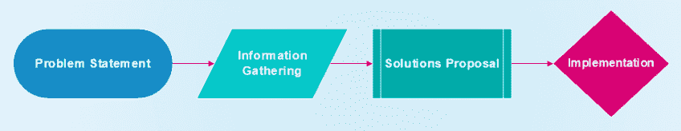
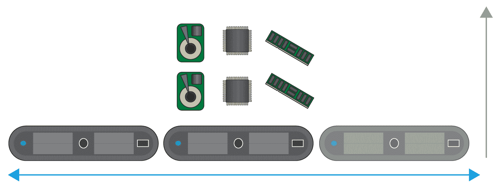

# 一、设计方法论概述

如今，信息技术解决方案需要提高性能和数据可用性，而设计满足这些要求的强大实施是许多信息技术专家每天都要经历的挑战。

在本章中，您将学习基础知识，从在任何类型的环境中构建信息技术解决方案的鸟瞰图，到虚拟化基础架构、裸机，甚至公共云，因为解决方案设计的基本概念适用于任何环境。

您将探索以下主题:

*   定义解决方案设计的各个阶段及其重要性
*   分析问题并提出正确的问题
*   考虑可能的解决方案
*   实施解决方案

充分了解设计解决方案时需要考虑的方面对于项目的成功至关重要，因为这将决定哪些软件、硬件和配置将帮助您实现满足客户需求的理想状态。

# 定义解决方案设计的各个阶段及其重要性

像许多事情一样，设计解决方案是一个循序渐进的过程，不仅涉及:技术方面，也不一定涉及技术方。通常，你会被一个客户经理，项目经理，或者，如果你幸运的话，一个 CTO 雇佣，他了解需求的技术部分。他们正在寻找能够帮助他们向客户交付解决方案的专家。这些请求通常不包含交付解决方案所需的所有信息，但这是了解您的目标的开始。

例如，假设您收到一封来自项目经理的电子邮件，其中包含以下语句。

We require a solution that can sustain at least 10,000 website hits and will stay available during updates as well as survive outages. Our budget is considerably low, so we need to spend as little as possible, with little to no upfront cost. We're also expecting this to gain momentum during the project's life cycle.

从前面的陈述中，你只能大致了解需要什么，但没有给出具体细节。因此，您只知道基本信息:我们需要一个能够维持至少 10，000 次网站点击的解决方案，对于一个设计来说，这还不够好，因为您需要尽可能多的信息来解决客户暴露的问题。在这种情况下，您必须要求尽可能多的细节，以便能够为您的客户提供一套准确的建议，这将是您的客户对项目的第一印象。这一部分至关重要，因为它将帮助您了解您是否理解客户的愿景。

了解您需要为客户提供几种不同的解决方案也很重要，因为客户是决定哪种解决方案最适合他们的业务需求的人。请记住，每种解决方案都有其优缺点。在客户决定走哪条路之后，您将有必要继续实施您的提案，这总是会引发更多挑战。它通常需要一些在最初的**概念验证** ( **概念验证**)中没有考虑到的最终定制调优或更改。

从我们之前的分析中，您可以看到为了实现下图所示的最终交付，您需要遵循的流程的四个明确定义的阶段:

我们可以涵盖更多的阶段和设计方法，但由于它们不在本书的范围内，我们将重点关注这四个一般阶段，以帮助您了解构建解决方案的过程。

# 分析问题并提出正确的问题

得到初始前提后，你需要把它分解成更小的部分，以便理解需要什么。每件作品都会提出不同的问题，您稍后会向客户提问。这些问题将有助于填补您的概念验证的空白，确保您的问题涵盖所有观点的所有业务需求:业务观点、功能观点以及最后的技术观点。跟踪出现的问题和他们将解决的业务需求的一个好方法是有一个检查表，询问问题是从哪个角度提出的，以及解决或回答了什么。

同样重要的是要注意，随着问题成为答案，它们也会带来限制或其他障碍，这些也需要在概念验证阶段解决和提及。客户必须同意他们的意见，并在选择最终解决方案时具有决定性。

从我们前面的例子中，你可以通过将前提分解成观点来分析它。

We require a solution that can sustain at least 10,000 website hits and will stay available during updates as well as survive outages. Our budget is considerably low, so we need to spend as little as possible, with little to no upfront cost. We're also expecting this to gain momentum during the project's life cycle.

# 技术立场

从这个角度来看，我们将分析前提的所有技术方面，即您需要提供解决方案的初始技术要求的任何方面。

我们将按照以下方式进行分析:

*   从前提来看，您可以理解您的客户需要某种能够维持一定网站点击量的解决方案，但您不能确定网络服务器是否已经设置好，以及客户是否只需要负载平衡解决方案。或者，客户可能需要两者，一个 web 服务器，即 NGINX、Apache 或类似的东西，以及负载平衡解决方案。
*   客户提到他们的网站至少有 10，000 次点击，但他们没有提到这些点击是每秒、每天、每周，还是每月都有。
*   您还可以看到，他们需要在更新期间保持可用，并且如果公司停机，能够继续为他们的网站提供服务，但是所有这些说法都非常笼统，因为可用性是以 9s 来衡量的。你的 9 分越多越好(实际上，这是一年中时间的百分比；99%的可用性意味着每年只能有 526 分钟的停机时间)。停电也很难预测，几乎不可能说你永远不会停电，因此，你需要做好规划。万一发生灾难，您的解决方案必须有一个**恢复点目标** ( **RPO** )和一个**恢复时间目标** ( **RTO** )。客户没有提到这一点，了解一家企业能够承受停机的时间是至关重要的。
*   说到预算，这通常是从业务的角度，但技术方面直接受其影响。看起来项目中的预算很紧张，客户希望在他们的解决方案上花费尽可能少的钱，但是他们没有提到确切的数字，而您需要这些数字来适应您的建议。前期成本很少甚至没有？这是什么意思？我们是否正在重新利用现有资源并构建新的解决方案？我们如何在没有前期成本的情况下实施设计？克服低预算或无前期成本(至少在软件方面)的一种方法是利用**开源软件** ( **OSS** )，但这是我们需要问客户的问题。
*   获得动力只能意味着他们预测他们的用户群最终会增长，但是您需要估计他们预测的增长幅度和速度，因为这意味着您必须让解决方案做好纵向或横向扩展的准备。纵向上，通过留出空间来增加资源，最终，如果您需要购买更多的资源，如内存、中央处理器或存储，请考虑企业的采购流程。横向来看，还需要一个采购流程和大量时间将新节点/服务器/虚拟机/容器集成到解决方案中。这些都不包括在前提中，这是至关重要的信息。

这里，我们对水平和垂直缩放进行了比较。水平扩展增加了更多节点，而垂直扩展为现有节点增加了更多资源:

以下是您可以提出来澄清灰色区域的示例问题列表:

*   此解决方案适用于新的/现有的网站或网络服务器吗？
*   当你说 10，000 次点击时，这些是每秒并发还是每天/每周/每月？
*   你对你的用户群有什么估计或当前数据吗？
*   考虑到预算低，我们可以使用 OSS 吗？
*   如果我们使用操作系统，您是否有技术资源来支持该解决方案？
*   您是否有任何类型的更新基础设施，或者版本控制软件已经实施？
*   当您说很少或没有前期成本时，这是否意味着您已经有硬件、资源或基础架构(虚拟或云)可供我们回收和/或重新用于我们的新解决方案？
*   我们有没有可以用来提供高可用性的灾难恢复站点？
*   如果您的用户群增长，这会产生更多的存储需求还是只会产生计算资源？
*   您计划执行任何备份吗？你的备份方案是什么？

从技术角度来看，一旦您开始设计概念验证，将会出现更多基于解决方案中使用的软件或硬件的问题。您需要知道它们如何适合，或者需要什么来适应客户的现有基础架构(如果有)。

# 商业立场

在这里，我们将从业务角度分析该陈述，考虑可能影响我们设计的所有方面:

*   一个主要的需求是性能，因为这影响了解决方案能够支持的点击量。由于这是解决方案的主要目标之一，因此需要对其进行调整以满足业务期望。
*   预算似乎是影响项目设计和范围的主要制约因素。
*   没有提到实际可用的预算。
*   可用性要求会影响业务在发生停机时的反应。由于没有具体的**服务水平协议** ( **SLA** )，这需要澄清以适应业务需求。
*   一个主要问题是前期成本。利用开放源码软件可以大大降低这一成本，因为没有许可费。
*   有人提到，该解决方案需要在维护操作期间保持运行。这可能表明客户愿意为进一步升级或增强而投资维护操作。
*   该声明——我们也预计这将获得动力——表明解决方案所需的资源量将发生变化，从而直接影响其消耗的资金量。

以下是从业务角度澄清疑问时要问的问题:

*   根据性能要求，当性能低于预期基线时，会对业务产生什么影响？
*   这个项目的实际预算是多少？
*   预算是否考虑了维护操作？
*   考虑到可能的计划外停机和维护，您的网站每年到底能停机多长时间？这会影响业务连续性吗？
*   如果发生宕机，应用可以容忍多长时间不接收数据？
*   我们是否有任何类型的数据可以用来估计你的用户群会增长多少？
*   你有采购流程吗？
*   批准购买新硬件或资源需要多长时间？

# 功能观点

从功能的角度来看，您将回顾解决方案的功能方面:

*   你知道客户需要 10，000 次点击，但是什么类型的用户会使用这个网站？
*   您可以看到它需要 10，000 次点击，但是前提没有指定用户将使用它做什么。
*   前提是他们需要解决方案在更新期间可用。由此，我们假设应用将被更新，但是如何更新呢？

为了澄清功能方面的差距，我们可以询问以下信息:

*   什么类型的用户将使用您的应用？
*   你的用户会在你的网站上做什么？
*   该应用多久更新或维护一次？
*   谁将维护和支持该解决方案？
*   这个网站是面向公司内部用户还是外部用户？

需要注意的是，功能观点与业务观点有很大的重叠，因为它们都试图解决相似的问题。

一旦我们收集了所有信息，您就可以构建一个文档来总结您的解决方案的需求；确保您与客户一起完成，并且他们同意完成此解决方案所需的内容。

# 考虑可能的解决方案

一旦在最初前提中出现的所有疑问都被清除，你就可以继续前进，构建一个更详细和具体的陈述，其中包括所有收集到的信息。我们将继续使用我们之前的陈述，假设我们的客户回答了我们之前的所有问题，我们可以构建一个更详细的陈述，如下所示。

We require a new web server for our financial application that can sustain at least 10,000 web hits per second from approximately 2,000 users, alongside another three applications that will consume its data. It will be capable of withstanding maintenance and outages through the use of high-availability implementations with a minimum of four nodes. The budget for the project will be $20,000 for the initial implementation, and the project will utilize OSS, which will lower upfront costs. The solution will be deployed in an existing virtual environment, whose support will be handled by our internal Linux team, and updates will be conducted internally by our own update management solution. The userbase will grow approximately every two months, which is within our procurement process, allowing us to acquire new resources fairly quickly, without creating extensive periods of resource contention. User growth will impact mostly computer resources.

如您所见，这是一个更完整的陈述，您已经可以开始工作了。您知道它将利用现有的虚拟基础架构。开放源码软件是可行的，高可用性也是必需的，它将通过已经存在的更新和版本控制基础设施进行更新，因此，您的新解决方案可能只需要监控代理。

下面是一个非常简单的概述，没有多少可能的设计细节:

在图中，您可以看到它是一个 web 服务器集群，为使用该解决方案的客户端和应用提供高可用性和负载平衡。

由于您已经利用了大量现有基础架构，因此可能的概念验证选项较少，因此这种设计将非常简单。尽管如此，我们可以利用某些变量为客户提供几种不同的选择。例如，对于网络服务器，我们可以有一个 Apache 解决方案和另一个 NGINX 解决方案，或者两者结合，Apache 托管网站，NGINX 提供负载平衡。

# 无线一键通

有了一个完整的陈述和几个已经定义的选项，我们可以继续提供基于一个可能路线的概念验证。

概念验证是展示一个想法或方法的过程，在我们的案例中是一个解决方案，目的是验证给定的功能。此外，它还提供了解决方案在环境中的行为的广泛概述，从而允许进一步的测试能够针对特定的工作负载和用例进行微调。

任何概念验证都有其优点和缺点，但主要的焦点是让客户和架构师探索实际工作环境的解决方案的不同概念。需要注意的是，作为架构师，您对 POC 将用作最终解决方案有很大的影响，但是客户是选择哪些约束和优势更适合其业务的人。

以选择一个 NGINX 作为负载平衡器来为托管应用文件的 Apache web 服务器提供高可用性和性能改进为例，我们可以实现一个具有缩减资源的工作解决方案。我们可以不为最终解决方案部署四个节点，而只部署两个节点来演示负载平衡功能，并通过特意减少其中一个节点来提供高可用性的实际演示。

下面的图表描述了前面的例子:

这不需要设计阶段设想的完整的四节点集群，因为我们没有测试整个解决方案的全部性能。对于性能或负载测试，这可以通过让较少的并发用户为应用提供接近实际的工作负载来实现。虽然拥有更少的用户永远无法为整个实施提供准确的性能数据，但它提供了一个很好的基线，数据可以在以后进行外推，以提供实际性能的近似值。

作为性能测试的一个例子，我们可以拥有四分之一的用户群和一半的资源，而不是让 2000 个用户加载应用。这将大大减少所需的资源量，同时提供足够的数据来分析最终解决方案的性能。

此外，在信息收集阶段，记录不同概念验证的文档是一个好主意，因为如果客户将来想要构建类似的解决方案，它可以作为一个起点。

# 实施解决方案

一旦客户根据他们的业务需求选择了最佳路线，我们就可以开始构建我们的设计。在这个阶段，您将面临不同的障碍，因为在开发或质量保证环境中实施概念验证可能与生产环境不同。在质量保证或开发中有用的东西现在可能会在生产中失败，不同的变量可能会出现；所有这些都只在实现阶段出现，您需要意识到，在最坏的情况下，这可能意味着改变大量的初始设计。

这个阶段需要与客户和客户的环境进行实际操作，因此确保您所做的更改不会影响当前的生产至关重要。与客户合作也很重要，因为这将使他们的 IT 团队熟悉新的解决方案；这样，当签核完成时，他们将熟悉它及其配置。

创建实施指南是此阶段最重要的部分之一，因为它将记录解决方案的每个步骤和每个次要配置。如果将来出现问题，并且支持团队需要知道它是如何配置的，以便能够解决问题，这也将有所帮助。

# 摘要

设计解决方案需要不同的方法。本章介绍了设计阶段的基础知识，以及为什么每个阶段都很重要。

第一阶段是分析设计要解决的问题，同时提出正确的问题。这将有助于定义实际需求，并将范围缩小到真正的业务需求。使用最初的问题陈述将会进一步带来问题，使这个阶段变得极其重要，因为它将防止不必要的来回。

然后，我们考虑了解决已定义问题的可能途径或解决方案。有了前一阶段提出的正确问题，我们应该能够构建几个选项供客户选择，并可以在以后实施概念验证。概念验证有助于客户和架构师了解解决方案在实际工作环境中的表现。通常，概念验证是最终解决方案的缩小版本，使实施和测试更加敏捷。

最后，实施阶段处理项目的实际配置和实践方面。根据概念验证期间的调查结果，可以进行更改以适应每个基础架构的具体情况。通过此阶段交付的文档将有助于协调各方，以确保解决方案按预期实施。

在下一章中，我们将跳到解决一个影响每种实施类型的问题，无论云提供商、软件或设计如何，展示高性能冗余存储的必要性。

# 问题

1.  解决方案设计有哪些阶段？
2.  为什么在设计解决方案时问正确的问题很重要？
3.  为什么我们要提供几种设计选择？
4.  可以问哪些问题来获得有助于设计更好解决方案的信息？
5.  什么是概念验证？
6.  实施阶段会发生什么？
7.  poco 如何帮助最终实施

# 进一步阅读

在随后的章节中，我们将经历为特定问题创建解决方案的过程。由于这些解决方案将在 Linux 中实现，我们推荐阅读*奥利弗·佩兹*T4【https://www . packtpub . com/networking-and-servers/foundation-Linux[的*Linux 基础知识。*](https://www.packtpub.com/networking-and-servers/fundamentals-linux)