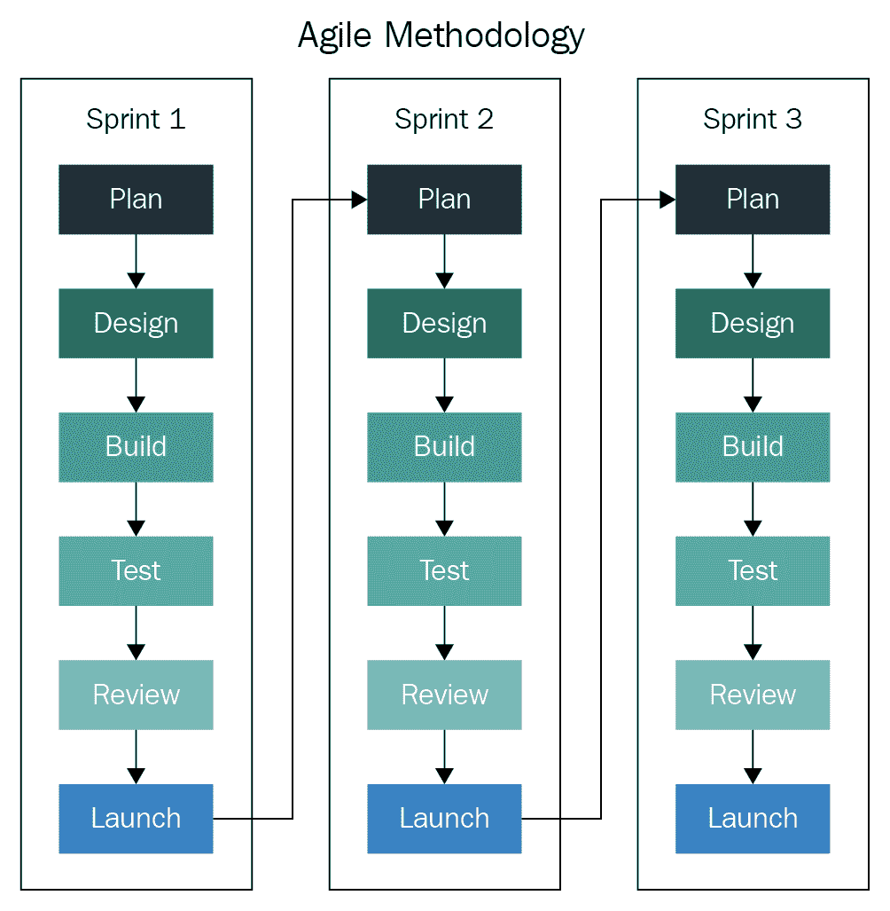
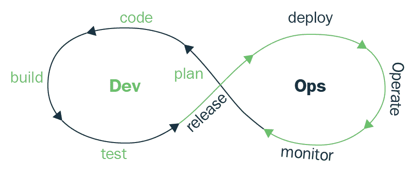

# 十五、设计最佳实践

为了总结这本书，我们的最后一章将讨论不同的最佳实践，你将不得不遵循这些实践来设计一个有弹性和防故障的解决方案。尽管这是本书的最后一章，但它将帮助您作为在迁移到云时需要考虑的事情的起点。

我们将涵盖以下主题的基础知识:

*   迁移到云
*   集装箱设计
*   连续集成管道
*   连续部署管道
*   自动化测试

我们将在本章中涉及的主题和实践非常广泛，我们将给出一个 10，000 英尺的概述。有了这些基础知识，你就可以开始强化你在每个领域的知识，为你的客户做出最终的设计决策。

# 为这个场合设计

在前面的章节中，我们了解了非常具体的解决方案所需的一切。在这里，我们将谈论一般性，你需要遵循的基本规则或建议，或者至少尝试为你创建的每个设计坚持。但是不要被我接下来要说的话迷惑；最佳实践本身并不存在。每个解决方案都有自己的身份、目标和独特的特征。始终努力满足您所处的情况和客户的业务需求。

然而，许多解决方案必须遵守某些行业标准，因为它们可能会处理敏感信息。在这些类型的场景中，我们已经有了一套非常明确的规则和策略，我们的设计必须满足这些规则和策略。这打破了我们的说法，即所有设计都是不同的，但同样，这些是非常具体的行业非常具体的场景。在处理敏感数据时，我们需要遵守以下一些标准:

*   **健康保险便携性和责任法案** ( **HIPAA** )
*   **支付卡行业数据安全标准** ( **PCI-DSS** )
*   **通用数据保护条例** ( **GDPR** )

这些标准无论在本地还是国际都是固定的，并由各自的主管部门进行管理。但并不是所有符合特定解决方案需求的设计模式或方法都像这些一样清晰。

作为一名解决方案架构师，您会发现自己处于许多场景中，这些场景将帮助您扩展产品组合并将其应用于不同的解决方案中。你创造的每一个设计都是最薄弱的环节。当你在设计的时候，总是试着看看你如何打破你的设计:

*   哪里有失败的地方？
*   它的瓶颈在哪里？
*   我的服务器能够处理负载吗？

以下是一些你需要问自己的问题的例子。我们需要塑造自己的思维方式，问自己一个问题*为什么？*更多时候。为什么我们要这样做，或者那样做？对于我们所做的每一个决定，质疑自己是至关重要的。

改变我们的思维方式是我们能做的最好的事情，因为现在的技术比以往任何时候都发展得更快。随着时间的推移，技术可能会发生变化，我们今天实现的东西明天可能会完全无法使用，但我们的思维方式将允许我们从成功所需的各个方面进行调整和分析。

每种情况和环境都会有所不同，但在撰写本文时，我们可以说您将会面对两种主要类型的环境:

*   内部/裸机环境
*   云环境

在本章中，我们将介绍您在这些环境中工作时需要考虑的基本事项。

# 内部环境

Linux 适应性强；它几乎可以在任何地方运行。如果在接下来的几年里，我在割草机上发现了 Linux 内核，我不会感到惊讶。在一个信息技术与我们的日常生活越来越相关的世界里，随着物联网的兴起，Linux 的出现前所未有地激增。因此，作为 Linux 架构师，我们需要准备好几乎用所有东西进行设计。

在内部环境中，我们很可能面临两种情况:

*   裸机服务器
*   **虚拟机** ( **虚拟机**)

这两者将有很大的不同，因为我们将有不同的选择来使我们的解决方案更具弹性。

# 裸机服务器

裸机服务器非常适合需要大量资源才能运行的工作负载。小型工作负载无法高效地放在单个服务器上；例如，一个不能满足大量用户请求的小型网络应用在 64 核 1 TB 内存的物理服务器上没有位置。这是对资源的浪费，也是一个糟糕的经济决策。大多数情况下，该服务器的 90%将完全闲置，浪费了可用于其他用途的宝贵资源。这些类型的应用应该放入一个虚拟机中，或者完全容器化。

在裸机上移动或创建基础架构之前，我们应该了解的第一件事是您为其构建基础架构的应用的资源需求。

需要大量资源进行数据处理和高性能计算的系统将充分利用可用资源。以下解决方案是在裸机服务器上运行的示例:

*   类型 1/类型 2 虚拟机管理程序(**基于内核的虚拟机** ( **KVM** )、 **Linux 容器** ( **LXC** )、XEN)
*   面向 SAP HANA 的 Linux
*   Apache Hadoop
*   面向甲骨文数据库的 Linux
*   用于内存缓存的大型 MongoDB 部署
*   **高性能计算** ( **高性能计算**)

指定其内存需求超过数百 GB 或数百个 CPU 内核的内部应用都可以在裸机服务器上得到更好的服务，在裸机服务器上，RAM/CPU 不会被消耗在任何其他开销进程上，这些开销进程不是您为该服务器设计的工作负载的一部分。

# 虚拟计算机

虚拟机管理程序在裸机服务器上也更好；由于他们将在多个托管虚拟机之间共享资源，因此需要大量资源。需要注意的一点是，虚拟机管理程序的一些资源将被虚拟机管理程序本身消耗，这会在硬件中断和其他操作上产生资源开销。

有时，在构建物理服务器时，我们会非常关注应用所需的 CPU 内核。借助虚拟机管理程序，CPU 时间优先分配给虚拟机，或者优先分配给可用的核心；根据其配置方式，CPU 资源在运行的虚拟机之间共享。相反，内存不会在虚拟机之间共享，我们在实施资源平衡时需要小心。部署一台具有必要的中央处理器内核但有足够的内存来满足我们可能面临的任何竞争时期的服务器是需要考虑的事情。在单个主机上运行数百个虚拟机的情况下，我们可以很快耗尽内存并开始交换，这是我们希望避免的情况。

对于资源调配，我们还需要考虑到，如果我们正在运行一个虚拟机管理程序群集，可能会出现这样的情况，其中一个群集节点需要进行维护或因意外故障而停机。诸如此类的场景是我们应该始终保留一些资源以便能够管理来自虚拟机的额外意外工作负载的原因，由于上述原因，这些工作负载可能会发生故障转移。

在处理虚拟机管理程序时，您必须小心，因为您不会在每个物理主机上只运行一个工作负载。除非您配置了某种类型的关联规则，否则数量和虚拟机本身总是会有所不同。诸如你的网络接口卡支持多少网络带宽之类的事情是最重要的。根据主机虚拟机管理程序的资源量，数十个或数百个虚拟机将共享相同的网络硬件来执行输入/输出。例如，这里决定是否需要 10 GbE 网卡而不是 1 GbE 网卡。

在选择物理主机的网络接口时，还需要考虑您将使用的存储类型；例如，如果您正在考虑一个**网络文件系统** ( **NFS** )解决方案或一个 iSCSI 解决方案，您必须记住，很多时候，它们将共享相同的接口，例如用于常规网络流量的接口。如果您知道您正在设计的基础架构将具有非常拥挤的网络，并且需要良好的存储性能，那么最好有另一种方法，例如选择光纤通道存储区域网络，该网络有自己的专用硬件，仅用于存储 I/O

网络分段对于虚拟化环境、管理流量、应用网络流量和存储网络流量至关重要，这些流量应始终分段。您可以通过多种方式实现这一点，例如为每种目的提供专用网络接口卡或通过 VLAN 标记。每个虚拟机管理程序都有自己的一套工具来实现细分，但背后的想法是一样的。

# 云环境

使用**云环境**为设计信息技术解决方案创造了大量选择。独立于云提供商，您将能够从以下服务中进行选择:

*   **基础设施即服务** ( **IaaS** )
*   **平台即服务** ( **PaaS** )
*   **软件即服务** ( **SaaS** )

您的选择将取决于客户在云架构模型方面的成熟度。但是，在我们讨论云环境的设计模式或最佳实践之前，我们需要先讨论如何将您的内部环境迁移到云，或者如何开始采用云作为客户的基础架构。

# 云之旅

这些迁移策略采用自 Gartner 研究。Gartner 还提出了第五个战略，名为**用 SaaS 取代**。

本节将讨论以下研究论文:

*通过回答五个关键问题设计有效的云计算战略，* Gartner，David W Cearley，2015 年 11 月，2017 年 6 月 23 日更新。

当迁移到云时，我们不必将云视为目的地，而是将其视为旅程。虽然听起来很俗气，但事实就是如此。每个客户的云之路都会不一样；有些路会很容易，有些会很难。这将完全取决于是什么导致客户做出移动的决定，以及他们如何决定移动其基础架构。一些客户可能不仅决定将其基础架构迁移到 IaaS 模式，还会利用这一迁移，将一些工作负载现代化为 PaaS 甚至无服务器模式。不管选择哪一条路，每条路都需要不同程度的准备。典型的转换如下所示:

每一步都需要在要迁移的应用或基础架构上实施更高程度的更改。

我们可以将上述步骤视为从评估要迁移的资产开始的更大旅程的一部分。

让我们更详细地探索迁移的每一步。

# 评估

在这一步中，我们将评估要迁移哪些工作负载。在确定了迁移的候选对象后，我们应该始终对我们的虚拟机或物理服务器进行清点，并计算维护基础架构的总拥有成本。硬件成本、支持维护合同、电费、甚至空间租赁等都在这里发挥作用。这将有助于我们了解在最终迁移到云的过程中，我们将节省多少成本。这些数据对于说服管理层和任何对将基础架构迁移到云提供商的成本效益有任何疑问的 C 级决策者至关重要。

开始迁移的理想场景是寻找不需要迁移整个基础架构就能投入生产的较小应用。几乎没有依赖性的应用非常适合开始您的评估。诸如我们需要一起迁移哪些服务器之类的依赖性，以及诸如端口和 IP 操作范围之类的应用的网络要求都要考虑在内。以下问题将有助于我们为成功迁移做好准备:

*   我的 Linux 发行版是否得到了我要迁移到的云提供商的认可？
*   我运行的是云提供商支持的内核版本吗？
*   我必须安装任何额外的内核模块吗？
*   我的云提供商是否需要在我的操作系统上运行任何类型的代理？

回答了这些问题，我们就可以开始执行实际的迁移了。

# 迁移

将我们的基础架构迁移到云时，有四种基本方法:

*   **提升和移动**
*   **重构**
*   **重启**
*   **重建**

每种方法都将利用不同的服务和云的不同特性。选择使用哪种方法将取决于许多因素，例如您需要多快进行迁移、您愿意付出多大的努力进行迁移，以及您是否希望在迁移时利用迁移并实现工作负载现代化。

# 提升和移动

这种方法实际上是一种主机托管，因为您将把内部物理服务器或虚拟机移动到云提供商的虚拟机中。这种方法是所有方法中最简单快捷的，因为您将在内部移动您的环境和应用。此方法不需要更改代码或重新构建应用。在这里，您只能利用您选择的云提供商的 IaaS 优势。

如果您需要按需增加存储或计算，那么拥有可供您支配的资源的灵活性，以及缺乏硬件维护和管理等，都将是这一模式的优势。

# 重构

借助**重构**，您的应用只需要很少甚至不需要代码更改。通过这种方法，我们可以利用 IaaS 和 PaaS 的混合特性。将三层 web 应用迁移到托管中间件和托管数据库就是这种迁移模型的一个完美例子。

有了托管数据库或托管中间件，我们就不必担心操作系统管理、数据库引擎安装和管理、框架更新、安全补丁，甚至为负载平衡配置额外的实例，因为这些都是为我们准备的。我们只需要上传我们的代码，并选择运行它所需的框架。我们仍然可以运行单片应用，并且只需要很少的代码更改；这种方法的主要目的是通过将管理和配置之类的事情从我们的肩上卸下来进行迁移，从而提高工作负载的敏捷性。

# 重新构建

**迁移时重新构建**确实涉及到我们应用的重大变化，但这一阶段是我们实现业务现代化的阶段。

我们可以发现自己正在分解一个单片应用，并通过利用容器和 Kubernetes 等技术将其分解为微服务。我们将使我们的应用更加可移植、可扩展、敏捷，并准备好通过 DevOps 等方法交付。借助微服务、容器和 DevOps 带来的自动化，您不仅可以更快地将应用交付到生产环境中，还可以更高效地使用应用运行所需的计算资源。

重新构建可能不容易，也不是将工作负载迁移到云的最快方法，但从长远来看，它将为您带来巨大的优势和成本节约。

# 重建

重新构建需要重大的代码更改，但最后一个迁移模型是利用向云的移动，创建所谓的**云原生应用**。

云原生应用是那些利用云服务的应用，例如旨在云上运行的 PaaS 和 SaaS 应用。其中一些甚至可以完全在无服务器计算上运行。无服务器计算是直接在云服务上运行代码，或者使用已经由云提供商提供的应用编程接口或服务。将几个相互消费并为一个共同目标或结果工作的服务组合在一起，我们称之为云原生应用。

迁移到云背后的整个理念是节约:通过迁移到更具弹性和弹性的平台，节约成本，节省维护，节省恢复时间。但我们不会总是自动利用它的所有好处。迁移后，我们仍有一些地形需要覆盖，以便完全优化我们的新云工作负载。

# 最佳化

如果您通过提升和转移来移动您的基础架构，移动可能会很容易，并且该虚拟机上运行的任何工作负载都可能已经投入生产，没有太多更改(如果有的话)。问题是，您的虚拟机仍然与内部环境中的虚拟机大小相同。您仍然让虚拟机使用其实际总计算资源的一小部分。在云中，这是在浪费金钱，因为您要为虚拟机运行的时间付费，但您为这些时间付费的价格是基于该虚拟机的资源总量，无论您是否 100%使用这些资源。

在这个阶段，我们实际上开始执行适当的规模调整和优化我们的基础架构，以实际使用我们真正需要的东西，从而真正利用云的弹性。所有云提供商都有工具和服务，您可以使用它们来监控虚拟机和其他服务的资源消耗。有了这些工具，我们可以以经济高效的方式轻松识别和解决我们的规模需求。

云的弹性不仅允许我们按需调整资源规模，而且在虚拟机管理程序或专用物理服务器中的资源耗尽的情况下，我们不必等待信息技术运营团队分配或购买新硬件。

我们还可以根据我们建立的资源阈值，按需调配额外的虚拟机或服务实例。对这些资源的请求会自动负载平衡到我们的额外实例，因此我们只需在资源争用期间为这些额外资源付费。

优化不仅仅是为了更好的价格而减少虚拟机大小。我们可以优化的其他领域是管理和上市时间。采用像 PaaS 和 SaaS 这样的东西可以帮助我们实现这一点。

一旦我们的应用在云上的虚拟机上运行，我们就可以轻松地开始过渡到这些更受管理的服务。托管服务帮助我们忘记了操作系统维护或中间件配置，我们的开发人员可以花更多的时间实际开发和部署应用，而不是与运营团队就库需要的更新进行斗争，以便能够运行最新版本的生产应用，这最终会使我们更快地上市，并减少管理或操作系统支持合同上花费的金钱和时间。

更快的上市时间、更少的管理以及运营和开发之间更少的冲突是 DevOps 的全部意义。我们已经在迁移阶段的几个阶段提到了 DevOps，但是让我们更深入地了解什么是 DevOps，以及它试图在更近的层次上实现什么。

# DevOps

综合来看，DevOps 是开发和运营的结合。正是这两个信息技术团队——开发人员和系统管理员——之间的联合和协作，使开发运维成为可能。注意我们说的协作*；*要明白协作是 DevOps 的核心。DevOps 背后没有权威，比如 scrum 框架就没有权威。相反，它没有标准，但它遵循这两个群体之间的文化交流所产生的一套实践，以敏捷方法实现更短的开发周期和更高的部署频率。

您会经常看到术语 DevOps 以不同的方式被误用，例如:

*   **职位(DevOps 工程师)**:DevOps 的本质是跨运营和开发团队的协作，因此 DevOps 不是一个做 devo PS 的职位或特定团队。
*   **工具集**:用来帮助实现 DevOps 背后目标的工具也很混乱。Kubernetes、Docker 和 Jenkins 都经常与 DevOps 混淆，但它们只是达到目的的手段。
*   **标准**:正如我们之前提到的，DevOps 运动没有任何权威来规范它的实践和流程；正是这些人实施并遵循一套基本的实践，并使其适应自己的业务需求。

我们现在知道 DevOps 是一种文化运动，它给我们带来了更频繁的开发周期、频率以及运营和开发之间的集成。现在，让我们了解采用 DevOps 的好处背后的问题。

# 整体瀑布

开发软件应用的传统方法被称为**瀑布**。瀑布是做软件的线性顺序方式；基本上，你只朝一个方向走。它被制造业和建筑业的软件工程所采用。瀑布模型的步骤如下:

1.  要求
2.  设计
3.  履行
4.  确认
5.  保持

主要的问题是，由于这种方法是为制造和建筑而发明的，所以它一点也不敏捷。在这些行业中，你面临的每一个变化或每一个问题都可能让你付出很多，所以在进入下一阶段之前，所有的预防措施都必须考虑在内。因此，每个阶段都需要相当长的时间，因此上市时间大大减少。

使用这种方法，甚至在开始创建应用之前，开发人员就必须设计所有的特性，甚至在编写一行代码之前，就要花费时间进行交谈和规划。这些类型的场景对这种方法的起源很有意义，因为如果你正在建造摩天大楼或住宅，你甚至在开始建造之前就想知道它将如何设计和构造。在软件开发中，你越快得到反馈，你就能越快适应并做出必要的改变来满足客户的需求。使用瀑布，直到最后才提供反馈，这时产品几乎准备好了，变更更难实现。

瀑布本身是单一的和庞大的，尽管我们有不同的团队在开发产品的不同特性，最终所有这些特性被编译在一起，以交付一个版本的单个大实例。对于这种类型的单块，如果有一个**质量保证** ( **QA** )团队，他们必须测试该版本的所有特性。这需要花费大量时间，甚至会增加产品的上市时间。最坏的情况是需要一个改变，或者一个错误通过质量保证进入生产。回滚将意味着包含所有功能的完整版本，而不仅仅是包含 bug 的版本，这给大型版本带来了很大的风险。

# 整体问题的敏捷解决方案

有了瀑布，我们意识到我们认为有用的东西在安装阶段没有按计划工作，甚至在后期的生产阶段也没有。执行这些改变意味着一大堆步骤，而航向修正是缓慢而痛苦的。

软件发展很快，我们客户的需求可能会在设计过程中发生变化。这就是为什么我们需要一种比瀑布更灵活的方法。我们越快获得反馈，就能越快适应并实现客户的确切期望。

这正是**敏捷**方法论的目的。敏捷寻求在多个版本中交付软件，每个版本都要经历一系列测试和反馈，以便更快地获得软件，并以更快、更敏捷的方式进行更改和路线修正。

敏捷是一个游戏规则的改变者，但是它在**操作**和**开发者**之间产生了冲突。

如果由不同的工程师执行部署，更频繁地部署版本可能是不标准化的，并且每次都是不同的。假设你晚上有一个部署。如果早上部署的人是与执行最后一次部署的工程师不同的工程师，那么他们可能有完全不同的方式将代码部署到生产中。这些类型的东西会产生差异，并可能导致问题。例如，如果发生了什么事情，需要回滚，回滚的另一个人可能不知道部署中采取了什么步骤来回滚更改。

在这些版本中，系统可用性可能会受到不可预测的影响。运营工程师以他们管理的系统的稳定性来衡量，保持这种稳定性符合他们的利益。他们希望避免对生产进行不可预测的更改。另一方面，开发人员是通过他们将新的变更、特性和版本投入生产的速度来衡量的。你可以看到这两支球队的目标完全相反，他们几乎必须互相战斗才能实现目标。

跨团队的不同目标将每个团队与另一个团队隔离开来。这就形成了孤岛，将问题或应用抛出了围墙。这发展成一种非协作的工作环境，每个人都互相指责，事情进展得更慢，而不是解决问题。

# 连续培养 CI/CD

到目前为止，我觉得您已经注意到，我们还没有讨论任何工具来实现 DevOps。这是因为工具不会解决所有这些类型的问题。他们将帮助您和您的客户加强 DevOps 文化，但他们不是使 DevOps 成为可能的因素。

交付产品之前的标准化和测试对于敏捷和开发运维来说至关重要，工具将帮助我们实现这两个目标。让我们来看看敏捷工作流和 DevOps 工作流:

下面是敏捷工作流的一个例子:

以下是它与 DevOps 的对比:

很明显，两者是携手并进的，它们相互重叠，因为它们寻求相同的目标。DevOps 有额外的步骤，如操作和监控，这些步骤在代码部署后进行。这些步骤非常不言自明；monitor 包括监视我们在生产中的应用，检查它的行为是否存在任何错误，是否正在使用分配给它的所有资源。在部署硬件、虚拟机或平台即服务的地方进行操作。

**持续部署** ( **CD** )和**持续集成** ( **CI** )背后的理念是为我们带来标准化，以及我们确保变更和发布以尽可能少的失败尽快投入生产的手段。如果发生故障，我们也可以快速轻松地恢复。CI/CD 的全部意义在于自动化手动过程，许多公司仍然手动编译版本，并且仍然向运营部门发送带有二进制文件的电子邮件以及如何部署其代码的说明。为了实现 CI/CD，我们有工具可以帮助我们自动化整个构建、测试、部署和发布周期。

典型的 CI/CD 管道由提交到 Git 存储库触发，然后触发自动构建过程，该过程通常生成工件或放置，从而触发应用的自动测试和自动部署。

让我们来看看一些不同的开源工具，并简要解释每个工具以及它属于 DevOps 周期的哪个阶段。

这远不是一个广泛的列表，解释只是对其目的的简要总结:

*   **代码**:
    *   **Git** :一个版本控制系统，允许开发人员拥有他们代码的分布式存储库，并跟踪整个开发周期的变化。
    *   **GitHub、GitLab、Bitbucket** :这三个是 Git 类型的存储库，而不是工具。然而，它们值得一提，因为它们是行业中使用最多的 Git 公共和私有存储库。
    *   **阿帕奇颠覆** ( **SVN** ):这是另一个版本控制系统。尽管它不再像 Git 发布以来那样受欢迎，但值得一提的是，它确实存在，因为您可能会在遗留环境中遇到它。
*   **建造**:
    *   **Docker** : Docker，正如我们在[第 14 章](14.html)、*让你的手咸起来*中所讨论的，是一个你可以用来构建你的容器图像的工具，与你的应用是用哪种语言编写的无关。Docker 在引擎盖下使用 **Buildkit** ，也可以作为独立产品来构建 docker 镜像。
    *   **Apache ant** :这个工具是第一个取代著名的为 Java 应用制作的 Unix 构建二进制的工具。它使用`xml`来定义构建的步骤。这个工具主要是针对 Java 应用的。
    *   **Apache Maven** : Apache Maven 也是另一个 Java 构建工具，但是它是来修复 Apache Ant 缺乏的依赖管理等问题的。
    *   **Grade le**:Grade 是在 Apache Ant 和 Apache Maven 的基础上构建的，但是 Grade le 使用它自己的基于 Groovy 的特定语言来定义所需的步骤。Gradle 是最模块化的，大部分功能都是通过插件添加的。
    *   **咕噜**:这是 Ant 或者 Maven 的 JavaScript 的等价物；它自动化并运行诸如林挺、单元测试、缩小和编译等任务。Grunt 是高度模块化的，因为有成千上万的插件可用。
*   **测试**:
    *   **Selenium** :这主要是一个 web 应用测试器，可以在大多数现代 web 浏览器上运行。使用 Selenium，您不一定需要知道测试编程语言，因为它提供了 IDE 和使用几种最流行的编程语言的选项。
    *   **Apache JMeter** :这基本上是一个负载性能工具，在服务器上生成一个重载来测试静态和动态内容，这样就可以分析它在不同负载类型下的性能。
    *   **Appium** :另一方面，Appium 不仅测试 web 应用，还可以对移动和桌面应用进行测试。

*   **发布、部署、管理、编排、操作**:
    *   **詹金斯**:这可能是 DevOps 文化中使用最多的工具。Jenkins 是一个自动化服务器，通过调用构建和发布过程自动化的触发器，以及在管道中配置的任何自动化测试，使所有步骤成为可能。
    *   **Ansible** :这主要是一个配置管理工具，但是它也可以通过模块化帮助我们发布我们的应用，并且提供了一种简单的方法来开发您自己的行动手册，以在一组服务器上运行。
    *   **Puppet** :这是另一个配置管理工具，帮助我们在环境服务器上维护配置和管理软件包补丁安装。
    *   **Helm** :把 Helm 看做 Kubernetes 的`yum`或者`apt`:它本身是无法实现任何部署流程的自动化的，但是在 Jenkins 等工具的帮助下，你可以用它把自己的自定义图表部署到 Kubernetes 上，如果需要回滚的话还可以保留一个发布历史。

*   **监控**:
    *   **Nagios** :这是经典的集中监控工具，可以监控从系统性能到服务状态等等的一切。
    *   **普罗米修斯**:云原生计算基金会旗下项目。它允许我们创建自己的指标和警报。
    *   **Fluentbit** :这允许你收集多个日志和/或数据，并将其发送到多个目的地进行日志收集或处理。

# 摘要

这是最后一章，我们总结了设计解决方案时的一些注意事项。在这一章中，我们讲述了在处理不同场景时我们应该想到的。

知道我们将在哪里以及如何部署我们的解决方案，有助于我们了解可能会有什么样的需求；例如，某些行业将有不容忽视的硬性要求，如 HIPAA、PCI 和 GDPR。

然后，我们讨论了部署内部部署解决方案，不同的工作负载如何更好地适用于裸机，以及在虚拟机中实施时需要考虑的事项。

我们谈到了迁移到云并不像点击门户和等待那么简单，而是一段旅程，因为考虑到云中可用的选项过多，它允许工作负载现代化。

此外，我们提到了迁移现有工作负载的不同方法，例如提升和转移、重构、重新构建和重建。

最后，我们描述了 DevOps 如何通过统一开发和运营方面来帮助塑造行业，以及这与 CI/CD 如何改变软件部署和使用方式的关系。

# 问题

1.  什么是 HIPAA？
2.  哪些工作负载更适合在裸机上运行？
3.  虚拟机管理程序应该在裸机上运行吗？
4.  虚拟机共享资源吗？
5.  什么是网络细分？
6.  什么是升降移？
7.  什么是重构？
8.  什么是重新架构？

# 进一步阅读

**大型计算机程序的制作**:[http://sunset . USC . edu/csse/TECHRPTS/1983/uscse 83-501/uscse 83-501 . pdf](http://sunset.usc.edu/csse/TECHRPTS/1983/usccse83-501/usccse83-501.pdf)

**管理大型软件系统的开发**:[http://www-SCF . USC . edu/~ csci 201/讲座/讲师 11/royce1970.pdf](http://www-scf.usc.edu/~csci201/lectures/Lecture11/royce1970.pdf)

**蔚蓝迁徙中心**:[https://azure.microsoft.com/en-gb/migration/get-started/](https://azure.microsoft.com/en-gb/migration/get-started/)

**将数据中心迁移到云 iaas 的 3 次旅程**:[https://www . Gartner . com/smarterwith Gartner/3-将数据中心迁移到云 IaaS 的旅程/](https://www.gartner.com/smarterwithgartner/3-journeys-for-migrating-a-data-center-to-cloud-iaas/)