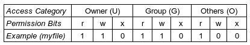
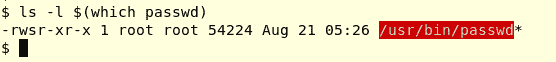

# 七、进程凭证

在本章和下一章中，读者将学习有关流程凭证和功能的概念和实践。 本章除了对 Linux 中的应用开发具有实际意义外，就其本质而言，本章深入探讨了一个经常被忽视但非常关键的方面：安全性。本章和下一章的内容非常相关。

我们将这一关键领域分为两大部分，每一部分都是本书的一个章节：

*   本章对传统风格的 Unix 权限模型进行了较为详细的讨论，并展示了在不需要 root 密码的情况下以 root 权限运行程序的技术。
*   在[章](08.html)和*过程能力*中，更详细地讨论了现代方法 POSIX 能力模型。

我们将试图清楚地向读者展示，虽然了解传统机制及其操作方式很重要，但了解现代安全方法也很重要。 无论你怎么看，安全都是至高无上的，特别是在这些日子里。 Linux 在各种设备上运行的出现-从微型物联网和嵌入式设备到移动设备、台式机、服务器和超级计算平台-使安全成为所有利益相关者的主要担忧。 因此，在开发软件时应该使用现代功能方法。

在本章中，我们将广泛介绍传统的 Unix 权限模型，它到底是什么，以及它如何提供安全性和健壮性。 一点黑客技巧也总是很有趣的！

您将了解以下内容：

*   运行中的 Unix 用户权限模型
*   真实有效的身份证
*   用于查询和设置进程凭证的强大系统调用
*   黑客尝试(一点点)
*   `sudo(8)`*和*的实际工作方式
*   保存的设置 ID
*   关于安全的重要思想

在此过程中，有几个示例允许您以实际操作的方式尝试概念，以真正理解它们。

# 传统的 Unix 权限模型

从 1970 年初开始，Unix OS 就像往常一样拥有一个优雅而强大的系统，用于管理系统上共享对象的安全性。 这些对象包括文件和目录-可能是人们最常想到的。 文件、目录和符号链接是文件系统对象；还有其他几个对象，包括内存对象(任务、管道、共享内存区域、消息队列、信号量、键、套接字)和伪文件系统(proc、sysfs、debugfs、cgroupfs 等)及其对象。 重点是所有这些对象都是以某种方式共享的，因此它们需要某种保护机制，以保护它们不被滥用；这种机制被称为 Unix 权限模型。

您可能不希望其他人读取、写入和删除您的文件；Unix 的权限模型使这在不同的粒度级别成为可能；同样，将文件和目录作为公共目标，您可以在目录级别设置权限，或者实际上在该目录中的每个文件(和目录)上设置权限。

为了说明这一点，让我们考虑一个典型的共享对象-磁盘上的文件。 让我们创建一个名为`myfile`的文件：

```sh
$ cat > myfile
This is my file.
It has a few lines of not
terribly exciting content.

A blank line too! WOW.

You get it...
Ok fine, a useful line: we shall keep this file in the book's git repo.
Bye.
$ ls -l myfile
-rw-rw-r-- 1 seawolf seawolf 186 Feb 17 13:15 myfile
$
```

显示的所有输出都来自 Ubuntu 17.10x86_64Linux 系统；用户以`seawolf`*身份登录。*

# 用户级别的权限

前面，我们对前一个文件`myfile`进行了快速的`ls -l`操作；当然，第一个字符`-`表明它是一个常规文件；接下来的 9 个字符`rw-rw-r--`是文件权限。 如果您还记得，这些权限分为三组-**所有者**(**U**)、**组**(**G**)和**其他**(**O**)(或公共)权限，每个权限包含三个权限位：**r**、**w**和**x[T21。 此表汇总了以下信息：**



解读后可以看到，文件的所有者可以对其进行读写，群组成员也可以，但其他人(不是所有者且不属于该文件所属的组)只能对`myfile`执行读操作。 那是保安！

因此，让我们举个例子：我们尝试使用`echo`命令写入文件`myfile`：

```sh
echo "I can append this string" >> myfile
```

它会奏效吗？ 好的，答案是，这取决于：如果文件的所有者或组成员(在本例中为 Seawolf)正在运行 ECHO(1)进程，则相应地，访问类别 I 将被设置为 U 或 G，并且，是的，它将成功(因为 U|G 确实具有对该文件的写访问权限)。 但是，如果进程的访问类别是 Other 或 Public，则它将失败。

# Unix 的权限模型如何工作

关于这个主题，需要理解的一个非常重要的点是：正在处理的共享对象(这里是`myfile`文件)和对对象执行某些访问(Rwx)的进程(这里是回显进程)都很重要。 更准确地说，它们与权限相关的属性很重要。 下一次讨论将有助于澄清这一点。

让我们一步一步来考虑这一点：

1.  登录名为`seawolf`的用户登录到系统。
2.  如果成功，系统将生成一个 shell；用户现在处于 shell 提示。 (这里，我们考虑登录到**命令行界面**(**CLI**)控制台的传统情况，而不是 GUI 环境。)

每个用户都有一条记录；它存储在`/etc/passwd`文件中。 让我们`grep`该用户的文件：

```sh
$ grep seawolf /etc/passwd
seawolf:x:1000:1000:Seawolf,,,:/home/seawolf:/bin/bash
$ 
```

一般情况下，只需执行以下操作：`grep $LOGNAME /etc/passwd`

`passwd`条目是具有七列的行，这些列是冒号分隔的字段；它们如下所示：

```sh
username:<passwd>:UID:GID:descriptive_name:home_dir:program
```

有几个字段需要一些解释：

*   第二个字段“`<passwd>`”在现代 Linux 系统上总是显示为`x`字段；这是出于安全考虑。 即使是加密的密码也永远不会显示(黑客很有可能通过暴力破解算法破解它；它位于一个名为`/etc/shadow`的纯 root 文件中)。
*   第三和第四个字段是用户的**用户标识符**(**UID**)和**组标识符**(**GID**)。
*   第七个字段是在成功登录时运行的程序；通常是 shell(如上所述)，但也可以是任何内容。

To programmatically query `/etc/passwd`, check out the `getpwnam[_r](3)`, `getpwent[_r](3)` library layer APIs.

最后一点很关键：系统会为登录的用户生成一个 shell。 外壳是 CLI 环境中人类用户和系统之间的界面**用户**和界面**界面**界面(UI)。 毕竟，这是一个过程；在 Linux 上，bash 通常是我们使用的 shell。 您登录时收到的 Shell 称为登录 Shell。 这一点很重要，因为它的权限决定了它启动的所有进程的权限-实际上，您在系统上工作时拥有的权限是从您的登录 shell 派生出来的。

让我们来看看我们的 shell 进程：

```sh
$ ps
  PID  TTY          TIME  CMD
13833 pts/5     00:00:00  bash
30500 pts/5     00:00:00  ps
$ 
```

就是这样；我们的 bash 进程的**进程标识符为**(**PID**-标识进程的唯一整数)13833。 现在，该进程还有其他与其相关联的属性；就我们当前的目的而言，关键属性是进程**用户标识符**(**UID**)和进程**组标识符**(**GID**)。

是否可以查找进程的这些 UID、GID 值？ 让我们用`id(1)`命令来尝试一下：

```sh
$ id
uid=1000(seawolf) gid=1000(seawolf) groups=1000(seawolf),4(adm),24(cdrom),27(sudo),[...]
$ 
```

`id(1)`命令显示进程 UID 为 1000，进程 GID 也恰好为 1000。 (用户名为`seawolf`，此用户属于多个组。)。 在前面的示例中，我们以用户`seawolf`的身份登录；`id`命令反映了这一事实。 请注意，我们现在从此 Shell 运行的每个进程都将继承此用户帐户的权限，也就是说，它将使用与登录 Shell 相同的 UID 和 GID 运行！

您可能会合理地问：进程从哪里获得其 UID 和 GID 值？ 想想看：我们以用户`seawolf`身份登录，该帐户的`/etc/passwd`条目的第三个和第四个字段就是进程 UID 和 GID 的来源。

因此，每次我们从该 shell 运行进程时，该进程都将使用 UID 1000 和 GID 1000 运行。

我们想了解操作系统究竟是如何检查我们是否可以执行如下操作的：

```sh
echo "I can append this string" >> myfile
```

因此，这里的关键问题是：在运行时，当前面的回显进程试图写入`myfile`文件时，内核究竟如何确定是否允许写访问。 为此，操作系统必须确定以下事项：

*   有问题的文件的所有权和组成员身份是什么？
*   尝试访问的进程在哪种访问类别下运行(例如，它是 U|G|O)吗？
*   对于该访问类别，权限位掩码是否允许访问？

回答第一个问题：如果文件的所有权和组成员身份信息(以及关于文件的更多信息)作为文件系统的关键数据结构的属性携带-**信息节点**(**索引节点**)。 Inode 数据结构是按文件的结构，位于内核(文件系统；第一次访问文件时将其读入内存)中。 用户空间当然可以通过系统调用访问此信息。 因此，文件所有者 ID 存储在 inode 中-我们就称其为`file_UID`。 同样，`file_GID`也将出现在 inode 对象中。

For the curious reader: you can yourself query any file object's inode by using the powerful `stat(2)` system call. (As usual, look up its man page). In fact, we have used `stat(2)` in [Appendix A](https://www.packtpub.com/sites/default/files/downloads/File_IO_Essentials.pdf), *File I/O Essentials*.

# 确定访问类别

前面提出的第二个问题是：它将在什么访问类别下运行？ 是需要回答的重要问题。

访问类别将是**所有者**(**U**)、**组**(**G**)或**其他**(**O**)；它们是互斥的。 操作系统用来确定访问类别的算法如下所示：

```sh
if process_UID == file_UID
then
     access_category = U
else if process_GID == file_GID
then
     access_category = G
else
     access_category = O
fi
```

实际上，它稍微复杂一些：一个流程可以同时属于几个组。 因此，在权限检查时，内核检查所有组；如果进程属于其中任何一个组，则访问类别设置为 G。

最后，对于该访问类别，检查权限位掩码(Rwx)；如果设置了相关位，则允许进程执行该操作；如果未设置相关位，则不允许执行该操作。

让我们来看一下下面的命令：

```sh
$ ls -l myfile
-rw-rw-r-- 1 seawolf seawolf 186 Feb 17 13:15 myfile
$ 
```

另一种澄清方法是，`stat(1)`命令(当然是`stat(2)`系统调用的包装器)向我们显示文件`myfile`的 inode 内容，如下所示：

```sh
$ stat myfile 
  File: myfile
  Size: 186           Blocks: 8          IO Block: 4096   regular file
Device: 801h/2049d    Inode: 1182119     Links: 1
Access: (0664/-rw-rw-r--)  Uid: ( 1000/ seawolf)   Gid: ( 1000/ seawolf)
Access: 2018-02-17 13:15:52.818556856 +0530
Modify: 2018-02-17 13:15:52.818556856 +0530
Change: 2018-02-17 13:15:52.974558288 +0530
 Birth: -
$ 
```

显然，我们突出显示了`file_UID == 1000`和`file_GID == 1000`。

在我们的 ECHO 示例中，我们发现根据登录人员、组成员身份和文件权限，可能会出现几种情况。

因此，为了正确理解这一点，让我们设置几个场景(从现在开始，我们只将进程 UID 称为`UID`，将进程 GID 值称为`GID`，而不是将进程 GID 值称为`process_UID|GID`)：

*   **用户以 Seawolf**：[UID 1000，GID 1000]登录
*   **用户以 mewolf**身份登录：[UID 2000，GID 1000]
*   **用户以 CATO**身份登录：[UID 3000，GID 3000]
*   **用户以 groupy**身份登录：[UID 4000，GID 3000，GID 2000，GID 1000]

登录后，用户尝试执行以下操作：

```sh
echo "I can append this string" >> <path/to/>myfile
```

会发生什么事？ 哪个可以工作(允许允许)，哪个不能？ 使用前面的算法遍历前面的场景，以确定关键访问类别，您将看到；下表汇总了这些案例：

| **案例编号** | **以**身份登录 | **(进程)**
**UID** | **(进程)**
**GID** | **访问类别**
**(U&#124;G&#124;O)** | ==同步，由 Elderman 更正==@ELDER_MAN | **是否允许写入？** |
| 1. | 海狼 | 1000 | 1000 | 英语字母表中第二十一个字母 / U 字形 / 铀 | `r**w**-` | 英语字母表中第二十五个字母 / Y 字形 / Y 项 |
| 2 个 | 梅沃夫 | 2000 年 | 1000 | 英语字母表中第七个字母 / 第七列 | `r**w**-` | 英语字母表中第二十五个字母 / Y 字形 / Y 项 |
| 3. | 凯托 （人名） | 3000 | 3000 | 英语字母表中第十五个字母 / O 字形圆圈 / 零 | `r**-**-` | （化学元素）氮 |
| 4. | 成群结队 | 四千 | 4000，3000，
2000，1000 | 英语字母表中第七个字母 / 第七列 | `r**w**-` | 英语字母表中第二十五个字母 / Y 字形 / Y 项 |

前面的描述仍然有点过于简单化，但这是一个很好的起点。 实际上，在引擎盖下发生的事情还有很多；下面几节将详细介绍这一点。

在此之前，我们将稍微绕道而行：`chmod(1)`命令(当然会变成`chmod(2)`系统调用)用于设置对象上的权限。 因此，如果我们执行以下操作：`chmod g-w myfile`删除组类别的写权限，则前一个表将更改(获得 G 访问权限的行现在将不允许写入)。

Here is an interesting observation: processes with the craved-for root access are those that have their `UID = 0`; it's a special value! 

Next, to be pedantic, actually the echo command can run in two distinct ways: one, as a process when the binary executable (usually `/bin/echo`) runs, and two, as a built in shell command; in other words, there is no new process, the shell process itself—typically `bash` —runs it.

# 真实有效的身份证

我们从上一节了解到，正在处理的共享对象(这里是文件 myfile)和正在对该对象执行某些访问(Rwx)的进程(这里是 echo 进程)都与权限有关。

让我们更深入地研究与权限模型相关的流程属性。 到目前为止，我们已经了解到每个进程都与一个 UID 和一个 GID 相关联，从而允许内核运行其内部算法并确定是否应该允许访问资源(或对象)。

如果我们更深入地观察，我们会发现每个进程 UID 实际上不是单个整数值，而是两个值：

*   **真实用户 ID**(**RUID**)
*   **有效用户 ID**(**EUID**)

类似地，组信息不是一个整数 GID 值，而是两个整数：

*   **实际组 ID**(**RGID**)
*   **有效组 ID**(**EGID**)

因此，就权限而言，每个进程都有四个与其关联的整数值：
{RUID，EUID，RGID，EGID}；这些称为**进程凭证**。

Pedantically speaking, process credentials also encompass several other process attributes—the process PID, the PPID, PGID, session ID, and the real and effective user and group IDs. In our discussions, for clarity, we restrict their meaning to the last of these—real and effective user and group IDs.

但它们到底是什么意思呢？

每个进程都必须在某个人的所有权和组成员身份下运行；这个人当然是登录者的用户和组 ID。

真实 ID 是与登录的用户相关联的原始值；实际上，它们只不过是该用户的`/etc/passwd`记录中的 UID：GID 对。 回想一下，`id(1)`命令正好显示以下信息：

```sh
$ id
uid=1000(seawolf) gid=1000(seawolf) groups=1000(seawolf),4(adm), [...]
$ 
```

显示的`uid`和`gid`值是从 Seawolf 的`/etc/passwd`记录中获取的。 实际上，`uid/gid`值分别成为正在运行的进程的 RUID/RGID 值！

实数反映了您最初的身份-您的登录帐户信息以整数标识符的形式出现。 另一种说法是：真实的数字反映了谁拥有这个过程。

那么有效价值呢？

有效值是通知操作系统有效地(此时)了解进程在哪些权限(用户和组)下运行。 以下是几个关键点：

*   执行权限检查时，操作系统使用进程的有效值，而不是实际(原始)值。
*   `EUID = 0`是操作系统实际检查的内容，以确定进程是否具有 root 权限。

默认情况下如下所示：

*   EUID=RUID
*   EGID=RGID

这意味着，对于前面的示例，以下情况是正确的：

```sh
{RUID, EUID, RGID, EGID} = {1000, 1000, 1000, 1000}
```

是。 这就提出了一个问题(您不这样认为吗？)：如果真实和有效的 ID 是相同的，那么我们为什么需要四个数字呢？ 两个就行了，对吧？

嗯，事情是这样的：它们通常(默认情况下)是相同的，但它们可以改变。 让我们看看这是如何发生的。

Again, here is a pedantic note: on Linux, the permission checking on filesystem operations is predicated on yet another process credential—the filesystem UID (or fsuid; and, analogously, the fsgid). However, it's always the case that the fsuid/fsgid pair shadow the EUID/EGID pair of credentials—thereby, effectively rendering them the same. That's why in our discussion we ignore the `fs[u|g]id` and focus on the usual real and effective user and group IDs.

不过，在此之前，请考虑以下场景：用户已登录，并且在 shell 上；他们的权限是什么？ 好的，只需运行`id(1)`命令程序；输出将显示 UID 和 GID，我们现在知道它们实际上是具有相同值的{RUID，EUID}和{RGID，EGID}对。

为了便于阅读，让我们冒昧地将 GID 值从 1000 更改为(比方说)2000。 现在，如果值是 UID=1000 和 GID=2000，并且用户现在运行 vi 编辑器，那么现在的情况是这样的，请参考给定表：进程凭证-正常情况：

| **进程凭证**
**/进程** | **快速** | **EUID** | **RGID** | **EGID** |
| 猛击 / 怒殴 | 1000 | 1000 | 2000 年 | 2000 年 |
| 美国维尔京岛之邮递区号 / 垂直距离 | 1000 | 1000 | 2000 年 | 2000 年 |

# 一个难题--普通用户如何更改他们的密码？

假设您以`seawolf`身份登录。 出于安全原因，您需要更新您的弱密码(`hello123`，哎呀！)。 变得强大而安全。 我们知道密码存储在`/etc/passwd`文件中。 嗯，我们也看到在现代的 UNIX(当然包括 Linux)上，为了更好的安全性，它被*屏蔽了*：它实际上存储在一个名为`/etc/shadow`的文件中。 让我们来看看：

```sh
$ ls -l /etc/shadow
-rw-r----- 1 root shadow 891 Jun  1  2017 /etc/shadow
$ 
```

(请记住，我们使用的是 Ubuntu 17.10x86_64 系统；我们经常指出这一点，因为确切的输出可能因不同的发行版而异，并且如果安装了内核安全机制，如 SELinux)。

正如突出显示的那样，您可以看到文件所有者是 root，组成员身份是 SHADOW，UGO 的权限位掩码是`[rw-][r--][---]`。 这意味着：

*   所有者(Root)可以执行读/写操作
*   组(卷影)可以执行只读操作
*   其他人不能对该文件执行任何操作

您可能还知道用于更改密码的实用程序名为`passwd(1)`(当然，它是一个二进制可执行程序，不要与`/etc/passwd(5)`数据库混淆)。

因此，想想看，我们这里有一个难题：要更改密码，您需要对`/etc/shadow`具有写权限，但显然，只有 root 才有对`/etc/shadow`的写权限。 那么，它是如何工作的呢？ (我们知道它是有效的。 您是以普通用户身份登录的，而不是 root 用户。 您可以使用`passwd(1)`实用程序更改密码-尝试一下并查看。)。 所以，这是一个很好的问题。

线索在于二进制可执行实用程序本身-`passwd`。 让我们检查一下；首先，磁盘上的实用程序在哪里？ 请参阅以下代码：

```sh
$ which passwd
/usr/bin/passwd
$ 
```

让我们更深入地挖掘一下-引用前面的命令并长长地列出它：



你能发现什么不寻常的地方吗？

它是所有者执行位：它不是你可能想象的`x`，而是一个`s`！ (实际上，这就是长清单前面的可执行文件名称出现红色的原因。)

这是一个特殊的权限位：对于二进制可执行文件，当所有者的执行位中有`s`时，它被称为 setuid 或二进制。 这意味着，每当执行 setuid 命令程序时，生成的进程的**有效用户 ID**(**EUID**)将更改(从默认值：原始 RUID 值)变为与二进制可执行文件的所有者相等；在前面的示例中，EUID 将成为 root(因为`/usr/bin/passwd`文件由 root 所有)。

现在，我们使用以下关于 setuid passwd 可执行文件的新信息重新绘制前面的表(进程凭证-正常情况)：

| **进程凭证**
**/进程** | **快速** | **EUID** | **RGID** | **EGID** |
| 猛击 / 怒殴 | 1000 | 1000 | 2000 年 | 2000 年 |
| 美国维尔京岛之邮递区号 / 垂直距离 | 1000 | 1000 | 2000 年 | 2000 年 |
| /usr/bin/passwd | 1000 | 0 | 2000 年 | 2000 年 |

Table: process credentials - setuid-root case (third row)

因此，这就回答了它是如何工作的：EUID 是特殊值**`0`**(根)，操作系统现在将该进程视为根进程，并允许它写入`/etc/shadow`数据库。

像`/usr/bin/passwd`这样的程序凭借 setuid 位和文件所有者是 root 这一事实继承了 root 访问：这类程序称为 setuid root 二进制文件(也称为 set-user-ID-root 程序)。

引用一位沮丧的开发人员对各地测试人员的反应：i*t 不是 bug；它是一种特性！*好吧，它是：setuid 特性非常惊人：不需要任何编程，您就能够在临时持续时间内提高进程的特权级别。

想想看。 如果没有此功能，非 root 用户(大多数)不可能更改其密码。 请求系统管理员这样做(设想一个拥有几千名员工、拥有 Linux 帐户的大型组织)不仅会让系统管理员考虑自杀，您还必须向系统管理员提供新密码，这可能不是一个出色的安全实践。

# Setuid 和 setgid 特殊权限位

我们可以看到，setuid 和程序二进制文件是从前面的讨论中得出的重要结论；让我们再总结一次：

*   所有者执行位设置为`s`的二进制可执行文件称为**setuid 二进制文件**。
*   如果所述可执行文件的所有者是 root，则它称为**setuid-root 二进制文件**。
*   执行 setuid 程序时，关键是 EUID 设置为二进制可执行文件的所有者：
    *   因此，对于 setuid-root 二进制文件，该进程将以 root 身份运行！
*   当然，一旦进程结束，您就会使用常规(默认)进程凭证或权限集返回到 shell。

在概念上与 setuid 相似的是 setgid 特殊权限位的概念：

*   组执行位设置为`s`的二进制可执行文件称为 setgid 二进制文件。
*   执行 setgid 文件程序时，关键是 EGID 文件被设置为二进制可执行文件的组成员身份。
*   当然，一旦进程结束，您就会使用常规(默认)进程凭证或权限集返回到 shell。

如前所述，请记住，`set[u|g]id`特殊权限位只对二进制可执行文件有意义，其他就没有意义了。 例如，试图在脚本(bash、perl 等)上设置这些位绝对不会有任何效果。

# 使用 chmod 设置 setuid 和 setgid 位

到目前为止，您可能已经想好了，但是我到底应该如何设置这些特殊权限位呢？

这很简单：使用`chmod(1)`命令(或系统调用)；此表显示了如何使用 chmod 命令设置`setuid/setgid`权限位：

| 发帖主题：Re：Колибри0.7.0 | **setuid**的符号 | **setgid**的符号 |
| 符号记法 | `u+s` | `g+s` |
| 八进制记数法 | `4<octal #> (eg. 4755)` | `2<octal #> (eg. 2755)` |

以一个简单的`Hello, world`C 程序为例，对其进行编译：

```sh
gcc hello.c -o hello
```

现在，我们设置 setuid 位，然后将其删除，并改为设置 setgid 位(在一个操作中：通过`u-s,g+s`参数设置 chmod)，然后删除 setgid 位，同时长时间列出二进制可执行文件，以便可以看到权限：

```sh
$ ls -l hello
-rwxrwxr-x 1 seawolf seawolf 8336 Feb 17 19:02 hello
$ chmod u+s hello ; ls -l hello
-rwsrwxr-x 1 seawolf seawolf 8336 Feb 17 19:02 hello
$ chmod u-s,g+s hello ; ls -l hello
-rwxrwsr-x 1 seawolf seawolf 8336 Feb 17 19:02 hello
$ chmod g-s hello ; ls -l hello
-rwxrwxr-x 1 seawolf seawolf 8336 Feb 17 19:02 hello
$
```

(因为这个`Hello, world`程序只是简单地打印到 stdout，没有其他内容，setuid/setgid 位没有任何影响。)

# 黑客攻击尝试 1

好了，好了，关于 setuid root 的讨论不是很有趣吗！ 对于你这个像黑客一样思考的读者(对你有好处！)，为什么不这样做来获得终极奖品，一个根壳！

*   编写一个 C 程序来生成一个 shell(`system(3)`库 API 使这变得微不足道)；我们称代码为`rootsh_hack1.c`。 我们想要一个根壳作为结果！
*   编译它，获得`a.out`。如果我们现在运行`a.out`，没什么大不了的；我们会得到一个与我们已经拥有的特权相同的 shell。 因此，不妨试试这个：
    *   使用`chmod(1)`更改权限以设置`setuid`位。
    *   使用`a.out`的`chown(1)`将所有权更改为 root。
    *   运行它：我们现在应该得到一个根 shell。

哇!。 让我们试试这个吧！

代码很简单(我们在这里不显示标题包含)*：*

```sh
$ cat rootsh_hack1.c
[...]
int main(int argc, char **argv)
{
    /* Just spawn a shell.
     * If this process runs as root,
     * then, <i>Evil Laugh</i>, we're now root!
     */
    system("/bin/bash");
    exit (EXIT_SUCCESS);
}
```

现在编译并运行：

```sh
$ gcc rootsh_hack1.c -Wall
$ ls -l a.out 
-rwxrwxr-x 1 seawolf seawolf 8344 Feb 20 10:15 a.out
$ ./a.out 
seawolf@seawolf-mindev:~/book_src/ch7$ id -u
1000
seawolf@seawolf-mindev:~/book_src/ch7$ exit
exit
$
```

正如预期的那样，当在没有特殊的`set[u|g]id`权限位的情况下运行时，a.out 进程以普通权限运行，在相同的所有权(Seawolf)下生成一个 shell-这正是`id -u`命令所证明的。

现在，我们尝试我们的黑客攻击：

```sh
$ chmod u+s a.out 
$ ls -l a.out 
-rwsrwxr-x 1 seawolf seawolf 8344 Feb 20 10:15 a.out
$ 
```

啊，真灵!。 好了，不要太兴奋：我们让它成为 setuid 二进制文件，但所有者仍然是`seawolf`；所以在运行时不会有任何不同：进程 EUID 将成为二进制可执行文件的所有者-`seawolf`本身：

```sh
$ ./a.out 
seawolf@seawolf-mindev:~/book_src/ch7$ id -u
1000
seawolf@seawolf-mindev:~/book_src/ch7$ exit
exit
$
```

嗯。 是的，所以我们现在需要做的是将所有者设为根：

```sh
$ chown root a.out 
chown: changing ownership of 'a.out': Operation not permitted
$ 
```

抱歉打破你的泡沫，初出茅庐的黑客：这行不通。 这就是安全性；使用`chown(1)`，您只能更改您拥有的文件(或对象)的所有权，而且，您猜怎么着？ 只给你自己的账户！ 只有 root 可以使用`chown`将对象的所有权设置给其他任何人。

这在安全方面是有意义的。 它甚至走得更远；请注意：我们将成为 root 并运行到`chown`(当然只需`sudo`)：

```sh
$ sudo chown root a.out 
[sudo] password for seawolf: xxx
$ ls -l a.out 
-rwxrwxr-x 1 root seawolf 8344 Feb 20 10:15 a.out*
$ 
```

你注意到了吗？ 即使`chown`成功，setuid 位也被清除了！这就是安全性。

好的，让我们通过在 root 拥有的 a.out 文件上手动设置 setuid 位来颠覆这一点(请注意，除非我们已经拥有 root 访问权限或密码，否则这甚至是不可能的)：

```sh
$ sudo chmod u+s a.out 
$ ls -l a.out 
-rwsrwxr-x 1 root seawolf 8344 Feb 20 10:15 a.out
$ 
```

阿!。 现在它是一个 setuid-root 二进制可执行文件(确实，您在这里看不到它，但是 a.out 的颜色变成了红色)。 没人能阻止我们！ 看看这个：

```sh
$ ./a.out 
seawolf@seawolf-mindev:~/book_src/ch7$ id -u
1000
seawolf@seawolf-mindev:~/book_src/ch7$ exit
exit
$ 
```

生成的 shell 的(R)UID 为 1000，而不是 0。发生了什么？

这真是个惊喜！ 即使有根所有权和 setuid 位，我们也没有得到根 shell。为什么呢？ 当然，出于安全性考虑：当通过`system(3)`运行时，现代版本的 bash 拒绝在启动时以 root 身份运行。 此屏幕截图显示了`system(3)`手册页的相关部分-显示了我们正在讨论的警告([http://man7.org/linux/man-pages/man3/system.3.html](http://man7.org/linux/man-pages/man3/system.3.html))：


第二段对此进行了总结：

```sh
... as a security measure, bash 2 drops privileges on startup. 
```

# 系统调用

我们从前面的讨论中了解到，每个活动的进程都有一组四个整数值，它们有效地确定了它的特权、真实有效的用户和组 ID；它们被称为进程凭证。

如前所述，我们将它们称为{RUID，EUID，RGID，EGID}。

有效 ID 以粗体显示，以重申这样一个事实：当实际 ID 标识原始所有者和组时，当涉及到实际检查权限时，内核使用有效 ID。

进程凭证存储在哪里？ 操作系统将此信息作为相当大的进程属性数据结构(当然是针对每个进程)的一部分保存；它位于内核内存空间中。

On Unix, this per-process data structure is called the **Process Control Block** (**PCB**); on Linux, it's called the process descriptor or, simply, the task structure.

关键是：如果数据在内核地址空间中，那么获取它(查询或设置)的唯一方法当然是通过系统调用。

# 查询进程凭证

如何以编程方式(在 C 程序中)查询真实有效的 UID/GID？ 以下是执行此操作的系统调用：

```sh
#include <unistd.h>
#include <sys/types.h>

uid_t getuid(void);
uid_t geteuid(void);

gid_t getgid(void);
gid_t getegid(void);
```

这很简单：

*   `getuid(2)`返回真实的 UID；`geteuid(2)`返回有效的 UID
*   `getgid(2)`返回真实的 GID；*`getegid(2)`返回有效的 GID
*   `uid_t`和`gid_t`是无符号整数的 glibc 类型定义

Here is a neat tip to figure out the typedef for any given data type: you will need to know the header file that contains the definition. Just do this:

`$ echo | gcc -E -xc -include 'sys/types.h' - | grep uid_t`
`typedef unsigned int __uid_t;`
`typedef __uid_t uid_t;`
`$`

Credit*:* [https://stackoverflow.com/questions/2550774/what-is-size-t-in-c](https://stackoverflow.com/questions/2550774/what-is-size-t-in-c).

出现了一个问题：前面的系统调用不带任何参数；它们返回真实或有效的[U|G]ID，是的，但是针对哪个进程呢？ 当然，答案是调用进程，也就是发出系统调用的进程。

# 代码示例

我们编写一个简单的 C 程序(`ch7/query_creds.c`)；运行时，它将打印到标准输出其进程凭证(我们显示了相关代码)：

```sh
#define SHOW_CREDS() do {        \
  printf("RUID=%d EUID=%d\n"    \
         "RGID=%d EGID=%d\n",    \
        getuid(), geteuid(),    \
        getgid(), getegid());   \
} while (0)

int main(int argc, char **argv)
{
    SHOW_CREDS();
    if (geteuid() == 0) {
        printf("%s now effectively running as root! ...\n", argv[0]);
        sleep(1);
    }
    exit (EXIT_SUCCESS);
}
```

构建并试用它：

```sh
$ ./query_creds
RUID=1000 EUID=1000
RGID=1000 EGID=1000
$ sudo ./query_creds
[sudo] password for seawolf: xxx 
RUID=0 EUID=0
RGID=0 EGID=0
./query_creds now effectively running as root! ...
$ 
```

请注意以下事项：

*   在第一次运行时，四个进程凭证值是通常的值(在我们的示例中为 1000)。 另外，请注意在默认情况下 EUID=RUID 和 EGID=RGID。
*   但是在第二次运行时，我们`sudo`发现：一旦我们获得了正确的密码，进程就会以 root 用户身份运行，当然可以在这里看到：四个进程凭证值现在都是反映 root 权限的零。

# 数独--它是如何工作的

*`sudo(8)`实用程序允许您以另一个用户的身份运行程序；如果没有进一步的限制，该另一个用户就是超级用户。 当然，为了安全起见，您必须正确输入 root 密码(或者，如果用户属于一个名为 sudo 的组，则由于几个发行版都支持桌面计算，所以必须正确输入用户自己的密码)。

这就引出了一个非常有趣的问题：“无所不能`sudo(8)`”程序到底是如何工作的？ 这比你想象的要简单！ 请参阅以下代码：

```sh
$ which sudo
/usr/bin/sudo
$ ls -l $(which sudo)
-rwsr-xr-x 1 root root 145040 Jun 13  2017 /usr/bin/sudo
$ 
```

我们注意到，二进制可执行文件 sudo 实际上是一个 setuid-root 程序！ 因此，想想看：无论何时使用 sudo 运行程序，sudo 进程都会立即以 root 特权运行--没有密码，也不用大惊小怪。 但是，当然，为了安全起见，用户必须输入密码；一旦输入正确，sudo 就会继续执行，并以 root 用户身份执行您想要执行的命令。 如果用户未能正确输入密码(通常在三次尝试内)，sudo 将中止执行。

# 什么是保存集 ID？

所谓的保存集 ID 是一个方便的特性；操作系统能够保存进程的初始有效用户 ID(EUID)值。 这有什么用呢？ 这允许我们从进程开始时的原始 EUID 值切换到(比方说)非特权正常值(我们将在稍后详细介绍)，然后从当前特权状态切换回保存的 EUID 值(通过`seteuid(2)`系统调用)；因此，最初保存的 EUID 称为**保存集 ID**。

实际上，我们可以根据需要在特权和非特权状态之间来回切换我们的进程！

在我们介绍了更多的材料之后，一个例子将帮助我们把事情弄清楚。

# 设置进程凭证

我们知道，从 shell 中可以方便地查找我们当前运行的对象，即运行简单的`id(1)`命令；它显示真实的 UID 和真实的 GID(以及我们所属的所有补充组)。 正如我们前面所做的，让我们在以用户`seawolf`身份登录时尝试一下：

```sh
$ id
uid=1000(seawolf) gid=1000(seawolf) groups=1000(seawolf),4(adm),24(cdrom),27(sudo), [...]
$ 
```

再次考虑`sudo(8)`实用程序；要以另一个用户而不是超级用户身份运行程序，我们可以使用`-u`或`--user=`切换到`sudo`。 例如，让我们以用户`mail`的身份运行`id(1)`程序：

```sh
$ sudo -u mail id
[sudo] password for seawolf: xxx
uid=8(mail) gid=8(mail) groups=8(mail)
$ 
```

不出所料，一旦我们提供了正确的密码，`sudo`就会以邮件用户的身份运行`id`程序，而 id 的输出现在向我们展示了(真实的)用户和组 ID 现在就是邮件用户帐户的 ID 了！ (不是 Seawolf)，正是预期的效果。

但是`sudo(8)`是如何做到这一点的呢？ 我们从上一节中了解到，当您运行 ssudo(使用任何参数)时，它(至少在开始时)总是以 root 用户身份运行。 现在的问题是，它如何使用另一个用户帐户的凭证运行？

答案是：有几个系统调用允许您更改进程权限(RUID、EUID、RGID、EGID)：`setuid(2)`、`seteuid(2)`、`setreuid(2)`、`setresuid(2)`以及它们与 GID 的所有类似项。

让我们快速了解一下 API 签名：

```sh
#include <sys/types.h>
#include <unistd.h>

int setuid(uid_t uid);
int setgid(gid_t gid);

int seteuid(uid_t euid);
int setegid(gid_t egid);

int setreuid(uid_t ruid, uid_t euid);
int setregid(gid_t rgid, gid_t egid);
```

`setuid(2)`系统调用允许进程将其 EUID 设置为传递的值。 如果进程具有 root 权限(在下一章后面，当我们了解 POSIX 功能模型时，我们将更好地限定这类语句)，那么 Ruid 和 saved-setuid(稍后解释)也将设置为此值。

所有的`set*gid()`调用都类似于它们的 UID 对应调用。

On the Linux OS, the seteuid and setegid APIs, though documented as system calls, are actually wrappers over the `setreuid(2)` and `setregid(2)` system calls.

# 黑客企图 2

啊，黑客！ 好吧，至少让我们试一试吧。

我们知道`EUID 0`是一个特殊的值--它意味着我们拥有 root 特权。我想一想--我们有一个参数 setuid(2)系统调用。 所以，即使我们没有特权，为什么不快速

`setuid(0);`获得特权，然后以超级用户身份被砍掉！

嗯，如果上面的攻击真的起作用，Linux 就不会是一个非常强大和流行的操作系统。 这是行不通的，伙计们：上面的系统调用将失败，返回`-1`；`errno`将被设置为`EPERM`，错误消息(来自`perror(3)`或`strerror(3)`)将是：不允许操作。

这是为什么？ 内核中有一条简单的规则：没有特权的进程可以将其有效 ID 设置为其真实 ID-不允许使用其他值。 换言之，非特权进程可以设置为以下各项：

*   它的欧盟 ID 到它的规则
*   其 EGID 与其 RGID

就这样。

当然，(根)特权进程可以将其四个凭证设置为它选择的任何值。 这并不令人惊讶--这是根的力量的一部分。

The `seteuid(2)` sets the process effective userid to the value passed; for an unprivileged process, it can only set its EUID to its RUID, the EUID, or the saved setuid.

The `setreuid(2)` sets the real and effective UIDs to the values passed respectively; if `-1` is passed, the corresponding value is left untouched. (This can indirectly affect the saved-set value.) The `set[r]egid(2)` calls are identical with respect to the group IDs.

让我们实事求是地试一试我们刚刚谈到的：

```sh
$ cat rootsh_hack2.c
[...]
int main(int argc, char **argv)
{
    /* Become root */
    if (setuid(0) == -1)
        WARN("setuid(0) failed!\n");

    /* Now just spawn a shell;
     * <i>Evil Laugh</i>, we're now root!
     */
    system("/bin/bash");
    exit (EXIT_SUCCESS);
}
```

构建并运行它。 此屏幕截图向我们显示了一个虚拟机 Seawolf，以及右下角的`ssh`连接的终端窗口(我们以 Seawolf 用户身份登录到该窗口)；请参见在那里运行的`rootsh_hack2`程序：


研究前面屏幕截图中的`ssh`终端窗口的输出，我们可以看到以下内容：

*   原始 bash 进程(外壳)具有 PID 6012。
*   Id 命令显示我们以(真正的)uid=1000(这是 Seawolf 用户)身份运行。
*   我们运行`rootsh_hack2`；显然，`setuid(0)`失败；显示错误消息：不允许操作。
*   不过，这只是一条警告消息；执行会继续，该过程会产生另一个 bash 进程，实际上就是另一个 shell。
*   它的 PID 为 6726(证明它与原始外壳是独一无二的)。
*   Id(1)仍然是 1000，证明我们没有真正取得任何有意义的成就。
*   我们退出，回到原来的外壳。

但是，如果我们(或者更糟糕的是，黑客)可以欺骗该进程以超级用户身份运行，会发生什么呢？ 多么?。 当然，通过将其设置为一个 setuid-root 可执行文件；那么我们就有麻烦了：

```sh
$ ls -l rootsh_hack2
-rwxrwxr-x 1 seawolf seawolf 8864 Feb 19 18:03 rootsh_hack2
$ sudo chown root rootsh_hack2
[sudo] password for seawolf: 
$ sudo chmod u+s rootsh_hack2
$ ls -l rootsh_hack2
-rwsrwxr-x 1 root seawolf 8864 Feb 19 18:03 rootsh_hack2
$ ./rootsh_hack2
root@seawolf-mindev:~/book_src/ch7# id -u
0
root@seawolf-mindev:~/book_src/ch7# ps
  PID TTY          TIME CMD
 7049 pts/0    00:00:00 rootsh_hack2
 7050 pts/0    00:00:00 sh
 7051 pts/0    00:00:00 bash
 7080 pts/0    00:00:00 ps
root@seawolf-mindev:~/book_src/ch7# exit
exit
$ 
```

因此，我们只是模拟被欺骗：在这里我们使用 sudo(8)；然后我们输入密码，从而将二进制可执行文件更改为 setuid-root，这是一个真正危险的根文件。 它运行，并产生现在被证明是根 shell 的东西(请注意，`id(1)`命令证明了这一点)；我们先执行`ps`，然后执行`exit`。

我们还意识到，我们之前的黑客尝试失败了-当 shell 是要运行的参数时，System(3)API 拒绝提升权限-这在安全方面是很好的。 但是，这一黑客企图(#2)证明您可以很容易地颠覆这一点：只需在调用 system(`/bin/bash`)之前向`setuid(0)`发出一个调用，它就会成功交付一个根 shell--当然，前提是进程首先以 root 身份运行：通过 setuid-root 方法或者只使用 sudo(8)。

# 用于标识已安装程序的 setuid-root 和 setgid 的脚本

我们现在开始明白，这些`setuid/setgid`程序可能很方便，但从安全角度来看，它们可能存在潜在危险，必须仔细审计。 此类审计的第一步是找出这些二进制文件是否存在以及在 Linux 系统上的确切位置。

为此，我们编写了一个小的 shell(Bash)脚本；它将识别并显示系统上安装的`setuid-root`和`setgid`程序(通常，您可以从图书的 Git 存储库中下载并试用该脚本)。

该脚本基本上执行其工作，如下所示(它实际上循环遍历一组目录；为简单起见，我们展示了扫描`/bin`目录的直接示例)：

```sh
 echo "Scanning /bin ..."
 ls -l /bin/ | grep "^-..s" | awk '$3=="root" {print $0}'
```

`ls -l`的输出被输送到`grep(1)`，如果第一个字符是`-`(正则文件)，并且所有者执行位是 s(即 setuid 文件)，则它使用正则表达式来匹配字符串；`awk(1)`过滤器确保只有当所有者是 root 时，我们才会将结果字符串打印到 stdout。

我们在两个 Linux 发行版上运行 bash 脚本。

在 x86_64 上的 Ubuntu17.10:

```sh
$ ./show_setuidgid.sh
------------------------------------------------------------------
System Information (LSB):
------------------------------------------------------------------
No LSB modules are available.
Distributor ID:    Ubuntu
Description:    Ubuntu 17.10
Release:    17.10
Codename:    artful
kernel: 4.13.0-32-generic
------------------------------------------------------------------
Scanning various directories for (traditional) SETUID-ROOT binaries ...
------------------------------------------------------------------
Scanning /bin            ...
-rwsr-xr-x 1 root root   30800 Aug 11  2016 fusermount
-rwsr-xr-x 1 root root   34888 Aug 14  2017 mount
-rwsr-xr-x 1 root root  146128 Jun 23  2017 ntfs-3g
-rwsr-xr-x 1 root root   64424 Mar 10  2017 ping
-rwsr-xr-x 1 root root   40168 Aug 21  2017 su
-rwsr-xr-x 1 root root   26696 Aug 14  2017 umount
------------------------------------------------------------------
Scanning /usr/bin        ...
-rwsr-xr-x 1 root root       71792 Aug 21  2017 chfn
-rwsr-xr-x 1 root root       40400 Aug 21  2017 chsh
-rwsr-xr-x 1 root root       75344 Aug 21  2017 gpasswd
-rwsr-xr-x 1 root root       39944 Aug 21  2017 newgrp
-rwsr-xr-x 1 root root       54224 Aug 21  2017 passwd
-rwsr-xr-x 1 root root      145040 Jun 13  2017 sudo
-rwsr-xr-x 1 root root       18448 Mar 10  2017 traceroute6.iputils
------------------------------------------------------------------
Scanning /sbin           ...
------------------------------------------------------------------
Scanning /usr/sbin       ...
------------------------------------------------------------------
Scanning /usr/local/bin  ...
------------------------------------------------------------------
Scanning /usr/local/sbin ...
------------------------------------------------------------------

Scanning various directories for (traditional) SETGID binaries ...
------------------------------------------------------------------
Scanning /bin            ...
------------------------------------------------------------------
Scanning /usr/bin        ...
-rwxr-sr-x 1 root tty        14400 Jul 27  2017 bsd-write
-rwxr-sr-x 1 root shadow     62304 Aug 21  2017 chage
-rwxr-sr-x 1 root crontab    39352 Aug 21  2017 crontab
-rwxr-sr-x 1 root shadow     22808 Aug 21  2017 expiry
-rwxr-sr-x 1 root mlocate    38992 Apr 28  2017 mlocate
-rwxr-sr-x 1 root ssh       362640 Jan 16 18:58 ssh-agent
-rwxr-sr-x 1 root tty        30792 Aug 14  2017 wall
------------------------------------------------------------------
Scanning /sbin           ...
-rwxr-sr-x 1 root shadow   34816 Apr 22  2017 pam_extrausers_chkpwd
-rwxr-sr-x 1 root shadow   34816 Apr 22  2017 unix_chkpwd
------------------------------------------------------------------
Scanning /usr/sbin       ...
------------------------------------------------------------------
Scanning /usr/local/bin  ...
------------------------------------------------------------------
Scanning /usr/local/sbin ...
------------------------------------------------------------------
$
```

将显示一个系统信息横幅(以便我们可以收集系统详细信息，这些详细信息主要是使用`lsb_release`实用程序获得的)。 然后，该脚本扫描各个系统目录，打印出它找到的所有`setuid-root`和`setgid`二进制文件。 突出显示了熟悉的例子`passwd`和`sudo`。

# Setgid 示例-wall

作为`setgid`二进制文件的一个很好的例子，我们来看一下 wall(1)实用程序，为了方便起见，它是从脚本的输出中复制出来的：

```sh
-rwxr-sr-x 1 root tty        30792 Aug 14  2017 wall
```

WALL(1)程序用于向所有用户控制台(TTY)设备广播任何消息(通常，系统 SAD 将执行此操作)。 现在，要写入`tty`设备(回忆一下，[第 1 章](01.html)，*Linux 系统体系结构*，以及如果它不是一个进程，它是一个 Unix 哲学文件)，我们需要什么权限？ 我们以第二个终端`tty2`设备为例：

```sh
$ ls -l /dev/tty2
crw--w---- 1 root tty 4, 2 Feb 19 18:04 /dev/tty2
$ 
```

我们可以看到，要写入前面的设备，我们要么需要 root 用户，要么必须是`tty`组的成员。 再次查看 wall(1)实用程序的长列表；它是一个 setgid 二进制可执行文件，组成员是`tty`；因此，当任何人运行它时，wall 进程都会使用有效的组 ID(EGID)`tty`运行！ 这就解决了问题--没有代码。 别大惊小怪的。

以下是使用 WALL 的截图：


在前台，有一个`ssh`连接(连接到 Ubuntu VM；您可以在后台看到它)终端窗口。 它以普通用户的身份发出`wall`命令：因为有了`setgid tty`*，*它才能工作！

现在，您可以在 x86_64 上的 Fedora 27 上运行前面的脚本：

```sh
$ ./show_setuidgid.sh 1
------------------------------------------------------------------
System Information (LSB):
------------------------------------------------------------------
LSB Version:    :core-4.1-amd64:core-4.1-noarch
Distributor ID:    Fedora
Description:    Fedora release 27 (Twenty Seven)
Release:    27
Codename:    TwentySeven
kernel: 4.14.18-300.fc27.x86_64
------------------------------------------------------------------
Scanning various directories for (traditional) SETUID-ROOT binaries ...
------------------------------------------------------------------
Scanning /bin            ...
------------------------------------------------------------------
Scanning /usr/bin        ...
-rwsr-xr-x.   1 root root       52984 Aug  2  2017 at
-rwsr-xr-x.   1 root root       73864 Aug 14  2017 chage
-rws--x--x.   1 root root       27992 Sep 22 14:07 chfn
-rws--x--x.   1 root root       23736 Sep 22 14:07 chsh
-rwsr-xr-x.   1 root root       57608 Aug  3  2017 crontab
-rwsr-xr-x.   1 root root       32040 Aug  7  2017 fusermount
-rwsr-xr-x.   1 root root       31984 Jan 12 20:36 fusermount-glusterfs
-rwsr-xr-x.   1 root root       78432 Aug 14  2017 gpasswd
-rwsr-xr-x.   1 root root       36056 Sep 22 14:07 mount
-rwsr-xr-x.   1 root root       39000 Aug 14  2017 newgidmap
-rwsr-xr-x.   1 root root       41920 Aug 14  2017 newgrp
-rwsr-xr-x.   1 root root       39000 Aug 14  2017 newuidmap
-rwsr-xr-x.   1 root root       27880 Aug  4  2017 passwd
-rwsr-xr-x.   1 root root       27688 Aug  4  2017 pkexec
-rwsr-xr-x.   1 root root       32136 Sep 22 14:07 su
---s--x--x.   1 root root      151416 Oct  4 18:55 sudo
-rwsr-xr-x.   1 root root       27880 Sep 22 14:07 umount
------------------------------------------------------------------
Scanning /sbin           ...
------------------------------------------------------------------
Scanning /usr/sbin       ...
-rwsr-xr-x. 1 root root    114840 Jan 19 23:25 mount.nfs
-rwsr-xr-x. 1 root root     89600 Aug  4  2017 mtr
-rwsr-xr-x. 1 root root     11256 Aug 21  2017 pam_timestamp_check
-rwsr-xr-x. 1 root root     36280 Aug 21  2017 unix_chkpwd
-rws--x--x. 1 root root     40352 Aug  5  2017 userhelper
-rwsr-xr-x. 1 root root     11312 Jan  2 21:06 usernetctl
------------------------------------------------------------------
Scanning /usr/local/bin  ...
------------------------------------------------------------------
Scanning /usr/local/sbin ...
------------------------------------------------------------------

Scanning various directories for (traditional) SETGID binaries ...
------------------------------------------------------------------
Scanning /bin            ...
------------------------------------------------------------------
Scanning /usr/bin        ...
-rwxr-sr-x.   1 root cgred      15640 Aug  3  2017 cgclassify
-rwxr-sr-x.   1 root cgred      15600 Aug  3  2017 cgexec
-rwx--s--x.   1 root slocate    40528 Aug  4  2017 locate
-rwxr-sr-x.   1 root tty        19584 Sep 22 14:07 write
------------------------------------------------------------------
Scanning /sbin           ...
------------------------------------------------------------------
Scanning /usr/sbin       ...
-rwx--s--x. 1 root lock     15544 Aug  4  2017 lockdev
-rwxr-sr-x. 1 root root      7144 Jan  2 21:06 netreport
------------------------------------------------------------------
Scanning /usr/local/bin  ...
------------------------------------------------------------------
Scanning /usr/local/sbin ...
------------------------------------------------------------------
$ 
```

似乎出现了更多的 setuid-root 二进制文件；而且，`write(1)`是 Fedora 上的等价物(相当于`wall(1)`)`setgid tty`实用程序。

# 放弃特权

从前面的讨论来看，似乎`set*id()`个系统调用(`setuid(2)`、`seteuid(2)`、`setreuid(2)`、`setresuid(2)`)只对 root 有用，因为只有拥有 root 权限才能使用系统调用更改进程凭证。 嗯，这并不完全正确；对于非特权进程，还有另一个重要的案例。

请考虑这样的场景：我们的程序规范要求初始化代码以 root 权限运行；其余代码则不需要。 显然，我们不想仅仅为了运行我们的程序而授予最终用户 root 访问权限。 我们怎么解决这个问题？

将程序设置为 setuid-root 可以很好地完成此任务。 正如我们已经看到的，setuid-root 进程将始终以 root 用户身份运行；但是在初始化工作完成后，我们可以切换回非特权正常状态。 我们该怎么做呢？ 通过`setuid(2)`：回想一下，特权进程的 setuid 将 EUID 和 RUID 都设置为传递的值；因此，我们向它传递进程的 Ruid，它是通过 getuid：

```sh
setuid(getuid());    // make process unprivileged
```

这是一个有用的语义(通常，我们只需要`seteuid(getuid()`)。 我们用这个语义来重新成为我们的真实自我--很有哲理，不是吗？

In **information security** (**infosec**) circles, there is an important principle followed: reduction of the attack surface. Converting a root privileged process to become non-privileged (once its work as root is done) helps toward this goal (to some extent at least).

# 已保存-设置 UID-快速演示

在上一节中，我们刚刚看到了如何使用有用的`seteuid(getuid()`)语义将 setuid 特权进程切换到常规的非特权状态(这是良好的设计，也更安全)。 但是如果我们有这样的要求呢：

```sh
Time t0: initialization code: must run as root
Time t1: func1(): must *not* run as root
Time t2: func2(): must run as root
Time t3: func3(): must *not* run as root
[...]
```

为了最初实现必须作为根运行的语义，我们当然可以将程序创建为 setuid-root 程序。 然后，在时间 t1，我们发出`setuid(getuid()`)放弃根权限。

但是，我们如何在时间 t2 重新获得 root 权限呢？ 啊，这就是 save-setuid 功能变得宝贵的地方。 更重要的是，这很容易做到；下面是实现此场景的伪代码：

```sh
t0: we are running with root privilege due to *setuid-root* binary  
    executable being run
 saved_setuid = geteuid()   // save it
t1: seteuid(getuid())      // must *not* run as root
t2: seteuid(saved_setuid)  // switch back to the saved-set, root
t3: seteuid(getuid())      // must *not* run as root
```

接下来，我们将用实际的 C 代码演示这一点。 请注意，要使演示按预期运行，用户必须通过执行以下操作将二进制可执行文件转换为 setuid-root 二进制文件：

```sh
make savedset_demo
sudo chown root savedset_demo
sudo chmod u+s savedset_demo
```

以下代码将在开始时检查进程是否确实以 root 用户身份运行；如果不是，它将中止，并显示一条消息，要求用户将二进制文件设置为 setuid-root 二进制文件：

```sh
int main(int argc, char **argv)
{
    uid_t saved_setuid;

    printf("t0: Init:\n");
    SHOW_CREDS();
    if (0 != geteuid())
        FATAL("Not a setuid-root executable,"
            " aborting now ...\n"
            "[TIP: do: sudo chown root %s ;"
            " sudo chmod u+s %s\n"
            " and rerun].\n"
            , argv[0], argv[0], argv[0]);
    printf(" Ok, we're effectively running as root! (EUID==0)\n");

    /* Save the EUID, in effect the "saved set UID", so that
     * we can switch back and forth
     */
    saved_setuid = geteuid();

    printf("t1: Becoming my original self!\n");
    if (seteuid(getuid()) == -1)
        FATAL("seteuid() step 2 failed!\n");
    SHOW_CREDS();

    printf("t2: Switching to privileged state now...\n");
    if (seteuid(saved_setuid) == -1)
        FATAL("seteuid() step 3 failed!\n");
    SHOW_CREDS();
    if (0 == geteuid())
        printf(" Yup, we're root again!\n");

    printf("t3: Switching back to unprivileged state now ...\n");
    if (seteuid(getuid()) == -1)
        FATAL("seteuid() step 4 failed!\n");
    SHOW_CREDS();

    exit (EXIT_SUCCESS);
}
```

以下是一个示例运行：

```sh
$ make savedset_demo
gcc -Wall -o savedset_demo savedset_demo.c common.o
#sudo chown root savedset_demo
#sudo chmod u+s savedset_demo
$ ls -l savedset_demo
-rwxrwxr-x 1 seawolf seawolf 13144 Feb 20 09:22 savedset_demo*
$ ./savedset_demo
t0: Init:
RUID=1000 EUID=1000
RGID=1000 EGID=1000
FATAL:savedset_demo.c:main:48: Not a setuid-root executable, aborting now ...
[TIP: do: sudo chown root ./savedset_demo ; sudo chmod u+s ./savedset_demo
 and rerun].
$ 
```

该程序会失败，因为它在开始时检测到它没有以 root 用户身份有效运行，这意味着它从一开始就不是 setuid-root 二进制可执行文件。 所以，当然，我们必须让它成为 setuid-root 二进制可执行文件，方法是先执行`sudo chown ...`，然后执行`sudo chmod ...`。 (请注意，我们如何将代码保留在 Makefile 中，但已将其注释掉，以便读者可以进行一些练习)。

此屏幕截图显示，一旦我们这样做，它就会按预期运行，在特权和非特权状态之间来回切换：


请注意，来回切换的真正关键的系统调用毕竟是参数 setuid(2)；您还会注意到 EUID 在不同时间点的变化(从 t0 的 0 到 t1 的 1000，再到 t2 的 0，最后回到 t3 的 1000)。

Also note that, to provide interesting examples, we have been mostly using setuid-root binaries. You need not: making the file owner someone else (such as the mail user) would then in effect make it a setuid-mail binary executable, meaning that, when run, the process RUID would be the usual 1000 (seawolf), but the EUID would be that of the mail user's RUID.

# Setres[u|g]id(2)系统调用

下面是两个包装器调用-`setresuid(2)`和`setresgid(2)`；它们的签名：

```sh
#define _GNU_SOURCE         /* See feature_test_macros(7) */
#include <unistd.h>

int setresuid(uid_t ruid, uid_t euid, uid_t suid);
int setresgid(gid_t rgid, gid_t egid, gid_t sgid);
```

这对系统调用就像前面`set*id()`API 的超集。 通过`setresuid(2)`系统调用，一个进程可以通过一个系统调用同时设置 RUID、EUID 和 SAVED-SET-ID(系统调用名称中的**res**分别代表**REAL**、**Effect**和**SAVED**-Set-ID)。

非特权(即非根)进程只能使用此系统调用将这三个 ID 设置为当前 RUID、当前 EUID 或当前保存集 UID 中的一个，而不能设置其他值(通常的安全原则在起作用)。 传递`-1`意味着保持相应的值不变。 当然，特权(根)进程可以使用该调用将这三个 ID 设置为任何值。 (通常，`setresgid(2)`系统调用是相同的，只是它设置了组凭证)。

现实世界中的一些 OSS 项目确实使用此系统调用；很好的例子是 OpenSSH 项目(Linux 端口称为 OpenSSH 可移植)和著名的 usudo(8)实用程序。

OpenSSH：从这里的 GIT 存储库：[https://github.com/openssh/openssh-portable/](https://github.com/openssh/openssh-portable/)：

`uidswap.c`：`permanently_drop_suid():`

```sh
void permanently_drop_suid(uid_t uid)
[...]
debug("permanently_drop_suid: %u", (u_int)uid);
if (setresuid(uid, uid, uid) < 0)
    fatal("setresuid %u: %.100s", (u_int)uid, strerror(errno));

[...]

/* Verify UID drop was successful */
    if (getuid() != uid || geteuid() != uid) {
        fatal("%s: euid incorrect uid:%u euid:%u (should be %u)",
            __func__, (u_int)getuid(), (u_int)geteuid(), (u_int)uid);
}
```

有趣的是，注意到为确保 UID 删除成功所做的努力-下一步将详细介绍这一点！

在 sudo(8)上执行`strace(1)`(请注意，我们必须以根用户身份跟踪它，因为尝试以普通用户身份串接 setuid 程序不起作用，因为在跟踪时，setuid 位被故意忽略；以下输出来自 Ubuntu Linux 系统)：

```sh
$ id mail uid=8(mail) gid=8(mail) groups=8(mail) $ sudo strace -e trace=setuid,setreuid,setresuid sudo -u mail id
[...]
setresuid(-1, 0, -1)                    = 0
setresuid(-1, -1, -1)                   = 0
setresuid(-1, 8, -1)                    = 0
setresuid(-1, 0, -1)                    = 0
[...]
```

显然，sudo 使用`setresuid(2)`系统调用来根据需要设置权限和凭证(在前面的示例中，进程 EUID 被设置为邮件用户的进程，Ruid 和 saved-set-id 保持不变)。

# 重要安全注意事项

以下是关于安全方面需要牢记的几个关键点：

*   如果设计不佳，使用 setuid 二进制文件会带来安全风险。 尤其是对于 setuid-root 程序，应该对它们进行设计和测试，以确保当进程处于提升的特权状态时，它永远不会产生 shell 或盲目接受用户命令(然后在内部执行)。
*   您必须检查任何`set*id()`系统调用`(setuid(2)`、`seteuid(2)`、`setreuid(2)`、`setresuid(2)`的故障情况。

请考虑以下伪代码：

```sh
run setuid-root program; EUID = 0
  do required work as root
switch to 'normal' privileges: setuid(getuid())
  do remaining work as non-root
  [...]
```

想想看：如果前面的`setuid(getuid())`调用失败了(不管是什么原因)，我们没有检查怎么办？ 剩余的工作将继续以 root 访问方式运行，很可能会招致灾难！ (有关仔细检查的真实示例，请参阅 OpenSSH 可移植的.Git repo 中的示例代码。)。 我们来看一下以下几点：

*   `setuid(2)`系统调用在某种意义上是有缺陷的：如果实际的 UID 是 root，那么保存的设置的 UID 也是 root；因此，您不能删除权限！ 显然，这对于 setuid-root 应用等可能是危险的。 或者，使用`setreuid(2)`API 让根进程临时删除权限，稍后再重新获得权限(通过交换它们的 RUID 和 EUID 值)。
*   即使您拥有系统管理员(Root)访问权限，也不应该以 root 用户身份登录！ 您可能(相当容易)被骗以 root 身份运行危险的程序(黑客通常使用此技术将 rootkit 安装到系统上；一旦成功，您的系统就会受到威胁)。
*   当进程创建共享对象(比如文件)时，谁将拥有它，组是什么？ 换句话说，内核将在文件的 inode 元数据结构中为 UID 和 GID 设置什么值？ 答案是这样的：文件 UID 将是创建者进程的 EUID，文件 GID(组成员)将是创建者进程的 EGID。 这将对权限产生后续影响。

We recommend that you, the reader, definitely read [Chapter 9](09.html), *Process Execution*, as well! In it, we show how the traditional permissions model is flawed in many respects, and why and how you should use the superior Linux Capabilities model.

# 简略的 / 概括的 / 简易判罪的 / 简易的

在本章中，读者已经领略了许多关于传统 Unix 安全模型的设计和实现的重要思想。 除此之外，我们还介绍了传统的 Unix 权限模型、进程真实和有效 ID 的概念、查询和设置它们的 API、`sudo(8)`、保存集 ID。

再次重申：我们绝对建议您也阅读以下[第 8 章](08.html)，*过程能力*！ 在这篇文章中，我们展示了传统的权限模型是如何存在缺陷的，以及您应该如何使用卓越的、现代的 Linux 功能模型。