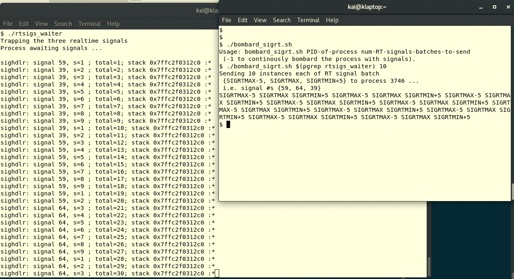
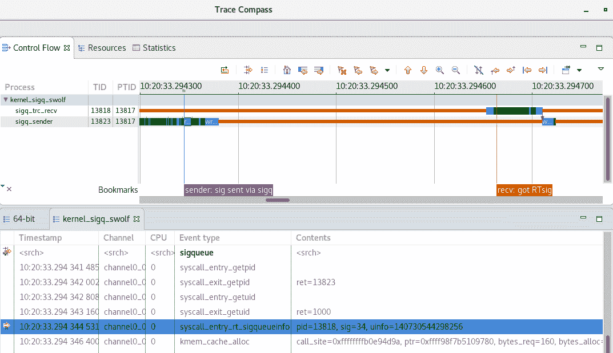

# 十二、信号——第二部分

正如上一章所提到的，信号是 Linux 系统开发人员理解和利用的重要机制。 上一章涵盖了几个方面：介绍，为什么信号对系统开发人员有用，以及最重要的是，开发人员到底应该如何处理和利用信号机制。

本章继续这一探索。 在这里，我们将深入了解使用信号处理进程崩溃的内部细节、如何识别和避免处理信号时的常见问题、处理实时信号、发送信号，最后是执行信号处理的替代方法。

在本章中，读者将了解以下内容：

*   优雅地处理进程崩溃，并在该点收集有价值的诊断信息
*   处理与发出信号有关的常见问题--赛跑中的错误，正确的睡眠方式(是的，你读对了！)
*   处理强大的实时信号
*   向其他进程发送信号，通过信号进行 IPC
*   可选的信号处理技术

# 优雅地处理进程崩溃

应用中导致运行时崩溃的错误？ 天哪，这怎么可能？*和*

不幸的是，对于这位富有的软件老手来说，这并不令人大吃一惊。 Bug 是存在的；它们可以隐藏得很好，很多年，有时；有一天，它们出来了，然后-砰！*-*这个过程崩溃了。

这里，我们的目的不是讨论调试技术或工具(也许我们可以把它留到另一本书中讨论，好吗？)；相反，它是一个关键点：如果我们的应用进程崩溃，我们能做些什么吗？ 当然：在上一章中，我们已经详细了解了如何捕获信号。 为什么不设计我们的应用，让我们捕获典型的致命信号-SIGBUS、SIGFPE、SIGILL 和 SIGSEGV-并在它们的信号处理程序中执行以下有用的任务：

*   执行关键应用清理-例如，释放内存区域、刷新和关闭打开的文件等
*   将相关细节写入日志文件(导致崩溃的信号、信号的来源、原因、CPU 寄存器值等)
*   通知最终用户，嘿，太糟糕了，我们坠毁了
*   请允许我们收集坠机细节，我们保证下次会做得更好！

这不仅为我们提供了有价值的信息，可以帮助您调试崩溃的根本原因，还可以让应用优雅地退出。

# 使用 SA_SIGINFO 详细说明信息

让我们回顾一下我们在前面的[章](11.html)，*Signating-Part I*，*一节中看到的 Sigaction Structure`sigaction`结构的第一个成员；它是一个函数指针，它指定了信号处理程序：*

```sh
struct sigaction
  {
    /* Signal handler. */
#ifdef __USE_POSIX199309
    union
      {
        /* Used if SA_SIGINFO is not set. */
 __sighandler_t sa_handler;
 /* Used if SA_SIGINFO is set. */
 void (*sa_sigaction) (int, siginfo_t *, void *); 
      } 
    __sigaction_handler;
# define sa_handler __sigaction_handler.sa_handler
# define sa_sigaction __sigaction_handler.sa_sigaction
#else
    __sighandler_t sa_handler;
#endif
 *--snip--* };
```

前面突出显示的代码突出显示了这样一个事实：由于信号处理程序位于联合中，因此信号处理程序可以是以下任一项：

*   `sa_handler`*：当`SA_SIGINFO`标志被清除时
*   `sa_sigaction`当设置了`SA_SIGINFO`标志时返回

到目前为止，我们已经为信号处理程序使用了`sa_handler`样式的原型：

`void (*sa_handler)(int);`

它只接收一个参数：发生的信号的整数值。

如果您将**`SA_SIGINFO`**设置为**`SA_SIGINFO`**(当然是在发出`sigaction(2)`系统调用的同时)，则信号处理程序函数原型现在变为：`void (*sa_sigaction)(int, siginfo_t *, void *);`

参数如下：

*   出现的信号的最大整数值
*   指向类型为`siginfo_t`的结构的指针(显然是一个 tyecif)
*   一个仅供内部使用(未记录)的指针，称为**uContext**

第二个参数是力量所在！

# Siginfo_t 结构

当您使用参数`SA_SIGINFO`参数信号标志并发生捕获信号时，内核会填充一个数据结构：参数`siginfo_t`参数结构。

下面显示了标题`siginfo_t`的结构定义(稍微简化了一些；如果将前几个成员包装起来，我们在这里不需要担心)(它在 Ubuntu 上显示在标题`/usr/include/x86_64-linux-gnu/bits/types/siginfo_t.h`中，在 Fedora 框上显示在标题`/usr/include/bits/types/siginfo_t.h`中)：(在 Ubuntu 上显示在标题`/usr/include/x86_64-linux-gnu/bits/types/siginfo_t.h`中，在 Fedora 框上显示在标题`/usr/include/bits/types/siginfo_t.h`中)：

```sh
typedef struct {
    int si_signo; /* Signal number. */
    int si_code;  
    int si_errno; /* If non-zero, an errno value associated with
           this signal, as defined in <errno.h>. */

    union
    {
         int _pad[__SI_PAD_SIZE];
        /* kill(). */
         struct
         {
             __pid_t si_pid; /* Sending process ID. */
             __uid_t si_uid; /* Real user ID of sending process. */
         } _kill;

        /* POSIX.1b timers. */
         struct
         {
             int si_tid; /* Timer ID. */
             int si_overrun; /* Overrun count. */
             __sigval_t si_sigval; /* Signal value. */
         } _timer;

        /* POSIX.1b signals. */
         struct
         {
             __pid_t si_pid; /* Sending process ID. */
             __uid_t si_uid; /* Real user ID of sending process. */
             __sigval_t si_sigval; /* Signal value. */
         } _rt;

        /* SIGCHLD. */
         struct
         {
             __pid_t si_pid; /* Which child. */
             __uid_t si_uid; /* Real user ID of sending process. */
             int si_status; /* Exit value or signal. */
             __SI_CLOCK_T si_utime;
             __SI_CLOCK_T si_stime;
         } _sigchld;

        /* SIGILL, SIGFPE, SIGSEGV, SIGBUS. */
         struct
         {
           void *si_addr; /* Faulting insn/memory ref. */
           __SI_SIGFAULT_ADDL
           short int si_addr_lsb; /* Valid LSB of the reported address. */
           union
           {
              /* used when si_code=SEGV_BNDERR */
              struct
              {
                 void *_lower;
                 void *_upper;
              } _addr_bnd;
              /* used when si_code=SEGV_PKUERR */
              __uint32_t _pkey;
           } _bounds;
         } _sigfault;

        /* SIGPOLL. */
        struct
        {
             long int si_band; /* Band event for SIGPOLL. */
             int si_fd;
         } _sigpoll;

        /* SIGSYS. */
#if __SI_HAVE_SIGSYS
         struct
         {
             void *_call_addr; /* Calling user insn. */
             int _syscall; /* Triggering system call number. */
             unsigned int _arch; /* AUDIT_ARCH_* of syscall. */
         } _sigsys;
#endif
    } _sifields;
} siginfo_t ;
```

前三个成员是整数：

*   `si_signo`1：信号号-传递给进程的信号
*   `si_code`1：信号来源；枚举； 典型的取值如下：
    `SI_QUEUE`：由 AIO 发送`sigqueue(3)`
    `SI_USER`：由`kill(2)`
    `SI_KERNEL`发送：由内核
    发送`SI_SIGIO`：由排队的 SIGIO
    发送`SI_ASYNCIO`：由 AIO 发送完成
    `SI_MESGQ`：发送由 AIO 完成
    发送`SI_MESGQ`：由内核
    发送`SI_SIGIO`消息：由排队的 SIGIO
    发送`SI_ASYNCIO`消息：由 AIO 发送完成
    消息`SI_MESGQ`消息：发送。 By Real Time Message Queue Status Change
    `SI_TIMER`：由计时器过期发送
*   `si_errno`*：(如果非零)错误号*和*值

这里是真正有趣的部分：结构的第四个成员是一个由七个结构组成的联合体(`_sifields`)。 我们理解，联合函数意味着任何一个成员都将在运行时被实例化：*它将是七个结构之一，具体取决于接收到的信号！

看一下前面显示的数据`siginfo_t`数据结构中的联合函数；联合函数中的注释非常清楚地指出了哪些信号将导致在运行时实例化哪些数据结构。(=

例如，我们在合并中看到，当接收到`SIGCHLD`信号时(即，当子进程死亡、停止或继续时)，将填充此结构：

```sh
 /* SIGCHLD. */
 struct
 {
     __pid_t si_pid; /* Which child. */
     __uid_t si_uid; /* Real user ID of sending process. */
     int si_status; /* Exit value or signal. */
     __SI_CLOCK_T si_utime;
     __SI_CLOCK_T si_stime;
 } _sigchld;
```

该信息是关于子进程的；因此，我们会收到死亡进程的 PID 和真实 UID(当然，除非使用了`SA_NOCLDWAIT`标志，否则会停止或继续)。 此外，我们会收到整数位掩码`si_status`，告诉我们孩子究竟是如何死亡的(依此类推)。 此外，一些审核信息，如`si_utime`和`si_stime`，分别表示子进程在用户空间和内核空间中花费的时间。

回想一下我们在[第 10 章](10.html)、*和进程创建*、*的等待 API-Details*和*、*节中的详细讨论，我们可以通过(任何)等待 API 获取子终止状态信息。 那么，在这里，我们可以看到，它更简单：使用参数`SA_SIGINFO`参数标志，捕获参数`SIGCHLD`参数信号，在处理程序函数中，只需从参数联合中查找相关的值！

The man page on `sigaction(2)` describes the `siginfo_t` structure members in depth, providing detailed information. Do read through it.

# 在进程崩溃时获取系统级详细信息

当进程死亡时，可以通过`SIGSEGV`从内核收集大量信息：内存错误或缺陷，这是一种常见的情况，正如我们在[第 4 章](04.html)、*动态内存分配*、[第 5 章](05.html)、*Linux 内存问题*和[第 6 章](06.html)、*内存问题调试工具*中所讨论的那样。 (本节也适用于致命故障信号`SIGBUS`、`SIGILL`和`SIGFPE`。 顺便说一句，`SIGFPE`不仅在被零除错误时发生，在任何类型的与算术相关的异常中都会发生)。

`sigaction(2)`上的手册页显示了以下内容：

```sh
...
The following values can be placed in si_code for a SIGSEGV signal:

SEGV_MAPERR
    Address not mapped to object.
SEGV_ACCERR
    Invalid permissions for mapped object.
SEGV_BNDERR (since Linux 3.19)
    Failed address bound checks.
SEGV_PKUERR (since Linux 4.6)
    Access was denied by memory protection keys. See pkeys(7). The  
    protection key which applied to this access is available via si_pkey.
...
```

`SEGV_MAPERR`表示进程试图访问的地址(用于读取、写入或执行)无效；没有**页表条目**或(**PTE**)条目可供其使用，或者它拒绝映射到任何有效地址。

前面的`SEGV_ACCERR`很容易理解：由于缺乏权限(例如，尝试写入只读内存页面)，因此无法执行尝试的访问(读取、写入或执行)。

特别的是，`SEGV_BNDERR`和`SEGV_PKUERR`宏无法编译；我们不会尝试在这里使用它们。

The glibc library provides the helper routines `psignal(3)` and `psiginfo(3)`; passed an informational string, they print it, appending a :  and then the actual signal that occurred and information on the cause of the signal being delivered and the faulting address (looked up from the siginfo_t structure) respectively. We use the `psiginfo(3)` in our example code as follows.

# 从崩溃中捕获和提取信息

接下来，我们将看到带有故意错误的测试程序`ch12/handle_segv.c`、***和***，以帮助我们理解可能的用例。 所有这些都将导致操作系统生成新的`SIGSEGV`信号。应用开发人员如何处理此信号非常重要：我们将演示如何使用它来收集重要的详细信息，例如发生崩溃的访问内存位置的地址，以及该时间点所有寄存器的值。 这些详细信息通常为内存错误的根本原因提供了有用的线索。

为了帮助理解我们是如何构建此程序的，请在不带任何参数的情况下运行它：

```sh
$ ./handle_segv 
Usage: ./handle_segv u|k r|w
u => user mode
k => kernel mode
 r => read attempt
 w => write attempt
$ 
```

可以看出，我们因此可以执行四种无效的内存访问：实际上，有四种错误情况：

*   无效的用户[u]模式读取[r]
*   无效的用户[u]模式写入[w]
*   无效的内核[k]模式读取[r]
*   无效的内核[k]模式写入[w]

我们使用的一些 typedefs 和宏如下所示：

```sh
typedef unsigned int u32;
typedef long unsigned int u64;

#define ADDR_FMT "%lx"
#if __x86_64__ /* 64-bit; __x86_64__ works for gcc */
 #define ADDR_TYPE u64
 static u64 invalid_uaddr = 0xdeadfaceL;
 static u64 invalid_kaddr = 0xffff0b9ffacedeadL;
#else
 #define ADDR_TYPE u32
 static u32 invalid_uaddr = 0xfacedeadL;
 static u32 invalid_kaddr = 0xdeadfaceL;
#endif
```

`main`函数如下所示：

```sh
int main(int argc, char **argv)
{
 struct sigaction act;
 if (argc != 3) {
     usage(argv[0]);
     exit(1);
 }

 memset(&act, 0, sizeof(act));
 act.sa_sigaction = myfault;
 act.sa_flags = SA_RESTART | SA_SIGINFO;
 sigemptyset(&act.sa_mask);
 if (sigaction(SIGSEGV, &act, 0) == -1)
     FATAL("sigaction SIGSEGV failed\n");

if ((tolower(argv[1][0]) == 'u') && tolower(argv[2][0] == 'r')) {
   ADDR_TYPE *uptr = (ADDR_TYPE *) invalid_uaddr;
   printf("Attempting to read contents of arbitrary usermode va uptr = 0x" 
             ADDR_FMT ":\n", (ADDR_TYPE) uptr);
   printf("*uptr = 0x" ADDR_FMT "\n", *uptr); // just reading

 } else if ((tolower(argv[1][0]) == 'u') && tolower(argv[2][0] == 'w')) {
    ADDR_TYPE *uptr = (ADDR_TYPE *) & main;
    printf
    ("Attempting to write into arbitrary usermode va uptr (&main actually) = 0x" ADDR_FMT ":\n", (ADDR_TYPE) uptr);
    *uptr = 0x2A; // writing 
 } else if ((tolower(argv[1][0]) == 'k') && tolower(argv[2][0] == 'r')) {
    ADDR_TYPE *kptr = (ADDR_TYPE *) invalid_kaddr;
    printf
 ("Attempting to read contents of arbitrary kernel va kptr = 0x" ADDR_FMT ":\n", (ADDR_TYPE) kptr);
    printf("*kptr = 0x" ADDR_FMT "\n", *kptr); // just reading

 } else if ((tolower(argv[1][0]) == 'k') && tolower(argv[2][0] == 'w')) {
    ADDR_TYPE *kptr = (ADDR_TYPE *) invalid_kaddr;
    printf
 ("Attempting to write into arbitrary kernel va kptr = 0x" ADDR_FMT ":\n",
      (ADDR_TYPE) kptr);
    *kptr = 0x2A; // writing
 } else
     usage(argv[0]);
 exit(0);
}
```

VA=虚拟地址。

以下是关键部分：SIGSEGV 的信号处理程序：

```sh
static void myfault(int signum, siginfo_t * si, void *ucontext)
{
  fprintf(stderr,
    "%s:\n------------------- FATAL signal ---------------------------\n",
    APPNAME);
    fprintf(stderr," %s: received signal %d. errno=%d\n"
 " Cause/Origin: (si_code=%d): ",
         __func__, signum, si->si_errno, si->si_code);

 switch (si->si_code) {
     /* Possible values si_code can have for SIGSEGV */
 case SEGV_MAPERR:
     fprintf(stderr,"SEGV_MAPERR: address not mapped to object\n");
     break;
 case SEGV_ACCERR:
     fprintf(stderr,"SEGV_ACCERR: invalid permissions for mapped object\n");
     break;
 /* SEGV_BNDERR and SEGV_PKUERR result in compile failure? */

 /* Other possibilities for si_code; here just to show them... */
 case SI_USER:
     fprintf(stderr,"user\n");
     break;
 case SI_KERNEL:
     fprintf(stderr,"kernel\n");
     break;
 *--snip--*

 default:
     fprintf(stderr,"-none-\n");
 }
<...>

    /* 
     * Placeholders for real-world apps:
     * crashed_write_to_log();
     * crashed_perform_cleanup();
     * crashed_inform_enduser();
     *
     * Now have the kernel generate the core dump by:
     *  Reset the SIGSEGV to (kernel) default, and,
     *  Re-raise it!
     */
    signal(SIGSEGV, SIG_DFL);
    raise(SIGSEGV);
}
```

这里有很多值得观察的地方：

*   我们打印出信号号和原始值

*   我们解释信号原始值(通过开关盒)

    *   特别是对于 SIGSEGV、SEGV_MAPERR 和 SEGV_ACCERR

有趣的地方来了：下面的代码打印出出错的指令或地址！不仅如此，我们还设计了一种方法，通过我们的`dump_regs`函数，我们也可以打印出大多数 CPU 寄存器。 如前所述，我们还使用助手例程`psiginfo(3)`，如下所示：

```sh
fprintf(stderr," Faulting instr or address = 0x" ADDR_FMT "\n",
         (ADDR_TYPE) si->si_addr);
fprintf(stderr, "--- Register Dump [x86_64] ---\n");
dump_regs(ucontext); fprintf(stderr,
     "------------------------------------------------------------\n");
psiginfo(si, "psiginfo helper");
fprintf(stderr,
     "------------------------------------------------------------\n");
```

然后，在处理这样的致命信号时，我们只需要保留一些虚拟存根，用于您在实际应用中可能需要的功能(在这里，我们实际上不编写任何代码，因为它当然是非常特定于应用的)：

```sh
/* 
 * Placeholders for real-world apps:
 * crashed_write_to_log();
 * crashed_perform_cleanup();
 * crashed_inform_enduser();
 */
```

最后，调用`abort(3)`使进程终止(因为它现在处于未定义状态，无法继续)是结束的一种方式。 然而，想一想：如果我们现在就中止()，进程就会在内核没有机会生成核心转储的情况下死亡。(如前所述，内核转储本质上是崩溃时进程动态内存段的快照；这对开发人员调试和确定崩溃的根本原因非常有用)。 因此，让内核生成核心转储文件确实会很有用。 我们怎么安排这件事呢？ 其实很简单：我们需要做以下几件事：

*   将`SIGSEGV`信号的处理程序重置为(内核)默认值
*   在此过程中发出信号(Re)

此代码片段正好实现了以下功能：

```sh
[...]
 * Now have the kernel generate the core dump by:
 * Reset the SIGSEGV to glibc default, and,
 * Re-raise it!
 */
 signal(SIGSEGV, SIG_DFL);
 raise(SIGSEGV);
```

由于情况很简单，我们只需使用更简单的`signal(2)`API 将信号的操作恢复为默认值。 然后，我们再次使用库 API`raise(3)`来在调用过程中发出给定信号。 (为了便于阅读，省略了错误检查代码。)

# 寄存器转储

如前所述，`dump_regs`函数打印出 CPU 寄存器值；以下是关于这一点需要注意的几点：

*   它非常特定于 CPU(如下所示的示例案例仅适用于 x86_64CPU)。
*   为了实际获得对 CPU 寄存器的访问，我们使用了信号处理函数的未记录的第三个参数(注意：与*和*`SA_SIGINFO`一起使用时)，即所谓的本地用户上下文指针。虽然无法解释它(就像我们在这里演示的那样)，但是，当然，由于它不能通过 glibc 系统调用(或其他)接口正式可见，所以您不能依赖此功能。请谨慎使用(以及大量测试)。(注：当与*和*`SA_SIGINFO`一起使用时，请谨慎使用(以及大量测试)，但当然，由于它无法通过 glibc 系统调用(或其他)接口正式可见，所以您不能依赖此功能。请谨慎使用(以及大量测试)。

话虽如此，让我们来看看代码：

```sh
/* arch - x86[_64] - specific! */
static inline void dump_regs(void *ucontext)
{
#define FMT "%016llx"
ucontext_t *uctx = (ucontext_t *)ucontext;

 fprintf(stderr,
 " RAX = 0x" FMT " RBX = 0x" FMT " RCX = 0x" FMT "\n"
 " RDX = 0x" FMT " RSI = 0x" FMT " RDI = 0x" FMT "\n"
 " RBP = 0x" FMT " R8 = 0x" FMT  " R9  = 0x" FMT "\n"

 " R10 = 0x" FMT " R11 = 0x" FMT " R12 = 0x" FMT "\n"
 " R13 = 0x" FMT " R14 = 0x" FMT " R15 = 0x" FMT "\n"
 " RSP = 0x" FMT "\n"

 "\n RIP = 0x" FMT " EFLAGS = 0x" FMT "\n"
 " TRAP# = %02lld ERROR = %02lld\n"
 /* CR[0,1,3,4] unavailable */
 " CR2 = 0x" FMT "\n"
 , uctx->uc_mcontext.gregs[REG_RAX]
 , uctx->uc_mcontext.gregs[REG_RBX]
 , uctx->uc_mcontext.gregs[REG_RCX]
 , uctx->uc_mcontext.gregs[REG_RDX]
 , uctx->uc_mcontext.gregs[REG_RSI]
 , uctx->uc_mcontext.gregs[REG_RDI]
 , uctx->uc_mcontext.gregs[REG_RBP]
 , uctx->uc_mcontext.gregs[REG_R8]
 , uctx->uc_mcontext.gregs[REG_R9]
 , uctx->uc_mcontext.gregs[REG_R10]
 , uctx->uc_mcontext.gregs[REG_R11]
 , uctx->uc_mcontext.gregs[REG_R12]
 , uctx->uc_mcontext.gregs[REG_R13]
 , uctx->uc_mcontext.gregs[REG_R14]
 , uctx->uc_mcontext.gregs[REG_R15]
 , uctx->uc_mcontext.gregs[REG_RSP]
 , uctx->uc_mcontext.gregs[REG_RIP]
 , uctx->uc_mcontext.gregs[REG_EFL]
 , uctx->uc_mcontext.gregs[REG_TRAPNO]
 , uctx->uc_mcontext.gregs[REG_ERR]
 , uctx->uc_mcontext.gregs[REG_CR2]
 );
}
```

现在，让我们运行两个测试用例：

```sh
*Test Case: Userspace, Invalid Read*
$ ./handle_segv u r
Attempting to read contents of arbitrary usermode va uptr = 0xdeadface:
handle_segv:
------------------- FATAL signal ---------------------------
 myfault: received signal 11. errno=0
 Cause/Origin: (si_code=1): SEGV_MAPERR: address not mapped to object
 Faulting instr or address = 0xdeadface
 --- Register Dump [x86_64] ---
RAX = 0x00000000deadface RBX = 0x0000000000000000 RCX = 0x0000000000000000
RDX = 0x0000000000000000 RSI = 0x0000000001e7b260 RDI = 0x0000000000000000
RBP = 0x00007ffc8d842110 R8  = 0x0000000000000008 R9  = 0x0000000000000000
R10 = 0x0000000000000000 R11 = 0x0000000000000246 R12 = 0x0000000000400850
R13 = 0x00007ffc8d8421f0 R14 = 0x0000000000000000 R15 = 0x0000000000000000
RSP = 0x00007ffc8d842040
RIP = 0x0000000000400e84 EFLAGS = 0x0000000000010202
TRAP# = 14 ERROR = 04
CR2 = 0x00000000deadface
------------------------------------------------------------
psiginfo helper: Segmentation fault (Address not mapped to object [0xdeadface])
------------------------------------------------------------
Segmentation fault (core dumped)
$
```

以下是一些需要注意的事项：

*   原始值是*`SEGV_MAPERR`：是的，我们试图读取的任意用户空间虚拟地址*(`0xdeadface`)不存在(或映射)，因此出现了 SEGFAULT！
*   出现故障的地址显示为我们尝试读取的无效的任意用户空间虚拟地址(`0xdeadface`)：
    *   备注：一个重要的值-出错指令或地址-实际上是保存在 x86 的**控制寄存器 2**(**CR2**)中的值，如图所示。
    *   陷阱编号显示为 14；x86[_64]上的陷阱 14 为页面故障。 实际情况是：当进程尝试读取无效的虚拟地址(`0xdeadface`)时，错误的访问导致 x86[_64]MMU 引发错误页错误异常，进而导致操作系统错误处理程序代码运行并通过 SIGSEGV 终止进程。
*   CPU 寄存器也会被转储。

The curious reader will perhaps wonder what exactly each register is used for. This is an area beyond this book's scope; nevertheless, the reader can find useful information by seeking out the CPU OEM's **Application Binary Interface** (**ABI**) documentation; among many things, it specifies register usage for function calling, return, parameter passing, and so on. Check out the *Further reading *section on the GitHub repository for more on ABI docs.

*   `psiginfo(3)`也会生效，打印出信号的原因和故障地址
*   消息`Segmentation fault (core dumped)`告诉我们，我们的策略奏效了：我们将 SIGSEGV 的信号处理重置为默认信号处理，并重新引发信号，导致操作系统(内核)生成核心转储。 生成的核心文件(在 Fedora 28 x86_64 盒上生成)如下所示：

```sh
$ ls -l corefile*
-rw-------. 1 kai kai 389120 Jun 24 14:23 'corefile:host=<hostname>:gPID=2413:gTID=2413:ruid=1000:sig=11:exe=<!<path>!<to>!<executable>!ch13!handle_segv.2413'
$
```

这里有几点值得一提：

*   对核心转储的详细分析和解释超出了本书的范围。 使用 gdb 分析核心转储非常简单；稍微搜索一下就会得到结果。
*   指定给核心文件的名称各不相同；现代 Fedora 发行版将名称设置为非常具有描述性(如您所见)；实际上，核心文件名是通过可在内核 proc 文件系统中调优的内核来控制的。 有关详细信息，请参阅`core(5)`上的手册页。

我们为我们的程序`handle_segv`*和*运行内核空间无效写入测试用例，如下所示：

```sh
*Test Case: Kernel-space, Invalid* ***Write*** $ ./handle_segv k w
Attempting to write into arbitrary kernel va kptr = 0xffff0b9ffacedead:
handle_segv:
------------------- FATAL signal ---------------------------
 myfault: received signal 11. errno=0
 Cause/Origin: (si_code=128): kernel
 Faulting instr or address = 0x0
 --- Register Dump [x86_64] ---
RAX = 0xffff0b9ffacedead RBX = 0x0000000000000000 RCX = 0x0000000000000000
RDX = 0x0000000000000000 RSI = 0x00000000023be260 RDI = 0x0000000000000000
RBP = 0x00007ffcb5b5ff60 R8  = 0x0000000000000010 R9  = 0x0000000000000000
R10 = 0x0000000000000000 R11 = 0x0000000000000246 R12 = 0x0000000000400850
R13 = 0x00007ffcb5b60040 R14 = 0x0000000000000000 R15 = 0x0000000000000000
RSP = 0x00007ffcb5b5fe90

RIP = 0x0000000000400ffc EFLAGS = 0x0000000000010206
TRAP# = 13 ERROR = 00
CR2 = 0x0000000000000000
------------------------------------------------------------
psiginfo helper: Segmentation fault (Signal sent by the kernel [(nil)])
------------------------------------------------------------
Segmentation fault (core dumped)$
```

请注意，这一次，陷阱值为 13；在 x86[_64]MMU 上，这是第一个**通用保护故障**(**GPF**)。 同样，这种糟糕的访问导致 x86[_64]MMU 引发 GPF 异常，进而导致操作系统故障处理程序代码运行并通过 SIGSEGV 终止进程。*和*陷阱是 GPF 的线索：我们违反了保护规则；回想一下[第 1 章](01.html)、*Linux 系统体系结构*：在更高、更特权级别运行的进程(或线程)始终可以禁止访问。 在这里，环 3 处的进程试图访问环 0 处的内存；因此，MMU 引发 GPF 异常，操作系统终止它(通过进程`SIGSEGV`)。

不幸的是，这一次 CR2 值是 0x0(在内核空间发生崩溃的情况下)，因此故障地址也是 0x0。 但是，我们仍然可以在其他寄存器中获得有价值的细节(指令和堆栈指针值，等等，我们将在下面看到)。

# 在源代码中查找崩溃位置

RIP 指令(IA-32 上的指令指针**；**和 IA-32 上的 EIP，ARM 上的 PC)非常有用：使用它的值和一些实用程序，我们几乎可以精确定位进程崩溃时代码中的位置。 多么?。 有几种方法；其中一些方法如下：

*   使用工具链实用程序`objdump`*(带有`-d``-S`开关)
*   更简单的方法是使用`gdb(1)`(见下文)
*   使用`addr2line(1)`命令实用程序

使用 gdb：

用程序的最新调试列表版本(用`-g`开关编译)加载`gdb(1)`，然后使用如下所示的列表命令：

```sh
$ gdb -q ./handle_segv_dbg
Reading symbols from ./handle_segv_dbg...done.
(gdb) list *0x0000000000400ffc
<< 0x0000000000400ffc is the RIP value >>
0x400ffc is in main (handle_segv.c:212).
207 } else if ((tolower(argv[1][0]) == 'k') && tolower(argv[2][0] == 'w')) {
208 ADDR_TYPE *kptr = (ADDR_TYPE *) invalid_kaddr; // arbitrary kernel virtual addr
209 printf
210 ("Attempting to write into arbitrary kernel va kptr = 0x" ADDR_FMT ":\n",
211 (ADDR_TYPE) kptr);
212 *kptr = 0x2A; // writing
213 } else
214 usage(argv[0]);
215 exit(0);
216 }
(gdb) 
```

`list * <address>`命令准确地指出了导致崩溃的代码，为清楚起见，在此处重现：

```sh
(gdb) l *0x0000000000400ffc
0x400ffc is in main (handle_segv.c:212).
```

第 212 行如下：

```sh
212: *kptr = 0x2A; // writing
```

这是完全正确的。

使用`addr2line`：

*`addr2line(1)`命令实用程序提供了类似的功能；同样，请通过其命令行`-e`命令开关针对二进制可执行文件的第二个内置调试命令(使用`-g`编译)运行它：

```sh
$ addr2line -e ./handle_segv_dbg 0x0000000000400ffc
<...>/handle_segv.c:212
$ 
```

另外，请考虑一下：我们之前的`ch12/altstack.c`*和*程序在其备用信号堆栈溢出时可能并将遭受分段错误；我们将把它留给读者作为练习来编写一个类似于这里所示的处理程序来正确处理这种情况。

Finally, though, we have shown that handling the segfault, the SIGSEGV, can be very beneficial to figuring out the cause of a crash; the simple fact remains that once this signal is generated upon a process, the process is considered to be in an undefined, in effect, unstable, state. Thus, there is no guarantee that whatever work we perform in its signal handler will actually go through as intended. Thus, keeping the signal handling code to a minimum would be recommended.

# 信号-警告和陷阱

信号是异步事件，可能会以微妙的方式导致错误和错误，这些错误和错误对于一般的审查者(或程序员，就这一点而言)来说并不是立竿见影的。 某些类型的功能或行为直接或间接地受到一个或多个信号到达的影响；您需要对可能的微妙竞争和类似情况保持警惕。

在这方面，我们已经讨论过的一个重要方面如下：在信号处理程序中，您只能调用记录为(或被设计为)非同步信号安全的函数。其他方面也值得深思；请继续阅读。

# 得体地处理差事

在使用系统调用和信号的程序中，可能会发生与未初始化的全局整数`errno`的争用。

# Errno 是做什么的？

记住 errno*和*global；它是进程的未初始化数据段中未初始化的全局整数(进程布局在[第 2 章](02.html)和*虚拟内存*中介绍)。

他的名字是做什么用的？ 每当系统调用失败时，它都会将`-1`值返回给用户空间。 但是，它为什么会失败呢？ 啊，第一个错误诊断，以及它失败的原因，是这样返回到用户空间的：glibc 与内核一起，用一个正整数值戳全局错误代码。 该值实际上是英语错误消息的二维数组(以 NULL 结尾)的索引；它称为`_sys_errlist`。 因此，查找`_sys_errlist`[errno]会显示英文错误消息：系统调用失败的原因。

不是由开发人员执行所有的工作，而是设计方便的例程，如：*`perror(3)`、*`strerror(3)`和*`error(3)`*，以便通过查找*`_sys_errlist[errno]`发出错误消息。 程序员经常在系统调用错误处理代码中使用这样的例程(事实上，我们这样做：检查宏的代码：`WARN`)和`FATAL`-它们调用`handle_err`函数，而后者又调用`perror(3)`作为其处理的一部分)。

Here is a useful-to-look-up item—the list of all possible `errno` values resides in the header file `/usr/include/asm-generic/errno-base.h`.

# 差事赛跑

请考虑以下情况：

1.  进程为几个信号设置一个信号处理程序：
    *   让我们假设`SIGUSR1`的信号处理程序名为`handle_sigusr.`。
2.  现在该进程正在运行其代码的一部分，即函数`foo`：
    *   Foo 发布系统调用，称`open(2)`
    *   系统调用返回失败`-1`
        *   Errno 被设置为正整数`13`，反映错误权限被拒绝(errno 宏 EACCES)。
    *   系统调用的错误处理代码调用`perror(3)`*和*发出英文错误消息。

是的，所有这些看起来都是无辜的。 然而，现在让我们考虑一下混合中的信号；检查以下场景：

*   *<...>*
    *   Foo 会发出系统调用，比如`open(2)`*。*
    *   系统调用返回`-1`失败。
        *   Errno 被设置为正整数`13`，反映错误权限被拒绝(errno 宏 EACCES)。
*   信号`SIGUSR1`i 在此时被传递到该过程。
    *   控制切换到信号处理程序例程：`handle_sigusr`。
        *   这里的代码发出另一个系统调用，比如：`stat(2)`**。**
        *   命令`stat(2)`的系统调用无法返回命令`-1`。
            *   Errno 现在设置为正整数`9`，反映错误文件编号(errno 宏 EBADF)。
        *   信号处理程序返回。
*   系统调用的错误处理代码调用`perror(3)`来发出英文错误消息。

可以看出，由于事件的先后顺序，Ererrno 的值从值 13 被改写为值 9。 其结果是，应用开发人员(以及项目中的其他所有人)现在被奇怪的错误报告搞糊涂了(错误错误文件号可能会被报告两次！)。 种族--程序员的祸根！

# 修复跑步机竞赛

上一场比赛的解决办法实际上相当简单。

每当您有一个信号处理程序，其中的代码可能会导致 errerrno 的值发生更改时，请在函数进入时保存`errno`，并在从处理程序返回数据之前恢复它。

只需包含变量的头文件，即可访问该变量`errno`。 下面是执行此操作的信号处理程序的快速示例代码片段：

```sh
<...>
include <errno.h>
<...>

static void handle_sigusr(int signum)
{
    int myerrno = errno;
    <... do the handling ...>
    <... syscalls, etc ...>
    errno = myerror;
}
```

# 好好睡一觉

是的，即使是睡眠也需要足够的知识才能正确执行！
通常情况下，您的进程必须进入完全睡眠状态。 我们可能都已经学会了如何使用`sleep(3)`API 来做到这一点：

```sh
#include <unistd.h>
unsigned int sleep(unsigned int seconds);
```

举个简单的例子，假设流程必须以这种方式工作(伪代码如下所示)：

```sh
<...>
func_a();
sleep(10);
func_b();
<...>
```

很明显：进程必须休眠`10`秒；显示的代码应该可以工作。 有问题吗？

嗯，是的，有信号：如果进程进入睡眠，但进入睡眠三秒后，一个信号到达怎么办？ 默认行为(即，除非信号被屏蔽)是处理信号，您可以想象，在剩下的时间(7 秒)内继续休眠。 但是，不，这不是事实：我们的睡眠计划被取消了！ 精明的读者可能会争辩说，使用“`SA_RESTART`”标志可以修复此行为(被信号中断的阻塞系统调用)；的确，这听起来很合理，但实际情况是，即使使用该标志也无济于事(必须手动重新启动睡眠模式)。

此外，重要的是要认识到，`sleep(3)`的 API 文档说明其返回值是剩余的休眠时间；因此，除非`sleep(3)`返回`0`，否则休眠还没有完成！ 开发人员实际上应该在循环中调用`sleep(3)`函数，直到返回值为`0`。

What does making a process (or thread) "go to sleep" really mean?
The key point is this: a process (or thread) that's asleep cannot run on the CPU while in that state; it is not even a candidate for the OS scheduler (technically, the transition from state 
Running->sleeping is a dequeue from a run queue and an enqueue on to a wait queue within the OS, and vice versa). More on this in [Chapter 17](17.html), *CPU Scheduling on Linux*.

因此，我们得出的结论是，仅仅在代码中使用参数`sleep(3)`并不是一个很好的想法，原因如下：

*   睡眠一旦被信号传输中断，必须手动重新启动。
*   `sleep(3)`秒的粒度非常粗：一秒。 (对于现代微处理器来说，一秒是非常、非常长的时间！ 许多实际应用至少依赖于毫秒到微秒级别的粒度。)

那么，解决方案是什么呢？

# 纳米睡眠系统调用

Linux 提供了一个系统调用`nanosleep(2)`，理论上可以提供纳秒级别的粒度，即单个纳秒的休眠。 (实际上，粒度还取决于板上硬件定时器芯片的分辨率。)。 以下是该接口的原型：

```sh
#include <time.h>
int nanosleep(const struct timespec *req, struct timespec *rem);
```

系统调用有两个参数，都是指向数据类型 struct`timespec`结构的指针，该结构定义如下：

```sh
struct timespec {
    time_t tv_sec; /* seconds */
    long tv_nsec;  /* nanoseconds */
};
```

显然，这允许您以秒和纳秒为单位指定休眠时间；第一个参数`req`是所需的最短时间(`s.ns`)，第二个参数`rem`是剩余的休眠时间。请看，操作系统在这里帮助我们：如果休眠被信号中断(任何非致命的信号)，则`nanosleep `系统调用将失败返回`-1`，并将 errno 参数设置为值`EINTR`(中断的系统调用)。 不仅如此，操作系统还会计算并返回(进入第二个指针，这是一种超值结果类型的参数)，睡眠的剩余时间精确到纳秒。通过这种方式，我们检测到这种情况，将`req`设置为`rem`，然后手动重新发出`nanosleep(2)`命令，让睡眠持续到完全完成。

为了演示，我们接下来展示一个小应用(源代码：`ch12/sleeping_beauty.c`)；用户可以调用通常的`sleep(3)`休眠方法，也可以使用非常优越的`nanosleep(2)`休眠 API，这样休眠时间是准确的：

```sh
static void sig_handler(int signum)
{
     fprintf(stderr, "**Signal %d interruption!**\n", signum);
}

int main(int argc, char **argv)
{
     struct sigaction act;
     int nsec = 10, ret;
     struct timespec req, rem;

    if (argc == 1) {
         fprintf(stderr, "Usage: %s option=[0|1]\n"
            "0 : uses the sleep(3) function\n"
            "1 : uses the nanosleep(2) syscall\n", argv[0]);
         exit(EXIT_FAILURE);
     }
    /* setup signals: trap SIGINT and SIGQUIT */
     memset(&act, 0, sizeof(act));
     act.sa_handler = sig_handler;
     sigemptyset(&act.sa_mask);
     act.sa_flags = SA_RESTART;
     if (sigaction(SIGINT, &act, 0) || sigaction(SIGQUIT, &act, 0))
         FATAL("sigaction failure\n");

    if (atoi(argv[1]) == 0) {         /* sleep */
         printf("sleep for %d s now...\n", nsec);
         ret = sleep(nsec);
         printf("sleep returned %u\n", ret);
     } else if (atoi(argv[1]) == 1) { /* nanosleep */
         req.tv_sec = nsec;
         req.tv_nsec = 0;
         while ((nanosleep(&req, &rem) == -1) && (errno == EINTR)) {
             printf("nanosleep interrupted: rem time: %07lu.%07lu\n",
                 rem.tv_sec, rem.tv_nsec);
             req = rem;
         }
     }
 exit(EXIT_SUCCESS);
}
```

请注意前面代码中的以下内容：

*   将`0`作为参数传递让我们调用通常的`sleep(3)`*。*
    *   我们在这里故意不使用循环进行编码，因为这是大多数程序员称为`sleep(3)`的方式(因此我们可以看到缺陷)。
*   将`1`作为参数传递让我们调用功能强大的`nanosleep(2)`API；我们将所需时间初始化为 10 秒(与前面的情况相同)。
    *   但是，这一次，我们在循环中调用信号`nanosleep(2)`，检查信号中断情况`errno == EINTR`，如果是，
    *   我们把`req`号设为`rem`号，再打一次！
    *   (为了好玩，我们打印剩余时间`s.ns`)：

```sh
$ ./sleeping_beauty
Usage: ./sleeping_beauty option=[0|1]
0 : uses the sleep(3) function
1 : uses the nanosleep(2) syscall
$ 
```

我们两种情况都试一试：第一，常用的`sleep(3)`测试方法：

```sh
$ ./sleeping_beauty 0
sleep for 10 s now...
^C**Signal 2 interruption!**
sleep returned 7
$ 
```

进入休眠状态几秒钟后，我们按下*^C*；信号到达，但休眠被中止(如图所示，还剩下 7 秒的休眠时间，这里的代码完全忽略了这一点)！

现在有一个好的例子：通过床睡觉`nanosleep(2)`：

```sh
$ ./sleeping_beauty 1
^C**Signal 2 interruption!**
nanosleep interrupted: rem time: 0000007.249192148
^\**Signal 3 interruption!**
nanosleep interrupted: rem time: 0000006.301391001
^C**Signal 2 interruption!**
nanosleep interrupted: rem time: 0000004.993030983
^\**Signal 3 interruption!**
nanosleep interrupted: rem time: 0000004.283608684
^C**Signal 2 interruption!**
nanosleep interrupted: rem time: 0000003.23244174
^\**Signal 3 interruption!**
nanosleep interrupted: rem time: 0000001.525725162
^C**Signal 2 interruption!**
nanosleep interrupted: rem time: 0000000.906662154
^\**Signal 3 interruption!**
nanosleep interrupted: rem time: 0000000.192637791
$ 
```

这一次，我们亲爱的孩子`sleeping_beauty`跑(睡？)。 即使在存在通过多个信号的连续中断的情况下也要完成。 不过，你应该注意到这样一个事实：是的，会有一些开销。 操作系统做出的唯一保证是，睡眠至少会持续所需的时间，可能还会更长一点。

注意：虽然使用`nanosleep(2)`代码的实现比通常的`sleep(3)`API 要好得多，但事实是，当代码在循环中时，即使是`nanosleep`代码也会受到(可能会变得非常严重的)时间和溢出的影响，并且足够多的信号会多次中断我们的循环(就像我们前面的示例中可能发生的那样)。 在这样的情况下，我们最终可能会睡过头。 为了解决这个问题，POSIX 标准和 Linux 提供了一个更好的`clock_nanosleep(2)`模式系统调用：将其与实时时钟和标志值`TIMER_ABSTIME`一起使用可以解决过度睡眠问题。还需要注意的是，尽管 Linux 的`sleep(3)`API 是通过`nanosleep(2)`在内部实现的，但休眠语义仍然是描述的；应用开发人员有责任在循环中调用休眠代码，检查返回值和失败情况。

# 实时信号

回想一下`kill -l`命令的输出(l 代表列表)；显示平台支持的信号-数字整数和符号名称。 前 31 个信号是标准或 Unix 信号(参见[第 11 章](11.html)，*信号-第 I 部分*和*标准或 Unix 信号*部分)；我们现在已经使用它们相当多了。

34 至 64 号信号均以`SIGRT`-`SIGRTMIN`至`SIGRTMAX`开头-它们称为**实时**信号：

```sh
$ kill -l |grep "SIGRT"
31)SIGSYS      34) SIGRTMIN    35) SIGRTMIN+1  36) SIGRTMIN+2  37) SIGRTMIN+3
38)SIGRTMIN+4  39) SIGRTMIN+5  40) SIGRTMIN+6  41) SIGRTMIN+7  42) SIGRTMIN+8
43)SIGRTMIN+9  44) SIGRTMIN+10 45) SIGRTMIN+11 46) SIGRTMIN+12 47) SIGRTMIN+13
48)SIGRTMIN+14 49) SIGRTMIN+15 50) SIGRTMAX-14 51) SIGRTMAX-13 52) SIGRTMAX-12
53) SIGRTMAX-11 54) SIGRTMAX-10 55) SIGRTMAX-9 56) SIGRTMAX-8 57) SIGRTMAX-7
58) SIGRTMAX-6  59) SIGRTMAX-5  60) SIGRTMAX-4 61) SIGRTMAX-3 62) SIGRTMAX-2
63) SIGRTMAX-1  64) SIGRTMAX 
$ 
```

(这里看到的第一个 SIGRT`SIGSYS`不是实时信号；它出现是因为它与其他 SIGRT 在同一行，所以`grep(1)`打印它。)

# 与标准信号的差异

那么，所谓的实时信号与常规的标准信号有何不同；下表揭示了这一点：

| **特征** | **标准信号** | **实时信号** |
| 编号 / 编号方式 | 1-31<sup>1</sup> | 34-64<sup>2</sup> |
| 中定义的第一个标准
 | POSIX.1-1990(旧) | POSIX 1003.1b：POSIX(2001)的实时扩展
 |
| 指定的含义 | 单个信号具有
特定含义(并相应地命名)；例外是`SIGUSR[1&#124;2]` | 单独的 RT 信号没有特殊的含义；它们的含义由 APP 定义 |
| 被阻止时的行为和同一信号的多个实例连续传送 | 在同一信号的 n 个实例中，有 n-1 个实例丢失；只有 1 个实例保持挂起状态，并在解锁后传递到目标进程 | RT 信号的所有实例都会重新排队，并在解锁时由操作系统发送到目标进程(有系统范围的上限<sup>3</sup>) |
| 信号优先级 | 相同的：所有的标准信号都是同级的 | 除非挂起，否则 FCF 不工作；如果挂起，则信号从最低编号到最高编号的实时信号传送到<sup>4</sup> |
| **进程间通信**(**IPC**) | 粗略的 IPC；可以使用`SIGUSR[1&#124;2]`命令进行通信，但不能传递其他数据。 | 更好的做法是：通过函数`sigqueue(3)`，可以将单个数据项(整数或指针值)发送到对等进程(该进程可以检索它) |

Differences between standard and realtime signals

<sup>1</sup>信号编号为`0`？ 不存在，用于检查进程是否存在(见后文)。

<sup>2</sup>问：实时信号 32 号和 33 号怎么了？ 答案是：它们保留供 pthread 实现使用，因此应用开发人员不可用。

<sup>3</sup>-系统范围的上限是资源限制，因此可以通过`prlimit(1)`系统实用程序(或`prlimit(2)`系统调用)查询或设置：

```sh
$ prlimit |grep SIGPENDING
SIGPENDING max number of pending signals 63229     63229 signals
$
```

(回想一下[第 3 章](03.html)、*资源限制*，第一个数字是软限制，第二个是硬限制)。

<sup>4</sup>实时信号优先级：实时信号的多个实例完全按照它们的传送顺序进行处理(换句话说，**先到先服务**)(**FCFC**)。 但是，如果这些多个实时信号正在等待传送到进程，即它们当前被阻塞，则它们将按优先级顺序处理，而不是以非直观的方式处理，`SIGRTMIN`是最高优先级信号，而`SIGRTMAX`是最低优先级信号。

# 实时信号和优先级

POSIX 标准和 Linux 文档规定，当多个不同类型的实时信号等待传送到一个进程时(即进程正在阻塞它们)；然后，在某个时候，当进程的信号掩码被完全解锁时(从而允许信号被传送)，这些信号确实是按优先级顺序传送的：从最小的信号号到最高的信号号。

让我们测试一下：我们编写了一个程序，在传递三个实时信号时捕获和阻塞：{`SIGRTMAX-5`，`SIGRTMAX`，`SIGRTMIN+5`}。 (看看`kill -l`的输出，它们的整数值分别是{59，64，39}。)

重要的是，在执行`sigaction(2)`时，我们的程序将使用`sigfillset(3)`这个方便的方法用全 1 填充 struct sigaction 的信号掩码成员，从而确保在信号处理程序代码运行时所有的信号都被阻塞(屏蔽)。

请考虑以下事项：

*   过程 1(代码：`ch12/rtsigs_waiter.c`)捕获 RT 信号(带有 Sigaction)
    {`SIGRTMAX-5`，`SIGRTMAX`，`SIGRTMIN+5`}：整数值分别为{59，64，39}。
*   然后，我们有一个 shell 脚本(`bombard_sigrt.sh`)，按以下顺序连续(或针对请求的数量)向这三个实时信号发送三个一批的信号：
    {`SIGRTMAX-5`，`SIGRTMAX`，`SIGRTMIN+5`}：整数值分别为{59，64，39}。
*   第一个 RT 信号(#59)导致进程进入信号处理程序例程；回想一下，我们已经(在`sigaction(2)`时)指定在信号处理程序代码运行时阻止(屏蔽)所有信号。
    *   我们故意使用`DELAY_LOOP_SILENT`宏来保持信号处理程序运行一段时间。
*   因此，脚本传递的 RT 信号不能中断处理程序(它们被阻止)，因此操作系统会将它们排队。
*   一旦信号处理程序完成并返回，队列中的下一个 RT 信号就会传递给进程。
    *   按照优先级顺序，它们从最小到最高，如下所示：
        {`SIGRTMIN+5`，`SIGRTMAX-5`，`SIGRTMAX`}：整数值：{39，59，64}。

下一次运行将在 Linux 上验证此行为：

We do not show the source code here; to view the complete source code, build it, and run it, the entire tree is available for cloning from GitHub here: [https://github.com/PacktPublishing/Hands-on-System-Programming-with-Linux/blob/master/ch12/rtsigs_waiter.c](https://github.com/PacktPublishing/Hands-on-System-Programming-with-Linux/blob/master/ch12/rtsigs_waiter.c) and [https://github.com/PacktPublishing/Hands-on-System-Programming-with-Linux/blob/master/ch12/bombard_sigrt.sh](https://github.com/PacktPublishing/Hands-on-System-Programming-with-Linux/blob/master/ch12/bombard_sigrt.sh).

```sh
$ ./rtsigs_waiter
Trapping the three realtime signals
Process awaiting signals ...
```

在另一个终端窗口中，我们运行 Bombard 脚本：

```sh
$ ./bombard_sigrt.sh 
Usage: bombard_sigrt.sh PID-of-process num-RT-signals-batches-to-send
 (-1 to continously bombard the process with signals).
$ $ ./bombard_sigrt.sh $(pgrep rtsigs_waiter) 3
Sending 3 instances each of RT signal batch
 {SIGRTMAX-5, SIGRTMAX, SIGRTMIN+5} to process 3642 ...
 i.e. signal #s {59, 64, 39}
SIGRTMAX-5 SIGRTMAX SIGRTMIN+5 SIGRTMAX-5 SIGRTMAX SIGRTMIN+5 SIGRTMAX-5 SIGRTMAX SIGRTMIN+5 
$ 
```

在运行`rtsigs_waiter`进程的原始终端窗口中，我们现在可以看到：

```sh
sighdlr: signal 59, s=1 ; total=1; stack 0x7ffd2f9c6100 :*
sighdlr: signal 39, s=2 ; total=2; stack 0x7ffd2f9c6100 :*
sighdlr: signal 39, s=3 ; total=3; stack 0x7ffd2f9c6100 :*
sighdlr: signal 39, s=4 ; total=4; stack 0x7ffd2f9c6100 :*
sighdlr: signal 59, s=5 ; total=5; stack 0x7ffd2f9c6100 :*
sighdlr: signal 59, s=6 ; total=6; stack 0x7ffd2f9c6100 :*
sighdlr: signal 64, s=7 ; total=7; stack 0x7ffd2f9c6100 :*
sighdlr: signal 64, s=8 ; total=8; stack 0x7ffd2f9c6100 :*
sighdlr: signal 64, s=9 ; total=9; stack 0x7ffd2f9c6100 :*
```

请注意以下事项：

*   脚本发送的第一个 TRT 信号是`SIGRTMAX-5`(值为 59)；因此，它进入信号处理程序并被处理。
    *   当信号处理器运行时，所有信号都会被阻塞。
*   脚本继续输出剩余的 RT 信号(请参见其输出)，同时这些信号被屏蔽。
*   因此，它们由操作系统排队，一旦处理程序按优先级顺序完成：从最低到最高编号的 RRT 信号，即优先级顺序是从`SIGRTMIN`(最高)到`SIGRTMAX`(最低)。
*   由于他们还在排队，所以没有信号丢失。

下面是一个屏幕截图，演示了大量 RT 信号的情况：



将 10 传递给脚本(请参见右侧窗口)使其以 10 个批次({`SIGRTMIN+5`，`SIGRTMAX-5`，`SIGRTMAX`})传送 3x10：30 RT 信号。 请注意，在左侧窗口中，它们是如何(当然第一个实例除外)按照优先级顺序(从低到高-首先)处理的，然后是所有的 39{`SIGRTMIN+5`}，然后是所有的 59{`SIGRTMAX-5`}，最后是最低优先级的 64S{`SIGRTMAX`}RT 信号。

该脚本通过发出`kill(1)`命令向进程发送信号；本章稍后将对此进行详细说明。

总而言之，实时信号的处理如下：

*   如果解锁，它们将按照 FCFS 的顺序逐一处理。
*   如果阻塞，则它们被排队并按优先级顺序传送-最低 RT 信号是最高优先级，最高 RT 信号是最低优先级。

一如既往，强烈建议您(读者)检查代码并亲自尝试这些实验。

# 发送信号

我们通常会看到内核向一个进程发送信号的情况；一个进程没有理由不向另一个进程发送一个(或几个)信号。 在本节中，我们将深入研究从进程向进程发送信号的细节，以及与此相关的概念。

您可能会想，即使您可以向另一个进程发送信号，它又有什么用处呢？ 嗯，想想看：信号发送可以用作一种新的**进程间通信**和(**IPC**)机制，例如。 此外，这也是检查进程是否存在的一种方式！ 还有其他有用的情况，比如给自己发信号。 让我们进一步探讨这些问题。

# 干掉他们就行了

我们如何向另一个进程发送信号：简短的回答，通过`kill(2)`的系统调用。 杀戮 API 可以向给定 PID 的进程传递信号、任何信号；`kill(2)`上手册页中的函数签名：

```sh
#include <sys/types.h>
#include <signal.h>

int kill(pid_t pid, int sig);
```

注意：它非常通用-您几乎可以向任何进程发送任何信号(它的名称可能更适合命名为`sendsig`，但是，当然，这不是一个像 Kill 那样令人兴奋的名称)。

当然，用户命令`kill(1)`是对`kill(2)`系统调用的包装。

很明显，从前面的 API 中，您可以推断信号`sig`i 被发送到 PID 值为 PID 的进程。 不过，请稍等，还有几种特殊情况需要考虑；请参阅下表：

| **取消 PID 值*****和*** | ****Meaning**** |
| >0 | 信号被发送到数字 PID 等于该值的进程(通常情况下)。 |
| 0 | 该信号被发送到调用方的进程组<sup>1</sup>内的所有进程。 |
| -1 | 信号被发送到调用者有权发送的所有进程(见下文)，除了整个祖先进程 PID 1(传统上是 init，现在是 systemd)。<sup>2</sup> |
|  | 该信号被发送到进程组内的所有进程，其中一个进程具有 ID、PID。 |

<sup>1</sup>流程组：每个进程都是进程组的成员(每个 PGRP 都有自己的唯一 ID，等于第一个成员的 PID，称为进程组长。 使用`ps j `查找进程组详细信息；此外，还可以使用系统调用`get|set]pgid(2), [get|set]pgrp(2)`。

如果您通过管道(例如，`ps aux |tail |sort -k6n`)运行一系列进程，并在其运行后在键盘上键入*^C*，那么我们可以理解信号 SIGINT 是通过内核的 tty 层生成的；但是发送给哪个进程呢？ 当前作为前述管道的一部分运行的所有进程都构成了前台进程组。与信号有关的重要性：通过键盘生成的任何信号(如*^C*、*^\*、*^Z*)都会传递给属于前台进程组的所有进程。 (这样三个人都会收到信号。 有关 GitHub 存储库上进程组的更多信息，请查看*进一步阅读*部分的链接。)

<sup>2 在 Linux 上的</sup>中，`kill(-1, sig)`不会向调用进程本身发送数据`sig`。

# 加薪要自杀了

尽管听起来很戏剧性，但这里我们指出了一个简单的包装器 API：*raise(3)和*库调用。 以下是它的签名：

```sh
include <signal.h>
int raise(int sig);
```

这实际上非常简单：给定一个信号编号，提升 API 将引发给定的信号，并将其发送到调用进程(或线程)。 如果捕获到有问题的信号，则只有在信号处理程序完成后，才会返回异常。

回想一下，我们在本章前面的`handle_segv.c`*和*程序中使用过这个 API：对于信号 SIGSEGV，我们使用它来确保在我们自己的处理完成之后，我们自己重新引发相同的信号，从而确保核心转储发生。

(不过，从哲学上讲，获得加薪对你的幸福商的影响是有限的。)

# 特工 00-允许杀死

在伊恩·弗莱明(Ian Fleming)的书中，詹姆斯·邦德(James Bond)是一个双重间谍(007)：一个被允许杀人的特工！

那么像邦德一样，我们也可以不杀，嗯，一个过程，当然就是给它一个信号。 它没有邦德那么戏剧化和激动人心，但是，嘿，我们可以！ 嗯，如果(如果且仅当)我们有这样做的许可。

所需权限：发送过程必须满足以下任一条件：

*   拥有 root 权限-在现代进程功能模型下(回想[第 8 章](08.html)，*进程功能*)，要求进程设置了`CAP_KILL`功能位；从有关进程功能的手册页(7)：*CAP_KILL：*绕过发送信号的权限检查(请参见`kill(2)`)。
*   拥有目标进程，这意味着发送者的 EUID(有效 UID)或 RUID(真实 UID)与目标的 EUID 或 RUID 应该分别匹配。

`kill(2)`上的手册页更详细地说明了 Linux 上有关发送信号权限的一些角例；如果感兴趣，请看一看。

因此，尽管听起来很诱人，但仅仅执行像(伪代码如下)这样的循环并不一定适用于所有活动的进程，当然，主要是因为缺乏权限：

```sh
for i from 1 to PID_MAX
    kill(i, SIGKILL)
```

即使您要运行前面显示为超级用户的代码，系统也不允许突然终止关键进程，如系统 d(或 init)。 (为什么不试试呢？不管怎样，这都是一种推荐的锻炼方式。 当然，尝试这样的东西是自找麻烦；我们建议您尝试一下测试 VM。)

# 你在吗?

检查进程的实际存在，它现在是活的吗？这对应用可能是至关重要的。 例如，应用函数接收进程的 PID 作为参数。 在它通过提供的 PID 对进程进行实际操作之前(也许向它发送一个信号)，最好先验证该进程是否确实有效(如果它是死的，或者 PID 无效呢？)。

`kill(2)`系统调用在这方面为我们提供了帮助：Kill 的第二个参数是要发送的信号；使用`0`的值(回想一下，没有编号为 0 的信号)来验证第一个参数：PID。 具体是怎么回事？ 如果`kill(2)`返回失败，要么是 PID 无效，要么是我们没有向进程(或进程组)发送信号的权限。

下面的伪代码演示了这一点：

```sh
static int app_func_A(int work, pid_t target)
{
    [...]
    if (kill(target, 0) < 0)
        <handle it>
        return -1;
    *[...it's fine; do the work on 'target'...]*
}
```

# 作为 IPC 发送信号

我们了解到，现代操作系统(如 Linux)使用的虚拟内存体系结构的一个基本副作用是，进程只能访问其自己的**虚拟地址空间**(**VAS**)内的内存，而且也只能访问有效的映射内存。

实际上，这意味着一个进程不能读取或写入任何其他进程的 VAS。 是的，但是，您如何与其他进程通信呢？ 此场景在许多多进程应用中非常关键。

简短的答案是：IPC 改革机制。 Linux 操作系统有几个；在这里，我们使用其中之一：信号。

# 粗 IPC

想想看，这很简单：进程 A 和 B 是多进程应用的一部分。 现在，进程 A 希望通知进程 B 它已经完成了一些工作；在收到此信息后，我们希望进程 B 也确认此信息。

我们可以通过如下信号设计一个简单的 IPC 方案：

*   进程 A 正在执行其工作。
*   进程 B 正在执行其工作(当然，它们是并行运行的)。
*   进程 A 达到里程碑；它通过发送`SIGUSR1`(通过消息`kill(2)`)通知进程 B 这一点。
*   捕获信号后，进程 B 进入其信号处理程序并根据需要进行验证。
*   它通过发送进程 A(比方说`SIGUSR2`)(经由进程`kill(2)`)来确认该消息。
*   捕获信号后，进程 A 进入其信号处理程序，了解到已从 B 接收到确认消息，生活继续。

(读者可以将此作为一个小练习来尝试。)

但是，我们应该认识到一个重要的细节：IPC 意味着能够将数据发送到另一个进程。 然而，在上面，我们无法发送或接收任何数据；只是我们可以通过信号进行通信的事实(嗯，你可以争辩说，信号号码本身就是数据；是的，在有限的意义上是正确的)。 所以我们认为这是一种非常粗糙的 IPC 机制。

# 更好的 IPC-发送数据项

这就引出了下一个有趣的事实：通过信号发送数据量-一段数据-是不可能的。 要了解如何操作，让我们重温一下我们在本章早些时候研究过的功能强大的结构`siginfo_t`。 要让信号处理程序接收指向它的指针，请回想一下，我们在调用`sigaction(2)`时使用了`SA_SIGINFO`标志。

回想一下，在 struct`siginfo_t`中，除了前三个成员是简单整数外，第四个成员是结构的联合，但有七个成员-其中只有一个会在运行时实例化；执行实例化的那个成员取决于正在处理的是哪个信号！

为了帮助我们回忆一下，这里是 struct`siginfo_t`的初始部分：

```sh
typedef struct {
    int si_signo; /* Signal number. */
    int si_code;  
    int si_errno; /* If non-zero, an errno value associated with
           this signal, as defined in <errno.h>. */
    union
    {
         int _pad[__SI_PAD_SIZE];
        /* kill(). */
         struct
         {
             __pid_t si_pid; /* Sending process ID. */
             __uid_t si_uid; /* Real user ID of sending process. */
         } _kill;

    [...]
```

在结构的结合中，我们现在感兴趣的结构是处理实时信号的结构--这个结构：

```sh
[...]
 /* POSIX.1b signals. */
         struct
         {
             __pid_t si_pid; /* Sending process ID. */
             __uid_t si_uid; /* Real user ID of sending process. */
             __sigval_t si_sigval; /* Signal value. */
         } _rt;
[...]
```

因此，非常简单：如果我们捕获一些实时信号并使用`SA_SIGINFO`，我们将能够检索到指向此结构的指针；前两个成员显示发送进程的 PID 和 RUID。 这本身就是有价值的信息！

不过，第三个成员`sigval_t`是关键(Ubuntu 上的`in /usr/include/asm-generic/siginfo.h`和 Fedora 上的`in /usr/include/bits/types/__sigval_t.h`)：

```sh
union __sigval
{
    int __sival_int;
    void *__sival_ptr;
};
typedef union __sigval __sigval_t;
```

请注意，`sigval_t`函数本身是两个成员的并集：一个整数和一个指针！ 我们知道一个联盟只能在运行时实例化它的一个成员；因此这里的处理是：发送方进程用数据填充前面的一个成员，然后向接收方进程发送实时信号。 接收器可以通过适当地解除对前面的并集的引用来提取发送的数据量。 通过这种方式，可以跨进程发送数据；数据可以有效地搭载在实时信号上！ 很酷。

但是想一想：我们只能使用一个成员来携带我们的数据，要么是整数`int sival_int`，要么是`void * sival_ptr`指针。 应该用哪一种呢？ 回想一下我们在关于进程创建的[第 10 章](10.html)和*进程创建*中学到的内容是很有指导意义的：进程中的每个地址都是一个虚拟地址；也就是说，我的虚拟地址 X 很可能不指向与您的虚拟地址 X 相同的物理内存。换句话说，尝试通过指针(毕竟只是一个虚拟地址)来通信数据现在可能会像预期的那样工作。 (如果您对此不确定，我们是否建议重新阅读[第 10 章](10.html)、*流程创建*中的*malloc**和**分叉*部分。)

总之，使用整数来保存数据并将其传递给我们的对等进程通常是一个更好的主意。 事实上，C 程序员知道如何从内存中从字面上提取每一个最后一位数据；您总是可以将整数视为位掩码，并交流更多信息！

此外，C 库还提供了一个帮助器例程，可以非常轻松地发送一个信号，其中的数据嵌入到 API`sigqueue(3)`中。 它的签名是：

```sh
#include <signal.h>
int sigqueue(pid_t pid, int sig, const union sigval value);
```

前两个参数很明显：将信号发送到的过程`sig`；第三个参数的值是讨论的联合。

让我们试一试；我们编写一个小型生产者-消费者类型的应用。 我们在后台运行消费者进程；它进行轮询，等待生产者向其发送一些数据。 (正如您可能猜到的，轮询并不理想；在多线程主题中，我们将介绍更好的方法；目前，我们将只简单地轮询。)。 当接收方检测到已向其发送数据时，它会显示所有相关详细信息。

首先，示例运行：首先，我们在后台运行使用者(接收者)进程：

```sh
$ ./sigq_recv & [1] 13818
./sigq_recv: Hey, consumer here [13818]! Awaiting data from producer
(will poll every 3s ...)
$ 
```

接下来，我们运行生产者(`ch12/sigq_ipc/sigq_sender.c`)，向消费者发送一个数据项：

```sh
$ ./sigq_sender 
Usage: ./sigq_sender pid-to-send-to value-to-send[int]
$ ./sigq_sender $(pgrep sigq_recv) 42
Producer [13823]: sent signal 34 to PID 13818 with data item 42
$nanosleep interrupted: rem time: 0000002.705461411
```

消费者处理信号，了解数据已经到达，并在下一个轮询周期打印出详细信息：

```sh
Consumer [13818] received data @ Tue Jun 5 10:20:33 2018
:
signal # : 34
Producer: PID : 1000
          UID : 1000           data item : 42
```

For readability, only key parts of the source code are displayed next; to view the complete source code, build it and run it, the entire tree is available for cloning from GitHub here: [https://github.com/PacktPublishing/Hands-on-System-Programming-with-Linux](https://github.com/PacktPublishing/Hands-on-System-Programming-with-Linux).

以下是接收器：`ch12/sigq_ipc/sigq_recv.c`：`main()`函数：

```sh
#define SIG_COMM   SIGRTMIN
#define SLP_SEC    3

[...]
static volatile sig_atomic_t data_recvd=0;
[...]
int main(int argc, char **argv)
{
 struct sigaction act;

 act.sa_sigaction = read_msg;
 sigfillset(&act.sa_mask); /* disallow all while handling */
 act.sa_flags = SA_SIGINFO | SA_RESTART;
 if (sigaction(SIG_COMM, &act, 0) == -1)
     FATAL("sigaction failure");

 printf("%s: Hey, consumer here [%d]! Awaiting data from producer\n"
         "(will poll every %ds ...)\n",
        argv[0], getpid(), SLP_SEC);

/* Poll ... not the best way, but just for this demo... */
 while(1) {
    r_sleep(SLP_SEC);
    if (data_recvd) {
        display_recv_data();
 data_recvd = 0;
    }
 }
 exit(EXIT_SUCCESS);
}
```

我们在实时信号到达时进行轮询，在每次循环迭代中在循环中休眠 3 秒；轮询确实不是最好的编码方式；目前，我们只是简单地这样做(在[第 14 章](14.html)，*使用 PthreadsI 多线程第 I 部分-基本*)和[第 15 章](15.html)，*使用 PthreadsPart II 多线程-同步*中，我们将介绍针对数据值进行同步的其他有效方法

正如在*正确睡眠*一节中所解释的，我们更喜欢在`nanosleep(2)`之上使用我们自己的包装器，而不是我们的`r_sleep()`函数，从而保证睡眠安全。

同时，部分发件人密码：`ch12/sigq_ipc/sigq_sender.c`：`send_peer()`：

```sh
static int send_peer(pid_t target, int sig, int val)
{
 union sigval sv;

 if (kill(target, 0) < 0)
     return -1;

 sv.sival_int = val;
 if (sigqueue(target, sig, sv) == -1)
     return -2;
 return 0;
}
```

此函数执行检查目标进程是否确实处于活动状态的工作，如果是，则通过有用的`sigqueue(3)`库 API 向其发送实时信号。 一个关键点：我们包装或嵌入要在联合`sigval`内部发送的原始数据，作为整数值。

返回到接收器：当它确实接收到实时信号时，其指定的信号处理程序代码`read_msg()`将运行：

```sh
[...]
typedef struct {
  time_t timestamp;
  int signum;
  pid_t sender_pid;
  uid_t sender_uid;
  int data;
} rcv_data_t;
static rcv_data_t recv_data;

[...]

/* 
 * read_msg
 * Signal handler for SIG_COMM.
 * The signal's receipt implies a producer has sent us data;
 * read and place the details in the rcv_data_t structure.
 * For reentrant-safety, all signals are masked while this handler runs.
 */
static void read_msg(int signum, siginfo_t *si, void *ctx)
{
 time_t tm;

 if (time(&tm) < 0)
     WARN("time(2) failed\n");

 recv_data.timestamp = tm;
 recv_data.signum = signum;
 recv_data.sender_pid = si->si_pid;
 recv_data.sender_uid = si->si_uid;
 recv_data.data = si->si_value.sival_int;

 data_recvd = 1;
}
```

我们更新一个结构来保存数据(和元数据)，以便在需要时方便地打印它。

# 侧边栏-LTTng

另一个非常有趣的问题是，如果可以真正跟踪发送方和接收方进程执行时的流，那不是很棒吗？ 嗯，Linux 提供了几个工具来精确地实现这一点。 在比较复杂的软件中，有一款名为**Linux Tracking Toolkit Next Generation**(**LTTng**)的软件。

LTTng 非常强大；一旦设置好，它就能够跟踪内核和用户空间(尽管跟踪用户空间需要应用开发人员显式地检测他们的代码)。 在前面的进程运行时，您的作者使用 LTTng 执行系统跟踪(内核空间)；LTTng 完成了任务，捕获跟踪数据(以一种称为 CTF 的格式)。

然后，使用出色的*Trace Compass*GUI 应用以有意义的方式显示和解释跟踪会话；下面的屏幕截图显示了一个示例；您可以看到发送方通过`sigqueue(3)`库 API 将信号发送到接收方进程的点，如您所见，该 API 已转换为`rt_sigqueueinfo(2)`的系统调用(其在内核中的入口点显示为如下所示的`syscall_entry_rt_sigqueueinfo`事件)。

接下来，接收器处理(这里的`sigq_trc_recv`)接收(然后处理)信号：



(有趣的是：计算正在发送的实时信号和正在接收的信号之间的时间增量，分别用紫色和红色作为书签。 这大约是 300ms(微秒)。)

LTTng 的详细信息不在本书的讨论范围内；请参阅 GitHub 存储库上的*进一步阅读*部分。

为了完整起见，我们还要注意以下发送信号的 API：

*   `pthread_kill(3)`：向同一进程内的特定线程发送信号的 API
*   `tgkill(2)`：调用 API 向给定线程组内的特定线程发送信号
*   `tkill(2)`：tgkill 的前身已弃用

让我们暂时忽略这些；在本书后面的[第 14 章](14.html)，*使用 PthreadsPart I-Essentials*进行多线程的上下文中，这些 API 变得更加相关。

# 可选的信号处理技术

到目前为止，在上一章以及关于信号的这一章中，我们已经看到并学会了使用几种关于异步捕获和处理信号的技术。 基本思想是：流程忙于执行其工作，运行其业务逻辑；信号突然到来；然而，流程必须处理它。 我们非常详细地了解了如何利用非常强大的`sigaction(2)`系统调用来做到这一点。

现在，我们以不同的方式来看待信号处理：同步处理信号，即如何让进程(或线程)等待(阻塞)信号，并在信号到达时对其进行处理。

接下来的关于多线程的章节将提供一些相同的用例。

# 同步等待信号

乍一看，以及传授信号的传统方式，似乎由于信号在本质上是高度异步的，为什么要试图同步阻止所传递的信号呢？ 嗯，现实是：在大型项目中执行健壮的信号处理是一件很难正确和一致地做的事情。 很多复杂性源于信号-异步安全问题；我们不允许在信号处理程序中使用任何 API；只有相对较小的 API 子集被认为是信号-异步安全的，并且是可行的。 这在大型程序中增加了很大的障碍，当然，有时程序员会无意中导致缺陷(Bug)(这也是在测试过程中难以捕获的缺陷)。

当使用信号安全需求设计消除整个异步信号处理程序时，这些信号处理困难几乎就消失了。 多么?。 通过同步阻塞信号，当信号到达时，当场处理它们。

因此，本节的目标是教给初出茅庐的系统程序员这些重要的概念(以及它们的 API)；学习使用这些概念可以显著减少奇怪之处和错误。

Linux OS 上存在许多用于执行同步信号处理的有用机制；让我们从简单但有用的`pause(2)`系统调用开始。

# 请稍等片刻

暂停调用是阻塞调用的一个很好的例子；当进程调用此 API 时，它会阻塞，也就是进入睡眠状态，等待事件；事件：任何信号的到达都会影响到它。 信号一到，暂停时间就会被解除，继续执行。当然，致命信号的传递会导致毫无戒备的进程死亡：

```sh
include <unistd.h>
 int pause(void);
```

自始至终，我们都说过，检查系统对其故障情况的调用`-1`被认为是非常重要的：这是一个应该始终遵循的最佳实践。 `pause(2)`抛出了一个有趣的异常情况：它似乎是一个总是返回`-1 `的系统调用，并且将 errno_ 设置为中断的系统调用的值`EINTR`(当然，中断就是信号)。

因此，我们通常对暂停进行如下编码：

```sh
(void)pause();
```

对`void`命令的类型转换是为了通知编译器和静态分析器等工具，我们并不真正关心暂停的返回值。

# 永远等待或直到信号到达

通常，人们希望永远等待，或者等到信号到来。 要做到这一点，一种方法是对 CPU 代码进行非常简单但非常糟糕、极其昂贵的旋转，如下所示：

```sh
while (1);
```

啊！ 那太难看了：请不要那样写代码！

稍微好了一点，但仍然相当糟糕，是这样的：

```sh
while (1)
    sleep(1);
```

暂停按钮可用于有效和高效地设置一个有用的等待，直到我永远或直到我收到任何语义信号，如下所示：

```sh
while (1)
 (void)pause();
```

这种语义对此非常有用，无论是永远等待还是直到我在任何情况下收到任何信号，因为它很便宜(几乎不会占用任何 CPU，因为`pause(2)`会让调用者立即进入睡眠状态)，并且只有在信号到达时才会被解锁。 然后，整个场景重复(当然是由于无限循环)。

# 通过 SigWait**API 同步阻止信号

接下来，我们将简要访问一组相关函数，即 SigWait**API；它们如下所示：

*   `sigwait(3)`
*   `sigwaitinfo(2)`
*   `sigtimedwait(2)`

所有这些 API 都允许进程(或线程)在传递一个或多个信号时进行阻塞(等待)。

# Sigwait 库 API

让我们从`sigwait(3)`开始：

```sh
include <signal.h>
 int sigwait(const sigset_t *set, int *sig);
```

Signal`sigwait(3)`库 API 允许进程(或线程)阻塞、等待，直到信号集`set`中的任何异常信号等待传递给它。 信号到达的那一刻，信号`sigwait `被解锁；到达的特定信号，即其整数值，被放入值-结果第二个参数`sig`中。 在幕后，命令 sigwait 从挂起的进程(或线程)掩码中删除刚刚传递的信号。

因此，新的`sigwait(3)`版本具有以下优点，因此对版本`pause(2)`版本是有利的：

*   您可以等待将特定信号传递给进程
*   当这些信号中的一个被传递时，它的值是已知的

成功时的返回值为`0`，出错时返回值为正值(请注意，它是库 API，因此不受影响)。 (在内部，`sigwait(3)`接口是通过`sigtimedwait(2)`API 实现的。)

然而，事情并不总是像乍看起来那么简单。 现实情况是，有几个重要的问题需要考虑：

*   如果一个人打算等待的信号没有首先被调用进程阻止，则可以设置称为竞争的危险情况。 (从技术上讲，这是因为在传递给进程的信号和正在初始化的 SigWait 调用之间存在机会之窗)。 不过，一旦运行，SigWait 程序将自动解除对信号的阻塞，允许它们在调用者进程中传递。
*   如果信号(我们定义的信号集中的信号)也通过`sigaction(2)`接口或`signal(2)`接口以及`sigwait(3)`接口被捕获(捕获)，该怎么办？ 在这种情况下，POSIX 标准规定，如何处理传递的信号由 Linux 实现决定；Linux 似乎倾向于通过`sigwait(3)`处理信号。 (这是有意义的：如果一个进程发出了 SigWait API，则该进程会阻塞信号。 如果某个信号在进程上确实处于挂起状态(即，它刚刚被传递)，则 ssigwait API 会吸收或使用该信号：它现在不再等待进程上的传递，因此不能通过通过`sigaction(2)`或`signal(3)`API 设置的信号处理程序来捕获。)

为了测试这一点，我们编写了一个小应用`ch12/sigwt/sigwt.c`以及一个 shell 脚本`ch12/sigwt/bombard.sh`，以便将所有信号传递到它上面。 (读者将一如既往地在本书的 GitHub 存储库中找到代码；这一次，我们将把它作为练习留给读者来研究源代码，并对其进行实验。)。 下面是几个示例运行：

在一个终端窗口中，我们按如下方式运行`sigwt`*和*程序：

```sh
$ ./sigwt 
Usage: ./sigwt 0|1
 0 => block All signals and sigwait for them
 1 => block all signals except the SIGFPE and SIGSEGV and sigwait
 (further, we setup an async handler for the SIGFPE, not the SIGSEGV)
$ ./sigwt 0
./sigwt: All signals blocked (and only SIGFPE caught w/ sigaction)
[SigBlk: 1 2 3 4 5 6 7 8 10 11 12 13 14 15 16 17 18 20 21 22 23 24 25 26 27 28 29 30 31 34 35 36 37 38 39 40 41 42 43 44 45 46 47 48 49 50 51 52 53 54 55 56 57 58 59 60 61 62 63 64 ]
./sigwt: waiting upon signals now ...
```

注意我们是如何首先阻塞所有信号的(通过`sigprocmask(2)`；我们调用我们的泛型函数`common.c:show_blocked_signals()`来显示进程信号掩码中当前阻塞的所有信号；正如预期的那样，所有信号都被阻塞，除了 9、19、32 和 33 号信号(为什么？)明显例外)。回想一下，一旦运行，`sigwait(3)`将自动解除对信号的阻塞，允许它们传递给调用者。

在另一个终端窗口中，运行 shell 脚本；该脚本的任务很简单：它发送(通过`kill(1)`)每个信号-从 1 到 64(除了`SIGKILL (9)`、`SIGSTOP (19)`、32 和 33)-这两个 RT 信号保留供 pthread 框架使用：

```sh
$ ./bombard.sh $(pgrep sigwt) 1
Sending 1 instances each of ALL signals to process 2705
1 2 3 4 5 6 7 8 10 11 12 13 14 15 16 17 18 20 21 22 23 24 25 26 27 28 29 30 31 34 35 36 37 38 39 40 41 42 43 44 45 46 47 48 49 50 51 52 53 54 55 56 57 58 59 60 61 62 63 64 
$ 
```

在原始窗口中，我们观察到输出：

```sh
Received signal# 1
Received signal# 2
Received signal# 3
Received signal# 4
Received signal# 5
Received signal# 6
Received signal# 7
Received signal# 8
Received signal# 10
Received signal# 11
[...]
Received signal# 17
Received signal# 18
Received signal# 20
Received signal# 21
[...]
Received signal# 31
Received signal# 34
Received signal# 35
Received signal# 36
Received signal# 37
[...]
Received signal# 64
```

所有传递的信号都是通过 SigWait 处理的！ 包括 SIGFPE(#8)和 SIGSEGV(#11)。 这是因为它们是由另一个进程(shell 脚本)同步发送的，而不是由内核发送的。

一个快速的`pkill(1)`命令就会结束签名过程(好像有人需要提醒：SIGKILL 和 SIGSTOP 不能完全被屏蔽)：

```sh
pkill -SIGKILL sigwt 
```

现在，对于下一个测试用例，使用选项`1`运行它：

```sh
$ ./sigwt 
Usage: ./sigwt 0|1
 0 => block All signals and sigwait for them
 1 => block all signals except the SIGFPE and SIGSEGV and sigwait
 (further, we setup an async handler for the SIGFPE, not the SIGSEGV) $ ./sigwt 1
./sigwt: removing SIGFPE and SIGSEGV from the signal mask...
./sigwt: all signals except SIGFPE and SIGSEGV blocked
[SigBlk: 1 2 3 4 5 6 7 10 12 13 14 15 16 17 18 20 21 22 23 24 25 26 27 28 29 30 31 34 35 36 37 38 39 40 41 42 43 44 45 46 47 48 49 50 51 52 53 54 55 56 57 58 59 60 61 62 63 64 ]
./sigwt: waiting upon signals now ...
```

请注意，8 号信号(`SIGFPE`)和 11 号信号(`SIGSEGV`)不在现在被阻塞的其余信号之列(除了常见的可疑信号 9、19、32、33)。 回想一下，一旦运行，`sigwait(3)`将自动解锁信号，允许它们传递给调用者。

在另一个终端窗口中，运行 shell 脚本：

```sh
$ ./bombard.sh $(pgrep sigwt) 1
Sending 1 instances each of ALL signals to process 13759
1 2 3 4 5 6 7 8 10 11 ./bombard.sh: line 16: kill: (13759) - No such process
bombard.sh: "kill -12 13759" failed, loop count=1
$ 
```

在原始窗口中，我们观察到输出：

```sh
Received signal# 1
Received signal# 2
Received signal# 3
Received signal# 4
Received signal# 5
Received signal# 6
Received signal# 7
*** siggy: handled SIGFPE (8) ***
Received signal# 10
Segmentation fault (core dumped)
$ 
```

当我们捕获`SIGFPE`(通过`sigaction(2)`)时，它被处理了；然而，未捕获的`SIGSEGV`当然会导致过程异常死亡。 一点也不令人愉快。

稍微修改一下代码就会发现一个有趣的方面；原始代码片段如下：

```sh
[...]
if (atoi(argv[1]) == 1) {
    /* IMP: unblocking signals here removes them from the influence of 
     * the sigwait* APIs; this is *required* for correctly handling
     * fatal signals from the kernel.
     */
    printf("%s: removing SIGFPE and SIGSEGV from the signal mask...\n",         argv[0]);
    sigdelset(&set, SIGFPE);
#if 1
 sigdelset(&set, SIGSEGV);
#endif
[...] 
```

如果我们通过将前面的`#if 1`更改为`#if 0`来有效地阻止`SIGSEGV`，会怎么样？ 让我们这样做，重新构建，然后重试：

```sh
[...]
Received signal# 1
Received signal# 2
Received signal# 3
Received signal# 4
Received signal# 5
Received signal# 6
Received signal# 7
*** siggy: handled SIGFPE (8) ***
Received signal# 10
Received signal# 11
Received signal# 12
[...]
```

这一次 SIGSEGV 是通过 sigWait 处理的！是的，确实是这样；但这只是因为它是由进程人为生成的，而不是由操作系统发送的。

因此，像往常一样，还有更多的事情要做：信号处理的具体方式由以下几点决定：

*   在调用 SigMASK 命令(或变体)之前，该进程是否阻塞信号
*   对于致命信号(如`SIGILL`、`SIGFPE`、`SIGSEGV`、`SIGBUS`等)，关键在于信号是如何生成的：人工生成、仅通过进程生成(`kill(2)`)或实际通过内核生成(由于某种错误)
*   我们发现了以下内容：
    *   如果在调用 SigWait 之前信号被进程阻塞，那么，如果信号是通过`kill(2)`命令(或变体)人工传送的，则在传送信号时，`sigwait`命令将被解锁，应用开发人员可以处理该信号。
    *   然而，如果致命信号是由于错误而通过操作系统传递的，那么，无论进程是否阻止它，默认操作都会发生，突然(并且可耻地)终止进程！ 这可能不是人们想要的；因此，我们得出结论，最好是通过通常的异步`sigaction(2)`样式捕获像前面这样的致命信号，而不是通过 Sigwait(或其变体)。

# _sigwaitinfo 和 sigtimedWait 系统调用

`sigwaitinfo(2)`的系统调用类似于 sigwait：提供了一组要注意的信号，该函数会让调用者进入睡眠状态，直到这些信号(在集合中)中的任何一个都挂起。 以下是它们的原型：

```sh
#include <signal.h>
int sigwaitinfo(const sigset_t *set, siginfo_t *info);
int sigtimedwait(const sigset_t *set, siginfo_t *info,
    const struct timespec *timeout);
```

在返回方面，SigWait API 能够为我们提供传递给调用进程的信号的信号号。 但是，回想一下，`sigaction(2)`API 还有一个强大得多的功能--在`siginfo_t`API 数据结构中返回有价值的诊断和其他信息的能力。 嗯，这正是`sigwaitinfo(2)`的系统调用所提供的！ (我们在前面用`SA_SIGINFO`详细介绍信息的一节中介绍了`siginfo_t`的结构以及您可以从中解释的内容。)

那他`sigtimedwait(2)`呢？ 这一点非常明显；除了有一个额外的参数-超时值之外，它与 API`sigwaitinfo(2)`完全相同。 因此，该函数将阻塞调用方，直到集合中的一个信号挂起，或者超时到期(以最先发生的为准)。 超时是通过一个简单的`timespec`结构指定的，它允许用户以秒和纳秒为单位提供时间：

```sh
struct timespec {
    long tv_sec; /* seconds */
    long tv_nsec; /* nanoseconds */
}
```

如果该结构的 Memset 为零，则函数`sigtimedwait(2)`立即返回，返回有关挂起的信号或错误值的信息。 如果成功，则返回实际信号编号；如果失败，则返回`-1`，并适当设置了`errno`。

An important point to note (it has been mentioned previously, but it's key): neither the `sigwait`, `sigwaitinfo`, or `sigtimedwait` APIs can wait for synchronously generated signals from the kernel; typically the ones that indicate a failure of some sort, like the `SIGFPE` and the `SIGSEGV`. These can only be caught in the normal asynchronous fashion—via `signal(2)` or `sigaction(2)`. For such cases, as we have repeatedly shown, the` sigaction(2)` system callwould be the superior choice.

# Signalfd(2)API

读者可能还记得，在[第 1 章](01.html)，*Linux 系统体系结构*中，在标题为*Unix 哲学简而言之*的一节中，我们阐明了 Unix 哲学的基石是：

在 Unix 上，一切都是进程；如果不是进程，那就是文件。

有经验的 Unix 和 Linux 开发人员非常习惯这样的想法(实际上是抽象的)，就像对待文件一样对待事物；这包括设备、管道和套接字。 为什么不打信号呢？

这正是`signalfd(2)`系统调用背后的思想；使用`signalfd`，您可以创建一个 API 文件描述符，并将其与信号集相关联。现在，应用程序员可以自由地使用各种熟悉的基于文件的 API 来监视信号-其中包括 API`read(2)`、`select(2)`和`poll(2)`(及其变体)，以及 API`close(2)`。

此外，与我们介绍的`sigwait*`系列 API 类似，`signalfd`也是让进程(或线程)在信号上同步阻塞的另一种方式。

如何使用`signalfd(2)`接口？其签名如下：

```sh
#include <sys/signalfd.h>
int signalfd(int fd, const sigset_t *mask, int flags);
```

第一个参数`fd`要么是现有的信号描述符，要么是值-1。 当传递-1 时，系统调用创建一个新的信号文件描述符(显然我们应该首先以这种方式调用它)。 掩码的第二个参数是信号`mask`-该信号描述符将与之关联的一组信号。 与之前的 SigWait**API 一样，人们预计会阻止这些信号(通过`sigprocmask(2)`)。

重要的是要理解，`signalfd(2)`系统调用本身并不是阻塞调用。 阻塞行为仅在调用与文件相关的 API 时才起作用，如文件`read(2)`、文件`select(2)`、文件或文件`poll(2)`。 只有到那时，呼叫者才会进入睡眠状态。 一旦集合中的一个信号被传递给调用进程(或者已经挂起)，与文件相关的 API 就会返回。

`signalfd(2)`值的第三个参数是`flags`值-这是一种更改默认行为的方法。 只有从 Linux 内核版本 2.6.27 开始，才能使这些标志正常工作；可能的值如下所示：

*   `SFD_NONBLOCK`：在信号描述符上使用非阻塞的 I/O 语义(相当于`fcntl(2)`和`O_NONBLOCK`)。
*   `SFD_CLOEXEC`：如果进程曾经执行过另一个进程(通过 Exec 系列 API)，请确保信号描述符已关闭(这对安全性有好处，否则，所有先前进程的打开文件都会在执行操作中继承到后续进程；它相当于`open(2)`和`FD_CLOEXEC`)。

在返回值方面，如果成功，则返回新创建的信号描述符；当然，如果第一个参数为-1，则返回-1。 如果不是，那么它应该是一个已经存在的信号描述符；然后，如果成功，则返回此值。 出现故障时，通常会返回`-1`，并使用`errno`变量反映诊断结果。

这里，我们将讨论如何使用`signalfd(2)`函数，仅限于通过熟悉的`read(2)`函数系统调用读取信号信息；这一次是在函数`signalfd`函数 API 返回的信号描述符上。

简而言之，`read(2)`命令的工作方式(`read(2)`在[附录 A](https://www.packtpub.com/sites/default/files/downloads/File_IO_Essentials.pdf)，*File I/O Essentials*中有详细介绍)：我们指定要读取的文件(在本例中为信号)描述符作为第一个参数，指定放置刚读取的数据的缓冲区作为第二个参数，指定要读取的最大字节数作为第三个参数：

```sh
ssize_t read(int fd, void *buf, size_t count);
```

These are the common typdefs:`size_t` is essentially an unsigned long (integer) 
`ssize_t` is essentially a signed long (integer)

这里的第二个参数是特殊的：指向(一个或多个)类型为`signalfd_siginfo`的结构的指针。 结构`signalfd_siginfo`非常类似于我们在前面部分中详细介绍的结构`siginfo_t`，但结构是*的 siginfo_t 结构*。 有关到达的信号的详细信息将在此处填写。

We leave it to the interested reader to glean the details of the `signalfd_siginfo` data structure from the man page on `signalfd(2)` here: [https://linux.die.net/man/2/signalfd](https://linux.die.net/man/2/signalfd). The page also contains a small example program.

要读取的第三个参数(即大小)在本例中必须至少为 sizeof(`signalfd_siginfo`)字节。

# 简略的 / 概括的 / 简易判罪的 / 简易的

在本章中，读者已经了解了有关信号的一些高级细节：如何通过适当的致命信号捕获来处理崩溃进程，以及一旦进入处理程序，就会获得包括 CPU 寄存器在内的关键详细信息，等等。 这是通过学习解释强大的`siginfo_t`数据结构来实现的。 此外，还介绍了在使用`errno`变量时处理比赛，以及学习如何正确睡眠。

讨论了实时信号及其与常规 Unix 信号的区别；然后，有一节介绍了向其他进程发送信号的不同方式。 最后，我们介绍了通过同步阻塞给定的一组信号(使用各种 API)进行的信号处理。

在接下来的[第 13 章](13.html)、*定时器*、*和*中，我们将利用我们在这里(以及前面)[第 11 章](11.html)、*信号-第一部分*中学到的知识，并学习如何有效地设置和使用定时器。