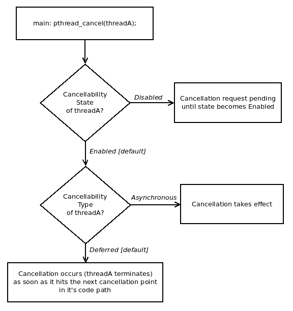

# 十六、多线程技术——第三部分

在[第 14 章](14.html)、*和*多线程部分第一部分-要点**、*和[第 15 章](15.html)、*多线程第二部分-同步*中介绍了编写强大的**多线程**(**MT**)应用的许多原因和方法，本章重点介绍了几个关键问题*

它揭示了开发安全和健壮的 MT 应用的许多关键安全方面；在这里，读者将了解线程安全、为什么需要线程安全，以及如何使函数成为线程安全的。 在运行时，可以让一个线程杀死另一个线程；这是通过线程取消机制实现的-除了取消之外，如何确保在终止线程之前，首先确保它释放它仍然持有的所有资源(如锁和动态内存)？ 我们介绍了线程清理处理程序来说明这一点。

最后，本章深入探讨了如何安全地混合多线程和信号，多进程和多线程的一些优缺点，以及一些提示和常见问题。

# 线程安全

在开发多线程应用时，一个关键的问题是线程安全，但不幸的是，这个问题往往不是一个明显的问题。 **线程安全*，或者，就像手册页上描述的那样，它是一个可以由多个线程安全地并行执行的函数或 API，没有任何不利的问题。*

 *要了解这个线程安全问题到底是什么，让我们回到我们在[附录 A](https://www.packtpub.com/sites/default/files/downloads/File_IO_Essentials.pdf)，*文件 I/O 要点；*中看到的程序之一。您可以在本书的 GitHub 存储库中找到源代码：https://github.com/PacktPublishing/Hands-on-System-Programming-with-Linux/blob/master/A_fileio/iobuf.c[GitHub](https://github.com/PacktPublishing/Hands-on-System-Programming-with-Linux/blob/master/A_fileio/iobuf.c)。 在本程序中，我们使用`fopen(3)`*和*在追加模式下打开一个文件，然后对其执行一些 I/O(读/写)操作；我们在这里复制该章的一小段：

*   我们`fopen(3)`一个流(追加模式：`a`)到我们的目的地，只是`/tmp`目录中的一个常规文件(如果它不存在，它将被创建)
*   然后，在循环中，对于用户提供的作为参数的迭代次数，我们将执行以下操作：
    *   通过`fread(3)`stdio 库 API 从源流读取几(512)个字节(它们将是随机的值)
    *   通过`fwrite(3)`stdio 库 API 将这些值写入我们的目标流(检查 EOF 和/或错误条件)

以下是代码片段，主要是执行实际 I/O 的`testit`函数；请参阅：：

```sh
static char *gbuf = NULL;

static void testit(FILE * wrstrm, FILE * rdstrm, int numio)
{
  int i, syscalls = NREAD*numio/getpagesize();
  size_t fnr=0;

  if (syscalls <= 0)
      syscalls = 1;
  VPRINT("numio=%d total rdwr=%u expected # rw syscalls=%d\n",
                 numio, NREAD*numio, NREAD*numio/getpagesize());

  for (i = 0; i < numio; i++) {
     fnr = fread(gbuf, 1, NREAD, rdstrm);
     if (!fnr)
         FATAL("fread on /dev/urandom failed\n");

     if (!fwrite(gbuf, 1, fnr, wrstrm)) {
         free(gbuf);
         if (feof(wrstrm))
             return;
         if (ferror(wrstrm))
             FATAL("fwrite on our file failed\n");
     }
  }
}
```

请注意第一行代码，它对我们的讨论非常重要；用于保存源和目标数据的内存缓冲区是一个完全全局(静态)变量`gbuf`。

下面是它在 APP 的`main()`功能中的分配位置：

```sh
...
  gbuf = malloc(NREAD);
  if (!gbuf)
      FATAL("malloc %zu failed!\n", NREAD);
...
```

那又怎么样？ 在[附录 A](https://www.packtpub.com/sites/default/files/downloads/File_IO_Essentials.pdf)、*File I/O Essentials*中，我们使用了一个隐含的假设，即进程不是单线程的；因此，只要这个假设仍然成立，程序就会运行良好。 但请仔细考虑这一点；当我们想要移植此程序以使其具有多线程功能时，代码还不够好。 为什么？ 应该很清楚：如果多个线程同时执行`testit`*和*函数的代码(这正是预期的)，那么全局共享可写内存变量`gbuf`的存在告诉我们代码路径中将有临界区。 *正如我们在[第 15 章](15.html)，*使用 PthreadsII 部分-同步*进行多线程处理中详细了解的那样，必须消除或保护每个临界区，以防止数据竞争。*

 *在前面的代码片段中，我们愉快地调用了这个全局缓冲区上的`fread(3)`*和`fwrite(3)`*和*，而没有任何保护*。*只需可视化同时运行此代码路径的多个线程；结果将是灾难性的。*

 *因此，现在我们可以看到并得出结论：`testit`函数不是线程安全的*和*(至少，程序员必须记录*和*这一事实，以防止其他人在多线程应用中使用代码！)。

更糟糕的是，想象一下，我们之前开发的线程不安全的文件函数被合并到一个完全共享的文件库中(在 Unix/Linux 上通常被称为完全共享的对象和文件)； 任何链接到这个库的(多线程)应用都可以访问这个函数。如果这样一个应用的多个线程调用它，我们就会有一个潜在的竞争-一个错误，一个缺陷！不仅如此，这样的缺陷是真正难以发现和难以理解的，会造成问题，可能还会造成各种临时的绷带修复(这只会让情况变得更糟，客户对软件的信心更低)。灾难实际上是以看似无害的方式造成的。

关于这一点，我们的结论是要么使函数线程安全，要么清楚地将其记录为线程不安全(并且仅在单线程上下文中使用它(如果有的话))。

# 使代码线程安全

显然，我们更希望使`testit`函数*和*是线程安全的。 现在的问题是，我们到底如何才能做到这一点呢？ 再说一次，这很简单：有两种方法(实际上不止两种，但我们稍后再谈)。

如果我们能消除代码路径中的任何和所有全局共享可写数据，我们就没有临界区，也就没有问题；换句话说，它就变得线程安全了。 因此，实现这一点的一种方法是确保函数只使用局部(自动)变量。 在继续下一步之前，了解有关可重入和线程安全的一些关键点是很重要的。

# 重入安全与线程安全

重入安全和线程安全到底有什么不同？ 混乱确实盛行。 这里有一个简洁的观点：在多任务和多线程操作系统出现之前，重入安全问题是一个更古老的问题，这意味着只有一个令人担忧的线程正在执行。 要使函数是重入安全的，应该能够在前一个上下文尚未完成执行时从另一个上下文正确地重新调用该函数(考虑信号处理程序在给定函数已经执行时重新调用该函数)。 关键要求：它应该只使用局部变量，或者有能力保存和恢复它使用的全局变量，这样它就是安全的。 (这些想法已在*重入安全和信号*部分的[第 11 章](11.html)，*信号-第一部分*中讨论。 正如我们在那一章中提到的，信号处理程序应该只调用保证重入安全的函数；在信号处理上下文中，这些函数被称为异步信号安全函数。)

另一方面，线程安全问题是一个更新的问题-我们指的是支持多线程的现代操作系统。 线程安全的函数可以同时从多个线程(可能在多个 CPU 核心上运行)并行调用，而不会中断它。 共享的可写数据是重要的，因为在任何情况下，代码都只是可读的，可以执行，因此并行执行是完全安全的。

通过使用互斥锁使函数线程安全确实是可能的(这些讨论将通过示例详细介绍)，但会带来性能问题。 有更好的方法使函数线程安全：重构它，或者使用 TLS 或 TSD-我们将在通过 TLS 的*线程安全和通过 TSD*的*线程安全一节中讨论这些方法。*

简而言之，重入安全策略关注的是一个线程在活动调用仍然存在的情况下重新调用函数；线程安全策略关注的是多个线程-并发代码-并行执行相同的函数。 (一篇优秀的 Stack Overflow 帖子更详细地描述了这一点；请参阅有关 GitHub 存储库的*进一步阅读*部分。)

现在，回到我们之前的讨论。从理论上讲，只使用局部变量听起来不错(对于小的实用函数，我们应该这样设计它)，但现实是，有一些复杂的项目以这样的方式发展，在函数中使用全局共享可写数据对象成为不能总是避免的事情。 在这种情况下，从我们在上一篇[第 15 章](15.html)，*使用 Pthread 多线程第二部分-同步*中了解到的关于同步的知识，我们知道了答案：使用互斥锁来识别和保护临界区。

是的，这是可行的，但会对性能造成很大的影响。 请记住，锁会破坏并行性并序列化代码流，从而造成瓶颈。 在不使用互斥锁的情况下实现线程安全实际上构成了一个真正安全的重入安全函数*。* 这样的代码确实是一件有用的事情，而且是可以做到的；有两种强大的技术可以实现这一点，称为 TLS*、*和 TSD。 *请稍加耐心，我们将在本节中介绍如何使用：通过 TLS 实现的*线程安全和通过 TSD*实现的*线程安全。**

*A point to emphasize: the designer and programmer must guarantee that all code that can be executed by multiple threads at any point in time is designed, implemented, tested, and documented to be thread-safe.This is one of the key challenges to meet when designing and implementing multithreaded applications.

另一方面，如果可以保证函数总是只由单个线程执行(例如，在创建线程之前从 main()*和*调用的早期初始化例程)，那么显然没有必要保证它是线程安全的。

# 汇总表-使函数线程安全的方法

让我们以表格的形式总结前面的几点，该表格告诉我们如何实现所有函数的线程安全这一最重要的目标：

| **使函数线程安全的方法** | **备注** |
| 仅使用局部变量 | 幼稚的；在实践中很难实现的。 |
| 使用全局变量和/或静态变量，并使用互斥锁保护临界区 | 可行，但会显著影响性能[1] |
| 重构函数，使其成为可重入的-安全的-通过根据需要使用更多参数来消除在函数中使用静态变量 | 有用的方法-几个旧的`foo`glibc 函数被重构为`foo_r`。 |
| **线程本地存储**(**TLS**) | 通过每个线程拥有一个变量副本来确保线程安全；工具链和操作系统版本相关。 功能强大，使用方便。 |
| **线程特定数据**(**TSD**) | 同样的目标：使数据线程安全--更老的实现，更多的工作可用。 |

Table 1: Approaches to making functions thread-safe

[1]虽然我们说使用互斥锁会显著影响性能，但在正常情况下，互斥锁的性能确实非常高(很大程度上是因为它在 Linux 上通过快速 Futex 用户互斥锁在内部实现)。

让我们更详细地了解这些方法。

第一种方法只使用局部变量，这是一种相当幼稚的方法，可能只适用于小程序；我们就到此为止吧。

# 通过互斥锁实现线程安全

假设一个函数确实使用全局变量和/或静态变量，并且决定继续使用它们(我们在*表 1*中提到的第二种方法)，显然代码中使用它们的位置构成了临界区*。*如[第 15 章](15.html)，*多线程使用 PthreadsPart II-Synchronization*已经详细说明，我们必须*保护*这些临界区；在这里，我们使用 pt4[第 15 章](15.html)，*使用 PthreadsPart II-Synchronization*，我们必须*保护*这些临界区；在这里，我们使用 pt3

For readability, only key parts of the source code are displayed here; to view the complete source code, build and run it, the entire tree is available for cloning from GitHub: [https://github.com/PacktPublishing/Hands-on-System-Programming-with-Linux](https://github.com/PacktPublishing/Hands-on-System-Programming-with-Linux).

为此，我们在以下代码片断中向 Sample 函数添加了 pthread 互斥锁(我们适当地将其重命名；在此处可以找到完整的源代码：`ch16/mt_iobuf_mtx.c`)：

```sh
static void testit_mt_mtx(FILE * wrstrm, FILE * rdstrm, int numio,
                             int thrdnum)
{
 ...
  for (i = 0; i < numio; i++) {
 LOCK_MTX(&mylock);
      fnr = fread(gbuf, 1, NREAD, rdstrm);
      UNLOCK_MTX(&mylock);
      if (!fnr)
          FATAL("fread on /dev/urandom failed\n");

 LOCK_MTX(&mylock);
      if (!fwrite(gbuf, 1, fnr, wrstrm)) {
          free(gbuf);
 UNLOCK_MTX(&mylock);
          if (feof(wrstrm))
              return;
          if (ferror(wrstrm))
              FATAL("fwrite on our file failed\n");
      }
 UNLOCK_MTX(&mylock);
   }
}
```

这里，我们使用与在中相同的宏来执行互斥锁和解锁(为避免重复，我们没有显示初始化互斥锁的代码，有关这些详细信息，请参阅[第 15 章](15.html)，*使用 PthreadsII 多线程第 II 部分-同步**，*。 我们还向函数添加了额外的`thrdnum`*和*参数，以便能够打印出当前通过它运行的线程号。)

关键点：在关键部分-代码中访问(读取或写入)共享的可写全局变量的位置`gbuf`*-*，我们获取互斥锁，执行访问(在我们的示例中，是在`fread(3)`*、*和`fwrite(3)`)，然后解锁互斥锁。

现在，即使多个线程运行前面的函数，也不会出现数据完整性问题。 是的，它可以工作，但要付出相当大的性能代价；如前所述，每个临界区(解锁代码和相应解锁之间的代码)都将被序列化。 因此，锁定可能会在代码路径中形成瓶颈，特别是在我们的示例中，如果`numio`参数很大，那么 For 循环将执行一段时间。 同样，如果函数很忙并且经常被调用，也会出现瓶颈。 (快速检查`perf(1)`发现，单线程版本执行 100,000 个 I/O 需要 379 毫秒，而具有锁定功能的多线程版本执行相同数量的 I/O 需要 790 毫秒。)

我们已经讨论了这一点，但让我们快速测试一下自己：为什么我们没有保护代码中使用`fnr`和`syscalls`等变量的位置？ 答案是因为它是一个完全局部变量；更重要的是，每个线程在执行前面的函数时都会得到自己的局部变量副本，因为每个线程都有自己的私有堆栈-并且局部变量在堆栈上实例化。

要使程序正常工作，我们必须重构如何将前面的函数实际设置为线程工作者例程；我们发现需要使用自定义数据结构将各种参数传递给每个线程，然后使用一个小的`wrapper`函数-`wrapper_testit_mt_mtx()`-调用实际的 I/O 函数；我们让读者详细检查源代码。

让我们运行它：

```sh
$ ./mt_iobuf_mtx 10000
./mt_iobuf_mtx: using default stdio IO RW buffers of size 4096 bytes; # IOs=10000
mt_iobuf_mtx.c:testit_mt_mtx:62: [Thread #0]: numio=10000   total rdwr=5120000   expected # rw syscalls=1250
mt_iobuf_mtx.c:testit_mt_mtx:66: gbuf = 0x23e2670
mt_iobuf_mtx.c:testit_mt_mtx:62: [Thread #1]: numio=10000   total rdwr=5120000   expected # rw syscalls=1250
mt_iobuf_mtx.c:testit_mt_mtx:66: gbuf = 0x23e2670
 Thread #0 successfully joined; it terminated with status=0
 Thread #1 successfully joined; it terminated with status=0
$ 
```

这揭示了全貌；显然，正在使用的 I/O 缓冲区(Gbuf)对于两个线程是相同的(请看打印出的地址)，因此需要锁定它。

顺便说一句，在标准文件流 API 中，存在*_ 解锁的*_ 个 API，如`fread_unlocked(3)`和`fwrite_unlocked(3)`。这些 API 与常规 API 相同，只是在文档中被明确标记为 MT-不安全。 使用它们是不明智的。

By the way, open files are a shared resource between the threads of a process; the developer must take this into account as well. Performing IO simultaneously with multiple threads on the same underlying file object can cause corruption, unless file-locking techniques are used. Here, in this specific case, we are explicitly using a mutex lock to protect critical sections – which happen to be at the precise points where we perform file I/O, so explicit file-locking becomes unnecessary.

# 通过函数重构实现线程安全

正如我们在前面的示例中看到的那样，我们需要互斥锁，因为所有应用线程都将`gbuf`的全局缓冲区用作它们的 I/O 缓冲区。 那么，想想看：如果我们可以为每个线程分配一个本地的 I/O 缓冲区，会怎么样？这确实可以解决这个问题！ 具体如何，将用以下代码显示。

但首先，既然您已经熟悉了前面的示例(我们在其中使用了互斥锁)，那么我们来研究一下重构后的程序的输出结果：

```sh
$ ./mt_iobuf_rfct 10000
./mt_iobuf_rfct: using default stdio IO RW buffers of size 4096 bytes; # IOs=10000
mt_iobuf_rfct.c:testit_mt_refactored:51: [Thread #0]: numio=10000   total rdwr=5120000   expected # rw syscalls=1250
 iobuf = 0x7f283c000b20
mt_iobuf_rfct.c:testit_mt_refactored:51: [Thread #1]: numio=10000   total rdwr=5120000   expected # rw syscalls=1250
 iobuf = 0x7f2834000b20
 Thread #0 successfully joined; it terminated with status=0
 Thread #1 successfully joined; it terminated with status=0
$ 
```

关键字*和*实现：这里使用的 I/O 缓冲区`iobuf`、*和*对于每个线程都是唯一的(只需查看打印出来的地址)！ 因此，这消除了 I/O 函数中的临界区，并且不需要使用互斥锁。 实际上，该函数仅使用局部变量，因此既是可重入的，又是线程安全的。

For readability, only key parts of the source code are displayed here. To view the complete source code, build and run it; the entire tree is available for cloning from GitHub: [https://github.com/PacktPublishing/Hands-on-System-Programming-with-Linux](https://github.com/PacktPublishing/Hands-on-System-Programming-with-Linux).

以下代码片段清楚地揭示了这是如何设置的(完整源代码：`ch16/mt_iobuf_rfct.c`)：

```sh
struct stToThread {
    FILE *wrstrm, *rdstrm;
    int thrdnum, numio;
 char *iobuf;
};
static struct stToThread *ToThread[NTHREADS];
static void * wrapper_testit_mt_refactored(void *msg)
{
  struct stToThread *pstToThread = (struct stToThread *)msg;
  assert (pstToThread);

  /* Allocate the per-thread IO buffer here, thus avoiding the global
 * heap buffer completely! */
 pstToThread->iobuf = malloc(NREAD);
  ...
  testit_mt_refactored(pstToThread->wrstrm, pstToThread->rdstrm,
           pstToThread->numio, pstToThread->thrdnum,
           pstToThread->iobuf);

  free(pstToThread->iobuf);
  pthread_exit((void *)0);
}
```

可以看到，我们通过在自定义的`stToThread`*和*结构中添加一个额外的缓冲区指针成员来进行重构。 重要的是：在线程包装器函数中，我们然后为其分配内存，并将指针传递给我们的线程例程。 为此，我们在线程 I/O 例程中添加了一个额外的参数：

```sh
static void testit_mt_refactored(FILE * wrstrm, FILE * rdstrm, int numio, int thrdnum, char *iobuf)
{
...
  for (i = 0; i < numio; i++) {
      fnr = fread(iobuf, 1, NREAD, rdstrm);
      if (!fnr)
          FATAL("fread on /dev/urandom failed\n");
      if (!fwrite(iobuf, 1, fnr, wrstrm)) {
      ...
  }
```

现在，在前面的 I/O 循环中，我们对每个线程的缓冲区`iobuf`*和*进行操作，因此没有临界区，也不需要锁定。

# 标准 C 库与线程安全性

大量的标准 C 库(Glibc)代码不是线程安全的。 什么？ 一个人问。 但是，嘿，这些代码中的很多都是在 20 世纪 70 年代和 80 年代编写的，当时多线程还不存在(至少对于 Unix 是这样)；因此，我们很难责怪他们没有将其设计为线程安全的！

# 无需线程安全的 API 列表

标准的 C 库，Glibc，有很多旧的函数，用 The Open Group 的手册的话说，这些函数不需要是线程安全的(或者不需要是线程安全的)。 本卷 POSIX.1-2017 定义的所有函数都应是线程安全的，但以下函数不必是线程安全的除外。 那到底是什么意思？ 简单：这些 API 不是线程安全的。 因此，请小心-不要在 MT 应用中使用它们。完整的列表可以在以下位置找到：[http://pubs.opengroup.org/onlinepubs/9699919799/functions/V2_chap02.html#tag_15_09_01](http://pubs.opengroup.org/onlinepubs/9699919799/functions/V2_chap02.html#tag_15_09_01)。

Of course, the preceding list is only valid as of POSIX.1-2017 and is bound to get outdated. The reader must be aware of this recurring issue, and the need to constantly update information like this.

而且，它们大多是库层(Glibc)API*。在前面的所有 API 中，只有一个(`readdir(2)`)是系统调用；这也被认为是不推荐使用的(我们将使用它的 glibc 包装器`readdir(3)`)。根据经验，所有的系统调用都被编写为线程安全的。*

An interesting aside: PHP, a popular web-scripting language, is not considered thread-safe; hence, web servers that serve PHP pages do so using the traditional multiprocess model and not a faster multithreaded framework (for example, Apache uses its internal `mpm_prefork` module—which is single-threaded – to deal with PHP pages).

那么，看到我们刚才讨论的内容，是不是有人得出结论说，开发线程安全的 MT 应用，Glibc 已经不可行了呢？ 没有，先生，我们已经做了一些工作来转换(实际上是重构)前面的许多 API，使它们成为线程安全的。 继续读下去。

# 将 glibc API 从 Ffoo_r 重构到 Ffoo_r

当然，在 MT 应用成为现实的今天，我们该怎么办？ Glibc 的维护人员理解这些问题，并准确地使用了重构*和*技术-通过传递额外的参数来避免使用全局和/或静态变量(就像我们以前对`ch16/mt_iobuf_rfct.c`代码所做的那样)，包括使用参数作为返回值-重构标准的`glibc`函数以使其成为线程安全的。 Glibc 的命名约定是，如果较旧的函数被命名为`foo`，那么重构后的、通常是可重入的、线程安全的版本则被命名为`foo_r`。

为了帮助澄清这一讨论，让我们举一个同时具有较旧的`foo`和较新的`foo_r`功能的 Winlibc API 的例子。`ctime(3)`API 通常由应用开发人员使用；给定 Unix 时间戳后，它会将其转换为人类可读的日期-时间戳(ASCII 文本)。在给定 Unix-Time 时间戳的情况下，它会将其转换为人类可读的日期-时间戳(ASCII 文本)。 (回想一下，我们在[第](13.html)[章](13.html)、*和计时器中使用过`ctime `API。* )让我们直接从[Chaptr 13](13.html)，*个计时器中回想一下，*个 Unix 系统将时间存储为自 1970 年 1 月 1 日午夜(00：00)以来经过的秒数--就当这是 Unix 的诞生吧！ 此时间值称为自大纪元或 Unix 时间以来的时间。 好的，但是今天会有相当多的秒数，对吗？ 那么如何用人类可读的格式来表达呢？ 很高兴您这么问；这不是`ctime(3)`应用接口和`ctime_r(3)`API 的工作。

`ctime(3)`系列 API 签名如下：

```sh
include <time.h>
char *ctime(const time_t *timep);
```

您是否发现了多线程应用的问题？ 返回值是以纯 ASCII 文本表示的时间；它由`ctime(3)`函数存储在静态(因此，共享)数据变量中。 如果多个线程或多或少同时执行`ctime(3)`命令(我的朋友，这正是现代多核系统上可以发生的，而且确实发生了！)，那么我们总是存在对共享数据执行脏读或写的风险。 很简单，因为它没有受到保护；很简单，因为在第一次设计和实现`ctime(3)`时，只有一个线程会在给定的时间点运行它。 当然，今天的情况并非如此。 换句话说，手册页中将`ctime(3)`标记为 MT-不安全，也就是说，它不是线程安全的。 因此，从 MT 应用调用`ctime(3)`命令是错误的-您可能会面临竞争、错误或缺陷的风险。

优秀的 Glibc 人员确实重新实现(重构)了`ctime(3)`，使其成为可重入的和线程安全的；较新的 API 被命名为`ctime_r(3)`。 下面引用它的手册页中的一句话：可重入版本`ctime_r()`做同样的事情，但将字符串存储在用户提供的缓冲区中，该缓冲区应该至少有 26 个字节的空间：

```sh
char *ctime_r(const time_t *timep, char *buf);
```

好极了！ 您注意到了吗？这里最关键的一点是，通过让用户提供返回结果的缓冲区，`ctime(3)`的 API 已经被重构(并重命名为`ctime_r(3)`)，从而变得更具可重入性和线程安全性。 用户将如何执行此操作？ 很简单；下面的一些代码展示了实现这一点的一种方法(我们只需要这里的概念，没有显示错误检查)：

```sh
// Thread Routine here
struct timespec tm;
char * mybuf = malloc(32);
...
clock_gettime(CLOCK_REALTIME, &tm); /* get the current 'UNIX' timestamp*/
ctime_r(&tm.tv_sec, mybuf); /* put the human-readable ver into 'mybuf'*/
...
free(mybuf);
```

想想看：每个执行前面代码的线程都会分配一个单独的唯一缓冲区，并将该缓冲区指针传递给`ctime_r(3)`例程。 这样，我们就可以确保不会互相踩到对方的脚趾；API 现在是可重入的，并且是线程安全的。

请注意，在前面的代码中，我们是如何在 C 中实现这种重构技巧的：通过传递要作为值结果样式参数写入的唯一缓冲区！*这确实是一种常见的技术，经常被 Flibc`foo_r`函数例程使用：我们通过不使用静态或全局变量(而不是使用值结果样式参数(或输入输出))将一个或多个值传递给它(甚至作为一种返回值返回给调用者)，从而保持例程的线程安全。

`ctime(3)`上的手册页，甚至大多数其他 API 上的手册页，都记录了它描述的 API 是否是线程安全的：这一点非常重要！ 我们不能过分强调这一点：多线程应用程序员必须检查并确保在应该是线程安全的函数中调用的所有函数本身都是线程安全的(记录在案)。

以下是`ctime(3)`上手册页的一部分屏幕截图，在**Attributes**部分下面显示了以下信息：


Figure 1 : Screenshot of ATTRIBUTES section of the man page on ctime(3)

很明显，MT-SAFE 暗示例程是线程安全的；而 MT-UNSAFE 暗示它不是。关于这些属性的手册页(7)将进一步深入这些细节；它清楚地指出线程安全并不能保证 API 也是原子的；一定要通读它。

我们还注意到手册页指出，POSIX.1-2008 将`ctime_r`API 本身标记为过时，并使用`strftime(3)`代替它。 请这样做。 在这里，我们使用了`ctime(3)`和`ctime_r(3)`API 仅仅是为了说明一个关于 glibc 例程的线程不安全和安全版本的示例。

# 一些使用 libc、foo 和 foo_r 的 API

线程不安全的`ctime(3)`现在被其线程安全的对应对象`ctime_r(3)`所取代；这只是现代 glibc 中普遍趋势的一个例子：

*   较旧的线程(MT-UNSAFE)不安全函数称为`foo`
*   有一个对应的版本，即更新的线程(MT-Safe)安全 API`foo_r`。

为了让读者了解这一点，我们列举了一些(不是全部！)。 关于 API 的 Glibc`foo_r`风格：

| `asctime_r(3)`
`crypt_r(3)`
`ctime_r(3)`
`drand48_r(3)` | `getpwnam_r(3)`
`getpwuid_r(3)`
`getrpcbyname_r(3)`
`getrpcbynumber_r(3)`
`getrpcent_r(3)`
`getservbyname_r(3)` | `seed48_r(3)`
`setkey_r(3)`
`srand48_r(3)`
`srandom_r(3)`
`strerror_r(3)`
`strtok_r(3)` |
| `getdate_r(3)`
`getgrent_r(3)`
`getgrgid_r(3)`
`getgrnam_r(3)`
`gethostbyaddr_r(3)`
`gethostbyname2_r(3)`
`gethostbyname_r(3)`
`gethostent_r(3)`
`getlogin_r(3)` | `nrand48_r(3)`
`ptsname_r(3)`
`qecvt_r(3)`
`qfcvt_r(3)`
`qsort_r(3)`
`radtofix_r(3)`
`rand_r(3)`
`random_r(3)`
`readdir_r(3)` | `ustrtok_r(3)`
`val_gethostbyaddr_r(3)`
`val_gethostbyname2_r(3)`
`val_gethostbyname_r(3)` |

Table 3: Some of the glibc foo_r APIs

此列表并不是详尽的；请注意，`ctime_r(3)`API 代码在此列表中。 冒着重复的风险，请确保您只在 MT 应用中使用`foo_r`版本的 API，因为它们是`foo`版本 API 的线程安全版本。

# 通过 TLS 实现线程安全

前面的讨论是关于已经存在的标准 C 库，即 Glibc 和它的 API 集。 新设计和开发的 MT 应用怎么样？ 显然，我们为它们编写的代码必须是线程安全的。

让我们不要忘记我们是如何通过重构来使我们的`testit_mt_refactored`函数成为线程安全的-添加一个沿着缓冲区的地址传递以用于 I/O 的`iobuf`参数-保证缓冲区对于每个线程都是唯一的，因此是线程安全的(不需要任何锁定)。

我们能自动获得这样的功能吗？ 嗯，是的：编译器(GCC 和叮当)并没有提供一个近乎神奇的功能来做类似的事情：tls。 使用 TLS，每个激活的线程都会实例化一次标记有`__thread`特殊存储类关键字的变量。实际上，如果我们只使用局部变量和 TLS 变量，我们的函数根据定义将是线程安全的，不需要任何(昂贵的)锁定。

这里确实存在一些基本规则和注意事项；让我们来看看这些规则和注意事项：

*   关键字`__thread`可以单独使用，也可以与(事实上，仅与)`static`或`extern`关键字一起使用；如果与它们一起使用，则必须出现在它们之后：

```sh
__thread long l;
extern __thread struct MyStruct s1;
static __thread int safe;
```

*   更广泛地说，可以针对任何全局和文件或函数作用域`static`或`extern`变量指定关键字。 它不能应用于任何局部变量。
*   TLS 只能在(相当新的)工具链和内核版本上使用。

需要理解的重要事情是：尽管它看起来类似于拥有一个锁定的变量，但情况肯定不是这样的！ 考虑一下：给定一个名为`mytls`的 TLS 变量，不同的线程并行使用它就可以了。 但是，如果线程在 TLS 变量`&mytls`上使用 Address-Of 运算符，它将拥有该变量的实例地址。 任何其他线程，如果访问此地址，都可以使用此地址来访问变量；因此，它并不是真正意义上的锁定。 当然，如果程序员使用正常约定(不允许其他线程访问不同线程的 TLS 变量)，那么一切都会正常工作。

重要的是要认识到，TLS 支持只在 Linux2.6 内核、GCC 3.3 版或更高版本以及 NPTL 之后才可用。 实际上，这意味着几乎所有较新的 Linux 发行版都将支持 TLS。

因此，像往常一样，让我们通过 TLS 移植我们的线程不安全函数，使其成为线程安全函数。 这真的很简单；我们所要做的就是将以前的全局缓冲区`gbuf`转换成线程安全的 TLS 缓冲区(`iobuf`)：

```sh
static __thread char iobuf[NREAD];     // our TLS variable

static void testit_mt_tls(FILE * wrstrm, FILE * rdstrm, int numio, int thrdnum)
{
  int i, syscalls = NREAD*numio/getpagesize();
  size_t fnr=0;

  if (syscalls <= 0)
    syscalls = 1;
  VPRINT("[Thread #%d]: numio=%d total rdwr=%u expected # rw 
          syscalls=%d\n"
         " iobuf = %p\n", thrdnum, numio, NREAD*numio, syscalls, iobuf);
...
```

需要注意的唯一重要变化是现在将参数`iobuf`变量声明为 TLS 变量；其他所有内容几乎保持不变。 快速测试运行确认每个线程都收到一个单独的 TLS 变量副本：

```sh
$ ./mt_iobuf_tls 12500
./mt_iobuf_tls: using default stdio IO RW buffers of size 4096 bytes; # IOs=12500
mt_iobuf_tls.c:testit_mt_tls:48: [Thread #0]: numio=12500 total rdwr=6400000 expected # rw syscalls=1562
 iobuf = 0x7f23df1af500
mt_iobuf_tls.c:testit_mt_tls:48: [Thread #1]: numio=12500 total rdwr=6400000 expected # rw syscalls=1562
 iobuf = 0x7f23de9ae500
 Thread #0 successfully joined; it terminated with status=0
 Thread #1 successfully joined; it terminated with status=0
$ 
```

每个线程`iobuf`都是一个每个线程的 TLS 实例；每个实例都有一个唯一的地址。 没有锁，没有大惊小怪，任务完成了。 TLS 在现实世界中的使用率很高；未初始化的全局进程`errno`就是一个很好的例子。

TLS 似乎是一种使函数线程安全的强大且易于使用的技术；有什么缺点吗？ 嗯，想想看：

*   对于每个标记为 TLS 存储类的变量，必须在运行时为每个活动的线程分配内存；如果我们有很大的 TLS 缓冲区，这可能会导致分配大量内存。
*   平台支持：如果您的 Linux 平台太旧，将不支持它(通常不应该是这样)。

# 通过 TSD 实现线程安全

在我们刚刚看到的 TLS 技术之前(也就是在 Linux2.6 和 GCC 3.3 之前)，如何保证编写一个新的 API 是线程安全的呢？ 还有一种更古老的技术，叫做 TSD。

简而言之，从应用开发人员的角度来看，TSD 是一个更复杂的解决方案--要实现 TLS 如此轻松地给我们带来的最终结果--使函数线程安全，还需要做更多的工作。

使用 TSD，线程安全例程必须调用初始化器函数(通常使用`pthread_once(3)`完成)，该函数创建唯一的线程特定的数据键(使用`pthread_key_create(3)`API)。 此初始化式例程使用`pthread_getspecific(3)`和`pthread_setspecific(3)`API 将线程特定的数据变量(如我们示例中的`iobuf`缓冲区指针)与该键相关联。 最终结果是数据项现在是特定于线程的，因此是线程安全的。 在这里，我们不再深入研究使用 TSD，因为它是一个较旧的解决方案，在现代 Linux 平台上可以轻松优雅地取代 TLS。 不过，对于感兴趣的读者，请参考 GitHub 存储库的*进一步阅读*部分-我们提供了使用 TSD 的链接。

# 线程取消和清理

Pthread 设计为实现健壮的多线程应用的另外两个关键活动提供了一个复杂的应用框架：能够让应用中的线程取消(有效地杀死)另一个线程，并且能够让正常终止(通过线程`pthread_exit(3)`)或异常终止(通过取消)的线程能够执行所需的资源清理。

以下各节将介绍这些主题。

# 取消线程

可视化正在运行的 GUI 应用；它会弹出一个对话框，通知用户它现在正在执行某些工作(可能还会显示一个进度条)。 我们设想这项工作是由整个应用流程的一个线程执行的。 为了方便用户，还提供了一个 Cancel 按钮；单击它应该会导致 ongoimg 工作被取消。

我们怎样才能实现这一点呢？ 换句话说，一个人如何杀死一条线？ 首先要注意的是，pthreads 为这种类型的操作提供了一个框架：线程取消。 取消线程并不等同于向其发送信号；它是一个线程请求另一个线程终止的一种方式。要实现这一点，我们需要理解并遵循提供的框架。

# 线程取消框架

为了帮助提高清晰度，让我们举个例子：假设应用的第一个主线程创建了两个工作线程 A 和 B。现在，第二个主线程想要取消线程 A。

在目标线程(此处为 A)上请求取消的 API 如下：

`int pthread_cancel(pthread_t thread);`

第一个`thread`参数是目标线程-我们(礼貌地)请求请您去死，非常感谢。

但是，您已经猜到了，事情并没有那么简单：目标线程有两个属性(可以设置)，它们决定是否取消以及何时取消：

*   可取消状态
*   可消除性类型

# 可取消状态

要求目标线程处于适当的可取消状态。 状态为布尔-可取消(在目标线程上，A)为*启用*或*禁用*；以下是设置此状态的 API：

`int pthread_setcancelstate(int state, int *oldstate);`

线程的两种可能的可取消状态(作为第一个参数提供的值)如下所示：

*   `PTHREAD_CANCEL_ENABLE`设置(创建时默认)
*   `PTHREAD_CANCEL_DISABLE`

显然，前一个可取消状态将在第二个参数`oldstate`中返回。)。 仅当目标线程的可取消状态为已启用时，才能取消该目标线程。 默认情况下，线程的可取消状态在创建时处于启用状态。

这是该框架的一个强大特征：如果目标线程 A 正在执行关键活动，并且甚至不想被考虑取消，则它仅将其当前可取消状态设置为禁用，并且在完成所述关键活动后将其重置为启用。

# 可取消类型

假设目标线程启用了可取消状态是第一步；线程的可取消类型决定了接下来会发生什么。 可取消类型有两种：延迟(默认)和非异步，当线程的可取消类型为非异步时，可以在任何时间点取消(实际上应该立即发生，但并不总是保证会发生)；如果可取消类型是延迟(默认)，则只能在到达下一个取消点时才能取消(终止)。(如果线程的可取消类型是非异步的，则只能在到达下一个可取消点的时候才能取消(终止))；如果线程的可取消类型是非异步的，则它可以在任何时间点被取消(实际上应该立即发生，但并不总是保证会发生)。

另一个取消点是(通常是阻塞的)函数列表(稍后将详细介绍)。 请记住，当目标线程(请记住，该线程处于 Enabled Cancelability 状态且延迟类型)在其代码路径中遇到下一个取消点时，它将终止。

以下是设置可取消类型的接口：

`int pthread_setcanceltype(int type, int *oldtype);`

作为第一个参数类型提供的值是两种可能的可取消类型，它们是：

*   `PTHREAD_CANCEL_DEFERRED`设置(创建时默认)
*   `PTHREAD_CANCEL_ASYNCHRONOUS`

显然，前一个可取消类型将在第二个参数`oldtype`中返回。

呼！ 让我们尝试将此取消框架表示为流程图：



Figure 2: Pthreads cancelation

`pthread_cancel(3)`这是一个完全非阻塞的 API，我们的意思是，即使目标线程的可取消状态被关闭，或者目标线程的可取消状态被启用，但可取消状态类型被推迟，并且还没有到达取消点，虽然目标线程可能需要一些时间才能真正死亡，但是主线程的`pthread_cancel(3)`调用将返回成功(返回值`0`)，这意味着取消请求已经成功排队。

在执行关键活动时短时间禁用 Cancelation 状态是可以的，但长时间禁用同样的状态可能会导致应用看起来没有响应。

为可取消类型使用最小的异步取值通常不是正确的做法。 为什么？ 那么，线程究竟在什么时候被取消就成了一场竞赛；它是在分配某种资源(比如通过`malloc(3)`分配内存)之前还是之后呢？ 在这种情况下，即使是一些清理处理程序也没有真正的用处。 此外，只有记录为异步-取消-安全的 API 才能以异步方式安全地取消；实际上，只有取消 API 本身很少。 出于这些原因，最好避免异步取消。 另一方面，如果线程主要受 CPU 限制(执行一些数学计算，比如素数生成)，那么使用异步取消可以帮助保证线程在请求时立即死亡。

另一个关键点是：(在我们的示例中)主线程如何知道目标线程实际上已经终止了？ 请记住，第一个主线程预计将在所有线程上加入；因此，目标线程在终止时将被加入，并且-事情是这样的-来自`pthread_join(3)`的返回值(状态)将是`PTHREAD_CANCELED`。`pthread_join(3)`是检查取消是否实际发生的唯一方法。

我们了解到，在(默认)取消类型为延迟的情况下，直到目标线程遇到取消点函数，才会发生实际的线程取消。 线程取消点只是一个 API，在该 API 处，线程取消被实际检测到，并由底层实现使其生效。 取消点并不局限于 pthread 和 API；许多新的 glibc 函数充当取消点。 读者可以通过 GitHub 存储库的*进一步阅读*部分中提供的链接(Open Group POSIX.1c 线程)找到取消点 API 的列表。 根据经验，取消点通常是阻塞库 API。

但是，如果线程正在执行的代码中没有取消点(比方说，CPU 限制的计算循环)，该怎么办呢？ 在这种情况下，两种方法中的任何一种都可以使用非异步取消类型，或者更好的方法是通过调用`void pthread_test_cancel(void);`API 在循环中显式引入保证取消点。

如果要取消的目标线程点击此函数，并且取消请求处于挂起状态，则它将终止。

# 取消线程-提供代码示例

下面是一个演示线程取消的简单代码示例；我们让第一个主线程创建两个工作线程(将它们分别视为线程 A 和线程 B)，然后让第二个主线程取消线程 A。并行地，我们故意让线程 A 禁用取消(通过将取消状态设置为禁用)，执行一些假工作(我们调用 Trusted`DELAY_LOOP`宏来模拟工作)，然后重新启用取消。 取消请求在下一个取消点生效(当然，取消类型默认为“延迟”)，在这里，它只是第一个`sleep(3)`取消的 API。在此，取消请求将在下一个取消点生效(当然，这是默认的取消类型)，在这里，取消请求只是第一个`sleep(3)`取消 API。

演示线程取消(`ch16/cancelit.c`)*和*的代码如下。

For readability, only key parts of the source code are displayed here. To view the complete source code, build and run it. The entire tree is available for cloning from GitHub: [https://github.com/PacktPublishing/Hands-on-System-Programming-with-Linux](https://github.com/PacktPublishing/Hands-on-System-Programming-with-Linux).

在线程创建循环完成后，我们拿起`main`中的代码：

```sh
int main(void)
{
...  
  // Lets send a cancel request to thread A (the first worker thread)
  ret = pthread_cancel(tid[0]);
  if (ret)
      FATAL("pthread_cancel(thread 0) failed! [%d]\n", ret);

  // Thread join loop
  for (i = 0; i < NTHREADS; i++) {
      printf("main: joining (waiting) upon thread #%ld ...\n", i);
      ret = pthread_join(tid[i], (void **)&stat);
      ...
          printf("Thread #%ld successfully joined; it terminated with"
                 "status=%ld\n", i, stat);
          if ((void *)stat == PTHREAD_CANCELED)
              printf(" *** Was CANCELLED ***\n");
      }
  }
```

以下是线程`worker`例程：

```sh
void * worker(void *data)
{
  long datum = (long)data;
  int slptm=8, ret=0;

  if (datum == 0) { /* "Thread A"; lets keep it in a 'critical' state,
           non-cancellable, for a short while, then enable
           cancellation upon it. */
      printf(" worker #%ld: disabling Cancellation:"
      " will 'work' now...\n", datum);
      if ((ret = pthread_setcancelstate(PTHREAD_CANCEL_DISABLE, NULL)))
          FATAL("pthread_setcancelstate failed 0 [%d]\n", ret);
      DELAY_LOOP(datum+48, 100);   // the 'work'
      printf("\n worker #%ld: enabling Cancellation\n", datum);
      if ((ret = pthread_setcancelstate(PTHREAD_CANCEL_ENABLE, NULL)))
          FATAL("pthread_setcancelstate failed 1 [%d]\n", ret);
  }

  printf(" worker #%ld: will sleep for %ds now ...\n", datum, slptm);
 sleep(slptm); // sleep() is a 'cancellation point'
  printf(" worker #%ld: work (eyeroll) done, exiting now\n", datum);

  /* Terminate with success: status value 0.
   * The join will pick this up. */
  pthread_exit((void *)0);
}
```

快速测试运行表明它确实起作用了；可以看到线程 A 已被取消。 我们建议您运行程序的调试版本，如下所示，这样就可以看到`DELAY_LOOP`宏的效果(否则，它几乎可以瞬间完成其工作，因为它几乎被编译器优化掉了)：

```sh
$ ./cancelit_dbg 
main: creating thread #0 ...
main: creating thread #1 ...
 worker #0: disabling Cancellation: will 'work' now...
0 worker #1: will sleep for 8s now ...
main: joining (waiting) upon thread #0 ...
000000000000000000000000000000000000000000000000000000000000000000000000000000000000000000000000000
 worker #0: enabling Cancellation
 worker #0: will sleep for 8s now ...
Thread #0 successfully joined; it terminated with status=-1
 *** Was CANCELLED ***
main: joining (waiting) upon thread #1 ...
 worker #1: work (eyeroll) done, exiting now
Thread #1 successfully joined; it terminated with status=0

main: now dying... <Dramatic!> Farewell!
$ 
```

# 线程出口处的清理

考虑以下假设情况：一个线程获取一个互斥锁并分配一些堆内存。 显然，一旦它所在的临界区完成，我们预计它将释放堆内存并解锁互斥锁。 如果不进行此清理，将导致严重的(如果不是致命的)应用错误(缺陷)，如内存泄漏或死锁。

但是，有人想知道，如果可怜的线程在释放和解锁之前被取消了怎么办？ 这是有可能发生的，对吧？ 不是的！ 如果开发人员理解并使用 pthreads 框架提供的线程清理处理程序机制，就不会。

当线程终止时会发生什么情况？ 以下步骤是 pthreads 清理框架的一部分：

1.  弹出所有清理处理程序(与清理处理程序推送顺序相反)
2.  调用 TSD 析构函数(如果存在)
3.  这根线断了

这让我们看到了一个有趣的事实：pthread 框架为线程提供了一种有保证的方式，以确保它在终止之前会在自身清理之后-释放内存资源、关闭打开的文件等等。

程序员可以通过设置线程清理处理程序来处理所有这些情况-实际上是一种析构函数。清理处理程序是在线程被取消或以`pthread_exit(3)`终止时自动执行的函数；它是通过调用`pthread_cleanup_push(3)`的 API 来设置的：

```sh
void pthread_cleanup_push(void (*routine)(void *), void *arg);
```

显然，前面例程的第一个参数是清理处理程序函数指针，换句话说，就是清理处理程序函数的名称。 第二个参数是要传递给处理程序函数的任何参数(通常是指向动态分配的缓冲区或数据结构的指针)。

反向语义是通过相应的清理弹出例程实现的；当被调用时，它从清理处理程序堆栈中弹出，从而以相反的顺序执行先前推入清理处理程序堆栈的清理处理程序：

`void pthread_cleanup_pop(int execute);`

还可以通过使用非零参数调用`thread_cleanup_pop(3)`API 来显式调用清理堆栈上最顶层的清理处理程序。

The POSIX standard maintains that the preceding pair of APIs—the push and pop cleanup handlers—can be implemented as macros that expand into functions; indeed, it seems to be implemented this way on the Linux platform. As a side effect of this, it becomes imperative that the programmer call both routines (the pair) within the same function. Failure to comply causes weird compiler failures.

如前所述，TSD 析构函数处理程序(如果存在)也会被调用；在这里，我们忽略这一方面。

You might think, fine, if we use these cleanup handler techniques, we can safely restore state as both thread-cancelation and -termination will guarantee that they invoke any registered cleanup handlers (destructors). But, what if another process (perhaps a root process) sends my MT app a fatal signal (such as `kill -9 <mypid>`)? Well, there's nothing to be done. Please realize that with a fatal signal, all threads in the process, and indeed the entire process itself, will die (in this example). It's an academic question—a moot point. On the other hand, a thread cannot just randomly get killed; there has to be an explicit `pthread_exit(3)` or cancelation carried out upon it. Thus, there is no excuse for the lazy programmer—set up cleanup handler(s) to perform the appropriate cleanup and all will be well.

# 线程清理-代码示例

作为一个简单的代码示例，让我们通过安装线程清理处理程序例程来修改前面重构的程序`ch16/mt_iobif_rfct.c`。 为了测试它，如果用户将`1`作为第二个参数传递给我们的演示程序，我们取消了第一个工作线程，即`ch16/cleanup_hdlr.c`。 程序。

For readability, only key parts of the source code are displayed here. To view the complete source code, build and run it. The entire tree is available for cloning from GitHub: [https://github.com/PacktPublishing/Hands-on-System-Programming-with-Linux](https://github.com/PacktPublishing/Hands-on-System-Programming-with-Linux).

以下是清理处理程序函数和重新编制的包装器例程，现在使用清理处理程序推送和弹出 API 执行：

```sh
static void cleanup_handler(void *arg)
{
    printf("+++ In %s +++\n" " free-ing buffer %p\n", __func__, arg);
 free(arg);
}
...
static void *wrapper_testit_mt_refactored(void *msg)
{
  struct stToThread *pstToThread = (struct stToThread *)msg;
  ...
  /* Allocate the per-thread IO buffer here, thus avoiding the global
   * heap buffer completely! */
 pstToThread->iobuf = malloc(NREAD);
  ...
 /* Install a 'cleanup handler' routine */
 pthread_cleanup_push(cleanup_handler, pstToThread->iobuf);

  testit_mt_refactored(pstToThread->wrstrm, pstToThread->rdstrm,
           pstToThread->numio, pstToThread->thrdnum,
           pstToThread->iobuf);

/* *Must* invoke the 'push's counterpart: the cleanup 'pop' routine;
 * passing 0 as parameter just registers it, it does not actually pop
 * off and execute the handler. Why not? Because that's precisely what
 * the next API, the pthread_exit(3) will implicitly do!
 */
 pthread_cleanup_pop(0);
  free(pstToThread->iobuf);

 // Required for pop-ping the cleanup handler!
 pthread_exit((void *)0);
}
```

在这里，`main()`可以根据需要设置线程取消：

```sh
...
  if (atoi(argv[2]) == 1) {
    /* Lets send a cancel request to thread A */
    ret = pthread_cancel(tid[0]);
  ...
```

快速测试运行确认，在取消时，确实调用了清理处理程序并执行了清理：

```sh
$ ./cleanup_hdlr 23114 1
./cleanup_hdlr: using default stdio IO RW buffers of size 4096 bytes; # IOs=23114
main: sending CANCEL REQUEST to worker thread 0 ...
cleanup_hdlr.c:testit_mt_refactored:52: [Thread #0]: numio=23114 total rdwr=11834368 expected # rw syscalls=2889
 iobuf = 0x7f2364000b20
cleanup_hdlr.c:testit_mt_refactored:52: [Thread #1]: numio=23114 total rdwr=11834368 expected # rw syscalls=2889
 iobuf = 0x7f235c000b20
+++ In cleanup_handler +++
 free-ing buffer 0x7f2364000b20
 Thread #0 successfully joined; it terminated with status=-1
 : was CANCELED
 Thread #1 successfully joined; it terminated with status=0
$ 
```

# 线程和信号

在[第 11 章](11.html)、*信号-第 I 部分*和第[章](12.html)、*信号-第 II 部分*中，我们详细介绍了信号。 我们仍然在同一个 Unix/Linux 平台上；信号及其对应用设计/开发人员的使用不会仅仅因为我们现在正在开发 MT 应用而消失！ 我们仍然需要处理信号(回想一下，您可以在 shell 上使用简单的“`kill -l`”按钮列出平台的可用信号)。

# 这个问题

那么，有什么问题呢？ 我们在 MT 应用中处理信号的方式有很大的不同。 为什么？ 事实是，传统的信号处理方式并不能很好地与 pthread 框架相结合。 如果你可以避免在你的 MT 应用中使用信号，请这样做。 如果不是(在真实的 MT 应用中通常是这种情况)，那么请继续阅读-我们将详细说明在 MT 应用中如何处理信号。

但是，为什么现在信号会成为一个问题呢？ 这很简单：信号是为进程模型设计和使用的。考虑一下这一点：一个进程如何向另一个进程发送信号？ 这一点非常清楚-使用`kill(2)`的系统调用：

`int kill(pid_t pid, int sig);`

显然，第一个参数 PID 是传递`sig`信号(数字)to 的进程的 PID。 但是，正如我们在这里看到的，进程可以是多线程的-哪个特定的线程将接收信号，哪个特定的线程将处理该信号？POSIX 标准懦弱地规定“任何就绪的线程 CNA 处理给定的信号”。如果所有的线程都准备好了呢？ 那谁知道呢？ 全部吗？至少可以说，这是模棱两可的。

# 移动终端信号处理的 POSIX 解决方案

好消息是 POSIX 委员会已经向 MT 应用的开发者提出了信号处理的建议。 这个解决方案依赖于一个有趣的设计事实；尽管进程有一个信号处置表(由内核和`sigaction(2)`系统调用建立)，但是进程中的每个线程都有自己的离散信号掩码(使用它可以选择性地阻塞信号)和信号挂起掩码(内核通过它记住哪些信号正在等待传递到线程)。

了解这一点后，POSIX 标准建议开发人员按如下方式处理 pthreads 应用中的信号：

*   屏蔽(阻止)主线程中的所有信号。
*   现在，main 创建的任何线程都继承了它的信号掩码，这意味着信号将在所有后续创建的线程中被阻塞-这就是我们想要的。
*   创建专门用于执行整个应用的信号处理的特殊线程。 它的工作是捕获(陷阱)所有需要的信号，并(以同步方式)处理它们。

请注意，虽然可以通过`sigaction(2)`的系统调用来捕获信号，但 MT 应用中信号处理的语义通常会导致使用信号 API 的阻塞变体--`sigwait(3)`、`sigwaitinfo(3)`和`sigtimedwait(3)`库 API。在我们专用的信号处理程序线程中使用这些阻塞 API 中的一个来阻塞所有需要的信号通常是一个好主意。

因此，每当信号到达时，信号处理程序线程就会解除阻塞，并接收信号；此外(假设我们使用的是`sigwait(3)`API)，信号编号在第二个参数中更新为`sigwait(3)`。现在，它可以代表应用执行所需的信号处理。

# 代码示例-在 MT 应用中处理信号

下面快速演示 POSIX 推荐的 MT 应用信号处理技术(`ch16/tsig.c`)：

For readability, only key parts of the source code are displayed here. To view the complete source code, build and run it. The entire tree is available for cloning from GitHub: [https://github.com/PacktPublishing/Hands-on-System-Programming-with-Linux](https://github.com/PacktPublishing/Hands-on-System-Programming-with-Linux).

```sh
// ... in main:
/* Block *all* signals here in the main thread.
 * Now all subsequently created threads also block all signals. */
  sigfillset(&sigset);
  if (pthread_sigmask(SIG_BLOCK, &sigset, NULL))
      FATAL("main: pthread_sigmask failed");
...
  /*--- Create the dedicated signal handling thread ---*/
  ret = pthread_create(&pthrd[t], &attr, signal_handler, NULL);
  if (ret)
      FATAL("pthread_create %ld failed [%d]\n", t, ret);
...
```

工作线程做的并不多-它们只是调用我们的`DELAY_LOOP`宏来模拟一些工作。 这里，请参阅信号处理程序线程例程：

```sh
static void *signal_handler(void *arg)
{
  sigset_t sigset;
  int sig;

  printf("Dedicated signal_handler() thread alive..\n");
  while (1) {
      /* Wait for any/all signals */
      if (sigfillset(&sigset) == -1)
          FATAL("sigfillset failed");
      if (sigwait(&sigset, &sig) < 0)
          FATAL("sigwait failed");

  /* Note on sigwait():
   * sigwait suspends the calling thread until one of (any of) the  
   * signals in set is delivered to the calling thread. It then stores 
   * the number of the signal received in the location pointed to by 
   * "sig" and returns. The signals in set must be blocked and not 
   * ignored on entrance to sigwait. If the delivered signal has a 
   * signal handler function attached, that function is *not* called.
   */
 switch (sig) {
    case SIGINT:
        // Perform signal handling for SIGINT here
        printf("+++ signal_handler(): caught signal #%d +++\n", sig);
        break;
    case SIGQUIT:
        // Perform signal handling for SIGQUIT here
        printf("+++ signal_handler(): caught signal #%d +++\n", sig);
        break;
    case SIGIO:
        // Perform signal handling for SIGIO here
        printf("+++ signal_handler(): caught signal #%d +++\n", sig);
        break;
    default:
        // Signal <whichever> caught
        printf("*** signal_handler(): caught signal #%2d [unhandled] ***\n", sig);
        break;
    }
  }
  return (void *)0;
}
```

我们把它作为一个快速练习留给读者去尝试，注意它的输出。顺便问一下，你最终会怎么做呢？ 只需打开另一个终端窗口，并从那里发出`kill -9 <PID>`命令。

For the reader's convenience, we repeat an important tip originally shown in [Chapter 12](12.html), *Signaling - Part II*.
An important point to note: neither the `sigwait(3)`, `sigwaitinfo(2)`, nor `sigtimedwait(2)` APIs can wait for synchronously generated signals from the kernel—typically the ones that indicate a failure of some sort, such as the `SIGFPE` and the `SIGSEGV`. These can only be caught in the normal asynchronous fashion—via `signal(2)` or  via `sigaction(2)`. For such cases, as we have repeatedly shown, the `sigaction(2)` system call would be the superior choice.

此外，要屏蔽 MT 应用中的信号，请不要使用`sigprocmask(2)`API-它不是线程安全的。 取而代之的是使用`pthread_sigmask(3)`库例程，也就是。

请注意，以下 API 可用于向进程内的线程发送信号：

*   `pthread_kill(3)`：向同一进程中的特定线程发送信号的 API
*   `tgkill(2)`：向给定线程组中的特定线程发送信号的 API。
*   `tkill(2)`：`tgkill`的弃用前身。

在他们各自的手册页面上查找详细信息。话虽如此，通过 pthread 的取消框架杀死线程要比发送信号要好得多。

# 线程 vs 进程-再看一遍

本三部曲一开始([第 14 章](14.html)、*、使用 P 线程多线程第 I 部分-要点*、[第 15 章](15.html)、*使用 P 线程多线程第 II 部分-同步*和[第 16 章](16.html)、*使用 P 线程多线程第 III*)介绍了关于多线程的多线程(单线程。 这是一种权衡。

*表 4*和表 5 描述了多进程(多个单线程进程)与多线程(单个进程中的多个线程)方法的一些优缺点。

# 多进程 VS 多线程模型--MT 模型的优点

以下是 MT 模型相对于单线程进程的一些优点：

| **上下文** | **多进程(单线程)模型** | **多线程(MT)模型** |
| 针对并行化工作负载的设计 | 

*   Tedious
*   Not intuitive
*   It is not easy or intuitive to reuse bifurcation / wait semantics (to create a large number of processes).

 | 

*   Suitable for building parallelized software; calling thread `pthread_create(3)` in a loop is also simple and intuitive
*   It is easy to realize the logical separation of tasks.
*   The operating system will allow threads to take advantage of multicore systems implicitly; for Linux operating systems, the granularity of scheduling is threads, not processes (as detailed in the next chapter *)*
*   Overlap CPU and IO.

 |
| 创建/销毁性能 | 慢得多 | 比进程快得多；资源共享*和*保证了这一点 |
| 上下文切换 | 低速的 / 慢的 / 迟钝的 / 不曲折的 | 进程线程之间的速度要快得多 |
| 数据共享 | 通过 IPC(进程间通信)机制完成；
涉及学习曲线，可能相当复杂；需要同步(通过信号量 | 固有的；所有全局和静态数据项在给定进程的线程之间隐式共享；需要同步(通过互斥) |

Table 4: Multiprocess versus multithreading model – pros of the MT model

# 多线程模型与多线程模型的对比--MT 模型的缺点

以下是 MT 模型在单线程进程上的一些缺点：

| **上下文** | **多进程进程(单线程)模型** | **多线程(MT)模型** |
| 线程安全 | 没有这样的要求；进程总是有地址空间分隔。 | 最严重的缺点是：MT 应用中可以由线程并行运行的每个函数都必须经过编写、验证和记录，以确保线程安全。这包括应用代码和项目库，以及它链接的任何第三方库。 |
| 应用完整性 | 在一个大型的 MT 应用中，如果任何一个线程遇到致命错误(如段错误)，整个应用现在都有错误，将不得不关闭。 | 在多进程应用中，*o*只有遇到致命错误的进程将不得不关闭；项目的其余部分将继续运行[1]。 |
| 地址空间限制 | 在 32 位 CPU 上，用户模式应用可用的 VAS(虚拟地址空间)相当小(2 GB 或 3 GB)，但对于典型的单线程应用来说仍然足够大；在 64 位 CPU 上，VAS 非常大(2^64=16EB)。 | 在 32 位系统上(在许多嵌入式 Linux 产品上仍然很常见)，可用于用户模式的 VAS 将很小(2/3 GB)。 考虑到有很多线程的复杂的 MT 应用，这并不是很多！ 事实上，这也是嵌入式厂商积极将产品迁移到 64 位系统的原因之一。 |
| Unix 一切都是文件语义 | 语义规则是正确的：文件(描述符)、设备、套接字、终端等都可以被视为文件；而且，每个进程都有自己的给定资源副本。 | 资源共享被视为优势，也可能被视为劣势：

*   这种共享可以击败传统的 unix 模式的优势。
*   共享打开的文件、内存区域、IPC 对象、分页表、资源限制等意味着访问时的同步开销

 |
| 信号处理 | 为流程模型设计的。 | 不是为 MT 型号设计的；可以做到，但处理信号有点笨拙。 |
| 设计、维护和调试 | 与 MT 模型相比，它相当直截了当。 | 增加了复杂性，因为程序员必须(在这种情况下)同时跟踪多个线程的状态，包括臭名昭著的复杂锁定场景。 调试死锁(和其他)情况可能相当困难(像 gdb 和 helgrind 这样的工具可以提供帮助，但人类仍然需要跟踪事物)。 |

Table 5: Multiprocess versus multithreading model – cons of the MT model [1] The Google Chrome open source project architecture is based on the multiprocess model; see their comic adaptation on why: [http://www.google.com/googlebooks/chrome/med_00.html](http://www.google.com/googlebooks/chrome/med_00.html). From a software-design viewpoint, the site is very interesting.

# Pthreads-提供一些随机的提示和常见问题

作为本章的总结，我们提供了关于多线程的常见问题解答，以及关于如何使用 GDB 调试 MT 应用的简要说明。 一定要往下读。

Every function in your MT application that can be run in parallel by threads must be written, verified, and documented to be thread-safe. This includes your MT app code, your project  libraries, as well as any third-party libraries you link into.

# Pthread-一些常见问题解答

*   问：当线程调用`exec*()`例程之一时，多线程进程中会发生什么？
    答：调用应用(前身)完全被后续进程替换，后继进程将只是调用 exec 的线程。 请注意，不会调用 TSD 析构函数或线程清理处理程序。
*   问：当线程调用`fork(2)`时，多线程进程中会发生什么？
    答：它依赖于操作系统。 在现代 Linux 上，只有名为`fork(2)`的线程才会在新的子进程中复制。 在分叉之前存在的所有其他线程都消失了。 未调用任何 TSD 析构函数或线程清理处理程序。 在多线程应用中调用 fork 可能会带来困难；不建议这样做。 请在*进一步阅读关于 GitHub 存储库的*一节中找到关于这个问题的链接。
    这样想：在 MT 应用中调用`fork`进行多处理被认为是错误的方法；仅为了执行另一个程序而调用 fork 是可以的(通过我们了解到的典型的 fork-exec-wait 语义)。 换句话说，新生的子进程应该只调用记录为异步信号安全的函数和/或 exec*例程来调用另一个应用。
    此外，您还可以设置处理程序在通过`pthread_atfork(3)`API 调用 fork 时运行。
*   问：这对多线程应用中的资源限制(参见 ulimit/prlimit)有什么影响？
    答：所有资源限制-当然除了堆栈大小限制-都由进程中的所有线程共享。 在较老的 Linux 内核上，情况并非如此。

# 使用 gdb 调试多线程(Pthread)应用

GDB 支持调试 MT 应用；几乎所有常用命令都能正常工作，只有几个命令倾向于特定于线程。 以下是需要注意的关键问题：

*   查看所有可见线索：

```sh
(gdb) info threads
 Id     Target  Id              Frame
<thr#>  Thread  <addr> (LWP ...) in <function> [at <srcfile>]
```

*   使用命令`thread <thread#>`*和*命令*将上下文切换到特定线程。*
*   将给定命令应用于进程的所有线程：`(gdb) thread apply all <cmd>`

*   显示所有线程的堆栈(gdb 的 backtrace 或`bt`命令)(以下示例输出来自我们之前的 MT 应用：`mt_iobuf_rfct_dbg`；首先，我们通过`thread find .`命令显示线程)：

```sh
(gdb) thread find . Thread 1 has target name 'tsig_dbg'
Thread 1 has target id 'Thread 0x7ffff7fc9740 (LWP 24943)'
Thread 2 has target name 'tsig_dbg'
Thread 2 has target id 'Thread 0x7ffff77f7700 (LWP 25010)'
Thread 3 has target name 'tsig_dbg'
Thread 3 has target id 'Thread 0x7ffff6ff6700 (LWP 25194)' (gdb) thread apply all bt

Thread 3 (Thread 0x7fffeffff700 (LWP 21236)):
#0 testit_mt_refactored (wrstrm=0x603670, rdstrm=0x6038a0, numio=10, thrdnum=1, iobuf=0x7fffe8000b20 "")
    at mt_iobuf_rfct.c:44
#1 0x00000000004010e9 in wrapper_testit_mt_refactored (msg=0x603c20) at mt_iobuf_rfct.c:88
#2 0x00007ffff7bbe594 in start_thread () from /lib64/libpthread.so.0
#3 0x00007ffff78f1e6f in clone () from /lib64/libc.so.6

Thread 2 (Thread 0x7ffff77f7700 (LWP 21235)):
#0 testit_mt_refactored (wrstrm=0x603670, rdstrm=0x6038a0, numio=10, thrdnum=0, iobuf=0x7ffff0000b20 "")
    at mt_iobuf_rfct.c:44
#1 0x00000000004010e9 in wrapper_testit_mt_refactored (msg=0x603ad0) at mt_iobuf_rfct.c:88
#2 0x00007ffff7bbe594 in start_thread () from /lib64/libpthread.so.0
#3 0x00007ffff78f1e6f in clone () from /lib64/libc.so.6

Thread 1 (Thread 0x7ffff7fc9740 (LWP 21203)):
#0 0x00007ffff7bbfa2d in __pthread_timedjoin_ex () from /lib64/libpthread.so.0
#1 0x00000000004013ec in main (argc=2, argv=0x7fffffffcd88) at mt_iobuf_rfct.c:150
(gdb) 
```

Some miscellaneous tips and tricks with regard to MT programming with pthreads (including several we have already come across), are in a blog article mentioned in the *Further reading* section on the GitHub repository (Pthreads Dev - common programming mistakes to avoid); please do check it out.

# 简略的 / 概括的 / 简易判罪的 / 简易的

在本章中，我们讨论了强大的 pthreads 框架提供的使用线程的几个安全方面。 我们介绍了线程安全的 API，它们是什么，为什么需要它们，以及如何使线程例程成为线程安全的。 我们还学习了如何让一个线程取消(有效地杀死)给定的线程，以及如何让受害者线程处理任何需要的清理。

本章的其余部分集中在如何安全地将线程与信号接口混合；我们还比较和对比了这些方法的优缺点(真的是一些值得深思的东西)-典型的多进程单线程和多线程(只有一个进程)方法。 提示和常见问题解答完善了本章的三部曲([第 14 章](14.html)，以及本章中的*使用 PthreadsPart I-Essentials*的多线程)。

在下一章中，读者将详细了解 Linux 平台上的 CPU 调度，非常有趣的是，应用开发人员如何利用 CPU 调度(通过多线程应用演示)。****