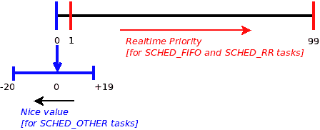

# 十七、Linux 下的 CPU 调度

人们经常提出的一个关于 Linux 的问题是，调度是如何工作的？我们将在本章为用户空间应用开发人员更详细地解决这个问题。 为了让读者清楚地掌握有关 Linux 上 CPU 调度的重要概念，以及如何在应用中有效地使用它，我们还将介绍基本的背景信息(进程状态机、实时等)。 本章最后将简要介绍 Linux 操作系统是如何被用作硬实时操作系统的。

在本章中，读者将了解以下主题：

*   Linux 进程(或线程)状态机，更重要的是，Linux 在幕后实现的 POSIX 调度策略
*   相关概念，如实时和 CPU 亲和性
*   如何利用这样一个事实，即在每个线程的基础上，您可以使用给定的调度策略和实时优先级对线程进行编程(将显示一个示例应用)。
*   关于 Linux 也可以用作 RTOS 这一事实的简要说明

# Linux 操作系统和 POSIX 调度模型

为了理解应用开发人员级别的调度(以及如何在实际代码中利用这些知识)，我们必须首先介绍一些必需的背景信息。

开发人员要理解的第一个也是非常重要的概念是，OS 维护一个称为**内核可调度实体**(**KSE**)*的结构。*KSE 是 OS 调度代码运行的粒度。 实际上，操作系统究竟调度什么对象？*和*是应用、进程还是线程？ 嗯，简而言之，Linux 操作系统上的 KSE 是一个线程。换句话说，所有可运行的线程都会竞争 CPU 资源；内核调度器最终是决定哪个线程获得哪个 CPU 核心以及何时获得哪个 CPU 核心的仲裁器。

接下来，我们将概述进程或线程的状态机。

# Linux 进程状态机

在 Linux 操作系统上，每个进程或线程都会运行各种明确的状态，通过对这些状态进行编码，我们可以形成 Linux 操作系统上进程(或线程)的状态机(阅读本文时请务必参考下一节中的*图 1*)。

Since we now understand that the KSE on the Linux OS is a thread and not a process, we shall ignore convention—which uses the word *process*—and instead use the word *thread* when describing the entity that cycles through various states of the state machine. (If more comfortable, you could always, in your mind, substitute the word process for thread in the following matter.)

Linux 线程可以循环的状态如下(`ps(1)`实用程序通过此处显示的字母对状态进行编码)：

*   **R**：准备运行或运行
*   睡觉：
    *   **S**：可中断睡眠
    *   **D**：不间断睡眠
*   **T**：停止(或暂停/冻结)
*   **Z**：僵尸(或已死)
*   **X**：失效

当新创建线程时(通过`fork(2)`、`pthread_create(3)`*、*或`clone(2)`*、*API)，一旦操作系统确定线程完全生成，它就会通过将线程置于可运行状态来通知调度程序它的存在。处于**R**状态的线程实际上正在 CPU 内核上运行或处于准备运行状态。 我们需要了解的是，在这两种情况下，线程都是在操作系统内称为**运行队列**(**RQ**)的数据结构上排队的。运行队列中的线程是可以运行的有效候选线程；除非线程在操作系统运行队列中排队，否则任何线程都不可能运行。 (供您参考，从 2.6 版开始，Linux 通过为每个 CPU 核心设置一个 RQ 来最大限度地利用所有可能的 CPU 核心，从而获得完美的 SMP 可伸缩性。)。 Linux 没有明确区分准备运行和正在运行的线程状态；它只将处于这两种状态的线程标记为**R**。

# 睡眠状态

一旦线程开始运行其代码，它显然会一直这样做，直到通常发生以下几种情况之一(如下所述)：

*   它阻塞 I/O，从而进入**S**或**D**的休眠进入状态(见下一段)。
*   它被抢占；没有状态更改，并且在运行队列上保持准备运行状态**R**。
*   它被发送一个信号，使其停止，从而进入状态**T**。
    *   它被发送一个信号(通常是 SIGSTOP 或 SIGTSTP)，导致它终止，从而首先进入状态**Z**(僵尸是死亡过程中的瞬时状态)，然后实际死亡(状态 X)。

通常，线程会在其代码路径中遇到阻塞 API-它将使线程进入休眠状态，等待事件。当线程被阻塞时，它会从它所在的运行队列中移除(或出列)，而是添加(入队)到所谓的**等待队列**(**WQ**)。当它正在等待的事件发生时，操作系统将向它发出唤醒，使它变得可运行(从等待队列中出列)。当它正在等待的事件发生时，操作系统将向它发出唤醒，使它变为可运行(从等待队列中出列)。**WQ**。当它正在等待的事件发生时，操作系统将向它发出唤醒命令，使它变为可运行(从等待队列中出列。 注意，线程不会立即运行；它将变为可运行线程(*图 1*中的**RR**)，并且是调度器的候选者；很快，它就有机会在 CPU 上实际运行(**Rcpu**)。

A common misconception is to think that the OS maintains one run queue and one wait queue. No—the Linux kernel maintains one run queue per CPU. Wait queues are often created and used by device drivers (as well as the kernel); thus, there can be any number of them.

睡眠的深度可以精确地确定线程进入哪种状态。 如果线程发出阻塞调用，并且底层内核代码(或设备驱动程序代码)将其置于不可中断的休眠状态，则该状态被标记为**S**。 完全可中断的休眠状态意味着当任何发往线程的信号被传递时，线程将被唤醒；然后，它将运行信号处理程序代码，如果没有终止(或停止)，将不会恢复休眠(回想一下`SA_RESTART`标志，从[第 11 章](11.html)*，Signating-Part I*中删除`sigaction(2)`*和*)。 这种可中断睡眠*和*状态**S**确实非常常见。

另一方面，操作系统(或驱动程序)可以使阻塞线程进入更深的不可中断休眠状态，在这种情况下，状态被标记为**D**。非不可中断休眠状态意味着线程不会响应信号(无；甚至连根发出的 SIGKILL 都不会！)。 当内核确定休眠是关键的，并且线程必须等待挂起的事件，不惜一切代价阻塞时，就会执行此操作。 (常见的示例是来自文件的`read(2)`-当实际读取数据时，线程被置于不可中断的休眠状态；另一个示例是文件系统的挂载和卸载。)

Performance issues are often caused by very high I/O bottlenecks; high CPU usage is not always a major problem, but continually high I/O will make the system feel very slow. A quick way to determine which application(s) (processes and threads, really) are causing the heavy I/O is to filter the `ps(1)`output looking for processes (or threads) in the **D**, uninterruptible sleep state. As an example, refer to the following:

**`$ ps -LA -o state,pid,cmd | grep`** `"^D"`
`**D** 10243 /usr/bin/gnome-shell`
`**D** 13337 [kworker/0:2+eve]`
`**D** 22545 /home/<user>/.dropbox-dist/dropbox-lnx.x86_64-58.4.92/dropbox`
`$`

Notice that we use `ps -LA`; the `-L` switch shows all threads alive as well. (FYI, the thread shown in the preceding square brackets,`[kworker/...]`, is a kernel thread.)

下图表示任何进程或线程的 Linux 状态机：


Figure 1: Linux state machine

上图通过红色箭头显示了状态之间的转换*和*。请注意，为了清楚起见，上面的图中没有明确显示一些转换(例如，线程可以在睡眠或停止时被终止)。

# 什么是实时？

对于实时技术(在应用编程和操作系统环境中)的含义，存在许多误解。 实时本质上意味着实时线程(或多个线程)不仅要正确地执行它们的工作，而且它们必须在给定的最坏情况下的最后期限内执行。 实际上，实时系统中的关键因素被称为决定论。 确定性系统对真实世界(或人工生成的)事件有保证的最坏情况响应时间；它们将在有限的时间限制内处理这些事件。 决定论导致了可预测的反应，在任何情况下--甚至是极端的负荷。 计算机科学家对算法进行分类的一种方式是通过它们的时间复杂度：即大 O 记法。O(1)算法是不确定的；因为它们保证它们将在一定的最坏情况下的时间内完成，无论输入负载有多大。 真正的实时系统需要 O(1)算法来实现对性能敏感的代码路径。

有趣的是，实时并不一定意味着真正的快速。 VDC 调查(有关更多详细信息，请参阅关于 GitHub 存储库的*进一步阅读*章节)显示，大多数实时系统的截止时间(实时响应时间)要求为 1 至 9 毫秒。 只要系统能够始终如一地在给定的截止日期(可能相当长)内为事件提供服务，它就是实时的。

# 实时类型

实时通常分为三种类型，如下所示：

*   **硬实时系统**被定义为必须始终满足所有截止日期的系统。即使一次未能在截止日期前完成，也会导致系统的灾难性故障，包括可能的人命损失、经济损失等。 硬实时系统需要一个**实时操作系统**(**RTOS**)来驱动它。 (此外，将应用编写为硬实时也非常重要！)。 可能的硬实时领域包括多种类型的人类运输工具(飞机、海船、航天器、火车和电梯)和某些类型的军用或国防设备、核反应堆、医疗电子设备和证券交易所。 (是的，证券交易所是一个非常硬的实时系统；请务必阅读*Automate This：How Algorithms Come to Rule Our World*-有关更多信息，请参阅 GitHub 存储库上的*进一步阅读*部分。)
*   **软实时*和*系统**都是尽力而为；截止日期确实存在，但绝对不能保证一定能达到。 系统将尽最大努力满足这些要求；不这样做被认为是可以接受的(通常，这只会给最终用户带来更多的烦恼，而不是任何危险的事情)。 消费电子产品(如我们的智能手机、MP3 播放器、相机、平板电脑和智能扬声器)就是典型的例子。 在使用它们时，您经常会在听音乐时听到故障，或者流视频出现卡顿、缓冲和抖动。 虽然很烦人，但用户不太可能会死。
*   **严格的实时*和*系统**介于硬实时系统和软实时系统之间-截止日期很重要，并将尽可能地满足，但同样，不能做出铁板一块的保证。 由于错过太多截止日期而导致的性能下降在这里是一个问题。

# 调度策略

**操作系统**(**OS**)的一项关键工作是调度可运行的任务。 POSIX 标准规定，与 POSIX 兼容的操作系统必须提供(至少)三种调度策略。调度策略实际上是操作系统用来调度任务的调度算法。 在本书中，我们不会深入研究这些细节，但我们确实需要应用开发人员了解可用的各种调度策略。 这些资料如下：

*   `SCHED_FIFO`
*   `SCHED_RR`
*   `SCHED_OTHER`(也称为`SCHED_NORMAL`)

当然，我们对此的讨论将仅与 Linux 操作系统有关。

首先要了解的重要一点是，普通 Linux 操作系统不是 RTOS；它不支持硬实时，与其他操作系统(Unix、Windows 和 MacOS)一样，被归类为标准**通用操作系统**(**GPO**)。

Do read on, though; we shall see that while hard real-time is not possible with vanilla Linux, it is indeed possible to run an appropriately patched Linux as an RTOS.

Linux 虽然是 GPO，但很容易作为软实时*和*系统执行。 事实上，它的高性能特性使其接近成为一款可靠的实时系统。 因此，Linux 操作系统在消费电子(和企业)产品中的主要使用也就不足为奇了。

接下来，我们提到的前两个调度策略--`SCHED_FIFO`和`SCHED_RR`--是 Linux 的软实时操作系统调度策略。 `SCHED_OTHER`(也称为`SCHED_NORMAL`)策略是最新的非实时调度策略，并且始终是默认策略*。* `SCHED_OTHER`策略作为**完全公平调度器**(**CFS**)在现代 Linux 内核上实现；它的主要设计目标是为每个可运行的任务(线程)提供总体高系统吞吐量和公平性，确保线程不会饥饿。 这与实时策略算法相当背道而驰，其压倒一切的动机是线程的优先级。

对于`SCHED_FIFO`和`SCHED_RR`软实时策略，Linux 操作系统都指定了一个优先级范围。 这个范围是从 1 到 99，其中 1 是最低的实时优先级，99 是最高的。 Linux 上的软实时调度策略设计遵循所谓的*f**固定优先级抢占调度*，理解这一点很重要。 固定优先级意味着应用*和*决定和修复线程优先级(并且可以更改它)；操作系统不能。 抢占是操作系统从正在运行的线程中抢走 CPU，将其降级回其运行队列，并将上下文切换到另一个线程的行为。 接下来将介绍关于调度策略的精确抢占式语义。

现在，我们将用现实世界的术语简要描述在这些不同的调度策略下运行意味着什么。

只有在以下三种情况下，才能抢占正在运行的`SCHED_FIFO`线程：

*   它(In)自动产生处理器(从技术上讲，它从**R**状态移出)。 当任务发出阻塞调用或调用类似`sched_yield(2)`的系统调用时，就会发生这种情况。
*   它要么停下来，要么死掉。
*   优先级更高的实时任务变得可运行。

这是要理解的关键点：`SCHED_FIFO`任务是主动的；它以无限的时间片运行，除非它阻塞(或被停止或终止)，否则它将无限期地在处理器上运行。 但是，当较高优先级的线程变为可运行时(状态**R**，进入运行队列)，它将被优先占用。

`SCHED_RR`行为几乎与`SCHED_FIFO`相同，不同之处在于：

*   它有一个有限的时间片，因此有一个额外的场景，在这种情况下它可以被抢占：当它的时间片到期时。
*   当被抢占时，任务被移到其优先级对应的运行队列的尾部，以确保相同优先级的所有`SCHED_RR`个任务轮流执行(因此而得名循环调度)。

请注意，在 RTOS 上，调度算法很简单，因为它真正需要做的就是实现这个语义：最高优先级的可运行线程必须是正在运行的线程。

默认情况下，所有线程都在`SCHED_OTHER`(或`SCHED_NORMAL`)调度策略下运行。 这绝对是一个非实时的政策，重点是公平和总体吞吐量。 从 Linux 内核版本 2.6.0 到 2.6.22(包括 2.6.22)，它的实现都是通过所谓的 O(1)调度器实现的；从 2.6.23 开始，一个进一步改进的算法--公平调度器(**CFS**)--实现了这个调度策略(实际上是一个调度类)。 有关详细信息，请参阅下表：

| **调度策略** | **类型** | **优先级范围** |
| `SCHED_FIFO` | 软实时：咄咄逼人、不公平 | 1 至 99 |
| `SCHED_RR` | 软实时：不那么激进 | 1 至 99 |
| `SCHED_OTHER` | 非实时：公平、分时；默认值 | 较好的值(-20 到+19) |

Though not very commonly used, we point out that Linux also supports a batched mode process execution policy with the SCHED_BATCH policy. Also, the SCHED_IDLE policy is used for very low priority background tasks. (In fact, the CPU idle thread—(mis)named `swapper` with PID `0`, exists for each CPU and runs only when absolutely no other task wants the processor).

# 查看调度策略和优先级

Linux 提供了`chrt(1)`*和*实用程序来查看和更改线程(或进程)的实时调度策略和优先级。 下面的代码快速演示了如何使用它来显示给定进程的调度策略和优先级(通过 PID)：

```sh
$ chrt -p $$
pid 1618's current scheduling policy: SCHED_OTHER
pid 1618's current scheduling priority: 0
$ 
```

在前面的内容中，我们已经查询了内核`chrt(1)`进程本身的调度策略和优先级(使用 shell 的`$$`变量)。 对其他线程尝试此方法；您会注意到策略(几乎)总是`SCHED_OTHER`，并且实时优先级为零。 实时优先级为零意味着该过程不是完全实时的。

You can always query a thread's scheduling policy and (real-time) priority by passing the thread PID (via the output of `ps -LA` or similar) to `chrt(1)`.

# 物美价廉

所以，现在您可能想知道，如果所有非实时线程(`SCHED_OTHER`CHAP)的优先级都为零，那么我如何支持它们之间的优先级排序呢？嗯，这正是`SCHED_OTHER`线程最好的价值所在：它是(旧的)Unix 风格的优先级模型，现在在 Linux 上，它指定了非实时线程之间的相对优先级。

NICE 值是介于**-20**到**+19**之间的优先级范围(在现代 Linux 上)，基本优先级为零。 在 Linux 上，它是每个线程的属性；当创建线程时，它继承其创建者线程的 nice 值-缺省值为 0。 请参阅下图：



Figure 2: Linux thread priority ranges

从 2.6.23(使用 CFS 内核调度器)开始，线程的优值对调度有很大的影响(每个优值的优值为 1.25 倍)；因此，**-20**优值线程获得的 CPU 带宽要大得多(这对于多媒体等 CPU 敏感型应用很好)，而**+19**优值线程获得的 CPU 非常少。

应用程序员可以通过`nice(1)`命令行实用程序以及`nice(2)`、`setpriority(2)`和`sched_setattr(2)`系统调用(最后一个是要使用的最新且正确的调用)查询和设置 nice 值。 我们建议您参阅这些 API 的相应手册页。

请记住，实时(`SCHED_FIFO`或`SCHED_RR`)线程在优先级方面总是优于`SCHED_OTHER`线程(因此很大程度上保证了它将有机会更早地运行)。

# CPU 亲和力

为了简单起见，让我们设想一个具有四个 CPU 核心和一个即用线程的 Linux 系统。 这个线程会在哪个 CPU 内核上运行？ 内核将决定这一点；要意识到的关键是，它可以在四个可用的 CPU 中的任何一个上运行！

它可以在程序员指定的 CPU 上运行吗？ 是的，确实如此；仅此功能就称为 CPU 亲和性。 在 Linux 上，它是每个线程的属性(在操作系统中)。通过更改线程的 CPU 亲和性掩码，可以在每个线程的基础上更改 CPU 亲和性；当然，这是通过系统调用来实现的。 让我们来看一下以下代码：

```sh
#define _GNU_SOURCE /* See feature_test_macros(7) */
#include <sched.h>
int sched_setaffinity(pid_t pid, size_t cpusetsize,
                        const cpu_set_t *mask);
int sched_getaffinity(pid_t pid, size_t cpusetsize,
                        cpu_set_t *mask);
```

内核调度器将遵守程序员设置的 CPU 掩码-允许线程执行的 CPU 集。 我们需要将 CPU 亲和掩码指定为一个`cpu_set_t`类型的对象。 (我们请读者参考`sched_setaffinity(2)`上的手册页，其中提供了一个示例程序)。

请注意，pthreads 框架提供了包装器 API：`pthread_setaffinity_np(3)`和`pthread_getaffinity_np(3)`，以便在给定的线程上执行相同的操作(它们在内部调用了`sched_setaffinity(2)`的系统调用)。

一个有趣的设计是 CPU 预留。 在一个足够多核的系统上(假设我们的系统有四个 CPU 核心：0、1、2 和 3)，您可以使用前面的 CPU 亲和性掩码模型来有效地为对性能至关重要的给定线程(一个或多个线程)预留一个 CPU 核心(比如核心 3)。 这意味着您必须将该线程的 CPU 掩码设置为特定的 CPU(比方说核心 3)，重要的是，将所有其他线程的 CPU 掩码设置为完全排除核心 3。

虽然这听起来可能很简单，但这真的不是一件微不足道的事情；出现这种情况的一些原因如下：

*   您必须意识到，预留的 CPU 实际上并不是专门为指定的线程预留的；对于真正的 CPU 预留，除了在该 CPU 上运行的给定线程外，必须以某种方式排除整个系统上的所有其他线程在该 CPU 上运行。
*   一般来说，操作系统调度程序最了解如何在可用 CPU 核心之间分配 CPU 带宽(它有一个负载平衡器组件，并且了解 CPU 层次结构)；因此，CPU 分配最好留给操作系统。

Modern Linux kernels have support for a very powerful feature: **control groups** (**cgroups**). (see [Appendix B](https://www.packtpub.com/sites/default/files/downloads/Daemon_Processes.pdf), *Daemon Processes*, for a note). With regard to CPU reservation, it can be achieved via the cgroup model. Please refer to the following Q&A on Stack Overflow for more details: *How to use cgroups to limit all processes except whitelist to a single CPU*:[https://unix.stackexchange.com/questions/247209/how-to-use-cgroups-to-limit-all-processes-except-whitelist-to-a-single-cpu](https://unix.stackexchange.com/questions/247209/how-to-use-cgroups-to-limit-all-processes-except-whitelist-to-a-single-cpu).

为方便起见，Linux 提供了`taskset(1)`实用程序作为查询和指定任何给定进程(或线程)的 CPU 亲和性掩码的简单方法。 这里，我们将查询两个进程的 CPU 亲和性掩码。 (我们假设我们运行的系统有四个 CPU 核心；我们可以使用`lscpu(1)`来查询这一点)：

```sh
$ taskset -p 1
pid 1's current affinity mask: f
$ taskset -p 12446
pid 12446's current affinity mask: 7
$ 
```

PID 1 的(Systemd)CPU 亲和掩码是`0xf`，当然，它是二进制的`1111`。 如果设置了位`1`，则意味着线程可以在该位表示的 CPU 上运行。 如果第一位被清除`0`，则意味着线程不能在该位所代表的 CPU 上运行。 正如预期的那样，在四个 CPU 的机器上，CPU 亲和位掩码默认为 0xf(1111)，这意味着进程(或线程)可以在任何可用的 CPU 上运行。 有趣的是，在前面的输出中，bash 进程似乎有一个 CPU 亲和性掩码`7`，它可以转换为二进制`0111`，这意味着它永远不会被安排在 CPU 3 上运行。

在下面的代码中，一个简单的 shell 脚本在循环中调用`chrt(1)`和`taskset(1)`实用程序，显示系统上活动的每个进程的调度策略、(实时)优先级和 CPU 关联掩码：

```sh
# ch17/query_sched_allprcs.sh
for p in $(ps -A -To pid)
do
    chrt -p $p 2>/dev/null
    taskset -p $p 2>/dev/null
done
```

我们鼓励读者在他们自己的系统上试用。在下面的代码中，我们为任何`SCHED_FIFO`任务提供了`grep(1)`选项：

```sh
$ ./query_sched_allprcs.sh | grep -A2 -w SCHED_FIFO
pid 12's current scheduling policy: SCHED_FIFO
pid 12's current scheduling priority: 99
pid 12's current affinity mask: 1
pid 13's current scheduling policy: SCHED_FIFO
pid 13's current scheduling priority: 99
pid 13's current affinity mask: 1
--
pid 16's current scheduling policy: SCHED_FIFO
pid 16's current scheduling priority: 99
pid 16's current affinity mask: 2
pid 17's current scheduling policy: SCHED_FIFO
pid 17's current scheduling priority: 99
pid 17's current affinity mask: 2
--
[...]
```

是!。 我们找到了一些线索。 哇，它们都是`SCHED_FIFO`实时优先级 99！让我们来看看这些线程是谁(也有一个很酷的一行脚本)：

```sh
$ ps aux | awk '$2==12 || $2==13 || $2==16 || $2==17 {print $0}'
USER PID %CPU %MEM  VSZ  RSS TTY STAT   START  TIME   COMMAND
root 12  0.0  0.0     0    0   ?    S   13:42  0:00   [migration/0]
root 13  0.0  0.0     0    0   ?    S   13:42  0:00   [watchdog/0]
root 16  0.0  0.0     0    0   ?    S   13:42  0:00   [watchdog/1]
root 17  0.0  0.0     0    0   ?    S   13:42  0:00   [migration/1]
$ 
```

For clarity, the `ps aux` heading—which would not normally be displayed—is shown in the preceding code. Also, we use the `ps aux` style as, conveniently, kernel threads are displayed in brackets.

事实证明(在这里，至少在这个特定示例中)它们都是内核线程(参见下面的信息框)。 需要理解的重要一点是，它们被故意设置为`SCHED_FIFO`(实时)优先级 99，这样，当它们想要在 CPU 上运行时，它们几乎可以立即运行。事实上，让我们来看看它们的 CPU 亲和性掩码：它是被故意分配的(值为 1，2，4，8)，以便它们与特定的 CPU 内核相关联。 重要的是要理解，这些内核线程不是 CPU 占用者；实际上，它们会在大部分时间处于休眠状态(状态**S**)，只有在需要时才会立即开始行动。

Kernel threads are not very different from their user space counterparts; they too compete for the CPU resource. The key difference is that kernel threads have no view of user space—they only execute in kernel virtual address space (whereas user space threads, of course, see both: userland in normal user mode and, upon issuing a system call, they switch to kernel space).

# 利用 Linux 的软实时能力

回想一下，在本章早些时候，我们指出：Linux 上的软实时调度策略设计遵循所谓的固定优先级抢占式调度；固定优先级意味着应用决定和固定线程优先级(并且可以更改它)；操作系统不能。

不仅应用可以在线程优先级之间切换，甚至调度策略(实际上是操作系统在幕后使用的调度算法)也可以由应用开发人员更改；这可以在每个线程的基础上完成。这确实非常强大；这意味着，比如说有五个线程的应用可以决定为每个线程分配什么调度策略和优先级！

# 调度策略和优先级 API

显然，为了实现这一点，操作系统必须公开一些 API；实际上，有几个系统调用正好可以处理这一点-更改给定进程或线程的调度策略和优先级。

以下是这些 API 中一些更重要的 API 的列表(实际上是一个示例)：

*   `sched_setscheduler(2)`：设置指定线程的调度策略和参数。
*   `sched_getscheduler(2)`：返回指定线程的调度策略。
*   `sched_setparam(2)`：设置指定线程的调度参数。
*   `sched_getparam(2)`：*获取指定线程的调度参数。
*   `sched_get_priority_max(2)`：返回指定调度策略中可用的最高优先级。
*   `sched_get_priority_min(2)`：返回指定调度策略中可用的最低优先级。
*   `sched_rr_get_interval(2)`：获取在循环调度策略下调度的线程所使用的量程。
*   `sched_setattr(2)`：设置指定线程的调度策略和参数。 这个(特定于 Linux 的)系统调用提供了`sched_setscheduler(2)`和`sched_setparam(2)`功能的超集。
*   `sched_getattr(2)`：*获取指定线程的调度策略和参数。 这个(特定于 Linux 的)系统调用提供了`sched_getscheduler(2)`和`sched_getparam(2)`功能的超集。

`sched_setattr(2)` and `sched_getattr(2)` are currently considered to be the latest and more powerful of these APIs. Also, on Ubuntu, one can issue the convenient `man -k sched` command to see all utils and APIs related to scheduling (-k: keyword).

敏锐的读者很快就会注意到，我们之前提到的所有 API 都是系统调用(手册第 2 节)，但是 pthread 和 API 呢？ 实际上，它们确实存在，正如您可能已经猜到的那样，它们大多只是调用底层系统调用的包装器；在下面的代码中，我们展示了其中的两个：

```sh
#include <pthread.h>
int pthread_setschedparam(pthread_t thread, int policy,
                           const struct sched_param *param);
int pthread_getschedparam(pthread_t thread, int *policy,
                           struct sched_param *param);
```

需要注意的是，为了设置线程(或进程)的调度策略和优先级，您需要以超级用户权限运行。回想一下，向线程授予特权的现代方法是通过 Linux 功能模型(我们在[第 8 章](08.html)，*进程功能*中详细介绍了这一点)。 具有能力`CAP_SYS_NICE`的线程可以任意地将其调度策略和优先级设置为它想要的任何值。 想想看：如果情况并非如此，那么几乎所有的应用都会坚持它们以`SCHED_FIFO`优先级 99 运行，从而有效地使整个概念变得毫无意义！

`pthread_setschedparam(3)`在内部调用`sched_setscheduler(2)`命令系统调用，`pthread_getschedparam(3)`命令在幕后调用命令`sched_getscheduler(2)`命令系统调用。 他们的 API 签名是：

```sh
#include <sched.h>
int sched_setscheduler(pid_t pid, int policy,
                        const struct sched_param *param);
int sched_getscheduler(pid_t pid);
```

其他 pthreadAPI 也存在。 请注意，这里显示的帮助设置线程属性结构：`pthread_attr_setinheritsched(3)`、`pthread_attr_setschedparam(3)`、`pthread_attr_setschedpolicy(3)`、`pthread_attr_setschedpolicy(3)`、`pthread_setschedprio(3)`，仅举几例。

The man page on `sched(7)` (look it up by typing `man 7 sched` in a terminal window) details the available APIs for controlling scheduling policy, priority, and behavior for threads. It provides details on current Linux scheduling policies, privileges required to change them, relevant resource limit values, and kernel tunables for scheduling, as well as other miscellaneous details.

# 代码示例：设置线程调度策略和优先级

为了帮助巩固我们在本章前面几节中了解到的概念，我们将设计并实现一个小型演示程序，说明现代 Linux pthread 应用如何设置单个线程的调度策略和优先级，以使所有线程(软)实时。

我们的演示应用总共有三个线程。 第一个当然是`main()`。 以下要点显示了该应用的设计目的：

*   线程 0(真的是`main()`)：
    这作为`SCHED_OTHER`调度策略运行，实时优先级为 0，这不是默认设置。 它执行以下操作：
    *   查询`SCHED_FIFO`的优先级范围，打印值
    *   创建两个工作线程(将可接合性状态设置为已分离)；它们将自动继承 Main 的调度策略和优先级
    *   在循环中将字符`m`打印到终端(使用我们的`DELAY_LOOP`宏；打印时间比平时稍长)
    *   终止
*   工作线程 1：
    *   将其调度策略更改为`SCHED_RR`，将其实时优先级设置为在命令行上传递的值
    *   休眠 2 秒(从而阻塞 I/O，允许 Main 完成一些工作)
    *   唤醒后，它将字符`1`循环打印到终端(通过`DELAY_LOOP`宏)。
    *   终止
*   工作线程 2：
    *   将其调度策略更改为`SCHED_FIFO`，将其实时优先级设置为在命令行上传递的值加上 10
    *   休眠 4 秒(从而阻塞 I/O，允许线程 1 执行某些工作)
    *   在唤醒后，它将字符`2`循环打印到终端
    *   终止

让我们快速查看一下代码(`ch17/sched_rt_eg.c`)：

For readability, only key parts of the source code are displayed here; to view the complete source code, and build and run it, the entire tree is available for cloning from GitHub here: [https://github.com/PacktPublishing/Hands-on-System-Programming-with-Linux](https://github.com/PacktPublishing/Hands-on-System-Programming-with-Linux).

以下代码是`main()`的代码。 (我们省略了显示错误检查代码)：

```sh
#define NUMWORK   200
...
  min = sched_get_priority_min(SCHED_FIFO);
  max = sched_get_priority_max(SCHED_FIFO);
  printf("SCHED_FIFO: priority range is %d to %d\n", min, max);
  rt_prio = atoi(argv[1]);
...
  ret = pthread_create(&tid[0], &attr, worker1, (void *)rt_prio);
  ret = pthread_create(&tid[1], &attr, worker2, (void *)rt_prio);
  pthread_attr_destroy(&attr);
  DELAY_LOOP('m', NUMWORK+100);
  printf("\nmain: all done, app exiting ...\n");
  pthread_exit((void *)0);
}
```

以下代码用于工作线程 1。我们省略了错误检查代码的显示：

```sh
void *worker1(void *msg)
{
  struct sched_param p;
  printf(" RT Thread p1 (%s():%d:PID %d):\n"
   " Setting sched policy to SCHED_RR and RT priority to %ld"
   " and sleeping for 2s ...\n", __func__, __LINE__, getpid(), (long)msg);

   p.sched_priority = (long)msg;
   pthread_setschedparam(pthread_self(), SCHED_RR, &p);
   sleep(2);
   puts(" p1 working");
   DELAY_LOOP('1', NUMWORK);
   puts(" p1: exiting..");
   pthread_exit((void *)0);
}
```

工作线程 2 的代码与前一个工作线程的代码几乎相同；不过，不同之处在于我们将策略设置为`SCHED_FIFO`，并且实时优先级提高了 10 个点，从而使其更具侵略性。 我们仅在此处显示此代码片段：

```sh
  p.sched_priority = prio + 10;
  pthread_setschedparam(pthread_self(), SCHED_FIFO, &p);
  sleep(4);
  puts(" p2 working");
  DELAY_LOOP('2', NUMWORK);
```

让我们构建它(我们绝对建议构建调试版本，因为这样就可以清楚地看到`DELAY_LOOP`宏的效果)，并给它一个旋转：

```sh
$ make sched_rt_eg_dbg
gcc -g -ggdb -gdwarf-4 -O0 -Wall -Wextra -DDEBUG -pthread -c sched_rt_eg.c -o sched_rt_eg_dbg.o
gcc -o sched_rt_eg_dbg sched_rt_eg_dbg.o common_dbg.o -pthread -lrt
$ 
```

我们必须以超级用户身份运行我们的应用；我们使用`sudo(8)`命令来执行此操作：

```sh
$ sudo ./sched_rt_eg_dbg 14
SCHED_FIFO: priority range is 1 to 99
main: creating RT worker thread #1 ...
main: creating RT worker thread #2 ...
  RT Thread p1 (worker1():68:PID 18632):
 Setting sched policy to SCHED_RR and RT priority to 14 and sleeping for 2s ...
m RT Thread p2 (worker2():101:PID 18632):
 Setting sched policy to SCHED_FIFO and RT priority to 24 and sleeping for 4s ...
mmmmmmmmmmmmmmmmmmmmmmmmmmmmmmmmmmmmmmmmmmmmmmmmmmmmmmmmmmmmmmmmmmmmmmmmmmmmmmmmmmmmmmmmmmmmmmmmmmmmmmmmmmmmmmmmmmmmm p1 working
1m1m1m1m1m1m1m1m1m1m1m1m1m1m1m1m1m1m1m1m1m1m1m1m1m1m1m1m1m1m1m1m1m1m1m1m1m1m1m1m1m1m1m1m1m1m1m1m1m1m1m1m1m1m1m1m1m1m1m11m1m1m1m1m1m1m1m1m1m1m1m1m1m1m1m1m1m1m1m1m1m1m1m1m1m1m1m1m1m1m1m1m1m11m1m1m1m1m1m1m1m1m1m1m1m1m1m1m1m1m1m1m1m1m1m1m1m1m1m1m11m1m1m p2 working
2m12m12m1m2m12m12m1m2m12m12m1m2m12m12m12m12m12m112m12m12m12m112m12m12m112m12m12m112m12m12m12m112m12m12m121m211m21m21m21m211m21m21m21m211m21m21m21m211m21m21m21m211m21m21m21m211m21m21m21
main: all done, app exiting ...
$ 
```

在前面的输出中，我们可以看到以下字符：

*   `m`：这意味着主线程当前正在 CPU 上运行
*   `1`：这意味着线程 1 的(软)实时工作线程当前正在 CPU 上运行
*   `2`：这意味着线程 2 的(软)实时工作线程当前正在 CPU 上运行

但是，哎呀，前面的输出确实不是我们所期望的：`m`、`1`和`2`的字符没有混合在一起，这使我们得出结论，它们已经被时间切片。

但事实并非如此。 想想看--输出与前面代码中显示的一样，原因很简单，因为我们已经在多核操作系统上运行了应用(在前面代码中，是在有四个 CPU 内核的笔记本电脑上)；因此，内核调度器巧妙地利用了硬件，并在不同的 CPU 内核上并行运行了所有三个线程！ 因此，为了让我们的演示应用以我们预期的方式运行，我们需要确保它只在一个 CPU 核心上运行，而不是更多。 多么?。 回想一下 CPU 亲和力：我们可以使用`sched_setaffinity(2)`的系统调用来实现这一点。还有一种更简单的方法：我们可以使用`taskset(1)`来保证进程(以及其中的所有线程)只在一个 CPU 核心(例如，CPU 0)上运行，方法是将 CPU 掩码值指定为`01`。 因此，让我们执行以下命令：

```sh
$ sudo taskset 01 ./sched_rt_eg_dbg 14
[sudo] password for <username>: xxx 
SCHED_FIFO: priority range is 1 to 99
main: creating RT worker thread #1 ...
main: creating RT worker thread #2 ...
m RT Thread p2 (worker2():101:PID 19073):
 Setting sched policy to SCHED_FIFO and RT priority to 24 and sleeping for 4s ...
 RT Thread p1 (worker1():68:PID 19073):
 Setting sched policy to SCHED_RR and RT priority to 14 and sleeping for 2s ...
mmmmmmmmmmmmmmmmmmmmmmmmmmmmmmmmmmmmmmmmmmmmmmmmmmmmmmmmmmmmmmmmmmmmmmmmmmmmmmmmmmmmmmmmmmmmmmmmmmmmmmmmmmmmmmmmmmmmmmmmm p1 working
11111111111111111111111111111111111111111111111111111111111111111111111111111111111111111111111111111111111111111111111111111111 p2 working
22222222222222222222222222222222222222222222222222222222222222222222222222222222222222222222222222222222222222222222222222222222222222222222222222222222222222222222222222222222222222222222222222222222 p2 exiting ...
111111111111111111111111111111111111111111111111111111111111111111111111 p1: exiting..
mmmmmmmmmmmmmmmmmmmmmmmmmmmmmmmmmmmmmmmmmmmmmmmmmmmmmmmmmmmmmmmmmmmmmmmmmmmmmmmmmmmmmmmmmmmmmmmmmmmmmmmmmmmmmmmmmmmmmmmmmmmmmmmmmmmmmmmmmmmmmmmmmmmmmmmmmmmmmmmmmmmmmmmmmmmmmmmmmm
main: all done, app exiting ...
$ 
```

是的，使用命令`taskset(1)`来确保整个应用-所有三个线程-都运行在第一个 CPU 内核上，具有预期的效果。 现在，仔细研究前面的输出；我们可以看到，`main()`线程(非实时)首先运行了大约 2 秒；一旦经过了 2 秒，工作线程 1 就会被唤醒，变得可运行。 由于其策略和优先级远远超过 main()，因此它抢占 main()并运行，并将 1 打印到终端。 请记住，工作线程 2 也在并行运行，但是，当然，它会休眠 4 秒。 因此，2 秒后-总共经过 4 秒-工作线程 2 唤醒，变为可运行。 因为它的策略是`SCHED_FIFO`，更重要的是，它的优先级比线程 1 高 10 个点，所以它会抢占线程 1 并运行，并将`2s`打印到终端。 在终止之前，其他线程不能运行；一旦终止，工作线程 1 就会运行。 同样，除非终止，否则 main()不能运行；一旦终止，main()最终获得 CPU 并结束，因此应用终止。 有意思，一定要亲自试一试。

供您参考，`pthread_setschedparam(3)`上的手册页有一个相当详细的示例程序：[http://man7.org/linux/man-pages/man3/pthread_setschedparam.3.html](http://man7.org/linux/man-pages/man3/pthread_setschedparam.3.html)。

# 软实时监控的额外考虑因素

需要考虑的其他几点是：我们能够将线程与(软)实时操作系统策略和优先级相关联(但需要注意，我们拥有 root 访问权限；或者 CAP_SYS_NICE 功能)。 对于大多数人类交互式应用域来说，这不仅是不必要的，而且会给典型的桌面或服务器系统终端用户带来令人不安的反馈和副作用。 一般来说，您应该避免在交互式应用上使用这些实时监控策略。 只有在必须对线程进行高优先级排序时-通常对于实时应用(可能在嵌入式 Linux 系统上运行)，或者某些类型的基准测试或评测软件(`perf(1)`就是一个很好的例子；可以将`--realtime=n`参数指定为`perf`以使其作为`SCHED_FIFO`优先级`n`运行)，您才应该考虑使用这些强大的技术。

此外，要使用的精确实时优先级留给应用架构师；对`SCHED_FIFO`和`SCHED_RR`线程使用相同的优先级值(请记住，这两个策略都是对等的，而`SCHED_FIFO`更积极)可能会导致不可预测的调度。 仔细考虑设计，并相应地设置每个实时线程的策略和优先级。

最后，虽然本书没有详细介绍，但 Linux 的 cgroup 模型允许您对给定进程或进程组的资源(CPU、网络和块 I/O)的带宽分配进行强有力的控制。 如果这是必需的，请考虑使用 cgroup 框架来实现您的目标。

# RTL-作为 RTOS 的 Linux

事实上，尽管看起来很不可思议，Linux 操作系统还是可以作为 RTOS 使用；也就是说，它是一个具有硬实时能力的 RTOS。这个项目最初是由 Thomas Gleixner(Linutronix 公司的)提出的，他想把 Linux 移植成 RTOS。

Again, this is really the beauty of the open source model and Linux; being open source, interested, and motivated people take Linux (or other projects) as a starting point and build upon it, often coming up with significantly new and useful products.

关于这个项目，有几点需要注意：

*   将 Linux 内核修改为 RTOS 是一个必然具有侵入性的过程；Linus Torvalds，事实上的 Linux 老板，不希望在上游(普通)Linux 内核中使用这种代码。 因此，实时 Linux 内核项目以补丁系列的形式存在(在 kernel.org 本身上；有关更多信息，请参阅*进一步阅读*部分中关于 GitHub 存储库的链接)，这些补丁可以应用于主线内核。
*   这项工作从 2.6.18 Linux 内核开始就已经成功完成(可能是在 2006 或 2007 年左右)。
*   多年来，这个项目被称为 Preempt-RT(补丁本身称为 Preempt_RT)。
*   后来(从 2015 年 10 月起)，该项目的管理工作由**Linux Foundation**(**LF**)接管--这是一个积极的步骤。 名称从抢占 RT 改为**实时 Linux**(**RTL**)。
*   实际上，RTL 路线图的目标是将相关的 preempt_rt 工作推向上游(进入主线 Linux 内核；有关这方面的链接，请参阅 GitHub 存储库上的部分中的*进一步阅读)。*

实际上，您可以应用适当的 RTL 补丁，然后将 Linux 用作硬实时操作系统。 业界已经开始使用该项目(在工业控制应用、无人机、视频和电视摄像机中)；我们只能想象这一项目将会有巨大的增长。 同样重要的是要注意，拥有硬实时操作系统对于真正的实时使用是不够的；即使是最新的应用也必须编写以符合实时预期。 一定要查看 RTL 项目维基站点提供的*HOWTO*文档(请参阅有关 GitHub 存储库的*进一步阅读*部分)。

# 简略的 / 概括的 / 简易判罪的 / 简易的

在本章中，我们介绍了与 Linux 上的 CPU 调度和实时相关的重要概念。 读者已经了解了有关 Linux 线程状态机、实时、CPU 亲和性和可用的 POSIX 调度策略的渐进主题。 此外，我们还展示了用于利用这些强大机制的 API-无论是在 pthread 层还是在系统调用层。 一个演示应用强化了我们学到的概念。 最后，简要介绍了 Linux 也可以用作硬实时(RTOS)这一事实。

在下一章中，读者将了解如何使用现代技术实现最佳 I/O 性能。