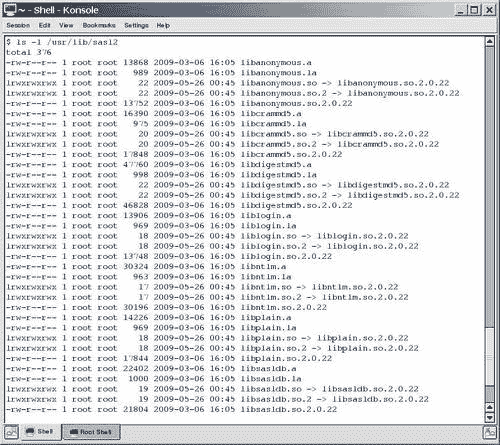
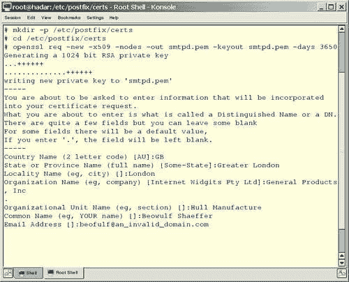

# 五、防护您的安装

在所有可能发生在您的 SMTP 服务器上的事情中，最糟糕的可能是将它滥用为一个开放中继服务器—一个未经您允许将邮件转发给第三方的服务器。 这将消耗大量带宽(这可能很昂贵)，消耗服务器资源(可能会减慢或停止其他服务)，并且在时间和金钱上都很昂贵。 更严重的后果是，您的电子邮件服务器可能会出现在一个或多个黑名单中，任何引用这些列表的电子邮件服务器将拒绝接受来自您服务器的任何邮件，直到您证明它是中继安全的。 如果你需要使用电子邮件来开展业务，你将有一个大问题。

本章将解释如何:

*   保护 Postfix 不受中继滥用
*   区分静态和动态分配的 IP 地址
*   使用 Postfix 配置静态 IP 地址的中继权限
*   使用 Cyrus SASL 从不可预测的动态 IP 地址进行身份验证
*   使用安全套接字层来防止用户名和密码以明文形式发送
*   配置 Postfix 可以挫败或至少减缓字典攻击，在字典攻击中，电子邮件被发送到一个域中的许多电子邮件地址，希望其中一些能够到达有效的收件人

# 配置后缀式网络映射

当互联网主要由学者使用时，没有人需要保护他们的邮件服务器免受中继滥用。 实际上，没有邮件服务器的人并不多，因此允许没有电子邮件服务器的其他人使用您的服务器转发电子邮件被认为是对他们的一种服务。

随着不久被称为垃圾邮件制造者的人的出现，这种情况发生了改变。 他们会滥用开放中继器向大量的远程收件人发送广告，让邮件服务器的所有者为流量付费。

这时，邮政局长开始严格地处理中继权限。 他们过去只允许中继受信任的 IP 地址，拒绝来自其他 IP 地址的消息。 在这个上下文中，可信 IP 地址是可以与属于一个已知用户的主机或属于一个可信网络的 IP 地址范围静态关联(请参阅*静态 IP 范围*节)的 IP 地址。 它工作得很好，因为大多数计算机都有静态 IP 地址(IP 地址不会随着时间的推移而改变)。

然而，当用户变得可移动并使用拨号服务提供商访问 Internet 并希望使用未知位置的邮件服务器时，必须找到一种新的方法。 访问提供者将为这些用户提供动态 IP 地址，也就是说，他们的 IP 地址将在每次拨号时更改。

突然之间，用来区分好用户和坏用户的标准消失了。 邮政局长要么必须放松他们的中继许可以允许整个网络中潜在不受信任的 IP 使用中继，要么必须找到另一种方法来处理动态 IP 地址的中继。 随着时间的推移，出现了几种处理动态 IP 地址中继的方法，例如:

*   SMTP-after-POP
*   虚拟专用网络
*   SMTP 认证

这三种方法的需求和工作方式各不相同。 下面几节将详细介绍每种方法。

## SMTP-after-POP

历史上，许多互联网连接是拨号连接; 如果要发送电子邮件，他/她必须离线撰写邮件，启动拨号连接，然后告诉电子邮件客户端“发送和接收”邮件。 在本例中，邮件客户机首先(通过 SMTP)发送邮件，然后(通过 POP)检查服务器是否有任何新邮件—SMTP 部分发生在 POP 部分之前。

这使得 SMTP 服务器不可能知道是否应该允许发送方中继，因为动态 IP 与任何其他条件无关，而这些条件会使发送方的主机成为可信主机。 ISP 可以将拨号连接的 IP 地址识别为自己的 IP 地址，并允许中继。 来自他们自己网络之外的任何连接通常都会被拒绝。 对于用户位于公司网络之外的小型组织，不可能跟踪所有潜在的有效源 IP 地址。

但是，可以将事务颠倒过来，并且可以在发送邮件之前执行邮件检查。 检查邮件需要密码，这意味着可以对用户进行身份验证。 流行的电子邮件客户机现在一启动就可以检查电子邮件，并定期检查新电子邮件。 如果可以告诉 SMTP 服务器特定 IP 地址的用户已通过 POP 服务器的身份验证，则它可以允许中继。 这就是 post - pop 的精髓所在。 SMTP 服务器需要知道特定的 IP 地址是否有一个可信的 POP 用户连接到它。

对于用户连接在最后一次连接到 POP 服务器之后的有效时间，必须有一个时间限制，否则旅行销售人员可能每周留下 100 个不同的 IP 地址作为有效的中继主机，其中一个可能稍后被垃圾邮件发送者占用。 现在，电子邮件通常是在用户在线时编写的，并在定期自动检查新邮件之间发送。 因此，发送到 SMTP 服务器的任何组成的电子邮件通常会在 POP3 请求后的几分钟内发送，所以时间周期可以很短，通常是几十分钟。

POP 后 smtp 的缺点是，即使您只想允许消息的中继，也需要一个 POP 服务器。 如果您不需要 POP 服务器，那么 POP 服务器将使服务器上的设置变得复杂。 它还可能将您的 SMTP 服务器的更新绑定到您的 POP 服务器以保持兼容性。 POP 并不是一种安全的身份验证方法，因为它可能会被欺骗。

## 虚拟专用网络

**虚拟专用网**(**VPN**)如果验证通过，则为客户端分配另一个私有 IP 地址。 VPN 服务器将在一个已知的块中分配 IP 地址。 SMTP 服务器可以配置为允许来自 vpn 分配的 IP 地址的邮件客户端中继。

同样，仅仅为了转发邮件而运行 VPN 需要付出很大的努力。 只有通过 VPN 提供额外的资源和服务，例如访问共享存储、数据库、内部网站点或应用，才会有回报。

## SMTP 认证

**SMTP 身份验证**，也称为**SMTP AUTH**，使用不同的方法来识别有效的中继用户。 它要求邮件客户端在 SMTP 对话过程中向 SMTP 服务器发送用户名和密码，如果身份验证成功，则可以进行中继。

与运行成熟的 POP 服务器或 VPN 相比，它不那么复杂，而且它解决了出现问题的地方——SMTP 服务器。 在您学习了如何配置您的服务器以处理一系列受信任的静态 IP 地址之后，您将了解提供 SMTP AUTH 需要做些什么。

## 静态 IP 范围

默认情况下，Postfix 只允许来自它自己网络的主机中继消息。 值得信任的网络是您为网络接口配置的网络。 运行 `ifconfig -a`以获取系统上已配置内容的列表。

如果您想更改默认值，您可以使用 `mynetworks_style`参数使用一些通用值，或者提供显式的 IP 地址范围，作为 `main.cf`中的 `mynetworks`参数的值。

### 继电器通用规则

要配置通用中继规则，需要在 `main.cf:`中的 `mynetworks_style`参数中添加以下值之一

*   `host:`如果您配置 `mynetworks_style = host`，Postfix 将只允许它运行的主机的 IP 地址向远程目的地发送消息。 如果你只提供一个 webmail 接口，这可能是可以接受的，但没有桌面客户端将能够连接。
*   `class:`如果你配置 `mynetworks_style = class`，Postfix 将允许它服务的网络类(网络类 A/B/C)中的每一台主机作为中继。 网络类指定一个 IP 地址范围，大约 255 个(C 类)、65,000 个(B 类)或 16,000,000 个(A 类)地址。

### 明确的中继规则

显式中继规则允许更细粒度的中继权限。 要使用它，您需要理解用于指定网络地址范围的表示法。 如果您的网络范围从 192.168.1.0 到 192.168.1.255，那么可以将其指定为 192.168.1.0/24。 24 被用作 32 位网络地址的前 24 位对每个客户端是相同的。 如果您使用 DHCP 服务器(例如，在您的 Linux 服务器或服务于 DSL 连接的防火墙中)，您的网络地址范围可能由该设备定义，您应该在后缀设置中使用适当的值。 如果你手动分配 IP 地址并硬编码它们，你可以单独指定每个 IP 地址为 a /32 范围，或者你可以确保每个 IP 地址在分配后属于一个容易识别的范围。 A 类网络 10.0.0.0/8,172.16.0.0 ~ 172.31.255.255 范围内的 16 个 B 类网络，192.168.0.0 ~ 192.168.255.255 范围内的 256 个 C 类网络。 这些都可以用于私有网络地址，也可以用于内部网络地址。

您可以在 `main.cf`中的 `mynetworks`参数中添加远程和本地主机和/或网络列表。 如果你想允许 localhost,局域网中所有主机(在以下示例 IP 地址 `10.0.0.0` `10.0.0.254)`,在家和你的静态 IP(这里 `192.0.34.166)`应该注意在 CIDR 标记列表所示这个例子:

```sh
mynetworks = 127.0.0.0/8, 10.0.0.0/24, 192.0.34.166/32

```

重新加载 Postfix 后，新的设置将生效。

## 动态 IP 范围

在前一节中，您了解了如何允许静态 IP 地址的中继。 本节将展示如何配置 Postfix 以允许动态 IP 地址的中继。

虽然，正如本章的介绍中提到的，有几种方法可以实现这一点，但我们只介绍 SMTP 身份验证的方法。 它提供了一个简单而稳定的机制，但设置并不简单。 原因是 SMTP AUTH 不是由 Postfix 自己处理的。 另一个软件模块 Cyrus SASL 需要为邮件客户端提供和处理 SMTP AUTH。 您将需要配置 Cyrus SASL、Postfix 以及它们如何互操作。

# 赛勒斯

Cyrus SASL([http://cyrusimap.web.cmu.edu/](http://cyrusimap.web.cmu.edu/))是卡内基梅隆大学的 SASL 实现。 **SASL**(**Simple Authentication and Security Layer**)，是 RFC 2222([http://www.ietf.org/rfc/rfc2222.txt](http://www.ietf.org/rfc/rfc2222.txt))中描述的认证框架。 【显示】

编写 SASL 是为了为任何需要使用或提供身份验证服务的应用提供独立于应用的身份验证框架。

Cyrus SASL 不是目前唯一可用的 SASL，但它是最早出现的 SASL，并被用于各种应用，如 Postfix、Sendmail、Mutt 和 OpenLDAP。 为了使用 Cyrus SASL，您需要了解它的架构、不同的层是如何一起工作的，以及层的功能是如何配置的。

## SASL 层

SASL 由三个层组成:认证接口**、机制**和方法。 在处理身份验证请求时，它们中的每一个都负责一个不同的作业。

认证过程通常经过以下步骤:

1.  客户端连接到 SASL 服务器。
2.  服务器宣布它的功能。
3.  客户端在列出的功能中识别出进行身份验证的选项。 它还识别可以选择用于处理身份验证的机制列表。
4.  客户端选择其中一种机制并计算编码消息。 消息的确切内容取决于所使用的机制。
5.  客户端向服务器发送命令 `AUTH <mechanism> <coded message>`。
6.  服务器接收身份验证请求并将其交给 SASL。
7.  SASL 识别该机制并解码编码的消息。 解码取决于所选择的机制。
8.  为了验证客户端提供的信息，SASL 与身份验证后端进行联系。 它究竟要寻找什么，取决于所使用的机制。
9.  如果它可以验证信息，它将告诉服务器，服务器应该允许客户端中继消息。 如果它不能验证信息，它将告诉服务器，服务器可能拒绝客户端想要传递的消息。 在这两种情况下，服务器将告诉客户机身份验证是成功还是失败。

让我们在下面几节中仔细研究这三个 SASL 层。

### 认证接口

在我们刚才讨论的步骤 1 到 5 和步骤 9 中，您可以看到客户机和服务器交换数据来处理身份验证。 这部分通信发生在身份验证接口中。

虽然 SASL 定义了必须交换哪些数据，但它没有指定客户机和服务器之间必须如何通信数据。 它将此留给它们特定的通信协议，这就是 SASL 可以被各种服务(如 SMTP、IMAP 或 LDAP)使用的原因。

### 注意事项

SASL 不像 SMTP 协议那么古老(参见:RFC 821)。 它是后来在 RFC 2554([http://www.ietf.org/rfc/rfc2554.txt](http://www.ietf.org/rfc/rfc2554.txt))中添加的，它描述了用于身份验证的**SMTP 服务扩展**。

在一个 SMTP 会话中，服务器在它的其他功能中提供 SMTP 身份验证如下所示:

```sh
$ telnet mail.example.com 25
220 mail.example.com ESMTP Postfix
EHLO client.example.com
250-mail.example.com
250-PIPELINING
250-SIZE 10240000
250-VRFY
250-ETRN
250-ENHANCEDSTATUSCODES
250-AUTH PLAIN LOGIN CRAM-MD5 DIGEST-MD5 1)
250-AUTH=PLAIN LOGIN CRAM-MD5 DIGEST-MD5 2)
250 8BITMIME
QUIT

```

*   这一行告诉客户端服务器提供 `SMTP AUTH`。 它由两个逻辑部分组成。 第一部分 `250-AUTH`宣布 `SMTP AUTH`功能，其余部分是可用机制列表，客户可以从中选择自己喜欢的机制。
*   `250-AUTH=PLAIN LOGIN CRAM-MD5 DIGEST-MD5 2):`这一行重复上面一行，但在宣布 SMTP 身份验证的方式上有所不同。 它在 `250-AUTH`后面加上一个等号 `250-AUTH=`，而不是空格。 这适用于不遵循 SASL 最终规范的损坏客户端。

### 机理

机制(如步骤 4 到 7 所述)表示 SASL 的第二层。 它们决定在身份验证期间使用的验证策略。 SASL 有几种已知的机制。 它们在传输数据的方式和传输期间的安全级别上有所不同。 最常用的机制可分为**明文**和**共享秘密**机制。

有一种机制你永远不应该给客户提供后缀服务，那就是**匿名**机制。 我们先来看看这个。

*   `anonymous:`匿名机制要求客户端发送任何它想发送的字符串。 它被设计为允许匿名访问，比如，全局 IMAP 文件夹，但不支持 SMTP。 在 AUTH 行中提供 `ANONYMOUS`的 SMTP 服务器最终会被滥用。 您不应该在 SMTP 服务器中提供此功能! Postfix 不提供开箱即用的匿名访问配置。
*   Cyrus SASL 知道**PLAIN**和**LOGIN**明文机制。 `LOGIN`与 `PLAIN`基本相同，但用于不遵循最终 SASL RFC 的邮件客户端，如 Outlook 和 Outlook Express。 这两种机制都要求客户机计算一个 Base64 编码的用户名和密码字符串，并将其传输给服务器进行身份验证。 纯文本机制的伟大之处在于，目前使用的几乎所有邮件客户机都支持它们。 坏消息是，如果没有**传输层安全性**(**TLS**)使用明文机制是不安全的。 这是因为 Base64 编码的字符串仅仅是编码的，而不是加密的——它很容易被解码。 不过，在传输层加密会话期间使用明文机制传输是安全的。 但是，如果使用 TLS，它将保护 Base64 编码的字符串不被窃听者窃取。
*   `shared secret:` The shared secret mechanisms available in Cyrus SASL are **CRAM-MD5** and **DIGEST-MD5**. Shared secret based authentication has a totally different strategy to verify a client. It is based upon the assumption that client and server both share a secret. A client choosing a shared secret mechanism will only tell the server the name of the specific shared secret mechanism. The server will then generate a challenge, based on their secret and send it to the client. The client then generates a response, proving that it knows the secret. During the whole authentication process neither a username nor a password is sent over the wire. That's why shared secret mechanisms are a lot more secure than the ones mentioned before. However, the most popular mail clients Outlook and Outlook Express do not support shared secret mechanisms.

    ### 注意事项

    在异构网络上，您可能最终会同时提供明文和共享的秘密机制。

现在已经讨论了机制，只剩下一层了—方法层。 在这里配置和处理对保存凭证的数据存储的查找。 下一节将告诉您更多关于方法的内容。

### 方法

SASL 引用的最后一层是方法层。 方法由 Cyrus SASL 安装目录中的库表示。 它们用于访问数据存储，Cyrus SASL 不仅将其称为方法，还将其称为身份验证后端。 在 SASL 的方法中，最常用的是:

*   `rimap:` `rimap`表示**远程 IMAP**，支持 SASL 登录 IMAP 服务器。 它使用客户端提供的用户名和密码。 成功的 IMAP 登录就是成功的 SASL 身份验证。
*   `ldap:` `ldap`方法通过查询 LDAP 服务器验证用户名和密码。 查询成功表示认证成功。
*   `kerberos:` `kerberos`方法使用流行的 Kerberos 方法，并检查 Kerberos 票据。
*   `Getpwent/shadow:` `getpwent`和 `shadow`方法访问系统的本地用户密码数据库，以验证身份验证请求。
*   `pam:` `pam`方法访问您在 PAM 设置中配置的任何 PAM 模块，以验证身份验证请求。
*   `sasldb:`方法读取甚至写入 Cyrus SASL 自己的数据库 sasldb2。 通常这个数据库与 Cyrus IMAP 一起使用，但是您可以在不使用 IMAP 服务器的情况下使用它。
*   `sql:`使用 SQL 查询访问各种 SQL 服务器。 目前有 MySQL、PostgreSQL 和 SQLite。

现在您已经了解了 SASL 体系结构的三层，现在是时候看看处理它们之间所有请求的 SASL 服务了。 它被称为**密码验证服务**，下面将对其进行描述。

### 密码验证服务

密码验证服务处理来自服务器的身份验证请求，执行特定于机制的计算，调用一个方法来查询身份验证后端，最后将结果返回给发送身份验证请求的服务器。

### 注意事项

对于 Postfix，提交身份验证请求的服务器是 `smtpd`守护进程。 在*postsmtp AUTH 配置*部分，您将了解如何配置 `smtpd`守护进程来选择正确的密码验证服务。

Cyrus SASL 2.1.23 版本是目前最新的版本，为我们提供了三种不同的密码验证服务:

*   `saslauthd`
*   `auxprop`
*   `authdaemond`

邮件客户机可能成功使用的机制和 Cyrus SASL 在身份验证期间可以访问的方法取决于您告诉 Postfix 使用的密码验证服务。

*   `saslauthd: saslauthd`是一个独立的守护进程。 它可以作为根用户运行，这赋予它访问只有根用户才能访问的源所需的特权。 然而， `saslauthd`在其支持的机制范围内是有限的; 它只能处理明文机制。
*   `auxprop: auxprop`是**辅助属性插件**的缩写，这是 Project Cyrus 邮件服务器体系结构中使用的术语。 `auxprop`表示提供身份验证的服务器所使用的库。 它使用使用它的服务器的特权访问源。 与 `saslauthd, auxprop`不同的是，它可以处理 Cyrus SASL 身份验证框架中所有可用的机制。 【5】
*   `authdaemond: authdaemond`是专门为使用 Courier 的 `authdaemond`作为密码验证器而编写的密码验证服务。 通过这种方式，您可以访问 Courier 可以处理的任何认证后端。 这个 `auxprop`插件只能处理纯文本机制。

下表概述了密码验证服务(方法)可以处理的机制:

<colgroup><col style="text-align: left"> <col style="text-align: left"> <col style="text-align: left"> <col style="text-align: left"> <col style="text-align: left"></colgroup> 
| 

方法/机制

 | 

平原

 | 

登录

 | 

cram -

 | 

DIGEST-MD5

 |
| --- | --- | --- | --- | --- |
| `saslauthd` | 是的 | 是的 | 没有 | 没有 |
| `auxprop` | 是的 | 是的 | 是的 | 是的 |
| `authdaemond` | 是的 | 是的 | 没有 | 没有 |

只有 `auxprop`密码验证服务能够处理更安全的机制; `saslauthd`和 `authdaemond`只能处理明文机制。

现在我们已经介绍了一些 Cyrus SASL 理论，现在是时候安装它了。 这正是我们在下一节中要做的。

## 安装 Cyrus SASL

您的系统上可能已经有了 Cyrus SASL。 然而，各种 Linux 发行版已经开始将 Cyrus SASL 安装在不同的位置，而不是典型的默认位置 `/usr/lib/sasl2`。 要检查服务器上是否安装了 Cyrus SASL，可以运行包管理器并查询 `cyrus-sasl`或运行 `find`。 如果安装了 SASL，向 Red Hat 包管理器(在 Fedora Core 11 上)查询会返回如下内容:

```sh
$ rpm -qa | grep sasl
cyrus-sasl-2.1.18-2.2
cyrus-sasl-devel-2.1.18-2.2
cyrus-sasl-plain-2.1.18-2.2
cyrus-sasl-md5-2.1.18-2.2

```

如果安装了 SASL，查询 `dpkg`(在 Ubuntu 上)会返回如下内容:

```sh
$ dpkg -l | grep sasl
ii libsasl2-2 2.1.22.dfsg1-23ubuntu3
Cyrus SASL - authentication abstraction libr
ii libsasl2-modules 2.1.22.dfsg1-23ubuntu3
Cyrus SASL - pluggable authentication module2

```

寻找 `libsasl*.*`的 `find`是这样的:

```sh
$ find /usr -name 'libsasl*.*'
/usr/lib/libsasl.so.7.1.11
/usr/lib/libsasl2.so
/usr/lib/libsasl.la
/usr/lib/libsasl2.so.2.0.18
/usr/lib/libsasl.a
/usr/lib/libsasl2.a
/usr/lib/libsasl2.la
/usr/lib/sasl2/libsasldb.so.2.0.18
/usr/lib/sasl2/libsasldb.so.2
/usr/lib/sasl2/libsasldb.so
/usr/lib/sasl2/libsasldb.la
/usr/lib/libsasl.so.7
/usr/lib/libsasl.so
/usr/lib/libsasl2.so.2

```

这证明您在系统上安装了 SASL。 要验证 SASL 库的位置，只需像这样执行 `ls`:



正如前面提到的，您的发行版可能会把它们放在其他地方。 在这种情况下， `find`方法将定位正确的位置，或者您的发行版文档应该提供此信息。

如果没有安装 Cyrus SASL，您将必须使用包管理器来获取它，或者手动安装它。

Cyrus 的最新版本通常可以从[http://cyrusimap.web.cmu.edu/downloads.html](http://cyrusimap.web.cmu.edu/downloads.html)下载。 要下载 2.1.23 版本(总是选择最新的稳定版本，而不是开发人员版本)，发出以下命令:

```sh
$ cd /tmp
$ wget ftp://ftp.andrew.cmu.edu/pub/cyrus-mail/cyrus-sasl-2.1.23.tar.gz
$ tar xfz cyrus-sasl-2.1.23.tar.gz
$ cd cyrus-sasl-2.1.23

```

下载并解压缩源文件后，切换到源目录并运行 `configure`。 一个典型的源配置是这样的:

```sh
$ ./configure \
installingCyrus SASL--with-plugindir=/usr/lib/sasl2 \
--disable-java \
--disable-krb4 \
--with-dblib=berkeley \
--with-saslauthd=/var/state/saslauthd \
--without-pwcheck \
--with-devrandom=/dev/urandom \
--enable-cram \
--enable-digest \
--enable-plain \
--enable-login \
--disable-otp \
--enable-sql \
--with-ldap=/usr \
--with-mysql=/usr \
--with-pgsql=/usr/lib/pgsql

```

这将配置 Cyrus SASL 为您提供明文和共享秘密机制，并将构建 `saslauthd`并为您提供 SQL 方法，包括对 MySQL 和 PostgreSQL 的支持。

在 `configure`脚本完成后，运行 `make`，变成 `root`，然后运行 `make install`。

```sh
$ make
$ su -c "make install"
Password:

```

Cyrus SASL 将自己安装到 `/usr/local/lib/sasl2`，但是它将期望在 `/usr/lib/sasl2`中找到库。 你需要创建一个像这样的符号链接:

```sh
$ su -c "ln -s /usr/local/lib/sasl2 /usr/lib/sasl2" 
Password:

```

最后，您需要检查 SASL 日志消息是否会被 `syslogd`捕获并写入日志文件。 赛勒斯·萨斯勒登陆了 `syslog auth`设施。 检查您的 `syslogd`配置(通常是 `/etc/syslog.conf`)，看看它是否包含捕捉 auth 消息的行。

```sh
$ grep auth /etc/syslog.conf
auth,authpriv.* /var/log/auth.log
*.*;auth,authpriv.none -/var/log/syslog
auth,authpriv.none;\
auth,authpriv.none;\

```

如果没有找到条目，添加以下内容，保存文件，然后重新启动 `syslogd:`

```sh
auth.* /var/log/auth.log

```

完成所有这些之后，就可以开始配置 SASL 了。

## Cyrus SASL 配置

在返回 Postfix 并处理特定于 Postfix 的 SMTP AUTH 设置之前，始终配置和测试 Cyrus SASL 是至关重要的。

遵循这一程序的原因很简单。 不能进行身份验证的身份验证框架对使用它的任何其他应用都没有帮助。 当问题与 Cyrus sasl 相关时，很可能要花好几个小时调试 Postfix。

要理解如何配置 SASL 以及必须配置在何处，请回忆一下，它是一个身份验证框架，其设计目的是为许多应用提供服务。 这些应用可能不仅对要使用的密码验证服务有完全不同的要求，而且对要提供的机制以及用于访问身份验证后端的方法也有完全不同的要求。

Cyrus 是使用特定于应用的文件配置的。 每个客户机应用的配置都在一个单独的文件中。 当应用连接到 SASL 服务器时，它发送它的应用名称。 Cyrus 使用这个名字来查找要使用的正确配置文件。

在我们的场景中，需要 SMTP AUTH 的应用是 Postfix 中的 `smtpd`守护进程。 当它联系 SASL 时，它不仅发送身份验证数据，还发送它的应用名称 `smtpd`。

### 注意事项

应用名称 `smtpd`是一个默认值，从 Postfix 发送给 Cyrus SASL。 您可以使用 `smtpd_sasl_application_name`更改它，但通常这不是必需的。 只有在运行需要不同 Cyrus SASL 配置的 Postfix 守护进程时才需要它。

当 Cyrus SASL 收到应用名称时，它将追加一个 `.conf`并开始寻找包含配置设置的配置文件。

默认情况下， `smtpd.conf`的位置是 `/usr/lib/sasl2/smtpd.conf`，但是由于各种原因，一些 Linux 发行版已经开始将其放在其他位置。 在 Debian Linux 上，您必须在 `/etc/postfix/sasl/smtpd.conf`创建配置。 Mandrake Linux 期望文件位于 `/var/lib/sasl2/smtpd.conf`。 众所周知，所有其他人都期待在 `/usr/lib/sasl2/smtpd.conf`。

检查您的系统，看看是否已经创建了 `smtpd.conf`。 如果不是，一个简单的 `touch`命令(作为根)将创建它:

```sh
# touch /usr/lib/sasl2/smtpd.conf

```

接下来的所有配置都将以 `smtpd.conf`为中心。 以下是我们将在其中放入的内容的快速纲要:

*   我们要使用的密码验证服务的名称
*   SASL 应该将日志消息发送到日志输出的日志级别
*   Postfix 在向客户端提供 SMTP AUTH 时应该通告的机制列表
*   特定于所选密码验证服务的配置设置

最后，我们将配置密码验证服务应该如何访问身份验证后端。 这需要如何完成取决于我们选择的密码验证服务，并将在我们到达时解释。

### 选择密码验证服务

第一个配置步骤是选择 SASL 在身份验证期间应该使用的密码验证服务。 告诉 SASL 哪个密码验证服务应该处理身份验证的参数是 `pwcheck_method`。 您可以提供的值为:

*   【t】【t】
*   `auxprop`
*   `authdaemond`

根据您选择的密码验证服务，您必须添加正确的值。 这些名称应该自己说明，并告诉您将调用哪个密码验证服务。 使用 `saslauthd`的配置会将以下行添加到 `smtpd.conf:`

```sh
pwcheck_method: saslauthd

```

### 选择日志级别

Cyrus SASL 不能一致地处理日志记录。 Cyrus SASL 将记录什么取决于密码验证服务和正在使用的方法。 定义日志级别的参数为 `log_level`。 在设置期间，合理的设置应该是日志级别 3。

```sh
log_level: 3

```

这一行应该添加到 `smtpd.conf`中。

以下是 Cyrus SASL 所知道的所有日志级别列表:

<colgroup><col style="text-align: left"> <col style="text-align: left"></colgroup> 
| 

log_level 价值

 | 

描述

 |
| --- | --- |
| `0` | 没有日志 |
| `1` | 日志不寻常的错误; 这是默认值 |
| `2` | 记录所有认证失败 |
| `3` | 日志非致命的警告 |
| `4` | 比 3 更冗长 |
| `5` | 比 4 更冗长 |
| `6` | 记录内部协议的跟踪信息 |
| `7` | 内部协议的日志跟踪，包括密码 |

### 选择有效机制

您的下一步将是选择 Postfix 在向客户端发布 SMTP 身份验证时可能提供的机制。 Cyrus SASL 中用于配置有效机制列表的参数是 `mech_list`。 机制的名称与我们在*机制*部分介绍它们时使用的名称完全相同。

设置 `mech_list`参数并只列出您的密码验证服务可以处理的机制是很重要的。 如果不这样做，Postfix 将提供 SASL 提供的所有机制，如果邮件客户机选择 SASL 密码验证服务无法处理的机制，身份验证将失败。

### 注意事项

回想一下，密码验证服务 `saslauthd`和 `authdaemond`只能处理两种明文机制—— `PLAIN`和 `LOGIN`。 因此，用于这些密码验证服务的 `mech_list`必须只保存值 `PLAIN`和 `LOGIN`。 任何具有更强机制的邮件客户机总是更喜欢更强的机制而不是更弱的机制。 它将进行计算并将结果发送给服务器。 服务器将无法进行身份验证，因为 `saslauthd`和 `authdaemond`都不能处理非明文机制。

下面的示例将为 `smtpd.conf:`中的 `saslauthd`定义有效的机制

```sh
mech_list: PLAIN LOGIN

```

任何 `auxprop`密码验证服务的有效机制列表可以进一步列出以下机制:

```sh
mech_list: PLAIN LOGIN CRAM-MD5 DIGEST-MD5

```

### 注意事项

此列表中机制的顺序对客户机将选择的机制没有影响。 选择哪种机制取决于客户端; 它通常会选择提供最强密码的那个。

在接下来的部分中，我们将了解如何配置密码验证服务以选择身份验证后端，以及如何提供附加信息以选择相关数据。 如前所述，这三个密码验证服务的处理方式不同。 我们将分别介绍每种密码验证服务。

#### saslauthd

在使用 `saslauthd`之前，您需要检查它是否能够在 `saslauthd`称为 `state dir`的目录中建立套接字。 请仔细检查，因为有两个常见的问题与插座有关:

*   **目录不存在:**在这种情况下， `saslauthd`将退出运行，您将发现一个日志消息，表明缺少目录。
*   **除** `saslauthd:`以外的应用无法访问该目录。在这种情况下，您将在邮件日志中发现日志消息，表明 `smtpd`无法连接到套接字。

要解决这些问题，首先需要找出 `saslauthd`想要在哪里建立插座。 只需将其作为根目录启动，就像下面的例子一样(如下所示)，并查看其中包含 `run_path`的行:

```sh
# saslauthd -a shadow -d

```

```sh
saslauthd[3610] :main : num_procs : 5
saslauthd[3610] :main : mech_option: NULL
saslauthd[3610] :main : run_path : /var/run/saslauthd
saslauthd[3610] :main : auth_mech : shadow
saslauthd[3610] :main : could not chdir to: /var/run/saslauthd
saslauthd[3610] :main : chdir: No such file or directory
saslauthd[3610] :main : Check to make sure the directory exists and is
saslauthd[3610] :main : writeable by the user, this process runs as—If you get no errors, the daemon will start, but the -d flag means that it will not start in the background; it will tie up your terminal session. In this case, press *Ctrl+C* to terminate the process.

```

正如您在前面的示例中看到的， `saslauthd`希望将 `/var/run/saslauthd`访问为 `run_path`。 由于无法访问该目录，它立即退出。 现在有两种方法来处理这个问题。 这取决于您是从一个包中获得 `saslauthd`还是从源程序中安装它。

在第一种情况下，包维护者很可能使用默认设置构建了 `saslauthd`; 选择一个不同的位置为 `state dir`，并配置 `init-script`以通过提供 `-m /path/to/state_dir`选项覆盖默认路径。

在 Debian 系统上，您通常会在 `/etc/default/saslauthd`中找到命令行选项。 在 Red Hat 系统中，您通常会发现在 `/etc/sysconfig/saslauthd`中传递给 `saslauthd`的命令行选项。 下面的清单概述了 Fedora Core 2 的设置:

```sh
# Directory in which to place saslauthd's listening socket, pid file, and so
# on. This directory must already exist.
SOCKETDIR=/var/run/saslauthd
# Mechanism to use when checking passwords. Run "saslauthd -v" to get a list
# of which mechanism your installation was compiled to use.
MECH=shadow
# Additional flags to pass to saslauthd on the command line. See saslauthd(8)
# for the list of accepted flags.
FLAGS=

```

对于大多数 Linux 发行版来说， `state dir`的典型位置是 `/var/state/saslauthd`或 `/var/run/saslauthd`。

现在考虑手动构建 `saslauthd`的情况。 然后，您应该创建一个与您在执行 `configure`脚本时使用的 `--with-saslauthd`参数值匹配的目录。

在 SASL 配置示例中， `--with-saslauthd`的值为 `/var/state/saslauthd`。 创建这个目录，并让 root 用户和 postfix 组可以访问它，像这样:

```sh
# mkdir /var/state/saslauthd
# chmod 750 /var/state/saslauthd
# chgrp postfix /var/state/saslauthd

```

验证了 `saslauthd`可以在 `state dir`中创建套接字和 `pid`文件之后，就可以开始配置 `saslauthd`来访问您选择的身份验证后端。

### 注意事项

下面的示例假定您不需要提供到 `saslauthd`的额外运行路径。 如果您需要这样做，只需将其添加到示例中。

##### 使用 IMAP 服务器作为认证后端

指定 `-a`选项和值 `rimap`，让 Cyrus SASL 使用邮件客户端提供的凭证登录到 IMAP 服务器。 另外，您必须使用 `-O`选项来告诉 `saslauthd`它应该转向哪个 IMAP 服务器，如下所示:

```sh
# saslauthd -a rimap -O mail.example.com

```

当成功登录到 IMAP 服务器时， `saslauthd`将向 Postfix 报告身份验证成功，Postfix 可能允许邮件客户端将凭据交给中继。

##### 使用 LDAP 服务器作为认证后端

使用 LDAP 服务器验证凭证比使用 IMAP 服务器稍微复杂一些。 它需要更多的配置，这就是为什么您不将所有选项都赋给命令行上的 `saslauthd`，而是将它们放在配置文件中。 默认情况下， `saslauthd`期望 LDAP 配置位于 `/usr/local/etc/saslauthd.conf`。 如果选择了不同的位置，则需要在命令行上声明它。

```sh
# saslauthd -a ldap -O /etc/cyrussasl/saslauthd.conf

```

在前面的示例中，值 `ldap`告诉 `saslauthd`转向 LDAP 服务器，而 `-O`选项提供配置文件的路径。 您的配置文件可能包含以下参数:

```sh
ldap_servers: ldap://127.0.0.1/ ldap://172.16.10.7/
ldap_bind_dn: cn=saslauthd,dc=example,dc=com
ldap_bind_pw: Oy6k0qyR
ldap_timeout: 10
ldap_time_limit: 10
ldap_scope: sub
ldap_search_base: dc=people,dc=example,dc=com
ldap_auth_method: bind
ldap_filter: (|(&(cn=%u)(&(uid=%u@%r)(smtpAuth=Y)))
ldap_debug: 0
ldap_verbose: off
ldap_ssl: no
ldap_start_tls: no
ldap_referrals: yes

```

如您所料，您必须调整这些设置以适应您的 LDAP 树和特定于您的 LDAP 服务器的其他设置。 要获得所有与 ldap 相关的参数的完整列表(这里列出的参数还不止这些)，请查看 Cyrus SASL 源文件中位于 `saslauthd`子目录中的 `LDAP_SASLAUTHD readme`。

##### 使用本地用户帐号

这是大多数人使用 `saslauthd`的配置。 您可以配置 `saslauthd`来读取本地密码文件或支持影子密码的系统上的本地影子密码文件。

要从 `/etc/passwd`读取，使用 `-a getpwent`选项，如下所示:

```sh
# saslauthd -a getpwent

```

大多数现代 Linux 发行版并不将密码存储在 `/etc/passwd`中，而是存储在 `/etc/shadow`中。 如果你想从 `/etc/shadow`读取 `saslauthd`，像这样运行它:

```sh
# saslauthd -a shadow

```

##### 使用 PAM

还可以使用**PAM(可插入的身份验证模块)**作为身份验证后端，然后必须将其配置为访问其他身份验证后端。 像这样运行 `saslauthd`:

```sh
# saslauthd -a pam

```

然后创建一个 `/etc/pam.d/smtp`文件或 `/etc/pam.conf`中的一个节，并向其中添加 pam 特定的设置。 如果您从包中安装了 Cyrus SASL，那么您很可能已经有了这样一个文件。 例如，在 Red Hat 上它看起来是这样的:

```sh
#%PAM-1.0
auth required pam_stack.so service=system-auth
account required pam_stack.so service=system-auth

```

### 注意事项

配置文件的名称必须为 `smtp`。 这已经在 `RFC 2554`中定义，它表示基于 SMTP 的 SASL 的服务名称是 `smtp`。 后缀 `smtpd`守护进程将值 `smtp`作为服务名传递给 Cyrus SASL。 `saslauthd`然后将其传递给 PAM, PAM 然后在 `smtp`文件中查找身份验证指令。

#### 辅助道具

**辅助属性插件**(或**auxprop)**与 `saslauthd`配置不同。 无需传递命令行选项，只需向 `smtpd.conf`添加特定于 auxprop 的设置即可。 在 `smtpd.conf`中设置的任何辅助道具配置都应该以以下三行开头:

```sh
log_level: 3
pwcheck_method: auxprop
mech_list: PLAIN LOGIN CRAM-MD5 DIGEST-MD5

```

要告诉 Cyrus SASL 您想使用哪个插件，您需要向配置中添加一个附加参数。 这个参数被称为 `auxprop_plugin`，我们将在下面几节中研究它的用法。

##### 配置 sasldb 插件

即使你没有设置 `auxprop_plugin`参数，Cyrus SASL 也会使用 auxprop 插件 `sasldb`。 `sasldb`是 SASL 自己的数据库，使用 `saslpasswd2`实用程序进行操作。

### 注意事项

这往往会激怒那些试图设置不同插件却在配置中出现错误的人。 如果 Cyrus SASL 使用默认配置而不是所需配置，那么它将失败。 当您得到一个错误消息，说 Cyrus SASL 无法定位 `sasldb`时，这可能是您的配置中的一个错误(除非您故意选择配置 `sasldb`)，第一步应该是检查您的配置文件。

要使用 `sasldb`，首先需要创建一个 `sasldb`数据库。 使用以下命令作为根用户创建一个 `sasldb2`文件并添加一个用户。

```sh
# saslpasswd2 -c -u example.com username

```

该命令将创建一个 `sasldb2`文件，并添加一个域为 `example.com`的用户名。 您必须特别注意添加的领域，因为它将是邮件客户机稍后必须发送的用户名的一部分。

### 注意事项

领域是 kerberos 基础设施概念的一部分。 kerberos 是一种分布式加密的身份验证协议。 通过添加一个域，您可以定义一个上下文(例如，一个域或主机)，用户可以在其中做一些事情。 如果不添加域， `saslpasswd2`将默认添加服务器的主机名。

现在您已经创建了数据库并添加了一个用户，您需要更改 `sasldb`上的访问权限，以使 Postfix 也能够访问数据库。 只需像这样将 `postfix`组权限授予 `sasldb2`组:

```sh
# chgrp postfix /etc/sasldb2

```

不要感到困惑，因为 `sasldb`被称为 `sasldb2`。 `sasldb`的格式在 Cyrus SASL 主要版本 2 时发生了变化。 x 出来了。 由于兼容性的原因，新的 `sasldb`文件被称为 `sasldb2`。 创建数据库之后，需要告诉 Cyrus SASL 使用它。 将 `auxprop_plugin`参数添加到 `smtpd.conf`，如下所示:

```sh
auxprop_plugin: sasldb

```

这就是您需要做的全部工作，您应该准备好开始测试(参见*测试 Cyrus SASL 身份验证*部分)。 如果出于任何原因，您需要将 `sasldb`放在与默认值不同的位置，您可以使用以下附加参数:

```sh
sasldb_path: /path/to/sasldb2

```

##### 配置 sql 插件

**sql auxprop**插件是一个通用的插件，可以让你访问 MySQL, PostgreSQL 和 SQLite。 作为一个例子，我们将向您展示如何配置 sql 插件来访问 MySQL 数据库。 配置对另外两个数据库的访问基本相同，只有一个例外，我们将注意到。

首先，您需要创建一个数据库。 当然，这是特定于您所使用的数据库的。 连接到 MySQL 并创建一个数据库，如果你没有一个已经。

```sh
mysql> CREATE DATABASE `mail`;

```

然后添加一个表，其中包含对用户进行 sasl 身份验证所需的所有内容。 它看起来像这样:

```sh
CREATE TABLE `users` (
`id` int(11) unsigned NOT NULL auto_increment,
`username` varchar(255) NOT NULL default '0',
`userrealm` varchar(255) NOT NULL default 'example.com',
`userpassword` varchar(255) NOT NULL default 't1GRateY',
`auth` tinyint(1) default '1',
PRIMARY KEY (`id`),
UNIQUE KEY `id` (`id`)
) TYPE=MyISAM COMMENT='Users';

```

这个表有用户名、用户域、用户密码的字段，还有一个额外的字段 `auth`，我们稍后将使用它来确定用户是否可以中继。 这样，我们也可以将表用于其他身份验证目的——例如，与 Apache 的 `mysql`模块一起授予对 `httpd`上特定文件夹的访问权。

### 提示

不要忘记为 `userpassword`设置一个默认值，如前面的示例所示，否则获得中继权限所需的所有操作都将发送一个有效的用户名。

创建了表之后，添加一个这样的用户用于测试:

```sh
INSERT INTO `users` VALUES (1,'test','example.com','testpass',0);

```

然后为 Postfix 添加一个用户来访问 MySQL 的用户数据库，如下所示:

```sh
mysql> CONNECT mysql;
mysql> INSERT INTO user VALUES ('localhost','postfix','','Y','Y','Y','Y','Y','Y','Y','Y','Y','Y','Y','Y','Y','Y');
mysql> UPDATE mysql.user SET password=PASSWORD("bu0tt^v") WHERE user='postfix' AND host='localhost';
mysql> GRANT SELECT, UPDATE ON mail.users TO 'postfix'@'localhost';
mysql> FLUSH PRIVILEGES;

```

完成 MySQL 设置后，需要将 `sql auxprop-specific`参数添加到 `smtpd.conf`中。 可用的参数有:

*   `sql_engine:`数据库类型。 您可以选择 `mysql, pgsql`或 `sqlite`。 我们在本例中使用 `mysql`。 如果选择不同的数据库，则需要适当地更改此值。
*   `sql_hostnames:`数据库服务器名称。 可以指定一个或多个 fqdn 或 IP 地址，IP 地址之间用“，”分隔。 即使您选择 `localhost`，SQL 引擎也会尝试通过套接字进行通信。
*   告诉 Cyrus SASL 要连接的数据库的名称。
*   `sql_user:`此处设置的值必须与连接到数据库的用户名匹配。
*   `sql_passwd:`此处设置的值必须与连接到数据库的用户的密码匹配。 密码必须为明文。
*   `sql_select:`参数 `sql_select`定义了 `SELECT`语句对用户进行身份验证。
*   `sql_insert:` `sql_insert`参数定义了一个 `INSERT`语句，该语句允许 Cyrus SASL 在 SQL 数据库中创建用户。 您可以使用 `saslpasswd2`程序来完成此操作。
*   `sql_update:` `sql_update`参数定义 `UPDATE`语句，该语句允许 Cyrus SASL 修改数据库中的现有条目。 如果您选择配置此参数，则必须将其与 `sql_insert`参数结合使用。
*   `sql_usessl:`可以设置 `yes, 1, on`、 `true`，启用 SSL 通过加密连接访问 MySQL。 默认情况下此选项为 `off.`

将所有参数放在一起的简单配置如下:

```sh
# Global parameters
log_level: 3
pwcheck_method: auxprop
mech_list: PLAIN LOGIN CRAM-MD5 DIGEST-MD5
# auxiliary Plugin parameters
auxprop_plugin: sql
sql_engine: mysql
sql_hostnames: localhost
sql_database: mail
sql_user: postfix
sql_passwd: bu0tt^v
sql_select: SELECT %p FROM users WHERE username = '%u' AND userrealm = '%r' AND auth = '1'
sql_usessl: no

```

如您所见，在 `sql_select`语句中使用了宏。 他们的意思是:

*   `%u:`这个宏是一个占位符，用于在身份验证期间查询的用户名。
*   这个宏是密码的占位符。
*   `%r:` `r`代表领域，客户端给出的领域将被插入 `%r.`
*   `%v:` This macro is only used in combination with the `sql_update` or `sql_insert` statement. It represents the submitted value that should replace an existing value.

    ### 提示

    特别注意符号。 宏必须使用单引号(')。

这样就完成了配置。 如果您正在使用 `auxprop`并遵循说明到此为止，那么您已经准备好开始测试，可以跳过关于 `authdaemond`的下一节。

#### authdaemond

`authdaemond`专为与 Courier IMAP 合作而设计。 如果您配置 Cyrus SASL 使用 `authdaemond`，它将连接到 Courier authlib 的 `authdaemond`套接字，要求 Courier authlib 验证发送进来的邮件客户端的凭证。 一方面居鲁士 SASL 受益于各种后端快递 authlib 可以向用户验证,但另一方面居鲁士 SASL 的 `authdaemond`密码验证服务仅限于明文机制,不给你得到当你使用里程 `auxprop`插件。 【5】

设置 authdaemond 密码验证服务非常简单。 我们将在下面几节中研究它。

##### 设置 authdaemond 鉴权服务

您的第一步是配置 Postfix 以使用 `authdaemond`密码验证服务。 与 `saslauthd`或 `auxprop`一样，您将 `pwcheck_method`参数添加到 `smtpd.conf`中，并将其选择为 `authdaemond.`

```sh
log_level: 3
pwcheck_method: authdaemond
mech_list: PLAIN LOGIN

```

由于 `authdaemond`的限制，您还必须将机制列表限制为 `PLAIN`和 `LOGIN`，这是惟一可用的明文机制。

##### 配置 authdaemond 套接字路径

您需要告诉 Cyrus SASL 在哪里可以找到 Courier authlib 的 `authdaemond`创建的套接字。

使用 `authdaemond_path`参数提供包含套接字名称的完整路径。

```sh
authdaemond-path: /var/spool/authdaemon/socket

```

最后检查 `authdaemond`目录的权限，并验证至少用户 `postfix`可以访问该目录。 完成这些之后，就可以开始测试了。

# 测试 Cyrus SASL 认证

没有测试实用程序，但是您可以使用示例应用 `sample-server`和 `sample-client`来测试身份验证，而不需要任何其他应用(例如 Postfix)干扰测试。 如果您从源代码构建 Cyrus SASL，您可以在 Cyrus SASL 源代码的 `sample`子目录中找到它们。 基于 fedora 的 Linux 发行版包括作为 `cyrus-sasl-devel`包的一部分的示例，所以如果可用，您应该安装该包。 基于 debian 的 Linux 发行版没有类似的包，所以您现在必须自己构建它们。

要构建示例，请从包管理器中定位、下载并提取与您的安装相匹配的 Cyrus SASL 发行版。 要定位和安装源，请按照*Cyrus SASL 安装*部分中描述的说明进行操作。 然后不发出 `make install`命令，而是发出以下命令:

```sh
# cd sample
# make

```

我们将使用这些示例来测试在 `smtpd.conf`中创建的 Cyrus SASL 配置。 然而，这些程序并不期望在 `smtpd.conf`中找到它们的配置，而是在 `sample.conf`中找到。 我们将简单地创建一个从 `sample.conf`到 `smtpd.conf`的符号链接，以满足以下要求:

```sh
# ln -s /usr/lib/sasl2/smtpd.conf /usr/lib/sasl2/sample.conf

```

接下来，我们需要启动服务器应用，让它侦听传入的连接。 像这样启动服务器:

```sh
$ ./server -s rcmd -p 8000
trying 2, 1, 6
trying 10, 1, 6
bind: Address already in use

```

不要关心消息 `bind: Address already in use`。 服务器继续运行这一事实表明，它已设法在指定的端口上侦听。 该消息是因为应用启用了 IPv6，而底层系统不支持 IPv6。

如果收到诸如 `./server: No such file or directory`之类的错误，请检查您是否已经从发行版安装了 `cyrus-sasl-devel`包，或者从源代码构建的版本工作正确，并且您处于正确的目录中。

服务器将在端口 `8000`上监听传入的连接。 接下来，打开一个新终端，使用相同的端口和机制 `PLAIN`启动客户机，并指向 `localhost`服务器实用程序应该监听的位置。 出现提示时，输入 `test, test`和 `testpass`，这是测试服务器提供的有效值。 成功的身份验证看起来像这样:


您应该能够在 `auth`日志中看到一些日志记录。 如果你要使用 `saslauthd`，在调试模式下在一个单独的终端上启动它，你将能够像这样遵循认证:

```sh
# saslauthd -m /var/run/saslauthd -a shadow -d

```

```sh
saslauthd[4547] :main : num_procs : 5
saslauthd[4547] :main : mech_option: NULL
saslauthd[4547] :main : run_path : /var/run/saslauthd
saslauthd[4547] :main : auth_mech : shadow
saslauthd[4547] :ipc_init : using accept lock file: /var/run/saslauthd/mux.accept
saslauthd[4547] :detach_tty : master pid is: 0
saslauthd[4547] :ipc_init : listening on socket: /var/run/saslauthd/mux
saslauthd[4547] :main : using process model
saslauthd[4548] :get_accept_lock : acquired accept lock
saslauthd[4547] :have_baby : forked child: 4548
saslauthd[4547] :have_baby : forked child: 4549
saslauthd[4547] :have_baby : forked child: 4550
saslauthd[4547] :have_baby : forked child: 4551
saslauthd[4548] :rel_accept_lock : released accept lock
saslauthd[4548] :do_auth : auth success: [user=test] [service=rcmd] [realm=] [mech=shadow]
saslauthd[4548] :do_request : response: OK

```

Saslauthd [4548]:get_accept_lock:获得的接受锁

如果您能够成功地进行身份验证，那么继续在 Postfix 中配置 `SMTP AUTH`。 如果您的身份验证失败，请按照日志并按照前面讨论的方法迭代如何设置和配置 SASL 的说明。

# 配置 SMTP 身份验证

在 Postfix 中配置 `SMTP AUTH`非常简单，因为您已经成功地设置和配置了 Cyrus SASL。 您需要做的第一件事是检查 Postfix 是否构建为支持 SMTP 身份验证。 使用 `ldd`实用程序检查 Postfix `smtpd`守护进程是否已链接到 `libsasl:`

```sh
# ldd /usr/libexec/postfix/smtpd | grep libsasl
libsasl2.so.2 => /usr/lib/libsasl2.so.2 (0x00002aaaabb6a000)

```

如果没有得到任何输出，可能需要重新构建 Postfix。 从后缀 `README_FILES`目录中阅读 `SASL_README`，以获得关于必须在 `CCARGS`和 `AUXLIBS`语句中包含哪些内容的详细信息。

## 准备配置

在验证 Postfix 支持 `SMTP AUTH`之后，您需要验证 `smtpd`守护进程在配置 `SMTP AUTH`时没有运行 `chrooted`。 许多人花了几个小时与 `chrooted`后缀不能访问 `saslauthd`套接字之前，他们意识到原因是 `chroot`监狱。 不运行 `chrooted`的后缀 `smtpd`守护进程在 `/etc/postfix/master.cf:`的 `chroot`列中有一个 `n`

```sh
# ==================================================================
# service type private unpriv chroot wakeup maxproc command + args
# (yes) (yes) (yes) (never) (100)
# ==================================================================
smtp inet n - n - - smtpd

```

如果在您更改 `smtpd`的 `chroot`设置并转到 `main.cf`后正在运行 `chrooted`，则重新加载后缀。

## 启用 SMTP AUTH

您要做的第一件事是通过添加 `smtpd_sasl_auth_enable`参数并将其设置为 `yes:`来启用 `SMTP AUTH`

```sh
smtpd_sasl_auth_enable = yes

```

这将使 Postfix 提供 `SMTP AUTH`给使用 `ESMTP`的客户端，但是在开始测试之前，您仍然需要配置一些设置。

## 设置安全策略

您必须使用 `smtpd_sasl_security_options`参数来决定 Postfix 应该提供哪些机制。 该参数接受以下一个或多个值的列表:

*   `noanonymous:`您应该始终设置此值，否则 Postfix 将为邮件客户端提供匿名身份验证。 允许匿名身份验证将使您成为一个开放的中继，不应该用于 SMTP 服务器。
*   `noplaintext:` `noplaintext`值将阻止 Postfix 提供纯文本机制 `PLAIN`和 `LOGIN`。 通常您不希望这样，因为最广泛的客户端只支持 `LOGIN`。 如果设置此选项，我们将无法对某些客户端进行身份验证。
*   `noactive:`该设置排除了容易受到主动(非字典)攻击的 SASL 机制。
*   `nodictionary:`该关键字排除所有可能被字典攻击破坏的机制。
*   `mutual_auth:`这种形式的身份验证要求服务器向客户端验证自身，反之亦然。 如果进行了设置，则只有能够执行此表单或身份验证的服务器和客户机才能进行身份验证。 这个选项几乎从未使用过。

`smtpd_sasl_security_options`参数的常见设置将以下行添加到 `main.cf:`

```sh
smtpd_sasl_security_options = noanonymous

```

这防止了匿名身份验证，并允许所有其他身份验证。

## 包括损坏的客户

接下来，您必须决定 Postfix 是否应该向损坏的客户提供 `SMTP AUTH`。 在 `SMTP AUTH`的上下文中，破损的客户端是指如果以 RFC 2222 要求的方式提供了身份验证，则无法识别服务器的 SMTP AUTH 能力的客户端。 相反，它们遵循 RFC 的草案，该行中有一个额外的 `=`，显示了 SMTP 通信期间的 `SMTP AUTH`能力。 在损坏的客户端中有几个版本的 Microsoft Outlook Express 和 Microsoft Outlook。 要解决这个问题，只需向 `main.cf`添加 `broken_sasl_auth_clients`参数，如下所示:

```sh
broken_sasl_auth_clients = yes

```

当 Postfix 向邮件客户端列出它的功能时，它将打印额外的 `AUTH`行。 这一行将包含额外的 `=`，而中断的客户端将注意到 `SMTP AUTH`功能。

最后，如果您想限制可能中继到具有相同领域的组的用户，添加 `smtpd_sasl_local_domain`参数并像这样提供领域的值:

```sh
smtpd_sasl_local_domain = example.com

```

Postfix 将把该值附加到所有通过邮件客户端发送的用户名，成功地限制中继到那些用户名中包含 `smtpd_sasl_local_domain`值的用户。

完成所有配置步骤后，重新加载 Postfix 以激活设置并开始测试。 作为根用户，发出命令:

```sh
# postfix reload

```

# 测试 SMTP AUTH

在测试 SMTP 身份验证时，不要使用普通的邮件客户端，因为邮件客户端可能会带来一些问题。 相反，使用 Telnet 客户端程序并在 SMTP 通信中连接到 Postfix。 您需要以 base64 编码的形式发送测试用户的用户名和密码，因此第一步是创建这样一个字符串。 使用以下命令使用密码 `testpass:`为用户 `test`创建一个 Base64 编码的字符串

```sh
$ perl -MMIME::Base64 -e 'print encode_base64("test\0test\0testpass");'
dGVzdAB0ZXN0AHRlc3RwYXNz

```

### 注意事项

注意， `\0`将用户名和密码分开，用户名必须重复两次。 这是因为 SASL 需要两个可能不同的用户名(`userid, authid`)来支持 SMTP 身份验证不使用的附加功能。

还要记住，如果您的用户名或密码包含 `@`或 `$`字符，则需要使用前置的 `\`对它们进行转义，否则 Perl 将解释它们，这将导致一个非功能性的 Base64 编码字符串。

一旦你有了 Base64 编码的字符串，使用 Telnet 程序连接到服务器上的端口 `25`，如下所示:

```sh
$ telnet mail.example.com 25
220 mail.example.com ESMTP Postfix
EHLO client.example.com
250-mail.example.com
250-PIPELINING
250-SIZE 10240000
250-VRFY
250-ETRN
250-STARTTLS
250-AUTH LOGIN PLAIN DIGEST-MD5 CRAM-MD5
250-AUTH=LOGIN PLAIN DIGEST-MD5 CRAM-MD5
250-XVERP
250 8BITMIME
AUTH PLAIN dGVzdAB0ZXN0AHRlc3RwYXNz
235 Authentication successful
QUIT
221 Bye

```

您可以看到，在前面的示例中，身份验证是成功的。 首先，邮件客户端在介绍过程中发送了一个 `EHLO`，Postfix 响应了一个功能列表。 如果像我们在示例中所做的那样将 `broken_sasl_auth_clients`参数设置为 `yes`，您还会注意到包含 `=`的附加 `AUTH`行。

当客户端将 `AUTH`字符串与它想要使用的机制一起发送时，身份验证就发生了，对于普通机制，还附加了 Base64 编码的字符串。 如果您的身份验证没有成功，但您能够在 SASL 测试期间进行身份验证，请查看 `main.cf`中的参数并再次检查 `master.cf`中的 `smtpd`的 `chroot`状态。

# 启用中继认证客户端

如果身份验证成功了，我们只需要告诉 Postfix 允许为那些经过身份验证的人转发消息。 这可以通过编辑 `main.cf`并将 `permit_sasl_authenticated`选项添加到 `smtpd_recipient_restrictions`的限制列表中，如下所示:

```sh
smtpd_recipient_restrictions =
...
permit_sasl_authenticated
permit_mynetworks
reject_unauth_destination
...

```

重新加载 Postfix 并开始使用真正的邮件客户机进行测试。 如果可能的话，确保它的 IP 地址不是 `mynetworks`的一部分，因为 Postfix 可能因为这个原因而被允许中继，而不是因为 `SMTP AUTH`成功。 您可能希望只在测试期间限制中继到服务器。 更改 `mynetwork_classes = host`设置，以便来自其他机器的客户端自动不再是后缀网络的一部分。

如果您仍然遇到 `SMTP AUTH`的问题，请查看 `saslfinger`([http://postfix.state-of-mind.de/patrick.koetter/saslfinger/](http://postfix.state-of-mind.de/patrick.koetter/saslfinger/))。 它是一个脚本，收集关于 `SMTP AUTH`配置的各种有用信息，并向您提供输出，当您在 Postfix 邮件列表中询问时，可以将这些输出附加到您的邮件中。

# 保护明文机制

我们已经注意到，使用明文机制的 `SMTP AUTH`并不是真正安全的，因为在身份验证期间发送的字符串只是经过编码而不是加密的。 这就是**传输层安全**(**TLS**)派上用场的地方，因为它可以保护编码字符串的传输不被好奇的人看到。 【5】

## 启用传输层安全

要启用 TLS，您必须生成一个密钥对和一个证书，然后更改后缀配置以识别它们。

生成 SSL 证书和使用 SSL 协议，需要安装 OpenSSL 包。 这将在许多情况下安装，否则使用发行版的包管理器来安装它。

要创建一个证书，发出以下命令(作为根):



这将在 `/etc/postfix/certs`中创建名为 `smtpd.key`和 `smtpd.crt`的证书。 将 `smtpd_use_tls`参数添加到 `main.cf`，设置为 `yes:`

```sh
smtpd_use_tls = yes

```

然后您需要通过添加 `smtpd_tls_key_file`和 `smtpd_tls_cert_file`参数告诉 `smtpd`在哪里可以找到密钥和证书:

```sh
smtpd_tls_key_file = /etc/postfix/certs/smtpd.key
smtpd_tls_cert_file = /etc/postfix/certs/smtpd.crt

```

发送证书以证明其身份的邮件服务器还必须保存证书颁发机构的公共证书的副本。 假设你已经将它添加到你的服务器的本地 CA 根存储 `/usr/share/ssl/certs`中，使用以下参数:

```sh
smtpd_tls_CAfile = /usr/share/ssl/certs/ca-bundle.crt

```

如果 CA 证书不是都在一个文件中，而是在同一目录下的不同文件中，例如 `/usr/share/ssl/certs`，则使用以下参数:

```sh
smtpd_tls_CApath = /usr/share/ssl/certs/

```

一旦完成了所有这些配置，就完成了基本的 TLS 配置，可以负责保护明文身份验证。

## 配置安全策略

有几种方法可以使用 TLS 保护明文身份验证。 最根本的方法是使用 `smtpd_tls_auth_only`参数并将其设置为 `yes`。 如果您使用它，则只有在邮件客户机和邮件服务器建立加密通信层之后，才会宣布 `SMTP AUTH`。 通过这样做，所有用户名/密码组合将被加密，而不容易被窃听。

然而，这将惩罚所有其他能够使用其他更安全机制(如共享秘密机制)的邮件客户机。 如果您希望更有选择地处理这个问题，那么应该采用以下方法，即在未加密的线路上禁用明文身份验证，但一旦建立了加密通信，就允许它。

首先，您需要重新配置您的 `smtpd_sasl_security_options`参数，以排除提供给邮件客户端的明文机制:

```sh
smtpd_sasl_security_options = noanonymous, noplaintext

```

然后设置额外的 `smtpd_sasl_tls_security_options`参数，控制相同的设置，但只适用于 TLS 会话:

```sh
smtpd_sasl_tls_security_options = noanonymous

```

可以看到， `smtpd_sasl_tls_security_options`参数不会排除明文机制。 这样，可以使用其他非明文机制的客户端就不必使用 TLS，而那些只能使用明文机制的客户端可以在建立加密会话后安全地使用 TLS。

重新加载 Postfix 之后，就可以进行测试了。

### 注意事项

不要忘记将签署服务器证书请求的证书颁发机构的证书添加到邮件客户机的 CA 根存储区，否则它至少会抱怨在提供服务器证书时无法验证服务器的身份。

# 字典攻击

字典攻击是指客户端试图向无数潜在的收件人发送邮件，这些收件人的电子邮件地址来源于字典中的单词或名称:

```sh
anton@example.com
bertha@example.com
...
zebediah@example.com

```

如果您的服务器没有有效的收件人地址列表，那么它必须接受这些邮件，不管收件人是否实际存在。 然后，需要像往常一样处理这批电子邮件(病毒检查、垃圾邮件检查、本地交付)，直到在某个阶段，系统意识到收件人甚至不存在!

然后将生成一个非交付报告并发送回发送者。

因此，对于每个不存在的收件人，将接受并处理一封邮件，另外将生成另一封电子邮件(反弹)，并根据发送尝试进行处理。

如您所见，此操作过程浪费了服务器上宝贵的资源。 因为服务器正忙于发送它一开始就不应该接受的邮件，合法邮件在垃圾邮件的洪流中落后了。 垃圾邮件发送者还可以使用反弹消息来确定合法的电子邮件地址，以便进行进一步的攻击。 反弹消息还可以提示使用的 SMTP 服务器，允许它们针对特定版本中的任何已知漏洞。

## 接收者地图

Postfix 能够在接收消息之前验证收件人地址。 它可以运行本地域(在 `mydestination)`中列出)和中继域(在 `relay_domains`中列出)的检查。

### 正在检查本地域接收方

参数控制 Postfix 将保留哪些接收者为有效的本地接收者。 它的默认值如下:

```sh
local_recipient_maps = proxy:unix:passwd.byname, $alias_maps

```

使用此设置，Postfix 将检查本地 `/etc/passwd`文件，以获取接收者名称以及已分配给 `main.cf`中 `alias_maps`参数的任何映射。 添加虚拟用户超出了本书的范围，但是如果您需要扩展这个列表，您可以创建一个包含用户的数据库，并向包含其他本地收件人的地图添加路径。

### 正在检查中继域的接收者

参数控制哪些接收方对中继域有效。 默认情况下，它是空的，为了让 Postfix 获得更多的控制，您需要构建一个映射，在其中 Postfix 可以查找有效的收件人。

假设您的服务器向 `example.com`和 `example.com`转发邮件，那么您将创建以下配置:

```sh
relay_domains = example.com
relay_recipient_maps = hash:/etc/postfix/relay_recipients

```

参数 `relay_domain`告诉 Postfix 为 `example.com`域中的收件人转发邮件，而 `relay_recipient_maps`参数指向一个包含有效收件人的映射。 在映射中，您将创建如下列表:

```sh
adam@example.com OK
eve@example.com OK

```

然后运行 `postmap`命令创建一个像这样的索引映射:

```sh
# postmap /etc/postfix/relay_recipients

```

要获取后缀来识别新数据库，重载它:

```sh
# postfix reload
postfix/postfix-script: refreshing the Postfix mail system

```

这将只允许 `adam@example.com`和 `eve@example.com`作为域 `example.com`的接收方。 发送到 `snake@example.com`的邮件将被拒绝，并出现**中继接收表中未知用户**错误消息。

## 速率限制连接

拒绝不存在的收件人的邮件有很大的帮助，但是当您的服务器受到字典攻击时，它仍然会接受所有客户机的连接并产生适当的错误消息(或者接受邮件，如果偶然命中了有效的收件人地址)。

Postfix 的砧服务器维护短期统计数据，以保护您的系统免受客户端在可配置的时间内锤击您的服务器与以下任何一种情况:

*   太多同时进行的会议
*   连续的请求太多

由于您使用的硬件和软件限制了服务器在给定时间单位内能够处理的邮件数量，因此不接受超过服务器处理能力的邮件是有意义的。

```sh
anvil_rate_time_unit = 60s

```

前一行指定用于以下所有限制的时间间隔:

*   `smtpd_client_connection_rate_limit = 40:`指定在 `anvil_rate_time_unit`指定的时间段内，客户端可以建立的连接数。 在这种情况下，是每 60 秒 40 次连接。
*   `smtpd_client_connection_count_limit = 16:`这给出了每个 `anvil_rate_time_unit`允许任何客户端连接到该服务的最大并发连接数。
*   `smtpd_client_message_rate_limit = 100:`这是一个重要的限制，因为客户端可以重用一个已建立的连接，并仅使用这个连接发送许多邮件。
*   `smtpd_client_recipient_rate_limit = 32:`这给出了每个 `anvil_rate_time_unit`允许任何客户端发送到该服务的最大接收地址数，而不管 Postfix 是否实际接收这些接收地址。
*   `smtpd_client_event_limit_exceptions = $mynetworks:`这可以用来免除某些网络或机器的速率限制。 您可能想让您的邮件列表服务器免受速率限制，因为它无疑会在短时间内向许多收件人发送大量邮件。

`anvil`将发出关于最大连接速率(此处: `5/60s)`、哪个客户端达到了最大速率(`212.227.51.110`)以及何时( `Dec28 13:19:23)`)的详细日志数据。

```sh
Dec 28 13:25:03 mail postfix/anvil[4176]: statistics: max connection rate 5/60s for (smtp:212.227.51.110) at Dec 28 13:19:23

```

这第二个日志条目显示了哪个客户端建立了最多的并发连接以及何时:

```sh
Dec 28 13:25:03 mail postfix/anvil[4176]: statistics: max connection count 5 for (smtp:62.219.130.25) at Dec 28 13:20:19

```

如果超过了任何限制， `anvil`也会记录:

```sh
Dec 28 11:33:24 mail postfix/smtpd[19507]: warning: Connection rate limit exceeded: 54 from pD9E83AD0.dip.t-dialin.net[217.232.58.208] for service smtp
Dec 28 12:14:17 mail postfix/smtpd[24642]: warning: Connection concurrency limit exceeded: 17 from hqm-smrly01.meti.go.jp[219.101.211.110] for service smtp

```

任何超过这些限制的客户机都将被给予一个临时错误代码，从而通知它稍后重试。 合法的客户会尊重这一点并重试。 打开的代理和被木马攻击的机器很可能不会重试。

# 总结

在本章中，我们讨论了如何保护您的安装。 本文讨论了几个不同的主题，首先，Postfix 的配置为只接受来自特定 IP 地址的电子邮件，如果所有用户都是基于 office 的，这将非常有用。 接下来，本章讨论了如何使用 SASL 对可能从任何 IP 地址连接的用户进行身份验证。 然后，我们讨论了如何使用 TLS 加密客户机和服务器之间的身份验证。 最后，我们讨论了如何限制行为不良的客户机，即使用 `anvil`守护进程来限制在某段时间内连接过于频繁的客户机，以及一次打开太多连接的客户机。

本章中展示的措施将使您作为邮政局长的工作更加轻松，并且还有助于限制您的用户所忍受的垃圾邮件数量，如果您无意中配置了一个开放中继，那么也可以限制传递给其他 Internet 用户的垃圾邮件数量。 有关限制垃圾邮件的更多细节，请参阅第 8 章，该章描述了如何使用开源垃圾邮件过滤工具 SpamAssassin。 或者阅读第 6 章，其中介绍了如何使用 Procmail 对到达的电子邮件消息进行操作。