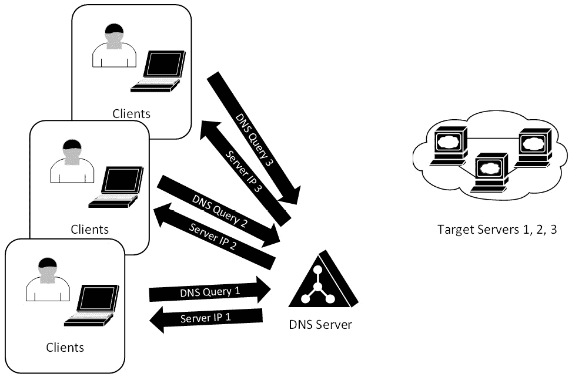
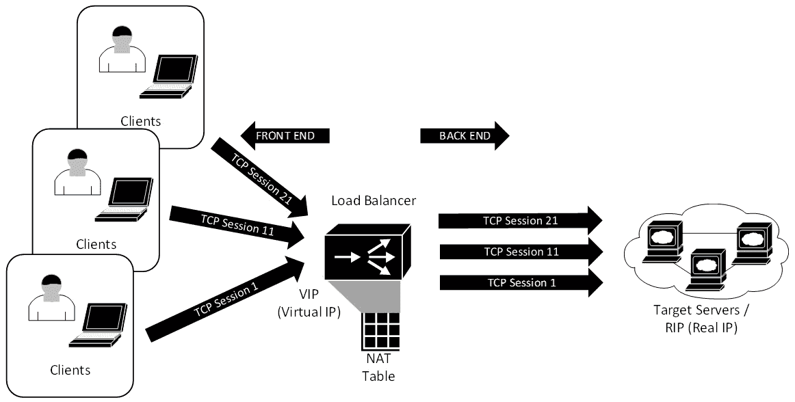
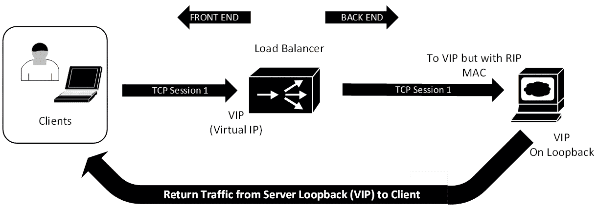
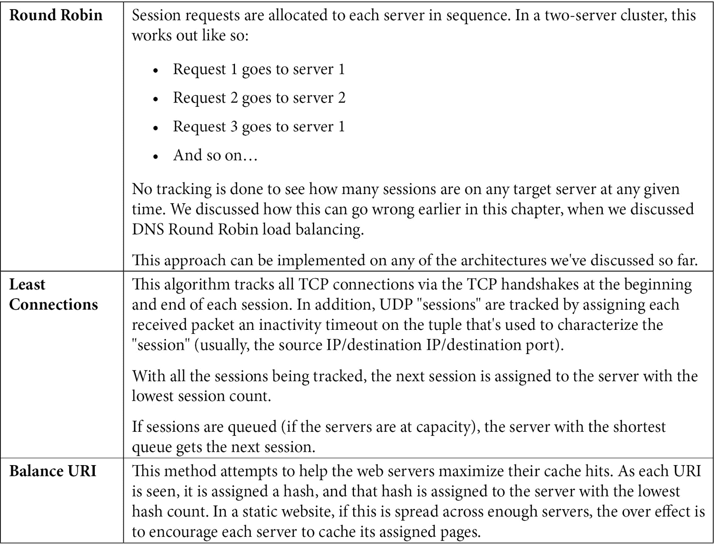
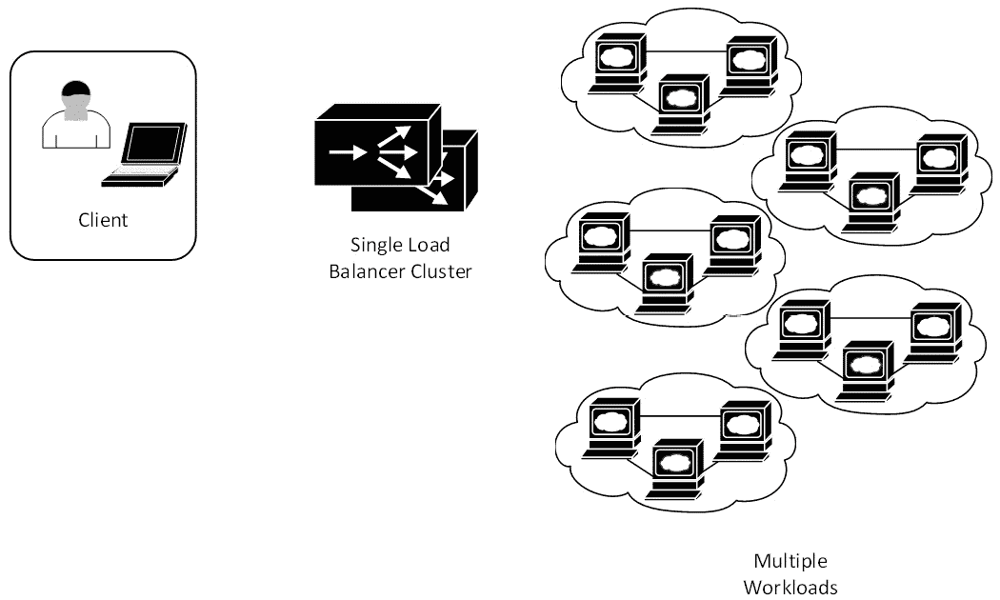
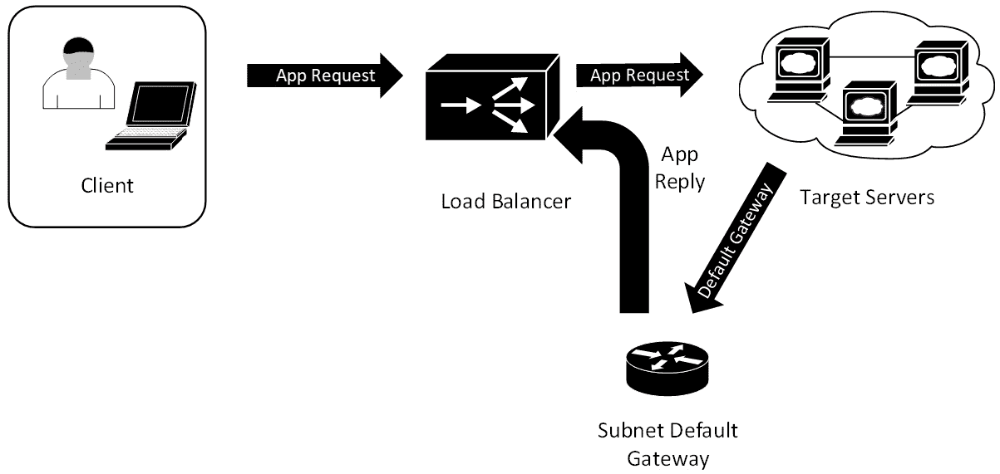
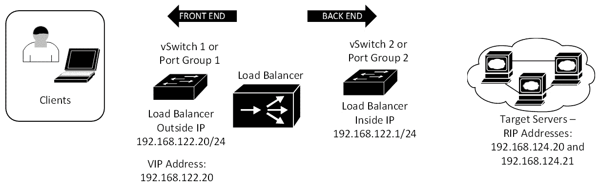

# 十、Linux 负载均衡器服务

在本章中，我们将讨论 Linux 中可用的负载平衡器服务，特别是 HAProxy。 负载平衡器允许客户机工作负载分布在多个后端服务器上。 这允许单个 IP 扩展到比单个服务器所允许的更大的范围，还允许在服务器中断或维护窗口的情况下进行冗余。

完成这些示例后，您应该具备通过几种不同的方法在自己的环境中部署基于 linux 的负载平衡器服务的技能。

特别地，我们将涵盖以下主题:

*   负载均衡简介
*   负载平衡算法
*   服务器和服务健康检查
*   数据中心负载平衡器的设计考虑
*   构建 HAProxy NAT/proxy 负载均衡器
*   关于负载平衡器安全性的最后一个注意事项

由于本节设置基础设施的复杂性，您可以针对示例配置做出一些选择。

# 技术要求

在本章中，我们将探索负载平衡器功能。 当我们在本书后面的例子中工作时，你可以跟随并在你当前的 Ubuntu 主机或虚拟机中实现我们的例子配置。 然而，要看到我们的负载平衡示例的实际操作，你需要一些东西:

*   至少两个目标主机来平衡负载
*   当前 Linux 主机中的另一个网络适配器
*   另一个子网用于承载目标主机和这个新的网络适配器

这个配置有一个匹配的图*图 10.2*，它将在本章的后面显示，说明当我们完成时，所有这些将如何连接在一起。

这给我们的实验室环境的配置增加了整个级别的复杂性。 当我们进入实验部分时，我们将提供一些替代方案(下载预先构建的虚拟机是其中之一)，但您可以选择继续阅读。 如果是这样，我认为您仍然可以很好地了解这个主题，以及现代数据中心中各种负载平衡器配置的设计、实现和安全影响的坚实背景。

# 负载均衡简介

在最简单的形式中，负载平衡就是将客户机负载分散到多个服务器上。 这些服务器可以位于一个或多个位置，并且分配负载的方法可能会有很大的不同。 事实上，平均分配负载的成功程度也会有很大的不同(主要取决于所选择的方法)。 让我们研究一些更常见的负载平衡方法。

## 轮询 DNS (RRDNS)

您可以仅使用 DNS 服务器(即所谓的**轮询 DNS**(**RRDNS**)进行简单的负载平衡。 在此配置中，当客户端请求解析`a.example.com`主机名时，DNS 服务器将返回 server 1 的 IP; 然后，当下一个客户机请求它时，它将返回服务器 2 的 IP，以此类推。 这是最简单的负载平衡方法，对于位于同一位置的服务器和位于不同位置的服务器都同样有效。 它也可以在不改变基础设施的情况下实现——不需要新的组件和配置更改:



图 10.1 -使用轮询 DNS 的简单负载均衡

配置 RRDNS 很简单——在 BIND 中，只需为具有多个 ip 的目标主机配置多条`A`记录即可。 连续的 DNS 请求将依次返回每个`A`记录。 这是一个好主意来缩短域的**time - to - live**(**【显示】TTL)在这样的配置中,如果需要,您将希望能够在短时间内采取任何一个服务器离线——如果你的 TTL 是 8 小时,不会适合你。 此外，您可以将顺序设置为循环(默认，它按顺序返回重复的`A`记录)、随机或固定(总是以相同的顺序返回匹配的记录)。 更改返回顺序的语法如下(默认设置`cyclic`显示在这里):**

```sh
options { 
    rrset-order { 
        class IN type A name "mytargetserver.example.com" order cyclic; 
    }; 
}; 
```

这个配置有几个问题:

*   没有一种好的方法可以将任何类型的健康检查合并到这个模型中——所有的服务器都正常运行吗? 服务开了吗? 主持人恢复正常了吗?
*   没有办法查看是否有任何 DNS 请求之后实际上是一个到服务的连接。 有很多原因可以解释为什么会发出 DNS 请求，并且交互可能在那里结束，而没有后续连接。
*   也没有办法监控会话何时结束，这意味着没有办法向使用最少的服务器发送下一个请求——它只是在所有服务器之间稳定地、甚至轮换。 在一天开始的任何业务,这可能看起来像一个好的模型,但随着时间的推移,总会有长期会话和极短的没有发生(或会议),所以它是常见的服务器负载变得“不平衡的”随着时间的推移。 如果一天中没有明确的开始或结束来有效地“清空”事情，这一点就会变得更加明显。
*   出于同样的原因，如果集群中的一台服务器因维护或计划外的停机而关闭，则没有好的方法使其恢复奇偶校验(只要会话数量增加)。
*   通过一些 DNS 侦察，攻击者可以收集所有集群成员的真实 ip，然后对它们进行评估或分别攻击。 如果它们中的任何一个特别容易受到攻击，或者有一个额外的 DNS 条目将其标识为备份主机，这将使攻击者的工作更加容易。
*   使任何一个目标服务器离线都可能是一个问题——DNS 服务器将继续按照请求的顺序提供该地址。 即使记录被编辑，任何下游客户端和 DNS 服务器都将缓存其解析的 ip，并继续尝试连接到故障主机。
*   下游 DNS 服务器(即互联网上的 DNS 服务器)将缓存它们获得的区域 TTL 期间的任何记录。 所有 DNS 服务器的客户端都会被发送到同一个目标服务器。

由于这些原因，RRDNS 将以一种简单的方式“在必要时”完成工作，但这通常不应该作为一个长期的生产解决方案来实现。 也就是说，**全局服务器负载平衡器**(**GSLB**)产品实际上基于这种方法，具有不同的负载平衡选项和运行状况检查。 负载均衡器和目标服务器之间的断开仍然存在于 GSLB 中，所以这些相同的缺点在这个解决方案中也存在。

我们在数据中心经常看到的是基于代理(第 7 层)或基于 nat(第 4 层)的负载平衡。 让我们来探讨一下这两种选择。

## 入站代理-七层负载均衡

在这个架构中，客户端的会话在代理服务器上终止，在代理的内部接口和实服务器 IP 之间启动一个新的会话。

这还提出了许多负载平衡解决方案都使用的几个架构术语。 在下面的图中，我们可以看到面向客户端的**前端**和面向服务器的**后端**的概念。 此时，我们还应该讨论 IP 地址。 前端**提出了一种虚拟 IP**(【显示】**VIP)由所有目标服务器,共享服务器的**真正的 IPs**(【病人】**撕裂)未见的客户:****


图 10.2 -使用反向代理的负载均衡

这种方法有一些缺点:

*   在本章讨论的所有方法中，它在负载平衡器上具有最高的 CPU 负载，在极端情况下，它可以转化为对客户端的性能影响。
*   此外，由于目标服务器上的客户端流量都来自代理服务器(或多个服务器)，无需进行一些特殊处理，因此目标/应用服务器上看到的客户端 IP 始终是负载均衡器的后端 IP。 这使得记录应用中的直接客户机交互有问题。 解析交通从一个会话和与客户的实际地址,我们必须匹配客户会话的负载均衡器(视客户端 IP 地址而不是用户身份)与应用/ web 服务器日志(看到用户身份但不是客户端 IP 地址)。 在这些日志之间匹配会话可能是一个真正的问题; 它们之间的共同元素是时间戳和负载均衡器上的源端口，而源端口通常不在 web 服务器上。
*   这可以通过应用感知来缓解。 例如，Citrix ICA 服务器或 Microsoft RDP 服务器后端使用 TLS 前端是很常见的。 在这些情况下，代理服务器有一些优秀的“钩子”到协议，允许客户端 IP 地址一直被带到服务器，以及负载均衡器检测的身份。

不过，从好的方面来看，如果工具到位，使用代理架构允许我们全面检查攻击流量。 事实上，由于代理架构的原因，负载均衡器和目标服务器之间的最后一跳是一个全新的会话——这意味着无效的协议攻击大部分都被过滤掉了，根本不需要任何特殊的配置。

通过将负载均衡器作为入站**网络地址转换**(**NAT**)配置运行，我们可以减轻这种代理方法的一些复杂性。 当不需要解密时，通常可以看到 NAT 方法，它内置在大多数环境中。

## 入方向 NAT -四层负载分担

这是最常见的解决方案，也是我们在示例中开始使用的解决方案。 在很多方面，该体系结构看起来与代理解决方案相似，但有一些关键的区别。 注意，在下图中，前端和后端 TCP 会话现在是匹配的——这是因为负载均衡器不再是代理; 已配置入方向 NAT。 所有的客户端仍然连接到单个 VIP，并被负载均衡器重定向到各个服务器 rip:



图 10.3 -使用入站 NAT 进行负载均衡

为什么在许多情况下这是首选架构的原因如下:

*   服务器会看到客户端的真实 ip，服务器日志也会正确地反映出来。
*   负载均衡器在内存中维护 NAT 表，负载均衡器的日志反映了各种 NAT 操作，但无法“看到”会话。 例如，如果服务器正在运行一个 HTTPS 会话，如果这是一个简单的第 4 层 NAT，那么负载均衡器可以看到 TCP 会话，但不能解密流量。
*   我们可以选择在前端终止 HTTPS 会话，然后在此架构的后端运行加密或明文。 然而，由于我们要维护两个会话(前端和后端)，这看起来更像是一个代理配置。
*   因为负载平衡器可以查看整个 TCP 会话(直到第 4 层)，所以现在有几种负载平衡算法可用(请参阅下一节关于负载平衡算法的更多信息)。
*   这种架构允许我们在负载均衡器上放置**Web 应用防火墙**(**WAF**)功能，这可以掩盖目标服务器 Web 应用上的一些漏洞。 例如，WAF 是针对跨站点脚本或缓冲区溢出攻击，或任何其他可能依赖于输入验证错误的攻击的通用防御。 对于这些类型的攻击，WAF 识别任何给定字段或 URI 的可接受输入，然后丢弃任何不匹配的输入。 然而，WAFs 并不局限于这些攻击。 可以把 WAF 功能看作一个 web 专用的 IPS(见[*第十四章*](14.html#_idTextAnchor252)，*Linux 上的蜜罐服务*)。
*   这种架构非常适合使会话持久或“粘性”——也就是说，一旦客户机会话“附加”到服务器，后续的请求将被定向到同一台服务器。 这非常适合具有后端数据库的页面，例如，如果您没有保持相同的后端服务器，您的活动(例如，电子商务网站上的购物车)可能会丢失。 动态或参数化网站——页面在您导航时实时生成(例如，大多数有产品目录或库存的网站)——通常也需要会话持久性。
*   您还可以独立地对每个相继的请求进行负载平衡，因此，例如，当客户机导航一个站点时，它们的会话可能会被每个页面的不同服务器终止。 这种类型的方法非常适合静态网站。
*   您可以将其他功能放在这个体系结构之上。 例如，它们通常与防火墙并行部署，甚至与公共互联网上的本地接口一起部署。 正因为如此，您经常会看到负载平衡器供应商使用 VPN 客户端来使用它们的负载平衡器。
*   如上图所示，入站 NAT 和代理负载均衡器具有非常相似的拓扑结构—连接看起来都非常相似。 这是在实现中进行的，在这里可以看到一些东西被代理，一些东西在相同的负载均衡器上通过 NAT 进程运行。

然而，尽管此配置对 CPU 的影响比代理解决方案低得多，但每个工作负载包都必须在两个方向上通过负载均衡器。 我们可以使用**直接服务器返回**(**DSR**)架构显著降低这种影响。

## DSR 负载均衡

在 DSR 中，所有进入的流量仍然从负载均衡器上的 VIP 到各个服务器 rip 进行负载平衡。 但是，返回的流量直接从服务器返回到客户机，绕过负载均衡器。

这是怎么做到的呢? 方法如下:

*   在进入的过程中，负载均衡器重写每个包的 MAC 地址，在目标服务器的 MAC 地址之间进行负载均衡。
*   每个服务器都有一个 loopback 地址，该地址与 VIP 地址匹配。 这是返回所有流量的接口(因为客户端期望从 VIP 地址返回流量)。 但是，必须将其配置为不响应 ARP 请求(否则，负载均衡器将在入站路径上被绕过)。

这可能看起来很复杂，但下面的图表应该能让事情更清楚一些。 请注意，在这个图中只有一个目标主机，以便更容易地看到流量:



图 10.4 - DSR 负载均衡

有一些非常严格的要求:

*   负载均衡器和所有目标服务器需要在同一子网中。
*   这种机制需要在默认网关上进行一些游戏，因为在进入的过程中，它必须将所有客户端流量直接指向负载均衡器上的 VIP，但它还必须接受来自多个相同地址但不同 MAC 地址的目标服务器的响应。 为此，三层默认网关必须为每个目标服务器提供一个 ARP 表项，所有这些服务器都具有相同的 IP 地址。 在许多架构中，这是通过多个静态 ARP 条目来完成的。 例如，在 Cisco 路由器上，我们可以这样做:

    ```sh
    arp 192.168.124.21 000c.2933.2d05 arpa
    arp 192.168.124.22 000c.29ca.fbea arpa
    ```

注意在本例中，`192.168.124.21`和`22`是正在进行负载均衡的目标主机。 而且，MAC 地址有一个 OUI，表明它们都是 VMware 虚拟主机，这在大多数数据中心中都很常见。

为什么要经历所有这些麻烦和不寻常的网络配置?

*   DSR 配置的优点是最大限度地减少通过负载均衡器的流量。 例如，在 web 应用中，通常会看到返回的流量比传入的流量大 10 倍或更多。 这意味着对于该流量模型，DSR 实现将看到 NAT 或代理负载均衡器所看到的流量的 90%或更少。
*   不需要“后端”子网; 负载均衡器和目标服务器都在同一子网中—事实上，这是一种需求。 正如我们已经讨论过的，这也有一些缺点。 我们将在*DSR 的特定服务器设置*一节中详细介绍这一点。

然而，有一些缺点:

*   集群间的相对负载，或者任何一台服务器上的单个负载，充其量只能由负载均衡器推断出来。 如果会话优雅地结束，负载平衡器将捕获足够的“会话结束”握手，以确定会话已经结束，但如果会话没有优雅地结束，它将完全依赖于超时来结束会话。
*   所有主机必须配置相同的 IP(原始目标)，以便返回的流量不会来自意外的地址。 这通常通过环回接口完成，并且通常需要在主机上进行一些额外的配置。
*   需要将上游路由器(或三层交换机，如果它是子网的网关)配置为允许目标 IP 地址的所有可能的 MAC 地址。 这是一个手动过程，如果可能看到 MAC 地址意外变化，这可能是一个问题。
*   如果任何需要代理或会话的完全可见性(如在 NAT 实现中)的功能不能工作，负载均衡器只能看到会话的一半。 这意味着不能实现任何 HTTP 报头解析、cookie 操作(例如，用于会话持久性)或 SYN cookie。

此外,由于(如路由器而言),所有的目标主机上有不同的 MAC 地址但相同的 IP 地址,和目标主机不能回复任何 ARP 请求(否则,他们会绕过负载均衡器),有大量的工作需要做在目标主机上。

### DSR 的特定服务器设置

对于 Linux 客户端，必须对“VIP”寻址接口(无论是环回还是逻辑以太网)进行 ARP 抑制。 这可以用`sudo ip link set <interface name> arp off`或(使用旧的`ifconfig`语法)`sudo ifconfig <interface name> -arp`来完成。

您还需要在目标服务器上实现`strong host`和`weak host`设置。 如果服务器接口不是路由器，不能发送或接收来自该接口的报文，除非报文中的源 IP 或目的 IP 与该接口的 IP 匹配，则将该接口配置为`strong host`。 如果一个接口被配置为`weak host`，则此限制不适用——它可以代表其他接口接收或发送报文。

Linux 和 BSD Unix 在所有接口(`sysctl net.ip.ip.check_interface = 0`)上默认启用`weak host`。 Windows 2003 及更早版本也支持此功能。 然而，Windows Server 2008 及更新版本的所有接口都有一个`strong host`模型。 要在较新的 Windows 版本中更改 DSR，请执行以下代码:

```sh
netsh interface ipv4 set interface "Local Area Connection" weakhostreceive=enabled
netsh interface ipv4 set interface "Loopback" weakhostreceive=enabled
netsh interface ipv4 set interface "Loopback" weakhostsend=enabled 
```

您还需要在目标服务器上禁用任何 IP 校验和卸载和 TCP 校验和卸载功能。 在 Windows 主机上，这两个设置在网络适配器/高级设置中。 在 Linux 主机上，`ethtool`命令可以操作这些设置，但是在 Linux 中，这些基于硬件的卸载特性在默认情况下是禁用的，因此通常不需要调整它们。

在描述了各种架构之后，我们仍然需要确定如何在目标服务器组中精确地分配客户机负载。

# 负载均衡算法

到目前为止，我们已经接触了一些负载平衡算法，所以让我们更详细地探讨一些更常见的方法(注意，这个列表并不是详尽的; 这里提供了最常见的方法):



如您所料，最小连接是最常分配的算法。 我们将在本章后面的配置示例中使用这种方法。

现在我们已经看到了一些如何平衡工作负载的选项，那么我们如何确保这些后端服务器正常工作呢?

# 服务器和服务健康检查

我们在 DNS 负载均衡的部分讨论的问题之一是健康检查。 一旦开始负载平衡，通常需要某种方法来知道哪些服务器(和服务)正在正确地运行。 检查任何连接的*运行状况*的方法包括:

1.  使用 ICMP 定期有效地“ping”目标服务器。 如果没有 ping 返回一个 ICMP 回显应答，那么它们就被认为是 down，并且它们不会接收任何新客户机。 现有客户机将分布在其他服务器上。
2.  使用 TCP 握手并检查开放的端口(例如，web 服务的`80/tcp`和`443/tcp`)。 同样，如果握手没有完成，那么主机就被认为停机了。
3.  在 UDP 中，您通常会发出一个应用请求。 例如，如果您正在对 DNS 服务器进行负载均衡，那么负载均衡器将发出一个简单的 DNS 查询—如果收到 DNS 响应，则认为服务器已经启动。
4.  最后，当平衡一个 web 应用时，您可能会发出一个实际的 web 请求。 通常，您会请求索引页(或任何已知页)并在该页上查找已知文本。 如果该文本没有出现，则认为该主机和服务组合已关闭。 在更复杂的环境中，您检查的测试页面可能会对后端数据库进行已知调用以验证它。

当然，测试实际的应用(如前面的两点)是验证应用正在工作的最可靠的方法。

我们将在示例配置中展示其中一些健康检查。 在我们讨论这个之前，让我们先来看看如何在典型的数据中心中实现负载平衡器——无论是在“遗留”配置中还是在更现代的实现中。

# 数据中心负载均衡器的设计考虑

负载平衡作为大型架构的一部分已经有几十年了，这意味着我们已经经历了几种常见的设计。

我们仍然经常看到的“遗留”设计是一对物理负载均衡器(或集群)，它们为数据中心中的所有负载平衡工作负载提供服务。 通常，相同的负载均衡器集群用于内部和外部工作负载，但是有时，您会看到内部网络上有一对内部负载均衡器，而另一对仅服务于 DMZ 工作负载(即外部客户机)。

在我们有物理服务器的时候，这种模型是一种很好的方法，负载平衡器是昂贵的硬件。

然而，在虚拟化环境中，工作负载虚拟机与物理负载平衡器绑定在一起，这使网络配置变得复杂，限制了灾难恢复选项，并且常常会导致流量在(物理)负载平衡器和虚拟环境之间产生多个“循环”:



图 10.5 -遗留的负载平衡架构

随着虚拟化的到来，这一切都改变了。 现在使用物理负载平衡器已经没有什么意义了——对于每个工作负载，最好还是使用专用的小型 VM，如下所示:


图 10.6 -现代的负载平衡架构

这种方法有几个优点:

*   **成本**是一个优势，因为这些小型虚拟负载平衡器如果获得许可会更便宜，如果使用 HAProxy(或任何其他免费/开源解决方案)等解决方案则是免费的。 这可能是影响最小的优势，但通常也是改变观点的一个因素。
*   **配置更简单**且更易于维护，因为每个负载均衡器只服务于一个工作负载。 如果进行了更改并且可能需要后续调试，那么从较小的配置中“挑选”一些内容要简单得多。
*   在发生故障或(更有可能的是)配置错误的情况下，**飞溅区**或**爆炸半径**要小得多。 如果将每个负载平衡器绑定到单个工作负载，则任何错误或故障都更有可能只影响该工作负载。
*   此外，从操作的角度来看，**使用编排平台或用于扩展工作负载的 API 要容易得多**(在需求上升或下降时向集群添加或删除后端服务器)。 这种方法使得构建这些剧本更加简单——主要是因为更简单的配置和更小的爆炸半径，在剧本错误的情况下。
*   **开发人员更快速的部署** 由于您要保持此配置的简单性，因此在开发环境中，您可以在开发人员编写或修改应用时为他们提供完全相同的配置。 这意味着在编写应用时考虑了负载平衡器。 另外，大多数测试是在开发周期中完成的，而不是在开发结束时在一个更改窗口中对配置进行测试。 即使负载平衡器是经过许可的产品，大多数供应商都有一个免费(低带宽)的许可层，正好适用于这种场景。
*   通过较小的配置，为开发人员或部署提供安全配置的模板要容易得多。
*   **开发或 DevOps 周期中的安全测试**包括负载均衡器，而不仅仅是应用和托管服务器。
*   **训练和测试更简单**。 由于负载平衡产品是免费的，所以设置培训或测试环境既快捷又简单。
*   **工作负载优化**是一个显著的优势，因为在虚拟化环境中，您通常可以将服务器组“绑定”在一起。 在 VMware vSphere 环境中，对于实例，这称为**vApp**。 这种结构允许您将所有 vApp 成员保持在一起，例如，如果您将它们 vMotion 到另一个 hypervisor 服务器。 为了维护，您可能需要执行此操作，或者使用**动态资源调度**(**DRS**)自动执行此操作，在多个服务器上平衡 CPU 或内存负载。 或者，迁移可能是灾难恢复工作流的一部分，在这个工作流中，您可以使用 vMotion 或仅仅通过激活虚拟机副本集将 vApp 迁移到另一个数据中心。
*   **云部署更适合这种分布式模型**。 这在大型云服务提供商中发挥到了极致，其中负载平衡只是您订阅的一个服务，而不是一个离散的实例或虚拟机。 这方面的例子包括 AWS 弹性负载平衡服务、Azure 负载均衡器和谷歌的云负载平衡服务。

然而，负载平衡带来了几个管理挑战，其中大部分来自一个问题——如果所有目标主机都有负载均衡器的默认网关，我们如何监控和管理这些主机呢?

## 数据中心网络和管理方面的考虑

如果一个工作负载通过 NAT 方式实现负载平衡，则需要考虑路由问题。 到潜在应用客户机的路由必须指向负载均衡器。 如果这些目标是基于 internet 的，这将使管理单个服务器成为一个问题——您不希望您的服务器管理通信是负载平衡的。 您也不希望通过负载均衡器路由不必要的流量(例如备份或批量文件副本)—您希望它路由应用流量，而不是所有的流量!

这通常通过添加静态路由和可能的管理 VLAN 来处理。

现在是提出管理 VLAN 从一开始就应该存在的好时机——我关于管理 VLAN 的“赢得要点”短语是“您的会计组(或接待员或制造组)需要访问 SAN 或 hypervisor 登录吗?” 如果您能够得到保护敏感接口免受内部攻击的答案，那么管理 VLAN 就很容易实现。

在任何情况下，在这个模型中，默认网关仍然指向负载均衡器(为 internet 客户端服务)，但特定的路由被添加到服务器，以指向内部或服务资源。 在大多数情况下，这个资源列表仍然很小，所以即使内部客户端计划使用相同的负载平衡应用，这仍然可以工作:


图 10.7 -路由非应用流量(高层)

如果这个模型由于的原因不能工作，那么您可能需要考虑添加**基于策略的路由**(**策略路由**)。

在这种情况下，例如，您的服务器分别负载平衡 HTTP 和 HTTPS -`80/tcp`和`443/tcp`。 你的政策可能是这样的:

*   将来自`80/tcp`和`443/tcp`的所有流量**路由到负载均衡器(换句话说，来自应用的回复流量)。**
*   路由所有其他流量通过子网的路由器。

这个策略路由可以放到服务器子网的路由器上，如下所示:



图 10.8 -在上游路由器上路由非应用流量策略路由

在上面的图中，所有的服务器都有一个基于路由器接口的默认网关(本例中为`10.10.10.1`):

```sh
! this ACL matches reply traffic from the host to the client stations
ip access-list ACL-LB-PATH
   permit tcp any eq 443 any
   permit tcp any eq 90 any
! regular default gateway, does not use the load balancer, set a default gateway for that
ip route 0.0.0.0 0.0.0.0 10.10.x.1
! this sets the policy for the load balanced reply traffic
route-map RM-LB-PATH permit 10
   match ip address ACL-LB-BYPASS
   set next-hop 10.10.10.5
! this applies the policy to the L3 interface.
! note that we have a "is that thing even up" check before we forward the traffic
int vlan x
ip policy route-map RM-LB-PATH
 set ip next-hop verify-availability 10.10.10.5 1 track 1
 set ip next-hop 10.10.10.5
! track 1 is defined here
track 1 rtr 1 reachability
rtr 1
type echo protocol ipIcmpEcho 10.10.10.5
rtr schedule 1 life forever start-time now
```

这样做的好处是简单，但是这个子网默认网关设备必须有足够的能力来满足所有应答流量的需求，而不影响它的任何其他工作负载的性能。 幸运的是，许多现代 10G 开关都有这样的马力。 然而，这也有一个缺点，即您的应答流现在离开管理程序，到达默认网关路由器，然后可能返回虚拟基础设施，到达负载均衡器。 在某些环境中，这仍然可以在性能方面工作，但如果不行，请考虑将策略路由移动到服务器本身。

要在 Linux 主机上实现相同的策略路由，请遵循以下步骤:

1.  首先，添加路由到`table 5`:

    ```sh
    ip route add table 5 0.0.0.0/0 via 10.10.10.5
    ```

2.  定义匹配负载均衡器(源`10.10.10.0/24`，源端口`443`)的流量:

    ```sh
    iptables -t mangle -A PREROUTING -i eth0 -p tcp -m tcp --sport 443 -s 10.10.10.0/24 -j MARK --set-mark 2
    iptables -t mangle -A PREROUTING -i eth0 -p tcp -m tcp --sport 80 -s 10.10.10.0/24 -j MARK --set-mark 2
    ```

3.  添加查找，如下:

    ```sh
    ip rule add fwmark 2 lookup 5
    ```

这种方法增加的复杂性和 CPU 开销超过了大多数人的预期。 此外，对于“网络路由问题”，支持人员更有可能在路由器和交换机上开始任何未来的故障诊断，而不是查看主机配置。 由于这些原因，我们经常看到将策略路由放在路由器或第三层交换机上。

使用管理界面可以更优雅地解决这个问题。 另外，如果管理接口还没有在组织中广泛使用，这种方法很好地将它们引入环境中。 在这种方法中，我们将目标主机配置为其默认网关指向负载均衡器。 然后，我们向每个主机添加一个管理 VLAN 接口，就像在该 VLAN 中直接添加一些管理服务一样。 此外，我们还可以根据需要向 SNMP 服务器、日志服务器或其他内部或互联网目的地添加特定的路由:


图 10.9 -添加管理 VLAN

不用说，这就是通常采用的方法。 它不仅是最简单的方法，而且还向体系结构中添加了急需的管理 VLAN。

在介绍了该理论的大部分之后，让我们继续构建几个不同的负载平衡场景。

# 搭建 HAProxy NAT/proxy 负载均衡器

首先，我们可能不希望使用示例主机进行此操作，因此我们必须添加一个新的网络适配器来演示 NAT/代理(L4/L7)负载均衡器。

如果您的示例主机是一个虚拟机，那么构建一个新主机应该很快。 或者，更好的是，克隆您的现有 VM 并使用它。 或者,您可以下载一个**开放虚拟化设备**(**卵子)文件从 HAProxy GitHub 页面([https://github.com/haproxytech/vmware-haproxy 下载)并导入到您的测试环境。 如果您采用这种方法，请跳过这里显示的安装说明，并在安装后在`haproxy –v`启动 HAProxy 配置。](https://github.com/haproxytech/vmware-haproxy#download)**

或者，如果您选择不与我们的示例配置“一起构建”，那么无论如何您仍然可以“跟随”。 虽然为负载均衡器构建管道可能需要一些工作，但实际的配置非常简单，向您介绍该配置是我们这里的目标。 您当然可以实现这个目标，而不需要构建支持虚拟或物理基础设施。

如果将其安装在一个新的 Linux 主机上，请确保有两个网络适配器(一个面向客户机，一个面向服务器)。 和往常一样，我们将从安装目标应用开始:

```sh
$ sudo apt-get install haproxy
```

*<如果您正在使用基于 ova 的安装，请从这里开始:>*

您可以通过使用`haproxy`应用本身检查版本号来验证安装是否工作:

```sh
$ haproxy –v
HA-Proxy version 2.0.13-2ubuntu0.1 2020/09/08 - https://haproxy.org/
```

请注意，任何比这里显示的版本更新的版本都应该可以正常工作。

安装了这个包之后，让我们看看我们的示例网络构建。

## 在开始配置网卡、寻址和路由之前

欢迎你使用你选择任何 IP 寻址,但在我们的示例中,前端**虚拟 IP【显示】(****VIP)地址将`192.168.122.21/24`(注意,这是不同的接口 IP 主机), 而负载均衡器的后端地址将是`192.168.124.1/24`——这将是目标主机的默认网关。 我们的目标 web 服务器将拥有**RIP**的`192.168.124.10`和`192.168.124.20`地址。**

我们最终的构建将是这样的:



图 10.10 -负载均衡器示例构建

在开始构建负载平衡器之前，现在是在 Linux 中调整一些设置的最佳时机(其中一些设置需要重新加载系统)。

## 在开始配置-性能调优之前

一个基本的“outof the box”Linux 安装必须对各种设置做几个假设，尽管其中许多会导致性能或安全性方面的妥协。 对于负载平衡器，有几个 Linux 设置需要解决。 幸运的是，HAProxy 安装为我们做了很多工作(如果我们安装了许可版本)。 安装完成后，编辑`/etc/sysctl.d/30-hapee-2.2.conf`文件并取消对以下代码中的行的注释(在本例中，我们正在安装 Community Edition，因此创建这个文件并取消对行的注释)。 与所有基本系统设置一样，您可以在进行时测试这些设置，一次修改一个或在逻辑分组中进行修改。 此外，正如预期的那样，这可能是一个迭代过程，您可能在一个设置和另一个设置之间来回切换。 正如在文件注释中指出的，并不是所有这些值都是推荐的，甚至在大多数情况下。

这些设置及其描述都可以在[https://www.haproxy.com/documentation/hapee/2-2r1/getting-started/system-tuning/](https://www.haproxy.com/documentation/hapee/2-2r1/getting-started/system-tuning/)找到。

当运行大量并发连接时，限制每个套接字的默认接收/发送缓冲区，以限制内存使用。 这些值以字节为单位，分别表示最小值、默认值和最大值。 默认值为`4096`、`87380`和`4194304`:

```sh
    # net.ipv4.tcp_rmem            = 4096 16060 262144
    # net.ipv4.tcp_wmem            = 4096 16384 262144
```

允许早期重用相同的源端口用于输出连接。 如果每秒有几百个连接，这是必需的。 默认值如下:

```sh
    # net.ipv4.tcp_tw_reuse        = 1
```

扩展 TCP 连接的源端口范围。 这限制了早期端口重用，并利用了`64000`源端口。 默认值为`32768`和`61000`:

```sh
    # net.ipv4.ip_local_port_range = 1024 65023
```

增加 TCP SYN backlog 的大小。 这通常需要支持非常高的连接速率，并抵御 SYN flood 攻击。 设置过高会延迟 SYN cookie 的使用。 默认为`1024`:

```sh
    # net.ipv4.tcp_max_syn_backlog = 60000
```

设置`tcp_fin_wait`状态的超时时间，以秒为单位。 降低它会加速死连接的释放，尽管它会在 25-30 秒内导致问题。 如果可能的话，最好不要改变它。 默认为`60`:

```sh
    # net.ipv4.tcp_fin_timeout     = 30
```

限制发送 SYN-ACK 重试次数。 这个值是 SYN 洪水的直接放大因子，所以保持它合理的低值是很重要的。 然而，将其设置得太低将会阻止有损网络上的客户端连接。

使用`3`作为缺省值可以获得良好的效果(总共 4 个 SYN- ack)，而在 SYN flood 攻击时将其降低到`1`可以节省大量带宽。 默认为`5`:

```sh
    # net.ipv4.tcp_synack_retries  = 3
```

将其设置为`1`，允许本地进程绑定到系统上不存在的 IP。 这是共享 VRRP 地址的典型情况，您希望主和备份同时启动，即使 IP 不存在。 始终保持`1`。 默认为`0`:

```sh
    # net.ipv4.ip_nonlocal_bind    = 1
```

以下是所有系统 SYN 积压的上限。 至少要与`tcp_max_syn_backlog`一样高; 否则，客户端可能会在高速连接时遇到困难或受到 SYN 攻击。 默认为`128`:

```sh
     # net.core.somaxconn           = 60000
```

同样，请注意，如果您进行了任何这些更改，您可能会在稍后返回此文件以撤销或调整您的设置。 完成所有这些之后(至少现在)，让我们配置我们的负载均衡器，以便它能与我们的两个目标 web 服务器一起工作。

## 负载均衡 TCP 服务- web 服务

负载均衡服务的配置非常简单。 让我们从两个 web 服务器主机之间的负载平衡开始。

让我们编辑`/etc/haproxy/haproxy.cfg`文件。 我们将创建一个`frontend`节来定义面向客户端的服务，以及一个`backend`节来定义两个下游 web 服务器:

```sh
frontend http_front
   bind *:80
   stats uri /haproxy?stats
   default_backend http_back
backend  http_back
   balance roundrobin
   server WEBSRV01 192.168.124.20:80 check fall 3 rise 2
   server WEBSRV02 192.168.124.21:80 check fall 3 rise 2
```

请注意以下几点:

*   前端部分中有一个`default backend`行，它告诉前端需要绑定哪些服务。
*   前端有一个`bind`语句，该语句允许负载在该接口上的所有 ip 上进行平衡。 因此，在本例中，如果我们只使用一个 VIP 进行负载平衡，我们可以在负载均衡器的物理 IP 上进行此操作。
*   后端以`roundrobin`作为负载均衡算法。 这意味着当用户连接时，他们将被定向到 server1，然后是 server2，然后是 server1，以此类推。
*   参数`check`告诉服务检查目标服务器以确保它处于启动状态。 当负载平衡 TCP 服务作为一个简单的 TCP“连接”达到目的时，这就简单得多，至少可以验证主机和服务正在运行。
*   `fall 3`在连续三次检查失败后将服务标记为离线，而`rise 2`在两次成功检查后将其标记为在线。 无论使用哪种检查类型，都可以使用这些上升/下降关键字。

我们还希望在这个文件中有一个全局部分，以便我们可以设置一些服务器参数和默认值:

```sh
global
    maxconn 20000
    log /dev/log local0
    user haproxy
    group haproxy
    stats socket /run/haproxy/admin.sock user haproxy group haproxy mode 660 level admin
    nbproc 2
    nbthread 4
    timeout http-request <timeout>
    timeout http-keep-alive <timeout>
    timeout queue <timeout>
    timeout client-fin <timeout>
    timeout server-fin <timeout>
    ssl-default-bind-ciphers ECDHE-ECDSA-AES256-GCM-SHA384:ECDHE-RSA-AES256-GCM-SHA384:ECDHE-ECDSA-CHACHA20-POLY1305:ECDHE-RSA-CHACHA20-POLY1305:ECDHE-ECDSA-AES128-GCM-SHA256:ECDHE-RSA-AES128-GCM-SHA256:ECDHE-ECDSA-AES256-SHA384:ECDHE-RSA-AES256-SHA384:ECDHE-ECDSA-AES128-SHA256:ECDHE-RSA-AES128-SHA256
    ssl-default-bind-options ssl-min-ver TLSv1.2 no-tls-tickets
```

注意，我们在本节中定义了用户和组。 一路回到[*第三章*](03.html#_idTextAnchor053),*使用 Linux 和 Linux 网络诊断工具*,我们提到你需要 root 特权开始一个监听端口,如果端口数量小于`1024`。 对于 HAProxy 来说，这意味着它需要根权限来启动服务。 全局部分中的用户和组指令允许服务“降级”其权限。 这一点很重要，因为如果服务遭到破坏，较低的权限将使攻击者的选择更少，可能会增加攻击所需的时间，并有望增加他们被捕获的可能性。

`log`行非常简单——它告诉`haproxy`将其日志发送到哪里。 如果您有任何需要用负载平衡解决的问题，这是一个很好的开始，然后是目标服务日志。

`stats`指令告诉`haproxy`在哪里存储它的各种性能统计数据。

`nbproc`和`nbpthread`指令告诉 HAProxy 服务有多少处理器和线程可供使用。 这些数字应该至少比可用进程少一个，以便在发生拒绝服务攻击时，整个负载均衡器平台不会瘫痪。

各种超时参数的存在是为了防止协议级别的拒绝服务攻击。 在这些情况下，攻击者发送初始请求，但之后从不继续会话——他们只是不断地发送请求，“消耗”负载平衡器资源，直到内存被完全消耗。 这些超时限制了负载均衡器保持任何一个会话存活的时间。 下表简要描述了我们在这里讨论的每个 keep-alive 参数的:


另外，SSL 指令是非常不言自明的:

*   `ssl-default-bind-ciphers`列出了在任何 TLS 会话中允许的密码，如果负载平衡器正在终止或启动一个会话(也就是说，如果您的会话是在代理模式或 7 层模式)。
*   `ssl-default-bind-options`设置了支持的 TLS 版本的下限。 在撰写本文时，不再推荐所有 SSL 版本以及 TLS 1.0 版本。 SSL 尤其容易受到多种攻击。 由于所有现代浏览器都能够协商到 TLS 版本 3，大多数环境选择支持 TLS 版本 1.2 或更高版本(如示例所示)。

现在，从一个客户机机器，您可以浏览到 HAProxy 主机，您将看到连接到其中一个后端。 如果您从不同的浏览器再次尝试，您应该连接到第二个浏览器。

让我们进一步扩展，并添加对 HTTPS 的支持(在`443/tcp`上)。 我们将添加一个 IP 到前端接口并绑定到它。 我们将平衡算法改为最小连接数。 最后，我们将更改前端和后端名称，以便它们包含端口号。 这允许我们为`443/tcp`添加额外的配置部分。 如果我们只监控第 4 层 TCP 会话，这个流量可以很好地负载平衡; 无需解密:

```sh
frontend http_front-80
   bind 192.168.122.21:80
   stats uri /haproxy?stats
   default_backend http_back-80
frontend http_front-443
   bind 192.168.122.21:443
   stats uri /haproxy?stats
   default_backend http_back-443
backend  http_back-80
   balance leastconn
   server WEBSRV01 192.168.124.20:80 check fall 3 rise 2
   server WEBSRV02 192.168.124.21:80 check fall 3 rise 2
backend  http_back-443
   balance leastconn
   server WEBSRV01 192.168.124.20:443 check fall 3 rise 2
   server WEBSRV02 192.168.124.21:443 check fall 3 rise 2
```

注意，我们仍然只是检查 TCP 端口是否为“服务器健康”检查而打开。 这通常被称为第 3 层健康检查。 我们将端口`80`和`443`放入两个部分——这些可以合并为前端节的一个部分，但通常最好将它们分开，以便分别跟踪它们。 这样做的副作用是，两个后端部分的计数彼此不知道，但这通常不是问题，因为现在整个 HTTP 站点通常只是重定向到 HTTPS 站点。

另一种表达方式是在`listen`节上，而不是在前端和后端节上。 这种方法将前端和后端部分组合成一个单独的节，并添加一个“健康检查”:

```sh
listen webserver 192.168.122.21:80
    mode http
    option httpchk HEAD / HTTP/1.0
    server websrv01 192.168.124.20:443 check fall 3 rise 2
    server websrv02 192.168.124.21:443 check fall 3 rise 2
```

这个默认的 HTTP 健康检查只是打开默认页面，并通过检查短语`HTTP/1.0`的头部来确保返回一些内容。 如果在返回的页面中没有看到，则视为检查失败。 您可以通过检查站点上的任何 URI 并在该页面上查找任意文本字符串来展开此操作。 这通常被称为“第 7 层”健康检查，因为它正在检查应用。 但是，确保检查简单——如果应用稍有改变，页面上返回的文本就可能改变到足以导致健康检查失败，并意外地将整个集群标记为脱机!

## 建立持久连接

让我们通过使用服务器名称的变体将 cookie 注入到 HTTP 会话中。 我们还对 HTTP 服务进行基本检查，而不仅仅是开放端口。 我们将回到我们的“前端/后端”配置文件的方法:

```sh
backend  http_back-80
   mode http
   balance leastconn
   cookie SERVERUSED insert indirect nocache
   option httpchk HEAD /
   server WEBSRV01 192.168.124.20:80 cookie WS01 check fall 3 rise 2
   server WEBSRV02 192.168.124.21:80 cookie WS02 check fall 3 rise 2
```

确保您没有使用 IP 地址或服务器的真实名称作为您的 cookie 值。 如果使用了实服务器的名称，攻击者可以通过在 DNS 中查找该服务器名称，或者在拥有历史 DNS 条目数据库(例如`dnsdumpster.com`)的站点中查找该服务器名称来访问该服务器。 服务器名也可以用来从证书透明度日志中获取关于目标的情报(如我们在[*第八章*](08.html#_idTextAnchor133)，*Linux 上的证书服务*中讨论的)。 最后，如果在 cookie 值中使用了服务器 IP 地址，那么该信息将为攻击者提供一些关于您的内部网络架构的信息，并且如果公开的网络是可公开路由的，那么它可能会给攻击者提供下一个目标!

## 实现注意事项

现在我们已经介绍了一个基本的配置，一个非常常见的步骤是在每个服务器上有一个“占位符”网站，每个网站都标识为与服务器匹配。 使用“1-2-3”、“a-b-c”或“红-绿-蓝”都是常见的方法，它们仅足以区分每个服务器会话和下一个会话。 现在，使用不同的浏览器或不同的工作站，多次浏览共享地址，以确保定向到由规则集定义的正确后端服务器。

当然,这是一个伟大的方式,以确保事情正在你逐步建立您的配置,但它也是一个伟大的故障诊断机制来帮助您决定在简单的事情,如“这是仍在更新后吗?”或者“我知道帮助台票说, 但真的有问题需要解决吗?”几个月甚至几年之后。 像这样的测试页面对于将来的测试或故障排除来说是一件很好的事情。

## HTTPS 前端

在过去的日子里，服务器架构师乐于设置负载平衡器来卸载 HTTPS 处理，将加密/解密处理从服务器转移到负载平衡器。 这将保存在服务器 CPU 上，并且还将实现和维护证书的责任转移到管理负载均衡器的人身上。 但这些原因大多不再有效，有以下几个原因:

*   如果服务器和负载均衡器都是虚拟的(在大多数情况下，这是推荐的)，这只是在相同硬件上的不同 vm 之间移动处理—没有净收益。
*   现代处理器在执行加密和解密方面效率更高——算法是在考虑 CPU 性能的情况下编写的。 实际上，根据算法的不同，加密/解密操作可能是本地的 CPU，这是一个巨大的性能增益。
*   通配符证书的使用使得整个“证书管理”环节更加简单。

然而,我们仍然做 HTTPS 前端负载平衡器,通常得到可靠会话持久性使用 cookie,您不能添加一个饼干一个 HTTPS 响应(或读一个在下一个请求),除非你能读和写数据流,这意味着,在某种程度上,这是解密。

请记住，在这个配置中，每个 TLS 会话都将在前端使用有效的证书终止。 由于这现在是一个代理设置(第 7 层负载平衡)，后端会话是一个单独的 HTTP 或 HTTPS 会话。 在过去，后端通常是 HTTP(主要是为了节省 CPU 资源)，但在现代，这将被正确地视为安全暴露，特别是如果您在金融、医疗保健或政府部门(或任何承载敏感信息的部门)。 因此，在现代版本中，后端几乎总是 HTTPS，通常在目标 web 服务器上使用相同的证书。

再一次,这个设置的缺点是,自实际客户目标 web 服务器负载均衡器,`X-Forwarded-*`HTTPS 头将丢失,和实际的客户机的 IP 地址将不会提供给 web 服务器(或其日志)。

我们如何配置这个设置? 首先，我们必须获得站点证书和私钥，无论它是一个“命名证书”还是一个通配符。 现在，通过简单地使用`cat`命令将它们连接在一起，将它们组合成一个文件(不是作为`pfx`文件，而是作为一个链):

```sh
cat sitename.com.crt sitename.com.key | sudo tee /etc/ssl/sitename.com/sitename.com.pem
```

注意，我们在命令的第二部分中使用了`sudo`，将命令权限赋予`/etc/ssl/sitename.com`目录。 另外，请注意`tee`命令，它将命令的输出回显到屏幕上。 它还将输出定向到所需的位置。

现在，我们可以将证书绑定到前端文件节中的地址:

```sh
frontend http front-443
    bind 192.168.122.21:443 ssl crt /etc/ssl/sitename.com/sitename.com.pem
    redirect scheme https if !{ ssl_fc }
    mode http
    default_backend back-443
backend back-443
    mode http
    balance leastconn
    option forwardfor
    option httpchk HEAD / HTTP/1.1\r\nHost:localhost
    server web01 192.168.124.20:443 cookie WS01 check fall 3 rise 2
    server web02 192.168.124.21:443 cookie WS02 check fall 3 rise 2
    http-request add-header X-Forwarded-Proto https 
```

注意这个配置中的:

*   我们现在可以使用 cookie 来实现会话持久性(在后端部分)，这通常是此配置中的主要目标。
*   我们使用前端的`redirect scheme`行来指示代理在后端使用 SSL/TLS。
*   `forwardfor`关键字将实际的客户端 IP 添加到后端请求的`X-Forwarded-For`HTTP 报头字段中。 请注意，这取决于 web 服务器解析并适当地记录它，以便您以后可以使用它。

根据应用和浏览器的不同，你也可以在`X-Client-IP`报头字段中添加客户端 IP 到后端 HTTP 请求:

```sh
http-request set-header X-Client-IP %[req.hdr_ip(X-Forwarded-For)]
```

请注意

这种方法的结果好坏参半。

但是请注意，无论您在 HTTP 报头中添加或更改了什么，目标服务器“看到”的实际客户机 IP 仍然是负载均衡器的后端地址——这些更改或添加的报头值只是 HTTPS 请求中的字段。 如果您打算使用这些头值进行日志记录、故障排除或监视，则由 web 服务器解析它们并适当地记录它们。

以上就是我们的示例配置——我们已经介绍了基于 nat 和基于代理的负载平衡，以及 HTTP 和 HTTPS 流量的会话持久性。 在所有的理论之后，实际配置负载均衡器是简单的-工作都是在设计和设置支持的网络基础设施。 在结束本章之前，让我们简要地讨论一下安全性。

# 关于负载均衡器安全性的最后一个注意事项

到目前为止，我们已经讨论了如果攻击者能够获得服务器名称或 IP 地址，他们如何能够获得洞察或访问内部网络。 我们讨论了恶意参与者如何使用本地平衡器配置中用于持久设置的 cookie 所公开的信息来获取该信息。 攻击者还能如何获得关于我们的目标服务器的信息(它们位于负载平衡器后面，应该被隐藏)?

证书透明性信息是获得当前或旧服务器名的另一种常用方法，正如我们在[*第八章*](08.html#_idTextAnchor133)，*Linux 上的证书服务*中讨论的。 即使旧的服务器名不再使用，它们过去的证书记录也是不朽的。

Internet Archive 网站[https://archive.org](https://archive.org)定期对网站进行“快照”，并允许对其进行搜索和查看，允许人们“回到过去”并查看基础设施的旧版本。 如果在你的旧 DNS 或旧代码的 web 服务器中披露了旧服务器，它们很可能在这个网站上可用。

DNS 存档站点(如`dnsdumpster`)使用数据包分析等被动方法收集 DNS 信息，并通过 web 或 API 接口呈现出来。 这使得攻击者可以找到较旧的 IP 地址和组织可能使用过的较旧(或当前)主机名，这有时允许攻击者在删除 DNS 条目时仍然通过 IP 访问这些服务。 或者，它们可以通过主机名单独访问它们，即使它们位于负载平衡器后面。

*谷歌 Dorks*是获得此类信息的另一种方法——这些术语用于查找可以在搜索引擎中使用的特定信息(不仅仅是谷歌)。 通常，像`inurl:targetdomain.com`这样简单的搜索词都会找到目标组织宁愿隐藏的主机名。 一些谷歌呆子是具体的`haproxy`包括以下:

```sh
intitle:"Statistics Report for HAProxy" + "statistics report for pid" site:www.targetdomain.com 
inurl:haproxy-status site:target.domain.com
```

注意，在我们说`site:`的地方，您也可以指定`inurl:`。 在这种情况下，你也可以将搜索词缩短为域名而不是完整的网站名称。

像`shodan.io`这样的站点还会索引服务器的历史版本，重点关注服务器 IP 地址、主机名、开放端口以及在这些端口上运行的服务。 Shodan 的独特之处在于它能很好地识别在开放端口上运行的服务。 当然,虽然他们并不是 100%的成功(认为这是别人的 NMAP 结果),当他们识别服务,张贴了“证据”,如果您使用的是 Shodan 进行侦察,你可以用它来验证如何准确测定。 Shodan 有一个网络界面和一个全面的 API。 使用此服务，您经常会发现按组织或地理区域划分的安全不适当的负载平衡器。

关于搜索引擎的最后一个评论:如果谷歌(或任何搜索引擎)可以直接到达您的实际服务器，那么这些内容将被索引，使其易于搜索。 如果站点可能有身份验证绕过问题，那么“受身份验证保护”的内容也将被编入索引，任何人都可以使用该引擎。

也就是说，使用我们刚才讨论的工具定期查找周边基础设施上的问题总是一个好主意。

另一个需要考虑的重要安全问题是管理访问。 重要的是要限制对负载均衡器(即 SSH)的管理接口的访问，将其限制为所有接口上允许的主机和子网。 记住，如果负载均衡器与防火墙并行，整个互联网都可以访问它，即使不是，内部网络上的每个人都可以访问它。 您将希望将访问权限减少到仅受信任的管理主机和子网。 如果你需要一个参考,记得我们覆盖在[*第四章*](04.html#_idTextAnchor071),*Linux 防火墙*和[【显示】第五章](05.html#_idTextAnchor085),*Linux 安全标准与现实生活中的例子【病人】。*

# 总结

希望本章已经很好地介绍了负载均衡器、如何部署它们，以及您可能选择围绕它们做出各种设计和实现决策的原因。

如果您使用新的虚拟机来遵循本章中的示例，我们将不需要在后续的章节中使用它们，但如果您需要一个示例供以后参考，您可能希望保留 HAProxy 虚拟机。 如果你遵循本章的例子只是阅读它们，那么本章的例子仍然对你有用。 不管怎样，当你阅读这一章时，我希望你能在心里明白负载平衡器如何适合你的组织内部或周边架构。

完成本章后，您应该具备在任何组织中构建负载平衡器所需的技能。 这些技巧在 HAProxy 的(免费)版本中讨论过，但是设计和实现方面的考虑几乎都可以在任何供应商的平台上直接使用，唯一的变化是配置选项或菜单中的措辞和语法。 在下一章中，我们将看看基于 Linux 平台的企业路由实现。

# 问题

正如我们总结的，这里有一个问题列表，供你测试你对本章材料的知识。 你可以在附录的*评估*部分找到答案:

1.  什么时候选择使用**直接服务器返回**(**DSR**)负载均衡器?
2.  为什么要选择使用基于代理的负载均衡器，而不是纯基于 nat 的解决方案?

# 进一步阅读

看看下面的链接，了解更多关于本章涉及的主题:

*   HAProxy 文档:[http://www.haproxy.org/#docs](http://www.haproxy.org/#docs)
*   HAProxy 文档(商业版本):[https://www.haproxy.com/documentation/hapee/2-2r1/getting-started/](https://www.haproxy.com/documentation/hapee/2-2r1/getting-started/)
*   HAProxy GitHub:[https://github.com/haproxytech](https://github.com/haproxytech)
*   HAProxy GitHub, OVA VM 下载:[https://github.com/haproxytech/vmware-haproxy#download](https://github.com/haproxytech/vmware-haproxy#download)
*   HAProxy 社区与企业的差异:[https://www.haproxy.com/products/community-vs-enterprise-edition/](https://www.haproxy.com/products/community-vs-enterprise-edition/)
*   更多关于负载均衡算法的介绍:[http://cbonte.github.io/haproxy-dconv/2.4/intro.html#3.3.5](http://cbonte.github.io/haproxy-dconv/2.4/intro.html#3.3.5)