# 十三、Linux 上的入侵防御系统

在本章中，我们将构建包捕获和日志记录来探索 Linux 平台上的入侵防御选项。 一个**入侵防御系统**(**IPS**)所做的和它听起来一样——它监视流量，并对可疑或已知的恶意流量发出警报或阻止。 这可以通过多种方式来实现，具体取决于您要监视的流量。

特别地，我们将涵盖以下主题:

*   什么是 IPS?
*   架构/ ip 位置
*   Linux 的经典 IPS 解决方案- Snort 和 Suricata
*   IPS 逃避技术
*   Suricata IPS 的例子
*   构建 IPS 规则
*   被动流量监控
*   Zeek 示例-收集网络元数据

让我们开始吧!

# 技术要求

在本章的例子中，我们将使用预包装的虚拟机，基于**Suricata-Elasticsearch-Logstash-Kibana-Scurius**(**SELKS**)或 Security Onion(两种不同的预包装 Linux 发行版)。 数据包捕获的例子中,ip 解决方案通常对捕获流量经营,所以你可能需要参考[*第 11 章*](11.html#_idTextAnchor192),【显示】数据包捕获和分析在 Linux 中,以确保你有一个适当的跨度端口配置。 更常见,ip 解决方案操作的数据包流,通常与一些解密的功能,所以,你可能会发现自己比较建筑更多我们的负载平衡器的例子从[*第十章【病人】*](10.html#_idTextAnchor170),*负载均衡器 Linux*服务。

由于 IPS 安装经常更改，这反映在这两个发行版的安装上。 因此，我们不会在本章中详细介绍安装包等内容，所以无论您想在实验室中探索哪种解决方案，请参考在线安装。 或者，像往常一样，你可以选择在我们继续阅读这一章的时候跟随我们。 虽然您可能想要实现本章将要讨论的一些工具，但它们大多是比较复杂的—例如，您可能不希望构建一个测试 IPS，除非您接近于构建一个用于生产的 IPS。

# 什么是 IPS?

20 世纪 90 年代，IPS 的前身是入侵检测系统。 从一开始(早在 20 世纪 90 年代)最常用的 IDS/IPS 产品就是 Snort，它仍然是一种产品(开源的和商业化的)，许多其他现代 IPS 产品现在都基于它。

IPS 会对已知的攻击行为进行监视，并对其进行阻断。 当然，这一过程也存在一些缺陷:

*   *枚举不良*是一个坚实的亏损命题，这是反病毒行业早就意识到的。 无论您列举的签名模式是什么，攻击者都可以通过很小的修改装载相同的攻击，以逃避基于签名的检测。
*   误报是这些产品的一个里程碑。 如果没有正确配置，签名很容易错误地将正常流量标记为恶意流量并阻止它。
*   另一方面，如果配置过于宽松，很容易不发出警报或阻止攻击流量。

如您所见，部署 IPS 通常是一项需要频繁修补的平衡工作。 幸运的是，现代 IPS 系统大多数都有很好的默认设置，可以阻止误报的已知攻击的合理部分。

在为您的组织调整规则时，您通常会看到每个规则都有一个严重性评级，它可以指示相关攻击的严重性。 规则也将有一个保真度评级，它告诉您该规则在检测攻击方面有多“可靠”，即该规则在正常流量中错误触发的可能性有多大。 您通常可以使用这两个评级来决定在您的情况下启用哪些规则。

既然我们已经提供了一些关于 IPS 解决方案的背景知识，那么让我们看看您可能希望将 IPS 插入到数据中心的什么位置。

# 架构选项——IPS 适合你的数据中心的什么位置?

应该在数据中心中放置 IPS 的位置是一个重要的决策，因此我们将在提供 IPS/IDS 历史记录的同时讨论这个决策。

在过去，数据中心被配置为“坚硬的外壳，柔软的咀嚼中心”架构。 换句话说，防护措施集中在外围，以防止外部攻击。 内部系统大多是可信的(通常是太可信了)。

这将 IDS 置于外围，通常位于 SPAN 端口或网络水龙头上。 如果你检查水龙头选项,我们讨论了在[*第 11 章*](11.html#_idTextAnchor192),*数据包捕获和分析在 Linux 中*,如果部署这种方式,它通常是一个单向的自来水,电阻止 id 发送流量。 这是为了将 IDS 本身受到威胁的可能性降到最低。

第二个受信任的接口将用于管理 IDS。

这个配置最终进化到包含 id 发送一个的能力**RST**(**TCP 重置)包攻击者,后卫,或双方终止任何攻击流量与极端偏见,如下图所示:**

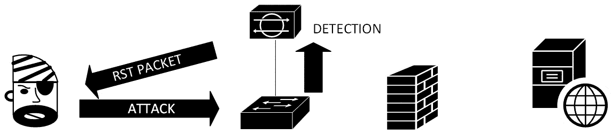

图 13.1 - IPS 位于防火墙外，使用 SPAN 端口采集流量，并发送 RESET 报文阻断检测到的攻击

这种配置随着攻击变得更容易理解和互联网变得更有敌意而演变。 监视互联网上的恶意流量变得低效得多，因为监视外部流量很可能只会产生持续的警报，因为攻击者开始将恶意软件及其相关攻击货币化。

您仍然希望监视入站攻击，但是在可能的情况下，您只希望监视可以应用于任何给定主机的攻击。 例如，如果您的防火墙只允许邮件流量入站到邮件服务器，查找并警告针对该主机的基于 web 的攻击就不再有意义了。 有了针对入站攻击的方法，我们现在可以看到 IDS 和 IPS 系统更频繁地部署在防火墙后面。

在同一时期，我们开始看到恶意软件在电子邮件中传播得越来越多——尤其是在办公文档中的宏。 有效地保护组织免受这些攻击是很困难的，特别是许多组织已经围绕宏构建了工作流并拒绝禁用它们。 这意味着，从受影响的工作站和服务器查找出站流量变得非常有效，这将表明攻击成功。 通常情况下，这种流量以**命令与控制**(**C2**)的形式出现，在这种情况下，被攻击的工作站会向攻击者发出指令，告诉攻击者下一步该做什么:


图 13.2 -防火墙内的 IPS 检测 C2 流量。 此外，一些网络“噪音”也会被过滤掉

加密的兴起意味着让 IPS 处于半被动模式的效率越来越低。 为了有效地检测攻击流量，在今天的互联网中，至少有一部分需要解密。 这意味着 IPS 必须排成一行，通常运行在防火墙本身上。 这种架构上的变化伴随着更便宜的处理器，允许人们为防火墙分配更多的 CPU(通常与磁盘和内存匹配)。

对于入站流量，这意味着 IPS 现在承载一个与目标服务器匹配的证书。 它在 IPS 上解密，检查可疑内容，然后在得到批准后转发(通常是重新加密)。 这看起来应该很熟悉，因为当我们在第 10 章[](10.html#_idTextAnchor170)*、*Linux 负载均衡器服务*中讨论负载均衡器时，我们讨论了一个非常类似的架构:*

 *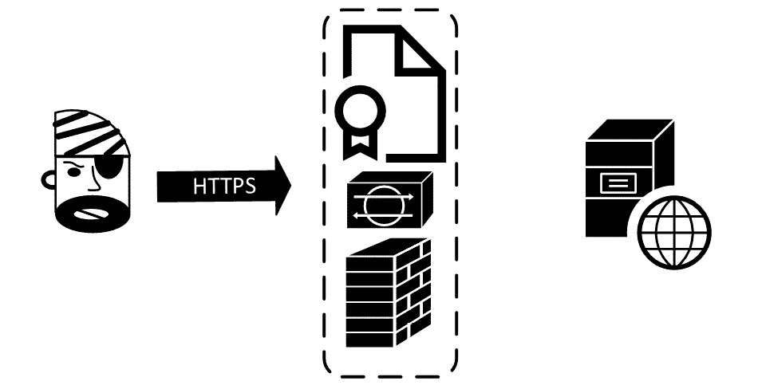

图 13.3 -外围防火墙上的 IPS web 服务器证书允许入站 HTTPS 解密

出站解密有点复杂。 为此，IPS 需要在其上托管一个**证书颁发机构**(**CA**)，内部工作站必须信任该机构。 当出站流量传输时，IPS 动态地为目的地创建一个证书，如果用户在浏览器中查看 HTTPS 证书，就会看到这个证书。

这允许 IPS 解密出方向的流量。 然后，从 IPS 出站到目的主机的流量将正常进行，使用目标主机上的真实证书进行新的加密会话。

当检测到攻击时，任何产生的警报都将包含客户机工作站的 IP 地址。 在 Windows/Active Directory 环境中，IPS 通常会有一个匹配的“代理”来监视每个域控制器的安全日志。 这就允许 IPS 在任何给定时间将 IP 地址与该站点上正在使用的用户帐户名匹配起来。

如果 IPS 和防火墙共享一个共同的平台,这也允许防火墙添加规则基于用户帐户,团体、证书信息(包括域名通常目的主机的 FQDN),除了传统的规则基于源和目标 IP 地址、端口,等等:


图 13.4 -外围防火墙上的 IPS CA 证书允许对出站客户端流量进行解密

一个特殊的 IPS 案例同时增长，称为**Web 应用防火墙**(**WAFs**)。 这些设备主要关注于基于 web 的入站攻击。 由于互联网已经几乎完全转向 HTTPS 内容的网站目的地，这些 WAF 解决方案也需要解密来检测大多数攻击。

一开始，这些 WAF 解决方案采取专用设备的形式，但后来已经成为大多数负载平衡器上可用的特性。 最流行的开源 WAF 解决方案包括 ModSecurity(适用于 Apache 和 Nginx)，但还有很多其他的解决方案:


图 13.5 -防火墙内负载均衡器上的入站 IPS (WAF)和解密

WAF 解决方案的主要问题和我们看到的传统 IPS 的问题是一样的-覆盖要么太激进，要么太松散。 一方面，有一些 WAF 解决方案不需要很多配置——这些解决方案倾向于防止特定的攻击，如跨站点脚本或 SQL 注入，其中语法通常是可预测的，但不能防止其他常见的攻击。 另一方面，我们有需要为应用中的各个字段配置的产品，应用前端有完整的输入验证。 这些产品工作得很好，但在实现更改和新特性时需要与应用相匹配。 如果不这样做，应用可能会被用来保护它的工具破坏。

较新的 WAF 选项考虑到这样一个事实:基于云的大型网站通常不使用负载平衡器设备或防火墙。 在某些情况下，它们通过**内容交付网络**(**CDN**)交付内容，但即使它们直接来自较大的云服务提供商，它们也可能在互联网上进行操作。 此外，对于上行链路为 10gbps、40gbps 或 100gbps 的大型站点，WAF 设备解决方案根本无法很好地扩展。

对于这些站点，防火墙被推送到主机本身(正如我们在[*第 4 章*](04.html#_idTextAnchor071)，*the Linux firewall*中讨论的)，WAF 也移动到主机。 在这里，每个主机或容器本身都成为一个工作单元，而扩展站点的容量只需要添加另一个工作单元。

对于这些情况，我们的 WAF 已经转变为一个**运行时应用自我保护**(**RASP**)解决方案。 顾名思义，RASP 软件不仅与应用位于相同的平台上，而且与应用的联系更加紧密。 RASP 代码出现在站点的每个页面上，通常是作为一个简单的标记来加载每个页面的 RASP 组件。 这不仅可以防止已知的攻击，而且在许多情况下，它可以防止“不寻常的”输入和流量，甚至站点或站点代码从被修改:


图 13.6 -承载本地防火墙和 RASP IPS 解决方案的云 web 服务

这些 RASP 解决方案已经被证明是如此有效，以至于在许多公司网站上它们正在取代传统的 WAF 产品。 在这些情况下，防火墙通常是在周边而不是在主机上:


图 13.7 -企业环境中外围防火墙的 RASP

RASP 解决方案包括免费/开源的 OpenRASP，商业方面的产品如 Signal Sciences 或 Imperva。

现在您已经对各种 IPS 系统有了一些背景知识，让我们花一点时间从攻击者或渗透测试者的角度来看看这些系统。

# IPS 规避技术

入站规避利用了 IPS(基于 linux)解释恶意信息包和数据流的方式与目标解释这些信息包的方式之间的差异。 传统的 IPS 系统和 WAF 系统都是如此。

## WAF 检测

对于一个 WAF，可以方便地让攻击者知道一个 WAF 正在发挥作用，以及它基于什么。 Wafw00f 是一个很好的起点。 Wafw00f 是一个免费的扫描仪，可以检测超过 150 个不同的 WAF 系统，其中许多也是负载平衡器。 它是用 Python 编写的，托管在[https://github.com/EnableSecurity/wafw00f](https://github.com/EnableSecurity/wafw00f)，但也打包在 Kali Linux 中。

通过测试一些站点，我们可以看到不同的 WAF 解决方案被托管提供商托管:

```sh
└─$ wafw00f isc.sans.edu
[*] Checking https://isc.sans.edu
[+] The site https://isc.sans.edu is behind Cloudfront (Amazon) WAF.
[~] Number of requests: 2
└─$ wafw00f www.coherentsecurity.com
[*] Checking https://www.coherentsecurity.com
[+] The site https://www.coherentsecurity.com is behind Fastly (Fastly CDN) WAF.
[~] Number of requests: 2
```

对于第三个站点，我们可以看到一个商业 WAF(也是基于云的):

```sh
└─$ wafw00f www.sans.org
 [*] Checking https://www.sans.org
[+] The site https://www.sans.org is behind Incapsula (Imperva Inc.) WAF.
[~] Number of requests: 2
```

正如我们所指出的，如果你知道 WAF 是什么，那么你就有更好的机会避开 WAF。 当然，如果您是一个攻击者或渗透测试者，您仍然必须破坏 WAF 背后的网站，但这完全是另一回事。

由于入站目标通常是 web 服务器，也通常是 Windows 主机，对这种流量的逃避通常利用处理碎片包的好处。

## 碎片化等 IPS 逃避方法

人为地分片数据包，然后无序地发送它们，在某些情况下，发送包含不同信息的重复片段号是逃避或检测 IPS 的一种常用方法。

这利用了 IPS 操作系统(通常是 Linux 变体)处理片段的方式与操作系统背后的主机(可能是完全不同的操作系统)之间的差异。

如果 IPS 根本不重组碎片，即使是将`maliciousdomain.com`分解为`malic`和`iousdomain.com`这样简单的事情也能产生完全不同的效果。 不过，更常见的情况是，你会看到类似以下的数据包片段序列:


攻击者的目标是管理重复的片段如何重组。 如果 Linux 将其重新组装为`MalicASDFdomain.com`，Windows 将其重新组装为`mailicousdomain.com`，那么攻击者就有办法通过基于 Linux 的 IPS 从一个恶意域渗透或渗透到一个恶意域。 大多数现代 ips 会以几种不同的方式重新组装片段，或者识别目标主机的操作系统，然后基于这些重新组装。

这是一个较老的攻击，由*挖歌*在他的`fragroute`工具在 21 世纪早期首创。 虽然这个工具将不再在正确配置的现代 IPS 上工作，但一些供应商在其商业产品中没有默认启用的适当的片段重组设置。 所以，虽然它不应该工作，它总是一个方便的东西渗透测试人员尝试，因为有时，你会幸运地得到 IPS 旁路。

出站回避通常利用在安装和配置 IPS 时所做的决定; 举几个例子:

*   IPS 系统可能会绕过任何看起来像 Windows 更新的东西——这允许攻击者使用 BITS 协议绕过 IPS 来传输文件。
*   有时候，流媒体服务会因为性能原因而被忽略。 例如，该设置允许攻击者将 C2 信息嵌入到特定 YouTube 视频的评论中。
*   如果没有解密，攻击者可以简单地使用 HTTPS 并直接通过，只要他们的外部主机没有被 IP 或 DNS 名称标记为可疑。
*   即使进行了解密，如果攻击者使用了有效的固定证书，解密将失败，这通常意味着 IPS 将退回到“允许”响应，而不是“删除”响应。
*   总会有一些协议不能被解密和重新签名机制很好地处理; 这些通常也是选择。
*   我们看到攻击者也在使用“滚出你自己的”加密。
*   使用 DNS 隧道数据进出也是一个历史悠久的选项。 您可以简单地在端口`53/udp`上传输数据，您会惊讶地发现，即使是，这种方式也经常有效，尽管这些数据包本身看起来一点也不像 DNS 数据包。 然而,即使 IPS 检查 DNS 数据包,以确保有效性,隧道惊人数量的数据可以使用有效 DNS 查询——`TXT`查询尤其是对入站传输(`TXT`的数据响应)或为出站`A`查询查询(查询 DNS 主机名的数据)。
*   或者，最常见的是，攻击者将简单地使用**C 和 C 框架**来设置他们的通道。 这方面有几种选择，商业工具、盗版工具或开源工具受欢迎与否取决于它们在任何给定时间的有效性。

长话短说，如果您的 IPS 不理解特定的数据流，您可以考虑设置它来阻止该流量。 此方法将阻塞一些生产流量，但您将发现这是一个需要权衡您正在保护的社区的需求与 IPS 的有效性之间的持续钢丝绳。

在介绍了攻击者的观点之后(至少在较高的层次上)，让我们看看一些实际的应用—从基于网络的 IDS/IPS 系统开始。

# 经典/基于网络的 IPS 解决方案- Snort 和 Suricata

正如我们前面讨论的，传统的 IPS 故事始于 20 世纪 90 年代*Martin Roesch*编写 Snort 时。 在创建 Sourcefire 时，Snort 就变成了一种商业产品，但即使在今天，在 Cisco 收购 Sourcefire 之后，Snort 仍然有一个可以安装在任何 Linux 平台上的开放源代码版本。

由于 Snort 非常流行，它被广泛地直接用于 Sourcefire 产品中，也被许多(许多)下一代防火墙(**NGFW**)产品中授权使用。 思科被收购后，最后一种情况发生了改变; 没有哪个商业防火墙愿意在自己的平台上使用来自竞争对手的 IPS。

撇开市场营销不谈，“传统”版本的 Snort (2.x)有几个缺点:

*   它完全是基于文本的，没有 GUI。 但是，有几个 web 前端项目可以用于 Snort。
*   这些消息通常是神秘的—通常，您需要成为安全专家才能完全理解 Snort 消息。
*   这是单线程的。 这产生了巨大的影响，因为网络带宽上行链路从数百 Mbps 到 Gbps，然后是 10、40 和 100 Gbps。 不管 CPU、内存和磁盘的组合是什么，Snort 都无法满足这些容量。

但是，Snort 方法，特别是 Snort 签名规则集非常有用，几乎所有 IPS 解决方案都可以使用 Snort 签名。

这些因素的结合促使行业转向替代能源。 在许多情况下，这是 Suricata，一种 2009 年发布的 IPS，从那时起一直在改进。 Suricata 很有吸引力，因为从一开始它就是多线程的，所以更多的 CPU 内核实际上变成了更可用的 CPU。 这使得它比 Snort 更具可伸缩性。 Suricata 直接使用 Snort 规则，不做任何修改，因此多年来创建签名和操作签名的行业专业知识的工作仍然有效。

Suricata 插件和许多其他安全产品的集成，包括 Splunk、Logstash 和 Kibana/Elasticsearch。 Suricata 可以直接集成到许多流行的防火墙中，如 pfSense 或 Untangle。

最后，许多发行版将 Suricata 与底层的 Linux 操作系统、合理的 web 界面和作为后端的数据库捆绑在一起——如果您的硬件和网络已经准备好，那么您可以安装 Suricata 并在几个小时内拥有一个可行的系统。

Snort 团队已经发布了 IPS 的 3.0 版本(2021 年 1 月); 然而，它仍然没有 GUI(除非你购买了商业版本作为思科火力安装的一部分)。 Snort 仍然是一种优秀的产品，是行业最受欢迎的产品，但他们现在必须要赶上 Suricata 解决方案。

足够的背景和理论-让我们构建和使用一个实际的 IPS!

# Suricata IPS 实例

在这个示例中，我们将使用 Stamus Networks([https://www.stamus-networks.com/selks](https://www.stamus-networks.com/selks))的 SELKS。 **SELKS**的名称反映了它的主要组成部分:**Suricata、Elasticsearch、Logstash、Kibana 和 Stamus**Scirius 社区版。 它是打包在 Debian Linux 上的，所以如果你一直在阅读这本书，你应该会觉得很熟悉，因为 Ubuntu 根植于 Debian 的“父”发行版。

SELKS 有一个**活**选项和一个**安装**选项。 **活动**选项在 ISO 映像上运行整个解决方案。 这对于小型实验室或快速评估工具来说很方便，你可以在本章中选择这种方法。 但是，在生产环境中，您需要使用安装在实际磁盘上的映像(最好是 SSD 或其他快速存储选项)。

SELKS 的安装指南如下:[https://github.com/StamusNetworks/SELKS/wiki/First-time-setup](https://github.com/StamusNetworks/SELKS/wiki/First-time-setup)。 由于这种情况的变化非常频繁，所以在本章中我们不会进行实际安装(如果我们进行了安装，它将在几个月内就会过时)。

拥有两个网卡是大多数 IPS 解决方案的需求。 第一个 NIC 用于实际的 IPS 功能，它需要混杂模式并将进行数据包捕获—当您完成时，此适配器不应该有 IP。 另一个网卡用于管理平台——通常解决方案的 web UI 在该网卡上。

在运行 Suricata 时，确保它可以通过 SPAN 端口、tap 或启用了`promiscuous mode`的管理程序 vSwitch 来捕获数据包。

在开始使用系统之前，最好定义定义环境的各种主机和子网。 这些信息都在`/etc/suricata/suricata.yaml`中。

下面的是要设置的关键变量:

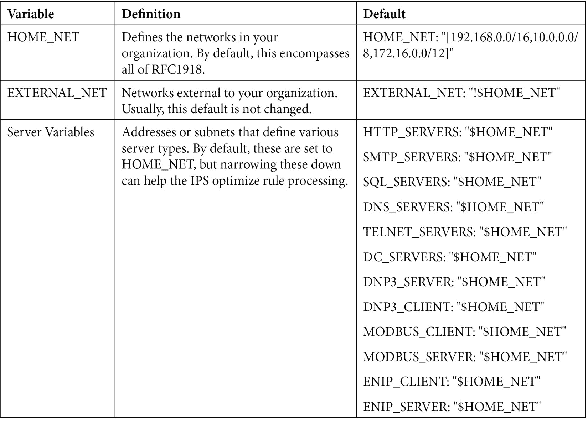

在许多环境中，这些默认值可以保持不变，但如前所述，定义各种服务器变量有助于优化规则处理。 例如，如果您可以缩小范围，使 HTTP 检查不在域控制器或 SQL 服务器上执行，这可以帮助降低不需要的处理检查的 CPU 需求。

在 SCADA 系统中使用的 MODBUS 协议，通常在制造业或公共事业中使用，通常也是非常严格定义的东西。 通常，这些服务器和客户机被隔离到它们自己的子网中。

此外，定义组织内部的各种 DNS 服务器也会有所帮助。

在这个文件中还有许多其他选项可以管理 Suricata 及其相关产品的操作方式，但是为了演示 IPS(甚至在许多生产环境中)，您不需要修改它们。 不过，我确实邀请你看看这个文件; 它的注释很好，所以您可以看到每个变量的作用。

经过一段时间的正常活动-可能在几分钟内-你将开始看到活动在 EveBox, web 界面的 SELKS 警报:

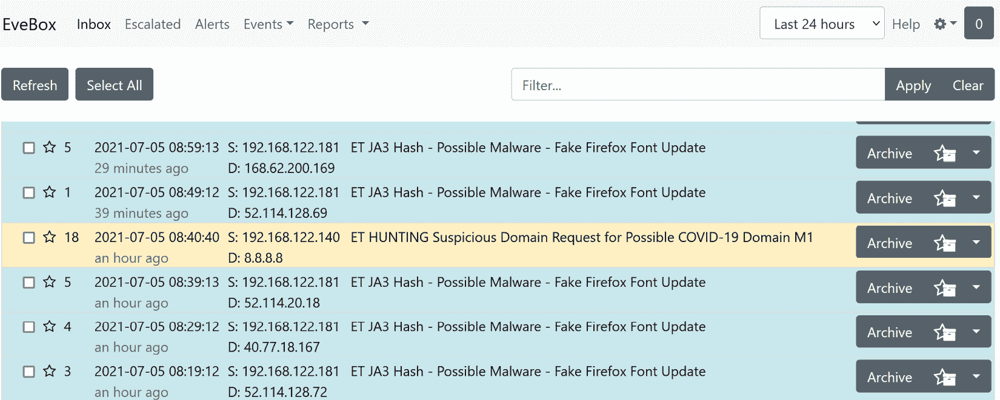

图 13.8 - Suricata 的基本警报(EveBox 事件仪表板)

让我们看看中的一个**虚假的 Firefox 字体更新**提醒:


图 13.9 -规则详细信息(1)-基本信息和 geo-IP 信息

在此显示中特别感兴趣的是源 IP 和目标 IP——如果这是出站流量，则它可能指示受感染的主机。 然而，在我们的例子中更重要的是**签名 ID**(通常缩写为**SID**)，它唯一地标识该攻击签名。 我们很快就会回到这个值。

下面是远程地址的 geo-IP 信息。 这并不总是 100%准确的，但如果您所在的企业(公司或国家)的间谍活动受到关注，这个位置信息可能很重要。 如果 IP 是本地的，您可能正在为执法收集证据，特别是当您怀疑攻击来自“内部人士”时。

向下滚动一点; 由于此攻击是通过 HTTPS 进行的，我们将看到涉及的 TLS 信息:


图 13.10 -规则详细信息(2)- TLS 和指纹信息和负载显示

在这里,我们可以看到**SNI 的主机证书`self.events.data.microsoft.com`的价值,并且有效的微软 Azure CA 颁发的证书。这些事情告诉我们,虽然攻击结合使用假字体更新是一个真正的问题,这个签名是触发与假阳性,一遍又一遍。**

 **出于兴趣，再往下看一节，我们将看到**有效载荷**节。 这在左边显示数据包中的字符串值，在右边显示数据包的十六进制表示。 有趣的是 PCAP 的**按钮，让我们点击它:**

 **

图 13.11 -从事件显示调用的数据包捕获

如预期的那样，点击**PCAP**按钮会显示触发警报的实际包。 这里，我们扩展了有效负载的 TLS 部分——特别是`server_name/SNI`部分。

回到警告页面，进一步向下滚动，我们将看到规则的 JSON 表示。 回到规则名称，还记得它是如何引用单词`JA3`的吗? `JA`签名是加密流量的初始握手报文中交换的各种值的散列。 使用`JA`值，我们可以标识源和目标应用，通常还可以标识服务器名称(在本例中，使用**SNI**值)。 这种方法为我们提供了一种很好的方式来查看加密的流量，而无需解密它，通常是，以至于我们可以从攻击或 C2 流量中区分正常流量。 `JA3`签名的概念是由 Salesforce 的*John Althouse*、*Jeff Atkinson*和*Josh Atkins*(因此命名为 JA3)提出的。 关于这种方法的更多信息可以在本章的末尾找到。 HASSH 框架对 SSH 流量执行类似的功能。

查看 JSON 规则显示中的`JA3`部分，我们可以看到触发 IPS 警报的网络事件的详细信息:

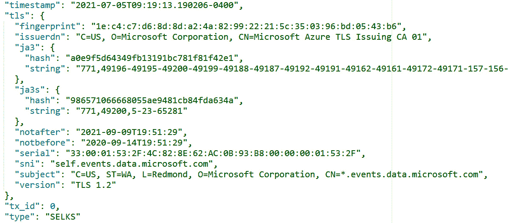

图 13.12 - JSON 触发 IPS 警报的网络事件的详细信息

请注意，这个 JSON 显示混合了“我们正在寻找的内容”和“我们看到的内容”。 您必须查看规则本身，以了解是什么触发了规则(尽管在本例中是 JA3 散列)。

现在我们已经对这个警报进行了研究，并认为它是假阳性，我们有两种可能的行动方案:

*   我们可以禁用这个警报。 很有可能，您会发现自己经常使用一个新的 IPS 进行此操作，直到事情升级
*   您可以编辑警报，也许可以按预期触发它，但不能针对以`Microsoft.com`结尾的 SNIs。 注意，我们说*以*结尾，而不是*包含*。 攻击者通常会寻找定义错误——例如，`foo.microsoft.com.maliciousdomain.com`SNI 将被定义为`contains microsofot.com`，而实际的`self.events.data.microsoft.com`只被定义为*以*结尾。 如果你还记得我们的正则表达式讨论[*第 11 章【t16.1】*](11.html#_idTextAnchor192),*数据包捕获和分析在 Linux 中*、`Microsoft.com`结尾样子`*.microsoft.com$`(一个或多个字符,紧随其后的是`Microsoft.com`,立即跟着结束的字符串)。

在本例中，我们将禁用警报。 在命令行中编辑`/etc/suricata/disable.conf`文件，并将 SID 添加到该文件中。 评论是惯例，这样你就可以追踪到为什么不同的签名被删除了，什么时候删除的，谁删除的:

```sh
$ cat /etc/suricata/disable.conf
2028371    # firefox font attack false positive - disabled 7/5/2021 robv
```

要添加正在被忽略的规则，只需将 SID 添加到`/etc/suricata/enable.conf`文件中。

最后，再次执行`suricata_update`命令，更新 IPS 的运行配置。 你会看到`disable.conf`文件已经被处理了:

```sh
$ sudo  suricata-update | grep disa
5/7/2021 -- 09:38:47 - <Info> -- Loading /etc/suricata/disable.conf
```

第二种编辑 SID 的方法(不触发特定 SNI)可能更有意义，但不能直接编辑 SID; 下一次更新将简单地击败你的更新。 要编辑 SID，请复制它，使它是“自定义”或“本地”范围内的 SID，然后编辑它。 将新的 SID 添加到`enable.conf`文件中。

回到我们的主 EveBox 显示，打开任何事件并进行探索。 你可以点击任何链接的值来获得更多的信息。 例如，如果你怀疑一个内部主机已经被入侵，你可以在任何显示中点击该主机的 IP，并获得关于所有进出该主机的流量的详细信息:

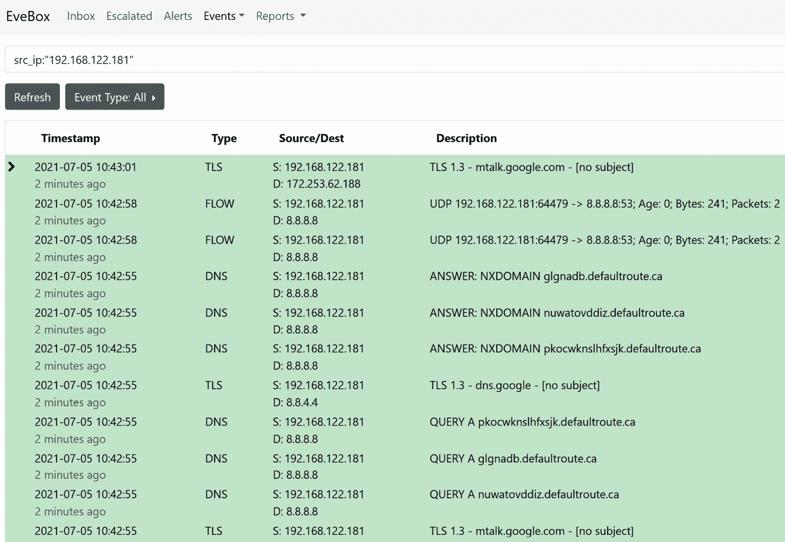

图 13.13 - EveBox 显示由一个目标主机触发的所有事件

请注意顶部的搜索字段——当您对界面更加熟悉时，您可以手动输入这些字段。 在本例中，我们可以看到一堆“毫无意义”的 DNS 请求(显示的第 4、5 和 6 行，以及第 8、9 和 10 行)。 这样的无意义查询经常出现在使用**快速流量 DNS**的攻击中，其中 C2 服务器 DNS 名称在一天中会更改几次。 通常，客户端根据日期和时间计算 DNS 名称或定期检索它们。 不幸的是，我们在广告世界的朋友和我们的恶意软件朋友使用同样的技术，所以这不是像过去那样明确。

更改显示(单击用户 ID 旁边的右上方图标)可以导航到**Hunting**显示。

在此显示中，您将看到相同的警报，但只是汇总而不是按时间戳顺序列出。 这使您可以查找频率最高的警报或异常值—可能指示更多不寻常情况的频率最低的警报。

让我们再看一次 Firefox 字体提醒——打开那一行查看更多细节。 特别是，你会看到一个时间轴显示:


图 13.14 -狩猎显示，主仪表板

注意，这给出了被触发的实际规则:

```sh
alert tls $HOME_NET any -> $EXTERNAL_NET any (msg:"ET JA3 Hash - Possible Malware - Fake Firefox Font Update"; ja3_hash; content:"a0e9f5d64349fb13191bc781f81f42e1"; metadata: former_category JA3; reference:url,github.com/trisulnsm/trisul-scripts/blob/master/lua/frontend_scripts/reassembly/ja3/prints/ja3fingerprint.json; reference:url,www.malware-traffic-analysis.net; classtype:unknown; sid:2028371; rev:2; metadata:created_at 2019_09_10, updated_at 2019_10_29;)
```

本质上，这是“匹配这个 JA3 散列的出站流量”。 在[https://ja3er.com](https://ja3er.com)上查找这个哈希值，我们会发现这是一个基本的 Windows 10 TLS 协商，从以下用户代理报告:

*   Excel/16.0(计数:375，最后看到:2021-02-26 07:26:44)
*   WebexTeams(数:38，最后出现:21-06-30 16:17:14)
*   Mozilla/5.0 (Windows NT 6.1; WOW64; Gecko/20100101 Firefox/40.1(数:31，最后看到:2020-06-04 09:58:02)

这强化了这样一个事实:这个签名的价值是有限的; 有人建议我们干脆禁用它。 正如我们前面所讨论的，您可能决定将其编辑为不同的规则，但在这个特定的情况下，您将永远在玩打地鼠游戏，试图获得 SNI 字符串或 CAs 的正确组合，以获得刚好正确的规则。

另一个值得探索的显示是**管理**显示:


图 13.15 -管理视图，所有警报

它以另一种格式显示相同的数据。 点击相同的 Firefox 字体警告(2028371)，我们得到一个更全面的活动背后的警告:

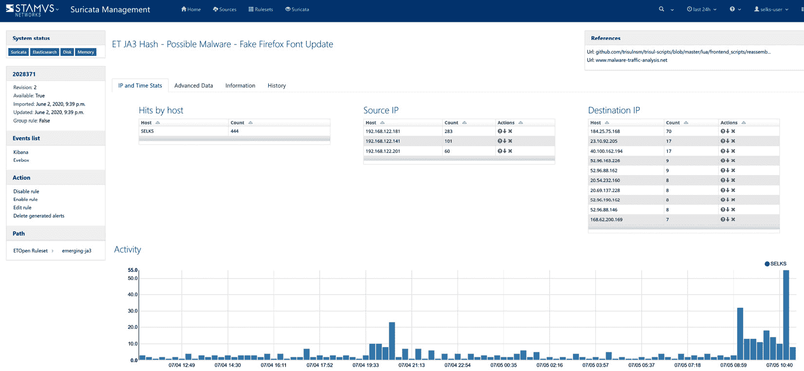

图 13.16 -火狐字体警告示例的管理视图

注意，在左列中，我们现在可以看到对**禁用规则**和**启用规则**的选择。 由于 IPS 接口主要在 UI 中，这更可能是您的主要规则管理方法，至少在禁用和启用规则方面是这样的:

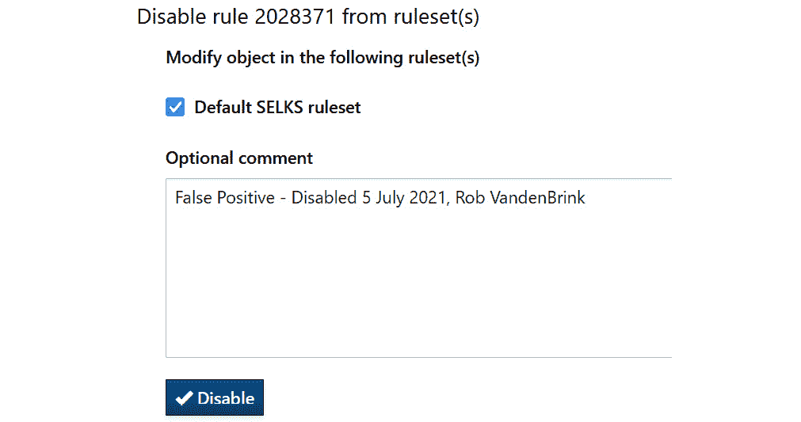

图 13.17 -在 web UI 中禁用 Suricata 规则

正如前面提到的，IPS 功能是您的里程可能有所不同的一个领域。 如果你部署在家庭网络上，不同的门铃、恒温器或游戏平台将极大地影响你的流量组合以及 IPS 将发现的结果。 这在企业环境中更引人注目。

最好的建议是学习基础知识(我们在这里已经介绍了其中一些)，并研究您的 IPS 告诉您的关于您的网络所发生的情况的信息。 您将发现需要删除或修改的签名、希望保留但在显示中禁止的消息，以及各种优先级的真实安全警报。

在这个平台上，你还会看到 Suricata 的严重程度可能与你的不一样。 我们探索的规则就是一个很好的例子——Suricata 将其标记为高优先级，但经过一些调查后，我们将其归类为假阳性并禁用了它。

我们提到过几次规则。 因此，让我们更深入地了解如何构建规则，然后从零开始构建我们自己的规则。

# 构建 IPS 规则

我们已经多次提到了 IPS 签名，特别是 Snort 规则—让我们看看它们是如何构建的。 让我们看一个示例规则，它提醒我们一个可疑的 DNS 请求包含文本`.cloud`:

```sh
alert dns $HOME_NET any -> any (msg:"ET INFO Observed DNS Query to .cloud TLD"; dns.query; content:".cloud"; nocase; endswith; reference:url,www.spamhaus.org/statistics/tlds/; classtype:bad-unknown; sid:2027865; rev:4; metadata:affected_product Any, attack_target Client_Endpoint, created_at 2019_08_13, deployment Perimeter, former_category INFO, signature_severity Major, updated_at 2020_09_17;)
```

这条规则被分成几个部分。 从规则的开头开始，我们有我们的规则标题**:**

 **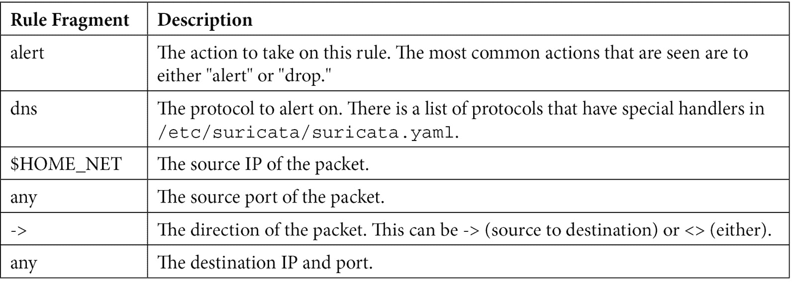

没有显示**Flow**section - Suricata 通常只检测 TCP 数据流。

接下来是规则的**消息**部分:


**Detection**部分概述了规则正在查找的内容以及将触发警报的流量:

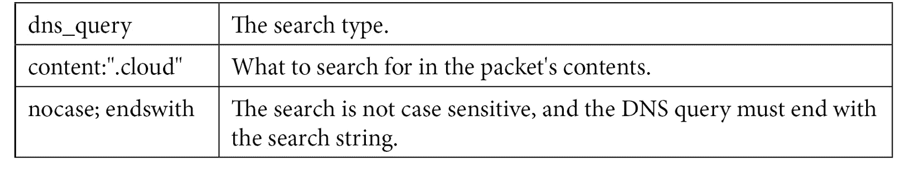

**参考文献**部分通常包含 url、CVE 编号或厂商安全公告:


**签名 ID**部分包含 SID 值和修订号:


**元数据**部分包括以下内容:


其中许多是可选的，在某些情况下，节的顺序可以更改。 要了解 Suricata 规则格式的完整解释，产品文档是一个很好的起点:[https://suricata.readthedocs.io/en/suricata-6.0.3/rules/intro.html](https://suricata.readthedocs.io/en/suricata-6.0.3/rules/intro.html)。

由于 Suricata 规则本质上与 Snort 规则相同，您可能会发现 Snort 文档也很有用。

如果您正在为您的组织添加自定义规则，本地规则的 SID 范围是`1000000`-`1999999`。

按照惯例，本地规则通常放在名为`local.rules`的文件中，或者至少放在具有反映这种自定义状态的名称的规则文件中。 同样，规则消息通常以单词`LOCAL`、您的组织名称或其他一些指示符开头，这些指示符明显表明这是一个内部开发的规则。 填充规则元数据也被认为是一个很好的实践——添加规则的作者、日期和版本号会非常有用。

例如，让我们创建一组规则来检测 telnet 流量——包括入站和出站。 您可能已经添加了此规则，以处理组织中坚持部署启用 telnet 的敏感系统的管理员队列。 使用 telnet 登录，然后运行或管理应用，这是一种危险的方法，因为所有凭据和所有应用数据都以明文在网络上传输。

让我们把它分成两个规则:

```sh
alert tcp any -> $HOME_NET [23,2323,3323,4323] (msg:"LOCAL TELNET SUSPICIOUS CLEAR TEXT PROTOCOL"; flow:to_server; classtype:suspicious-login; sid:1000100; rev:1;)
alert tcp $HOME_NET any -> any [23,2323,3323,4323] (msg:"LOCAL TELNET SUSPICIOUS CLEAR TEXT PROTOCOL"; flow:to_server; classtype:suspicious-login; sid:1000101; rev:1;)
```

请注意，协议是 TCP，目标端口包括`23/tcp`，以及许多其他常见端口，人们可能将 telnet 放入其中以“隐藏”它。

这些规则的文本被放入`/etc/suricata/rules/local.rules`(或者您想存储本地规则的任何地方)。

更新`/etc/suricata/suricata.yaml`以反映这一点:

```sh
default-rule-path: /var/lib/suricata/rules
rule-files:
  - suricata.rules
  - local.rules
```

现在，要重新编译规则列表，运行`sudo selks-update`。 您可能还需要运行`sudo suricata-update –local /etc/suricata/rules/local.rules`。

一旦你更新了这个，你可以通过列出最终的规则集，过滤你的 sid 来验证你的规则是否到位:

```sh
$ cat /var/lib/suricata/rules/suricata.rules | grep 100010
alert tcp any -> $HOME_NET [23,2323,3323,4323] (msg:"LOCAL TELNET SUSPICIOUS CLEAR TEXT PROTOCOL"; flow:to_server; classtype:suspicious-login; sid:1000100; rev:1;)
alert tcp $HOME_NET any -> any [23,2323,3323,4323] (msg:"LOCAL TELNET SUSPICIOUS CLEAR TEXT PROTOCOL"; flow:to_server; classtype:suspicious-login; sid:1000101; rev:1;)
```

现在，要重载规则集，执行以下操作之一:

*   通过执行`sudo kill -USR2 $(pidof suricata)`重新加载 Suricata。 不建议这样做，因为它会重新加载整个应用。
*   用`suricatasc -c reload-rules`重新加载规则。 这是一个阻塞重载; Suricata 在重新加载期间仍处于离线状态。 如果您的 IPS 与流量一致，则不建议这样做。
*   用`suricatasc -c ruleset-reload-nonblocking`重新加载规则。 这将在不阻塞流量的情况下重新加载规则集，这对内联部署是“友好的”。

当警报被触发时，它看起来是什么样子的? 在 EveBox 中，该规则的警告如下所示:


图 13.18 -触发自定义 IPS 规则生成的警报

在这里，我们可以看到其中一个警报是从内部主机发送到内部主机，而另一个警报是向 internet 发送的。 第一个规则被触发了两次——回顾一下规则定义; 你知道为什么吗? 这表明，触发任何自定义规则并对其进行优化是很有意义的，以便每个条件只触发一次警告或阻塞，并且它们会触发您所能想到的所有条件和变化。

让我们展开第一个(注意 SID):


图 13.19 -警报的事件详细信息

现在，让我们展开第二个——注意这是同一个事件，但它用不同的 SID 触发了第二次:


图 13.20 -警报的事件细节 2

然后，展开最后一个(同样要注意 SID):


图 13.21 -警报的事件详细信息 3

注意，我们对这两个都有完整的包捕获—要非常小心，因为如果您浏览那些 PCAP 文件，您将看到有效的凭据。

现在我们已经了解了网络 IPS 是如何工作的，让我们看看在数据包通过网络时被动地监视它们可以发现什么。

# 被动交通监控

将加入 IPS 解决方案的另一种方法是使用**被动式漏洞扫描器**(**PVS**)。 与查找攻击流量不同，PVS 解决方案收集数据包并查找流量或握手数据(例如 JA3、SSH 指纹或它可以以明文收集的任何东西)，这些数据可能有助于识别正在运行的操作系统或应用。 您可以使用此方法来识别使用其他方法时可能不会出现的问题应用，甚至是使用其他清单方法时遗漏的主机。

例如，PVS 解决方案可能识别过时的浏览器或 SSH 客户机。 Windows 上的 SSH 客户端经常过时，因为许多更流行的客户端(如 PuTTY)没有自动更新功能。

PVS 解决方案也是查找可能没有编目的主机的好工具。 如果它连接到互联网或甚至其他内部主机，PVS 工具可以从“散乱的”数据包中收集数量惊人的数据。

P0F 是一种比较常见的开源 PVS 解决方案。 在商业上，Teneble 的 PVS 服务器通常被部署。

## 无源监控与 P0F -举例

要运行 P0f，请将将要使用的以太网接口放入`promiscuous mode`中。 这意味着接口将读取和处理所有数据包，而不仅仅是发送到我们正在工作的主机的数据包。 这是依赖包捕获的大多数实用程序自动设置的一种常见模式，但是 P0F 仍然是“老派”，需要手动设置它。 然后，运行该工具:

```sh
$ sudo ifconfig eth0 promisc
$ sudo p0f –i eth0
.-[ 192.168.122.121/63049 -> 52.96.88.162/443 (syn) ]-
|
| client   = 192.168.122.121/63049
| os       = Mac OS X
| dist     = 0
| params   = generic fuzzy
| raw_sig  = 4:64+0:0:1250:65535,6:mss,nop,ws,nop,nop,ts,sok,eol+1:df:0
|
`----
.-[ 192.168.122.160/34308 -> 54.163.193.110/443 (syn) ]-
|
| client   = 192.168.122.160/34308
| os       = Linux 3.1-3.10
| dist     = 1
| params   = none
| raw_sig  = 4:63+1:0:1250:mss*10,4:mss,sok,ts,nop,ws:df,id+:0
|
`----
```

更有用的是，您可以将`p0f`输出重定向到一个文件，然后处理该文件的内容。 注意我们需要根权限来抓取数据包:

```sh
$ sudo p0f -i eth0 -o pvsout.txt
```

接下来，我们可以收集在不同主机上收集的数据，使用`grep`过滤那些`p0f`能够识别操作系统的数据。 注意，因为我们将`pvsout.txt`创建为 root 用户，所以我们也需要 root 权限来读取该文件:

```sh
$ sudo cat pvsout.txt | grep os= | grep -v ???
[2021/07/06 12:00:30] mod=syn|cli=192.168.122.179/43590|srv=34.202.50.154/443|subj=cli|os=Linux 3.1-3.10|dist=0|params=none|raw_sig=4:64+0:0:1250:mss*10,6:mss,sok,ts,nop,ws:df,id+:0
[2021/07/06 12:00:39] mod=syn|cli=192.168.122.140/58178|srv=23.76.198.83/443|subj=cli |os=Mac OS X|dist=0|params=generic fuzzy|raw_sig=4:64+0:0:1250:65535,6:mss,nop,ws,nop,nop,ts,sok,eol+1:df:0
[2021/07/06 12:00:47] mod=syn|cli=192.168.122.179/54213|srv=3.229.211.69/443|subj=cli |os=Linux 3.1-3.10|dist=0|params=none|raw_sig=4:64+0:0:1250:mss*10,6:mss,sok,ts,nop,ws:df,id+:0
[2021/07/06 12:01:10] mod=syn|cli=192.168.122.160/41936|srv=34.230.112.184/443|subj=cli|os=Linux 3.1-3.10|dist=1|params=none|raw_sig=4:63+1:0:1250:mss*10,4:mss,sok,ts,nop,ws:df,id+:0
[2021/07/06 12:01:10] mod=syn|cli=192.168.122.181/61880|srv=13.33.160.44/443|subj=cli |os=Windows NT kernel|dist=0|params=generic|raw_sig=4:128+0:0:1460:mss*44,8:mss,nop,ws,nop,nop,sok:df,id+:0
```

我们可以解析此为一个快速的库存清单:

```sh
$ sudo cat pvsout.txt | grep os= | grep -v ??? | sed -e s#/#\|#g | cut -d "|" -f 4,9 | sort | uniq
cli=192.168.122.113|os=Linux 2.2.x-3.x
cli=192.168.122.121|os=Mac OS X
cli=192.168.122.129|os=Linux 2.2.x-3.x
cli=192.168.122.140|os=Mac OS X
cli=192.168.122.149|os=Linux 3.1-3.10
cli=192.168.122.151|os=Mac OS X
cli=192.168.122.160|os=Linux 2.2.x-3.x
cli=192.168.122.160|os=Linux 3.1-3.10
cli=192.168.122.179|os=Linux 3.1-3.10
cli=192.168.122.181|os=Windows 7 or 8
cli=192.168.122.181|os=Windows NT kernel
cli=192.168.122.181|os=Windows NT kernel 5.x
```

注意，我们必须使用`sed`来删除每个主机的源端口，以便`uniq`命令能够工作。 另外，请注意主机`192.168.122.181`注册为三个不同的 Windows 版本——该主机需要一些检查!

更值得关注的是位于`192.168.122.113`、`129`和`160`的主机，它们似乎运行的是较旧的 Linux 内核。 结果是这样的:

*   `192.168.122.160`是一个门铃摄像头——它启用了自动更新功能，所以它是一个较老的内核，但供应商可以让它尽可能的新。
*   `192.168.122.129`是运营商的 PVR/TV 控制器。 这和前面的情况是一样的。
*   `192.168.122.113`是 Ubuntu 20.04.2 主机，所以这是一个误报。 在连接到该主机后，`uname –r`告诉我们它正在运行内核版本 5.8.0.55。

我们现在已经有了基本的 IPS 服务和 PVSes，因此让我们在此基础上进行扩展，并添加一些元数据，以使我们的 IPS 信息更加相关。 我所说的“元数据”是什么意思? 继续读下去，我们将描述这些数据，以及如何使用 Zeek 来收集这些数据。

# Zeek 示例-收集网络元数据

**Zeek**(以前被称为 Bro)并不是一个真正的 IPS，但它是您的 IPS、日志平台以及网络管理的一个很好的附属服务器。 随着本节的深入，您将看到为什么会这样。

首先，有两个安装选项:

*   您可以在现有的 Linux 主机([https://docs.zeek.org/en/master/install.html](https://docs.zeek.org/en/master/install.html))上进行安装。
*   您可以安装 Security Onion 发行版，并在安装过程中选择 Zeek([https://download.securityonion.net](https://download.securityonion.net)，[https://docs.securityonion.net/en/2.3/installation.html](https://docs.securityonion.net/en/2.3/installation.html))。 Security Onion 可能很吸引人，因为它在安装 Zeek 的同时还安装了其他几个组件，这对您来说可能是一个更有用的工具集。

安全洋葱安装，默认情况下，安装 Suricata 和 Zeek，所以在一个较小的环境中，这是很有意义的，而且，它是方便的从这两个应用的信息在同一台主机上。

还记得我们说过 Zeek 是一个“元数据”收集器吗? 一旦我们让“安全洋葱”在网络上运行了几分钟，你就会明白我的意思了。 为了植入一些“有趣的”数据，我启动了一个浏览器并导航到[https://badssl.com](https://badssl.com)。 从那里的，我测试了各种 SSL 错误条件:


图 13.22 -使用 BADSSL.com 测试 SSL 错误检测

《老友记》里出现了什么? 从 Security Onion 主界面选择 Kibana，然后在**Dataset**窗格(屏幕中央)中选择 SSL 协议。 这将深入收集到的数据，并为您提供所有 SSL 流量的摘要。 我真正感兴趣的是右侧窗格中关闭的端口列表(**目的端口**)——特别是那些不是`443`的端口:


图 13.23 -仅显示 SSL 数据

请注意，每个页都可以独立分页，并且原始日志就在这些窗格的下方。

滚动到**目的端口**窗格中的`443`并删除它。 鼠标移到`443`上，你会看到一些选项:


图 13.24 -过滤出端口 443/tcp

您可以单击**+**过滤该值，或者单击**-**从报告中删除该值。 让我们删除它，然后向下滚动到日志窗格。 通过单击**>**图标来展开日志中的任何事件，以获得关于特定会话的多个页面的详细信息:

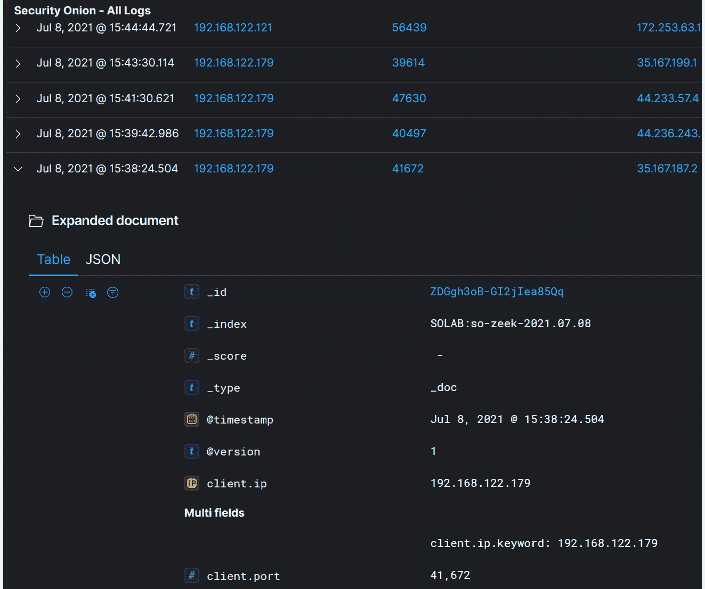

图 13.25 -展开事件以显示完整的元数据

向下滚动，你会看到地理位置数据(一个很好的估计这个 IP 在地球上的确切位置)，以及这个特定会话的 SSL 证书详细信息:


图 13.26 -向下滚动，只显示 SSL/TLS 证书元数据

在屏幕顶部的，单击**仪表板**图标，可以获得数百个预先打包的仪表板设置和查询。 如果你知道你在找什么，你可以开始在**搜索**字段中输入它。 让我们输入`ssl`，看看我们有什么:


图 13.27 - SSL 仪表板

选择**安全洋葱- SSL**; 我们将看到下面的输出:


图 13.28 - Security Onion - SSL 仪表板

注意，在页面中间，我们将看到实际的服务器名称。 它们大多都是从每个交互中涉及的 SSL 证书中获取的(尽管在其他一些仪表板中使用反向 DNS)。 让我们看看**验证状态**窗格——注意我们有和几个状态描述:

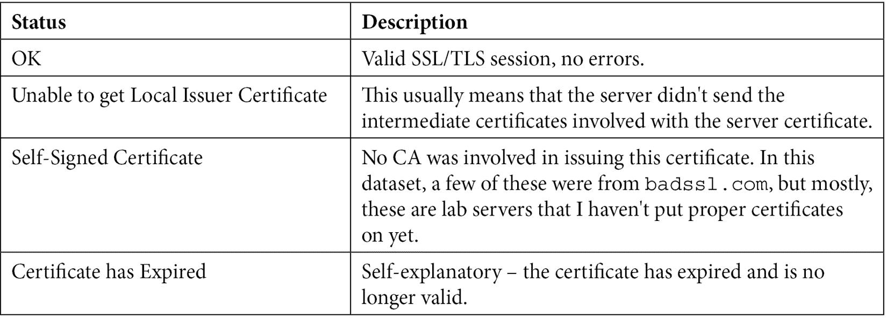

单击**证书已过期**，并选择**+**以深入到该数据:


图 13.29 -缩小搜索过期 SSL 证书的范围

这让我们得到了所涉及的的确切交易，以及涉及的人的 IP !

注意，当我们进行导航和深入时，您将看到**搜索词**字段显示在许多屏幕上，这显示了针对 Elasticsearch 的原始查询。 您总是可以手动添加它们，但使用 UI 可以在这方面提供很大帮助。

让我们来探索 Kibana|**Discover Analytics**页面。 马上，我们就会看到各种各样的新信息:

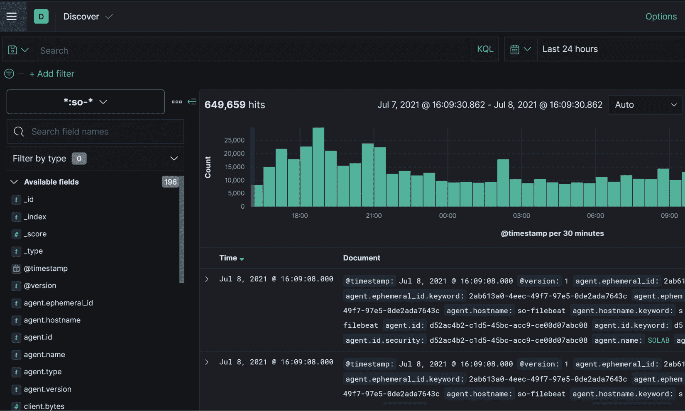

图 13.30 -流量发现视图

在**Search**field 区域中，键入`ssl`来缩小搜索条件。 您将看到它在键入时为您提供匹配的搜索结果。

接下来，单击**ssl。 版本**和**ssl.certificate.issuer**，然后按**Update**:

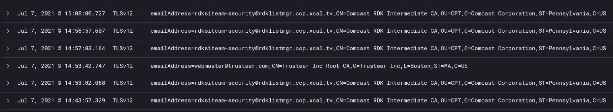

图 13.31 -显示选定的 SSL/TLS 信息

接下来，在字段区域中，键入`source`并添加**源。 ip**至本报告:


图 13.32 -通过添加更多信息来构建查询

您可以很快地看到我们如何将显示范围缩小到我们想要的范围。

或者，我们可以根据地理位置进行过滤。 构建一个列表，显示 TLS 版本、源 IP、目的 IP、国家和城市:

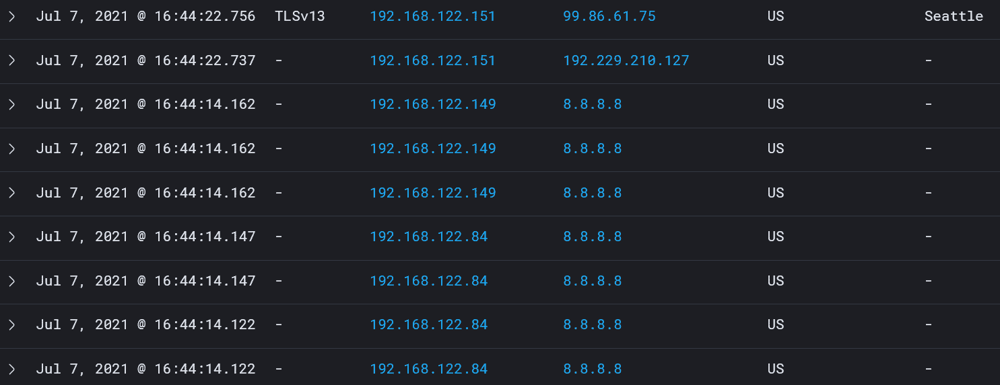

图 13.33 -向查询中添加地理查询信息

现在，在**国家**栏中突出**美国**条目，并选择**-**过滤出美国目的地:


图 13.34 -删除“美国”目的地

这给了我们一个更有趣的列表:

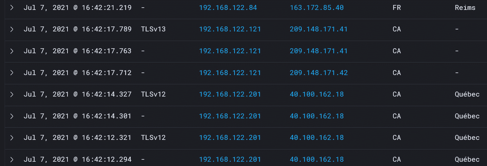

图 13.35 -最终查询

深入研究和处理数据可以快速、轻松地显示“目的地在中国、俄罗斯或朝鲜的 TLSv1.0 或更低”。

即使过滤掉 TLS 版本，也可以快速得到“未知”TLS 版本的短名单。 注意，在任意时间，我们都可以扩展任意一行来获得该会话的完整元数据:


图 13.36 -只有 TLS 版本的“未知”

让我们在第一行中探索目标 IP:

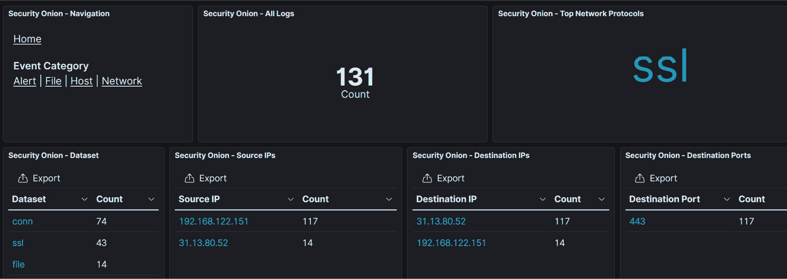

图 13.37 -可疑 IP 的详细信息

还有谁使用 SSL 连接到该问题主机? 在真实的安全事故中，您可以使用这种方法来回答一些重要的问题，例如“我们知道客户机 X 受到了影响; 还有谁有类似的流量，我们可以看看这个问题是否更普遍? "：

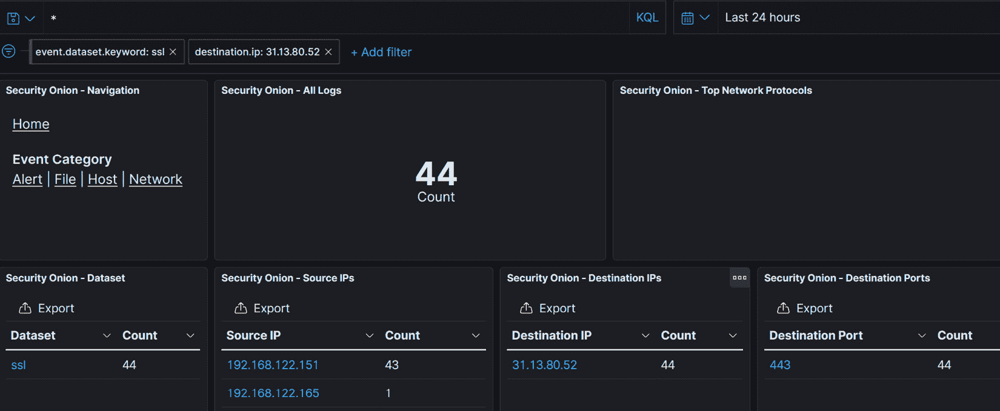

图 13.38 -有相同可疑流量的其他内部主机

在这里，您可以看到 SSL 版本、SSL 证书颁发者和目的地 ip 的国家代码等元数据如何快速获得一些有趣的信息。 想想看，你可以用数以千计的搜索词挖掘得多深!

如果你正在探索交通解决问题或正在通过一个安全事件,你可以看到如何收集交通元数据可以非常有效的得到有用的信息,而不是只有确定主机和会话涉及但在发现类似的主机和会话,也可能会受到影响!

这只是冰山一角。 您不仅可以深入挖掘 SSL/TLS 流量，而且还可以探索数百种其他协议!

# 总结

在本章中，我们讨论了几种检测和预防入侵事件的方法。 我们首先讨论这些不同的技术在我们的架构中最适合的位置，然后讨论具体的解决方案。 我们讨论了经典的基于网络的 IPS 解决方案，即 Snort 和 Suricata。 我们还简要介绍了特定于 web 的 ips——特别是 WAF 和 RASP 解决方案。

在我们的示例中，我们了解了如何使用 IPS (Suricata)来发现和防止安全问题，甚至创建了一个自定义规则来检测或防止 telnet 会话。 使用 P0f 说明了为硬件和软件清单被动收集流量以及安全问题。 最后，我们使用 Zeek 获取我们收集的数据，并收集和计算元数据，使数据更有意义。 Zeek 尤其适用于挖掘网络流量，以发现那些可能表明安全事件或操作问题的不寻常情况。

在下一章中，我们将进一步扩展这种方法，从更被动的收集模型转移到使用“蜜罐”方法，使用基于网络的“欺骗”来发现高保真度的恶意主机。

# 问题

正如我们总结的，这里有一个问题列表，供你测试你对本章材料的知识。 你可以在附录的*评估*部分找到答案:

1.  如果我怀疑某个国家发生了使用“未知”TLS 版本的数据外渗事件，我应该使用哪个工具来发现哪些内部主机受到了影响?
2.  如果您知道您有大量使用 PuTTY SSH 客户机的 Windows 客户机，那么如何在不搜索每台机器的本地存储的情况下列出这些客户机?
3.  为什么决定在内部网络或实际的防火墙上放置一个 IPS ?

# 进一步阅读

如欲了解更多本章的内容，可参考以下连结:

*   SELKS 安装:[https://github.com/StamusNetworks/SELKS/wiki/First-time-setup](https://github.com/StamusNetworks/SELKS/wiki/First-time-setup)
*   安全洋葱安装:[https://docs.securityonion.net/en/2.3/installation.html](https://docs.securityonion.net/en/2.3/installation.html)
*   Suricata 安装(6.0.0):[https://suricata.readthedocs.io/en/suricata-6.0.0/install.html](https://suricata.readthedocs.io/en/suricata-6.0.0/install.html)
*   Suricata 文档:[https://suricata.readthedocs.io](https://suricata.readthedocs.io)
*   Snort 文档:[https://www.snort.org/documents](https://www.snort.org/documents)
*   Snort 规则:[https://snort.org/downloads/#rule-downloads](https://snort.org/downloads/#rule-downloads)
*   JA3 fingerprinting: [https://ja3er.com](https://ja3er.com)

    [https://engineering.salesforce.com/tls-fingerprinting-with-ja3-and-ja3s-247362855967](https://engineering.salesforce.com/tls-fingerprinting-with-ja3-and-ja3s-247362855967)

*   [https://github.com/salesforce/hassh](https://github.com/salesforce/hassh)
*   OpenRASP:[https://github.com/baidu/openrasp](https://github.com/baidu/openrasp)
*   ModSecurity:[https://github.com/SpiderLabs/ModSecurity/wiki/Reference-Manual-(v2.x)modsemodse](https://github.com/SpiderLabs/ModSecurity/wiki/Reference-Manual-(v2.x)modsemodse)
*   负载均衡器上的 WAF 服务:[https://www.haproxy.com/haproxy-web-application-firewall-trial/](https://www.haproxy.com/haproxy-web-application-firewall-trial/)
*   Zeek 文档:[https://docs.zeek.org/en/master/](https://docs.zeek.org/en/master/)
*   安全洋葱:[https://securityonionsolutions.com/software](https://securityonionsolutions.com/software)*******