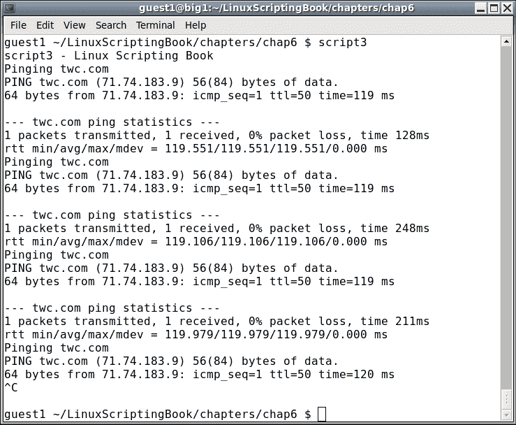
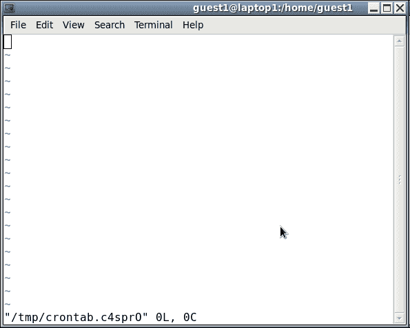
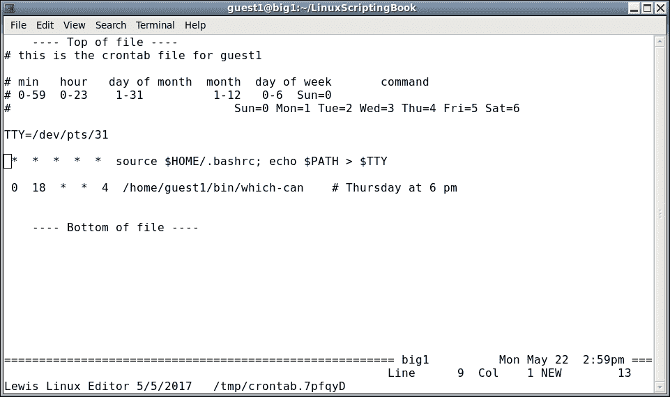
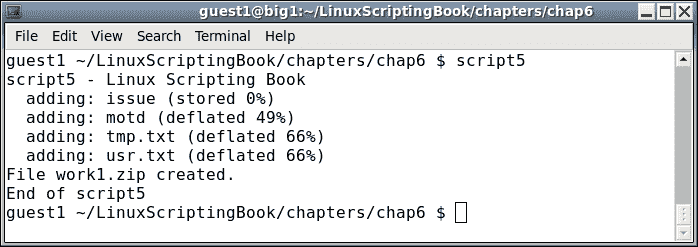

# 六、使用脚本自动执行任务

本章展示了如何使用脚本自动执行各种任务。

本章涵盖的主题如下:

*   如何创建脚本来自动执行任务？
*   使用 cron 在特定时间自动运行脚本的正确方法。
*   如何使用`ZIP`和`TAR`进行压缩备份。
*   源代码示例。

读者将学习如何创建自动化脚本。

我们在[第三章](03.html "Chapter 3. Using Loops and the sleep Command")、*中讨论了`sleep`命令使用循环和睡眠命令*。只要遵循一些准则，就可以使用它来创建自动化脚本(即在特定时间运行的脚本，无需用户干预)。

这个非常简单的脚本将强化我们在[第 3 章](03.html "Chapter 3. Using Loops and the sleep Command") *中所讲述的使用循环和睡眠命令*来使用`sleep`命令实现自动化:

# 第六章-剧本 1

```sh
#!/bin/sh
#
# 5/23/2017
#
echo "script1 - Linux Scripting Book"
while [ true ]
do
  date
  sleep 1d
done
echo "End of script1"
exit 0
```

如果你在你的系统上运行这个并等待几天，你会开始看到日期有一点错误。这是因为`sleep`命令在脚本中插入了一个延迟，它并不意味着它要每天在同一时间运行脚本。

### 注

下面的脚本更详细地展示了这个问题。注意，这是一个不该做什么的例子。

## 第六章-剧本 2

```sh
#!/bin/sh
#
# 5/23/2017
#
echo "script2 - Linux Scripting Book"
while [ true ]
do
 # Run at 3 am
 date | grep -q 03:00:
 rc=$?
 if [ $rc -eq 0 ] ; then
  echo "Run commands here."
  date
 fi
 sleep 60                   # sleep 60 seconds
done
echo "End of script2"
exit 0
```

您首先会注意到，该脚本将一直运行，直到通过 *Ctrl* + *C* 或`kill`命令手动终止(或当机器因任何原因停机时)。自动化脚本永远运行是很常见的。

`date`命令在没有任何参数的情况下运行，返回如下内容:

```sh
  guest1 $ date
  Fri May 19 15:11:54 HST 2017
```

所以现在我们要做的就是用`grep`来匹配那个时间。不幸的是，这里有一个非常微妙的问题。已经证实，这种情况有可能时有发生。例如，如果时间刚刚更改为凌晨 3:00，并且程序现在处于睡眠状态，则它醒来时可能已经是 3:01。在我从事计算的早期，我在工作中一直看到这样的代码，从来没有想过。有一天，当一些重要的备份丢失时，我的团队被要求弄清楚发生了什么，我们发现了这个问题。对此的快速解决方案是将秒更改为 59，然而，更好的方法是使用 cron，这将在本章后面显示。

注意`grep`的`-q`选项，这只是告诉它抑制任何输出。如果你想的话，请随意拿出来，尤其是在第一次写剧本的时候。还要注意的是当找到匹配时`grep`返回`0`，否则为非零。

说了这么多让我们来看看一些简单的自动化脚本。自 1996 年以来，我一直在我的 Linux 系统上运行以下内容:

## 第六章-剧本 3

```sh
#!/bin/sh
#
# 5/23/2017
#
echo "script3 - Linux Scripting Book"
FN=/tmp/log1.txt             # log file
while [ true ]
do
  echo Pinging $PROVIDER
  ping -c 1 $PROVIDER
  rc=$?
  if [ $rc -ne 0 ] ; then
    echo Cannot ping $PROVIDER
    date >> $FN
    echo Cannot ping $PROVIDER >> $FN
  fi
  sleep 60
done
echo "End of script3"        # 60 seconds
exit 0
```

我系统上的输出:



我只运行了三次，然而，它将永远消失。在你的系统上运行之前，让我们来谈谈那个`PROVIDER`环境变量。我的系统上有几个处理互联网的脚本，我发现自己在不断地更换提供商。没花太长时间就意识到这是使用 env var 的好时机，因此有了`PROVIDER`。

这是在我的`/root/.bashrc and /home/guest1/.bashrc`文件中:

```sh
 export PROVIDER=twc.com
```

根据需要替换你的。还要注意，当故障发生时，它会被写入屏幕和文件。由于正在使用`>>`追加操作符，文件可能最终会变得相当大，因此如果您的连接不是很稳定，请相应地进行规划。

### 类型

小心不要在短时间内 ping 或访问公司网站太多次。这可能会被检测到，您的访问可能会被拒绝。

以下是一个脚本，用于检测用户何时登录或退出您的系统:

## 第六章-剧本 4

```sh
#!/bin/sh
#
# 5/23/2017
#
echo "Chapter 6 - Script 4"
numusers=`who | wc -l`
while [ true ]
do
  currusers=`who | wc -l`           # get current number of users
  if [ $currusers -gt $numusers ] ; then
    echo "Someone new has logged on!!!!!!!!!!!"
    date
    who
#   beep
    numusers=$currusers
  elif [ $currusers -lt $numusers ] ; then
    echo "Someone logged off."
    date
    numusers=$currusers
  fi
  sleep 1                    # sleep 1 second
done
```

以下是输出(根据长度进行调整):


该脚本检查来自`who`命令的输出，以查看自上次运行以来它是否改变了。如果是这样，它会采取适当的行动。如果您的系统上有一个`beep`命令或等效命令，这是一个使用它的好地方。

看看这个说法:

```sh
  currusers=`who | wc -l`           # get current number of users
```

这需要一些澄清，因为我们还没有涉及它。这些倒勾字符意味着在内部运行命令并将结果放入变量。在这种情况下，`who`命令通过管道传输到`wc -l`命令中，以计算行数。该值随后被输入到`currusers`变量中。如果这听起来有点复杂，不要担心，它将在下一章中更详细地介绍。

脚本的其余部分应该已经很清楚了，因为我们之前已经讨论过了。如果你决定在你的系统上运行类似的东西，只要记住它会在每次打开新的终端时触发。

## 克朗

好了，现在来点真正的乐趣。如果你使用 Linux 的时间很短，你可能已经知道 cron 了。这是一个后台进程，在特定时间执行命令。

Cron 每分钟读取一个名为`crontab`的文件，以确定是否需要运行一个命令。

对于本章中的示例，我们将只针对一个客户帐户(而不是根帐户)将集中在`crontab`上。

这里使用我的`guest1`帐户是它第一次运行时的样子。最好在客户帐户下继续使用您的系统:

```sh
guest1 $ crontab -l
no crontab for guest1
guest1 $
```

这是有道理的，因为我们还没有为`guest1`创建`crontab`文件。它并不意味着可以直接编辑，因此使用了`crontab -e`命令。

现在在您的系统上的来宾帐户下运行`crontab -e`。

以下是使用 vi 时它在我的系统上的显示屏幕截图:



如您所见可以使用`crontab`命令创建一个临时文件。不幸的是，这个文件是空的，因为他们应该提供一个模板。现在再加一个。将以下文本复制并粘贴到文件中:

```sh
# this is the crontab file for guest1
# min   hour   day of month  month  day of week       command
# 0-59  0-23    1-31          1-12   0-6
#                                    Sun=0 Mon=1 Tue=2 Wed=3 Thu=4 Fri=5 Sat=6
```

用`guest1`代替你的用户名。这给了我们一个去哪里的想法。

向该文件添加以下行:

```sh
  *     *      *      *      *                 date > /dev/pts/31
```

`*`的意思是匹配场上的一切。所以本质上这条线每分钟会发射一次。

我们正在使用重定向操作符将`echo`命令的输出写入另一个终端。适当地替换你的。

在您的系统上尝试上述方法。请记住，您必须先保存文件，您应该会看到以下输出:

```sh
guest1 $ crontab -e
crontab: installing new crontab
guest1 $
```

这意味着添加成功。现在等待下一分钟到来。你应该在另一个终端上看到当前日期。

我们现在可以看到 cron 的基础。以下是一些快速的提示:

```sh
0   0    *   *   *   command            # run every day at midnight
0   3    *   *   *   command            # run every day at 3 am
30  9    1   *   *   command            # run at 9:30 am on the first of the month
45  14   *   *   0   command            # run at 2:45 pm on Sundays
0   0    25  12  *   command            # run at midnight on my birthday
```

这只是如何在 cron 中设置日期和时间的一个很小的子集。更多信息请参考 cron 和`crontab`的`man`页面。

需要提到的一点是用户 cron 的`PATH`。它不来源于用户的`.bashrc`文件。您可以通过添加以下行来验证这一点:

```sh
*   *    *   *   *   echo $PATH > /dev/pts/31    # check the PATH
```

在我的 CentOS 6.8 系统上，它显示:

```sh
/usr/bin:/bin
```

要解决这个问题，您可以获取您的`.bashrc`文件:

```sh
*   *    *   *   *    source $HOME/.bashrc;  echo $PATH > /dev/pts/31    # check the PATH
```

现在，这应该显示出真正的路径。`EDITOR`环境变量在[第 2 章](02.html "Chapter 2. Working with Variables")、*处理变量*中提到。如果您希望`crontab`使用不同的文本编辑器，您可以将`EDITOR`设置为您想要的路径/名称。

例如，在我的系统上，我有这个:

```sh
export EDITOR=/home/guest1/bin/kw
```

所以当我跑的时候我得到了这个:



另一个需要提到的是如果你在某些情况下使用`crontab`时出错，它会在你试图保存文件时告诉你。但是它不能检查所有的东西，所以要小心。另外，如果命令出错`crontab`将使用邮件系统通知用户。因此，考虑到这一点，在使用 cron 时，您可能需要不时运行`mail`命令。

现在我们已经了解了基础知识，让我们创建一个使用`zip`命令的备份脚本。如果不熟悉`zip`不用担心，这样会让你快速上手。在 Linux 系统上，大多数人只使用`tar`命令，但是，如果你知道`zip`是如何工作的，你可以更容易地与 Windows 用户共享文件。

在来宾帐户下的目录中，在您的系统上运行这些命令。像往常一样，我使用`/home/guest1/LinuxScriptingBook`:

制作一个`work`目录:

```sh
guest1 ~/LinuxScriptingBook $ mkdir work
```

更改为:

```sh
guest1 ~/LinuxScriptingBook $ cd work
```

创建一些临时文件，和/或将一些现有文件复制到此目录:

```sh
guest1 ~/LinuxScriptingBook/work $ route > route.txt
guest1 ~/LinuxScriptingBook/work $ ifconfig > ifconfig.txt
guest1 ~/LinuxScriptingBook/work $ ls -la /usr > usr.txt
guest1 ~/LinuxScriptingBook/work $ cp /etc/motd .      
```

获取列表:

```sh
guest1 ~/LinuxScriptingBook/work $ ls -la
total 24
drwxrwxr-x 2 guest1 guest1 4096 May 23 09:44 .
drwxr-xr-x 8 guest1 guest1 4096 May 22 15:18 ..
-rw-rw-r-- 1 guest1 guest1 1732 May 23 09:44 ifconfig.txt
-rw-r--r-- 1 guest1 guest1 1227 May 23 09:44 motd
-rw-rw-r-- 1 guest1 guest1  335 May 23 09:44 route.txt
-rw-rw-r-- 1 guest1 guest1  724 May 23 09:44 usr.txt
```

拉上拉链:

```sh
guest1 ~/LinuxScriptingBook/work $ zip work1.zip *
  adding: ifconfig.txt (deflated 69%)
  adding: motd (deflated 49%)
  adding: route.txt (deflated 52%)
  adding: usr.txt (deflated 66%)
```

获取另一个列表:

```sh
guest1 ~/LinuxScriptingBook/work $ ls -la
total 28
drwxrwxr-x 2 guest1 guest1 4096 May 23 09:45 .
drwxr-xr-x 8 guest1 guest1 4096 May 22 15:18 ..
-rw-rw-r-- 1 guest1 guest1 1732 May 23 09:44 ifconfig.txt
-rw-r--r-- 1 guest1 guest1 1227 May 23 09:44 motd
-rw-rw-r-- 1 guest1 guest1  335 May 23 09:44 route.txt
-rw-rw-r-- 1 guest1 guest1  724 May 23 09:44 usr.txt
-rw-rw-r-- 1 guest1 guest1 2172 May 23 09:45 work1.zip
```

该目录中现在有文件`work1.zip`。创建`zip`文件的语法是:

```sh
 zip [optional parameters] filename.zip list-of-files-to-include
```

要解压它:

```sh
 unzip filename.zip
```

要查看(或列出)一个`zip`文件的内容而不提取它:

```sh
 unzip -l filename.zip
```

这也是确保`.zip`文件被正确创建的好方法，因为如果解压程序无法读取文件，它会报告一个错误。请注意，`zip`命令不仅创建了一个`.zip`文件，而且还压缩了数据。这使得备份文件更小。

下面是一个使用`zip`备份一些文件的短脚本:

## 第六章-剧本 5

```sh
#!/bin/sh
#
# 5/23/2017
#
echo "script5 - Linux Scripting Book"
FN=work1.zip
cd /tmp
mkdir work 2> /dev/null      # suppress message if directory already exists
cd work
cp /etc/motd .
cp /etc/issue .
ls -la /tmp > tmp.txt
ls -la /usr > usr.txt
rm $FN 2> /dev/null          # remove any previous file
zip $FN *
echo File "$FN" created.
# cp to an external drive, and/or scp to another computer
echo "End of script5"
exit 0
```

我系统上的输出:



这是一个非常简单的脚本，但是它展示了使用`zip`命令备份一些文件的基础。

假设我们想每天午夜运行这个。假设`script5`位于`/tmp`之下，`crontab`条目如下:

```sh
guest1 /tmp/work $ crontab -l
# this is the crontab file for guest1

# min   hour   day of month  month  day of week       command
# 0-59  0-23    1-31          1-12   0-6  Sun=0
#                                Sun=0 Mon=1 Tue=2 Wed=3 Thu=4 Fri=5 Sat=6

0 0 * * * /tmp/script5
```

在这种情况下，我们不必获取`/home/guest1/.bashrc`文件。还要注意，任何错误都会发送到用户的邮件帐户。zip 命令可以做的远不止这些，例如，它可以递归到目录中。有关更多信息，请参考手册页。

现在我们来谈谈 Linux `tar`命令。它比`zip`命令使用更频繁，更擅长获取所有文件，甚至是隐藏的文件。回到`/tmp/work directory`，这里是你如何使用`tar`来备份它。假设文件仍在先前脚本中:

```sh
guest1 /tmp $ tar cvzf work1.gz work/
work/
work/motd
work/tmp.txt
work/issue
work/work1.zip
work/usr.txt
guest1 /tmp $
```

现在`/tmp`目录下有文件`work1.gz`。它是`/tmp/work`下所有文件内容的压缩存档，包括我们之前创建的`.zip`文件。

tar 的语法一开始有点神秘，但你会习惯的。tar 中提供的一些功能包括:

<colgroup><col style="text-align: left"> <col style="text-align: left"></colgroup> 
| 

参数

 | 

特征

 |
| --- | --- |
| `c` | 创建档案 |
| `x` | 提取档案 |
| `v` | 使用详细选项 |
| `z` | 使用 gunzip 样式压缩(。gz) |
| `f` | 要创建/提取的文件名 |

请注意，如果不包括`z`选项，文件将不会被压缩。按照惯例，文件扩展名将只是 tar。请注意，用户控制文件的实际名称，而不是`tar`命令。

好了，现在我们有一个压缩的`tar-gz file`(或档案)。下面是如何解压缩文件。我们将在`/home/guest1`下进行:

```sh
guest1 /home/guest1 $ tar xvzf /tmp/work1.gz
work/
work/motd
work/tmp.txt
work/issue
work/work1.zip
work/usr.txt
guest1 /home/guest1 $
```

用 tar 备份系统真的很方便。这也是用你的个人文件配置一台新机器的好方法。例如，我会定期备份主系统上的以下目录:

```sh
 /home/guest1
 /lewis
 /temp
 /root
```

然后，这些文件会自动复制到外部 u 盘。请记住，tar 会自动递归到目录中，并获取每个文件，包括隐藏的文件。Tar 还有许多其他选项来控制如何创建归档。最常见的选项之一是排除某些目录。

例如，在备份`/home/guest1`时，确实没有理由包含`.cache`、`Cache`、`.thumbnails`等目录。

排除目录的选项是`--exclude=<directory name>`，这将在下一个脚本中显示。

以下是我在我的主 Linux 系统上使用的备份程序。这是两个脚本，一个用于计划备份，一个用于实际执行工作。我这样做主要是为了在不关闭调度程序脚本的情况下对实际的备份脚本进行更改。首先需要设置的是`crontab`条目。以下是它在我的系统上的样子:

```sh
guest1 $ crontab -l
# this is the crontab file for guest1
# min   hour   day of month  month  day of week       command
# 0-59  0-23    1-31          1-12   0-6  Sun=0
#                                Sun=0 Mon=1 Tue=2 Wed=3 Thu=4 Fri=5 Sat=6
TTY=/dev/pts/31

 0  3   *  *  *  touch /tmp/runbackup-cron.txt
```

这将在每天凌晨 3 点左右创建文件`/tmp/backup-cron.txt`。

请注意，以下脚本必须以 root 用户身份运行:

## 第六章-剧本 6

```sh
#!/bin/sh
#
# runbackup1 - this version watches for file from crontab
#
# 6/3/2017 - mainlogs now under /data/mainlogs
#
VER="runbackup1 6/4/2017 A"
FN=/tmp/runbackup-cron.txt
DR=/wd1                      # symbolic link to external drive

tput clear
echo $VER

# Insure backup drive is mounted
file $DR | grep broken
rc=$?
if [ $rc -eq 0  ] ; then
 echo "ERROR: USB drive $DR is not mounted!!!!!!!!!!!!!!"
 beep
 exit 255
fi

cd $LDIR/backup

while [ true ]
do
 # crontab creates the file at 3 am

 if [ -f $FN ] ; then
  rm $FN
  echo Running backup1 ...
  backup1 | tee /data/mainlogs/mainlog`date '+%Y%m%d'`.txt
  echo $VER
 fi

 sleep 60                    # check every minute
done
```

这里有很多信息，所以我们将一行一行地浏览:

*   脚本首先设置变量，清除屏幕，显示脚本名称。
*   `DR`变量分配给我的 USB 外接驱动器(`wd1`)，这是一个符号链接。
*   然后使用`file`命令进行检查，以确保`/wd1`已安装。如果没有，则`file`命令将返回断开的符号链接，`grep`将在此触发，脚本将中止。
*   如果驱动器已安装，则进入循环。每分钟都会检查文件的存在，看是否到了开始备份的时间。
*   找到文件后，运行`backup1`脚本(见下一步)。使用`tee`命令将其输出发送到屏幕和文件。
*   日期格式说明符`'+%Y%m%d'`以这种格式显示日期:YYYYMMDD

我不时检查`/data/mainlogs`目录中的文件，以确保我的备份创建正确，没有错误。

以下脚本用于备份我的系统。这里的逻辑是当天备份存储在硬盘`$TDIR`目录下。它们也被复制到外部驱动器上的编号目录中。这些进入编号为 1 到 7 的目录。当到达最后一个时，它再次从 1 开始。这样，外部驱动器上总是有 7 天的备份可用。

该脚本必须也以 root 身份运行:

## 第六章-剧本 7

```sh
#!/bin/sh
#   Jim's backup program
#   Runs standalone
#   Copies to /data/backups first, then to USB backup drive
VER="File backup by Jim Lewis 5/27/2017 A"
TDIR=/data/backups
RUNDIR=$LDIR/backup
DR=/wd1
echo $VER
cd $RUNDIR
# Insure backup drive is mounted
file $DR | grep broken
a=$?
if [ "$a" != "1" ] ; then
 echo "ERROR: USB drive $DR is not mounted!!!!!!!!!!!!!!"
 beep
 exit 255
fi
date >> datelog.txt
date
echo "Removing files from $TDIR"
cd "$TDIR"
rc=$?
if [ $rc -ne 0 ] ; then
 echo "backup1: Error cannot change to $TDIR!"
 exit 250
fi
rm *.gz
echo "Backing up files to $TDIR"
X=`date '+%Y%m%d'`
cd /
tar cvzf "$TDIR/lewis$X.gz"  lewis
tar cvzf "$TDIR/temp$X.gz"   temp
tar cvzf "$TDIR/root$X.gz"   root
cd /home
tar cvzf "$TDIR/guest$X.gz" --exclude=Cache --exclude=.cache --exclude=.evolution --exclude=vmware --exclude=.thumbnails  --exclude=.gconf --exclude=.kde --exclude=.adobe  --exclude=.mozilla  --exclude=.gconf  --exclude=thunderbird  --exclude=.local --exclude=.macromedia  --exclude=.config   guest1
cd $RUNDIR
T=`cat filenum1`
BACKDIR=$DR/backups/$T
rm $BACKDIR/*.gz
cd "$TDIR"
cp *.gz $BACKDIR
echo $VER
cd $BACKDIR
pwd
ls -lah
cd $RUNDIR
let T++
if [ $T -gt 7 ] ; then
 T=1
fi
echo $T > filenum1
```

这比之前的脚本要复杂一点，所以让我们一行一行来看一下:

*   `RUNDIR`变量保存脚本的起始目录。
*   `DR`变量指向外部备份驱动器。
*   检查驱动器以确保其已安装。
*   当前日期被追加到`datelog.txt`文件中。
*   `TDIR`变量是备份的目标目录。
*   对该目录执行`cd`并检查返回代码。出现错误时，脚本以`250`退出。
*   前一天的备份被删除。

它现在回到`/`目录执行 tar 备份。

注意`guest1`目录中排除了几个目录。

*   `cd $RUNDIR`将其放回起始目录。
*   `T=`filenum1``从该文件中获取值并将其放入`T`变量中。这是一个计数器，用于指示下一步在外部驱动器上使用哪个目录。
*   `BACKDIR`设置为旧备份，然后删除。
*   控制再次返回到起始目录，当前备份被复制到外部驱动器上的适当目录。
*   程序的版本会再次显示，以便在杂乱的屏幕上很容易找到。
*   控制转到备份目录，`pwd`显示名称，然后显示目录内容。
*   `T`变量增加 1。如果大于 7，则设置回 1。

最后更新的`T`变量被写回`filenum1`文件。

无论您想要开发什么样的备份过程，该脚本都应该是一个很好的起点。请注意，`scp`命令可用于将文件直接复制到另一台计算机，无需用户干预。这将在[第 10 章](10.html "Chapter 10. Scripting Best Practices")、*脚本最佳实践*中介绍。

# 总结

我们描述了如何创建脚本来自动化任务。介绍了使用 cron 在特定时间自动运行脚本的正确方法。讨论了归档命令`zip`和`tar`以展示如何执行压缩备份。还包括并讨论了完整的计划程序和备份脚本。

在下一章中，我们将展示如何在脚本中读写文件。