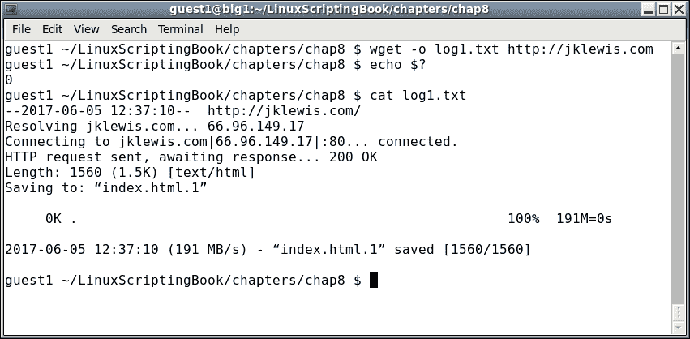
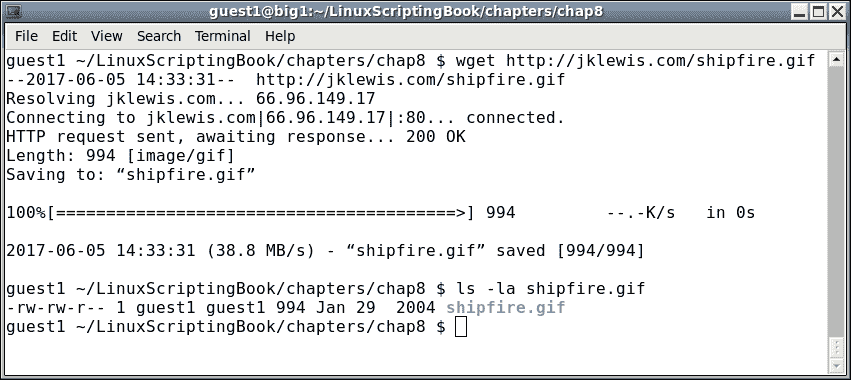
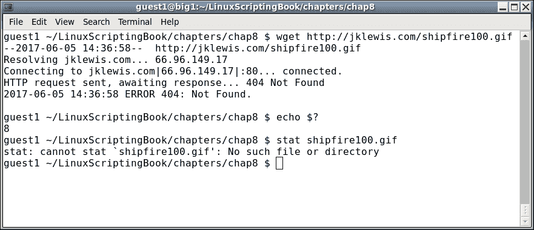
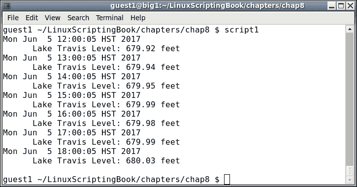
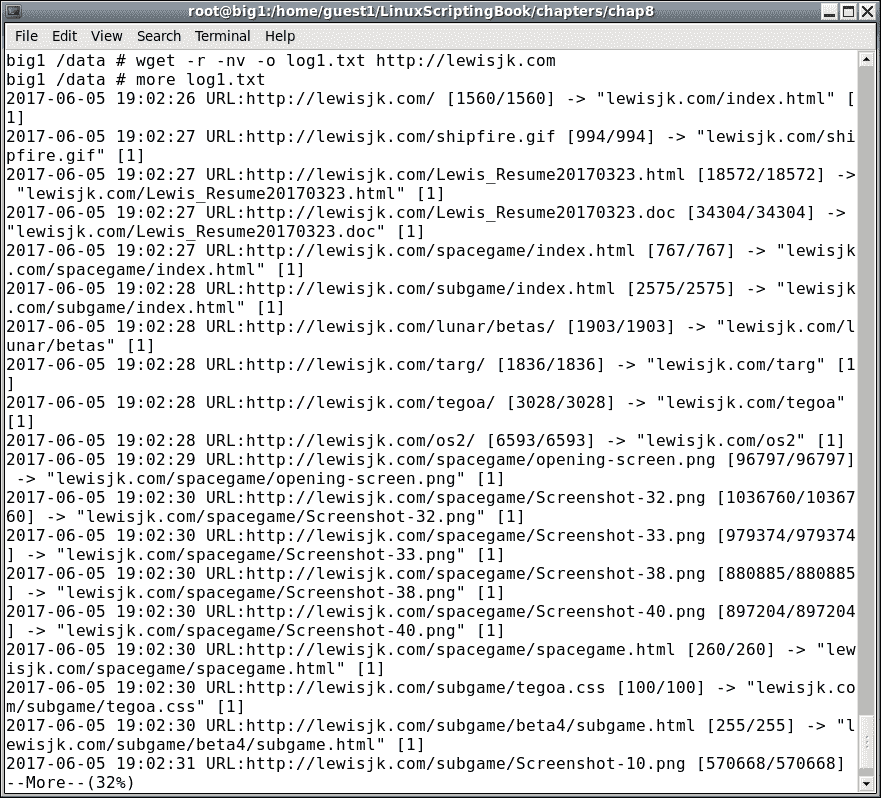
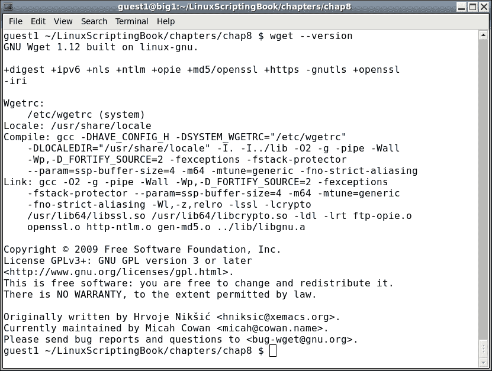
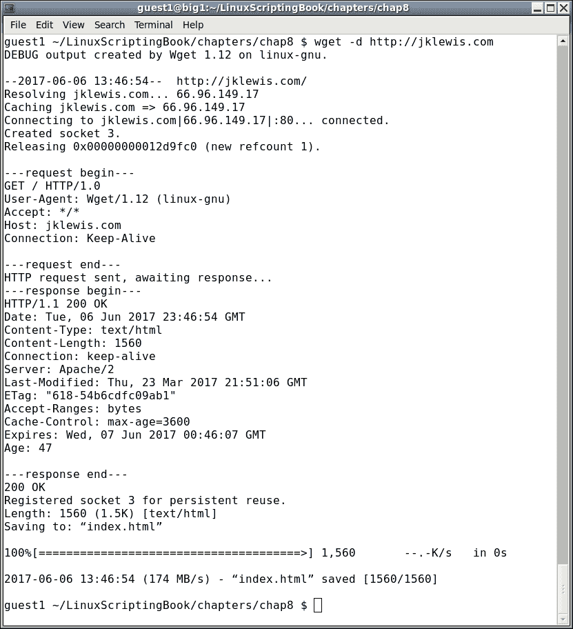
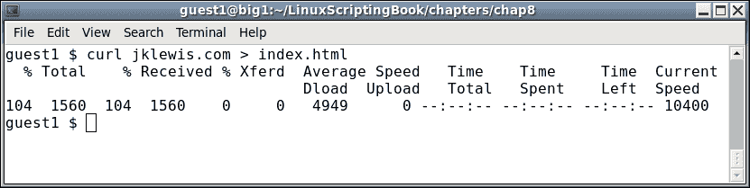
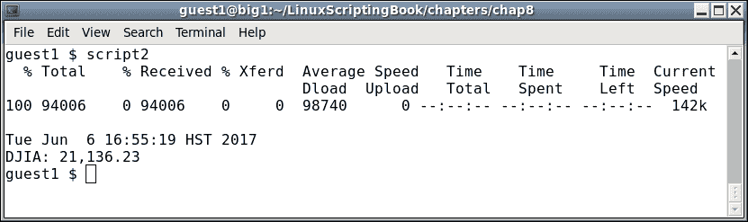

# 八、使用`wget`和`curl`

本章将展示如何使用`wget`和`curl`直接从互联网收集信息。

本章涵盖的主题有:

*   展示如何使用`wget`获取信息。
*   展示如何使用`curl`获取信息。

能够以这种方式收集数据的脚本是您可以使用的非常强大的工具。正如你将从本章中看到的，你可以从世界任何地方的网站上自动获得股票报价、湖泊水位，几乎任何东西。

# 介绍 wget 程序

您可能已经听说过甚至使用过`wget`程序。这是一个命令行实用程序，可用于从互联网下载文件。

下面是以最简单的形式展示`wget`的截图:


## wget 选项

在输出中可以看到`wget`从我的[jklewis.com](http://jklewis.com)网站下载了`index.html`文件。

这是对`wget`的默认行为。标准用法是:

```sh
  wget [options] URL
```

其中**网址**代表**统一资源定位器**，或网站地址。

这里只是`wget`众多可用选项的简短列表:

<colgroup><col style="text-align: left"> <col style="text-align: left"></colgroup> 
| 

参数

 | 

说明

 |
| --- | --- |
| `-o` | `log`文件，消息会写到这里而不是写到`STDOUT` |
| `-a` | 与`-o`相同，只是它附加到`log`文件中 |
| `-O` | 输出文件，将文件复制到此名称 |
| `-d` | 打开调试 |
| `-q` | 安静模式 |
| `-v` | 详细模式 |
| `-r` | 递归模式 |

让我们试试另一个例子:



在这种情况下使用了`-o`选项。返回代码已检查，代码`0`表示无故障。没有输出，因为它指向由`cat`命令显示的`log`文件。

在这种情况下使用了`-o`选项，将输出写入文件。没有显示输出，因为它指向`log`文件，然后由`cat`命令显示。检查了`wget`的返回代码，`0`的代码表示没有故障。

请注意，这次它将下载的文件命名为`index.html.1`。这是因为`index.html`是在前面的例子中创建的。这个应用的作者这样做是为了避免覆盖以前下载的文件。非常好！

请看下一个例子:



这里我们告诉`wget`下载给定的文件(`shipfire.gif`)。

在下一张截图中，我们展示了`wget`将如何返回一个有用的错误代码:



## wget 返回代码

出现这个错误是因为我的网站上的基础目录中没有名为`shipfire100.gif`的文件。注意输出如何显示 **404 未找到**消息，这在网络上经常看到。通常，这意味着请求的资源在当时不可用。在这种情况下，文件不在那里，因此会出现该消息。

还要注意`wget`是如何返回`8`错误代码的。`wget`的手册页显示了`wget`可能的退出代码:

<colgroup><col style="text-align: left"> <col style="text-align: left"></colgroup> 
| 

错误代码

 | 

说明

 |
| --- | --- |
| `0` | 没有出现任何问题。 |
| `1` | 通用错误代码。 |
| `2` | 分析错误。例如，当解析命令行选项时，`.wgetrc`或`.netrc`文件 |
| `3` | 文件输入/输出错误。 |
| `4` | 网络故障。 |
| `5` | SSL 验证失败。 |
| `6` | 用户名/密码验证失败。 |
| `7` | 协议错误。 |
| `8` | 服务器发出了错误响应。 |

回到 T2 很有意义。服务器找不到文件，因此返回了一个`404`错误代码。

## wget 配置文件

现在是提到不同`wget`配置文件的好时机。主要有两个文件，`/etc/wgetrc`是全局`wget`启动文件的默认位置。在大多数情况下，您可能不应该编辑它，除非您真的想要做出影响所有用户的更改。文件`$HOME/.wgetrc`是放置任何你想要的选项的更好的地方。一个很好的方法是在文本编辑器中打开`/etc/wgetrc`和`$HOME/.wgetrc`，然后将你想要的小节复制到你的`$HOME./wgetrc`文件中。

有关`wget`配置文件的更多信息，请参考`man`页面(`man wget`)。

现在让我们看看`wget`在行动。我前阵子写了这篇文章来记录我过去划船的那个湖的水位:

### 第八章-剧本 1

```sh
#!/bin/sh
# 6/5/2017
# Chapter 8 - Script 1

URL=http://www.arlut.utexas.edu/omg/weather.html
FN=weather.html
TF=temp1.txt                 # temp file
LF=logfile.txt               # log file

loop=1
while [ $loop -eq 1 ]
do
 rm $FN 2> /dev/null         # remove old file
 wget -o $LF $URL
 rc=$?
 if [ $rc -ne 0 ] ; then
  echo "wget returned code: $rc"
  echo "logfile:"
  cat $LF

  exit 200
 fi

 date
 grep "Lake Travis Level:" $FN > $TF
 cat $TF | cut  -d ' ' -f 12 --complement

 sleep 1h
done

exit 0
```

本次产量为 2017 年 6 月 5 日起。不需要看太多，但这里有:



从脚本和输出可以看出，它每小时运行一次。如果你想知道为什么有人会写这样的东西，我需要知道湖面是否低于 640 英尺，因为我必须把我的船移出码头。这是在德克萨斯州严重干旱的时候。

编写这样的脚本时，有几件事要记住:

*   当首次编写脚本时，手动执行一次`wget`，然后使用下载的文件。
*   短时间内不要多次使用`wget`，否则可能会被网站屏蔽。
*   请记住，HTML 程序员喜欢一直改变事情，所以你可能必须相应地调整你的脚本。
*   当你最终得到正确的脚本时，一定要再次激活`wget`。

# wget 和递归

`wget`程序也可以通过使用递归(`-r`)选项来下载整个网站的内容。

例如，请看下面的截图:



no verbose ( `-nv`)选项用于限制输出。`wget`命令完成后，使用 more 命令查看日志内容。根据文件的数量，输出可能会很长。

使用`wget`时可能会遇到意想不到的问题。它可能得不到任何文件，也可能得到一些文件，但不是全部。如果没有任何合理的错误信息，它甚至可能会失败。如果发生这种情况，请仔细查看`man`页面(`man wget`)。可能有一个选项可以帮你解决问题。特别看下面。

在您的系统上运行`wget --version`。它将显示选项和功能的详细列表，以及`wget`是如何编译的。

下面是一个取自我运行 CentOS 6.8 64 位的系统的例子:



# wget 选项

通常`wget`使用的默认值对大多数用户来说已经足够好了，但是，您可能需要不时调整一些东西，让它按照您想要的方式工作。

以下是一些`wget`选项的部分列表:

<colgroup><col style="text-align: left"> <col style="text-align: left"></colgroup> 
| 

wget 选项

 | 

说明

 |
| --- | --- |
| `-o`文件名 | 将消息输出到`log`文件。本章前面已经介绍过了。 |
| `-t`号 | 在放弃连接之前，请尝试多次。 |
| `-c` | 继续从先前的`wget`下载部分下载的文件。 |
| `-S` | 显示服务器发送的邮件头。 |
| `-Q`号 | 将下载的配额或字节总数。数字可以是字节、千字节(k)或兆字节(m)。设置为 0 或 inf 表示没有配额。 |
| `-l`号 | 这指定了最大递归级别。默认值为 5。 |
| `-m` | 这对于尝试创建站点的镜像非常有用。相当于使用`-r -N -l inf --no-remove-listing`选项。 |

你可以尝试的另一件事情是用`-d`选项开启调试。请注意，只有当您的版本`wget`在调试支持下编译时，这才会起作用。让我们看看当我在我的系统上尝试它时会发生什么:



我不确定调试是否打开，现在我知道了。这个输出可能不是很有用，除非你是一个开发人员，但是，如果你需要在`wget`发送一个错误报告，他们会要求调试输出。

可以看到，`wget`是一个非常强大的程序，有几个选项。

### 注

记得小心使用`wget`，不要忘记在循环中至少睡一分钟。一个小时会更好。

# 卷曲

现在让我们看看`curl`程序，因为它有点类似于`wget`。`wget`和`curl`的主要区别之一是它们如何处理输出。

`wget`程序默认在屏幕上显示一些进度信息，然后下载`index.html`文件。相比之下，`curl`通常在屏幕上显示文件本身。

下面是一个使用我最喜欢的网站在我的系统上运行`curl`的例子(截图缩短以节省空间):


另一种将输出放入文件的方法是使用如下重定向:



您会注意到，当重定向到文件时，屏幕上会显示传输进度。还要注意，如果重定向，任何错误输出都会进入文件，而不是屏幕。

## 卷曲选项

以下是 curl 中可用选项的简要列表:

<colgroup><col style="text-align: left"> <col style="text-align: left"></colgroup> 
| 

卷曲选项

 | 

说明

 |
| --- | --- |
| `-o` | 输出文件名 |
| `-s` | 静音模式。什么都没有显示，甚至没有错误 |
| `-S` | 在静默模式下显示错误 |
| `-v` | 冗长，对调试有用 |

`curl`还有很多其他选项，还有几页返回码。更多信息请参考`curl man`页面。

现在这里有一个脚本，显示如何使用 curl 自动获得道琼斯工业平均指数的当前值:

### 第八章-剧本 2

```sh
#!/bin/sh
# 6/6/2017
# Chapter 8 - Script 2

URL="https://www.google.com/finance?cid=983582"
FN=outfile1.txt              # output file
TF=temp1.txt                 # temp file for grep

loop=1
while [ $loop -eq 1 ]
do
 rm $FN 2> /dev/null         # remove old file
 curl -o $FN $URL            # output to file
 rc=$?
 if [ $rc -ne 0 ] ; then
  echo "curl returned code: $rc"
  echo "outfile:"
  cat $FN

  exit 200
 fi

 echo ""                     # carriage return
 date
 grep "ref_983582_l" $FN > $TF
 echo -n "DJIA: "
 cat $TF | cut -c 25-33

 sleep 1h
done

exit 0
```

这是它在我的系统上的样子。通常情况下，您可能会使用`-s`选项将进度信息从输出中删除，但我认为它看起来很酷，因此将其保留在:



你可以看到`curl`和`wget`的工作方式基本相同。请记住，在编写这样的脚本时，要记住页面的格式几乎肯定会不时地改变，所以要做好相应的计划。

# 总结

在本章中，我们展示了如何在脚本中使用`wget`和`curl`。这些程序的默认行为显示为许多选项中的一些。还讨论了返回代码，并给出了几个示例脚本。

下一章将介绍如何更容易地调试脚本中的语法和逻辑错误。