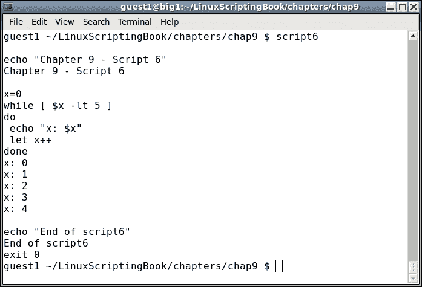
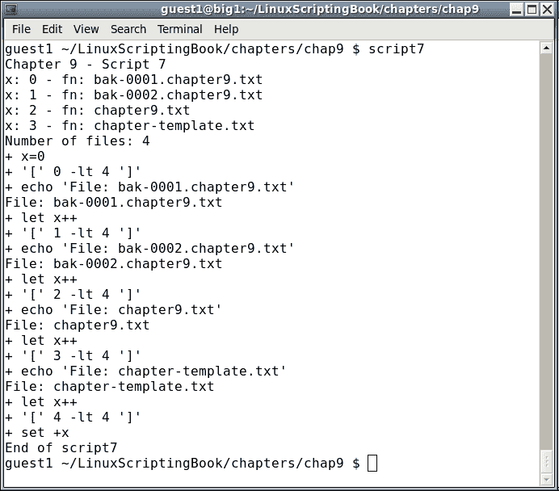
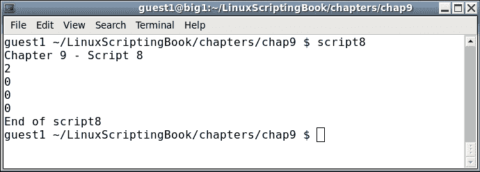

# 九、调试脚本

本章展示了如何调试 Bash shell 脚本。

用任何语言编程，无论是 C 语言、Java 语言、FORTRAN 语言、COBOL*语言还是 Bash 语言，都是非常有趣的。然而，通常不有趣的是当事情出错时，当发现问题并解决它花费了过多的时间时。本章将试图向读者展示如何避免一些更常见的语法和逻辑错误，以及如何在错误发生时找到它们。

*COBOL:好吧，我不得不说用 COBOL 编程从来都不好玩！

本章涵盖的主题有:

*   如何防止一些常见的语法和逻辑错误？
*   Shell 调试命令如`set -x`、`set -v`。
*   设置调试的其他方法。
*   重定向如何用于实时调试？

# 语法错误

没有什么比在编写脚本或程序时陷入困境，然后出现语法错误更令人沮丧的了。在某些情况下，解决方案非常简单，你可以马上找到并解决它。在其他情况下，可能需要几分钟甚至几个小时。这里有几点建议:

编码一个循环时，先把整个`while...do...done`结构放进去。有时候真的很容易忘记结尾`done`语句，尤其是代码跨度超过一页的时候。

看一下*脚本 1* :

## 第九章-剧本 1

```sh
#!/bin/sh
#
# 6/7/2017
#
echo "Chapter 9 - Script 1"

x=0
while [ $x -lt 5 ]
do
 echo "x: $x"
 let x++

y=0
while [ $y -lt 5 ]
do
 echo "y: $y"
 let y++
done

# more code here
# more code here

echo "End of script1"
exit 0
```

而这里是输出:


仔细看这个，上面说错误在**第 26 行**。哇，这怎么可能，文件只有 25 行？简单的答案是，这只是 Bash 解释器处理这种情况的方式。如果你还没有找到 bug，它实际上在第 12 行。这就是`done`语句应该出现的地方，我故意省略了它，导致了错误。现在想象一下如果这是一个很长的剧本。根据具体情况，可能需要很长时间才能找到导致问题的线路。

现在看一下*脚本 2* ，这只是*脚本 1* 加上一些附加的`echo`语句:

## 第九章-剧本 2

```sh
#!/bin/sh
#
# 6/7/2017
#
echo "Chapter 9 - Script 2"

echo "Start of x loop"
x=0
while [ $x -lt 5 ]
do
 echo "x: $x"
 let x++

echo "Start of y loop"
y=0
while [ $y -lt 5 ]
do
 echo "y: $y"
 let y++
done

# more code here
# more code here

echo "End of script2"
exit 0
```

以下是输出:


你可以看到`echo`语句`Start of x loop`显示出来了。然而，第二个，`Start of y loop`没有显示。这给了你一个好主意，错误在第二个`echo`语句之前的某个地方。在这种情况下，它之前是正确的，但不要指望每次都那么幸运。

# 自动备份

现在为了获得一点免费的编程建议，在[第 4 章](04.html "Chapter 4. Creating and Calling Subroutines")、*创建和调用子程序*中提到了自动备份文件。我强烈建议你在写稍微复杂一点的东西时，使用这样的东西。没有什么比在你的程序或脚本上工作并且进行得很顺利，只是做了一些改变并且以某种奇怪的方式失败更令人沮丧的了。几分钟前你让它工作然后砰！它有一个缺点，你不能弄清楚是什么变化导致的。如果你没有一个编号的备份，你可能会花上几个小时(也许几天)试图找到错误。我见过人们花几个小时撤销每一个变更，直到发现问题。是的，我也做过。

显然，如果你有一个编号备份，你可以简单地回去，找到最新的一个没有故障。然后，您可以区分两个版本，可能会很快发现错误。没有编号备份，你只能靠自己。不要做我做过的事，等 2 年或更久才意识到这一切。

# 更多语法错误

shell 脚本的一个基本问题是语法错误通常不会出现，直到解释器解析出有问题的行。这是一个常见的错误，我仍然发现自己做得太多了。看看能不能通过阅读脚本找到问题所在:

## 第九章-剧本 3

```sh
#!/bin/sh
#
# 6/7/2017
#
echo "Chapter 9 - Script 3"

if [ $# -ne 1 ] ; then
 echo "Usage: script3 parameter"
 exit 255
fi

parm=$1
echo "parm: $parm"

if [ "$parm" = "home" ] ; then
 echo "parm is home."
elif if [ "$parm" = "cls" ] ; then
 echo "parm is cls."
elif [ "$parm" = "end" ] ; then
 echo "parm is end."
else
 echo "Unknown parameter: $parm"
fi

echo "End of script3"
exit 0
```

以下是的输出:


你发现我的错误了吗？当我编写一个`if...elif...else`语句时，我倾向于复制并粘贴第一个`if`语句。然后我将`elif`添加到下一个语句中，但是忘记删除`if`。我几乎每次都是这样。

看看我是怎么运行这个脚本的。我首先从调用`Usage`子句的脚本名称开始。你可能会发现解释器没有报告语法错误很有趣。那是因为它从来没有涉及到那条线。这对于脚本来说可能是一个真正的问题，因为它可能会运行几天、几周甚至几年，然后运行一部分有语法错误的代码，然后失败。在编写和测试脚本时，请记住这一点。

下面是另一个经典语法错误的快速例子(我刚才又犯了一次经典错误):

```sh
for i in *.txt
 echo "i: $i"
done
```

运行时，它输出以下内容:

```sh
./script-bad: line 8: syntax error near unexpected token `echo'
./script-bad: line 8: ` echo "i: $i"'
```

你能发现我的错误吗？如果没有再看。`for`语句后的`do`语句我忘了。坏吉姆！

脚本中最容易出错的一件事就是忘记变量前面的`$`。如果您用其他语言(如 C 或 Java)编写代码，情况尤其如此，因为您不会在这些语言的变量前添加`$`。我在这里能给出的唯一真正的建议是，如果你的脚本似乎没有做任何正确的事情，检查你所有的变量`$`。但是要小心，不要走得太远，开始把它们添加到不属于它们的地方！

# 逻辑错误

现在我们来谈谈逻辑错误。这些可能很难诊断，不幸的是我没有任何神奇的方法来避免这些。然而，有一些事情可以指出来帮助找到他们。

编码的一个常见问题是什么叫做 1 错误。这是由 60 年代计算机语言设计者决定从 0 而不是 1 开始给事物编号造成的。计算机会很高兴地在你想让它们计数的任何地方开始计数，而且从不抱怨，但是大多数人在 1 开始计数时往往会做得更好。我的大多数同行可能不同意这一点，但是因为我总是必须通过 1 个缺陷来修正他们的错误，所以我修改了我的评论。

让我们看看下面这个非常简单的脚本:

## 第九章-剧本 4

```sh
#!/bin/sh
#
# 6/7/2017
#
echo "Chapter 9 - Script 4"

x=0
while [ $x -lt 5 ]
do
 echo "x: $x"
 let x++
done

echo "x after loop: $x"
let maxx=x

y=1
while [ $y -le 5 ]
do
 echo "y: $y"
 let y++
done

echo "y after loop: $y"
let maxy=y-1                 # must subtract 1

echo "Max. number of x: $maxx"
echo "Max. number of y: $maxy"

echo "End of script4"
exit 0
```

而输出:


看看两个循环之间的细微差别:

*   在`x`循环中，计数从`0`开始。
*   `x`在小于`5`时递增。
*   循环后`x`的值为`5`。
*   应该等于迭代次数的变量`maxx`被设置为`x`。
*   在 y 循环中，计数从`1`开始。
*   `y`在小于或等于`5`时递增。
*   循环后`y`的值为`6`。
*   应该等于迭代次数的变量`maxy`被设置为`y-1`。

如果你已经很好地理解了上面的内容，你可能永远不会有 1 分错误的问题，这很好。

对我们其他人来说，我建议仔细检查一下，直到你把它弄对为止。

# 使用 set 调试脚本

您可以使用`set`命令来帮助调试您的脚本。`set`、`x`和`v`共有两种选择。下面是每一个的描述。

请注意，a `-`激活器械包，而 a `+`禁用器械包。如果你觉得这是倒退，那是因为这是倒退。

使用:

*   `set -x`:运行命令前显示展开的轨迹
*   `set -v`:显示解析后的输入行

看看*脚本 5* ，它展示了`set -x`的功能:

## 第九章-剧本 5 和剧本 6

```sh
#!/bin/sh
#
# 6/7/2017
#
set -x                       # turn debugging on

echo "Chapter 9 - Script 5"

x=0
while [ $x -lt 5 ]
do
 echo "x: $x"
 let x++
done

echo "End of script5"
exit 0
```

而输出:


如果这个一开始看起来有点奇怪，别担心，越看越容易。本质上，以`+`开头的行是扩展的源代码行，没有`+`的行是脚本的输出。

看前两行。它显示:

```sh
 + echo 'Chapter 9 - Script 5'
 Chapter 9 - Script 5
```

第一行显示扩展的命令，第二行显示输出。

也可以使用`set -v`选项。这里是*剧本 6* 的截图，只是*剧本 5* 但是这次有了`set -v`:



你可以看到输出有很大的不同。

请注意，使用`set`命令，您可以在脚本中的任意点打开和关闭它们。这样您就可以将输出限制在您感兴趣的代码区域。

让我们看一个例子:

## 第九章-剧本 7

```sh
#!/bin/sh
#
# 6/8/2017
#
set +x                       # turn debugging off

echo "Chapter 9 - Script 7"

x=0
for fn in *.txt
do
 echo "x: $x - fn: $fn"
 array[$x]="$fn"
 let x++
done

maxx=$x
echo "Number of files: $maxx"

set -x                       # turn debugging on

x=0
while [ $x -lt $maxx ]
do
  echo "File: ${array[$x]}"
  let x++
done

set +x                       # turn debugging off

echo "End of script7"
exit 0
```

和的输出:



请注意在脚本开始时调试是如何被显式关闭的，尽管默认情况下是关闭的。这是一个很好的方法来记录它什么时候关闭，什么时候打开。仔细查看输出，看看调试语句是如何在数组的第二个循环之前不开始显示的。然后在运行最后两行之前将其关闭。

使用`set`命令时的输出有时会很难看到，所以这是一个很好的方法来限制你必须涉水到达感兴趣的行。

还有一种我经常使用的调试技术。在许多情况下，我认为使用`set`命令更好，因为显示屏不会变得非常混乱。您可能还记得在[第 6 章](06.html "Chapter 6. Automating Tasks with Scripts")、*使用脚本自动执行任务*中，我们能够向其他终端显示输出。这是一个非常方便的特性。

以下脚本显示了如何在另一个终端中显示输出。为了方便起见，使用了一个子程序:

## 第九章-剧本 8

```sh
#!/bin/sh
#
# 6/8/2017
#
echo "Chapter 9 - Script 8"
TTY=/dev/pts/35              # TTY of other terminal

# Subroutines
p1()                         # display to TTY
{
 rc1=0                       # default is no error
 if [ $# -ne 1 ] ; then
  rc1=2                      # missing parameter
 else
  echo "$1" > $TTY
  rc1=$?                     # set error status of echo command
 fi

 return $rc1
}

# Code
p1                           # missing parameter
echo $?

p1 Hello
echo $?

p1 "Linux Rules!"
echo $?

p1 "Programming is fun!"
echo $?

echo "End of script8"
exit 0
```

和的输出:



切记将参数引用到`p1`中，以防包含空白字符。

这个子例程对于调试来说可能有点矫枉过正，但是它抓住了本书前面讨论的许多概念。这种方法也可以在脚本中使用，以在多个终端中显示信息。我们将在下一章讨论这个问题。

### 类型

向终端写入时，如果您收到类似以下内容的消息:

`./script8: line 26: /dev/pts/99: Permission denied`

这可能意味着终端还没有打开。还记得把你的终端设备字符串放入一个变量，因为这些字符串往往会在重启后改变。类似`TTY=/dev/pts/35`的东西是个好主意。

使用这种调试技术的最佳时机是在编写表单脚本时，就像我们在[第 5 章](05.html "Chapter 5. Creating Interactive Scripts")、*创建交互脚本*中所做的那样。所以，让我们再次看一下这个脚本，并使用这个新的子例程。

## 第九章-剧本 9

```sh
#!/bin/sh
# 6/8/2017
# Chapter 9 - Script 9
#
TTY=/dev/pts/35              # debug terminal

# Subroutines
cls()
{
 tput clear
}

move()                       # move cursor to row, col
{
 tput cup $1 $2
}

movestr()                    # move cursor to row, col
{
 tput cup $1 $2
 echo -n "$3"                # display string
}

checktermsize()
{
 p1 "Entering routine checktermsize."

 rc1=0                       # default is no error
 if [[ $LINES -lt $1 || $COLUMNS -lt $2 ]] ; then
  rc1=1                      # set return code
 fi
 return $rc1
}

init()                       # set up the cursor position array
{
 p1 "Entering routine init."

 srow[0]=2;  scol[0]=7       # name
 srow[1]=4;  scol[1]=12      # address 1
 srow[2]=6;  scol[2]=12      # address 2
 srow[3]=8;  scol[3]=7       # city
 srow[4]=8;  scol[4]=37      # state
 srow[5]=8;  scol[5]=52      # zip code
 srow[6]=10; scol[6]=8       # email
}

drawscreen()                 # main screen draw routine
{
 p1 "Entering routine drawscreen."

 cls                         # clear the screen
 movestr 0 25 "Chapter 9 - Script 9"
 movestr 2 1 "Name:"
 movestr 4 1 "Address 1:"
 movestr 6 1 "Address 2:"
 movestr 8 1 "City:"
 movestr 8 30 "State:"
 movestr 8 42 "Zip code:"
 movestr 10 1 "Email:"
}

getdata()
{
 p1 "Entering routine getdata."

 x=0                         # array subscript
 rc1=0                       # loop control variable
 while [ $rc1 -eq 0 ]
 do
  row=${srow[x]}; col=${scol[x]}

  p1 "row: $row  col: $col"

  move $row $col
  read array[x]
  let x++
  if [ $x -eq $sizeofarray ] ; then
   rc1=1
  fi
 done
 return 0
}

showdata()
{
 p1 "Entering routine showdata."

 fn=0
 echo ""
 read -p "Enter filename, or just Enter to skip: " filename
 if [ -n "$filename" ] ; then       # if not blank
  echo "Writing to '$filename'"
  fn=1                       # a filename was given
 fi
 echo ""                     # skip 1 line
 echo "Data array contents: "
 y=0
 while [ $y -lt $sizeofarray ]
 do
  echo "$y - ${array[$y]}"
  if [ $fn -eq 1 ] ; then
   echo "$y - ${array[$y]}" >> "$filename"
  fi
  let y++
 done
 return 0
}

p1()                         # display to TTY
{
 rc1=0                       # default is no error
 if [ $# -ne 1 ] ; then
  rc1=2                      # missing parameter
 else
  echo "$1" > $TTY
  rc1=$?                     # set error status of echo command
 fi

 return $rc1
}

# Code starts here

p1 " "                       # carriage return
p1 "Starting debug of script9"

sizeofarray=7                # number of array elements

if [ "$1" = "--help" ] ; then
 p1 "In Usage clause."

 echo "Usage: script9 --help"
 echo " This script shows how to create an interactive screen program"
 echo " and how to use another terminal for debugging."
 exit 255
fi

checktermsize 25 80
rc=$?
if [ $rc -ne 0 ] ; then
 echo "Please size the terminal to 25x80 and try again."
 exit 1
fi

init                         # initialize the screen array
drawscreen                   # draw the screen
getdata                      # cursor movement and data input routine
showdata                     # display the data

p1 "At exit."
exit 0
```

这里是调试端(`dev/pts/35`)的输出:


通过在另一个终端上显示调试信息，可以更容易地看到代码中发生了什么。

你可以把程序放到你认为可能有问题的地方。标记正在使用的子例程也可以帮助定位问题是在子例程中还是在主代码体中。

当您的脚本完成并准备好使用时，您不必删除对`p1`例程的调用，除非您真的想这样做。你可以在例程的顶部编写一个`return 0`。

我在调试 shell 脚本或 C 程序时使用这种方法，它对我来说一直很有效。

# 总结

在本章中，我们解释了如何防止一些常见的语法和逻辑错误。还描述了 Shell 调试命令`set -x`和`set -v`。使用重定向将输出从一个脚本发送到另一个终端也被显示为一种实时调试的方式。

在下一章中，我们将讨论脚本最佳实践。这包括仔细备份你的工作和选择一个好的文本编辑器。还将讨论通过使用环境变量和别名来帮助您更高效地使用命令行的方法。