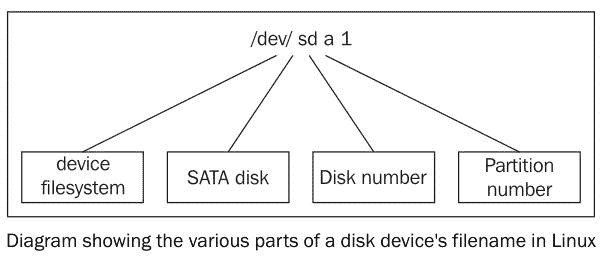

# 七、备份

在本章中，我们将介绍以下食谱:

*   用`tar`存档
*   用`cpio`存档
*   用`gzip`压缩数据
*   用`zip`存档和压缩
*   借助`pbzip2`加快归档速度
*   使用压缩创建文件系统
*   使用`rsync`备份快照
*   差异档案
*   使用`fsarchiver`创建整个磁盘映像

# 介绍

没有人关心备份，直到他们需要它们，没有人做备份，除非被迫。因此，备份需要自动化。随着磁盘驱动器技术的进步，添加新驱动器或使用云进行备份比备份到磁带驱动器更简单。即使使用便宜的驱动器或云存储，也应该压缩备份数据，以减少存储需求和传输时间。数据在存储到云上之前应该加密。数据通常在加密前被存档和压缩。许多标准的加密程序可以通过 shell 脚本实现自动化。本章的方法描述了创建和维护文件或文件夹档案、压缩格式和加密技术。

# 用 tar 存档

`tar`命令被写入归档文件。它最初被设计用来在磁带上存储数据，因此得名**磁带存档**。Tar 允许您将多个文件和目录组合成一个文件，同时保留文件属性，如所有者和权限。由`tar`命令创建的文件通常被称为 **tarball** 。这些食谱描述了用`tar`创建档案。

# 准备好

默认情况下，`tar`命令会出现在所有类似 Unix 的操作系统中。它有一个简单的语法，并以可移植的文件格式创建档案。它支持许多调整其行为的论点。

# 怎么做...

`tar`命令创建、更新、检查和打开档案。

1.  要使用 tar 创建归档文件，请执行以下操作:

```sh
        $ tar -cf output.tar [SOURCES]  

```

`c`选项创建一个新的档案，`f`选项告诉 tar 用于档案的文件名。f 选项后面必须跟一个文件名:

```sh
        $ tar -cf archive.tar file1 file2 file3 folder1 ..  

```

2.  `-t`选项列出了档案的内容:

```sh
        $ tar -tf archive.tar
 file1
 file2  

```

3.  `-v`或`-vv`标志在输出中包含更多信息。这些特性被称为详细(`v`)和非常详细(`vv`)。`-v`约定对于通过打印到终端来生成报告的命令是通用的。`-v`选项显示更多详细信息，如文件权限、所有者组和修改日期:

```sh
        $ tar -tvf archive.tar 
 -rw-rw-r-- shaan/shaan       0 2013-04-08 21:34 file1
 -rw-rw-r-- shaan/shaan       0 2013-04-08 21:34 file2  

```

The filename must appear immediately after the `-f` and it should be the last option in the argument group. For example, if you want verbose output, you should use the options like this:
`$ tar -cvf output.tar file1 file2 file3 folder1 ..`

# 它是如何工作的...

tar 命令接受文件名或通配符列表，如`*.txt`来指定来源。完成后，`tar`会将源文件归档到命名文件中。

我们不能将数百个文件或文件夹作为命令行参数传递。因此，如果要归档许多文件，使用追加选项(稍后解释)会更安全。

# 还有更多...

让我们浏览一下`tar`命令支持的附加功能。

# 将文件追加到归档中

`-r`选项会将新文件附加到现有档案的末尾:

```sh
    $ tar -rvf original.tar new_file

```

下一个示例创建一个包含一个文本文件的归档:

```sh
    $ echo hello >hello.txt
 $ tar -cf archive.tar hello.txt

```

`-t`选项显示档案中的文件。`-f`选项定义了档案名称:

```sh
    $ tar -tf archive.tar
 hello.txt

```

`-r`选项追加一个文件:

```sh
    $ tar -rf archive.tar world.txt
 $ tar -tf archive.tar
 hello.txt
 world.txt

```

档案现在包含这两个文件。

# 从归档中提取文件和文件夹

`-x`选项将档案的内容提取到当前目录:

```sh
    $ tar -xf archive.tar

```

当使用`-x`时，`tar`命令将档案的内容提取到当前目录。`-C`选项指定不同的目录来接收提取的文件:

```sh
    $ tar -xf archive.tar -C /path/to/extraction_directory

```

该命令将归档文件的内容提取到指定的目录。它提取档案的全部内容。我们可以通过将它们指定为命令参数来提取一些文件:

```sh
    $ tar -xvf file.tar file1 file4

```

前面的命令只提取`file1`和`file4`，它忽略了档案中的其他文件。

# 带有 tar 的标准输入和标准输出

归档时，我们可以指定`stdout`作为输出文件，这样管道中的另一个命令可以将其读取为`stdin`并处理归档。

该技术将通过**安全 Shell** ( **SSH** )连接传输数据，例如:

```sh
    $ tar cvf - files/ | ssh user@example.com "tar xv -C Documents/"

```

在前面的示例中，文件/目录被添加到 tar 档案中，该档案被输出到`stdout`(由`-`表示)并被提取到远程系统上的`Documents`文件夹中。

# 连接两个档案

`-A`选项将合并多个 tar 档案。

给定两个 tarballs，`file1.tar`和`file2.tar`，以下命令将把`file2.tar`的内容合并到`file1.tar`中:

```sh
    $ tar -Af file1.tar file2.tar

```

通过列出内容进行验证:

```sh
    $ tar -tvf file1.tar

```

# 使用时间戳检查更新归档中的文件

追加选项将任何给定的文件追加到归档文件中。如果档案中已经存在一个文件，tar 将追加该文件，并且档案将包含重复的文件。更新选项`-u`仅指定追加比档案中现有文件更新的文件。

```sh
    $ tar -tf archive.tar 
 filea
 fileb
 filec  

```

仅当`filea`自上次添加到`archive.tar`后已被修改时，才追加`filea`，使用以下命令:

```sh
    $ tar -uf archive.tar filea

```

如果档案外的`filea`版本和`archive.tar`内的`filea`版本具有相同的时间戳，则不会发生任何事情。

使用`touch`命令修改文件时间戳，然后再次尝试`tar`命令:

```sh
    $ tar -uvvf archive.tar filea
 -rw-r--r-- slynux/slynux     0 2010-08-14 17:53 filea

```

文件被追加，因为它的时间戳比档案中的新，如`-t`选项所示:

```sh
    $ tar -tf archive.tar 
 -rw-r--r-- slynux/slynux     0 2010-08-14 17:52 filea
 -rw-r--r-- slynux/slynux     0 2010-08-14 17:52 fileb
 -rw-r--r-- slynux/slynux     0 2010-08-14 17:52 filec
 -rw-r--r-- slynux/slynux     0 2010-08-14 17:53 filea

```

请注意，新的`filea`已经附加到`tar`档案中。提取该档案时，tar 将选择最新版本的`filea`。

# 比较归档文件和文件系统中的文件

`-d`标志将档案中的文件与文件系统中的文件进行比较。此功能可用于确定是否需要创建新的归档。

```sh
    $ tar -df archive.tar
 afile: Mod time differs
 afile: Size differs

```

# 从归档中删除文件

`-delete`选项从档案中删除文件:

```sh
    $ tar -f archive.tar --delete file1 file2 ..

```

或者，

```sh
    $ tar --delete --file archive.tar [FILE LIST]

```

下一个示例演示如何删除文件:

```sh
    $ tar -tf archive.tar
 filea
 fileb
 filec
 $ tar --delete --file archive.tar filea
 $ tar -tf archive.tar
 fileb
 filec

```

# 使用 tar 存档进行压缩

默认情况下，`tar`命令存档文件，它不压缩它们。Tar 支持压缩结果存档的选项。压缩可以显著减小文件的大小。Tarballs 通常被压缩为以下格式之一:

*   **gzip 格式**:T0 或`file.tgz`
*   **bzip2 格式** : `file.tar.bz2`
*   **Lempel-Ziv-Markov 格式** : `file.tar.lzma`

不同的`tar`标志用于指定不同的压缩格式:

*   `-j`为 **bunzip2**
*   `-z`为 **gzip**
*   `--lzma`为 **lzma**

可以使用压缩格式，而不必像前面那样明确指定特殊选项。`tar`可以根据输出的扩展名进行压缩，也可以根据输入文件的扩展名进行解压缩。`-a`或- **自动压缩**选项使 tar 根据文件扩展名自动选择压缩算法:

```sh
    $ tar acvf archive.tar.gz filea fileb filec
 filea
 fileb
 filec
 $ tar tf archive.tar.gz 
 filea
 fileb
 filec  

```

# 从归档中排除一组文件

`-exclude [PATTEN]`选项将排除通配符模式匹配的文件存档。

例如，要从归档中排除所有`.txt`文件，请使用以下命令:

```sh
    $ tar -cf arch.tar * --exclude "*.txt"

```

Note that the pattern should be enclosed within quotes to prevent the shell from expanding it.

也可以排除列表文件中提供的带有`-X`标志的文件列表，如下所示:

```sh
    $ cat list
 filea
 fileb

 $ tar -cf arch.tar * -X list

```

现在将`filea`和`fileb`排除在存档之外。

# 不包括版本控制目录

tarballs 的一个用途是分发源代码。许多源代码都是使用版本控制系统维护的，比如 subversion、Git、mercurial 和 CVS(参考上一章)。版本控制下的代码目录通常包含特殊目录，如`.svn`或`.git`。这些由版本控制应用管理，除了开发人员之外，对任何人都没有用。因此，应该将它们从分发给用户的源代码的目标中删除。

为了在存档时排除版本控制相关文件和目录，请将`--exclude-vcs`选项与`tar`一起使用。考虑这个例子:

```sh
    $ tar --exclude-vcs -czvvf source_code.tar.gz eye_of_gnome_svn

```

# 打印总字节数

`-totals`选项将打印复制到档案的总字节数。请注意，这是实际数据的字节数。如果包含压缩选项，文件大小将小于存档的字节数。

```sh
    $ tar -cf arc.tar * --exclude "*.txt" --totals
 Total bytes written: 20480 (20KiB, 12MiB/s)

```

# 请参见

*   本章中的*用 gzip* 方法压缩数据解释了`gzip`命令

# 用 cpio 存档

`cpio`应用是另一种类似于`tar`的归档格式。它用于将文件和目录存储在具有权限和所有权等属性的归档中。`cpio`格式用于包含内核映像的 Linux 内核的 RPM 包档案(用于`distros`如 Fedora、`initramfs`文件等。本食谱将给出`cpio`的简单例子。

# 怎么做...

`cpio`应用通过`stdin`接受输入文件名，并将档案写入`stdout`。我们必须将`stdout`重定向到一个文件以保存`cpio`输出:

1.  创建测试文件:

```sh
        $ touch file1 file2 file3

```

2.  存档测试文件:

```sh
        $ ls file* | cpio -ov > archive.cpio

```

3.  在`cpio`档案中列出文件:

```sh
        $ cpio -it < archive.cpio

```

4.  从`cpio`档案中提取文件:

```sh
        $ cpio -id < archive.cpio

```

# 它是如何工作的...

对于存档命令，选项如下:

*   `-o`:指定输出
*   `-v`:用于打印归档文件列表

Using `cpio`, we can also archive using files as absolute paths. `/usr/``somedir` is an absolute path as it contains the full path starting from root (`/`).
A relative path will not start with `/` but it starts the path from the current directory. For example, `test/file` means that there is a directory named `test` and `file` is inside the `test` directory.
While extracting, `cpio` extracts to the absolute path itself. However, in the case of `tar`, it removes the `/` in the absolute path and converts it to a relative path.

命令中列出给定`cpio`档案中所有文件的选项如下:

*   `-i`用于指定输入
*   `-t`为上市

在提取命令中，`-o`代表提取，`cpio`在不提示的情况下覆盖文件。`-d`选项告诉`cpio`根据需要创建新目录。

# 用 gzip 压缩数据

**gzip** 应用是 GNU/Linux 平台中常见的压缩格式。`gzip`、`gunzip`、`zcat`程序都处理`gzip`压缩。这些实用程序仅压缩/解压缩单个文件或数据流。他们不能直接归档目录和多个文件。幸运的是，`gzip`可以搭配焦油和`cpio`使用。

# 怎么做...

`gzip`将压缩一个文件，`gunzip`将解压回原始文件:

1.  用`gzip`压缩文件:

```sh
        $ gzip filename
 $ ls
 filename.gz

```

2.  提取一个`gzip`压缩文件:

```sh
        $ gunzip filename.gz
 $ ls
 filename

```

3.  要列出压缩文件的属性，请使用以下命令:

```sh
        $ gzip -l test.txt.gz
 compressed        uncompressed  ratio uncompressed_name
 35                   6 -33.3% test.txt

```

4.  `gzip`命令可以从`stdin`读取文件，并将压缩文件写入`stdout`。

从`stdin`读取数据，并将压缩后的数据输出到`stdout`:

```sh
         $ cat file | gzip -c > file.gz

```

`-c`选项用于指定`stdout`的输出。

gzip `-c`选项适用于`cpio`:

```sh
        $ ls * | cpio -o | gzip -c > cpiooutput.gz
 $ zcat cpiooutput.gz | cpio -it

```

5.  我们可以使用`--fast`或`--best`选项分别为`gzip`指定低压缩比和高压缩比。

# 还有更多...

`gzip`命令经常与其他命令一起使用，并具有指定压缩比的高级选项。

# 带 tarball 的 Gzip

gzipped tarball 是使用 gzip 压缩的 tar 存档。我们可以用两种方法来制造这种油球:

*   第一种方法如下:

```sh
        $ tar -czvvf archive.tar.gz [FILES]

```

或者，可以使用以下命令:

```sh
        $ tar -cavvf archive.tar.gz [FILES]

```

`-z`选项指定`gzip`压缩，`-a`选项指定压缩格式应根据扩展名确定。

*   第二种方法如下:

首先，创建一个目标球:

```sh
        $ tar -cvvf archive.tar [FILES]

```

然后，压缩油球:

```sh
        $ gzip archive.tar

```

如果许多文件(几百个)要归档在一个 tarball 中，并且需要压缩，我们使用第二种方法，做一些更改。在命令行上定义许多文件的问题在于，它只能接受有限数量的文件作为参数。为了解决这个问题，我们使用追加选项(`-r`)通过循环逐个添加文件来创建`tar`文件，如下所示:

```sh
FILE_LIST="file1  file2 file3  file4  file5" 
for f in $FILE_LIST;
  do
  tar -rvf archive.tar $f
done
gzip archive.tar

```

以下命令将提取一个 gzipped tarball:

```sh
    $ tar -xavvf archive.tar.gz -C extract_directory

```

在前面的命令中，`-a`选项用于检测压缩格式。

# zcat -读取 gzipped 文件而不解压缩

`zcat`命令将未压缩的数据从`.gz`文件转储到`stdout`，而不重新创建原始文件。`.gz`文件保持不变。

```sh
    $ ls
 test.gz

 $ zcat test.gz
 A test file
 # file test contains a line "A test file"

 $ ls
 test.gz

```

# 压缩比

我们可以指定压缩比，范围为 1 到 9，其中:

*   1 是最低的，但最快
*   9 是最好的，但最慢

您可以指定该范围内的任意比率，如下所示:

```sh
      $ gzip -5 test.img

```

默认情况下，`gzip`使用`-6`值，以一定速度为代价，支持更好的压缩。

# 使用 bzip2

`bzip2`在功能和句法上与`gzip`相似。不同的是`bzip2`比`gzip`提供更好的压缩和更慢的运行。

要使用`bzip2`压缩文件，请使用如下命令:

```sh
      $ bzip2 filename

```

提取 bzipped 文件，如下所示:

```sh
      $ bunzip2 filename.bz2

```

压缩和提取 tar.bz2 文件的方法类似于前面讨论的 tar.bz2:

```sh
      $ tar -xjvf archive.tar.bz2

```

这里`-j`指定以`bzip2`格式压缩档案。

# 使用 lzma

`lzma`压缩比`gzip`和`bzip2`提供更好的压缩比。

要使用`lzma`压缩文件，请使用如下命令:

```sh
    $ lzma filename

```

要提取`lzma`文件，请使用以下命令:

```sh
    $ unlzma filename.lzma

```

可以使用`-lzma`选项压缩一个 tarball:

```sh
    $ tar -cvvf --lzma archive.tar.lzma [FILES]

```

或者，这可以用于:

```sh
    $ tar -cavvf archive.tar.lzma [FILES]

```

要将通过`lzma`压缩创建的目标球提取到指定目录，请使用以下命令:

```sh
    $ tar -xvvf --lzma archive.tar.lzma -C extract_directory

```

在前面的命令中，`-x`用于提取。`--lzma`指定使用`lzma`对结果文件进行解压缩。

或者，使用以下方法:

```sh
    $ tar -xavvf archive.tar.lzma -C extract_directory

```

# 请参见

*   本章中的*焦油存档*配方解释了`tar`命令

# 使用 zip 存档和压缩

ZIP 是一种流行的压缩存档格式，可在 Linux、Mac 和 Windows 上使用。它不像 Linux 上的`gzip`或`bzip2`那样常用，但在向其他平台分发数据时很有用。

# 怎么做...

1.  以下语法创建了一个 zip 存档:

```sh
        $ zip archive_name.zip file1 file2 file3...

```

考虑这个例子:

```sh
        $ zip file.zip file

```

这里将产生`file.zip`文件。

2.  `-r`标志将递归归档文件夹:

```sh
        $ zip -r archive.zip folder1 folder2

```

3.  `unzip`命令将从压缩文件中提取文件和文件夹:

```sh
        $ unzip file.zip

```

解压缩命令在不删除归档文件的情况下提取内容(与`unlzma`或`gunzip`不同)。

4.  `-u`标志用更新的文件更新档案中的文件:

```sh
 $ zip file.zip -u newfile 

```

5.  `-d`标志从压缩档案中删除一个或多个文件:

```sh
 $ zip -d arc.zip file.txt 

```

6.  要解压缩的`-l`标志列出了档案中的文件:

```sh
 $ unzip -l archive.zip 

```

# 它是如何工作的...

虽然与我们已经讨论过的大多数归档和压缩工具相似，`zip`与`lzma`、`gzip`或`bzip2`不同，归档后不会删除源文件。虽然`zip`与`tar`类似，但它同时执行归档和压缩，而`tar`本身不执行压缩。

# 使用 pbzip2 加快归档速度

大多数现代计算机至少有两个中央处理器内核。这几乎和两个真正的 CPU 做你的工作是一样的。然而，仅仅拥有一个多核 CPU 并不意味着程序会运行得更快；重要的是，该计划旨在利用多核优势。

到目前为止，所介绍的压缩命令仅使用一个中央处理器。`pbzip2`、`plzip`、`pigz`和`lrzip`命令是多线程的，可以使用多个内核，因此减少了压缩文件的总时间。

大多数发行版都没有安装这些，但是可以通过 apt-get 或 yum 添加到您的系统中。

# 准备好

`pbzip2`通常不会预装在大多数发行版中，你必须使用你的包管理器来安装它:

```sh
    sudo apt-get install pbzip2

```

# 怎么做...

1.  `pbzip2`命令将压缩单个文件:

```sh
        pbzip2 myfile.tar

```

`pbzip2`检测系统上的内核数量并将`myfile.tar`压缩至`myfile.tar.bz2`。

2.  为了压缩和归档多个文件或目录，我们结合使用`pbzip2`和`tar`，如下所示:

```sh
 tar cf sav.tar.bz2 --use-compress-prog=pbzip2 dir

```

或者，这可以用于:

```sh
        tar -c directory_to_compress/ | pbzip2 -c > myfile.tar.bz2

```

3.  提取一个`pbzip2`压缩文件如下:

`-d`标志将解压缩文件:

```sh
        pbzip2 -d myfile.tar.bz2

```

焦油档案可以使用管道进行解压缩和提取:

```sh
        pbzip2 -dc myfile.tar.bz2 | tar x

```

# 它是如何工作的...

`pbzip2`应用使用与`bzip2`相同的压缩算法，但是它使用线程库`pthreads`同时压缩单独的数据块。线程对用户来说是透明的，但是提供了更快的压缩。

像`gzip`或`bzip2`一样，`pbzip2`不创建档案。它只适用于单个文件。为了压缩多个文件和目录，我们将其与`tar`或`cpio`结合使用。

# 还有更多...

对于`pbzip2`，我们还可以使用其他有用的选项:

# 手动指定中央处理器的数量

`-p`选项指定要使用的 CPU 内核数量。如果自动检测失败或您需要空闲内核用于其他作业，这将非常有用:

```sh
    pbzip2 -p4 myfile.tar

```

这将告诉`pbzip2`使用 4 个 CPU。

# 指定压缩比

从`-1`到`-9`的选项指定了最快和最佳的压缩比，其中 **1** 是最快的，而 **9** 是最佳的压缩比

# 使用压缩创建文件系统

`squashfs`程序创建一个只读的、高度压缩的文件系统。`squashfs`程序可以将 2 到 3 GB 的数据压缩成 700 MB 的文件。Linux LiveCD(或 LiveUSB)发行版是使用`squashfs`构建的。这些光盘利用只读压缩文件系统，将根文件系统保存在压缩文件中。压缩文件可以环回安装，以加载一个完整的 Linux 环境。当需要文件时，它们被解压缩并加载到内存中，运行，然后释放内存。

当你需要一个压缩的档案和对文件的随机访问时`squashfs`程序是有用的。完全解压缩大型压缩归档文件需要很长时间。环回安装的归档文件提供了快速的文件访问，因为只有归档文件的请求部分被解压缩。

# 准备好

所有现代 Linux 发行版都支持挂载`squashfs`文件系统。但是，创建`squashfs`文件需要`squashfs-tools`，可以使用包管理器安装:

```sh
    $ sudo apt-get install squashfs-tools

```

或者，这可以用于:

```sh
    $ yum install squashfs-tools

```

# 怎么做...

1.  使用`mksquashfs`命令添加源目录和文件，创建`squashfs`文件:

```sh
        $ mksquashfs SOURCES compressedfs.squashfs

```

源可以是通配符、文件或文件夹路径。

考虑这个例子:

```sh
        $ sudo mksquashfs /etc test.squashfs
 Parallel mksquashfs: Using 2 processors
 Creating 4.0 filesystem on test.squashfs, block size 131072.
 [=======================================] 1867/1867 100%  

```

More details will be printed on the terminal. The output is stripped to save space.

2.  要将`squashfs`文件挂载到挂载点，请使用环回挂载，如下所示:

```sh
        # mkdir /mnt/squash
 # mount -o loop compressedfs.squashfs /mnt/squash

```

您可以在`/mnt/squashfs`访问内容。

# 还有更多...

通过指定附加参数，可以自定义`squashfs`文件系统。

# 创建 squashfs 文件时排除文件

`-e`标志将排除文件和文件夹:

```sh
    $ sudo mksquashfs /etc test.squashfs -e /etc/passwd /etc/shadow

```

`-e`选项从`squashfs`文件系统中排除`/etc/` `passwd and` `/etc/` `shadow`文件。

`-ef`选项读取包含要排除的文件列表的文件:

```sh
    $ cat excludelist
 /etc/passwd
 /etc/shadow

 $ sudo mksquashfs /etc test.squashfs -ef excludelist

```

如果我们想在排除列表中支持通配符，请使用`-wildcard`作为参数。

# 使用 rsync 备份快照

备份数据是需要定期进行的工作。除了本地备份之外，我们可能还需要将数据备份到远程位置或从远程位置备份数据。`rsync`命令将文件和目录从一个位置同步到另一个位置，同时最大限度地减少传输时间。`rsync`相对于`cp`命令的优势在于`rsync`比较修改日期，只会复制更新的文件，`rsync`支持跨远程机器的数据传输，`rsync`支持压缩和加密。

# 怎么做...

1.  要将源目录复制到目标目录，请使用以下命令:

```sh
        $ rsync -av source_path destination_path

```

考虑这个例子:

```sh
        $ rsync -av /home/slynux/data 
        slynux@192.168.0.6:/home/backups/data

```

在前面的命令中:

*   `-a`代表存档
*   `-v`(详细)打印标准输出的详细信息或进度

前面的命令将以递归方式将所有文件从源路径复制到目标路径。源路径和目标路径可以是远程路径，也可以是本地路径。

2.  要将数据备份到远程服务器或主机，请使用以下命令:

```sh
        $ rsync -av source_dir username@host:PATH

```

要在目的地保持镜像，每隔一段时间运行相同的`rsync`命令。它只会将已更改的文件复制到目标。

3.  要将数据从远程主机恢复到`localhost`，请使用以下命令:

```sh
        $ rsync -av username@host:PATH destination  

```

The `rsync` command uses SSH to connect to the remote machine hence, you should provide the remote machine's address in the `user@host` format, where user is the username and host is the IP address or host name attached to the remote machine. `PATH` is the path on the remote machine from where the data needs to be copied.
Make sure that the OpenSSH server is installed and running on the remote machine. Additionally, to avoid being prompted for a password for the remote machine, refer to the *Password-less auto-login with SSH* recipe in [Chapter 8](08.html), *The Old-Boy Network*.

4.  在传输过程中压缩数据可以显著优化传输速度。`rsync-z`选项`specifies`在传输过程中压缩数据:

```sh
        $ rsync -avz source destination    

```

5.  要将一个目录同步到另一个目录，请使用以下命令:

```sh
        $ rsync -av /home/test/ /home/backups    

```

上述命令将源(`/home/test`)复制到名为“备份”的现有文件夹中。

6.  要将完整目录复制到另一个目录中，请使用以下命令:

```sh
        $ rsync -av /home/test /home/backups  

```

此命令通过创建名为 backups 的目录，将源(`/home/test`)复制到该目录。

For the PATH format, if we use `/` at the end of the source, `rsync` will copy the contents of the end directory specified in the `source_path` to the destination.
If `/` is not present at the end of the source, `rsync` will copy the end directory itself to the destination.
Adding the `-r` option will force `rsync` to copy all the contents of a directory, recursively.

# 它是如何工作的...

`rsync`命令适用于源路径和目标路径，可以是本地路径，也可以是远程路径。两条路径都可以是远程路径。通常，使用 SSH 进行远程连接，以提供安全的双向通信。本地和远程路径如下所示:

*   `/home/user/data`(本地路径)
*   `user@192.168.0.6:/home/backups/data`(远程路径)

`/home/user/data`指定机器中执行`rsync`命令的绝对路径。`user@192.168.0.6:/home/backups/data`在 IP 地址为`192.168.0.6`的机器中指定路径为`/home/backups/data`，以`user`用户身份登录。

# 还有更多...

`rsync`命令支持多个命令行选项来微调其行为。

# 使用 rsync 存档时排除文件

`-exclude`和-exclude-from 选项指定了不应传输的文件:

```sh
    --exclude PATTERN

```

我们可以指定要排除的文件的通配符模式。考虑以下示例:

```sh
$ rsync -avz /home/code/app /mnt/disk/backup/code --exclude "*.o" 

```

该命令不备份`.o`文件。

或者，我们可以通过提供列表文件来指定要排除的文件列表。

使用`--exclude-from FILEPATH`。

# 更新 rsync 备份时删除不存在的文件

默认情况下，`rsync`不会从目标中删除不再存在于源中的文件。`-delete`选项从目标中删除源中不存在的文件:

```sh
    $ rsync -avz SOURCE DESTINATION --delete

```

# 按时间间隔安排备份

您可以创建一个`cron`作业来定期安排备份。

示例如下:

```sh
    $ crontab -ev

```

添加以下一行:

```sh
    0 */10 * * * rsync -avz /home/code user@IP_ADDRESS:/home/backups

```

前面的`crontab`条目计划每 10 小时执行一次`rsync`。

`*/10`是`crontab`语法的小时位置。`/10`指定每 10 小时执行一次备份。如果`*/10`写在分钟位置，每 10 分钟执行一次。

看一下[第 10 章](10.html)*行政调用*中的*带 cron* 配方，了解如何配置`crontab`。

# 差异档案

到目前为止所描述的备份解决方案都是当时存在的文件系统的完整拷贝。当您立即发现问题并需要恢复最新的快照时，此快照非常有用。如果您在创建新快照之前没有意识到问题，并且以前的好数据被当前的坏数据覆盖，则该操作会失败。

文件系统的归档提供了文件更改的历史记录。当您需要返回损坏文件的旧版本时，这很有用。

`rsync`、`tar`和`cpio`可用于制作文件系统的每日快照。然而，每天备份一个完整的文件系统是昂贵的。为一周中的每一天创建单独的快照将需要原始文件系统七倍的空间。

差异备份仅保存自上次完全备份以来更改过的数据。Unix 中的转储/恢复实用程序支持这种存档备份。不幸的是，这些实用程序是围绕磁带驱动器设计的，使用起来并不简单。

查找工具可以与`tar`或`cpio`一起使用来复制这种类型的功能。

# 怎么做...

使用 tar 创建初始完整备份:

```sh
    tar -cvz /backup/full.tgz /home/user

```

使用查找的`-newer`标志确定自创建完整备份以来哪些文件发生了变化，并创建新的归档:

```sh
    tar -czf day-`date +%j`.tgz `find /home/user -newer 
    /backup/full.tgz`

```

# 它是如何工作的...

find 命令生成自创建完整备份`(/backup/full.tgz`以来修改过的所有文件的列表。

日期命令根据儒略日生成文件名。因此，今年的第一次差异备份将是`day-1.tgz`，1 月 2 日的备份将是`day-2.tgz`，以此类推。

随着越来越多的文件从初始完整备份更改，差异归档文件将会越来越大。当差异归档文件变得太大时，请进行新的完整备份。

# 使用 fsarchiver 创建整个磁盘映像

`fsarchiver`应用可以将磁盘分区的内容保存到压缩的归档文件中。与`tar`或`cpio`不同，`fsarchiver`保留扩展文件属性，可以恢复到没有当前文件系统的磁盘。`fsarchiver`应用识别并保留了 Windows 文件属性和 Linux 属性，使其适合迁移安装了 Samba 的分区。

# 准备好

默认情况下，`fsarchiver`应用不会安装在大多数发行版中。您必须使用软件包管理器安装它。更多信息，请访问[http://www.fsarchiver.org/Installation](http://www.fsarchiver.org/Installation)。

# 怎么做...

1.  创建一个`filesystem/partition`的备份。

像这样使用`fsarchiver`的`savefs`选项:

```sh
        fsarchiver savefs backup.fsa /dev/sda1

```

这里`backup.fsa`是最终的备份文件，`/dev/sda1`是要备份的分区

2.  同时备份多个分区。

如前所述使用`savefs`选项，并将分区作为最后一个参数传递给`fsarchiver`:

```sh
        fsarchiver savefs backup.fsa /dev/sda1 /dev/sda2

```

3.  从备份归档中还原分区。

像这样使用`fsarchiver`的`restfs`选项:

```sh
        fsarchiver restfs backup.fsa id=0,dest=/dev/sda1

```

`id=0`表示我们要从档案中挑选第一个分区到指定为`dest=/dev/sda1`的分区。

从备份归档中恢复多个分区。

如前所述，使用`restfs`选项如下:

```sh
      fsarchiver restfs backup.fsa id=0,dest=/dev/sda1    
      id=1,dest=/dev/sdb1

```

这里，我们使用两组`id,dest`参数告诉`fsarchiver`将前两个分区从备份恢复到两个物理分区。

# 它是如何工作的...

像 tar 一样，`fsarchiver`检查文件系统以创建文件列表，然后将这些文件保存在压缩的归档文件中。与仅保存文件信息的 tar 不同，`fsarchiver`也执行文件系统的备份。这使得在新分区上恢复备份变得更加容易，因为不需要重新创建文件系统。

如果你是第一次看到分区的`/dev/sda1`符号，这需要一个解释。`/dev`在 Linux 中保存称为设备文件的特殊文件，指的是一个物理设备。`sda1`中的`sd`指的是 **SATA** 磁盘，下一个字母可以是 a、b、c 等等，后面跟着分区号。

