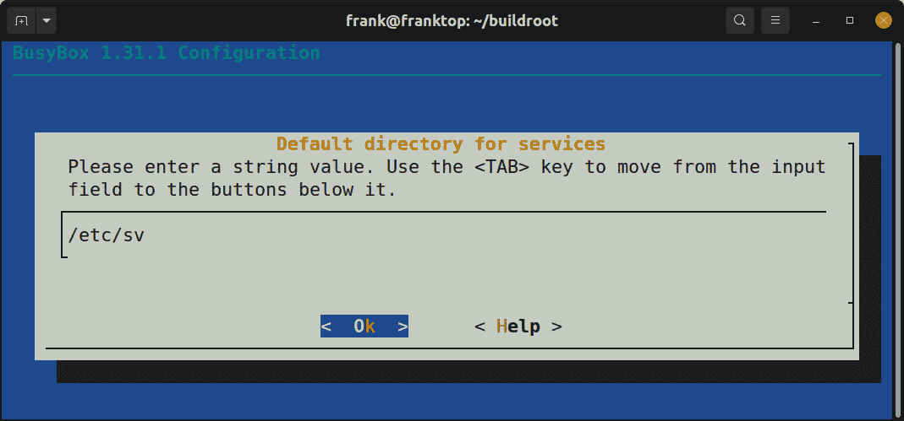

# 十四、从 BusyBox Runit 开始

在上一章中，我们研究了经典的 System V`init`和最先进的`systemd`程序。 我们还谈到了 BusyBox 的最小`init`程序。 现在，我们来看看 BusyBox 对`runit`程序的实现。 BusyBox`runit`在系统 V`init`的简单性和`systemd`的灵活性之间取得了合理的平衡。 出于这个原因，`runit`的完整版在流行的现代 Linux 发行版(如 void)中使用。 虽然`systemd`可能在云中占据主导地位，但对于许多嵌入式 Linux 系统来说，
通常是矫枉过正。 BusyBox`runit`提供了服务监控和专用服务日志记录等高级功能，没有`systemd`的复杂性和开销
。

在本章中，我将向您展示如何将系统划分为单独的 BusyBox`runit`服务，每个服务都有自己的目录和`run`脚本。 接下来，我们将了解如何使用`check`脚本强制某些服务等待其他服务启动。 然后，我们将向服务添加专用日志记录，并了解如何配置日志轮换。 最后，我们以一个服务通过写入命名管道向另一个服务发送信号的示例结束。 与 System V`init`不同，BusyBox`runit`服务是并行启动的，而不是顺序启动，这可以显著加快启动速度。 您对`init`计划的选择会对您的产品的行为和用户体验产生明显的影响。

在本章中，我们将介绍以下主题：

*   获取 BusyBox`runit`
*   创建服务目录和文件
*   服务监管
*   取决于其他服务
*   专用服务日志记录
*   发信号通知服务

# 技术要求

要按照示例操作，请确保您具备以下条件：

*   一种基于 Linux 的主机系统
*   适用于 Linux 的蚀刻器
*   一种 microSD 卡读卡器和卡
*   USB 转 TTL 3.3V 串行电缆
*   覆盆子派 4
*   一种 5V 3A USB-C 电源

您应该已经为[*第 6 章*](06.html#_idTextAnchor164)，*选择构建系统*安装了 Buildroot 的 2020.02.9 LTS 版本。 如果没有，请参考*Buildroot 用户手册*([https://buildroot.org/downloads/manual/manual.html](https://buildroot.org/downloads/manual/manual.html))的*系统要求*部分，然后再按照[*第 6 章*](06.html#_idTextAnchor164)中的说明在您的 LINUX 主机上安装 Buildroot。

本章的所有代码都可以在本书的 GitHub 存储库的`Chapter14`文件夹中找到：[https://github.com/PacktPublishing/Mastering-Embedded-Linux-Programming-Third-Edition](https://github.com/PacktPublishing/Mastering-Embedded-Linux-Programming-Third-Edition)。

# 获取 BusyBox Runit

要准备本章的系统，我们需要执行以下操作：

1.  导航到为[*第 6 章*](06.html#_idTextAnchor164)、*选择生成系统*：

    ```sh
    $ cd buildroot
    ```

    克隆 Buildroot 的目录
2.  Check to see if `runit` is provided by BusyBox:

    ```sh
    $ grep Runit package/busybox/busybox.config
    # Runit Utilities
    ```

    在撰写本文时，BusyBox`runit`仍然是 Buildroot 2020.02.9LTS 版本中的一个可用选项。 如果在以后的版本中再也找不到 BusyBox`runit`，请恢复到该标记。

3.  Undo any changes and delete any untracked files or directories:

    ```sh
    $ make clean
    $ git checkout .
    $ git clean –-force -d
    ```

    请注意，`git clean --force`将删除 Nova U-Boot 修补程序以及我们在前面练习中添加到 Buildroot 的任何其他文件。

4.  创建名为`busybox-runit`的新分支以捕获您的工作：

    ```sh
    $ git checkout -b busybox-runit
    ```

5.  将 BusyBox`runit`添加到树莓 PI 4 的默认配置：

    ```sh
    $ cd configs
    $ cp raspberrypi4_64_defconfig rpi4_runit_defconfig
    $ cd ..
    $ cp package/busybox/busybox.config \ 
    board/raspberrypi/busybox-runit.config
    $ make rpi4_runit_defconfig
    $ make menuconfig
    ```

6.  From the main menu, drill down into the **Toolchain** | **Toolchain type** submenu and select **External toolchain**:

    

    图 14.1-选择外部工具链

7.  Back out one level and drill down into the **Toolchain** submenu. Select the **Linaro AArch64** toolchain, then back out another level to return to the main menu:

    

    图 14.2-选择 Linaro AArch64 工具链

8.  BusyBox 应该已经被选为`init`系统，但是您可以通过导航到**System Configuration**|**Init System**子菜单并观察到选择了**BusyBox**而不是**systemV**或**systemd**来确认这一点。 从**Init System**子菜单返回到主菜单。
9.  From the main menu, drill down into the **Target packages** | **BusyBox configuration file to use?** text field under **BusyBox**:

    

    图 14.3-选择要使用的 BusyBox 配置文件

10.  Replace the `package/busybox/busybox.config` string value in that text field with `board/raspberrypi/busybox-runit.config`:

    

    图 14.4-要使用的 BusyBox 配置文件？

11.  如果询问是否保存新配置，请退出`menuconfig`的并选择**是**。 默认情况下，Buildroot 将新配置保存到名为`.config`的文件中。
12.  使用 BusyBox 配置的新位置更新`configs/rpi4_runit_defconfig`：

    ```sh
    $ make savedefconfig
    ```

13.  现在让我们开始为`runit`：

    ```sh
    $ make busybox-menuconfig
    ```

    配置 BusyBox
14.  Once inside `busybox-menuconfig`, you should notice a submenu called **Runit Utilities**. Drill down into that submenu and select all of the options on that menu page. The `chpst`, `setuidgid`, `envuidgid`, `envdir`, and `softlimit` utilities are command-line tools that are frequently referenced by service `run` scripts, so it is best to include them all. The `svc` and `svok` utilities are holdovers from `daemontools` so you can choose to opt out of them if you feel so inclined:

    

    图 14.5-Runit 实用程序

15.  从**Runit Utilities**子菜单中，向下钻取到服务的**默认目录**文本字段。
16.  Enter `/etc/sv` in the **Default directory for services** text field:

    

    图 14.6-服务的默认目录

17.  当询问是否保存新配置时，退出`busybox-menuconfig`并选择**是**。 与`menuconfig`选项类似，`busybox-menuconfig`只将新的 BusyBox 配置保存到输出目录中的`.config`文件。 在 Buildroot 的 2020.02.9 LTS 版本中，默认情况下，BusyBox 输出目录为`output/build/busybox-1.31.1`。
18.  将您的更改保存到`board/raspberrypi/busybox-runit.config`：

    ```sh
    $ make busybox-update-config
    ```

19.  BusyBox includes an `inittab` file for its `init` program in Buildroot's `package/busybox` directory. This configuration file instructs BusyBox `init` to start user space by mounting various filesystems and linking file descriptors to `stdin`, `stdout`, and `stderr` device nodes. In order for BusyBox `init` to transfer control to BusyBox `runit`, we need to replace the following lines in `package/busybox/inittab`:

    ```sh
    # now run any rc scripts
    ::sysinit:/etc/init.d/rcS
    ```

    这些行需要替换为它们的 BusyBox`runit`等效行：

    ```sh
    # now switch over to runit
    null::respawn:runsvdir /etc/sv
    ```

20.  We also need to remove the following lines from BusyBox's `inittab`:

    ```sh
    # Stuff to do before rebooting
    ::shutdown:/etc/init.d/rcK
    ```

    删除的`::shutdown`命令不需要替换行，因为 BusyBox`runit`会在重新启动之前自动终止其监控的进程。

现在您有了新的`configs/rpi4_runit_defconfig`和`board/raspberrypi/busybox-runit.config`文件以及修改后的`package/busybox/inittab`文件，您可以使用这些文件在 Raspberry PI 4 的自定义 Linux 映像上启用 BusyBox`runit`。将这三个文件提交到 Git，这样您的工作就不会丢失。

要构建自定义映像，请使用以下命令：

```sh
$ make rpi4_runit_defconfig
$ make
```

构建完成后，会将可引导映像写入`outpimg/sdcard.img`文件。 使用 Etcher 将此图像闪存到 microSD 卡上，将其插入 Raspberry PI 4，然后通电。 系统除了启动之外不会做太多事情，因为`/etc/sv`中还没有服务可供`runsvdir`启动。

要玩 BusyBox`runit`，请将串行电缆连接到您的 Raspberry PI 4 上，然后
以`root`身份登录，不需要密码。 我们没有向此映像添加`connman`，因此输入
`/sbin/ifup -a`以打开以太网接口：

```sh
# /sbin/ifup -a
[  187.076662] bcmgenet: Skipping UMAC reset
[  187.151919] bcmgenet fd580000.genet: configuring instance for external RGMII (no delay)
udhcpc: started, v1.31.1
udhcpc: sending discover
[  188.191465] bcmgenet fd580000.genet eth0: Link is Down
udhcpc: sending discover
[  192.287490] bcmgenet fd580000.genet eth0: Link is Up - 1Gbps/Full - flow control rx/tx
udhcpc: sending discover
udhcpc: sending select for 192.168.1.130
udhcpc: lease of 192.168.1.130 obtained, lease time 86400
deleting routers
adding dns 192.168.1.254
```

我们将在下一节中研究`runit`服务目录的结构和布局。

# 创建服务目录和文件

`runit`是重新实施`daemontools`过程监督工具包。 它是由 Gerrit Pape 创建的，作为 System V`init`和其他 Unix`init`方案的替代品。 在撰写本文时，`runit`上最好的两个信息来源是 Pape 的网站([http://smarden.org/runit/](http://smarden.org/runit/))和 void Linux 的在线文档。

BusyBox 的`runit`实现与标准`runit`的主要区别在于
自文档化。 例如，`sv --help`没有提到`sv`实用程序的`start`和`check`选项，实际上 BusyBox 的实现支持这些选项。 BusyBox`runit`的源代码可以在 BusyBox 的`output/build/busybox-1.31.1/runit`目录中找到。 您还可以在[https://git.busybox.net/busybox/tree/runit](https://git.busybox.net/busybox/tree/runit)在线浏览 BusyBox`runit`源代码的最新版本。 如果 BusyBox 的`runit`实现中有任何错误或功能缺失，您可以通过修补 Buildroot 的`busybox`包来修复或添加它们。

Arch Linux 发行版支持同时使用 BusyBox`runit`和`systemd`进行简单的进程监控。 你可以在 Arch Linux Wiki 上阅读更多关于如何做到这一点的内容。 BusyBox 默认为`init`，并且没有记录将 BusyBox`init`替换为`runit`的步骤。 出于这些原因，我不会将 BusyBox`init`替换为`runit`，而是将向您展示如何使用 BusyBox`runit`向 BusyBox`init`添加服务监管。

## \\t0 抯服务布局目录

以下是`runit`上的 void Linux 发行版原始文档(现已弃用)中的引语：

服务目录只需要一个文件，即名为`run`的可执行文件，该文件预计会`exec`前台的一个进程。

除了必需的`run`脚本外，`runit`服务目录还可以包含`finish`脚本、`check`脚本和`conf`文件。 `finish`脚本在服务关闭或进程停止时运行。 `run`脚本创建一个`conf`文件，以便在`run`内部使用任何环境变量之前对其进行设置。

与 BusyBox`init``/etc/init.d`目录一样，`/etc/sv`目录通常是存储`runit`服务的位置。 以下是一个简单的嵌入式 Linux 系统的 BusyBox`init`脚本列表：

```sh
$ ls output/target/etc/init.d
S01syslogd  S02sysctl   S21haveged  S45connman  S50sshd  rcS
S02klogd    S20urandom  S30dbus     S49ntp      rcK
```

Buildroot 将这些 BusyBox`init`脚本作为各种守护进程的包的一部分提供。 对于 BusyBox`runit`，我们必须自己生成这些启动脚本。

下面是同一系统的 BusyBox`runit`服务列表：

```sh
$ ls -D output/target/etc/sv
bluetoothd  dbus   haveged  ntpd  syslogd
connmand    dcron  klogd    sshd  watchdog
```

每个 BusyBox`runit`服务都有自己的目录，其中包含一个可执行的`run`脚本。 也在目标映像上的 BusyBox`init`脚本将不会在启动时运行，因为我们从`inittab`中删除了`::sysinit:/etc/init.d/rcS`。 与`init`脚本不同，要使用`runit`，`run`脚本需要在前台运行，而不是在后台运行。

Void Linux 发行版是`runit`服务文件的宝库。 以下是`sshd`的 void`run`脚本：

```sh
#!/bin/sh
# Will generate host keys if they don't already exist
ssh-keygen -A >/dev/null 2>&1
[ -r conf ] && . ./conf
exec /usr/sbin/sshd -D $OPTS 2>&1
```

`runsvdir`实用程序启动并监控在
`/etc/sv`目录下定义的服务集合。 因此，需要将`sshd`的`run`脚本安装为
`/etc/sv/sshd/run`，以便`runsvdir`可以在启动时找到它。 它还必须是可执行的，否则 BusyBox`runit`将无法启动它。

将`/etc/sv/sshd/run`的内容与 Buildroot 的
`/etc/init.d/S50sshd`的摘录进行对比：

```sh
start() {
      # Create any missing keys
      /usr/bin/ssh-keygen -A
      printf "Starting sshd: "
      /usr/sbin/sshd
      touch /var/lock/sshd
      echo "OK"
}
```

`sshd`默认在后台运行。 `-D`选项强制`sshd`在前台运行。 `runit`希望您在`run`脚本中以`exec`作为前台命令的前缀。 `exec`命令替换当前进程中的当前程序。 最终结果是，从`/etc/sv/sshd`开始的`./run`进程在没有分叉的情况下变成了`/usr/sbin/sshd -D`进程：

```sh
# ps aux | grep "[s]shd"
  201 root     runsv sshd
  209 root     /usr/sbin/sshd -D
```

请注意，`sshd``run`脚本为`$OPTS`环境变量提供了一个`conf`文件。 如果`/etc/sv/sshd`内不存在`conf`文件，则`$OPTS`未定义且为空，在这种情况下正好可以。 与大多数`runit`服务一样，在系统关闭或重新启动之前，`sshd`不需要`finish`脚本来释放任何资源。

## 服务配置

Buildroot 在其包中包含的`init`脚本是 BusyBox`init`脚本。 这些`init`脚本需要移植到 BusyBox`runit`，并安装到`output/target/etc/sv`下的不同目录。 与单独修补每个包相比，我发现将所有服务文件捆绑在 Buildroot 树外部的`rootfs`覆盖包或伞包中更容易。 Buildroot 通过`BR2_EXTERNAL``make`变量启用树外定制，该变量指向包含定制的目录。

将 Buildroot 放入`br2-external`树的最常见方法是将其作为子模块嵌入到 Git 存储库的顶层：

```sh
$ cat .gitmodules 
[submodule "buildroot"]
     path = buildroot
     url = git://git.buildroot.net/buildroot
     ignore = dirty
     branch = 15a05e6d5a875759d217d61b3c7b31ec87ea4eb5
```

将 Buildroot 作为子模块嵌入可以简化对您添加到 Buildroot 的任何包或应用到 Buildroot 的补丁的维护。 该子模块被固定在一个标记上，以便在故意升级 Buildroot 之前，任何树外定制都保持稳定。 请注意，上面`buildroot`子模块的提交散列被固定到该 Buildroot LTS 版本的`2020.02.9`标记上：

```sh
$ cd buildroot
$ git show --summary
commit 15a05e6d5a875759d217d61b3c7b31ec87ea4eb5 (HEAD -> busybox-runit, tag: 2020.02.9)
Author: Peter Korsgaard <peter@korsgaard.com>
Date:   Sun Dec 27 17:55:12 2020 +0100
    Update for 2020.02.9

    Signed-off-by: Peter Korsgaard <peter@korsgaard.com>
```

当`buildroot`是父`BR2_EXTERNAL`目录的子目录时，要运行`make`，我们需要传递一些额外的参数：

```sh
$ make -C $(pwd)/buildroot BR2_EXTERNAL=$(pwd) O=$(pwd)/output
```

以下是 Buildroot 为`br2-external`树推荐的目录结构：

```sh
+-- board/
|   +-- <company>/
|       +-- <boardname>/
|           +-- linux.config
|           +-- busybox.config
|           +-- <other configuration files>
|           +-- post_build.sh
|           +-- post_image.sh
|           +-- rootfs_overlay/
|           |   +-- etc/
|           |   +-- <some file>
|           +-- patches/
|               +-- foo/
|               |   +-- <some patch>
|               +-- libbar/
|                   +-- <some other patches>
+-- configs/
|   +-- <boardname>_defconfig
+-- package/
|   +-- <company>/
|       +-- package1/
|       |    +-- Config.in
|       |    +-- package1.mk
|       +-- package2/
|           +-- Config.in
|           +-- package2.mk
+-- Config.in
+-- external.mk
+-- external.desc
```

请注意，您在上一节中创建的自定义`rpi4_runit_defconfig`和`busybox-runit.config`
文件将插入到此树中。 根据 Buildroot 的指导方针，这两个配置应该是特定于电路板的文件。 `<boardname>_defconfig`以正在配置映像的电路板的名称作为前缀。 `busybox.config`放在相应的`board/<company>/<boardname>`目录中。 还要注意，定制 BusyBox`inittab`所在的`rootfs_overlay/etc`目录也是特定于主板的。

由于 BusyBox`runit`的所有服务配置文件都驻留在`/etc/sv`中，因此将它们全部提交到特定于电路板的`rootfs`覆盖似乎是合理的。 根据我的经验，这个解决方案很快就会变得过于僵化。 通常需要为同一电路板配置多个映像。 例如，消费设备可以具有单独的开发、生产和制造图像。 每个镜像都包含不同的服务，因此不同镜像之间的配置需要不同。 出于这些原因，服务配置最好在软件包级别进行，而不是在主板级别。 我使用树外伞包
(每种图像类型一个包)来配置 BusyBox`runit`的服务。

在顶层，`br2-external`树必须包含`external.desc`、`external.mk`和`Config.in`文件。 `external.desc`文件包含一些描述`br2-external`树的基本元数据：

```sh
$ cat external.desc
name: ACME
desc: Acme's external Buildroot tree
```

Buildroot 将`BR2_EXTERNAL_<name>_PATH`变量设置为`br2-external`树的绝对路径，以便变量可以在 Kconfig 和 Make 文件中引用。 `desc`字段是作为`BR2_EXTERNAL_<name>_DESC`变量提供的可选描述。 根据本`external.desc`将`<name>`替换为`ACME`。 `external.mk`文件通常只包含引用在`external.desc`中定义的`BR2_EXTERNAL_<name>_PATH`变量的一行：

```sh
$ cat external.mk 
include $(sort $(wildcard $(BR2_EXTERNAL_ACME_PATH)/package/acme/*/*.mk))
```

第`include`行告诉 Buildroot 在哪里搜索外部包`.mk`文件。 外部软件包的相应`Config.in`文件的位置在`br2-external`树的顶级`Config.in`文件中定义：

```sh
$ cat Config.in 
source "$BR2_EXTERNAL_ACME_PATH/package/acme/development/Config.in"
source "$BR2_EXTERNAL_ACME_PATH/package/acme/manufacturing/Config.in"
source "$BR2_EXTERNAL_ACME_PATH/package/acme/production/Config.in"
```

Buildroot 读取`br2-external`树的`Config.in`文件，并将其中包含的包配方添加到顶级配置菜单。 让我们用`development`、`manufacturing`和`production`伞包填充 Buildroot 的`br2-external`树结构的其余部分：

```sh
├── configs
│   ├── supergizmo_development_defconfig
│   ├── supergizmo_manufacturing_defconfig
│   └── supergizmo_production_defconfig
└── package
    └── acme
        ├── development
        │   ├── Config.in
        │   ├── development.mk
        │   ├── haveged_run
        │   ├── inittab
        │   ├── ntpd.etc.conf
        │   ├── sshd_config
        │   ├── sshd_run
        │   └── user-tables.txt
        ├── manufacturing
        │   ├── apply-squash-update
        │   ├── Config.in
        │   ├── haveged_run
        │   ├── inittab
        │   ├── manufacturing.mk
        │   ├── mfg-profile
        │   ├── sshd_config
        │   ├── sshd_run
        │   ├── test-button
        │   ├── test-fan
        │   ├── test-gps
        │   ├── test-led
        │   └── user-tables.txt
        └── production
            ├── Config.in
            ├── dcron-root
            ├── download-apply-update
            ├── inittab
            ├── ntpd.etc.conf
            ├── ota.acme.systems.crt
            ├── production.mk
            └── user-tables.txt
```

如果将此目录树与 Buildroot 的前一个目录树进行比较，可以看到`<boardname>`已替换为`supergizmo`，`<company>`已替换为`acme`。 您可以将伞包看作是覆盖在一些常见基本图像之上的图像。 这样，所有三个映像都可以共享相同的 U-Boot、内核和驱动程序，因此它们的更改仅适用于用户空间。

考虑需要在设备的开发映像中包含哪些包才能使其有效。 至少，开发人员希望能够`ssh`进入设备，使用`sudo`执行命令，并使用`vim`编辑板载文件。 此外，他们希望能够使用`strace`、`gdb`和`perf`等工具跟踪、调试和分析他们的程序。 出于安全原因，这些软件都不属于设备的生产映像。

`Config.in`对于`development`伞形软件包，选择仅应部署到内部开发人员的试生产硬件的软件包：

```sh
$ cat package/acme/development/Config.in 
config BR2_PACKAGE_DEVELOPMENT
     bool "development"
     select BR2_PACKAGE_HAVEGED
     select BR2_PACKAGE_OPENSSH
     select BR2_PACKAGE_SUDO
     select BR2_PACKAGE_TMUX
     select BR2_PACKAGE_VIM
     select BR2_PACKAGE_STRACE
     select BR2_PACKAGE_LINUX_TOOLS_PERF
     select BR2_PACKAGE_GDB
     select BR2_PACKAGE_GDB_SERVER
     select BR2_PACKAGE_GDB_DEBUGGER
     select BR2_PACKAGE_GDB_TUI
     help
       The development image overlay for Acme's SuperGizmo.
```

在软件包构建过程的安装步骤期间，不同的服务脚本和配置文件将写入`output/target`目录。 以下是`package/acme/development/development.mk`的相关摘录：

```sh
define DEVELOPMENT_INSTALL_TARGET_CMDS
     $(INSTALL) -D -m 0644 $(@D)/inittab $(TARGET_DIR)/etc/inittab
     $(INSTALL) -D -m 0755 $(@D)/haveged_run $(TARGET_DIR)/etc/sv/haveged/run
     $(INSTALL) -D -m 0755 $(@D)/sshd_run $(TARGET_DIR)/etc/sv/sshd/run
     $(INSTALL) -D -m 0644 $(@D)/sshd_config $(TARGET_DIR)/etc/ssh/sshd_config
endef
```

Buildroot`<package>.mk`文件包含`<package>_BUILD_CMDS`和`<package>_INSTALL_TARGET_CMDS`节。 这个伞形软件包被命名为`development`，因此它的安装宏被定义为`DEVELOPMENT_INSTALL_TARGET_CMDS`。 前缀`<package>`需要与包的`Config.in`文件的`config BR2_<package>`行中的`<package>`后缀匹配，否则宏名称将导致包生成错误。

`haveged/run`和`sshd/run`脚本安装到目标系统上的`/etc/sv`目录。 启动`runsvdir`所需的自定义`inittab`安装到目标上的`/etc`。 除非这些文件安装在具有预期权限的正确位置，否则 BusyBox`runit`无法启动`haveged`或`sshd`服务。

`haveged`是一个软件随机数生成器，旨在缓解 Linux`/dev/random`设备中的低熵条件。 低熵条件可能会阻止`sshd`启动，因为 SSH 协议严重依赖随机数。 一些较新的 SoC 可能还没有对其硬件随机数生成器提供内核支持。 如果不在这些系统上运行`haveged`，`sshd`可能需要几分钟时间才能在引导后开始接受连接。

在 BusyBox`runit`下运行`haveged`非常简单：

```sh
$ cat package/acme/development/haveged_run 
#!/bin/sh
exec /usr/sbin/haveged -w 1024 -r 0 -F
```

`production`和`manufacturing`伞包将不同的包和服务集合叠加到图像上。 `production`映像包括用于下载和应用软件更新的工具。 `manufacturing`映像包括工厂技术人员用于配置和测试硬件的工具。 BusyBox`runit`也非常适合这两种用例。

`Config.in`对于，`production`伞式软件包选择定期无线软件更新所需的软件包：

```sh
$ cat package/acme/production/Config.in 
config BR2_PACKAGE_PRODUCTION
     bool "production"
     select BR2_PACKAGE_DCRON
     select BR2_PACKAGE_LIBCURL
     select BR2_PACKAGE_LIBCURL_CURL
     select BR2_PACKAGE_LIBCURL_VERBOSE
     select BR2_PACKAGE_JQ
     help
       The production image overlay for Acme's SuperGizmo.
```

在开发和制造环境中，强制 OTA 更新通常是不可取的，因此这些软件包被排除在这些映像之外。 `production`映像包括一个`download-apply-update`脚本，该脚本使用`curl`向 OTA 服务器查询最新可用的软件更新。 板载还包括公共 SSL 证书，因此`curl`可以验证 OTA 服务器的真实性。 `dcron`守护进程被配置为每 10 到 20 分钟运行一次`download-apply-update`，并带有一些噪音，以避免蜂拥而至的人群。 如果有较新的更新可用，则脚本将下载映像，验证它，并在重新引导之前将其应用于 microSD 卡。 以下是`package/acme/production/production.mk`的相关摘录：

```sh
define PRODUCTION_INSTALL_TARGET_CMDS
     $(INSTALL) -D -m 0644 $(@D)/inittab $(TARGET_DIR)/etc/inittab
     $(INSTALL) -D -m 0644 $(@D)/dcron-root $(TARGET_DIR)/etc/cron.d/root
     $(INSTALL) -D -m 0775 $(@D)/download-apply-update $(TARGET_DIR)/usr/sbin/download-apply-update
     $(INSTALL) -D -m 0644 $(@D)/ota.acme.com.crt $(TARGET_DIR)/etc/ssl/certs/ota.acme.com.crt
     $(INSTALL) -D -m 0644 $(@D)/ntpd.etc.conf $(TARGET_DIR)/etc/ntp.conf
endef
```

将`production`映像`cd`构建到`br2-external`树的根，并发出以下命令：

```sh
$ make clean
$ make supergizmo_production_defconfig
$ make
```

为 Acme SuperGizmo 构建`development`和`manufacturing`映像的步骤仅在选择`defconfig`时有所不同。 除了最后一行之外，这三种定义配置几乎相同，根据所选图像的不同，该行可以是`BR2_PACKAGE_DEVELOPMENT=y`、`BR2_PACKAGE_PRODUCTION=y`或`BR2_PACKAGE_MANUFACTURING=y`。 这三个伞包是相互排斥的，因此不要选择多个伞包包含在同一图像中，否则可能会遇到意想不到的结果。

# 服务监督

一旦我们在`/etc/sv`下使用`run`脚本创建了服务目录，并确保 BusyBox`init`启动`runsvdir`，BusyBox`runit`将处理所有剩余的工作。 这包括启动、停止、监视和重新启动其控制下的所有服务。 `runsvdir`实用程序为每个服务目录启动`runsv`进程，如果终止则重新启动`runsv`进程。 因为`run`脚本在前台运行各自的后台进程，所以`runsv`希望`run`阻塞，以便在`run`退出时，`runsv`会自动重新启动它。

系统启动期间需要服务自动重新启动，因为`run`脚本可能会崩溃。 在 BusyBox`runit`中尤其如此，在 BusyBox`runit`中，服务几乎同时启动，而不是一个接一个地启动。 例如，当依赖服务或基本系统资源(如 GPIO 或设备驱动程序)尚不可用时，服务可能无法启动。 在下一节中，我将向您展示如何表达服务之间的依赖关系，以便您的系统启动序列保持确定性。

下面是在我们的简单嵌入式 Linux 系统上运行的`runsv`进程：

```sh
# ps aux | grep "[r]unsv"
  177 root     runsvdir /etc/sv
  179 root     runsv ntpd
  180 root     runsv haveged
  181 root     runsv syslogd
  182 root     runsv dcron
  185 root     runsv dbus
  187 root     runsv bluetoothd
  192 root     runsv watchdog
  195 root     runsv connmand
  199 root     runsv sshd
  202 root     runsv klogd
```

请注意，`inittab`中的`runsvdir /etc/sv`命令直到 PID 177 才会执行。 PID 为 1 的进程是`/sbin/init`，它只是一个指向`/bin/busybox`的符号链接。 PID 2 到 176(未显示)都是内核线程和系统服务，因此它们的命令在由`ps`显示时会出现在方括号内。 方括号表示进程没有与之关联的实际命令行。 由于`connmand`和`bluetoothd`都依赖于 D-BUS 启动，因此在 D-BUS 启动和运行之前，`runsv`可能已多次重新启动任一服务：

```sh
# pstree -a
init
  |-getty -L 115200 ttyS0
  |-hciattach /dev/ttyAMA0 bcm43xx 921600 flow - 60:81:f9:b0:8a:02
  |-runsvdir /etc/sv
  |   |-runsv ntpd
  |   |   `-ntpd -u ntp -c /etc/ntp.conf -U 60 -g -n
  |   |       `-{ntpd}
  |   |-runsv haveged
  |   |   `-haveged -w 1024 -r 0 -F
  |   |-runsv syslogd
  |   |   `-syslogd -n -O /var/data/log/messages -b 99 -s 1000
  |   |-runsv dcron
  |   |-runsv dbus
  |   |   `-dbus-daemon --system --nofork --nopidfile --syslog-only
  |   |-runsv bluetoothd
  |   |   `-bluetoothd -E --noplugin=* -n
  |   |-runsv watchdog
  |   |   `-watchdog -T 10 -F /dev/watchdog
  |   |-runsv connmand
  |   |   `-connmand -n
  |   |-runsv sshd
  |   |   `-sshd -D
  |   `-runsv klogd
  |       `-klogd -n
  `-wpa_supplicant -u
```

有些服务需要连接到互联网才能启动。 由于 DHCP 的异步特性，这可能会使服务启动延迟数秒。 由于`connmand`管理该系统上的所有网络接口，因此这些服务又依赖于`connmand`。 如果设备的 IP 地址因网络间切换或续订 DHCP 租约而更改，则可能需要重新启动许多相同的服务。 幸运的是，BusyBox`runit`提供了一种从命令行轻松重启服务的方法。

## 控制服务

BusyBox`runit`提供了用于管理和检查服务的`sv`命令行工具：

```sh
# sv --help
BusyBox v1.31.1 () multi-call binary.
Usage: sv [-v] [-w SEC] CMD SERVICE_DIR...
Control services monitored by runsv supervisor.
Commands (only first character is enough):
status: query service status
up: if service isn't running, start it. If service stops, restart it
once: like 'up', but if service stops, don't restart it
down: send TERM and CONT signals. If ./run exits, start ./finish
     if it exists. After it stops, don't restart service
exit: send TERM and CONT signals to service and log service. If they exit,
     runsv exits too
pause, cont, hup, alarm, interrupt, quit, 1, 2, term, kill: send
STOP, CONT, HUP, ALRM, INT, QUIT, USR1, USR2, TERM, KILL signal to service
```

`sv`的帮助消息解释了`up`、`once`、`down`和`exit`命令的作用。 它还说明了`pause`、`cont`、`hup`、`alarm`、`interrupt`、`quit`、`1`、`2`、`term`和`kill`命令如何直接映射到 POSIX 信号。 请注意，每个命令的第一个字符足以调用它。

让我们使用`ntpd`作为目标服务来试验各种`sv`命令。 您的状态时间与我的不同，具体取决于您在两个命令之间等待的时间：

1.  Restart the `ntpd` service:

    ```sh
    # sv t /etc/sv/ntpd
    # sv s /etc/sv/ntpd
    run: /etc/sv/ntpd: (pid 1669) 6s
    ```

    `sv t`命令重新启动服务，`sv s`命令获取其状态。
    `t`是`term`的缩写，因此`sv t`在重新启动服务之前发送服务`TERM`信号。 状态消息显示`ntpd`在重启后已经运行了 6 秒。

2.  Now let's see what happens to the status when we use `sv d` to stop the
    `ntpd` service:

    ```sh
    # sv d /etc/sv/ntpd
    # sv s /etc/sv/ntpd
    down: /etc/sv/ntpd: 7s, normally up
    ```

    这一次，状态消息显示`ntpd`自停止以来已停机 7 秒。

3.  Start the `ntpd` service back up:

    ```sh
    # sv u /etc/sv/ntpd
    # sv s /etc/sv/ntpd
    run: /etc/sv/ntpd: (pid 2756) 5s
    ```

    STATUS 消息现在显示`ntpd`自启动以来已经运行了 5 秒。 请注意，PID 比以前更高，因为系统自`ntpd`重新启动以来已经运行了一段时间。

4.  Do a one-off start of `ntpd`:

    ```sh
    # sv o /etc/sv/ntpd
    # sv s /etc/sv/ntpd
    run: /etc/sv/ntpd: (pid 3795) 3s, want down
    ```

    `sv o`命令类似于`sv u`，不同之处在于目标服务停止后不会再次重新启动。 您可以通过使用`sv k /etc/sv/ntpd`向`ntpd`服务发送`KILL`信号并观察到`ntpd`服务关闭并保持关闭来确认这一点。

下面是我们介绍的`sv`命令的详细形式：

```sh
# sv term /etc/sv/ntpd
# sv status /etc/sv/ntpd
# sv down /etc/sv/ntpd
# sv up /etc/sv/ntpd
# sv once /etc/sv/ntpd
```

如果服务需要条件错误或信号处理，您可以在`finish`脚本中定义该逻辑。 Service`finish`脚本是可选的，只要`run`退出就会执行。 `finish`脚本有两个参数：`$1`(来自`run`的退出代码)和`$2`(由`waitpid`系统调用确定的退出状态的最低有效字节)。 当`run`正常退出时，`run`的退出代码为 0，当`run`异常退出时，退出代码为-1。 当`run`正常退出时，状态字节为 0，当`run`被信号终止时，状态字节为 0。 如果`runsv`无法启动`run`，则退出代码为 1，状态字节为 0。

检测到 IP 地址更改的服务可以通过向`sv t`发出命令来重新启动网络服务。 这与`ifplugd`执行的操作类似，不同之处在于`ifplugd`在以太网链路状态而不是 IP 地址更改时触发。 这样的服务可以像 shell 脚本一样简单，它由持续轮询所有网络接口的单个`while`循环组成。 您还可以从`run`或`finish`脚本发出`sv`命令，作为服务之间通信的一种方式。 在下一节中，我将向您展示如何做到这一点。

# 取决于其他服务

我提到了像`connmand`和`bluetoothd`这样的一些服务需要 D-Bus。 D-BUS 是支持发布-订阅进程间通信的消息系统总线。 D-BUS 的 Buildroot 软件包提供了一个系统`dbus-daemon`和一个参考`libdbus`库。 `libdbus`库实现了低级 D-Bus C API，但是其他语言(如 Python)存在到`libdbus`的高级绑定。 一些语言还提供了完全不依赖于`libdbus`的 D-BUS 协议的替代实现。 D-BUS 服务(如`connmand`和`bluetoothd`)期望系统`dbus-daemon`在它们可以启动之前已经在运行。

## 启动依赖项

官方的`runit`文档建议使用`sv start`来表示对`runit`控制下的其他服务的依赖关系。 为确保 D-BUS 在`connmand`开始之前可用，您应该相应地定义您的`/etc/sv/connmand/run`：

```sh
#!/bin/sh
/bin/sv start /etc/sv/dbus > /dev/null || exit 1
exec /usr/sbin/connmand -n
```

`sv start /etc/sv/dbus`如果系统`dbus-daemon`尚未运行，则尝试启动系统`dbus-daemon`。 `sv start`命令与`sv up`类似，不同之处在于它将等待`-w`参数或`SVWAIT`环境变量指定的秒数来启动服务。 未定义`-w`参数或`SVWAIT`环境变量时，默认的最长等待时间为 7 秒。 如果服务已经启动，则返回退出代码 0 表示成功。 退出代码 1 表示故障，导致`/etc/sv/connmand/run`在没有启动`connmand`的情况下提前退出。 监视`connmand`的`runsv`进程将继续尝试启动该服务，直到最终成功。

下面是我们对应的`/etc/sv/dbus/run`，它是我从 void 派生的：

```sh
#!/bin/sh
[ ! -d /var/run/dbus ] && /bin/install -m755 -g 22 -o 22 -d /var/run/dbus
[ -d /tmp/dbus ] || /bin/mkdir -p /tmp/dbus
exec /bin/dbus-daemon --system --nofork --nopidfile --syslog-only
```

与 Buildroot 的`/etc/init.d/S30dbus`中的以下摘录形成对比：

```sh
# Create needed directories.
[ -d /var/run/dbus ] || mkdir -p /var/run/dbus
[ -d /var/lock/subsys ] || mkdir -p /var/lock/subsys
[ -d /tmp/dbus ] || mkdir -p /tmp/dbus
RETVAL = 0
start() {
    printf "Starting system message bus: "
    dbus-uuidgen --ensure
    dbus-daemon --system
    RETVAL=$?
    echo "done"
    [ $RETVAL -eq 0 ] && touch /var/lock/subsys/dbus-daemon
}
stop() {
    printf "Stopping system message bus: "
    ## we don't want to kill all the per-user $processname, we want
    ## to use the pid file *only*; because we use the fake nonexistent 
    ## program name "$servicename" that should be safe-ish
    killall dbus-daemon
    RETVAL=$?
    echo "done"
    if [ $RETVAL -eq 0 ]; then
        rm -f /var/lock/subsys/dbus-daemon
        rm -f /var/run/messagebus.pid
    fi
}
```

请注意，Buildroot 版本的 D-BUS 服务脚本要复杂得多。 因为`runit`在前台运行`dbus-daemon`，所以不需要`lock`或`pid`文件以及与这些文件相关联的所有仪式。 您可能会认为前面的`stop()`函数是一个好的`finish`脚本，除了在`runit`的情况下，没有要删除的`dbus-daemon`或者要删除的`pid`或`lock`文件。 服务`finish`脚本在`runit`中是可选的，因此它们应该仅保留用于有意义的工作。

## 自定义启动依赖项

如果`/etc/sv/dbus`目录中存在`check`，`sv`会运行此脚本来检查服务是否可用。 如果`check`以 0 退出，则认为服务可用。 `check`机制使您能够表达除正在运行的进程之外的服务可用的附加后置条件。 例如，仅仅因为`connmand`已经启动并不意味着一定已经建立了到互联网的连接。 `check`脚本确保一个服务在其他服务可以启动之前完成其预期的操作。

要验证 Wi-Fi 是否打开，您可以定义以下`check`：

```sh
#!/bin/sh
WIFI_STATE=$(cat /sys/class/net/wlan0/operstate)
"$WIFI_STATE" = "up" || exit 1
exit 0
```

通过将前面的脚本安装到`/etc/sv/connmand/check`，您需要 Wi-Fi 才能启动`connmand`服务。 这样，当您发出`sv start /etc/sv/connmand`时，该命令仅在 Wi-Fi 接口打开时返回退出代码 0，即使`connmand`正在运行。

您可以使用`sv check`命令在不启动服务的情况下执行`check`脚本。 与`sv start`类似，如果服务目录中存在`check`，`sv`会运行此脚本来确定服务是否可用。 如果`check`以 0 退出，则认为服务可用。 `sv`将等待最多 7 秒，直到`check`返回退出代码 0。 与`sv start`不同，如果`check`返回非零退出代码，`sv`不会尝试启动服务。

## 把这一切放在一起

我们已经看到了`sv start`和`check`机制如何使我们能够表达服务之间的启动依赖关系。 将这些功能与`finish`脚本相结合使我们能够构建进程监督树。 例如，充当父进程的服务可以在停止时调用`sv down`来关闭其依赖子服务。 我认为，正是这种高级定制让 BusyBox`runit`变得如此强大。 您只需使用简单、定义良好的 shell 脚本就可以将系统调整为您想要的行为方式。 要了解有关监督树的更多信息，我推荐有关 Erlang 容错的文献。

# 专用服务日志记录

专用服务记录器只记录来自单个守护进程的输出。 专用日志记录很好，因为不同服务的诊断数据分布在单独的日志文件中。 集中式系统记录器(如`syslogd`)生成的单一日志文件通常很难清理。 这两种形式的日志记录都有各自的用途：专用日志记录在可读性方面表现出色，而集中式日志记录提供了上下文。 您的服务可以每个都有自己的专用记录器，并且仍然写入`syslog`，因此您可以两者都不牺牲。

## 它是如何工作的？

因为服务`run`脚本在前台运行，所以向服务添加专用记录器只涉及将标准输出从服务的`run`重定向到日志文件。 通过在目标服务目录中创建一个`log`子目录，并在其中包含另一个`run`脚本，可以启用专用服务日志记录。 这个额外的`run`用于服务的记录器，而不是服务本身。 当该`log`目录存在时，打开从服务目录中的`run`进程的输出到`log`目录中的`run`进程的输入的管道。

以下是`sshd`的可能服务目录布局：

```sh
# tree etc/sv/sshd
etc/sv/sshd
|-- finish
|-- log
|   `-- run
`-- run
```

更准确地说，当 BusyBox`runit``runsv`进程遇到此服务目录布局时，它除了在必要时启动`sshd/run`和`sshd/finish`之外，还会执行几项操作：

1.  创建管道
2.  将标准出站从`run`和`finish`重定向到管道
3.  切换到`log`目录
4.  开始`log/run`
5.  将`log/run`的标准输入重定向为从管道读取

`runsv`启动和监控`sshd/log/run`，就像它启动和监控`sshd/run`一样。 一旦为`sshd`添加了一个记录器，您会注意到`sv d /etc/sv/sshd`只停止`sshd`。 要停止记录器，除非将该命令添加到`/etc/sv/sshd/finish`脚本，否则必须输入`sv d /etc/sv/sshd/log`。

## 向服务添加专用日志记录

BusyBox`runit`提供了一个`svlogd`日志记录守护进程，以在您的`log/run`脚本中使用：

```sh
# svlogd --help
BusyBox v1.31.1 () multi-call binary.
Usage: svlogd [-tttv] [-r C] [-R CHARS] [-l MATCHLEN] [-b BUFLEN] DIR...
Read log data from stdin and write to rotated log files in DIRs
-r C       Replace non-printable characters with C
-R CHARS   Also replace CHARS with C (default _)
-t         Timestamp with @tai64n
-tt        Timestamp with yyyy-mm-dd_hh:mm:ss.sssss
-ttt       Timestamp with yyyy-mm-ddThh:mm:ss.sssss
-v         Verbose
```

请注意，`svlogd`需要一个或多个`DIR`输出目录路径作为参数。

要向现有 BusyBox`runit`服务添加专用日志记录，请执行以下操作：

1.  在服务目录内创建`log`子目录。
2.  在`log`子目录中创建一个`run`脚本。
3.  使该`run`脚本可执行。
4.  使用`exec`在`run`内部运行`svlogd`。

以下是 void 的`/etc/sv/sshd/log/run`脚本：

```sh
#!/bin/sh
[ -d /var/log/sshd ] || mkdir -p /var/log/sshd
exec chpst -u root:adm svlogd -t /var/log/sshd
```

由于`svlogd`会将`sshd`日志文件写入`/var/log/sshd`，因此如果该目录尚不存在，我们首先需要创建该目录。 要使`sshd`日志文件持久存在，您可能需要修改`inittab`，以便在启动`runsvdir`之前，在引导时将`/var`挂载到可写闪存分区。 `exec`的`chpst -u root:adm`部分确保`svlogd`以`root`用户和`adm`组特权和权限运行。

`-t`选项为写入日志文件的每一行添加一个 TAI64N 格式的时间戳前缀。 虽然 TAI64N 时间戳是精确的，但它们不是最易读的。 `svlogd`提供的其他时间戳选项是`-tt`和`-ttt`。 一些守护进程编写自己的时间戳以进行标准输出。 要避免编写带有令人困惑的双时间戳的行，只需从`log/run``svlogd`命令中省略`-t`或其任何变体即可。

您可能会想要向`klogd`和`syslogd`服务添加专用记录器。 抵制住这种诱惑。 `klogd`和`syslogd`是系统范围的日志记录守护进程，
它们都非常擅长它们的工作。 除非
记录器出现故障并且您需要对其进行调试，否则记录该记录器的操作实际上是没有意义的。 如果您开发的服务同时记录到`stdout`和`syslog`，请确保从`syslog`消息文本中排除时间戳。 `syslog`协议包括一个`timestamp`字段，用于嵌入时间戳。

每个专用记录器都在其自己的单独进程中运行。 在设计嵌入式系统时，需要考虑支持这些额外的记录器进程所需的额外开销。 如果您打算使用 BusyBox`runit`在资源受限的系统上监控大量服务，请选择要向哪些服务添加专用日志记录，否则响应能力可能会受到影响。

## 原木轮换

`svlogd`使用默认的 10 个日志文件自动旋转日志文件，每个日志文件的大小不超过 100 万字节。 回想一下，这些轮换的日志文件被写出到一个或多个`DIR`输出目录中，路径作为参数传递到`svlogd`。 当然，这些轮换设置是可配置的，但在我开始之前，让我解释一下日志轮换是如何工作的。

让我们假设`svlogd`不知何故知道名为`NUM`和`SIZE`的两个值。 `NUM`是要保留的日志文件数。 `SIZE`是日志文件的最大大小。 `svlogd`将日志消息追加到名为`current`的日志文件中。 当`current`的大小达到`SIZE`字节时，则`svlogd`旋转`current`。

要旋转`current`文件，`svlogd`将执行以下操作：

1.  关闭`current`日志文件。
2.  将`current`设为只读。
3.  将`current`重命名为`@<timestamp>.s`。
4.  创建新的`current`日志文件并开始写入。
5.  统计除`current`之外的现有日志文件数。
6.  如果`count`等于或超过`NUM`，则删除最旧的日志文件。

`<timestamp>`用于重命名要轮换的`current`日志文件是文件轮换时的时间戳，而不是创建时的时间戳。

现在观察这里对`SIZE`、`NUM`和`PATTERN`的描述：

```sh
# svlogd --help 
BusyBox v1.31.1 () multi-call binary.
[Usage not shown]
DIR/config file modifies behavior:
sSIZE - when to rotate logs (default 1000000, 0 disables)
nNUM - number of files to retain
!PROG - process rotated log with PROG
+,-PATTERN - (de)select line for logging
E,ePATTERN - (de)select line for stderr
```

这些设置从`DIR/config`文件(如果存在)中读取。 请注意，`SIZE`为 0 将禁用日志轮换，并且不是默认设置。 下面是一个`DIR/config`文件，它使`svlogd`最多保留 100 个日志文件，每个文件的大小最大为 9999,999 字节，总共大约有 1 GB 的循环日志写入到一个输出目录中：

```sh
s9999999
n100
```

如果将多个`DIR`输出目录传递给`svlogd`，则`svlogd`会记录所有这些目录。 为什么要将相同的消息记录到多个目录？ 答案是您*不*将相同的消息记录到多个目录。 由于每个输出目录都有自己的`config`文件，因此您可以使用模式匹配来选择要将哪些消息记录到哪个输出目录。

假设长度为`N`的`PATTERN`，如果`DIR/config`中的一行以`+`、`-`、`E`或`e`开头，则`svlogd`会相应地将每个日志消息的前`N`字符与`PATTERN`进行匹配。 `+`和`-`前缀适用于`current`，`E`和`e`前缀适用于标准误差。 `+PATTERN`选择并`-PATTERN`过滤出要记录到`current`的匹配行。 `EPATTERN`选择并`ePATTERN`过滤出匹配的行，以提醒标准错误。

# 发信号通知服务

在前面的*启动依赖关系*部分中，我展示了如何使用`sv`命令行工具控制服务。 稍后，我演示了如何在`run`和`finish`脚本中使用`sv start`和`sv down`命令在服务之间通信。 您可能已经猜到，当执行`sv`命令时，`runsv`正在向它监控的`run`进程发送 POSIX 信号。 但您可能不知道的是，`sv`工具通过命名管道控制其目标`runsv`进程。 命名管道`supervise/control`和可选的`log/supervise/control`被打开，以便其他进程可以向`runsv`发送命令。 使用`sv`命令发送服务信号很容易，但如果您愿意，可以完全绕过`sv`，直接将控制字符写入`control`管道。

没有专用日志记录的服务的运行时目录布局如下所示：

```sh
# tree /etc/sv/syslogd
/etc/sv/syslogd
|-- run
`-- supervise
    |-- control
    |-- lock
    |-- ok
    |-- pid
    |-- stat
    `-- status
```

`/etc/sv/syslogd`下的`control`文件是服务的命名管道。 `pid`和`stat`文件包含服务的实时 PID 和状态值(`run`或`down`)。 `supervise`子目录及其所有内容由`runsv syslogd`在系统启动时创建和填充。 如果服务包含专用记录器，`runsv`也会为其生成一个`supervise`子目录。

以下控制字符(`t`、`d`、`u`和`o`)直接映射到我们已经遇到的简短形式的`sv`命令(`term`、`down`、`up`和`once`)：

*   `t``term`：在重新启动服务之前向进程发送`TERM`信号。
*   `d``down`：向进程发送`TERM`信号，后跟`CONT`信号，并且不重新启动它。
*   `u``up`：启动服务，如果进程退出，则重新启动它。
*   `o``once`：尝试启动服务的时间最长为 7 秒，之后不会重新启动。
*   `1`：向进程发送`USR1`信号。
*   `2`：向进程发送`USR2`信号。

控制字符`1`和`2`特别重要，因为它们对应于用户定义的信号。 如何响应`USR1`和`USR2`信号由接收端的服务决定。 如果您是负责扩展服务的开发人员，则可以通过实现信号处理程序来实现。 两个用户定义的信号可能看起来不太好用，但是如果您将这些不同的事件与写入配置文件的更新结合起来，您可以实现很多功能。 用户定义的信号还有一个额外的优点，即不需要像`STOP`、`TERM`和`KILL`信号那样停止或终止正在运行的进程。

# 摘要

这一章深入探讨了一个鲜为人知的`init`系统，我觉得这个系统在很大程度上被低估了。 与`systemd`类似，BusyBox`runit`可以在引导和运行时强制服务之间的复杂依赖关系。 它只是以一种简单得多的方式做到了，我认为它比`systemd`更像 Unix。 此外，在启动时间方面，没有什么比 BusyBox`runit`更好的了。 如果您已经使用 Buildroot 作为构建系统，那么我强烈建议您考虑将 BusyBox`runit`用于您设备的`init`系统。

在我们的探险中，我们覆盖了很多地方。 首先，您了解了如何将 BusyBox`runit`安装到您的设备上，并使用 Buildroot 启动它。 然后，我向您展示了如何使用树外伞包以不同的方式组装和配置服务。 接下来，在深入研究服务依赖关系和表达它们的方式之前，我们先对实时流程监督树进行了实验。 之后，我向您展示了如何添加专用记录器和配置服务的日志轮换。 最后，我描述了服务如何写入现有的命名管道，以此作为彼此发送信号的一种方式。

在下一章中，我将把注意力转向 Linux 系统的电源管理，目的是展示如何降低能耗。 如果您正在设计使用电池供电的设备，这将特别有用。

# 进一步阅读

以下是本章中提到的各种资源：

*   *Buildroot 用户手册*：[http://nightly.buildroot.org/manual.html#customize](http://nightly.buildroot.org/manual.html#customize)
*   *机组文档*，作者：Gerrit Pape：[http://smarden.org/runit/](http://smarden.org/runit/)
*   *作废手册*：[https://docs.voidlinux.org/config/services](https://docs.voidlinux.org/config/services)
*   *Tristan Sloghter、Fred Hebert 和 Evan Vigil-McClanahan 采用 Erlang*：[https://adoptingerlang.org/docs/development/supervision_trees](https://adoptingerlang.org/docs/development/supervision_trees)