# 一、安装 Linux

近年来，Linux 作为服务器和桌面计算平台的首选操作系统的采用显著增加。 从企业级服务器和大规模云基础设施到个人工作站和小型家用电器，Linux 已经成为广泛应用的一个无处不在的平台。

Linux 的流行(也许现在比以往任何时候都更流行)使日益增长的系统管理员和开发人员社区所急需的管理技能得到了关注。 在这本书中，我们采用一种实用的方法来实现 Linux 管理的基本要素，考虑到现代系统管理员、DevOps 或开发人员。

在第一章中，我们将引导您完成 Linux 的安装过程，可以在物理硬件(裸机)上安装，也可以使用**虚拟机**(**VM**)。 我们将通过几个案例研究进一步介绍如何根据功能需求选择 Linux 发行版。 在此过程中，我们将通过一些配置 GNOME 和 KDE 的实际例子向您介绍 Linux 图形用户界面。 最后，我们构建了一个适合我们日常计算需求的 Linux 工作站。

以下是本章的主题:

*   Linux 操作系统
*   Linux 发行版
*   选择正确的 Linux 发行版
*   安装 Linux -基础
*   **Windows 子系统 for Linux**(**WSL**)
*   安装 Linux 图形用户界面
*   设置和使用 Linux 工作站

# 技术要求

本章将使用以下平台和技术:

*   Linux 发行版:Ubuntu Server, Ubuntu Desktop, CentOS
*   Linux 包管理器:DEB、RPM
*   虚拟机 hypervisor: Oracle VM VirtualBox, VMware Workstation
*   虚拟机主机平台:Windows、macOS X
*   Bash**命令行界面**(**CLI**)
*   [https://github.com/](https://github.com/)

# Linux 操作系统

Linux 是一个相对现代的操作系统，由 Linus Torvalds 在 1991 年创建，他当时是一个来自赫尔辛基的芬兰计算机科学学生。 Linux 最初是作为一个自由的、开放的源代码平台发布的，禁止商业性的再发布，最终在 1992 年采用了 GNU**General Public Licensing**(**GPL**)模型。 这一举措在其被开发者社区和商业企业广泛采用方面发挥了重要作用。

值得注意的是，自由软件基金会社区特别提到 Linux 操作系统(或发行版)，因为**GNU/Linux**到强调 GNU 或自由软件的重要性。

Linux 最初是为基于 Intel x86 处理器的计算机架构设计的，后来被移植到各种各样的平台上，成为目前使用的最流行的操作系统之一。

Linux 的起源可以被认为是它强大的前身 Unix 的开放源代码替代品。 该系统是由 Ken Thompson 和 Dennis Ritchie 于 1969 年在 AT&T 贝尔实验室研究中心开发的商业级操作系统。

# Linux 发行版

一个 Linux 操作系统通常被称为**发行版**。 Linux 发行版(或**发行版**)是操作系统的安装包(通常是一个 ISO 映像)，该操作系统在 Linux 内核上安装了一系列工具、库和附加软件包。

内核是计算机硬件和进程之间的核心接口，控制两者之间的通信并尽可能有效地管理底层资源。

与 Linux 内核捆绑在一起的软件集合通常包括引导加载程序、shell、包管理系统、图形用户界面以及各种软件实用程序和应用。

下面的图是一个通用 Linux 发行版架构的简化图:


图 1.1 -通用 Linux 体系结构的简化视图

目前有数百种 Linux 发行版可用。 最受欢迎的是**Debian**,**Fedora**,**openSUSE**,**Arch Linux**,和【显示】Slackware,与其他 Linux 发行版【病人】或基于来自他们。 其中一些发行版被分为商业平台和社区支持的平台。

Linux 发行版之间的一个关键区别是它们使用的包管理系统和相关的 Linux 包格式。 我们将在后面的章节中详细讨论这个话题。 目前，重点是根据我们的需要选择正确的 Linux 发行版。

# 选择正确的 Linux 发行版

在选择基于各种功能需求的 Linux 发行版时，涉及到许多方面。 全面的分析将远远超出本章的范围。 然而，考虑以下几个要点可能有助于做出正确的决定:

*   平台:在服务器、桌面或嵌入式平台之间的选择可能是选择 Linux 发行版的首要决定之一。 Linux 服务器平台和嵌入式系统通常配置了特定应用(如网络、HTTP、FTP、SSH 和电子邮件)所需的核心操作系统服务和基本组件，主要是为了性能和优化考虑。 另一方面，Linux 桌面工作站加载(或预加载)了相对大量的软件包，包括一个图形用户界面，以获得更友好的用户体验。 一些 Linux 发行版附带服务器和桌面口味(如 Ubuntu**、**Fedora**,和【显示】openSUSE),但大多数发行版有一个最小的操作系统,需要进行进一步的配置(等【病人】CentOS,和**Debian)。 通常，这样的发行版适合 Linux 服务器平台。 也有专门为桌面系统设计的 Linux 发行版，例如**基本操作系统**，**Pop! _OS**，或**Deepin**。 对于嵌入式系统，我们已经高度优化了 Linux 发行版，如**Raspbian**和**OpenWRT**，以容纳具有有限硬件资源的小型设备。****
***   **基础设施**:今天，我们看到了大量的应用和服务器平台部署，从硬件和本地(本地)数据中心到管理程序、容器和云基础设施。 在将 Linux 发行版与任何这些类型的部署进行权衡时，应该考虑到所涉及的资源和成本。 例如，一个多 cpu、大内存和通常占用空间大的 Linux 实例在云中或托管基础设施的**虚拟专用服务器**(**VPS**)中运行的成本可能更高。 轻量级 Linux 发行版占用的资源更少，而且更容易在具有容器化工作负载和服务的环境中扩展(例如，使用 Kubernetes 和 Docker)。 大多数 Linux 发行版现在都为所有主要的公共云提供商提供了云映像(例如，Amazon AWS、Microsoft Azure 和谷歌计算引擎)。 可以在 Docker Hub([https://hub.docker.com](https://hub.docker.com))上下载用于各种 Linux 发行版的 Docker 容器映像。 有些 Docker 图像比其他的更大(更重)。 例如，**Ubuntu Server**Docker 映像比**Alpine Linux**Docker 映像要大得多，这可能会在选择一个发行版和另一个发行版时造成平衡。 另外，为了解决容器化工作流和服务的相对较新的转变，一些 Linux 发行版提供了其操作系统的精简版或更优化的版本，以支持底层应用基础设施。 例如，Fedora 提供了**Fedora CoreOS**(用于集装箱化工作流)和**Fedora IoT**(用于物联网生态系统)。 CentOS 有**原子**项目，作为一个精益的 CentOS 运行 Docker 容器。*   **性能**:有争议的是，所有的 Linux 发行版都可以在 CPU、GPU、内存和存储方面调整到高性能基准。 性能应该与平台和应用选择密切相关。 电子邮件后端不能在树莓派上表现得很好，而媒体流服务器可以做得很好(带有一些外部存储)。 还应该考虑调优性能的配置工作。 **CentOS**，**Debian**，和**Ubuntu**都带有的服务器和桌面版本。 服务器版本可以很容易地针对特定的应用或服务进行定制，只需将软件包限制为那些对应用至关重要的软件包。 为了进一步提高性能，一些会重新编译一个轻量级的 Linux 发行版(例如，**Gentoo**)，以受益于内核中针对特定子系统(例如，网络堆栈或用户权限)的编译器级优化。 与其他标准一样，基于某些应用或平台性能选择 Linux 发行版是一种平衡行为，大多数时候，普通的 Linux 发行版会表现得非常好。*   **Security**: When considering security, we have to keep in mind that a system is as secure as its weakest link. An insecure application or system component would put the entire system at risk. Therefore, the security of a Linux distribution should be scrutinized in close relation to the related application and platform environment. We can talk about *desktop security* for a Linux distro serving as a desktop workstation, for example, with the user browsing the internet, downloading media, installing various software packages, and running different applications. The safe handling of all these operations (against malware, viruses, and intrusions) would make for a good indicator of how secure a system can be. There are Linux distros that are highly specialized in application security and isolation, well suited for desktop use: **Qubes OS**, **Kali Linux**, **Whonix**, **Tails**, and **Parrot Security OS**. Some of these distributions are developed for penetration testing and security research.

    另一方面，我们可以考虑 Linux 服务器发行版的*服务器安全性*方面。 在这种情况下，使用最新的存储库、包和组件进行定期的操作系统更新将大大提高系统的安全性。 删除未使用的面向网络的服务和配置更严格的防火墙规则是减少可能的攻击面的进一步步骤。 大多数 Linux 发行版都很好地配备了所需的工具和服务，以适应上述要求。 选择与*频繁发行版*和*稳定升级或*【显示】发布周期通常是第一个安全平台的先决条件(例如,**Centos**,【病人】RHEL,**Ubuntu LTS**,或【t16.1】SUSE Linux 企业)。

    *   **可靠性**:如果 Linux 发行版的发布周期很长，并且每个发行版中都添加了相对大量的新代码，那么这些发行版通常不太稳定。 对于这样的发行版，选择一个*稳定的*版本是必要的。 例如，Fedora 有快速的版本，是发展最快的 Linux 平台之一。 然而，我们不应听信谣言，声称 Fedora 或其他类似的快速发展的 Linux 发行版不那么可靠。 别忘了，现在最可靠的 Linux 发行版之一，**Red Hat Enterprise Linux**(**RHEL**)，是从 Fedora 衍生而来的。**

 **选择 Linux 发行版并没有什么神奇的公式。 在大多数情况下，平台(服务器或桌面)的选择结合前面提到的一些数据点和一些个人偏好将决定一个 Linux 发行版。 对于生产级环境，前面列举的大多数标准都变得非常关键，我们选择的 Linux 平台的可用选项将减少到少数经过行业验证的解决方案。 在下一节中，我们将列举一些最流行的 Linux 发行版。

## 常用 Linux 发行版

本节总结了撰写本文时最流行和最常见的 Linux 发行版，重点介绍了它们的包管理器。 这些发行版大多数都是免费的开源平台。 他们的商业等级的变化，如果有的话，被注意到。

### CentOS and RHEL

CentOS 及其衍生产品使用**RPM**作为其包管理器。 CentOS 基于开源的 Fedora 项目。 它适用于服务器和工作站。 RHEL 是 CentOS 的一个商业级版本，旨在成为一个长期支持的稳定平台。

### Debian

Debian 及其大多数衍生物的包管理器是**Debian 包**(**DPKG**)。 Debian 的发布速度比其他 Linux 发行版(如 Linux Mint 或 Ubuntu)慢得多，但它相对更稳定。

### Ubuntu

Ubuntu 使用**高级包工具**(**APT**)和 DKPG 作为包的管理器。 Ubuntu 是最流行的 Linux 发行版之一，每 6 个月发布一次，而更稳定的**长期支持**(**LTS**)每隔一年发布一次。

### Linux Mint

Linux Mint 使用 APT 作为其包管理器。 Linux Mint 建立在 Ubuntu 之上，它最适合桌面使用，比 Ubuntu 的内存使用更少(使用的是肉桂桌面环境，与 Ubuntu 的 GNOME 相比)。 还有一个 Linux Mint 版本直接构建在 Debian 之上，称为**Linux Mint Debian Edition**(**LMDE**)。

### openSUSE

openSUSE 使用**RPM**，**Yet another Setup Tool**(**YaST**)，and**Zypper**作为 package 的管理器。 openSUSE 是一个前沿的 Linux 发行版，既适合桌面环境，也适合服务器环境。 SUSE Linux Enterprise Server 为商用级平台。 在 Ubuntu 出现之前，openSUSE 被认为是最友好的桌面 Linux 发行版之一。

重要提示

在本书中，我们主要关注两个 Linux 发行版，它们广泛用于社区和商业部署:**Ubuntu**和**CentOS**。

下面一节将介绍一些实际操作的用例，在这些用例中，我们根据特定的功能需求选择正确的 Linux 发行版。

## Linux 发行版-一个实用指南

以下用例的灵感来自于现实世界的问题，主要取自作者自己在软件工程领域的经验。 这些场景中的每一个都提出了为这项工作选择正确的 Linux 发行版的挑战。

### 案例研究-开发工作站

这个案例研究是基于以下场景的，从软件开发人员的角度来看:

我是一个后台/前端开发人员，主要用 Java、Node.js、Python 和 Golang 编写，主要使用 IntelliJ 和 VS Code 作为我的主要 IDE。 我的开发环境大量使用 Docker 容器(构建和部署)，我偶尔使用 vm(使用 VirtualBox)在本地部署和测试我的代码。 我需要一个健壮和多功能的开发平台。

#### 功能需求

需求建议使用一个相对强大的日常开发平台，无论是 PC/台式机还是笔记本电脑。 开发人员依赖本地资源来部署和测试代码(例如，Docker 容器和 vm)，如果在运行中，可能经常在脱机(飞行模式)环境中进行。

#### 系统需求

系统将主要使用 Linux 桌面环境和窗口管理器，在**集成开发环境**(**IDE**)和终端窗口之间频繁切换上下文。 IDE、Docker、管理程序(VirtualBox)和工具所需的软件包应该随时可以从开源或商业供应商那里获得，最好总是最新的，并且只需要最小的安装和定制工作。

#### Linux 发行版

这里的选择将是**Ubuntu 桌面长期支持**(**LTS**)平台。 Ubuntu LTS 是相对稳定的，几乎可以在任何硬件平台上运行，而且它的硬件驱动程序大多是最新的。 所需应用和工具的软件包通常是可用的、稳定的，并经常更新。 Ubuntu LTS 是一款企业级、高成本、安全的操作系统，适用于组织和家庭用户。

### 案例研究-安全的 web 服务器

本案例研究基于从 DevOps 工程师的角度提出的以下场景:

我正在寻找一个运行安全的、相对轻量级的企业级 web 服务器的健壮平台。 这个 web 服务器处理 HTTP/SSL 请求，在将请求路由到其他后端 web 服务器、网站和 API 端点之前卸载 SSL。 不需要负载平衡特性。

#### 功能需求

当谈到开源、安全、企业级的 web 服务器时，首选通常是 NGINX、Apache HTTP Server、Node.js、Apache Tomcat 和 Lighttpd。 在不深入选择 web 服务器的细节的情况下，让我们假设我们选择 Apache HTTP 服务器。 它具有最先进的 SSL/TLS 支持，出色的性能，并且相对容易配置。

我们将此 web 服务器部署在 VPS 环境、本地(*本地*)数据中心或公共云中。 部署形式因素可以是 VM 或 Docker 容器。 我们正在寻找一个相对低占用空间的企业级 Linux 平台。

#### Linux 发行版

我们的选择是**CentOS**。 大多数的时候，CentOS 和 Apache HTTP 服务器是完美的匹配。 CentOS 是相对轻量级的，只提供了基本的服务器组件和一个操作系统网络堆栈。 在私有和公共云供应商中，它可以作为 VPS 部署模板广泛使用。 还有 CentOS 原子主机，一个设计用来运行 Docker 容器的 Linux 发行版。 我们的 Apache HTTP 服务器可以作为 Docker 容器运行在 CentOS Atomic 上，因为我们可以水平扩展到多个 web 服务器实例。

### 用例—个人博客

本案例以为基础，从一个软件工程师和博客作者的角度来描述以下场景:

我想创建一个软件工程博客。 我将使用 Ghost 博客平台，运行在 Node.js 之上，MySQL 作为后台数据库。 我正在寻找一个虚拟专用服务器(VPS)解决方案托管的一个主要的云提供商。 我将亲自安装、维护和管理相关平台。 我应该使用哪个 Linux 发行版?

#### 功能需求

我们正在寻找一个自管理的公开托管 VPS 解决方案。 相关的托管成本是一个敏感的问题。 此外，所需软件包的维护应该相对容易。 我们预计会有频繁的更新，包括 Linux 平台本身。

#### Linux 发行版

我们选择的是**Ubuntu Server LTS**。 正如之前强调的，Ubuntu 是一个健壮、安全、企业级的 Linux 发行版。 平台维护和管理工作并不需要太多。 所需的软件包——Node.js、Ghost 和 MySQL——很容易获得，并且维护得很好。 Ubuntu Server 占用的空间相对较小。 我们可以在 Ubuntu 系统的要求下运行博客所需的软件，这样托管成本就会合理。

### 用例-媒体服务器

本案例研究是基于家庭影院迷的视角制作的以下场景:

我有一个相当大的电影(个人 DVD/蓝光备份)、视频、照片和其他媒体的集合，存储在网络附加存储(Network Attached Storage, NAS)上。 NAS 集成了自己的媒体服务器，但流媒体性能较差。 我使用 Plex 作为媒体播放器系统，与 Plex 媒体服务器作为后端。 我应该使用什么 Linux 平台?

#### 功能需求

媒体服务器的关键系统要求是速度(为了获得高质量和流畅的流体验)、安全性和稳定性。 相关软件包和流编解码器经常更新，平台维护任务和升级也比较频繁。 该平台托管在本地 PC 桌面系统上，通常具有大量的内存和计算能力。 媒体直播从 NAS,在**内部局域网**(**局域网),的内容可以通过**【显示】网络文件系统(NFS**)。******

 **#### Linux 发行版

对于一个好的媒体服务器平台来说，**Debian**和**Ubuntu**都是的绝佳选择。 Debian 的*稳定版*被 Linux 社区认为是非常可靠的，尽管它有些过时。 两者都具有先进的网络和安全性，但是在两者之间进行选择的决定性因素是 Plex Media Server 为 Debian 提供了一个 arm 兼容的包。 Ubuntu 的媒体服务器包仅适用于 Intel/AMD 平台。 如果我们拥有一个小因素的、基于 ARM 处理器的设备，Debian 将是我们的选择。 否则，**Ubuntu LTS**也会满足我们的目的。

# 安装 Linux -基础知识

本节将作为一个快速指南，介绍任意 Linux 发行版的基本安装。 对于实际操作的例子和具体的指导方针，我们使用 Ubuntu 和 CentOS。 我们还简要介绍了承载 Linux 安装的不同环境。 混合云基础设施的趋势正在出现，其中混合了本地数据中心和公共云部署，其中 Linux 主机可以是裸金属系统、管理程序、虚拟机或 Docker 容器。

在大多数情况下，相同的原则适用于执行 Linux 安装。 对于 Docker 容器化的 Linux 部署，我们保留单独的一章。

## 如何安装 Linux

下面是 Linux 安装通常需要的基本步骤。

### 步骤 1 -下载

我们首先下载我们选择的 Linux 发行版。 大多数发行版通常在发行版的网站上以 ISO 格式提供。 例如，我们可以下载 Ubuntu Desktop 的[https://ubuntu.com/download/desktop](https://ubuntu.com/download/desktop)，或者 CentOS 的[https://www.centos.org/download/](https://www.centos.org/download/)。

使用 ISO 映像，我们可以创建 Linux 安装所需的可引导介质。 我们还可以使用 ISO 镜像在虚拟机中安装 Linux(参见 VM 中的*Linux 一节)。*

### 步骤 2 -创建可引导媒体

如果我们在一个 T0 PC 桌面或工作站(*裸机*)系统上安装 Linux，可引导的 Linux 介质通常是一个 CD/DVD 或 USB 设备。 有了 DVD 可写光驱在手，我们可以简单地刻录 DVD 与我们的 Linux 发行版 ISO。 但是，由于现代电脑，特别是笔记本电脑，很少配备 CD 或 DVD 单元的任何类型，更常见的可引导媒体的选择是 USB 驱动器。

还有第三种可能使用所谓的 PXE 引导服务器。 **PXE**(*pixie)代表**Preboot 执行环境**,这是一个客户机-服务器环境中 PXE-enabled 客户机(PC / BIOS)加载和靴子在当地一个软件包或从 PXE-enabled 广域网服务器。 PXE 消除了对物理引导设备(CD/DVD、USB)的需求，并减少了安装开销，特别是对于大量客户机和操作系统而言。 深入探究 PXE 的内部结构超出了本章的范围。 了解更多关于 PXE 的好起点是[https://en.wikipedia.org/wiki/Preboot_Execution_Environment](https://en.wikipedia.org/wiki/Preboot_Execution_Environment)。*

 *使用我们选择的 Linux 发行版来生成可启动 USB 驱动器的一个相对简单的方法是使用开源工具 UNetbootin([https://unetbootin.github.io](https://unetbootin.github.io))。 UNetbootin 是一个跨平台的实用程序，运行在 Windows, Linux 和 macOS 上:

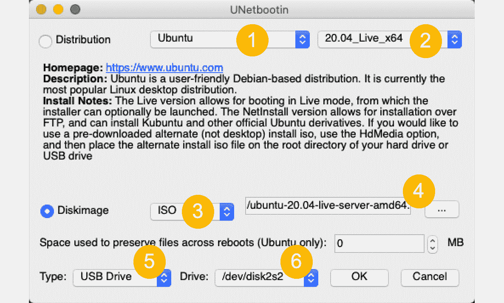

图 1.2 -使用 UNetbootin 创建可启动 USB 驱动器

下面是使用 UNetbootin 在 Ubuntu Desktop 上创建可启动 USB 驱动器的步骤。 我们假设 Ubuntu Desktop 的 ISO 镜像已经下载并安装了 UNetbootin(在我们的 macOS 上):

1.  选择我们的 Linux 发行版(`Ubuntu`)。
2.  指定 Linux 发行版的版本(`20.04`)。
3.  选择与下载文件相匹配的磁盘映像类型(`ISO`)。
4.  浏览到我们下载的 ISO 映像(`ubuntu-20.04-live-server-amd64.iso`)的位置。
5.  指定可引导驱动器(`USB`)的媒体格式。
6.  选择 USB 驱动器的文件系统挂载(`/dev/disk2s2`)

现在，让我们看看如何利用可引导介质进行旋转。

### 第三步-尝试它在现场模式

这个步骤是可选的。

大多数 Linux 发行版都有可供下载的*活动*媒体的 ISO 映像。 一旦我们用选择的 Linux 发行版创建了可引导媒体，我们就可以运行 Linux 平台的实时环境，而无需实际安装它。 换句话说，我们可以在决定是否要安装 Linux 发行版之前评估和测试它。 活动 Linux 操作系统加载在我们 PC 的系统内存(RAM)中，而不使用任何磁盘存储。 我们应该确保 PC 有足够的 RAM 来容纳 Linux 发行版所需的最小内存。

我们可以通过以下两种方式来运行 Linux 的 live 模式:

*   从我们的可引导媒体启动 PC/Mac 工作站
*   启动用我们的 Linux 发行版 ISO 创建的 VM

当从可引导介质启动 PC 时，我们需要确保 BIOS 中的引导顺序设置为以最高优先级读取驱动器。 在 Mac 上，我们需要在重启后立即按下*选项*键，并选择我们的 USB 驱动器启动。

重启后，我们的 Linux 发行版的第一个启动画面应该提供运行在实时模式的选项，如下图所示的 Ubuntu 桌面(**尝试 Ubuntu**):


图 1.3 -为 Ubuntu 选择 live 模式

接下来，让我们看看使用可引导介质的 Linux 发行版的安装过程。

### 步骤 4—执行安装

我们通过从前面创建的可引导介质启动 PC 来启动 Linux 发行版的安装。 为了确保系统可以从驱动器(DVD 或 USB)引导，我们有时需要在 BIOS 中更改引导顺序，特别是从 USB 驱动器引导时。 大多数情况下，PC 或笔记本电脑在上电或重启机器后，立即按*Function*键(甚至是*Delete*键)进入系统 BIOS。 这个键通常出现在初始启动屏幕的底部。

在下面几节中，我们将展示使用 Ubuntu 和 CentOS 的 ISO 镜像的安装过程。 我们选择了 Ubuntu 的桌面版和服务器版，并强调了主要的区别。 CentOS 只有一种风格，从本质上讲，它是一个带有可选图形用户界面的服务器平台。

### 虚拟机中的 Linux

在 Linux 安装的每一节中，我们还提供了关于如何为相关 Linux 平台准备 VM 环境的简要指南。

虚拟机是物理机器的一个独立的软件抽象。 虚拟机部署在**hypervisor**上。 hypervisor 提供虚拟机的运行时发放和资源管理。 为了简单地说明 Linux VM 的安装，在本节中，我们将限制为两个通用的管理程序:

*   **Oracle VM VirtualBox**([https://www.virtualbox.org](https://www.virtualbox.org))
*   **VMware Workstation**([https://www.vmware.com/products/workstation-pro.html](https://www.vmware.com/products/workstation-pro.html))

这两个管理程序都是跨平台虚拟化应用，它们运行在 Windows、Linux 和 macOS 上的 Intel 或 AMD 处理器架构上。

在虚拟机上安装 Linux 与在物理机器上安装 Linux 的区别很小。 值得注意的区别与 VM 大小和配置步骤有关，确保满足 Linux 发行版的最低系统要求。

## 安装 Ubuntu

在本节中，我们简要地介绍了 Ubuntu Server LTS 的安装过程。 如果我们计划在虚拟机中安装 Ubuntu，为 VM 环境提供服务需要一些初步步骤。 否则，我们直接进入*安装*部分。

### 虚拟机配置

在下面的步骤中，我们将创建一个基于 Ubuntu server 的虚拟机——在 macOS 上使用 VMware Workstation:

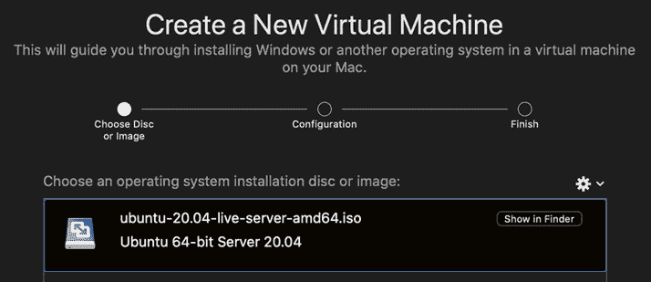

图 1.4 -基于 Ubuntu ISO 镜像创建一个新的虚拟机

让我们来看看这些步骤:

1.  我们从创建一个基于 Ubuntu Server ISO 的新虚拟机开始。 为了便于说明，我们使用 VMware Workstation。 *图 1.4*显示了为 Ubuntu Server 实例创建新 VM 的初始屏幕。
2.  Following the VM deployment wizard, we get to the final step summarizing the VM provisioning information (*Figure 1.5*):

    

    图 1.5 -自定义虚拟机设置

3.  有时候，为了适应 Linux 发行版的最小系统需求，可能必须更改默认的虚拟机大小。 在我们的例子中，Ubuntu Server 需要至少 25gb 的硬盘容量。 我们可以进一步自定义虚拟机设置并增加磁盘容量，例如，到 30gb(*图 1.6*):

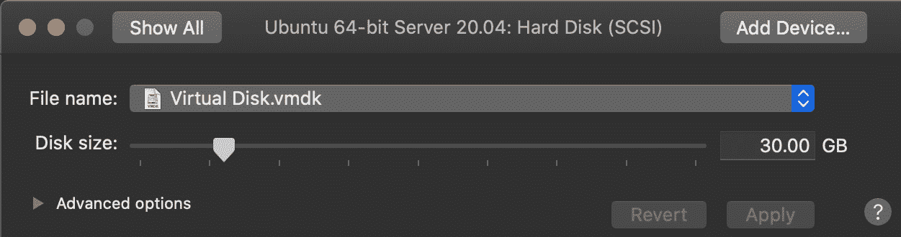

图 1.6 -自定义虚拟机磁盘大小

Linux VM 安装的其余部分与标准物理机安装相同，如下节所示。

### 安装

下面是 Ubuntu Server LTS 的正常安装过程，从初始启动进入安装模式:

1.  确保我们在初始设置界面选择**Install Ubuntu**(我们假设*live*模式已经访问过，根据*图 1.3*:
2.  最初的欢迎屏幕提示我们选择的语言(**English**)，然后是键盘布局(**English (US)**:
3.  Next, we need to set up the server profile, which requires a display name (`Packt`), a server name (`neptune`), a username (`packt`), and the password (*Figure 1.7*):

    

    图 1.7 -设置服务器配置文件

4.  The next screen is asking for the **OpenSSH** server package installation (*Figure 1.8*). OpenSSH enables secure remote access to our server. We choose to check (using **[X]**) the option for **Install OpenSSH server**. Optionally, we can import our existing SSH keys for passwordless authentication:

    

    图 1.8 -启用 OpenSSH 服务器

5.  An additional screen presents us with popular software packages (**Snaps**) that we may want to install (*Figure 1.9*). Among them, there are a few we'll be covering in later chapters (`microk8s`, `docker`, and `aws-cli`):

    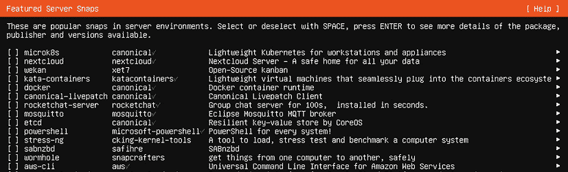

    图 1.9 -启用附加软件包

6.  如果一切顺利，几分钟后，我们完成**安装!** 屏幕，提示重启。

系统重新启动后，进入登录界面。 我们已经完成了 Ubuntu 服务器的安装。

接下来，让我们看一下类似的安装过程，这一次是使用 CentOS Linux 发行版。

## 安装 CentOS

在本节中，我们将简要说明 CentOS 的安装。 如果我们计划在一个虚拟机中安装 CentOS，在发放虚拟机环境时需要一些初步步骤。 否则，我们直接进行*安装*部分。

### 虚拟机配置

在下面的步骤中，我们展示了在 macOS 上使用 Oracle VM VirtualBox 安装 CentOS 虚拟机的。 选择 VirtualBox 而不是 VMware Workstation(在前面的 Ubuntu Server 节中使用)只是为了展示一个替代 hypervisor 的使用:

1.  The VirtualBox setup wizard guides us through the following configuration steps of our VM (we specify our choices as shown):

    a)主机名和操作系统(*木星*，*CentOS Red Hat, 64 位*)

    b)内存大小(*4gb*)

    c)硬盘大小(*30gb*)

    d)硬盘文件类型(*VDI VirtualBox disk Image*)

    e)物理硬盘的存储(*动态分配*)

    f)文件位置和大小(*路径到。vdi 文件*，*30gb*)

2.  After a few steps, we end up with a VirtualBox configuration window of our VM, similar to the following (*Figure 1.10*):

    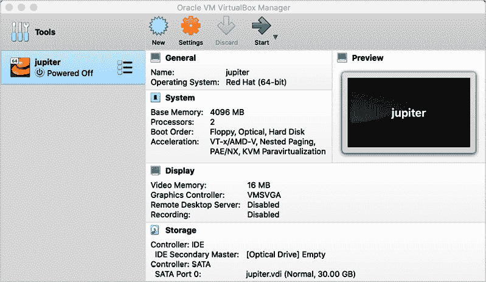

    图 1.10 - VirtualBox 虚拟机配置

3.  我们可以通过在虚拟机的 VirtualBox 管理器窗口中选择**设置**来进一步定制。 接下来，我们应该将虚拟机的 IDE 控制器指向要安装的 CentOS ISO 映像。 我们选择**设置**|**存储**|**光驱**|**IDE Secondary Master**，然后点击磁盘图标。 在这里，我们浏览到 CentOS 映像文件的位置。 我们希望 VM 使用 IDE Secondary Master ISO 文件，从操作系统引导并安装(*图 1.11*):


图 1.11 - Virtual Box 虚拟机存储设置

在这个阶段，启动虚拟机开始安装 CentOS。

### 安装

以下是 CentOS 正常的安装过程，从初始启动进入安装模式:

1.  First, we get the welcome screen with the choice of either installing or testing (in live mode) the CentOS Linux platform (*Figure 1.12*):

    

    图 1.12 - CentOS 欢迎屏幕

2.  In the next few steps of the installation process, we get to choose our options for the following:

    a)语言支持和本地化(*英语*，*美国英语*)

    b)软件选择(*带 GUI 的服务器*)

    c)设备选择与存储配置(*本地媒体*)

    下面的截图总结了所有这些。 设置主要反映默认值(*图 1.13*):

    

    图 1.13 - CentOS 安装摘要

3.  The final step of the CentOS installation is about configuring the local user accounts on our Linux platform (*Figure 1.14*):

    

    图 1.14 - CentOS 用户设置

4.  The user configuration screen prompts for a *root* password and a new user account. In our case, we create a user account (*packt*) with administrator privileges. This account has full administrative privileges over the system, yet it doesn't have root access. In later chapters, we'll show how to give **superuser** (**sudo**) privileges to our administrator account (*Figure 1.15*):

    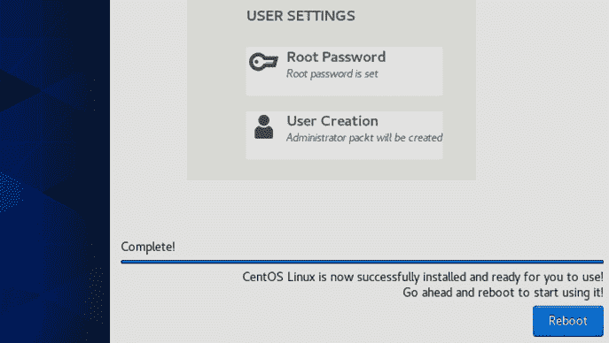

    图 1.15 - CentOS 安装后重启

5.  在完成了用户配置后，我们重新启动系统，这将把我们带到 CentOS 的登录屏幕。 我们已经完成了 CentOS 的安装。 我们可能必须在重新启动之前删除安装介质或卸载虚拟机上的 IDE 接口，以避免再次回到设置模式。

到目前为止，我们已经学习了如何为两个最常见的 Linux 发行版 Ubuntu 和 CentOS 执行基本安装。 在此过程中，我们为安装媒体创建了一个可引导 USB 闪存驱动器，最常用于 Linux PC 平台安装。 对于这两个 Linux 发行版，我们简要介绍了使用 VMware Workstation 和 Oracle VM VirtualBox 管理程序的特定于 VM 的 Linux 环境。

在下一节中，我们将学习如何在 Windows 平台上安装和运行 Linux 发行版，而不使用独立的管理程序。

# Windows 子系统(WSL)

软件开发人员和系统管理员在为其工作或环境的特定需求选择适当的硬件和操作系统平台时常常面临一个艰难的决定。 在过去，Windows 专业人员经常被提醒，一些标准的开发工具、框架或服务器组件在 Linux 或 macOS 平台上广泛可用，而在 Windows 上缺乏本地支持。 **Windows 子系统 for Linux**(**WSL**)试图缩小这个差距。

WSL 是 Windows 10 平台的一个特性，它提供了一个本地 GNU/Linux 运行时以及 Windows 桌面环境。 WSL 支持在 Windows 内核之上无缝地部署和集成选定的 Linux 发行版，而不需要专用的管理程序。 启用 WSL 后，您可以轻松地将 Linux 作为本机 Windows 应用安装和运行。

重要提示

没有 WSL，我们只能通过使用一个独立的 hypervisor(如 Hyper-V、Oracle VM VirtualBox 或 VMware Workstation)在 Windows 平台上部署和运行 Linux 发行版。 WSL 消除了对专用 hypervisor 的需要。 在编写本文时，WSL 是一个嵌入式系统管理程序的 Windows 内核扩展。

在本节中，我们提供在 Windows 上启用 WSL 和运行 Ubuntu 发行版所需的步骤。 以下命令在 Windows 机器(或虚拟机)的 PowerShell 命令行中以管理员权限执行:

1.  First, we need to enable the *Windows Subsystem for Linux* optional feature in Windows:

    ```sh
    dism.exe /online /enable-feature /featurename:Microsoft-Windows-Subsystem-Linux /all /norestart
    ```

    得到的结果如图*图 1.16*所示:

    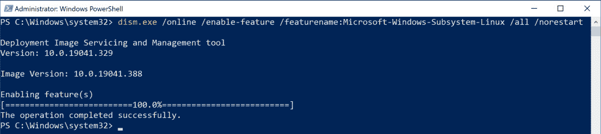

    图 1.16 -启用 WSL 可选特性

2.  Next, we want to make sure WSL 2 is supported on our Windows platform. We need Windows 10, version 2004, build 19041 or higher.

    wsdl 2 使用管理程序技术。 我们需要在 Windows 上启用*虚拟机平台*可选特性:

    ```sh
    dism.exe /online /enable-feature /featurename:VirtualMachinePlatform /all /norestart
    ```

    结果应与*图 1.17*相似:

    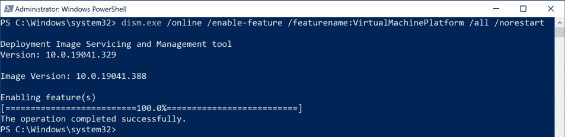

    图 1.17 -启用虚拟机平台可选特性

3.  At this point, we need to restart our Windows machine to complete the WSL installation and upgrade to WSL 2.

    重要提示

    Windows 重启可能有一个*更新和*重启选项。 我们需要确保系统在重启时得到更新。

4.  After the restart, we need to set WSL 2 as our default version:

    ```sh
    wsl --set-default-version 2
    ```

    这个命令可能会产生如图*图 1.18*所示的消息:

    

    图 1.18 - WSL 2 需要进一步的更新

5.  Just follow the instructions in the link to circumvent the problem. After proceeding with these steps, we have to rerun the preceding command. If successful, the command output is similar to *Figure 1.19*:

    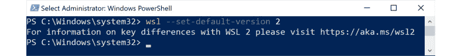

    图 1.19 -将默认版本设置为 WSL 2

6.  With WSL 2 active, we are ready to install our Linux distribution of choice. Open the Microsoft Store and simply search for `Linux` (*Figure 1.20*):

    

    图 1.20 -在 Microsoft Store 中搜索 Linux 发行版应用

7.  我们选择安装 Ubuntu(*图 1.21*)，然后按照 Windows Store 应用驱动的安装过程安装 Ubuntu，就像任何常规的 Windows 应用一样。 完成后，我们通过从 Windows 开始菜单启动应用来运行 Ubuntu:


图 1.21 -安装 Ubuntu 应用

安装后，Ubuntu 作为一个传统的 Windows 桌面命令行应用运行。

WSL 使越来越多的 Windows 专业人员能够迅速采用 Linux。 如本节所示，WSL 相对容易配置，并且使用 WSL，不需要专用的管理程序来运行 Linux 实例。

重要提示

WSL 目前不支持 gui 驱动的 Linux 运行时。 使用 WSL，我们只能通过 CLI 进行交互。

在下一节中，我们将快速了解 Linux 图形用户界面和两个最著名的 Linux 桌面环境:GNOME 和 KDE。

# 安装 Linux 图形用户界面

Linux GUI 是一个桌面环境，它允许用户通过窗口、图标、菜单或其他可视元素与系统级组件交互。 对于超越 CLI 的 Linux 用户，Linux 发行版的选择可能从桌面环境开始。 选择桌面环境最终是一个品味问题。 对于一些人来说，最终的 GUI 代表了他们在工作中眼睛和双手的延伸。

在众多的 Linux 桌面环境中，有两个是突出的。 让我们简要地看看它们。

## 侏儒

通过其当前的 GNOME 3(或 GNOME Shell)迭代，这个 GUI 平台是最常见的 Linux 桌面环境之一。 现在，几乎每个主要的 Linux 发行版都带有 GNOME 作为默认 GUI。 Linux 开源社区还创建了 GNOME Extensions，它克服了 GNOME 的一些臭名昭著的缺点，并扩展了桌面功能以满足各种需求。 当它不是默认的桌面环境时(比如 Linux Mint 的肉桂桌面)，GNOME 可以很容易地安装和调整。

在撰写本文时，Ubuntu (20.04 LTS)和 CentOS(8)的最新发行版都将 GNOME 作为其默认 GUI。

### 安装 GNOME 桌面

让我们来看一个实际的场景，这个场景需要安装最新的 GNOME 桌面。

Ubuntu 服务器管理员:

我安装了最新版本的 Ubuntu Server LTS(20.04)，它看起来好像缺少 GUI 桌面。 如何在我的 Ubuntu 服务器上安装 GNOME 桌面?

让我们看看如何在 Ubuntu 上安装它:

1.  We start by making sure the current package lists and installed software packages are up to date. The following command updates the local package repository metadata for all configured sources:

    ```sh
    sudo apt-get update -y
    ```

    现在，我们可以这样升级:

    ```sh
    sudo apt-get upgrade -y
    ```

2.  要浏览所有可用的`ubuntu-desktop`包，运行以下命令:

    ```sh
    apt-cache search ubuntu-desktop
    ```

3.  我们选择安装`ubuntu-desktop`包(前面列表中的第一个选项):

    ```sh
    sudo apt-get install ubuntu-desktop -y
    ```

4.  The command will take a few minutes to complete. When done, we need to check the status of the **GNOME Display Manager** (**GDM**) service and make sure it shows an `active (running)` status:

    ```sh
    systemctl status gdm
    ```

    预期响应应与图 1.22 相似:


图 1.22 -检查 GDM 状态

GNOME 3 桌面现在已经在 Ubuntu 服务器上安装并激活(图 1.23):


图 1.23 - Ubuntu GNOME 桌面登录界面

接下来，让我们看一下 KDE 桌面，以及在 Linux 服务器平台上启用它的类似案例研究。

## KDE

Linux 管理员通常寻找一个相对容易使用、轻量级和高效的桌面环境。 KDE 将所有这些属性组合成一个可靠、快速的桌面界面。 熟悉 Windows(直到版本 7)的用户会觉得 KDE 非常熟悉。

经过最近的几次迭代，KDE 已经成为一个非常健壮的桌面环境，几乎每个主要 Linux 发行版都发布了 KDE 的版本。

如果有一个适合 Linux 管理员的理想桌面，那么 KDE 就非常接近了。

### 安装 KDE 桌面

在本节中，我们将在启用默认 GNOME 桌面的情况下重新安装 CentOS 8，并将其替换为 KDE。

CentOS 8 管理员:

我安装了最新版本的 CentOS 8，在安装过程中选择了“服务器与 GUI”选项。 看起来像 CentOS 8 的 GUI 运行在 GNOME 桌面上。 如何在 CentOS 8 服务器上安装 KDE 桌面?

当我们点击在 CentOS 8 登录屏幕上的齿轮时，我们会得到一个当前安装的显示服务器的列表。 默认是*标准*，是用于 Linux 桌面管理的*Wayland*排字协议的 GNOME 实现。 Wayland 在其最新的*KDE Plasma*迭代中也有 KDE 实现(*图 1.24*):

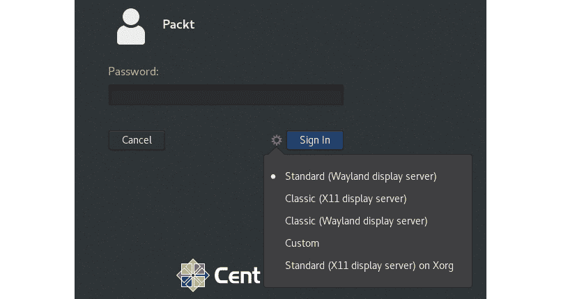

图 1.24 - centos8 的默认 GNOME 登录屏幕

让我们把 KDE 等离子桌面添加到我们的 CentOS 8 服务器:

1.  We log in to the CentOS 8 GUI and open the terminal, as suggested in the following illustration (*Figure 1.25*). Alternatively, we can simply SSH into the CentOS 8 server and run the commands in a similar CLI:

    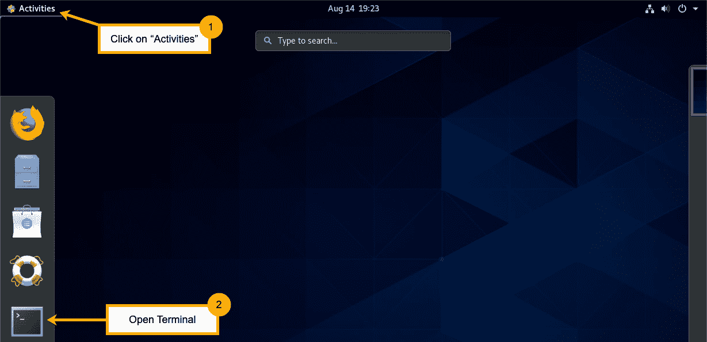

    图 1.25 -在 CentOS 中打开终端

2.  下面的命令必须以*root*的身份执行，或者由具有*sudoer*特权的用户帐户执行。 让我们将管理员用户帐户(`packt`)添加到`sudoers`组。 我们需要切换到*根*来运行所需的命令:

    ```sh
    su
    ```

3.  提示输入*root*密码(在 CentOS 安装期间指定)。 相关信息请参见*Installing CentOS*章节。 要将我们的`packt`用户添加到`sudoers`组，运行以下命令:

    ```sh
    usermod -aG wheel packt
    ```

4.  当命令完成后，切换到我们新创建的`sudoer`帐户:

    ```sh
    su - packt
    ```

5.  Verify that our `packt` account does indeed have *sudoer* privileges:

    ```sh
    sudo whoami
    ```

    命令应该提示输入`packt`用户密码，然后生成`root`。

6.  接下来，继续安装 EPEL 配置文件，启用相关存储库:

    ```sh
    sudo rpm -Uvh https://dl.fedoraproject.org/pub/epel/epel-release-latest-8.noarch.rpm
    ```

7.  然后启用 CentOS`PowerTools`存储库(KDE 需要)。 我们使用`dnf`(*Dandified YUM*)，一个用于基于 rpm 的 Linux 发行版的包管理器 CLI:

    ```sh
    sudo dnf -y config-manager --enable PowerTools
    ```

8.  Finally, we install the KDE Plasma desktop package group. The next command downloads a relatively large number of files (approximately 400 MB), and it may take a while:

    ```sh
    sudo dnf -y group install kde-desktop
    ```

    当`kde-desktop`安装成功完成时，输出以`Complete!`消息提示结束。

9.  现在已经安装了 KDE Plasma 桌面，我们可以重新加载 GNOME 桌面管理器(`gdm`)来解释这些变化，或者简单地重新启动:

    ```sh
    sudo systemctl reload gdm
    ```

10.  If we have a CentOS 8 VM environment, a reboot is recommended:

    ```sh
    reboot
    ```

    我们现在可以使用 KDE 等离子桌面登录到 CentOS 8。 点击登录窗口中的齿轮，可以看到可用的**等离子**桌面(*图 1.26*):

    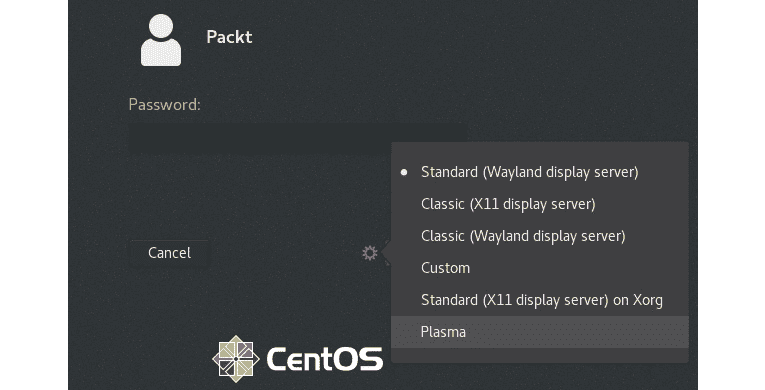

    图 1.26 -选择 KDE 等离子桌面

11.  一旦我们登录，我们就可以根据自己的喜好定制 KDE Plasma 桌面(*图 1.27*):


图 1.27 -定制 KDE Plasma 桌面

在本节中，我们简要地了解了 Linux GUI，并分别展示了在 Ubuntu Server 和 CentOS 上安装 GNOME 和 KDE 桌面环境。 接下来，我们将提供关于设置 Linux 工作站的快速指南，并深入了解对我们的日常工作有益的各种软件包和应用。

# 安装和使用 Linux 工作站

在这个节中，我们将学习如何设置和使用 Linux 平台作为我们的主要工作站进行日常工作。 我们选择 Ubuntu 桌面 LTS 发行版，但是任何其他现代 Linux 发行版都符合这个要求。 我们的目标是展示一些构建和使用通用 Linux 桌面的基本用户操作和工作流。

正如我们在前面关于安装 Linux 发行版的章节中所做的那样，我们从 Ubuntu Desktop LTS 的简单安装指南开始。

## 安装 Ubuntu Desktop

如果我们计划在虚拟机中安装 Ubuntu Desktop，在发放虚拟机环境时需要一些初步步骤。 否则，我们直接进行*安装*部分。

### 虚拟机配置

VM 发放过程非常类似于*安装 Ubuntu*一节中描述的过程，使用 Ubuntu Server LTS。

我们必须注意 Linux 发行版的最小系统要求和相应的虚拟机大小。 在我们的例子中，Ubuntu Desktop 需要一个双核 CPU，至少 4gb RAM，至少 25gb 硬盘容量。 因为我们计划安装一些额外的软件包，所以我们将硬盘容量设置为 60gb(至少)。

### 安装

Ubuntu Desktop 的安装相对简单，只需要很少的用户操作:

1.  与大多数现代 Linux 发行版一样，我们得到的第一选择是尝试 Ubuntu 的实时模式，还是简单地继续安装。 相关的屏幕类似于图 1.3。
2.  Beyond the welcome screen, there are a few more steps with the following configuration settings:

    一)键盘布局

    b)安装类型(普通与最小)

    c)本地化和时区

    d)用户配置(帐户凭证)(*图 1.28*):

    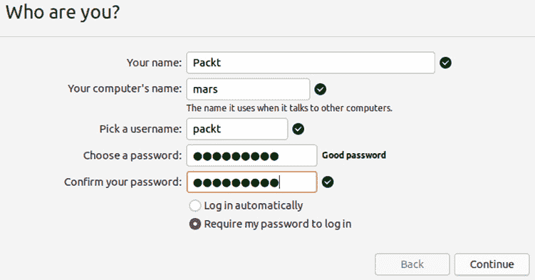

    图 1.28 -设置主机名和用户凭证

3.  越过这个点，安装文件将被解压并复制，同时我们将简要介绍 Ubuntu 平台最吸引人的特性。

安装完成后，系统重启进入 Ubuntu Desktop 登录界面。 至此，我们已经完成了 Ubuntu Desktop 的安装。

## 默认软件包

默认的 Ubuntu 桌面版安装给我们带来了一些软件包和生产力工具，足够我们进行通用的日常工作。 这里有几个例子:

*   **计算器**:算术、科学和金融计算。
*   **Calendar**:访问和管理您的日历。
*   **磁盘**:管理驱动器和媒体。
*   **Files**:访问和组织文件。
*   **Firefox**:Web 浏览器。
*   **图像查看器**:浏览和旋转图像。
*   **LibreOffice**:生产力套件-**Calc**(电子表格)，**Draw**(图形)，**Impress**(演示文稿)，以及**Writer**(文字处理器)。
*   **Logs**:系统日志。
*   **Remmina**:远程桌面连接
*   **节奏盒**:组织，演奏音乐。
*   **截图**:抓取并保存屏幕或单个窗口的图像。
*   **设置**:GNOME 桌面配置实用程序。
*   **Shotwell**:整理照片。
*   **雷鸟邮件**:收发邮件。
*   **To Do:管理个人任务。**
*   **video**:播放电影。

要查看所有当前安装的应用，我们点击任务栏中的*Ubuntu Software*图标，然后点击**installed**选项卡。 如果我们想节省磁盘空间，我们可以选择删除(卸载)这些应用(*图 1.29*):


图 1.29 -添加或删除 Ubuntu 应用

浏览或打开任何应用,单击网格图标(*显示应用*)底部的任务栏,然后根据开始搜索我们的应用类型的名称(图 1.30*):*


图 1.30 -搜索已安装的应用

接下来，让我们看看如何在 Ubuntu Linux 工作站上安装额外的应用。

## 附加软件包

高级用户可能需要额外的软件、工具或实用程序，而不是默认 Ubuntu Desktop 安装所提供的。 要添加新的应用，我们点击任务栏中的*Ubuntu Software*图标，然后点击**Explore**图标，然后点击*search*图标。 在下图所示的示例中，我们寻找 Visual Studio Code，一个功能强大的代码编辑器。

一般来说，当我们决定要安装一个特定的应用时，我们选择这个应用，然后打开一个安装相关 Ubuntu 软件包的窗口。 一旦我们完成安装，应用将显示在**Installed**部分，如果我们选择这样做，我们可以稍后卸载它(*图 1.31*):

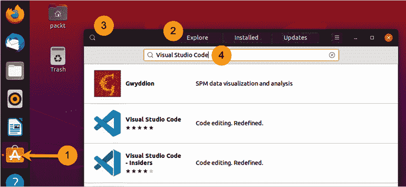

图 1.31 -安装新的应用

不同的高级用户可能会寻找特定类别的应用、工具或实用程序。 下面是 Linux 用户社区使用的几种最常见的生产力工具和应用。 其中一些可以通过*Ubuntu Software*package 管理界面下载。 其他的可以从相关的供应商网站下载。

下面是一些常用的用于 email 和协作的应用，适用于 Ubuntu 和其他主要的 Linux 发行版:

*   **Hiri**:跨平台电子邮件客户端，微软 Outlook 的真正替代品。
*   **雷鸟邮件**:发送和接收邮件(默认安装)。
*   **Slack for Linux**:基于信道的即时消息平台。
*   **Linux 团队**:即时消息传递; Linux 的非官方微软团队客户端。

Linux 有大量的图像编辑工具。 这里只是一些:

*   **GIMP**:图像操作程序
*   **digiKam**:图片编辑软件
*   **KRITA**:免费图像编辑与艺术

现在大多数软件开发 ide 和工具都是跨平台的。 Ubuntu 和许多其他 Linux 发行版也不例外，提供了大量这样的应用:

*   **Visual Studio Code**:Code 编辑
*   **Sublime 文本**:代码的编辑、标记
*   **Atom**:高度可定制的代码编辑器
*   **Eclipse**:可扩展工具平台和 Java IDE
*   **IDEA Ultimate**:能够和人机工程学的 Java IDE，用于企业、web 和移动开发
*   **终结者**:多个终端在一个窗口内

虚拟化和容器化工作流的需求现在比以往任何时候都要高。 所有主要的管理程序和容器编排平台也可以用于 Linux:

*   **VirtualBox**:VMmanager by Oracle
*   **VMware Workstation**:VM managerby VMware
*   **Docker Engine**:打开源容器化平台。
*   **MicroK8s**:轻量级 Kubernetes，用于工作站和设备。
*   **Minikube**:本地运行 Kubernetes。

小型 Linux pc 机和设备通常是媒体服务器的理想平台。 这些是最常见的媒体服务器应用，通常适用于几乎任何 Linux 发行版:

*   **Plex 媒体服务器**:将媒体库和流组织到任何设备。
*   **Kodi**:管理和查看媒体。

在我们这个高度协作的世界里，屏幕捕捉和录音工具总是会派上用场。 这里只是一些:

*   **屏幕截图**:抓取并保存屏幕或单个窗口的图像(默认安装)。
*   **Kazam**:录制视频或截屏。
*   **OBS Studio**:直播流媒体及屏幕录制。

其中一些应用可能需要 CLI 来安装。 其他应用可以在*Ubuntu software*管理用户界面中作为软件包安装程序，也可以通过 APT 软件包管理命令行(`apt-get`)获取。

正如前面所示的，通过*Ubuntu Software*管理界面安装应用非常简单。 接下来，我们来看看 Ubuntu 的 APT 包管理平台和 CLI。

## 使用 APT 管理软件包

APT 是 Ubuntu 默认的包管理器，它是一个用于安装和删除软件包的平台接口。 作为 Ubuntu 的核心系统库，APT 是一组工具和 CLI 程序的集合，这些工具和命令行程序可以帮助进行包和存储库的管理:`apt`，`apt-cache`和`apt-get`。

重要提示

APT 和 DPKG:本质上，**APT**是对**DPKG**(Debian Linux 发行版的包管理器)的一个扩展(前端)。 `apt`CLI 会调用`dpkg`CLI。

让我们看几个使用`apt-get`和`dpkg`CLI 工具来安装和管理软件包的例子。

### 案例研究—安装 Java (OpenJDK)

从 Java 开发人员的角度来看，这个场景是:

我有一台运行 Ubuntu Desktop 的功能强大的开发机器。 我从事一个需要 Java 开发的项目。 如何在我的机器上安装 OpenJDK ?

我们假设我们的案例研究使用 Ubuntu 桌面平台和 OpenJDK 14 版本。

让我们看看如何安装 OpenJDK (Java 开发工具包):

1.  Before installing OpenJDK, let's make sure the current package lists and installed software packages are up to date. Start by updating the local package repository metadata for all configured sources:

    ```sh
    sudo apt-get update -y
    ```

    接下来，继续升级:

    ```sh
    sudo apt-get upgrade -y
    ```

    以上命令需要*超级用户*(*sudo*)权限。 我们必须为我们的特权(管理员)帐户输入密码。 `-y`选项运行`apt-get`命令而不需要进一步的用户交互。

2.  现在，我们准备安装 OpenJDK 14:

    ```sh
    sudo apt-get install -y openjdk-14-jre-headless
    ```

3.  Let's make sure the OpenJDK environment is ready. Get the OpenJDK version:

    ```sh
    java --version
    ```

    对于新安装的 OpenJDK，这个命令应该会产生如下的响应(图 1.32):

    

    图 1.32 -测试 OpenJDK 安装

4.  We can verify the status of the OpenJDK installation with this:

    ```sh
    dpkg --list openjdk-14-jre-headless
    ```

    前一个命令产生的响应类似于图 1.33:

    

    图 1.33 -使用 dpkg 查询 OpenJDK 包

    或者，我们可以使用`apt-cache`命令行来验证 OpenJDK 包的状态:

    ```sh
    apt-cache policy openjdk-14-jre-headless
    ```

    输出类似于图 1.34:

    

    图 1.34 -使用 apt-cache 查询 OpenJDK 包

5.  To remove OpenJDK, run the following:

    ```sh
    sudo apt-get remove openjdk-14-jre-headless
    ```

    或者，你可以使用`dpkg`:

    ```sh
    sudo dpkg --remove openjdk-14-jre-headless
    ```

要了解更多关于`dpkg`CLI 选项的信息，请执行`dpkg --help`命令。 要获取更多关于`apt`CLI 工具的信息，请运行`man apt`。

### 案例研究-安装 Plex 媒体服务器

这个场景是从家庭影院爱好者的角度来看的:

我使用 Plex 作为媒体播放器系统，与 Plex 媒体服务器作为后端。 我想把我的 Plex 媒体服务器迁移到 Linux。 如何在 Ubuntu 上安装 Plex Media Server ?

要在 Ubuntu 上安装**Plex Media Server**(**PMS**)，请遵循以下步骤:

1.  Make sure the current package lists and installed software packages are up to date. Start by updating the local package repository for all configured sources:

    ```sh
    sudo apt-get update -y
    ```

    接下来，运行升级:

    ```sh
    sudo apt-get upgrade -y
    ```

    根据供应商的网站，启用相关存储库有一些特定的先决条件，我们在这里没有详细说明。

2.  供应商还推荐使用`dpkg`CLI 来安装 PMS; 使用以下命令:

    ```sh
    sudo dpkg -i plexmediaserver_1.19.4.2935-79e214ead_amd64.deb
    ```

3.  We can verify the status of our `plexmediaserver` installation with the following:

    ```sh
    dpkg --list plexmediaserver
    ```

    前面的命令得到的响应类似于*图 1.35*:

    

    图 1.35 -使用 dpkg 查询 PMS 包

4.  要删除`plexmediaserver`包，运行以下命令:

    ```sh
    sudo dpkg --remove plexmediaserver
    ```

要了解更多关于`dpkg`CLI 选项的信息，请执行`dpkg --help`命令。

# 总结

在这一章中，我们学习了 Linux 发行版，重点是根据我们的需要选择正确的平台，并执行相关的安装过程。 在此过程中，我们展示了一些实际操作的、我们认为与所涵盖的主题相关的现实场景，并更好地掌握了我们所学内容的*为什么*或*如何*。

在本章中，主要强调的是 Ubuntu 和 CentOS Linux 发行版。 本着实用方法的精神，我们介绍了运行 Linux 的物理环境和 VM 环境。 我们还简要介绍了 Windows 领域，在那里我们接触了 WSL，它是 Linux 作为本机 Windows 应用的现代抽象。

我们通过一些实际例子来构建 Linux 工作站，了解如何定制日常工作所需的应用和工具。

通过本章学到的技能，我们希望您能够更好地理解如何根据自己的需要选择不同的 Linux 发行版。 您已经了解了如何在各种平台上安装和配置 Linux:服务器、桌面、VM 和 wsdl。 我们还开始探索如何使用 Linux 命令行终端完成案例研究中描述的一些任务。 在本书的其余部分中，您将使用其中的一些技巧，但最重要的是，您现在将轻松地快速部署您选择的 Linux 发行版并使用它进行测试。

在当今日益快速和敏捷的开发环境中，**持续集成和**(**CI/CD**)基础架构大量使用 Linux 发行版。 以后的章节将向您介绍容器化工作流，在本章中获得的知识将帮助您设计和部署 Linux 容器。

从下一章开始，我们将进一步研究各种 Linux 子系统、组件、服务和应用。 第二章，*Linux 文件系统*将让您熟悉 Linux 文件系统的内部原理和相关工具。

# 问题

下面是一些你可能会思考的问题和思想实验，其中一些基于你在本章学到的技能，其他的在本书后面的部分揭示:

1.  *My Linux workstation is running low on disk space. How do I uninstall or remove applications that I don't use anymore?*

    提示:安装了 GUI 包管理工具的软件包可以从同一个 GUI 中卸载(例如，见图*图 1.36*)。 其他的可以使用包管理器 CLI 工具删除(例如，`apt`、`dpkg`和`rpm`)。

2.  *If I had a relatively large number of Linux VM instances or distros deployed and running at the same time, how would I make it easier to manage them?*

    提示:使用 Vagrant，一个用于构建和管理 VM 环境的工具。

3.  *How do I enable multiple GUI desktops (GNOME, KDE) for different users on the same Linux system?*

    提示:在*安装 Linux 图形用户界面*一节中，我们并排展示了 KDE 和 GNOME 的添加。 每个用户都可以通过自己选择的 GUI 桌面登录(参见*图 1.31*)。

4.  *I'm looking for a robust email client and team collaboration solution for my Linux workstation.*

    提示:*附加软件包*部分可能提供一些指导。

5.  *Can I run multiple Linux instances in WSL?*

    提示:是的。 使用`wsl --import`。

6.  *How do I upgrade my Linux machine to a new version of the distro?*

    提示:创建一个新的 Linux 发行版的可引导媒体，并运行安装程序。 在出现提示时选择升级。 您也可以使用命令行。 查看 Linux 发行版的相关 CLI 工具(例如 Ubuntu 的`do-release-upgrade`)。*****