# 五、处理进程、守护进程和信号

Linux 是一个多任务操作系统。 多个程序或任务可以并行运行，每个程序或任务都有自己的标识、调度、内存空间、权限和系统资源。 进程封装了任何此类程序的执行上下文。 对于任何经验丰富的 Linux 系统管理员和开发人员来说，理解进程如何工作和相互通信是一项重要的技能。

本章探讨 Linux 进程背后的基本概念。 我们将研究不同类型的进程，例如前台进程和后台进程，特别强调将守护进程作为一种特定类型的后台进程。 我们将仔细研究进程的结构以及 Linux 中的各种进程间通信机制——特别是信号。 在此过程中，我们将了解一些用于管理进程和守护进程以及处理信号的基本命令行实用程序。

在本章中，我们将涵盖以下主题:

*   介绍流程
*   处理流程
*   使用守护进程
*   探索进程间通信

当我们浏览内容时，我们偶尔会在本章下半部分正式介绍之前引用**信号***。 在 Linux 中，信号几乎只与进程相关，因此我们首先要熟悉进程。 然而，将一些进程内部的信号排除在外会对理解进程的工作方式造成损害。 我们希望这里采取的折衷办法能让您更好地理解进程和守护进程的整体情况以及内部工作方式。 在提到信号的地方，我们将指向相关部分以作进一步参考。*

现在，在我们开始之前，让我们看看我们研究的必要先决条件。

# 技术要求

熟能生巧。 手动运行本章中的命令和示例对您了解进程大有帮助。 与本书的任何章节一样，我们建议您在 VM 或 PC 桌面平台上安装一个可用的 Linux 发行版。 我们将使用 Ubuntu 或 CentOS，但大多数命令和示例在任何其他 Linux 平台上都是类似的。

本章的代码文件可以在 GitHub 上的以下链接找到:[https://github.com/PacktPublishing/Mastering-Linux-Administration](https://github.com/PacktPublishing/Mastering-Linux-Administration)。

# 流程介绍

**进程**表示程序的运行实例。 一般来说，程序是指令和数据的组合，编译成一个可执行单元。 当程序运行时，就会创建一个进程。 换句话说，一个过程就是一个运行中的程序。 进程执行特定的任务，有时也称为**作业**(或**任务**)。

有许多创建或启动进程的方法。 在 Linux 中，每个命令都启动一个进程。 命令可以是终端会话中的用户发起的任务、脚本或手动或自动调用的程序(可执行)。

通常，流程的创建以及与系统(或用户)交互的方式决定了其流程类型。 让我们仔细看看 Linux 中不同类型的进程。

## 了解流程类型

在较高的层次上，Linux 中有两种主要的进程类型:

*   **前台**(T2】交互式)
*   **背景**(*非交互式*或*自动化*)

交互流程假定在流程的生命周期内存在某种类型的用户交互。 非交互式进程是无人参与的，这意味着它们要么是自动启动的(例如，在系统引导时)，要么是通过作业调度程序(例如，使用`at`和`cron`命令行实用程序)安排在特定时间和日期运行。

我们研究过程类型的方法主要围绕前面的分类。 围绕进程定义还有各种其他视图或分类法，但它们最终可以简化为前台或后台进程。

例如，批处理进程和守护进程本质上是后台进程。 批处理是自动化的，因为它们不是用户生成的，而是由计划任务调用的。 守护进程是后台进程，通常在系统引导期间启动，并无限期地运行。

还有父进程和子进程的概念。 父进程可以创建其他从属的子进程。

我们将在下面几节中详细介绍这些类型(以及其他内容)。 让我们从关键的进程开始——前台进程和后台进程。

### 前台进程

**前台进程**，也称为**交互进程**，通过终端会话启动并控制。 前台进程通常由用户通过交互式命令行界面发起。 前台进程可以将结果输出到控制台(`stdout`或`stderr`)或接受用户输入。 前台进程的生命周期与 Terminal 会话(父进程)紧密耦合。 如果启动前台进程的用户在进程仍在运行时退出终端，进程将被突然终止(通过父进程发送的`SIGHUP`信号; 更多细节请参见*信号*部分。

前台进程的一个简单示例是为任意 Linux 命令(例如`ps`)调用系统参考手册(`man`):

```sh
man ps
```

`ps`命令用来显示当前活动的进程信息。 您将在*进程管理*部分了解更多关于进程管理工具和命令行实用工具的信息。

一旦前台进程被启动，用户提示将被派生的进程界面捕获和控制。 在交互进程将控制权交还给终端会话之前，用户不能再与初始命令提示符进行交互。 下面的屏幕截图显示了`man ps`命令的调用，将用户控件切换到文档界面:

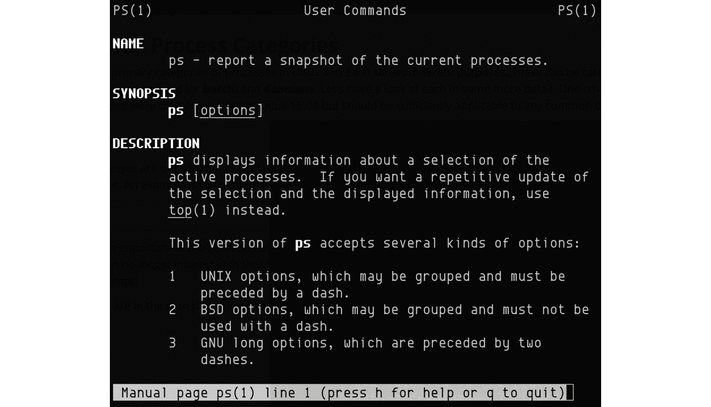

图 5.1 -交互式流程示例(man ps)

让我们来看另一个前台进程的示例，这一次调用一个长期存在的任务。 下面的命令(一行程序)运行一个无限循环，同时每隔几秒显示一条任意消息:

```sh
while true; do echo "Wait..."; sleep 5; done
```

只要命令在不中断的情况下运行，用户在终端中就不会有交互式提示符。 使用*Ctrl*+*C*将停止(中断)相关前台进程的执行，并产生一个响应性的命令提示符:

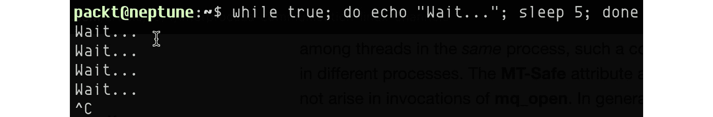

图 5.2 -一个长期存在的前台进程

重要提示

当前台进程运行时，按下*Ctrl*+*C*，当前(父)终端会话向正在运行的进程发送`SIGINT`信号，前台进程被中断。 要了解更多信息，请参见*信号*部分。

如果我们希望在运行特定命令或脚本时在 Terminal 会话中维护一个交互式命令提示符，我们应该使用后台进程。

### 后台进程

**后台进程**-也称为**非交互的**或**自动进程**-独立于终端会话运行，不需要任何用户交互。 用户可以在同一个终端会话中调用多个后台进程，而无需等待其中任何一个进程完成或退出。

后台进程通常是长期存在的任务，不需要用户直接监督。 相关的进程仍然可以在终端控制台中显示它的输出，但是这些后台任务通常会将它们的结果写入文件。

后台进程的最简单调用是在相关命令的末尾附加一个“&”(`&`)。 在前面的示例(在*前台进程*部分)的基础上，下面的命令创建了一个运行无限循环的后台进程，每隔几秒回显一条任意消息:

```sh
while true; do echo "Wait..."; sleep 5; done &
```

注意命令末尾的与符号(`&`)。 默认情况下，当使用&号(`&`)调用时，后台进程仍然将输出(`stdout`和`stderr`)指向控制台，如上所示。 然而，终端会话仍然是交互式的:

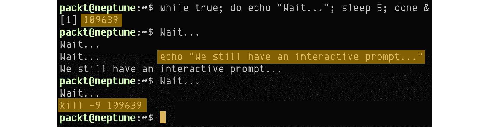

图 5.3 -运行后台进程

如上截图所示，后台进程被赋予`109639`的**进程 ID**(**PID**)。 当进程运行时，我们仍然可以控制 Terminal 会话并运行不同的命令，像这样:

```sh
echo "We still have an interactive prompt..."
```

最后，我们可以使用`kill`命令强制终止进程:

```sh
kill -9 109639
```

前面的命令*终止*我们的后台进程(PID`109639`)。 父终端会话发送的用来终止该进程的相应信号是`SIGKILL`(有关更多信息，请参见*Signals*部分)。

前台和后台进程通常都在用户的直接控制下。 换句话说，这些进程是通过命令或脚本调用手工创建或启动的。 这条规则也有一些例外，特别是在批处理过程中，批处理过程是通过调度作业自动启动的。

还有一类后台进程在系统启动时自动启动，在关闭时自动终止，无需用户监督。 这些后台进程也称为守护进程。

### 引入守护进程

守护进程是一种特殊类型的后台进程，通常在系统引导时启动，并无限期运行或直到终止(例如，在系统关闭期间)。 守护进程没有用户控制的终端，即使它与系统帐户(`root`或其他)相关联，并使用相关的特权运行。

守护进程通常服务于客户端请求或与其他前台或后台进程通信。 以下是一些守护进程的常见例子，通常在大多数 Linux 平台上可用:

*   `systemd`:所有进程的父进程(以前称为`init`)
*   `crond`:任务调度程序——在后台运行任务
*   `ftpd`:FTP 服务器-处理客户端 FTP 请求
*   `httpd`:Web 服务器(Apache)——处理客户端 HTTP 请求
*   `sshd`:安全外壳服务器-处理 SSH 客户端请求

通常，Linux 中的系统守护进程以`d`结尾命名，表示一个守护进程。 守护进程由 shell 脚本控制，这些脚本通常存储在`/etc/init.d/`或`/lib/systemd/`系统目录中，具体取决于 Linux 平台。 例如 Ubuntu 将 daemon 脚本文件存储在`/etc/init.d/`中，而 CentOS 将它们存储在`/lib/systemd/`中。 这些守护文件的位置取决于`init`的平台实现，`init`是所有 Linux 进程的系统范围服务管理器。

Linux`init`风格的启动过程通常在系统启动时调用这些 shell 脚本。 但是，同样的脚本也可以通过服务控制命令(通常由特权系统用户运行)来调用，以管理特定守护进程的生命周期。 换句话说，特权用户或系统管理员可以通过命令行界面*停止*或*启动*特定的守护进程。 这些命令会立即将用户的控制返回给终端，同时在后台执行相关操作。

让我们仔细看看`init`过程。

### init 进程

在本章中，我们将把`init`作为 Linux 平台上的*通用*系统初始化引擎和服务管理器。 多年来，Linux 发行版已经发展并经历了各种各样的`init`系统实现，例如`SysV`、`upstart`、`OpenRC`、`systemd`和`runit`。 在 Linux 社区中，一直有一场关于二者孰优孰优的争论。 现在，我们将简单地将`init`视为一个系统过程，并且我们将简要地看一下它与其他过程的关系。

`init`(或`systemd`等)本质上是一个系统守护进程，它是 Linux 引导时首先启动的进程之一。 相关的守护进程继续在后台运行，直到系统关闭。 `init`是整个进程层次树中 Linux 中所有其他进程的根(父)进程。 换句话说，`init`是系统中所有进程的直接或间接祖先。

在 Linux 中，`pstree`命令显示整个进程树，并显示`init`进程在其根; 在我们的例子中，`systemd`(在 Ubuntu 或 CentOS 上):

```sh
Pstree
```

上述命令的输出如下截图所示:

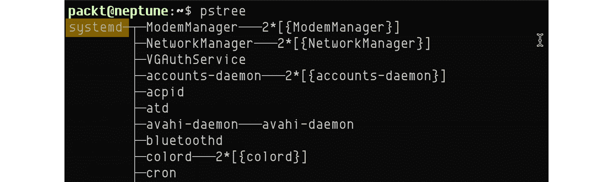

图 5.4 - init (systemd)，所有进程的父进程

`pstree`命令的输出说明了进程的层次树表示，其中一些显示为父进程，而另一些显示为子进程。 让我们看看父流程和子流程类型以及它们之间的一些动态。

### 父进程和子进程

父进程创建其他从属进程，也称为子进程。 子进程属于生成它们的父进程，并且通常在父进程退出(停止执行)时终止。 如果父进程在终止时(例如通过`nohup`命令)被指示忽略父进程调用的`SIGHUP`信号，那么子进程可能会在父进程的生命周期之后继续运行。 更多信息请参见*信号*部分。

在 Linux 中，除了`init`进程(及其变体)之外的所有进程都是特定进程的子进程。 终止一个子进程不会停止相关父进程的运行。 当子进程完成处理时终止父进程的一个良好实践是，在子进程完成之后从父进程本身退出。

在某些情况下，进程会根据特定的时间表在无人值守的情况下运行。 在没有用户交互的情况下运行进程称为批处理。 下面我们来看看批处理过程。

### 批处理进程

批处理进程通常是一个脚本或命令，被安排在特定的日期和时间运行，可能是周期性的。 换句话说，批处理是作业调度器产生的一个后台进程。 在大多数常见情况下，批处理是资源密集型任务，通常安排在较繁忙的时间内运行，以避免系统过载。 在 Linux 上，最常用的作业调度工具是`at`和`cron`。 `cron`更适合于计划任务管理的复杂性，而`at`是一个更轻量级的实用程序，更适合于一次性任务。 对这些命令的详细研究超出了本章的范围。 您可以参考相关的系统参考手册获取更多信息(`man at`和`man cron`)。

我们将以孤儿进程和僵死进程来结束对进程类型的研究。

### 孤儿进程和僵死进程

当子进程终止时，相关的父进程会收到`SIGCHILD`信号。 父进程可以继续运行其他任务，也可以选择生成另一个子进程。 然而，可能存在父进程在相关子进程完成执行(或退出)之前被终止的情况。 在本例中，子进程成为**孤儿**进程。 在 Linux 中，`init`进程——所有进程的父进程——自动成为野进程的新父进程。

**僵尸进程(也称为**已经**流程)引用的过程已经完成了执行(退出)但仍挥之不去的系统过程表(根据`ps`命令)。**

僵死进程和野进程之间主要的区别在于，僵死进程已经死亡(终止)，而野进程仍在运行。

当我们区分不同的流程类型及其行为时，相关信息的重要部分反映在流程本身的组成或数据结构中。 在下一节中，我们将仔细研究进程的组成，这主要是通过`ps`命令行实用程序来实现的——这是 Linux 系统上一个普通但非常有用的进程资源管理器。

## 过程的解剖

在本节中，我们将通过`ps`和`top`命令行实用程序来探讨 Linux 进程的一些常见属性。 我们希望采用基于这些工具的实用方法将帮助您更好地理解进程内部，至少从 Linux 管理员的角度来看是这样。 让我们先简单看一下这些命令。 `ps`命令用来显示系统进程的当前快照。 该命令的语法如下:

```sh
ps [OPTIONS]
```

`top`命令提供系统中所有正在运行的进程的实时视图。 其语法如下:

```sh
top [OPTIONS]
```

下面的命令显示当前 Terminal 会话拥有的进程:

```sh
ps
```

上述命令的输出如下截图所示:


图 5.5 -显示当前 shell 所拥有的进程

让我们看看输出的顶部(标题)行中的每个字段，并解释它们在相关流程的上下文中的含义; 也就是`bash`终端会话。

### PID

Linux 中的每个进程在创建进程时都有一个由内核自动分配的 PID。 PID 是一个正整数，并且总是保证是唯一的。

在我们的例子中，相关的进程是`bash`(当前 shell)， PID 为`171233`。

### TTY

**TTY**是**电传打字机**的缩写，更通俗地说，是一种用于与系统交互的控制终端或设备。 在 Linux 进程的上下文中，TTY 属性表示进程与交互的终端类型。 在我们的示例中，代表终端会话的`bash`进程将`pts/0`作为其 TTY 类型。 **PTS**或`pts`表示**伪终端从机**，表示控制过程的输入类型—终端控制台。 `/0`表示相关 Terminal 会话的顺序。 例如，附加的 SSH 会话将具有`pts/1`，等等。

### 时间

`TIME`字段表示进程花费的累计 CPU 利用率(或时间)(格式为`[DD-]hh:mm:ss`)。 为什么在我们的示例中，`bash`流程的值为零(`00:00:00`)? 我们可能在终端会话中运行了多个命令，但 CPU 利用率可能仍然为零。 这是因为 CPU 利用率度量(并累积)每个命令花费的时间，而不是父终端会话的总体时间。 如果命令在几分之一秒内完成，那么在`TIME`字段中显示的 CPU 利用率不会很高。

让我们用下面的命令来产生一些明显的 CPU 利用率:

```sh
while true; do x=1; done
```

如果我们让命令运行几秒钟，然后退出*Ctrl*+*C*，我们将得到以下结果:


图 5.6 -产生明显的 CPU 利用率(时间)

前面的命令运行一个紧凑的`while`循环，其中内核为处理分配所需的 CPU 周期。 我们需要记住，`while`循环是组成命令的简单指令序列，它不会创建进程。 随后的(相对繁重的)命令在当前 shell 中运行。 因此，相关的 CPU 利用率占`bash`进程的比例。

### CMD

`CMD`字段代表，表示创建进程的命令(包括参数)的名称或完整路径。 对于众所周知的系统命令(例如`bash`)，CMD 显示命令的名称，包括它的参数。

到目前为止，我们所探讨的进程属性代表了一个相对简单的 Linux 进程视图。 有些情况下，我们可能需要更多的信息。 例如，下面的命令提供了关于当前 Terminal 会话中运行的进程的额外详细信息:

```sh
ps -l
```

`-l`选项参数为`ps`输出调用所谓的*长格式*:


图 5.7 -更详细的过程视图

下面是`ps`命令的一些更相关的输出字段:

*   `F`:进程标志(例如，`0`- none，`1`- fork，`4`-超级用户权限)
*   `S`:进程状态代码(例如，`R`—正在运行，`S`—可中断睡眠，等等)
*   `UID`:进程的用户名或所有者
*   `PID`:进程 ID
*   `PPID`:父进程 ID
*   `PRI`:进程的优先级(数字越大优先级越低)
*   `SZ`:虚拟内存使用率

还有很多这样的属性，探索它们都超出了本书的范围。 更多信息请参考`ps`系统参考手册(`man ps`)。

到目前为止，我们使用的`ps`命令示例只显示了当前 Terminal 会话所拥有的进程。 我们认为，这种方法将减少分析流程属性的复杂性。 `ps`命令显示的许多进程输出字段也反映在`top`命令中，尽管其中一些字段的符号略有不同。

让我们看看`top`命令以及显示的输出字段的含义。 查看进程运行的实时视图。

```sh
top
```

上述命令的输出如下截图所示:

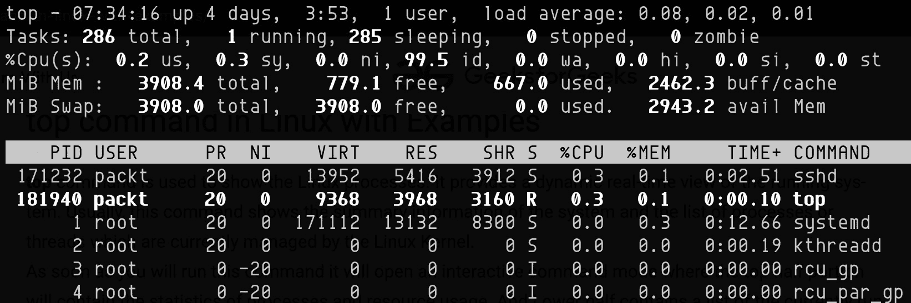

图 5.8 -当前进程的实时视图

以下是部分输出字段，简要说明:

*   `USER`:进程的用户名或所有者。
*   `PR`:进程的优先级(数字越小，优先级越高)。
*   `NI`:进程的良好价值(一种动态/自适应优先级)。
*   `VIRT`:虚拟内存大小(KB) -进程使用的总内存。
*   `RES`:驻留内存大小(以 KB 为单位)-进程使用的物理(未交换)内存。
*   `SHR`:共享内存大小(以 KB 为单位)——与其他进程共享的进程内存的子集。
*   `S`:进程状态(例如，`R`—正在运行，`S`—可中断睡眠，`I`—空闲，等等)。
*   `%CPU`:CPU 使用率(百分比)。
*   `%MEM`:`RES`内存使用率(百分比)。
*   `COMMAND`:命令名或命令行。

这些字段中的每一个(以及更多)在`top`系统参考手册(`man top`)中都有详细说明。

每天，Linux 管理任务经常使用基于上述字段的与进程相关的查询。 *处理进程*部分将探讨`ps`和`top`命令以及其他命令的一些更常见用法。

进程生命周期的一个基本的方面是进程在任何给定时间的**状态**(或**状态**)以及这些状态之间的转换。 `ps`和`top`命令都通过`S`字段提供关于进程状态的信息。 让我们仔细看看这些状态。

### 进程状态

在其生命周期内，进程可以根据环境改变状态。 根据`ps`和`top`命令的`S`(status)字段，Linux 进程可以有以下任一状态:

*   `D`:不被打扰的睡眠
*   `I`:空闲
*   `R`:跑步
*   `S`:睡眠(可中断睡眠)
*   `T`:作业控制信号停止
*   `t`:在跟踪期间被调试器停止
*   `Z`:僵尸

在较高的级别上，这些状态中的任何一个都可以与以下进程状态相识别:

*   运行
*   等待
*   停止
*   僵尸

下面几节将简要描述每一种状态。 在相关的地方，将根据`ps`和`top`命令提供相应的`S`字段状态属性。

#### 运行状态

进程当前正在运行(状态为`R`)或处于空闲进程(状态为`I`)。 在 Linux 中，空闲的进程是分配给系统中每个处理器(CPU)的特定任务，并且只在相关 CPU 上没有其他进程运行时被调度运行。 在空闲任务中花费的时间占了`top`命令报告的空闲时间。

#### 等待状态

进程正在等待一个特定的事件或资源。 有两种类型的等待状态:可中断睡眠(`S`状态)和不可中断睡眠(`D`状态)。 可中断的睡眠可以被特定的进程信号干扰，从而产生进一步的进程执行。 另一方面，不可中断睡眠是进程在系统调用中被阻塞的一种状态(可能是等待某些硬件条件)，并且它不能被中断。

#### 停止状态

进程停止执行，通常是由于特定的信号——作业控制信号(`T`状态)或调试信号(`t`状态)。

#### 僵尸状态

进程已停止或死亡(状态为`Z`)—它在未被其父进程获取的情况下被终止。 僵死的进程实质上是系统进程表中已经终止的进程的一个死引用。 您可以在*孤儿进程和僵死进程*部分了解更多信息。

为了结束我们对进程状态的分析，让我们看看一个 Linux 进程的生命周期。 通常，进程以运行状态(`R`)开始，并在其父进程从僵死状态(`Z`)获得它后终止。 下面的图表提供了流程状态和它们之间可能的转换的简图:


图 5.9 - Linux 进程的生命周期

既然已经介绍了流程，并为您提供了关于其类型和结构的初步概念，我们就准备好与它们交互了。 在下面几节中，我们将探讨一些用于处理进程和守护进程的标准命令行实用程序。 这些工具大多使用输入和输出数据进行操作，我们在*剖析*节中介绍了这些数据。 接下来我们将讨论如何使用流程。

# 处理过程

本节是通过在日常 Linux 管理任务中使用的资源丰富的命令行实用工具来管理进程的实用指南。 其中一些工具已经在前面的小节中提到(例如，`ps`和`top`)，当我们讨论特定的过程内部时。 在这里，我们将回顾到目前为止收集到的大部分知识，并通过介绍一些实际操作的示例，将其用于现实世界的旋转。

让我们从`ps`命令开始——Linux 进程管理器。

## ps 命令

我们在进程剖析部分的*中描述了`ps`命令及其语法。 下面的命令显示当前系统中正在运行的进程的选择:*

```sh
ps -e | head
```

`-e`选项(或`-A`)选择*系统中的所有*进程。 `head`管道调用只显示前几行(默认为 10 行):

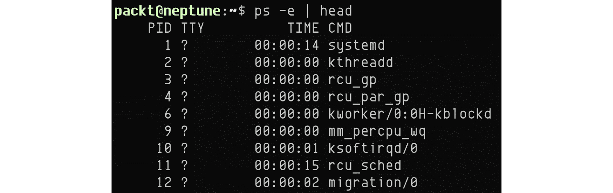

图 5.10 -显示前几个进程

上述信息可能并不总是特别有用。 也许我们想了解更多关于每个进程的信息，而不仅仅是`ps`命令输出中的`PID`或`CMD`字段。 (我们在流程剖析部分描述了一些流程属性。)

下面的命令以更详细的方式列出了当前用户拥有的进程:

```sh
ps -fU $(whoami)
```

选项指定完整格式列表，其中显示每个进程的更详细信息。 选项参数将当前用户(`packt`)指定为我们想要检索的进程的实际用户(所有者)。 换句话说，我们想要列出我们拥有的所有进程:

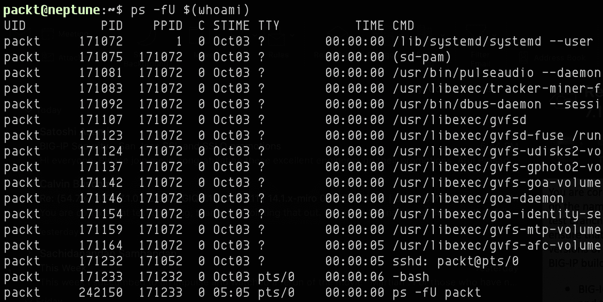

图 5.11 -显示当前用户拥有的进程

在某些情况下，我们可能会寻找一个特定的过程，要么是为了监视目的，要么是为了对它们进行操作。 让我们以前面的一个示例为例，其中我们展示了一个长期存在的进程，并将相关命令封装到一个简单的脚本中。 该命令是一个简单的`while`循环，可以无限地运行:

```sh
while true; do x=1; done
```

使用我们喜欢的编辑器(例如`nano`)，我们可以创建一个包含以下内容的脚本文件(例如`test.sh`):


图 5.12 -一个不确定地运行的简单测试脚本

我们可以使测试脚本可执行，并将其作为后台进程运行:

```sh
chmod +x test.sh
./test.sh &
```

注意命令末尾的&符号(`&`)，它调用后台进程:


图 5.13 -作为后台进程运行脚本

运行脚本的后台进程的进程 ID(`PID`)为`243436`。 假设我们想通过进程的名称(`test.sh`)找到进程。 为此，我们可以使用`ps`命令和`grep`管道:

```sh
ps -ef | grep test.sh
```

上述命令的输出如下截图所示:


图 5.14 -使用 ps 命令通过名称查找进程

前面的输出表明我们的流程有`243436`的`PID`和`/bin/bash ./test.sh`的`CMD`。 `CMD`字段包含脚本的完整命令调用，包括命令行参数。

我们应该注意，`test.sh`脚本的第一行包含`#!/bin/bash`，这提示操作系统调用`bash`来执行脚本。 这一行也称为，即**shebang**行，它必须是 bash 脚本中的第一行。 为了更好地理解`CMD`字段，本例中的命令是`/bin/bash`(根据 shebang 调用)，相关的命令行参数是`test.sh`脚本。 换句话说，`bash`执行`test.sh`脚本。

前面的`ps`命令的输出还包括我们的`ps | grep`命令的调用，这在某种程度上是不相关的。 该命令的改进版本如下:

```sh
ps -ef | grep test.sh | grep -v grep
```

上述命令的输出如下截图所示:


图 5.15 -使用 ps 命令通过名称查找进程(精炼)

`grep -v grep`管道从`ps`命令的结果中过滤掉不需要的`grep`调用。

如果希望根据进程 ID(`PID`)查找进程，可以使用`-p|--pid`选项参数调用`ps`命令。 例如，下面的命令显示了将`PID`设置为`243436`的进程的详细信息(运行`test.sh`脚本):


图 5.16 -使用 ps 命令通过 PID 查找进程

`-f`选项显示详细的(*长格式*)进程信息。

对于`ps`命令，还有许多其他的用例，探究所有这些用例远远超出了本书的范围。 我们在这里列举的调用应该为您提供一个基本的探索指南。 更多信息请参考`ps`系统参考手册(`man ps`)。

## stree 命令

`pstree`以树形视图的形式显示正在运行的进程。 在某些方面，`pstree`充当命令的可视化器。 `pstree`命令的输出的根是`init`进程或在命令中指定 PID 的进程。 `pstree`命令的语法如下:

```sh
pstree [OPTIONS] [PID] [USER]
```

下面的命令显示当前终端会话的进程树:

```sh
pstree $(echo $$)
```

上述命令的输出如下截图所示:


图 5.17 -当前终端会话的进程树

其中`echo $$`提供了当前 Terminal 会话的 PID。 PID 被包装为`pstree`命令的参数。 要显示相关的 pid，可以使用-`p|--show-pids`选项调用`pstree`命令:

```sh
pstree -p $(echo $$)
```

上述命令的输出如下截图所示:


图 5.18 -当前终端会话的进程树(及其 pid)

下面的命令显示当前用户拥有的进程:

```sh
pstree $(whoami)
```

该命令的输出信息“”如下截图所示:


图 5.19 -当前用户拥有的流程树

有关`pstree`命令的详细信息，请参考相关的系统参考手册(`man pstree`)。

## top 命令

当谈到实时监视进程时，`top`实用程序是 Linux 管理员最常用的工具之一。 相关命令行语法如下:

```sh
top [OPTIONS]
```

下面的命令显示系统中当前运行的所有进程，以及实时更新(内存、CPU 使用情况等):

```sh
top
```

上述命令的输出如下截图所示:


图 5.20 -使用 top 命令实时显示正在运行的进程

按*Q*将退出`top`命令。 默认情况下，`top`命令根据 CPU 使用率对输出进行排序(如`%CPU`字段/列所示)。 我们可以在输出的最顶端看到我们的测试脚本进程(PID`243436`)(CPU 使用率为`99.3%`)。

我们还可以选择根据不同的字段对`top`命令的输出进行排序。 `top`运行时，按*Shift*+*F*(`F`)调用交互模式:

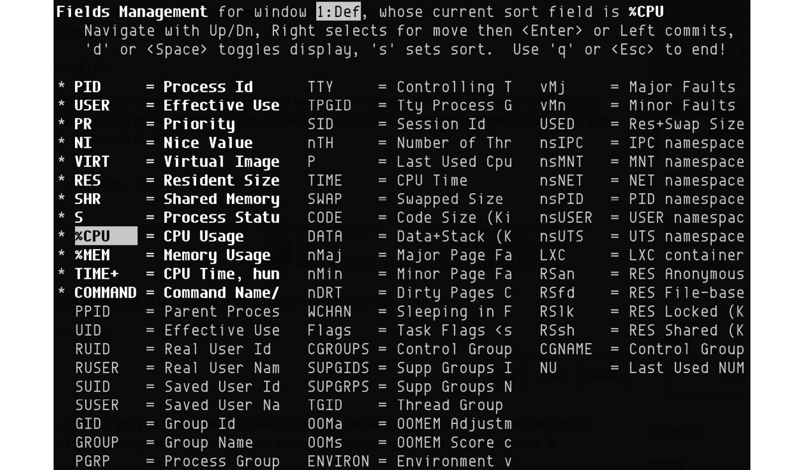

图 5.21 -交互模式下的 top 命令(Shift + F)

使用方向键可以选择要排序的字段(例如`%MEM`)，然后按*S*设置新字段，然后按*Q*退出交互模式。 交互模式排序的替代方法是调用`top`命令的`-o`选项参数，该参数指定排序字段。

例如，下面的命令列出了按 CPU 占用率排序的前 10 个进程:

```sh
top -b -o %CPU | head -n 17
```

同样，下面的命令列出了前 10 个进程，按 CPU 和内存使用情况排序:

```sh
top -b -o +%MEM | head -n 17
```

选项参数指定批处理模式操作(而不是默认的交互模式)。 选项参数`-o +%MEM`表示附加的(`+`)排序字段(`%MEM`)与默认的`%CPU`字段相结合。 `head -n 17`管道选择输出的前 17 行，包括`top`命令的 7 行头:


图 5.22 -按 CPU 和内存使用率排序的前 10 个进程

下面的命令列出了当前用户(`packt`)所拥有的按 CPU 使用率排序的前 5 个进程:

```sh
top -u $(whoami) -b -o %CPU | head -n 12
```

该命令的输出信息“”如下截图所示:


图 5.23 -当前用户拥有的前 5 个进程(按 CPU 使用率排序

`-u $(whoami)`option 参数指定`top`命令的当前用户。

使用`top`命令，我们还可以使用`-p`PID 选项参数监视特定的进程。 例如，下面的命令监视我们的测试进程(使用 PID`243436`):

```sh
top -p 243436
```

上述命令的输出如下截图所示:


图 5.24 -使用 top 命令监视特定的进程 ID (PID

我们可以在使用`top`命令时，通过按*K*来选择*杀死*进程。 我们会被我们想要终止的进程的 PID 提示:

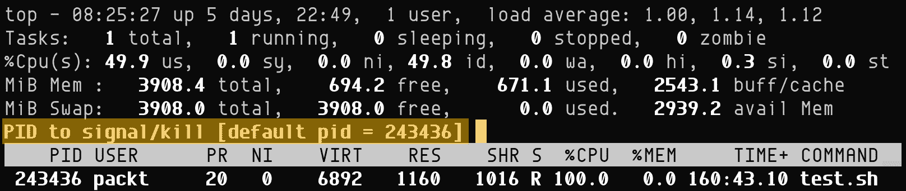

图 5.25 -使用 top 命令终止一个进程

实用工具可以在许多创造性的方式中使用。 我们希望本节中提供的示例能够激励您进一步探索基于特定需求的用例。 有关更多信息，请参考`top`命令(`man top`)的系统参考手册。

## kill 和 killall 命令

我们使用`kill`命令来终止进程。 该命令的语法如下:

```sh
kill [OPTIONS] [ -s SIGNAL | -SIGNAL ] PID [...]
```

`kill`命令向进程发送*信号*，试图停止其执行。 当没有指定信号时，发送`SIGTERM`(`15`)。 信号可以由不带`SIG`前缀的信号名称(例如`SIGKILL`为`KILL`)指定，也可以由值(例如`9`为`SIGKILL`)指定。

`kill -l`和`kill -L`命令提供了可以在 Linux 中使用的信号的完整列表:


图 5.26 - Linux 信号

每个信号都有一个数值，如上面的输出所示。 例如:`SIGKILL`=`9`。 下面的命令将终止我们的测试进程(使用 PID`243436`):

```sh
kill -9 243436
```

下面的命令和前面的命令一样:

```sh
kill -KILL 243436
```

在某些场景中，我们可能想一次性终止多个进程。 `killall`命令来拯救这里。 `killall`命令格式如下:

```sh
killall [OPTIONS] [ -s SIGNAL | -SIGNAL ] NAME...
```

`killall`向所有运行指定命令的进程发送一个信号。 当没有指定信号时，发送`SIGTERM`(`15`)。 信号可以由不带`SIG`前缀的信号名称(例如`SIGTERM`为`TERM`)指定，也可以由值(例如`SIGTERM`为`15`)指定。

例如，下面的命令终止所有运行`test.sh`脚本的进程:

```sh
killall -e -TERM test.sh
```

上述命令的输出如下截图所示:


图 5.27 -使用 killall 终止多个进程

终止进程通常会从系统进程表中删除相关的引用。 终止的进程将不再显示在`ps`、`top`或类似命令的输出中。

有关`kill`和`killall`命令的更多信息，请参阅相关的系统参考手册(`man kill`和`man killall`)。

## pgrep 和 pkill 命令

`pgrep`和`pkill`是基于模式的查找命令，用于探索和终止正在运行的进程。 它们的语法如下:

```sh
pgrep [OPTIONS] PATTERN
pkill [OPTIONS] PATTERN
```

`pgrep`遍历当前进程，并列出匹配选择模式或标准的进程 id。 类似地，`pkill`终止匹配选择标准的进程。

下面的命令查找我们的测试进程(`test.sh`)，并在找到相关进程时显示 PID:

```sh
pgrep -f test.sh
```

上述命令的输出如下截图所示:


图 5.28 -使用 pgrep 根据名称查找进程 ID

`-f|--full`选项强制我们要查找的进程的全名匹配。 我们可以结合使用`pgrep`和`ps`命令来获得关于进程的更详细的信息，如下所示:

```sh
pgrep -f test.sh | xargs ps -fp
```

以上命令的输出信息如下截图所示:

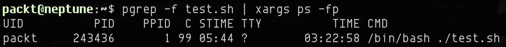

图 5.29 -链接 pgrep 和 ps 以获取更多信息

在前面的一行程序中，我们将`pgrep`命令(带有 PID`243436`)的输出通过管道传递到`ps`命令，该命令是通过`-f`(长格式)和`-p|--pid`选项调用的。 `-p`选项参数获取管道 PID 值。

要终止`test.sh`进程，只需调用`pkill`命令，如下所示:

```sh
pkill -f test.sh
```

前面的命令将*以静默的方式*终止相关进程，基于选项强制执行的全名查找。 为了从`pkill`命令的操作中获得一些反馈，我们需要调用`-e|--echo`选项，如下所示:

```sh
pkill -ef test.sh
```

上述命令的输出如下截图所示:


图 5.30 -使用 pkill 按名称终止一个进程

更多信息，请参考`pgrep`和`pkill`系统参考手册(`man pgrep`和`man pkill`)。

本节介绍了一些在涉及进程的日常 Linux 管理任务中经常使用的命令行实用程序。 请记住，在 Linux 中，大多数情况下，有许多方法可以完成特定的任务。 我们希望本节中的示例将帮助您想出处理流程的创造性方法和技术。

接下来，我们将研究一些与守护进程交互的常见方法。

# 与守护进程一起工作

如介绍部分所述，守护进程是一种特殊的后台进程。 因此，绝大多数处理进程的方法和技术也适用于守护进程。 然而，在管理(或控制)相关进程的生命周期时，有一些特定的命令严格地对守护进程进行操作。

如*守护进程*部分所述，守护进程由 shell 脚本控制，通常存储在`/etc/init.d/`或`/lib/systemd/`系统目录中，具体取决于 Linux 平台。 在传统的 Linux 系统上(例如 CentOS/RHEL 6)和 Ubuntu(甚至在最新的发行版中)，守护进程脚本文件存储在`/etc/init.d/`中。 在 CentOS/RHEL 7 和更新的平台上，它们通常存储在`/lib/systemd/`中。

守护文件和守护命令行实用程序的位置很大程度上取决于`init`初始化系统和服务管理器。 在*init 进程*一节中，我们简要地提到了 Linux 发行版中的各种`init`系统。 为了说明守护进程控制命令的使用，我们将探讨在各种 Linux 平台上广泛使用的两个`init`系统——`SysV`和`systemd`。

## 使用 SysV 守护进程

在传统的 Linux 平台上(例如，CentOS/RHEL 6 及更早版本)，`init`实现通常遵循**SysV**或**System V**Linux 系统进程初始化机制。 `SysV`(发音为*Sys Five*或*System Five*)本质上是一个遗留的服务控制器和服务管理平台，仍然存在于所有主要的 Linux 发行版中，主要是出于向后兼容性的原因。 由于本章的范围有限，我们将不深入探讨`SysV`的细节。

在`SysV`环境中，我们通常使用`service`命令来探索和控制守护进程。 例如，显示所有激活的守护进程(服务):

```sh
service --status-all
```

要查找特定守护进程(例如`httpd`)的状态，可以使用以下命令:

```sh
service httpd status
```

该命令的输出信息“”如下截图所示:


图 5.31 -在 CentOS/RHEL 6 中检查 SysV 守护进程(httpd)的状态

我们可以通过`service`命令控制调用`start`、`stop`和`restart`的守护进程(例如`httpd`)。 例如，下面的命令将停止`httpd`服务:

```sh
service httpd stop
```

上述命令的输出如下截图所示:


图 5.32 - CentOS/RHEL 6 中停止 SysV 守护进程(httpd

有关`service`命令的更多信息，请参考相关的系统参考手册(`man service`)。

在 CentOS/RHEL 6 操作系统中，要*启用*或*禁用*服务，可以使用`chkconfig`命令。 例如，以下命令禁用`httpd`守护进程:

```sh
chkconfig httpd off
```

上述命令的输出如下截图所示:


图 5.33 - CentOS/RHEL 6 中禁用 SysV 守护进程(httpd

`chkconfig`命令还用于列出通过`SysV`脚本控制的守护进程，并修改它们的**运行级别**，也称为**运行级别**。 在 Linux 系统上，运行级别是`SysV`风格的`init`构造，它指示在系统的特定运行阶段的服务可用性。 由于随着`systemd``init`系统的发展趋势，运行级别已经过时，所以我们将不讨论相关的主题。 有关运行级的更多信息，请参阅相关的系统参考手册(`man runlevel`)。

以下命令列出了所有的`SysV`服务(以 CentOS/RHEL 6 为例):

```sh
chkconfig --list
```

有关`chkconfig`命令的详细信息，请参考相关的系统参考手册(`man chkconfig`)。

## 与系统守护进程一起工作

`init`系统的基本要求是在引导 Linux 内核时，初始化和编排各个进程的启动和启动依赖。 这些进程也称为**用户域**或**用户进程**。 在系统运行时，`init`引擎还控制服务和守护进程。

在过去的几年里，大多数 Linux 平台已经过渡到`systemd`作为其默认的`init`引擎。 由于它的广泛采用，熟悉`systemd`及其相关的命令行工具至关重要。 记住这一点，本节主要关注的是`systemctl`—用于管理`systemd`守护进程的中央命令行实用程序。

`systemctl`命令格式如下:

```sh
systemctl [OPTIONS] [COMMAND] [UNITS...]
```

由`systemctl`命令调用的操作直接指向单元，这些单元是由`systemd`管理的系统资源。 在`systemd`中定义了几种单元类型(例如，服务、挂载、套接字等等)。 每个单元都有相应的文件。 这些文件的类型是从相关文件名的后缀推断出来的; 例如，`httpd.service`是 Apache web 服务(守护进程)的服务单元文件。 有关`systemd`单元的全面列表和详细描述，请参阅`systemd.unit`系统参考手册(`man systemd.unit`)。

下面的命令使一个守护进程(例如`httpd`)在引导时启动:

```sh
systemctl enable httpd
```

该命令的输出信息“”如下截图所示:

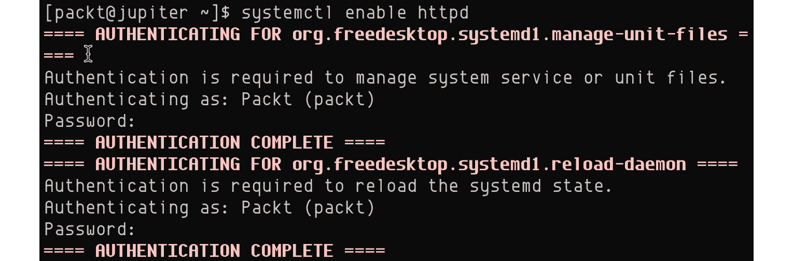

图 5.34 -启用 systemd 守护进程(httpd)

通常，调用`systemctl`命令需要超级用户特权。 我们应该注意，当我们针对服务单元时，`systemctl`不需要`.service`后缀。 下面的调用也是可以接受的:

```sh
systemctl enable httpd.service
```

禁用`httpd`服务在启动时启动的命令如下:

```sh
systemctl disable httpd
```

需要查询`httpd`服务的状态，使用如下命令:

```sh
systemctl status httpd
```

上述命令的输出如下截图所示:

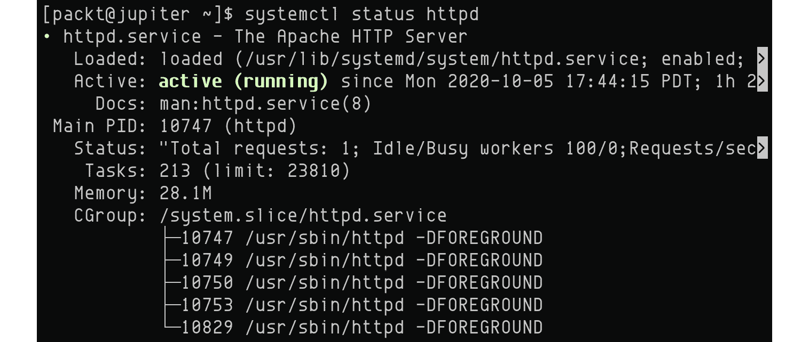

图 5.35 -查询 systemd 守护进程(httpd)的状态

或者，我们可以使用以下命令检查`httpd`服务的状态:

```sh
systemctl is-active httpd
```

该命令的输出信息“”如下截图所示:


图 5.36 -查询 systemd 守护进程(httpd)的活动状态

下面的命令停止或启动`httpd`服务:

```sh
systemctl stop httpd
systemctl start httpd
```

有关`systemctl`的更多信息，请参考相关系统参考手册(`man systemctl`)。 有关`systemd`内部元件的更多信息，请参阅相应的参考手册(`man systemd`)。

处理进程和守护进程是日常 Linux 管理任务的一个永恒主题。 掌握相关的命令行实用程序是任何经验丰富的用户的基本技能。 但是，一个正在运行的进程或守护进程也应该考虑与本地或远程系统上运行的其他进程或守护进程之间的关系。 进程之间的通信方式对某些人来说可能有点神秘。 在下一节中，我们将解释进程间通信的工作方式。

# 探索进程间通信

**进程间通信**(**IPC**)是进程之间使用共享机制或接口进行交互的一种方式。 在本节中，我们将采取实际的方法来探索进程之间的各种通信机制。 Linux 进程通常可以通过以下接口共享数据并同步它们的操作:

*   共享存储(文件)
*   共享内存
*   已命名和未命名管道
*   消息队列
*   套接字
*   信号

为了说明大多数通信机制，我们将使用**生产者**和**消费者**流程的模型来构建示例。 生产者和消费者共享一个公共接口，生产者在其中写入消费者读取的数据。 IPC 机制通常在分布式系统中实现，围绕或多或少复杂的应用构建。 我们的示例将使用简单的 bash 脚本(`producer.sh`和`consumer.sh`)，从而模拟生产者和消费者流程。 我们希望这种简单模型的使用仍然能为现实世界的应用提供一个合理的类比。

让我们看看前面列举的每个 IPC 机制。

## 共享存储

在最简单的形式中，IPC 机制的共享存储可以是一个保存到磁盘的简单文件。 生产者然后写入文件，而消费者从相同的文件读取。 在这个简单的用例中，明显的挑战是读写操作的完整性，因为底层操作之间可能存在竞争条件。 为了避免竞争条件，文件必须在写操作期间被锁定，以防止 I/O 与另一个读或写操作重叠。 为了简单起见，我们不打算在简单的例子中解决这个问题，但我们认为有必要把它说出来。

下面是制作人(左)和消费者(右)脚本:

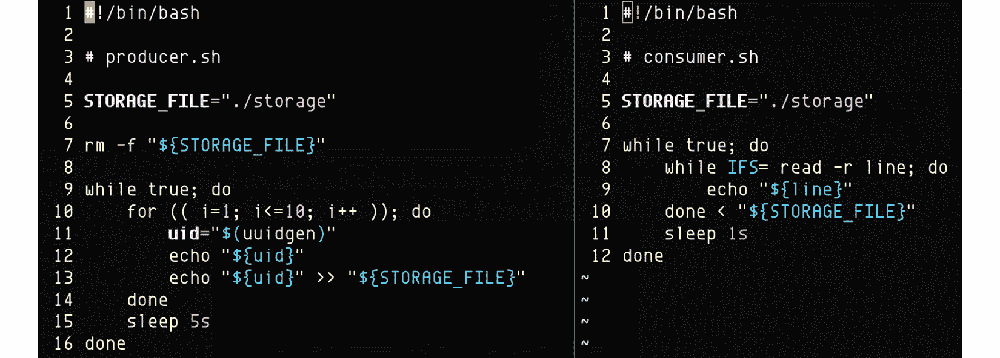

图 5.37 -生产者(左)和消费者(右)脚本(使用共享存储)

在我们的示例中，生成器每`5`秒向`storage`文件写入一组新的数据(`10`随机 UUID 字符串)。 消费者每秒钟读取`storage`文件的内容:


图 5.38 -生产者(左)和消费者(右)通过共享存储通信

生产者和消费者数据提要在任何时候都是相同的。 两个进程通过共享的`storage`文件进行通信。

## 共享内存

Linux 中的进程通常有单独的地址空间。 一个进程只能访问另一个进程的内存中的数据，前提是两个进程共享一个公共的内存段来存储这些数据。 Linux 至少提供了两个**应用编程接口**(**API**)，以编程方式定义和控制进程之间的共享内存:一个遗留的 System V API 和最新的 POSIX API。 这两个 api 都是用 C 编写的，尽管生产者和消费者模型的实现超出了本书的范围。 但是，我们可以通过使用`/dev/shm`临时文件存储系统来与共享内存方法进行紧密匹配，该系统使用系统的 RAM 作为其后备存储(即 RAM 磁盘)。

通过将`/dev/shm`用作共享内存，我们可以重用*共享存储*节示例中的生产者-消费者模型，在该示例中，我们只需将存储文件指向`/dev/shm/storage`。

共享内存和共享存储 IPC 模型可能不能很好地处理大量数据，特别是海量数据流。 替代方案是使用 IPC 通道，可以通过管道、消息队列或套接字通信层启用 IPC 通道。

## 未命名管道

**未命名的**或**匿名的**管道，也称为**常规的**管道，将一个进程的输出提供给另一个进程的输入。 使用我们的生产者-消费者模型，将未命名的管道描述为两个进程之间的 IPC 机制的最简单方法是:

```sh
producer.sh | consumer.sh
```

前面插图的关键元素是管道(`|`)符号。 管道的左侧产生一个输出，该输出直接被输送到管道的右侧供用户使用。 为了适应匿名管道 IPC 层，我们将对我们的生产者和消费者脚本做一个轻微的修改:

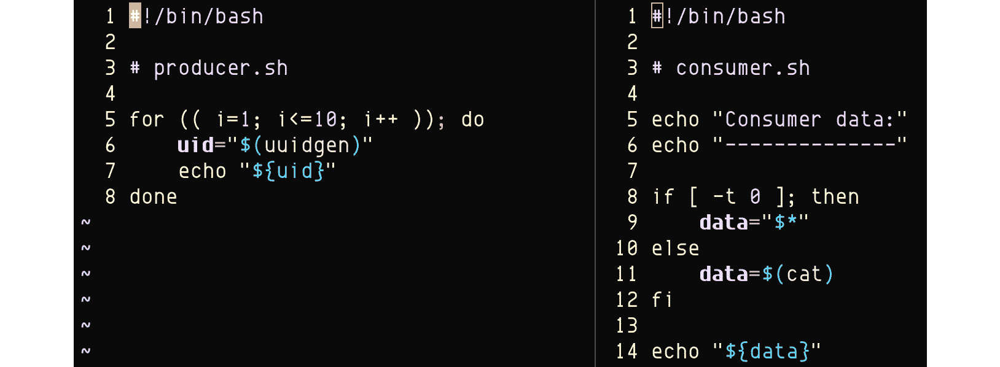

图 5.39 -生产者(左)和消费者(右)脚本(使用未命名管道)

在我们的修改后的实现中，生产者将一些数据打印到控制台(`10`随机 UUID 字符串)。 消费者读取并显示通过`/dev/stdin`管道的数据，或者如果管道为空，则显示输入参数。 `consumer.sh`脚本中的`8`行检查`/dev/stdin`中是否存在管道数据(`0`for`fd0`:

```sh
if [ -t 0 ]; then
```

生产者-消费者沟通的输出如下截图所示:


图 5.40 -生产者通过未命名管道将数据提供给消费者

输出清楚地显示了消费者流程正在打印的数据。 (注意 UUID 字符串前面的`"Consumer data:"`头。)

IPC 匿名管道的问题之一是，在生产者和消费者之间输入的数据不能通过任何类型的存储层持久化。 如果生产者或消费者进程被终止，管道就会消失，基础数据就会丢失。 命名管道解决了这个问题。

## 命名管道

命名管道，也称为**First In, First Outs**(**FIFOs**)，与传统的(未命名的)管道相似，但在其语义上有很大的不同。 未命名管道只在相关的进程运行时持续存在。 然而，命名管道具有后备存储，并且将在系统启动时持续使用，无论连接到相关 IPC 通道的进程的运行状态如何。

通常，命名管道充当一个文件，当不再使用它时，可以删除它。 让我们修改我们的生产者和消费者脚本，以便我们可以使用一个命名管道作为他们的 IPC 通道:

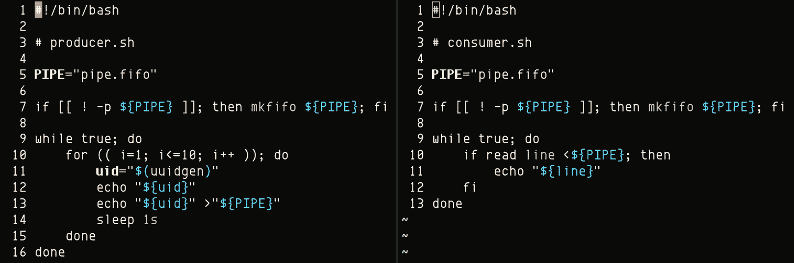

图 5.41 -生产者(左)和消费者(右)脚本(使用命名管道)

命名管道是`pipe.info`(两个脚本中的`5`行)。 管道文件是由生产者或消费者在开始时创建的(第`7`行)。 相关命令是`mkfifo`(参见`man mkfifo`了解更多信息)。

生产者每秒钟向指定管道写入一个随机 UUID(`producer.sh`中的`13`行)，而消费者立即读取它(`consumer.sh`中的`10`-`11`行):


图 5.42 -生产者(左)和消费者(右)通过命名管道通信

我们以任意的顺序开始了两个脚本——生产者和消费者。 过了一会儿，我们停止(中断)用户(**步骤 1**)。 生产者继续运行，但自动停止向管道发送数据。 然后，我们又开始消费。 生产设备立即恢复向管道发送数据。 过了一会儿，我们停止了生产者(**步骤 2**)。 这一次，消费者变得无所事事。 在再次启动生产设备后，两者都恢复了正常运行，数据开始通过命名管道。 该工作流显示了命名管道的持久性和弹性，无论生产者或消费者流程的运行状态如何。

命名管道本质上是队列，其中数据以先到先得的方式排队和退出队列。 当两个以上的进程在 IPC 命名管道通道上通信时，FIFO 方法可能不适合这种情况，特别是当特定的进程要求更高的数据处理优先级时。 消息队列在这里发挥了作用。

## 消息队列

消息队列是一种异步通信机制，通常在分布式系统架构中使用。 消息被写入并存储在队列中，直到它们被处理并最终删除。 消息由生产者编写(发布)，只处理一次，通常由单个消费者处理。 在非常高的级别上，消息具有序列、有效负载和类型。 消息队列可以调节消息的检索(顺序)(例如，基于优先级或类型):

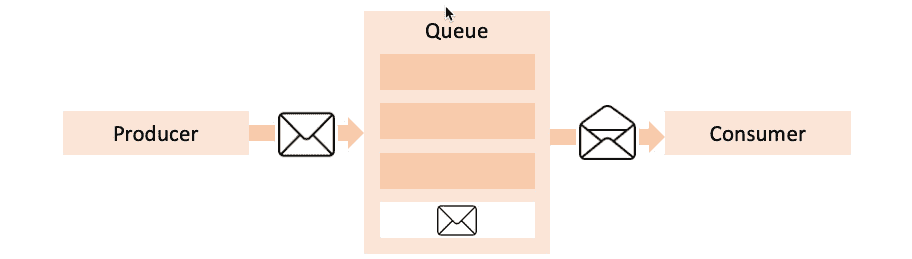

图 5.43 -消息队列(简化视图)

对消息队列或其模拟实现的详细分析决不是琐碎的，它的超出了本章的范围。 有许多开源消息队列实现可用于大多数 Linux 平台(RabbitMQ, ActiveMQ, ZeroMQ, MQTT，等等)。

基于消息队列和管道的 IPC 机制是单向的。 一个进程写入数据; 另一个人读它。 有命名管道的双向实现，但所涉及的复杂性会对底层通信层产生负面影响。

对于双向通信，您可以考虑使用基于套接字的 IPC 通道。 下一节将向您展示如何做到这一点。

## 插座

IPC 基于 socket 的设备有和两种类型:

*   **IPC 套接字**:也称为 Unix 域套接字
*   **网络套接字**:**传输控制协议**(**TCP**)和**用户数据报协议**(**UDP**)套接字

IPC 套接字使用本地文件作为套接字地址，并允许同一主机上的进程之间进行双向通信。 另一方面，网络套接字通过 TCP/UDP 网络将 IPC 数据连接层扩展到本地机器之外。 除了实现上的明显差异外，IPC 套接字和网络套接字的数据通信通道表现相同。

这两个套接字都被配置为流，支持双向通信，并模拟客户机/服务器模式。 套接字的通信通道是活动的，直到它在任何一端关闭，从而中断 IPC 连接。

让我们调整我们的生产者-消费者模型来模拟 IPC 套接字(Unix 域套接字)数据连接层。 我们将使用`netcat`来处理底层客户机/服务器 IPC 套接字的连接。 `netcat`是一个强大的网络工具，用于使用 TCP、UDP 和 ICP 套接字连接读写数据。 如果在您选择的 Linux 发行版上没有默认安装`netcat`，您可以按照以下方式安装它。

在 Ubuntu 上，使用以下命令:

```sh
sudo apt-get install netcat
```

在 CentOS/RHEL 操作系统中使用如下命令:

```sh
sudo yum install nmap
```

有关`netcat`的更多信息，请参考相关系统参考手册(`man netcat`):

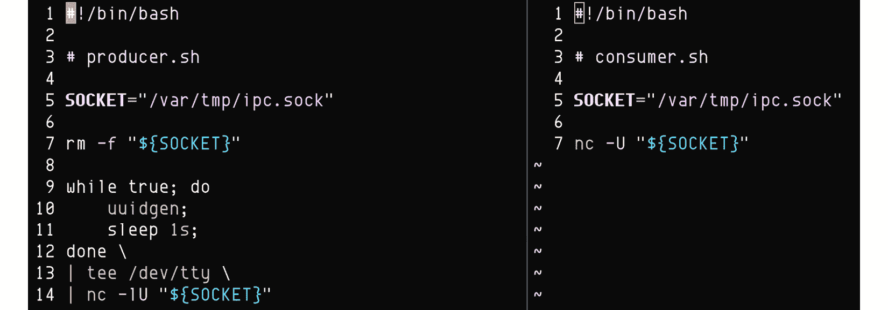

图 5.44 -生产者(左)和消费者(右)脚本(使用 IPC 套接字)

生产者作为服务器，使用 IPC 套接字(`producer.sh`中的`14`行)初始化一个`netcat`侦听器端点:

```sh
nc -lU "${SOCKET}"
```

选项`-l`表示侦听器(服务器)模式，而选项`-U "${SOCKET}"`指定 IPC 套接字类型(Unix 域套接字)。 使用者使用类似的命令(`consumer.sh`中的`7`行)作为客户端连接到`netcat`服务器端点。 生产者和消费者都使用相同的(共享的)IPC 套接字文件描述符`(/var/tmp/ipc.sock`进行通信，如行`5`中定义的那样。

生产者每秒钟向消费者发送随机 UUID 字符串(`producer.sh`中的`9`-`12`行)。 相关输出在`stdout`中通过`tee`命令(第`13`行)捕获，然后通过管道传递到`netcat`(第`14`行):

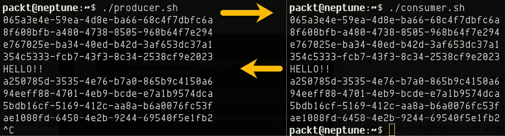

图 5.45 -生产者(左)和消费者(右)通过 IPC 套接字通信

使用者获取由生产者生成的所有消息(uuid)。 此外，我们还手动从消费者向生产者发送了一条`HELLO!!`消息，以演示两者之间的双向通信流。

在我们的生产者-消费者模型中，我们使用`netcat`作为 IPC 套接字通信层。 或者，我们可以使用类似的网络工具`socat`。

在结束 IPC 工具箱之前，让我们先快速停下来讨论一下信号。 我们在本节开始时提到，信号是另一种 IPC 机制。 实际上，它们是 IPC 的一种有限形式，因为进程可以通过信号协调彼此之间的同步。 但信号不携带任何数据有效载荷。 它们只是将事件通知流程，流程可以选择采取特定的操作来响应这些事件。

下面的部分将详细介绍信号。

## 使用信号工作

在 Linux 中，信号是一种单向异步通知机制，用于响应特定条件。 信号可以在以下任何方向起作用:

*   从 Linux 内核到任意进程
*   从一个过程到另一个过程
*   从一个过程到它自己

信号通常警报 Linux 过程对一个特定的事件,比如段错误(`SIGSEGV`)提出的内核或执行被打断(`SIGINT`)由用户按*Ctrl + C*【5】。 在 Linux 中，进程是通过信号控制的。 Linux 内核定义了几十个信号。 每个信号都有一个相应的非零正整数值。 下面的命令列出了所有已经在 Linux 系统中注册的信号:

```sh
kill -l
```

上述命令的输出如下截图所示:


图 5.46 - Linux 信号

例如，`SIGHUP`有一个信号值`1`，当它退出时，它被终端会话调用到它的所有子进程。 `SIGKILL`的信号值为`9`，最常用于终止进程。 进程通常可以控制如何处理信号，除了`SIGKILL`(`9`)和`SIGSTOP`(`19`)，它们总是分别结束或停止进程。

进程以以下方式处理信号:

*   执行信号所暗示的默认动作; 例如，停止、终止、core-dump 进程，或者什么都不做。
*   执行自定义操作(除了`SIGKILL`和`SIGSTOP`)。 在这种情况下，进程捕获信号并以特定的方式处理它。

当一个程序为一个信号实现一个自定义处理程序时，它通常定义一个信号处理函数来改变进程的执行，如下所示:

*   当接收到信号时，进程的执行在当前指令处中断。
*   进程的执行立即跳转到信号处理函数
*   信号处理函数运行。
*   当信号处理函数退出时，进程继续执行，从之前中断的指令开始。

以下是一些与信号相关的简短术语:

*   信号是由产生它的过程产生的。
*   一个信号被处理它的进程捕获。
*   如果进程有相应的**无操作**或**无操作**(**NOOP**)处理程序，则忽略信号。
*   如果进程在捕获信号时实现了特定的操作，则处理信号。

`man signal.h`系统参考手册捕捉每个信号的详细描述。 这里的一个摘录:

```sh
man signal.h
```

上述命令的输出如下截图所示:


图 5.47 -信号定义摘录(摘自 man signal.h)

突出显示的信号——`SIGKILL`和`SIGSTOP`是唯一不能被捕捉或忽略的信号。 、`Default Action`列中的值具有以下意义(也从`man signal.h`中获取):

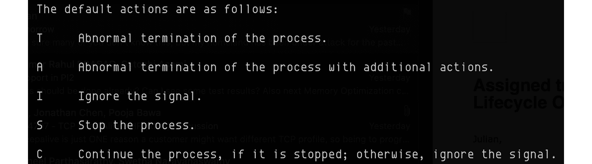

图 5.48 -默认动作(来自 man signal.h)

让我们来探索一些处理信号的用例:

*   当内核提出了一个`SIGKILL`,`SIGFPE`(浮点异常),`SIGSEGV`(段错误),`SIGTERM`,或类似的信号,通常情况下,接收信号立即终止执行的过程,可能生成一个核心转储,图像的过程,用于调试目的。
*   当用户类型*Ctrl + C*——也被称为一个**中断字符【显示】(**INTR**),而一个前台进程运行时,`SIGINT`信号发送到进程。 除非底层程序为`SIGINT`实现了一个特殊的处理程序，否则进程将终止。****
***   Using the `kill` command, we can send a signal to any process based on its PID. The following command sends a `SIGHUP` signal to a Terminal session with PID `3741`:

    ```sh
    kill -HUP 3741
    ```

    在前面的命令中，我们既可以指定信号值(例如，`SIGHUP`的信号值为`1`)，也可以只指定不带`SIG`前缀的信号名称(例如，`SIGHUP`的信号值为`HUP`)。

    使用`killall`，我们可以表示多个进程正在运行一个特定的命令(例如，`test.sh`)。 下面的命令终止所有运行`test.sh`脚本的进程，并将结果输出到控制台(通过`-e`选项):

    ```sh
    killall -e -TERM test.sh
    ```

    命令回显信息如下:

    ** 

 **图 5.49 -使用 killall 终止多个进程

*   让我们假设我们有以下 bash 脚本(`test.sh`)，它实现了`SIGUSR1`的信号处理程序:


图 5.50 - Bash 脚本实现 SIGUSR1 的信号处理程序

行`3`定义了一个信号处理函数(`sig_handler`)来捕获`SIGUSR1`:

```sh
trap sig_handler SIGUSR1
```

我们可以将脚本作为后台进程运行:

```sh
./test.sh &
```

我们可以让相关的后台进程运行一段时间，然后用下面的命令发送一个`SIGUSR1`信号:

```sh
killall -e -USR1 test.sh
```

输出如下:

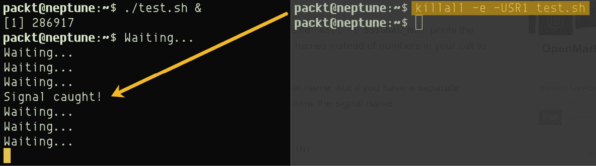

图 5.51 - Bash 脚本实现 SIGUSR1 的信号处理程序

bash 脚本(`test.sh`)捕获`SIGUSR1`信号，执行`sig_handler()`函数，然后继续执行。

Linux 进程和信号是一个巨大的领域。 我们在这里提供的信息远远不是关于这个主题的全面指南。 我们希望这种展示一些常见用例的实用的旋转和亲身实践的方法能够激励您接受并可能掌握更有挑战性的问题。

# 总结

详细研究 Linux 进程和守护进程可能是一项重要的工作。 在这个主题上有价值的著作取得了令人钦佩的成功的地方，一个相对简短的章节可能会相形见绌。 然而在这一章中，我们试图给我们所认为的一切披上一层现实的、现实的、实用的外衣，以弥补我们在抽象或学术领域可能存在的缺陷。

在这一点上，我们希望您能够适应进程和守护进程的工作。 到目前为止，您收集到的技能应该包括对流程类型和内部结构的相对良好的掌握，以及对流程属性和状态的合理理解。 特别注意进程间通信机制，特别是信号。 对于每一个主题，我们都进行了实际的深入研究，并探讨了我们认为与日常 Linux 管理任务相关的相关命令、工具和脚本。

下一章将进一步深入研究 Linux 磁盘和文件系统。 我们将探讨 Linux 存储、磁盘分区和**逻辑卷管理**(**LVM**)的概念。 请放心，我们到目前为止学到的一切都将在接下来的章节中得到很好的应用。

# 问题

如果你浏览了本章的某些部分，你可能想回顾一下 Linux 进程和守护进程的一些重要细节:

1.  考虑一些进程类型。 它们会如何比较呢?
2.  想想过程的解剖。 在检查进程时，您能提供一些必要的进程属性(或`ps`命令行输出中的字段)吗?
3.  你能想出几个过程状态和它们之间的一些动态或可能的转换吗?
4.  如果您正在寻找一个占用系统上大部分 CPU 的进程，您将如何继续?
5.  您能编写一个简单的脚本并使其成为一个长期存在的后台进程吗?
6.  列举至少四个您能想到的进程信号。 何时或如何调用这些信号?
7.  考虑两种 IPC 机制。 试着提出一些赞成和反对他们的意见。**