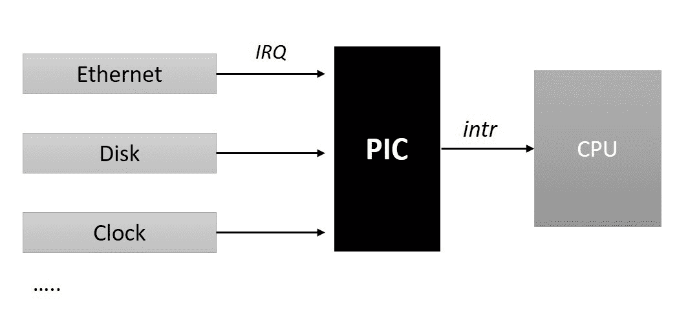
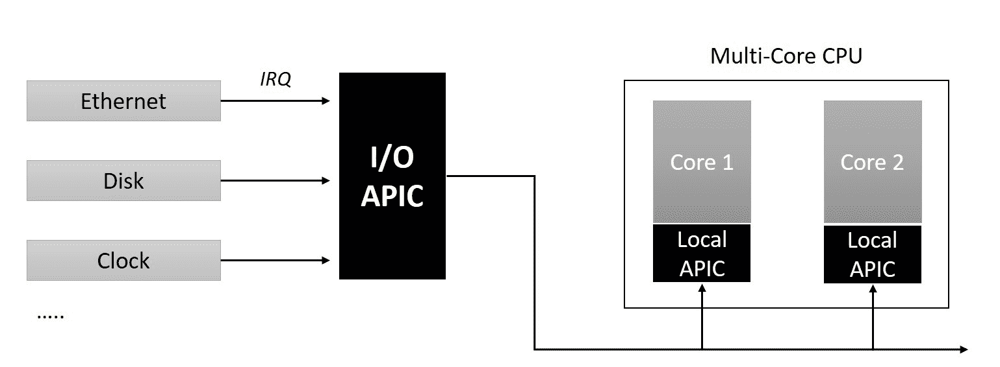

# 九、中断和延迟

**中断**是传送到处理器的电信号，指示需要立即关注的重大事件的发生。这些信号可以来自外部硬件(连接到系统)或处理器内的电路。在本章中，我们将研究内核的中断管理子系统，并探讨以下内容:

*   可编程中断控制器
*   中断向量表
*   伊尔克斯
*   IRQ 芯片和 IRQ 描述符
*   注册和注销中断处理程序
*   线路控制操作
*   IRQ 堆栈
*   对延迟例程的需求
*   软中断
*   小任务
*   工作队列

# 中断信号和向量

当中断来自外部设备时，它被称为**硬件中断**。这些信号由外部硬件产生，以在发生重大外部事件时引起处理器的注意，例如键盘上的键击、鼠标按钮上的点击或移动鼠标触发硬件中断，通过这些硬件中断通知处理器要读取的数据的可用性。硬件中断相对于处理器时钟异步发生(意味着它们可以在随机时间发生)，因此也被称为**异步中断**。

由于当前正在执行的程序指令产生的事件而从中央处理器内部触发的中断被称为**软件中断**。软件中断由当前正在执行的程序指令触发的**异常**或引发中断的特权指令的执行引起。例如，当一条程序指令试图将一个数除以 0 时，处理器的算术逻辑单元会引发一个被称为被零除异常的中断。类似地，当正在执行的程序打算调用内核服务调用时，它会执行一个特殊指令(sysenter)，该指令会引发一个中断，将处理器转换到特权模式，这为执行所需的服务调用铺平了道路。这些事件相对于处理器的时钟同步发生，因此也被称为**同步中断**。

为了响应中断事件的发生，中央处理器被设计为抢占当前的指令序列或执行线程，并执行一种称为**中断服务例程** ( **ISR** )的特殊功能。为了定位对应于中断事件的适当的 ***ISR*** ，使用**中断向量表**。**中断向量**是内存中的一个地址，包含对软件定义的**中断服务**的引用，该服务将响应中断而执行。处理器架构定义了支持的**中断向量**的总数，并描述了内存中每个中断向量的布局。一般来说，对于大多数处理器架构，所有支持的向量都在内存中设置为名为**中断向量表的列表，**的地址由平台软件编程到处理器寄存器中。

让我们考虑一下 *x86* 架构的细节，作为一个更好理解的例子。x86 系列处理器总共支持 256 个中断向量，其中前 32 个用于处理器异常，其余用于软件和硬件中断。x86 实现的向量表被称为**中断描述符表(IDT)** ，它是 8 字节(对于 32 位机器)或 16 字节(对于 64 位 *x86* 机器)大小的描述符数组。在早期引导期间，内核代码的架构特定分支在内存中设置 **IDT** ，并使用物理起始地址和 **IDT** 的长度对处理器的 **IDTR** 寄存器(特殊 x86 寄存器)进行编程。当中断发生时，处理器通过将报告的矢量数乘以矢量描述符的大小来定位相关的矢量描述符(x86_32 机器上的*矢量数 x 8* ，x86_64 机器上的*矢量号 x 16* ，并将结果添加到 **IDT 的基址。**一旦达到有效的*向量描述符*，处理器继续执行描述符中指定的动作。

On x86 platforms, each *vector descriptor* implements a *gate* (interrupt, task, or trap)*,* which is used to transfer control of execution across segments. Vector descriptors representing hardware interrupts implement an *interrupt gate,* which refers to the base address and offset of the segment containing interrupt handler code. An *interrupt gate* disables all maskable interrupts before passing control to a specified interrupt handler. Vector descriptors representing *exceptions* and software interrupts implement a *trap gate,* which also refers to the location of code designated as a handler for the event. Unlike an *interrupt gate*, a *trap gate* does not disable maskable interrupts, which makes it suitable for execution of soft interrupt handlers.

# 可编程中断控制器

现在，让我们专注于外部中断，探索处理器如何识别外部硬件中断的发生，以及它们如何发现与中断相关联的矢量数。CPU 设计有一个专用输入引脚(intr 引脚)，用于发出外部中断信号。每个能够发出中断请求的外部硬件设备通常由一个或多个称为**中断请求线(IRQ)** 的输出引脚组成，用于向中央处理器发出中断请求信号。所有计算平台都使用一个名为**可编程中断控制器(PIC)** 的硬件电路，在各种中断请求线上复用中央处理器的中断引脚。源自板载设备控制器的所有现有 IRQ 线路都被路由到中断控制器的输入引脚，中断控制器监控每个 IRQ 线路的中断信号，并在中断到达时，将请求转换为 cpu 可理解的矢量数，并将中断信号中继到 CPU 的中断引脚。简而言之，可编程中断控制器将多条设备中断请求线多路复用到处理器的一条中断线上:



中断控制器的设计和实现是特定于平台的*。*英特尔 *x86* 多处理器平台使用**高级可编程中断控制器** ( **APIC** )。 **APIC** 设计将中断控制器功能分为两个不同的芯片组:第一个组件是位于系统总线上的**输入/输出 APIC** 。所有共享的外围硬件 IRQ 线路都被路由到输入/输出 APIC；该芯片将中断请求转换为矢量代码 ***。*** 第二个是名为**本地 APIC** 的每 CPU 控制器(通常集成在处理器内核中)，它向特定的 CPU 内核提供硬件中断。**输入/输出 APIC** 将中断事件路由到所选中央处理器内核的本地 APIC 。它用重定向表编程，用于做出中断路由决定。中央处理器**本地中央处理器**管理特定中央处理器内核的所有外部中断；此外，它们还从定时器等 CPU 本地硬件传递事件，还可以接收和生成可在 SMP 平台上发生的**处理器间中断** **(IPIs)** 。

下图描述了 **APIC** 的拆分架构。事件流程现在从单个设备在**输入/输出 APIC** 上发出 IRQ 开始，IRQ 将请求路由到特定的**本地 APIC** ，后者再将中断传递到特定的 CPU 内核:



类似于 **APIC** 架构，多核 ARM 平台将**通用中断控制器** ( **GIC** )实现拆分为两个。第一个组件被称为**分配器，**对于系统是全局的，并且有几个物理路由到它的外围硬件中断源。第二个组件是按 CPU 复制的，称为 **cpu 接口**。*分配器*组件通过**共享外设中断** ( ***SPI)*** 的分配逻辑编程到已知的 CPU 接口。

# 中断控制器操作

内核代码的特定于架构的分支实现了中断控制器特定的操作，用于管理 IRQ 线路，例如屏蔽/取消屏蔽单个中断、设置优先级和 SMP 关联性。这些操作需要从内核的独立于架构的代码路径中调用，用于操作单个的 IRQ 行，为了便于这种调用，内核通过一个名为`struct irq_chip`的结构定义了一个独立于架构的抽象层。这个结构可以在内核头`<include/linux/irq.h>`中找到:

```sh
struct irq_chip {
     struct device *parent_device;
     const char    *name;
     unsigned int (*irq_startup)(struct irq_data *data);
     void (*irq_shutdown)(struct irq_data *data);
     void (*irq_enable)(struct irq_data *data);
     void (*irq_disable)(struct irq_data *data);

     void (*irq_ack)(struct irq_data *data);
     void (*irq_mask)(struct irq_data *data);
     void (*irq_mask_ack)(struct irq_data *data);
     void (*irq_unmask)(struct irq_data *data);
     void (*irq_eoi)(struct irq_data *data);

     int (*irq_set_affinity)(struct irq_data *data, const struct cpumask
                             *dest, bool force);

     int (*irq_retrigger)(struct irq_data *data);    
     int (*irq_set_type)(struct irq_data *data, unsigned int flow_type);
     int (*irq_set_wake)(struct irq_data *data, unsigned int on);    
     void (*irq_bus_lock)(struct irq_data *data);   
     void (*irq_bus_sync_unlock)(struct irq_data *data);    
     void (*irq_cpu_online)(struct irq_data *data);   
     void (*irq_cpu_offline)(struct irq_data *data);   
     void (*irq_suspend)(struct irq_data *data); 
     void (*irq_resume)(struct irq_data *data); 
     void (*irq_pm_shutdown)(struct irq_data *data); 
     void (*irq_calc_mask)(struct irq_data *data); 
     void (*irq_print_chip)(struct irq_data *data, struct seq_file *p);    
     int (*irq_request_resources)(struct irq_data *data); 
     void (*irq_release_resources)(struct irq_data *data); 
     void (*irq_compose_msi_msg)(struct irq_data *data, struct msi_msg *msg);
     void (*irq_write_msi_msg)(struct irq_data *data, struct msi_msg *msg);  

     int (*irq_get_irqchip_state)(struct irq_data *data, enum  irqchip_irq_state which, bool *state);
     int (*irq_set_irqchip_state)(struct irq_data *data, enum irqchip_irq_state which, bool state);

     int (*irq_set_vcpu_affinity)(struct irq_data *data, void *vcpu_info);   
     void (*ipi_send_single)(struct irq_data *data, unsigned int cpu);   
     void (*ipi_send_mask)(struct irq_data *data, const struct cpumask *dest);      unsigned long flags; 
};
```

该结构声明了一组函数指针，以说明跨各种硬件平台的 IRQ 芯片的所有特性。因此，由板特定代码定义的结构的特定实例通常只支持可能操作的子集。以下是 x86 多核平台版本的`irq_chip`实例，定义了 I/O APIC 和 LAPIC 的操作。

```sh
static struct irq_chip ioapic_chip __read_mostly = {
              .name             = "IO-APIC",
              .irq_startup      = startup_ioapic_irq,
              .irq_mask         = mask_ioapic_irq,
              .irq_unmask       = unmask_ioapic_irq,
              .irq_ack          = irq_chip_ack_parent,
              .irq_eoi          = ioapic_ack_level,
              .irq_set_affinity = ioapic_set_affinity,
              .irq_retrigger    = irq_chip_retrigger_hierarchy,
              .flags            = IRQCHIP_SKIP_SET_WAKE,
};

static struct irq_chip lapic_chip __read_mostly = {
              .name            = "local-APIC",
              .irq_mask        = mask_lapic_irq,
              .irq_unmask      = unmask_lapic_irq,
              .irq_ack         = ack_lapic_irq,
};
```

# IRQ 描述符表

另一个重要的抽象是关于与硬件中断相关的 IRQ 号。中断控制器用唯一的硬件 IRQ 号识别每个 IRQ 源。内核的通用中断管理层将每个硬件 IRQ 映射到一个唯一的标识符，称为 Linux IRQ 这些数字抽象了硬件 IRQ，从而保证了内核代码的可移植性。所有外围设备驱动程序都被编程为使用 Linux IRQ 号来绑定或注册它们的中断处理程序。

Linux IRQs 用 IRQ 描述符结构表示，由`struct irq_desc`定义；对于每个 IRQ 源，在早期内核引导期间会枚举这个结构的一个实例。IRQ 描述符列表保存在一个由 IRQ 号索引的数组中，称为 IRQ 描述符表:

```sh
 struct irq_desc {
      struct irq_common_data    irq_common_data;
      struct irq_data           irq_data;
      unsigned int __percpu    *kstat_irqs;
      irq_flow_handler_t        handle_irq;
#ifdef CONFIG_IRQ_PREFLOW_FASTEOI
      irq_preflow_handler_t     preflow_handler;
#endif
      struct irqaction         *action;    /* IRQ action list */
      unsigned int             status_use_accessors;
      unsigned int             core_internal_state__do_not_mess_with_it;
      unsigned int             depth;    /* nested irq disables */
      unsigned int             wake_depth;/* nested wake enables */
      unsigned int             irq_count;/* For detecting broken IRQs */
      unsigned long            last_unhandled;   
      unsigned int             irqs_unhandled;
      atomic_t                 threads_handled;
      int                      threads_handled_last;
      raw_spinlock_t           lock;
      struct cpumask           *percpu_enabled;
      const struct cpumask     *percpu_affinity;
#ifdef CONFIG_SMP
     const struct cpumask         *affinity_hint;
     struct irq_affinity_notify   *affinity_notify;

     ...
     ...
     ...
};
```

`irq_data`是`struct irq_data`的一个实例，它包含与中断管理相关的低级信息，如 Linux IRQ 号、硬件 IRQ 号以及指向中断控制器操作的指针(`irq_chip`)等重要字段:

```sh
/**
 * struct irq_data - per irq chip data passed down to chip functions
 * @mask:          precomputed bitmask for accessing the chip registers
 * @irq:           interrupt number
 * @hwirq:         hardware interrupt number, local to the interrupt domain
 * @common:        point to data shared by all irqchips
 * @chip:          low level interrupt hardware access
 * @domain:        Interrupt translation domain; responsible for mapping
 *                 between hwirq number and linux irq number.
 * @parent_data:   pointer to parent struct irq_data to support hierarchy
 *                 irq_domain
 * @chip_data:     platform-specific per-chip private data for the chip
 *                 methods, to allow shared chip implementations
 */

struct irq_data { 
       u32 mask;    
       unsigned int irq;    
       unsigned long hwirq;    
       struct irq_common_data *common;    
       struct irq_chip *chip;    
       struct irq_domain *domain; 
#ifdef CONFIG_IRQ_DOMAIN_HIERARCHY    
       struct irq_data *parent_data; 
#endif    
       void *chip_data; 
};
```

`irq_desc`结构的`handle_irq`元素是一个类型为`irq_flow_handler_t`的函数指针，它指的是一个处理线上流程管理的高级函数。通用 irq 层提供一组预定义的 irq 流函数；根据类型为每条中断线路分配一个适当的例程。

*   `handle_level_irq()`:电平触发中断的通用实现
*   `handle_edge_irq()`:边沿触发中断的通用实现
*   `handle_fasteoi_irq()`:中断的通用实现，只需要在处理程序的末尾有一个 EOI
*   `handle_simple_irq()`:简单中断的通用实现
*   `handle_percpu_irq()`:每个中央处理器中断的通用实现
*   `handle_bad_irq()`:用于虚假中断

`irq_desc`结构的`*action`元素是指向一个或一系列动作描述符的指针，这些描述符包含驱动程序特定的中断处理程序以及其他重要元素。每个动作描述符都是内核头`<linux/interrupt.h>`中定义的`struct irqaction`的一个实例:

```sh
/**
 * struct irqaction - per interrupt action descriptor
 * @handler: interrupt handler function
 * @name: name of the device
 * @dev_id: cookie to identify the device
 * @percpu_dev_id: cookie to identify the device
 * @next: pointer to the next irqaction for shared interrupts
 * @irq: interrupt number
 * @flags: flags 
 * @thread_fn: interrupt handler function for threaded interrupts
 * @thread: thread pointer for threaded interrupts
 * @secondary: pointer to secondary irqaction (force threading)
 * @thread_flags: flags related to @thread
 * @thread_mask: bitmask for keeping track of @thread activity
 * @dir: pointer to the proc/irq/NN/name entry
 */
struct irqaction {
       irq_handler_t handler;
       void * dev_id;
       void __percpu * percpu_dev_id;
       struct irqaction * next;
       irq_handler_t thread_fn;
       struct task_struct * thread;
       struct irqaction * secondary;
       unsigned int irq;
       unsigned int flags;
       unsigned long thread_flags;
       unsigned long thread_mask;
       const char * name;
       struct proc_dir_entry * dir;
};  
```

# 高级中断管理接口

通用 IRQ 层为设备驱动程序提供了一组功能接口，用于获取 IRQ 描述符和绑定中断处理程序、释放 IRQ、启用或禁用中断线路等。我们将在这一节探讨所有的通用接口。

# 注册中断处理程序

```sh
typedef irqreturn_t (*irq_handler_t)(int, void *);

/**
 * request_irq - allocate an interrupt line
 * @irq: Interrupt line to allocate
 * @handler: Function to be called when the IRQ occurs.
 * @irqflags: Interrupt type flags
 * @devname: An ascii name for the claiming device
 * @dev_id: A cookie passed back to the handler function
 */
 int request_irq(unsigned int irq, irq_handler_t handler, unsigned long flags,
                 const char *name, void *dev);
```

`request_irq()`用作为参数传递的值实例化一个`irqaction`对象，并将其绑定到指定为第一个(`irq`)参数的`irq_desc`。该调用分配中断资源并启用中断线路和 IRQ 处理。`handler`是一个类型为`irq_handler_t`的函数指针，它获取特定于驱动程序的中断处理程序的地址。`flags`是中断管理相关选项的位掩码。标志位在内核头`<linux/interrupt.h>:`中定义

*   `IRQF_SHARED`:将中断处理程序绑定到共享的 IRQ 线路时使用。
*   `IRQF_PROBE_SHARED`:当呼叫者期望发生共享不匹配时，由呼叫者设置。
*   `IRQF_TIMER`:将该中断标记为定时器中断的标志。
*   `IRQF_PERCPU`:中断是每个 CPU。
*   `IRQF_NOBALANCING`:从 IRQ 平衡中排除该中断的标志。
*   `IRQF_IRQPOLL`:中断用于轮询(出于性能原因，仅考虑在共享中断中首先注册的中断)。
*   `IRQF_NO_SUSPEND`:暂停期间不要禁用该 IRQ。不保证此中断会将系统从挂起状态唤醒。
*   `IRQF_FORCE_RESUME`:即使设置了`IRQF_NO_SUSPEND`，也要在恢复时强制启用。
*   `IRQF_EARLY_RESUME`:在 syscore 期间提前恢复 IRQ，而不是在设备恢复时。
*   `IRQF_COND_SUSPEND`:如果 IRQ 与`NO_SUSPEND`用户共享，暂停中断后执行该中断处理程序。对于系统唤醒设备，用户需要在其中断处理程序中实现唤醒检测。

由于每个标志值都是一个位，因此可以传递这些值的子集的逻辑“或”(即|)，如果不适用，则`flags`参数的值 0 有效。分配给`dev`的地址被认为是一个唯一的 cookie，并在共享的 IRQ 情况下用作动作实例的标识符。在没有`IRQF_SHARED`标志的情况下注册中断处理程序时，该参数的值可以为空。

成功时，`request_irq()`归零；非零返回值表示无法注册指定的中断处理程序。返回错误代码`-EBUSY`表示未能将处理程序注册或绑定到已在使用的指定 IRQ。

中断处理程序例程具有以下原型:

```sh
irqreturn_t handler(int irq, void *dev_id);
```

`irq`指定 IRQ 号，`dev_id`是注册处理程序时使用的唯一 cookie。`irqreturn_t`是枚举整数常量的 typedef:

```sh
enum irqreturn {
        IRQ_NONE         = (0 << 0),
        IRQ_HANDLED              = (1 << 0),
        IRQ_WAKE_THREAD          = (1 << 1),
};

typedef enum irqreturn irqreturn_t;
```

中断处理程序应返回`IRQ_NONE`以指示中断未被处理。它还用于指示在共享 IRQ 情况下，中断的来源不是来自其设备。中断处理正常完成后，必须返回`IRQ_HANDLED`表示成功。`IRQ_WAKE_THREAD`是一个特殊的标志，用来唤醒线程处理程序；我们将在下一节详细阐述。

# 注销中断处理程序

可以通过调用`free_irq()`例程取消对驱动程序中断处理程序的注册:

```sh
/**
 * free_irq - free an interrupt allocated with request_irq
 * @irq: Interrupt line to free
 * @dev_id: Device identity to free
 *
 * Remove an interrupt handler. The handler is removed and if the
 * interrupt line is no longer in use by any driver it is disabled.
 * On a shared IRQ the caller must ensure the interrupt is disabled
 * on the card it drives before calling this function. The function
 * does not return until any executing interrupts for this IRQ
 * have completed.
 * Returns the devname argument passed to request_irq.
 */
const void *free_irq(unsigned int irq, void *dev_id);
```

`dev_id`是唯一的 cookie(注册处理程序时分配的)，用于标识在共享 IRQ 情况下要取消注册的处理程序；对于其他情况，该参数可以为空。这个函数是一个潜在的阻塞调用，不能从中断上下文中调用:它阻塞调用上下文，直到完成当前正在执行的任何中断处理程序，对于指定的 IRQ 行。

# 线程中断处理程序

通过`request_irq()`注册的处理程序由内核的中断处理路径执行。该代码路径是异步的，通过暂停本地处理器上的调度程序抢占和硬件中断来运行，因此被称为硬 IRQ 上下文。因此，必须将驱动程序的中断处理程序编程为短的(尽可能少的工作)和原子的(非阻塞的)，以确保系统的响应性。然而，并不是所有的硬件中断处理程序都是短暂的和原子的:有大量复杂的设备产生中断事件，其响应涉及复杂的可变时间操作。

传统上，驱动程序被编程为使用中断处理程序的分离处理程序设计来处理这种复杂情况，称为**上半部分**和**下半部分**。上半部分例程在硬中断上下文中调用，这些函数被编程为执行*中断关键*操作，例如硬件寄存器上的物理输入/输出，并调度下半部分延迟执行。下半部分例程通常被编程来处理剩余的*中断非关键的*和*可推迟的工作*，例如处理上半部分生成的数据、与进程上下文交互以及访问用户地址空间。内核为调度和执行下半部分例程提供了多种机制，每种机制都有不同的接口应用编程接口和执行策略。我们将在下一节详细阐述正式的下半部分机制的设计和使用细节。

作为使用正式的下半部分机制的替代，内核支持设置可以在线程上下文中执行的中断处理程序，称为**线程中断处理程序** *。*驱动程序可以通过名为`request_threaded_irq()`的替代接口例程设置线程中断处理程序:

```sh
/**
 * request_threaded_irq - allocate an interrupt line
 * @irq: Interrupt line to allocate
 * @handler: Function to be called when the IRQ occurs.
 * Primary handler for threaded interrupts
 * If NULL and thread_fn != NULL the default
 * primary handler is installed
 * @thread_fn: Function called from the irq handler thread
 * If NULL, no irq thread is created
 * @irqflags: Interrupt type flags
 * @devname: An ascii name for the claiming device
 * @dev_id: A cookie passed back to the handler function
 */
   int request_threaded_irq(unsigned int irq, irq_handler_t handler,
                            irq_handler_t thread_fn, unsigned long irqflags,
                            const char *devname, void *dev_id);
```

分配给`handler`的功能充当在硬 IRQ 上下文中执行的主要中断处理程序。分配给`thread_fn`的例程在线程上下文中执行，并计划在主处理程序返回`IRQ_WAKE_THREAD`时运行。使用这种分割处理程序设置，有两种可能的使用情况:主处理程序可以被编程为执行中断关键工作，并将非关键工作推迟到线程处理程序以供以后执行，类似于下半部分。另一种设计是将整个中断处理代码推迟到线程处理程序中，并将主处理程序限制为只验证中断源和唤醒线程例程。这个用例可能需要屏蔽相应的中断行，直到线程处理程序完成，以避免中断的嵌套。这可以通过在唤醒线程处理程序之前对主处理程序进行编程以在源端关闭中断，或者通过在注册线程中断处理程序时分配的标志位`IRQF_ONESHOT`来实现。

以下是与线程中断处理程序相关的`irqflags`:

*   `IRQF_ONESHOT`:硬 IRQ 处理程序完成后，中断不会重新启用。这由线程中断使用，线程中断需要保持 IRQ 线禁用，直到线程处理程序已经运行。
*   `IRQF_NO_THREAD`:中断不能线程化。这在共享 IRQ 中用于限制线程中断处理程序的使用。

将空值赋给`handler`对该例程的调用将导致内核使用默认的主处理程序，该程序只返回`IRQ_WAKE_THREAD`。对该函数的调用，如果将空值赋给`thread_fn`，则等同于`request_irq()`:

```sh
static inline int __must_check
request_irq(unsigned int irq, irq_handler_t handler, unsigned long flags,
            const char *name, void *dev)
{
        return request_threaded_irq(irq, handler, NULL, flags, name, dev);
}
```

设置中断处理程序的另一个可选界面是`request_any_context_irq()`。该例程与`requeust_irq()`的签名相似，但功能略有不同:

```sh
/**
 * request_any_context_irq - allocate an interrupt line
 * @irq: Interrupt line to allocate
 * @handler: Function to be called when the IRQ occurs.
 * Threaded handler for threaded interrupts.
 * @flags: Interrupt type flags
 * @name: An ascii name for the claiming device
 * @dev_id: A cookie passed back to the handler function
 *
 * This call allocates interrupt resources and enables the
 * interrupt line and IRQ handling. It selects either a
 * hardirq or threaded handling method depending on the
 * context.
 * On failure, it returns a negative value. On success,
 * it returns either IRQC_IS_HARDIRQ or IRQC_IS_NESTED..
 */
int request_any_context_irq(unsigned int irq,irq_handler_t handler, 
                            unsigned long flags,const char *name,void *dev_id)

```

该函数与`request_irq()`的不同之处在于，它查看由特定于体系结构的代码设置的中断线路属性的 IRQ 描述符，并决定是将该函数指定为传统的硬 IRQ 处理程序还是线程中断处理程序。成功后，如果处理程序被建立为在硬 IRQ 上下文中运行，则返回`IRQC_IS_HARDIRQ`，否则返回`IRQC_IS_NESTED`。

# 控制界面

通用 IRQ 层提供了在 IRQ 线路上执行控制操作的例程。以下是屏蔽和取消屏蔽特定 IRQ 线路的功能列表:

```sh
void disable_irq(unsigned int irq);
```

这将通过操作 IRQ 描述符结构中的计数器来禁用指定的 IRQ 行。这个例程是一个可能的阻塞调用，因为它一直等到这个中断的任何正在运行的处理程序完成。或者，功能`disable_irq_nosync()`也可用于*禁用给定的 IRQ 线路*；这个调用不检查也不等待给定中断线路的任何正在运行的处理程序完成:

```sh
void disable_irq_nosync(unsigned int irq);
```

禁用的 IRQ 线路可通过以下呼叫启用:

```sh
void enable_irq(unsigned int irq);
```

请注意，IRQ 启用和禁用操作嵌套，即多次调用*禁用*一条 IRQ 线路需要相同数量的*启用*调用才能重新启用该 IRQ 线路。这意味着`enable_irq()`只有在对给定 IRQ 的调用与最后的*匹配时才会启用给定 IRQ，而禁用*操作。

通过选择，也可以为本地 CPU 禁用/启用中断；以下几对宏可用于相同的目的:

*   `local_irq_disable()`:禁用本地处理器上的中断。
*   `local_irq_enable()`:启用本地处理器的中断。
*   `local_irq_save(unsigned long flags)`:通过将当前中断状态保存在*标志*中，禁用本地中央处理器上的中断。
*   `local_irq_restore(unsigned long flags)`:通过将中断恢复到之前的状态，在本地 CPU 上启用中断。

# IRQ 堆栈

历史上，对于大多数架构，中断处理程序共享被中断的运行进程的内核堆栈。如第一章所述，32 位架构的进程内核堆栈通常为 8 KB，64 位架构为 16 KB。对于内核工作和 IRQ 处理例程来说，固定的内核堆栈可能并不总是足够的，这导致了内核代码和中断处理程序对数据的明智分配。为了解决这个问题，内核构建(对于一些体系结构)默认配置为设置一个额外的每 CPU 硬 IRQ 堆栈供中断处理程序使用，以及一个每 CPU 软 IRQ 堆栈供软件中断代码使用。以下是内核头`<arch/x86/include/asm/processor.h>`中 x86-64 位架构特定的堆栈声明:

```sh
/*
 * per-CPU IRQ handling stacks
 */
struct irq_stack {
        u32                     stack[THREAD_SIZE/sizeof(u32)];
} __aligned(THREAD_SIZE);

DECLARE_PER_CPU(struct irq_stack *, hardirq_stack);
DECLARE_PER_CPU(struct irq_stack *, softirq_stack);
```

除此之外，x86-64 位构建还包括特殊堆栈；更多细节可以在内核源代码文档`<x86/kernel-stacks>`中找到:

*   双故障堆栈
*   调试堆栈
*   NMI 堆栈
*   Mce 堆栈

# 延期工作

如前一节所介绍的，**下半部分**是用于执行延迟工作的内核机制，并且可以被任何内核代码使用来将非关键工作的执行延迟到未来的某个时间。为了支持实现和延迟例程的管理，内核实现了特殊的框架，称为**软任务**、**小任务**和**工作队列**。这些框架中的每一个都构成了一组数据结构和函数接口，用于注册、调度和排队下半部分例程。每个机制都设计有独特的*策略*，用于管理和执行下半部分。需要延迟执行的驱动程序和其他内核服务将需要通过适当的框架绑定和调度它们的 BH 例程。

# 软中断

术语 **softirq** 粗略地翻译为**软中断**，顾名思义，由该框架管理的延迟例程以高优先级执行，但是启用了硬中断线路*。*因此*、*软 irq 下半部分(或软 IRQ)可以抢占除硬中断处理程序之外的所有其他任务。然而，softirqs 的使用仅限于静态内核代码，这种机制不适用于动态内核模块。

每个软 irq 通过内核头`<linux/interrupt.h>`中声明的类型`struct softirq_action`的实例来表示。该结构包含一个函数指针，可以保存下半部分例程的地址:

```sh
struct softirq_action
{
        void (*action)(struct softirq_action *);
};
```

当前版本的内核有 10 个软 IRQ，每个都通过内核头`<linux/interrupt.h>`中的枚举进行索引。这些索引用作标识，并被视为软 irq 的相对优先级，索引较低的条目被视为优先级较高，索引 0 是优先级最高的软 irq:

```sh
enum
{
        HI_SOFTIRQ=0,
        TIMER_SOFTIRQ,
        NET_TX_SOFTIRQ,
        NET_RX_SOFTIRQ,
        BLOCK_SOFTIRQ,
        IRQ_POLL_SOFTIRQ,
        TASKLET_SOFTIRQ,
        SCHED_SOFTIRQ,
        HRTIMER_SOFTIRQ, /* Unused, but kept as tools rely on the
                            numbering. Sigh! */
        RCU_SOFTIRQ, /* Preferable RCU should always be the last softirq */

        NR_SOFTIRQS
};
```

内核源文件`<kernel/softirq.c>`声明了一个名为`softirq_vec`的大小为`NR_SOFTIRQS`的数组，每个偏移量包含一个在枚举中索引的相应 softirq 的`softirq_action`实例:

```sh
static struct softirq_action softirq_vec[NR_SOFTIRQS] __cacheline_aligned_in_smp;

/* string constants for naming each softirq */
const char * const softirq_to_name[NR_SOFTIRQS] = {
        "HI", "TIMER", "NET_TX", "NET_RX", "BLOCK", "IRQ_POLL",
        "TASKLET", "SCHED", "HRTIMER", "RCU"
};
```

框架提供了一个函数`open_softriq()`，用于用相应的下半部分例程初始化 softirq 实例:

```sh
void open_softirq(int nr, void (*action)(struct softirq_action *))
{
        softirq_vec[nr].action = action;
}

```

`nr`是要初始化的 softirq 的索引，`*action`是要用下半部分例程的地址初始化的函数指针。下面的代码节选自定时器服务，显示了调用`open_softirq`来注册一个软件:

```sh
/*kernel/time/timer.c*/
open_softirq(TIMER_SOFTIRQ, run_timer_softirq);
```

内核服务可以使用函数`raise_softirq()`发出执行 softirq 处理程序的信号。该函数将 softirq 的索引作为参数:

```sh
void raise_softirq(unsigned int nr)
{
        unsigned long flags;

        local_irq_save(flags);
        raise_softirq_irqoff(nr);
        local_irq_restore(flags);
} 
```

以下代码摘录自`<kernel/time/timer.c>`:

```sh
void run_local_timers(void)
{
        struct timer_base *base = this_cpu_ptr(&amp;timer_bases[BASE_STD]);

        hrtimer_run_queues();
        /* Raise the softirq only if required. */
        if (time_before(jiffies, base->clk)) {
                if (!IS_ENABLED(CONFIG_NO_HZ_COMMON) || !base->nohz_active)
                        return;
                /* CPU is awake, so check the deferrable base. */
                base++;
                if (time_before(jiffies, base->clk))
                        return;
        }
        raise_softirq(TIMER_SOFTIRQ);
}
```

内核维护每个 CPU 的位掩码，用于跟踪为执行而引发的软 irq，函数`raise_softirq()`在本地 CPU 软 irq 位掩码中设置相应的位(作为参数提到的索引)，以将指定的软 IRQ 标记为挂起。

挂起的 softirq 处理程序在内核代码的不同点被检查和执行。原则上，它们在中断上下文中执行，紧接在启用了 IRQ 线路的硬中断处理程序完成之后。这保证了快速处理从硬中断处理程序引发的软 IRQ，从而实现最佳缓存使用。然而，内核允许任意任务通过`local_bh_disable()`或`spin_lock_bh()`调用暂停本地处理器上的 softirq 处理的执行。待定软 irq 处理程序在任意任务的上下文中执行，该任务通过调用`local_bh_enable()`或`spin_unlock_bh()`调用来重新启用软 irq 处理。最后，软 irq 处理程序也可以由每 CPU 内核线程`ksoftirqd`*执行，当任何进程上下文内核例程引发软 irq 时，该线程被唤醒。当由于高负载而积累了太多的软 IRQ 时，该线程也会从中断上下文中被唤醒。*

 *软 IRQ 最适合完成硬中断处理程序延迟的优先级工作，因为它们在硬中断处理程序完成后立即运行。然而，softirqs 处理程序是可重入的，并且必须被编程为在访问数据结构(如果有的话)时使用适当的保护机制。softirqs 的可重入性可能会导致无限的延迟，影响整个系统的效率，这就是为什么它们的使用受到限制，并且几乎从不添加新的，除非是执行高频线程延迟工作的绝对必要条件。对于所有其他类型的延迟工作，建议使用小任务和工作队列。

# 小任务

**小任务**机制是一种围绕 softirq 框架的包装器；事实上，小任务处理程序是由 softirqs 执行的。与 softirqs 不同，小任务是不可重入的，这保证了同一个小任务处理程序永远不能并发运行。这有助于最小化总体延迟，前提是程序员检查并实施相关检查，以确保小任务中完成的工作是非阻塞的和原子的。另一个不同之处在于它们的用法:与 softirqs(受限制)不同，任何内核代码都可以使用小任务，这包括动态链接的服务。

每个小任务通过内核头`<linux/interrupt.h>`中声明的类型`struct tasklet_struct`的实例来表示:

```sh
struct tasklet_struct
{
        struct tasklet_struct *next;
        unsigned long state;
        atomic_t count;
        void (*func)(unsigned long);
        unsigned long data;
};
```

初始化时，`*func`保存处理程序例程的地址，`data`用于在调用期间将数据块作为参数传递给处理程序例程。每个小任务都带有一个`state`，可以是`TASKLET_STATE_SCHED`，表示它被安排执行，也可以是`TASKLET_STATE_RUN`，表示它正在执行。原子计数器用于*启用*或*禁用*小任务；当`count`等于一个*非零*值*，*表示小任务*禁用，*，*零*表示*启用*。禁用的小任务即使被调度也不能被执行，直到它在未来某个时间被启用。

内核服务可以通过以下任何宏静态地实例化新的小任务:

```sh
#define DECLARE_TASKLET(name, func, data) \
struct tasklet_struct name = { NULL, 0, ATOMIC_INIT(0), func, data }

#define DECLARE_TASKLET_DISABLED(name, func, data) \
struct tasklet_struct name = { NULL, 0, ATOMIC_INIT(1), func, data }
```

可以通过以下方式在运行时动态实例化新的小任务:

```sh
void tasklet_init(struct tasklet_struct *t,
                  void (*func)(unsigned long), unsigned long data)
{
        t->next = NULL;
        t->state = 0;
        atomic_set(&t->count, 0);
        t->func = func;
        t->data = data;
}
```

内核维护两个每个 CPU 的小任务列表，用于排队调度的小任务，这些列表的定义可以在源文件`<kernel/softirq.c>`中找到:

```sh
/*
 * Tasklets
 */
struct tasklet_head {
        struct tasklet_struct *head;
        struct tasklet_struct **tail;
};

static DEFINE_PER_CPU(struct tasklet_head, tasklet_vec);
static DEFINE_PER_CPU(struct tasklet_head, tasklet_hi_vec);

```

`tasklet_vec`被视为正常列表，该列表中所有排队的小任务都由`TASKLET_SOFTIRQ`(10 个软任务之一)运行。`tasklet_hi_vec`是一个高优先级的小任务列表，这个列表中所有排队的小任务都由`HI_SOFTIRQ`执行，而 T3 恰好是优先级最高的软任务。通过调用`tasklet_schedule()`或`tasklet_hi_scheudule()`，可以将小任务排队等待执行到适当的列表中。

下面的代码展示了`tasklet_schedule()`的实现；调用此函数时，要排队的小任务实例的地址作为参数:

```sh
extern void __tasklet_schedule(struct tasklet_struct *t);

static inline void tasklet_schedule(struct tasklet_struct *t)
{
        if (!test_and_set_bit(TASKLET_STATE_SCHED, &t->state))
                __tasklet_schedule(t);
}
```

条件构造检查指定的小任务是否已经被调度；如果没有，它会自动将状态设置为`TASKLET_STATE_SCHED`并调用`__tasklet_shedule()`将小任务实例入队到待定列表中。如果已经发现指定的小任务处于`TASKLET_STATE_SCHED`状态，则不会重新安排:

```sh
void __tasklet_schedule(struct tasklet_struct *t)
{
        unsigned long flags;

        local_irq_save(flags);
        t->next = NULL;
 *__this_cpu_read(tasklet_vec.tail) = t;
 __this_cpu_write(tasklet_vec.tail, &(t->next));
        raise_softirq_irqoff(TASKLET_SOFTIRQ);
        local_irq_restore(flags);
}
```

该函数将指定的小任务静默地排队到`tasklet_vec`的尾部，并在本地处理器上提升`TASKLET_SOFTIRQ`。

以下是`tasklet_hi_scheudle()`程序的代码:

```sh
extern void __tasklet_hi_schedule(struct tasklet_struct *t);

static inline void tasklet_hi_schedule(struct tasklet_struct *t)
{
        if (!test_and_set_bit(TASKLET_STATE_SCHED, &t->state))
                __tasklet_hi_schedule(t);
}
```

该例程中执行的操作与`tasklet_schedule()`类似，只是它调用`__tasklet_hi_scheudle()`将指定的小任务排入`tasklet_hi_vec`的尾部:

```sh
void __tasklet_hi_schedule(struct tasklet_struct *t)
{
        unsigned long flags;

        local_irq_save(flags);
        t->next = NULL;
 *__this_cpu_read(tasklet_hi_vec.tail) = t;
 __this_cpu_write(tasklet_hi_vec.tail, &(t->next));
 raise_softirq_irqoff(HI_SOFTIRQ);
        local_irq_restore(flags);
}
```

该调用在本地处理器上引发`HI_SOFTIRQ`，这将把在`tasklet_hi_vec`中排队的所有小任务变成优先级最高的下半部分(优先级高于其他软任务)。

另一个变体是`tasklet_hi_schedule_first()`，将指定的小任务插入到`tasklet_hi_vec`的头部并提升`HI_SOFTIRQ`:

```sh
extern void __tasklet_hi_schedule_first(struct tasklet_struct *t);

 */
static inline void tasklet_hi_schedule_first(struct tasklet_struct *t)
{
        if (!test_and_set_bit(TASKLET_STATE_SCHED, &t->state))
                __tasklet_hi_schedule_first(t);
}

/*kernel/softirq.c */
void __tasklet_hi_schedule_first(struct tasklet_struct *t)
{
        BUG_ON(!irqs_disabled());
        t->next = __this_cpu_read(tasklet_hi_vec.head);
 __this_cpu_write(tasklet_hi_vec.head, t);
        __raise_softirq_irqoff(HI_SOFTIRQ);
}

```

还存在其他接口例程，用于启用、禁用和终止计划的小任务。

```sh
void tasklet_disable(struct tasklet_struct *t);
```

该功能通过增加*禁用计数*来禁用指定的小任务。小任务可能仍会被调度，但在再次启用之前不会被执行。如果调用此调用时小任务正在运行，则此函数将忙碌等待，直到小任务完成。

```sh
void tasklet_enable(struct tasklet_struct *t);
```

这试图通过减少其*禁用计数*来启用先前被禁用的小任务。如果小任务已经被调度，它将很快运行:

```sh
void tasklet_kill(struct tasklet_struct *t);
```

调用此函数来终止给定的小任务，以确保它不会被安排再次运行。如果在调用此调用时指定的小任务已经被调度，则此函数将一直等待，直到其执行完成:

```sh
void tasklet_kill_immediate(struct tasklet_struct *t, unsigned int cpu);
```

调用此函数来终止已经计划好的小任务。即使小任务处于`TASKLET_STATE_SCHED`状态，它也会立即从列表中删除指定的小任务。

# 工作队列

**工作队列** ( **wqs** )是执行异步流程上下文例程的机制。顾名思义，工作队列(wq)是一个由*工作*项*、*组成的列表，每一项都包含一个函数指针，该指针获取要异步执行的例程的地址。每当某个内核代码(属于某个子系统或服务)打算推迟一些异步进程上下文执行的工作时，它必须用处理函数的地址初始化*工作*项，并将其排入工作队列。内核使用一个专用的内核线程池，称为 *kworker* 线程，依次执行绑定到队列中每个*工作*项的函数。

# 接口应用编程接口

工作队列应用编程接口提供了两种类型的函数接口:第一，一组接口例程，用于实例化*工作*项并将其排队到全局工作队列中，该队列由所有内核子系统和服务共享；第二，一组接口例程，用于建立新的工作队列，并将工作项排队到该队列中。我们将开始探索与全局共享工作队列相关的宏和函数的工作队列接口。

队列中的每个*工作*项由类型`struct work_struct`的实例表示，该实例在内核头`<linux/workqueue.h>`中声明:

```sh
struct work_struct {
        atomic_long_t data;
        struct list_head entry;
        work_func_t func;
#ifdef CONFIG_LOCKDEP
        struct lockdep_map lockdep_map;
#endif
};
```

`func`是取延迟例程地址的指针；可以通过宏`DECLARE_WORK`创建和初始化一个新的结构工作对象:

```sh
#define DECLARE_WORK(n, f) \
 struct work_struct n = __WORK_INITIALIZER(n, f)
```

`n`是要创建的实例的名称，`f`是要分配的函数的地址。可以通过`schedule_work()`将工作实例安排到工作队列中:

```sh
bool schedule_work(struct work_struct *work);
```

该函数将给定的*工作*项目排入本地中央处理器工作队列，但不保证在其上执行。如果给定的*工作*成功入队，则返回*真*，如果给定的*工作*已经在工作队列中找到，则返回*假*。一旦排队，与*工作*项目相关联的功能由相关的`kworker`线程在任何可用的 CPU 上执行。或者，可以将*工作*项目标记为在特定的中央处理器上执行，同时将其调度到队列中(这可能会产生更好的缓存利用率)；这可以通过呼叫`scheudule_work_on()`来完成:

```sh
bool schedule_work_on(int cpu, struct work_struct *work);
```

`cpu`是*工作*任务要绑定到的标识符。例如，要将*工作*任务调度到本地中央处理器上，调用者可以调用:

```sh
schedule_work_on(smp_processor_id(), &t_work);
```

`smp_processor_id()`是返回本地 CPU 标识符的内核宏(在`<linux/smp.h>`中定义)。

接口应用编程接口还提供了一种调度调用的变体，允许调用者将*工作*任务排队，这些任务的执行至少要延迟到指定的超时时间。这是通过将一个*工作*任务与一个定时器绑定来实现的，该定时器可以通过一个到期超时来初始化，在此之前*工作*任务不会被安排到队列中:

```sh
struct delayed_work {
        struct work_struct work;
        struct timer_list timer;

        /* target workqueue and CPU ->timer uses to queue ->work */
        struct workqueue_struct *wq;
        int cpu;
};
```

`timer`是动态计时器描述符的一个实例，该描述符用到期间隔初始化，并在调度*工作*任务时启动。我们将在下一章更多地讨论内核定时器和其他与时间相关的概念。

调用者可以实例化`delayed_work`并通过宏静态初始化它:

```sh
#define DECLARE_DELAYED_WORK(n, f) \
        struct delayed_work n = __DELAYED_WORK_INITIALIZER(n, f, 0)
```

与正常的*工作*任务类似，延迟的*工作*任务可以被安排在任何可用的 CPU 上运行，或者被安排在指定的核心上执行。要调度可以在任何可用处理器上运行的延迟的*工作*，调用者可以调用`schedule_delayed_work()`，要调度延迟的*工作*到特定的处理器上，使用函数`schedule_delayed_work_on()`:

```sh
bool schedule_delayed_work(struct delayed_work *dwork,unsigned long delay);
bool schedule_delayed_work_on(int cpu, struct delayed_work *dwork,
                                                       unsigned long delay);
```

注意，如果延迟为零，则指定的*工作*项目被安排立即执行。

# 创建专用工作队列

计划到全局工作队列中的*工作*项目的执行时间是不可预测的:一个长时间运行的*工作*项目总是会给其他项目造成无限期的延迟。或者，工作队列框架允许分配专用的工作队列，它可以由内核子系统或服务拥有。用于在这些队列中创建和调度工作的接口 API 提供了控制标志，通过这些标志，所有者可以设置特殊属性，如 CPU 局部性、并发限制和优先级，这些属性对排队工作项的执行有影响。

通过调用`alloc_workqueue()`，可以建立新的工作队列；以下摘自`<fs/nfs/inode.c>`的摘录显示了示例用法:

```sh
   struct workqueue_struct *wq;
   ...
   wq = alloc_workqueue("nfsiod", WQ_MEM_RECLAIM, 0);
```

这个调用需要三个参数:第一个参数是一个字符串常量`name`到工作队列。第二个参数是`flags`的位域，第三个参数是一个名为`max_active`的整数。最后两个用于指定队列的控制属性。成功后，该函数返回工作队列描述符的地址。

以下是标志选项列表:

*   `WQ_UNBOUND`:使用此标志创建的工作队列由不绑定到任何特定 CPU 的工作池管理。这将导致调度到该队列的所有*工作*项目在任何可用的处理器上运行。*工作*此队列中的项目由工作池尽快执行。
*   `WQ_FREEZABLE`:这种类型的工作队列是可冻结的，这意味着它受到系统挂起操作的影响。暂停期间，所有当前的*工作*项目被清空，并且没有新的*工作*项目可以运行，直到系统解冻或恢复。
*   `WQ_MEM_RECLAIM`:该标志用于标记包含内存回收路径中涉及的*工作*项的工作队列。这使得框架确保始终有一个*工作线程*可用于运行该队列中的*工作*项目。
*   `WQ_HIGHPRI`:此标志用于将工作队列标记为高优先级。高优先级工作队列中的工作项比普通工作队列具有更高的优先级，因为这些工作项由高优先级的*工作线程池*执行。内核为每个 CPU 维护一个高优先级工作线程的专用池，不同于普通的工作线程池。
*   `WQ_CPU_INTENSIVE`:此标志将此工作队列中的工作项标记为 CPU 密集型。这有助于系统调度程序调整预计长时间占用中央处理器的*工作*项目的执行。这意味着可运行的 CPU 密集型*工作*项目不会阻止同一工作池中的其他工作项目启动。一个可运行的非 CPU 密集型*工作*项目总是可以延迟被标记为 CPU 密集型的*工作*项目的执行。此标志对于未绑定的 wq 没有意义。
*   `WQ_POWER_EFFICIENT`:默认情况下，用该标志标记的工作队列是按 CPU 的，但是如果系统是在设置了`workqueue.power_efficient`内核参数的情况下启动的，则工作队列将成为未绑定的。被识别为对功耗有显著贡献的每个 CPU 的工作队列被识别并标记有该标志，并且启用 power_efficient 模式导致显著的功耗节省，但代价是轻微的性能损失。

最后一个参数`max_active`是一个整数，它必须指定在任何给定的中央处理器上可以从这个工作队列同时执行的*工作*项的数量。

一旦建立了专用的工作队列，*工作*项目可以通过以下任何一个调用进行调度:

```sh
bool queue_work(struct workqueue_struct *wq, struct work_struct *work);
```

`wq`是指向队列的指针；它将指定的*工作*项目在本地 CPU 上排队，但不保证在本地处理器上执行。如果给定的工作项目成功排队，则该调用返回*真*，如果给定的工作项目已经被调度，则返回*假*。

或者，调用方可以将绑定到特定 CPU 的工作项排队，调用:

```sh
bool queue_work_on(int cpu,struct workqueue_struct *wq,struct work_struct
                                                                 *work);                                         
```

*一旦工作*项目被排入指定`cpu`的工作队列，如果给定的工作项目被成功排队，则返回*真*，如果给定的工作项目已经在队列中找到，则返回*假*。

类似于共享工作队列 API，延迟调度选项也可用于专用工作队列。以下调用用于*工作*项目的延迟调度:

```sh
bool queue_delayed_work_on(int cpu, struct workqueue_struct *wq, struct                                                                                                                                                        delayed_work *dwork,unsigned long delay);

bool queue_delayed_work(struct workqueue_struct *wq, struct delayed_work                             *dwork, unsigned long delay
```

两个调用都会延迟给定工作的调度，直到`delay`指定的超时时间过去，例外情况是`queue_delayed_work_on()`将给定的*工作*项目排队到指定的 CPU 上，并保证它在其上执行。请注意，如果指定的延迟为零，并且工作队列空闲，则给定的*工作*项目被安排立即执行。

# 摘要

通过这一章，我们已经触及到了中断的基础，构建整个基础设施的各种组件，以及内核如何有效地管理它。我们理解内核如何利用抽象来平滑处理来自不同控制器的各种中断信号。通过高级中断管理接口，内核简化复杂编程方法的努力再次凸显出来。我们还扩展了对中断子系统的所有关键例程和重要数据结构的理解。我们还探索了处理延迟工作的内核机制。

在下一章中，我们将探索内核的计时子系统，以理解时间测量、间隔计时器以及超时和延迟例程等关键概念。*