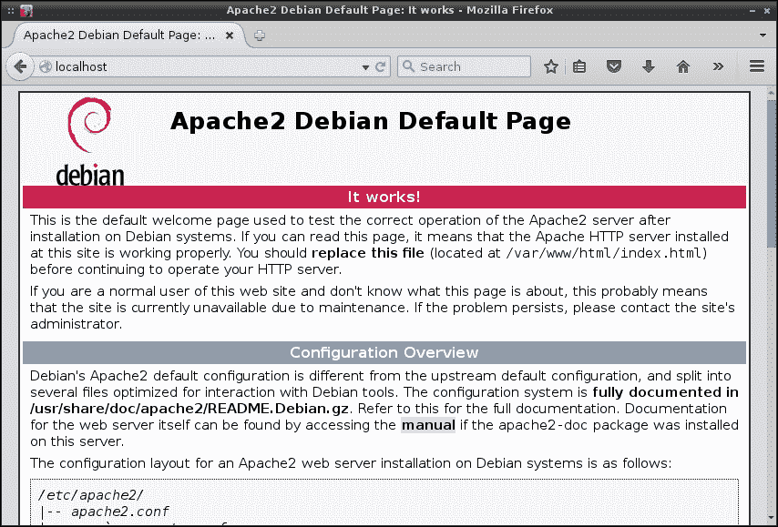
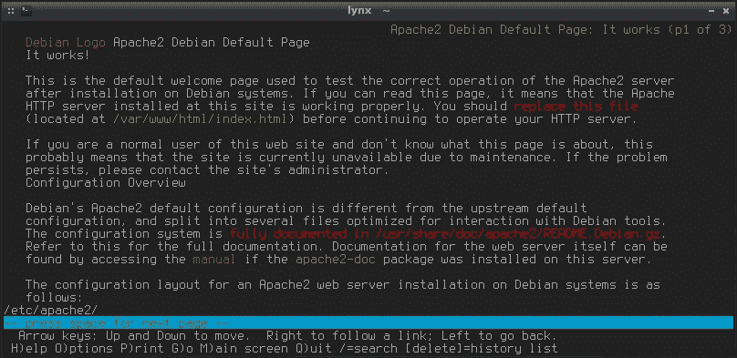
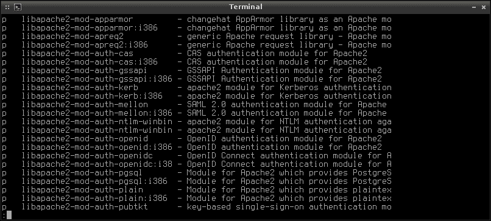

# 七、通过 Apache 托管 HTTP 内容

**Apache**是在互联网上使用的最常见的 web 服务器。 虽然也有其他可用的 web 服务器，如微软的**Internet 信息服务**(**IIS**)，但在提供 web 内容方面，Apache 独占鳌头。 在 Linux 和 UNIX 平台上都可用，Apache 使您能够托管内容，并通过本地内部网和 Internet 共享内容。 Apache 服务器有许多用途，包括(但肯定不限于)托管博客或公司网站，或为公司设置员工门户。

在本章中，您将学习有关安装和配置 Apache 的所有内容。 我们将涵盖以下议题:

*   安装 Apache
*   配置 Apache
*   添加模块
*   设置虚拟主机

# 安装 Apache

通常，在系统上安装 Apache 只是从包管理器中安装适当的包。 在 CentOS 系统上可以通过安装`httpd`包获取 Apache，在 Debian 系统上可以通过`apache2`包获取(以`yum install httpd` 或`apt-get install apache2 respectively`为根)。 一旦安装了这个包，Apache 的守护进程就会提供一组默认的配置文件。 您可以使用`systemctl`来确认系统上是否存在这个守护进程，但是守护进程的名称因发行版的不同而不同。

在 Debian 上使用以下命令:

```sh
# systemctl status apache2

```

在 CentOS 操作系统中使用如下命令:

```sh
# systemctl status httpd

```

默认情况下，Debian 会为您启动并启用守护进程。 一如既往，CentOS 不做任何假设，也不做任何假设。 您可以使用`systemctl`命令轻松地启动和启用该守护进程:

```sh
# systemctl enable httpd
# systemctl start httpd

```

一旦你安装并启用了 Apache，从技术上来说，你的网络上已经有了一个工作的 web 服务器。 它可能不是特别有用(我们还没有对它进行配置)，但在这一点上它是存在的，而且从技术上讲它是可以工作的。 CentOS 和 Debian 版本的 Apache 都在同一个目录`/var/www/html`中寻找 web 内容。 在那里，Debian 以`index.html`文件的形式创建了一个示例 web 页面，您可以通过另一台计算机上的 web 浏览器查看该页面(只需将其指向您的 web 服务器的 IP 地址)。 另一方面，CentOS 没有为您创建一个示例 HTML 页面。 这很容易纠正; 您所需要做的就是手动创建带有一些示例代码的`/var/www/html/index.html`文件。 它不需要太奢侈; 我们只是想确保我们有可以测试的东西。 例如，你可以将以下代码放入该文件:

```sh
<html>
  <title>Apache test</title>
  <body>
    <p>Apache is awesome!</p>
  </body>
</html>
```

此时，您应该已经安装了 Apache 并启动了它的服务。 您的系统上还应该有一个示例`/var/www/html/index.html`文件，无论您使用的是 Debian 的默认文件还是您在 CentOS 系统上手动创建的文件。 现在，您应该能够浏览到您的 web 服务器，并通过 web 浏览器查看此页面。 如果你知道你的网络服务器的 IP 地址，只需在你的网络浏览器的地址栏中输入它。 您应该立即看到示例页面。 如果您正在使用 web 服务器上的 web 浏览器，您应该能够浏览到本地主机(`http://127.0.0.1`或`http://localhost`)并查看相同的页面。

### 注意事项

如果你选择 CentOS 作为你的 web 服务器，如果你试图从另一台机器浏览它，默认防火墙可能会挡住你的路。 根据您的配置，您可能需要允许流量通过防火墙到达您的 web 服务器。 为此，执行以下命令:

```sh
# firewall-cmd --zone=public --add-port=80/tcp --permanent
# firewall-cmd --reload

```

如果您计划托管一个安全站点，请确保还添加了端口 443。 只需像以前一样使用相同的`firewall-cmd`，但将 80 替换为 443。

如果由于的原因没有看到默认页面，请确保 Apache 正在运行(请记住我前面提到的`systemctl status`命令)。 如果守护进程没有运行，您可能会得到一个**连接被拒绝**错误。 另外，请记住，基于硬件的防火墙也可以阻止访问。



默认的网页从运行在 Debian 上的未配置的 Apache 提供

另一种测试服务器是否正在提供网页的方法是通过`lynx`，这是一个可以在 shell 中使用的基于文本的网页浏览器。 在某些情况下，这可能是首选，因为它没有图形化 web 浏览器的开销，并且启动速度非常快。 一旦你在你的机器上安装了 lynx 包，你可以通过执行`lynx http://localhost`从服务器本身导航到你的 web 服务器，或者`http://<ip address>`如果你来自不同的机器。



使用 lynx 测试 web 服务器功能

### 注意事项

要退出`lynx`，按*Q*表示退出，再按*Y*表示 yes。

正如我提到的，Debian 和 CentOS 都在同一个目录中通过 Apache 共享文件。 这个目录是`/var/www/html`。 为了创建一个网站，你将把你的网站的文件放在这个目录中。 设置 Apache 服务器的典型过程是安装 Apache，然后测试网络上的其他计算机是否可以访问它，最后开发您的站点并将其文件放入这个文件夹。

# 配置 Apache

配置 Apache 是通过编辑它的配置文件来完成的，配置文件将位于两个位置之一，具体取决于您的发行版。

在 CentOS 操作系统中使用如下命令:

```sh
/etc/httpd/conf/httpd.conf

```

在 Debian 上使用以下命令:

```sh
/etc/apache/apache2.conf

```

可以修改默认的 web 文档目录`/var/www/html`。 虽然`/var/www/html`是相当标准的，但如果你决定将你的 web 文件存储在其他地方，没有什么可以阻止你更改它。 如果您仔细阅读 CentOS 中的配置文件，您会看到这个目录在从第 131 行开始的配置块中被调用。 如果您在 Debian 中查看配置文件，您根本不会看到这个调用。 相反，您将看到在`/etc/apache2`中有一个名为`sites-available`的目录。 在该目录中，将有两个默认文件`000-default.conf`和`default-ssl.conf`。 这两个文件都将`/var/www/html`指定为默认路径，但它们的不同之处是`000-default.conf`文件指定端口 80 的配置，而`default-ssl.conf`负责端口 443 的配置。 您可能知道，端口 80 引用标准 HTTP 流量，而端口 443 对应于安全流量。 因此，本质上，每种类型的流量在 Debian 系统上都有自己的配置文件。

在所有的案例中，**文档根**被设置为`/var/www/html`。 如果您想将其更改到一个不同的目录，您将更改代码以指向新目录。 例如，如果您想将路径更改为`/srv/html`之类的内容，则需要对该文件进行一些更改。

首先，查找以下一行:

```sh
DocumentRoot /var/www/html

```

将其更改为指向新目录:

```sh
DocumentRoot /srv/html

```

在我的测试系统上，我在 Debian 上的以下配置文件中找到了`DocumentRoot`标注:

```sh
/etc/apache2/sites-available/000-default

```

在 CentOS 上，我发现在默认配置文件的第 119 行:

```sh
/etc/httpd/conf/httpd.conf

```

更改之后，我们必须设置新目录的选项。 在 Debian 上，我们需要在以下文件中进行这些更改:

```sh
/etc/apache2/apache2.conf

```

在 CentOS 上，我们需要在以下文件中进行这些更改:

```sh
/etc/httpd/conf/httpd.conf

```

打开其中一个文件，这取决于您使用的发行版。 我们需要修改的代码如下所示:

```sh
<Directory "/var/www/html">
    Options Indexes FollowSymLinks
    AllowOverride None
    Require all granted
</Directory>
```

相应更改以下内容:

```sh
<Directory "/srv/html">
    Options Indexes FollowSymLinks
    AllowOverride None
    Require all granted
</Directory>
```

### 注意事项

可能会有一些注释混杂在前面示例中显示的代码中，但基本思想是相同的。 找到以`<Directory "/var/www/html">`开头的行，并确保该块中的未注释代码与示例匹配。 只要你这么做，你就会没事的。

最后，它可能是不言自明的，但是为了避免麻烦，您应该确保已经将权限设置为`/srv/html`，以便每个人都可以阅读目录和内容。 另外，确保您在这个目录中创建或复制了一个示例 HTML 文件(例如`index.html`)。 一旦你重新启动 Apache，你应该能够从这个新目录提供 web 内容。

除了设置文档根目录外，Apache 配置文件还允许您配置一些非常重要的安全设置。 例如，默认情况下禁止访问整个服务器的文件系统。 这是一件好事。 下面的代码是一个取自 CentOS 系统的示例，它负责阻止文件系统范围的访问。 代码如下:

```sh
<Directory />
    AllowOverride none
    Require all denied
</Directory>
```

远程查看`.htaccess`文件也是默认禁用的配置块如下:

```sh
<Files ".ht*">
    Require all denied
</Files>
```

还可以设置其他选项，例如 Apache 日志文件的默认位置。 默认情况下，以下默认配置行将日志文件定向到/`etc/httpd/logs`:

```sh
ErrorLog "logs/error_log"

```

然而，这可能会引起误解，因为 CentOS 系统上的`/etc/httpd/logs`目录实际上是指向`/var/log/httpd`的符号链接，如果您需要查看日志文件，您实际上可以在其中找到它们。 默认情况下,日志记录设置为`warn`,这也可以改变在 Apache 配置文件和设置为任何一个`debug`,`info`,`notice`,`warn`,`error`、【显示】。

需要注意的是，对于对 Apache 所做的任何更改，都需要重新加载或重新启动该守护进程。 如果您重新启动该守护进程，它将关闭 Apache 并重新启动它。 Reload 只是导致 Apache 重新读取它的配置文件。 在大多数情况下，重载是更好的选择。 通过这样做，您可以应用新的配置，而不中断对您的网站的访问。 与大多数 systemd 单元一样，Apache 使用以下命令来管理守护进程的运行状态:

1.  使用以下命令启动 Apache 守护进程:

    ```sh
    # systemctl start apache2

    ```

2.  使用以下命令停止 Apache 守护进程:

    ```sh
    # systemctl stop apache2

    ```

3.  在启动时使用以下命令启用 Apache 守护进程:

    ```sh
    # systemctl enable apache2

    ```

4.  重新加载 Apache 守护进程，同时试图维护其运行状态:

    ```sh
    # systemctl reload apache2

    ```

5.  使用以下命令重启 Apache 守护进程:

    ```sh
    # systemctl restart apache2

    ```

如果你使用的是 CentOS，在每种情况下用`httpd`替换`apache2`。 现在您理解了 Apache 的安装和配置方式，我们可以继续使用模块。

# 添加模块

由于和 Apache 一样是开箱即用的，所以您可能需要的一些功能没有内置。 Apache 使用**模块**来扩展其特性集。 这方面的例子可能包括安装`php5`模块以使您的站点能够使用 PHP，或者如果您使用该语言进行开发，则可能安装 Python 模块。 一旦安装并激活一个模块，您就可以使用该模块的特性。

CentOS 和 Debian 对 Apache 的实现是不同的，添加模块的方式也是不同的。 事实上，Debian 甚至包含了它自己的启用和禁用模块的命令，这完全是 Debian 系统独有的。 这些命令是`a2enmod`和`a2dismod`。

要完成在 Debian 中启用一个模块的典型过程，我们可以在服务器上启用 PHP 模块。 我还将在 CentOS 中详细介绍这个过程，但正如我所提到的，这个过程在两者之间是完全不同的。

首先，找到包含您想要的模块的包。 如果你不知道要安装的软件包的确切名称，你可以用下面的命令打印一个可用的 Apache 模块列表到你的终端:

```sh
aptitude search libapache2-mod

```

默认情况下，`aptitude`没有安装在大多数 Debian 系统上。 如果前一个命令的结果是`command not found error`，您只需要通过`apt-get install`安装`aptitude`包。 输出可能太长，这取决于终端窗口的大小，因此您可能需要将输出管道导入`less`:

```sh
aptitude search libapache2-mod |less

```

下面的截图显示了 aptitude 在 Debian 系统上搜索`libapache2-mod`的搜索结果:



Debian 系统中有很多可供 Apache 使用的模块

通过搜索，按`Enter`或上下方向键滚动输出，完成后按*Q*。 通过仔细阅读输出，您将看到 PHP 包名为`libapache2-mod-php5`。 所以，让我们用下面的命令来安装它:

```sh
# apt-get install libapache2-mod-php5

```

安装包后，检查输出。 Debian 很可能已经为您安装了这个模块，其逻辑是，如果您特别要求安装一个包，您可能会希望它立即可用。 如果你看到类似如下的输出，那么这个例子中的 PHP 模块已经安装:

```sh
apache2_invoke: Enable module php5

```

您可以通过在 shell 中执行`a2enmod php5`来尝试启用它来验证这一点。 如果它被启用，你会看到类似如下的输出:

```sh
Module php5 already enabled

```

本质上，`a2enmod`和`a2dismod`命令的工作原理基本相同。 正如您可能了解到的，一个启用模块，另一个禁用它们。 为了使用 Apache 模块，必须启用它。 然而，如果你不再需要一个模块，你可以禁用它(或者更好的是，删除它)。 讨论所有的模块和它们提供的特性超出了本书的范围。 但在实践中，您将只启用站点所需的模块，这因环境而异。 在我们继续在 CentOS 系统上执行相同的过程之前，我将把这个留给您。 要查看安装在 Debian 系统上的所有模块的列表，发出以下命令:

```sh
# apache2ctl -M

```

现在，让我们转向 CentOS。 通过使用包管理器列出可用的模块包，大多数模块都可以像我们之前在 Debian 部分所做的那样列出。 在 CentOS 中，我们可以通过以下命令做到这一点:

```sh
yum search mod_

```

不幸的是，这个输出中没有列出 PHP 模块。 这是因为我们通过安装`php`包在 CentOS 中启用了 PHP。 这就是事情开始变得混乱的地方; 相当多的 CentOS Apache 模块包有以`mod_`开头的命名约定，但不是所有的都这样。 在决定需要安装哪些包来授予系统对某个模块的访问权时，有时需要进行一些研究。 如果您正在开发的站点还需要其他模块，比如用于 LDAP 身份验证的`mod_ldap`，那么您也可以安装这些模块。

与 Debian 不同，`yum`包管理器应该已经启用了为您安装的模块。 既然我们已经在 CentOS 系统中安装了 PHP，那么在重启`httpd`守护进程之后，PHP 就可以使用了。 为了验证这一点，我们应该能够创建一个`info.php`文件并将其存储在`/var/www/html/info.php`中。 文件内容如下:

```sh
<?php phpinfo();
?>
```

如果导航到 URL`http://<your_server_IP>/info.php`，应该会看到一个页面，其中包含有关服务器 PHP 实现的信息。


查看 Apache 服务器上的 PHP 服务器信息

### 注意事项

尽管使用`info.php`文件来测试 PHP 是完全没问题的，但是不要把它放在服务器上——这会带来安全风险。 您不希望让攻击者太容易确定关于您的服务器正在运行的特定信息。 这个过程仅仅是为了测试 PHP 是否正常运行。

现在我们已经完成了 Apache 模块的安装，您应该可以很容易地根据需要定制您的 web 服务器，以便支持您计划运行的任何网站或应用。

# 设置虚拟主机

一个组织托管多个站点是非常常见的。 每个站点都可以在自己的服务器或虚拟机上运行，但这并不太实际。 在每个服务器上运行一个站点是非常昂贵的，而且效率不高。 **虚拟主机**的概念是多个站点可以生活在一个 web 服务器上，这节省了基础设施。 当然，总有可能你的网站产生了太多的流量，与其他高流量的网站共享可能不是一个好主意，但当这种情况下，虚拟主机是推荐的。

如前所述，`/var/www`是 Apache 查找要服务的文件的默认位置。 如果在一台服务器上托管多个站点，则需要为每个创建单独的目录。 例如，如果您正在为一个名为`tryadtech.com`的公司托管一个网站，而另一个为`linuxpros.com`的公司托管一个网站，您可以创建以下目录结构:

```sh
/var/www/tryadtech.com/html
/var/www/linuxpros.com/html

```

在本例中，我创建了几个层次的目录，因此可以在`mkdir`中使用`-p`标志来创建这些目录及其父目录。

这样，每个站点都有自己的目录，所以您可以将它们的内容分开。 每个人都需要读取这些文件，所以我们需要调整权限:

```sh
# chmod 755 -R /var/www/<nameofsite>

```

要创建虚拟主机，我们需要从中创建一个配置文件。 在 Debian 上，您可以选择一个默认配置作为起点(我将在下一节详细介绍我使用的配置，因此不需要使用这个文件)。 如果你愿意，你可以从以下文件开始:

```sh
/etc/apache2/sites-available/000-default.conf

```

该文件是为虚拟主机创建配置的一个很好的参考点。 如果你选择使用它，把它复制到你为虚拟主机创建的目录中:

```sh
# cp /etc/apache2/sites-available/000-default.conf /etc/apache2/sites-available/tryadtech.com.conf

```

在 CentOS 上，`/etc/apache2/sites-available`目录甚至不存在，所以继续创建它。 为了告诉 Apache 从这个目录加载站点，我们需要在`/etc/httpd/conf/httpd.conf`文件的底部添加以下一行:

```sh
IncludeOptional sites-available/*.conf

```

下面是一个虚拟主机配置文件示例。 在我的 Debian 测试系统上，我将其保存为`/etc/apache2/sites-available/tryadtech.com.conf`，但在 CentOS 上只将`apache2`替换为`httpd`。 我从前面提到的`000-default.conf`文件中获取了这个示例文件，为了简洁起见删除了注释行。 第一行粗体字原来没有出现，第二行被修改了:

```sh
<VirtualHost *:80>
        ServerAdmin webmaster@localhost
 ServerName tryadtech.com
        DocumentRoot /var/www/tryadtech.com/html
        ErrorLog ${APACHE_LOG_DIR}/error.log
        CustomLog ${APACHE_LOG_DIR}/access.log combined
</VirtualHost>
```

正如您在这里看到的，我们在`tryadtech.com`目录下调用了一个`html`目录。 要开发站点，您需要将站点的文件放到`html`目录中，重新启动 Apache 后，您应该能够从 web 浏览器访问该目录。

那么，Apache 服务器如何知道要将访问者发送到哪个目录呢? 注意我添加到配置文件中的`ServerName`行。 在这一行中，我调用了这个虚拟主机中的文件所属的特定域名。 这要求您已经设置了 DNS 并指向这个 IP。 例如，您在域名注册商处的 DNS 条目将把这两个虚拟主机指向相同的 IP 地址。 当一个请求通过`tryadtech.com`域进入时，Apache 应该提供来自`/var/www/tryadtech.com/html`目录的用户文件。 如果您配置另一个虚拟主机和域名，同样的情况也适用于该域。

# 总结

在本章中，我们设置了一个 Apache 服务器，我们可以使用它在本地 intranet 上共享信息，如果我们的机器是外部可路由的，甚至可以在 Internet 上共享信息。 我们介绍了安装 Apache、对其进行定制、设置模块以及设置虚拟主机。

在下一章中，我们将处理高级网络技术，如子网，添加冗余的 DHCP 和 DNS，以及路由。 看到你在那里!