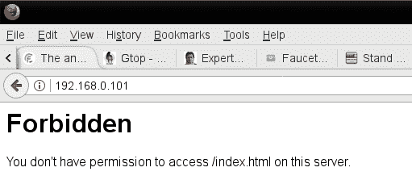
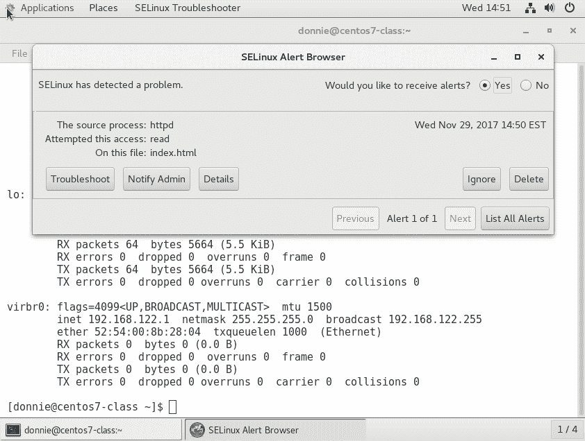
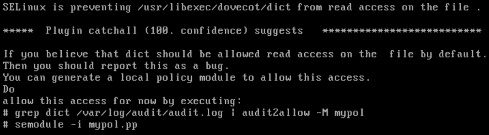
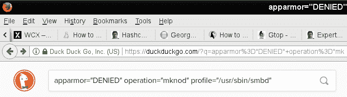

# 九、使用 SELinux 和 AppArmor 实现强制访问控制

正如我们在前面几章中看到的，**自主** **访问** **控制(DAC)** 允许用户控制谁可以访问自己的文件和目录。但是，如果您的公司需要对谁访问什么进行更多的管理控制，该怎么办？为此，我们需要某种**强制** **访问** **控制(MAC)。**

我所知道的解释数模转换器和数模转换器区别的最好方法是回到我的海军时代。当时我正在乘坐潜艇，我必须获得绝密许可才能工作。有了数模转换器，我有能力把我的一本绝密书拿到食堂，然后交给一个没有那种权限的厨师。对于 MAC，有一些规则阻止我这么做。在操作系统上，事情的运作方式基本相同。

有几种不同的 MAC 系统可用于 Linux。我们将在本章中介绍的两个是 SELinux 和 AppArmor。我们将看看它们都是什么，如何配置它们，以及如何排除它们的故障。

在本章中，我们将涵盖以下主题:

*   SELinux 是什么，它如何让系统管理员受益
*   如何设置文件和目录的安全上下文
*   如何使用 set 卢布 How 解决 SELinux 问题
*   查看 SELinux 策略以及如何创建自定义策略
*   什么是 AppArmor，它如何让系统管理员受益
*   查看服装政策
*   使用 AppArmor 命令行实用程序
*   常见问题的故障排除
*   利用带有邪恶 Docker 容器的系统

让我们从看看 SELinux 以及您如何从中受益开始。

# SELinux 如何让系统管理员受益

SELinux 是一个由美国国家安全局开发的免费开源软件项目。虽然理论上它可以安装在任何 Linux 发行版上，但红帽类型的发行版是唯一已经安装并启用的发行版。它使用 Linux 内核模块中的代码以及扩展的文件系统属性来帮助确保只有授权的用户和进程才能访问敏感文件或系统资源。有三种方法可以使用 SELinux:

*   它可以帮助防止入侵者利用系统。
*   它可用于确保只有拥有适当安全权限的用户才能访问标有安全分类的文件。
*   除了 MAC 之外，SELinux 还可以用作一种基于角色的访问控制。

在本章中，我将只介绍这三种用途中的第一种，因为这是使用 SELinux 的最常见方式。还有一个事实是，涵盖所有这三种用途需要写一整本书，我没有空间在这里做。

If you go through this introduction to SELinux and find that you still need more SELinux information, you'll find whole books and courses on just this subject on the Packt Publishing website.

那么，SELinux 如何让忙碌的系统管理员受益呢？你可能还记得几年前，关于 Shellshock 病毒的新闻登上了世界头条。本质上，Shellshock 是 Bash shell 中的一个 bug，它允许入侵者闯入一个系统，并通过获得 root 权限来利用它。对于运行 SELinux 的系统，坏人仍然有可能闯入，但是 SELinux 会阻止他们成功运行他们的漏洞。

SELinux 也是另一种机制，可以帮助保护用户主目录中的数据。如果您有一台设置为网络文件系统服务器、Samba 服务器或 web 服务器的计算机，SELinux 将阻止这些守护程序访问用户的主目录，除非您明确配置 SELinux 允许这种行为。

在 web 服务器上，您可以使用 SELinux 来防止恶意 CGI 脚本或 PHP 脚本的执行。如果不需要服务器运行 CGI 或 PHP 脚本，可以在 SELinux 中禁用它们。

有了 Docker 和没有 MAC，普通用户很容易突破 Docker 容器并获得对主机的根级访问。正如我们将在本章末尾看到的，SELinux 是一个有用的工具，用于加固运行 Docker 容器的服务器。

所以现在你可能认为每个人都会使用这样一个伟大的工具，对吗？可悲的是，事实并非如此。一开始，SELinux 以难以使用而闻名，许多管理员只会禁用它。事实上，你在网上或 YouTube 上看到的很多教程都把禁用 SE *Linux* 作为第一步。在这一节中，我想向您展示情况已经有所改善，SELinux 不再配得上它的坏名声。

# 为文件和目录设置安全上下文

把 SELinux 想象成一个美化的标签系统。它通过扩展文件属性向文件和目录添加标签，称为安全上下文。它还向系统进程添加了相同类型的标签，称为域。要在您的 CentOS 机器上查看这些上下文和域，请将`-Z`选项与`ls`或`ps`一起使用。例如，我自己的主目录中的文件和目录如下所示:

```sh
[donnie@localhost ~]$ ls -Z
drwxrwxr-x. donnie donnie unconfined_u:object_r:user_home_t:s0 acl_demo_dir
-rw-rw-r--. donnie donnie unconfined_u:object_r:user_home_t:s0 yum_list.txt
[donnie@localhost ~]$
```

我的系统上的进程看起来如下所示:

```sh
[donnie@localhost ~]$ ps -Z
LABEL                             PID TTY          TIME CMD
unconfined_u:unconfined_r:unconfined_t:s0-s0:c0.c1023 1322 pts/0 00:00:00 bash
unconfined_u:unconfined_r:unconfined_t:s0-s0:c0.c1023 3978 pts/0 00:00:00 ps
[donnie@localhost ~]$
```

现在，让我们把它分解一下。在`ls -Z`和`ps -Z`命令的输出中，我们有以下部分:

*   **SELinux 用户**:在这两种情况下，SELinux 用户都是通用的`unconfined_u`。
*   **SELinux 角色**:在`ls -Z`的例子中，我们看到角色是`object_r`，在`ps -Z`的例子中是`unconfined_r`。
*   **类型**:是`ls -Z`输出中的`user_home_t`，是`ps -Z`输出中的`unconfined_t`。
*   **灵敏度**:在`ls -Z`输出中是`s0`。在`ps -Z`输出中，是`s0-s0`。
*   **类别**:我们在`ls -Z`输出中没有看到类别，但是在`ps -Z`输出中看到了`c0.c1023`。

在前面所有的安全上下文和安全域组件中，我们现在唯一感兴趣的是类型。就本章而言，我们只对介绍一个普通的 Linux 管理员需要知道什么来防止入侵者利用系统感兴趣，类型是我们需要使用的唯一组件。当我们设置高级的、基于安全分类的访问控制和基于角色的访问控制时，所有其他组件都会发挥作用。

好了，下面是对这如何帮助 Linux 管理员维护安全性的一个有些过于简化的解释。我们希望系统进程只访问我们允许它们访问的对象。(系统进程包括 web 服务器守护程序、FTP 守护程序、Samba 守护程序和 Secure Shell 守护程序等。对象包括文件、目录和网络端口。)为了实现这一点，我们将为所有流程和所有对象分配一个类型。然后，我们将创建定义哪些流程类型可以访问哪些对象类型的策略。

幸运的是，每当您安装任何红帽类型的发行版时，几乎所有的艰苦工作都已经为您完成了。红帽类型的发行版都已经启用了 SELinux，并设置了目标策略。把这个有针对性的政策想象成一个稍微宽松的政策，允许一个随意的桌面用户坐在电脑前，实际上进行业务，而不必调整任何 SELinux 设置。但是，如果您是服务器管理员，您可能会发现自己不得不调整此策略，以便允许服务器守护程序做您需要它们做的事情。

The targeted policy, which comes installed by default, is what a normal Linux administrator will use in his or her day-to-day duties. If you look in the repositories of your CentOS virtual machine, you'll see that there are also several others, which we won't cover in this book.

# 安装 SELinux 工具

出于一些我永远无法理解的奇怪原因，您需要管理 SELinux 的工具在默认情况下不会安装，尽管 SELinux 本身会安装。因此，您需要在 CentOS 虚拟机上做的第一件事就是安装它们。

在 CentOS 7 上，运行以下命令:

```sh
sudo yum install setools policycoreutils policycoreutils-python
```

在 CentOS 8 上，运行以下命令:

```sh
sudo dnf install setools policycoreutils policycoreutils-python-utils 
```

本章稍后，在*使用* *设置故障排除*部分，我们将了解如何使用设置故障排除来帮助诊断 SELinux 问题。为了在我们到达那里时有一些很酷的错误消息可以查看，现在继续安装 set 卢布 shot，并通过重新启动`auditd`守护程序来激活它。(没有 set 卢布 shot 守护程序，因为 set 卢布 shot 是要由`auditd`守护程序控制的。)像这样安装 set 卢布 shot。

对于 CentOS 7，请使用以下命令:

```sh
sudo yum install setroubleshoot
sudo service auditd restart 
```

对于 CentOS 8，请使用以下命令:

```sh
sudo dnf install setroubleshoot
sudo service auditd restart 
```

我们在红帽型系统上必须处理的一个小系统怪癖是，你不能用正常的`systemctl`命令停止或重启`auditd`守护进程。然而，老式的`service`命令奏效了。不知什么原因，红帽人配置了`auditd`服务文件，禁用了正常的系统做事方式。

Depending on the type of installation that you chose when installing CentOS, you might or might not already have setroubleshoot installed. To be sure, go ahead and run the command to install it. It won't hurt anything if setroubleshoot is already there.

现在，您已经拥有了开始工作所需的一切。现在让我们看看 SELinux 能为繁忙的 web 服务器管理员做些什么。

# 在启用 SELinux 的情况下创建网页内容文件

现在，让我们看看如果您的 web 内容文件设置了错误的 SELinux 类型会发生什么。首先，我们将在 CentOS 虚拟机上安装、启用和启动 Apache 网络服务器。(注意，包括`--now`选项允许我们在一个步骤中启用和启动一个守护进程。)在 CentOS 7 上执行以下操作:

```sh
sudo yum install httpd
sudo systemctl enable --now httpd 
```

在 CentOS 8 上，使用以下命令:

```sh
sudo dnf install httpd
sudo systemctl enable --now httpd
```

如果您还没有这样做，您需要将防火墙配置为允许访问 web 服务器:

```sh
[donnie@localhost ~]$ sudo firewall-cmd --permanent --add-service=http
success
[donnie@localhost ~]$ sudo firewall-cmd --reload
success
[donnie@localhost ~]$
```

当我们查看 Apache 进程的 SELinux 信息时，我们将看到以下内容:

```sh
[donnie@localhost ~]$ ps ax -Z | grep httpd
system_u:system_r:httpd_t:s0     3689 ?        Ss     0:00 /usr/sbin/httpd -DFOREGROUND
system_u:system_r:httpd_t:s0     3690 ?        S      0:00 /usr/sbin/httpd -DFOREGROUND
system_u:system_r:httpd_t:s0     3691 ?        S      0:00 /usr/sbin/httpd -DFOREGROUND
system_u:system_r:httpd_t:s0     3692 ?        S      0:00 /usr/sbin/httpd -DFOREGROUND
system_u:system_r:httpd_t:s0     3693 ?        S      0:00 /usr/sbin/httpd -DFOREGROUND
system_u:system_r:httpd_t:s0     3694 ?        S      0:00 /usr/sbin/httpd -DFOREGROUND
unconfined_u:unconfined_r:unconfined_t:s0-s0:c0.c1023 3705 pts/0 R+   0:00 grep --color=auto httpd

```

正如我之前所说，我们对用户或角色不感兴趣。然而，我们对类型感兴趣，在这种情况下是`httpd_t`。

在红帽类型的系统上，我们通常将网页内容文件放在`/var/www/html`目录中。让我们看看那个`html`目录的 SELinux 上下文:

```sh
[donnie@localhost www]$ pwd
/var/www
[donnie@localhost www]$ ls -Zd html/
drwxr-xr-x. root root system_u:object_r:httpd_sys_content_t:s0 html/
[donnie@localhost www]$
```

类型是`httpd_sys_content`，所以`httpd`守护程序应该能够访问这个目录是理所当然的。它目前是空的，所以让我们`cd`进入它并创建一个简单的索引文件:

```sh
[donnie@localhost www]$ cd html
[donnie@localhost html]$ pwd
/var/www/html
[donnie@localhost html]$ sudo vim index.html
```

以下是我将放入文件的内容:

```sh
<html>
<head>
<title>
Test of SELinux
</title>
</head>
<body>
Let's see if this SELinux stuff really works!
</body>
</html>
```

好吧，正如我所说的，这很简单，因为我的 HTML 手工编码技能已经不是以前的样子了。但是，它仍然服务于我们目前的目的。

查看 SELinux 上下文，我们看到该文件与`html`目录具有相同的类型:

```sh
[donnie@localhost html]$ ls -Z
-rw-r--r--. root root unconfined_u:object_r:httpd_sys_content_t:s0 index.html
[donnie@localhost html]$
```

我现在可以从我信任的 OpenSUSE 工作站的网络浏览器导航到此页面:


现在，让我们看看如果我决定在自己的主目录中创建内容文件，然后将它们移动到`html`目录会发生什么。首先，让我们看看我的新文件的 SELinux 上下文是什么:

```sh
[donnie@localhost ~]$ pwd
/home/donnie
[donnie@localhost ~]$ ls -Z index.html
-rw-rw-r--. donnie donnie unconfined_u:object_r:user_home_t:s0 index.html
[donnie@localhost ~]$
```

上下文类型现在是`user_home_t`，这是我在主目录中创建的一个可靠的指示器。我现在将文件移动到`html`目录，覆盖旧文件:

```sh
[donnie@localhost ~]$ sudo mv index.html /var/www/html/
[sudo] password for donnie:

[donnie@localhost ~]$ cd /var/www/html

[donnie@localhost html]$ ls -Z
-rw-rw-r--. donnie donnie unconfined_u:object_r:user_home_t:s0 index.html
[donnie@localhost html]$
```

即使我将文件移到了`/var/www/html`目录，SELinux 类型仍然与用户的主目录相关联。现在，我将转到主机的浏览器来刷新页面:



所以，我有点小问题。分配给我的文件的类型与 httpd 守护进程的类型不匹配，因此 SELinux 不允许`httpd`进程访问该文件。

Had I copied the file to the `html` directory instead of moving it, the SELinux context would have automatically changed to match that of the destination directory.

# 修复不正确的 SELinux 上下文

好吧，我有一个没人能访问的网络内容文件，我真的觉得不能创建一个新的。那么，我该怎么办？实际上，我们有三种不同的实用程序来解决这个问题:

*   `chcon`
*   `restorecon`
*   `semanage`

让我们看看他们每个人。

# 使用 chcon

有两种方法可以使用`chcon`修复文件或目录中不正确的 SELinux 类型。首先是手动指定正确的类型:

```sh
[donnie@localhost html]$ sudo chcon -t httpd_sys_content_t index.html
[sudo] password for donnie:

[donnie@localhost html]$ ls -Z
-rw-rw-r--. donnie donnie unconfined_u:object_r:httpd_sys_content_t:s0 index.html
[donnie@localhost html]$
```

我们可以使用`chcon`来改变上下文的任何部分，但是正如我一直说的，我们只对类型感兴趣，类型会随着`-t`选项而改变。您可以在`ls -Z`输出中看到命令成功。

使用`chcon`的另一种方法是引用一个具有适当上下文的文件。出于演示目的，我将`index.html`文件更改回主目录类型，并在`/var/www/html`目录中创建了一个新文件:

```sh
[donnie@localhost html]$ ls -Z
-rw-rw-r--. donnie donnie unconfined_u:object_r:user_home_t:s0 index.html
-rw-r--r--. root   root   unconfined_u:object_r:httpd_sys_content_t:s0 some_file.html
[donnie@localhost html]$
```

如您所见，我在这个目录中创建的任何文件都将自动具有适当的 SELinux 上下文设置。现在，让我们使用这个新文件作为参考，以便在`index.html`文件上设置适当的上下文:

```sh
[donnie@localhost html]$ sudo chcon --reference some_file.html index.html
[sudo] password for donnie:

[donnie@localhost html]$ ls -Z
-rw-rw-r--. donnie donnie unconfined_u:object_r:httpd_sys_content_t:s0 index.html
-rw-r--r--. root   root   unconfined_u:object_r:httpd_sys_content_t:s0 some_file.html
[donnie@localhost html]$
```

所以，我使用了`--reference`选项，并指定了我想要用作参考的文件。我想要更改的文件列在命令的末尾。现在，这都是好的，但我想找到一种更简单的方法，不需要太多的打字。毕竟我是老人，不想自己用力过猛。那么，我们来看看`restorecon`的效用。

# 使用 restorecon

使用`restorecon`很容易。只需键入`restorecon`，后跟需要更改的文件名即可。我再次将`index.html`文件的上下文更改回主目录类型。不过这次，我用`restorecon`来设置正确的类型:

```sh
[donnie@localhost html]$ ls -Z
-rw-rw-r--. donnie donnie unconfined_u:object_r:user_home_t:s0 index.html

[donnie@localhost html]$ sudo restorecon index.html

[donnie@localhost html]$ ls -Z
-rw-rw-r--. donnie donnie unconfined_u:object_r:httpd_sys_content_t:s0 index.html
[donnie@localhost html]$
```

仅此而已。

You can also use `chcon` and `restorecon` to change the context of an entire directory and its contents. For either one, just use the `-R` option. The following is an example:

`sudo chcon -R -t httpd_sys_content_t /var/www/html/`
`sudo restorecon -R /var/www/html/`

(记住:`-R`代表递归。)

还有最后一件事要处理，尽管它并没有真正影响我们访问这个文件的能力。也就是说，我需要将文件的所有权更改给 Apache 用户:

```sh
[donnie@localhost html]$ sudo chown apache: index.html
[sudo] password for donnie:

[donnie@localhost html]$ ls -l
total 4
-rw-rw-r--. 1 apache apache 125 Nov 22 16:14 index.html
[donnie@localhost html]$
```

现在我们来看看最后的效用`semanage`。

# 使用语义

在我刚才介绍的场景中，无论是`chcon`还是`restorecon`都非常适合您的需求。活动的 SELinux 策略规定了某些目录中的安全上下文应该是什么样子。只要您在活动 SELinux 策略中定义的目录中使用`chcon`或`restorecon`，您就很好。但是假设您已经在其他地方创建了一个目录，您想使用它来提供 web 内容文件。您需要在该目录及其所有文件中设置`httpd_sys_content_t`类型。但是，如果您使用`chcon`或`restorecon`进行更改，该更改将无法在系统重新启动后继续存在。要使更改永久化，您需要使用`semanage`。

假设出于某种奇怪的原因，我想从我在`/home`目录中创建的目录中提供网络内容:

```sh
[donnie@localhost home]$ pwd
/home

[donnie@localhost home]$ sudo mkdir webdir
[sudo] password for donnie:

[donnie@localhost home]$ ls -Zd webdir
drwxr-xr-x. root root unconfined_u:object_r:home_root_t:s0 webdir
[donnie@localhost home]$
```

因为我必须使用我的`sudo`能力在这里创建目录，它与根用户的 home_root_t 类型相关联，而不是普通的用户 _home_dir_t 类型。我在此目录中创建的任何文件都将具有相同的类型:

```sh
[donnie@localhost webdir]$ ls -Z
-rw-r--r--. root root unconfined_u:object_r:home_root_t:s0 index.html
[donnie@localhost webdir]$
```

下一步是使用`semanage`将此目录和`httpd_sys_content_t`类型的永久映射添加到活动策略的上下文列表中:

```sh
[donnie@localhost home]$ sudo semanage fcontext -a -t httpd_sys_content_t "/home/webdir(/.*)?"

[donnie@localhost home]$ ls -Zd /home/webdir
drwxr-xr-x. root root unconfined_u:object_r:httpd_sys_content_t:s0 /home/webdir
[donnie@localhost home]$
```

好了，下面是`semanage`命令的分解:

*   `fcontext`:因为`semanage`有很多用途，所以我们必须指定我们要使用文件上下文。
*   `-a`:这表示我们正在向活动 SELinux 策略的上下文列表中添加一条新记录。
*   `-t`:指定我们要映射到新目录的类型。在本例中，我们使用`httpd_sys_content`类型创建一个新的映射。
*   `/home/webdir(/.*)?`:这一段乱码就是所谓的正则表达式。我在这里不能深入正则表达式的本质细节，所以说正则表达式是一种我们用来匹配文本模式的语言就足够了。(是的，我确实想说*是*而不是【是】，因为正则表达式是整个语言的名称。)在这种情况下，我不得不使用这个特殊的正则表达式来递归这个`semanage`命令，因为`semanage`没有`-R`选项开关。使用这个正则表达式，我是说我希望在这个目录中创建的任何东西都具有与目录本身相同的 SELinux 类型。

最后一步是在该目录上进行`restorecon -R`操作，以确保设置了正确的标签:

```sh
[donnie@localhost home]$ sudo restorecon -R webdir

[donnie@localhost home]$ ls -Zd /home/webdir
drwxr-xr-x. root root unconfined_u:object_r:httpd_sys_content_t:s0 /home/webdir
[donnie@localhost home]$
```

是的，我知道。你看着这个说，“但是这个`ls -Zd`输出看起来和你做了 semanage 命令之后一样。”你是对的。运行`semanage`命令后，类型似乎设置正确。但是`semanage-fcontext`手册说无论如何要运行`restorecon`，所以我就运行了。

For more information on how to use `semanage` to manage security contexts, refer to the relevant man page by entering `man semanage-fcontext`.

# 动手实验–SELinux 类型的实施

在本实验中，您将安装 Apache 网络服务器和适当的 SELinux 工具。然后，您将看到将错误的 SELinux 类型分配给 web 内容文件的效果。如果您准备好了，让我们开始:

1.  在 CentOS 7 上安装 Apache 以及所有必需的 SELinux 工具:

```sh
sudo yum install httpd setroubleshoot setools policycoreutils policycoreutils-python 
```

在 CentOS 8 上，使用以下命令:

```sh
sudo dnf install httpd setroubleshoot setools policycoreutils policycoreutils-python-utils 
```

2.  通过重新启动`auditd`服务激活 set 卢布拍摄:

```sh
sudo service auditd restart
```

3.  启用并启动 Apache 服务，打开防火墙上的端口`80`:

```sh
sudo systemctl enable --now httpd sudo firewall-cmd --permanent --add-service=http
sudo firewall-cmd --reload
```

4.  在`/var/www/html`目录中，创建一个包含以下内容的`index.html`文件:

```sh
<html>
   <head>
      <title>SELinux Test Page</title>
   </head>
   <body>
      This is a test of SELinux.
   </body>
</html>
```

5.  查看`index.html`文件的信息:

```sh
ls -Z index.html
```

6.  在主机的网络浏览器中，导航到 CentOS 虚拟机的 IP 地址。您应该能够查看该页面。
7.  通过将`index.html`文件的类型更改为不正确的类型来引发 SELinux 违规:

```sh
sudo chcon -t tmp_t index.html
ls -Z index.html
```

8.  回到主机的网络浏览器，重新加载文档。您现在应该会看到一条`Forbidden`消息。
9.  使用`restorecon`将文件改回正确的类型:

```sh
sudo restorecon index.html
```

10.  在主机的网络浏览器中重新加载页面。您现在应该可以查看该页面了。
11.  实验室结束。

现在我们已经了解了如何使用基本的 SELinux 命令，让我们来看看一个很酷的工具，它可以让故障排除变得更加容易。

# 使用 set 卢布 shot 进行故障排除

所以，你现在挠头说，当我不能访问我应该能访问的东西时，我怎么知道这是 SELinux 的问题？啊，很高兴你问了。

# 查看 set 卢布 shot 消息

每当发生违反 SELinux 规则的事情时，它都会被记录在`/var/log/audit/audit.log`文件中。有一些工具可以让你直接读取日志，但是要诊断 SELinux 问题，最好使用 set 卢布 shot。set 卢布 that 的美妙之处在于，它从`audit.log`文件中提取神秘、难以解释的 SELinux 消息，并将其翻译成简单、自然的语言。它发送到`/var/log/messages`文件的信息甚至包含如何解决问题的建议。为了说明这是如何工作的，让我们回到我们的问题，在`/var/www/html`目录中的一个文件被分配了错误的 SELinux 类型。当然，我们马上就知道问题出在哪里了，因为那个目录中只有一个文件，一个简单的`ls -Z`显示出它有什么问题。然而，让我们暂时忽略这一点，说我们不知道问题出在哪里。打开`less`中的`/var/log/messages`文件，搜索`sealert`，我们会发现这条信息:

```sh
Nov 26 21:30:21 localhost python: SELinux is preventing httpd from open access on the file /var/www/html/index.html.#012#012*****  Plugin restorecon (92.2 confidence) suggests   ************************#012#012If you want to fix the label. #012/var/www/html/index.html default label should be httpd_sys_content_t.#012Then you can run restorecon.#012Do#012# /sbin/restorecon -v /var/www/html/index.html#012#012*****  Plugin catchall_boolean (7.83 confidence) suggests   ******************#012#012If you want to allow httpd to read user content#012Then you must tell SELinux about this by enabling the 'httpd_read_user_content' boolean.#012#012Do#012setsebool -P httpd_read_user_content 1#012#012*****  Plugin catchall (1.41 confidence) suggests   **************************#012#012If you believe that httpd should be allowed open access on the index.html file by default.#012Then you should report this as a bug.#012You can generate a local policy module to allow this access.#012Do#012allow this access for now by executing:#012# ausearch -c 'httpd' --raw | audit2allow -M my-httpd#012# semodule -i my-httpd.pp#012
```

这条信息的第一行告诉我们问题是什么。据说 SELinux 阻止我们访问`/var/www/html/index.html`文件，因为它设置了错误的类型。然后它给了我们几个关于如何解决问题的建议，第一个是运行`restorecon`命令，正如我已经向您展示的那样。

A good rule-of-thumb to remember when reading these setroubleshoot messages is that the first suggestion in the message is normally the one that will fix the problem.

# 使用图形 set 卢布 shot 实用程序

到目前为止，我只谈到了在文本模式服务器上使用 set 卢布 shot。毕竟，看到 Linux 服务器以文本模式运行是非常常见的，所以我们所有的 Linux 人都必须成为文本模式的战士。但是在桌面系统或安装了桌面界面的服务器上，有一个图形实用程序，当 set 卢布 shot 检测到问题时，它会自动提醒您:


单击该警报图标，您将看到以下内容:



单击“疑难解答”按钮，您将看到如何解决问题的建议列表:


就像图形用户界面经常出现的情况一样，这基本上是不言自明的，所以你应该不会有任何问题。

# 许可模式下的故障排除

如果你正在处理一个简单的问题，比如我刚才给你看的那个，那么你可能会认为你可以安全地按照 set 卢布 shot 消息中的第一个建议去做。但是有时候事情会变得更复杂，你可能会遇到不止一个问题。对于这种情况，您需要使用许可模式。

当您第一次安装红帽或 CentOS 系统时，SELinux 处于强制模式，这是默认模式。这意味着 SELinux 实际上将停止违反活动 SELinux 策略的操作。这也意味着，如果您在尝试执行某个操作时遇到多个 SELinux 问题，SELinux 将在第一次违规发生后停止该操作。当它发生时，SELinux 甚至看不到剩余的问题，它们也不会出现在`messages`日志文件中。如果你试图在强制模式下解决这些类型的问题，你会像谚语所说的狗追逐自己的尾巴。你会周而复始，一事无成。

在许可模式下，SELinux 允许违反策略的操作发生，但会记录下来。通过切换到许可模式并做一些事情来引发您所看到的问题，禁止的操作将会发生，但是 set 卢布 that 会将它们全部记录在`messages`文件中。这样，你将更好地了解你需要做什么来让事情正常运行。

首先，让我们使用`getenforce`来验证我们当前的模式是什么:

```sh
[donnie@localhost ~]$ sudo getenforce
Enforcing
[donnie@localhost ~]$
```

现在，让我们暂时将系统置于许可模式:

```sh
[donnie@localhost ~]$ sudo setenforce 0

[donnie@localhost ~]$ sudo getenforce
Permissive
[donnie@localhost ~]$
```

当我说暂时时，我的意思是这只会持续到你重新启动系统。重启后，您将回到强制模式。另外，注意`setenforce`后面的`0`表示我正在设置许可模式。完成故障排除后，要返回强制模式，请将 0 替换为 1:

```sh
[donnie@localhost ~]$ sudo setenforce 1

[donnie@localhost ~]$ sudo getenforce
Enforcing
[donnie@localhost ~]$
```

我们现在回到强制模式。

有时，您可能需要在系统重新启动后保持许可模式。这方面的一个例子是，如果你必须处理一个长期禁用 SELinux 的系统。在这种情况下，您不会希望将 SELinux 置于强制模式并重新启动。如果您尝试这样做，系统将需要很长时间才能正确创建使 SELinux 工作的文件和目录标签，并且系统可能会在完成之前锁定。通过首先将系统置于许可模式，您将避免系统锁定，尽管重新标记过程仍需要很长时间才能完成。

为了使许可模式在系统重新启动时保持不变，您将在`/etc/sysconfig`目录中编辑`selinux`文件。以下是默认情况下的样子:

```sh
# This file controls the state of SELinux on the system.
# SELINUX= can take one of these three values:
#     enforcing - SELinux security policy is enforced.
#     permissive - SELinux prints warnings instead of enforcing.
#     disabled - No SELinux policy is loaded.
SELINUX=enforcing
# SELINUXTYPE= can take one of three two values:
#     targeted - Targeted processes are protected,
#     minimum - Modification of targeted policy. Only selected processes are protected.
#     mls - Multi Level Security protection.
SELINUXTYPE=targeted
```

您在这里看到的两件重要的事情是 SELinux 处于强制模式，并且它使用的是目标策略。要切换到许可模式，只需更改`SELINUX=`行，并保存文件:

```sh
# This file controls the state of SELinux on the system.
# SELINUX= can take one of these three values:
#     enforcing - SELinux security policy is enforced.
#     permissive - SELinux prints warnings instead of enforcing.
#     disabled - No SELinux policy is loaded.
SELINUX=permissive
# SELINUXTYPE= can take one of three two values:
#     targeted - Targeted processes are protected,
#     minimum - Modification of targeted policy. Only selected processes are protected.
#     mls - Multi Level Security protection.
SELINUXTYPE=targeted
```

`sestatus`实用程序向我们展示了许多关于 SELinux 的有趣信息:

```sh
[donnie@localhost ~]$ sudo sestatus
SELinux status:                 enabled
SELinuxfs mount:                /sys/fs/selinux
SELinux root directory:         /etc/selinux
Loaded policy name:             targeted
Current mode:                   enforcing
Mode from config file:          permissive
Policy MLS status:              enabled
Policy deny_unknown status:     allowed
Max kernel policy version:      28
[donnie@localhost ~]$
```

这里我们感兴趣的两个项目是当前模式和配置文件中的模式。通过将配置文件更改为许可，我们没有更改当前的运行模式。所以，我们仍然处于强制模式。除非我重新启动机器或者通过发出`sudo setenforce 0`命令手动切换，否则切换到许可状态不会发生。当然，你也不想永远处于放任模式。一旦您不再需要许可模式，请将配置文件更改回强制模式，并执行`sudo setenforce 1`以更改运行模式。

# 使用 SELinux 策略

到目前为止，我们所看到的只是当我们在文件上设置了不正确的 SELinux 类型时会发生什么，以及如何设置正确的类型。如果我们需要允许被活动的 SELinux 策略禁止的操作，我们可能会遇到另一个问题。

# 查看布尔值

布尔值是 SELinux 策略的一部分，每个布尔值代表一个二进制选择。在 SELinux 策略中，布尔值要么允许什么，要么禁止什么。要查看您系统上的所有 Booleans，请运行`getsebool -a`命令。(列表很长，这里只显示部分输出。):

```sh
[donnie@localhost ~]$ getsebool -a
abrt_anon_write --> off
abrt_handle_event --> off
abrt_upload_watch_anon_write --> on
antivirus_can_scan_system --> off
antivirus_use_jit --> off
auditadm_exec_content --> on
. . .
. . .
zarafa_setrlimit --> off
zebra_write_config --> off
zoneminder_anon_write --> off
zoneminder_run_sudo --> off
[donnie@localhost ~]$
```

要查看多个布尔值，必须使用`-a`开关。如果你刚好知道你想看的布尔型的名字，就把`-a`去掉，列出来。为了与我们已经讨论过的 Apache web 服务器主题保持一致，让我们看看我们是否允许 Apache 访问用户主目录中的文件:

```sh
[donnie@localhost html]$ getsebool httpd_enable_homedirs
httpd_enable_homedirs --> off
[donnie@localhost html]$
```

这个布尔值是`off`的事实意味着 Apache 服务器守护程序不允许访问用户主目录中的任何内容。这是一个重要的保护，你真的不想改变它。相反，只需将网络内容文件放在其他地方，这样就不必更改该布尔值。

最有可能的是，您很少想要查看整个列表，并且您可能不知道您想要查看的特定布尔值的名称。相反，您可能想要通过`grep`过滤输出，以便只查看某些东西。例如，要查看影响 web 服务器的所有布尔值，请执行以下操作:

```sh
[donnie@localhost html]$ getsebool -a | grep 'http'
httpd_anon_write --> off
httpd_builtin_scripting --> on
httpd_can_check_spam --> off
httpd_can_connect_ftp --> off
httpd_can_connect_ldap --> off
. . .
. . .
httpd_use_nfs --> off
httpd_use_openstack --> off
httpd_use_sasl --> off
httpd_verify_dns --> off
named_tcp_bind_http_port --> off
prosody_bind_http_port --> off
[donnie@localhost html]$
```

这也是一个相当长的列表，但是向下滚动一点，你会找到你要找的布尔型。

# 配置布尔值

实际上，你可能永远不会有理由允许用户在其主目录之外提供网络内容。更有可能的是，您将设置类似桑巴服务器的东西，这将允许 Windows 机器上的用户使用他们的图形 Windows 资源管理器来访问他们在 Linux 服务器上的主目录。但是，如果您设置了一个 Samba 服务器，而不使用 SELinux 做任何事情，用户会抱怨他们在 Samba 服务器的主目录中看不到任何文件。因为你是主动型的，你想避免听抱怨用户的痛苦，你肯定会继续配置 SELinux，让 Samba 守护程序访问用户的主目录。您可能不知道布尔值的确切名称，但您可以很容易地找到它，如下所示:

```sh
[donnie@localhost html]$ getsebool -a | grep 'home'
git_cgi_enable_homedirs --> off
git_system_enable_homedirs --> off
httpd_enable_homedirs --> off
mock_enable_homedirs --> off
mpd_enable_homedirs --> off
openvpn_enable_homedirs --> on
samba_create_home_dirs --> off
samba_enable_home_dirs --> off
. . .
use_samba_home_dirs --> off
xdm_write_home --> off
[donnie@localhost html]$
```

好吧，你知道布尔名中可能有`home`这个词，所以你过滤了这个词。大约在列表的一半，你会看到`samba_enable_home_dirs --> off`。您需要将此更改为`on`，以允许用户从他们的 Windows 机器访问他们的主目录:

```sh
[donnie@localhost html]$ sudo setsebool samba_enable_home_dirs on

[sudo] password for donnie:
[donnie@localhost html]$ getsebool samba_enable_home_dirs
samba_enable_home_dirs --> on
[donnie@localhost html]$
```

用户现在可以访问他们应该能够访问的主目录，但前提是您必须重新启动系统。如果没有`-P`选项，您使用`setsebool`所做的任何更改都将只是暂时的。所以，让我们用`-P`来永久改变:

```sh
[donnie@localhost html]$ sudo setsebool -P samba_enable_home_dirs on

[donnie@localhost html]$ getsebool samba_enable_home_dirs
samba_enable_home_dirs --> on
[donnie@localhost html]$
```

恭喜，您刚刚对 SELinux 策略进行了第一次更改。

# 保护您的网络服务器

再看看`getsebool -a | grep 'http'`命令的输出，你会发现大多数 httpd 相关的 Booleans 默认都是关闭的，只有少数是打开的。在设置网络服务器时，通常需要打开其中的两个。

如果你曾经需要建立一个带有某种基于 PHP 的内容管理系统的网站，比如 Joomla 或者 WordPress，你可能需要打开`httpd_unified` Boolean。关闭该布尔值后，Apache 网络服务器将无法与 PHP 引擎的所有组件正常交互:

```sh
[donnie@localhost ~]$ getsebool httpd_unified
httpd_unified --> off

[donnie@localhost ~]$ sudo setsebool -P httpd_unified on
[sudo] password for donnie: [donnie@localhost ~]$ getsebool httpd_unified
httpd_unified --> on
[donnie@localhost ~]$
```

您通常需要打开的另一个布尔值是`httpd_can_sendmail`布尔值。如果你曾经需要一个网站通过表单发送邮件(或者如果你需要设置一个带有基于网络的前端的邮件服务器)，你肯定需要将其设置为`on`:

```sh
[donnie@localhost ~]$ getsebool httpd_can_sendmail
httpd_can_sendmail --> off

[donnie@localhost ~]$ sudo setsebool -P httpd_can_sendmail on
[donnie@localhost ~]$ getsebool httpd_can_sendmail
httpd_can_sendmail --> on
[donnie@localhost ~]$
```

另一方面，有一些 Booleans 是默认打开的，您可能需要考虑是否真的需要打开它们。例如，允许 CGI 脚本在 web 服务器上运行确实存在潜在的安全风险。如果入侵者以某种方式将恶意的 CGI 脚本上传到服务器并运行，结果可能会造成很大的损害。然而，出于某种奇怪的原因，默认的 SELinux 策略允许运行 CGI 脚本。如果您完全确定在您的服务器上托管网站的任何人都不需要运行 CGI 脚本，那么您可能需要考虑关闭这个布尔值:

```sh
[donnie@localhost ~]$ getsebool httpd_enable_cgi
httpd_enable_cgi --> on

[donnie@localhost ~]$ sudo setsebool -P httpd_enable_cgi off

[donnie@localhost ~]$ getsebool httpd_enable_cgi
httpd_enable_cgi --> off
[donnie@localhost ~]$
```

# 保护网络端口

系统上运行的每个网络守护程序都有一个特定的网络端口或一组分配给它的网络端口，它将在这些端口上侦听。`/etc/services`文件包含常见守护程序及其相关网络端口的列表，但并不妨碍有人配置守护程序来监听某些非标准端口。因此，如果没有某种机制来阻止它，一些偷偷摸摸的入侵者可能会植入某种恶意软件，导致守护进程监听非标准端口，可能会监听来自其主机的命令。

SELinux 只允许守护程序监听某些端口，从而防止此类恶意活动。使用`semanage`查看允许的端口列表:

```sh
[donnie@localhost ~]$ sudo semanage port -l
SELinux Port Type              Proto    Port Number

afs3_callback_port_t           tcp      7001
afs3_callback_port_t           udp      7001
afs_bos_port_t                 udp      7007
. . .
. . .
zented_port_t                  udp      1229
zookeeper_client_port_t        tcp      2181
zookeeper_election_port_t      tcp      3888
zookeeper_leader_port_t        tcp      2888
zope_port_t                    tcp      8021
[donnie@localhost ~]$
```

这是另一个很长的列表，所以我只显示了部分输出。不过，让我们把事情缩小一点。假设我只想查看 Apache 网络服务器可以监听的端口列表。为此，我用我的好朋友`grep`:

```sh
[donnie@localhost ~]$ sudo semanage port -l | grep 'http'
[sudo] password for donnie:
http_cache_port_t              tcp      8080, 8118, 8123, 10001-10010
http_cache_port_t              udp      3130
http_port_t                    tcp      80, 81, 443, 488, 8008, 8009, 8443, 9000
pegasus_http_port_t            tcp      5988
pegasus_https_port_t           tcp      5989
[donnie@localhost ~]$
```

出现了几个`http`项目，但我只对`http_port_t`项目感兴趣，因为它影响了正常的 web 服务器操作。我们在这里看到 SELinux 将允许 Apache 监听端口`80`、`81`、`443`、`488`、`8008`、`8009`、`8443`和`9000`。由于 Apache 服务器是少数几个有正当理由添加非标准端口的守护程序之一，让我们用它来演示一下。

首先，让我们进入`/etc/httpd/conf/httpd.conf`文件，看看 Apache 当前正在监听的端口。搜索`Listen`，会看到下面一行:

```sh
Listen 80
```

我没有在这台机器上安装 SSL 模块，但是如果我安装了，我会在`/etc/httpd/conf.d`目录中有一个`ssl.conf`文件，有这样一行:

```sh
Listen 443
```

因此，对于正常的非加密网站连接，默认配置只有 Apache 在端口`80`上监听。为了安全、加密的网站连接，Apache 监听端口`443`。现在，让我们进入`httpd.conf`文件，将`Listen 80`更改为 SELinux 不允许的端口号，例如端口`82`:

```sh
Listen 82
```

保存文件后，我将重新启动 Apache 以读入新配置:

```sh
[donnie@localhost ~]$ sudo systemctl restart httpd
Job for httpd.service failed because the control process exited with error code. See "systemctl status httpd.service" and "journalctl -xe" for details.
[donnie@localhost ~]$
```

是的，我有一个问题。我将查看`/var/log/messages`文件，看看 set 卢布 shot 是否给了我一个线索:

```sh
Nov 29 16:39:21 localhost python: SELinux is preventing /usr/sbin/httpd from name_bind access on the tcp_socket port 82.#012#012***** Plugin bind_ports (99.5 confidence) suggests ************************#012#012If you want to allow /usr/sbin/httpd to bind to network port 82#012Then you need to modify the port type.#012Do#012# semanage port -a -t PORT_TYPE -p tcp 82#012 where PORT_TYPE is one of the following: http_cache_port_t, http_port_t, jboss_management_port_t, jboss_messaging_port_t, ntop_port_t, puppet_port_t.#012#012***** Plugin catchall (1.49 confidence) suggests **************************#012#012If you believe that httpd should be allowed name_bind access on the port 82 tcp_socket by default.#012Then you should report this as a bug.#012You can generate a local policy module to allow this access.#012Do#012allow this access for now by executing:#012# ausearch -c 'httpd' --raw | audit2allow -M my-httpd#012# semodule -i my-httpd.pp#012
```

详细说明 SELinux 如何阻止`httpd`绑定到端口`82`的问题在消息的第一行定义。我们看到的解决这个问题的第一个建议是使用`semanage`将端口添加到允许的端口列表中。那么，让我们来看看 Apache 端口的列表:

```sh
[donnie@localhost ~]$ sudo semanage port -a 82 -t http_port_t -p tcp

[donnie@localhost ~]$ sudo semanage port -l | grep 'http_port_t'
http_port_t                    tcp      82, 80, 81, 443, 488, 8008, 8009, 8443, 9000
pegasus_http_port_t            tcp      5988
[donnie@localhost ~]$
```

set 卢布 shot 消息中不清楚，但需要在`port -a`后指定要添加的端口号。`-t http_port_t`指定要添加端口的类型，`-p tcp`指定要使用 TCP 协议。

现在是真相大白的时候了。Apache 守护程序这次会启动吗？让我们看看:

```sh
[donnie@localhost ~]$ sudo systemctl restart httpd
[sudo] password for donnie:
[donnie@localhost ~]$ sudo systemctl status httpd
● httpd.service - The Apache HTTP Server
 Loaded: loaded (/usr/lib/systemd/system/httpd.service; enabled; vendor preset: disabled)
 Active: active (running) since Wed 2017-11-29 20:09:51 EST; 7s ago
 Docs: man:httpd(8)
. . .
. . .
```

它起作用了，我们获得了冷静。但是现在，我决定不再需要这个古怪的端口。删除它和添加它一样简单:

```sh
[donnie@localhost ~]$ sudo semanage port -d 82 -t http_port_t -p tcp

[donnie@localhost ~]$ sudo semanage port -l | grep 'http_port_t'
http_port_t                    tcp      80, 81, 443, 488, 8008, 8009, 8443, 9000
pegasus_http_port_t            tcp      5988
[donnie@localhost ~]$
```

我要做的就是把`port -a`换成`port -d`。当然，我仍然需要进入`/etc/httpd/conf/httpd.conf`文件将`Listen 82`改回`Listen 80`。

# 创建自定义策略模块

有时，您会遇到无法通过更改类型或设置布尔值来修复的问题。在这种情况下，您需要创建一个自定义策略模块，并使用`audit2allow`实用程序来完成。

以下是我几年前遇到的一个问题的截图，当时我正在帮助一个客户在 CentOS 7 上设置 Postfix 邮件服务器:



所以，出于一些我一直不理解的奇怪原因，SELinux 不允许邮件服务器的**邮件** **投递代理** ( **MDA** )组件 Dovecot 读取自己的`dict`文件。没有要更改的布尔值，也没有类型问题，所以 set 卢布 shot 建议我创建一个自定义策略模块。这很容易做到，但你需要注意的是，这在你的普通用户账户上对`sudo`不起作用。这是您只需转到 root 用户命令提示符，并且还需要在 root 用户的主目录中的极少数情况之一:

```sh
sudo su -
```

在执行之前，一定要将 SELinux 置于许可模式，然后做一些事情来引发 SELinux 错误。这样，你会确信一个问题不会掩盖其他问题。

当您运行命令创建新的策略模块时，请确保用您自己选择的自定义策略名称替换`mypol`。在我的例子中，我命名了模块`dovecot_dict`，命令如下:

```sh
grep dict /var/log/audit/audit.log | audit2allow -M dovecot_dict
```

我在这里做的是使用`grep`在`audit.log`文件中搜索包含单词`dict`的 SELinux 消息。然后，我将输出导入到`audit2allow`中，并使用`-M`选项创建一个名为`dovecot_dict`的定制模块。

创建新的策略模块后，我将其插入到 SELinux 策略中，如下所示:

```sh
semodule -i dovecot_dict.pp
```

还有第二个问题需要另一个定制模块，但是我只是重复这个过程来产生另一个不同名称的模块。完成所有这些之后，我重新加载了 SELinux 策略，以便让我的新模块生效:

```sh
semodule -R
```

在`semodule`中，`-R`开关代表重载，而不是递归，就像大多数 Linux 命令一样。

完成所有这些后，我将 SELinux 返回到强制模式，并退出回到我自己的用户帐户。我测试了设置，以确保我已经解决了问题。

当然，您也要记住，您不希望每次在日志文件中看到`sealert`消息时，都只是修改 SELinux 策略或上下文。例如，考虑一下我的 Oracle Linux 7 机器的`messages`文件中的这个片段，我设置它主要是为了运行 Docker 和 Docker 容器:

```sh
Jun  8 19:32:17 docker-1 setroubleshoot: SELinux is preventing /usr/bin/docker from getattr access on the file /etc/exports. For complete SELinux messages. run sealert -l b267929a-d3ad-45d5-806e-907449fc2739
Jun  8 19:32:17 docker-1 python: SELinux is preventing /usr/bin/docker from getattr access on the file /etc/exports.#012#012*****  Plugin catchall (100\. confidence) suggests   **************************#012#012If you believe that docker should be allowed getattr access on the exports file by default.#012Then you should report this as a bug.#012You can generate a local policy module to allow this access.#012Do#012allow this access for now by executing:#012# grep docker /var/log/audit/audit.log | audit2allow -M mypol#012# semodule -i mypol.pp#012
Jun  8 19:32:17 docker-1 setroubleshoot: SELinux is preventing /usr/bin/docker from getattr access on the file /etc/shadow.rpmnew. For complete SELinux messages. run sealert -l
. . .
```

这些消息是由早期版本的 Docker 试图访问主机上的资源引起的。如您所见，Docker 试图访问一些相当敏感的文件，SELinux 阻止 Docker 这样做。有了 Docker，而没有某种 MAC，对于一个正常的、没有特权的用户来说，从 Docker 容器中逃脱并拥有主机系统上的根用户权限可能是一件小事。自然，当您看到这些类型的消息时，您不想自动告诉 SELinux 允许被禁止的操作。可能只是 SELinux 阻止了真正糟糕的事情发生。

Be sure to get your copy of The SELinux Coloring Book from [https://opensource.com/business/13/11/selinux-policy-guide.](https://opensource.com/business/13/11/selinux-policy-guide)

# 动手实验–SELinux 布尔值和端口

在本实验中，您将看到让 Apache 尝试监听未授权端口的影响:

1.  查看 SELinux 允许 Apache web 服务器守护程序使用的端口:

```sh
sudo semanage port -l | grep 'http'
```

2.  在你喜欢的文本编辑器中打开`/etc/httpd/conf/httpd.conf`文件。找到写着`Listen 80`的那行，把它改成`Listen 82`。通过输入以下内容重新启动 Apache:

```sh
sudo systemctl restart httpd
```

3.  通过输入以下内容查看您收到的错误消息:

```sh
sudo tail -20 /var/log/messages
```

4.  将端口`82`添加到授权端口列表中，重新启动 Apache:

```sh
sudo semanage port -a 82 -t http_port_t -p tcp
sudo semanage port -l
sudo systemctl restart httpd
```

5.  删除您刚刚添加的端口:

```sh
sudo semanage -d 82 -t http_port_t -p tcp
```

6.  回到`/etc/httpd/conf/httpd.conf`档，将`Listen 82`改回`Listen 80`。重新启动 Apache 守护程序以恢复正常操作。
7.  实验室结束。

好了，您已经看到了 SELinux 如何保护您免受各种不良事件的影响，以及如何解决出错的问题。让我们把注意力转向 AppArmor。

# AppArmor 如何让系统管理员受益

AppArmor 是随 SUSE 和 Linux 的 Ubuntu 系列一起安装的 MAC 系统。尽管它的设计与 SELinux 的工作基本相同，但它的操作模式却有很大的不同:

*   SELinux 标记所有系统进程和所有对象，如文件、目录或网络端口。对于文件和目录，SELinux 将标签作为扩展属性存储在各自的索引节点中。(信息节点是基本的文件系统组件，包含文件的所有信息，除了文件名。)
*   apparemor 使用路径名强制，这意味着您指定希望 apparemor 控制的可执行文件的路径。这样，就不需要在文件或目录的扩展属性中插入标签。
*   有了 SELinux，您可以开箱即用地获得系统范围的保护。
*   借助 AppArmor，您可以为每个单独的应用创建一个配置文件。
*   无论是 SELinux 还是 AppArmor，您可能偶尔会发现自己不得不从头开始创建自定义策略模块，尤其是在处理第三方应用或国产软件时。使用 apparemor，这更容易，因为编写 apparemor 配置文件的语法比编写 SELinux 策略的语法容易得多。而 AppArmor 自带的实用程序可以帮助你自动化这个过程。
*   正如 SELinux 可以做到的那样，AppArmor 可以帮助防止恶意行为者破坏您的一天，并可以帮助保护用户数据。

所以，你看到 SELinux 和 AppArmor 都有优点和缺点，很多 Linux 管理员对他们更喜欢哪一个有强烈的感觉。(为了避免遭受战火，我会克制自己的偏好。)此外，请注意，即使我们正在使用 Ubuntu 虚拟机，我在这里提供的信息，除了 Ubuntu 特定的软件包安装命令之外，也适用于 SUSE Linux 发行版。

# 查看设备配置文件

在`/etc/apparmor.d`目录中，你会看到你的系统的 AppArmor 配置文件。(SELinux 人说政策，但 AppArmor 人说简介。):

```sh
donnie@ubuntu3:/etc/apparmor.d$ ls -l
total 72
drwxr-xr-x 5 root root  4096 Oct 29 15:21 abstractions
drwxr-xr-x 2 root root  4096 Nov 15 09:34 cache
drwxr-xr-x 2 root root  4096 Oct 29 14:43 disable
. . .
. . .
-rw-r--r-- 1 root root   125 Jun 14 16:15 usr.bin.lxc-start
-rw-r--r-- 1 root root   281 May 23  2017 usr.lib.lxd.lxd-bridge-proxy
-rw-r--r-- 1 root root 17667 Oct 18 05:04 usr.lib.snapd.snap-confine.real
-rw-r--r-- 1 root root  1527 Jan  5  2016 usr.sbin.rsyslogd
-rw-r--r-- 1 root root  1469 Sep  8 15:27 usr.sbin.tcpdump
donnie@ubuntu3:/etc/apparmor.d$
```

`sbin.dhclient`文件和`usr.*`文件都是 AppArmor 配置文件。你可以在`lxc`和`lxc-containers`子目录中找到一些其他的配置文件。尽管如此，应用配置文件的方式并不多。

For some reason, a default installation of OpenSUSE comes with more installed profiles than Ubuntu Server does. To install more profiles on Ubuntu, just run this command:

`sudo apt install apparmor-profiles apparmor-profiles-extra`

在`abstractions`子目录中，您会发现不是完整配置文件但可以包含在完整配置文件中的文件。这些抽象文件中的任何一个都可以包含在任意数量的概要文件中。这样，您不必在每次创建概要文件时都反复编写相同的代码。只需包含一个抽象文件。

If you're familiar with programming concepts, just think of abstraction files as `include` files by another name.

以下是抽象文件的部分列表:

```sh
donnie@ubuntu3:/etc/apparmor.d/abstractions$ ls -l
total 320
-rw-r--r-- 1 root root  695 Mar 15  2017 apache2-common
drwxr-xr-x 2 root root 4096 Oct 29 15:21 apparmor_api
-rw-r--r-- 1 root root  308 Mar 15  2017 aspell
-rw-r--r-- 1 root root 1582 Mar 15  2017 audio
. . .
. . .
-rw-r--r-- 1 root root  705 Mar 15  2017 web-data
-rw-r--r-- 1 root root  739 Mar 15  2017 winbind
-rw-r--r-- 1 root root  585 Mar 15  2017 wutmp
-rw-r--r-- 1 root root 1819 Mar 15  2017 X
-rw-r--r-- 1 root root  883 Mar 15  2017 xad
-rw-r--r-- 1 root root  673 Mar 15  2017 xdg-desktop
donnie@ubuntu3:/etc/apparmor.d/abstractions$
```

为了了解 AppArmor 规则是如何工作的，让我们查看一下`web-data`抽象文件:

```sh
  /srv/www/htdocs/ r,
  /srv/www/htdocs/** r,
  # virtual hosting
  /srv/www/vhosts/ r,
  /srv/www/vhosts/** r,
  # mod_userdir
  @{HOME}/public_html/ r,
  @{HOME}/public_html/** r,

  /srv/www/rails/*/public/ r,
  /srv/www/rails/*/public/** r,

  /var/www/html/ r,
  /var/www/html/** r,
```

这个文件只是允许 Apache 守护程序读取文件的目录列表。让我们分解一下:

*   请注意，每个规则都以`r,`结尾，这表示我们希望 Apache 对每个列出的目录具有读取权限。还要注意，每个规则都必须以逗号结束。
*   `/srv/www/htdocs/ r,`表示列出的目录本身对 Apache 具有读取权限。
*   `/srv/www.htdocs/* * r,``* *`通配符使该规则递归。换句话说，Apache 可以读取这个指定目录的所有子目录中的所有文件。
*   `# mod_userdir`如果安装了这个 Apache 模块，它允许 Apache 从用户主目录中的子目录中读取网络内容文件。接下来的两行也是如此。
*   `@{HOME}/public_html/ r,`和`@{HOME}/public_html/ r,``@{HOME}`变量允许该规则适用于任何用户的主目录。(您会在`/etc/apparmor.d/tunables/home`文件中看到这个变量的定义。)
*   请注意，没有具体的规则禁止 Apache 从其他位置读取。据了解，此处未列出的任何内容都是 Apache 网络服务器守护程序的禁区。

`tunables`子目录包含具有预定义变量的文件。您也可以使用该目录定义新变量或进行配置文件调整:

```sh
donnie@ubuntu3:/etc/apparmor.d/tunables$ ls -l
total 56
-rw-r--r-- 1 root root  624 Mar 15  2017 alias
-rw-r--r-- 1 root root  376 Mar 15  2017 apparmorfs
-rw-r--r-- 1 root root  804 Mar 15  2017 dovecot
-rw-r--r-- 1 root root  694 Mar 15  2017 global
-rw-r--r-- 1 root root  983 Mar 15  2017 home
. . .
. . .
-rw-r--r-- 1 root root  440 Mar 15  2017 proc
-rw-r--r-- 1 root root  430 Mar 15  2017 securityfs
-rw-r--r-- 1 root root  368 Mar 15  2017 sys
-rw-r--r-- 1 root root  868 Mar 15  2017 xdg-user-dirs
drwxr-xr-x 2 root root 4096 Oct 29 15:02 xdg-user-dirs.d
donnie@ubuntu3:/etc/apparmor.d/tunables$
```

空间不允许我给你展示如何从头开始写个人简介的细节；得益于我们将在下一节中介绍的实用程序套件，您可能永远不需要这样做。尽管如此，为了让您更好地理解 AppArmor 是如何工作的，以下是一些示例规则的图表，您可以在任何给定的配置文件中找到这些规则:

| **规则** | **解释** |
| `/var/run/some_program.pid rw,` | 该进程将对此进程标识文件拥有读写权限。 |
| `/etc/ld.so.cache r,` | 进程将对此文件拥有读取权限。 |
| `/tmp/some_program.* l,` | 该过程将能够创建和删除名称为`some_program`的链接。 |
| `/bin/mount ux` | 该进程具有`mount`实用程序的可执行权限，该实用程序将不受约束地运行。(无约束意味着没有明显的轮廓。) |

现在您已经了解了 apparemor 配置文件，让我们来看看一些基本的 apparemor 实用程序。

# 使用 AppArmor 命令行实用程序

你是否拥有所有你需要的 AppArmor 实用程序将取决于你有哪个 Linux 发行版。在我的 OpenSUSE Leap 工作站上，实用程序开箱即用。在我的 Ubuntu 服务器虚拟机上，我必须自己安装它们:

```sh
sudo apt install apparmor-utils
```

首先，我们来看看 AppArmor 在 Ubuntu 机器上的状态。由于这是一个相当长的输出，我们将在部分中查看它。这里是第一部分:

```sh
donnie@ubuntu5:~$ sudo aa-status
[sudo] password for donnie:

apparmor module is loaded.
13 profiles are loaded.
13 profiles are in enforce mode.
 /sbin/dhclient
 /usr/bin/lxc-start
 /usr/lib/NetworkManager/nm-dhcp-client.action
 /usr/lib/NetworkManager/nm-dhcp-helper
 /usr/lib/connman/scripts/dhclient-script
 /usr/lib/snapd/snap-confine
 /usr/lib/snapd/snap-confine//mount-namespace-capture-helper
. . .
. . . 
```

这里要注意的第一件事是，AppArmor 有一个强制模式和一个投诉模式。这里显示的强制模式与 SELinux 中的强制模式执行相同的工作。它防止系统进程做活动策略不允许的事情，并记录任何违规。

现在，这是第二部分:

```sh
. . .
. . .
0 profiles are in complain mode.
1 processes have profiles defined.
1 processes are in enforce mode.
 /usr/sbin/mysqld (679)
0 processes are in complain mode.
0 processes are unconfined but have a profile defined.
donnie@ubuntu5:~$
```

抱怨模式与 SELinux 中的许可模式相同。它允许进程执行活动策略禁止的操作，但它会将这些操作记录在`/var/log/audit/audit.log`文件或系统日志文件中，具体取决于您是否安装了`auditd`。(与红帽类型的发行版不同，`auditd`默认情况下不会安装在 Ubuntu 上。)您可以使用投诉模式来帮助排除故障或测试新的配置文件。

我们在这里看到的大多数强制模式配置文件要么与网络管理有关，要么与`lxc`容器管理有关。我们看到的两个例外是`snapd`的两个配置文件，它是使快照打包技术工作的守护程序。第三个例外是`mysqld`的简介。

Snap packages are universal binary files that are designed to work on multiple distributions. Snap technology is currently available for Ubuntu and Fedora.

奇怪的是，当您在 Ubuntu 上安装一个守护程序包时，您有时会获得该守护程序的预定义概要文件，有时不会。即使您安装的软件包附带了配置文件，它有时已经处于强制模式，有时没有。例如，如果您正在设置一个**域名服务** ( **域名系统**)服务器，并为其安装了`bind9`软件包，您将获得一个已经处于强制模式的 AppArmor 配置文件。如果您正在设置一个数据库服务器并安装`mysql-server`包，您还将获得一个已经处于强制模式的工作配置文件。

但是，如果您正在设置一个数据库服务器，并且您更喜欢安装`mariadb-server`而不是`mysql-server`，您将获得一个完全禁用且无法启用的 AppArmor 配置文件。当您查看与`mariadb-server`软件包一起安装的`usr.sbin.mysqld`配置文件时，您将看到以下内容:

```sh
# This file is intentionally empty to disable apparmor by default for newer
# versions of MariaDB, while providing seamless upgrade from older versions
# and from mysql, where apparmor is used.
#
# By default, we do not want to have any apparmor profile for the MariaDB
# server. It does not provide much useful functionality/security, and causes
# several problems for users who often are not even aware that apparmor
# exists and runs on their system.
#
# Users can modify and maintain their own profile, and in this case it will
# be used.
#
# When upgrading from previous version, users who modified the profile
# will be promptet to keep or discard it, while for default installs
# we will automatically disable the profile.
```

好吧，很明显，外表并不适合所有的事情。(不管是谁写的，都需要上拼写课。)

然后是桑巴，这是一个特殊的例子，在很多方面都是如此。当你安装`samba`包来设置一个 Samba 服务器时，你根本得不到任何 AppArmor 配置文件。对于 Samba 和其他几个不同的应用，您需要分别安装 AppArmor 配置文件:

```sh
sudo apt install apparmor-profiles apparmor-profiles-extra
```

当您安装这两个配置文件包时，配置文件都将处于抱怨模式。没关系，因为我们有一个方便的工具可以让它们进入强制模式。由于 Samba 有两个我们需要保护的不同守护程序，因此我们需要将两个不同的配置文件置于强制模式:

```sh
donnie@ubuntu5:/etc/apparmor.d$ ls *mbd
usr.sbin.nmbd  usr.sbin.smbd
donnie@ubuntu5:/etc/apparmor.d$
```

我们将使用`aa-enforce`为这两个配置文件激活强制模式:

```sh
donnie@ubuntu5:/etc/apparmor.d$ sudo aa-enforce /usr/sbin/nmbd usr.sbin.nmbd
Setting /usr/sbin/nmbd to enforce mode.
Setting /etc/apparmor.d/usr.sbin.nmbd to enforce mode.

donnie@ubuntu5:/etc/apparmor.d$ sudo aa-enforce /usr/sbin/smbd usr.sbin.smbd
Setting /usr/sbin/smbd to enforce mode.
Setting /etc/apparmor.d/usr.sbin.smbd to enforce mode.
donnie@ubuntu5:/etc/apparmor.d$
```

要使用`aa-enforce`，首先需要指定要保护的进程的可执行文件的路径。(幸运的是，您通常甚至不需要查找，因为路径名通常是配置文件文件名的一部分。)命令的最后一部分是配置文件的名称。请注意，您需要重新启动 Samba 守护程序，以使此 AppArmor 保护生效。

将配置文件置于其他模式也同样容易。你所要做的就是用你需要使用的模式的实用程序替换`aa-enforce`实用程序。以下是其他模式的实用程序图表:

| **命令** | **解释** |
| `aa-audit` | 审计模式与强制模式相同，只是允许的操作和被阻止的操作被记录。(强制模式仅记录已被阻止的操作。) |
| `aa-disable` | 这将完全禁用配置文件。 |
| `aa-complain` | 这会将个人资料置于投诉模式。 |

好吧，我们继续前进。现在，您已经了解了基本的 AppArmor 命令。接下来，我们将看看如何解决明显的问题。

# 常见问题的故障排除

过去几天我一直在这里绞尽脑汁，试图想出一个好的故障排除场景。事实证明我不需要。Ubuntu 的人给了我一个很好的场景，以一个有问题的 Samba 配置文件的形式放在银盘子里。现在 Ubuntu 18.04 已经发布，这个传奇有两个部分。第一部分适用于 Ubuntu 16.04，第二部分适用于 Ubuntu 18.04。

# 一个 AppArmor 配置文件的故障排除–Ubuntu 16.04

正如您刚刚看到的，我使用`aa-enforce`将两个与 Samba 相关的概要文件置于强制模式。但是，当我尝试重启 Samba 以使配置文件生效时，请注意现在发生了什么:

```sh
donnie@ubuntu3:/etc/apparmor.d$ sudo systemctl restart smbd
Job for smbd.service failed because the control process exited with error code. See "systemctl status smbd.service" and "journalctl -xe" for details.
donnie@ubuntu3:/etc/apparmor.d$
```

好吧，那不好。查看`smbd`服务的状态，我看到以下内容:

```sh
donnie@ubuntu3:/etc/apparmor.d$ sudo systemctl status smbd
● smbd.service - LSB: start Samba SMB/CIFS daemon (smbd)
 Loaded: loaded (/etc/init.d/smbd; bad; vendor preset: enabled)
 Active: failed (Result: exit-code) since Tue 2017-12-05 14:56:35 EST; 13s ago
 Docs: man:systemd-sysv-generator(8)
 Process: 31160 ExecStop=/etc/init.d/smbd stop (code=exited, status=0/SUCCESS)
 Process: 31171 ExecStart=/etc/init.d/smbd start (code=exited, status=1/FAILURE)
Dec 05 14:56:35 ubuntu3 systemd[1]: Starting LSB: start Samba SMB/CIFS daemon (smbd)...
Dec 05 14:56:35 ubuntu3 smbd[31171]:  * Starting SMB/CIFS daemon smbd
Dec 05 14:56:35 ubuntu3 smbd[31171]:    ...fail!
. . .
```

这里需要注意的重要事情是`fail`这个词出现的所有地方。

原来的错误消息说要用`journalctl -xe`来查看日志消息。但是`journalctl`有这种在屏幕右边缘截断输出行的坏习惯。因此，我将使用`less`或`tail`查看常规的`/var/log/syslog`日志文件:

```sh
Dec  5 20:09:10 ubuntu3 smbd[14599]:  * Starting SMB/CIFS daemon smbd
Dec  5 20:09:10 ubuntu3 kernel: [174226.392671] audit: type=1400 audit(1512522550.765:510): apparmor="DENIED" operation="mknod" profile="/usr/sbin/smbd" name="/run/samba/msg.
lock/14612" pid=14612 comm="smbd" requested_mask="c" denied_mask="c" fsuid=0 ouid=0
Dec  5 20:09:10 ubuntu3 smbd[14599]:    ...fail!
Dec  5 20:09:10 ubuntu3 systemd[1]: smbd.service: Control process exited, code=exited status=1
Dec  5 20:09:10 ubuntu3 systemd[1]: Failed to start LSB: start Samba SMB/CIFS daemon (smbd).
Dec  5 20:09:10 ubuntu3 systemd[1]: smbd.service: Unit entered failed state.
Dec  5 20:09:10 ubuntu3 systemd[1]: smbd.service: Failed with result 'exit-code'.
```

所以，我们看到`apparmor=DENIED`。显然，Samba 试图做一些概要文件不允许的事情。Samba 需要将临时文件写入`/run/samba/msg.lock`目录，但是不允许。我猜侧写缺少允许这种情况发生的规则。

但是，即使这个日志文件条目根本没有给我任何线索，我也可以使用多年来一直很好地为我服务的故障排除技术来作弊。也就是说，我可以将日志文件中的错误消息复制并粘贴到我最喜欢的搜索引擎中。几乎每次我这样做的时候，我都发现在我之前的其他人已经有了同样的问题:



好吧，我没有粘贴整个错误消息，但我确实粘贴了足够多的内容，以便 DuckDuckGo 使用。瞧，它起作用了:


嗯，看起来我的个人档案可能遗漏了一个重要的行。所以，我将打开`usr.sbin.smbd`文件，并将这一行放在规则集的末尾:

```sh
/run/samba/** rw,
```

该行将允许对`/run/samba`目录中的所有内容进行读写访问。完成编辑后，我需要重新加载这个配置文件，因为它已经加载了`aa-enforce`。为此，我将使用`apparmor_parser`实用程序:

```sh
donnie@ubuntu3:/etc/apparmor.d$ sudo apparmor_parser -r usr.sbin.smbd
donnie@ubuntu3:/etc/apparmor.d$
```

您只需要使用`-r`选项重新加载并列出配置文件的名称。现在，让我们尝试重启 Samba:

```sh
donnie@ubuntu3:/etc/apparmor.d$ sudo systemctl restart smbd

donnie@ubuntu3:/etc/apparmor.d$ sudo systemctl status smbd
● smbd.service - LSB: start Samba SMB/CIFS daemon (smbd)
 Loaded: loaded (/etc/init.d/smbd; bad; vendor preset: enabled)
 Active: active (running) since Wed 2017-12-06 13:31:32 EST; 3min 6s ago
 Docs: man:systemd-sysv-generator(8)
 Process: 17317 ExecStop=/etc/init.d/smbd stop (code=exited, status=0/SUCCESS)
 Process: 16474 ExecReload=/etc/init.d/smbd reload (code=exited, status=0/SUCCESS)
 Process: 17326 ExecStart=/etc/init.d/smbd start (code=exited, status=0/SUCCESS)
 Tasks: 3
 Memory: 9.3M
 CPU: 594ms
 CGroup: /system.slice/smbd.service
 ├─17342 /usr/sbin/smbd -D
 ├─17343 /usr/sbin/smbd -D
 └─17345 /usr/sbin/smbd -D

Dec 06 13:31:28 ubuntu3 systemd[1]: Stopped LSB: start Samba SMB/CIFS daemon (smbd).
Dec 06 13:31:28 ubuntu3 systemd[1]: Starting LSB: start Samba SMB/CIFS daemon (smbd)...
Dec 06 13:31:32 ubuntu3 smbd[17326]:  * Starting SMB/CIFS daemon smbd
Dec 06 13:31:32 ubuntu3 smbd[17326]:    ...done.
Dec 06 13:31:32 ubuntu3 systemd[1]: Started LSB: start Samba SMB/CIFS daemon (smbd).
donnie@ubuntu3:/etc/apparmor.d$
```

而且有效！这两个桑巴配置文件处于强制模式，桑巴最终可以正常启动。

奇怪的是，我在 Ubuntu 16.04 和 Ubuntu 17.10 上都遇到了同样的问题。所以，这个 bug 已经存在很长时间了。

# 一个 AppArmor 配置文件的故障排除–Ubuntu 18.04

好吧，你会欣喜若狂地知道 Ubuntu 的人终于解决了 Ubuntu 16.04 中 Samba 配置文件的那个长期问题。但是当你知道他们用另外两个问题代替了那个问题时，你不会那么欣喜若狂。

我在我的 Ubuntu 18.04 虚拟机上安装了 Samba 和额外的 AppArmor 配置文件，然后将这两个 Samba 配置文件设置为强制模式，与我已经在 Ubuntu 16.04 中向您展示的方式相同。当我试图重启 Samba 时，重启失败了。于是，我查看了`/var/log/syslog`文件，发现了以下两条消息:

```sh
Oct 15 19:22:05 ubuntu-ufw kernel: [ 2297.955842] audit: type=1400 audit(1571181725.419:74): apparmor="DENIED" operation="capable" profile="/usr/sbin/smbd" pid=15561 comm="smbd" capability=12  capname="net_admin"

Oct 15 19:22:05 ubuntu-ufw kernel: [ 2297.960193] audit: type=1400 audit(1571181725.427:75): apparmor="DENIED" operation="sendmsg" profile="/usr/sbin/smbd" name="/run/systemd/notify" pid=15561 comm="smbd" requested_mask="w" denied_mask="w" fsuid=0 ouid=0
```

现在我们知道如何阅读 AppArmor 错误消息，这很容易理解。看起来我们需要允许 SMBD 服务拥有`net_admin`功能，以便它可以正确地访问网络。而且，看起来我们还需要添加一个规则来允许 SMBD 写入`/run/systemd/notify`套接字文件。所以，让我们编辑`/etc/apparmor.d/usr.sbin.smbd`文件并添加两个缺失的行。

首先，在包含所有`capability`行的小节中，我将在底部添加这一行:

```sh
capability net_admin,
```

然后，在规则列表的底部，就在`/var/spool/samba/** rw,`行下面，我会添加这一行:

```sh
/run/systemd/notify rw,
```

现在只需要重新加载策略并重新启动 SMBD 服务，就像我们对 Ubuntu 16.04 所做的那样。

# 动手实验–对设备配置文件进行故障排除

在您的 Ubuntu 18.04 虚拟机上执行本实验。执行以下故障排除步骤:

1.  安装 AppArmor 实用程序和额外的配置文件:

```sh
sudo apt install apparmor-utils apparmor-profiles apparmor-profiles-extra
```

2.  安装 Samba 并验证它是否正在运行:

```sh
sudo apt install samba
sudo systemctl status smbd
sudo systemctl status nmbd
```

3.  设置前面提到的两个 Samba 策略来强制模式，并尝试重新启动 Samba:

```sh
cd /etc/apparmor.d
sudo aa-enforce /usr/sbin/smbd usr.sbin.smbd
sudo aa-enforce /usr/sbin/nmbd usr.sbin.nmbd
sudo systemctl restart smbd
```

请注意，Samba 应该无法重新启动。(需要相当长的时间才能最终出错，所以要有耐心。)

4.  查看`/var/log/syslog`文件，看能否发现问题。
5.  编辑`/etc/apparmor.d/usr.sbin.smbd`文件。在`capability`节中，添加以下内容:

```sh
capability net_admin,
```

6.  在规则部分的底部，在`/var/spool/samba/** rw`行下，添加以下行:

```sh
/run/systemd/notify rw,
```

7.  保存文件并重新加载策略:

```sh
sudo apparmor_parser -r usr.sbin.smbd
```

8.  像以前一样，尝试重新启动 Samba 服务，并验证它是否正确启动:

```sh
sudo systemctl restart smbd
sudo systemctl status smbd
```

9.  实验室结束。

好了，你已经探索了故障排除的基本知识。这是一个很好的知识，尤其是当您的组织需要部署自己的定制概要文件时，这可能会导致同样的错误。

# 利用带有邪恶 Docker 容器的系统

你可能认为容器有点像虚拟机，你可能有一部分是正确的。不同的是，虚拟机运行一个完整的独立操作系统，而容器不运行。相反，容器带有客户操作系统的包管理和库，但它使用主机操作系统的内核资源。这使得容器更加轻便。因此，您可以在服务器上打包比虚拟机更多的容器，这有助于降低硬件和能源成本。集装箱已经存在了好几年，但是直到 Docker 出现，它们才变得如此受欢迎。

但是容器如此轻量级的原因——它们使用主机内核资源的事实——也可能导致一些有趣的安全问题。使用某种形式的 MAC 是帮助缓解这些问题的一个方法。

一个问题是，要运行 Docker，一个人需要拥有适当的`sudo`特权，或者是`docker`组的成员。无论哪种方式，任何登录到容器的人都将处于该容器的根命令提示符下。通过创建装载主机根文件系统的容器，非特权用户可以完全控制主机系统。

# 动手实验室——创造一个邪恶的 Docker 容器

为了演示，我将使用 CentOS 7 虚拟机来展示 SELinux 如何帮助保护您。(我之所以用 CentOS 7，是因为 RHEL 8/CentOS 8 有一种新型的 Docker 系统，工作原理不同。)此外，您需要从虚拟机的本地控制台执行此操作，因为根用户将被禁止通过 SSH 登录(稍后您会明白我的意思):

1.  在您的 CentOS 7 虚拟机上，安装 Docker 并启用守护程序:

```sh
sudo yum install docker
sudo systemctl enable --now docker
```

2.  创建`docker`组。

```sh
sudo groupadd docker
```

3.  为我十几岁的印花布小猫凯特琳创建一个用户帐户，同时将她添加到`docker`组:

```sh
sudo useradd -G docker katelyn
sudo passwd katelyn
```

4.  注销您自己的用户帐户，然后以 Katelyn 的身份重新登录。
5.  让 Katelyn 创建一个 Debian 容器，将主机的`/`分区装载到`/homeroot mountpoint`中，并为根用户打开一个 Bash shell 会话:

```sh
docker run -v /:/homeroot -it debian bash
```

Note how Katelyn has done this without having to use any `sudo` privileges. Also note that there are no blank spaces in the `/:/homeroot` part.

6.  目标是让 Katelyn 成为主机上的根用户。为此，她需要编辑`/etc/passwd`文件，将自己的用户标识更改为`0`。为此，她需要安装一个文本编辑器。(Katelyn 更喜欢 vim，但是如果你真的想的话可以用 nano。)当仍在 Debian 容器中时，运行以下命令:

```sh
apt update
apt install vim
```

7.  让 Katelyn `cd`进入主机的`/etc`目录，并尝试在文本编辑器中打开`passwd`文件:

```sh
cd /homeroot/etc
vim passwd
```

她做不到，因为 SELinux 阻止了它。

8.  键入`exit`退出容器。
9.  从 Katelyn 的帐户注销，然后重新登录到自己的帐户。
10.  将 SELinux 置于许可模式:

```sh
sudo setenforce 0
```

11.  从您自己的帐户注销，然后以 Katelyn 的身份重新登录。
12.  重复*步骤* *5* 至 *7* 。这一次，凯特琳将能够在她的文本编辑器中打开`/etc/passwd`文件。
13.  在`passwd`文件中，让 Katelyn 找到她自己用户帐户的行。让她将自己的用户标识号更改为`0`。该行现在应该如下所示:

```sh
katelyn:x:0:1002::/home/katelyn:/bin/bash
```

14.  保存文件，输入`exit`让凯特琳退出容器。让 Katelyn 注销虚拟机，然后重新登录。这一次，您将看到她已成功登录到根用户 shell。
15.  实验室结束

好了，您刚刚看到了 Docker 的一个安全弱点，以及 SELinux 如何保护您免受其害。由于 Katelyn 没有`sudo`特权，她不能将 SELinux 置于许可模式，这阻止了她做任何 Docker 恶作剧。在 CentOS 8 上，情况甚至更好。即使 SELinux 处于许可模式，CentOS 8 仍然不允许您从容器中编辑`passwd`文件。所以，显然有一个额外的保护机制，但我不确定它是什么。RHEL 8 及其后代使用的是红帽开发的新版 Docker，所以我猜测它的安全性比原来的 Docker 要好得多。

所以现在你想知道 Ubuntu 上的 AppArmor 是否能帮助我们。默认情况下不会，因为 Docker 守护程序没有预构建的配置文件。当你在 Ubuntu 机器上运行 Docker 时，它会自动为`/tmpfs`目录中的容器创建一个 Docker 概要文件，但它真的没有做太多。我在启用了 AppArmor 的 Ubuntu 18.04 VM 上测试了这个过程，Katelyn 能够很好地完成她的邪恶行为。

在本章的前面，我说过我不会说我更喜欢这两个 MAC 系统中的哪一个。如果你现在还没想明白，我绝对是 SELinux 的忠实粉丝，因为它提供了比 AppArmor 更好的开箱即用保护。如果您选择使用 Ubuntu，那么在您的开发团队部署新应用的任何时候，都要计划编写一个新的 AppArmor 策略。

我相信这就结束了我们对 MAC 的讨论。

# 摘要

在这一章中，我们研究了媒体访问控制的基本原理，并比较了两种不同的媒体访问控制系统。我们看到了 SELinux 和 AppArmor 是什么，以及它们如何帮助保护您的系统免受恶意行为者的攻击。然后，我们看了如何使用它们的基本知识以及如何排除它们的基本知识。我们也看到，尽管他们两个注定要做同样的工作，但他们的工作方式却大相径庭。我们通过向您展示一个 SELinux 如何保护您免受邪恶的 Docker 容器攻击的实际例子来结束这一切。

无论您是在使用 AppArmor 还是 SELinux，在投入生产之前，您总是希望在抱怨或许可模式下彻底测试一个新系统。确保你想保护的东西得到保护，同时你想允许的东西得到允许。将机器投入生产后，不要以为每次看到策略违规时，就可以自动更改策略设置。可能是你的 MAC 设置没有问题，MAC 只是在保护你免受坏人的攻击。

这两个主题的内容远远超出了我们的讨论范围。不过，希望我已经给了你足够的东西来刺激你的食欲，帮助你完成日常工作。

在下一章中，我们将研究更多用于加固内核和隔离进程的技术。到时候见。

# 问题

1.  以下哪一项代表了媒体访问控制原则？
    答:你可以根据需要设置自己文件和目录的权限。
    B .您可以允许任何系统进程访问您需要它访问的任何内容。
    C .系统进程只能访问 MAC 策略允许它们访问的任何资源。
    D. MAC 会允许访问，即使 DAC 不允许。
2.  SELinux 是如何工作的？
    答:它在每个系统对象上放置一个标签，并根据 SELinux 策略对标签的描述来允许或拒绝访问。
    B .它只是查阅每个系统进程的配置文件，看看进程被允许做什么。
    C .它使用管理员用`chattr`实用程序设置的扩展属性。
    D .它允许每个用户设置自己的苹果电脑。
3.  您会使用以下哪个实用程序来修复不正确的 SELinux 安全上下文？
    a .`chattr`T5】b .`chcontext`T6】c .`restorecon`T7】d .`setsebool`
4.  对于红帽型服务器的日常管理，管理员最关心安全上下文的以下哪些方面？
    A .用户
    B .角色
    C .类型
    D .灵敏度

5.  您已经设置了一个特定守护程序通常不会访问的新目录，并且您希望永久允许该守护程序访问该目录。您会使用以下哪个实用程序来实现这一点？
    a .`chcon`T5】b .`restorecon`T6】c .`setsebool`T7】d .`semanage`
6.  以下哪一项构成了 SELinux 和 AppArmor 之间的区别？
    A .使用 SELinux，您必须为需要控制的每个系统进程安装或创建策略配置文件。
    B .使用 AppArmor，您必须为需要控制的每个系统进程安装或创建策略配置文件。
    c . apparemor 的工作原理是为每个系统对象应用一个标签，而 SELinux 的工作原理是简单地查阅每个系统对象的配置文件。
    D .为 SELinux 编写策略概要文件要容易得多，因为语言更容易理解。
7.  哪个`/etc/apparmor.d`子目录包含有预定义变量的文件？
    a .`tunables`
    b .`variables`
    c .`var`
    d .`functions`
8.  您将使用以下哪个实用程序来启用 AppArmor 策略？
    a .`aa-enforce`T5】b .`aa-enable`T6】c .`set-enforce`T7】d .`set-enable`
9.  您已经为一个守护进程启用了一个 AppArmor 策略，但是现在您需要更改该策略。您将使用哪个实用程序来重新加载修改后的策略？
    a .`aa-reload`T5】b .`apparmor_reload`T6】c .`aa-restart`T7】d .`apparmor_parser`

10.  您正在测试一个新的 AppArmor 配置文件，您希望在将服务器投入生产之前找到任何可能的问题。你会用哪种设备模式来测试这个配置文件？
    A .许可
    B .强制
    C .检测
    D .投诉

# 进一步阅读

SELinux:

*   访问 SELinux 策略文档:[https://www . RedHat . com/sysadmin/access-SELinux-policy-documentation](https://www.redhat.com/sysadmin/accessing-selinux-policy-documentation)
*   使用 SELinux:[https://access . red hat . com/documentation/en-us/red _ hat _ enterprise _ Linux/8/html/使用 _selinux/index](https://access.redhat.com/documentation/en-us/red_hat_enterprise_linux/8/html/using_selinux/index)
*   SELinux 系统管理-第二版:[https://www . packtpub . com/networking-and-servers/SELinux-系统-管理-第二版](https://www.packtpub.com/networking-and-servers/selinux-system-administration-second-edition)
*   SELinux 着色书:[https://opensource.com/business/13/11/selinux-policy-guide](https://opensource.com/business/13/11/selinux-policy-guide)

显示(r):

*   Ubuntu apparmor wiki:https://wiki . Ubuntu . com/apparmor
*   如何创建 AppArmor 配置文件:[https://tutorials . Ubuntu . com/tutorials/begin-AppArmor-profile-development # 0](https://tutorials.ubuntu.com/tutorial/beginning-apparmor-profile-development#0)
*   apparemor 综合指南:[https://medium . com/information-and-technology/so-is-apparemor-64d 7ae 211 ed](https://medium.com/information-and-technology/so-what-is-apparmor-64d7ae211ed)