# 十三、漏洞扫描和入侵检测

外面有很多威胁，其中一些甚至可能会渗透到你的网络中。你会想知道什么时候会发生这种情况，所以你会想有一个好的**网络入侵检测系统** ( **NIDS** )到位。在本章中，我们将讨论 Snort，它可能是最著名的一个。然后，我将向您展示一种作弊的方法，这样您就可以立即启动并运行 Snort 系统。我还将向您展示一种快速简单的方法来设置边缘防火墙设备，包括内置的 NIDS。

我们已经学习了如何通过在要扫描的机器上安装扫描工具来扫描机器上的病毒和 rootkits。然而，我们可以扫描更多的漏洞，我将向您展示一些很酷的工具。

本章将涵盖以下主题:

*   Snort 和安全洋葱简介
*   IPFire 及其内置的**入侵防御系统** ( **IPS** )
*   使用 Lynis 进行扫描和加固
*   使用 OpenVAS 查找漏洞
*   使用 Nikto 扫描网络服务器

所以，如果你准备好了，让我们从挖掘 Snort 网络入侵检测系统开始。

# Snort 和安全洋葱简介

Snort 是一个 NIDS，作为一个免费的开源软件产品提供。该程序本身是免费的，但是如果您想要一套完整的、最新的威胁检测规则，您需要付费。Snort 最初是一个人的项目，但现在归思科所有。不过，要明白，这不是你安装在机器上想要保护的东西。相反，您将在网络上的某个地方至少有一台专用的 Snort 机器，只是监视所有网络流量，观察异常情况。当它看到不应该在那里的流量时——例如，指示机器人存在的东西——它可以只向管理员发送警报消息，或者甚至可以阻止异常流量，这取决于规则是如何配置的。对于一个小型网络，您可以只有一台 Snort 机器，同时充当控制台和传感器。对于大型网络，您可以将一台 Snort 机器设置为控制台，并让它从设置为传感器的其他 Snort 机器接收报告。

Snort 并不难处理，但是从头开始设置一个完整的 Snort 解决方案可能有点乏味。在我们了解了 Snort 的基本用法之后，我将向您展示如何通过设置一个预构建的 Snort 设备来极大地简化事情。

Space doesn't permit me to present a comprehensive tutorial about Snort. Instead, I'll present a high-level overview and then present you with other resources if you want to learn about Snort in detail.

首先，让我们下载并安装 Snort。

# 获取和安装 Snort

Snort 不在任何 Linux 发行版的官方存储库中，所以您需要从 Snort 网站获取它。在他们的下载页面上，你会看到 Fedora 和 CentOS 的`.rpm`格式安装文件，以及 Windows 的`.exe`安装文件。然而，你不会看到任何 Ubuntu 的`.deb`安装文件。这很好，因为它们还提供了可以在各种不同的 Linux 发行版上编译的源代码文件。简单来说，我们就来说说用预建的`.rpm`包在 CentOS 7 上安装 Snort。(在撰写本文时，他们仍然没有 CentOS 8 的软件包。)

You can get Snort and Snort training from the official Snort website: [https://www.snort.org](https://www.snort.org).

# 动手实验–在 CentOS 7 上安装 Snort

按照以下步骤在 CentOS 7 上安装 Snort:

1.  在 Snort 主页上，只需向下滚动一点，您就会看到如何下载和安装 Snort 的指南。单击 Centos 选项卡并按照步骤操作。步骤 1 中的命令将在一次流畅的操作中下载并安装 Snort，如下图所示:

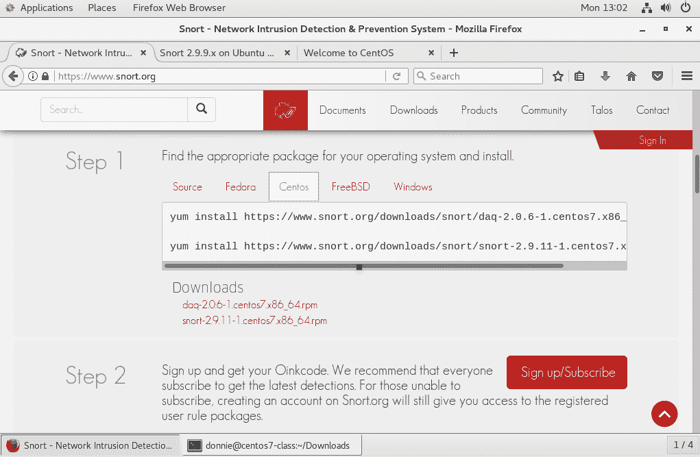

2.  第 2 步和第 3 步包括注册您的 Oinkcode，以便您可以下载官方的 Snort 检测规则，然后安装 PulledPork，以便您可以保持规则自动更新，如下图所示:

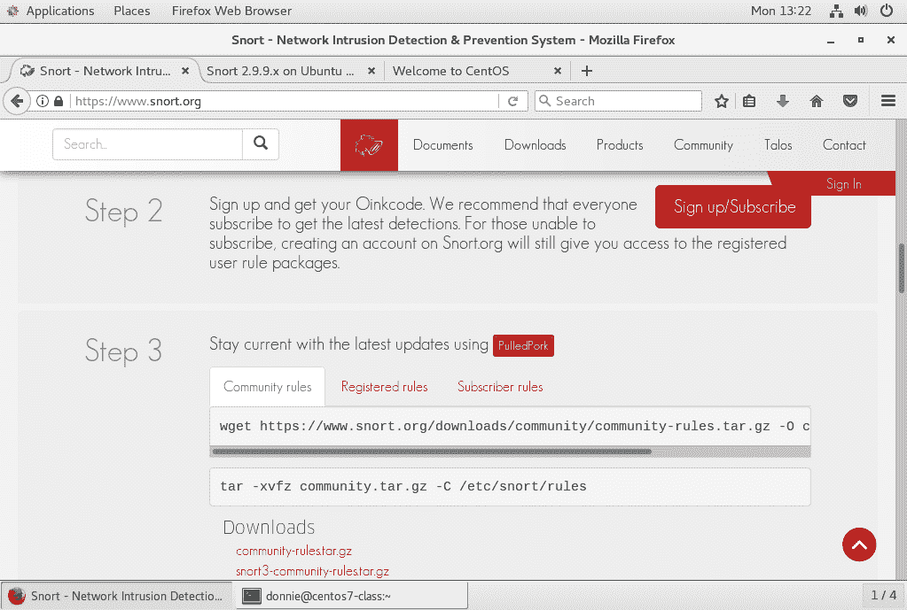

但是请记住，Snort 提供的免费检测规则比付费用户晚了一个月左右。出于学习的目的，它们是你所需要的。此外，如果您选择不获取 Oinkcode，您可以只使用 Community 规则，它是官方 Snort 规则的子集。

3.  第 4 步只是阅读文档:


就这样。您现在有了一个 Snort 的工作副本。唯一的问题是，到目前为止，您所拥有的只是命令行界面，这可能不是您想要的。

您已经完成了本实验–祝贺您！

# Snort 的图形界面

简单、不加修饰的 Snort 将做您需要它做的事情，并将它的发现保存到它自己的日志文件集中。然而，阅读日志文件来辨别网络流量趋势可能会有点乏味，所以您需要一些工具来帮助您。最好的工具是图形工具，它可以让你很好地可视化你的网络。

一个例子是**基础分析与安全引擎** ( **BASE** ，如下图截图所示:

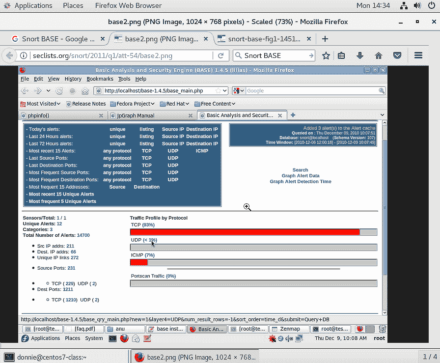

还有几个，但是当我们到达*安全洋葱*部分时，我会给你看。

You can find out more about BASE from the author's *Professionally Evil* website: [https://professionallyevil.com/](https://professionallyevil.com/)

既然您已经看到了如何以传统的方式设置 Snort，让我们看看简单的方法。

# 使用安全洋葱

Snort 本身并不难设置。但是，如果您手动完成所有工作，那么当您设置好控制台、传感器和您选择的图形前端时，可能会有点乏味。所以，想象一下，当我说这些的时候，我戴着墨镜盯着你，如果我告诉你，你可以把你的 Snort 设置成一个现成设备的一部分，会怎么样？如果我告诉你设置这样一个设备是一件轻而易举的事，你会怎么想？我想你可能会说，*所以，给我看看吧！*

If you feel bad about cheating by making Snort deployment so easy, there's really no need to. An official Snort representative once told me that most people deploy Snort in this manner.

安全洋葱是一个免费的专业 Linux 发行版，建立在 Xubuntu **长期支持** ( **LTS** )发行版之上。它包括 Snort 的完整实现，包括您能想象到的几乎每一个图形，以帮助您可视化网络上发生的事情。它还附带了 Suricata，这是另一个免费的开源 IDS。如果您可以安装一个 Linux 发行版，并在安装后进行点击式配置，那么您可以安装安全洋葱。

Note that the Xubuntu LTS version that Security Onion is based on is always at least one version behind the current LTS version of Xubuntu. At the time of writing, the current Xubuntu LTS version is version 18.04, whereas Security Onion is still based on Xubuntu 16.04\. However, that may change by the time you read this book.

Also, if you want to try out Security Onion, you can set it up in a VirtualBox virtual machine. When you create the virtual machine, set it up with two network adapters, both in *Bridged* mode. For best performance, allocate at least 3 GB of memory.

# 动手实验–安装安全洋葱

在本实验中，您将从设置一个带有两个桥接网络接口的虚拟机开始。

按照以下步骤安装安全洋葱:

1.  在虚拟机中安装操作系统，就像在任何其他 Linux 发行版中一样。
2.  安装完操作系统后，配置过程只需双击安装图标，然后按照对话框操作即可:

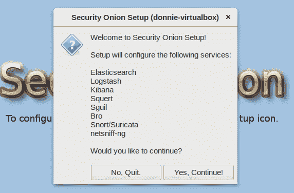

3.  要设置一台具有传感器功能的机器，您需要一台带有两个接口卡的机器。一个接口将被分配一个 IP 地址，它将是管理接口:


4.  您可以设置管理接口，以便它通过 DHCP 自动获得一个 IP 地址，但是分配一个静态 IP 地址要好得多:

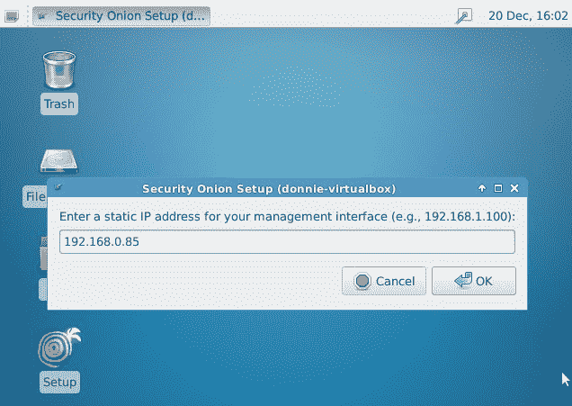

5.  您将使用另一个网络适配器作为嗅探接口。您不会为其分配 IP 地址，因为您希望该接口对坏人不可见:


6.  确认您选择的网络配置后，您需要重新启动机器:

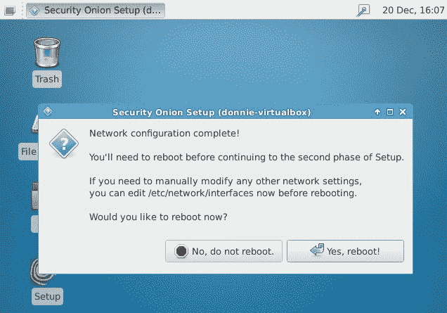

7.  机器重新启动后，再次双击设置图标，但这次选择跳过网络配置。对于安全洋葱的第一次用户来说，评估模式非常有帮助，因为它会自动为大多数内容选择正确的选项:

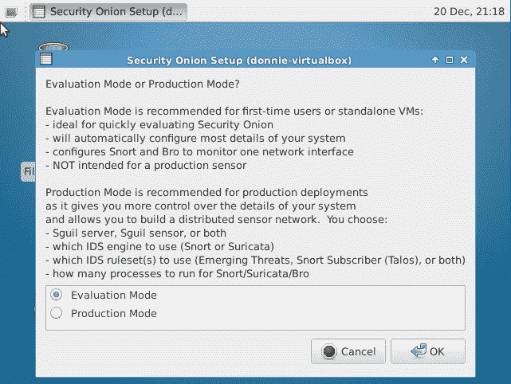

8.  从现在开始，只需要确认哪个网络接口将是嗅探器接口，并为不同的图形前端填写登录凭证。然后，在等待安装实用程序下载 Snort 规则并执行最后的配置步骤之后，您将拥有自己的可操作的 NIDS。现在，我问你，*还有什么能更容易？*

您已经完成了本实验–祝贺您！

安全洋葱有几个不同的图形前端。我最喜欢的是 Squert，在这里展示。即使只有默认的检测规则集，我也已经看到了一些有趣的东西。在这里，我们可以看到 Squert 在行动:

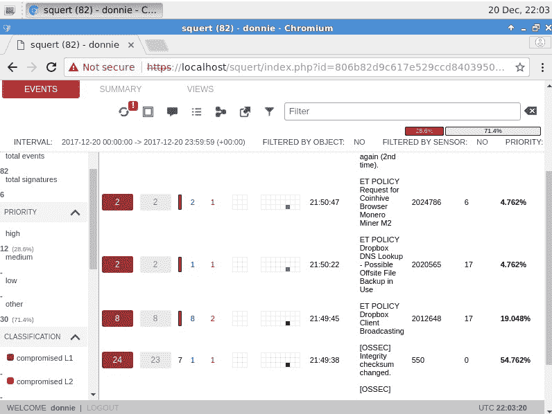

首先，我可以看到网络上有人在挖掘一些莫内罗加密硬币。嗯，其实是我在做，所以没关系。能够检测到这一点是一件好事，因为众所周知，坏人为了自己的利益会在公司服务器上安装 Monero 采矿软件。Monero cryptocoin 采矿会给服务器的 CPU 带来很大的负载，因此它不是您希望在服务器上使用的东西。此外，一些偷偷摸摸的网站运营商在他们的网页上放置了 JavaScript 代码，这导致任何访问他们的计算机都开始挖掘 Monero。因此，这条规则也有利于保护桌面系统。

我看到的另一件事是 Dropbox 客户端广播，这也没问题，因为我是 Dropbox 用户。然而，这是你可能不希望在公司网络中拥有的东西。

要查看与特定项目关联的 Snort 规则，只需单击它:


这只是已经为我们设置的标准 Snort 规则。

Bad guys who want to mine Monero without paying for it have set up botnets of machines that have been infected with their mining software. In some of the attacks, only Windows servers have been infected. However, here's a case where both Windows and Linux servers have been infected: [https://www.v3.co.uk/v3-uk/news/3023348/cyber-crooks-conducting-sophisticated-malware-campaign-to-mine-monero](https://www.v3.co.uk/v3-uk/news/3023348/cyber-crooks-conducting-sophisticated-malware-campaign-to-mine-monero)

单击 Squert 的“视图”选项卡，您将看到您的机器已经建立的连接的图形表示:

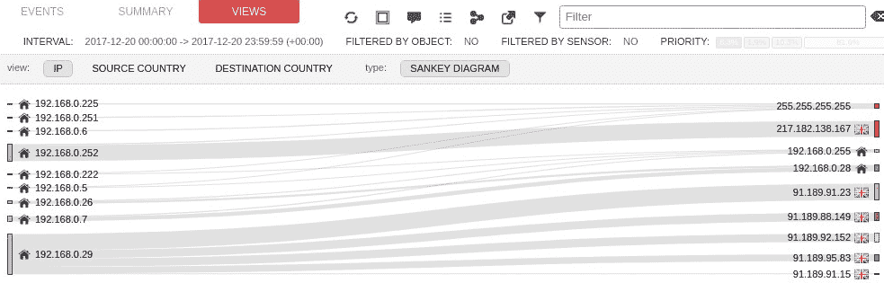

Snort 规则存储在`/etc/nsm/rules`目录中。当您仔细阅读任何一个`.rules`文件时，您会发现有相当多的规则已经启用，但也有相当多的规则没有启用。每个启用的规则都以`alert`关键字开始。禁用的以`#alert`开始注释。要查看所有启用的规则，请进入`rules`目录并使用我们的老朋友`grep`，如下所示:

```sh
cd /etc/nsm/rule
grep '^alert' *.rules
```

该命令查找以文本字符串`#alert`开头的所有行。您还可以查找所有禁用的规则，如下所示:

```sh
grep '^#alert' *.rules
```

这两个命令的输出都很长，因此您可以考虑将其发送到自己主目录中的文件，如下所示:

```sh
grep '^alert' *.rules > ~/enabled_rules.txt
grep '^#alert' *.rules > ~/disabled_rules.txt 
```

启用或禁用规则只是手动编辑适当的`.rules`文件以移除或插入前导`#`符号的简单事项。

关于安全洋葱和 Snort，我还可以向您展示更多，但是，唉，空间不允许。我已经告诉你要点了，你自己去试试吧。

I know that I made this Snort/Security Onion thing look rather easy, but there's a lot more to it than what I've been able to show you. On a large network, you might see a lot of traffic that doesn't make a lot of sense unless you know how to interpret the information that Snort presents to you. You might also need to fine-tune your Snort rules in order to see the anomalies that you want to see, without generating false positives. Or, you might even find the need to write your own custom Snort rules to handle unusual situations. Fortunately, the Security Onion folk do provide training, both on-site and online. You can find out more about it at the following website: [https://securityonionsolutions.com/](https://securityonionsolutions.com/) [](https://securityonionsolutions.com/) 

您刚刚深入研究了使用安全洋葱的奥秘。现在，让我们深入研究使用预建边缘防火墙设备的奥秘。

# IPFire 及其内置的入侵防御系统

当我写这本书的原始版本时，我在 Snort 部分包含了对 IPFire 的讨论。当时，IPFire 内置了 Snort。这是一个好主意，因为你有一个边缘防火墙和一个**入侵检测系统** ( **入侵检测系统**)都在一个方便的包里。但是，在 2019 年夏天，IPFire 的人用他们自己的 IPS 取代了 Snort。所以，我把 IPFire 移到了它自己的部分。

入侵检测系统和入侵防御系统的区别在于入侵检测系统会通知您问题，但不会阻止它们。入侵防御系统也会阻止它们。

如果你回想一下我们在[第 3 章](03.html)、*用防火墙保护你的服务器–第 1 部分*中对防火墙的讨论，我完全忽略了任何关于创建**网络地址转换** ( **NAT** )规则的讨论，这些规则是为了设置边缘或网关类型的防火墙而需要的。这是因为有几个 Linux 发行版是专门为此目的而创建的:

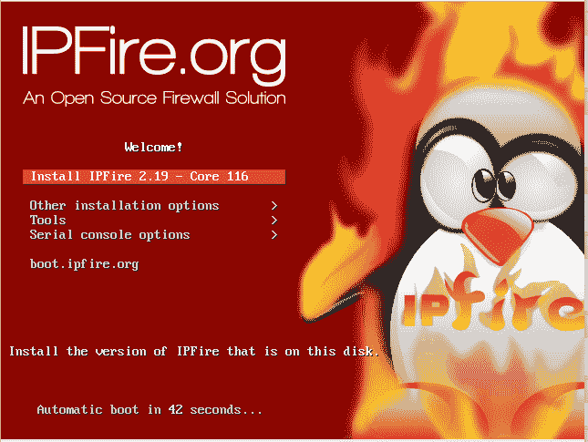

IPFire 是完全免费的，只需要几分钟就可以设置好。您可以将其安装在至少有两个网络接口适配器的机器上，并对其进行配置以匹配您的网络配置。这是一种代理类型的防火墙，这意味着除了进行正常的防火墙类型的数据包检查之外，它还包括缓存、内容过滤和 NAT 功能。您可以通过多种不同的配置来设置 IPFire:

*   在具有两个网络接口适配器的计算机上，您可以让一个适配器连接到互联网，另一个适配器连接到内部局域网。
*   有了三个网络适配器，您可以有一个到互联网的连接，一个到内部局域网的连接，一个到**非军事区** ( **非军事区**)的连接，在那里您有面向互联网的服务器。
*   有了第四个网络适配器，您可以拥有我们刚才提到的所有功能，以及对无线网络的保护。

话虽如此，让我们试一试。

# 动手实验–创建 IPFire 虚拟机

您通常不会在虚拟机中运行 IPFire。相反，您将把它安装在至少有两个网络接口的物理机器上。但是，仅仅为了让您看到它是什么样子，现在在虚拟机中设置它就可以了。让我们开始吧:

You can download IPFire from their website: [https://www.ipfire.org/](https://www.ipfire.org/)

1.  创建一个具有两个网络接口的虚拟机。将一个设置为桥接模式，将另一个设置为 NAT 模式。将 IPFire 安装到此虚拟机中。在设置阶段，选择桥接适配器作为绿色接口，选择 NAT 适配器作为红色接口。
2.  安装 IPFire 后，您需要使用普通工作站的网络浏览器导航到 IPFire 仪表板。使用以下网址执行此操作:

```sh
 https://192.168.0.190:444
```

(当然，用你自己的 IP 地址代替你的绿色接口。)

3.  在防火墙菜单下，您将看到入侵防御条目。单击该按钮进入该屏幕，您可以在其中启用入侵防御。第一步是选择要使用的规则集，然后选择每周或每日更新。然后，点击保存按钮:

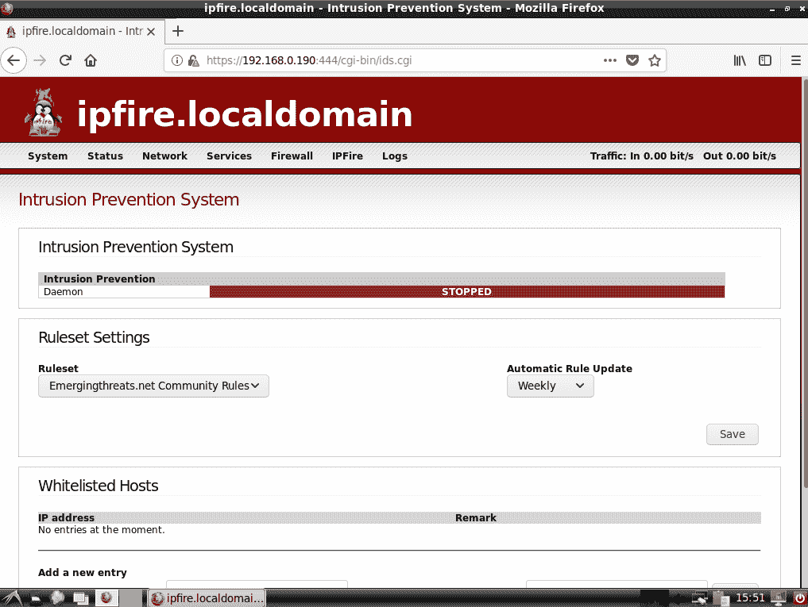

4.  然后，您将看到此屏幕，您将在其中选择要启用入侵防御的接口(选择两个接口。)然后，选择启用入侵防御系统复选框，并单击保存:


如果一切顺利，您将看到以下输出:

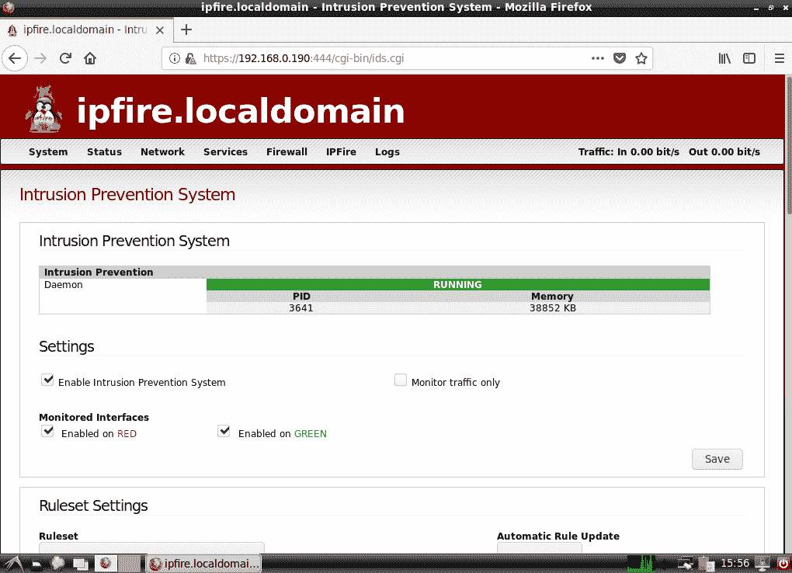

5.  然后，向下滚动页面，直到看到各种规则子集。在这里，选择您想要应用的。点击页面底部的应用按钮:


6.  通过选择日志/入侵防御日志查看入侵防御系统的运行情况:

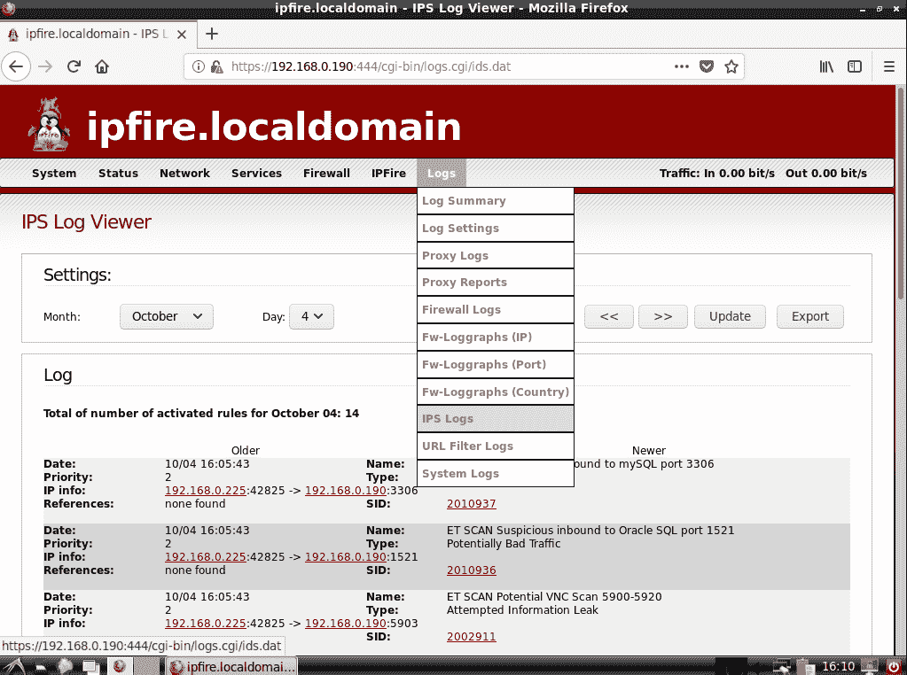

7.  点击其他菜单项查看 IPFire 的其他功能。

您已经完成了本实验–祝贺您！

您刚刚看到了使用自己的网络 IPS 设置边缘防火墙的简单方法。现在，让我们看看一些扫描工具。

# 使用 Lynis 进行扫描和加固

Lynis 是另一个自由/开源软件工具，你可以用它来扫描你的系统漏洞和糟糕的安全配置。它是一个可移植的 shell 脚本，您不仅可以在 Linux 上使用，还可以在各种不同的 Unix 系统和类似 Unix 的系统上使用。这是一个多用途工具，可以用于合规性审计、漏洞扫描或加固。与大多数漏洞扫描程序不同，您可以在要扫描的系统上安装并运行 Lynis。根据 Lynis 的创建者，这允许更深入的扫描。

Lynis 扫描工具是免费版本，但它的扫描功能有些有限。如果您需要 Lynis 提供的所有服务，您需要购买企业许可证。

# 在红帽/CentOS 上安装 Lynis

红帽/CentOS 7 用户将在 EPEL 存储库中找到最新版本的 Lynis。因此，如果您已经安装了 EPEL，正如我在[第 1 章](01.html)*中向您展示的那样，在虚拟环境*中运行 Linux，安装只是简单的执行以下操作:

```sh
sudo yum install lynis 
```

在撰写本文时，Lynis 还没有进入 EPEL 拍摄红帽/CentOS 8。无论如何都要检查一下，看是否已经添加。如果没有，那么您只需从 Lynis 网站下载即可。我们将在下一小节中讨论这个问题。

# 在 Ubuntu 上安装 Lynis

Ubuntu 在自己的存储库中有 Lynis，但它远远落后于当前的版本。如果您可以使用旧版本，安装它的命令如下:

```sh
sudo apt install lynis
```

如果你想要最新版本的 Ubuntu，或者你想在没有它的操作系统上使用 Lynis，你可以

You can download Lynis from [https://cisofy.com/downloads/lynis/](https://cisofy.com/downloads/lynis/). [](https://cisofy.com/downloads/lynis/) The cool thing about this is that once you download it, you can use it on any Linux, Unix, or Unix-like operating system (this even includes macOS, which I've just confirmed by running it on my old Mac Pro that's running with macOS High Sierra.) [](https://cisofy.com/downloads/lynis/) 

因为可执行文件只是一个普通的 shell 脚本，所以不需要执行实际的安装。您所需要做的就是将归档文件`cd`提取到结果目录中，并从那里运行 Lynis:

```sh
tar xzvf lynis-2.7.5.tar.gz
cd lynis
sudo ./lynis -h
```

`lynis -h`命令向您显示帮助屏幕，以及您需要了解的所有 Lynis 命令。

# 用 Lynis 扫描

无论您要扫描哪个操作系统，Lynis 命令的工作原理都是一样的。唯一不同的是，如果你从网站下载的存档文件中运行它，你会将`cd`放入`lynis`目录，并在`lynis`命令前加一个`./`。(这是因为出于安全原因，您自己的主目录不在允许 shell 自动查找可执行文件的路径设置中。)

要扫描安装了 Lynis 的系统，请执行以下命令:

```sh
sudo lynis audit system
```

要扫描刚下载归档文件的系统，请执行以下命令:

```sh
cd lynis
sudo ./lynis audit system
```

从主目录中的 shell 脚本运行 Lynis 会向您显示以下消息:

```sh
donnie@ubuntu:~/lynis$ sudo ./lynis audit system
. . .
[X] Security check failed

 Why do I see this error?
 -------------------------------
 This is a protection mechanism to prevent the root user from executing user created files. The files may be altered, or including malicious pieces of script.

 . . .

[ Press ENTER to continue, or CTRL+C to cancel ]
```

这并没有伤害到什么，所以你可以直接点击*进入*继续。或者，如果看到此消息真的让您感到困扰，您可以将 Lynis 文件的所有权更改为根用户，正如消息告诉您的那样。现在，我只需按下*进入*。

以这种方式运行 Lynis 扫描类似于对通用安全配置文件运行 OpenSCAP 扫描。主要区别在于 OpenSCAP 有自动修复功能，而 Lynis 没有。Lynis 告诉你它发现了什么，并建议如何解决它认为是一个问题，但它不能为你解决任何问题。

空间不允许我显示整个扫描输出，但我可以向您展示几个示例片段:

```sh
[+] Boot and services
------------------------------------
 - Service Manager                                           [ systemd ]
 - Checking UEFI boot                                        [ DISABLED ]
 - Checking presence GRUB                                    [ OK ]
 - Checking presence GRUB2                                   [ FOUND ]
 - Checking for password protection                        [ WARNING ]
 - Check running services (systemctl)                        [ DONE ]
 Result: found 21 running services
 - Check enabled services at boot (systemctl)                [ DONE ]
 Result: found 28 enabled services
 - Check startup files (permissions)                         [ OK ]

```

此警告消息表明我的`GRUB2`引导程序没有密码保护。这可能是也可能不是什么大问题，因为有人利用它的唯一方法是获得对机器的物理访问。如果这是一台被锁在只有少数受信任的人才能访问的房间里的服务器，那么我不会担心它，除非适用的监管机构的规则要求我这样做。如果这是一台开着的台式电脑，那么我肯定会修好它。(我们将在[第 14 章](14.html)、*大忙人的安全提示和技巧*中查看 GRUB 密码保护。)

在`File systems`部分，我们可以看到一些旁边带有`SUGGESTION`标志的项目:

```sh
[+] File systems
------------------------------------
 - Checking mount points
 - Checking /home mount point                              [ SUGGESTION ]
 - Checking /tmp mount point                               [ SUGGESTION ]
 - Checking /var mount point                               [ SUGGESTION ]
 - Query swap partitions (fstab)                             [ OK ]
 - Testing swap partitions                                   [ OK ]
 - Testing /proc mount (hidepid)                             [ SUGGESTION ]
 - Checking for old files in /tmp                            [ OK ]
 - Checking /tmp sticky bit                                  [ OK ]
 - ACL support root file system                              [ ENABLED ]
 - Mount options of /                                        [ NON DEFAULT ]
```

Lynis 建议的内容就在输出的末尾:

```sh
. . .
. . .

 * To decrease the impact of a full /home file system, place /home on a separated partition [FILE-6310]
 https://cisofy.com/controls/FILE-6310/

 * To decrease the impact of a full /tmp file system, place /tmp on a separated partition [FILE-6310]
 https://cisofy.com/controls/FILE-6310/

 * To decrease the impact of a full /var file system, place /var on a separated partition [FILE-6310]
 https://cisofy.com/controls/FILE-6310/
. . .
. . .
```

我们最后要看的是输出末尾的扫描细节部分:

```sh
 Lynis security scan details:
 Hardening index : 67 [#############       ]
 Tests performed : 218
 Plugins enabled : 0
 Components:
 - Firewall               [V]
 - Malware scanner        [X]
 Lynis Modules:
 - Compliance Status      [?]
 - Security Audit         [V]
 - Vulnerability Scan     [V]
 Files:
 - Test and debug information      : /var/log/lynis.log
 - Report data                     : /var/log/lynis-report.dat
```

对于`Components`，有一个红色的`Malware Scanner``X`。那是因为我没有在这台机器上安装 ClamAV 或 maldet，所以 Lynis 无法进行病毒扫描。

对于`Lynis Modules`，我们可以通过`Compliance Status`看到一个问号。这是因为该功能是为企业版 Lynis 保留的，它需要付费订阅。正如我们在上一章中看到的，您有 OpenSCAP 配置文件来使系统符合几种不同的安全标准，并且它不会让您付出任何代价。使用 Lynis，您必须为合规性配置文件付费，但您可以选择的范围更广。除了 OpenSCAP 提供的合规性配置文件，Lynis 还提供了 HIPAA 和萨班斯-奥克斯利法案合规性的配置文件。

If you're based in the United States, you most surely know what HIPAA and Sarbanes-Oxley are and whether they apply to you. If you're not in the United States, then you probably don't need to worry about them.

Having said that, if you work in the healthcare industry, even if you're not in the United States, the HIPAA profile can give you guidance on how to protect private data for patients.

关于 Lynis，我想说的最后一点是关于企业版的。在他们网站上的以下截图中，您可以看到当前的定价以及不同订阅计划之间的差异:


如你所见，你有选择。

You'll find information about pricing on the following website: [https://cisofy.com/pricing/](https://cisofy.com/pricing/)

关于我们对林尼斯的讨论，这就差不多结束了。接下来，我们将研究一个外部漏洞扫描器。

# 使用 OpenVAS 查找漏洞

**开放漏洞评估扫描程序** ( **OpenVAS** )是您用来执行远程漏洞扫描的工具。你可以扫描

三大安全发行版分别是 Kali Linux、Parrot Linux 和 Black Arch。它们针对的是安全研究人员和渗透测试人员，但它们包含的工具也适用于普通的 Linux 或 Windows 安全管理员。OpenVAS 就是这样一个工具。所有这三个安全发行版都有其独特的优点和缺点，但是由于 Kali 是最受欢迎的，我们将在演示中使用它。

You can download Kali Linux from [https://www.kali.org/downloads/](https://www.kali.org/downloads/).

当你去 Kali 下载页面，你会看到很多选择。如果你像我一样，不喜欢默认的 Gnome 3 桌面环境，可以选择别的。我个人是一个 LXDE 的家伙，所以我同意它:


Kali 是从 Debian Linux 构建的，所以安装它和安装 Debian 差不多。唯一的例外是 Kali 安装程序允许您为根用户创建密码，但不允许您创建普通的非根用户帐户。这是因为你对 Kali 做的几乎所有事情都需要你作为根用户登录。我知道这与我之前告诉你的不作为`root`登录，而是使用普通用户账户的`sudo`是背道而驰的。然而，你需要和卡利做的大部分事情并不适用于`sudo`。此外，Kali 并不打算用作通用发行版，只要您只使用 Kali，您就可以以 root 用户身份登录。

OpenVAS is a rather memory-hungry program, so if you're installing Kali in a virtual machine, be sure to allocate at least 3 GB of memory.

安装 Kali 后，您要做的第一件事就是更新它，更新方式与更新任何 Debian/Ubuntu 类型的发行版相同。然后，按照以下步骤安装 OpenVAS:

```sh
apt update
apt dist-upgrade
apt install openvas
```

OpenVAS 安装完成后，您需要运行一个脚本来创建安全证书并下载漏洞数据库:

```sh
openvas-setup
```

这需要很长时间，所以你不妨在它运行的时候去买个三明治和一杯咖啡。当它最终完成时，您将看到用于登录 OpenVAS 的密码。写下来，放在安全的地方:

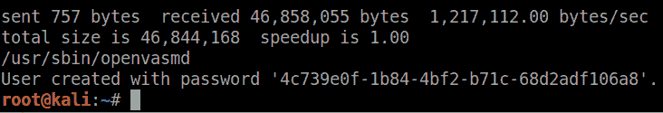

您可以从“应用”菜单控制和更新 OpenVAS:


在该菜单上，单击 openvas start。然后，打开火狐，导航到`https://localhost:9392`。您将收到安全警报，因为 OpenVAS 使用自签名安全证书，但这没关系。只需点击高级按钮，然后点击添加例外:

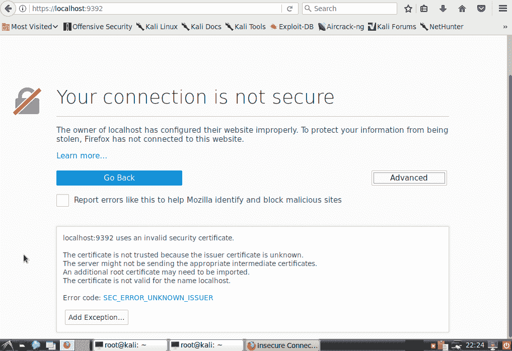

在登录页面，输入`admin`作为用户，然后输入由`openvas-setup`脚本生成的密码。

现在，有各种各样的花哨的东西，你可以用 OpenVAS 做，但现在，我们将只看如何做一个基本的漏洞扫描。首先，从 OpenVAS 控制面板的“扫描”菜单中选择“任务”:


这会弹出以下对话框，告诉您使用向导(是的，我们确实要去看向导):

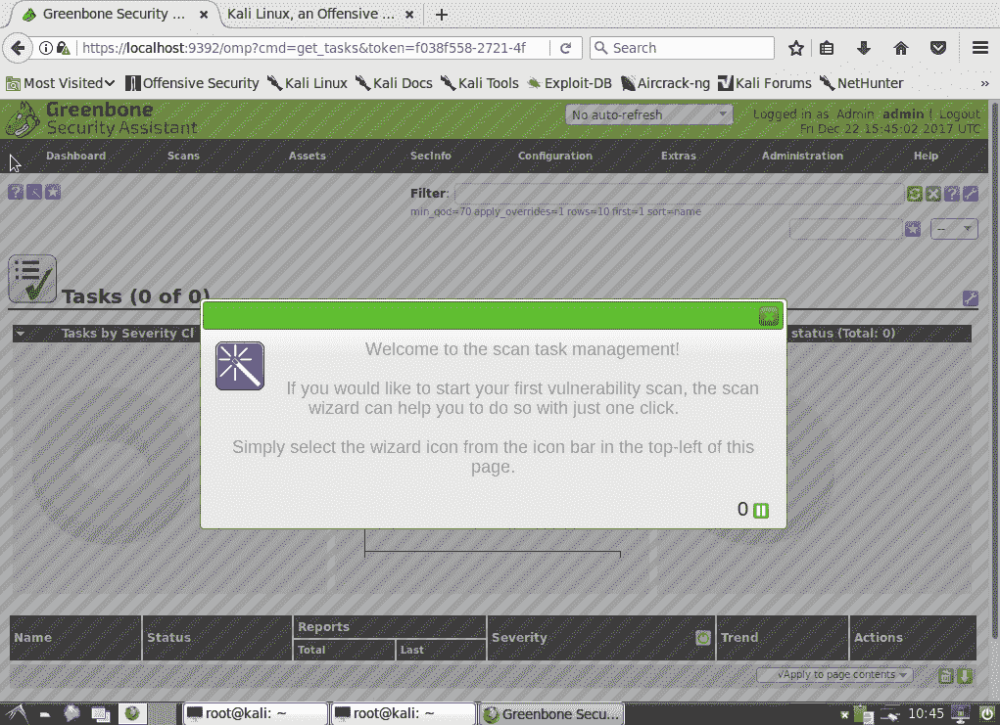

关闭对话框后，您会看到左上角出现紫色的向导图标。现在，我们只需选择任务向导选项，它将为我们选择所有默认扫描设置:

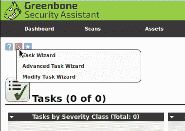

您在这里唯一需要做的就是输入要扫描的机器的 IP 地址，然后开始扫描:


扫描需要一些时间，所以你最好去喝一杯:

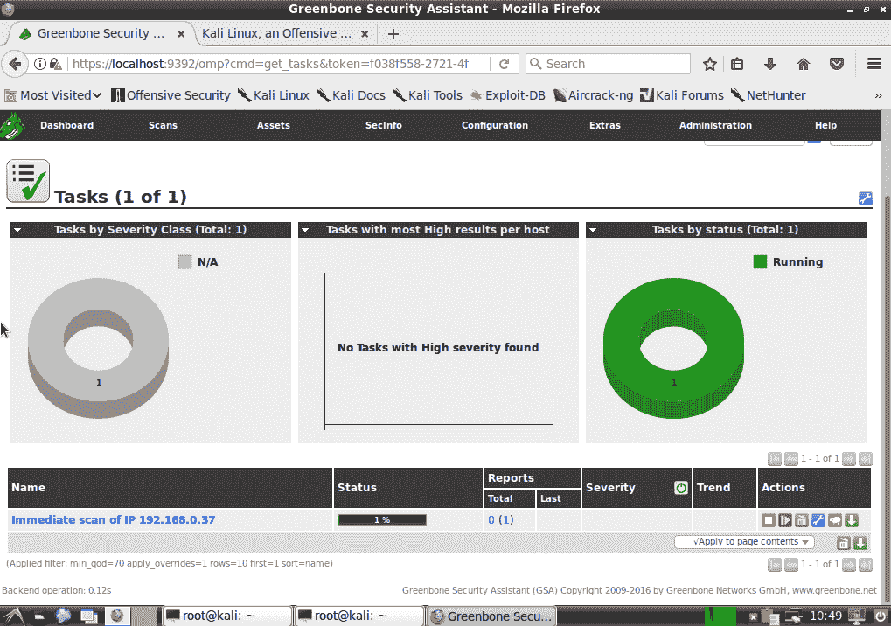

您正在进行的扫描类型被命名为“完整和快速”，这不是最全面的扫描类型。要选择另一种扫描类型并配置其他扫描选项，请使用高级任务向导，如下图所示:

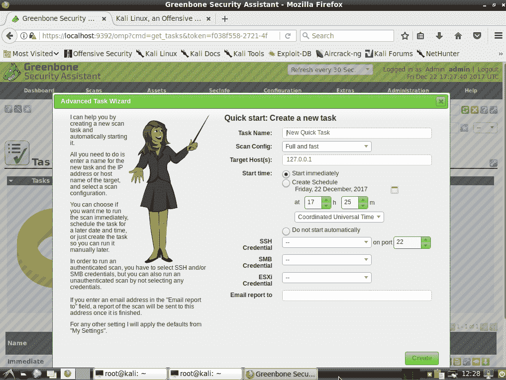

在这里，您可以看到不同扫描选项的下拉列表:


当我使用默认的完整和快速选项进行第一次扫描时，我没有发现许多问题。我有一个中度严重和 18 个低度严重，就是这样。我知道，由于我正在扫描的机器的年龄，肯定会有更多的问题，所以我再次尝试了完整和快速的终极选项。

这一次，我发现了更多，包括一些高严重性的东西:

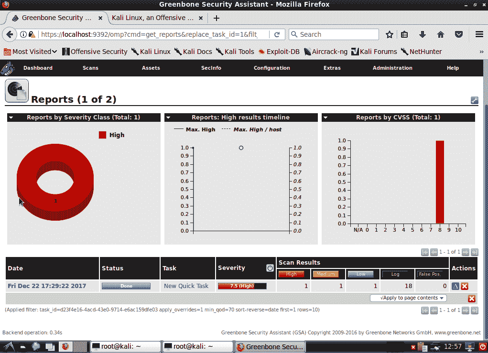

前面的报告显示，我的机器正在使用安全外壳的弱加密算法，该算法被归类为中等严重性。它还有一个打印服务器漏洞，被归类为高严重性问题。

您还需要注意没有标记为漏洞的项目。例如，VNC 安全类型项目显示端口`5900`是打开的。这意味着**虚拟网络计算** ( **VNC** )守护进程正在运行，允许用户远程登录该机器的桌面。如果这台机器是一台面向互联网的机器，那将是一个真正的问题，因为 VNC 没有像安全外壳那样真正的安全性:

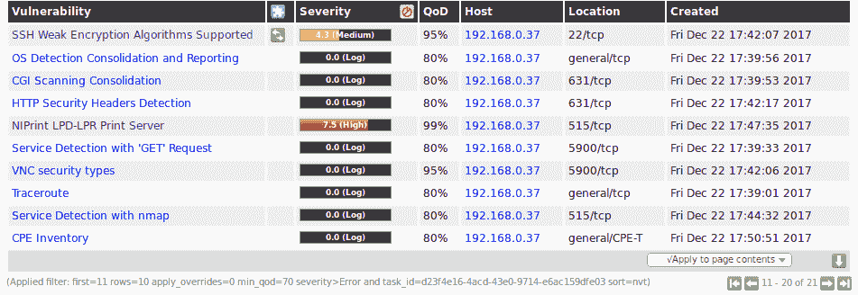

通过单击打印服务器项目，我可以看到对此漏洞的解释:


请记住，在这种情况下，目标计算机是桌面计算机。如果是服务器，我们很有可能会看到更多的问题。

这基本上为 OpenVAS 做好了准备。正如我之前提到的，你可以用它做很多很棒的事情。然而，我在这里向你展示的应该足以让你开始。摆弄它，尝试不同的扫描选项，看看结果的差异。

If you want to find out more about Kali Linux, you'll find a great selection of books about it on the Packt Publishing website.

好吧。现在您知道如何使用 OpenVAS 进行漏洞扫描了。现在，让我们看看专门为网络服务器设计的扫描仪。

# 使用 Nikto 扫描网络服务器

我们刚刚看到的 OpenVAS 是一个通用的漏洞扫描器。它可以为任何类型的操作系统或任何服务器守护进程找到漏洞。然而，正如我们刚刚看到的，OpenVAS 扫描可能需要一段时间才能运行，并且可能超过您的需求。

Nikto 是一个只有一个目的的专用工具；也就是说，它意味着扫描 web 服务器，并且只扫描 web 服务器。它易于安装，易于使用，并且能够相当快速地对 web 服务器进行全面扫描。虽然它包含在 Kali Linux 中，但是您不需要 Kali Linux 来运行它。

# Kali Linux 中没有人

如果您已经有了 Kali Linux，您会发现 nikto 已经安装在漏洞分析菜单下:

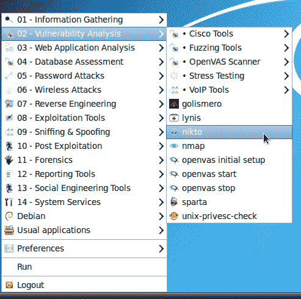

当您单击该菜单项时，您将打开一个命令行终端，显示 Nikto 帮助屏幕:

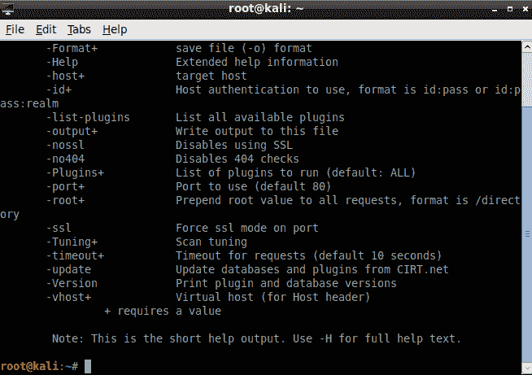

我们现在将在 Linux 上安装 Nikto。

# 在 Linux 上安装和更新 Nikto

Nikto 在红帽/CentOS 7 的 EPEL 存储库中，而它在 Ubuntu 的普通存储库中(我们仍在等待它在 EPEL 8 中出现)。除了 Nikto 包本身，您还需要安装一个使用 SSL/TLS 加密设置的服务器。

要在红帽/CentOS 上安装，请使用以下命令:

```sh
sudo yum install nikto perl-Net-SSLeay
```

要在 Ubuntu 上安装，请使用以下命令:

```sh
sudo apt install nikto libnet-ssleay-perl
```

接下来您要做的是更新漏洞签名数据库。然而，在撰写本文时，红帽/CentOS 实现中有一个小错误。由于某种原因，`docs`目录丢失，这意味着更新功能将无法下载`CHANGES.txt`文件来显示新的数据库更新发生了什么变化。要在您的 CentOS 虚拟机上修复此问题，请使用以下命令:

```sh
sudo mkdir /usr/share/nikto/docs
```

但是请记住，当你读到这篇文章时，这个问题可能已经解决了。

从现在开始，您的任何一台虚拟机上的工作方式都将相同。要更新漏洞数据库，请使用以下命令:

```sh
sudo nikto -update
```

Nikto 本身不需要`sudo`权限，但是更新它需要，因为它需要写入一个普通用户无法写入的目录。

# 用 Nikto 扫描网络服务器

从现在开始，你不再需要`sudo`特权。这意味着您可以不必总是键入密码。

要进行简单扫描，请使用`-h`选项指定目标主机:

```sh
nikto -h 192.168.0.9
nikto -h www.example.com
```

让我们看一些示例输出。这是最上面的部分:

```sh
+ Allowed HTTP Methods: POST, OPTIONS, GET, HEAD
+ OSVDB-396: /_vti_bin/shtml.exe: Attackers may be able to crash FrontPage by requesting a DOS device, like shtml.exe/aux.htm -- a DoS was not attempted.
+ /cgi-bin/guestbook.pl: May allow attackers to execute commands as the web daemon.
+ /cgi-bin/wwwadmin.pl: Administration CGI?
+ /cgi-bin/Count.cgi: This may allow attackers to execute arbitrary commands on the server 
```

在顶部，我们可以看到有一个`shtml.exe`文件，应该是为 FrontPage 网页创作程序准备的。我不知道它为什么在那里，考虑到这是一个 Linux 服务器，那是一个 Windows 可执行文件。尼克托告诉我，有了那个文件，有人可能会对我进行拒绝服务攻击(T2)。

接下来我们可以看到`/cgi-bin`目录下有各种脚本。从解释信息中可以看出，这不是一件好事，因为它可能允许攻击者在我的服务器上执行命令。

我们来看第二部分:

```sh
+ OSVDB-28260: /_vti_bin/shtml.exe/_vti_rpc?method=server+version%3a4%2e0%2e2%2e2611: Gives info about server settings.
+ OSVDB-3092: /_vti_bin/_vti_aut/author.exe?method=list+documents%3a3%2e0%2e2%2e1706&service%5fname=&listHiddenDocs=true&listExplorerDocs=true&listRecurse=false&listFiles=true&listFolders=true&listLinkInfo=true&listIncludeParent=true&listDerivedT=false&listBorders=fals: We seem to have authoring access to the FrontPage web.
```

在这里，我们可以看到`vti_bin`目录中有一个`author.exe`文件，理论上可以允许某人拥有创作权限。

现在，最后一部分:

```sh
+ OSVDB-250: /wwwboard/passwd.txt: The wwwboard password file is browsable. Change wwwboard to store this file elsewhere, or upgrade to the latest version.
+ OSVDB-3092: /stats/: This might be interesting...
+ OSVDB-3092: /test.html: This might be interesting...
+ OSVDB-3092: /webstats/: This might be interesting...
+ OSVDB-3092: /cgi-bin/wwwboard.pl: This might be interesting...
+ OSVDB-3233: /_vti_bin/shtml.exe/_vti_rpc: FrontPage may be installed.
+ 6545 items checked: 0 error(s) and 15 item(s) reported on remote host
+ End Time:           2017-12-24 10:54:21 (GMT-5) (678 seconds)
```

最后一个感兴趣的项目是`wwwboard`目录中的`passwd.txt`文件。显然，这个密码文件是可以浏览的，这绝对不是一件好事。

现在，在你指责我编造这些问题之前，我会透露这是对真实托管服务上真实制作网站的扫描(是的，我确实有权限扫描)，所以，这些问题是真实存在的，需要修复。

以下是我在扫描运行 WordPress 的网络服务器时得到的另外几条示例消息:

```sh
HTTP TRACK method is active, suggesting the host is vulnerable to XST
Cookie wordpress_test_cookie created without the httponly flag
```

长话短说，这两个问题都有可能让攻击者窃取用户凭据。在这种情况下，解决方法是看看 WordPress 是否发布了任何可以解决这个问题的更新。

那么，我们如何保护 web 服务器免受这些漏洞的侵害呢？让我们看看:

*   正如我们在第一个例子中看到的，您希望确保您的 web 服务器上没有任何有风险的可执行文件。在这种情况下，我们在我们的 Linux 服务器上发现了两个可能不会伤害任何东西的`.exe`文件，因为 Windows 可执行文件不在 Linux 上运行。然而，另一方面，它可能是伪装成 Windows 可执行文件的 Linux 可执行文件。我们还发现了一些肯定会在 Linux 上运行的`perl`脚本，这可能会带来问题。
*   如果有人要在你的网络服务器上植入一些恶意脚本，你会希望有某种形式的强制访问控制，比如 SELinux 或 AppArmor，这将阻止恶意脚本运行。(详见[第九章](09.html)、*使用 SELinux 和 AppArmor 实施强制访问控制、*)。
*   您也可以考虑安装 web 应用防火墙，如 ModSecurity。空间不允许我介绍 ModSecurity 的细节，但是你可以在 Packt Publishing 网站上找到一本介绍它的书。
*   保持你的系统更新，尤其是如果你运行的是基于 PHP 的内容管理系统，比如 WordPress。如果你关注信息技术安全新闻，你会比你想看到的更多地看到关于 WordPress 漏洞的报道。

只需在命令行中键入`nikto`，就可以看到其他扫描选项。不过，就目前而言，这足以让您开始基本的 web 服务器扫描。

# 摘要

我们已经到达了旅程中的又一个里程碑，我们看到了一些很酷的东西。我们首先讨论了将 Snort 设置为 NIDS 的基础。然后，我向您展示了如何通过部署一个专业的 Linux 发行版来严重作弊，该发行版已经安装了 Snort 并准备就绪。作为奖励，我向您展示了一个快速简单的边缘防火墙设备，它带有内置的网络入侵防御系统。

接下来，我向您介绍了 Lynis，以及如何使用它来扫描您的系统中的各种漏洞和合规性问题。最后，我们用 OpenVAS 和 Nikto 的工作演示来结束这一切。

在下一章中，我们将通过为忙碌的管理员提供一些快速提示来结束整个旅程。到时候见。

# 问题

1.  您会使用以下哪个命令在`.rules`文件中搜索活动的 Snort 规则？
    a .`grep -w 'alert' *.rules`
    b .`grep -i 'alert' *.rules`
    c .`grep '^alert$' *.rules`
    d .`grep 'alert' *.rules`
2.  以下哪一项最能描述 IPFire？
    A .内置网络入侵检测系统的基于主机的防火墙设备
    B .内置网络入侵检测系统的边缘防火墙设备
3.  以下哪个实用程序最适合扫描萨班斯-奥克斯利法案合规性问题？
    a . Lynis
    b . Lynis Enterprise
    c . OpenVAS
    d . OpenSCAP

4.  为了获得一套正式的 Snort 检测规则，您需要什么？
    a . oink code。
    没什么。官方 Snort 规则已经安装好了。
    C .只需使用`sudo snort --update`命令。
    D .官方 Snort 规则只能通过付费订阅获得。
5.  以下哪一项最能代表 Snort？HIDS GIDS T2 NIDS FIDS
6.  您会将以下哪一项用作通用的外部漏洞扫描程序？
    a . OpenVAS
    b . Nikto
    c . OpenSCAP
    d . Lynis
7.  使用 Nikto 扫描，您最有可能发现以下哪些问题？
    a . Samba 服务正在运行，尽管它不应该是
    B .根用户帐户通过 SSH
    C .潜在的恶意脚本驻留在 CGI 目录
    D .根用户帐户配置了弱密码
8.  Lynis 有什么独特的特点？
    答:这是一个专有的、封闭源代码的漏洞扫描器。
    B .它是一个 shell 脚本，可以用来扫描任何 Linux、Unix 或类似 Unix 的操作系统的漏洞。
    C .这是一个外部漏洞扫描器。
    D .只能安装在专业的安全发行版上，比如 Kali Linux。
9.  使用 Snort，您最有可能发现以下哪些问题？
    A .密码较弱的根用户帐户
    B .没有活动防火墙的服务器
    C .网络上活动的 Cryptocoin 挖掘恶意软件
    D .通过 SSH 暴露于互联网的根用户帐户
10.  关于安全洋葱，以下哪项陈述是正确的？
    A .控制和传感器功能都使用相同的网络接口。
    B .控制网络接口设置无 IP 地址。
    C .传感器网络接口设置没有 IP 地址。
    D .控制和传感器接口都需要一个 IP 地址。

11.  您将使用 OpenVAS 进行的默认扫描类型的名称是什么？
    A .快速狂暴
    B .全扫描
    C .全快速终极
    D .全快速

# 进一步阅读

*   Lynis 主页:https://cisofy . com/lynis/
*   Lynis 和 auditd 有何不同:[https://linux-audit.com/how-are-auditd-and-lynis-different/](https://linux-audit.com/how-are-auditd-and-lynis-different/)
*   OpenVAS 主页:[http://www.openvas.org/](http://www.openvas.org/)
*   Snort 主页:[https://www.snort.org/](https://www.snort.org/)
*   无人主页： [https://cirt.net/nikto2](https://cirt.net/nikto2)
*   安全洋葱主页:[https://securityonion.net/](https://securityonion.net/)