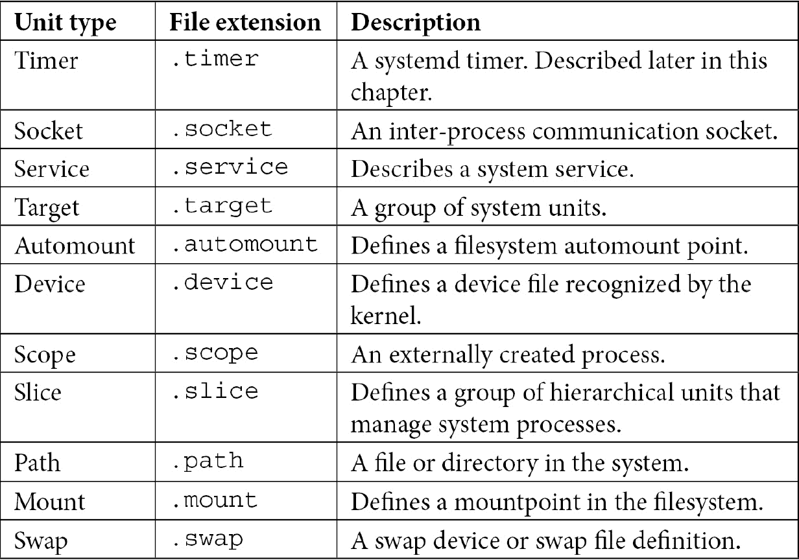
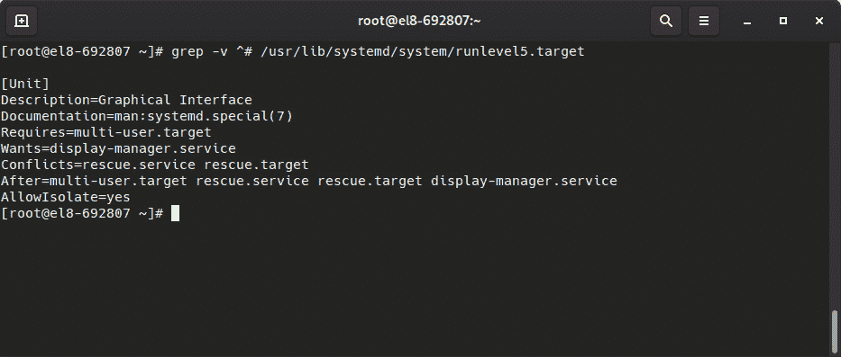
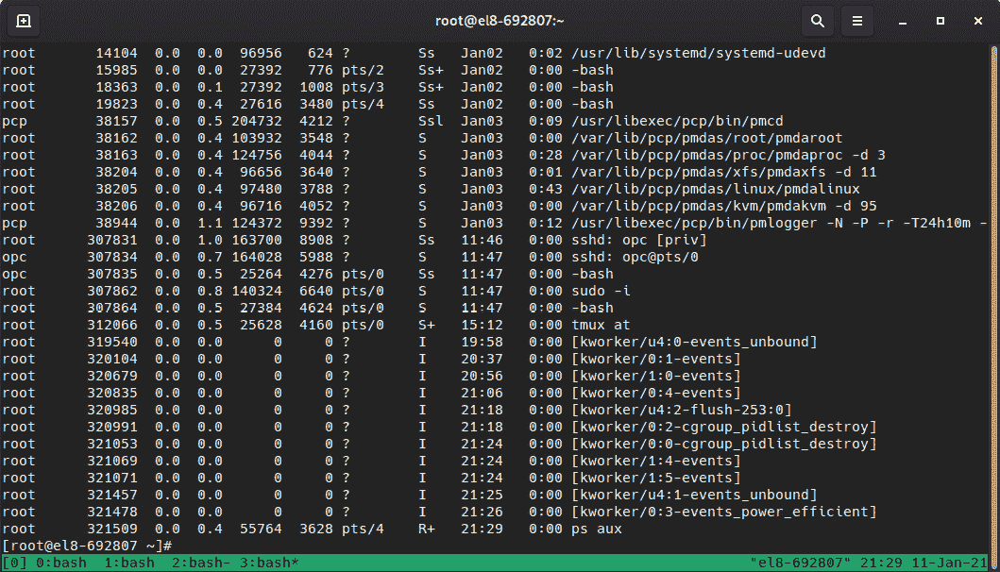
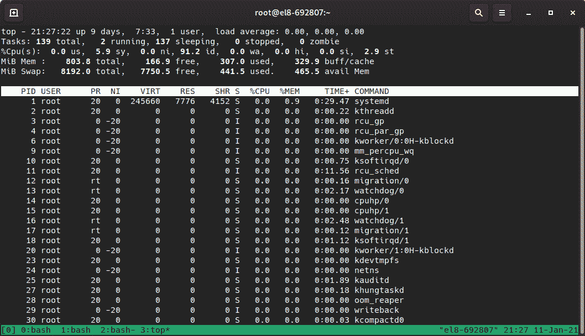
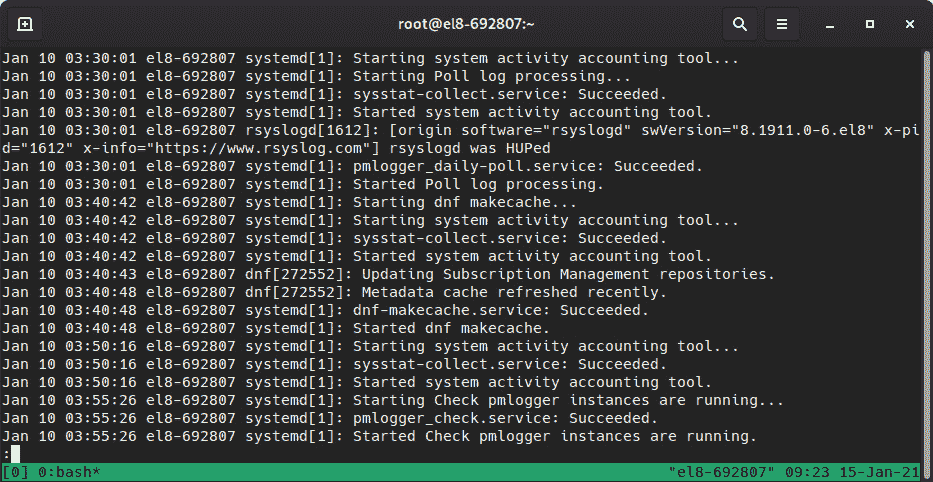

# 四、常规操作工具

在本书的这一点上，我们已经安装了一个系统，并且我们已经介绍了一些我们可以创建的自动执行任务的脚本，所以我们已经到了可以关注系统本身的时候了。

要正确地配置一个系统，不仅需要安装它，还需要了解如何在特定时间运行任务，保持所有服务适当地运行，配置时间同步、服务管理、引导目标(运行级别)和计划任务，所有这些我们将在本章中讨论。

在本章中，您将学习如何检查服务的状态，如何启动、停止和排除故障，以及如何为您的服务器或整个网络保持系统时钟同步。

所涵盖的主题如下:

*   使用 systemd 管理系统服务
*   使用 cron 和 systemd 调度任务
*   了解使用 chrony 和 ntp 进行时间同步
*   检查空闲资源-内存和磁盘(free 和 df)
*   查找日志、使用日志和读取日志文件，包括日志保存和旋转

# 技术要求

你可以使用我们在本书开始时创建的虚拟机来完成这一章。 此外，为了测试*NTP 服务器*，可能需要创建第二个虚拟机，该虚拟机将作为客户端连接到第一个虚拟机，并遵循与第一个虚拟机相同的过程。 此外，需要的软件包将在文本中指明。

# 使用 systemd 管理系统服务

在本节中，您将了解如何使用**systemd**管理**系统服务**、运行时目标以及所有关于服务状态的信息。 您还将学习如何管理系统引导目标和应该在系统引导时启动的服务。

`systemd`(您可以在[https://www.freedesktop.org/wiki/Software/systemd/](https://www.freedesktop.org/wiki/Software/systemd/)中了解一些有关它的内容)被定义为用于管理系统的系统守护进程。 它是对系统引导和启动方式的一种重新设计，并探讨了与传统方式相关的局限性。

当我们考虑系统启动时，我们首先装入**内核**和**ramdisk**，然后执行，但是在这之后，服务和脚本将控制文件系统的可用性。 这有助于为我们的系统提供所需功能的服务做准备，例如以下内容:

*   硬件检测
*   额外的文件系统激活
*   网络初始化(有线、无线等)
*   网络服务(时间同步、远程登录、打印机、网络文件系统等等)
*   空间的设置

然而，在`systemd`之前存在的大多数工具都以顺序的方式发挥作用，导致整个引导过程(从引导到用户登录)变得冗长并可能出现延迟。

传统上，这也意味着我们必须等待所需的服务完全可用，然后才能启动依赖它的下一个服务，这增加了总引导时间。

尝试一些方法,比如使用*monit*或其他工具,允许我们定义依赖项,监控过程,甚至从失败中恢复过来,但总的来说,它是重用现有的工具来执行其他功能,关于 fastest-booting 系统试图赢得比赛。

重要提示

`systemd`重新设计流程，注重简单性:少启动流程，多并行执行。 这个想法听起来很简单，但是需要重新设计很多在过去被认为是理所当然的东西，以专注于改进操作系统性能的新方法的需求。

这个设计,提供了许多好处,也带来了成本:它大大改变了系统用于启动,所以有很多的争议的采用`systemd`由不同的供应商,甚至一些社区努力提供 systemd-free 变体。

合理安排服务的启动方式，以便只启动需要的服务，这是实现效率的好方法，例如，当系统断开时，不需要启动蓝牙、打印机或网络服务，没有蓝牙硬件，或者没有人打印。 由于等待启动的服务较少，系统引导不会因这些等待而延迟，而是将重点放在真正需要关注的服务上。

除此之外,并行执行让我们每个服务需要花时间准备而不是让别人等,一般而言,并行运行服务初始化允许我们最大化的使用 CPU、磁盘、等等,等待时间为每个服务使用的其他服务活动。

`systemd`还在实际 daemon 启动之前预先创建侦听套接字，这样对其他服务有需求的服务就可以启动，并处于等待状态，直到它的依赖项启动。 这是在不丢失发送给它们的任何消息的情况下完成的，因此当服务最终启动时，它将对所有挂起的操作进行操作。

让我们学习更多关于*systemd*的知识，因为它将是我们在本章将要描述的几个操作所必需的。

*Systemd*带有单元的概念，它是不过是配置文件。 这些单元可以根据它们的文件扩展名分为不同的类型:



提示

不要因为不同的`systemd`单位类型而感到不知所措。 一般来说，最常见的是**服务**、**定时器**、**Socket**和**Target**。

当然，这些单元文件预计会在一些特定的文件夹中找到:


正如我们前面提到的套接字，路径、总线和更多的单元文件在系统访问该路径时被激活，允许服务在另一个服务需要它们时启动。 这为降低系统启动时间增加了更多的优化。

至此，我们了解了*systemd*单元类型。 现在，让我们关注单元文件的文件结构。

## 系统单元文件结构

让我们通过一个示例来熟悉一下:一个系统已经启用了`sshd`，我们需要在**运行级别**中初始化网络后让它运行，提供了连接性。

如前所述，`systemd`使用单元文件，我们可以检查前面提到的文件夹或用`systemctl list-unit-files`列出它们。 记住，每个文件都是一个配置文件，它定义了*systemd*应该做什么; 例如`/usr/lib/systemd/system/chronyd.service`:


图 4.1 -时变性。 服务内容

该文件不仅定义了要启动的传统程序和 PID 文件，还定义了依赖关系、冲突和软依赖关系，这些信息为`systemd`提供了足够的信息，以决定正确的方法。

如果您熟悉“*inifiles*”，则该文件使用这种方法，其中，它对部分使用方括号`[`和`]`，然后对每个部分的设置使用`key=value`。

节名是区分大小写的，所以如果没有使用正确的命名约定，就不能正确地解释它们。

Section 指令的命名是这样的:

*   `[Unit]`
*   `[Install]`

每一种不同类型都有额外的条目:

*   `[Service]`
*   `[Socket]`
*   `[Mount]`
*   `[Automount]`
*   `[Swap]`
*   `[Path]`
*   `[Timer]`
*   `[Slice]`

如您所见，每种类型我们都有特定的部分。 如果我们执行`man systemd.unit`，它将为您提供示例，以及您正在使用的*systemd*版本的所有支持值:


图 4.2 - system .unit 的 man 页面

至此，我们已经回顾了单元文件的文件结构。 现在，让我们使用*systemctl*来实际管理服务的状态。

## 管理启动时启动和停止的服务

服务可以启用或禁用; 也就是说，这些服务将在系统启动时被激活或不会被激活。

如果您熟悉 RHEL 中以前可用的工具，那么通常使用`chkconfig`根据缺省的`rc.d/`设置来定义服务的状态。

可以通过以下命令启用服务，例如`sshd`:

```sh
#systemctl enable sshd
```

也可以通过以下命令禁用它:

```sh
#systemctl disable sshd
```

这将导致创建或删除`/etc/systemd/system/multi-user.target.wants/sshd.service`。 注意路径中的`multi-user.target`，它相当于我们用于配置其他方法(如**initscripts**)的运行级别。

提示

虽然为了兼容性，提供了**chkconfig**的传统用法，以便`chkconfig sshd on/off`或`service start/stop/status/restart sshd`有效，但最好习惯本章描述的`systemctl`方法。

前面的命令在启动时启用或禁用服务，但是为了执行立即的操作，我们需要发出不同的命令。

使用以下命令启动`sshd`服务:

```sh
#systemctl start sshd
```

要停止它，使用以下命令:

```sh
#systemctl stop sshd
```

当然，我们也可以检查服务的状态。 下面是通过`systemctl status sshd`查看`systemd`的例子:


图 4.3 - sshd 守护进程状态

这个状态信息提供关于单元文件定义服务的详细信息,它的默认状态在引导,它是否运行,其 PID,对其资源消耗一些其他的细节,和一些最近的日志条目的服务,这是非常有用的,当你调试简单服务启动失败。

要检查的一个重要的是`systemctl list-unit-files`的输出，因为它报告了系统中定义的单元文件，以及每个文件的当前状态和厂商预置。

现在我们已经讨论了如何启动/停止和状态检查服务，让我们来管理实际的系统启动状态本身。

## 管理启动目标

当谈到**运行级别**时，我们在引导时定义的默认状态非常重要。

运行级别根据使用情况定义了一组预定义的服务; 也就是说，它们定义了当我们使用特定功能时启动或停止哪些服务。

例如，有一些运行级别用于定义以下内容:

*   **暂停模式**
*   **单用户模式**
*   **多用户模式**
*   **网络多用户**
*   **图形化**
*   **重启**

当运行级别被`init $runlevel`更改时，每个运行级别都允许启动/停止一组预定义的服务。 当然，过去的关卡都是基于彼此，并且非常简单:

*   Halt 停止所有业务，然后停止或下电系统。
*   单用户模式为一个用户启动 shell。
*   多用户模式允许在虚拟终端上使用常规的登录守护进程。
*   网络化就像多用户，但在网络开始时。
*   图形化类似于网络，但通过显示管理器(`gdm`或其他)进行图形化登录。
*   重新启动类似于停止，但在处理服务结束时，它会发出重新启动而不是停止。

这些运行级别(以及系统启动时的默认级别)过去在`/etc/inittab`中定义，但是文件占位符提醒我们:

```sh
# inittab is no longer used.
#
# ADDING CONFIGURATION HERE WILL HAVE NO EFFECT ON YOUR SYSTEM.
#
# Ctrl-Alt-Delete is handled by /usr/lib/systemd/system/ctrl-alt-del.target
#
# systemd uses 'targets' instead of runlevels. By default, there are two main targets:
#
# multi-user.target: analogous to runlevel 3
# graphical.target: analogous to runlevel 5
#
# To view current default target, run:
# systemctl get-default
#
# To set a default target, run:
# systemctl set-default TARGET.target
```

因此，通过将这个更改为`systemd`，可以使用一种新的方法检查可用的引导目标并定义它们。

我们可以通过列出以下文件夹来找到可用的系统目标:

```sh
#ls -l /usr/lib/systemd/system/*.target
```

或者更多，正确地，我们可以使用`systemctl`，像这样:

```sh
#systemctl list-unit-files *.target
```

当您检查系统上的输出时，您将发现运行级别 0 到 6 的一些兼容性别名，它们提供了与传统别名的兼容性。

例如，对于常规的服务器使用，在没有图形模式的情况下运行时，默认目标将是`multi-user.target`，而在使用图形模式时，默认目标将是`graphical.target`。

我们可以根据`/etc/inittab`中占位符的指示，通过执行以下命令来定义新的运行级别:

```sh
#sysemctl set-default TARGET.target
```

我们可以使用下面的命令来验证激活状态:

```sh
#systemctl get-default
```

这就引出了下一个问题:*目标定义是什么样子的*? 让我们在下面的截图中检查输出:



图 4.4 -运行级别 5 的目标单元定义的内容

如您所见，它被设置为另一个目标(**多用户)的依赖项。 目标**)，并且对其他服务有一些要求，如**display-manager。 服务**，也有其他冲突，而目标只有在其他目标完成后才能达到。

这样，`systemd`就可以选择要启动的服务的正确顺序以及达到配置的启动目标的依赖项。

至此，我们已经讨论了服务的状态，以及如何在启动时启动、停止和启用它，但是我们还应该在系统中周期性地执行其他任务。 让我们进一步深入这个话题。

# 用 cron 和 systemd 调度任务

本节学习的技能主要用于调度系统中的周期性任务，为业务提供服务和维护。

对于常规的系统使用，需要定期执行任务，包括临时文件夹清理、更新缓存的刷新率和执行库存系统的签入等。

设置它们的传统方法是通过**cron**，这在 RHEL8 中通过`c``ronie`包提供。

Cronie 实现了一个与传统的*vixie cron*兼容的守护进程，并允许我们定义用户和系统的 crontab。

crontab 为必须执行的任务定义了几个参数。 让我们看看它是如何工作的。

## 全系统 crontab

系统范围的 crontab 可以在`/etc/crontab`中定义，也可以在`/etc/cron.d`的单个文件中定义。 还存在其他文件夹，如`/etc/cron.hourly`、`/etc/cron.daily`、`/etc/cron.weekly`和`/etc/cron.monthly`。

在*每小时*、*每天*、*每周*或*每月*的文件夹中，您可以找到指向它们的脚本或符号链接。 当满足上次执行的时间间隔(1 小时、1 天、1 周、1 个月)时，执行脚本。

相反，在`/etc/crontab`或`/etc/cron.d`以及用户 crontabs 中，使用了作业的标准定义。

作业是通过指定与执行周期相关的参数、将执行作业的用户(除了用户 crontabs)和要执行的命令来定义的:

```sh
# Run the hourly jobs
SHELL=/bin/bash
PATH=/sbin:/bin:/usr/sbin:/usr/bin
MAILTO=root
01 * * * * root run-parts /etc/cron.hourly
```

通过查看标准`/etc/crontab`文件，我们可以检查每个字段的含义:

```sh
# Example of job definition:
# .---------------- minute (0 - 59)
# |  .------------- hour (0 - 23)
# |  |  .---------- day of month (1 - 31)
# |  |  |  .------- month (1 - 12) OR jan,feb,mar,apr ...
# |  |  |  |  .---- day of week (0 - 6) (Sunday=0 or 7) OR sun,mon,tue,wed,thu,fri,sat
# |  |  |  |  |
# *  *  *  *  * user-name  command to be executed
```

在此基础上，如果我们检查初始例子`01 * * * * root run-parts /etc/cron.hourly`，我们可以推导出如下:

*   运行分钟`01`。
*   每小时运行一次。
*   每天跑步。
*   每个月运行。
*   每周每天跑步。
*   以`root`的形式运行。
*   执行`run-parts /etc/cron.hourly`命令。

简而言之，这意味着作业将作为`root`用户在每个小时的第一分钟运行。

有时，可能会看到一些指示，例如**/number*，这意味着作业将在该数字的每一个倍数执行一次。 例如，**/3*如果在第一列上，则每 3 分钟运行一次，如果在第二列上，则每 3 小时运行一次，依此类推。

我们可能从命令行执行的任何命令都可以通过 cron 执行，默认情况下，输出将发送给运行作业的用户。 通常的做法是，要么通过 crontab 文件中的`MAILTO`变量定义将接收电子邮件的用户，要么将用户重定向到相应的日志文件，以获得标准输出和标准错误(`stdout`和`stderr`)。

## 用户 crontab

与系统范围的**crontab**一样，用户可以定义自己的 crontab，以便由用户执行任务。 例如，这对于为人类用户或服务的系统帐户运行定期脚本非常有用。

用户 crontabs 的语法与系统范围相同。 但是，用户名的列并不在那里，因为它总是在用户定义 crontab 本身时执行。

用户可以通过`crontab –l`查看 crontab:

```sh
[root@el8-692807 ~]# crontab -l
no crontab for root
```

可以通过`crontab -e`编辑它来创建一个新的条目，这将打开一个文本编辑器，以便创建一个新条目。

让我们用一个例子来创建一个条目，像这样:

```sh
*/2 * * * * date >> datecron
```

当我们退出编辑器时，它将回复如下:

```sh
crontab: installing new crontab
```

这将在`/var/spool/cron/`文件夹中创建一个以创建它的用户名命名的文件。 它是一个文本文件，所以您可以直接检查其内容。

一段时间后(至少 2 分钟)，我们将在`$HOME`文件夹中有一个包含每次执行内容的文件(因为我们正在使用*追加*重定向; 即`>>`):

```sh
[root@el8-692807 ~]# cat datecron 
Mon Jan 11 21:02:01 GMT 2021
Mon Jan 11 21:04:01 GMT 2021
```

既然我们已经介绍了传统的 crontab，让我们来学习关于系统的做事方式; 也就是说，使用计时器。

## 系统计时器

除了常规的**Cron Daemon**之外，还有一个 Cron 风格的 systemd 特性是使用**计时器**。 计时器允许我们通过一个单元文件来定义将要执行的任务。

我们可以用下面的代码检查我们系统中已经有的那些:

```sh
>systemctl list-unit-files *.timer
...
timers.target                          static
dnf-makecache.timer                    enabled
fstrim.timer                           disabled
systemd-tmpfiles-clean.timer           static
...
```

让我们看看，例如，`fstrim.timer`，它用于 SSD 驱动器上执行`/usr/lib/systemd/system/fstrim.timer`微调:

```sh
[Unit]
Description=Discard unused blocks once a week
Documentation=man:fstrim
..
[Timer]
OnCalendar=weekly
AccuracySec=1h
Persistent=true
…
[Install]
WantedBy=timers.target
```

前一个计时器为`fstrim.service`设置了每周执行一次:

```sh
[Unit]
Description=Discard unused blocks

[Service]
Type=oneshot
ExecStart=/usr/sbin/fstrim -av
```

正如`fstrim -av`命令所示，我们只执行一次。

的优点之一服务计时器作为单位的文件,类似于服务本身,在于它可以部署和更新通过一般的*`/etc/cron.d/`文件*cron 守护进程,它是由*systemd*。

现在我们对如何安排任务有了更多的了解，但要全面了解，安排总是需要适当的时间，所以我们将在接下来讨论这个问题。

# 了解 chrony 和 NTP 的时间同步

通过本节，您将了解对**时间同步**的重要性以及如何配置该业务。

对于连接的系统，在时间方面保持一个真实的来源是非常重要的(考虑银行账户、传入的汇款线、传出的支付，以及必须正确地打上时间戳并进行分类的更多内容)。 此外，还要考虑跟踪用户连接、问题发生等之间的日志; 它们都需要同步，以便我们能够在所有涉及的不同系统之间进行诊断和调试。

您可能认为在系统供应时定义的系统时钟应该没问题，但是设置系统时钟是不够的，因为时钟可能会漂移; 内部电池可以导致时钟漂移或甚至复位，甚至强烈的 CPU 活动也会影响它。 为了保持时钟的准确，它们需要定期与一个固定漂移的参考时钟同步，并试图在本地时钟与远程参考时钟比较之前预测未来漂移。

例如，系统时钟可以与*GPS*单元进行同步，或者更容易与与更精确的时钟(其他 GPS 单元、原子钟等)连接的其他系统进行同步。 **网络时间协议**(**NTP**)是一种基于 UDP 的网络协议，用于维护客户端和服务器之间的通信。

提示

NTP 按层级对服务器进行组织。 0 层设备是一个 GPS 设备或直接向服务器发送信号的原子钟，1 层服务器(主服务器)连接到 0 层设备，2 层服务器连接到 1 层服务器，以此类推…… 这种层次结构使我们能够减少更高层次服务器的使用，同时也为我们的系统保持一个可靠的时间源。

客户端连接到服务器并比较接收的时间，以减少网络延迟的影响。

让我们看看 NTP 客户机是如何工作的。

## NTP 客户机

RHEL8,*chrony*作为服务器(启用时)和客户端(通过`chronyc`命令),和它有一些特性,使其适用于当前的硬件和用户需求,如网络波动(暂停/恢复或脆弱的连接笔记本电脑)。

一个有趣的特性是，*chrony*在其初始同步后，**不会步进**时钟，这意味着时间不会*跳跃*。 相反，系统时钟运行得更快或更慢，以便在一段时间后，它将与它正在使用的参考时钟同步。 从操作系统和应用的角度来看，这使得时间是连续的:与时钟相比，秒的速度比它们应该的速度快或慢，直到它们与参考时钟相匹配。

Chrony 通过`/etc/chrony.conf`配置并充当客户机，因此它连接到服务器以检查它们是否符合成为时间源的条件。 传统的**服务器**指令和**池**指令的主要区别是指令可以接收多个条目，而指令只能使用一个条目。 可以有多个服务器和池，因为在删除副本后，服务器将被添加到可能的源列表中。

为*池*或*服务器*指令,有一些选项(`man chrony.conf`中描述),如`iburst`,使更快的检查,以便迅速过渡到一个同步状态。

实际的时间来源可以用`chronyc sources`检查:


图 4.5 -同步源输出

正如我们所看到的，我们可以根据第一列(**M**)知道每个服务器的状态:

*   **^**:这是服务器
*   **=**:这是一个同伴

在第二列(S)中，我们可以看到每个条目的不同状态:

*   *****:这是我们当前的同步服务器。
*   **+**:这是另一个可接受的时间源。
*   **?** :表示源失去了网络连接。
*   **x**:该服务器被认为是一个假股票(它的时间被认为与其他来源不一致)。
*   **~**:具有高可变性的源(在守护进程启动时也会出现)。

因此，我们可以看到我们的系统连接到一个正在考虑`ts1.sct.de`引用的服务器，这是一个二级服务器。

更详细的信息可以通过`chronyc tracking`命令查看:


图 4.6 - Chronyc 跟踪输出

这提供了关于我们的时钟和参考时钟的更详细的信息。 上述截图中的每个字段都有以下含义:

*   **字段**:描述。
*   **Reference ID**:系统已同步的服务器的 ID 和名称/IP。
*   **Stratum**:我们的阶层水平。 在这个例子中，我们的同步服务器是一个 3 层时钟。
*   **参考时间**:上次处理参考文献的时间。
*   **系统时间**:当运行在正常模式(没有时间跳过)时，表示系统离参考时钟的距离或距离。
*   **最近偏移量**:上次时钟更新的估计偏移量。 如果是正数，说明我们的当地时间比消息源早。
*   **RMS 偏移**:偏移值的长期平均值。
*   **频率**:是系统时钟在*chronyd*没有固定的情况下出错的频率，用百万分之一表示。
*   **剩余频率**:反映当前参考时钟测量值之间的任何差异。
*   **Skew**:频率上的估计误差。
*   **根延迟**:到一级同步服务器的总网络延迟。
*   **根分散**:通过与我们同步到的地层-1 服务器连接的所有计算机累积的总分散。
*   **更新时间间隔**:最近两次时钟更新的时间间隔。
*   **Leap status**: It can be Normal, Insert, Delete, or Not synchronized. It reports the leap status.

    提示

    不要低估你手边的信息来源。 请记住，当您准备 RHCSA 考试时，可以在考试期间检查系统中可用的信息:手册页、包含在程序中的文档(`/usr/share/doc/program/`)，等等。 例如，这里列出的每个字段的更详细信息可以通过`man chronyc`命令找到。

要使用附加选项配置客户机，而不是在安装时提供的选项或通过 kickstart 文件提供的选项，我们可以编辑`/etc/chrony.cnf`文件。

让我们学习如何将我们的系统转换为我们网络的 NTP 服务器。

## NTP 服务器

正如前面介绍的，*chrony*也可以配置为您的网络的服务器。 在这种模式下，我们的系统将向其他主机提供准确的时钟信息，而不消耗外部带宽或来自上层服务器的资源。

这个配置也通过`/etc/chrony.conf`文件执行，我们将在其中添加一个新指令; 即`allow`:

```sh
# Allow NTP client access from all hosts
allow all
```

此更改使*chrony*能够侦听所有主机请求。 或者，我们可以定义要侦听的子网或主机，例如`allow 1.1.1.1`。 可以使用多个指令来定义不同的子网。 或者，您可以使用*deny*指令来阻止特定的主机或子网到达 NTP 服务器。

服务时间从我们的服务器已经与之同步的基础以及一个外部 NTP 服务器开始，但是让我们考虑一个没有连接的环境。 在这种情况下，我们的服务器将不会连接到外部源，它将不会提供时间。

*chrony*允许我们为我们的服务器定义一个虚假的阶层。 这是通过配置文件中的`local`指令完成的。 这允许守护进程获得更高的本地层，以便它可以为其他主机提供时间; 例如:

```sh
local stratum 3 orphan
```

使用这个指令,我们设置当地层 3 和我们使用**孤儿**选项,使一个特殊的模式中,所有的服务器与当地同等地层被忽略,除非没有其他可以选择来源,及其引用 ID 小于当地的一个。 这意味着我们可以在断开连接的网络中设置多个 NTP 服务器，但其中只有一个是引用。

现在我们已经讨论了时间同步，接下来我们将深入研究资源监视。 稍后，我们将讨论日志记录。 所有这些都与我们对系统的时间参考有关。

# 检查空闲资源-内存和磁盘(free 和 df)

在本节中，您将检查系统**资源**的可用性，例如**内存**和**磁盘**。

保持系统平稳运行意味着使用监视，以便我们可以检查服务是否在运行，以及系统是否为它们提供了执行任务所需的资源。

我们可以使用一些简单的命令来监控最基本的用例:

*   磁盘
*   CPU
*   内存
*   网络

这包括多种监视方法，例如一次性监视、连续监视、甚至一段时间监视，以更好地诊断性能。

## 内存

可以通过`free`命令监视内存。 它提供了关于有多少*RAM*和*SWAP*可用和正在使用的详细信息，其中还表示有多少内存被共享、缓冲区或缓存使用。

Linux 倾向于使用所有可用的内存; 任何未使用的 RAM 都指向未被使用的缓存或缓冲区和内存页。 如果可用，这些将被交换到磁盘:

```sh
# free
              total        used        free      shared  buff/cache   available
Mem:         823112      484884       44012        2976      294216      318856
Swap:       8388604      185856     8202748
```

例如，在前面的输出中，我们可以看到系统总共有 823 MB 的 RAM，并且它正在使用一些交换和一些内存作为缓冲区。 这个系统没有大量交换，因为它几乎是空闲的(我们将在本章后面检查平均负载)，所以我们不应该担心它。

当 RAM 使用率很高且没有更多可用的交换时，内核包含一个名为**OOM-Killer**的保护机制。 它根据执行时间、资源使用情况以及系统中应该终止哪些进程来恢复系统以使其正常工作。 然而，这是有代价的，因为内核知道可能已经失控的进程。 然而，杀手可能会杀死数据库和 web 服务器，并以不稳定的方式离开系统。 对于生产服务器，通常不是让 om - killer 以不受控制的方式开始终止进程，而是调优一些关键进程的值以使这些关键进程不被终止，或者导致系统崩溃。

系统崩溃用于收集调试信息，稍后可以通过包含导致崩溃的信息的转储以及可以诊断的内存转储对这些信息进行分析。

我们将在[*第 16 章*](16.html#_idTextAnchor200)，*内核调优和使用调优*管理性能配置文件中回到这个话题。 让我们继续检查正在使用的磁盘空间。

## 磁盘空间

磁盘空间可以通过**df**工具检查。 `df`为每个文件系统提供输出数据。 这个指示文件系统及其大小、可用空间、利用率和挂载点。

让我们在示例系统中检查一下:

```sh
> df
Filesystem                    1K-blocks     Used Available Use% Mounted on
devtmpfs                         368596        0    368596   0% /dev
tmpfs                            411556        0    411556   0% /dev/shm
tmpfs                            411556    41724    369832  11% /run
tmpfs                            411556        0    411556   0% /sys/fs/cgroup
/dev/mapper/rhel-root          40935908 11026516  29909392  27% 
/dev/sda2                       1038336   517356    520980  50% /boot
/dev/sda1                        102182     7012     95170   7% /boot/efi
tmpfs                             82308        0     82308   0% /run/user/1000
```

通过使用它，可以很容易地将重点放在文件系统上，使用更高的利用率和更少的可用空间来防止问题。

重要提示

如果一个文件正在被写入，比如一个进程记录它的输出，删除该文件只会从文件系统中断开该文件的链接，但是由于进程的文件句柄仍然是打开的，在进程停止之前不会回收该空间。 在必须尽快提供磁盘空间的危急情况下，最好通过重定向(如`echo "" > filename`)来清空文件。 这将在进程仍在运行时立即恢复磁盘空间。 使用`rm`命令执行此操作需要最终完成该进程。

接下来我们将检查 CPU 的使用情况。

## CPU

当谈到监控 CPU 时，我们可以使用以下几种工具，例如`ps`:



图 4.7 - ps aux 命令的输出(系统中的每个进程)

`ps`命令实际上是检查哪个进程正在运行以及资源消耗使用情况的标准。

对于任何其他命令，我们可以编写大量关于我们可以使用的所有不同命令参数的内容(因此，再次查看手册页以获得详细信息)，但作为一条规则，请尝试了解它们的基本用法或对您更有用的用法。 其他的请查看手册。 例如，`ps aux`为正常使用(系统中的每个进程)提供了足够的信息。

如下截图所示，`top`工具定期刷新屏幕，并可以对正在运行的进程的输出进行排序，如 CPU 使用率、内存使用率等。 此外，`top`还显示内存使用情况、`load average`、正在运行的进程等的五行摘要:



图 4.8 -测试系统的顶层执行

CPU 使用不是唯一可能导致系统迟缓的因素。 现在，让我们了解一些关于负载平均指示器的内容。

## 平均负载

负载平均值通常以组的形式提供，其中包含三个数字，例如`load average: 0.81, 1.00, 1.17`，这是分别计算出的 1、5 和 15 分钟的平均值。 这表明系统有多忙; 利率越高，它的反应就越差。 每个时间的比较值,给我们的系统负载是否增加 1 或 5(高值和低 15 日)或者向下(15 分钟,低于 5 和 1),所以它变成了一个快速的方法来找出如果发生或者正在进行。 如果系统通常具有较高的平均负载(超过 1.00)，那么最好深入挖掘可能的原因(对其电力的需求太大，可用资源不多，等等)。

既然我们已经介绍了基本知识，让我们继续，看看可以对系统资源使用情况执行的一些额外检查。

## 其他监控工具

对于**监控**网络资源，我们可以检查每个卡通过`ifconfig`发送/接收的数据包，并匹配发送数据包、接收数据包、错误等的接收值。

当目标是执行更完整的监视时，我们应该确保安装了**sysstat**包。 它包括一些互动的工具,如**iostat**,可以用来检查磁盘性能,但最重要的是,它还建立了一个工作,在期刊的基础上收集系统性能数据(默认是每 10 分钟)。 这将被存储在`/var/log/sa/`中。

可以查询每天(`##`)在`/var/log/sa/sa##`和`/var/log/sa/sar##`记录和存储的历史数据，以便与其他日期进行比较。 通过以更高的频率运行数据收集器(由*systemd*计时器执行)，我们可以在调查问题时增加特定时间段的粒度。

然而，*sar*文件的出现显示了大量的数据:


图 4.9 -示例系统中/var/log/sar02 的内容

在这里，我们可以看到 8-0 设备每秒有 170.27 个事务，14.51%的利用率。 在本例中，设备的名称使用主要/次要的值，我们可以在`/dev/`文件夹中检入这些值。 我们可以通过运行`ls -l /dev/*|grep 8`看到这一点，如下截图所示:


图 4.10 - /dev/用于定位重要 8 和次要 0 对应的设备的目录列表

在这里，我们可以看到这对应于`/dev/sda`处的完整硬盘统计数据。

提示

通过**sar**处理数据是了解系统运行情况的一种好方法，但是由于*sysstat*包在 Linux 中已经存在很长时间了， 还有一些工具，如[https://github.com/mbaldessari/sarstats](https://github.com/mbaldessari/sarstats)，可以帮助我们处理已记录的数据，并将其以图形方式呈现为 PDF 文件。

在下面的图表中，我们可以看到不同驱动器的系统服务时间，以及系统崩溃时的标签。 这可以帮助我们识别系统在这一点上的活动:


图 4.11 -在示例 PDF 中，磁盘服务在[https://acksyn.org/software/sarstats/sar01.pdf](https://acksyn.org/software/sarstats/sar01.pdf%20)时间的 Sarstats 图形

用于监视系统资源的现代工具已经发展起来，并且**Performance Co-Pilot**(**pcp**和**pcp-gui**包可以被设置为更强大的选项。 请记住，pcp 要求我们也启动系统上的数据收集器。

RHEL8 还包括**座舱**，当我们进行服务器安装时，默认安装。 这个软件包提供了一组工具，使系统能够进行 web 管理，并且它也可以通过扩展其功能的插件使其成为其他产品的一部分。

座舱提供的 web 服务可以通过您的主机 IP 端口`9090`到达，因此您应该访问`https://localhost:9090`以获得登录屏幕，以便我们可以使用我们的系统凭据登录。

重要的提示

如果座舱没有安装或可用，请确保执行`dnf install cockpit`安装包，并使用`systemctl enable --now cockpit.socket`启动服务。 如果您正在远程访问服务器，而不是使用`localhost`，那么在允许防火墙通过`firewall-cmd --add-service=cockpit`连接后使用服务器主机名或 IP 地址(如果您以前没有这样做的话)。

登录后，我们会看到一个仪表板，显示了相关的系统信息和其他部分的链接，如下图所示:


图 4.12 -用系统仪表板登录后的驾驶舱画面

正如你所看到的,*驾驶舱*包括几个选项卡,可以用来查看系统的状态,甚至执行一些管理任务,如**SELinux,软件更新,订阅,等等。**

例如，我们可以查看系统的性能图表，如下面的截图所示:


图 4.13 -仪表板中使用图的座舱图

座舱允许我们检查服务状态，软件包升级状态，以及其他配置设置从图形界面，也可以远程连接到其他系统。 这些可以从左边的横向菜单中选择。

有更好的工具适合大型部署监视和管理,如*Ansible*和*卫星*,这是重要的适应我们的工具我们可以建立故障诊断和简单的脚本。 这使我们能够结合目前所学的知识，快速生成需要我们注意的事物的线索。

至此，我们已经介绍了检查资源使用的一些基础知识。 现在，让我们看看如何查找关于正在运行的服务和可以检查的错误的信息。

# 查找日志，使用日志，读取日志文件，包括日志保存和旋转

在本节中，您将学习如何通过日志检查系统的状态。

在本章前面，我们学习了如何通过*systemd*管理系统服务，检查它们的状态，以及检查它们的日志。 传统上，用于在`/var/log/`文件夹下创建文件的不同守护进程和系统组件基于守护进程或服务的名称。 如果服务用于创建多个日志，那么它将在服务的一个文件夹中创建日志(例如，**httpd**或**samba**)。

系统日志守护进程,`rsyslogd`,*有一个新的 systemd*伙伴,名叫`systemd-journald.service`,还存储日志,而不是使用传统的纯文本格式,它使用二进制格式,可以通过查询`journalctl`命令。

习惯阅读日志文件非常重要，因为这是进行故障排除的基础，因此让我们了解一般日志记录以及如何使用它。

日志包含生成它的服务的状态信息。 他们可能有一些通用的格式，并且通常可以配置，但是他们倾向于使用一些通用的元素，如以下:

*   时间戳
*   生成条目的模块
*   消息

举例如下:

```sh
Jan 03 22:36:47 el8-692807 sshd[50197]: Invalid user admin from 49.232.135.77 port 47694
```

在本例中，我们可以看到有人试图从 IP 地址`49.232.135.77`作为`admin`用户登录我们的系统。

我们可以将该事件与附加日志相关联，例如通过`journalctl -u systemd-logind`登录子系统的日志。 在本例中，我们无法找到`admin`用户的任何登录(这是预期的，因为`admin`用户没有在系统中定义)。

此外，我们可以看到主机的名称`el8-692807`、生成它的服务`sshd`、`50197`的**PID**，以及该服务记录的消息。

除了*journalctl*之外，当我们希望检查系统的健康状况时，还可以查看其他日志。 让我们看一个带有`/var/log/messages`的例子:



图 4.14 - /var/log/messages 的摘录

在本例中，我们可以看到系统在执行与初始行相似的输出时如何运行一些命令。 例如，在前面的示例中，我们可以看到`sysstat`是如何每 10 分钟执行一次的，以及`dnf`缓存是如何更新的。

让我们来看看在标准系统安装中可用的重要日志的列表(注意文件名是相对于`/var/log folder`的):

*   `boot.log`:存储引导过程中系统发出的消息。 它可能包含用于提供彩色输出的转义代码。
*   `audit/audit.log`:包含由内核审计子系统生成的存储消息。
*   `secure`:包含安全相关消息，如`sshd`登录失败。
*   `dnf.log`:DNF 包管理器产生的日志，如缓存刷新等。
*   `firewalld`:*防火墙*守护进程产生的输出。
*   `lastlog`:这是一个二进制文件，其中包含最近几个登录到系统的用户的信息(通过`last`命令查询)。
*   `messages`:默认的日志记录功能。 这个意味着任何不是特定日志的东西都将放在这里。 通常，这是开始检查系统发生了什么事情的最佳位置。
*   `maillog`:邮件子系统日志。 当启用时，它将尝试传递消息。 接收到的任何消息都将存储在这里。 通常的做法是配置从服务器发送的邮件，以便能够发送系统警报或脚本输出。
*   `btmp`:访问系统失败的二进制日志。
*   `wtmp`:用于访问系统的二进制日志。
*   `sa/sar*`:*sysstat*实用程序的文本日志(命名为*sa*的二进制日志，加上白天数，在晚上通过*cron*作业进行转换)。

可能存在其他日志文件，这取决于已经安装的服务、所使用的安装方法，等等。 习惯可用的日志是非常重要的，当然，还要检查它们的内容，以了解消息是如何格式化的，每天创建多少日志，以及它们产生什么样的信息。

使用记录的信息，我们将获得如何配置每个守护进程的提示。 这允许我们在只显示错误或更详细地显示调试问题之间调整日志级别。 这意味着我们可以配置所需的日志旋转，以避免由于所有空间都被日志占用而危及系统稳定性。

## 日志旋转

在系统正常运行过程中，需要使用大量的守护进程，系统本身会生成日志，用于故障排除和系统检查。

一些服务可能允许我们根据日期定义要写入的日志文件，但通常，标准是将日志记录到一个名为`/var/log`的守护进程的文件中; 例如:`/var/log/cron`。 写入同一个文件将导致文件增长，直到保存日志的驱动器被填满，这可能没有意义，因为在一段时间后(有时，在公司定义的策略下)，日志不再有用。

**logrotate**包提供了一个带有`cron`条目的脚本，用于简化日志旋转过程。 它通过`/etc/logrotate.conf`进行配置，每天执行一次，如下所示:


图 4.15 -日志列表和旋转日志示例(使用日期扩展)

如果我们检查配置文件的内容,我们将会看到,它包括一些文件定义直接或通过 dropin 文件`/etc/logrotate.d/`文件夹,每个程序可以放弃自己的需求没有影响别人包安装,删除或更新。

为什么这很重要? 因为,如果你还记得的技巧在本章早些时候(虽然谈到磁盘空间),如果`logrotate`删除文件和创建一个新的,实际的磁盘空间不会被释放,这个守护进程写入日志将继续写入文件是写(通过文件句柄)。 为了克服这个问题，每个定义文件都可以定义一个后旋转命令。 这标志着日志旋转的过程，以便它可以关闭然后重新打开用于日志记录的文件。 有些程序在执行时可能需要像`kill –SIGHUP PID`这样的信号，或者像`chronyc cyclelogs`这样的特殊参数。

有了这些定义，`logrotate`将能够为每个服务应用配置，同时，保持服务在正常状态下工作。

配置还可以包括一些特殊的指令，例如:

*   `missingok`
*   `nocreate`
*   `nopytruncate`
*   `notifempty`

您可以在`logrotate.conf`的**手册页**中找到关于它们(和其他包)的更多信息(是的，有些包还包括配置文件的手册页，因此尝试检查`man logrotate.conf`以获得完整的详细信息!)

剩下的一般配置在主文件允许我们定义一些常见的指令,比如日志保留多少天,如果我们想使用日期在旋转日志文件的文件扩展名,如果我们想使用压缩旋转日志,我们想要旋转的频率执行,等等。

让我们看一些例子。

下面的示例将以`daily`为基础旋转，保留`30`旋转的日志，`compress`旋转的日志，并使用带有`date`的扩展名作为其尾部文件名的一部分:

```sh
rotate 30
daily
compress
dateext
```

在本例中,它将保持`4`日志在`weekly`的基础上旋转(4 周),将`compress`日志,但使用每个旋转日志序列号(这意味着每次发生旋转,以前的序列号增加旋转日志):

```sh
rotate 4
weekly
compress
```

这种方法(不使用`dateext`)的优点之一是，日志命名约定是可预测的，因为我们将`daemon.log`作为当前的命名约定，`daemon.1.log`作为先前的命名约定，以此类推。 这使得编写日志解析和处理脚本变得更加容易。

# 总结

在本章中，我们了解了`systemd`以及它如何以优化的方式引导所需的系统服务。 我们还学习了如何检查服务的状态，如何启用、禁用、启动和停止它们，以及如何使系统引导到我们引导系统进入的不同目标。

时间同步是一个必须具备的功能，它确保我们的服务正常运行。 它还允许我们确定系统时钟的状态，以及如何作为我们网络的时钟服务器。

我们也使用系统工具来监控资源使用,学会了如何检查日志,是由我们的系统发现的功能状态不同的工具,以及如何可以确保正确维护日志,这样旧的条目被丢弃时不再相关。

在下一章中，我们将深入讨论使用不同的用户、组和权限保护系统。