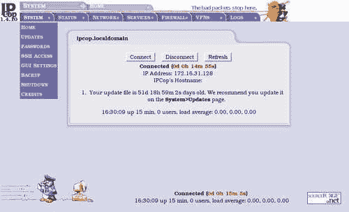
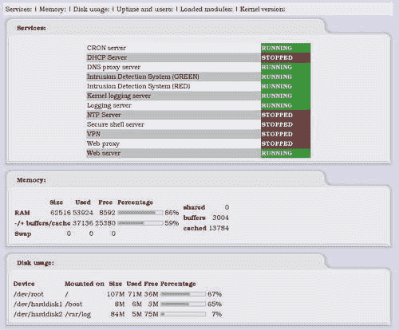
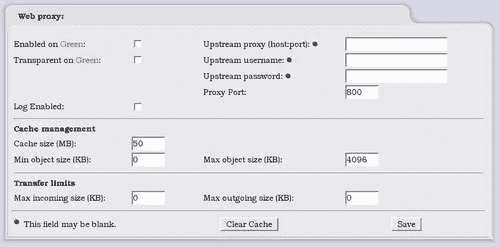
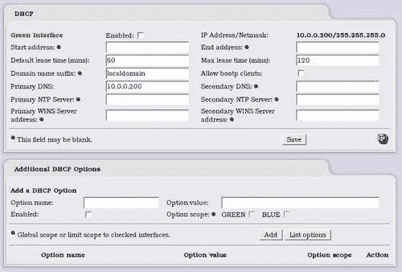
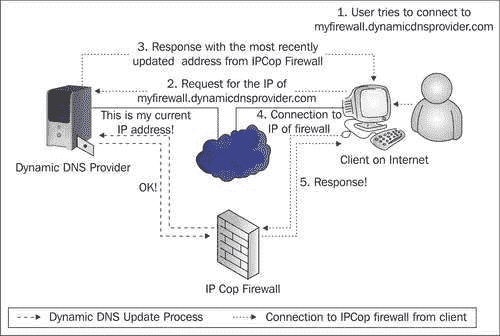
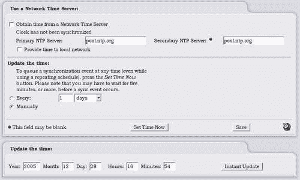
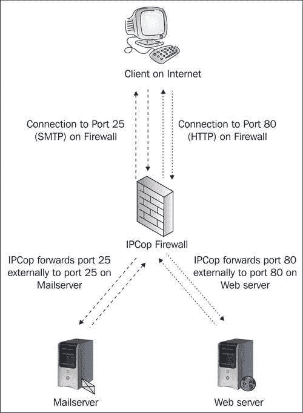
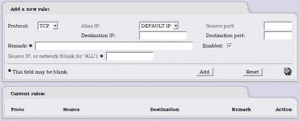

# 第二章 IPCop 简介

在我们了解如何使用 IPCop 之前，我们需要先了解 IPCop 的背景以及构建 IPCop 所使用的工具。 我们还需要查看这些工具的分发许可，从而查看 IPCop 许可。 对于那些想要直接开始安装和配置并且已经了解开源软件、GPL 和 Linux 背景的人来说，本章不太有用。 但是，我们还将在本章中了解选择 IPCop 的原因以及它所具有的独特功能，这些功能在决定是否部署或如何部署 IPCop 时将非常有用。 因此，这是极其重要的。

# 自由开放源码软件

很多人可能听说过几种常见的软件，如免费软件，这是允许你免费使用的软件，以及(更一般的)商业软件，如 Microsoft Windows 或 Adobe Photoshop。 商业软件通常附带一个许可证，限制您以某种方式使用软件，并且通常禁止您复制或修改它。

IPCop 是一种称为**开源软件**(**OSS**)的软件。 作为 OSS 的一部分，IPCop 是在名为**GNU 通用公共许可证**(**GPL**)的许可下发布的。

与根据本许可证和其他类似许可证分发的所有开放源码软件包一样，IPCop 为其用户提供了一些基本自由。

根据 GPL，IPCop 用户可以自由阅读、修改和重新分发软件的源代码。 与此相关的唯一警告是，如果您决定重新分发此软件(例如，如果您复制了一份经过一些改进的 IPCop 并将其交给朋友)，您必须在相同的许可下提供修改后的作品，并提供对源代码的访问权限。 当我们回顾 IPCop 的历史时，我们将看到，这对于希望将项目带向新方向的用户非常有益。

GPL 是最著名的开源许可证之一。 然而，还有许多其他的许可证，例如**Berkeley 软件分发许可证**(**BSD 许可证**)。 每个许可证赋予您的自由各不相同，但它们都必须至少允许读取、修改和重新分发源代码的能力，才能被 Open Source Initiative 视为开源许可证。

### 备注

**什么是源代码？**

源代码是计算机程序员用人类可读语言编写的一组指令。 然后，这组指令通常由**编译器**转换成计算机可以运行的可执行程序。 使用封闭源代码软件(如 Microsoft Windows 和 ISA Server)时，您无法看到这一点。 使用 Linux 和 IPCop 等开放源码软件，您可以做到这一点！

开放源码倡议是一个非营利性组织，致力于促进开放源码软件，并协助开发人员创建和使用开放源码许可证。 它还维护所有被接受为开放源码的许可证的列表。

您可以在[http://www.opensource.org/](http://www.opensource.org/)找到开放源码计划认可的所有许可证。

GPL 本身可以在 GNU 网站[http://www.gnu.org/copyleft/gpl.html](http://www.gnu.org/copyleft/gpl.html)上找到。

除了是最知名的 OSS 许可之外，GPL 也是最知名的 OSS 之一 Linux 内核选择的许可，Linux 内核是 IPCop 的关键组件。 Linux 内核在 GPL 下的发布使得像 IPCop 这样的系统成为可能。 Linux 内核是基于 Linux 的操作系统(例如任何 GNU/Linux 变体的 Linux 发行版)的核心。 内核是由一组开发人员开发的，他们大多由世界各地的志愿者组成，但也包括许多开发人员，他们的一些业务依赖 Linux 的公司(如 Red Hat Linux、Canonical、IBM、Novell 和 Sun Microsystems)付钱给他们。

正如我们现在所意识到的，创建开源软件意味着让我们的用户能够修改我们的源代码，然后重新分发他们的修改。 这就是对 IPCop 所做的事情。 IPCop 采用了 Linux 内核以及大量其他工具，将它们捆绑到软件的**发行版**中，并使用户能够创建功能丰富、易于使用的防火墙系统。 这就是许多开源软件是如何创建的，也是 OSS 背后的哲学的一个功能。

## 分叉 IPCop

您不仅可以使用 OSS 在其他组件之上构建您的软件，还可以更进一步，采用其中一个组件(或这些组件的集合-称为**发行版**)，并将其修改为比原始开发人员的设计更适合您的需求。 例如，如果某一特定软件的用户和开发人员决定他们希望从该软件中获得更多的东西，或者希望该软件被带到另一个方向，他们可以完全自由地这样做。 这就是 IPCop 的情况。

在创建 IPCop 之前，SmoothWall 已经存在([http://www.smoothwall.org](http://www.smoothwall.org))。 目前，SmoothWall 是一个非常类似于 IPCop 的发行版，IPCop 中的所有初始代码都是 SmoothWall 代码。 然而，SmoothWall 采用了*双重许可*来商业发布其免费防火墙的变种。 SmoothWall 的商业变种拥有更强大的功能，可能会导致免费和商业套餐的开发目标之间的冲突，因为如果免费产品会导致您的非免费产品赚得更少，那么就没有动力改进它。

这导致该软件的用户和一些开发者之间关系紧张。 目前的 IPCop 开发人员决定在 SmoothWall 已经投入的工作基础上开发该系统，但他们不想遵循 SmoothWall 当前的理念和方向。 因此，决定创建该软件的一个新分支-**分支**。 分叉背后的一个主要原因是希望创建一个具有商业 SmoothWall 可用功能的防火墙，然后将其作为纯粹的非商业 OSS 发布。

创建这样一个新的软件分支称为*分叉*，原因很明显。 分叉通常由用户和/或当前开发人员通过获取源代码的快照并决定以不同的方向开发来执行。 它们添加了不同的功能，可能删除了一些对项目不重要的东西，并创建了一个替代软件，该软件经常与原始软件竞争，或者提供替代软件。

*分支*软件的其他示例是 GNU 工具和 Linux 的许多不同发行版，如 Mandrake、Debian、Slackware、Ubuntu 等。 它们中的一些是从它们自己打包的 Linux 内核和 GNU 工具中派生出来的，还有一些是从彼此派生而来的。 例如，Adamantix 和 Ubuntu 派生自 Debian，它们的设计目标彼此不同，也不同于它们的母软件。

派生也是商业软件要经历的一个过程--例如，Windows 操作系统的许多不同版本最终都是从相同的源代码派生出来的。 通过*派生*源代码并开发 Windows 的*服务器*版本(例如 Windows 2003 Server)和 Windows 的*客户端*版本(例如 Windows XP)，Microsoft 能够更好地在每个版本中提供适合该版本用途的功能以及所收取的价格。

操作系统种类繁多，如果没有许可所涉及的自由，IPCop 本身就不会存在，因为它是从 GNU 工具、Linux、SmoothWall 和许多其他开放源码包派生而来的。 这决不是一个详尽的列表，创建这样一个系统所涉及的所有代码所涉及的开发人员数量也很难估计。

IPCop 发布所依据的许可证意味着，如果一家公司选择在内部使用该系统，并随后决定要对其进行某些更改，则可以自由执行此操作-根据许可证，修改是一项理所当然的权利，您没有义务重新分发您所做的仅供内部使用的更改。 如果您确实决定将您的修改重新分发(给朋友、合作伙伴或其他公司)，您需要做的就是为您的用户提供最初获得的相同好处；即，如果您决定发布软件，则必须在 GPL 下发布软件。 许可证甚至规定收取(合理的)分发费以弥补成本(尽管您将其重新分发给的人自己可以自由地将软件重新分发给他们想要的任何人，而且是免费的！)。 这给一款软件带来的额外功能很难衡量，但很容易看出这是如何带来好处的。

OSS 中的派生示例是来自 SmoothWall 的 IPCop 派生。 从逻辑上讲，没有什么能阻止这种情况再次发生，在作者看来，当涉及到软件时，多样性和选择是一件好事。

如果我们还没有掌握这个许可证的威力，一个很好的例子就是高度安全的安装。 在您需要完全的源代码控制和随意修改软件以适应安全环境的情况下，拥有 IPCop 及其源代码可以为您提供一个功能齐全的防火墙，您可以在其中创建更加自定义的系统，以便在需要这种灵活性时保护您的网络。 这可以是对系统底层内核的更改，也可以是对配置选项的更改，甚至是添加和删除防火墙功能。 因为不需要重新分发，所以您可以决定将其完全保密，并且本质上拥有一个只需要少量开发投资的内部系统。 提供这一功能的软件有很多，这是开放源码软件(如 IPCop)在市场上相对于封闭源码和商业竞争对手的最大优势之一。

如果您不需要这种灵活性，您仍然可以从使用这种灵活性来创建非常有用的系统的开发人员那里受益。 开发过程的开放性是代码开放性的直接结果，能够接触到 IPCop、Linux 内核或 Apache web 服务器等项目的人数之多，意味着这些软件包可以得到高度打磨并保持无缺陷，而具有相对较小的开发团队的商业产品可能不会如此勤奋地开发这些产品。在开发过程中，开发过程的开放性是代码开放性的直接结果，能够接触到 IPCop、Linux 内核或 Apache web 服务器等项目的人数众多，这意味着这些软件包可以高度润色并保持无缺陷，而拥有相对较小的开发团队的商业产品可能不会如此勤奋地开发这些产品。

# IPCop 的用途

IPCop 是一种用于小型办公室/家庭办公室(SOHO)网络的防火墙，非常易于使用。 它提供了您期望现代防火墙具备的大多数基本功能，最重要的是，它以高度自动化和简化的方式为您设置了所有这些功能。 设置和运行 IPCop 系统非常容易，几乎不需要任何时间。

对于 IPCop 中的那些功能，我们通常需要支付高端防火墙系统的费用，或者将一些东西与其他工具组合在一起。 IPCop 采用了其中一些功能强大的工具，并为我们创建了一个预先构建的包。

创建 IPCop 是为了填补市场上的一个空白，在这个市场上，拥有小型网络的用户需要一些通常只有大型网络才能负担得起的功能，就专业知识或资金的需求而言。 这本书希望提供更多的专业知识，为真正闪亮的商业产品提供足够的替代品，并看看如何在许多不同的场景中设置 IPCop。

# 在稳定组件上构建的好处

IPCop 可以很好地开发为操作系统的附加组件，就像 Shorewall 是安装在 Linux 系统上的应用程序或 Windows 系统上的 ISA 服务器一样，使其成为您在现有设置上安装的应用程序。 然后，您将只负责维护软件包底层的系统。

这样做的缺点是，如果您的服务器的目的只是作为网络的防火墙，则需要对 Linux 操作系统有足够的基本了解才能安装软件，如果您希望它运行良好，则必须配置操作系统和 IPCop 本身。 但是，由于 IPCop 是作为自己的操作系统安装的，因此您不需要了解 Linux 就可以使用该系统。 在稳定性方面，这意味着 IPCop 开发人员可以集中精力在一个平台上进行开发，并且可以完全确信他们可以控制该环境。 他们完全负责对此进行配置，当涉及到支持时，他们可以相对确定用户没有因为错误配置操作系统而破坏系统的稳定-如果用户错误地配置了操作系统，那么希望他们了解后果，这样他们就可以正确地进行操作，或者理解为什么 IPCop 在他们修补之后会崩溃！

稳定性、安全性、可靠性和易用性可能是小型网络最重要的因素，也是 IPCop 的优势所在。 该系统构建在 2.4 系列的 Linux 内核上，具有显著的安全性、稳定性和可靠性。 此外，安装了在世界各地不同规模的网络中使用的工具提供了一个庞大的用户基础，这意味着正在使用的系统经过了良好的测试，有很多个人和公司在使用它们，报告它们的错误，并依赖它们来开展业务。

Linux 内核是最大的 OSS 单件之一，包括由来自世界各地的众多开发人员开发的数百万行源代码。 Linux 拥有许多现代操作系统功能，例如支持无线和蓝牙设备，以及最新的加密网络通信。 正如我们将在本书的整个过程中看到的那样，其中一些特性对于 IPCop 开发人员来说已经变得非常宝贵，因此对于从 IPCop 发行版中可以包含的特性中受益的 IPCop 用户来说，这些特性已经变得无价了。 IPCop 的开发人员不必太担心低级网络通信，因为他们已经在管理这一问题的现有内核代码之上构建了 IPCop。

这种分层(在其他软件之上的软件)使开发人员能够专注于他们最熟悉的领域，而对于 IPCop 开发人员来说，这一领域正在形成一个易于使用的防火墙。 您可能会发现这是我们在上一章介绍的 OSI 模型的网络分层中熟悉的概念。 无论是在应用程序堆栈、操作系统还是网络协议集中，这种互操作性对于构建可靠、安全的系统都至关重要。 *开放标准*，从网络协议(如 HTTP)到文档格式(如 Open Document Format)，对它至关重要。

我们提到的其他一些软件包括 Apache 和 OpenSSH。 Apache 是提供用于配置 IPCop 的页面的 Web 服务器，为世界上一些最大的网站提供支持。 根据最新的 Web 服务器调查，世界上近 70%的 Web 服务器使用 Apache([http://news.netcraft.com/archives/2005/11/07/november_2005_web_server_survey.html](http://news.netcraft.com/archives/2005/11/07/november_2005_web_server_survey.html))。

因此，Apache 看起来是一个非常稳定和值得信赖的系统，在开发几乎完全基于 Web 的用户界面时，它为 IPCop 开发人员提供了难以置信的灵活性。 除了设置过程之外，没有真正需要超越 Web 界面。 通过将 Apache 服务器的内置功能与 IPCop 自己的脚本相结合，开发人员可以轻松完成非常高级的任务。 然后，这种稳定性和易用性被透明地传递给用户。 用户完全不知道 Apache 是执行此工作的系统的一部分，因此只需浏览 Web 所需的知识即可开始配置防火墙。 由于这项技能正在迅速成为一项基本技能，并已加入阅读和写作成为学校课堂上教授的技能之一，这使得 IPCop 变得非常平易近人。 使用这样平易近人的技术是 IPCop 努力实现其目标的众多方式之一。

同样，在没有全职 IT 员工的网络和 IPCop 只占很小一部分时间的员工的网络中，易用性变得至关重要。 大多数 IPCop 用户不想了解创建和维护数据包过滤会话状态规则的内部工作原理。 IPCop 旨在使这类知识变得不必要。 前端允许我们快速配置防火墙的基本和高级功能，而无需了解底层系统的详细信息。 由于这种易用性，还提供了一些功能强大的配置选项，使我们可以设置非常高级的配置，并且使用构建 IPCop 的工具设置起来会困难得多。 **虚拟专用网络**和**服务质量**控件就是一个很好的例子-单独而言，提供这些服务的软件包有一个非常陡峭的学习曲线，但当合并到 IPCop 中时，它们相对容易配置。

# Gap IPCop 填充

有多种不同级别的防火墙可用。 在频谱的一端，有 Check Point 和 ISA 这样的企业系统，它们执行各种强大的功能，可以控制大小和拓扑差异很大的网络的流量。 另一方面，我们有运行在 Agnitum、ZoneAlarm 等主机上的个人防火墙，以及 Windows XP Service Pack 2 中的内置防火墙，它们保护一台计算机。 还有许多家庭路由器提供基本的防火墙功能。 这就给我们留下了这样一个问题：IPCop 适合这些角色中的哪一个，以及它是否适合我们的需求。

如前所述，IPCop 最适合 SOHO 网络。 如果我们的网络相对较小，只有一个互联网连接，例如家庭网络或小型企业，或者我们有几个站点具有独立的互联网连接，需要在中型企业中链接在一起，那么我们肯定可以从使用 IPCop 处理这些连接中受益。 IPCop 的另一个重要方面是成本。 由于 IPCop 本身是免费的，我们为防火墙支付的唯一费用是硬件成本(通常是一台低规格的机器)和管理机器的成本(由于易于使用的界面，这一成本相对较低)。 对于较小的网络来说，这是非常有吸引力的。

ISA 服务器和检查点等系统极其昂贵，需要大量背景知识才能正确配置和保护。 这与 IPCop 相比，IPCop 几乎在默认情况下充当非常安全的路由器和防火墙。 较大的企业系统也有更高的系统要求，对于较小的网络来说通常过于苛刻。 设置这些网络所需的费用和时间不太可能为大型企业以外的网络提供良好的投资回报。 IPCop 还受益于简单性，这是在使用通用操作系统(如 Windows，甚至 Linux 发行版)以及它们通常附带的所有不必要服务时所不具备的。 IPCop 有一个特定的角色，所以可以删除许多服务和其他应用程序，这样您就只剩下一个专门的系统了。

另一端是个人防火墙，如 Agnitum、ZoneAlarm 等公司提供的防火墙。 在 SOHO 办公室中，通常使用 Windows Internet 连接共享(或廉价路由器)来履行 IPCop 经常扮演的角色。

这些防火墙通常提供基本功能，不允许我们创建 VPN 或从单个集中设备保护多台机器。 当你考虑创建非军事区的能力、入侵检测系统和 IPCop 提供的网络服务等功能时，你会发现简单的基于主机的系统可能不适合我们，具有 IPCop 功能和易用性的产品成为一个引人注目的选择。

目前，IPCop 最常见的使用人群是那些对防火墙和 Linux 有一定了解，但又不想花时间从头开始设置防火墙的人。 这绝不是 IPCop 的唯一用途。 不需要任何真正的 Linux 或防火墙经验，本书的目的是以一种简单易懂的方式介绍 IPCop，这使具有最基本计算机知识的用户能够使用简单的防火墙启动和运行，以保护他们的网络。

# IPCop 的功能

在本书中，我们将讨论 IPCop 版本 1.4.10，它是撰写本文时的最新版本。 随着 IPCop 的不断开发，将会添加新的功能，其中一些功能可能会发生变化。

## 加入时间：清华大学 2007 年 01 月 25 日下午 3：33

很多防火墙都有一个杂乱无章、复杂的用户前端，需要大量的培训和经验才能熟悉。 例如，ISA 服务器界面是出了名的不直观，通常界面的设计并不是为了使常见任务变得简单和容易完成。

通常，专用防火墙(如 ISA 服务器和边界软件)会将常见功能(如**端口转发**)重命名，并将它们称为完全不同的功能，即使管理员有防火墙经验，但对所讨论的特定用户界面一无所知，这也不会让他们的工作变得更轻松。 举个简单的例子，Borderware 将端口转发称为**内部代理**，ISA 称为**发布**，DrayTek 的路由器系列(可靠且功能齐全，但有点难以配置)将其称为虚拟服务器。 这些定义在某些情况下是有原因的(正如我们早先发现的那样，应用层防火墙将代理流量)，但是即使它们有正当理由，也不会真正让生活变得更容易！

我们将仔细研究如何设置 IPCop，因此将在界面中花费大量时间。 因此，非常幸运的是，该界面非常易于使用，并且非常直观。 IPCop 开发人员决定使用基于内置到系统中的网站的界面，因此对于大多数人来说，该界面是一个熟悉的环境，因为任何设置防火墙的人都不太可能从未使用过网站。

仅将网站用作**图形用户界面**(**GUI**)是不够的。 界面仍然需要设置，以便很容易弄清楚并访问所有常见功能。 我们将看到的大多数功能都包括填写简单的表单，这是一个有效且易于管理的界面。 IPCop 在使用这样的接口方面并不是独一无二的。 许多设备(如 Linksys、DrayTek 和 D-Link 制造的 SOHO 电缆路由器)都有类似的设置，从思科设备到 HP ProCurve 交换机的许多高端产品也有类似的设置，但很少有这些设备包含 IPCop 提供的所有功能和易用性。

## 网络接口

IPCop 最多提供四个网络接口，每个接口通常连接到单独的网络。 对于大多数 IPCop 部署来说，这是足够的数量，因为中小型网络中很少有多个网络融合在一起，但 IPCop 可以通过使用虚拟专用网(VPN)容纳到更多网络的连接。 为便于管理，提供了四个可用的网络的标识颜色。

## 绿色网络接口

IPCop 部署的绿色网段代表*内部*网络，并受隐式信任。 IPCop 防火墙将自动允许从绿色网段*到*所有其他网段的所有连接*。*

绿色网段始终是以太网网卡(NIC)，不支持此容量中使用的任何其他设备。 本地网络可能像插入 Green 接口的小集线器一样简单，也可能包含数十台交换机、连接另一个站点的第二层网桥，甚至一台路由器。

### 备注

**绿色接口**上的寻址

Green 网络应使用私有地址范围(私有地址范围可在 RFC1918 中找到)。 虽然可以使用可公开寻址的地址范围进行设置，但默认的 IPCop 配置是使用 NAT 仅公开一个 IP 地址，因此，在 Green 网段上使用公有地址范围是没有意义的，因为 IPCop 会将其视为私有地址范围！ 使用 IPCop 作为路由防火墙(而不是执行 NAT 的防火墙，这是默认配置)需要更高级的配置，无法通过 GUI 完成。

通常，接近这种复杂性的网络会选择使用基于 IPCop、另一个免费软件包或商业软件包构建的一个或多个防火墙或路由器来划分其网络，但如果有足够的网络知识和几个硬件平台，则可以使用 IPCop 构建复杂、安全的网络拓扑。

## 红色网络接口

与绿色网络接口类似，红色网络接口始终存在。 红色网络接口表示 Internet 或不受信任的网段(在较大的拓扑中)。

IPCop 防火墙的主要目标是保护 Green、Blue 和 Orange 网段及其上的联网主机不受 Red 网段上的流量、用户和主机的影响。 Red 网段通常具有良好的防火墙，不会向内部网段开放大量端口(如果有的话)。 默认值为 None。

### 备注

**红色接口**上的寻址

红色网段几乎总是使用由您的互联网服务提供商分配的公共地址范围。 互联网服务提供商可能(但不太常见)将私有地址范围用于其内部网络的大部分，并在其网络和暴露于互联网的主干之间的边界执行 NAT。

GPRS 和 3G 网络通常会这样做，一些有线电视 ISP 也是如此。 如果有疑问，请咨询您的 ISP 或检查连接到您的 ISP 的现有机器或路由器。 网站[www.dnsstuff.com](http://www.dnsstuff.com)可以用来**WHOIS**一个 IP 地址来检查注册，如果您不确定 IP 地址是*私有*还是*公共*，这可能是检查所有权的一个很好的方法。

Red 网段是 IPCop 支持以太网网卡以外的硬件的唯一*个*网段。 Red 段可以是静态分配或使用 DHCP 分配的以太网接口，它可以是 USB ADSL 调制解调器、ISDN 卡，甚至可以是连接到公共交换电话网的拨号模拟调制解调器。

IPCop 将在此接口上支持的其他硬件接口包括：

### USB 和 PCI ADSL 调制解调器

**DSL**是一种允许通过现有铜质电话线发送宽带、高速互联网或网络信号的技术。 这种形式的互联网非常受欢迎，特别是在传统上有线电视等服务普及率较低的国家，因为它不需要昂贵的挖掘和重新布线街道和房屋，并为电缆或网络基础设施铺设新的布线。 DSL 的缺点之一是 DSL 信号的范围相对较短，需要靠近电话交换机，尽管这一限制随着技术的进步而增加。

IPCop 将允许具有 DSL 服务(**SDSL**和**ADSL**)的用户将某些品牌的调制解调器直接连接到 IPCop 防火墙。 将 IPCop 防火墙连接到 DSL 线路有三种主要方法。

第一种方法是通过以太网将 IPCop 主机连接到 ADSL 调制解调器。 一般来说，这是最稳定的方式，但缺点是设置起来比较困难。 作为成熟路由器的调制解调器(例如基于 Conexant 芯片组的许多路由器)通常被设计为在网络中充当 NAT 路由器。 这些设备有一个以太网端口(插入交换机或集线器)或多个以太网端口(以及一个小型内置交换机)，并将私有地址(通常在 10.0.0.0/8 范围内)分发给网络上的客户端，充当防火墙。 在不更改默认配置的情况下将 IPCop 主机连接到其中一台路由器的背面不是一个好主意，因为您要执行两次网络地址转换。

虽然 NAT 在执行一次时经常会破坏协议，但执行两次几乎肯定会让您的网络头痛不已。 除了在您和 Internet 之间本质上有两个网络导致的路由问题外，对于 BitTorrent、SIP、在线游戏等协议或 SMTP 邮件等传入服务，通过这些路由器实现端口转发非常困难，因为每个端口转发都必须配置两次。 因此，这些路由器必须配置为*而不是*来充当 NAT 网关，而是退回到与*普通*路由器一样的行为。 如果没有一个以上的 IP 地址，这是不可能的，如果家庭用户或企业想要使用 IPCop，就会让他们的 ISP 没有固定的 IP 地址池陷入困境！

因此，一些基于以太网的 ADSL 路由器具有称为**PPP 半桥**的功能。 此功能允许通过以太网(即您的 IPCop 防火墙)插入的设备从您的 ISP 获取*公共*IP 地址，并禁止路由器充当防火墙或 NAT 网关。 在此模式下工作时，ADSL 路由器采用 ISP 在身份验证期间分配的 IP 地址，并将其提供给通过 DHCP 请求 DHCP 地址的第一台设备。 此功能应记录在您的 ADSL 手册中。

配置 ADSL 的第二种方法是使用直接连接到 PC 或防火墙的 USB ADSL 调制解调器。 虽然可能最简单(因为它需要最少的网络知识，而且不需要复杂的布线或硬件安装)，但这些调制解调器是所有三种方法中最便宜、最不可靠且性能最差的。

配置 ADSL 的第三种方法是使用内部 ADSL 或 SDSL 卡，占用防火墙、PC 或服务器内部的一个 PCI 插槽。 这可能是配置 ADSL 最不常用的方法。

IPCop 在一定程度上支持所有这三种方式：只要可能，作者强烈建议使用以太网 ADSL 调制解调器，或者使用静态地址集将其配置为路由器，或者(如果不可能)在本地使用 DHCP，或者使用 PPP Half Bridge 之类的解决办法。 以下是 IPCop 中支持的设备列表：

*   Alcatel SpeedTouch 系列 USB ADSL 调制解调器

*   ECI USB ADSL 设备(包括 BT Voyager 调制解调器、Zoom 5510 ADSL 调制解调器和几十个其他类似设备)

*   Bewan USB/PCI ADSL 调制解调器(ST 系列 USB 调制解调器和 ST 系列 PCI 调制解调器)

*   Conexant USB 调制解调器(包括 Zoom 5510、DrayTek Vigor 318 和其他几款)

*   Conexant PCI 调制解调器

*   AMEDYN ADSL 调制解调器(HCL 仅列出 Zyxel 630-11、华硕 AAM6000UG USB)

*   3Com 3CP4218 USB ADSL 调制解调器

### ISDN 调制解调器

**综合业务数字网**(**ISDN**)是在 ADSL 或电缆连接之前提供(慢速)宽带互联网接入的一种形式。 ISDN 本质上是一种数字电路电话线。 在通过电缆、DSL 和卫星广泛采用宽带之前，ISDN 经常被使用，现在仍在一些分支机构、远程工作以及没有 DSL、电缆或卫星可用的地区使用。

IPCop 支持大量 ISDN 调制解调器(1.4.10 HCL 列表 34)。 完整的列表可以在 IPCop Wiki 站点上找到([http://www.ipcop.org/modules.php?op=modload&Name=phpWiki&file=index&pagename=IPCopHCLv01](http://www.ipcop.org/modules.php?op=modload&name=phpWiki&file=index&pagename=IPCopHCLv01))。

### 模拟(POTS)调制解调器

IPCop 应支持任何硬件模拟(拨号)调制解调器。 硬件设备通常通过串行端口或作为 ISA 卡连接。

使用 PCI 接口的较新调制解调器通常基于*软件*。 这意味着调制解调器的一定比例的工作是在它所连接的计算机的 CPU 上通过软件执行的，而不是由调制解调器本身完成的。

如果没有执行此工作的设备驱动程序，这样的调制解调器将无法工作，而且由于通常没有为 Linux 操作系统编写的这些设备的驱动程序，因此它们通常被视为 Linux 中的*损坏*。 USB 调制解调器在 IPCop 中也应该可以工作。

IPCop HCL 列出了一个与 IPCop 配合使用的 PCI 调制解调器，即*PCI Smartlink 5634PCV*。

### 有线和卫星互联网

一般来说，欧洲和美国供应商通过电缆提供的互联网服务提供的以太网调制解调器将*仅在 IPCop 中工作*，因为它们通过 DHCP 提供公共的、可路由的 IP 地址。 然而，一些有线电视提供商提供的 USB 调制解调器不太可能在 IPCop 中工作。 卫星互联网也是如此(USB 调制解调器不太可能在 IPCop 中工作)。

## 橙色网络接口

*可选的*橙色网络接口设计为**DMZ**网络(有关 http://www.firewall.cx/dmz.php 防火墙的详细信息，请参阅[DMZ](http://www.firewall.cx/dmz.php))。 在军事术语中，非军事区(DeMiliatiized Zone)是指不允许军事活动的区域，例如两个不同(和敌对)国家之间的边境。 因此，在防火墙术语中，术语*DMZ*具有类似的含义，即组织的内部网络和外部网络(如 Internet)之间的网段。 在此细分市场中，通过防火墙保护服务器不受互联网的影响，但将服务器与位于前线后面更受保护区域的内部客户端隔离(因为它们暴露在互联网中)。

组织通常会将设计为面向外部世界的任何服务(例如 Web 服务器(为外部客户端提供网站请求服务)，或者更常见的是邮件服务器(外部服务器连接到该服务器以便通过 SMTP 传递邮件))放入这个不可信但隔离的网络中。

### 备注

**橙色接口**上的寻址

Orange 网络接口通常使用私有地址范围，因为 NAT 由 IPCop 执行。 与绿色区域一样，*路由*防火墙而不是*更新*防火墙需要高级配置。

因此，DMZ 被认为是不受信任的网段，仅次于 Red 网络接口。 Orange 网段*上的主机不能*连接到绿色或蓝色网段-必须明确允许从 Orange 网段到这些内部网段的所有流量通过**DMZ 针孔**。 允许从 Red 网段到 Orange 网段的流量通过端口转发。

但是，Orange 网络上的客户端应该*而不是*使用 IPCop 防火墙作为 DNS 或 DHCP 服务器。 这有合理的安全原因-在此网段的 IPCop 主机上额外暴露服务，除了更难配置外，还会增加 IPCop 主机受到橙色区域攻击的风险，从而降低为绿色区域中的客户端提供安全服务的能力。

## 蓝色网络接口

*可选的*Blue 网络接口是 IPCop 的较新功能，随 1.4 版本系列一起提供。 此网络专门为单独的无线网段设计。 Blue 网段上的主机除了通过与 Orange 网络类似的特定*针孔*外，无法访问 Green 网络。

### 备注

**蓝色网段**上的编址

Blue 网络几乎总是使用私有地址范围。

IPCop 还允许通过虚拟专用网络连接到绿色区域，从而允许客户端完全访问此网段上的资源。

蓝色网段不一定是无线网段-因为蓝色网段只是另一个网段，并且主机的无线连接对 IPCop 是透明的，所以如果您的绿色区域中可用主机的数量超出了您的可用主机数量，那么绝对没有什么能阻止您将蓝色网段用作网络中的另一个子网。

以这种方式使用蓝色区域也是分隔网络使用情况不同的主机的好方法，例如特定员工组在公共场所或工厂车间使用的工作站的子网。 蓝色区域甚至可以用作网络的默认区域，在该网络中，管理员不希望网络上的主机像绿色区域那样自动访问网络上的所有资源。

在这种拓扑中，IT 员工可能会被分配绿色区域以访问网络资源，而工作站可能会保留在蓝色区域中，具有对他们需要的网络区域的特定访问权限。

## 简单的管理和监控

作为一种以易于使用为目标的设备，如果用户每次推出新版本时都必须重新安装，那么它对用户没有太大的用处。 如果用户不需要在任何时候登录机器上的 Linux 控制台，这也将是非常有益的。 IPCop 开发人员显然同意这一点，因此有一个内置的简单升级系统。 这完全可以从 Web 界面进行管理。 但是，如果用户确实想要登录到 Linux 控制台并进行更改，只需使用连接到机器的键盘/监视器或从本地网络(绿色接口)上的计算机使用 SSH 即可完成。 为了增加安全性，默认情况下禁用 SSH，必须先启用 SSH，然后才能使用它。

### 备注

**本地控制台**

在键盘和显示器分离的 PC 上运行 IPCop 防火墙之类的服务器是很常见的，因为它们很少使用。 虽然方便，但这可能会带来问题，因为一些主板(和软件包)不喜欢热插拔键盘和鼠标(特别是 PS/2 接口)。 虽然显示器是热插拔的(因此您可以随意将显示器断开并重新连接到 IPCop 系统)，但我们建议您将 IPCop 系统连接到键盘或 KVM 切换器。

拆卸键盘的另一个副作用是，许多计算机中的 BIOS 在启动时会*停止*，如果没有看到键盘连接，则等待按键。 对于未连接键盘的计算机，通常可以(也确实应该)在 BIOS 配置中禁用此行为。

您还可以从同一界面备份和恢复您的配置，从而确保可以非常轻松地管理防火墙的所有常见管理任务，更重要的是，无需了解 Linux 或 bash shell。

通过 Web 界面上提供的状态，我们可以确切地看到系统的运行情况。 例如，如果我们对此感兴趣，我们可以查看防火墙上当前正在运行的服务、内存和磁盘使用情况，以及流量图。

这些功能再次展示了基于 Web 的界面的威力，以及为什么选择这个特定的界面。 我们还可以快速查看重要的系统信息，而无需使用交互式外壳登录系统。

还可以使用基于 Web 的日志查看器查看日志，这意味着您可以非常轻松地监视系统，而绝对不需要直接登录到系统。 IPCop 还能够将这些日志导出到远程系统日志服务器，以简化管理和日志聚合，特别是在您有几个设备要监控的情况下。

## 调制解调器设置

由于许多家庭用户使用 ISDN 或 ADSL 调制解调器进行拨号(包括 USB/ADSL 调制解调器)，因此 IPCop 支持它们非常重要。 支持多种常见的调制解调器，并且 IPCop 具有为默认情况下不支持的调制解调器加载附加驱动程序的功能，并且这些调制解调器的配置选项相当灵活。 防火墙以这种方式支持调制解调器和驱动程序的情况并不常见；这是 IPCop 最独特的特性之一，也是为什么它非常适合 SOHO 网络的原因。

## 服务

IPCop 为小型网络提供各种基本服务。 严格来说，在本应作为网络保护机制的同一个机器上提供此类服务并不是防火墙的最佳实践，但经济性在较小的网络上起作用，由一台机器提供所有基本网络服务非常有用。

### Web 代理

IPCop 既可以用作代理，也可以用作防火墙。 您可以在 Green 接口上轻松管理缓存和配置代理。 定义接口的好处在这里变得非常明显，因为这意味着只需简单地单击复选框即可在 IPCop 上设置代理。

### DHCP

随着网络的发展，手动为客户端分配网络配置变得极其困难，能够自动执行此操作并管理您使用的网络地址的使用是相当重要的。 IPCop 中的**Dynamic Host Configuration Protocol**(**DHCP**)配置使您可以轻松地向 Green 接口上的客户端提供 DHCP 服务，如果您不确定如何做到这一点的话。 通过 DHCP 实现这一点可以简化客户端配置，这意味着大多数机器将自动连接到网络并可以访问互联网，而无需在主机上进行任何配置。

### 动态 DNS

一般来说，SOHO 用户的互联网连接将有一个类似 31-34-43-10 的**完全限定域名**(**FQDN**)。 互联网上一台计算机的完全限定域名(FQDN)可以用来与其建立连接--例如，与谷歌(Google)建立的连接就会连接到[www.google.com](http://www.google.com)。 对于家庭用户来说，您的 FQDN 不是像**google.com**那样的域名，而是 ISP 用来识别您来自哪个 ISP 以及您在您的网络上是哪个客户端的域名，通常会让人们更容易理解。

虽然这对于管理其客户的 ISP 来说是有意义的，但它使得远程连接到这样一个提供互联网连接的网络变得困难。 即使您可以记住并分发您的 ISP 分配的域名，如果您希望人们能够访问您托管的服务(作为 IP 地址)，因此您的防火墙或路由器的 FQDN 会不时改变，这仍然不是一个解决方案。

因此，许多网络使用**动态 DNS**。 使用动态 DNS 系统，在连接到 Internet 的防火墙或客户端上运行的一小部分软件将使用您的 IP 地址更新 Internet 上的服务器(动态 DNS 服务器)，并将固定主机名(如 Yourname.DynamicdnsProvider.com)重定向到您当前的 IP 地址。 如果您连接到 IPSec VPN 或其他服务(如 HTTP、VNC 或终端服务)，或者如果客户端使用这些协议远程连接到您，则可以连接到此动态 DNS 主机名，并将无缝连接到使用动态 DNS 服务器更新的 IP。

由于这些服务需要使用您当前的 IP 地址不断更新服务器以保持 DNS 正常工作，因此使用动态 DNS 需要运行软件的计算机或其他设备不断与动态 DNS 提供商对话。

动态 DNS 是大型防火墙产品中不常见的功能，在大多数低端家用路由器中当然也不常见。

### 时间服务器

网络上的主机通常需要配置为保持时间一致，无论这是因为 Kerberos 之类的身份验证机制，还是仅仅是为了方便起见。 IPCop 提供**网络时间协议**(**NTP**)服务，该服务可用于使网络上的所有客户端保持同步。

IPCop 服务器使用 NTP 连接到 Internet 上的 NTP 时间服务器，从该服务器确定正确的时间。 然后，它使用计算机时钟在内部保存此信息，并充当网络中客户端的 NTP 服务器。 通过从上游 NTP 服务器定期更新，IPCop 盒可以确保时间保持在合理的准确度。

通过从本地源进行更新，而不是让每个本地客户端都从外部时间源进行更新，您可以保持客户端彼此之间的准确性(因此，即使时间不严格准确，您也知道所有本地客户端保持大致相同的时间，这对于日志审核和 Kerberos 这样的事情很重要)。 最重要的是，它还减轻了为您提供免费服务的 NTP 服务器的负载！

有关如何配置客户端操作系统以与 NTP 服务器通信的信息，可在以下位置找到：

*   窗口：[http://www.boulder.nist.gov/timefreq/service/pdf/win2000xp.pdf](http://www.boulder.nist.gov/timefreq/service/pdf/win2000xp.pdf)

*   Linux：[http：//Linuxreviews.org/howtos/ntp/](http://Linuxreviews.org/howtos/ntp/)

*   OS X：选择**系统首选项**和**使用网络时间**

### 高级网络服务

流量整形和入侵检测是非常先进的网络服务，我们不希望在大多数 SOHO 设备中看到这些服务。 IPCop 不仅提供了这些功能，而且使它们非常易于管理，在我们了解配置 IPCop 时，我们将确切地看到维护这些相当复杂的系统是多么容易。

### 端口转发

这是从 SOHO 到大型企业的防火墙中非常常见的功能。 IPCop 在这里有两个好处。 首先，我们可以添加的转发数量没有任何限制，其次，它非常容易设置。 对于某些 SOHO 设备，我们不仅对可以转发的端口数量有限制，而且经常会发现其周围的配置非常复杂。 企业系统本质上是复杂的，在这个特定的特征中，复杂性加剧了。

正如我们所看到的，IPCop 防火墙在客户端看来既是邮件服务器*又是*Web 服务器，但在此示例配置中，到端口 25 和 80 的连接实际上被转发到在端口转发菜单中配置的服务器。 IPCop 配置中的这些服务器可能位于橙色区域。

# 虚拟专用网络

这使您能够通过(虚拟)专用链路连接到 Internet 上的更多网络。 这是 IPCop 的主要功能之一，这意味着它也可以用于中型企业，而不仅仅是 SOHO 网络。 IPCop VPN 实施的详细情况将在后面的章节中详细讨论。

## 警用堆栈保护

IPCop 是为使用 ProPolicy 而构建的，这是一种用于保护防火墙上运行的服务免受 Internet 攻击的机制。 ProPower 提供的堆栈保护是防止网络服务中常见的一种特殊漏洞的一种相当有效的机制。

# 为什么选择 IPCop？

在评估在我们的环境中使用的 IPCop 时，我们应该查看它提供的功能，这从我们刚刚看到的功能列表中可以明显看出。 然后，我们需要确定它是否是我们网络最有效的解决方案。 一般来说，对于中小型网络，IPCop 是非常有益的，可以极大地简化网络管理。 但是，对于超大型网络，我们可能会发现 IPCop 是不够的，因为我们有各种网段，所有网段都通过不同的机制互连。 重要的是要弄清楚我们的网络将如何组合在一起，然后选择 IPCop(如果有合适的角色)。 对于 SOHO 网络，这可能是一个非常简单的拓扑，可能不需要太多考虑。 在更大的网络中，IPCop 可以在基础设施内的特定角色中部署，例如作为关键远程网络(如分支机构)的网关设备。

# 摘要

在本章中，我们了解了 IPCop 中提供的功能集。 我们对 IPCop 到底能做什么有一个概念，结合上一章的知识，我们知道它是如何堆叠成防火墙的。 我们现在还了解了 IPCop 在哪些情况下可能有用，以及我们需要了解哪些内容才能使用它。 如果我们对任何一个主题都不熟悉，那么在这一点上，一些屏幕截图可能看起来有点复杂。 当我们浏览这些功能时，将对所有内容进行解释，以便我们完全理解每个选项，并知道我们是否需要配置该特定区域，以及我们希望如何准确地设置该区域。 对于那些更熟悉这些技术的人来说，这可能有助于概述 IPCop 中的一些功能是如何工作的。