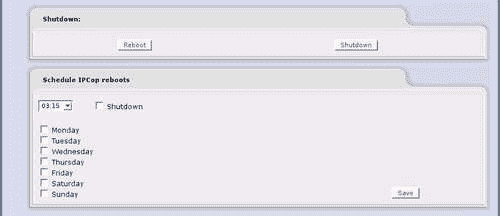
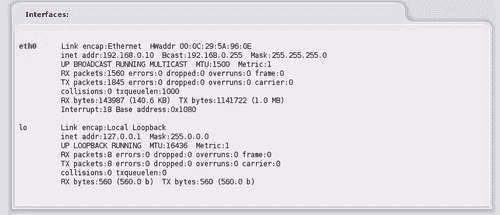
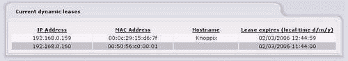
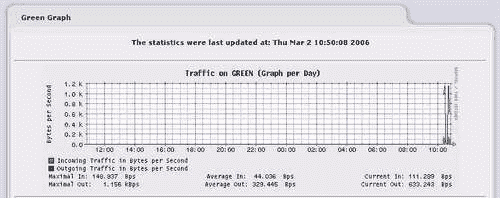
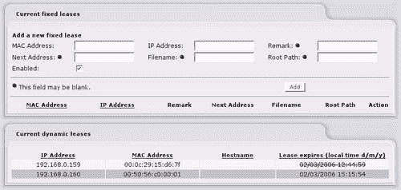
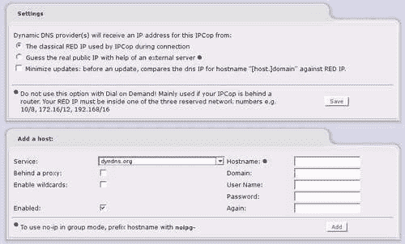
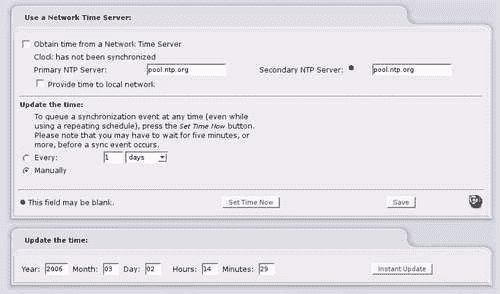
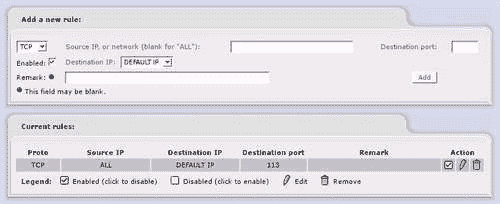

# 九、IPCop 的基本用法说明

现在我们已经介绍了 IPCop 防火墙的安装以及我们想要部署它的几种情况，接下来我们将讨论如何管理和操作 IPCop 防火墙。 假设安装已成功，默认的 IPCop 安装将为我们提供一个 Web 界面。 Web 界面允许我们通过任何 Web 浏览器配置防火墙，并且(默认情况下)仅为 Green 内部接口上的客户端启用。

默认情况下，Web 服务器在端口 445(针对**HTTPS**通信量)上运行，尽管这些端口可以更改；该端口不同于常用/分配的端口(443)。 应该注意的是，使用此端口访问 Web 界面将产生证书弹出窗口-这是由于使用自签名的**SSL**证书造成的，可以安全地忽略。

可以从 IPCop 控制台使用 `setreservedports`命令或**SSH**会话将 HTTPS 管理的端口分配更改为 445 以上的任何端口，这可能是希望远程访问其 IPCop 主机的任何人的考虑因素，因为某些 Internet 服务提供商会将通信量防火墙到端口 445，以防止 Sasser 之类的蠕虫通过端口 445(通过**TCP**)利用 Windows 中的漏洞(**SMB**over**TCP**)。 将此端口更改为低于 445 时必须手动完成，但不应轻率进行，并且需要编辑与 `setreservedports`([http://www.ipcop.org/modules.php?op=modload&NAME=phpWiki&FILE=INDEX&PageName=IPCop140HttpsPortHowto](http://www.ipcop.org/modules.php?op=modload&name=phpWiki&file=index&pagename=IPCop140HttpsPortHowto))相同的文件。

1.4 之前的版本支持发往端口 81 的未加密通信，该通信已弃用，最初仅支持不支持 HTTPS/SSL 的浏览器。 从 IPCop 防火墙 1.4 版开始，已将其更改为仅允许 HTTPS 管理(尽管端口 81 可以重新配置)。

然后，通过[https://ipcopfirewall:445/](https://ipcopfirewall:445/)(其中 ipcopwall 是主机的名称或 IP 地址)访问我们的 IPCop 防火墙，将显示默认配置屏幕，其中包含 IPCop 防火墙的状态、更新状态、系统负载和所有适当配置选项的菜单的概述。 此时有关证书的任何消息都可以安全地忽略，并且源于这样一个事实：您的 IPCop 主机生成自己的 SSL 证书，而不是使用您的浏览器可能知道的**证书颁发机构**(**CA**)颁发的证书，例如 VeriSign 或 CAcert。

# 系统菜单

**SYSTEM**菜单中的项目对系统功能相当关键。


## 软件更新

安装后，我们应该做的第一件事是确保我们的 IPCop 防火墙应用了适当的更新。 尽管许多软件更新为新功能和现有软件包提供更新和错误修复，但有些软件更新解决了新的安全问题，并且为了维护防火墙的完整性；尽可能频繁地应用这些更新非常重要。

软件更新功能在**系统|更新**菜单下提供。


**刷新更新列表**按钮连接到 IPCop 服务器并检索已发布更新的列表-页面的**可用更新**部分将指示何时需要提供更新，并提供下载链接。 更新必须按原样(不解包或解压)从 Internet 手动下载，然后上传(通过**浏览**按钮)到防火墙。

正如更新文件(`*.tgz.gpg`)的名称所示，更新是使用**GNU Privacy Guard**(**GPG**)签名的，它可以防止任何人在不首先泄露用于签名更新的 IPCop 密钥的情况下发布未经授权(或被泄露)的更新。 GPG 签名阻止解包、重组或修改更新，导致 IPCop 拒绝使用已被入侵者篡改或解包而不是简单地下载和上载的更新文件。

更新将指示是否需要重新启动 IPCop 防火墙，但在许多情况下不需要，通常是内核更新需要这样做。

IPCop 防火墙的一些版本(通常是主要版本增量，如 1.3-1.4)要求完全重新安装防火墙，因为升级过程太复杂，无法通过更新来执行，就像次要版本增量一样。 在这种情况下，可以备份防火墙配置，因此不会完全从头重建防火墙。

## 密码

下一个**SYSTEM**菜单允许我们更改密码-此屏幕相对简单易懂，让我们可以选择重置**管理员**密码(这使我们可以完全控制 Web 界面)和**拨号**密码。 **拨号**用户仅允许用户访问连接或断开必须手动拨号的连接，例如模拟调制解调器。

系统上的第三个帐户是 root 帐户(您在安装过程中设置了其密码)，它有权重置**admin**和**Dial**用户帐户密码，但此功能必须在 IPCop 防火墙的控制台上使用或通过 SSH 使用，必须手动启用。

## Колибрипрограммется

SSH 访问允许我们使用具有适当权限的帐户(如 root 帐户)远程安全地建立控制台会话。 SSH 是一个非常有用的工具，对它的全面介绍超出了本章甚至本书的范围。 在最基本的情况下，SSH 可以用来运行命令和管理系统，其方式(即在文本上，在命令行中)类似于在机器本身的控制台上执行的操作。

在 IPCop 上下文中，这非常有用，因为我们可以运行安装过程中运行的安装程序(允许我们重置或更改参数，如网络配置和卡分配，或重置密码)。 如果您更改了网络拓扑或在 IPCop 防火墙中添加/更换了网卡，则可能需要通过 SSH 重新配置。


### 备注

**SSH 密钥**

[http://hacks.oreilly.com/pub/h/66](http://hacks.oreilly.com/pub/h/66)很好地简要概述了 SSH 键的使用，并提供了一些指向其他资源的指针(以及关于该主题的大量用户评论)。

密钥身份验证允许使用存储在客户端计算机上的密钥(与 SSL 类似)对客户端进行身份验证，而不是每次在 SSH 身份验证阶段(SSH-USERAUTH)使用密码时通过 Internet 传输(通过加密隧道)密码。 假设密钥没有被窃取或泄露，这种身份验证方法比使用密码要安全得多，但理解和配置起来更复杂，灵活性也稍差一些(您想要用来登录 SSH 服务器的任何系统都需要密钥文件，而只需要记住密码)。

通常，SSH 作为诊断工具也更有用-IPCop 包含许多只能通过命令行访问的工具，例如 `vim`(一个功能强大的文本编辑器)、 `ping`和 `traceroute`等网络实用程序，以及 `tcpdump`，后者对于通过转储网络流量或仅查看控制台上的标题来调试网络问题非常有用。 我们还可以使用许多标准的 Unix 实用程序，如 `touch`和 `grep`。 其中许多命令(实际上，本段提到的除 `vim`和 `tcpdump`之外的所有命令)都是由 `busybox`提供的，该程序运行以提供您在控制台或通过 ssh 登录时使用的 shell。

### 备注

**Busybox 外壳**

有关 `busybox`Shell 及其提供的选项的更多信息，请访问：[http://www.busybox.net/downloads/BusyBox.html](http://www.busybox.net/downloads/BusyBox.html)。

### 正在连接到 SSH

在 Linux 或 Unix 系统上访问 SSH 相当简单-一旦我们启用了 SSH，它就会在(非默认)端口 222 上运行，因此类似下面的命令将使您进入您的 IPCop 主机(假设主机名为“IPCop”)：

```sh
james@horus: - $ ssh -p 222 root@ipcop
root@ipcop's password:
Last login: Thu Feb 27 12:31:22 2006 from 10.0.2.241
root@ipcop:- #

```

此时，您可以像登录计算机一样工作。 在 Windows 平台上，有一个非常好的免费 SSH 客户端，称为**PuTTY**，而 Linux 和最新的 Unix 平台(如 OSX)几乎都安装了命令行 SSH 客户端。 在 OS X 中，这可以通过 `Terminal.app`访问，而 Konsole、GNOME-TERMINAL、rxvt 或任何其他 Linux 终端仿真器都可以在任何最新的 Linux 桌面中使用 SSH。

### 备注

**下载 PuTTY**

从[http://www.chiark.greenend.org.uk/~sgtatham/putty/download.html](http://www.chiark.greenend.org.uk/~sgtatham/putty/download.html)下载 PuTTY

要使用 PuTTY，请启动从上述 URL 下载的 `putty.exe`文件。 这应该会弹出一个类似于下图所示的框：


要连接到 IPCop 主机，请在**Host Name**框中输入主机的主机名或 IP 地址，在**Port**框中输入端口号**222**。 您可以通过在**Saved Sessions**文本框中输入配置文件名称并单击**Save**来保存这些设置；下次打开 PuTTY 时，多列表框中将列出一个条目，该条目目前只显示**Default Settings**，其名称与您在**Saved Sessions**框中输入的名称相同。 您只需双击此条目即可连接。 使用用户名**root**和您在安装过程中设置的密码进行连接，您应该会看到与 Linux 系统上前面列出的提示符非常相似的提示符。

### 关于 SSH 的更多信息

SSH 本身在非常广泛的部署中是一种成熟的协议，因此构成的安全风险最小(也是众所周知的)。 它是由 OpenSSH 团队设计和维护的，该团队以 OpenBSD 闻名，被誉为世界上最安全的操作系统之一。 因此，如果您对 IPCop 中的 VPN 功能可以提供的更丰富的 VPN 连接形式没有要求，SSH 提供了一种更低调的替代方案(也让您高枕无忧)。

SSH 还为我们提供了其他几个强大的工具-SSH 协议包括允许通过 SSH 隧道传输网络连接的功能(**TCP Forwarding**)。 通过在我们的 IPCop 防火墙上启用此选项并将 SSH 公开给外界，我们就有了一种非常轻量级的、独立于平台的方式来访问内部网络资源和/或 IPCop 配置页面，而无需 VPN 的开销或复杂性。

例如，当客户的计算机位于 IPCop 防火墙之后时，这可能是一种在内部访问客户计算机的好方法，或者简单地访问 IPCop Web 界面而不将 Web 服务器暴露在 Internet 上。

### 备注

**使用 SSH 建立网络流量隧道**

简而言之，有几种方法可以通过我们的 IPCop 防火墙使用 SSH 来隧道传输网络流量。 启用 TCP 转发后，我们可以使用动态端口转发通过代理服务器通过 SSH 会话发送连接。 在 SSH 的命令行版本中，我们使用与以下类似的命令来完成此操作：

```sh
james@horus: ~ $ ssh -D 1234 -p 222 root@80.68.90.223
root@ipcop's password:
Last login: Thu Mar 2 10:22:42 2006 from 207.46.250.119
root@ipcop:~ # 

```

只要我们保持此 `SSH`连接处于打开状态(并且我们可以将其用作普通 SSH 连接)，我们的本地计算机(即我们在其上启动连接的系统)就会有一个代理服务器在环回接口(即只侦听地址 127.0.0.1)和端口 1234 上运行。 然后，我们可以使用任何代理感知应用程序连接到 IPCop 主机可以连接到的任何主机。 这可以是穷人的 VPN，用于在公共互联网连接上私下访问网站，或者如上所述，我们可以使用它来访问 IPCop 主机上的 Web 接口或内部网络资源。

SSH 手册页非常全面--在任何 Linux/Unix 系统(IPCop 除外)上的`man ssh`，或者在 Google 上搜索“man ssh”，都会提供 `ssh`命令可用的其他选项的全面列表。 PuTTY 还支持通过 GUI 的类似选项(包括以相同方式进行的动态端口转发)。


在**源端口**框中输入您希望在客户端用于代理连接的端口，选择**动态**，点击**添加**，然后正常连接。 一旦为特定连接配置了此设置，如果您选择将配置文件保存在 PuTTY 中，此设置将与主机名和端口号一起保存。

### 备注

**SSH 和 TCP 转发**

[SSH](http://www.securityfocus.com/infocus/1816)是 Brian Hatch 在 2005 年撰写的一篇关于 http://www.securityfocus.com/infocus/1816 在该领域的功能的优秀安全焦点文章。 这本书很复杂，但如果你对这个主题有一点兴趣的话，还是很值得一读的。

**SSH 访问**页面还允许我们查看 SSH 密钥。 我们强烈鼓励使用这些工具，但这超出了本书的范围。 同样，强烈建议使用 SSH 文档(和 SSH 手册页)作为这方面的良好信息来源。

## Колибриобработается

**GUI 设置**菜单如下图所示：


我们可能需要认真考虑的唯一选项是**Enable Javascript**选项，如果我们使用较旧的(或文本模式)客户端连接到 IPCop，则可能需要禁用该选项。

## 备份

我们可以使用 IPCop 中的**备份菜单**将设置备份到软盘或可通过网络访问的文件。 除了对灾难恢复有用之外，这也是主要版本增量之间升级过程的重要组成部分，在这种情况下，就地升级并不总是可能的(并且必须重新安装防火墙并恢复配置)。


顶部的**Backup Configuration：**选项允许我们在 IPCop 主机本身上创建备份-点击**Create**按钮允许我们创建列在**Backup Sets**下列出的备份。

### 备注

**备份加密**

从 IPCop 1.4.0 版开始，IPCop 中包含由 Tim Butterfield 编写的加密备份功能。 当 IPCop 进行加密备份时，它使用存储在机器本身上的随机密钥进行加密，这是还原备份所需的。 如果备份已加密，则需要密钥副本才能还原备份。

有关其工作原理的更多信息，请在集成到 IPCop 代码主体之前查看作者关于备份附加组件的原始页面：

[http：//www.timbutterfield.com/computer/ipcop/backup.php](http://www.timbutterfield.com/computer/ipcop/backup.php)


通过选择有问题的备份并单击**选择**，我们可以下载适当的备份并将其保存到另一台计算机上存档，或保存到 CD、磁带等。由于许多 IPCop 防火墙上的空间有限，因此可以在不影响操作效率的情况下维护全面的备份集(并且以比简单地将备份存储在同一主机上更具容灾能力的方式)。 由于防火墙配置往往保持相对静态，因此 IPCop 主机的备份方案可能不需要频繁，但出于显而易见的原因，强烈建议定期备份计划(或在每次重大更改后进行备份的过程)。

## 停机

**Shutdown：**菜单相对简单，允许手动重新启动或关闭 IPCop 主机，还允许我们计划定期重新启动主机。



# 检查我们的 IPCop 防火墙的状态

我们管理程序的一部分应该包括监控 IPCop 防火墙，以确保 CPU 负载、内存使用、网络吞吐量等保持健康水平。 系统管理员的一个极其重要的角色是为他或她的系统建立**基线**，以便能够识别异常-许多入侵和硬件故障首先通过网络活动或 CPU 负载的下降(或上升)而被注意到。


Basic Status(基本状态)屏幕允许我们在检查防火墙生存期统计信息的更详细图表之前查看一些基本系统统计信息。 在 IPCop 机器上运行的服务显然会严重影响机器执行其工作的能力，作为快速指示器，**服务：**显示屏在防火墙停止正常运行以确保防火墙认为正确的服务正在运行时非常有用。

许多服务(如**安全外壳服务器**和**Web 代理**)在默认情况下不运行-上图说明了添加 SSH 服务器(我们在本章前面启用)后的默认设置。


**记忆力：**是不言而喻的。 内存不足可能会导致性能问题，特别是在作为大型网络的 Web 代理的主机中。 虽然并不总是内存问题的指示器，特别是当主机负载过重并被 IPCop 提供的一些更密集的功能(如代理服务器)使用时，**SWAP**指示器是值得理解的。 **交换**是将分配给进程的内存移动到硬盘驱动器，而不是存储在系统的**随机存取存储器**中的过程。 这有效地允许系统使用比主机更多的物理存储器来操作，但代价是执行交换操作时的速度；对于其存储器已被*换出*的程序，访问硬盘上的数据比从*实际*存储器访问数据要慢得多。

重要的是要注意，由于 Linux 分配和管理内存的方式，已用内存的百分比(在顶行)并不*而不是*表示正在使用的内存量-Linux 内核将频繁访问的文件缓存在内存的**磁盘缓存**中以提高性能，这是内存使用的一部分原因。 在没有**缓冲区/缓存**(第二个指示符)的情况下查看内存通常更合理，以便更好地指示实际有多少内存*可用*。 这是 `free`命令输出的更漂亮的图形版本。


**您的 IPCop 系统的磁盘使用率：**也应该相对不言而喻。 **/boot**分区用于存储操作系统内核和配置信息(因为这是作为软件更新过程的一部分进行管理的，所以即使在高级别，使用情况也不重要)。 最大的分区(用于唯一真正增长的分区)挂载到**/var/log**，顾名思义，它用于存储日志文件。


**正常运行时间和用户：**正常运行时间不言而喻。 用户可能不是；因为这(字面上)是 `w`命令的输出，所以**Users**指的是通过控制台或 SSH 上的交互式会话登录到 Linux 主机本身的用户。 这并不意味着没有人*将*IPCop 用作防火墙、代理服务器或通过 Web 界面登录。

根据 `w`命令，此上下文中的 LOAD 是*Unix*LOAD。 列出的三个数字分别表示过去 1 分钟、5 分钟和 15 分钟的负载。 该数字表示使用或等待 CPU 时间的进程数，或处于不间断休眠状态的进程数。 每个这样的进程都会在负载号上加 1，您看到的数字是该周期的平均值。

负载并不总是很好地衡量机器的负载，网络吞吐量、特定的 CPU 统计数据以及详细说明特定于进程的信息的更细粒度的输出作为诊断工具(而不是粗略的指示器)通常要有用得多。


**加载的模块：**是另一条特定于操作系统的信息。 Linux 内核将一些功能捆绑为可加载的*模块*，如果不需要，可以将其删除或直接不加载。 此处将显示模块化的和正在使用的每一项功能；大多数功能将在启动时加载，并代表从网卡的设备驱动程序到 iptables 执行不同防火墙功能所需的模块(上图中显示了其中一些模块)。

除非您有特殊需要了解或查看正在使用的模块(或者只是好奇)，否则这不是非常有用的信息。 上图实质上是 `lsmod`命令的输出。


这是命令 `uname -a`的输出，该命令从左到右显示：内核名称、网络节点主机名、内核版本、内核版本、计算机硬件名称和操作系统。

# 网络状态

**Network Status**屏幕上包含的信息通常对排除网络问题非常有用。

我们得到的第一个工具是 `ifconfig`命令输出的彩色版本，系统上的网络接口使用 IPCop 用来表示它们的颜色。 通常，当 IPCop 主机连接到通过 DHCP 分配配置信息的网络(例如电缆或 ADSL 连接)时，这对于验证连接中断是否与 IPCop 主机有关或服务提供商是否发生网络中断非常有用。 由于我们可以看到错误和丢弃数据包的数量，因此这在排除其他网络问题时通常也很有用。



**lo**接口代表**Local Loopback**适配器，地址为**127.0.0.1**，应始终存在。 在此系统上，Red 接口处于非活动状态，但在完全填充的 IPCop 系统上，我们最多可以在此处看到五个接口(Red、Green、Orange、Blue 和 Loopback)。



**Current Dynamic Leages**表实际上显示了分配给内部网段上的客户端的*个 DHCP*租约。 在本例中，我们有两个客户端，其中一个没有为 DHCP 请求提供主机名，另一个(**Knoppix**)提供了主机名。 IPCop 向 DNS 注册主机名，因此主机**Knoppix**应该可以通过 IPCop 的 DNS 服务器作为**Knoppix**寻址。

到期的租约被划掉(划掉)。 这里显示的输出基本上由 `/var/state/dhcp/dhcpd.leases`的内容组成。

除了让我们调试 DHCP 之外，这也是获取特定系统的 MAC 地址的一种快速而有用的方法，无论是为了设置静态保留还是出于任何其他目的。


防火墙使用路由表来确定将系统处理的 IP 数据报转发(或发送)到何处。 对路由的全面讨论超出了本书的范围，但主机路由表是解决许多网络问题的最佳首选端口，彻底了解路由对于有效管理防火墙、网络甚至一组工作站至关重要。


ARP 表包含本地网段上 IP 地址和硬件(MAC)地址之间的当前映射。 网络上的每个客户端通常都有一个条目，上游路由器(或者是 Cable/ADSL 路由器，或者更通常是 ISP 的上游路由器)也有一个条目。 与许多其他项目一样，这对网络故障排除的某些方面非常有用，但超出了本书的范围。

## 系统图

IPCop 使用名为**rrdTool**([http://oss.oetiker.ch/rrdtool/](http://oss.oetiker.ch/rrdtool/))的包来维护一组与系统和网络活动相关的统计数据的图表。 这些是在安装系统时自动设置的，我们可以在**System Graphs**菜单下访问的统计数据是**CPU 使用率、内存使用率、交换使用率**和**磁盘访问量**。


上图是这样一个图表的示例(针对 CPU 使用率)。 单击特定的图表可深入查看该特定的统计数据，为您提供详细说明过去一天、一周、一月和一年的指标的图表。

您应该注意到，由于 rrdtool 的**UTF**问题(阻止使用特殊字符)，IPCop 当前仅限于生成英文图形。

## 网络图

IPCop 还维护系统中各接口上的网络流量图表。 它们的工作方式与**系统图**相同。



## 连接

**Connections**功能显示彩色输出，详细说明当前通过 IPCop 防火墙建立的所有连接。 单击此屏幕中的 IP 地址将对该地址执行**反向 DNS 查找**，如果配置了反向 DNS(即，如果该地址具有**PTR**记录)，则会给出与该地址相关联的主机名。

# 服务

虽然 IPCop 是一个防火墙软件包，但它包含了许多超出普通防火墙范围的功能。 例如，DNS 和 DHCP 功能通常由单独的主机提供服务。 IPCop，专为包含六种不同服务器(路由器、防火墙、DHCP 服务器、DNS 服务器、代理服务器、IDS 等)的小型部署而设计。 根本不可行，将所有这些功能捆绑在一起。

在**Services**选项卡中，我们可以配置 IPCop 中的许多功能，这些功能是独立的元素，需要更复杂的设置。 其中一些将在各自的章节中介绍；其他几乎总是与 IPCop 一起部署的(如 DNS 和 DHCP)将在这里介绍。

## DHCP 服务器

在**DHCP Server**页面的顶部，我们可以重新配置安装 IPCop 时设置的一些选项(例如开始和结束地址以及租用时间)。 其他选项(如**WINS**服务器选项和**附加 DHCP 选项**)现在可以添加到我们的配置中。


如果您不了解 DHCP，则可能不需要重新配置(如果您的 IPCop 盒正常工作)。 但是，建议您了解 DHCP(以及它的各种缺陷)。

再往下看，我们可以配置**个固定租赁**。 固定租用(有时称为保留)允许您将 DHCP 服务器配置为使用与特定 MAC 地址匹配的主机的特定 IP 地址(而不是池中的随机地址)进行响应。 这样做的好处是，您可以拥有集中管理 IP 配置的能力，同时能够通过 IP 地址可靠地连接到主机，而不是依赖 DNS。



对于一些经常不处理动态 DNS(或使用不友好且通常不可更改的主机名)的设备(如网络打印机或 IP 摄像机)，如果您不想在网络上的每台联网设备上静态地手动设置 IP 地址，这是天赐之物。

在此下方，我们可以(再次)看到**个当前动态租约**。 如果我们刚刚将支持 DHCP 的设备连接到网络，但希望为其分配特定地址，则这是一个有用的包含；我们可以复制 MAC 地址，为其创建固定租约，然后重新启动该设备-此时它应该重新获取正确的(静态)地址。

许多网络管理员或 IT 专业人员可能不熟悉的**根路径**和**文件名**选项用于配置从网络引导的系统以及通过**NFS**读取文件。 在绝大多数部署中(如页面所示)，忽略它们是安全的

## 动态 DNS

小型企业或家庭中的许多互联网连接使用 ISP 拥有的池中通过 PPP 或 DHCP 等协议动态分配的 IP 地址。 这使 ISP 能够最大限度地减少其需要的 IP 地址数量(理论上，它只需要与任何给定时间在线客户端的最大数量一样多的 IP 地址)，并使集中式配置变得更容易。

由于客户端的 IP 地址通常会像拨号那样逐个会话地改变，或者像 ADSL 或有线电视客户端那样以不确定的间隔改变，所以传入的连接是一个问题。 如果 IP 地址不断变化，则无法将 VPN 客户端接入 IPCop 服务器，也无法将邮件传递到 IPCop 主机所在的站点。

动态 DNS 提供商解决了这个问题。 通过在客户端计算机上使用不断更新 Internet 上的服务器的代理，动态 DNS 提供程序可以使用当前 IP 地址更新 DNS 名称(如 youripcopserver.afraid.org)，这样只要 IPCop 主机保持在线，客户端就可以始终通过相同的 DNS 名称连接到它。

IPCop 支持一系列动态 DNS 提供商，其中大多数都是免费的。 .org([http://freedns.afraid.org/](http://freedns.afraid.org/))是一个很好的选择，它有可靠且设置良好的服务。 所有动态 DNS 提供商的工作方式基本上都是相同的-您通过提供商的网站注册一个帐户，然后向 IPCop 提供详细信息，以便它可以自行注册。 此时(并给出一两分钟让一切开始工作)，您注册的主机名应解析为您的 IPCop 的 Red IP 地址。 一般来说，这是非常简单和直截了当的。

如果您要在外部进行测试，但没有外部主机进行测试，您可以使用几种在线 DNS 测试服务(如[www.dnsstuff.com](http://www.dnsstuff.com))来查找您的域的**A**记录，以查看它是否解析为正确的 IP 地址。



一般来说，默认勾选的**连接期间 IPCop 使用的经典 RED IP**选项将是最适合您的选项。 如果您的 IPCop 路由器位于另一台路由器之后，则在通过 Internet 实际连接到 IPCop 盒时会遇到问题，在连接到内部服务时会遇到更多问题，因为您的流量实际上会经历两次网络地址转换。 如果(如页面所示)您位于另一台 NAT 路由器之后，建议的解决方案是删除该另一台 NAT 路由器，并将 IPCop Red 接口直接插入您的互联网连接(如果您能够这样做的话)。

### 备注

**配置端口转发**

请注意，为了能够连接到您的 IPCop 主机(或其背后的任何资源)，除了能够从 Internet 解析您的 IPCop 主机的 IP 地址之外，您还必须配置到内部服务的端口转发。

有些路由器(如以太网 ADSL 调制解调器)无法启用桥接模式，但它们允许您启用桥接模式，而不是自行执行 NAT。 使用 Conexant 芯片组(以及其他)的 ADSL 路由器具有半桥接功能，该功能将从 ADSL 提供商接收的 IP 地址通过 DHCP 传递到第一台插入路由器以太网端口的计算机。 这是一个黑客攻击，但也是一个有用的攻击，因为它允许一台主机直接连接到互联网，而不需要复杂的设置。

您应该查阅制造商的文档或支持服务以了解有关设置的信息，因为这是一个相当复杂的主题，每个路由器都有很大的不同。

### 备注

**动态 DNS**

请注意，短语**动态 DNS**在本书上下文中指的是两件事。 这里提到的一种是指向因特网上的提供商注册 IPCop 主机的 IP 地址，以便因特网上的客户端可以通过可预测的主机名(例如*youripcopbox.afraid.org)*找到 IPCop 主机，即使 IP 地址改变也是如此。

第二个(在别处提到)指的是 IPCop Green 网络中的客户端向 IPCop DNS 服务注册*其*主机名，以便 IPCop 内部网段上的其他机器可以从其主机名解析其 IP 地址的过程。 第二项服务严格属于内部事务，与外部世界没有直接关系。

## 编辑主机

HOSTS 文件在 Linux/Unix 中显示为 `/etc/hosts`，在 Windows 中显示为 `%SystemRoot%\System32\Drivers\Hosts`，提供了一种无需 DNS 即可手动设置主机名-IP 地址关系的方法。 这对于测试目的很有用，可以作为 DNS 的备份，或者在没有 DNS 的环境中使用。 如果您需要强制 IPCop 将特定的主机名解析为特定的 IP 地址，您可以在这里这样做，而不需要复杂的 DNS 配置。 除非你对它的作用有很好的理解，否则你不应该玩弄它。

## 时间服务器

**NTP**是一种旨在同步来自 Internet 的时间的协议。 非常简单，您的 IPCop 主机连接到 Stratum2 NTP 服务器并确定时间；此 Stratum2 NTP 服务器本身连接到 Stratum1 服务器(或多个)，以便将其时间来源保持在可接受的准确度水平。

Stratum1 服务器根据外部时间源(例如 GPS 时钟或无线电接收器)维护它们的时间。 保持这种划分是为了减少第 1 层服务器上的负载，否则这些服务器将无法处理客户端的数量。 除非您有一个大型(以千计)的网络，否则将您的服务器同步到 Stratum 1 NTP 源被认为是一种不好的做法。 您还应该选择尽可能靠近您的 Stratum2 服务器(或池)，因为服务器越近，系统设置时钟的精度就越高。

准确的时间对于联网设备非常重要，尤其是对于防火墙，因为能够准确识别记录的事件(如入侵)发生的顺序对于维护正常的基础设施以及调查(和起诉)入侵者通常至关重要。

NTP 通常在 Internet 上保持 5-15 毫秒的精确度水平。 有关 ntp 起源的详细说明、其重要性以及可用的 ntp 服务器列表，请访问[http://ntp.isc.org/bin/view/Main/WebHome](http://ntp.isc.org/bin/view/Main/WebHome)在线获取。

IPCop 能够同步到外部 NTP 源，还可以为本地网络上的客户端提供 NTP 服务。



如果选中**从网络时间服务器**获取时间设置，则默认设置应该有效-但建议您选择离您更近的**主 NTP 服务器**(或池)。 如配置页所示，IPCop 还可以自动同步时间。

IPCop 还可以让您通过 Web 界面设置时间。 如果系统时钟特别不同步，这对于初始安装非常有用，因为如果手动同步，NTP 更新可能不会立即发生。 如果您出于任何原因不想使用 NTP，您可以通过这种方式更新您的时间-或者只使用它来测试 NTP，方法是不正确地设置时间，然后验证 NTP 是否真的起作用。

# 防火墙功能

IPCop 中的**Firewall**下拉菜单包含配置防火墙本身功能的功能。 由于 IPCop 的设计理念是将 Green Zone 视为隐式信任，并从那里开始降低信任级别，因此 IPCop 中没有内置的出口过滤。 相反，这里配置的两个主要选择是**外部访问**，它允许您控制 IPCop 允许入站方向的端口，以及**端口转发**。 有关设置更精细的防火墙策略的更多信息，请参见[第 9 章](09.html "Chapter 9. Customizing IPCop")，特别是对于出口流量(即从绿色到红色的流量)。

## 外部访问

默认情况下，IPCop 防火墙的规则会丢弃红色区域中启动的所有流量。 几乎所有响应网络内客户端请求而通过防火墙进入的流量(例如，响应客户端发送*GET*请求而提供服务的网站)都是允许的，但为了允许外部主机连接到 IPCop 防火墙本身-以访问 Web 接口或 SSH 等服务-我们需要添加外部访问规则。



如我们所见，IPCop 默认情况下只有一个外部访问规则，用于端口 113(Ident)。 虽然默认情况下 IPCop 主机上的此端口上没有运行任何服务，但存在此规则是为了允许连接到 ident 的服务(如 IRC 或 Internet 中继聊天)无需等待连接超时即可连接。 通过外部访问打开此端口，IPCop 防火墙上到 ident 的任何连接都将遇到关闭的端口，与过滤端口相比，加快了连接速度。

然后，默认情况下，如果我们添加一个允许规则，则发往允许端口的流量将到达 IPCop 外部接口上的该端口。 **External Access**屏幕允许流量通过 IPCop 最外层的防御进入-实际上端口转发(或允许流量到达特定的内部机器)将在下一节中完成。

## 端口转发

由于我们只有一个外部(Red)IP 地址和多个内部客户端，为了允许从 Internet 连接到特定内部机器上的特定端口，我们必须在 Red 接口上分配一个端口来与内部机器上的服务相对应，并*将此流量*转发到内部客户端。

在某些情况下，例如，如果我们要将内部 SSH(22)服务器发布到 Web，我们可能会选择使用不同的外部端口来侦听内部主机上的端口。 例如，我们可以将防火墙上的端口 4022 转发到内部主机上的端口 22。 这种方法的好处是我们可以容纳同一服务的许多实例(使用端口 4023、4024 等)。 而且隐藏我们的 SSH 服务运行所在的端口会带来一些安全上的好处。

此方法的一个主要缺点是，在某些情况下，端口对于在其上运行的应用程序至关重要。 例如，HTTP 流量默认为端口 80-浏览器需要额外的参数(通常由冒号后跟 IP 地址或主机名末尾的端口号表示)才能访问备用端口上的 HTTP 流量，就像 IPCop 自己在端口 81 和 445 上重新定位的 HTTP/HTTPS 接口一样。

如果我们将 HTTP 流量重新定位到端口 81(或另一个端口)，防火墙后面的客户端只允许连接到端口 80，也可能会无意中阻止客户端访问我们的 Web 服务器。

某些服务需要特定的端口号。 如果我们有一个内部邮件服务器，我们将端口 25(SMTP)从 IPCop 防火墙转发到该服务器，我们必须在外部使用端口 25，否则转发邮件到我们的邮件服务器将无法连接到邮件服务器-SMTP 服务器使用端口 25，并且没有办法使用 Web 上的替代端口。


因此，我们的**源端口**指的是我们在外部接口上打开的端口。 **目的端口**指的是目标主机上的端口。 例如，如果我们要将端口 4022 从外部转发到内部主机 10.1.1.123 上的端口 22，我们可以将**4022**输入到**源端口**框中，将**22**输入到**目标端口**框中，将**10.1.1.123**输入到**目标 IP**框中。

### 备注

**转发多个端口**

您可以通过指定端口范围转发多个连续端口。 这是通过使用冒号在范围内的最低和最高端口之间划定来实现的。 例如，如果我们想要将外部接口上的端口 10 到 30 转发到网络内服务器上的端口 10 到 30，我们可以将**10：30**放入**源端口**，将**10：30**放入**目的端口**。

**源 IP 或网络(表示“全部”为空)**框允许我们仅接受来自特定主机的连接。 如果我们要向 Web 开放一个协议，如**RDP**(**3389**)，我们可能希望这样做，但我们对其安全性并不完全满意。 或者，我们可以选择主动地只允许来自受信任 IP 块的连接，这是理所当然的，并对我们所有的端口转发规则都采用这种方法(SMTP 除外，它要求由太多不同的主机连接到它，以至于以这种方式设置基于 IP 的过滤实际上是不可能的)。

如果我们通过端口转发同时使用 UDP 和 TCP 的 DNS 等协议，则可能需要选择不同的*协议*。

## 防火墙选项

**Firewall Options**页面允许我们启用和禁用对**ICMP**(**Internet Control Message Protocol)回送**(Ping)请求到 IPCop 盒上的各个接口的响应。 一般而言，禁用任何不必要的通信被认为是一种良好的做法，尽管 ping 在测试时可能特别有用，并且在防火墙规则中允许此通信是相当常见的遗漏。

虽然这不是与此选项相关的主要问题，但由于它只允许从 IPCop 主机发送 ICMP 响应，因此在严格限制传出流量的环境中不允许 ICMP 流量是有主要原因的。 可以通过 ICMP 传输 IP 通信量(即通过 TCP、UDP 和 ICMP 建立的所有连接，包括 Web 访问、DNS、端口扫描和任何其他类型的 TCP/IP 网络活动)。

这可能会导致这样的情况：使用机场或咖啡馆网络，流氓用户无需付费即可访问互联网(因为此类预身份验证或支付系统通常允许 DNS 和 ICMP 流量穿过他们已有的防火墙)，或者在企业中，员工可以绕过防火墙策略来访问未经授权的资源和站点。

请参阅[http://thomer.com/icmptx/](http://thomer.com/icmptx/)，了解有关通过 ICMP 隧道传输 IP 的更多详细信息。


## 使用 Ping 进行网络故障排除

在构成 Internet 上常用的**TCP/IP 堆栈**的三个在 IP 之上运行的协议(TCP、UDP 和 ICMP)中，ICMP 通常是最容易被忽视的。 可以将 ICMP 视为一种管理通道-ICMP 主要用于发送错误消息和用于诊断问题和处理数据的其他信息。

Ping 实际上使用 ICMP `echo request`和 `echo reply`消息，第一个称为 ping 的实用程序是在 1983 年编写的。 其工作方式有时等同于**声纳**-发起主机发送*回应请求*消息，通常通过 IP 地址发送到特定主机。 然后，接收主机回复*回应*消息，发起计算机计算往返时间，并以毫秒(Ms)为单位显示。

这可以很好地、快速地测试以下各项：

*   连通性(其他主机是否响应)

*   网络延迟(花费的时间长度)

*   网络可靠性(让 `ping`命令运行，在 Windows 中使用 `-t`标志，或者在许多其他 ping 实现的默认情况下，通常是检测网络使用率或延迟的突然峰值或连接中断的好方法)。

最近，Internet 上的许多主机已经开始对这类 ICMP 流量进行防火墙保护，而不响应 `echo request`数据包。 在某些情况下，这可能是为了减少带宽使用，而在其他情况下，管理员可能出于安全原因阻止了它。 微软([www.microsoft.com](http://www.microsoft.com))就是一个高调网站丢弃 ping 请求的例子，而谷歌([www.google.com](http://www.google.com))就是一个不这样做的例子。

### 备注

**有关 Ping**的详细信息

有关 ping 的更多信息，请参见[http://ftp.arl.mil/~mike/ping.html](http://ftp.arl.mil/~mike/ping.html)，其中包括 ping 的原始作者 Mike Muuss 的链接以及 ping the 鸭子故事的链接(和图片)，这是任何 IT 库或书架上值得添加的内容！

# 摘要

我们已经了解了 Web 界面中 IPCop 配置的主要部分，到目前为止，我们应该对如何在各种不同的场景中使用 IPCop 提供的各种选项来管理、故障排除和监控我们的 IPCop 防火墙有了扎实的了解。