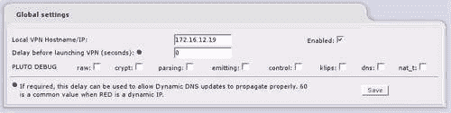
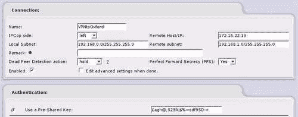
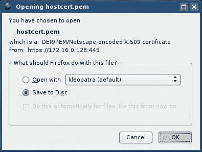

# 第 7 章：虚拟专用网络

正如前面章节中所讨论的，支撑网络工作方式的许多技术在设计时所考虑的因素与当今 IT 专业人员和计算机用户所面临的完全不同。 其中最突出的是对安全的担忧。

远程访问是 IT 专业人员关注的另一个主要问题，它允许员工、承包商、客户和供应商通过广域网或 Internet 访问资源和服务。 由于这种做法不仅需要将公司的内部网络连接到 Internet，而且还需要允许来自 Internet 的流量访问内部网络，因此带来了固有的安全风险。 其中一些漏洞源于远程访问系统赋予攻击者探测和攻击网络的能力，而另一些漏洞则源于这样一个事实：传统上，信息在 Internet 上以明文形式传递，没有任何形式的篡改保护。

最后一个问题的含义是，如果我们使用传统协议(如 HTTP 或 NFS)访问我们的信息或通过 Internet 将信息的访问权限授予他人，则任何具有适当访问权限的人(即对我们的网络基础设施(交换机、路由器、集线器、防火墙，位于我们和目的地之间的任何地方)具有物理或逻辑访问权限的任何人)都可以拦截、读取、复制或更改我们传输中的信息。

不是简单地向 Internet 开放 HTTP 服务器、邮件服务器、文件服务器和终端服务或 VNC 服务器等服务，而是在**VPN**或**虚拟专用网**后面保护这些服务已成为一种日益普遍的做法。

# 什么是 VPN？

顾名思义，VPN 是一个*网络*，它是*虚拟的*。 也就是说，与企业或小型办公室的本地网络(在某些情况下由数千码的布线和许多网络设备组成)不同，*虚拟*网络根本不包含任何实质内容--事实上，它存在于现有网络之上。 它也是私有的，这意味着在这种情况下，它既是*加密的*(因此第三方看不到我们正在发送和接收的内容)，又是经过*验证的*(为了使用它，我们需要标识自己，通常需要使用密码)。

考虑这样一个场景：一家小公司的销售员工数量很少，他们经常从全国不同地区(甚至世界各地)工作。 销售人员需要定期与办公室外和办公室内的其他销售人员同步其销售信息，并且需要发送和接收电子邮件以及访问其他类型的公司信息。 到目前为止，这些服务只有在我们的防火墙之后才能访问。

销售员工使用虚拟专用网络将笔记本电脑连接到他或她所住酒店的无线网络，并使用其计算机中的无线适配器提供互联网访问。 一旦通过 Wi-Fi 连接到互联网，他或她就会连接到公司 VPN，然后 VPN 客户端软件就会建立到公司 VPN 服务器的安全连接。 笔记本电脑上会出现一个新的虚拟网络接口，其 IP 地址分配给销售人员的笔记本电脑，与公司网络的内部网段相对应。

发往内部网络的流量现在可以通过此网络接口。 通过此接口的流量由 VPN 客户端软件封装，并通过加密的 VPN 链路发送-在此链路的另一端由 VPN 服务器解封并路由到内部网络。 销售主管坐在总部公司网络内的办公桌前，可以看到销售员工在网络上的笔记本电脑，就好像它是物理连接到网络上的一样，尽管访问速度稍慢！

从技术上讲，这是对 VPN 软件实际工作方式的过度简单化，但它很好地概括了这一过程是如何在高水平上发生的。 网络感知应用程序(如电子邮件客户端、FTP 客户端或 Samba 客户端)只需建立与以前相同的连接，即可访问内部网络上的资源，而无需感知网络链路-VPN 软件和驱动程序负责封装和解封。 VPN 越来越多地被公司用于与上述场景非常相似的场景，使用各种技术，包括**IP 安全**(**IPSec**)、**第二层隧道协议**(**L2TP**)、**点对点隧道协议**(**PPTP**)、SSH、SSL 和几个专有协议，例如由专有 VPN 服务 Hamachi 使用的协议。

除了允许访问另一个网络之外，最近建立的一些 VPN 系统，例如 Hamachi 提供的 VPN 系统或作为 Google Wi-Fi 服务的一部分提供的 VPN 服务，只是在使用不可信的网络连接(特别是公共场所的无线网络连接，通常是未加密和不安全的)时提供一些隐私保证。

### 备注

**基于互联网的专有 VPN 服务**

Hamachi 的虚拟专用网络服务([http://www.hamachi.cc/](http://www.hamachi.cc/))是越来越多的基于互联网的虚拟专用网络服务的一个例子，这些虚拟专用网络服务只寻求向 Wi-Fi 网络等不受信任的网络连接上的用户提供隐私(即，用户无法访问互联网上没有的任何*额外的*资源，而不像我们的销售员工和他或她的公司虚拟专用网络)。

在这种情况下，通信量被隧道传输到 VPN 连接所有者拥有的服务器，*额外的*隐私是通过假设这些所有者(例如 Hamachi)比您所连接的不可信网络的其他用户更不可能尝试拦截您的信息(可能有支持这一点的策略)来提供的。

## IPSec

虽然许多 VPN 协议都是共同部署的(PPTP 和 L2TP 都是广泛部署的，因为它们是 Windows 产品系列的一部分)，但 IPSec 是最独立、最标准化的解决方案，并且以这样或那样的形式集成到大多数 VPN 解决方案中。

大多数支持 IPSec 的设备将与其他此类设备形成隧道，尽管这不能保证-尤其是具有此类功能的低端设备(例如 SOHO 路由器)通常极难配置和故障排除，并且制造商对 IPSec 功能的支持通常很差。 虽然 IPSec 应该是可互操作的，但在两端使用同一设备通常可以省去很多痛苦！ 在互操作性这一主题上还值得注意的是，IPSec 仅支持**主模式**IPSec，而不支持**主动模式**IPSec。

### 备注

**PPTP 和 L2TP**

PPTP 最初由思科设计，后来由 Microsoft 授权作为 Windows 拨号网络的 VPN 协议(事实上，Windows 本机支持的第一个 VPN 协议)。 流量使用**Microsoft 挑战握手身份验证协议 v2**(**MS-CHAPv2**)或**可扩展身份验证协议-传输层安全**(**EAP-TLS**)(带证书)进行身份验证，并使用**MPPE**(**RSA RC4**)进行加密。 虽然 PPTP 得到了证书的加强，并且比 IPSec 简单得多，但没有证书，它仍然比 IPSec 弱，并且受到的影响较小。

L2TP 是思科**第 2 层转发**(**L2F**)和 PPTP 的演进。 它不实现身份验证或加密，因此通常与 IPSec 结合使用以形成 VPN。 由于使用了 IPSec，L2TP/IPSec VPN 比使用 PPTP 的 VPN 更安全，并且存在使用更高级别加密的潜力。

IPSec 本身比简单地用于 VPN 具有更广泛的范围，并且是**网际协议版本 6**(**IPv6**)规范的强制部分。 它最初构思时考虑了两种部署方案：

*   **隧道模式：与前面的方案一样，隧道模式下的 IPSec 用于将来自多台主机(或整个网络或多个网络)的流量通过隧道传输到另一台主机或一组网络，其中端点用于在流量穿过中间网络(通常是 Internet)前后对其进行封装和解封。**

*   **传输模式：**传输模式下的 IPSec 通常用于保护 IP 通信。 这种部署虽然可以通过 Internet 进行，但通常用于保护 LAN 网段，或者是在特定主机之间的通信必须加密(例如 Web 和数据库服务器)的任务关键型场景中，或者是为了保护整个网络。 这样的系统可以用作分布式防火墙策略的一部分-通过将网络上的所有主机配置为仅使用 IPSec 相互通信，连接到网络的任何未经授权的主机都不能直接连接到其他主机，从而有效地将该主机隔离在网络的某一层。

    微软采用这样的设置作为其服务器和域隔离的一部分(有关使用 http://www.microsoft.com/technet/itsolutions/network/sdiso/default.mspx 逻辑隔离的详细信息，请参阅[IPSec](http://www.microsoft.com/technet/itsolutions/network/sdiso/default.mspx)，在这种情况下是在 Windows 平台上)安全最佳实践，并构成**网络访问保护**(**NAP**)和**网络访问隔离控制**(**NAQC**)框架的一部分。

正如我们所看到的，IPSec 是一个复杂的主题，可以用来做很多事情。 但是，在本章的范围内，我们只需要知道 IPSec 可用于保护 IP 流量，在此方案中，IPCop 将 IPSec 用作 VPN 系统的一部分，使远程客户端看起来就像是通过 Internet 和一个或多个网络(如客户端的内部网络或酒店无线网络)虚拟插入内部网络。 我们还可以使用 IPSec 链接两个 IPCop 防火墙(或者一个 IPCop 防火墙和另一个支持 IPSec 的路由器或防火墙)，以形成一个*虚拟*站点到站点网络。 以下链接为了解更多有关 IPSec 的信息提供了很好的起点：

*   [http://www.packtpub.com/openswan/book：](http://www.packtpub.com/openswan/book)Openswan 一书，由 Openswan 本身的开发人员撰写

*   [http://www.openswan.org/docs/：](http://www.openswan.org/docs/)Openswan 文档

*   [IPSec](http://en.wikipedia.org/wiki/IPSec)维基百科上的 http://en.wikipedia.org/wiki/IPSec：文章

## 关于部署 IPSec 的更多信息

对 IPSec 的基本了解对于希望充分设置、管理、维护或支持使用 IPSec 作为站点到站点部署一部分的网络的任何人都很重要。

即使是比 IPCop 少*操作*的解决方案(例如具有易于部署的站点到站点 VPN 解决方案的商用防火墙)，也经常需要高级调试，而这又需要深入了解它们使用的协议。 带有 VPN 支持的商用防火墙包(如 Microsoft 的 ISA Server、检查点、边界软件或任何防火墙设备)从小型 VPN 路由器一直穿过企业级防火墙通常很难排除故障。

尤其是设备，由于它们在定制的免费 IPSec 软件的许多实例中使用，因此很难排除故障，因为它们与其他 IPSec 包相似，但由 OEM 供应商进行了修改。 在撰写本文时，维基百科列出了 9 家不同的 IPSec 软件供应商。

基于所有这些原因(以及老式的好奇心)，你很有希望知道为什么你可能会(也可能不会！)。 想了解 IPSec。

我们可以通过两种方式在 IPCop 中设置 IPSec：其中一种称为具有**预共享密钥**的 IPSec；预共享密钥类似于连接的两个端点都知道的密码。 虽然设置起来很简单，但它的安全性不如两种方式中的第二种，后者依赖于证书颁发机构(CA)颁发的证书。

### 备注

**预共享密钥与证书**

PSK 不如证书安全，因为它本质上是一种较弱的安全机制。 通常选择预共享密钥(类似于密码)是因为它对人类来说是可记忆的，因此通过暴力破解要比证书容易得多，证书构成了高度随机的字符集，并且需要公钥和私钥部分的知识才能导致安全漏洞。

证书可以由 Verisign、Thawte 或 CAcert.org 等 CA 颁发，您也可以设置自己的 CA(完全出于生成这些证书的目的，或者作为更大的 PKI 系统的一部分)来执行此操作。 你不必为此付钱，也不必是一次(非常)痛苦的经历。

### 备注

**配置您自己的 CA**

如果您使用 Active Directory 运行 Windows Server，您可能已经具备了使用您自己的 CA 构建灵活、安全的 PKI 系统所需的基础架构和软件。 关于这一点，微软 TechNet 上有很好的指导：

[http：//www.microsoft.com/windowsserver2003/technologies/pki/default.mspx](http://www.microsoft.com/windowsserver2003/technologies/pki/default.mspx)

如果您正在使用另一个操作系统，或者希望将您的 PKI 环境与 Windows 基础架构分开，onlamp.com 在以下 URL 上提供了一本很好的入门读物：

[http：//www.onlamp.com/pub/a/onlamp/2003/02/06/linuxhacks.html](http://www.onlamp.com/pub/a/onlamp/2003/02/06/linuxhacks.html)

运行您自己的 CA，特别是如果您开始依赖它来执行 IPSec 和文件加密等任务，在任何业务中都是一个极其重要的角色，如果失败，可能会给工作效率带来很大的麻烦，并且(如果受到损害)可能会造成很大的损害。 如果您决定采取这一步骤，建议您仔细阅读证书颁发机构的最佳实践，并听取该领域专家提供的一些建议。

Microsoft 指南虽然特定于 Windows，但在 CA 最佳实践方面有很好的指导方针，并且与 CA 位置和管理以及智能卡和 HSM 的使用有关的许多建议都适用于您选择在其上运行 CA 的平台和操作系统。 至少，如果您没有 Windows 基础设施，那么在您自己设置这样的基础设施之前，看看*另一端*是如何做的(以及它的实现是否有任何优点)是值得的。

## VPN 成功的前提条件

对于站点到站点 VPN，由于术语的原因，IPSec 设置过程也可能有些混乱。 因此，在尝试设置 VPN 之前写下设置 VPN 所需的所有信息尤为重要。 作者甚至建议使用易于理解的表单，如下一页中显示的表单。

VPN 设置的大部分问题(其中许多令人沮丧且耗时很长)是由错误配置和不匹配的设置引起的。 多花几分钟来制定您的部署计划，并在一张纸上清楚地标出您的设置，这将为您节省宝贵的时间和理智。

我们的先决条件是：

##### 可靠的网络

由于 VPN 连接是通过中间网络(如 Internet)建立的，因此它们的成功和稳定性取决于中间网络的可靠性。 VPN 会给网络带来更多开销，因此任何延迟或低带宽都会在 VPN 上(略微)放大。

##### 两个连接到运行 IPSec 软件的互联网的终端

我们需要在两个端点上运行 IPSec 软件才能使站点到站点 VPN 工作！

##### 端点或动态 DNS 主机名的静态红色 IP 地址

没有这些，我们就无法始终如一地建立联系。 虽然很少见，但一些 ISP 会将 RFC1918 范围内的地址分配给客户端-也就是说，192.168.0.0/16、10.0.0.0/8 和 172.16.0.0/12。虽然您不太可能没有，但请先检查您是否有真实的 IP 地址！

##### 不重叠的内部地址空间

如果地址范围不重叠，我们就无法将流量从一个站点路由到另一个站点。

您可能已经从前面关于网络的章节中了解到，路由和路由在将数据从一个网络子网传输到另一个网络子网的过程中非常重要。 当一台计算机尝试连接到另一台计算机时(例如，连接到 192.0.2.33 上的 SSH 服务器)，操作系统首先检查以确定此 IP 地址是否在本地。 如果我们的计算机的 IP 地址为 192.0.22.99，子网掩码为 255.255.255.0，计算机将使用该 IP 地址和二进制网络掩码进行计算，以找出 IP 地址的哪个部分是*网络*部分，哪个是*主机*部分。 在本例中，IP 地址的前三个二进制八位数(192、0 和 22)是网络部分，而第四个(也是最后一个)二进制八位数是主机部分。

由于 192.0.2.33 地址(192.0.2)的网络部分与建立连接的计算机(192.0.22)的 IP 地址的网络部分不匹配，因此计算机无法通过交换机或集线器直接连接到目的地，因此必须将数据传递到路由器，才能将数据直接路由到目的地或通过一个或多个路由器路由到目的地。

路由表包含一个条目列表，这些条目的网络对应于通过其到达这些子网的 IP 地址。 由于客户端计算机必须连接到*路由器才能将*任何*数据发送到非本地计算机，因此路由表*中列出的每个路由器 IP 地址必须*与分配给客户端计算机中网卡的 IP 地址位于同一子网中。 一般来说，客户端计算机往往只有一张网卡，其中只有一条(重要)路由，即默认路由器的路由。 如果路由表中没有其他更高的条目，则客户端计算机将向该路由器传递流量，并且通常是流量最多的地方。*

 *在大多数 Linux 发行版中，您可以使用 `ip route list`命令显示路由表的输出，在 Linux 和大多数 Unix 发行版中，您可以使用不带参数的 `route`命令来显示路由表的输出。 在 Windows 中，使用 `route print`命令将显示路由表。

在 VPN 配置中，我们的主机必须知道哪个子网位于 VPN 连接的另一端，哪个子网位于本地。 因此，使用重叠的 IP 范围会破坏 VPN-如果我们的网络使用 192.168.0.1/24(或子网掩码为 255.255.255.0 的 192.168.0.1)地址范围，并且 VPN 配置了也使用 192.168.0.1/24 地址范围的网络，则我们的计算机或 VPN 路由器将无法将数据包从一个范围路由到另一个范围，因为它不知道主机 192.168.0.22 在*中是哪个*192.168.0.1/24 地址范围。

应规划地址空间，如果您预计您的网络需要访问 VPN 或站点到站点 VPN，则应选择非默认私有 IP 地址范围(如 10.0.0.0/8、(10.0.0.1 至 10.255.255.255)范围内的某个地方)或非标准 192.168.0.0/16 子网(如 192.168.130.0/24)，以使您的工作更轻松。

##### 时间和耐心

IPCop 使用的*Left*和*Right*术语可能有点混淆--在这方面能给出的最好建议是选择一个站点作为*Left*，另一个作为*Right*。 背页的表格显示了这一点--一个位置清楚地标有**L**，另一个位置标有**R**。 换句话说，*配置 VPN 两端的方式相同！*

### 备注

**IP 地址**

这些示例使用 172.16.0.0/12 地址范围内的*外部*地址-如果您配置在 Internet 上运行的 VPN，则您的实际 Red*外部*地址将是您的 ISP 分配的*公共*地址。

出于本章的目的，我们将考虑物理上不同位置(剑桥和牛津)的两个 IPCop 防火墙之间的以下网到网配置。 在本例中，这两台主机被视为在红绿配置中设置 IPCop 防火墙，具有固定 IP 地址的互联网连接。

<colgroup><col width="1.37430555555556" style="text-align: left"> <col width="1.375" style="text-align: left"> <col width="1.37430555555556" style="text-align: left"> <col width="1.37638888888889" style="text-align: left"></colgroup> 
| 

左侧站点

 |   | 

站点名称：_

 | 

剑桥高地

 |
| --- | --- | --- | --- |
| 红色(外部)IP | _ 172.16.12.19 | 网关(内部)IP | _ 192.168.0.10__ |
|   |   | 内部网络 | _ _ 192.168.0.0/24_ |
| 预共享密钥：_ | “不要和陌生人说话！” | _ _ | __________ |

<colgroup><col width="1.37430555555556" style="text-align: left"> <col width="1.375" style="text-align: left"> <col width="1.37430555555556" style="text-align: left"> <col width="1.37638888888889" style="text-align: left"></colgroup> 
| 

右侧站点

 |   | 

站点名称：_

 | 

牛津 _

 |
| --- | --- | --- | --- |
| 红色(外部)IP | _ 172.16.22.19 | 网关(内部)IP | _ _ 192.168.1.1____ |
|   |   | 内部网络 | _ _ 192.168.1.0/24_ |
| 预共享密钥：_ | GB agh@；323lkj$%=sdf9SD-+‘ | _ _ | ____________ |

下一页包含这些表单的空白版本，因此，如果您愿意，您可以将这些表单用于您自己的环境。

<colgroup><col width="1.37430555555556" style="text-align: left"> <col width="1.375" style="text-align: left"> <col width="1.37430555555556" style="text-align: left"> <col></colgroup> 
| 

左侧站点

 |   | 

站点名称：_

 |   |
| --- | --- | --- | --- |
| 红色(外部)IP | __________________ | 网关(内部)IP_ |   |
|   |   | 内部网络 _ |   |
| 预共享密钥：_ |   |   |   |

备注：

<colgroup><col width="1.37430555555556" style="text-align: left"> <col width="1.375" style="text-align: left"> <col width="1.37430555555556" style="text-align: left"> <col></colgroup> 
| 

右侧站点

 |   | 

站点名称：_

 |   |
| --- | --- | --- | --- |
| 红色(外部)IP | __________________ | 网关(内部)IP_ |   |
|   |   | 内部网络 _ |   |
| 预共享密钥：_ |   |   |   |

注：

首先，在剑桥防火墙上，我们使用 Red IP 配置全局设置：

接下来，我们添加一个新的 VPN 并选择**网对网虚拟专用网：**

接下来，我们在对话框中输入 VPN 配置设置：

### 备注

**附加 IPSec 设置**

**Perfect Forward Secrecy**(**PFS**)和**Dead Peer Detection**(**DPD**)是您可能要考虑启用的两个附加设置。 两者都需要 VPN 隧道两端的支持，但分别提高了安全性和有效的服务提供。

PFS 可确保在用于通过 VPN 加密数据的密钥被破解的情况下，使用其他密钥加密的数据也不会面临风险-密码学中的完全正向保密特性在密码被破解的情况下将数据安全隔离开来，导致攻击者必须破解*会话生命周期中使用的每个*密钥来拦截或解密所有会话数据，而不是能够破解一个密钥并访问所有会话数据。

DPD 使用**Internet Key Exchange**(**IKE**)查询 IPSec 伙伴，以确保其仍处于活动状态。 这可以确保您的 IPSec 端点准确地知道会话的状态，因为它将更快地检测到故障并关闭连接(因此，如果可能的话，还会重新建立会话)。

接下来，我们添加 VPN 并验证它是否出现在主**VPN**对话框中：

一旦我们在 Oxford IPCop 主机(作为“右侧”)上配置了相同的 VPN(带有适当的配置信息)，我们的 VPN 就应该可以工作了。

## 验证连通性

在 IPCop 的最近几次迭代中，VPN 页面上有一个明确的指示器指示 VPN 的状态。 然而，我们之后的第一个调用端口是网络状态屏幕，在这里我们应该看到类型为*ipsecX*的**up**VPN 接口，其中 X 是一个数字(对于我们配置的每个 VPN，从 0 开始递增)。

我们还应该使用 `route`命令或带 `r`标志(`netstat -nr`)的 `netstat`命令检查路由表，查看是否存在通往 VPN 隧道另一端子网的路由。 如果一切正常，我们可以尝试 ping 通远程端私有子网内的主机。

通常，VPN 问题归结为配置问题，其中许多问题可以通过仔细注意合理 VPN 的前提条件来避免-例如参数不匹配、子网重叠或存在网络配置问题。 在重新尝试之前，重置现有的 VPN 配置总是值得的，如果有疑问，第二双眼睛通常会帮助发现您遗漏的错误。

如果您绝对确定您的配置匹配，并且您的网络配置正确，则可能存在互操作性问题。 支持 IPSec 的不同设备经常不能像预期的那样协同工作，有时甚至根本不能工作。 SOHO 和带有修改版本的 Openswan IPSec 堆栈的嵌入式设备在与*普通*Openswan 安装和其他 IPSec 堆栈交谈时，经常表现出非常奇怪的行为。 事实上，支持 IPSec 的廉价路由器经常只与具有相同型号和相同固件版本的其他路由器交谈，甚至不与来自同一供应商的其他路由器交谈。 这是一个相当棘手的领域，通常不会有很多乐趣。 如果有疑问，您可以控制的 IPSec 堆栈(如 IPCop)或支持良好的堆栈(如您可能在受支持的思科路由器上找到的堆栈)通常值得付出额外的费用或努力。

虽然 IPCop 防火墙不包括在我们的设置中(对 Red 接口使用静态地址)，但允许对 VPN 使用*动态*DNS 名称(如管理章节中所述)。 如 VPN 配置页所示，这些更新在 IPCop 机器启动后可能需要很短的时间；因此，如果您的系统使用动态 DNS 和 IPSec，您可能需要在启动 60 秒(或更长)的 VPN 之前配置*延迟*，以防止 VPN 失败。 如果故障持续发生在主机启动的最初几分钟内，这一点也值得注意！

## 使用预共享密钥的主机到网络连接

我们的主机到网络(或经常出差)连接的过程与网络到网络配置的过程非常相似。 我们首先在**Add**对话框中选择适当的 VPN 类型：

然后，我们使用适当的参数配置 VPN：

值得注意的是，您只能使用 PSK 进行一个主机到网络的连接。

## 使用证书的主机到网络连接

基于证书的 VPN 的配置比预共享密钥复杂得多，但也显著提高了 VPN 提供的安全级别。

### 证书和 X.509 简介

请注意，本书没有*全面解释 X.509、证书或密码学-这里的信息旨在让您了解 IPSec 在什么上下文中工作，以便您了解它在做什么-但更进一步，给您提供足够的信息来理解您*不知道的内容，并且如果您认为重要的话，可以阅读有关您自己的信息。**

 *这些都是非常复杂的主题，如果这就是您使用的技术，那么花几个小时甚至几天的时间来阅读这些主题是非常值得的。 维基百科有关于这里提到的几乎所有技术术语的全面文章，虽然不是权威的，但通常是正确方向的优秀指针，而且经常有优秀的内容。

本文中的证书是 X.509 证书，其起源于 X.500，X.500 是一组目录服务标准，包括 LDAP 的前身**目录访问协议**(**DAP**)。

广义地说，目录服务是一组应用程序和协议，用于存储有关网络、其提供的服务以及其用户的信息，并且通常包括诸如用户名、用户简档、登录信息、安全信息以及许多其它应用程序特定信息的信息。

目录服务系统中的*目录*是通常存储在目录服务器上的中心位置的数据库。 数据库通常具有针对用户、计算机和其他对象的条目，对于用户，具有针对每个对象的参数，例如*用户名*或*分机号码*。

X.509 证书类似于目录中的条目，因为它们在单个文件中存储许多参数。 存储在 X.509 证书中的参数包括几个必填字段，例如序列号、主题、颁发者和关于存储在证书中的密钥的信息，以及用于将附加信息合并到证书中的*扩展*的规定，以及 X.509 PKI 系统中的功能。

X.509 系统使用颁发和管理这些证书的证书颁发机构(CA)。 存在这样的 CA 的层次结构，并且 CA 通常存在于树的顶部。

如果您打开任何现代浏览器的副本，则表示您已将证书存储区合并到浏览器(或 Windows 中的操作系统本身)中。 在 Windows 中，可以通过 Internet Explorer 单击**工具|Internet 选项|内容|证书**进行访问，该窗口显示如下所示：

窗口顶部的选项卡指示正在查看的证书的*类型*-在本例中，选择的选项卡(默认选项卡)是**个人**证书的选项卡，这些证书是由证书颁发机构颁发给用户或计算机的证书。 它们可用于使用**S/MIME**等标准发送签名电子邮件，或使用 IPSec 访问 VPN。

在这些情况下，与证书相关联的私钥将用于对电子邮件进行签名以验证发送者(或者可能除了使用其公钥将电子邮件加密给另一 S/MIME 用户之外还对电子邮件进行签名)，或者用于向 VPN 服务器认证。

上图中最右侧的选项卡是**受信任的根证书颁发机构**。

就像我可以验证发送给我的 PGP 签名的电子邮件(从数学上讲，我可以确定电子邮件是由相应私钥的所有者以不切实际的方式发送的)一样，我可以验证证书是由与上一个图像中显示的*根*证书相关联的私钥之一签名的。

由于分发密钥很困难，因此使用根证书签名很重要，因为它使我们能够将所有信任放在一个地方。 因为我们知道(理论上)VeriSign 只有在确认人们是他们所说的那个人之后才会向他们颁发证书，因此顺理成章的是，如果我们获得了由 Verisign 的根证书签名的[joebloggs@Somecompany.com](http://joebloggs@somecompany.com)的安全电子邮件证书，那么电子邮件的发送者是[joebloggs@Somecompany.com](http://joebloggs@somecompany.com)(假设我们同时信任 Verisign 和 ome ecompany.com 的安全性)。

在网上购物、电子邮件和许多其他事情的背景下，这是极其重要的！ 简而言之，这些签名使您的计算机能够根据谁签署了证书以及我们是否信任它们及其证书颁发过程来决定如何处理证书。

HTTPS 使用 X.509 证书作为 ssl 的一部分，因此当您查看安全网站(url 以 `https://`为前缀)时，您的浏览器要么识别 ssl 使用的证书是由该地址的根证书颁发机构颁发的，要么不是。在后一种情况下，浏览器通常会弹出一个错误-这可能是因为证书是为一个稍微不同的网址颁发的(例如，如果您访问[https://www.gmail.com](http://https://www.gmail.com)，它将证书用于不同的 url)。 或者因为证书是自签名的或由不在受信任根证书存储中的根证书(如 CAcert、[www.cacert.org](http://www.cacert.org)，或在没有全套受信任根证书的设备(如 Smartphone)上)自签名或由根证书签名。

根证书是否包含在浏览器等产品中，由开发它们的公司或组织自行决定-这是互联网上使用的 X.509 PKI 实现的众多缺陷之一。

回到 IPSec；IPSec 可以使用 X.509 证书以与 HTTPS 相同的方式对 VPN 中的客户端进行身份验证。 请注意，与这些证书相关联的密钥实际上并不用于加密通过 VPN 本身发送的内容，而是用于安全地交换*会话*密钥，该密钥随后用于加密实际数据。 完美的前向保密性是原因之一--使用相同的密钥会使整个 VPN 处于危险之中--但也有两种主要类型的加密密码可供使用。

一种通常用于加密的电子邮件或文件加密，使用公钥和私钥，称为**非对称**密码，由此使用公钥加密数据，然后数据的格式只有私钥的持有者才能访问。 这种类型的密码非常适用于电子邮件等通信，因为您可以随心所欲地分发您的公钥，用户可以离线将信息加密给您，在世界任何地方，并通过不可信的网络将其发送给您。 只有当你得到这些信息时，它才会被解密。

另一种是**对称**密码，只使用一个密钥进行加密和解密。 由于涉及的数学运算，这些密码的加密和解密速度要快得多，但由于使用的是单一密钥，因此密钥分发变得不太实用，因为在人员众多的环境中，需要非常大量的密钥才能允许每个人与其他每个人安全地通信--实际上，对于组中的其他每个人，每个人一个密钥！

由于在快速数据流上使用非对称密码的实用性，IPSec 和 SSH 等通信会生成用于传输数据的对称密钥(使用 RC4、AES 和 Blowfish 等密码)，然后在完全建立会话之前使用非对称密钥(使用 RSA 等密码)交换用于此传输的密钥。

## IPCop 中具有 IPSec 的证书

IPCop 版本 1.4.0 不仅包含对基于证书的 IPSec 隧道的支持，还包含一个内置的 CA，以避免配置自己的 CA 的麻烦或从第三方 CA 购买证书的费用！

因此，我们配置基于证书的 IPSec VPN 的第一步是在 VPN**证书颁发机构**窗口中。 默认情况下，在 IPCop 中，这会将**根证书**和**主机证书**列为**不存在**。

如果我们正在使用现有的根 CA(或配置站点到站点 VPN)，我们需要使用**Upload CA Certificate**按钮上传证书文件，但对于频繁使用的配置(或在从另一个防火墙上传证书文件之前)，我们首先需要在**CA Name**字段中输入 CA 的名称，完成后，通过单击**生成根/主机证书**开始生成我们自己的根 CA 和主机证书的过程

加载下一页后，我们需要填写希望 X.509 证书具有的参数。 我们需要填写的参数是**Organization Name、IPCop Hostname、E-Mail Address、Department、City、State**和**Country**。

这些都应该是相对不言而喻的--根据您的环境，您可能希望也可能不希望在每个字段中填写真实的信息。 输入的数据无关紧要，但它将被颁发有根证书或主机证书的客户端看到。 填写完此表单后，单击**生成**按钮。 由于此步骤涉及证书的生成，因此可能需要一些时间(取决于您的 IPCop 主机的规格)。 现在你可以给自己泡杯咖啡了。

完成此步骤后，您应返回到 VPN 配置页面，该页面与此相同，但有一个显著的不同之处，即应填充表中的**根证书**和**主机证书**条目，并在其旁边显示允许您**下载根证书**和**下载主机证书**的按钮。

我们的下一步是下载主机和根证书文件的副本。 我们通过在前面显示的表格中单击其条目右侧的软盘图标来执行此操作。 根文件和主机文件都应该保存到硬盘或网络共享上的某个位置，而不是在您正在执行配置的 PC 上打开或安装(除非这是您要在其上执行配置的主机)。

## 使用证书的站点到站点 VPN

一旦我们使用此方法保存了主机证书和根证书，我们就会在另一台 IPCop 主机上执行相同的过程。 完成后，我们在创建站点到站点 VPN 时，将每个 IPCop 防火墙的根证书和主机证书导入到**身份验证**屏幕中的另一个防火墙，选择**Upload a Certificate**选项，而不是本章前面详细介绍的**Use a Pre-Shared Key**选项。

一旦完成此操作，两台服务器都将使用证书而不是 PSK 进行身份验证，这为我们的 VPN 配置增加了相当大的安全性。

## VPN 身份验证选项

在**VPN 身份验证**菜单中，我们在配置 VPN 时有四个选项可用，这些选项会影响我们配置客户端的方式：

*   **使用预共享密钥：**如前所述，我们只能有一个使用预共享密钥的 VPN 配置，如果我们使用此配置，则只需在此字段中输入我们选择的 PSK。

*   **上传证书申请：**通常，从 CA(包括 VeriSign 和 Equifax 等 CA)获取证书时，通常首先在将安装证书的系统上发出证书*请求*。 这是一个 X.509 证书，其密钥由始发系统生成，但不是由任何根 CA 签名，因此缺少任何信任机制。 通过将此*请求*文件发送到 CA(并让 CA 对其进行处理)，我们可以收到同一文件的签名副本。 必须将此响应文件重新导入发出请求的计算机(该计算机具有已签名的密钥的*私钥*密钥部分)，并在签名后将其组合以形成完整的证书(使用公钥/私钥)。 在多台计算机使用相同的签名证书的配置(如 Web 群集)中，一旦重新导入证书响应，就应该从原始计算机导出最终证书。

    某些 IPSec 软件具有生成证书请求文件的功能。 在这种情况下，我们只需选择身份验证对话框中的**Upload a Certificate Request**选项，一旦 IPCop 处理了请求文件，就可以按照与根证书和主机证书完全相同的方式从 VPN 页面下载证书。 此证书可以重新导入到客户端

*   **上载证书：**如果 IPSec 对等方有我们希望使用的证书，例如，如果我们正在使用另一台 IPSec 主机配置站点到站点 VPN，我们将以这种方式上载主机和根证书文件。 通过将右侧 IPCop 主机的主机和根证书文件上载到左侧 IPCop 服务器，并将左侧 IPCop 主机的主机和根证书文件上载到右侧 IPCop 主机，我们使两个防火墙都能识别对方，并可以将证书用于网到网 VPN。

*   **生成证书：**如果 IPSec 对等方本身不处理证书并且不能生成证书请求，我们可以从 IPCop 生成证书。 这比使用证书请求稍差一些，因为在任何时候使用证书请求时，私钥(使用证书所需的)都不是通过公开传输的(即使恶意攻击者拦截了来自 CA 的证书响应，他或她也不能对它做很多事情)，但是如果我们打算通过 LAN 传输证书(或者在生成对话框中输入用于加密证书的强 PKCS12 文件密码)，那么我们可以在一定程度上减轻这种风险。 与证书响应方法一样，此过程产生的证书可以从 VPN 页面下载。

## 为 VPN 配置客户端

这是一个复杂的主题，在不同的主机平台上差异很大。 IPCop Wiki 提供了针对 Windows 客户端的说明，这些客户端没有很好的内置支持 IPSec VPN。

如果我们有一个使用证书的 VPN 配置，我们要么需要使用拥有自己 CA 的客户端(如 IPCop)，要么需要使用前面详细介绍的 IPCop 创建证书。 如果我们的 VPN 要求不那么复杂，或者我们不想使用证书，我们可以使用 PSK。

### 备注

**Windows 客户端配置**

有关 Windows2000/XP 中的客户端配置，请参阅：[http://www.ipcop.org/modules.php?op=modload&Name=phpWiki&FILE=INDEX&PageName=OpenVPN How to](http://www.ipcop.org/modules.php?op=modload&name=phpWiki&file=index&pagename=OpenVPNHowto)。

Linux 用户拥有来自 IPCop 本身用于建立服务器连接的相同软件包的本机支持-Linux、BSD 和 OSX 用户应查阅其操作系统文档，以了解在其环境中配置此功能的最合适方式，因为对客户端操作系统的全面调查超出了本书的范围。

## 蓝色地带

从 1.4 版开始，IPCop 支持蓝色区域，这是一种具有比橙色或绿色区域更激进的防火墙规则的无线网段，并且专门为不受信任的无线网段设计。 这可以是开放的无线网络，只允许某些客户端访问其他网络，也可以是具有额外安全层的封闭式无线网络，甚至可以是有线网络-它不必是无线的。

在过去的几年里，无线安全一直是人们密切关注的主题。 从对 802.11 标准提供了哪些安全措施缺乏了解，到 wep 加密最初提供的安全性较差，无线安全仍然是许多 IT 部门和制造商的痛点。 即使 WPA 在预共享密钥和企业(使用 RADIUS 服务器)模式下提供的改进的加密仍不足以满足法规要求和要求对机密信息进行强加密的公司政策。

更好、更安全的无线标准(如 WPA2，备受期待的 802.11i)承诺使用当今技术的更好版本，经过改进的程序和更强的加密-但它们目前还不存在，许多较老的设备和客户端可能不支持它们。 由于所有这些原因以及纵深防御带来的安心，在无线网络上建立 VPN 连接和/或 IPSec 通常是个好主意。

传统上，这样的设置既复杂又昂贵，但 IPCop 现在甚至可以为家庭用户提供丰富的企业级功能。

### 蓝区 VPN 的前提条件

为了使蓝色区域 VPN 设置正常工作，我们需要一个受 IPCop 支持的以太网卡，该卡配置有适当的 IP 寻址信息(即非重叠的专用子网)，并且 DHCP 服务器配置为在正确的地址范围内分配信息(即，在与 IPCop Blue 接口相同的子网中，并且将 Blue 接口地址作为网关和 DNS 服务器)。

### 设置

蓝色 VPN 的设置与出差人员 VPN 相同，配置的是*Blue*接口，而不是*Red*接口。

### 备注

**IPCop Blue VPN Wiki**

IPCop 有一个专门用于 Blue VPN 配置的 Wiki 页面，如果设置发生变化，应该更新该页面；[IPCop&Name=phpWiki&FILE=INDEX&PageName=IPCop140BlueVpnHowto](http://www.ipcop.org/modules.php?op=modload&name=phpWiki&file=index&pagename=IPCop140BlueVpnHowto)。

# 摘要

我们介绍了 IPCop 防火墙和 IPSec VPN 的三种常见配置方案。 虽然我们没有从头到尾介绍整个主题，但我们希望已经为您提供了足够的信息，使您能够了解 VPN 的工作原理，并开始为您的 IPCop 主机配置(希望成功)基于证书和预共享密钥的 VPN。 在 IPSec 上有很多好书，包括本书出版商编写的关于使用 Linux 构建 VPN 的几卷书(如[http://www.packtpub.com/openswan/book](http://www.packtpub.com/openswan/book)，由 Openswan 的开发人员编写)。

IPSec VPN 虽然受到广泛支持，但绝不是最容易配置的。 基于 SSL 的 VPN 使用与 HTTPS 相同的加密技术(如 OpenVPN)，由于配置相对容易以及协议的简单性质而迅速流行；IPSec 即使与 L2TP 等协议结合使用也是复杂的，并且经常被防火墙和网络地址转换破坏。

OpenVPN 除了对防火墙更简单之外，还可以在任意数量的端口上运行，例如那些通常只需很少或根本不需要应用层检查即可通过防火墙的端口，如 443 或 53。 对于发现 PPTP 或 IPSec VPN 难以使用且不稳定的远程员工来说，OpenVPN 可能值得一看。 不幸的是，这种易用性是有代价的-OpenVPN 目前还没有得到广泛的支持，尽管 Windows 和 Linux 客户端存在，但它们并不常用，而且 IPCop 本身并不支持 OpenVPN(尽管有 OpenVPN 的附加组件)。

OpenVPN 上也有可用的资源，包括来自该发布者([http://www.packtpub.com/openvpn/book](http://www.packtpub.com/openvpn/book))的一些资源，以及关于 OpenVPN 的无数一般在线操作方法，以及使用 IPCop 的 OpenVPN([http://home.arcor.de/u.altinkaynak/howto_openvpn.html](http://home.arcor.de/u.altinkaynak/howto_openvpn.html))

希望有了这些材料和外部资源的链接，好奇的 IPCop 管理员现在就掌握了他或她需要的信息，以便更多地了解该主题，并可能选择一本关于该主题的特定主题的书来阅读！**