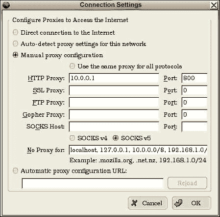
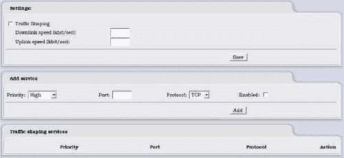
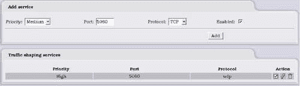

# 八、使用 IPCop 管理带宽

我们现在非常清楚，IPCop 不仅仅是一个基本的数据包过滤防火墙。 我们已经看到了内置的入侵检测系统以及强大的 VPN 选项。 我们的另一个附加功能是能够通过几种不同的技术(流量整形和缓存)来管理流量。 现在，我们将了解如何使用这些功能来提高需要的网络的性能。

# 带宽问题

在目前使用的大多数网络中，通常存在由网络提供和使用的多个不同服务，并且可能存在到其他网络的多个链路。 有了这么多服务，我们可以非常快地用完带宽。 要确保网络上的所有服务和用户都有足够的带宽，最简单的方法就是购买争用较少的快速链路。 这是一个很好的理论，但经济现实要复杂一点，因为带宽可能很昂贵，而且可能是服务的主要开销。 为了解决这一问题，我们可以使用现有的服务，并尝试减少它们的带宽使用。

减少带宽使用量最初可以通过在可能的情况下使用节省带宽的协议来实现；但是，有时我们别无选择，必须使用应用、供应商或用户指定的特定协议。 这是我们可以考虑减轻该应用给网络带来的压力的时候。 我们可以使用许多技术和设备来实现这一点，每种技术和设备的复杂程度和结果各不相同。 然而，IPCop 本身有几个简单的选项来帮助管理我们的带宽。

# HTTP 问题

Internet 范围内最常用的协议之一是 HTTP(尽管点对点文件共享应用正在快速赶上)。 大多数企业都有一个在 HTTP 上运行的网站作为他们的基本互联网存在，很少有互联网用户不使用 HTTP。 我们可以非常有信心地认为，这将成为我们网络上使用的协议。

当涉及到带宽时，HTTP 给我们带来了一个重要的问题--用户希望 HTTP 几乎是即时的。 由于带宽拥塞而给用户的网络浏览体验带来延迟远非理想的情况，而且可能是网络用户首先会注意到(并抱怨)的地方。 关于带宽不足的问题。 幸运的是，IPCop 为我们提供了非常强大的选项来减少 HTTP 对网络的影响。

# 解决方案：代理和缓存

虽然使用代理本身不是节省带宽的措施，但它是与带宽控制和监控相关的功能。 代理允许您监视、修改和控制对 Web 内容的请求。 您可以选择记录和/或拒绝哪些通信，并在这些请求通过代理时对其进行修改。 由于代理位于 Web 客户端和 Web 服务器之间，因此它可以执行一些其他功能，例如缓存。

对于同一网络上的用户来说，访问几个相同的网站是很常见的。 这意味着用户每次访问网站时，都会下载页面上的所有 HTML 和图片。 如果该内容只下载一次，然后以某种方式存储以便呈现给请求相同内容的后续客户端，这显然对我们的网络是有益的。 我们的浏览器在本地为我们做这件事，所以如果我们多次访问同一个页面，我们的浏览器就有可能为我们缓存了一个本地副本。

这正是缓存代理将为我们提供的功能，但它将为每个人缓存。 每当用户下载页面及其图像时，代理都会在其内存中保留一份副本(和/或将其写入磁盘)。 无论何时出现对相同内容的请求，代理都会向客户端提供该文件的缓存版本的副本，而不是将其传递到原始网站。 我们可以大幅减少带宽，特别是当我们的用户访问许多相同的站点时。 这并不意味着您获得的信息将会过时；网站可以要求代理不缓存与时间相关的信息(股票信息、天气等)。

# 鱿鱼简介

**Squid**是可用的最有用、功能最强大的 Web 代理和缓存系统之一。 它是免费和开源的，这就是为什么它可以包含在 IPCop 中。 Squid 本身具有相当复杂的配置文件，并执行各种代理和缓存功能。 正如我们期待的那样，IPCop 很好地抽象了这一复杂性，让我们更轻松地配置 Squid。

Squid 诞生于一个*分支*，它是一个代理/缓存项目，并于 1994 年发布了它的第一个版本，因此 Squid 的开发时间跨度超过了 10 年。 这导致了一个相当稳定且功能齐全的代理和缓存应用。 最初的嘉实缓存项目不再处于开发阶段。

# 配置 Squid

IPCop 中的 Squid 配置屏幕非常容易操作，您只需单击几个框即可完成基本配置。

在本例中，我们只有一个绿色接口；但是，我们可以在所有其他接口上启用代理-除了 Red，它是 Internet 连接。

第一步非常明显；我们在需要代理的接口上启用代理，方法是单击第一个复选框，然后选择代理侦听的端口(默认情况下在 IPCop 中为 800-尽管 Squid 通常在端口 3128 上运行)。 我们还可以选中**Log Enabled**框，该框不特定于接口，因此我们要么全部记录，要么不记录。 如果我们想在某个时候监视代理，启用此选项是个好主意。 我们还可以通过 ISP 提供的代理链接此代理，例如，通过配置将由 ISP 或其他代理服务提供商提供的**上游**选项。 可能需要要连接的主机端口以及用户名和密码。

透明度需要更多的解释。 传统上，代理监听机器上的特定端口，客户端必须配置为连接到此端口。 例如，代理可能位于 IP 地址 10.0.0.1 上，侦听端口 800。 在本例中，我们将配置所有 HTTP 客户端以连接到此代理。 Firefox 和 Internet Explorer 都有网络设置对话框，我们可以在其中配置代理访问。 Firefox 代理配置屏幕如下图所示：

这是一种简单的使用方法，但是如果我们必须以这种方式配置所有的应用，可能会变得单调乏味，特别是如果我们在网络上有许多机器要以相同的方式进行配置。 这就是透明代理变得有用的地方。 它不是监听一个端口并转发请求，而是监视通过机器的所有流量，并在检测到 HTTP 流量的地方尝试缓存。 这也有一个缺点，那就是其他一些协议可能看起来像 HTTP，尝试缓存这些协议可能会破坏它们。 如果我们启用透明代理，不久之后应用开始出现问题，那么作为初始步骤关闭透明度是值得的。 这是一个罕见的具体问题，但可能很难追踪到。

# 缓存管理

**缓存大小：**我们希望缓存占用多少磁盘空间？ 这被设置为默认的 50MB，这对于大多数小型网络来说是非常合理的。 如果我们有很多用户，我们可能希望将其增加到几个 100MB。 除了非常大的网络之外，几乎没有必要在任何网络上超过 1 GB。 此外，如果该数字明显大于 IPCop 机器上的可用内存，那么我们将有大量的磁盘读/写，这可能会减慢速度。

**最小对象大小：**有时我们不想缓存非常小的文件，因为这样效率会很低。 不过，通常将其保留为零是个好主意，因为这些文件的重复 HTTP 开销可能会影响性能。

**最大对象大小：**同样，我们可能不希望缓存过大的文件，因为这会迅速填满我们的缓存，并导致我们遇到我们希望避免的磁盘读/写问题。

通常应该使用前两个选项的默认值，除非我们有特殊需要更改它们，例如用户不断下载相同的大文件。

## 转账限额

我们还可以控制通过系统传输文件的最大和最小大小。 这不是一个好主意，除非我们有一个具体的案例来这样做，因为这可能会让用户非常沮丧。 如果我们想防止用户下载非常大的文件(如 ISO)，以防止网络带宽被滥用于个人用途，这是相当方便的。

# 在不使用缓存的情况下管理带宽

HTTP 不是我们网络上唯一需要足够带宽的协议。 例如，如果我们的网络上有在线游戏或语音和视频通信，这些服务通常比其他服务具有更高的优先级，因为它们的使用时间敏感。 你不想因为网络上的用户正在下载大文件而与客户进行断断续续的语音对话，或者在家庭网络上，你不想因为有人决定开始收听他们的在线电台而失去你在网络游戏中的高分。 这就是流量整形的用武之地。

## 流量整形基础

为了确保服务质量(QoS)，我们必须控制流量，以便将高优先级流量视为高优先级！ 有了流量整形，我们可以使用与数据包过滤中使用的所有参数相同的参数；但是，我们不是决定是否通过流量，而是做出更复杂的决策，决定向哪些流量提供最高优先级，从而优先处理哪些流量或为其分配比网络上使用的其他协议更多的带宽。

流量通常用于控制媒体服务。 基于视频和音频的服务在很大程度上依赖于低延迟和充足的可用带宽，因此在网络中引入流量整形来适应这些服务是很常见的。

### 备注

**利用流量整形的 ISP**

一些 ISP 使用流量整形的方式与我们在此描述的方式大致相同，以向依赖带宽和延迟的服务提供更好的服务。

这还有另一个商业用途，那就是提供服务。 互联网服务提供商可以塑造流量(有些确实是这样)，这样一家内容提供商的服务比另一家的响应更好。 例如，互联网服务提供商可以对优先级调整收费，如果谷歌为这项服务付费，他们将得到保证，他们的内容和服务将更快、更快地响应他们的竞争对手，如雅虎！ 和 MSN。

这是一种有效的竞争方式，因为 ISP 用户可能会坚持使用*较好的*内容提供商。 显然，这并不完全符合 ISP 用户的利益，但对于 ISP 和可能为这些服务付费的内容提供商来说，这肯定是一项有利可图的冒险。

## 流量整形配置

流量整形配置页面非常简单，可以为我们提供更多选项，但我们可以根据使用的端口进行整形，这使我们能够足够具体地区分大多数服务以实现流量整形。

文字**流量整形**旁边的复选框用于启用该服务。 但是，在我们定义一些流量整形规则之前，这不会对流量产生任何影响。

我们还必须提供上行和下行速度。 这就是我们的网络将数据传出和传入的速度。 下表提供了常用上载和下载速度的快速参考，对于我们的设置来说，这可能并不完全准确。 建议我们测试自己的速度或咨询我们的 ISP 以获取更准确的信息。

<colgroup><col width="1.17676722339752" style="text-align: left"> <col width="1.21753985923516" style="text-align: left"> <col width="1.38641850376867" style="text-align: left"></colgroup> 
| 

连接类型

 | 

上行链路(千位/秒)

 | 

下行链路(千位/秒)

 |
| --- | --- | --- |
| 拨号 | 48 | 56 |
| 电缆(1 兆克) | 256 | 1000 |
| T1 | 一百九十二 | 1540 |

有关不同服务的上传和下载速度的更完整指南可在此处找到：[http://en.wikipedia.org/wiki/List_of_device_bandwidths](http://en.wikipedia.org/wiki/List_of_device_bandwidths)。

## 添加流量整形服务

为了添加服务，我们填写了三个必填字段，然后选择**Enabled**。 单击**Add**向底部窗格中的**流量整形服务**添加新行。 在本例中，我们添加了端口**5060 UDP**(SIP)作为**高**优先级，这将确保此服务在网络上优先。 这些都是非常基本的流量整形选项，我们无法定义端口范围或按 IP 地址整形。 我们的优先级限制为三个级别-低、中和高，每次添加一个端口。 没有必要列出将通过 IPCop 的所有端口，因为默认情况下，未指定的端口将以中等级别处理。 要删除此规则，只需单击右侧的垃圾桶；我们还可以使用**操作**标题下的复选框启用或禁用添加的规则。

## 编辑流量整形服务

为了编辑我们已经添加的服务，我们可以点击动作标题下的铅笔，它应该会显示如下屏幕：

我们可以看到，我们的规则现在以黄色突出显示，以便清楚地表明我们正在编辑哪个规则，并且我们在上面的配置框中具有原始参数。 **添加**按钮也已更改为**更新**。 现在，我们修改所需的任何值，然后单击**更新**按钮，这将保存规则并将我们带回初始流量整形屏幕。

IPCop 还提供了可进一步扩展这些功能的附加模块，如果您有一些重要的流量整形工作要完成，则值得考虑这些模块。

# 摘要

在本章中，我们介绍了使用 IPCop 进行缓存和流量整形，以及如何配置这些内容。 即使是在最小的网络上，这也是有用的，因为我们对服务访问进行了优先排序，使网络上的用户能够保证为正在使用的任何关键服务提供尽可能好的服务。 在 IPCop 中执行此操作的选项非常基本，而且我们的控制能力有限。 然而，我们已经看到，为了提高带宽利用率，有可能对服务产生影响。