# 九、自定义 IPCop

IPCop 是市场上功能最齐全的 SOHO 防火墙之一，到目前为止，您应该已经熟悉了大部分功能，但您可能已经注意到了一些不足之处。 在某些领域，IPCop 可能没有以正确的方式执行某个功能，或者没有我们需要的特定功能。 那么我们能做些什么呢？ 我们可以使用一些基本的插件来定制 IPCop。

# 加载项

IPCop 的核心是一组基于 Linux 的工具，它们通过令人印象深刻的基于脚本的粘合剂结合在一起。 因此，我们可以修改、扩展和改进系统以满足我们的需求也就不足为奇了。 这就是开源软件的社区部分变得重要的地方，因为我们发现该系统的用户已经开发了各种可以在 IPCop 上安装和使用的插件。

插件通常由第三方开发，即 IPCop 开发者以外的人。 它们的开发通常是为了填补用户在软件中发现的一些空白，然后发布，以便其他用户可以从工作中受益，并解决类似的问题。

我们将看看一些常见的插件，它们提供了什么，以及我们如何使用它们。 我们可以在 IPCop 网站上找到这些插件的链接：[http://ipcop.org/modules.php?op=modload&name=phpWiki&file=index&pagename=IPCopAddons](http://ipcop.org/modules.php?op=modload&name=phpWiki&file=index&pagename=IPCopAddons)。

# 防火墙附加服务器

防火墙插件服务器为我们提供了一个简单、用户友好且基于 Web 的系统来管理 IPCop 的一些插件。 要使用本章中的加载项，必须安装此插件。

我们可以从[http://firewalladdons.sourceforge.net/](http://firewalladdons.sourceforge.net/)下载防火墙插件服务器软件包。

在编写本文时，我们将使用文件：[http://heanet.dl.sourceforge.net/sourceforge/firewalladdons/addons-2.3-CLI-b2.tar.gz](http://heanet.dl.sourceforge.net/sourceforge/firewalladdons/addons-2.3-CLI-b2.tar.gz)

对于更高版本，此位置可能会更改，应更改以下与文件名相关的命令，以反映下载的文件的名称。

首先，我们使用指定端口 222(SSH 访问的 IPCop 默认端口)的 `scp`命令将此文件复制到服务器，并指定 root 用户。

```sh
 $ scp -P 222 addons-2.3-CLI-b2.tar.gz root@10.0.0.200:/ 

```

系统将提示我们输入 root 帐户的密码，这是我们在安装 IPCop 机器时设置的密码。

现在，文件准备就绪，我们可以登录到 IPCop 机器并对其进行设置。

```sh
 $ ssh -p 222 root@10.0.0.200 

```

### 备注

**p 与 p**

请注意，小写的 `-p`用于带有 `ssh`的端口，大写的 `-P`用于带有 `scp`的端口。 这种差异可能会变得非常恼人，并可能导致难以发现的打字错误。 如果无法连接，请检查命令的大小写是否正确。

输入 root 密码后，我们应该会看到以下提示：

```sh
 root@ipcop:~ # 

```

现在，我们键入以下命令来设置插件服务器：

```sh
 # mv /addons /addons.bak
# tar xzvf /addons-2.3-CLI-b2.tar.gz -C /
# cd /addons
# ./addoncfg -u
# ./addoncfg -i 

```

命令完成后，我们登录到 IPCop Web 界面，应该会看到页面顶部的菜单中添加了一个内容。


我们将看看我们的 Web 界面现在有的几个新页面，以及它们提供的附加选项。

**插件-新闻**页面显示有关防火墙插件服务器及其提供的插件的更新。 除了我们希望看到多少新闻之外，这里没有其他配置选项。 它是一个综合信息页面，使用从插件网站下载的重要新闻。

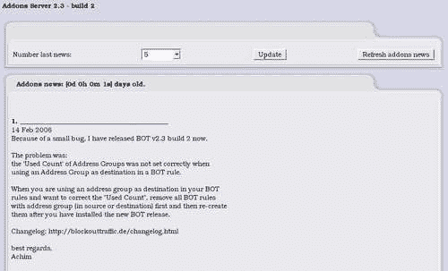

**addons**页面提供有关已安装的加载项和当前可用的加载项的信息，并允许我们安装或删除加载项。

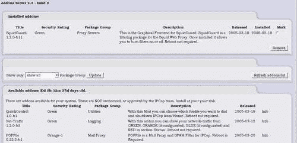

**Adons-UPDATE**页面为我们提供有关插件更新的信息，其方式与**Adons**页面有关插件本身的方式大致相同，它显示了可用的内容，并为我们提供了安装更新的方法。

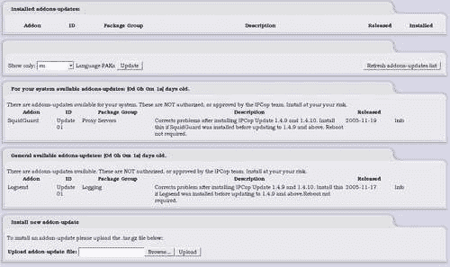

## 安装加载项

现在我们已经熟悉了防火墙插件服务器的界面，我们可以开始安装和使用插件了。 我们将从 SquidGuard 开始，正如您可能已经注意到的，它已经安装在前面的屏幕截图中。 要安装插件，我们转到**插件**页面并向下滚动，直到看到我们想要安装的插件。 然后，我们单击右侧的**Info**超链接，它会将我们带到插件的详细信息和下载页面。 对于 SquidGuard，该页面是[http://firewalladdons.sourceforge.net/squidguard.html](http://firewalladdons.sourceforge.net/squidguard.html)。

在此页面上，我们获得了有关该插件的详细信息，并获得了指向当前版本的下载链接；在撰写本文时，该链接是：[http://heanet.dl.sourceforge.net/sourceforge/firewalladdons/SquidGuard-1.2.0-GUI-b11.tar.gz](http://heanet.dl.sourceforge.net/sourceforge/firewalladdons/SquidGuard-1.2.0-GUI-b11.tar.gz)。 这很可能会更新，所以请先检查一下之前的链接！

我们下载 GZIPPED tar 归档中的插件。 然后，我们返回到**Addons**页面，单击**Browse**按钮，浏览到我们刚刚下载的文件，单击**Upload**，外接程序安装在服务器上。

### 备注

注意：有时上载加载项时，特别是像 SquidGuard 这样会重启 Web 服务器的加载项，我们不会自动刷新页面，并且/或者连接可能会超时。 在浏览器中点击**Refresh**或**Stop**，然后点击**Refresh**，我们将返回到**Adons**页面。

与防火墙插件服务器一起安装的所有其他插件的过程都类似，因此当我们稍后查看其他插件及其工作方式时，没有必要重复这些步骤。

# 常用加载项

我们现在来看看一些比较常见的插件的配置以及它们是如何使用的。 因为我们已经安装了 SquidGuard，所以我们可以从这个插件开始。 我们不会涵盖本文中的所有插件，因为它们非常多。 然而，我们将涵盖最常见和最重要的问题。 建议我们至少熟悉一下其他可用的插件，因为它们可能会满足我们以后可能会认识到的要求。

## ►T0\\SquidGuard

SquidGuard 是一个内容过滤插件，可以随 Squid 一起安装。 它主要用于阻止来自 Web 的不合适内容，并可配置一组动态规则，包括全面禁止各种主题和/或将网站列入黑白名单，具体取决于它们是否适合我们网络上的受众。

SquidGuard 配置屏幕如下所示：

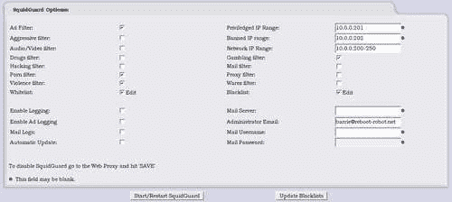

正如我们所看到的，我们可以过滤各种主题，这些主题在 SquidGuard 配置中是预定义的。

在上面的截图中，我们选择从我们的网络中过滤广告、色情、暴力和赌博相关网站。

我们还配置了一些其他选项来帮助控制我们的网络使用。 我们已确定 IP 地址为**10.0.0.201**的计算机是一台特权计算机(可能是我们自己的或管理员的计算机)，它被允许不加区别地绕过筛选器和访问站点。 **10.0.0.202**在**禁止的 IP 范围**内，并且是不允许通过此 Web 代理访问 Internet 上任何资源的计算机。 **网络 IP 范围**表示网络上将遵守先前配置的其他规则的所有其他用户。 请注意，**网络 IP 范围**包括计算机**200-250**；可以类似地指定所有其他范围，从而允许我们在必要时在规则中包含多个 IP 地址。

这里还有其他一些重要而强大的配置选项。 如果我们允许列入白名单，然后单击**编辑**框，我们会看到以下屏幕：

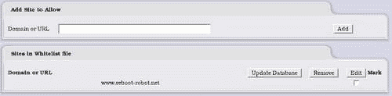

通过输入 URL 并单击**添加**，我们允许访问此域，而不考虑任何其他规则。 在本例中，URL[www.reboot-robot.net](http://www.reboot-robot.net)已被列入白名单。

黑名单配置屏幕完全相同，除特权 IP 地址外，SquidGuard 会阻止列出的任何域。

除了直接配置阻止和不阻止什么，我们还有一些其他选项需要一些解释。

*   **启用日志记录：**允许我们记录 SquidGuard允许和拒绝的连接

*   **启用广告记录：**允许对阻止的广告进行更详细的记录

*   **邮件日志：**记录通过防火墙的邮件信息

*   **自动更新：**从 SquidGuard 网站下载拦截 URL 的自动更新

*   **邮件服务器：**向管理员发送邮件时使用的服务器

*   **管理员电子邮件：**要将日志发送到的电子邮件地址

*   **邮件用户名：**邮件服务器需要身份验证时使用的用户名

*   **邮件密码：**密码与之前相同

### 备注

**邮件设置**

您会注意到，这些邮件设置是任何提供与网络管理员通信的插件的一部分。 有必要将此信息放在手边，并可能专门为我们的 IPCop 机器创建一个电子邮件帐户/地址。

此页面上唯一需要的框是我们的**网络 IP 范围**和我们的**管理员电子邮件**；其他所有内容都可以选择配置(可选字段旁边有一个蓝色星号)。

在页面底部，我们有**Start/Restart SquidGuard**按钮，当我们根据需要配置了服务并希望在运行的机器上保存和使用配置时(诚然这不是直观的)，可以使用该按钮。 **更新黑名单**按钮允许我们下载内容过滤选项的更新黑名单。

在配置 SquidGuard 之后，我们现在应该有了一个有效的内容过滤系统，以帮助确保网络上的用户不会访问被认为不受欢迎的网站。

如果我们既想监控又想控制呢？ 细心的读者可能已经意识到，当我们启用日志记录选项时，应该可以访问这些日志，可能是在 Web 界面中。 如果我们将鼠标移到**日志**上方，我们肯定会看到**SquidGuard 日志**；单击此按钮将显示：

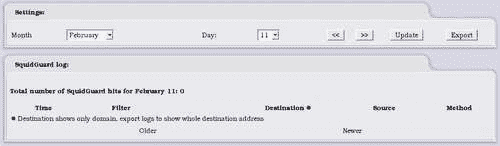

这使我们可以在类似于系统默认日志的界面中查看 SquidGuard 日志。

## 增强型过滤

增强的过滤插件是最有用的插件之一，它解决了 IPCop 默认情况下严重缺乏的一个功能。 默认安装 IPCop 将允许所有流量从 Green 接口出站到其他接口，而不会进行任何过滤。 通常需要控制用户可以从绿色界面访问的端口和 IP 地址。 例如，我们可能想要阻止所有出站连接，但到网站运行的端口的出站连接除外。 这将允许默认阻止对等文件共享程序和即时消息传递程序。 这是防火墙的首选默认设置，我们在[第 3 章](03.html "Chapter 3. Deploying IPCop and Designing a Network")中讨论了这一点。 增强的过滤还允许对无线连接进行基于 MAC 的过滤。

### 备注

**基于端口和 IP 的块并不完全有效**

请注意，阻止应用正在使用的端口不会阻止用户在另一个端口上使用该应用，也不会阻止用户通过位于 IPCop 保护网络外部的代理服务器使用该应用。 同样，可以通过使用代理来克服基于 IP 的阻塞。 应用层过滤增加了这种保护，但如果不严格控制网络上的内部资源，大多数网络级过滤机制都可以绕过。

有关详细信息，请参阅增强过滤网页：[http://firewalladdons.sourceforge.net/filtering.html](http://firewalladdons.sourceforge.net/filtering.html)。

撰写本文时使用的版本是从以下 URL 下载的，安装方式类似于 SquidGuard：

[http：//heanet.dl.sourceforge.net/sourceforge/firewalladdons/EnhancedFiltering-1.0-GUI-b2.tar.gz](http://heanet.dl.sourceforge.net/sourceforge/firewalladdons/EnhancedFiltering-1.0-GUI-b2.tar.gz)

下图显示了增强过滤配置屏幕，可以通过单击**防火墙|增强过滤访问该屏幕：**


在这里，我们可以**启用增强过滤**或**禁用**它，以及**在绿色**网络接口上设置默认拒绝。 我们讨论了引入防火墙时的默认拒绝，以及为什么它更易于管理和更安全。

我们还可以为网络之间的连接向防火墙添加特定规则。 我们必须提供源 IP 地址和目的 IP 地址、源网络掩码和目的网络掩码、网络和目的端口。

例如，只允许我们的邮件服务器向外连接到我们的 ISP 的邮件服务器，以便为网络中继邮件。 我们将把**源 IP**地址指定为我们的邮件服务器的地址，将**目的 IP**地址指定为 ISP 的邮件服务器的地址，还将端口设置为**25**。 这意味着我们的邮件服务器可以将邮件中继到 ISP，但网络上的其他机器都不能。 这将有助于防止我们的用户使用外部邮件帐户，并防止带有恶意软件的计算机发送恶意软件或垃圾邮件的副本，而无需通过我们的邮件服务器和潜在的邮件过滤软件。

我们现在看到的主要优势是，我们可以非常具体地控制本地网络机器可以访问哪些服务器和服务器上的哪些服务，这是 IPCop 本身默认不提供的功能。

### 蓝色通道

增强过滤插件提供的另一个选项是基于 IP 地址和 MAC 地址过滤 Blue(无线)接口的能力。 这是一种粗略但相当有效的方式，可以限制具有特定 MAC 地址的计算机访问无线接口。 MAC 地址对于网卡是唯一的，是识别网卡的一种非常有用的方法。 MAC 地址过滤绝不是加密无线连接的替代方法，而是一种有用的辅助措施。

### 备注

**MAC 欺骗**

MAC 地址很容易被现有的工具欺骗，这些工具适用于大多数常见的操作系统，用于修改 NIC 的 MAC 地址。 MAC 地址不是在设备本身修改的，而是在操作系统中修改的。 例如，Linux 可以使用其默认的网络配置工具 `ifconfig`来实现这一点，并且有许多工具可供 Windows 完成相同的任务。 IPCop 有一个插件，它在 Red 接口的 GUI 中提供 MAC 欺骗功能。

单击**防火墙|蓝色访问：**可以访问**蓝色访问**配置屏幕

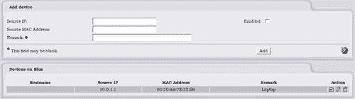

**源 IP**和**源 MAC 地址**填充了允许从该接口访问网络的计算机的信息，当勾选了**Enabled**复选框时，将只允许与列表匹配的计算机访问任何网络资源。 蓝色上的**设备列表中的计算机是那些已被允许访问的计算机。**

## 日志发送

LogSend 是一个插件，允许我们将日志从 IPCop 机器发送给各种管理员和/或 DShield 服务。 这很有用，因为它允许使用外部工具对日志进行更深入的分析，而无需配置系统日志服务器。

日志发送网页位于：[http://firewalladdons.sourceforge.net/logsend.html](http://firewalladdons.sourceforge.net/logsend.html)。

撰写本文时使用的当前版本是：[http://heanet.dl.sourceforge.net/sourceforge/firewalladdons/Logsend-1.0-GUI-b3.tar.gz](http://heanet.dl.sourceforge.net/sourceforge/firewalladdons/Logsend-1.0-GUI-b3.tar.gz)。

通过单击**日志|LogSend**可访问**LogSend Configuration**页面。

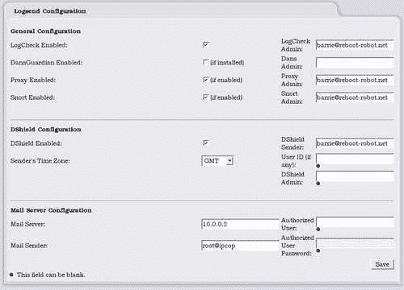

**LogCheck**的配置相对简单；我们可以选择启用该服务，启用**DansGuardian**(由 Cop+Addon 提供)日志、**Proxy**日志和**Snort**日志的邮寄。 每一封邮件都可以发送给不同的管理员，但如上图所示，在每封邮件中使用相同的电子邮件地址是非常常见的。

### 备注

**DShield**

**DShield**选项可能需要一些解释。 DShield([http://www.dshield.org](http://www.dshield.org))是一项经过 SANS(系统管理、网络和安全研究所：[http://www.sans.org](http://www.sans.org))验证的服务。 它整理和分析来自世界各地数千个系统的日志，以便获得有关最常见的攻击端口和最严重的攻击 IP 地址的详细信息。 这是为了让系统管理员能够随时了解 Internet 的当前状态。 发送到 DShield 的任何日志都将添加到此数据库中，如果我们注册了 DShield 帐户(发送日志不需要)，我们还可以使用其在线分析工具来监控来自我们自己的入侵防护系统的数据。

LogSend 中的 DShield 配置功能可以方便地使用 DShield 服务，以便我们可以发送日志。 所有需要做的就是启用 DShield，并设置发送日志时使用的时区和回复电子邮件地址。 如果我们还提供了用户 ID，我们可以确保日志属于我们的帐户，并在 DShield Web 界面上提供给我们。 **DShield Administrator**是所有日志信息将被发送到的地址。

我们还有熟悉的邮件服务器选项，我们可以在其中提供要使用的邮件服务器、发件人和所需的任何身份验证凭据。 我们已经在 IPCop 的其他领域看到了这些选项。

## Copfilter

Copfilter 将 IPCop 从防火墙扩展到类似于赛门铁克和 MacAfee 提供的安全设备，这两家公司试图保护我们的网络免受各种恶意软件的攻击。 Copfilter 将监控 Web、FTP 和电子邮件流量，以检测并阻止它在数据中发现的恶意软件。

Copfilter 网页为：[http://www.copfilter.org](http://www.copfilter.org)。

撰写本文时使用的版本是：[http://heanet.dl.sourceforge.net/sourceforge/copfilter/copfilter-0.82.tgz](http://heanet.dl.sourceforge.net/sourceforge/copfilter/copfilter-0.82.tgz)。

Copfilter 安装是直接完成的，而不是通过插件界面。 它的安装方式与防火墙插件服务器的安装方式大致相同。

```sh
$ scp -P 222 copfilter-0.82.tgz root@10.0.0.200:/ # provide password
$ ssh -p 222 root@10.0.0.200 # provide password
# cd /
# tar xzvf copfilter-0.82.tgz
# cd copfilter-0.82
# ./install 

```

然后，我们应该看到以下输出：

```sh
============================================================
Copfilter installation -- Version 0.82
============================================================
WARNING:
This package is NOT an official ipcop addon. It has not been approved
or reviewed by the ipcop development team. It comes with NO warranty or
guarantee, so use it at your own risk.
This package adds firewall rules, proxies, filters, virus scanners
and precompiled binaries to your ipcop machine,
Do NOT use Copfilter if firewall security is an issue
Continue ? [y/N] 

```

它会给我们一个警告：安装 Copfilter 会重新配置防火墙，可能会改变防火墙的某些功能，从而可能会降低安全性。

### 备注

**复杂性和安全性**

这带来了我们在安装插件时应该考虑的重要一点。 我们在防火墙中添加的代码和功能越多，出错的可能性就越大。 软件缺陷会导致崩溃，更重要的是会危及安全。 在我们用各种插件填充系统之前，一定要权衡一个特性给出的值与系统中有额外代码的潜在风险。

现在应该安装 Copfilter 了，我们会看到几条消息在它自己设置时滚动过去。 完全安装 Copfilter 后，我们应该看到以下消息：

```sh
Copfilter 0.82 installation completed successfully ! 

```

如果我们现在登录 Web 界面，应该会看到 IPCop 配置站点添加了新的菜单选项。 我们将在接下来的几个部分中看看它们。


### 状态

**Status**屏幕给出了与 Copfilter 一起安装的工具的信息(这是一个简单软件包中的另一个强大工具集合！)。 您可以在这里启动和停止所有服务。 通过单击**病毒隔离区**和**垃圾邮件隔离区**按钮，您可以查看扫描软件保存在那里的项目。

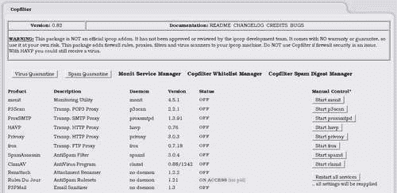

**Monit：**使我们能够比 IPCop 提供的基本状态信息更详细地监控系统，并将服务管理作为一项重要的附加功能([http://www.tildeslash.com/monit/](http://www.tildeslash.com/monit/))。

**p3Scan：**电子邮件代理服务器(**pop3**)扫描电子邮件中的恶意软件([http://p3scan.sourceforge.net/](http://p3scan.sourceforge.net/))。

**ProxySMTP：**类似于**p3scan**，但用于扫描 SMTP。

**havp：**http 代理，允许扫描网站是否有恶意软件([http://www.server-side.de/](http://www.server-side.de/))。

**Privoxy：**另一个 HTTP 代理，它更关注隐私和广告([http://www.privoxy.org](http://www.privoxy.org))。

**FROX：**透明 FTP 代理，允许针对 FTP 协议([http://frox.sourceforge.net](http://frox.sourceforge.net))提供类似于**HAVP**和**Privoxy**的功能。

**Spamassassin：**极其强大且可定制的反垃圾邮件软件。 这是 ISP 最常用的反垃圾邮件解决方案之一([http://spamassassin.apache.org/](http://spamassassin.apache.org/))。

**ClamAV：**防病毒软件，与其他一些软件配合使用，以提供病毒扫描引擎([http://www.clamav.net/](http://www.clamav.net/))。

**RenAttach：**识别和重命名危险电子邮件附件(如 `.exe, .bat`和 `.pif`)的脚本，以防止用户意外或无意地打开危险文件([http://freshmeat.net/projects/renattach/](http://freshmeat.net/projects/renattach/))。

**当日规则：**用于使 SpamAssassin 规则保持最新([http://www.exit0.us/index.php?pagename=RulesDuJour](http://www.exit0.us/index.php?pagename=RulesDuJour))。

**P3PMail：**的行为类似于前面提到的 p3Scan；但是它会检测到电子邮件中的危险超文本标记语言并将其删除([http://www.exit0.us/index.php?pagename=RulesDuJour](http://www.exit0.us/index.php?pagename=RulesDuJour))。

### 电子邮件

我们希望在本书中启用所有服务，但如果现在尝试这样做，许多服务将失败，因为我们尚未配置电子邮件设置。 如果我们点击**Copfilter|Email**，我们将看到熟悉的**Email**选项屏幕，我们可以相应地填写该屏幕。

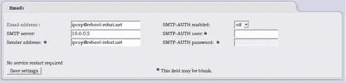

填写此信息后，我们可以开始启用和配置服务。

### 监控

**monit**非常容易设置(在 Copfilter 中)，并且是一个相当强大和可靠的工具。 如**监控**屏幕(单击**Copfilter|监控**)所示，**Monit**将持续监控正在运行的服务，并将在 60 秒内重新启动任何失败的服务。 手动停止服务将导致关闭对该服务的监视。 要重新打开对所有服务的监控，需要重新启动**monit**本身。

我们可以在此配置窗口中打开**MONIT**。 我们现在应该打开它，以便可以监控其他服务，所以在下拉框中选择上的**，然后单击**Save**按钮。**

### POP3 过滤

POP3 是一种常用的邮件协议，用于接收邮件。 如果我们有用户从 ISP 的邮件服务器下载电子邮件，那么我们可以配置此屏幕来过滤任何通过 POP3 传入的邮件，并根据我们的需要进行调整。


我们应该小心隔离电子邮件或附件，因为这会很快开始填满我们硬盘上的空间。 如果我们配置了一台低规格的机器作为 IPCop 盒，那么我们可能会遇到硬盘空间问题。 如果开始出现问题，只需备份 IPCop 配置并在更大的硬盘上重新安装即可。

如上图所示配置此屏幕，然后按**保存设置(并重新启动服务)**按钮。 这将启用 POP3 扫描。 通知将发送到我们之前在电子邮件屏幕中配置的电子邮件地址。

### SMTP 过滤

乍一看，该页面与 POP3 页面相同，但带有 SMTP 斜面(对于我们在这里的使用，它的配置应该是相同的)。 然而，当我们向下滚动时，我们看到：


这为我们提供了一些附加选项，这些选项主要与我们网络上的电子邮件服务器相关。 我们在前面讨论了在 DMZ 中使用 DMZ 和使用 Orange 网络的 IPCop。 如果我们的电子邮件服务器位于 DMZ 中，我们可以将端口 25(或特定 IP 上的端口 25)配置为转发到我们的电子邮件服务器。 由于这是 SMTP 筛选部分而不是端口转发部分，因此我们还可以在电子邮件接近我们的服务器之前过滤通过系统的所有电子邮件。 这使我们能够保护 DMZ 中的机器免受攻击，并随后保护我们的用户，因为充满恶意软件的电子邮件永远不会触及他们的收件箱！

显示的配置选项是相当合理的级别，除非我们需要列入白名单或有特定的隔离要求。

### HTTP 过滤器(和 FTP)

HTTP 筛选器是 Copfilter 最耗费资源的功能之一，主要是因为 HTTP 流量涉及大文件和相当详细的扫描，而且 HTTP 是大多数网络上使用的最流行的协议之一。

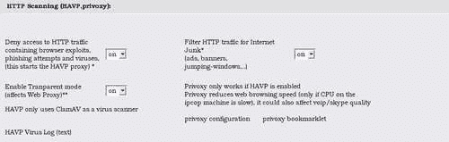

通常，将 HTTP 代理配置为透明是个好主意，因为这不需要重新配置客户端计算机。 如此屏幕所示，如果防火墙变得非常繁忙，这可能会对通过防火墙的应用产生不利影响。 除非 IPCop 机器非常强大，否则在繁忙的网络上使用 HTTP 过滤可能不是一个好主意。 如果您在使用 Internet 时遇到速度慢的问题，请将禁用 HTTP 过滤作为初始故障排除步骤之一。

FTP 过滤器设置非常简单，只需要从关闭切换到打开。 它的工作方式与透明 HTTP 筛选器大致相同。 FTP 过滤器不太常用，因为它是一种比 HTTP 不太流行的协议，而且现在还有许多其他文件传输方法比 FTP 更流行。

### 反垃圾邮件

除了与恶意软件作斗争外，我们每天还要与大量垃圾邮件作斗争，这些垃圾邮件每天都会登陆我们的邮箱。 幸运的是，垃圾邮件的 Copfilter 选项相对简单。

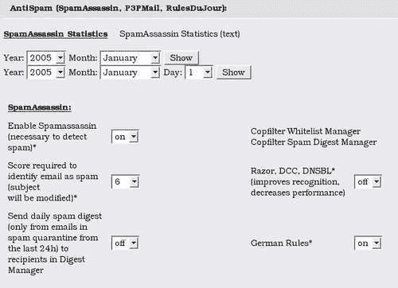

启用后，我们可以配置将电子邮件视为垃圾邮件的分数。 每封邮件都会被检查各种类似垃圾邮件的特征；它的特征越多，得分就越高。 如果我们将这个阈值设置得太高，那么我们就会允许一些垃圾邮件通过，如果我们把它设置得太低，我们就会增加误报的可能性。 默认设置运行得非常好，除非有大量垃圾邮件通过，否则应该使用。 我们还可以在此页面上配置贝叶斯过滤。 然而，这可能会非常耗费资源，而且不推荐在同时提供许多其他功能的设备上使用。 启用**德语规则将阻止德语垃圾邮件通过过滤器；这是因为发送的德语垃圾邮件数量大幅增加。 **Razor、DCC、DNSBL**的选项启用基于已知垃圾邮件站点数据库的拦截，这些站点可能相当大，正如配置屏幕上指出的那样，它们可能会降低性能。**

 **### 杀毒软件

在 Linux 系统上，ClamAV 通常用作病毒扫描程序。 然而，它涵盖了来自各种操作系统的病毒，显然它最大的签名数据库与 Windows 平台有关。 因此，它非常适合保护网络上的 Windows 客户端免受病毒攻击。 ClamAV 用作 Copfilter 中其他工具的扫描引擎，因此在我们访问它时已经启用，因为其他服务正在使用它。


我们可能希望在应用自动更新时进行调整，并执行 ClamAV 的手动更新，尤其是在安装后不久。 我们还可以从此菜单向 `renattach`配置文件添加其他文件扩展名，如 WMF。 这些文件将被重命名，以使其扩展名不会通过双击自动执行。

### 备注

**WMF 和媒体文件漏洞**

最近，Microsoft Windows 中存在一个非常严重且广为人知的漏洞，如果用户查看 WMF 格式的图像，就可能利用此漏洞。 这突出了一个经常被忽视的事实，即不仅仅是可执行文件可以包含可执行代码。

### 测试和日志

Copfilter 插件有自己的日志区域，遗憾的是，它没有像其他插件那样在**logs**菜单中添加选项。 在这方面，我们可以查看和下载各种格式的各种日志；但是，这些日志数量太多，无法保证在本文中进行报道。 这些日志相对容易阅读和理解，前面提到的项目网站上的文档将提供有关这些项目的更多信息。

这里的另外三个重要功能是测试按钮。

*   **发送测试病毒电子邮件：**此按钮发送带有 EICAR 测试病毒的电子邮件。

### 备注

**EICAR**

EICAR 是所有防病毒软件都能识别的测试病毒定义。 它被用作校准工具，以确保我们的防病毒解决方案工作正常，而不必通过我们的网络发送病毒。

[http：//www.eicar.org/anti_virus_test_file.htm](http://www.eicar.org/anti_virus_test_file.htm)

*   **发送测试垃圾邮件：**发送垃圾邮件过滤器应将其作为垃圾邮件接收的电子邮件。

*   **发送测试电子邮件+DANG。 附件：**通过电子邮件发送危险附件，以测试重附加功能。

在信任具有网络资源保护的设置之前，运行这些测试中的每一个测试，也许还需要手动运行几次，以便通过筛选器发送测试，这一点很重要。

## 启动并运行！

如果我们现在查看状态屏幕，我们应该会看到所有服务都已启动，并且正在被监视和控制。


# 摘要

我们已经看到，IPCop 不仅仅是一个简单的 NAT 防火墙。 它可以处理多个网络区域，并独立处理每个网络区域。 我们可以真正控制这些网段如何相互通信。 防火墙可以做的不仅仅是过滤--它可以控制、监控和报告网络状态，让我们能够很好地全面了解网络的运行情况，而 IPCop 可以满足这些要求。

我们还将 IPCop 视为类似于许多供应商昂贵的商业产品的网络设备。 在这方面，IPCop 可以通过一些应用层或第七层过滤来处理高级防火墙。 我们在前面讨论了这一点以及 IPCop 的第七层缺点。 现在我们来看看如何解决这个问题和其他任何问题，以创建一个真正有用和强大的外围设备。

我们查看了 IPCop 可用的各种插件，并相当详细地了解了一些最常用的插件和可用的有用选项。 我们已经看到了使用开放源码软件(如 IPCop)的一些直接好处，因为它具有简单的可扩展性或“*可破解性*”。 我们介绍了 SquidGuard 的一些高级代理选项及其在 IPCop 上的使用。 我们还研究了 Copfilter--最流行的 IPCop 插件之一--它过滤了许多常见的协议，以过滤恶意软件和其他不受欢迎的流量。 然而，我们只是触及了 IPCop 插件的皮毛，因为还有更多。 从在 IPCop 上安装 Nmap 到 SETI 客户端，应有尽有！ 有必要研究一下可用的选项，因为这里提供的这些选项仅用于概述常见的应用。**