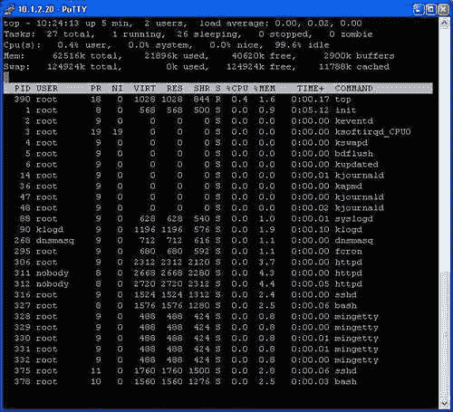
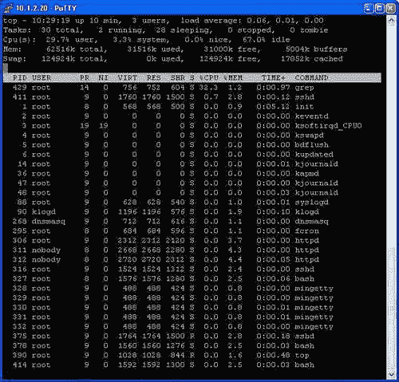
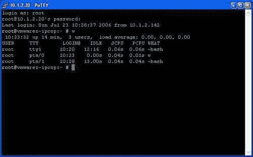

# 十、测试、审核和强化 IPCop

在本章中，我们将研究对安全和修补程序管理的一些常见态度，并讨论如何在 IPCop 上下文中处理这些主题。 我们还将讨论一些常见的安全风险、一些常见的安全和审计工具以及测试，并找出下一步的方向。

# 安全和补丁管理

非常宽松地说，安全是指将我们的系统保持在这样一种状态的过程，即它们被认为是不切实际的，或者在这种状态下，使这些系统保持运行所涉及的漏洞和风险得到了解、管理、补偿或接受。 与公认的智慧(对某些人来说，还有直觉)相反，根本没有安全系统这回事。

安全界有一句使用得很好的格言，“*安全是一段旅程，而不是目的地*。”

世界上最好的安全顾问、程序员或 IT 专业人员只能在他或她所使用的硬件和软件允许的范围内保护计算机系统。 即使是完美设置的安全软件包的教科书部署，也存在应用程序组件、操作系统组件或硬件可能出现故障或出现危及系统安全性的故障的风险。 软件故障可以做很多事情--它可能使入侵者获取信息，导致系统运行不正常，甚至获得对该系统的控制。

仅向攻击者提供信息的相对无害的故障可能会为他或她提供进一步研究该计算机系统上运行的软件中的其他缺陷所需的信息-导致进一步的危害，可能导致对系统的控制。

此外，无论任何供应商、专业人士或开发人员告诉您什么，*都没有*解决方案，无论是一个闪亮的新软件、一个闪亮的新硬件、一个破旧的老安全专家，还是一个聪明的配置更改，都可以解决您的所有安全问题。 它们(可以)全部加在一起，但*没有什么灵丹妙药*。

我们所能做的就是牢记这些原则，将我们的环境分层，这样我们就不会在任何可能的情况下依赖任何一种安全措施，从而使损害是有限的。 实际上，在较大的组织中使用类似于 IPCop 的防火墙来隔离不同的网络和子网正是出于这个原因。

确保我们的系统尽可能安全的过程有两个重要的组成部分，我们在这里关注的就是这两个组成部分。

第一个，也是最基本的，是保持我们系统上运行的软件是最新的。 如果我们运行的软件已过时并因此存在漏洞，那么全面的防火墙策略、出色的权限集和强大的密码集几乎毫无价值。 虽然我们使用的大多数软件包中可能存在尚未发现的安全漏洞，但如果我们(和软件开发人员)不知道它们在那里，入侵者确实存在的可能性也会降低。 如果开发者知道这个漏洞(更糟糕的是，如果它打了补丁)，我们应该自动假设任何想要侵入我们系统的攻击者也知道这个漏洞。 未打补丁的系统比打补丁的系统更难保护。

第二步，也是更困难的一步，是**系统硬化**的过程。 这可能涉及许多步骤，从更改归档系统权限和设置防火墙策略，到使用入侵防御系统、物理安全措施(如锁和闭路电视)包围我们的系统，甚至进行定期备份(能够及时回溯并检查我们的系统外观，对于分析我们认为可能受到威胁的系统通常至关重要)。

## 为什么我们应该关注

对于一些读者来说，这个主题可能看起来相当明显，而对于习惯于从不同的角度思考 IT 和一般计算机的其他读者来说，情况可能并非如此。 根据作者的经验，非常有能力的经理、IT 专业人员和计算机科学家经常不知道计算机可能被滥用，这种滥用会造成多大的破坏，以及这些事情是多么容易实现。

然而，暂时不考虑这种误解，有许多善意的经理、家庭用户和 IT 专业人士确实理解计算机可以被破解，并意识到他们可以做更多的事情来保护他们的系统。 这催生了一个广为流传的最伟大的神话之一，这一观点经常被各种规模的组织中有很大影响力的人非常坚定地持有。 对于任何重视自己赚钱能力并使用计算机赚钱的组织(如今几乎每个人都是这样)，或者任何家庭用户使用他或她的 PC 做会计、网上银行或网上购物等事情，这都是*错误的*观点。 这种“*为什么有人要这样对我们？*”的谬论是基于这样一个前提，即对计算机的唯一威胁是确定攻击者根据他们的身份专门选择公司，而作为家庭用户、小企业或乏味的制造公司，任何人都是免疫的。

当然，病毒、蠕虫、广告软件和间谍软件-安全和 IT 专业人员正在处理的四个最常见的问题-与公司成为目标无关，一些需要处理的最大(也是最昂贵的)事件会因为入侵者利用公司的系统作为跳板侵入其他公司的行为而导致形象受损或法律责任受损。 对于信用卡被盗、身份被盗或因有人滥用在线拍卖账户而负有法律责任的家庭用户来说，这样的问题可能是毁灭性的。

对 Web 上有关灾难恢复的众多论文进行快速调查后，会一次又一次地发现同一统计数据的不同版本--*X%的公司经历了 Y 天的停机时间无法从*[*灾难*]中恢复过来。 X 和 Y 因纸张不同而不同，但 X 总是两位数，Y 是单位数。 仅此一点就应该成为保护你的系统不受入侵者攻击的理由，入侵者可能会抹去你的数据，摧毁你做生意的能力--无论你的生意是经营一家实际的公司，还是仅仅是能够为你报税。

所有这些都假设我们没有监管要求-探索 ISO 17799 等标准远远超出了我们的范围，而且许多法规和标准(包括 ISO 17799)包括关于业务连续性和灾难恢复规划的规定。

事实上，你有这本书，而且你正在阅读这一章的这一节，这可能意味着这篇经文是对皈依者的说教，但至少-希望-如果你遇到任何还没有皈依的人，你可能会有一些有用的观点！

## 设备以及这对我们的 IPCop 管理有何影响

现在，我们已经简要地探讨了安全和灾难恢复的概念，现在我们可以继续讨论这实际上如何影响我们对 IPCop 的持续管理和安全。 冒险进入 IT 领域的另一个常见故障，防火墙(与打印机、交换机和路由器等联网设备并驾齐驱)是目前最不受关注的设备之一。 大多数中小型企业根本不对这些设备执行任何常规管理，经常会留下可能暴露在 Internet 上的交换机和路由器，其上运行的软件版本可能充满漏洞，可供入侵者利用！ **简单网络管理协议**(**SNMP**)等服务通常允许入侵者简单而安静地完全控制设备(有时比通过设备的 Web 配置界面更强大)。这些服务在许多设备上都附带了公共/私有的默认社区字符串(作用类似于密码)。

另一个助长这种忽视的常见偏见是，因为一台设备不是 PC，也没有屏幕、键盘或鼠标，所以它就不是一台计算机，不需要更新。 互联网的广泛用户基础，以及设计用于路由器、防火墙等的产品数量，都对此无济于事。

*设备*，即不是计算机的计算机，对此有很强的影响。 *广义地说，设备*是设计为在没有*正常*、以软件为中心的服务器所需的管理和更新的情况下运行的计算机。 不幸的是，这些设备中的许多都基于类似于非设备设备的软件，尽管设备通常比为执行相同工作而设置的同等服务器更严格地锁定和保护，但它们也不能免除类似的安全问题。

我们的 IPCop 系统设计为类似于家用电器的操作方式。 它完全是由一组个人(IPCop 团队)设计和更新的，它在 PC 上运行，并且基于为提供非常具体的功能(并且几乎不暴露操作系统的操作)而量身定做的普通操作系统-所以在某种程度上我们需要将其作为一个整体来对待。 我们(与任何设备一样)仍然应该通过固件更新我们的系统，如果我们希望防火墙继续运行(和可支持)，我们仍然必须避免过多地窥探防火墙的工作，但了解幕后的情况以及它的工作方式对我们保护 IPCop 非常有益。

# 基本防火墙加固

首先，我们需要考虑 IPCop 在外界看来是什么样子。 任何黑客、渗透测试员、IT 专业人员或分析师在评估特定设备构成的威胁时(无论他们打算修复该设备还是通过该设备入侵)采取的第一步是分析该设备，以便找出以下一些情况：

*   设备是什么？

*   它运行的是什么操作系统

*   它可能运行在哪种硬件上

*   服务器正在运行什么服务，因此可以推断...

*   除基本操作系统外，服务器还运行哪些软件(服务

*   以上任何一项(特别是服务)是否不安全

作为 IPCop 系统的合法审核员、管理者和维护者，我们可以通过内存、文档或登录主机本身获得其中的大部分内容。 对于这些信息极其有价值的攻击者来说，情况并非如此，因此我们有必要了解入侵者是如何收集这些信息的，以防止他或她这样做。

## 检查我们的防火墙对客户端的暴露情况

要评估我们的 IPCop 盒从外部看起来是什么样子，最基本的工具是端口扫描仪。 正如我们在本书前面应该知道的那样，服务器可以打开任意数量的端口，以便允许用户连接到它运行的服务。 我们还应该知道，默认情况下，IPCop 可能至少有一个端口向内部客户端开放-端口 445，这是 HTTPS 通过 Web 界面进行配置的端口。 简单地说，端口扫描器尝试连接到许多不同的端口，并查看从哪些端口收到回复，从而将这些端口定义为打开(即，另一端发生了一些事情)。

端口扫描是在基础设施(如防火墙)上执行的一项重要操作，作为安全审计或定期检查的一部分，原因有几个。 其中最值得注意的是，我们可能并不总是知道我们的服务器在运行什么。 我们可以通过在 Shell 上使用 `netstat`命令或通过 Web 界面查看防火墙认为已打开的端口的列表。 但是，如果我们扫描服务器是因为我们认为恶意入侵者可能出于恶意目的在我们的防火墙上安装了软件，则该软件具有开放端口(例如，允许入侵者重新连接并通过后门获得访问权限)的事实可能对 `netstat`命令和操作系统本身的某些部分隐藏起来。

在这种情况下独立扫描系统是检测此类活动的为数不多的方法之一，因此，如果您认真考虑安全问题，养成定期扫描系统的习惯是很好的；您再谨慎也不为过。

### 备注

**通过互联网进行端口扫描**

许多互联网服务提供商对通过其网络进行端口扫描有相当严格的政策，并会将任何此类活动视为非法活动，即使端口扫描您自己的服务器没有任何违法之处(许多人认为对不是您自己的系统进行端口扫描是一个法律灰色地带，尽管它本身越来越被视为犯罪活动)。 许多更合理的 ISP 会区分端口扫描您自己的系统(显然是您同意这样做)和其他系统的端口扫描。 不过，有些人更具判断力(有些人会使用狭隘这个词！)。

密集扫描通过 ISP 网络的此类活动的所有流量是非常耗费资源的，而且由于所需费用的原因，ISP 很少会对不发往其服务器(或通常是高价值系统)的流量执行此操作。 然而，在您考虑这样做之前，检查您的 ISP 的条款和条件以及可接受的使用政策是值得的，这样做会给您带来不便或责任的风险！ 这些信息几乎总是可以在 ISP 的网站上找到，或者根据需要从 ISP 那里获得。

例如，BT(英国电信)宽带服务的 AUP(可在[http://www.abuse-guidance.com/](http://www.abuse-guidance.com/)上获得)说明以下有关端口扫描的内容：

除非事先获得远程计算机或网络的管理员或所有者的明确许可，否则您*不得运行访问远程计算机或网络的*“端口*扫描”软件。这包括使用能够扫描其他 Internet 用户的端口的应用程序。[…]*

*如果您打算运行端口扫描应用程序，则必须向 BT 提供一份从扫描目标收到的授权该活动的书面同意书副本。 在应用程序运行之前，必须将其提供给 BT。“*

这与大多数互联网服务提供商发布的 AUP 类型非常相似，尽管有点官僚作风。

使用扫描仪 Nmap 的示例扫描可能如下所示：

```sh
james@horus: ~ $ sudo nmap 10.10.2.32 -T Insane -O
Starting nmap 3.81 ( http://www.insecure.org/nmap/ ) at 2006-05-02 21:36 BST
Interesting ports on 10.10.2.32:
(The 1662 ports scanned but not shown below are in state: closed)
PORT STATE SERVICE
22/tcp open ssh
MAC Address: 00:30:AB:19:23:A9 (Delta Networks)
Device type: general purpose
Running: Linux 2.4.X|2.5.X|2.6.X
OS details: Linux 2.4.18 - 2.6.7
Uptime 0.034 days (since Tue May 2 20:47:15 2006)
Nmap finished: 1 IP address (1 host up) scanned in 8.364 seconds

```

正如我们在此扫描中看到的，Nmap 版本 3.81 扫描的 1663 个默认端口中有一个端口是开放端口 22，即运行 SSH 的端口。 由于这是一台无防火墙的 Linux 主机，nmap 还可以检测系统的正常运行时间(使用 TCPtimeStamp，RFC1323，[http://www.faqs.org/rfcs/rfc1323.html](http://www.faqs.org/rfcs/rfc1323.html))。 我们还可以猜测机器上次重新启动的时间，并根据机器在扫描过程中对 Nmap 发送给它的各种非标准数据包的响应方式的特点，Nmap 在主机上执行**操作系统指纹**(通过使用 `-O`标志请求)，准确度相当高。

NMAP 是一个极其强大的工具，也是地球上最常用的 IT 安全工具之一。 (新重写的)手册页面(man nmap，或来自网站-[http://www.insecure.org/nmap/man/](http://www.insecure.org/nmap/man/))不仅提供了有关如何使用该工具的详细信息，而且还介绍了它的工作原理和原因。

您可能想要尝试的其他扫描程序，特别是在 Windows 平台上(在 Windows 平台上安装 nmap 有点麻烦，而且经常被服务包和修补程序阻止)包括 SuperScan([http://www.foundstone.com/index.htm?subnav=resources/navigation.htm&subcontent=/Resources/proddesc/superscan.htm](http://www.foundstone.com/index.htm?subnav=resources/navigation.htm&subcontent=/resources/proddesc/superscan.htm))。

从内部网络查看 IPCop 防火墙的默认配置(即，如果您从绿色区域通过端口扫描服务器，或者如果连接到公司网络的员工、孩子或客户端扫描防火墙)，端口 445 是我们将看到的唯一打开的端口。

然而，许多端口扫描器(包括 NMAP)并不扫描服务器上可能连接到的每个端口，正如我们从前面的 Scan-Nmap 扫描 1663*常用的*端口默认看到的那样。 这样做有两个原因：第一，我们发送(和接收)的数据越少，扫描速度就越快；第二，我们发送和接收的数据越多，扫描就越有可能引起怀疑(或导致网络问题)-希望 Nmap 这样的工具的合法用户不会担心！

因此，由于通常只扫描众所周知的端口，因此我们有一个已经执行的强化的实际示例-将端口从 443 更改为 445(这不是公共服务端口)。 这可能是“通过模糊实现安全”，但*不是坏事--除了*使到此端口的任何连接变得更加明显之外(它们必须来自故意的连接尝试，而不是意外的浏览或通过 HTTPS 影响 HTTP 服务器的自动蠕虫)，它确实会降低入侵者(微妙的)网络侦察的有效性。

*然后，端口扫描*使我们能够从内部网络确定*哪些服务正在我们的防火墙*上运行。

外部呢？ 那么，端口扫描在这里也同样有价值(如果不是更有价值的话)。

通过外部端口扫描，我们可以测试在防火墙外部接口上被互联网视为打开的端口是否与我们在防火墙外部打开的任何转发端口或漏洞相对应。 出于与内部端口扫描主机相同的原因，这是主动安全策略的重要端口。

虽然我们可以通过 IPCop GUI 检查允许哪些端口进入我们的网络，但端口扫描是另一种我们可以验证端口转发是否转发到适当位置的方法。 我们已转发到网络内主机的端口，以及未在端口扫描中显示(已过滤)的端口，也可以通过这种方式进行识别；虽然我们可以在 Web 界面中查看哪些端口被转发，但我们无法验证这些端口是否被转发到任何地方。 在我们不知道所有转发端口的大型环境中，这可能是识别防火墙中不需要的漏洞(我们可以删除)的一种方法。

一些网站，如 Sygate‘s([http://scan.sygatetech.com/](http://scan.sygatetech.com/))会自动(免费)对您的主机进行端口扫描，并通过网络向您显示结果。 如果您的 ISP 受到限制，或者您没有另一台直接连接到 Internet 的计算机进行扫描，这将非常有用！

## 我们的防火墙上运行的是什么？

除了审核我们的防火墙以查看它正在监听哪些端口之外，我们还可以例行地审核它，以便识别哪些进程正在防火墙上运行。 有几个包可以帮助我们做到这一点。

最简单地说，可以使用诸如 `ps`命令之类的 binutils 来确定我们的系统正在做什么，该命令列出了在系统上运行的进程。 这里还可以使用 `top`命令，该命令实时显示进程，并可用于监视系统上的进程(例如，监视不可预测的进程并找出导致性能低下的原因)。

但是， `ps`命令并不适用于这些情况。 其主要原因是：入侵者很容易将 `ps`命令替换为不显示恶意进程的版本(为入侵者执行此类任务的工具集合通常称为**rootkit**)。 另一个原因是比较 `ps`输出相当耗时，这需要对系统上的进程有相对详细的了解(许多恶意进程可能伪装成合法进程，即使 `ps`输出没有被直接更改)。

幸运的是，我们可以使用许多其他应用程序来防止和检测我们的系统被篡改的情况。 其中第一个是 Tripwire([http://sourceforge.net/projects/tripwire](http://sourceforge.net/projects/tripwire))，也是 unix 和 linux 系统上使用的较老的工具之一。 Tripwire 是一种主机入侵检测系统(HIDS)，是一种应用程序，它将监视系统上的特定文件(如 `ps`等系统二进制文件和配置文件)。 Tripwire 不会实时监控，而是试图在行为发生后检测到这种变化。 Tripwire 可以提醒我们注意这些事件，无论是出于安全目的还是出于其他目的(例如变更管理或只是正常 IT 流程的一部分)。

Tripwire 是一个开源工具，可以作为 IPCop 的一个插件使用。

这些场景的另一个有用工具是 chkrootkit([http://www.chkrootkit.org/](http://www.chkrootkit.org/))。 与 Tripwire 类似，chkrootkit 检查系统上的文件，但 chkrootkit 是应用户请求启动的脚本，专门扫描被识别为恶意的文件。 虽然定期运行验证过程很有用，但预防胜过治疗这句古老的格言仍然适用，负扫描绝不意味着系统是清晰的。 由于 chkrootkit 是一个脚本，您可以使用 `wget`命令下载该脚本，或者在命令提示符下使用 `scp`([http://www-hep2.fzu.cz/computing/adm/scp.html](http://www-hep2.fzu.cz/computing/adm/scp.html))将其上传到您的服务器，然后在服务器上直接运行新下载的副本。

### 备注

**SCP**

SCP 或安全复制是 IPCop 附带的 SSH 服务器/客户端功能的子集。 在 unix/linux 命令提示符下使用 `scp`命令，或者在 Windows 上使用 WinSCP([IPCop](http://winscp.sourceforge.net))之类的工具，您可以访问 http://winscp.sourceforge.net 系统上的文件系统并远程操作文件系统。 尽管 `scp`非常有用，但它很容易出于恶意目的进行操作，因此，应该小心地保护 shell 访问。

# 高级硬化

至此，我们意识到可以对 IPCop 的操作和设置进行两大更改，以使其更加安全。 第一，审计开放端口，使我们能够减少防火墙和系统对互联网的暴露。 第二，利用某种形式的入侵检测或事后扫描系统，如 Tripwire 和 chkrootkit，让我们有更高的机会检测到任何碰巧突破我们防御的人。

然而，强化我们的主机比简单地安装一项服务或运行一些端口扫描软件要全面得多。 维护一个坚固的系统包括删除我们不需要的任何功能，以及对我们系统的安全性进行深思熟虑的更改。 IPCop 在这方面已经相当强大，这使得它比任何主要发行版的默认 Linux 安装都要安全得多。 为使 IPCop 更安全而采取的一些步骤包括以下几个步骤。

## ©粉碎烟囱保护器(警察)

**Stack-Smash Protector**(**SSP**)([http://www.research.ibm.com/trl/projects/security/ssp/](http://www.research.ibm.com/trl/projects/security/ssp/))是 IBMIPCop 编译器的补丁集，用于创建构成 IPCop 和许多其他开源应用程序软件的二进制可执行文件，由 IBMHiroaki Etoh 开发。 SSP 有助于保护操作*堆栈*的计算机软件中的利用漏洞，堆栈是向其中添加和删除数据的区域，例如缓冲区溢出攻击。

在**缓冲区溢出**攻击中，攻击者可以利用软件中的缺陷将数据写入与分配给该数据的内存区域(如堆或堆栈)相邻的内存区域。 当这种情况存在时，可能会编写恶意应用程序，以便允许攻击者在系统上运行他或她自己的(恶意)代码，这通常会损害安全性。

SSP 通过验证堆栈是否未更改来保护堆栈免受攻击，并使出现这种情况的任何应用程序出现**分段错误**，然后退出。 因此，使用此功能编译的 IPCop 上的所有软件都提供了一些保护，以抵御通常用于攻击系统的某些类型的攻击。

## 服务强化

默认情况下，IPCop 删除了不必要的服务-许多操作系统(包括广泛部署的 Linux 版本和较早版本的 Windows 操作系统)运行许多对正常操作不必要的服务。 常见的示例包括 Web 服务器(如 Windows 上的 IIS 服务器和 Apache 服务器在 Windows 或 Linux 上)，或者进程(如 Finger、nfs、portmap、telnet 等)，它们在大多数部署中都不使用。

由于这些进程中的每个进程都存在被用来侵入系统的漏洞利用风险，例如缓冲区溢出，因此每个被消除的服务都会关闭另一扇门，以防止潜在的入侵。 入侵可能不同，从 2001 年的 Code Red 蠕虫(利用 IIS Web 服务器中的缓冲区溢出)或 2002 年的 Srapper 蠕虫(利用 OpenSSL 握手过程中的缓冲区溢出危害 Apache Web 服务器)，一直到恶意入侵者进行更精确的攻击。

如果我们不需要 IPCop 附带的 SSH 或 Squid 等服务，或者不需要通过插件安装的服务，则最佳做法是不启用它们，最好将它们从系统中完全删除。 虽然像 SSH 和 Apache 这样的通常暴露在 Internet 上的服务比不经常暴露的服务(如 Squid)风险更小，但任何不需要的服务都理所当然地应该被删除。

# 日志文件和监控使用

作为良好安全管理的一部分，重要的是要保持注意信息系统行为和使用趋势的能力，这使我们能够主动注意变化。 代理服务器的使用情况、内存使用情况或 CPU 负载的变化可能表示一些无害的情况，例如用户活动增加或需要升级硬件、硬件故障，甚至是恶意活动。

## 用图表建立基线

因此，重要的是为我们的服务器如何行为建立一个*基线*，以便能够识别特定行为何时异常。 IPCop 为我们提供了监控(和绘图)代理连接和 CPU 使用等统计数据的图形化工具，从而极大地帮助了我们。 对于您的主机的安全来说，定期查看这些内容并说明任何重大的闪点或行为变化是很重要的。

作者已经意识到几种情况，在这些情况下，系统被破坏并被用于恶意目的，并且在系统上游的路由器上的通信量监控显示通信量上升。 随后的调查发现了这一恶意活动，并导致服务器被关闭和清理。

## 日志文件

日志文件是安全管理的另一个重要部分，也是恶意活动的另一个常见指示。 管理员必须通读其日志文件，并再次为其服务器生成的事件建立基准，这一点很重要。 Apache Web 服务器日志和存储身份验证事件的 `/var/log/auth.log`文件等日志文件非常重要，通常会提供有关试图侵入系统、猜测密码或收集系统信息的宝贵信息。 这可能包括试图使用暴力通过 SSH 服务器或 HTTP 服务器(如 IPCop 管理接口)发现用户名和密码。

### 备注

**审核 SSH 日志事件**

由于在线恶意蠕虫的存在，粗暴的暴力尝试登录默认端口 22 上的 SSH 服务器是在线生活中非常常见的一部分。 实际上，任何连接到 Internet 的 SSH 服务器都极有可能在普通系统帐户(如 root 和 admin)登录失败时生成大量日志事件。 这些都是相对正常的，并且提出了将 SSH 移动到替代端口(就像 IPCop 在默认情况下所做的那样)的令人信服的理由，以便能够区分此类尝试和尝试中的真正中断。

由 SSH 服务器上的暴力尝试导致的来自 `/var/log/auth.log`的日志示例可能如下所示：

```sh
Apr 30 09:34:48 firewall sshd[28936]: Illegal user library from 217.160.209.42
Apr 30 09:34:48 firewall sshd[28938]: Illegal user test from 217.160.209.42
Apr 30 09:34:50 firewall sshd[28944]: Illegal user admin from 217.160.209.42
Apr 30 09:34:50 firewall sshd[28946]: Illegal user guest from 217.160.209.42
Apr 30 09:34:50 firewall sshd[28948]: Illegal user master from 217.160.209.42
Apr 30 09:34:53 firewall sshd[28960]: Illegal user admin from 217.160.209.42
Apr 30 09:34:53 firewall sshd[28962]: Illegal user admin from 217.160.209.42
Apr 30 09:34:53 firewall sshd[28964]: Illegal user admin from 217.160.209.42
Apr 30 09:34:54 firewall sshd[28966]: Illegal user admin from 217.160.209.42
Apr 30 09:34:55 firewall sshd[28972]: Illegal user test from 217.160.209.42
Apr 30 09:34:55 firewall sshd[28974]: Illegal user test from 217.160.209.42
Apr 30 09:34:56 firewall sshd[28976]: Illegal user webmaster from 217.160.209.42
Apr 30 09:34:56 firewall sshd[28978]: Illegal user username from 217.160.209.42
Apr 30 09:34:56 firewall sshd[28980]: Illegal user user from 217.160.209.42
Apr 30 09:34:57 firewall sshd[28984]: Illegal user admin from 217.160.209.42
Apr 30 09:34:58 firewall sshd[28986]: Illegal user test from 217.160.209.42
Apr 30 09:34:59 firewall sshd[28994]: Illegal user danny from 217.160.209.42
Apr 30 09:35:00 firewall sshd[28996]: Illegal user alex from 217.160.209.42
Apr 30 09:35:00 firewall sshd[28998]: Illegal user brett from 217.160.209.42
Apr 30 09:35:00 firewall sshd[29000]: Illegal user mike from 217.160.209.42

```

日志文件通常是相对不言自明的，如果不是这样，有关包(如 openspn([http://www.openvpn.net](http://www.openvpn.net))、openSSH([http://www.openssh.com](http://www.openssh.com))和 Apache web 服务器([http://www.apache.org](http://www.apache.org))的文档通常都非常好。

# 使用和拒绝服务

并不是所有的安全风险都源于软件和凭证的危害。 许多安全风险通常称为**拒绝服务**或**DoS**攻击，它们会影响计算机系统提供的服务质量，并且可能与系统危害一样具有破坏性。 如果您的防火墙已关闭，并且您无法向客户发送电子邮件以确认业务交易，那么收入损失可能会比您的防火墙受损且入侵者知道交易的情况更严重。

对于我们系统的安全来说，确保它们运行的硬件是足够的是极其重要的，因此，应该定期执行[第 5 章](05.html "Chapter 5. Basic IPCop Usage")中提到的性能监控，并且应该考虑到异常活动，例如高网络或 CPU 使用率。 这样的管理是确保我们的防火墙不仅能抵御简单攻击，而且还能抵御 DoS 攻击和使用量激增的重要部分。

如果一个(或多个)性能计数器出现异常高或最近达到峰值，我们可以采取几种方法来解决问题。 很有可能，特别是当我们的硬件规格较低(奔腾 II 或更低)，并且我们的网络相对较快(5Mbit 或更快)时，机器可能只是负载过重-使用 IDS(Snort)或代理服务器(Squid)会增加处理器的负载并增加内存使用量。

## CPU 和内存使用率

如果 CPU 使用率很高，我们可以看到的第一件事是哪个应用程序正在使用 CPU！ 虽然通过 Web GUI 没有多少有用的诊断信息，但幸运的是，我们可以使用 `top`实用程序查看系统上正在运行的进程，以及它们正在使用的内存百分比和 CPU 时间等统计数据。



尽管看起来有点吓人，但 `top`命令的输出相当符合逻辑，并且会随着您的查看而动态更新。 上面的 `top`输出来自一个干净的 IPCop 1.4.10 系统(没有配置代理服务器或 IDS)，列出的大多数进程都是不言而喻的。

以字母 `k`开头的进程都是(在本例中)内核进程。 `sshd`不出所料，是 SSH 服务器进程( `d`代表**守护进程**，在 Unix 和 Linux 术语中实质上是指服务器进程)。 `httpd`为我们提供了基于 HTTP 的 GUI； `dnsmasq`既是 DNS 服务器又是 DHCP 服务器。 `syslogd`保存系统日志， `mingetty`和 `bash`都是处理和提供基于文本的控制台的进程。

在这种情况下，CPU 使用率非常低--**99.6%的空闲**，**0.4%**的实际使用率要归功于 `top`！ 因此，我们可以认为该系统不存在与性能相关的问题(或者它们非常普遍，以至于 `top`本身受到影响并给出虚假的输出-除非系统已经被破坏，并且 `top`本身被攻击者取代，否则这是非常不可能的)。

在下面的示例中，我们可以看到有**29.7%**的 CPU 使用率-有第二个 root 登录(每个通过 SSH 登录的用户都会出现一个新的 `bash`和 `sshd`进程)，负责运行 `grep`命令(该命令在文件中查找特定文本或大量文件)，这会占用大量 CPU 时间(可能还会占用大量磁盘时间)。 对于本例来说，这是第二次登录，正在运行的 `grep`命令(它将消耗 CPU 时间和使用磁盘，但不会破坏任何东西)是 `grep -r * foo`，从文件系统的根(命令行的 `cd/`)运行。



最好知道系统上正在运行哪些进程。 尽管许多入侵将涉及替换运行 `ps`和 `top`等二进制文件，但通常情况是，对系统没有超级用户(管理员)访问权限的入侵会使进程通过 `ps`或 `top`可见。 不可见进程或二进制文件的修改版本(如 `ps`和 `top`)可能会被诸如 chkrootkit 之类的应用程序检测到。

如果您的 Squid 代理、HTTP 服务器或其他进程大量使用 CPU 或内存，则可能存在需要注意的问题(也可能是攻击者)。 我们还可以使用 `ps`命令列出系统上运行的进程，尽管 IPCop 中包含的 `ps`命令是 busybox 工具包的一部分，其功能不如大多数 Linux 系统附带的*real*(binutils 版本) `ps`。

## 登录用户

我们可以使用 `w`命令查看通过 SSH 登录的用户，如下图所示：



正如我们所看到的，有三个实例是 `root`用户登录的：第一个实例是在 `tty1`上登录到 IPCop 主机本身上的物理终端，而 `pts/0`和 `pts/1`终端都是通过 SSH 访问的虚拟终端。 **What**列指示用户当前正在交互运行哪个进程-在第二个会话中， `w`(w 将在枚举系统上运行的进程时检测自身正在运行)，而其他两个会话都在 `bash`，这是命令行本身的名称(即，其他两个用户要么空闲，要么在命令行上键入内容，而在 `foreground`中没有特定的应用程序)。

掌握 Linux 系统的管理是很复杂的，但是 IPCop 附带了几个简单的工具，比如 `top, ps, w, netstat`和 `route`，它们可以(分别)显示实时的和快照的进程信息、登录的用户、网络连接和路由表。 了解这些知识，并对网络和 Linux 操作系统的体系结构有一些基本的了解，将使我们在诊断问题、分析入侵和解决性能问题方面大有裨益。

## 其他证券分析工具

除了我们前面提到的工具之外，还有许多其他工具可以帮助我们分析防火墙的状态并查找安全漏洞。 许多较小的实用程序(如 Nmap)都有非常具体的用途，而有些工具的范围更广。 Nessus 是一款安全扫描仪，由于其使用范围较广，值得特别关注。 Nessus 将许多不同的安全漏洞整理在一起，并有能力在一台主机上或整个网络中查找这些漏洞。

Nessus 将报告的某些漏洞可能是误报，在这些情况下，Nessus 可能不确定是否存在特定的、不安全的配置。 或者，假阳性可以是启用的特征，*应该禁用*，但是该特征正在使用中。 无论哪种方式，Nessus 虽然有用，但也是一个值得小心使用的工具，特别是在 IPCop 这样的系统上，它是经过精心设计的，不会以相当正常的方式进行维护。

不过，在您的 IPCop 系统以及其他系统(如服务器、工作站、打印机、交换机和无线接入点)上，Nessus 能够发现各种安全漏洞和常见的错误配置。 请访问[http://www.nessus.org/](http://www.nessus.org/)了解更多有关奈苏斯的信息。

# 下一步去哪里？

看起来你好像生活在真空中，无法在安全等问题上获得帮助，而且没有足够的信息来加深你对这些主题的理解。 幸运的是，情况并非如此，网上有许多资源，其中包含大量关于安全主题的信息。 这里提到了一些很好的例子。

## 全面披露

如果有一个在线安全社区的中心，你可以提出一个非常有说服力的理由，那就是它是完全公开的。

针对其他信息不能免费获取、审查是在线安全讨论的常规部分的其他有节制的邮件列表，全面披露的概念促进了信息的完全可获得性，正如该列表的名称所暗示的那样，邮件列表促进了这些理想。

因此，根据这些原则，该列表是完全不受限制的(除了极少数高度反社会的行为，如垃圾邮件或重复且令人反感的冒犯行为)，并促进有关安全的信息的充分可获得性。 Full-Discovery 是一个忙碌的名单，由来自安全社区各行各业的人组成。 欲了解更多信息，请访问[http://lists.grok.org.uk/full-disclosure-charter.html](http://lists.grok.org.uk/full-disclosure-charter.html)的《全面披露章程》。

## 维基百科

尽管 Wikipedia 通常不被认为是特定于安全的信息源，但许多关于技术主题(如 TCP/IP、防火墙和计算机安全)的文章都非常好，而计算机安全文章是一个很好的起点，因为它有指向 Wikipedia 文章和第三方资源的链接，这些链接非常全面(请参见[http://en.wikipedia.org/wiki/Computer_security](http://en.wikipedia.org/wiki/Computer_security))。

## 安全焦点

尽管 SecurityFocus 不是供应商中立的(SecurityFocus 归反病毒供应商 Symantec 所有)，但 SecurityFocus 是一个很好的门户网站，有许多优秀的文章是由知识渊博的贡献者撰写的。 SecurityFocus 也是许多好邮件列表的发源地，包括著名的 bugtraq(参见[http://www.securityfocus.com](http://www.securityfocus.com))。

## 文学

有很多关于安全的好书，涉及广泛的主题。 其中一些内容非常广泛，很快就会过时，而另一些则涵盖了非常详细的主题。 关于不同主题的(相对)受好评的书籍非常随机地挑选出来：

*反黑客重新加载：计算机攻击和有效防御分步指南，ISBN0-13-148104-5*

这本由 Ed Skoudis 和 Tom Liston 撰写的广受好评的书相当全面地概述了计算机安全，从网络开始，涵盖了 Unix 和 Windows 环境中的操作系统安全、网络侦察、软件缺陷以及各种攻击和黑客技术。 这是一个很好的、严肃的、平易近人的安全技术介绍。

*欺骗的艺术：控制安全的人为因素，ISBN 0-47-123712-4*

凯文·米特尼克(Kevin Mitnick)的这本技术含量较低的书涵盖了社会工程(Social Engineering)的主题，即通过操纵人来破坏计算机系统。 这包括打电话，伪装成工作人员，假装是公用事业公司的人，甚至行贿，以获得对计算机系统及其相关信息的物理和逻辑访问。

*黑客攻击暴露第 5 版，ISBN 0-07-226081-5*

这本相对技术化的书已经出版了第五版，它代表了与许多不同技术相关的黑客行为的广泛视角。 尽管它有一个稍微耸人听闻的封面和举止，它不会在一夜之间教给你关于黑客或计算机安全的所有知识，但它确实涵盖了一些安全方面的基本主题，并实际演示了计算机是如何受到危害的，对于刚接触安全的人来说，这是一个不错的开端。

*TCP/IP 图解 3 卷集，ISBN 0-20-177631-6*

理查德·W·史蒂文斯(Richard W.Stevens)的这本经典著作经常被吹捧为*关于 TCP/IP 网络的*书，是一本关于 TCP/IP 工作原理的优秀(如果技术含量很高)入门读物。 除了在关于网络的第 7 章中提到的 IBM 红皮书之外，对于任何对安全感兴趣的人来说，这本书都非常值得一读，因为(特别是关于防火墙)理解网络的工作原理对于您理解联网计算机系统上的安全性至关重要。

*Linux 服务器安全，第二版，ISBN 0-59-600670-5*

顾名思义，这本相对技术性的书是一本关于 Linux 服务器安全(从文件系统权限和数据库安全到 iptables)的很好的入门读物。 对于任何对运行 Linux 服务器感兴趣的人来说，它都非常值得一读。

*网络安全监控之道：超越入侵检测，ISBN 0-32-124677-2*

这本由一家安全公司的创始人 Richard Bejtlich 撰写的相对技术性的书籍不仅涵盖了传统入侵检测的缺陷，还涵盖了许多对网络、安全或防火墙管理员非常重要的技能，例如使用 `tcpdump`和 IDS 分析工具。

# 摘要

最重要的是，在保护(或只是管理)任何计算机系统时，需要掌握的最重要的技能是在尽可能短的时间内找到您需要的信息的能力。 通常情况下，这些信息可以在网上获得--如果你知道去哪里看的话--而像这样的书通常会让你获得足够的知识，让你可以自己去学习更复杂的主题。 类似于我们之前提到的网站，如维基百科和 SecurityFocus，以及邮件列表，如 Full-Discovery 和 SecurityFocus 邮件列表，都是很好的起点，每天发布的用户和内容类型非常广泛。

即使你没有成为普通用户或发帖，如果你对安全问题还有点认真的话，订阅一到两个月的 Full-Discovery 也是值得的！

我们回顾了一些常见的安全态度，回顾了 IPCop 提供的一些安全措施，以及我们可以在技术和操作方面采取的一些安全措施，并为感兴趣的读者提供了一些起点，以了解更多关于安全的知识。

计算机安全是一个令人愉快的、复杂的、高调的、有点时髦的话题，这使它成为进一步研究的一个非常有说服力的来源！