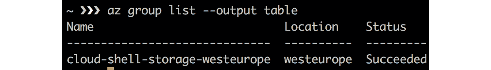
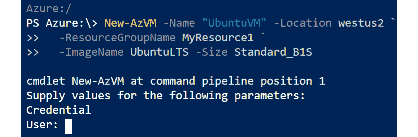
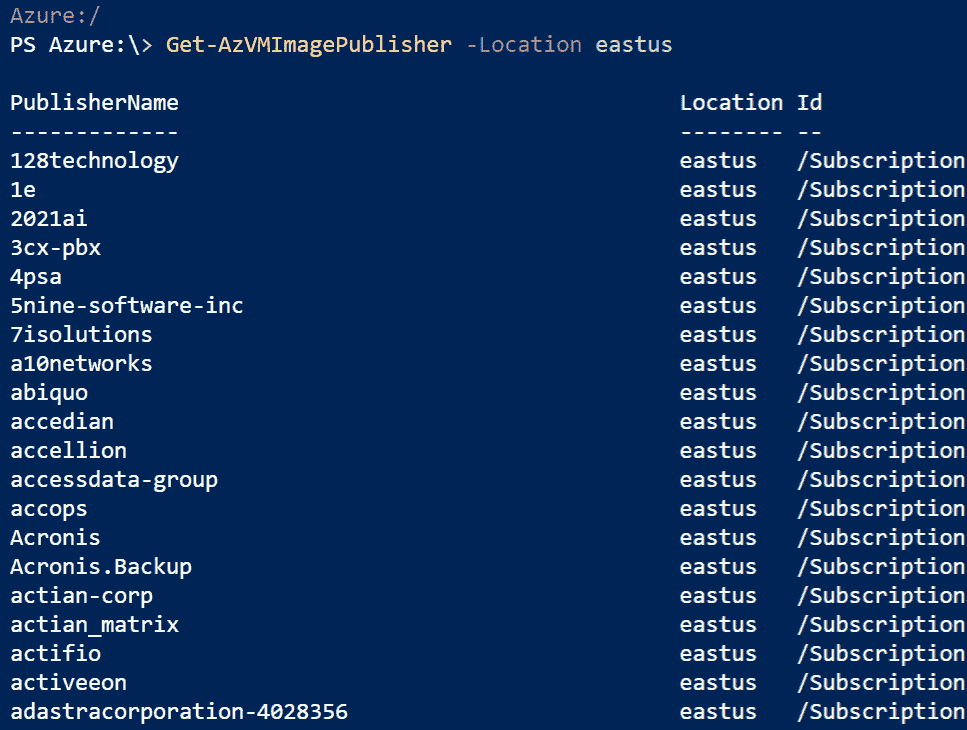
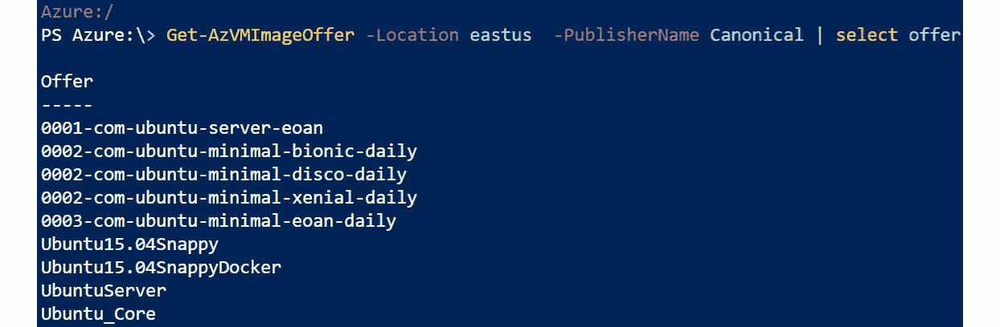
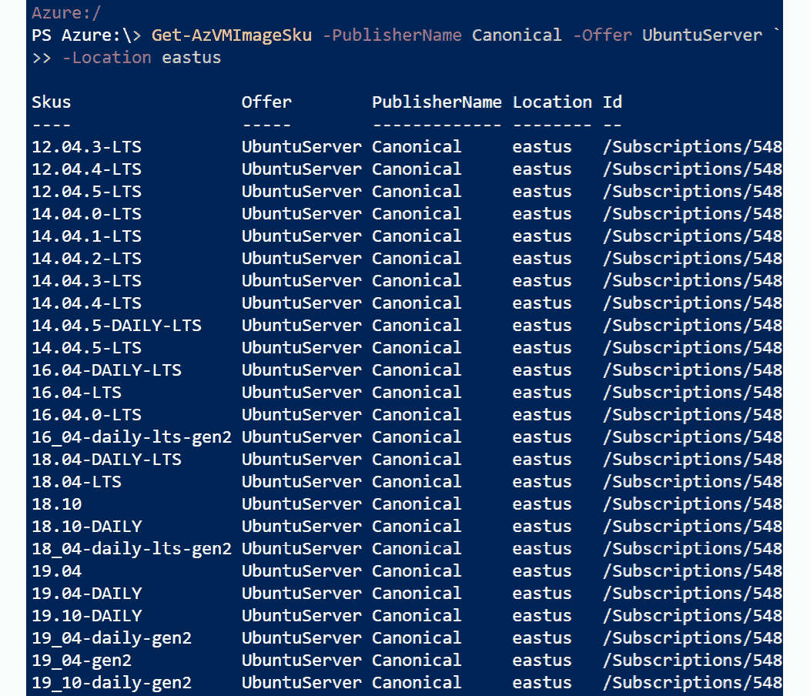
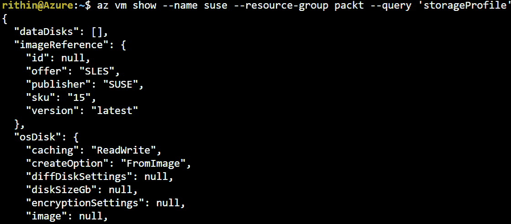
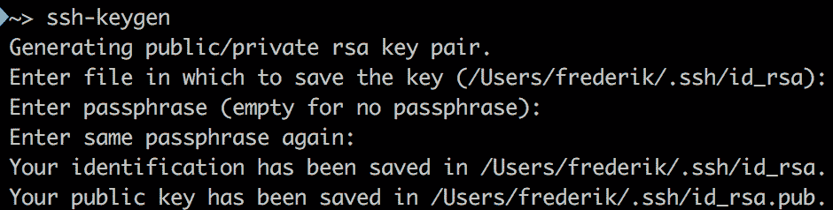

# 二、Azure 云入门

在第一章中，我们介绍了虚拟化和云计算的历史及其背后的思想。 之后，你会读到微软 Azure 云。 本章将帮助您迈出第一步，进入 Azure 的世界，访问 Azure，探索不同的 Linux 产品，并部署您的第一个 Linux 虚拟机。

部署之后，您需要使用**Secure Shell**(**SSH**)通过密码身份验证或使用 SSH 密钥对访问您的虚拟机。

要迈出进入 Azure 云的第一步，完成所有的练习并检查结果是很重要的。 在本章中，我们将使用 PowerShell 和 Azure CLI。 你可以选择任何你觉得舒服的方式; 然而，两者都学习不会有坏处。 本章的主要目标是:

*   设置你的 Azure 帐户。
*   使用 Azure CLI 和 PowerShell 登录 Azure。
*   与**Azure 资源管理器**(**ARM**)交互，创建网络和存储资源。
*   理解 Linux 发行版和微软支持的发行版。
*   Deploying your first Linux virtual machine.

    #### 请注意

    本章中的所有内容都在 macOS、Windows 子系统 for Linux 以及 CentOS 和 openSUSE LEAP 的最新版本上进行了测试。

## 技术要求

如果你想尝试本章中的所有例子，你至少需要一个浏览器。 出于稳定性的原因，使用最新版本的浏览器非常重要。 微软在 Azure 官方文档中提供了一系列受支持的浏览器:

*   Microsoft Edge(最新版本)
*   Internet Explorer 11
*   Safari 浏览器(最新版本，仅适用于 Mac)
*   铬(最新版本)
*   Firefox(最新版本)

根据个人经验，我们推荐使用谷歌 Chrome 或基于其引擎最新版本的浏览器，如 Vivaldi。

您可以在浏览器中完成所有的练习，甚至包括与命令行有关的练习。 实际上，使用 Azure CLI 或 PowerShell 的本地安装是个好主意; 它更快，更容易复制和粘贴代码，您可以保存历史记录和命令的输出。

## 访问 Azure

要使用 Azure，首先需要的是一个帐户。 到[https://azure.microsoft.com](https://azure.microsoft.com)，获得一个免费帐户开始，或使用已经在使用的公司帐户。 另一种可能是通过 Visual Studio Professional 或 Enterprise 订阅来使用 Azure，这将为您提供 Azure 的**Microsoft Developer Network**(**MSDN**)学分。 如果您的组织已经与微软签订了企业协议，您可以使用您的企业订阅，或者您可以注册一个按使用量付费的订阅(如果您已经使用了免费试用版)。

如果你使用的是免费账户，你可以获得一些积分，一些受欢迎的服务可以在有限的时间内使用，还有一些服务会一直免费，比如集装箱服务。 您可以在[https://azure.microsoft.com/en-us/free](https://azure.microsoft.com/en-us/free)上找到最新的免费服务列表。 在试用期间，你不会被收费，除了虚拟机需要额外的许可，但你需要一张信用卡来证明你自己。

### 使用 Azure 门户登录

将浏览器指向[https://portal.azure.com](https://portal.azure.com)并使用您的凭据登录。 您已经准备好开始使用 Azure，或者，换句话说，开始使用您的订阅。 在 Azure 中，订阅允许您使用您的帐户使用 Azure 门户/ Azure CLI/PowerShell 创建和部署资源。 它也用于会计和记账。

Azure 门户将您带到一个仪表板，您可以修改该仪表板以满足您的监控需求。 您现在可以:

*   检查你的资源。
*   创建新的资源。
*   访问市场，这是一个在线商店，您可以在那里购买和部署为 Azure 云构建的应用程序或服务。
*   洞察你的账单。

你可以使用 web 界面，图形化地做任何事情，或者通过 web 界面使用 Azure Cloud Shell，后者提供 Bash 或 PowerShell 界面。

### 使用命令行访问 Azure

使用命令行有几个很好的理由。 这就是为什么，在本书中，我们将主要讨论 Azure 的命令行访问:

*   它可以帮助您理解 Azure 的架构。 在图形界面中，通常您可以在一个配置窗口中做许多事情，而不需要理解不同字段和组件之间的关系。
*   这是自动化和编排的第一步。
*   The web interface is still in active development; the web interface can, and will, change over time:

    一些功能和选项还不能使用。

    微软可能会重新定位网页界面的功能和选项。

*   另一方面，命令行界面在语法和输出方面非常稳定。

在本书中，我们将在 Bash shell 中使用 Azure CLI，在 PowerShell Az 模块中使用 PowerShell。 两者都非常适合，不依赖于平台，除了一两个例外，它们之间在特性上没有区别。 选择您最喜欢的，因为您已经熟悉它，或者尝试两个接口，然后再选择。

#### 请注意

请注意，从这本书复制和粘贴命令可能会给你一些错误，由于空格和缩进。 为了获得更好的结果，总是键入命令。 此外，这将帮助您习惯这些命令。

### 安装 Azure CLI

如果您在 Azure Cloud Shell 中使用 Bash 接口，则有一个相当完整的 Linux 环境 Azure 命令行界面安装可供使用。 它还提供特定于 azure 的命令，例如**az**命令。

您还可以在 Windows、macOS 和 Linux 上安装此实用程序。 Docker 容器也是可用的。 您可以在[https://docs.microsoft.com/en-us/cli/azure](https://docs.microsoft.com/en-us/cli/azure)找到所有这些平台的详细安装说明。

以 CentOS/**Red Hat Enterprise Linux**(**RHEL**)7 为例，安装 Azure CLI:

1.  Import the Microsoft repository's **GNU Privacy Guard** (**GPG**) key:

    Sudo RPM——导入\ https://packages.microsoft.com/keys/microsoft.asc

2.  Add the repository:

    ——添加 repo= \

    https://packages.microsoft.com/yumrepos/azure-cli

3.  Install the software:

    yum 安装 azure-cli

4.  To install the Azure CLI on an Ubuntu- or Debian-based system, use this:

    curl -sL https://aka.ms/InstallAzureCLIDeb | sudo bash

    在 macOS 上，你必须首先安装 Homebrew，这是一个免费的开源包管理系统，可以简化开源软件的安装。

5.  Open a Terminal and execute the following:

    $(curl -fsSL \

    https://raw.githubusercontent.com/Homebrew/install/master/install)"

6.  Update Homebrew and install the Azure CLI:

    Brew 更新&& Brew 安装 azure-cli

7.  After installing the Azure CLI, you can verify the version installed using this:

    az -v

### 通过 Azure CLI 登录

Azure CLI 是一个命令行工具，用于访问或管理 Azure 资源，好在它适用于 macOS、Linux 和 Windows 平台。 在使用 CLI 之前，您必须先登录:

az login

这个命令将打开一个浏览器，并要求您使用您的微软帐户登录。 如果您得到一个错误，说明 shell 无法打开交互式浏览器，请使用**az login -use-device-code**。 这将生成一个代码，您可以在[https://www.microsoft.com/devicelogin](https://www.microsoft.com/devicelogin)中使用它来完成身份验证。

如果成功，它会给你一些 JSON 格式的关于你订阅的输出，比如你的用户名:

［

   {

     "cloudName": "AzureCloud",

         " id ": "....",

         " isDefault”:没错,

         " 名称”:“现收现付制”,

         " 状态”:“启用”,

         "tenantId": "....",

         " 用户":{

            " 的名字 ": "....",

            " 类型”:“用户”

          }

    }

］

要再次获取此信息，请键入以下内容:

阿兹帐户列表

通过使用额外的参数，您总是可以将输出格式化为 JSON、JSONC、TABLE 或 TSV 格式。

JSON(或 JSONC，彩色变种)格式更容易在编程和脚本语言中解析:

###### 图 2.1:JSONC 格式的订阅细节

**tab 分隔值**(**TSV**)是一个好主意，如果输出是单个值，如果你想使用文本过滤工具，如 AWK，或者如果你想将输出导出到电子表格:

###### 图 2.2:tab 分隔的订阅详细信息

表的输出非常易读，但比默认输出有更多限制:

###### 图 2.3:表格形式的订阅详情

要以表格格式获取已登录帐户可以访问的订阅列表，请执行以下命令:

Az account list -o table

为了让读取 JSON 输出更容易，你还可以查询特定的字段:

Az account list -o table——query '[].[user.name]'

如果你已经拥有大量的资源或账户，那么浏览整个列表将是非常困难的。 幸运的是，有一种方法可以深入输出并获得所需的信息。 使用强大的查询语言 JMESPATH([http://jmespath.org](http://jmespath.org))将命令与**——query**参数链接起来，可以帮助您做到这一点。 再次查看**az account list**命令的 JSON 输出。 该查询正在搜索**用户**字段和**name**属性。

让我们回到登录过程。 每次这样做，一次又一次，可能不是最友好的程序。 更好的方法是创建一个服务主体，也被称为应用注册，为特定的应用提供凭证:

az ad sp create-for-rbac——name

您可以为您的应用程序提供一个名称，但是某些特殊字符是不允许的。 原因是**APP_NAME**将创建一个 URL，因此不能将 URL 中禁止的所有字符添加到**APP_NAME**中(例如@和%)。 输出也是 JSON 格式，将提供一个应用程序 ID(**appID**参数):

｛

    "appID": "....",

:“displayName APP_NAME”,

“名称”:“http://APP_NAME”,

“密码 ": "....",

“租户”:“……”

｝

请在记事本上记下输出，因为我们将使用这些值进行身份验证。 应用程序或服务主体代表 Azure 租户中的一个对象。 租户是指管理和拥有微软云服务实例的组织，通常表示为<yourcompany>.onmicrosoft.com。 如果我们从 Azure 的角度来看，所有部署的服务都将与一个订阅相关联，并且该订阅将映射到一个租户。 一个租户可以拥有多个托管不同服务的订阅。 从前面的输出中，我们将得到以下值:</yourcompany>

*   **appID**:应用 ID 类似于应用的用户名。 我们将使用这个 ID 作为我们的用户名登录。
*   **displayName**:创建应用程序时给应用程序的友好名称。我们通过**name**参数设置该名称。
*   **name**:基于我们给定的名称的 URL。
*   **password**:这是我们创建的服务主体的密码。 登录时，我们将在密码字段中使用这个值。
*   **tenant**:租户 ID; 我们在前一段讨论了租户。

需要访问的应用程序必须由安全主体表示。 安全主体为租户中的用户/应用程序定义访问策略和权限。 这样就可以在登录时对用户/应用程序进行身份验证，并在访问资源时进行基于角色的授权。 总之，您可以使用**appID**来登录。

列出分配给新创建的**appID**的角色:

az 角色分配列表——受让人<appid>——o 表</appid>

默认情况下，使用贡献者角色。 该角色拥有读取和写入您的 Azure 帐户的完全权限。

现在，最好测试一下并退出:

az logout

现在，再次使用**appID**登录。 你可以使用之前复制的值来完成身份验证:

az login——service-principal——username<appid>——tenant<tenant id=""></tenant></appid>

不幸的是，无法将用户名、**appID**或**租户 id**存储在配置文件中。 您还可以将**——password**添加到命令中:

az login——service-principal——username<appid>——tenant<tenant id="">——password</tenant></appid>

除了使用**az**命令输入完整的命令，您还可以在交互式 shell 模式下打开它:

阿兹互动

这种外壳最大的特点之一是它将终端分成两个窗口。 在上面的屏幕上，你可以输入你的命令; 在屏幕下方，您将在键入命令时获得帮助。 还有对命令、参数和参数值的自动完成支持。

### PowerShell

PowerShell 是一种微软开发的脚本语言，集成在。net 框架中。 它是由 Jeffrey Snover, Bruce Payette 和 James Truher 在 2006 年设计的。 PowerShell 不仅适用于 Windows，也适用于 Linux 和 macOS。 您可以在 PowerShell 的 GitHub 存储库中找到在这些操作系统中使用 PowerShell 的详细说明:[https://github.com/PowerShell](https://github.com/PowerShell)。

例如，要在 RHEL 或 CentOS 中安装它，请遵循以下步骤:

1.  Import the Microsoft repository's GPG key if you didn't do so while following the installation procedure for the Azure CLI:

    Sudo RPM -import \ https://packages.microsoft.com/keys/microsoft.asc

2.  Add the repository:

    ——add-repo= \https://packages.microsoft.com/rhel/7/prod/

3.  Install the software:

    安装-y powershell

4.  使用**pwsh -v**显示安装版本。
5.  Enter PowerShell:

    pwsh

在 macOS 上，你需要自制程序和自制程序桶。 桶扩展自酿软件安装更多和更大的应用:

1.  Install Homebrew Cask:

    啤酒龙头 caskroom /桶

2.  Install PowerShell:

    酿造桶安装 powershell

3.  使用**pwsh -v**显示安装版本。
4.  To enter PowerShell:

    pwsh

安装 PowerShell 后，就可以开始安装 Az 模块了。 下载模块可能需要一些时间，这取决于你的网速。 你可以在 shell 中看到下载的进度:

Install-Module -Name Az -AllowClobber -Scope CurrentUser -Force

PowerShell 使用**PowerShellGet**cmdlet 从 PowerShell Gallery 下载模块及其依赖项，PowerShell Gallery 是一个承载许多模块的在线存储库。 请注意，要做到这一点，您需要在 Windows 和 Linux 中拥有管理员权限。 PowerShell Gallery 没有被配置为可信存储库:

不可信存储库

您正在从一个不受信任的存储库安装模块。 如果你相信这个

通过运行 Set-PSRepository 来更改其 InstallationPolicy 值

cmdlet。 您确定要从“PSGallery”安装模块吗?

[Y]是[A]是的所有[N]没有[L] [S]暂停所有[? )帮助

(默认为“N”):A

用**[A] Yes to All**回答清单中的问题。

由于**强制**参数，现在可以安装 Az 模块的多个版本。 可以使用以下命令验证是否存在多个版本:

Get-InstalledModule -Name Az -AllVersions | ' select Name,Version

默认情况下将使用最新版本，除非您在导入模块时使用了**-RequiredVersion**参数。

### 使用 PowerShell 登录

安装完成后，导入模块:

Import-Module - name 阿兹

如果您在使用 Azure 时不创建 PowerShell 脚本，只在 PowerShell 环境中执行命令，那么您将需要再次执行此命令。 但是，如果您愿意，您可以自动加载模块。

首先，通过执行以下命令找出你的 PowerShell 配置文件在文件系统中的位置:

美元的概要文件

在文本编辑器中打开或创建该文件，并添加如下行:

Import-Module - name 阿兹

#### 请注意

在实际创建该文件之前，可能需要先创建目录结构。

现在您可以执行 Azure 的所有可用命令。

使用以下 cmdlet 登录:

Connect-AzAccount

这将打开一个交互式浏览器窗口，您可以在其中使用凭据进行身份验证。 如果结果没有显示租户 ID，执行以下操作:

Get-AzContext -ListAvailable |选择租户

现在，使用您找到的租户 ID 再次登录:

Connect-AzAccount -Tenant<tenantid></tenantid>

如果您有多个订阅，您可以添加**-订阅**参数和订阅 ID。 如前所述，创建一个服务主体可能是个好主意:

$newsp = New-AzADServicePrincipal ' -DisplayName "APP_NAME" -Role Contributor

如果您没有提到服务主体的友好名称**DisplayName**，Azure 将生成一个格式为 Azure -powershell- mm- dd-yyyy- hh -mm-ss 的名称。 接下来，您需要检索新创建的服务主体的应用程序 ID:

$newsp.ApplicationId

密码可以存储为一个变量，它将被加密，我们必须解密它:

$ = [System.Runtime.InteropServices.Marshal]:型:SecureStringToBSTR (newsp.Secret 美元)

$UnsecureSecret = [System.Runtime.InteropServices.Marshal]::PtrToStringAuto($BSTR)

变量**$ unsecuressecret**包含您的服务主体的密码。

为了能够进行身份验证，我们需要服务主体的凭证:

美元信誉= Get-Credential

提供**ApplicationID**和密码，它们存储在**$newsp 中。 ApplicationId**和**$ unsecuressecret**变量。 现在我们已经拥有了使用这些证书连接到 Azure 所需的一切:

连接 azdata 账户

-租户<tentant id="">'</tentant>

  -ServicePrincipal

现在，保存上下文:

Save-AzContext 路径$ HOME / .Azure / AzureContext.json

如有必要，覆盖现有内容。 退出 PowerShell 环境并执行 PowerShell。 确保你已经登录到 Azure，并使用以下命令验证上下文:

Get-AzContext

### Azure 资源管理器

在你开始部署你的第一个 Linux 虚拟机之前，有必要了解更多关于**Azure 资源管理器**(**ARM**)的知识。

基本上，ARM 允许您使用存储和虚拟机等资源。 为此，您必须创建一个或多个资源组，以便在单个操作中执行生命周期操作，例如部署、更新和删除资源组中的所有资源。

#### 请注意

资源组必须创建在区域(也称为位置)中。 请注意，不同地区提供的服务可能会有所不同。 欲了解更多差异，请访问[https://azure.microsoft.com/en-us/global-infrastructure/services/](https://azure.microsoft.com/en-us/global-infrastructure/services/)。

Azure 拥有超过 54 个区域。 如果某个位置不可用，则需要为您的帐户添加白名单。 你可以联系微软的技术支持。 要获取您的帐户的可用位置和支持的资源提供商列表，请在 PowerShell 中执行以下命令:

Get-AzLocation |选择对象位置

你也可以在 Bash 中执行以下操作:

Az 帐户 list-locations——query '[].name'

然后，在其中一个区域创建一个资源组:

New-AzResourceGroup -Location westus2 -Name 'MyResource1'

现在，验证结果:

Get-AzResourceGroup | Format-Table

这是前面命令的 Bash 版本:

az 组 create——location westus2——name MyResource2

要验证**Azure Resource Manager (ARM)**这个命令的结果，执行以下命令:

Az group list -o table

除了处理区域和资源组之外，还必须理解存储冗余的概念。 可用的复制选项如下:

*   Standard_LRS: Locally redundant storage

    Premium_LRS:与 LRS 相同，但是它也支持文件存储。

    Standard_GRS: Geo-redundant 存储

    Standard_RAGRS:读写两地三中心冗余存储

*   Standard_ZRS: Zone-redundant storage; ZRS doesn't support Blob storage

    #### 请注意

    更多信息请访问微软网站:[https://docs.microsoft.com/en-us/azure/storage/common/storage-redundancy](https://docs.microsoft.com/en-us/azure/storage/common/storage-redundancy)。

理解这个概念非常重要，因为一个区域需要一个存储帐户和您的资源组。 存储帐户在 Azure 中提供了唯一的名称空间来存储数据(如诊断)和使用 Azure Files 等服务的可能性。 要为该数据配置冗余，您必须指定 SKU，它在此上下文中代表冗余选项:

New-AzStorageAccount -Location westus '

-ResourceGroupName MyResource1”

-Name "<name>" -SkuName Standard_LRS</name>

或者你也可以通过 Azure CLI 来实现:

az 存储帐户 create——resource-group MyResource2

——sku Standard_LRS——name<name></name>

存储帐户名称在 Azure 上必须是唯一的，长度在 3 到 24 个字符之间，并且只能使用数字和小写字母。

## Linux 和 Azure

Linux 几乎无处不在，在许多不同的设备上和许多不同的环境中。 有很多不同的口味，你可以选择用什么。 那么，你选择什么呢? 有许多问题，而且可能有许多不同的答案。 但有一件事是肯定的:在企业环境中，支持是重要的。

### Linux 发行版

如前所述，有许多不同的 Linux 发行版。 但有这么多选择是有原因的:

*   Linux 发行版是软件的集合。 有些集合是为了一个特定的目标。 Kali Linux 是这种发行版的一个很好的例子，它是一种高级渗透测试 Linux 发行版。
*   Linux 是一个多用途的操作系统。 由于我们为 Linux 提供了大量定制选项，如果您不想在您的操作系统上使用特定的包或特性，您可以删除它并添加自己的包或特性。 这就是为什么会有这么多发行版的主要原因之一。
*   开源本质上是达尔文主义的。 有时候，一个项目是分叉的，例如，因为其他一些开发人员不喜欢这个项目的目标，或者认为他们可以做得更好，所以不接受项目补丁。 只有最强大的项目才能存活下来。
*   这是一个品味的问题。 不同的人有不同的品味和观点。 有些人喜欢 Debian**apt**包管理器; 其他人可能喜欢 SUSE 的 Zypper 工具。
*   另一个很大的区别是，一些发行版是由 Red Hat、SUSE 和 Canonical 等厂商收集和支持的，而其他的，如 Debian，是由社区驱动的。

在生产环境中，支持非常重要。 在将生产工作负载推到一个发行版之前，组织将会关注某些因素，例如 SLA、停机时间和安全更新，并且可能会出现以下问题:

*   谁负责更新，哪些信息随更新而来?
*   谁负责支持，如果有问题我应该打电话给谁?
*   如果软件授权有法律问题，谁来给我建议?

### 微软支持的 Linux 发行版

在 Azure 市场中，有第三方(也称为微软合作伙伴)提供的 Linux 映像。 这些都是微软支持的 Linux 发行版。

微软与这些合作伙伴和 Linux 社区一起工作，以确保这些 Linux 发行版在 Azure 上运行良好。

可以将您自己的映像，甚至您自己的 Linux 发行版导入到 Azure 中。 微软直接为 Linux 内核做出贡献，为 Hyper-V 和 Azure 提供 Linux 集成服务，因此只要支持被编译到内核中，你就可以在 Azure 上运行每一个 Linux 发行版。 此外，在 Azure Marketplace 中的每个 Linux 映像上，都安装了 Azure Linux Agent，并且该代理的源代码也可以在 GitHub 上获得，因此您可以在映像中安装它。 如果你在 Linux 上有问题，微软甚至愿意指导你; 买一个支持计划吧!

对于一些商业 Linux 发行版，有很好的支持选项:

*   Red Hat:微软支持将帮助您使用 Azure 平台或服务，也将支持 Red Hat 内部的问题，但这需要一个支持计划。
*   Oracle Linux:微软提供了支持计划; 可以从 Oracle 购买额外的商业支持。
*   SUSE:有微软支持的高级镜像; 如果需要，他们会打电话给 SUSE。 这个 SUSE 高级镜像包含所有软件、更新和补丁。
*   Other vendors: There are Microsoft support plans to cover other vendors; you don't have to buy a separate plan for this. Microsoft plan details are available at [https://azure.microsoft.com/en-us/support/plans/](https://azure.microsoft.com/en-us/support/plans/).

    #### 请注意

    请访问微软网站，以获得最近认可的发行版和版本的列表，以及关于支持的详细信息的发行版:

    [https://docs.microsoft.com/en-us/azure/virtual-machines/linux/endorsed-distros](https://docs.microsoft.com/en-us/azure/virtual-machines/linux/endorsed-distros )

## 部署 Linux 虚拟机

我们已经介绍了 Azure 中可用的 Linux 发行版以及可以获得的支持级别。 在前一节中，我们通过创建资源组和存储来设置初始环境; 现在是时候部署我们的第一个虚拟机了。

### 您是第一个虚拟机

已经创建了资源组，在这个资源组中创建了一个存储帐户，现在可以在 Azure 中创建您的第一个 Linux 虚拟机了。

在 PowerShell 中，使用以下命令:

New-AzVM -Name "UbuntuVM" -Location westus2 '

-ResourceGroupName MyResource1”

无-ImageName UbuntuLTS -Size Standard_B1S .无

cmdlet 将提示您为您的虚拟机提供用户名和密码:

###### 图 2.4:为虚拟机提供用户凭据

在 Bash 中，可以使用以下命令:

az vm create——name UbuntuVM——resource-group MyResource2 \

——image UbuntuLTS——authentication-type password \ .使用实例

——admin-username student——size Standard_B1S

这非常简单，但是如果您以这种方式创建虚拟机实例，您可以设置的选项数量非常有限。 这个过程将使用默认设置创建虚拟机所需的多个资源，例如磁盘、网卡和公共 IP。

让我们深入一点细节，并获得一些关于所做选择的信息。

### Imagen

在我们的示例中，我们部署了一个映像名称为**UbuntuLTS**的虚拟机。 您可以选择以下几种 Linux 映像:

*   被久远
*   Debian
*   RHEL
*   UbuntuLTS
*   CoreOS
*   openSUSE
*   SUSE Linux 企业

但还有更多的图片是由不同的供应商提供的，这些供应商被称为出版商。

我们来看看这些出版商的名单。 在 PowerShell 中，使用以下命令:

Get-AzVMImagePublisher -Location

正如你在下面的截图中看到的，Azure 有很多发布者，我们将从中挑选一个来演示:

###### 图 2.5:在 PowerShell 中列出图像发布者

在 Bash 中，你可以运行以下命令获取发布者列表:

az vm image list-publishers——location<region>——output table</region>

列表是相同的:

###### 图 2.6:列出 Bash 中的图像发布者

现在你知道了发行商，你可以使用以下方法获得发行商提供的图片列表:

Get-AzVMImageOffer -Location<region>'</region>

-PublisherName<publisher>|选择 offer</publisher>

我们已经选择了**Canonical**作为发行商，现在我们正在尝试获取可用的报价列表。 **UbuntuServer**是其中之一，我们将使用这个:

###### 图 2.7:列出 Canonical 发布者的报价

或者，在 Azure CLI 中，运行以下命令:

az vm image list-offers——location<region>'</region>

——publisher<publisher>——输出表</publisher>

输出是所谓的*offers*的列表。 报价是由发布者创建的一组相关图片的名称。

现在我们需要知道图像有哪些 sku 可用。 SKU 指的是发行版的主要版本。 下面是一个使用 Ubuntu 的例子:

Get-AzVMImageSku -PublisherName<publisher>-Offer<offer>'</offer></publisher>

-位置<location></location>

现在我们已经有了发行商和提供的价值，让我们继续，看看由**Canonical**发布的**ubuntu 用户**的主要发行版(sku):

###### 图 2.8:列出 Canonical 发布的 UbuntuServer 的 sku

或者，在 Azure CLI 中，运行以下命令:

az vm image list-skus—location<location>\</location>

——出版商<publisher>——提供<offer>-o 表</offer></publisher>

查询一个特定的实例在这个报价:

Get-AzureVMImage -Location<region>'</region>

-PublisherName<publisher>-Offer<offer>'</offer></publisher>

-Skus<sku>|选择版本-最后 1</sku>

我们再看一遍这些值。 使用发行商名称，报价和 SKU，我们将获得可用的版本。 在下面的截图中，您可以看到图像版本**19.10.201912170**可用。 让我们以我们的虚拟机为例:

###### 图 2.9:在 Azure CLI 中选择可用的映像版本

这是撰写本章时可用的最新版本。 如果有任何新版本，您可能会看到另一个版本号。

或者，在 Azure CLI 中，使用以下命令:

az 虚拟机镜像列表—location<region>—publisher<publisher>\</publisher></region>

——提供<offer>——sku<sku>——所有——查询'[]。 版本的\</sku></offer>

——输出 TSV |尾部-1

为了将输出减少到最新版本，添加了参数来选择最后一行。 收集到的信息包括**Set-AzVMSourceImage**cmdlet; 但是，在使用这个命令之前，我们需要使用**new - azvmconfig**创建一个新的虚拟机配置:

$vm = New-AzVmConfig -VMName<name>-VMSize "Standard_A1"</name>

Set-AzVMSourceImage -PublisherName <PUBLISHER>'

-Offer<offer>-Skus<sku>-Version</sku></offer>

最后,我们创建一个新的虚拟机大小的**Standard_A1**,我们指导 PowerShell 使用图片版本**19.10.201912170**的**19 _10-daily-gen2 主要分布在**UbuntuServer**【显示】出版的规范化提供**:

###### 图 2.10:创建一个大小为 Standard_A1 的虚拟机

在 Bash 中，收集到的信息中包含了**az vm create**命令的参数:

az vm create——name UbuntuVM2——resource-group packet - testing -2——image canonical:UbuntuServer:19_10-daily-gen2:19.10.201912170——authentication-type password——admin-username pacman——size Standard_B1S .使用实例

#### 请注意

在 Bash 和 PowerShell 中，都可以使用单词*latest*来代替特定的版本。 但是，收集的信息不足以创建虚拟机。 需要更多的参数。

### 虚拟机分级

您必须考虑的另一件事是根据您的需求和成本决定虚拟机的大小。 更多关于可用尺寸和价格的信息，请访问[https://azure.microsoft.com/en-us/pricing/details/virtual-machines/linux](https://azure.microsoft.com/en-us/pricing/details/virtual-machines/linux)。

这个网站上的列表，包括实例的价格，经常变化! 你可以在命令行上得到一个列表(不显示成本):

Get-AzVMSize -Location<region>|格式表</region>

az vm list-sizes——location<region>-o 表</region>

一个小型虚拟机就足以执行本书中的练习。 在写作时，**Standard_B1ls**是必要的基础水平表现的理想选择。 但是，正如前面提到的，重新检查虚拟机大小/定价表是一个好主意。

在 PowerShell 中，**New-AzVM**cmdlet 可以使用**-size**参数，或者你可以在**New-AzVMConfig**cmdlet 中使用:

New-AzVMConfig -VMName "<vm name="">" -VMSize</vm>

在 Bash 中，添加**az vm create**命令的**——size**参数。

### 虚拟机网络

Azure 虚拟网络允许虚拟机、internet 和其他 Azure 服务通过安全网络进行通信。 当我们在本章开始创建第一个虚拟机时，自动创建了几个与网络有关的项目:

*   虚拟网络
*   虚拟子网
*   虚拟网络接口连接到虚拟机并插入虚拟网络
*   在虚拟网口上配置的私网 IP 地址
*   公共 IP 地址

网络资源将在*第 4 章，管理 Azure*中讨论; 现在，我们只查询虚拟机的私有和公共 IP 地址。 使用此命令获取公网 IP 地址列表:

Get-AzPublicIpAddress -ResourceGroupName<resource group="">'</resource>

|选择名字,IpAddress

要获取所有虚拟机的私有 IP 地址列表，使用这个命令:

Get-AzNetworkInterface -ResourceGroupName<resource group="" name="">| ForEach {$interface = $ _name; $ip = $_ | Get-AzNetworkInterfaceIpConfig | Select PrivateIPAddress; Write-Host 接口 ip 美元。 PrivateIPAddress}</resource>

前面的命令看起来可能有点复杂，但它是获取私有 ip 列表的方便脚本。 如果需要获取资源组中虚拟机的私有 IP 地址，可以使用此命令:

Get-AzNetworkInterface -ResourceGroup

得到的输出将是 JSON 格式，在**IpConfigurations**下可以看到私网 IP 地址:

###### 图 2.11 资源组中虚拟机的私有 IP 地址

这也可以通过使用 Azure CLI 来实现。 要获取虚拟机的私有 IP 地址列表，使用以下命令:

az vm list-ip-addresses——resource<resource group="">——output 表</resource>

公网 IP 地址是使虚拟机可以通过 internet 访问的 IP 地址。 该 IP 地址上进入的流量虚拟机网络经过**网络地址转换**(**NAT**)到 Linux 虚拟机网络接口上配置的私有 IP 地址。

### 虚拟机信息

在部署虚拟机之后，所有附加到虚拟机的信息都可以使用 PowerShell 和 Bash，比如状态。 查询状态很重要; 有几个州:

*   运行
*   停止
*   失败的
*   收回

如果一个虚拟机没有被重新分配，微软会向你收取费用。 **Failed**状态表示虚拟机无法启动。 使用实例查询系统状态信息。

Get-AzVM -Name<vm name="">-Status -ResourceGroupName</vm>

在 Bash 中，可以接收部署的虚拟机的状态，但如果我们需要将输出缩小到单个实例，那么不使用复杂的查询是不可能的:

Az 虚拟机列表——输出表

要释放虚拟机，首先要停止它:

Stop-AzVM -ResourceGroupName<resource group="">-Name</resource>

现在你可以释放它:

az vm deallocate——name<vm name="">——resource-group</vm>

您可以获得关于已部署虚拟机的更多信息。 在 PowerShell 中，很难接收虚拟机的属性。 首先，创建一个变量:

$MYVM=Get-AzVM -Name <VM NAME> -ResourceGroupName <RESOURCE GROUP>

现在请求这个**MYVM**对象的属性和方法:

美元 MYVM |成员参与讨论

查看**HardwareProfile**属性，查看该实例的大小:

$MYVM.HardwareProfile

或者，为了更精确地了解虚拟机信息，使用以下命令:

MYVM 美元。 硬件配置文件| Select-Object -ExpandProperty VmSize

您还可以尝试**NetworkProfile**、**OSProfile**和**StorageProfile。 imagerreference**。

如果你想在 Bash 中使用**az**命令，你可能想要尝试的第一个命令是:

az vm list——resource-group

这里唯一的问题是它同时显示了所有虚拟机的所有信息; 幸运的是，还有一个**show**命令，它将输出减少到单个虚拟机:

az vm show——name<vm name="">——resource-group</vm>

通过使用查询来限制输出是个好主意。 例如，如果你想查看特定虚拟机的存储配置文件，你可以如下查询:

az vm show——name<vm name="">——resource-group<resource group="">\</resource></vm>

——查询“storageProfile”

前面的命令应该会给出如下输出:

###### 图 2.12:SUSE 虚拟 machine 的存储配置文件

## 连接 Linux

虚拟机正在运行，您可以使用部署第一个虚拟机时提供的凭据(用户名和密码)远程登录。 另一种连接到 Linux 虚拟机的更安全的方法是使用 SSH 密钥对。 由于 SSH 密钥的复杂性和长度，其安全性更高。 在此基础上，Azure 上的 Linux 支持使用**Azure Active Directory**(**Azure AD**)登录，用户可以使用他们的 AD 证书进行身份验证。

### 使用密码认证登录您的 Linux 虚拟机

日志含义在*虚拟机组网*中查询虚拟机的公网 IP 地址。 我们将使用这个公共 IP 通过本地安装的 SSH 客户端通过 SSH 连接到虚拟机。

**SSH**或**Secure Shell**是一种加密的网络协议，用于与服务器进行管理和通信。 Linux、macOS、**for Linux 的 Windows 子系统**(**WSL**)，以及 Windows 10 最近的更新都带有基于命令行的 OpenSSH 客户端，但是还有更高级的客户端可用。 下面是一些例子:

*   Windows: PuTTY、MobaXterm 和 Bitvise Tunnelier
*   Linux: PuTTY、Remmina 和 Pac Manager
*   推推，Termius 和 r 浏览器

使用 OpenSSH 命令行客户端连接到虚拟机:

ssh<username>@</username>

### 使用 SSH 私钥登录到 Linux 虚拟机

使用用户名和密码并不是登录远程计算机的最佳方式。 这并不是一个完全不安全的操作，但您仍然通过连接发送您的用户名和密码。 如果您想要远程执行脚本、执行备份操作等等，那么也很难使用它。

另一种更安全的登录系统的方法是使用 SSH 密钥对。 这是一对加密保护的密钥:一个私有密钥和一个公共密钥。

私钥由客户端保留，不应复制到任何其他计算机。 这件事应该绝对保密。 在创建密钥对的过程中，最好使用一个密码短语来保护私钥。

另一方面，公钥可以复制到您想要管理的所有远程计算机。 此公钥用于加密只有私钥才能解密的消息。 当您尝试登录时，服务器将使用使用密钥的这个属性验证客户机是否拥有私钥。 没有通过连接发送密码。

有多种方法可以创建 SSH 密钥对; 例如，PuTTY 和 MobaXterm 都提供了创建它们的工具。 您必须从每个需要访问远程机器的工作站执行此操作。 在本书中，我们使用**ssh-keygen**，因为它适用于所有操作系统:

ssh - keygen

前一个命令的输出应该如下所示:

###### 图 2.13:使用 SSH -keygen 创建 SSH 密钥对

别忘了输入密码!

为了理解如何使用 SSH 密钥对访问虚拟机，让我们创建一个新的虚拟机。 如果你还记得,当我们创建的 Linux 机器之前,我们使用了**az vm 创建**命令和**验证类型作为密码,但在以下命令,我们使用的是**——**generate-ssh-keys 参数。 这将生成一个 SSH 密钥对，并将被添加到您的主文件夹中的**.ssh**目录中，用于访问虚拟机:**

az vm create——name UbuntuVM3——resource-group MyResource2 \

——admin-username student——generate-ssh-keys——image ubuntuults .使用示例

如果你想在 PowerShell 中完成，使用**Add-AzVMSshPublicKey**cmdlet。 有关该命令的更多信息，请参考[https://docs.microsoft.com/en-us/powershell/module/azurerm.compute/add-azurermvmsshpublickey?view=azurermps-6.13.0](https://docs.microsoft.com/en-us/powershell/module/azurerm.compute/add-azurermvmsshpublickey?view=azurermps-6.13.0)。

一旦创建了虚拟机，你就可以使用下面的命令来访问它:

ssh student@

## 总结

本章介绍了进入 Microsoft Azure 的第一步。 第一步总是涉及创建一个新帐户或使用现有的公司帐户。 有了帐户，你就可以登录并开始发现 Azure 云。

在本章中，Azure 云的发现是通过 Azure CLI 命令**az**完成的，或者通过 PowerShell; 通过示例，您了解了以下内容:

*   Azure 登录过程
*   地区
*   存储账户
*   出版商提供的图片
*   虚拟机的创建
*   查询虚拟机的关联信息
*   什么是 Linux 以及对 Linux 虚拟机的支持
*   使用 SSH 和 SSH 对访问您的 Linux 虚拟机

下一章从这里开始，踏上新的征程:Linux 操作系统。

## 问题

1.  使用命令行访问 Microsoft Azure 的优势是什么?
2.  储存帐户的目的是什么?
3.  Can you think of a reason why you would get the following error message?

    代码= StorageAccountAlreadyTaken

    消息=名为 mystorage 的存储帐户已被占用。

4.  报价和形象有什么区别?
5.  停止虚拟机和重新分配虚拟机之间的区别是什么?
6.  使用私有 SSH 密钥对您的 Linux 虚拟机进行身份验证有什么好处?
7.  **az vm create**命令有**——generate-ssh-keys**参数。 创建了哪些键，它们存储在哪里?

## 进一步阅读

本章绝不是一个使用 PowerShell 的教程。 但是如果你想更好地理解这些例子，或者想更多地了解 PowerShell，我们可以建议你阅读 Packt Publishing 出版的*精通 Windows PowerShell 脚本-第二版*(ISBN: 9781787126305)。 我们建议你从第二章*Working with PowerShell*开始，至少读到第四章*Working with Objects in PowerShell*。

您可以找到大量关于使用 SSH 的在线文档。 一个很好的起点是维基百科:[https://en.wikibooks.org/wiki/OpenSSH](https://en.wikibooks.org/wiki/OpenSSH)。

如果您希望了解更多关于 Linux 管理的内容，Packt Publishing 出版的*Linux 管理烹饪书*是一个很好的资源，特别是对系统工程师来说。

要深入了解安全性和管理任务，可以阅读以下内容:*Mastering Linux security and Hardening*，由 Donald a . Tevault 编写，Packt Publishing 出版。