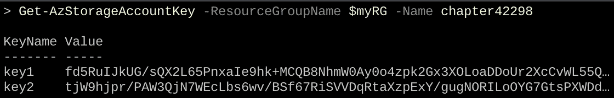
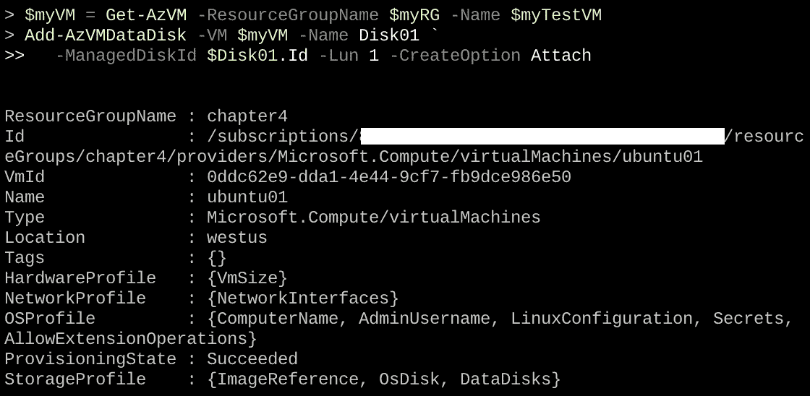
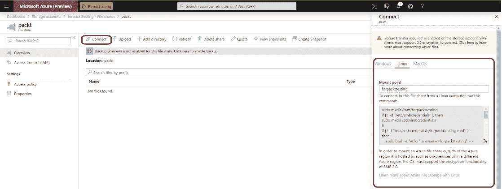
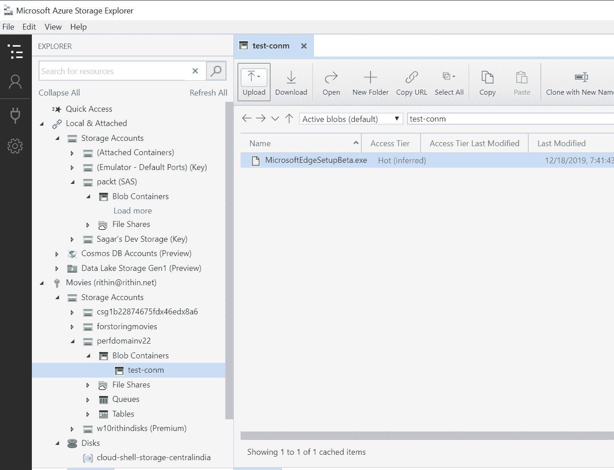
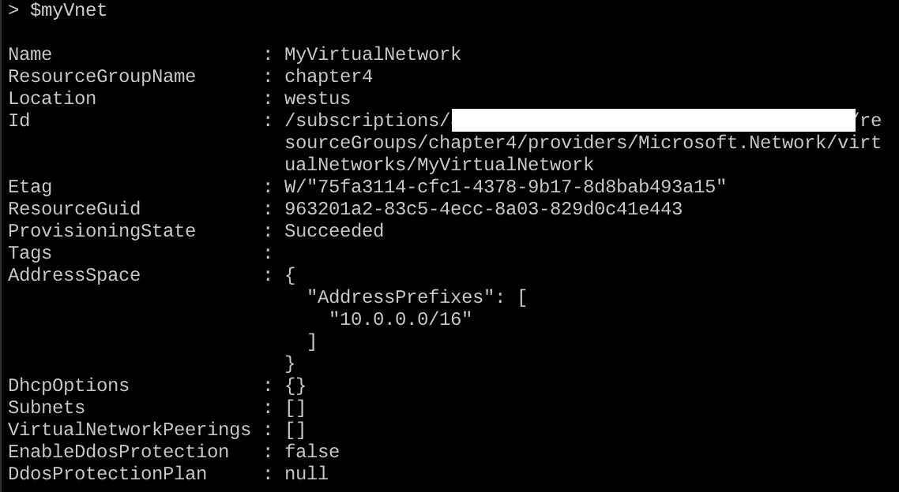
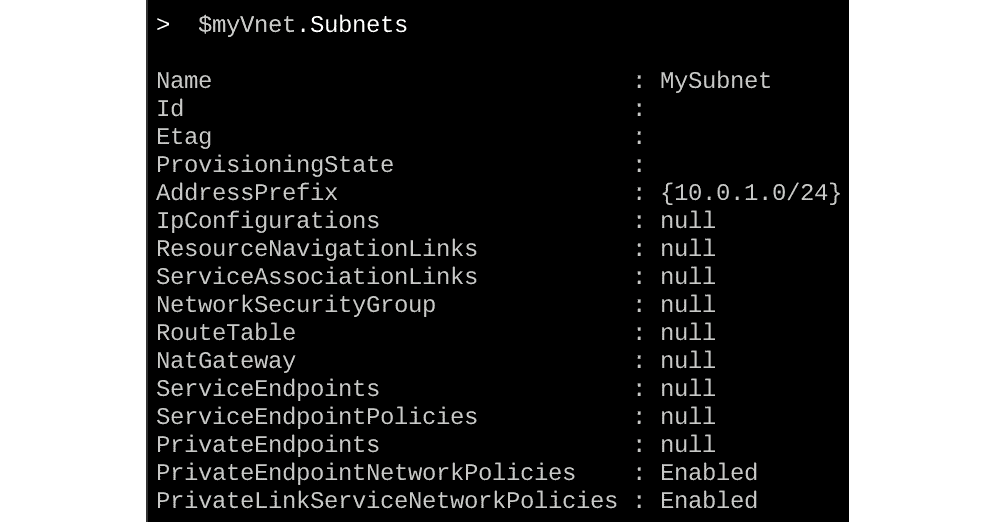
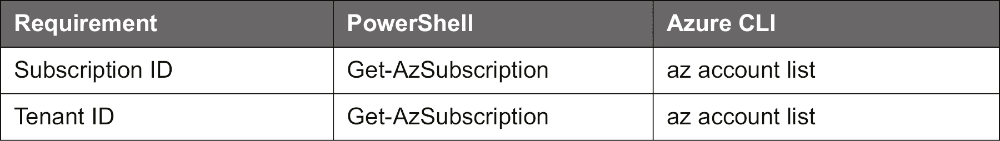

# 四、管理 Azure

在*第二章*，*开始 Azure 云*中，我们迈出了进入 Azure 世界的第一步。 我们发现有许多方法可以管理 Azure 环境，这些方法包括 Azure 门户和命令行界面。 您可以使用 Azure 门户中的命令行界面在您的工作站上运行它们。 在本书的后面，我们将看到使用自动化和编配解决方案还有其他巨大的可能性。 在*第三章*、*基础 Linux 管理*的末尾，我们创建了一个 Linux 虚拟机，并探索了 Linux 环境的基础知识。

在我们继续我们的旅程，讨论更高级的主题之前，本章将介绍我们的工作负载、vm 和容器所需要的 Azure 基础设施组件。 我们讨论了 Linux 中的文件系统，但是我们如何向 VM 添加更多的数据磁盘呢? 作为一个系统管理员，您可能需要根据您的业务需求来允许或拒绝 VM 的流量，但是如何在 Azure 中实现这一点呢? 在某些场景中，您需要为虚拟机绑定多个网络接口。 你将如何实现这个目标? 本节将回答关于如何管理与 VM 相关的 Azure 资源的所有问题。 我们讨论的组件已经在前面的章节中使用过，有时甚至不知道我们已经使用过了。

基本上，本章是关于 Azure 资源的。 而且，请记住，它们都是资源组的一部分，资源组是一个逻辑容器，资源被部署和管理在其中。 以下是本章的一些要点:

*   管理 Azure 中的存储资源和可用的不同存储选项
*   管理 Azure 中的网络资源并理解它们在 vm 中的角色
*   Using handy commands in PowerShell and the Azure CLI to manage resources in Azure

    #### 请注意

    在本书中，我们尽量不去关注可用的接口。 因为本章更多的是关于理论而不是接口，所以我们将以 PowerShell 为例。

## 使用 Azure CLI 和 PowerShell 管理 Azure 资源

在本章中，我们将看到如何使用 PowerShell 和 Azure CLI 管理 Azure 资源。 我们在这里要做的每一项任务也可以从 Azure 门户完成。 但是，作为从终端执行日常任务的系统管理员，您应该能够使用 CLI 或 PowerShell 管理资源。 本章中几乎所有的命令都是用 PowerShell 编写的; 然而，在本章的最后，你会发现 Azure CLI 对应 PowerShell 中的每个命令。 命令列表太长了，所以最好参考微软官方文档或使用各自的帮助命令。

在某些情况下，甚至在接下来的章节中，我们将使用 Azure 门户。 这是为了简化过程，并向大家介绍另一种方法。 如果愿意，您可以使用门户，但在自动化任务和编排部署方面，CLI 或 PowerShell 经验是先决条件。 因此，我们鼓励大家遵循本章中的 PowerShell 命令，并投入时间使用 Azure CLI 测试等效的命令。

以下是完成本章任务的一些技术要求。

## 技术要求

本章要求具备存储和网络的基础知识。 在*继续阅读*部分，你可以找到一些建议来准备自己。

这不是必需的，但是至少有一个 VM 启动并运行是一个好主意。 这样，您不仅可以在本章中创建新的资源，还可以查看现有 VM 的属性。 本节以在第 4 章**资源组**中创建一个名为**ubuntu01**的 Ubuntu 虚拟机为例。

设置资源组和位置的变量:

$ myRG =“第 4 章”

$myLocation = "westus"

$myTestVM = "ubuntu01"

创建资源组:

New-AzResourceGroup -Name $ myg -Location $myLocation

创建虚拟机:

New-AzVm '

-ResourceGroupName myRG 美元”

  -Name $myTestVM '

-ImageName UbuntuLTS

位置 myLocation 美元”

  -VirtualNetworkName "$myTestVM-Vnet" '

-SubnetName myTestVM-Subnet 美元”

  -SecurityGroupName "$myTestVM-NSG" '

-PublicIpAddressName myTestVM-pip 美元

目前，本例中使用的参数并不重要; 读完这一章，你就能全部理解它们了。

Azure Storage Explorer 实用程序不是一个真正的需求，但有它就很好了，它可以在[https://azure.microsoft.com/en-us/features/storage-explorer](https://azure.microsoft.com/en-us/features/storage-explorer)上免费获得。 这是一个安装在工作站上的独立实用程序。 这个实用程序将帮助您上传、下载和管理 Azure blob、文件、队列和表。 它还支持 Azure Cosmos DB 和 Azure Data Lake。 另一个优点是可以访问虚拟机的磁盘。 存储资源管理器也是 Azure 门户中的一个选项。

## 管理存储资源

微软处理数据存储的云解决方案是 Azure storage。 Azure Storage 提供高可用性、安全性、可伸缩性和可访问性。 在 Azure 中，我们有不同类型的数据或存储服务。 它们是:

*   Azure 斑点
*   Azure 文件
*   Azure 队列
*   Azure 表

让我们仔细看看它们，了解它们是什么:

*   Azure Blobs:用于存储大量非结构化数据(如文本或二进制数据)的优化对象。 它们通常用于使数据可用于其他资源，例如，存储可用于创建虚拟磁盘的 VHD 文件。 另一个用例是将它们用作音频和视频文件的存储。 使一个 blob 公开访问，甚至可以流数据。
*   **Azure 文件**:Azure 文件是托管在 Azure 中的文件共享，可以通过**服务器消息块**(**SMB**)访问，并且可以挂载到您的本地计算机。 您可能想知道这些文件共享与普通文件共享有何不同。 这里增加的好处是，将生成的 URL 将包含一个**共享访问签名**(**SAS**)，并且文件共享将能够从世界上任何地方访问。
*   **Azure Queue**:用于从一个资源传递消息到另一个资源，特别是对于无服务器的服务，如 Azure Web Apps 和 Functions。 它还可以用于创建工作待办事项以异步处理。
*   **Azure Table**:这是针对 Azure Cosmos 数据库服务的。
*   **Azure Disk**:这适用于托管磁盘存储和非托管磁盘。

在本章中，我们将只讨论 Blob 存储、Azure 文件和磁盘存储，因为队列和表存储是针对特定解决方案的，它们只对应用程序开发人员重要。

#### 请注意

如果你有大量的数据想要存储在云中，那么上传会花费很多时间。 微软有一个叫做 Azure 数据盒磁盘的服务。 它允许你发送加密的 ssd 到你的数据中心，复制数据，然后发送回来。 更多信息，请访问[https://docs.microsoft.com/en-gb/azure/databox/data-box-disk-overview](https://docs.microsoft.com/en-gb/azure/databox/data-box-disk-overview)。

### 存储帐户

存储帐户提供了一个在 Azure 中惟一的名称空间，用于包含 blob、文件、表、队列等存储对象。 需要一个帐户才能访问存储。 它还定义了正在使用的存储的类型。

存储账户有三种不同的类型:

*   **Storage**:这种旧类型的已弃用存储帐户不支持所有特性(例如，没有存档选项)。 它通常比更新的 V2 更贵。
*   **StorageV2**:这是一个较新的存储帐户类型。 它支持所有类型的存储以及 blob、文件、队列和表的最新特性。
*   **BlobStorage**: This has not been deprecated yet, but there is no reason to use it any longer. The biggest problem with this account type is that you can't store files such as VHDs.

    #### 请注意

    不需要为托管磁盘创建存储帐户。 但是，如果希望存储 VM 启动诊断数据，则需要一个。 如果您的虚拟机处于不可引导状态，那么启动诊断帐户非常有用。 该帐户存储的日志可用于查找虚拟机处于非启动状态的根本原因。 对于测试，这不是一个强制选项，但对于生产工作负载，建议启用引导诊断，这将帮助您理解故障期间发生了什么错误。

另一个属性是 SKU，如*第 2 章，Azure 云入门*所述。 它指定应用于存储帐户的复制类型。 以下是可用的类型，如果你还记得的话，我们已经讨论过它们是什么:

*   **Standard_LRS**:本地冗余存储帐户
*   **Premium_LRS**:与 LRS 相同，但支持文件存储和块存储
*   **Standard_GRS**:两地三中心容灾存储帐户
*   **Standard_RAGRS**:读写两地三中心冗余存储帐户
*   **Standard_ZRS**:分区冗余存储帐户

最后一个重要的属性是访问层; 它指定了存储的优化。 有三种类型可供选择:

*   **热存储层**:将访问频率较高的数据存储在该热存储层。
*   **冷存储层**:指访问频率较低且至少存储 30 天的数据。
*   **归档存储层**:存储 180 天以上，访问次数少，延迟灵活。

设置对象级访问层仅支持标准 LRS、GRS、RA-GRS BlobStorage 和通用 V2 帐户。 **General Purpose V1**(**GPv1**)不支持分级。

为访问层所做的选择也会影响成本; 例如，归档存储提供最低的存储成本，但也提供最高的访问成本。

存储帐户名称长度为 3 ~ 24 个字符，且只能使用数字和小写字母。 存储帐户名称在 Azure 中必须是唯一的。 微软建议使用一个全球唯一的名称和一个随机数:

New-AzStorageAccount”

-ResourceGroupName<resource group="">'</resource>

-SkuName【工人】'

-Location<location>'</location>

-儿童 StorageV2 '

-AccessTier【工人】'

-name<storage account=""></storage>

让我们创建一个具有冗余的存储帐户 Standard_LRS:

$mySA = New-AzStorageAccount '

-ResourceGroupName myRG 美元”

-臭鼬标准

位置 myLocation 美元”

-儿童 StorageV2 '

-热启动器

-name chapter4$(Get-Random -Minimum 1001 -Maximum 9999)

在您的订阅中检查可用的存储帐户:

Get-AzStorageAccount |选择 StorageAccountName、Location

###### 图 4.1:可用存储帐户

在屏幕截图中，您可以看到在三个不同的区域中有三个存储帐户可用于此订阅。

存储帐户由密钥保护。 如果你想进入一个存储账户，你需要钥匙。 在创建帐户时，会自动创建一组两个密钥。 如果你仍然在创建账户时的同一会话中，你可以收到密钥:

$mySA | Get-AzStorageAccountKey | Format-Table -Wrap

否则，您可以使用以下方法:

Get-AzStorageAccountKey”

-ResourceGroupName<resource group="">'</resource>

-Name<storage account="" name=""></storage>

在下图中，**$MyRG**资源组中可用的**chapter42298**存储帐户有一组保护密钥:

###### 图 4.2:获取 chapter42298 存储帐户的密钥

### 托管磁盘

以前，在部署 VM 时，需要创建一个存储帐户，以便保存 VM 的**虚拟硬盘**(**VHD**)。 后来，微软引入了**托管磁盘**，我们可以在其中简单地创建一个磁盘，微软负责底层存储帐户。 除此之外，客户还可以获得更多的优势，比如容易调整大小、更多的加密选项和更好的性能。

纳管磁盘创建虚拟机时，会绑定两个磁盘:操作系统磁盘和临时磁盘。 所有磁盘均为 VHD 格式。 存储在临时磁盘上的数据在重启虚拟机时会被清除，因此微软不建议将重要数据存储在临时磁盘上，因为临时磁盘不是持久性的。

您也可以添加额外的管理数据磁盘。 首先，创建磁盘配置:

New-AzDiskConfig -Location<location>'</location>

  -DiskSizeGB <size> -OsType Linux -SkuName <sku>  '

-CreateOption 空

让我们看看如何创建一个大小为 5 GB、冗余为 Standard_LRS 的磁盘配置示例:

$diskconfig = New-AzDiskConfig -Location $myLocation '

  -DiskSizeGB 5 -OsType Linux -SkuName Standard_LRS '

-CreateOption 空

现在，您可以创建实际的磁盘:

New-AzDisk -ResourceGroupName<resource group="" name="">'</resource>

-DiskName<disk name="">-Disk</disk>

例如，下面是前一个命令的实现:

$Disk01 = New-AzDisk -ResourceGroupName $ myg '

  -DiskName 'Disk01' -Disk $diskconfig

通过执行**$Disk01**命令，您将看到新创建的磁盘。 在下面的截图中，输出被限制以使其更具可读性:

###### 图 4.3:$Disk01 命令的输出

下一步是附加托管数据磁盘。 为此，我们需要磁盘 ID。 因此，我们将使用磁盘名称运行以下命令来查找 ID:

Get-AzDisk -DiskName<disk name="">| select Id</disk>

添加数据磁盘:

add - azvmdatdisk -VM $myVM -Name<disk name="">'</disk>

-ManagedDiskId<disk id="">-Lun<lun number="">-CreateOption Attach</lun></disk>

**逻辑单元号**(即**LUN**)是虚拟机中用来标识存储的数字。 你可以从 0 开始编号。 最后，更新虚拟机设置:

Update-AzVM '

-ResourceGroupName<resource group="">'</resource>

-vm<virtual machine=""></virtual>

此时可将数据磁盘添加到虚拟机中。 要用一个完整的示例进行总结，首先需要了解 VM 的所有属性。 为了获得 VM 的属性，我们将使用以下命令并将属性保存到一个变量**$myVM**:

$myVM = Get-AzVM -ResourceGroupName $myRG -Name $myTestVM

下一个命令是将之前创建的磁盘添加到虚拟机:

add - azvmdatdisk -VM $myVM -Name Disk01 '

-ManagedDiskId Disk01 美元。 Id -Lun 1 -CreateOption Attach

上述命令将显示已配置的虚拟机属性，如下截图所示:

###### 图 4.4:将创建的磁盘添加到 VM 中

正如我们从输出中可以看到的，信息被添加到**storage_profile**，但是更改还没有激活。

要激活它，使用**Update-AzVM**。 输出应该给你的**StatusCode**为**OK**:

Update-AzVM -ResourceGroupName $ myg -VM $myVM

正如您在下面的截图中看到的，**IsSuccessStatusCode**告诉您请求已被接收。 StatusCode 是请求的结果:

###### 图 4.5:使用 update - azvm 命令更新 StatusCode

验证结果:

$myVM.StorageProfile.DataDisks

或者，更好的做法是，不重用变量，只查询这一行代码中的所有信息:

$(Get-AzVM -Name $myTestVM ')

.StorageProfile.DataDisks -ResourceGroupName myRG 美元)

可以看到名称、大小和 LUN:

###### 图 4.6:磁盘存储概要

### Azure 文件

您可以使用**Azure Files**来代替向虚拟机添加数据磁盘。 如果您还记得，我们在本章开始时讨论过 Azure 文件，并提到它不同于普通的文件共享。 Azure Files 是云中的一个完全管理的文件共享，它可以通过**服务器消息块**(**SMB**)访问，并且可以挂载到 Linux、Windows 和 macOS 上。

Azure Files 需要一个存储帐户，并支持 Standard_LRS、Standard_ZRS、Standard_GRS 和 Standard_ZRS(仅在选定的区域上)SKU 类型。 除了标准(热)之外，没有其他高级存储或访问层可用。 (在写这本书的时候，微软的消息源表示还没有时间来介绍这些特性。)

请注意，出于性能原因，您确实需要使用 SMB 3.0 协议。 这意味着你需要一个最新的 Linux 发行版，就像这里列出的:

*   基于 rhel7.5 或更高版本的发行版
*   Ubuntu 16.04 或更高版本
*   Debian 9
*   SUSE 12 SP3 / OpenSUSE LEAP 42.3 或更高版本

您还需要使用挂载选项强制版本 3:**vers=3.0**。

第一步涉及到创建 Azure 文件共享:

New-AzStorageShare '

-Name<share name="">-Context<storage account="" context=""></storage></share>

对于存储帐户上下文，您可以使用用于创建存储帐户的变量或再次创建变量:

$mySA = (Get-AzStorageAccount | Where-Object{$_。 StorageAccountName——“*”章})

让我们实现它并创建一个新的文件共享:

$myShare01 = New-AzStorageShare '

-Name "myshare01-staff" -Context $mySA。 上下文

让我们检查一下**$myShare01**的值。 输出清楚地显示了存储的 URL，当你创建它的时候，以及快照是否可用:

###### 图 4.7:myShare01 的输出

需要查看已创建的共享的属性。

(Get-AzStorageShare -Context $mySA.Context).Uri

正如你在下面的截图中看到的，它会给你同样的输出和更多的信息，这对我们的目的来说一点都不重要:

###### 图 4.8:创建的共享的属性

在 Linux 操作系统下，可以通过以下代码手动挂载文件共享:

Mount -t cifs \

-o vers=3.0，用户名=<storage account="">，密码=<storage key="">\</storage></storage>

//<storage account="" name="">.file.core.windows.net/<share>\</share></storage>

/

请注意，我们没有使用 HTTPS 方案，因为 CIFS 不使用 uri。 Azure 将负责不同方案之间的映射。

让我们继续并挂载文件共享。 你的密码和存储文件共享将不同于示例，因为名称在 Azure 中是唯一的:

mkdir / mnt /好吗

Mount -t cifs -o vers=3.0,username=chapter42585,password=.... ＼

  //chapter42585.file.core.windows.net/myshare-01.staff /mnt/staff

此外，您可以使用 Azure 门户([https://portal.azure.com/](https://portal.azure.com/))中的连接选项来实现文件共享，Azure 将生成将共享挂载到 Linux 以及 Windows 和 macOS 系统的命令。

在下面的截图中，您可以看到单击**Connect**后，Azure 生成代码来将文件共享连接到 Linux 系统。 你可以复制这段代码并粘贴到你的 Linux 系统:

###### 图 4.9:将文件共享连接到 Linux 系统

关于 Azure 文件挂载共享的更多信息可以在*第 5 章，高级 Linux 管理*中*挂载远程文件系统*一节中找到。 下面是 Azure Files 的一个挂载单元示例:

(单位)

描述=员工共享

(山)

= / / chapter42585.file.core.windows.net/myshare - 01\. -员工

Where = /mnt/staff

类型= cifs

选择=更= 3.0,= /根/ .staff 凭证

这里是**/root/。 staff**文件包含以下条目:

用户名=<storage account=""></storage>

密码=

另一个验证共享和管理内容的好方法是使用 Azure Storage Explorer。 在您的工作站上启动 Azure Storage Explorer 并连接您的 Azure 帐户。 如果不想添加整个帐户，还可以选择只添加使用 SAS 密钥的存储帐户。 Storage Explorer 会在左侧显示不同类型的资源，如下图所示:

###### 图 4.10:Azure Storage Explorer

### Azure Blob

Azure Blob 存储**是一种存储服务，它将云中的非结构化数据(图像、视频、音频、备份数据等不符合数据模型)作为对象存储。 Blob 是基于对象的存储，可以存储任何类型的数据。**

在存储帐户中，可以有容器; 容器与计算机上的目录或文件夹非常相似。 例如，如果您在 Azure 中存储您喜欢的音乐文件，您可以将帐户名称设置为*music*，在该名称中，您可以根据类型或艺术家创建一个容器，而实际的音乐文件就是 blob。 一个存储帐户可以有无限数量的容器，一个容器可以有无限数量的斑点。

Azure 文件共享是将数据保存在虚拟机之外的好方法。 但它们是基于文件的，这并不是所有数据类型最快的选择。 例如，从 Azure 文件流，虽然可能，但不是很好; 上传非常大的文件也很有挑战性。 Blob 存储是解决这个问题的一种解决方案，它的伸缩性要好得多:对于 Azure 文件共享来说是 5tb，对于单个 Blob 容器来说是 500tb。

为了能够上传一个 blob，你必须先创建一个容器:

New-AzStorageContainer -Name<container name="">'</container>

-Context<context of="" storage="" account="">-Permission blob</context>

下面是一个创建容器列表的例子:

$myContainer = New-AzStorageContainer '

- name container01”

上下文体育会美元。 环境许可 blob

###### 图 4.11:创建一个容器列表

在创建容器时，有三种类型的权限:

*   **Container**:提供对容器及其斑点的完全读访问。 客户端可以通过匿名请求枚举容器中的 blob; 其他容器不可见。
*   **Blob**:通过匿名请求在整个容器中提供对 Blob 数据的读访问，但不提供对容器数据的访问。 其他斑点是不可见的。
*   **Off**:限制对存储帐户所有者的访问。

你可以再次使用 Azure Storage Explorer 来查看容器:

###### 图 4.12:使用 Azure 存储浏览器查看容器

使用 PowerShell，你可以创建一个 blob:

Set-AzStorageBlobContent -File<filename></filename>

-容器<container>-斑点<blobname>'</blobname></container>

上下文 mySA.context 美元

可以使用以下命令验证结果:

Get-AzStorageBlob -Container<container name="">'</container>

上下文体育会美元。 context | select Name

现在你可以上传一个文件到容器中，把它变成一个 blob，例如:

Set-AzStorageBlobContent -File "/Pictures/image.jpg" '

容器 myContainer 美元。 名称' -Blob "Image1.jpg"

上下文 mySA.context 美元

你也可以列出结果:

Get-AzStorageBlob -Container<container>'</container>

上下文体育会美元。 context | select Name

所有这些操作也可以从 Bash 中执行。

你可以使用**Blobfuse**在 Linux Blobfuse 参考链接中挂载这个 blob; 更多信息请访问[https://github.com/Azure/azure-storage-fuse](https://github.com/Azure/azure-storage-fuse)和[https://docs.microsoft.com/en-us/azure/storage/blobs/storage-how-to-mount-container-linux](https://docs.microsoft.com/en-us/azure/storage/blobs/storage-how-to-mount-container-linux)。

将数据复制到一个 blob 的替代解决方案是**AzCopy**(关于此的更多信息可以在[https://docs.microsoft.com/en-us/azure/storage/common/storage-use-azcopy-linux](https://docs.microsoft.com/en-us/azure/storage/common/storage-use-azcopy-linux)获得)。

但是，老实说，大多数时候，这不是您使用 Blob 存储的方式。 您不希望在操作系统级别访问 Blob 存储，而是希望在应用程序级别访问 Blob 存储，以便存储图像等对象并使它们公开可用。 微软在[https://github.com/Azure-Samples?q=storage-blobs](https://github.com/Azure-Samples?q=storage-blobs)为入门提供了很好的例子。

在*第 7 章，部署你的虚拟机*中，有一个很好的例外例子:上传一个 VHD 文件来使用该 VHD 创建一个自定义映像。

## 管理网络资源

如前所述，在*第 3 章*中，网络是非常重要的。 Azure Virtual Network 是一种 Azure 服务，它提供以下功能:

*   与工作负载的连接
*   将你的工作与外部世界连接起来
*   虚拟机之间的连接
*   其他连接选项，如 VPN 隧道
*   流量过滤
*   高级路由选项，包括通过 VPN 隧道的 BGP 路由

### 虚拟网络

在 Azure 中，虚拟网络最重要的组件是**虚拟网络**，或者简称**VNet**。 虚拟网络至关重要，因为它为 vm 的运行提供了一个高度安全、隔离的环境。

下面的过程可能看起来有点混乱和冗长，但这里的目的是让您理解这个过程和命令。 让我们从创建虚拟网络开始:

AzVirtualNetwork -Name<vnet name="">'</vnet>

-ResourceGroupName<resource group="">-Location<location>'</location></resource>

-AddressPrefix

因此，如果我们想创建一个名为**MyVirtualNetwork**，地址空间为**10.0.0.0/16**的虚拟网络，我们可以使用:

$myVnet = New-AzVirtualNetwork -Name MyVirtualNetwork '

-ResourceGroupName $ myg -Location $myLocation '

  -AddressPrefix "10.0.0.0/16"

执行你刚刚创建的变量会显示所有的属性:

###### 图 4.13:虚拟网络属性

**AddressSpace**或地址是可以被一个或多个子网使用的网络。 可以添加额外的地址空间。

### 子网

如上所述，子网是在虚拟网络中创建的。 同一网络中不同子网之间的所有流量都在 Azure 中路由，因此子网之间能够相互访问。 当然，您可以修改该行为，例如，当您希望使用负载平衡器时。

同样，出于与虚拟网络相同的原因，我们将使用最简单的命令:

Add-AzVirtualNetworkSubnetConfig '

-AddressPrefix<subnet>-Name<subnet>'</subnet></subnet>

  -VirtualNetwork <vnet>

创建名称为**MySubnet**，地址池为**10.0.1.0/24**的子网。

$mySubnet = Add-AzVirtualNetworkSubnetConfig '

-AddressPrefix 10.0.1.0/24 -Name MySubnet '

  -VirtualNetwork $myVnet

#### 请注意

您可能会收到一个警告，提示某些对象已被弃用。 你可以放心地忽略它。

如果你执行**$mysubnet**，你会看到子网被添加:

###### 图 4.14:子网详细信息

正如你在前面的截图中看到的，我们并没有使用整个网络，而只是其中的一部分。

另外，也可以使用以下命令进行验证:

Get-AzVirtualNetworkSubnetConfig '

-VirtualNetwork $myVnet -Name MySubnet

输出将与前面的截图完全相同。

子网的第一个 IP 地址是来自 VM 的网络流量的网关; 它提供了以下内容:

*   一个默认网关，通过**源地址转换**(**SNAT**)实现上网。 为此，必须配置一个公网 IP 地址。 SNAT 允许你将你的虚拟机(或任何资源)在私有网络中产生的流量通过网关发送到互联网。
*   DNS 服务器，如果没有配置。
*   DHCP 服务器。

虚拟网络配置的最后一部分涉及到附加新创建的子网:

Set-AzVirtualNetwork -VirtualNetwork myVnet 美元

从输出中，在一些其他信息中，你可以看到地址空间和子网内部:

###### 图 4.15:附加新创建的子网

### 网络安全组

**网络安全组**(**NSG**)是下一个需要关注的组件。 它本质上是与子网相关联的访问控制列表。 提供到虚拟机或容器的端口转发。 这些规则应用于子网的所有接口。

第一步是建立 NSG:

New-AzNetworkSecurityGroup '

-ResourceGroupName<resource group="">'</resource>

-Location<location>-Name</location>

例如，你可以这样创建 NSG:

$myNSG = New-AzNetworkSecurityGroup '

-ResourceGroupName $ myg -Location $myLocation -Name myNSG1

在大量的输出中，你会发现几个部分; 其中一个部分名为**Default Security Rules**。 本节包含一组规则，按优先级顺序给出:

*   允许虚拟网络中所有虚拟机的入站流量(**AllowVnetInBound**)
*   允许来自 Azure 负载均衡器(**AllowAzureLoadBalancerInBound**)的流量
*   拒绝所有入站流量(**DenyAllInBound**)
*   允许虚拟网络中所有虚拟机的流量流出(**AllowVnetOutBound**)
*   允许所有虚拟机出站流量到 internet(**AllowInternetOutBound**)
*   拒绝所有 outbound 流量(**DenyAllOutBound**)

在进入规则之前，让我们把子网和 NSG 联系起来:

Set-AzVirtualNetworkSubnetConfig -Name<subnet name="">'</subnet>

-VirtualNetwork<vnet>-NetworkSecurityGroupID<nsg id="">'</nsg></vnet>

-AddressPrefix

例如，下面是前一个命令的实现:

$NSGSubnet = Set-AzVirtualNetworkSubnetConfig '

- name myVnet.Subnets 美元。 名字的

  -VirtualNetwork $myVnet '

-NetworkSecurityGroupID myNSG 美元。 Id '

-AddressPrefix 10.0.1.0/24

您可能会得到与前面看到的相同的弃用警告。 你可以再次忽略它们。 将核供应国集团加入网络:

美元 NSGSubnet | Set-AzVirtualNetwork

该命令的输出将是 JSON 格式的，并且由于所有参数的存在而显得冗长。 如果你看一下输出，你会看到**NetworkSecurityGroup**被提到为**myNSG1**，这是我们创建的 NSG:

###### 图 4.16:NSG 连接到网络

如果我们想通过 SSH 访问我们的 VM，那么我们需要添加一条安全规则:

$myNSG | Add-AzNetworkSecurityRuleConfig -Name SSH '

-描述“允许 SSH”'

-允许访问-协议 Tcp -方向入站'

优先级 100

-SourceAddressPrefix Internet -SourcePortRange * '

  -DestinationAddressPrefix * '

-DestinationPortRange 22 | Set-AzNetworkSecurityGroup

参数**-SourceAddressPrefix**是一种对虚拟网络之外的所有事物的简写，可以通过公共互联网访问。 其他值如下:

*   **虚拟网络**:这个虚拟网络中的所有内容以及其他连接的网络。
*   **AzureLoadBalancer**:如果你正在使用 Azure 负载均衡器，它提供对 vm 的访问。
*   *****:一切。

**优先级**的取值范围为**100**~**4096**。 更高的数字是由 Azure 创建的，可以否决。 优先级编号越低，规则的优先级越高。

前一个命令的输出可能有太多的信息，这可能会让人有点困惑。 为了确认端口**22**流量是否允许，我们将使用以下命令过滤输出:

$myNSG |选择 SecurityRules

$myNSG.SecurityRules

如下截图所示，输出结果验证了 TCP 端口**22**是否对入站流量开放。 该端口的优先级为**100**，但由于这是唯一的规则，所以这并不重要:

###### 图 4.17:列出 NSG 的安全规则设置

也可以使用以下命令:

$myNSG | Get-AzNetworkSecurityRuleConfig

正如您所看到的，输出是相同的。

### 公网 IP 地址和网络接口

为了能够从互联网访问 VM，需要一个公网 IP 地址和一个 DNS 标签，这是给 VM 的 DNS 名称。

公网 IP 可以是静态的，也可以是动态的。 在动态公网 IP 的情况下，当您解除分配并重新启动虚拟机时，该 IP 将被释放并与虚拟机解除关联。 下次启动 VM 时，一个新的公共 IP 将与 VM 关联。 因此，每次解除分配并重新启动 VM 时，都必须从 CLI 或门户检查公共 IP 以连接到 VM。

下面是 DNS 标签的重要部分:如果您已经向 VM 添加了 DNS 标签，那么无论 VM 拥有哪个公共 IP，您都可以使用它连接到 VM。 释放和重启虚拟机时，DNS 标签不会改变。 而且，DNS 标签在 Azure 中是唯一的。

在静态公网 IP 的情况下，该 IP 将为您保留。 即使解除分配并重新启动虚拟机，IP 也不会改变。 给虚拟机分配一个静态 IP 并不会阻止您添加 DNS 标签。 如果需要，还可以添加标签。

使用下面的命令创建一个新的动态公网 IP:

$pip = new - azpublicicipaddress '

-ResourceGroupName myRG 美元”

-Location $myLocation -AllocationMethod 动态'

- name " $(获得随机)"

通过查看**$pip**变量的内容来验证它。 如果分配方式为**Dynamic**，则需要将该 IP 地址分配给网络接口后，才会进行分配:

###### 图 4.18:验证新的动态公网 IP

所以，这就是为什么在前面的截图中，**IpAddress**字段状态为**Not Assigned**。

使用如下命令创建网络接口:

$nic = New-AzNetworkInterface -Name myNic '

-ResourceGroupName $ myg -Location $myLocation '

-SubnetId 美元 myVnet Subnets[0]。 我的名字叫 pip。 Id '

  -NetworkSecurityGroupId $myNSG.Id

如果在**SubnetId**上出现错误，请尝试再次设置**myVnet**变量，并运行以下命令:

$myVnet = Get-AzVirtualNetwork -Name $myVnet.Name '

-ResourceGroupName myRG 美元

执行以下命令验证结果:

$nic.ipConfigurations

###### 图 4.19:检查分配给网络接口的 IP 地址

在输出中，如上图所示，分配了一个 IP 地址，这次是**10.0.1.4**。

## 管理计算资源

让我们总结一下本章中涉及的组件，这些组件在部署 VM 之前是必需的。 在存储帐户的情况下，这不是一个真正的需求，但您是否希望在出现故障时不能接收引导诊断? 如前所述，如果 vm 处于不可引导状态，启动诊断帐户非常有用。 该帐户存储的日志可用于查找虚拟机非启动状态的根本原因。 对于测试，这不是一个强制选项，但对于生产工作负载，建议启用引导诊断，这将帮助您理解故障期间发生了什么错误。

#### 请注意

Azure 容器服务和 Azure Kubernetes 服务也使用这里提到的每个资源。

如果您还记得，在*技术要求*一节中，我们查看了 PowerShell 代码来创建一个新的 VM，其中大多数变量都没有定义。 下面是代码:

New-AzVm '

-ResourceGroupName myRG 美元”

  -Name $myTestVM '

-ImageName UbuntuLTS

位置 myLocation 美元”

  -VirtualNetworkName "$myTestVM-Vnet" '

-SubnetName myTestVM-Subnet 美元”

  -SecurityGroupName "$myTestVM-NSG" '

-PublicIpAddressName myTestVM-pip 美元

现在，我希望您能够理解这些参数的含义以及它们对 VM 的重要性。

## 虚拟机资源

在本节中，我们将提供一些表，其中包含 PowerShell 和 Bash 中必要的组件和相应的命令。 它可以与 PowerShell 中可用的帮助(**帮助<cmdlet>**)、Azure CLI(将**——help**参数添加到命令中)或 Azure 在线文档一起使用。

### **Azure Profile**

Azure 配置文件包括描述 Azure 环境所需的设置:

###### 图 4.20:Azure 配置文件设置命令

### **资源组**

资源组需要包含和管理资源:

###### 图 4.21:Azure 资源组命令

### **存储帐户**

如果你想在你的虚拟机/容器外存储数据，需要存储帐户:

###### 图 4.22:Azure 存储帐户命令

### **虚拟网络**

虚拟机/容器之间的通信以及与外界的通信需要虚拟网络:

###### 图 4.23:Azure 虚拟网络命令

### **网络安全组**

NSG 由**访问控制列表**(**ACL**)组成，以保护您的工作负载，并允许在需要时进行访问。 它和公网 IP 地址一起，也需要端口转发到 VM/容器:

###### 图 4.24:Azure NSG 命令

### **公网 IP 地址及网络接口**

公共 IP 地址提供了从外部对 VM/容器的访问。 端口地址转换(PAT)和 SNAT 需要:

###### 图 4.25:Azure 公共 IP 地址和网络接口命令

## 总结

有了本章所获得的知识，您现在应该对您在*第 2 章开始使用 Azure 云*中遇到的事情有了更好的理解。

在本章中，我们探讨了在 Azure 中创建工作负载之前需要用到的所有 Azure 组件:

*   您需要一个 VM 引导诊断扩展的存储帐户。
*   您需要一个存储帐户来在 VM 之外存储数据。
*   网络组件需要能够与您的 VM 通信，使您的机器之间能够通信，并使 VM 能够访问 internet。

到目前为止，我们讨论的步骤对于理解与 vm 相关的组件以及每个组件如何在 Azure 中部署非常有用。 我们从 Azure 中的存储解决方案开始，然后还讨论了网络。 我们希望这能让您了解这些组件是如何组合在一起提供服务交付的。

在下一章中，我们将使用本章学到的知识来识别和配置 Linux 操作系统中的网络和存储组件。 除了网络和存储主题之外，我们还将探讨其他系统管理任务，例如软件和服务管理。

## 问题

1.  创建虚拟机需要哪些资源?
2.  虚拟机推荐使用哪些资源?
3.  在这些例子中，一个随机数生成器被使用了好几次——为什么?
4.  **地址前缀**在网络上的目的是什么?
5.  子网中**地址前缀**的目的是什么?
6.  核供应国集团的目的是什么?
7.  为什么需要公共 IP 地址与外部世界通信?
8.  静态和动态分配的公网 IP 地址有什么区别?

## 进一步阅读

*实现 Microsoft Azure 基础设施解决方案*是微软出版社的一本书，旨在作为学习 70-533 考试的参考指南; 虽然不赞成考试，但是考试内容还是很好的参考。 它使用 Azure 门户和命令行界面详细解释了 Azure 基础设施的每个部分。

如果你是网络新手，另一本推荐的书，也是作为考试学习指南的，是 Glen D. Singh 和 Rishi Latchmepersad 合著的*Comptia Network+ Certification guide*。

更老更难读的是 IBM 免费提供的*TCP/IP 红皮书*([https://www.redbooks.ibm.com/redbooks/pdfs/gg243376.pdf](https://www.redbooks.ibm.com/redbooks/pdfs/gg243376.pdf)); 它涵盖了比你需要知道的更多，但如果你对这个主题感兴趣，它是必读的。 即使你对参加思科 ICND1 考试不感兴趣，Neil Anderson 在[https://www.packtpub.com](https://www.packtpub.com)上录制了一段视频，除了思科部分，它还提供了一个非常好的网络介绍。

#### 请注意

请注意 Azure 环境在不断变化，特别是在存储和网络方面; 根据 Microsoft 网站上的文档验证源代码是很重要的。 发布日期可能是您要检查的第一件事。