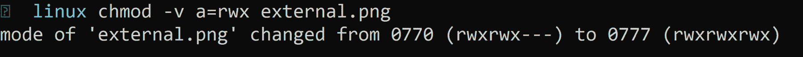
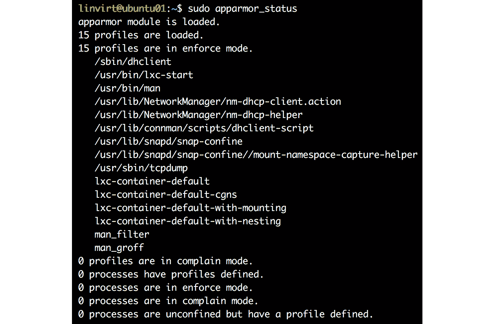
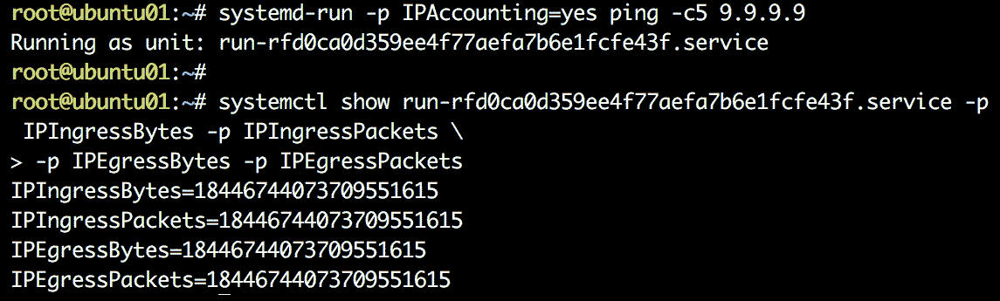
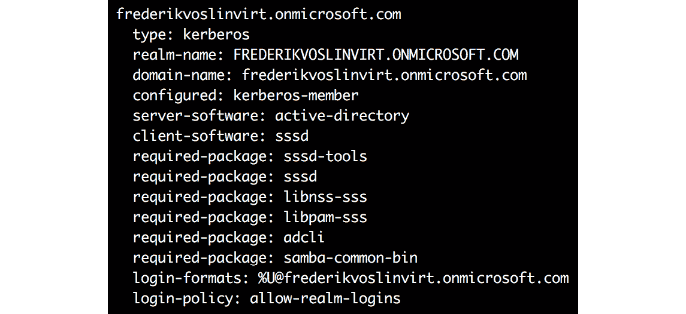
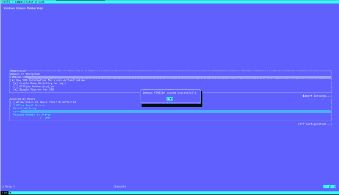

# 第六章:管理 Linux 安全与身份

在前一章中，我们讨论了处理存储，以及网络和进程管理。 但是，作为系统管理员，您的主要目标是保护您的 Linux 机器，以拒绝任何未经授权的访问或限制用户的访问。 在企业环境中，安全漏洞是一个非常值得关注的问题。 在这一章中，我们将讨论安全性——在操作系统级别上保护你的工作负载; 例如,如果您的组织是一个金融机构,你将处理工作负载处理货币承诺,甚至个人身份信息**(PII**)的客户,这是很重要的一个方面,你安全的工作负载,以避免任何破坏。 当然，Azure 已经为您提供了多种方式和级别的服务来保护您的虚拟机。 以下是其中的一些服务:****

 *****   Azure 资源管理器，它提供安全、审计和标记功能
*   Web 应用防火墙，它可以防止许多攻击，如 SQL 注入
*   网络安全组的有状态包过滤特性
*   Azure 防火墙，它提供了一个与 Azure 的监控功能紧密集成的有状态防火墙

您还可以订阅 Azure 安全中心服务，以实现统一的安全管理，并提供许多吸引人的功能，比如持续的安全评估。

有了这些可能性，我们还需要操作系统级别的保护吗? 我们认为，多层次的保护是个好主意。 这将花费黑客更多的精力和时间，这将使它更容易发现黑客。 没有所谓的无漏洞软件:如果一个应用程序是脆弱的，至少操作系统应该受到保护。

身份管理是一个与安全性相关的主题。 您可以将 Linux 与**Azure Active Directory**(**Azure AD**)集成，以集中您的登录帐户，通过使用基于角色的访问控制，撤销访问，并启用多因素身份验证来实现细粒度访问。

到本章结束时，你将能够:

*   实现一个**强制访问控制**(**MAC**)系统，如 SELinux 或 AppArmor。
*   了解**自主访问控制**(**DAC**)的基础知识。
*   使用 Azure 中可用的身份管理系统。
*   使用防火墙守护进程和 systemd 增强 Linux 的安全性。

## Linux 安全提示

在我们深入了解您可以采取的所有重要安全性措施之前，这里有一些关于安全性的提示。

一般来说，在多个级别上实现安全性是一个好主意。 通过这种方式，黑客需要不同的方法来获取访问权限，这将耗费他们的时间。 由于这段时间(希望也由于日志和监视)，您有更大的机会检测未经授权的访问。

对于文件和目录，**DAC**仍然是一个很好的基础。 使文件和目录的权限尽可能严格。 检查所有者和组的所有权，并使用**访问控制列表**(**acl**)代替未授权用户的权限。 尽量避免使用**suid/sgid**位。 是否有用户需要更改自己的密码? 没有? 然后从**passwd**命令中删除该位。

使用分区,尤其是**等目录/ tmp**,**/ var**,**/ var / tmp**,**/**,和山的【显示】noexec,**nodev**,和【病人】nosuid 国旗:

*   一般来说，让用户能够从这些位置执行程序并不是一个好主意。 幸运的是，如果不能将所有者设置为 root，则可以作为普通用户将具有**suid**位的程序复制到自己的目录中。
*   这些目录下的文件的**suid**和**sgid**权限是非常非常危险的。
*   不允许在该分区上创建或存在字符或特殊设备。

使用 SSH 密钥认证方式访问虚拟机，不使用密码。 使用 acl 或防火墙限制对某些 ip 的访问。 限制用户，不允许 root 远程访问(使用**PermitRootLogin no**参数和**AllowUsers**只允许一个或两个帐户访问)。 使用**sudo**作为根用户执行命令。 可以在**sudo**配置中为特殊任务创建特殊用户或用户组。

不要在虚拟机上安装太多的软件，特别是涉及到网络服务时，比如 web 服务器和电子邮件服务器。 不时使用**ss**命令检查开放的端口，并将其与 acl 和/或防火墙规则进行比较。

另一个技巧是不要在系统上禁用 SELinux，它是 Linux 内核中的一个安全模块。 现在不要担心，因为我们有专门的一节介绍 SElinux。

保持你的系统是最新的; Linux 供应商为您提供更新是有原因的。 手动或使用自动化/编排工具。 想做就做!

## 技术要求

就本章而言，您需要部署 RedHat/CentOS 7 和 Ubuntu 18.04 虚拟机。 另一种选择是使用 SUSE SLE 12 或 openSUSE LEAP，而不是 CentOS 和 Ubuntu 虚拟机。 SUSE 支持本章讨论的所有选项。

## DAC

DAC 也称为用户指示的访问控制。 您可能已经熟悉 Linux 和 acl 中的经典权限。 这些结合起来就形成了 DAC。 经典权限检查当前进程的**用户 ID**(**UID**)和**组 ID**(**GID**)。 经典的权限与试图访问文件的用户的 UID 和 GID 匹配，UID 和 GID 设置为文件。 让我们看看 DAC 是如何被引入的，以及在 Linux 中拥有什么级别的权限。 但是，我们不会详细讨论这个问题，因为主要目的是让您熟悉 Linux 中的权限。

### DAC 简介

大多数操作系统，如 Linux、macOS、各种 Unix 甚至 Windows，都是基于 DAC 的。 **中定义 MAC 和 DAC 可信计算机系统评估标准**(**TCSEC**),也被称为橙皮书发表由美国国防部**(**国防部**)。 我们将在下一节讨论 MAC。 顾名思义，DAC 允许文件的所有者或创建者决定他们需要为其他用户提供对同一文件的访问级别。**

 **尽管我们看到 DAC 在所有系统中都实现了，但它也被认为是弱的。 例如，如果我们授予一个用户读访问权，它本质上是传递的。 因此，没有什么可以阻止用户将其他人文件的内容复制到用户可以访问的对象中。 换句话说，DAC 不负责信息的分发。 在下一节中，我们将快速了解一下文件权限。

### Linux 下的文件权限

Linux 中的每个文件和目录都被视为一个对象，并具有三种类型的所有者:用户、组和其他。 接下来，我们通常将文件和目录称为对象。 首先，让我们来了解一下三种不同类型的业主:

*   **User**:用户是创建对象的人。 默认情况下，这个人将成为对象的所有者。
*   **Group**:组是用户的集合。 属于同一组的所有用户对该对象具有相同的访问级别。 组的概念使您更容易同时为多个用户分配权限。 设想这样一个场景:您将创建一个文件，并且希望团队成员也访问该文件。 如果您是一个大型团队的一部分，并为每个用户分配权限，这将是忙碌的。 相反，您可以将用户添加到一个组并定义该组的权限，这意味着组中的所有用户都继承访问权限。
*   **Other**:这指的是不属于该对象的所有者(创建者)或不属于该对象的用户组的任何其他用户。 换句话说，设想一个包含创建者和组中拥有权限的所有用户的集合; " other "指的是不属于该集合元素的用户。

如前所述，每个对象有三种类型的所有者。 每个所有者(用户、组、所有者)对一个对象有三种权限。 这些措施如下:

*   **Read**:读取权限将授予读取或打开文件的权限。 目录上的读权限意味着用户将能够列出目录的内容。
*   **Write**:如果应用于一个文件，这将给予修改该文件内容的权限。 向目录添加此权限将授予在该目录中添加、删除和重命名文件的权限。
*   **Execute**:运行可执行程序或脚本时必须具有此权限。 例如，如果您有一个 bash 脚本，并且您有读写权限，这意味着您将能够读取和修改代码。 但是，要执行代码，您需要此权限。

下面是所有者和相关权限的图示:

###### 图 6.1:所有者类型和访问权限

让我们继续，了解如何从 Linux 终端计算权限。

要列出目录的内容，执行**ls -lah**。

输出将根据你在目录中列出的内容不同:

###### 图 6.2:列出目录的内容

如果观察**数据**行，第一个字母是**d**，这意味着它是一个目录。 至于**external.png**,它是显示**——**,它代表一个文件,还有【显示】l 为**,这意味着一个链接(更像是一个快捷方式)。**

 **让我们来仔细看看:

###### 图 6.3:目录输出的数据行

首先，**rwx**表示用户/所有者具有读、写和执行权限。

其次，**r-x**表示组具有读取和执行权限。 但是，没有写权限。

第三，**r-x**表示所有其他人都有读和执行访问权限，但没有写访问权限。

类似地，您可以理解分配给其他对象的权限。

这些已经被按照**read(r)**，**write(w)**和**execute**的顺序写入。 如果丢失了一封信，那就意味着没有许可。 下面的表格解释了这些字母的含义:

###### 图 6.4:访问权限符号

您可能想知道这个文件的所有者是谁，哪个组正在获得访问权限。 这在输出本身中得到了回答:

###### 图 6.5:所有者和组详细信息

在这种情况下:

*   用户具有读写权限，但无执行权限。
*   组只有读权限，无写和执行权限。
*   所有其他人只有读权限。

下面的图表将帮助你理解如何区分每个所有者的权限:

###### 图 6.6:区分每个所有者的权限

可以使用**chmod**命令修改文件或文件夹的权限。 一般语法是:

chmod 文件名/目录权限

然而，对目录应用权限并不会继承其中的子文件夹和文件。 如果希望继承权限，可以使用**-R**参数，该参数表示*递归*。

此外，该命令不提供任何输出; 也就是说，不管是否应用了权限，它都不会返回任何输出。 可以使用**-v**参数获得详细输出。

有两种方式可以将权限传递给**chmod**命令:

*   符号法
*   绝对的方法/数值模型

### 符号法

在符号方法中，我们将使用操作符和用户表示。 以下是操作符列表:

###### 图 6.7 符号方法中的运算符

这里是用户表示的列表:

###### 图 6.8:用户表示

现在让我们看看如何结合操作符和外延来更改权限。 我们将使用**-v**参数来理解发生了什么变化。

让我们回顾一下我们对**external.png**文件的权限:

###### 图 6.9:外部 png 文件的权限

到目前为止，用户没有执行权限。 要添加这些，请执行以下命令:

Chmod -v u+x external.png

在输出中，您可以看到值从**rwr -r——r——**变为**rwxr——r——**:

###### 图 6.10:添加执行权限

你会在这里看到一些数字。 当我们讨论绝对方法时，我们会讨论这些是什么。

接下来，让我们尝试通过执行以下命令来编写和执行组的权限:

Chmod -v g+wx external.png

因此，将**wx(写入，执行)**添加到**g(组)**将得到类似以下的输出。 你可以清楚地从输出中了解变化:

###### 图 6.11:向组添加写和执行权限

到目前为止，我们一直在添加权限。 现在，让我们看看如何删除其他人现有的读权限。

执行以下:

Chmod -v o-r external.png

这将删除读权限，从下面的输出中可以明显看出:

###### 图 6.12:删除读权限

让我们为每个人(用户、组和其他人)设置读、写和执行权限。

执行如下命令:

Chmod -v a=rwx external.png

输出显示权限更改为**rwxrwxrwx**:

###### 图 6.13:设置每个人的读、写和执行权限

另一个例子涉及到组合每个所有者的权限，并在一个镜头中传递这些权限，如下所示:

Chmod -v u=rw,g=r,o=x external.png

此处将用户权限设置为读写，组权限设置为只读，其他权限设置为只读。 同样，您可以使用逗号分隔权限，并使用必要的操作符授予权限。

### 绝对(数字)节点

在这个方法中，我们将使用一个三位数的八进制数来设置权限。 下面是值及其对应权限的表:

###### 图 6.14:数值及其对应的权限

让我们举个例子。 检查位于当前目录中的**新文件**文件的权限。 执行**ls -lah**:

###### 图 6.15:检查新建文件的权限

现在，让我们使用数字模式并分配权限。 我们将改变用户许可**rwx**,所以 4 + 2 + 1 = 7,然后改变组许可**rw**,所以 4 + 2 + 0 = 6,只有为他人执行,所以 0 + 0 + 1 = 1。

结合这三个数字，我们得到 761，所以这就是我们需要传递给**chmod**的值。

执行如下命令:

Chmod -v 761 新建文件

输出如下:

###### 图 6.16:使用 3 位八进制代码分配权限

现在，我们可以把之前用符号法进行测试时得到的数字联系起来。

下面是该值的图形表示:

###### 图 6.17:图形表示的 3 位八进制码

您可能已经注意到，在我们分配的权限之前有一个额外的数字(例如 0761)。 此**0**用于高级文件权限。 如果您还记得提示，我们有“*这些目录中文件的 suid 和 sgid 权限是非常非常危险的*”和“*尽量避免使用 suid/sgid 位*”。 这些**suid/sgid**值通过一个额外的数字传递。 最好不要使用这个，坚持基本的许可，因为这些是非常危险和复杂的。

现在我们知道了如何更改权限，但是如何更改拥有的用户和组呢? 为此，我们将使用**chown**命令。 语法如下:

乔恩用户:文件名/目录

这将更改文件的所有者和组。 如果你只想改变所有者，你可以使用这个:

乔恩用户文件/目录中

如果您只想更改组，请使用**chgrp**命令:

chgrp 文件名/目录

正如在**chown**命令中所解释的，该命令也不是递归的。 如果您希望将更改继承到目录的子文件夹和文件，请使用**-R**(递归)参数。 您还有一个详细的选项(**-v**)，正如我们在**chmod**中看到的那样。

现在我们知道了权限处理，让我们进入下一节关于 MAC 的内容。DAC 是关于使用 UID 和 GID 进行权限检查的。 另一方面，MAC 是基于策略的访问控制。 现在让我们仔细看看 MAC。

## MAC

在 MAC 中，系统根据特定资源的授权和敏感性来限制对特定资源的访问。 它更基于策略，使用**Linux 安全模块**(**LSM**)实现。

安全标签是 MAC 的核心。每个主题都有一个级别的安全许可(例如，机密或机密)，每个数据对象都有一个安全分类。 例如，一个安全许可级别为 confidential 的用户试图检索一个安全分类为绝密的数据对象时，会被拒绝访问，因为他们的安全许可低于对象的分类。

因此，很明显，您可以在那些机密性非常重要的环境(政府机构等等)中使用 MAC 模型。

SELinux 和 AppArmor 是基于 mac 的商业系统的例子。

### LSM

LSM 是一个框架，用于提供在 DAC 上添加 MAC 的接口。 这种额外的安全层可以通过 SELinux(基于 Red hat 的发行版和 SUSE)、AppArmor (Ubuntu 和 SUSE)或不太知名的 Tomoyo (SUSE)添加。 在本节中，我们将介绍 SELinux 和 AppArmor。

DAC 是一种模型，它提供基于组成员用户的访问控制以及对文件和设备的权限。 MAC 限制对以下资源对象的访问:

*   文件
*   流程
*   TCP / UDP 端口
*   用户及其角色

由 SELinux 实现的 MAC 通过向每个资源对象分配一个分类标签(也称为上下文标签)来工作，而 AppArmor 是基于路径的。 在这两种情况下，如果一个资源对象需要访问另一个对象，则需要清除它。 因此，即使黑客入侵了您的 web 应用程序，例如，其他资源仍然是受保护的!

### SELinux

正如前面提到的，SELinux 是 Linux 中的一个安全模块，作为安全提示，建议不要禁用它。 SELinux 是由美国国家安全局和红帽公司开发的。 首次发布是在 2000 年 12 月 22 日，在撰写本书时，可用的稳定版本是 2019 年发布的 2.9。 它可以在每个基于 Red hat 的发行版和 SUSE 上使用。 本书将介绍在 Red Hat 上的实现。 如果您想在 SUSE 上使用它，请访问 SUSE 文档[https://doc.opensuse.org/documentation/leap/security/html/book.security/cha-selinux.html](https://doc.opensuse.org/documentation/leap/security/html/book.security/cha-selinux.html)来安装和启用 SELinux。 之后的程序都是一样的。 在过去，人们做了一些努力让它在 Ubuntu 上工作，但现在，没有积极的开发，软件包也坏了。

必须显式地授予所有访问权，但是在使用 SELinux 的发行版上，许多策略已经就位。 这几乎涵盖了所有资源对象。 在文档中已经提到的列表之上，它包括以下内容:

*   完整的网络栈，包括 IPsec
*   内核功能
*   **进程间通信**(**IPC**)
*   内存保护
*   文件描述符(通信通道)的继承和传输

对于 Docker 等容器虚拟化解决方案，SELinux 可以保护主机，并在容器之间提供保护。

### SELinux 配置

SELinux 是通过**/etc/selinux/config**文件配置的:

这个文件控制系统上 SELinux 的状态。

# SELINUX=可以接受以下三个值之一:

#强制执行——SELinux 安全策略被强制执行。

# permissive - SELinux 打印警告而不是强制执行。

# disabled -没有加载 SELinux 策略。

SELINUX=enforcing

在生产环境中，该状态应该处于**强制**模式。 策略被强制执行，如果访问受到限制，还可以执行审计以修复 SELinux 造成的问题。 如果您是软件开发人员或打包人员，并且需要为您的软件创建 SELinux 策略，那么**允许**模式将非常方便。

可以使用**setenforce**命令在**强制**和**允许**模式之间切换。 使用**setenforce 0**切换到允许模式，使用**setenforce 1**返回强制模式。 可以通过**getenforce**命令查看当前状态:

# SELINUXTYPE=可以接受以下三个值之一:

# targeted -目标进程被保护，

# minimum -修改目标政策。

#只保护被选中的进程。

# mls -多级安全保护。

SELINUXTYPE=targeted

默认策略-**针对**，保护所有资源，并为大多数工作负载提供足够的保护。 **多级安全性**(**MLS**)通过使用类别和敏感性(如机密、机密和绝密)以及 SELinux 用户和角色提供的权限级别，提供额外的安全性。 这对于提供文件共享的文件服务器非常有用。

如果选择**最小**类型，则只保护最小值; 如果您想要更多的保护，您需要自己配置其他所有东西。 如果在保护多进程应用程序(通常是非常旧的应用程序)时遇到困难，并且生成的策略消除了太多限制，那么这种类型可能很有用。 在这种情况下，最好让特定的应用程序不受保护，并保护系统的其余部分。 在本节中，我将只讨论**SELINUXTYPE=targeted**，这是最广泛使用的选项。

您可以使用**sestatus**命令查看 SELinux 的状态。 输出应该类似如下截图:

###### 图 6.18:SELinux 状态

在我们研究 SELinux 之前，您需要将必要的包添加到系统中，以便能够审计 SELinux。 请执行以下命令:

Sudo yum install se 排除故障

之后，你需要重新启动虚拟机:

sudo systemctl 重启

重启后，我们准备使用 SELinux 并对其进行故障排除:

SELinux 上下文在端口上

让我们从一个涉及 SSH 服务的简单示例开始。 如前所述，所有流程都使用上下文标签进行标记。 为了使这个标签可见，许多实用程序，如**ls**、**ps**和**lsof**，都有**-Z**参数。 首先，你必须找到这个服务的主进程 ID:

systemctl status sshd | grep PID

使用这个进程 ID，我们可以请求上下文标签:

ps -q<pid>-Z</pid>

上下文标签是**system_u**、**system_r**、**sshd_t**和**s0-s0, c0。 c1023** 因为我们使用的是目标 SELinux 类型，所以我们只关心 SELinux 类型部分:**sshd_t**。

SSH 运行在端口 22 上。 现在让我们来研究一下端口上的标签:

ss -ltn 运动 eq 22 -Z

您将建立上下文标签为**system_u**、**system_r**、**sshd_t**、**s0-s0**和**c0。 c1023**，换句话说，完全相同。 不难理解，**sshd**进程确实有权限使用相同的标签在这个端口上运行:

###### 图 6.19:sshd 进程的上下文标签

事情并不总是那么简单，但在进入更复杂的场景之前，让我们先将 SSH 服务器侦听的端口修改为端口 44。 为此，编辑**/etc/ssh/sshd_config**文件:

sed -i 's/#端口 22/端口 44/' /etc/ssh/sshd_config . conf /etc/ssh/sshd_config . conf

重启 SSH 服务器:

重启 SSHD

这将会失败:

sshd 的工作。 服务失败，因为控制进程退出时带有错误代码。

请参见 systemctl status sshd。 服务和 journalctl -xe 的详细信息。

如果您执行**journalctl -xe**命令，您将看到如下消息:

SELinux 正在阻止/usr/sbin/sshd 访问 name_bind

在 tcp_socket 端口 44 上。

有多种方法可以对 SELinux 进行故障诊断。 可以直接使用日志文件**/var/log/audit/audit.log**，也可以使用**sealert -a /var/log/audit/audit.log**，或者使用**journalctl**:

setroubleshoot journalctl——标识符

日志条目还声明如下:

对于完整的 SELinux 消息，运行 sealert -l

执行这个命令(或者将输出重定向到一个文件或管道通过少**或者**),这不仅会给你同样的 SELinux 的消息,但它也将有一个建议,怎么改正:****

 ****如果允许/usr/sbin/sshd 绑定到 44 号网口

此时需要修改端口类型。

做

# semanage port -a -t PORT_TYPE -p tcp 44

其中 PORT_TYPE 是以下其中之一:ssh_port_t, vnc_port_t, xserver_port_t。

在讨论这个解决方案之前，SELinux 使用包含资源对象的多个数据库，应该将上下文标签(即**/**)应用到资源对象。 可以使用**semanage**工具修改数据库并添加条目; 在我们的场景中，数据库端口。 日志的输出建议将 TCP 端口 44 的上下文标签添加到数据库中。 有三种可能的上下文; 它们都会解决你的问题。

另一个重要的方面是，有时存在其他可能的解决方案。 有一个信心评级让你更容易做出选择。 但即便如此，你还是要仔细阅读。 特别是对于文件，有时候，您想要添加一个正则表达式，而不是为每个文件一遍又一遍地添加。

可以采取务实的态度和状态”我不使用 vnc**和**xserver**,所以我选择**ssh_port_t”或者你可以使用**sepolicy**,【显示】的一部分 policycoreutils-devel**包。 **sudo yum install -y policycoretil -devel**:**

 **Sepolicy network -a /usr/sbin/sshd

在输出中搜索 TCP**name_bind**，因为 SELinux 访问正在阻止**/usr/sbin/sshd**有**name_bind**访问**tcp_socket 端口 44**。

现在你知道这个建议是从哪里来的了，看看端口 22 的当前标签:

Sepolicy network -p 22

标签为**ssh_port_t**。

#### 请注意

您可以在端口 22 上使用**语义管理端口-l**和**grep**。

使用相同的标签是很有意义的。 不相信吗? 让我们生成手册页:

-p /usr/share/man/man8/

mandb

**ssh_selinux**手册页在**端口类型**部分告诉您正确的标签是**ssh_port_t**。

最后，让我们解决这个问题:

-a -t ssh_port_t -p TCP 44

不需要重启**sshd**服务; **systemd**将在 42 秒内自动重启该服务。 顺便说一下，**sshd_config**文件已经有了描述此修复的注释。 在**#Port 22**之前的行中明确地声明:

如果你想改变 SELinux 系统上的端口，你必须告诉:

# SELinux 关于这个改变。

# semanage port -a -t ssh_port_t -p tcp #PORTNUMBER

撤销配置更改并将其配置回端口 22 是个好主意; 否则，您可能会被锁定在测试系统之外。

### SELinux 上下文文件

在我们第一次接触 SELinux 并研究了端口上的上下文标签之后，现在是时候研究文件上的上下文标签了。 例如，我们将使用一个**FTP**(**文件传输协议**)服务器和客户机。 安装**vsftpd**和 FTP 客户端:

安装 VSFTPD FTP

然后，创建一个目录**/srv/ftp/pub**:

mkdir -p /srv/ftp/pub

chown -R ftp:ftp /srv/ftp

然后在**/srv/ftp**中创建一个文件:

echo WELCOME > /srv/ftp/README

编辑配置文件**/etc/vsftpd/vsftpd.conf**，并在**local_enable=YES**行下添加如下内容:

anon_root=/srv/ftp

这使得**/srv/ftp**成为匿名用户**vsftpd**服务的默认根目录。 现在你已经准备好启动服务:

启动 vsftpd.service

Sudo systemctl status vsftpd.service

使用**ftp**实用程序，尝试以用户**匿名**的身份登录到 ftp 服务器，没有密码:

ftp 主机

尝试::1…

连接到本地主机(::1)。

220 (vsFTPd 3.0.2)

名称(localhost:根):匿名

请指定密码。

密码:

230 年登录成功。

远程系统类型为 UNIX。

使用二进制模式传输文件。

ftp> ls

进入扩展被动模式(|||57280|)。

这是目录清单。

-rw-r——r——1 14 50 8 july 16 09:47 README

drwxr-xr-x 2 14 50 6 july 16 09:44 pub

目录发送 OK。

尝试获取文件:

得到的自述

和它的工作原理! 为什么这是可能的? 因为数据库中已经有一个带有正确标签的**/srv/ftp/README**条目:

semanage fcontext -l | grep /srv  

上面的命令显示如下:

如果 /([^/]*/)? ftp (/ . *) ? 所有文件 system_u: object_r: public_content_t: s0

在创建新文件时应用:

stat -c %C /srv/ftp/README

ls -Z /srv/ftp/README

这两个命令都告诉您类型是**public_content_t**。 **ftpd_selinux**的手册页有两个部分在这里很重要:**标准文件上下文**和**共享文件**。 手册页声明，**public_content_t**类型只允许您读取(下载)文件，但是不允许您写入(上传)这种类型的文件。 您需要另一个类型**public_content_rw_t**来上传文件。

创建一个上传目录:

Mkdir -m 2770 /srv/ftp/incoming

chown -R ftp:ftp /srv/ftp/incoming

查看当前标签并更改它:

ls -dZ /srv/ftp/incoming

Semanage fcontext -a -t public_content_rw_t "/srv/ftp/incoming(/.*)?"

restorecon -rv /srv/ftp/incoming

ls -dZ /srv/ftp/incoming

首先，您必须将策略添加到**fcontext**数据库; 然后，您可以将策略应用到已经存在的目录。

#### 请注意

请阅读**selinux-fcontext**的手册页。 除了描述所有的选项之外，还有一些很好的例子。

### SELinux Boolean

使用单个字符串，您可以更改 SELinux 的行为。 这个字符串被称为**SELinux Boolean**。 可以使用**getsebool -a**获得布尔值的列表。 使用**boolean allow_ftpd_anon_write**，我们将改变 SELinux 的反应方式。 再次匿名连接到 FTP 服务器，并尝试上传一个文件:

ftp > cd /传入的

目录更改成功。

Ftp > put /etc/hosts 主机

Local: /etc/hosts remote: hosts

进入扩展无源模式(|||12830|)。

550 没有权限。

**journalctl——identifier setroubleshooting**命令让你很清楚:

SELinux 阻止 vsftpd 对 ftp 目录进行写访问。

**sealert**命令将为您提供解决问题所需的信息:

setsebool -P allow_ftpd_anon_write 设置为 1

那么，这里发生了什么? 有时，端口或文件的简单规则是不够的，例如，如果必须使用 Samba 导出 NFS 共享。 在这个场景中，可以创建自己的复杂 SELinux 策略，或者使用带有易于使用的开/关开关的布尔数据库。 为此，您可以使用旧的**setsebool**实用程序或**semanage**:

Semanage Boolean——list | grep "ftpd_anon_write"

修改 ftpd_anon_write——on

使用**setsebool**而不使用**-P**可以进行更改，但它不是持久的。 **semanage**实用程序没有将其更改为非永久的选项。

### AppArmor

在 Debian、Ubuntu 和 SUSE 发行版中，AppArmor 可以实现 MAC。请注意，发行版之间有一些细微的差异，但是，一般来说，一个发行版可以添加更少或更多的配置文件和一些额外的工具。 在本节中，我们以 Ubuntu 18.04 为例。

此外，你还必须确保自己的发行版是最新的，特别是《AppArmor》; Debian 和 Ubuntu 中的软件包都被 bug 所困扰，这有时会导致意想不到的行为。

确保必要的软件包已经安装:

Sudo apt 安装 apparmo -utils apparmo -easyprof \

apparmor-profiles apparmor-profiles-extra apparmor-easyprof

与 SELinux 相比，有一些基本的区别:

*   默认情况下，只保护最小值。 您必须为每个应用程序申请安全性。
*   你可以混合强制和抱怨模式; 您可以针对每个应用程序进行决定。
*   当《AppArmor》开始开发时，范围非常有限:进程和文件。 现在，您可以将其用于**基于角色的访问控制**(**RBAC**)、MLS、登录策略以及其他方面。

在本章中，我们将讨论初始作用域:需要访问文件的进程。

### 显影状态

首先要做的是检查 AppArmor 服务是否启动并运行:

systemctl status apparmor

或者，执行以下命令:

sudo aa-enabled

在此之后，使用以下命令查看更详细的状态:

sudo apparmor_status

这里有一个替代前一个命令:

sudo aa-status

下面的屏幕截图显示了通过**apparmor_status**命令导出的 AppArmor 的状态:

###### 图 6.20:AppArmor 状态

### 生成 AppArmor 配置文件

您想要保护的每个应用程序都需要一个配置文件，该配置文件由**apparor -profiles**或**apparor -profiles-extra**包、应用程序包或您提供。 配置文件存储在**/etc/ apparmore。 d**。

让我们以安装 nginx web 服务器为例:

安装 nginx

如果你浏览**/etc/apparmor. conf。 d**目录，没有 nginx 的配置文件。 创建一个默认的:

我会的

创建配置文件**/etc/apparmo .d/usr.sbin。 nginx**。 这个文件几乎是空的，只包含一些基本的规则和变量，称为抽象，还有下面这行:

/usr/sbin/nginx mr,

**mr**值定义了访问模式:**r**表示读取模式，**m**允许将文件映射到内存中。

让我们执行 nginx 的模式:

sudo aa-enforce /usr/sbin/nginx

须藤系统缓冲 nginx 系统

Nginx 无法启动。 命令回显信息如下:

Sudo journalctl——标识符审计

这很明显地指向了幻影显形:

Sudo journalctl -k | grep 审计

要解决这个问题，请为这个配置文件设置抱怨模式。 这样，它不会强制执行策略，但会抱怨每一次违反安全策略的行为:

sudo aa-complain /usr/sbin/nginx

sudo 系统启动 nginx

使用浏览器或实用程序(例如:**curl**)发出**http**请求:

curl http://127.0.0.1

下一步是扫描**日志文件**并批准或拒绝每个操作:

sudo aa -logprof

仔细阅读，并选择正确的选项与箭头键(如果需要):

###### 图 6.21:配置 nginx 的配置文件

**LXC**(**Linux Containers**)是一种容器技术，我们只是在为 web 服务器配置概要文件。 修正 DAC 似乎是一个不错的选择:

###### 图 6.22:修复 nginx 的 DAC

审计建议采用新的模式:**w**表示对**/var/log/nginx/error.log**文件进行写访问。

此外，您还可以阻止以下目录的访问:

*   读取/etc/ssl/openssl.conf 文件 这是一个困难的问题，但是对**ssl**的抽象听起来是正确的。
*   读取/etc/nginx/nginx.conf 文件 同样，不是容器，所以文件的所有者必须没问题。
*   一般来说，文件的所有者是一个很好的选择。

现在，是时候保存更改并再次尝试:

sudo aa-enforce /usr/sbin/nginx

须藤系统缓冲 nginx 系统

curl http://127.0.0.1

现在一切似乎都工作，至少对一个简单的网站的请求。 正如您所看到的，这在很大程度上是基于有根据的猜测。 另一种选择是深入研究所有建议的抽象。

创建的文件**/etc/apparmo .d/usr.sbin。 nginx**，相对容易阅读。 它开始于所有可调变量，应该为每个配置文件:

#包括<tunables></tunables>

然后该文件后面跟着其他抽象，比如下面这样:

#include <abstractions/nameservice

要知道它们在做什么，只需查看该文件。 例如，**/etc/apparmo . conf。 d/abstractions/ namesservice**文件如下所示:

/usr/sbin/nginx flags=(complain) {

#包括

#包括

#包括

#包括

#### 请注意

许多程序希望执行类似于名称服务的操作，例如按名称或 ID 查找用户、按名称或 ID 查找组、按名称或 IP 查找主机。 这些操作可能通过 DNS、NIS、NIS+、LDAP、hesiod 和 wins 文件进行。 这里允许所有这些选项。

下一节是关于 Posix 功能; 更多信息请参考**man 7 能力**:

能力 dac_override,

最后一部分是权限; 要获得完整的列表，请参考**man 5 显像中的**访问模式**部分。 d**:

/ var / log / nginx / w,日志错误。

老板/etc/nginx/modules-enabled / r,

主人/etc/nginx/nginx.conf r,

老板/运行/ nginx。 pid w,

所有者/usr/lib/nginx/modules/ngx_http_geoip_module。 所以,先生

主人/usr/share/nginx/modules-available / mod-http-geoip.conf r,

主人/usr/share/nginx/modules-available / mod-http-image-filter.conf r,

主人/var/log/nginx/access.log w,

｝

特别是**aa-logprof**，当你开始使用它的时候，可能会有点让人受不了。 但这篇简介读起来并没有那么难; 每个选项都在两个手册页中，其中包含的抽象通过注释进行文档记录。

## 防火墙和 systemd

在*第 5 章*，*高级 Linux 管理*中，systemd 被描述为系统和服务管理器。 在 systemd 中，有几个选项可以为您的守护进程和文件系统添加额外的保护层。

老实说，在我们看来，在 Azure 网络安全组之上使用 Azure Firewall 真的很有意义。 它易于设置，提供中央管理，并且几乎不需要维护。 它在 vm、虚拟网络甚至不同的 Azure 订阅之间提供安全性。

#### 请注意

如果您想使用此防火墙，则需要额外的费用。 然而，Linux 防火墙不会产生任何费用，因为它是安装在您的机器上的一种安全措施。

在 Azure 防火墙和 Linux 防火墙之间的选择取决于很多事情:

*   成本
*   vm 和应用程序的部署和编排
*   不同的角色:是否有一个管理员负责所有的事情?

我希望在介绍了一种 Linux 防火墙实现之后，可以清楚地看到 Linux 防火墙绝不是 Azure 防火墙的完全替代。 它只能为进入 VM 的流量提供安全性，是的，也可以配置该防火墙来阻止流出的流量，但这相当复杂。 另一方面，如果它是在 Azure 网络安全组之上配置的，在许多情况下，这就足够了。

Linux 有不同类型的防火墙解决方案，包括防火墙和 iptables。 在本书中，我们将关注防火墙可用的配置选项及其流行程度。 请确保已安装防火墙软件，并已从系统中删除其他防火墙软件，以避免冲突。 在基于 RHEL/ centos 的发行版中，这种情况已经出现了。 在 Ubuntu 中，使用以下命令:

删除 ufw

安装防火墙

在 suse 版本中，使用以下命令:

防火墙内的 sudo

sudo susefirewall2-to-firewalld - c

Linux 有多种防火墙实现; 其中一些甚至是为特定的发行版开发的，例如 SuSEfirewall2。 在本章中，我们将介绍在每个发行版中都可以使用的防火墙。

防火墙由一个守护进程组成，它管理防火墙的所有组件:

*   区
*   接口
*   来源
*   iptables 和 ebtables 的直接规则(本书未涉及)

防火墙利用内核模块:iptables/IP6 表用于 IPv4 和 IPv6 流量，ebtables 用于过滤通过 Linux 网桥的网络流量。 在最近的发行版中，如 RHEL 8，使用了**nftables**模块。

要配置防火墙规则，有一个可用的命令行实用程序:**firewall-cmd**。 规则可以是仅运行时规则，也可以是持久规则。 这种行为有两个重要的原因:这样，就不需要重新加载所有的规则，这意味着一个临时的安全风险。 您可以动态地添加和删除规则。 如果你犯了一个错误，并因此而无法再次登录; 重启是一个快速解决方案。 我们也可以使用**system -run——oncalendar**命令来创建一个执行**firewall-cmd——reload**的计划任务，这是一个更好的解决方案:

Sudo systemd-run——on-calendar='2018-08-20 13:00:00' \

firewall-cmd——重载

sudo systemctl list-timers

如果防火墙规则是正确的(并且您没有将自己锁在门外)，不要忘记停止并禁用计时器。

您还可以使用与守护进程通信或将 XML 文件推到主机的编排工具来配置守护进程。

#### 请注意

该端口只对连接到虚拟机网络的虚拟机开放，除非您打开网络安全组中的端口!

重要的是要知道 Azure Service Fabric(基础设施)将在必要时向防火墙配置添加额外的规则。 建议不要删除这些规则，因为它们很重要，因为它们是由 Azure 平台使用的。 如果您使用**journalctl**命令在日志数据库中搜索，您可以看到这一点:

sudo journalctl | grep“Azure fabric 防火墙”

使用**iptables-save**命令查看所有活动防火墙规则，或者如果您的发行版正在使用**nftables**:

我要和你谈谈

### 火墙地带

防火墙最重要的概念之一就是区域。 区域由一个默认规则(称为目标)、一个网络接口或网络源以及其他服务、端口、协议和富规则组成。

只有在接口或网络源上附加了网络接口时，区域才会激活。

要列出可用的区域，使用以下命令:

sudo firewall-cmd——get-zones

这些区域在**/usr/lib/firewall /zones**中配置。 您不应该对这些文件进行更改。 新的区域或对区域的更改将写入**/etc/firewall /zones**目录。

缺省区域为公共区域:

sudo firewall-cmd——get-default-zone

要列出公共区域的区域配置，使用如下命令:

Sudo firewall-cmd—zone public—list-all

zone 的配置如下所示:

公共

目标:默认

icmp-block-inversion:不

接口:

来源:

服务:ssh dhcpv6-client

港口:

协议:

化装:不

端口:

源端口:

icmp-blocks:

丰富的规则:

公共区域具有目标策略**default**，这意味着除了配置的服务、端口和协议外，所有传入的内容在默认情况下都被阻塞。

该区域对应的**/usr/lib/firewalld/zones/public.xml**文件如下:

<short>公众</short>

<description>公共场所使用。 您不相信网络上的其他计算机不会伤害您的计算机。 只接受选定的传入连接。</description>

还有配置伪装和端口转发的选项。 富规则是高级防火墙规则，如**防火墙所述。 丰富的语言**手册页。

执行**man 防火墙。 richlanguages**如下截图所示:

###### 图 6.23:**man 防火墙输出 richlanguages 命令**

根据您所使用的发行版，您可能会有额外的服务名称。 例如，如果您正在使用 RHEL 8，您可能会看到**座舱**被列为服务。 **座舱**是一个基于 web 的管理 RHEL 机器的界面。

您可能已经注意到，在公共区域，它显示**目标:默认**。 目标是默认行为。 可能的值如下:

*   **default**:不做任何事，接受每一个 ICMP 报文，拒绝其他所有 ICMP 报文。
*   **%%REJECT%%**:通过 ICMP 协议向客户端发送拒绝响应。
*   **DROP**:在一个开放的端口上，发送一个 TCP SYN/ACK，但所有其他流量都被丢弃。 没有 ICMP 消息通知客户端。
*   **ACCEPT**:接受一切

在 Ubuntu 中，默认情况下，没有附加网络接口。 在连接接口之前，请不要重启虚拟机! 执行如下命令:

Sudo firewall-cmd——add-interface=eth0——zone=public

Sudo firewall-cmd——add-interface=eth0——zone=public——permanent

Sudo firewall-cmd——zone=public——list-all

如果修改一个区域，文件将从**/usr/lib/firewall /zones**复制到**/etc/firewall /zones**。 下一个修改将创建一个文件扩展名为**.old**的区域备份，并创建一个包含修改内容的新文件。

### 防火墙服务

服务是以应用程序为中心的配置，允许一个或多个端口。 要接收可用服务的列表，使用以下命令:

sudo firewall-cmd——服务

如果需要添加服务，例如“MySQL”，请执行如下命令:

Sudo firewall-cmd——add-service=mysql——zone=public

——add-service=mysql——zone=public \

——永久

如果要从区域中删除服务，请使用**——remove-service**参数。

服务配置在**/usr/lib/firewall /services**目录下。 同样，您不应该修改这些文件。 您可以修改它们，也可以通过将它们复制到**/etc/firewall /services**目录中来创建自己的。

也可以添加单个端口，但一般来说，这不是一个好主意:过一段时间后，您还能记得哪个应用程序正在使用哪些端口吗? 相反，如果服务还没有定义，则创建自己的服务。

现在让我们为 Microsoft PPTP 防火墙协议创建一个服务文件**/etc/firewalld/services/pptp.xml**:

<short>PPtP</short>

<description>Microsoft VPN</description>

在上述文件中，可以看到允许使用的 TCP 端口**1723**。 您可以添加任意多的端口规则。 例如，如果要添加 TCP 端口**1724**，则行项如下:

使用**firewall -cmd——reload**重新加载防火墙后，服务可用。 这是不够的:不允许**GRE**(**通用路由封装**)协议。 要允许该协议，使用以下命令:

——service=pptp——add-protocol=gre \

——永久

sudo firewall-cmd——重载

这将在服务文件中添加以下内容:

可以通过**——remove-protocol**参数移除协议。

### 防火墙网络源

只有当网络接口或网络源连接到区域时，区域才处于活动状态。 将网络接口添加到删除区域没有意义。 丢弃区是所有传入的包被丢弃而没有应答的地方; 但是，允许传出连接。 因此，正如我提到的，如果您将网络接口添加到删除区域，所有传入的包将被防火墙删除，这一点都没有意义。

但是，添加一个网络源是有意义的。 一个源由一个或多个表项组成:媒体访问控制地址、IP 地址或 IP 范围。

例如，不管出于什么原因，假设你想封锁所有来自百慕大的交通。 网站[http://ipdeny.com](http://ipdeny.com)可以为您提供 IP 地址列表:

cd / tmp

wget http://www.ipdeny.com/ipblocks/data/countries/bm.zone

有几种类型的**ipset**。 查询当前支持的**ipset**类型列表。

sudo firewall-cmd——get-ipset-types

在我们的场景中，我们希望**哈希:网络**IP 范围的类型:

Sudo firewall-cmd——new-ipset=block_bermuda——type=hash:net——permanent

sudo firewall-cmd——重载

现在，我们可以使用下载的文件向**ipset**添加条目:

Sudo firewall-cmd——ipset=block_bermuda——add-entries-from-file=/tmp/ bmp .zone

Sudo firewall-cmd——ipset=block_bermuda——add-entries-from-file=/tmp/bm。 区\

——永久

sudo firewall-cmd——重载

最后一步涉及将**ipset**作为源添加到区域:

Sudo firewall-cmd——zone=drop——add-source=ipset:block_bermuda

Sudo firewall-cmd——zone=drop——add-source=ipset:block_bermuda——permanent

sudo firewall-cmd——重载

删除区域的目的是在不让客户端知道流量被删除的情况下删除所有流量。 向该区域添加**ipset**将使其激活，所有来自百慕大的流量将被丢弃:

sudo firewall-cmd——get-active-zones

下降

来源:ipset: block_bermuda

公共

接口:eth0

现在，我们已经了解了防火墙的工作原理，以及如何使用区域保护机器的安全，让我们跳转到下一节。

### 系统安全性

如前一章所述，systemd 负责在引导过程中并行启动所有进程，除了那些由内核创建的进程。 在那之后，就需要根据需要激活服务了。 Systemd 单元还可以提供额外的安全层。 您可以添加几个选项到您的单位文件，以使您的单位更安全。

只需使用**systemctl edit**编辑单元文件，并添加安全措施。 例如，执行如下命令:

sudo systemctl edit sshd

然后，添加以下几行:

(服务)

ProtectHome =只读

保存文件，重新读取**systemctl**配置，并重启**sshd**:

sudo systemctl daemon-reload

重启 SSHD

现在，再次使用 SSH 客户端登录，并尝试在主目录中保存一个文件。 这将失败，因为它是一个只读文件系统:

###### 图 6.24:当单元文件更改为只读时，登录失败

### 限制对文件系统的访问

**ProtectHome**参数是一个非常有趣的参数。 取值包括:

*   **true**:目录**/home**，**/root**，和**/run/user**不能被单元访问，并且对于单元内启动的进程显示为空。
*   **read-only**:只读目录。

另一个非常相似的参数是**ProtectSystem**:

*   **true**:**/usr**和**/boot**以只读方式挂载。
*   **full**:**/etc**与**/usr**和**/boot**一起以只读方式挂载。
*   **strict**:除**/proc**、**/dev**和**/sys**外，全文件系统为只读。

而不是**ProtectHome**和**ProtectSystem**,另外,您可以使用以下参数:**ReadWritePaths**白名单目录,**ReadOnlyPaths**、【显示】InaccessiblePaths。

一些守护进程使用**/tmp**目录作为临时存储。 这个目录的问题在于它是世界可读的。 **PrivateTmp=true**参数为进程设置了一个新的临时文件系统，该文件系统只能被进程访问。

也有内核相关参数:**ProtectKernelModules = true 参数使其无法加载模块,和**ProtectKernelTunables = true 参数使它不可能改变内核参数与**sysctl 命令或手动在**/ proc**和【显示】/ sys**目录结构。****

 **最后，但并非最不重要的是，**SELinuxContext**和**AppArmorProfile**参数强制该单元的上下文。

### 限制网络访问

systemd 也可以用来限制网络访问，比如你可以列出那些允许或拒绝的 IP 地址。 systemd 在 235 版本之后的新版本，如 Ubuntu 18.04、SLE 15 SP1 和 RHEL 8，也支持 IP 计费和访问列表来限制网络访问。

**IPAccounting=yes**允许一个单位收集并分析网络数据。 可以使用**systemctl**命令查看查询结果:

systemctl show<service name="">-p IPIngressBytes \</service>

-p IPIngressPackets \

-p IPEgressBytes -p IPEgressPackets

对于每个参数，您也可以在**systemd-run**中使用:

###### 图 6.25:使用 systemd-run 和 systemctl 收集和分析网络数据

可以使用**IPAddressDeny**拒绝某个 IP 地址或 IP 范围。 **IPAddressAllow**可以产生一个例外。 甚至可以在每个服务的基础上拒绝所有系统范围和白名单:

set-property sshd。 服务 IPAddressAllow =任何

Sudo systemctl set-property waagent。 服务 IPAddressAllow = 10.0.0.1

#### 请注意

如果您使用 Ubuntu，服务名称是**walinuxagent**。

systemctl set-property system。 片 IPAddressAllow = localhost

systemctl set-property system。 片 IPAddressAllow = 10.0.0.1

systemctl set-property system。 片 IPAddressDeny =任何

更改保存在**/etc/systemd/system。 control**目录结构

###### 图 6.26:在系统中保存更改 控制目录

以下是我的评论:

*   当然,你必须改变您的虚拟子网 IP 范围,你必须允许访问的第一个 IP 地址的子网 Azure 代理和网络服务,如**DHCP**(**动态主机配置协议**)。
*   将 SSH 访问限制到您自己网络的 IP 地址也是一个非常好的主意。
*   仔细查看 systemd 日志，以确定是否需要打开更多端口。

systemd 访问列表特性可能没有防火墙那么高级，但它是应用程序级别限制的一个很好的替代选择(主机允许在守护进程的配置文件或**/etc/hosts.中设置指令 对于使用**libwrap**support 编译的应用程序，允许**和**/etc/hosts.deny**。 而且，在我们看来，在 Azure 中，你不需要比这更多。 如果所有发行版都有 systemd 的最新版本就好了。

#### 请注意

在本书中，我们不会讨论**libwrap**库，因为越来越多的应用程序不再使用这个选项，一些供应商，比如 SUSE，正忙于删除对这个库的完全支持。

## Azure - IAM 中的身份和访问管理

到目前为止，我们一直在讨论如何在 Linux 中管理安全性。 由于我们部署在 Azure 中，Azure 也为我们的 Linux 虚拟机提供了一些额外的安全性。 例如，在前面，我们讨论了 Azure Firewall 和网络安全组，它们有助于控制流量，限制对不需要的端口的访问，并过滤来自未知位置的流量。 在此之上，Azure 中还有其他服务，比如 Azure AD 域服务，它可以让您将 Linux 虚拟机加入域。 最近，微软推出了一个选项，Azure AD 用户可以通过该选项登录 Linux 虚拟机。 这样做的好处是你不需要使用其他用户名; 相反，您可以使用 Azure AD 凭据。 让我们仔细看看这些服务，并了解如何利用它们来提高 Linux vm 的安全性。

### Azure AD 域服务

到目前为止，我们一直在讨论在 Linux VM 中可以做什么。 由于我们是在 Azure 上，我们应该利用 Azure AD 域服务，通过该服务，您可以域加入您的 Linux 机器并执行您的组织的策略。 Azure AD 域服务是一种域控制器服务，它为您提供 DNS 服务和身份管理。 中心身份管理始终是安全解决方案的重要组成部分。 允许用户访问资源。 除此之外，还可以实施策略并启用多因素身份验证。

在本节中，我们将重点介绍如何设置服务以及如何加入域。

### 搭建 Azure AD 域服务

建立 Azure AD 域服务最简单的方法是通过 Azure 门户。 在左侧选择**创建资源**，搜索*域服务*。 选择**Azure AD 域服务**，点击**创建**按钮。

在向导中，你将被要求一些设置:

*   **域名**:您可以使用自己的域名，也可以使用内置的以**.onmicrosoft.com 结尾的域名**。 就本书而言，这就足够了。
*   **虚拟网络**:创建一个新的虚拟网络和一个新的子网是个好主意。 标签并不重要。
*   **Administrators**:一个组将被命名为**AAD DC Administrators**。 要使用用户加入域，该用户必须是这个组的成员，使用 Azure 门户左侧栏中的**Active Directory**部分。

现在您已经准备好部署服务了。 这需要一段时间; 根据我的个人经验，这可能需要 20 到 30 分钟。

完成后，转到左边栏的**虚拟网络**部分，并进入新创建的虚拟网络。 您将发现两个新创建的网络接口及其 IP 地址。 你会需要这个信息，所以把它记下来。

在这个虚拟网络中创建一个新的子网是一个好主意，但这不是必需的。

### Linux 配置

您必须将 Linux 虚拟机部署在相同的虚拟网络中，或者部署 Azure AD 目录服务的对等网络中。 如上所述，将其连接到另一个子网是一个好主意。 这里，我们没有遵循安全 LDAP。

### 主机名

使用**hostnamectl**实用程序将主机名更改为正确的**fqdn**:

Sudo hostnamectl set-hostname ubuntu01.frederikvoslinvirt.onmicrosoft.com

然后编辑**/etc/hosts**文件。 添加如下条目:

127.0.0.1 ubuntu01.frederikvoslinvirt.onmicrosoft.com ubuntu01

### DNS 服务器

在 Azure portal 的左侧栏中，进入**虚拟网络**，找到 Azure AD 域服务网络接口所在的子网。 选择**DNS 服务器**，使用自定义选项设置 Azure AD 域服务网络接口的 IP 地址。 通过这样做，当需要主机名的 DNS 解析时，它将被指向 Azure AD 域服务。

或者，如果您的 Azure AD 域服务是一个新的部署，在 Azure 门户的**Overview**窗格中，它将要求您更改 DNS 服务器。 只需点击**配置**按钮，虚拟网络中的 DNS 服务器就会指向 Azure AD 域服务。

通常，重新启动 VM 中的网络就足够了，但最好现在就重新启动。 时不时地，旧的和新的设置都保留下来。

在 RHEL、Ubuntu 和 SUSE 系统中，可以通过查看“**/etc/resolv.conf**”文件内容来验证。 然后，查看**eth0**的设置。

### 安装依赖

为了能够使用 Azure AD 域服务，需要一些重要的组件和依赖:

*   用于授权的 Kerberos 客户机
*   SSSD，负责配置和使用特性(如使用和缓存凭证)的后端
*   Samba 库，以便与 Windows 特性/选项兼容
*   一些用于连接和管理域的实用程序，如**realm**、**adcli**和**net**命令

安装必要的软件以加入域。

RHEL/ centos 版本:

Sudo yum 安装 realmd SSSD krb5-workstation krb5-libs samba-common-tools

在 Ubuntu 中，执行如下命令:

sudo apt install krb5-user samba sssd sssd-tools libnss-sss libpam-sss realmd adcli

在 SLE/OpenSUSE LEAP 中，依赖关系将由 YaST 处理。

### 加入域- Ubuntu 和 RHEL/CentOS

在 Ubuntu 和 RHEL/ centos 发行版中，可以使用**realm**实用程序加入该域。 首先，发现域:

sudo realm discover

输出应该类似如下:

###### 图 6.27:发现域

现在，您已经准备好加入域:

sudo realm join<your domain="">-U<username></username></your>

使用您在前面添加的用户名作为 Azure AD 域服务管理员组的成员。 如果您得到消息说**必需的包没有安装**，但您确定它们已经安装，那么将**——install=/**参数添加到**领域**命令中。

执行以下命令验证结果:

sudo 领域列表

输出应该类似如下:

###### 图 6.28:加入域

你应该能够做以下事情:

id<user>@<domain></domain></user>

su<user>@<domain></domain></user>

使用此用户通过**ssh**远程登录。

#### 请注意

如果这不起作用，并且连接成功，则重新启动 VM。

### 加入域- SUSE

在 SUSE SLE 和 LEAP 中，加入域的最佳方式是使用 YaST。

启动 YaST 实用程序:

须藤 yast

在 YaST 主窗口中，启动**用户登录管理**模块，点击**更改设置**。 点击**加入域**，填写域名。 之后，您就可以成功地注册域名了。 如果有必要，将安装依赖项。

将出现一个新窗口来管理域用户登录。 您至少需要以下内容:**允许域用户登录**和**创建主目录**。 所有其他选项在 Azure AD 域服务中还不可能。

YaST 将在 shell 上为您提供一个彩色的类似 gui 的界面，使用它意味着您可以将机器加入域。 运行**sudo yast**后，您将看到如下所示的屏幕。 从列表中，使用方向键选择**网络服务**，然后**Windows 域成员**:

###### 图 6.29:Shell 上的 YaST 接口

最好的部分是，如果缺少任何依赖项，YaST 会提示您安装它们，所以请继续并完成依赖项的安装。 安装完成后，你可以输入你的域名，保存后，你会被提示输入用户名和密码，如下截图所示:

###### 图 6.30:提供凭据来注册机器

以**user@domain**的格式输入凭证，然后输入密码。 一旦你完成了这个过程，SUSE 机器将访问 Azure AD 域服务并注册你的机器。 如果加入成功，你会在屏幕上看到如下信息:

###### 图 6.31:域加入成功

您可以通过使用**su**命令将当前用户切换到您的 AD 用户名来验证，如下图所示:

###### 图 6.32:验证域加入

最后，我们完成了将我们的 Linux 机器加入到 Azure AD 域服务中。 最近，微软为 Linux 虚拟机添加了 Azure AD 登录支持，而不需要将机器加入域。 将在机器上安装代理来完成授权。 这将在下一节中讨论。

### 使用 Azure AD 凭据登录 Linux 虚拟机

Azure AD 可以实现另一种形式的身份管理。 这是一种完全不同的身份管理系统，没有 LDAP 和 Kerberos，如前一节所述。 在 Linux 中，Azure AD 将允许您使用 Azure 凭证登录到 VM，但在应用程序级别不支持。 在写这本书的时候，这个特性还处于预览阶段。 SUSE 不支持该特性。

为了能够使用 Azure AD，你必须部署一个 VM 扩展，例如，使用 Azure CLI:

Az 虚拟机扩展集“\”

——出版商 Microsoft.Azure.ActiveDirectory.LinuxSSH \

    --name AADLoginForLinux \

——资源组 myResourceGroup \

——vm-name myVM

在此之后，您必须为您的 Azure AD 帐户分配一个角色，即**虚拟机管理员登录**(具有 root 权限)或**虚拟机用户登录**(无特权用户)角色，其作用域仅限于此虚拟机:

Az 角色分配 create \

——role“虚拟机管理员登录”\

——受让人<ad user="" name="">\</ad>

——范围

在这里，您可以在订阅级别**—scope /subscriptions/<订阅 ID>**设置范围。 通过这样做，角色将由订阅中的所有资源继承。

如果你想要对特定的虚拟机进行粒度级访问，你可以执行以下命令(在 PowerShell 中):

$vm = Get-AzVM -Name<vm name="">-ResourceGroup</vm>

**$vm。 Id**将给出虚拟机的范围。

在 bash 中执行如下命令:

az vm show——name<name>——resource-group<resource group="">——查询 id</resource></name>

该命令将查询虚拟机的 ID，并且是角色分配的范围。

您可以使用您的广告凭证登录:

ssh<ad user="">@<ad domain="">@</ad></ad>

最后，您将能够看到使用 Azure AD 凭据登录到 Linux VM。

### Azure 中的其他安全解决方案

在本章中，我们讨论了如何提高 Linux 的安全级别，并结合某些 Azure 服务来提高安全性。 话虽如此，可用于提高安全性的 Azure 服务的列表非常长。 其中一些在这里突出显示:

*   Azure 广告管理身份:使用这个,您可以创建 vm 管理身份,可用于验证任何支持 Azure 服务广告认证(https://docs.microsoft.com/en-us/azure/active-directory/managed-identities-azure-resources/overview)。 以前，这个服务被称为**托管服务身份**(**MSI**)，现在称为**Azure 资源的托管身份**。
*   密钥库:这可以用来安全地存储密钥。 例如，在 Azure Disk Encryption 中，密钥将存储在密钥库中，并在需要时访问([https://docs.microsoft.com/en-us/azure/key-vault/basic-concepts](https://docs.microsoft.com/en-us/azure/key-vault/basic-concepts))。
*   Azure 磁盘加密:加密将帮助您加密操作系统磁盘,以及数据磁盘,有额外的安全数据存储(https://docs.microsoft.com/en-us/azure/virtual-machines/linux/disk-encryption-overview)。
*   RBAC: Azure 中的 RBAC 提供了为 vm 分配粒度权限的能力。 Azure 中有很多内置的角色，您可以根据您的安全需求分配一个角色。 此外，您可以创建自定义 RBAC 角色，以提供更细粒度的权限([https://docs.microsoft.com/en-us/azure/role-based-access-control/overview](https://docs.microsoft.com/en-us/azure/role-based-access-control/overview))。
*   **Azure 安全中心**(**ASC): ASC 是一个统一的基础设施安全管理系统旨在巩固您的安全(https://docs.microsoft.com/en-us/azure/security-center/security-center-intro)。**
*   Azure Policy Guest 配置:这可以用于审计 Linux 虚拟机内部的设置。 已在*第 8 章*、*探索连续配置自动化*中详细讨论。

我们建议您仔细阅读与这些服务相关的 Microsoft 文档，以便更好地了解如何在您的环境中使用这些服务来加强整体安全性方面。

## 总结

安全是当今一个非常重要的话题。 关于这个问题已经写了许多报告、书籍等。 在本章中，我们讨论了 Linux 中提高安全性的几种选项。 所有这些都是在 Azure 通过网络安全小组提供的基本安全之上的。 它们相对容易实现，并且会带来很大的不同!

集中式身份管理不仅是为用户提供访问 VM 的一种方式，而且也是降低安全风险的一部分。 Azure AD 域服务通过 LDAP 和 Kerberos 为所有支持这些协议的操作系统和应用程序提供身份管理解决方案。

第 8 章，探索连续配置自动化，将涵盖自动化和编排。 请注意，本章中涉及的所有安全措施都可以很容易地协调。 编制使中央配置管理成为可能。 它的一大优点是防止错误和难以管理的配置。 这样，即使编制也是您的安全计划的一部分!

如果要创建自己的 vm，尤其是要构建自己的映像，那就更好了。 我们将在下一章讨论如何构建自己的映像。 此外，我们还将考虑在您的环境中推送和部署这些映像时的安全性问题。

## 问题

1.  如果你要实现防火墙，配置防火墙的方法有哪些?
2.  为什么要使用**firewall-cmd**的**——permanent**参数?
3.  还有哪些其他选项可以用来限制网络访问?
4.  解释 DAC 和 MAC 之间的区别。
5.  为什么在 Azure 上运行的虚拟机中使用 Linux 安全模块很重要?
6.  哪个 MAC 系统可用于哪个发行版?
7.  AppArmor 和 SELinux 的主要区别是什么?
8.  在依赖关系和 Linux 配置方面，加入 Azure AD 域服务有哪些要求?

## 进一步阅读

类似于前一章,我强烈建议你去*第 11 章*,*工作负载的故障诊断和监测,读到日志在 Linux 中,因为通常,**systemctl 状态**命令不提供足够的信息。 我还提到了 Lennart Poettering 的博客和 systemd 网站。*

 *对于一般的 Linux 安全，你可以开始阅读这本书*掌握 Linux 安全与加固*，作者是 Donald A. Tevault。 本章所涵盖的许多主题，以及其他许多主题，都作了详细的解释。

防火墙守护进程有一个项目网站[https://firewalld.org](https://firewalld.org)，其中有一个博客和优秀的文档。 对于较老的发行版，Arch Linux 的 wiki 是了解更多内容的好地方:[https://wiki.archlinux.org/index.php/iptables](https://wiki.archlinux.org/index.php/iptables)。 而且由于防火墙使用 iptables，在深入探究**防火墙的手册页之前，这是一个很好的开始。 【课文讲解】**

所有的细节关于 SELinux 红帽提供的指南:https://access.redhat.com/documentation/en-us/red_hat_enterprise_linux/7/html/selinux_users_and_administrators_guide/和[虽然有点过时了,这是一个很好的主意的 Red Hat 峰会看这个视频在 YouTube 上关于 SELinux:](https://access.redhat.com/documentation/en-us/red_hat_enterprise_linux/7/html/selinux_users_and_administrators_guide/) [https://www.youtube.com/watch?v=MxjenQ31b70](https://www.youtube.com/watch?v=MxjenQ31b70)。

然而，要找到关于 AppArmor 的好信息就更困难了。 项目文档可以在[https://gitlab.com/apparmor/apparmor/wikis/Documentation](https://gitlab.com/apparmor/apparmor/wikis/Documentation)上找到，Ubuntu 服务器指南是一个很好的开始。 可以在[https://help.ubuntu.com/lts/serverguide/apparmor.html.en](https://help.ubuntu.com/lts/serverguide/apparmor.html.en)上找到。*****************