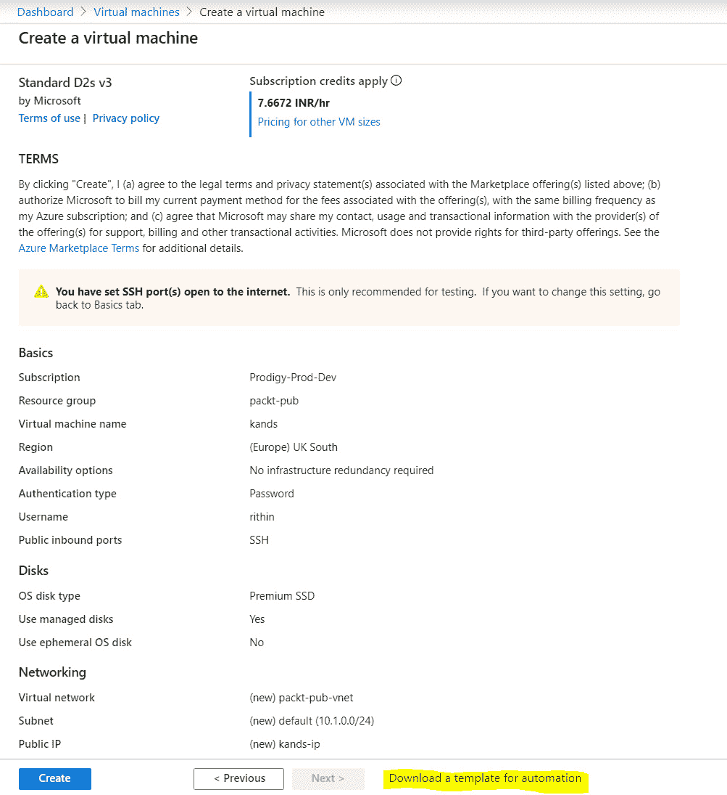
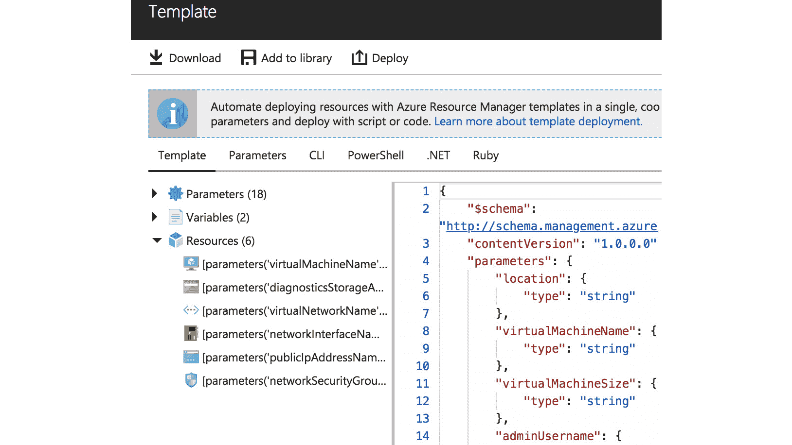
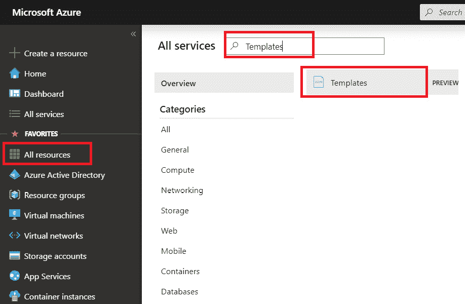
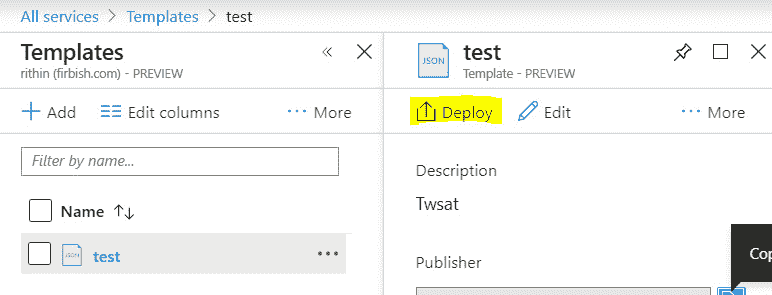
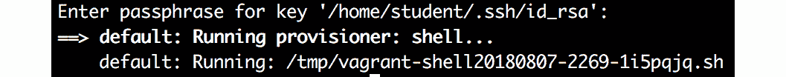
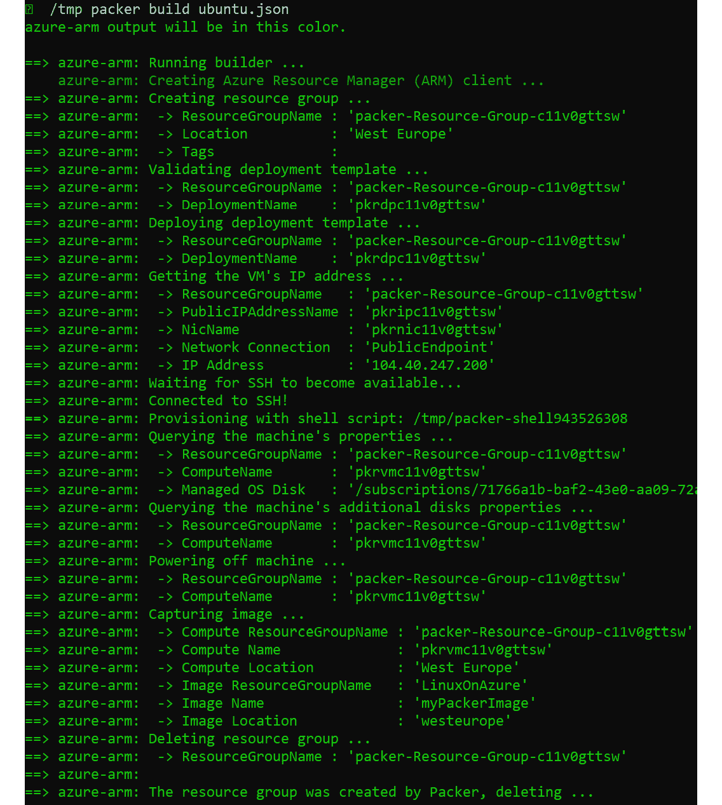
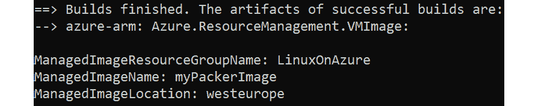
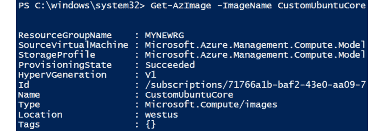

# 第七章:部署你的 Vir虚拟机

在 Azure 中部署单个**虚拟机**(**VM**)很容易，但是一旦您想要以单一的、可重复的方式部署更多的工作负载，您就需要某种类型的自动化。

在 Azure 中，您可以使用**Azure 资源管理器**(**ARM**)与 Azure CLI、PowerShell、Ruby 和 c#一起使用模板配置文件部署虚拟机。 其他用于为 vm 创建映像的第三方工具，如 Packer 和 Vagrant，将在本章后面讨论。

所有这些部署方法或映像创建方法都使用来自 Azure 的映像，但也可以使用自定义映像创建自己的自定义 vm。

在开始配置所有可能的选项之前，一定要了解不同的部署选项，以及为什么应该或不应该使用它们。 你必须先问自己几个问题:

*   您打算什么时候部署应用程序?
*   工作负载的哪些部分应该是可重复的?
*   工作负载配置的哪些部分应该在部署期间完成?

所有这些问题将在本章结束时得到解答。 以下是本章的要点:

*   我们将讨论 Azure 中的自动部署选项。
*   我们将看到如何使用 Azure CLI 和 PowerShell 来自动化部署。
*   我们将介绍用于部署的 Azure ARM 模板，以及如何在重新部署时重用它们。
*   将讨论 VM 映像创建工具，如 Packer 和 Vagrant。
*   最后，我们将解释如何使用自定义映像，并将我们自己的**VHD**(**虚拟硬盘**)带到 Azure。

## 部署场景

引言中提到的三个问题是非常重要的; 这些在每个公司、每个应用程序和开发阶段都是不同的。 下面是一些部署场景的示例:

*   应用程序是在内部开发的，甚至可以在您的本地计算机上开发。 一旦完成，应用程序就被部署到 Azure 中。 更新将应用于正在运行的工作负载。
*   这是相同的场景，但是现在更新将通过部署一个新的 VM 来完成。
*   应用程序由另一个供应商交付。

这三个示例非常常见，可以影响您希望部署工作负载的方式。

### 你需要什么?

在开始部署之前，您应该知道需要什么，或者换句话说，需要哪些资源才能使应用程序正常工作。 此外，Azure 中的所有东西都有限制和配额。 有些限制是困难的，有些可以通过联系微软支持来增加。 要查看 Azure 限制和配额的完整列表，请访问[https://docs.microsoft.com/en-us/azure/azure-subscription-service-limits](https://docs.microsoft.com/en-us/azure/azure-subscription-service-limits)。

在部署之前，我们需要计划并确保我们的订阅限制不会阻碍我们的项目。 如果有限制，请联系微软支持部门并增加限额。 然而，如果您是免费试用，配额请求将不会被批准。 您可能必须将部署转移到有足够配额来完成部署的区域。 这些是我们将要部署的关键资源:

*   资源组
*   存储帐户(非托管)或托管磁盘
*   网络安全组
*   虚拟网络
*   用于虚拟网络的子网
*   虚拟机绑定的网口

对于虚拟机，您需要指定并考虑以下几点:

*   虚拟机大小
*   存储
*   VM 的扩展
*   操作系统
*   初始配置
*   应用程序的部署

如果您查看这些列表，您可能想知道是否需要或需要自动部署或自动化。 答案并不容易找到。 让我们再看一遍这些场景，试着找出答案。 我们可以决定做以下事情:

1.  在 PowerShell 或 Bash 中创建一个脚本，为工作负载准备 Azure 环境
2.  创建第二个脚本，根据 Azure 中的报价部署 VM，并使用 Azure VM 扩展配置初始配置
3.  使用软件管理器(如 Yum)部署应用程序

决定这样做并没有什么错; 这对你来说可能是最好的解决办法! 然而，不管你喜欢与否，有以下依赖:

*   您可以基于映像部署操作系统。 此图像由发布者提供。 如果映像更新到您的应用程序不支持的版本，会发生什么情况?
*   这个映像中已经完成了多少初始配置? 需要多少钱，谁控制图像?
*   这个图像是否符合您的安全策略?
*   如果你出于某种原因想离开 Azure，你能把你的应用程序转移到其他地方吗?

## Azure 中的自动部署选项

在这篇长时间的介绍之后，是时候看看可以自动部署工作负载的特性选项了:

*   脚本
*   Azure 资源管理器
*   Ansible
*   起程拓殖

我们将在*第八章，探索连续配置自动化*中讨论 Ansible 和 Terraform。

### 脚本

自动化可以通过脚本完成。 在 Azure 中，微软支持很多选项:

*   Bash 与 Azure CLI
*   PowerShell 与 Az 模块
*   Python，包含完整的 SDK 在[https://docs.microsoft.com/en-us/azure/python/python-sdk-azure-install](https://docs.microsoft.com/en-us/azure/python/python-sdk-azure-install )
*   [https://azure.microsoft.com/en-us/develop/ruby](https://azure.microsoft.com/en-us/develop/ruby )
*   [https://github.com/Azure/azure-sdk-for-go](https://github.com/Azure/azure-sdk-for-go )提供完整的 SDK
*   Node.js 也有可用的库

此外，您还可以使用 Java 和 c#等编程语言。 还有社区项目; 例如，[https://github.com/capside/azure-sdk-perl](https://github.com/capside/azure-sdk-perl)是为 Perl 构建一个完整的 Azure SDK 的尝试。

所有语言都是有效的选项; 选择一门你已经熟悉的语言。 请注意，在本书编写时，Ruby SDK 是预览版。 在预览状态期间，语法可能会发生变化。

编写脚本对于准备 Azure 环境尤其有用。 您还可以使用脚本来部署 VM，甚至可以使用 VM 扩展包含初始配置。 这是否是一个好主意的问题取决于您的脚本编写能力、操作系统的基本映像以及其中安装的软件版本。

反对使用脚本的最大理由是编写脚本非常耗时。 这里有一些技巧可以帮助你高效地编写脚本:

*   使用尽可能多的变量。 这样，如果您要在脚本中进行更改，您所要做的就是更改变量的值。
*   在循环中使用可识别的变量名，而不是像中的**那样为 i 命名。**
*   特别是对于较大的脚本，声明可以重用的函数。
*   有时，将变量(例如提供身份验证的变量)和函数放在单独的文件中是有意义的。 每个脚本一个任务通常是一个好主意。
*   在代码中包含修改的时间戳，或者更好的方法是使用版本控制系统，如 Git。
*   包括测试。 例如，只在这个资源不存在的情况下创建它。 使用人类可读的退出代码。 如果脚本未能部署资源，则使用类似*无法创建$资源*的内容，以便运行脚本的人能够理解脚本未能创建资源。
*   包括足够的注释。 如果您在一段时间后需要调试或重用脚本，您仍然知道它是做什么的。 不要忘记在标题中也包含一个描述。
*   花些时间在布局上; 使用缩进来保持代码的可读性。 缩进使用两个空格，而不是制表符!

现在我们来看一个简短的例子。 这个示例将让您了解如何创建脚本，以便在部署 VM 之前在 Azure 中提供所需的东西。

首先，声明变量。 您还可以将这些变量添加到文件中，并让 PowerShell 加载这些变量。 建议将它们存储在同一个脚本中，这样你就可以在需要时随时返回并更新它们:

#声明变量

$myResourceGroup = "LinuxOnAzure"

$myLocation = "西欧"

$myNSG = "NSG_LinuxOnAzure"

$mySubnet = "10.0.0.0/24"

$myVnet= "VNET_LinuxOnAzure"

接下来，编写一个脚本来创建一个资源组。 如果资源已经存在，脚本将跳过创建部分。 正如前面提到的，添加注释是使脚本可读的最佳实践，所以使用标记为**#**的注释，以便您了解代码块的功能:

#测试资源组是否已经存在，如果不存在:创建它。

Get-AzResourceGroup -Name $myResourceGroup -ErrorVariable notPresent -ErrorAction SilentlyContinue | out-null

如果($ notPresent)

  {

# ResourceGroup 不存在，创建它:

New-AzResourceGroup -Name $myResourceGroup -Location $myLocation

写主机“资源组$myResourceGroup 是在$myLocation 创建的”

  }  

其他的

  {

“资源组$myResourceGroup 已经存在于位置$myLocation 中”

  }

创建虚拟网络并配置子网:

#测试 vnet 名称是否已经存在:

Get-AzVirtualNetwork -Name $myVnet -ResourceGroupName $myResourceGroup -ErrorVariable notPresent -ErrorAction SilentlyContinue | out-null

如果($ notPresent)

  {

# vnet 不存在，创建 vnet

$virtualNetwork = New-AzVirtualNetwork -ResourceGroupName $myResourceGroup -Location $myLocation -Name $myVnet -AddressPrefix 10.0.0.0/16

#添加子网配置

$subnetConfig = Add-AzVirtualNetworkSubnetConfig -Name default -AddressPrefix $mySubnet -VirtualNetwork $virtualNetwork

#关联子网到虚拟网络

美元 virtualNetwork | Set-AzVirtualNetwork

“配置了$mySubnet 的虚拟网络$myVnet 是在$myLocation 创建的”

  }

其他的

  {

“资源组$myVnet 已经存在于$myLocation 中”

  }

下面是创建网络安全组的示例:

创建 NSG

#测试网络安全组是否不存在:

Get-AzNetworkSecurityGroup -ResourceGroupName $myResourceGroup -Name $myNSG -ErrorVariable notPresent -ErrorAction SilentlyContinue | out-null

如果($ notPresent)

｛

#创建核供应国集团

$nsg = New-AzNetworkSecurityGroup -ResourceGroupName $myResourceGroup -Location $myLocation -Name $myNSG

#为 SSH 和 HTTP 创建规则

$nsg | Add-AzNetworkSecurityRuleConfig -Name "allow_http" -Description "允许 HTTP" -访问允许"

-Protocol "TCP" -Direction Inbound -Priority 1002 - sourceaddresprefix "*" -SourcePortRange * '

- destinationaddresprefix * -DestinationPortRange 80

$nsg | Add-AzNetworkSecurityRuleConfig -Name "allow_ssh" -Description "Allow SSH" -Access Allow "

-Protocol "TCP" -Direction Inbound -Priority 1001 -SourceAddressPrefix "*" -SourcePortRange * '

    -DestinationAddressPrefix * -DestinationPortRange 22

#更新核供应国集团。

美元 nsg | Set-AzNetworkSecurityGroup

“NSG: $myNSG 被配置为在资源组$myResourceGroup 中创建 SSH 和 HTTP 规则”

｝

其他的

｛

“NSG $myNSG 已经存在于资源组$myResourceGroup 中”

｝

到目前为止，您应该对如何创建脚本和虚拟网络有了相当好的了解。 正如本节开始时提到的，脚本并不是自动化部署的唯一手段; 还有其他方法。 在下一节中，我们将讨论如何使用 Azure Resource Manager 模板来自动化部署。

### Azure 资源管理器自动部署

在*第二章:Azure 云入门*中，我们定义**Azure 资源管理器**(**ARM**)如下:

*“基本上，Azure 资源管理器允许您使用存储和虚拟机等资源。 为此，您必须创建一个或多个资源组，以便在单个操作中执行生命周期操作，例如部署、更新和删除资源组中的所有资源。”*

通过 Azure 门户或使用脚本，您可以完成所有声明的事情。 但这只是其中的一小部分。 您可以使用模板通过 ARM 部署 Azure 资源。 微软提供了数百个快速启动模板，可以在[https://azure.microsoft.com/en-us/resources/templates](https://azure.microsoft.com/en-us/resources/templates )上找到。

当您通过 Azure 门户创建 VM 时，您甚至可以在创建 VM 之前将其作为模板下载。 如果你参考下面的截图，你可以看到，甚至在创建虚拟机之前，我们有一个选项来下载自动化的模板:

###### 图 7.1:下载 VM 作为模板

点击**下载自动化模板**，会看到如下画面:

###### 图 7.2:虚拟机模板窗格

如您所见，您可以将该脚本添加到 Azure 中的库中，或者将该文件下载到本地计算机中。 您还将获得一个**Deploy**选项，通过该选项，您可以更改参数并直接部署到 Azure。

在**Scripts**窗格中，Azure 提供了如何使用 PowerShell 和 CLI 进行部署的链接。

您可以轻松地更改参数并部署一个新的 VM 或重新部署完全相同的 VM。 这与使用您自己的脚本并没有什么不同，但在开发方面它更节省时间。

这不是你能用 ARM 做的唯一事情; 您可以配置 Azure 资源的每个方面。 例如，如果您正在通过 ARM 模板部署一个网络安全组，那么您需要定义一切，比如规则、端口范围和规则的优先级，这与您在 Azure 门户或通过 CLI 创建的方式相同。 创建自己的 ARM 模板并不是那么困难。 你需要 ARM 参考指南，可以在[https://docs.microsoft.com/en-us/azure/templates](https://docs.microsoft.com/en-us/azure/templates)找到。 结合这些示例，这是一个很好的入门资源。

另一种开始的方法是使用 Visual Studio Code 编辑器，它可用于 Windows、Linux 和 macOS 的[https://code.visualstudio.com](https://code.visualstudio.com)。 **Azure 资源管理器工具**扩展是必备的,如果你要开始使用手臂,连同其他一些扩展,比如**Azure 账户和登录**,**【T7 Azure 资源管理器片段】,**和【显示】Azure CLI 工具。 您可以开始使用现有的模板，甚至可以将它们上传到 Cloud Shell、执行和调试它们。

要安装 Azure 资源管理器工具扩展，请遵循以下步骤:

1.  打开 Visual Studio 代码。
2.  从左侧菜单中选择**Extensions**。 或者，在**View**菜单中，选择**Extensions**打开**Extensions**窗格。
3.  搜索**资源管理器**。
4.  在**Azure Resource Manager Tools**下选择**Install**。

这里是您找到的屏幕上的**安装**选项:

###### 图 7.3:安装 Azure 资源管理器工具

Azure 中另一个很好的特性是 ARM Visualizer，您可以在[http://armviz.io](http://armviz.io)找到它。 它仍处于发展的早期阶段。 这是一个工具，可以帮助您快速了解您从快速入门模板网站下载的 ARM 模板的用途。

除了下载模板，还可以将它们保存到一个库中:

###### 图 7.4:将模板保存到库

如本窗格所述，您可以通过使用左侧导航栏中的**所有资源**轻松地在 Azure 门户中导航，并搜索模板:

###### 图 7.5:导航到 Azure 门户上的模板

你仍然可以在这里编辑你的模板! 另一个很好的特性是，您可以与租户的其他用户共享模板。 这非常有用，因为您可以创建一个只允许使用此模板进行部署的用户。

现在我们知道了如何从 Azure 门户部署模板，让我们看看如何使用 PowerShell 和 Bash 部署 ARM 模板。

### 使用 PowerShell 部署 ARM 模板

首先，要验证模板格式是否正确，执行以下命令:

Test-AzResourceGroupDeployment -ResourceGroupName ExampleResourceGroup' -TemplateFile c:\MyTemplates\azuredeploy。 json 的

-TemplateParameterFile c: \ MyTemplates \ storage.parameters.json

然后继续部署:

New-AzResourceGroupDeployment -Name<deployment name="">-ResourceGroupName<resource group="" name="">-TemplateFile c:\MyTemplates\azuredeploy.json</resource></deployment>

-TemplateParameterFile c: \ MyTemplates \ storage.parameters.json

### 使用 Bash 部署 ARM 模板

你也可以在部署之前验证你的模板和参数文件，以避免任何意外的错误:

Az 组部署验证\

——资源组 ResourceGroupName \

——模板文件模板。 json \

——参数 parameters.json

如果需要部署，请执行如下命令:

Az 组部署 create \

——名字 DeploymentName \

——资源组 ResourceGroupName \

——模板文件模板。 json \

——参数 parameters.json

现在我们已经部署了一个新的 VM，我们可以保留**模板。 json**和**参数。 json**，可以通过更改变量值来重用。

假设我们已经删除了 VM，您希望重新部署它。 您所需要的只是 JSON 文件。 如前所述，如果你已经将模板存储在 Azure 中，你可以找到一个选项来在那里重新部署:

###### 图 7.6:使用 JSON 文件重新部署 VM

如果您更喜欢通过 Azure CLI 或 PowerShell 来完成相同的任务，那么运行我们之前使用的命令，您的 VM 就会按照 ARM 模板中提到的配置做好准备。

## 初始配置

在部署工作负载之后，需要进行部署后配置。 如果你想把这作为你的自动化解决方案的一部分，那么有两个选择:

*   自定义脚本扩展，可以在部署之后的任何时候使用。
*   **cloud-init**在引导期间可用。

### 初始化配置与自定义脚本扩展

部署 VM 之后，可以使用自定义脚本扩展执行部署后脚本。 在前面的示例中，我们使用 ARM 模板部署 VM。 如果您想在部署后运行脚本，该怎么办? 这是自定义脚本扩展的角色。 例如，让我们假设您想要部署一个 VM，并且在部署之后，您想在不登录 VM 的情况下在 VM 上安装 Apache。 在本例中，我们将编写一个脚本来安装 Apache, Apache 将在部署后使用自定义脚本扩展进行安装。

这个扩展将工作在所有微软认可的 Linux 操作系统，除了 CoreOS 和 OpenSUSE LEAP。 如果您使用的是 Debian 或 Ubuntu 以外的发行版，请将脚本中的**apt-get**命令更改为您发行版支持的软件管理器。

你可以使用 PowerShell 来配置扩展:

$myResourceGroup = "<resource group="" name="">"</resource>

myLocation 美元=<location>”</location>

myVM 美元=<vm name="">”</vm>

$Settings = @{"commandToExecute" = "apt-get -y install nginx";};

Set-AzVMExtension -VMName $myVM '

-ResourceGroupName myResourceGroup 美元”

位置 myLocation 美元”

-Name "CustomscriptLinux" -ExtensionType "CustomScript" '

出版商”Microsoft.Azure。 扩展”

-typeHandlerVersion "2.0" -InformationAction SilentlyContinue '

美元- verbose 设置设置

PowerShell 输出将在配置之后给您提供状态，即，它是正常的还是出错了。 运行脚本后，可在虚拟机的日志中查看安装是否成功。 因为我们是在 Ubuntu 虚拟机上执行这个操作，你可以通过检查**/var/log/apt/history.log**文件来验证 nginx 的安装。 输出确认 nginx 和所有其他依赖已经安装:

###### 图 7.7:检查日志以验证 nginx 安装

除了命令，您还可以提供脚本。

让我们创建一个非常简单的脚本:

#!/bin/sh

安装 nginx 防火墙

firewall-cmd——添加服务= http

firewall-cmd——添加服务= http 永久性的

现在，脚本必须使用**base64**命令进行编码。 您可以在任何 Linux VM 上执行此操作，也可以使用**WSL**(**Windows 子系统 for Linux**)来创建**base64**字符串:

猫 nginx.sh | base64

#### 请注意

在某些版本的 base64 上，您必须添加**-w0**参数来禁用换行。 只要确保它是一行!

**$Settings**变量如下:

$Settings = @{"script" = "<base64 string="">";};</base64>

因为我们已经使用第一个脚本安装了 nginx，你可以使用**apt 清除 nginx**来删除 nginx，或者你可以一起创建一个新的 VM。 和之前一样，我们可以查看历史日志:

###### 图 7.8:检查历史日志

日志清楚地显示**apt install -y nginx firewall**已经执行。 由于我们正在查看 apt 历史，因此无法确认是否添加了防火墙 HTTP 规则。 要确认，可以运行**firewall-cmd -list-services**:

###### 图 7.9:检查是否添加了防火墙 HTTP 规则

如果需要，脚本可以被压缩或上传到存储 blob 中。

当然，您可以使用 Azure CLI 进行初始配置。 在这种情况下，你必须提供一个类似于下面这个的 JSON 文件:

｛

autoUpgradeMinorVersion”:true,

"location": "<location>"，</location>

“名”:“CustomscriptLinux”,

“protectedSettings”:{},

“provisioningState”:“Failed”,

“发布者”:“Microsoft.Azure.Extensions”,

"resourceGroup": "<resource group="" name="">"</resource>

"设置":{

“脚本”:“< base64 字符串”

    },

“标签”:{},

“类型”:“微软。 计算/ virtualMachines /扩展”,

“typeHandlerVersion”:“2.0”,

“virtualMachineExtensionType”:“CustomScript”

  }

然后执行以下**az**命令:

az 虚拟机扩展集——resource-group<resource group="">\</resource>

——vm-name<vm name="">\</vm>

——name customScript——publisher Microsoft.Azure.Extensions \

——设置。/ nginx.json

#### 请注意

JSON 文件可以包含在 ARM 模板中。

如果您使用 PowerShell 或 Azure CLI 进行调试，那么**/var/log/azure/custom-script**目录包含您的操作日志。

### 使用 cloud-init 初始化配置

自定义 VM 扩展的一个问题是脚本可能非常特定于发行版。 您可以在示例中看到这一点。 如果使用不同的发行版，则需要多个脚本，或者必须包含发行版检查。

在部署 VM 之后进行一些初始化配置的另一种方法是使用 cloud-init。

cloud-init 是一个 Canonical 项目，创建它的目的是提供一个云解决方案和一个与 linux 发行版无关的方法来定制云映像。 在 Azure 中，它可以与映像一起使用，在第一次引导期间或在创建 VM 时准备操作系统。

并不是所有微软支持的 Linux 发行版都得到支持; Debian 和 SUSE 根本不受支持，而且总是需要一段时间才能使用最新版本的发行版。

cloud-init 可以用来运行 Linux 命令和创建文件。 在 cloud-init 中有可用的模块来配置系统，例如，安装软件或进行一些用户和组管理。 如果一个模块是可用的，那么这是最好的方法。 这不仅更容易(困难的工作是为您完成的)，而且它也是不可知的分布。

cloud-init 使用 YAML; 请注意，缩进是重要的! 脚本的目的是安装**npm**,**nodejs**,和**nginx 包,然后配置 nginx,最后,显示一条消息,**Hello World 从主机的主机名**,在【显示】主机名**美元是虚拟机的名称。 首先，让我们创建一个包含以下内容的 YAML 文件，并将其命名为**cloudinit。 yml**:

# cloud-config

用户组:

用户:

违约

-名称:azureuser

——组:用户

  - shell: /bin/bash

package_upgrade:真

包:

  - nginx

  - nodejs

——npm

write_files:

www - data。www - data: -所有者

-路径:/etc/nginx/sites-available /违约

内容:|

服务器{

听 80;

位置/ {

           proxy_pass http://localhost: 3000;

           proxy_http_version 1.1;

           proxy_set_header 升级 http_upgrade 美元;

           proxy_set_header 连接维生;

           proxy_set_header 主机主机美元;

           proxy_cache_bypass http_upgrade 美元;

        }

      }

老板:azureuser:用户

-路径:/home/azureuser/myapp/index.js

内容:|

      var express = require('express')

var app = express()

      var os = require('os');

app.get('/'， function (req, res) {

从主机 res.send(“Hello World ' + os.hostname() +“!”)

      })

app.listen(3000, function () {

console.log('Hello world app listening on port 3000!')

      })

runcmd:

-系统重新启动 nginx

- cd "/home/azureuser/myapp"

  - npm init

- NPM 安装 express -y

  - nodejs index.js

如果你查看这个配置文件，你可以使用下面的一些模块:

*   **用户**、**组**:用户管理
*   **软件包**、**package_upgrade**:软件管理
*   **write_files**:文件创建
*   **runcmd**:运行模块不支持的命令

还可以创建虚拟机:

az vm create——resource-group<resource group="">\</resource>

——name<vm name="">——image ubuntuults \ .使用实例</vm>

——admin-username linuxadmin \

——generate-ssh-keys——定义数据 cloudinit.txt

在部署之后，需要一段时间才能完成所有工作。 日志记录在虚拟机的**/var/log/cloud-init.log**和**/var/log/cloud-init-output.log**文件中完成。

修改网络安全组规则，允许端口**80**上的流量通过。 然后，打开浏览器访问虚拟机的 IP 地址。 如果一切正常，将显示如下:**Hello World from host ubuntu-web!**

#### 请注意

在 Az cmdlets 中不支持 cloud-init。

## 流浪

到目前为止，我们使用的是微软提供的解决方案; 也许我们应该叫它们原生解。 这并不是在 Azure 中部署工作负载的唯一方法。 许多供应商已经创建了在 Azure 中自动部署的解决方案。 在本节中，我们将介绍一家名为 HashiCorp([https://www.hashicorp.com](https://www.hashicorp.com))的公司提供的解决方案。 在本章的后面，我们将介绍这家公司的另一种产品:包装器。 我们选择这些产品的原因有几个:

*   我们的产品很受欢迎，知名度很高。
*   微软和 HashiCorp 的关系非常好; 他们共同努力实现越来越多的功能。
*   最重要的原因是:HashiCorp 有不同的产品，你可以在不同的实现场景中使用。 这将使您重新考虑在不同的用例中要选择什么方法。

如果您是一名开发人员，那么 Vagrant 是一种用于部署的工具。 它帮助您以一种标准化的方式设置环境，以便您可以反复重新部署。

### 安装配置 Vagrant

Vagrant 可用于多个 Linux 发行版、Windows 和 macOS，可以从[https://www.vagrantup.com/downloads.html](https://www.vagrantup.com/downloads.html)下载:

1.  To install the software in Ubuntu, use the following commands:

    cd / tmp

    wget jjj 巷和巷巷

    Sudo DPKG -i vagrant_2.1.2_x86_64.deb

    RHEL/CentOS 操作系统:

    安装\

    https://releases.hashicorp.com/vagrant/2.1.2/ \

    vagrant_2.1.2_x86_64.rpm

    如果将其部署在单独的 VM 或工作站上，请确保也安装了 Azure CLI。

    登录 Azure:

    az login

    创建一个服务主体帐户，Vagrant 可以使用该帐户进行身份验证:

    Az AD sp create-for-rbac——name vagrant

    从输出中，您需要**appID**，也称为**客户端 ID**，以及与**客户端秘密**相同的密码。

2.  Execute the following command to get your tenant ID and subscription ID:

    阿兹账户显示

    在该命令的输出中，您可以看到您的租户 ID 和订阅 ID。

3.  Create a file with the following content and save it to **~/.azure/vagrant.sh**:

    Azure_tenant_id ="<tenant id="">"</tenant>

    Azure_subscription_id ="<account id="">"</account>

    Azure_client_id ="<app id="">"</app>

    Azure_client_secret ="<password>"</password>

    AZURE_TENANT_ID AZURE_SUBSCRIPTION_ID AZURE_CLIENT_ID\

    AZURE_CLIENT_SECRET

4.  These variables must be exported before you can use Vagrant. In macOS and Linux, you can do that by executing the following command:

    来源

5.  An SSH key pair must be available. If this has not already been done, create a key pair with this command:

    ssh - keygen

6.  The last step involves the installation of the Azure plugin for Vagrant:

    Vagrant 插件安装 Vagrant -azure

7.  Verify the installation:

    流浪的版本

###### 图 7.10:验证流浪安装

现在我们已经确认 Vagrant 已经启动并运行，让我们继续使用 Vagrant 部署一个 VM。

### 部署 Vagrant 虚拟机

要使用 Vagrant 部署 VM，您需要创建一个新的工作目录，我们将在其中创建**Vagrantfile**:

Vagrant.configure(2) |配置|

config.vm.box = ' azure '

#使用本地 SSH 密钥连接到远程流浪箱 config.ssh。 private_key_path = ' ~ / . ssh / id_rsa '

配置 vm.provider:azure do |azure，覆盖|

azure。 tenant_id = ENV(“AZURE_TENANT_ID”)

azure。 client_id = ENV(“AZURE_CLIENT_ID”)

azure。 client_secret = ENV['AZURE_CLIENT_SECRET'] azure。 subscription_id = ENV(“AZURE_SUBSCRIPTION_ID”)

结束

结束

配置文件以一条声明开始，声明我们需要之前安装的 Vagrant 的 Azure 插件。 然后，开始配置虚拟机。 为了能够使用 Vagrant 提供工作负载，需要一个虚拟机。 它几乎是一个空文件:它只将 Azure 注册为提供商。 要获取虚拟机，请执行以下命令:

流浪箱添加 azure-dummy\

  https://github.com/azure/vagrant-azure/raw/v2.0/dummy.box\

——供应商 azure

通常，许多选项，例如**vm_image_urn**将被嵌入到一个 box 文件中，您只需在**Vagrantfile**中提供最小的选项。 因为我们使用的是一个虚拟框，所以没有预先配置的默认值。 **az.vm_image_urn**是 Azure 提供的实际映像，语法如下:

【t】::<sku>:</sku>

除了使用标准映像，还可以使用自定义的**虚拟硬盘**(**VHD**)文件，使用以下指令:

*   **vm_vhd_uri**
*   **vm_operating_system**
*   **vm_vhd_storage_account_id**

在本章的后面，我们将更详细地讨论这些自定义 VHD 文件。

另一个重要的值是 VM 的名称; 它也被用作 DNS 前缀。 这一定是独一无二的! 否则，您将得到这个错误:**DNS 记录<名称>。 <location>.cloudapp.azure.com 已经被其他公网 IP**使用。

部署 Vagrant box、虚拟机:

流浪汉了

下面是输出的样子:

###### 图 7.11:部署流浪框

当机器准备使用时，您可以使用以下命令登录:

流浪的 ssh

将工作目录的内容拷贝到虚拟机中的**/vagrant**。 这是让您的文件在 VM 中可用的一种非常好的方式。

用这个命令清理你的工作:

流浪的破坏

#### 请注意

也可以创建多台机器的盒子。

### 流浪食品

提供一种简单的方式来部署 VM 并不是 Vagrant 最重要的特性。 使用 Vagrant 的主要原因是有一个完整的环境启动和运行; 部署完成后，需要对虚拟机进行配置。 有供应人员做下班后的工作。 供应程序的目的是进行配置更改、自动安装包等。 您可以使用 shell 提供程序(它有助于在来宾 VM 中上传和执行脚本)和文件提供程序(它可以运行命令并将文件复制到 VM 中)。

另一种可能性是将 Vagrant 供应程序用于编排工具，如 Ansible 和 Salt。 下一章将讨论这些工具。 在本章中，连同 Vagrant 网站([https://www.vagrantup.com/docs/provisioning/](https://www.vagrantup.com/docs/provisioning/))上的提供程序文档，我们将配置 shell 提供程序和文件提供程序。 让我们通过将以下代码块添加到**Vagrantfile**来开始配置供应程序。

将此添加到**Vagrantfile**的底部:

#配置 Shell 供应器

Config.vm.provision "shell"，路径:"provision.sh"

# Vagrant.config 结束

我们在 shell 供应程序中引用了一个文件**provision.sh**。 因此，让我们用一些简单的命令创建一个简短的**provisions .sh**脚本:

#!/bin/sh

touch /tmp/done

触摸/ var / lib /云-例如 locale-check 斯基普。

再次部署 VM，你可以看到 Vagrant 已经使用了我们创建的 SSH 密钥，并启动了供应:

###### 图 7.12:Vagrant 已启动供应

执行以下代码来验证虚拟机中是否已经按照**provision.sh**文件中的指示创建了**/tmp/done**目录:

vagrant ssh -c "ls -al /tmp/done"

## 封隔器

对于开发人员来说，拥有一个标准化的环境是很重要的，特别是当有很多人在同一应用程序上工作时。 如果你不使用容器技术(参考*第 9 章*,*容器虚拟化在 Azure*和*第十章*,*使用 Azure Kubernetes 服务*,找到更多关于这个技术), Vagrant 是一个很好的工具，它可以帮助开发人员实现这一点，并管理 VM 的生命周期，以一种可重复的方式非常快速地运行。 它提供基于图像产品或自定义 VHD 的设置。 如果您想在云中开发应用程序，这是您所需要的一切。

但是，如果您想要更复杂的环境，比如构建自己的映像、多机器部署、跨云环境等等，这并不是完全不可能的，但只要尝试一下，您就会发现 Vagrant 并不适合这些场景。

这是另一个 HashiCorp 产品派上用场的地方:包装器。 在本节中，我们将使用与之前使用 Vagrant 非常相似的配置来使用 Packer。

### 安装配置封隔器

Packer 可用于 macOS, Windows，几个 Linux 发行版和 FreeBSD。 软件包可在[https://www.packer.io/downloads.html](https://www.packer.io/downloads.html)下载。

下载一个包，解压，然后就可以开始了。 在 Linux 中，最好创建一个**~/.bin**目录，然后解压到这里:

mkdir ~ / bin

cd / tmp

wget wget https://releases.hashicorp.com/packer/1.2.5/\

packer_1.2.5_linux_amd64.zip

unzip / tmp / packer *拉链

cp 封隔器~ / bin

注销并重新登录。 几乎每个发行版都会将**~/bin**目录添加到**PATH**变量中，但是您必须注销并再次登录。

通过执行**$PATH**来检查**PATH**变量。 如果无法看到主目录下的**bin**文件夹添加到路径中，请执行以下操作:

导出路径= ~ / bin: $路径

验证安装:

封隔器版本

如果安装成功，命令将返回 Packer 的版本，正如你在这张截图中看到的:

###### 图 7.13:通过封隔器版本验证封隔器安装

对于 Packer 的配置，我们需要与 Vagrant 相同的信息:

*   Azure 租户 ID(**az account show**)
*   Azure 订阅 ID(**az account show**)
*   业务主体账号 ID(如果需要与 Vagrant 中的账号 ID 一致，请使用**az app list——display-name Vagrant**命令)
*   该帐户的密钥(如果需要，可以使用**az ad sp reset-credentials**命令生成一个新的密钥)
*   现有资源组在正确的位置; 在本例中，我们使用**LinuxOnAzure**作为资源组名，**西欧**作为位置(使用**az 组 create——location“西欧”——name“LinuxOnAzure”**命令创建)

创建一个文件(例如**/packer/ubuntu)。 json**)，包含以下内容:

｛

“建设者”:[{

“类型”:“azure-arm”,

"client_id": "<appid>"</appid>

"client_secret": "<apppassword>"</apppassword>

"tenant_id": "<tenantid>"，</tenantid>

"subscription_id": "<subscriptionid>"，</subscriptionid>

:“managed_image_resource_group_name LinuxOnAzure”,

:“managed_image_name myPackerImage”,

“os_type”:“Linux”,

“image_publisher”:“规范”,

:“image_offer UbuntuServer”,

      "image_sku": "18.04-LTS",

“位置”:“西欧”,

:“vm_size Standard_B1s”

    }],

“provisioners”:[j

“类型”:“壳”,

“内联”:(

   "touch /tmp/done",

“sudo 碰/var/lib/cloud/instance/locale-check.skip”

   ]

    }]

  }

验证的语法:

封隔器验证 ubuntu.json

然后，构建如下图像:

封隔器构建 ubuntu.json

###### 图 7.14:使用 Packer 构建命令构建映像

Packer 需要花费几分钟来构建 VM、运行供应程序和清理部署。

一旦构建完成，Packer 会给你一个关于构建内容的总结，比如资源组、VM 部署的位置、映像的名称和位置:

###### 图 7.15:图像摘要

构建将创建一个映像，但不是一个运行中的 VM。 从 Packer 创建的映像中，你可以使用下面的命令来部署一台机器:

Az vm create \

——资源组 LinuxOnAzure \

--name mypackerVM \

——图像 myPackerImage \

——admin-username azureuser \

——generate-ssh-keys

清理环境，删除 Packer 创建的镜像，执行如下命令:

说明:az resource delete——resource-group LinuxOnAzure——resource-type images \

——微软的名称空间。 计算——名字 myPackerImage

我在本章前面提供的 JSON 文件足以创建一个图像。 它与我们对 Vagrant 所做的工作非常相似，但是要使它成为一个可部署的映像，我们必须将 VM 一般化，这意味着允许它为多个部署进行映像。 在代码中添加**/usr/sbin/waagent -force -deprovision+user&export HISTSIZE=0&&sync**可以实现虚拟机的通化。 不要担心这段代码——在下一节中，当我们通过 Azure CLI 泛化 VM 时，您将再次看到它。

找到以下代码:

“provisioners”:[j

“类型”:“壳”,

“内联”:(

      "touch /tmp/done",

“sudo 碰/var/lib/cloud/instance/locale-check.skip”

    ]

这需要替换为以下代码:

“provisioners”:[j

“类型”:“壳”,

:“execute_command 回声 ssh_pass{{用户 '}}' | {{ . var}} sudo - s - e sh {{.Path}}”,

“内联”:(

     "touch /tmp/done",

     "touch /var/lib/cloud/instance/locale-check.skip",

"/usr/sbin/waagent -force -deprovision+user && export HISTSIZE=0 && sync"

    ]

    }]

  }

**execute_command**是作为正确用户执行脚本的命令。

和前面一样，使用**封包器 Validate**命令验证模板，以避免任何错误并再次构建映像。

到目前为止，我们已经使用 Packer 创建了映像，但是这也可以使用 Azure CLI 和 Powershell 来完成。 下一节就是关于这个的。

## 自定义虚拟机和 vhd

在上一节中，我们使用了 Azure 中的标准 VM 产品，并使用了两种不同的方法来完成一些配置工作。 但是，如前所述，有一些原因说明默认映像可能不是您的解决方案。 让我们再总结一下原因。

Azure 提供的本机映像是部署 vm 的良好起点。 使用原生映像的一些好处如下:

*   由 Linux 发行版供应商或可信的合作伙伴创建和支持
*   快速部署，无论是手动的还是精心编排的，当然，您还可以随后定制它们
*   易于扩展的功能和 Azure 扩展选项

如果你选择的是本土产品，就会有一些缺点，换句话说，就是一些缺点:

*   如果您想要比标准图像更坚固，那么您必须依赖来自 Marketplace 的坚固图像版本，这对某些人来说是昂贵的。
*   例如，标准映像不符合公司标准，特别是在涉及分区时。
*   标准图像不是为特定应用程序优化的。
*   一些 Linux 发行版不受支持，比如 Alpine 和 ArchLinux。
*   关于可复制环境的问题:某个映像版本可用多长时间?

因此，我们需要定制图像，我们可以定制图像，减轻问题或缺点。 我们不建议本机提供不安全或不能完成这项任务,但是在企业环境中,有场景如 bring-your-own-subscription RHEL 和 SLES vm 和第三方**独立软件供应商**(**ISV)软件打包为图片,你都要在自定义图像。 让我们继续，看看如何在 Azure 中使用自定义映像。**

### 创建托管映像

在上一节中，我们研究了 Packer。 创建了一个 VM，然后将其转换为映像。 此映像可用于部署新 VM。 这种技术也称为**捕获 VM 映像**。

让我们来看看我们是否可以用 Azure CLI 的手动方式一步一步地完成它:

1.  Create a resource group:

    myRG =捕获

    myLocation = westus

    az group create——name $ myg——location $myLocation

2.  Create a VM:

    myVM=ubuntudevel

    AZImage=UbuntuLTS

    管理员= linvirt

    az vm create——resource-group $ myg——name $myVM \

    ——图像 AZImage \美元

    ——admin-username linvirt——generate-ssh-keys

3.  Log in to the VM and deprovision it using the Azure VM Agent. It generalizes the VM by removing user-specific data:

    sudo waagent -deprovision+user

    一旦您执行该命令，输出将显示关于将要删除的数据的警告。 您可以输入**y**，如下所示:

    

    ###### 图 7.16:解除虚拟机

    输入**exit**退出 SSH 会话。

4.  Deallocate the VM:

    az vm deallocate——resource-group $ myg——name $myVM

5.  Mark it as being generalized. This means allowing it to be imaged for multiple deployments:

    az vm generalize——resource-group $ myg——name $myVM

6.  Create an image from the VM in this resource group:

    destIMG=customUbuntu

    az image create——resource-group $ myg——name $destIMG——source $myVM

7.  Verify the result:

    Az image list -o table

    输出将以表格格式显示图像列表:

    

    ###### 图 7.17:Azure 映像列表

8.  You can deploy a new VM with this image:

    az vm create——resource-group<resource group="">\</resource>

    ——名称<vm name="">\</vm>

    ——图像 destIMG \美元

    ——admin-username<username>\</username>

    ——generate-ssh-key

    如果你在 PowerShell 中，这也是可能的。 让我们快速地看一下第一步。 过程非常相似; 唯一的区别是我们使用的是 PowerShell 的 cmdlets:

    $myRG="myNewRG"

    $myLocation="westus"

    $myVM="ubuntu-custom"

    $AZImage="UbuntuLTS"

    #创建资源组

    New-AzResourceGroup -Name $ myg -Location $myLocation

    #创建虚拟机

    New-AzVm '

    -ResourceGroupName myRG 美元”

    - name myVM 美元”

    -ImageName $AZimage '

    位置 myLocation 美元”

    -VirtualNetworkName "$myVM-Vnet" '

    -“$myVM-Subnet”

    -SecurityGroupName "$myVM-NSG"

    -PublicIpAddressName "$myVM-pip"

PowerShell 可能会提示您输入凭据。 继续输入凭据以访问 VM。 之后，我们将继续释放 VM:

Stop-AzureRmVM -ResourceGroupName<resource group="">'</resource>

-Name

正如我们之前所做的，现在我们必须将 VM 标记为一般化:

Set-AzVm -ResourceGroupName<resource group="">-Name<vm name="">'</vm></resource>

广义

让我们捕获 VM 信息并将其保存到一个变量中，因为我们将需要它来创建映像的配置:

$vm = Get-AzVM -Name<vm name="">-ResourceGroupName</vm>

现在让我们创建图像的配置:

$image = New-AzImageConfig -Location<location>-SourceVirtualMachineId $vm。 Id</location>

因为我们已经将配置存储在**$image**中，使用它来创建映像:

New-AzImage -Image $image - ename'

-ResourceGroupName

验证映像是否已经创建:

Get-AzImage –ImageName <Image Name>

运行前面的命令会给你一个类似于下面的输出，其中包含了你所创建的映像的详细信息:

###### 图 7.18:获取图像细节

如果你想用我们刚刚创建的映像创建一个虚拟机，执行以下命令:

New-AzVm '

-ResourceGroupName "<resource group="" name="">" '</resource>

-Name "<vm name="">" '</vm>

-ImageName【工人”】“'

-Location "<location>"</location>

-VirtualNetworkName "<vnet name="">"</vnet>

-SubnetName“<subnet name="">”</subnet>

-SecurityGroupName "<nsg name="">" '</nsg>

- pubicipaddressname "<public ip="" name="">"</public>

为了总结我们所做的工作，我们创建了一个 VM，将其一般化，并创建了一个可以进一步用于部署多个 VM 的映像。 还有一种从一个参考映像创建多个 vm 的替代方法，即使用“快照”。 这将在下一节中讨论。

### 使用快照的替代方法

如果需要保留原虚拟机，可以使用快照创建虚拟机镜像。 Azure 中的快照实际上是一个完整的 VM!

**使用 PowerShell**

1.  Declare a variable, **$vm**, which will store the information about the VM we are going to take and create a snapshot:

    $vm = Get-AzVm -ResourceGroupName<resource group="">'</resource>

      -Name $vmName

    $snapshot = New-AzSnapshotConfig '

    vm -SourceUri 美元 StorageProfile OsDisk ManagedDisk。。 Id '

    -Location<location>-CreateOption 副本</location>

    New-AzSnapshot '

    -Snapshot $snapshot -SnapshotName<snapshot name="">'</snapshot>

    -ResourceGroupName

2.  As we need the snapshot ID for a later step, we will reinitialize the snapshot variable:

    $snapshot = Get-AzSnapshot -SnapshotName<snapshot name=""></snapshot>

3.  The next step involves creating the image configuration from the snapshot.

    $imageConfig = New-AzImageConfig -Location<location></location>

    = = = = = = = = = = = = = = = = = = = = = = = = = = = = = = = = = = = = = = = = = = = = = = = = = = = = = = = =

    -OsState Generalized -OsType Linux -SnapshotId $snapshot.Id

4.  Finally, create the image:

    New-AzImage -ImageName【工人】'

    -ResourceGroupName<resource group="">-Image $imageConfig</resource>

**使用 Azure CLI**

在 Azure CLI 中，事情变得更简单; 只需获取快照的 ID 并将其转换为磁盘:

1.  Using the Azure CLI, create a snapshot:

    磁盘=$(az vm show——resource-group<resource group="">\</resource>

    ——name<vm name="">——query "storageProfile.osDisk.name" -o tsv)</vm>

    az snapshot create——resource-group<resource group="">\</resource>

    ——name<snapshot name="">——source $disk</snapshot>

2.  Create the image:

    snapshotId=$(可用分区快照 show——name<snapshot name="">\</snapshot>

    ——resource-group<resource group="">——query "id" -o tsv)</resource>

    az image create——resource-group<resource group="">——name myImage \</resource>

    ——source $snapshotID——os 类型的 Linux

在对 VM 进行快照之前，不要忘记对其进行泛化。 如果您不想这样做，可以从快照创建一个磁盘，并在 Azure CLI 中使用**——attach-os-disk**命令或在 PowerShell 中使用**Set-AzVMOSDisk**命令将其作为磁盘参数。

### 定制 vhd

您可以完全从零开始构建自己的映像。 在这种情况下，您必须构建自己的 VHD 文件。 有多种方法可以做到这一点:

*   使用 Hyper-V 或 VirtualBox 创建虚拟机，VirtualBox 是 Windows、Linux 和 macOS 的免费 hypervisor。 两种产品都支持 VHD。
*   Create your VM in VMware Workstation or KVM and use it in Linux **qemu-img** to convert the image. For Windows, the Microsoft Virtual Machine Converter is available at [https://www.microsoft.com/en-us/download/details.aspx?id=42497](https://www.microsoft.com/en-us/download/details.aspx?id=42497). This includes a PowerShell cmdlet, **ConvertTo-MvmcVirtualHardDisk**, to make the conversion.

    #### 请注意

    Azure 只支持 Type-1 VHD 文件，并且应该将其虚拟大小调整为 1mb。在撰写本书时，Type-2 可以在预览版([https://docs.microsoft.com/en-us/azure/virtual-machines/windows/generation-2](https://docs.microsoft.com/en-us/azure/virtual-machines/windows/generation-2))中获得。

Azure 运行在 Hyper-V 上。 Linux 需要在 Azure 中运行某些内核模块。 如果虚拟机是在 Hyper-V 之外创建的，Linux 安装程序可能不会在初始 ramdisk(**initrd**或**initramfs**)中包含 Hyper-V 的驱动程序，除非 VM 检测到它正在运行在 Hyper-V 环境中。

当使用一个不同的虚拟化系统(如 VirtualBox 或 KVM)准备您的 Linux 映像,您可能需要重建**initrd****这至少 hv_vmbus**和**hv_storvsc 内核模块初始 ramdisk 上都是可用的。 这个已知的问题是基于上游 Red Hat 发行版的系统，也可能是其他系统。**

 **重建**initrd**或**initramfs**映像的机制可能因分布而异。 请参阅您的发行版文档或支持适当的程序。 下面是使用**mkinitrd**实用程序重建**initrd**的示例:

1.  Back up the existing **initrd** image:

    cd /启动

    initrd-'uname -r'。 img initrd - .img.bak uname - r

2.  Rebuild the **initrd** with the **hv_vmbus** and **hv_storvsc kernel** modules:

    sudo mkinitrd --preload=hv_storvsc --preload=hv_vmbus -v -f initrd-'uname -r'.img 'uname -r'

    几乎不可能描述每个 Linux 发行版和每个管理程序的每个可用选项。 一般来说，这里列出了你需要做的事情。 我们必须准确地遵循这些步骤，否则这项任务就无法完成。 我们强烈建议遵循微软文档([https://docs.microsoft.com/en-us/azure/virtual-machines/linux/create-upload-generic](https://docs.microsoft.com/en-us/azure/virtual-machines/linux/create-upload-generic))。

3.  Modify the kernel boot line in GRUB or GRUB2 to include the following parameters so that all console messages are sent to the first serial port. These messages can help Azure Support to debug any issues:

    console=ttyS0,115200n8 earlyprintk=ttyS0,115200 rootdelay=300

4.  Microsoft also recommends removing the following parameters, if they exist:

    rhgb 安静 crashkernel =汽车

5.  安装 Azure Linux Agent，因为在 Azure 上提供 Linux 映像需要代理。 您可以使用**安装 rpm**或**deb 文件,或者您可以手动安装使用的步骤可以在 Linux 代理指南(https://docs.microsoft.com/en-us/azure/virtual-machines/extensions/agent-linux)。**
6.  确保 OpenSSH 服务器已经安装，并在引导过程中自动启动。
7.  不要创建交换。 如果需要，您可以稍后启用它，正如我们在前一章中讨论的那样。
8.  删除虚拟机，请参见*创建托管镜像*章节。
9.  关闭虚拟机，VHD 已准备好上传至虚拟机。

为了简单起见，我们将跳过前面的步骤，从 Ubuntu 的云映像库下载官方映像，因为最重要的部分是将映像上传到 Azure。 从[https://cloud-images.ubuntu.com/bionic/](https://cloud-images.ubuntu.com/bionic/)下载云映像。 这个网页包含 Bionic 的所有版本，您可以浏览这些目录并下载 Azure 的 tar.gz 文件。 文件名将类似于**仿生-server-cloudimg-amd64-azure.vhd.tar.gz**; 然而，这个名称可能会因您所查看的版本的不同而有所不同。

现在我们必须把 VHD 上传到 Azure:

1.  To start with, it's a good idea to have a separate storage account for images, so let's create a new storage account. Here, we are going with **Premium_LRS**, but if you wish, you can go for **Standard_LRS** as well to save some costs:

    az 存储帐户 create——location<location>\</location>

    ——resource-group<resource group="">——sku Premium_LRS \</resource>

    ——name<account name="">——access-tier Cool——kind 存储 ev2</account>

2.  Save the output for later use. List the access keys:

    az 存储帐户密钥列表——account-name<storage account="" name="">\</storage>

    ——资源集团

3.  Save the output again. The next thing we need is a container to store the files:

    Az 存储容器 create \

    ——account-name<storage account="">\</storage>

    ——account-key<storage account="" key=""></storage>

    ——名称<container name=""></container>

4.  Now you can upload the VHD:

    az storage blob upload -account-name<storage account="">\</storage>

    ——account-key<storage account="" key="">\</storage>

    ——容器名称<container name="">\</container>

    ——type page——file ./bionic-server-cloudimg-amd64。 vhd \

    ——名字 bionic.vhd

    #### 请注意

    您也可以使用 Azure 门户或 PowerShell 上传文件。 其他方法是 Azure Storage Explorer([https://azure.microsoft.com/en-us/features/storage-explorer/](https://azure.microsoft.com/en-us/features/storage-explorer/))或 Azure VHD utils([https://github.com/Microsoft/azure-vhd-utils](https://github.com/Microsoft/azure-vhd-utils))。 最后一个惊人的快!

5.  Receive the blob URL:

    az 存储 blob url——account-name<storage account="">\</storage>

    ——account-key<storage account="" key="">\</storage>

    ——容器名称<container name="">\</container>

    ——名字 bionic.vhd

6.  It's now possible to create a disk from the upload:

    az disk create——resource-group<resoure group="">\</resoure>

    -name bionic -source<blob url="">-Location<location></location></blob>

7.  Create a VM image with this disk:

    az image create——resource-group<resource group="">\</resource>

    —name bionic—source<blob url="">—os-type linux</blob>

    ——位置<location></location>

8.  Finally, create a VM based on this image:

    az vm create——resource-group<resource group="">\</resource>

    ——名称<vm name="">\</vm>

    ——图像仿生\

    ——admin-username<username>\</username>

    ——generate-ssh-key \

    ——位置<location></location>

    #### 请注意

    你可以公开你的 VHD 图像; 一个很好的例子是一个鲜为人知的 Linux 发行版，名为 NixOS。 在他们的网站[https://nixos.org/nixos/download.html](https://nixos.org/nixos/download.html)上，他们描述了一种在 Azure 上部署他们的操作系统的方法!

让我们总结一下我们所做的。 这里我们采用了两种方法。 我们从一个现有的虚拟机创建并上传了一个 Linux VHD，然后手动下载一个 Ubuntu VHD 并使用它。 无论哪种方式，我们都将它上传到一个存储帐户，并将使用它创建一个图像。 此映像是可重用的，您可以根据需要部署任意数量的 vm。

自动化的过程和可用的工具是巨大的。 在下一章中，我们将继续讨论自动化过程，并将讨论最广泛使用的工具，即 Ansible 和 Terraform。

## 总结

在本章中，我们开始问为什么以及什么时候应该在 Azure 中使用自动化。 稍后，我们添加了关于使用 Azure 提供的图像的问题。

考虑到这些问题，我们探索了自动化部署的选项:

*   脚本
*   手臂模板
*   流浪的
*   封隔器
*   建立和使用您自己的图像

Vagrant 和 Packer 是第三方解决方案的例子，它们是非常流行的工具，可以轻松地创建和重新创建环境，将其作为开发过程的重要组成部分。

重要的是要知道本章中描述的所有技术都可以组合成一个完整的解决方案。 例如，您可以将 cloud-init 与 ARM 一起使用，也可以与 Vagrant 一起使用。

自动化和编制是密切相关的。 在本章中，我们介绍了自动化，特别是作为开发环境的一部分，自动化 vm 的部署。 自动化通常是在开发和部署之后维护工作负载的一个困难的解决方案。 这就是管弦乐发挥作用的地方，下一章会讲到。

## 问题

1.  在 Azure 中使用自动部署的主要原因是什么?
2.  开发环境中自动化的目的是什么?
3.  你能描述一下脚本和自动化之间的区别吗?
4.  你能说出一些 Azure 中可用的自动部署选项吗?
5.  Vagrant 和 Packer 之间的区别是什么?
6.  为什么要使用自己的映像，而不是 Azure 提供的映像呢?
7.  有哪些选项可以创建自己的映像?

也许您可以找到一些时间来完成*Scripting*部分中的示例脚本，使用您选择的语言。

## 进一步阅读

特别是关于 Azure CLI、PowerShell 和 ARM, Azure 文档包含大量有价值的信息，还有许多示例。 我们在*第二章:开始使用 Azure 云*的*进一步阅读*部分中所写的内容对本章也是很重要的。

微软提供的另一种资源是它的博客。 如果你访问[https://blogs.msdn.microsoft.com/wriju/category/azure/](https://blogs.msdn.microsoft.com/wriju/category/azure/)，你会发现很多关于自动化的有趣的帖子，包括更详细的例子。

在他的博客[https://michaelcollier.wordpress.com](https://michaelcollier.wordpress.com)中，Michael S. Collier 提供了很多关于 Azure 的信息。 几乎每一篇文章都包含脚本和自动化的可能性。

最近关于流浪汉的书并不多。 我们相信您会非常喜欢一年前出版的由 Stephane Jourdan 和 Pierre Pomes 撰写的《基础设施即代码》(T0)烹饪书。 这本书不仅涉及流浪汉; 它还涵盖了其他解决方案，如 cloud-init 和 Terraform。 作者们创造了一本书，这不仅是一个伟大的介绍，而且设法使它作为一个参考指南。

我们能推荐一本最近出版的书吗? *使用 Vagrant 实践 DevOps:使用 Vagrant 实现端到端 DevOps 和基础设施管理*，Alex Braunton 他在 YouTube 上关于这个话题的帖子也值得一看。**