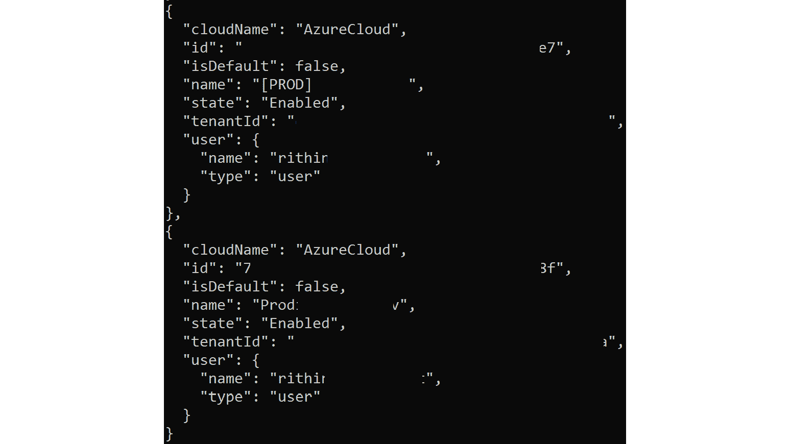
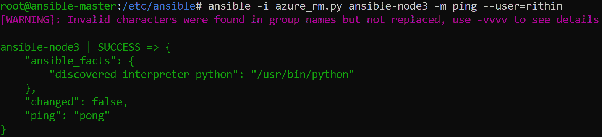
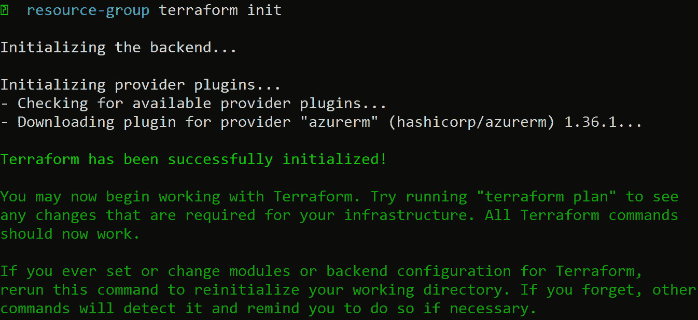
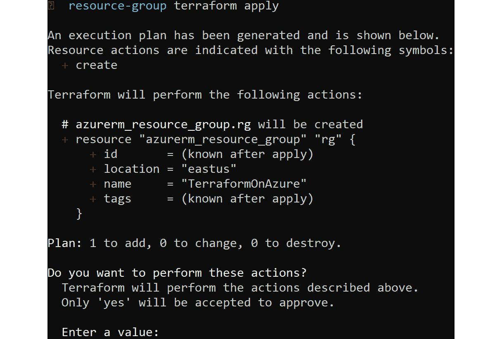
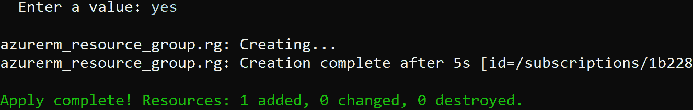
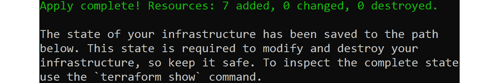
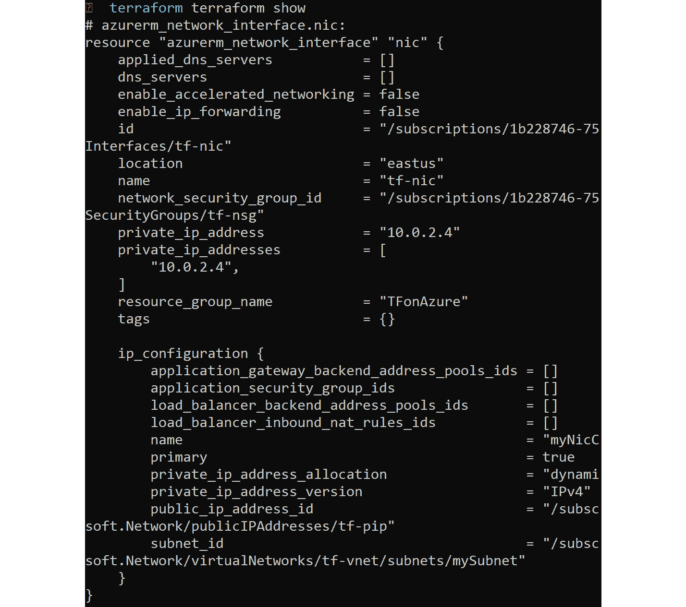
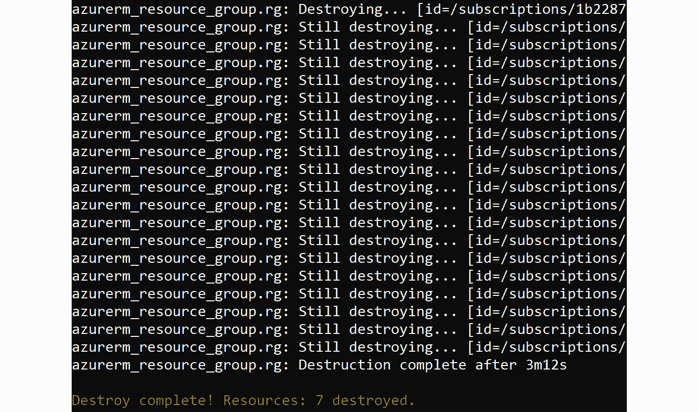
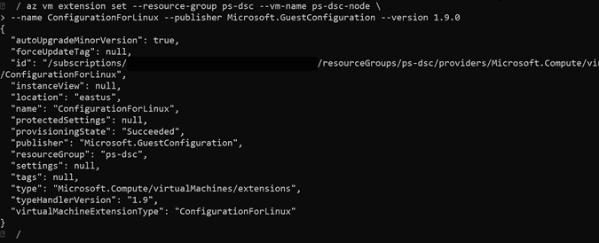
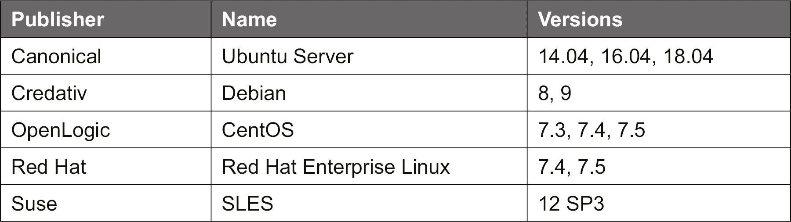

# 第八章:探索连续配置自动化

到目前为止，我们一直使用单个 vm，手动部署和配置它们。 这对于实验室和非常小的环境很好，但如果你必须管理更大的环境，这是一个非常耗时甚至无聊的工作。 它也很容易犯错误和忘记一些事情，比如 vm 之间的细微差别，更不用说随之而来的稳定性和安全风险了。 例如，在部署期间选择错误的版本将导致一致性问题，并且在以后执行升级是一个冗长的过程。

自动化部署和配置管理是减轻这一枯燥任务的理想方法。 然而，一段时间后，您可能会注意到这种方法的一些问题。 出现问题的原因有很多，这里列出了一些失败的原因:

*   脚本失败是因为某些东西发生了改变，例如软件更新。
*   有一个较新的基本映像版本，它略有不同。
*   脚本可能很难阅读和维护。
*   脚本依赖于其他组件; 例如，操作系统、脚本语言、可用的内部和外部命令。
*   而且，总是有一个同事—脚本可以为您工作，但是，由于某些原因，当他们执行它时，它总是失败。

当然，随着时间的推移，情况有所改善:

*   现在许多脚本语言都是多平台的，比如 Bash、Python 和 PowerShell。 它们可以在 Windows、macOS 和 Linux 上使用。
*   在**systemd**中，带有**-H**参数的**systemctl**实用程序可以远程执行命令，即使远程主机是另一个 Linux 发行版也可以工作。 更新的**systemd**版本有更多的功能。
*   **防火墙**和**systemd**使用易于部署的配置文件和覆盖。

自动化很可能不是您部署、安装、配置和管理工作负载的答案。 幸运的是，还有另一种方法:编配。

在音乐术语中，管弦乐是研究如何为管弦乐队作曲。 你必须了解每种乐器，知道它们能发出什么样的声音。 然后，你可以开始写音乐; 要做到这一点，你必须理解这些乐器是如何一起发声的。 大多数时候，你从一种单一的乐器开始，比如钢琴。 在那之后，你扩展到包括其他乐器。 希望其结果将是一件杰作，乐团成员将能够开始演奏它。 成员们如何开始并不重要，但最后，指挥要确保结果算数。

在计算中与编配有许多相似之处。 在开始之前，您必须了解所有组件是如何工作的，它们是如何组合在一起的，以及组件的功能，以便完成工作。 之后，您可以开始编写代码以实现最终目标:一个可管理的环境。

云环境的最大优势之一是，环境的每个组件实际上都是用软件编写的。 是的，我们知道，在生产线的最后，仍然有一个包含许多硬件组件的数据中心，但作为一个云用户，你不关心这些。 你所需要的一切都是用软件编写的，并且有 api 可以使用。 因此，不仅可以自动化您的 Linux 工作负载的部署，还可以自动化和编排 Linux 操作系统的配置以及应用程序的安装和配置，并保持所有内容都是最新的。 您还可以使用编排工具来配置 Azure 资源，甚至可以使用这些工具创建 Linux 虚拟机。

在编排中，有两种不同的方法:

*   命令式:告诉编排工具为了达到这个目标需要做什么
*   声明式**:告诉编排工具您想要实现的目标是什么**

有些编排工具可以同时做这两件事，但是，一般来说，在云环境中，声明式方法是更好的方法，在云环境中有很多选项需要配置，您可以声明每个选项并实现确切的目标。 好消息是，如果这个方法变得过于复杂，例如，当编排工具不能理解目标时，您总是可以使用脚本用一点命令式方法扩展这个方法。

本章的大部分内容是关于 Ansible 的，但是我们也将介绍 PowerShell**Desired State Configuration**(**DSC**)和 Terraform 作为声明式实现的例子。 本章的重点是理解编配，并了解足够的内容以便开始。 当然，我们还将讨论与 Azure 的集成。

本章的要点是:

*   了解第三方自动化工具，如 Ansible 和 Terraform，以及如何在 Azure 中使用它们。
*   使用 Azure 的本机自动化和 PowerShell DSC 来实现所需的机器状态。
*   如何实现 Azure 策略客户配置和审计设置在您的 Linux 虚拟机。
*   市场上可用于自动化部署和配置的其他解决方案的概述。

### 技术要求

在实践中，您至少需要一个 VM 作为控制机器，或者您可以使用您的工作站运行 Linux(**WSL**)或者**Windows 子系统。 除此之外，我们还需要一个节点，它需要是一个 Azure VM。 然而，为了提供更好的解释，我们部署了三个节点。 如果您在 Azure 订阅中有预算限制，那么可以继续使用一个节点。 您使用的是哪个 Linux 发行版并不重要。 本节中用于编排节点的示例是针对 Ubuntu 节点的，但是将它们转换到其他发行版很容易。**

本章将探讨多种编排工具。 对于每个工具，您都需要一个干净的环境。 所以，当你完成了本章的 Ansible 部分，在进入 Terraform 之前，删除虚拟机并部署新的虚拟机。

## 了解配置管理

在本章的介绍中，您可能已经阅读了术语*配置管理*。 让我们更深入地理解这一点。 配置管理是指您希望如何配置 VM。 例如，你想要一个 Apache web 服务器在 Linux 虚拟机中托管一个网站; 所以，虚拟机的配置部分包括:

*   Apache 包和依赖项的安装
*   如果您正在使用 SSL(安全套接字层)证书，请为 HTTP 流量或 HTTPS 流量打开防火墙端口
*   启用服务并引导它，以便 Apache 服务在引导时启动

这个例子是一个非常简单的 web 服务器。 考虑一个复杂的场景，你有一个前端 web 服务器和后端数据库，因此涉及的配置非常高。 到目前为止，我们一直在讨论单个 VM; 如果需要使用相同配置的多个虚拟机，该怎么办? 我们又回到了原点，你必须多次重复配置，这是一项既耗时又无聊的任务。 下面是编配的角色，正如我们在介绍中讨论的那样。 我们可以使用编排工具以我们想要的状态部署 VM。 这些工具将负责配置。 此外，在 Azure 中，我们有 Azure 策略客户配置，它可以用来审计设置。 使用这个策略，我们可以定义 VM 应该处于的条件。 如果评估失败或条件不满足，Azure 将此机器标记为不符合要求。

本章的大部分内容是关于 Ansible 的，但我们也将介绍 PowerShell 的 DSC 和 Terraform 作为声明式实现的例子。 本章的重点是理解编配，并学习足够的内容以便开始。 当然，我们还将讨论与 Azure 的集成。

## 使用 Ansible

Ansible 本质上是最小的，几乎没有依赖关系，而且它不向节点部署代理。 Ansible 只需要 OpenSSH 和 Python。 它还具有高度的可靠性:可以多次应用更改而不改变初始应用程序之外的结果，并且不会对系统的其他部分产生任何副作用(除非您编写了非常糟糕的代码)。 它非常注重代码的重用，这使得它更加可靠。

Ansible 没有非常陡峭的学习曲线。 您可以从几行代码开始，然后在不破坏任何内容的情况下扩大规模。 在我们看来，如果你想尝试一种编配工具，就从 Ansible 开始，如果你想尝试另一种，学习曲线就不会那么陡峭了。

### Ansible 的安装

在 Azure Marketplace 中，Ansible 可以使用现成的 VM。 目前在 Azure 市场上有三个版本的 Ansible: Ansible Instance, Ansible Tower 和 AWX, AWX 是 Ansible Tower 的社区版。 在本书中，我们将集中讨论免费提供的社区项目; 学习并开始使用 Ansible 就足够了。 之后，可以到 Ansible 网站去探索差异，下载 Ansible 企业版的试用版，然后决定是否需要企业版。

安装 Ansible 的方法有多种:

*   使用发行版的存储库
*   使用最新版本[https://releases.ansible.com/ansible](https://releases.ansible.com/ansible )
*   使用 GitHub:[https://github.com/ansible](https://github.com/ansible )
*   Using the Python installer, the preferred method, which works on every OS:

    pip 安装 ansible (azure)

Python 的**pip**无法安装在 Red Hat 和 CentOS 的标准存储库中。 你必须使用额外的 EPEL 存储库:

Sudo yum 安装 epel-release

安装 python-pip

安装 Ansible 后，检查版本:

ansible——版本

如果你不想安装的话，你不必安装 Ansible: Ansible 已经预装在 Azure Cloud Shell 中。 在撰写本书时，Cloud Shell 支持 Ansible 2.9.0 版本。 但是，为了进行安装演练，我们将在 VM 上进行 Ansible 的本地安装。 为了与 Azure 集成，你还需要安装 Azure CLI 来获取你需要提供给 Ansible 的信息。

### SSH 配置

您安装 Ansible 的机器现在称为 Ansible -master，或者换句话说，它只是一个包含 Ansible、Ansible 配置文件和编配指令的 VM。 与节点的通信是使用通信协议完成的。 对于 Linux，使用 SSH 作为通信协议。 要使 Ansible 能够以一种安全的方式与节点通信，请使用基于密钥的身份验证。 如果还没有这样做，请生成一个 SSH 密钥对，并将密钥复制到要编排的 VM 中。

要生成 ssh 密钥，使用这个命令:

ssh - keygen

生成密钥后，默认保存到用户的主目录**.ssh**目录中。 要显示密钥，使用以下命令:

猫~ / . ssh / id_rsa . pub

一旦我们有了密钥，我们必须将这个值复制到节点服务器。 按照以下步骤复制密钥:

1.  复制**id_rsa 的内容。 pub**文件。
2.  SSH 到您的节点服务器。
3.  使用**sudo**命令切换到超级用户。
4.  编辑**~/中的**authorized_keys**文件。 ssh/**。
5.  粘贴我们从 Ansible 服务器复制的密钥。
6.  保存并关闭该文件。

为了验证进程是否成功，返回安装了 Ansible 的机器(继续，我们将称之为 Ansible -master)，并将**ssh**到节点。 如果您在生成密钥时使用了密码短语，它将要求您输入密码短语。 自动化整个密钥复制过程的另一种方法是使用**ssh-copy-id**命令。

### 裸最小配置

要配置 Ansible，你需要一个**Ansible .cfg**文件。 这个配置文件可以存储在不同的位置，Ansible 按照以下顺序搜索:

ANSIBLE_CONFIG(如果设置了环境变量)

Ansible.cfg(在当前目录)

~/.ansible.cfg(在主目录)

/etc/ansible/ansible.cfg

Ansible 将处理前面的列表并使用找到的第一个文件; 所有其他的都被忽略。

在**/etc**目录下创建**ansible**目录，并添加**ansible.cfg**文件。 这是我们保存配置的地方:

(默认值)

库存= /etc/ansible/hosts

让我们试试下面的方法:

ansible all -a "systemctl status sshd"

该命令称为 ad hoc 命令，向**/etc/ansiblehosts**中定义的所有主机执行**systemctl status sshd**。 如果每台主机有多个用户名，也可以按照如下 ansible hosts 文件的格式为这些节点指定用户名:

<ip address="">ansible_ssh_user='<ansible user="">'</ansible></ip>

所以你可以将用户添加到清单文件中，如下截图所示，如果需要，文件将如下所示:

###### 图 8.1:将用户添加到库存文件行项中

再试一次。 使用远程用户而不是本地用户名。 现在可以登录并执行命令了。

### 库存文件

Ansible 目录文件定义了主机和主机组。 基于此，您可以调用主机或主机组(主机组)并运行特定的剧本或执行命令。

这里，我们将我们的组命名为**nodepool**，并添加我们节点的 ip。 因为我们所有的虚拟机都在同一个 Azure VNet 中，所以我们使用私有 IP。 如果不在同一网段，可以添加公网 IP。 这里，我们使用三个 vm 来帮助解释。 如果只有一个节点，只需输入那个节点。

同样，你也可以使用虚拟机的 DNS 名称，但是它们应该被添加到你的**/etc/hosts**文件中以进行解析:

[nodepool]

10.0.0.5

10.0.0.6

10.0.0.7

另一个有用的参数是**ansible_ssh_user**。 您可以使用它来指定登录到节点的用户名。 如果您在多个 vm 上使用多个用户名，那么就需要考虑这个场景。

在我们的示例中，可以不使用**所有**，而是使用一个组名**ansibal -nodes**。 也可以使用通用变量，对每台主机有效，并覆盖它们每台服务器; 例如:

黑“老:vars 铝

ansible_ssh_user =‘学生’

[nodepool]

<ip address="">ansible_ssh_user='其他用户'</ip>

有时，你需要特权来执行命令:

Ansible nodepool-a "systemctl restart sshd"

这会给出以下错误信息:

sshd 重启失败。 service:需要交互身份验证。

查看系统日志和'systemctl status sshd。 服务的细节。 非零返回代码。

对于特别命令，只需添加**-b**选项作为 Ansible 参数来启用权限升级。 默认情况下，它将使用**sudo**方法。 在 Azure 映像中，如果使用**sudo**，则不需要提供根密码。 这就是为什么**-b**选项可以毫无问题地工作。 如果您配置了**sudo**来提示输入密码，请使用**-K**。

我们建议运行其他命令，如**netstat**和**ping**，以了解如何在这些机器中执行命令。 对**sshd**运行**netstat**和 grepping 将得到类似的输出:

###### 图 8.2:为 sshd 运行 netstat 和 grepping

#### 请注意

在运行**ansible all**命令时，您可能会收到弃用警告。 要抑制这种情况，在**ansible.cfg**中使用**deprecation_warnings=False**。

### Ansible 剧本和模块

使用特别命令是一种必要的方法，并不比仅仅使用 SSH 客户端远程执行命令好多少。

要使其成为真正的命令式编排，您需要两个组件:剧本和模块。 剧本是系统部署、配置和维护的基础。 它可以协调一切，甚至在主持人之间! 剧本是用来描述你想达到的状态的。 剧本是用 YAML 写的，可以用**ansible-playbook**命令执行:

ansible-playbook<filename></filename>

第二个组件是模块。 描述一个模块的最佳方式是:要执行的任务达到预期的状态。 它们也被称为任务插件或库插件。

所有可用的模块都有文档记录; 您可以在网上和您的系统上找到这些文档。

要列出所有可用的插件文档，执行以下命令:

ansible-doc - l

这需要一段时间。 我们建议您将结果重定向到一个文件。 这样，它花费的时间更少，也更容易搜索模块。

作为示例，让我们尝试创建一个剧本，如果用户不存在，则使用**user**模块创建用户。 换句话说，期望的状态是一个特定的用户存在。

从阅读文档开始:

ansible-doc 用户

在 Ansible 目录中创建一个文件，例如**playbook1。 yaml**，包含以下内容。 验证用户文档中的参数:

---

——主机:

任务:

- name:添加用户 Jane Roe

成为:是的

become_method: sudo

用户:

目前状态:

名称:简

create_home:是的

备注:简·罗伊

generate_ssh_key:是的

用户组:

组:

        - sudo

        - adm

      shell: /bin/bash

      skeleton: /etc/skel

从输出中可以看到，所有主机返回**OK**，用户被创建:

###### 图 8.3:运行 Ansible 剧本

为了确保创建了用户，我们将在所有主机中检查**/etc/passwd**文件。 从输出中，我们可以看到用户已经创建:

###### 图 8.4:使用/etc/passwd 验证用户创建

确保缩进是正确的，因为 YAML 在缩进和空白方面是一种非常严格的语言。 使用具有 YAML 支持的编辑器(如 vi、Emacs 或 Visual Studio Code)确实有帮助。

如果需要运行命令权限升级，可以使用**变为**，**变为 e_method**或**-b**。

要检查 Ansible 语法，使用以下命令:

ansible-playbook——语法检查 Ansible / example1.yaml

让我们继续，看看如何向 Azure 进行身份验证并在 Azure 中启动部署。

### Auth吸引微软 Azure

要将 Ansible 与 Microsoft Azure 集成，您需要创建一个配置文件，以便将 Azure 的凭证提供给 Ansible。

凭据必须存储在您的主目录**~/中。 azure/凭证**文件。 首先，我们必须用 Azure CLI 收集必要的信息。 认证到 Azure 如下:

az login

如果您成功登录，您将得到类似如下的输出:

###### 图 8.5:使用 az 登录命令登录到 Azure

这已经是你需要的一部分信息了。 如果已经登录，请执行以下命令:

阿兹帐户列表

创建一个服务主体:

az ad sp create-for-rbac——name<principal>——password<password></password></principal>

应用程序 ID 是您的**client_id**，密码是您的**secret**，它将在我们将要创建的凭据文件中引用。

创建**~/。 azure/凭据**文件包含以下内容:

(默认)

subscription_id=xxxxxxx-xxxx-xxxx-xxxx-xxxxxxxxxxxx

client_id=xxxxxxx-xxxx-xxxx-xxxx-xxxxxxxxxxxx

秘密= xxxxxxxxxxxxxxxxx

tenant=xxxxxxx-xxxx-xxxx-xxxx-xxxxxxxxxxxx

使用**Ansible -doc -l | grep azure**找出哪些 Ansible 模块可以用于 azure。 将内容重定向到一个文件以供引用。

### 资源组

让我们检查一下一切是否正常。 创建一个名为**resourcegroup 的新剧本。 yaml**包含以下内容:

---

主持人:localhost

任务:

—name:创建资源组

azure_rm_resourcegroup:

名称:Ansible-Group

地点:westus

请注意，hosts 指令是 localhost! 执行脚本，验证是否创建了资源组:

az group show——name Ansible-Group

输出应该非常类似如下:

｛

“id”:“/订阅/ xxxx / resourceGroups / Ansible-Group”,

"location": "westus",

已经被他们撰写的程序“”:空,

“名称”:“Ansible-Group”,

"属性":{

“provisioningState”:“Succeeded”

}，

“标签”:null

｝

### 虚拟机

让我们使用 Ansible 在 Azure 中创建一个 VM。 为此，创建一个**虚拟机。 yaml**文件，包含以下内容。 检查每个块的**name**字段，以了解代码的作用:

主持人:localhost

任务:

—name:创建存储帐户

azure_rm_storageaccount:

resource_group: Ansible-Group

名称:ansiblegroupsa

account_type: Standard_LRS

.

.

。 —name:创建 CentOS 虚拟机

azure_rm_virtualmachine:

resource_group: Ansible-Group

名称:ansible-vm

vm_size: Standard_DS1_v2

admin_username:学生

admin_password: welk0mITG !

图片:

提供:被久远

出版者:OpenLogic

sku: 7。5

最新版本:

考虑到代码的长度，我们在这里只显示了几行。 您可以下载整个**虚拟机。 yaml**文件来自本书 GitHub 库中的**第 8 章**文件夹。

在下图中，可以看到虚拟机所需的所有资源都是由 Ansible 创建的:

###### 图 8.6:使用 Ansible 为虚拟机创建所需的所有资源

你可以在 Ansible 的 Microsoft Azure 指南([https://docs.ansible.com/ansible/latest/scenario_guides/guide_azure.html](https://docs.ansible.com/ansible/latest/scenario_guides/guide_azure.html))中找到一个使用 Ansible 部署 Azure VM 的完整示例。

### Azure 库存管理

我们学习了在 Azure 中使用 Ansible 的两种方法:

*   在目录文件中使用 Ansible 连接到 Linux 机器。 事实上，它在 Azure 或其他地方运行并不重要。
*   使用 Ansible 管理 Azure 资源。

在本节中，我们将进一步讨论。 我们不使用静态库存，而是使用动态库存脚本询问 Azure 在您的环境中运行什么。

第一步是下载 Azure 的动态库存脚本。 执行**sudo**如果你不是根用户:

cd /etc/ansible

wget https://raw.githubusercontent.com/ansible/ansible/devel/contrib/inventory/azure_rm.py

chmod +x /etc/ansible/azure_rm.py

编辑**/etc/ansible/ansible.cfg**文件，删除**inventory=/etc/ansible/hosts**行。

让我们执行第一步:

/etc/ansible/azure_rm.py azure -m ping

它可能会由于认证问题而失败:

###### 图 8.7:由于身份验证问题导致主机连接失败

如果您对不同的 vm 有不同的登录，您总是可以对每个任务使用 user 指令。 在这里，我们使用的是**azure**，这意味着所有 vm。 可以通过虚拟机名称进行查询。 例如，可以使用用户凭据 ping**ansible-node3**虚拟机:

###### 图 8.8:ansible-node3 虚拟机的查询

理想情况下，Ansible 希望您使用 SSH 密钥而不是密码。 如果您想要使用密码，可以使用**-extra-vars**并传递密码。 请注意，为此您需要安装一个名为**sshpass**的应用程序。 通过 Ansible ping Azure 中使用密码的虚拟机，执行以下命令:

Ansible -i azure_rm.py Ansible -vm -m ping \

——extra-vars "ansible_user=<username>ansible_password=<password>"</password></username>

让我们以在前面的示例中使用 Ansible 创建的 VM 实例为例，其中用户名是**student**，密码是**welk0mITG!** 。 从屏幕截图中，您可以看到 ping 成功。 您可能会看到一些警告，但是可以安全地忽略它们。 但是，如果 ping 失败，需要进一步的调查:

###### 图 8.9:发送用户名 student 的 ping

通过在与**azure_rm.py**目录相同的目录中创建一个**azure_rm.ini**文件，您可以修改目录脚本的行为。 下面是一个示例**ini**文件:

(azure)

include_powerstate=yes

group_by_resource_group = yes

group_by_location = yes

group_by_security_group = yes

group_by_tag = yes

它的工作方式与**托管**文件非常相似。 **[azure]**段表示所有虚拟机。 你也可以提供以下部分:

*   地点名称
*   资源组名
*   安全组名称
*   标签的关键
*   标签键值

选择一个或多个 vm 的另一种方法是使用标记。 为了能够标记一个虚拟机，你需要 ID:

Az vm list——输出 TSV

现在，您可以标记 VM:

az 资源标签-resource-group<resource group="">\</resource>

——tags webserver——id

你也可以在 Azure 门户上标记 VM:

###### 图 8.10:在 Azure 门户中标记 VM

单击**更改**并添加一个标记，带或不带值(您也可以使用值来过滤值)。 要验证，请使用标签名 host:

/etc/ansible/azure_rm.py webserver -m ping

只有带标签的虚拟机能够 ping 通。 让我们为这个带标签的 VM 创建一个剧本，例如，**/etc/ansible/example9 yaml**。 同样，这个标签在**hosts**指令中使用:

---

- hosts: webserver

任务:

—name:安装 Apache Web Server

成为:是的

become_method: sudo

恰当的:

名称:输入

install_recommends:是的

目前状态:

update-cache:是的

当:

ansible_distribution == "Ubuntu"

- ansible_distribution_version == "18.04"

执行剧本:

ansible-playbook -i /etc/ansible/azure_rm.py /etc/ansible/example9.yaml

一旦运行了剧本，如果检查 VM，您可以看到 Apache 已经安装。

如前所述，Ansible 并不是唯一的工具。 还有一种很流行的叫做 Terraform。 在下一节中，我们将讨论 Azure 上的 Terraform。

## 使用地球形态

Terraform 是另一个由 HashiCorp 开发的**Infrastructure as Code**(**IaC**)工具。 您可能想知道为什么它被称为 IaC 工具。 原因是你可以定义你的基础设施需要如何使用代码，Terraform 会帮助你部署它。 Terraform 使用**HashiCorp 配置语言**(**HCL**) 但是，您也可以使用 JSON。 Terraform 在 macOS、Linux 和 Windows 中都得到支持。

Terraform 支持广泛的 Azure 资源，如网络、子网、存储、标签和虚拟机。 如果您还记得，我们讨论了编写代码的命令式和声明式方法。 Terraform 本质上是声明性的，它可以维护基础设施的状态。 一旦部署完毕，Terraform 会记住基础设施的当前状态。

在每一节中，过程的第一部分涉及安装 Terraform。 让我们继续安装 Terraform 的 Linux 操作系统。

### 安装

Terraform 的核心可执行文件可以从[https://www.terraform.io/downloads.html](https://www.terraform.io/downloads.html)下载，并且可以复制到添加到**$PATH**变量中的一个目录中。 您还可以使用**wget**命令下载核心可执行文件。 要做到这一点，首先你必须从前面提到的链接中找到 Terraform 的最新版本。 在撰写本文时，可用的最新版本是 0.12.16

现在我们有了版本，我们将使用**wget**和以下命令下载可执行文件:

wget https://releases.hashicorp.com/terraform/0.12.17/terraform_0.12.17_linux_amd64.zip

ZIP 文件将被下载到当前工作目录。 现在我们将使用 unzip 工具来提取可执行文件:

解压缩 terraform_0.12.16_linux_amd64.zip

#### 请注意

默认情况下，**unzip**可能不会安装。 如果抛出错误，根据您使用的发行版，使用**apt**或**yum**安装**解压缩**。

提取过程将获得 Terraform 可执行文件，您可以将其复制到您的**$PATH**中的任何位置。

要验证安装是否成功，可以执行:

起程拓殖,版本

现在我们已经确认安装了 Terraform，让我们继续设置 Azure 的身份验证。

### 正在验证 Azure

有多种方式可以验证到 Azure。 您可以使用 Azure CLI、使用客户端证书的服务主体、服务主体和客户端秘密以及更多方法。 出于测试目的，使用**az**登录命令的 Azure CLI 是正确的选择。 然而，如果我们想自动化部署，这并不是一个理想的方法。 我们应该选择服务委托人和客户秘密，就像我们在 Ansible 做的那样。

让我们先为 Terraform 创建一个服务主体。 如果您已经为前面的部分创建了一个 Service Principal，那么您可以随意使用它。 要从 Azure CLI 创建一个新的服务主体，使用下面的命令:

Az AD sp create-for-rbac -n terraform

此时，您可能已经熟悉了输出，其中包含了**appID**、密码和租户 ID。

记下输出中的值，我们将创建变量来存储这个值:

export ARM_CLIENT_ID="<appid>"</appid>

export ARM_CLIENT_SECRET="<password>"</password>

export ARM_SUBSCRIPTION_ID="<subscription id="">"</subscription>

export ARM_TENANT_ID="<tenant id="">"</tenant>

因此，我们已经将所有的值存储到将被 Terraform 用于身份验证的变量中。 既然我们已经处理了身份验证，让我们用 HCL 编写代码，以便在 Azure 中部署资源。

### 部署到 Azure

为此，您可以使用任何代码编辑器。 因为我们已经在 Linux 机器上了，所以可以使用 vi 或 nano。 如果你愿意，你也可以使用 Visual Studio Code，它为 Terraform 和 Azure 提供了扩展，可以让你获得智能感知和语法高亮。

让我们创建一个 terraform 目录来存储我们所有的代码，在**terraform**目录中，我们将根据将要部署的内容创建更多的目录。 在我们的第一个示例中，我们将使用 Terraform 在 Azure 中创建一个资源组。 稍后，我们将讨论如何在这个资源组中部署 VM。

因此，要创建一个**terraform**目录，并在该目录中创建一个**resource-group**子文件夹，执行以下命令:

mkdir 起程拓殖

CD terraform & mkdir resource-group

光盘资源组

接下来，创建一个 main。 Tf 文件与以下内容:

provider "azurerm" {

version = " ~ > 1.33 "

｝

资源"azurerm_resource_group" "rg" {

姓名=“地球仪”

地点:

｝

代码非常简单。 让我们仔细看看每一项。

provider 指令表明我们想要使用**azurerm**provider 的 1.33 版本。 换句话说，我们打算使用 Terraform Azure Resource Manager 提供商的 1.33 版本，它是 Terraform 可用的插件之一。

**资源**指令说我们要部署一个 Azure 的资源**azurerm_resource_group**类型有两个参数,**名称**和**位置。**

**rg**表示资源配置。 每个模块中每个类型的资源名称必须是唯一的。 例如，如果你想在同一个模板中创建另一个资源组，你不能再次使用**rg**，因为你已经使用了它; 相反，您可以使用除**rg**之外的任何选项，例如**rg2**。

在使用模板开始部署之前，我们首先需要初始化项目目录，即我们的**资源组**文件夹。 要初始化 Terraform，执行以下操作:

起程拓殖 init

在初始化过程中，Terraform 将从其存储库中下载**azurerm**提供商，并将显示如下类似的输出:

###### 图 8.11:初始化 Terraform 以下载 azurerm 提供商

由于我们已经将服务主体的详细信息导出到变量中，我们可以使用以下命令进行部署:

起程拓殖应用

这个命令将连接 Terraform 到您的 Azure 订阅，并检查资源是否存在。 如果 Terraform 发现资源不存在，它将继续创建一个执行计划来部署。 您将得到如下截图所示的输出。 要继续部署，输入**yes**:

###### 图 8.12:连接 Terraform 到 Azure 订阅

一旦你给出了输入，Terraform 将开始创建资源。 在创建之后，Terraform 会向你展示所有创建的东西的概要，以及添加和销毁了多少资源，如下图所示:

###### 图 8.13:创建的资源的摘要

一个名为**terraform 的状态文件。 tfstate**将在我们初始化 Terraform 的项目目录中生成。 这个文件将包含状态信息，以及我们部署到 Azure 的资源列表。

我们成功创建了资源组; 在下一节中，我们将讨论如何使用 Terraform 创建 Linux 虚拟机。

### 部署虚拟机

在前面的示例中，我们创建了资源组，我们使用**azurerm_resource_group**作为要创建的资源。 对于每个资源都有一个指令，例如，对于虚拟机，它是**azurerm_virtual_machine**。

另外，我们使用**terraform apply**命令创建了资源组。 但 Terraform 也提供了一种执行计划的方式。 因此，与其直接部署，不如创建一个计划，看看要进行哪些更改，然后进行部署。

首先，您可以返回到**terraform**目录，并创建一个名为**vm**的新目录。 对于不同的项目有不同的目录总是一个好主意:

mkdir . . / vm

cd . . / vm

进入该目录后，可以创建一个新的**main。 tf**文件，其内容如下代码块所示。 使用添加的注释来查看每个块的用途。 考虑到代码的长度，我们将显示代码块的截断版本。 你可以找到**主干。 在本书 GitHub 库的**第 8 章**文件夹下的 tf**代码文件:

provider "azurerm" {

version = " ~ > 1.33 "

｝

#创建资源组

resource "azurerm_resource_group" "rg" {

    name     = "TFonAzure"

地点:

｝

．

．

．

#创建虚拟机，结合我们目前创建的所有组件

资源"azurerm_virtual_machine" "myterraformvm" {

的名字                   = " tf-VM”

地点:

resource_group_name = azurerm_resource_group.rg.name

network_interface_ids = [azurerm_network_interface.nic.id]

vm_size                = " Standard_DS1_v2”

storage_os_disk {

        name              = "tfOsDisk"

        caching           = "ReadWrite"

create_option = " FromImage "

managed_disk_type = " Standard_LRS "

    }

storage_image_reference {

出版商= "规范"

        offer     = "UbuntuServer"

        sku       = "16.04.0-LTS"

version = "最近"

    }

os_profile (

computer_name = " tfvm "

admin_username = " adminuser "

admin_password = " Pa55w0rD ! @1234”

    }

os_profile_linux_config {

disable_password_authentication = false

  }

｝

如果您查看**azurerm_virtual_network**部分，您可以看到我们没有写下资源名，而是以**type.resource_configuration 格式给出了引用。 参数**。 在本例中，不是写下资源组名，而是引用为**azurerm_resource_group.rg.name**。 同样地，在整个代码中，我们采用了引用来简化部署。

在开始部署计划之前，我们必须使用以下方法初始化项目:

起程拓殖 init

如前所述，我们将执行执行计划。 创建执行计划并将其保存到**vm-计划中。 计划**文件，执行:

地球形态计划出来，vm 计划，计划

你会收到很多警告; 完全可以忽略它们。 确保代码没有显示任何错误。 如果成功创建执行计划，将显示执行计划的下一步，如下图所示:

###### 图 8.14:显示执行计划

如输出中所示，我们将执行:

起程拓殖应用“vm-plan.plan”

现在，部署将启动，并将显示它正在部署的资源，已经花费了多少时间，等等，如输出所示:

###### 图 8.15:资源部署细节

最后，Terraform 会给出一个资源部署数量的总结:

###### 图 8.16:部署的资源数量的概要

还有另一个命令，即**show**命令。 这将显示部署的完整状态，如下图所示:

###### 图 8.17:显示部署的完整状态

我们编写了一小段代码，可以在 Azure 中部署 VM。 然而，有许多参数可以添加到代码中，通过这些参数可以进行高级状态配置。 参数的完整列表可以在起程拓殖文档(https://www.terraform.io/docs/providers/azurerm/r/virtual_machine.html)和微软文档(https://docs.microsoft.com/en-us/azure/virtual-machines/linux/terraform-create-complete-vm)。

由于这些模板有点高级，它们将使用变量而不是重复的值。 然而，一旦你习惯了这一点，你就会明白 Terraform 是多么强大。

最后，您可以通过执行以下命令来破坏整个部署或项目:

起程拓殖摧毁

这将删除我们在**主程序中提到的所有资源。 项目的 tf**文件。 如果您有多个项目，则必须导航到项目目录并执行**destroy**命令。 在执行该命令时，系统将要求您确认删除; 一旦您输入**yes**，资源将被删除:

###### 图 8.18:使用毁灭地球命令删除所有资源

最后，你会得到一个总结，如下所示:

###### 图 8.19:被销毁资源的摘要

现在我们已经熟悉了在 Azure 上使用 Terraform 并部署一个简单的 VM。 如今，由于 DevOps 的可用性和采用，Terraform 越来越受欢迎。 Terraform 已经使评估基础设施和重建的过程变得轻松。

## 使用 PowerShell DSC

与 Bash 一样，PowerShell 是一个具有强大脚本可能性的 shell。 我们可能认为 PowerShell 更像是一种脚本语言，它可以用来执行简单的操作或创建资源，就像我们到目前为止所做的那样。 然而，PowerShell 的功能远不止于此，它一直扩展到自动化和配置。

DSC 是 PowerShell 中一个重要但鲜为人知的部分，它不是在 PowerShell 语言中自动化脚本，而是在 PowerShell 中提供声明式编排。

如果与 Ansible 相比，它对 Linux 的支持非常有限。 但是它对于常见的管理任务非常有用，并且可以用 PowerShell 脚本弥补缺失的特性。 微软非常专注于让它与 Windows Server 齐名。 当这发生时，它将被 PowerShell DSC Core 所取代，这一举动非常类似于他们之前对 PowerShell | PowerShell Core 所做的。 这将在 2019 年底完成。

另一个重要的注意是，由于某些原因，带有 DSC 的 Python 脚本不能正常工作，您会不时地得到 401 错误，甚至是未定义的错误。 首先，确保您拥有 OMI 服务器和 DSC 的最新版本，然后再试一次; 有时候，你不得不尝试两三次。

### Azure Automation DSC

使用 DSC 的一种方法是使用 Azure Automation DSC。 这样，您就不必使用单独的机器作为控制器节点。 为了能够使用 Azure Automation DSC，您需要一个 Azure Automation 帐户。

**自动化账户**

在 Azure 门户中，选择左侧栏中的**All Services**，导航到**Management + governance**，然后选择**Automation Accounts**。 创建一个自动化帐户，并确保您选择**Run As account**。

再次导航到**所有服务**、**管理工具**，然后选择**刚创建的帐户**:

###### 图 8.20:在 Azure 门户中创建自动化帐户

在这里，您可以管理节点、配置等等。

请注意，这项服务并不是完全免费的。 流程自动化按作业执行时间定价，而配置管理按受管理节点定价。

要使用这个帐户，您需要注册 URL 和您的**Run As account**的对应密钥。 这两个值都在**帐户**和**键设置**下可用。

或者，在 PowerShell 中执行以下命令:

Get-AzAutomationRegistrationInfo '

-ResourceGroup<resource group="">'</resource>

  -AutomationAccountName <automation account name>

有一个 VM 扩展可用于 Linux; 通过这种方式，您可以部署 vm，包括 vm 的配置，并对其进行充分的协调。

更多信息请访问[https://github.com/Azure/azure-linux-extensions/tree/master/DSC](https://github.com/Azure/azure-linux-extensions/tree/master/DSC)和[https://docs.microsoft.com/en-us/azure/virtual-machines/extensions/dsc-linux](https://docs.microsoft.com/en-us/azure/virtual-machines/extensions/dsc-linux)。

因为我们要使用 Linux 和 DSC，所以我们需要一个名为**nx**的 DSC 模块。 这个模块包含 Linux 的 DSC 资源。 在您的自动化帐户设置中，选择**共享资源和模块**。 在**浏览图库**选项卡中，搜索**nx**并导入模块。

### 在 Linux 上安装 PowerShell DSC

为了能够在 Linux 上使用 PowerShell DSC，你需要开放管理基础设施服务。 Linux 发行版支持的版本如下:

*   Ubuntu 12.04 LTS, 14.04 LTS 和 16.04 LTS。 目前不支持 Ubuntu 18.04。
*   RHEL/CentOS 6.5 及更高版本。
*   openSUSE 13.1 及以上版本。
*   SUSE Linux Enterprise Server 11 SP3 及以上版本。

该软件可在[https://github.com/Microsoft/omi](https://github.com/Microsoft/omi)下载。

Red hat 发行版的安装如下:

安装\

  https://github.com/Microsoft/omi/releases/download/\

v1.4.2-3 /尾身茂- 1.4.2 ssl_100.ulinux.x64.rpm——3.

对于 Ubuntu，你可以使用**wget**从 GitHub 库下载**deb**文件，然后使用**dpkg**安装:

dpkg——i ./omi-1.6.0-0.ssl_110.ulinux.x64.deb

#### 请注意

确保您下载的文件与您的 SSL 版本匹配。 您可以使用**openssl version**命令检查 SSL 的版本。

安装完成后，服务会自动启动。 使用如下命令检查服务状态:

systemctl status omid.service

要显示产品和版本信息，包括所使用的配置目录，使用以下命令:

/opt/omi/bin/omicli id

###### 图 8.21:显示产品和版本信息

### 创建期望状态

PowerShell DSC 不只是一个脚本或带有参数的代码，就像 Ansible 一样。 要开始使用 PowerShell DSC，您需要一个配置文件，该文件必须被编译成一个**管理对象格式**(**MOF**)文件。

但是，重要的事情要先做。 让我们创建一个文件**example1。 ps1**，内容如下:

webserver 配置{

Import-DscResource -ModuleName PSDesiredStateConfiguration nx

节点“ubuntu01”{

nxPackage apache2

    {

Name = "输入"

确保=“礼物”

        PackageManager = "apt"

    }

｝

｝

webserver

让我们研究一下这个配置。 如上所述，它非常类似于函数声明。 配置得到一个标签，并在脚本的末尾执行。 导入必要的模块，声明 VM 的主机名，然后开始配置。

### PowerShell 的 DSC 资源

在这个配置文件中，使用了一个名为**nxPackage**的资源。 有几个内置资源:

*   nxArchive:提供在指定路径下解压归档文件(**.tar**，**.zip**)的机制。
*   **nxEnvironment**:管理环境变量。
*   **nxFile**:管理文件和目录。
*   **nxFileLine**:管理 Linux 文件中的行。
*   **nxGroup**:管理 Linux 本地组。
*   **nxPackage**:管理 Linux 节点上的包。
*   **nxScript**:运行脚本。 大多数时候，这用于临时切换到更命令式的编排方法。
*   **nxService**:管理 Linux 服务(守护进程)。
*   **nxUser**:管理 Linux 用户。

您也可以用 MOF 语言、c#、Python 或 C/ c++编写自己的资源。

您可以通过访问[https://docs.microsoft.com/en-us/powershell/dsc/lnxbuiltinresources](https://docs.microsoft.com/en-us/powershell/dsc/lnxbuiltinresources)使用官方文档。

保存脚本并按如下方式执行:

pwsh -file example1.ps

作为脚本的结果，创建了一个与配置名称相同的目录。 其中有一个 MOF 格式的本地主机文件。 这是用于描述 CIM 类的语言(**CIM**代表**公共信息模型**)。 CIM 是用于管理包括硬件在内的完整环境的开放标准。

我们认为这个描述本身就足以理解为什么微软选择这个模型和相应的语言文件进行编配!

你也可以上传配置文件到 Azure，在**DSC Configurations**下。 在 Azure 中按**Compile**按钮生成 MOF 文件。

**Azure 中的资源应用**

如果您愿意，您可以使用**/opt/microsoft/dsc/ scripts**中的脚本在本地应用所需的状态，在我们看来，这并不像应该的那样简单。 而且，由于这一章是关于 Azure 中的编排，我们将直接转向 Azure。

注册虚拟机:

sudo /opt/microsoft/dsc/Scripts/Register.py \

——RegistrationKey<automation account="" key="">\</automation>

——ConfigurationMode ApplyOnly \

——刷新模式推送——ServerURL

再次检查配置:

sudo /opt/microsoft/dsc/Scripts/GetDscLocalConfigurationManager.py

该节点现在可以在您的**自动化帐户**设置下的**DSC Nodes**窗格中看到。 现在，您可以链接上传和编译的 DSC 配置。 配置已经应用!

另一种方法是使用**Add Node**选项，然后选择 DSC 配置。

总之，PowerShell DSC 的主要用例场景是编写、管理和编译 DSC 配置，以及将这些配置导入并分配到云中的目标节点。 在使用任何工具之前，您需要了解用例场景以及它们如何适应您的环境以实现目标。 到目前为止，我们已经配置了 vm; 下一节是关于如何使用 Azure Policy Guest 配置审计 Linux 虚拟机内部的设置。

## Azure 策略客户端配置

策略主要用于资源的治理。 Azure Policy 是 Azure 中的一个服务，您可以通过它在 Azure 中创建、管理和分配策略。 这些策略可用于审计和遵从性。 例如，如果你在美国东部托管一个安全的应用程序，并且你希望只在美国东部部署，Azure Policy 可以用来实现这一点。

假设您不想在订阅中部署 SQL 服务器。 在 Azure Policy 中，您可以创建一个策略并指定允许的服务，并且只能在该订阅中部署它们。 请注意，如果您将策略分配给已经拥有资源的订阅，那么 Azure policy 只能对分配后创建的资源进行操作。 但是，如果分配之前的任何现有资源不符合策略，它们将被标记为“不符合”，以便管理员在必要时纠正它们。 此外，Azure Policy 只会在部署的验证阶段起作用。

一些内置策略包括:

*   允许的位置:使用这个，您可以强制执行地理遵从性。
*   允许的虚拟机 sku:定义一组虚拟机 sku。
*   给资源添加标签:给资源添加标签。 如果没有传递值，它将采用默认标记值。
*   强制标记及其值:用于将必需的标记及其值强制到资源。
*   不允许资源类型:禁止所选资源的部署。
*   允许的存储帐户 sku:我们在前一章讨论了存储帐户可用的不同 sku，例如 LRS、GRS、ZRS 和 RA-GRS。 您可以指定允许的 sku，并且拒绝部署其余的 sku。
*   允许的资源类型:正如我们在示例中提到的，您可以指定在订阅中允许哪些资源。 例如，如果您只想要虚拟机和网络，您可以接受**Microsoft。 计算**和**Microsoft。 网络**资源提供者; 所有其他提供者都被拒绝部署。

到目前为止，我们已经讨论了如何使用 Azure Policy 审计 Azure 资源，但它也可以用于审计 VM 内的设置。 Azure Policy 使用客户端配置扩展和客户端来完成这项任务。 扩展和客户机一起确认客户操作系统的配置、应用程序的存在、它的状态，以及客户操作系统的环境设置。

Azure Policy Guest Configuration 只能帮助您审计 Guest VM。 在编写本文时，应用配置不可用。

### Linux 客户端配置扩展

客户策略配置由客户配置扩展和代理完成。 vm 上的 Guest Configuration 代理通过使用 Linux 的 Guest Configuration 扩展配置。 正如前面所讨论的，它们是相互关联的，允许用户在 VM 上运行来宾策略，从而帮助用户审计 VM 上的策略。 Chef InSpec([https://www.inspec.io/docs/](https://www.inspec.io/docs/))是 Linux 的 guest 策略。 让我们看看如何将扩展部署到 VM，并使用扩展支持的命令。

**虚拟机部署**

为此，您需要一个 Linux VM。 我们将通过执行以下命令将 Guest Configuration 扩展部署到虚拟机:

az 虚拟机扩展集——resource-group<resource-group>\</resource-group>

——vm-name<vm-name>\</vm-name>

--name ConfigurationForLinux \

出版商——微软。 GuestConfiguration \

——版本 1.9.0

你会得到一个类似的输出:

###### 图 8.22:将来宾配置扩展部署到 VM 上

### 命令

客户端配置扩展支持**安装**、**卸载**、**启用**、**禁用**和**更新**命令。 执行这些命令; 需要将当前工作目录切换到**/var/lib/waagent/ microsoft . guestconfiguration . configurationforlinux -1.9.0/bin**。 之后，您可以使用**guest-configuration-shim**脚本链接可用的命令。

#### 请注意

检查文件是否启用了执行位。 否则，请使用**chmod +x guest-configuration-shim**设置执行权限。

执行命令的一般语法为:**./guest-configuration-shim<命令名>**。

例如，如果您想安装客户机配置扩展，可以使用**install**命令。 当扩展已经安装时，将调用**enable**，它将提取 Agent 包，安装并启用代理。

同样，**update**将代理服务更新到新的代理，**disable**禁用代理，最后，**uninstall**将卸载代理。

下载 agent 到如下路径:**/var/lib/waagent/Microsoft.GuestConfiguration。 ConfigurationForLinux-<version>/GCAgent/DSC**，以及**agent**输出保存到该目录下的**stdout**和**stderr**文件中。 如果遇到任何问题，请检查这些文件的内容。 试着理解错误，然后排除故障。

日志保存在“**/var/log/azure/Microsoft.GuestConfiguration”目录下。 配置 linux**。 您可以使用它们来调试问题。

目前，Azure Policy Guest 配置支持的操作系统版本如下:

###### 图 8.23:Azure Policy Guest 配置支持的操作系统版本

Azure Policy 是作为 JSON 清单编写的。 因为写作策略不是本书的一部分; 您可以参考 Microsoft 共享的示例策略([https://github.com/MicrosoftDocs/azure-docs/blob/master/articles/governance/policy/samples/guest-configuration-applications-installed-linux.md](https://github.com/MicrosoftDocs/azure-docs/blob/master/articles/governance/policy/samples/guest-configuration-applications-installed-linux.md))。 此示例用于审计是否在 Linux vm 中安装了特定的应用程序。

如果研究这个示例，您将了解组件是什么，以及如何在上下文中使用这些参数。

## 其他解决方案

管弦乐市场的另一个大玩家是 Puppet。 直到最近，Puppet 中对 Azure 的支持还非常有限，但这种情况正在迅速改变。 Puppet 模块，**puppetlabs/azure_arm**，仍然处于起步阶段，但是**puppetlabs/azure**提供了你需要的一切。 这两个模块都需要 Azure CLI 才能工作。 在他们的商业 Puppet Enterprise 产品中集成 Azure CLI 的效果非常好。 Azure 有一个 VM 扩展，可用于将成为 Puppet 节点的虚拟机。

更多信息请访问[https://puppet.com/products/managed-technology/microsoft-windows-azure](https://puppet.com/products/managed-technology/microsoft-windows-azure)。

您还可以使用 Chef 软件，它提供了一个自动化和编排平台，这个平台已经存在很长时间了。 它的开发始于 2009 年! 用户写下“食谱”，描述厨师如何使用刀具等工具管理“厨房”。 在《Chef》中，很多术语都来自厨房。 Chef 与 Azure 集成得非常好，特别是如果你使用 Azure 市场的 Chef 自动化。 还有一个可用的 VM 扩展。 Chef 适用于大型环境，学习曲线相对陡峭，但至少值得一试。

更多信息请访问[https://www.chef.io/partners/azure/](https://www.chef.io/partners/azure/)。

## 总结

本章一开始，我们简要介绍了编制、使用编制的原因以及不同的方法:命令式和声明式。

之后，我们介绍了 Ansible、Terraform 和 PowerShell DSC 平台。 其中涉及了以下许多细节:

*   如何安装平台
*   在操作系统级别使用资源
*   与 Azure 的集成

Ansible 是迄今为止最完整的解决方案，可能也是学习曲线最平缓的一个。 然而，所有的解决方案都是非常强大的，总有一些方法可以绕过它们的局限性。 对于所有编配平台来说，未来将会有更多的特性和功能。

创建 Linux 虚拟机并不是在 Azure 中创建工作负载的唯一方法; 您还可以使用容器虚拟化为您的应用程序部署平台。 在下一章中，我们将讨论容器技术。

## 问题

在这一章，让我们跳过一般的问题。 启动一些 vm 并选择您所选择的编排平台。 配置网络安全组允许 HTTP 流量通过。

尝试使用 Ansible、Terraform 或 PowerShell DSC 配置以下资源:

1.  创建一个用户并使其成为组**wheel**(基于 rh 的发行版)或**sudo**(Ubuntu)的成员。
2.  安装一个 Apache web 服务器，提供来自**/wwwdata**的内容，用 AppArmor (Ubuntu)或 SELinux(基于 rhel 的发行版)保护它，并在这个 web 服务器上提供一个漂亮的**index.html**页面。
3.  限制 SSH 到您的 IP 地址。 HTTP 端口必须对整个世界开放。 您可以通过提供覆盖文件或 FirewallD 来使用 systemd 方法。
4.  使用您选择的发行版和版本部署一个新的 VM。
5.  使用变量创建一个新的**/etc/hosts**文件。 如果你使用 PowerShell DSC，你也需要 PowerShell 来完成这个任务。 对于专家:使用资源组中其他机器的主机名和 IP 地址。

## 进一步阅读

我们真的希望你喜欢这个编配平台的介绍。 这只是一个简短的介绍，让你好奇，想要了解更多。 本章中提到的所有编配工具的网站都是很好的资源，阅读起来很愉快。

需要提及的一些额外资源包括:

*   *Learning PowerShell DSC - Second Edition*by James Pogran。
*   Ansible:我们认为 Russ McKendrick 写的《学习 Ansible，以及同一作者写的关于 Ansible 的其他书，值得表扬。 如果您懒得读这本书，那么您可以先参考 Ansible 文档。 如果你想要一些实践教程，你可以使用这个 GitHub 库:[https://github.com/leucos/ansible-tuto](https://github.com/leucos/ansible-tuto)。
*   Terraform:**Terraform on Microsoft Azure - Part 1: Introduction**是由微软高级软件工程师 Julien Corioland 撰写的系列博客。 这个博客包含了一系列在 Azure 上讨论 Terraform 的主题。 这本书值得一读，也值得一试。 此博客可在[https://blog.jcorioland.io/archives/2019/09/04/terraform-microsoft-azure-introduction.html](https://blog.jcorioland.io/archives/2019/09/04/terraform-microsoft-azure-introduction.html)查阅。
*   *掌握厨师*Mayank Joshi
*   *学习木偶*by Jussi Heinonen