# 九、Azure 中的容器虚拟化

在*第 2 章*，*入门 Azure 云*中，我们从在 Azure 中创建第一个工作负载开始我们的 Azure 之旅:部署 Linux 虚拟机。 之后，我们介绍了 Linux 操作系统的许多方面。

在*第七章*,*部署虚拟机*,我们探索了几个选项部署 vm,*第八章*,*探索连续自动化配置*,都是关于该做什么之后使用编排的配置管理工具。

编配是 DevOps 运动中日益增长的一部分。 DevOps 是关于打破组织中的传统竖井。 参与开发、测试和部署产品的不同团队必须进行沟通并一起工作。 DevOps 是文化哲学、实践和工具的组合。 DevOps 是一种使部署变得增量的、频繁的和例行的事件，同时限制失败影响的方法。

vm 不是部署工作负载的唯一方式:您还可以在容器中部署工作负载。 它与编排一起，使满足 DevOps 需求成为可能。

因此，在我们真正学习和实现 Azure 中的容器之前，让我们快速地看一看本章要提供的内容。 在本章结束时，你将:

*   了解集装箱的历史，了解集装箱化的早期应用。
*   熟悉**systemd-nspawn**、Docker 等容器工具。
*   能够使用 Docker Machine 和 Docker Compose。
*   能够使用 Azure 容器实例和 Azure 容器注册表。
*   了解新一代容器工具，如 Buildah、Podman 和 Skopeo。

现在，我们将首先了解容器是什么以及它是如何演变的。

## 集装箱技术导论

在*第一章*、*探索蓝天*中，我们对容器做了简短的介绍。 所以，让我们继续深入讨论容器的细节。 我们知道 VM 运行在 hypervisor 上，对于每种目的，在大多数情况下，您都必须创建一个单独的 VM 来隔离环境。 vm 将有一个来宾操作系统，比如 Linux，我们将在其之上安装所需的软件。 在某些场景中，您必须部署大量 vm 进行测试。 如果您正在使用运行 Hyper-V 的本地基础设施，那么您必须考虑资源利用率—即，每个 VM 将使用多少内存、CPU 等等。 如果在 Azure 中部署，还必须考虑成本。 您可能只需要一些 vm 进行几个小时的测试，但是这些 vm 占用的空间很大; 它们是虚拟运行的完整计算机。 另一个问题是兼容性问题。 让我们假设您有一个应用程序需要一个依赖包，比如 Python 2.2。 现在想想在同一个 VM 中运行的另一个应用程序，它与 Python 2.2 存在兼容性问题，并且只能与 Python 2.1 一起工作。 您最终会为使用 Python 2.1 的第二个应用程序创建一个新的 VM。 为了克服这一点，容器被引入。 下面是容器与虚拟机区别的图示:

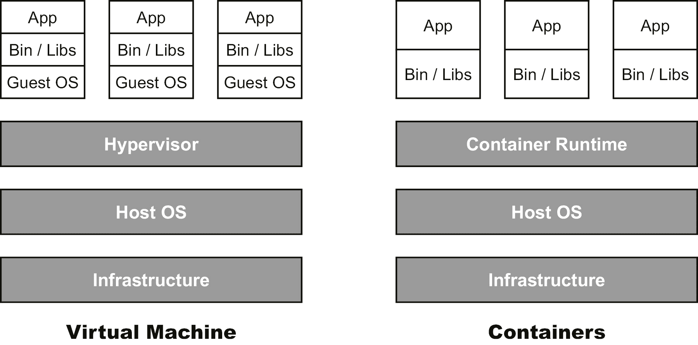

###### 图 9.1:虚拟机和容器的表示

与 vm 一样，容器允许您将应用程序以及所有依赖项和库打包。 它们是像 vm 一样的隔离环境，可以用于测试和运行应用程序，而不需要创建多个 vm。 容器也是轻量级的。

容器不是像虚拟机那样虚拟化每个硬件组件，而是在操作系统级别虚拟化。 这意味着容器的占用空间比 vm 小。 例如，一个 Ubuntu ISO 镜像的大小接近 2.4 GB; 另一方面，Ubuntu 容器映像小于 200mb。让我们考虑前面的例子，在这个例子中，我们遇到 Python 2.2 的依赖问题，最终创建了两个 vm。 使用容器，我们可以拥有两个容器，其占用空间比两个 vm 要小得多。 同时，主机操作系统的成本和资源利用率远低于 2 台虚拟机。 容器使用容器运行时进行部署; 有不同的运行时可用。 在本章中，我们将看一看流行的容器运行时。

容器不是圣杯。 它不能解决你所有的问题。 然而，你可以考虑以下场景，如果他们中的任何一个符合你的需求，你可能想要容器你的应用程序:

*   在业务需求的驱动下，应用程序经常需要更新新特性，最好是不停机。
*   系统工程师和开发人员可以一起工作来解决业务需求，并且对彼此的领域有足够的理解和知识(不需要成为这两个领域的专家)，并且拥有持续试验和学习的文化。
*   为了使应用程序更好，存在失败的空间。
*   应用程序不是单点故障。
*   就可用性和安全性而言，该应用程序不是一个关键应用程序。

还有一件小事:如果您有许多不同类型的应用程序，并且这些应用程序之间几乎没有共享代码，那么容器技术仍然是一种选择，但在这种情况下，vm 可能是更好的解决方案。

我们将介绍一点容器技术的历史，让您更好地理解它的来源。 今天我们将探讨一些可用的解决方案:systemd-nspawn 和 Docker。 现在有更多的容器虚拟化实现可用，甚至包括一些最早的实现，如 LXC。 实际上，使用哪种容器化工具并不重要:如果您理解容器背后的思想和概念，就很容易用其他工具实现相同的思想和概念。 唯一改变的是命令; 所有这些工具的基本概念都是相同的。

### 容器历史

现在集装箱很流行。 但它们并不新鲜; 他们不是凭空而来的 要指出他们开始的确切时间并不容易。 我们并不想给您上一堂历史课，但是历史可以让您了解技术，甚至可以告诉您为什么或何时应该在组织中使用容器。

因此，我们将不关注确切的时间轴，而只讨论重要的步骤:如果您想了解当前的容器技术，那么这些技术的实现是很重要的。

### **chroot 环境**

在 Linux 中,有一根文件系统,覆盖着*第五章*,*高级 Linux 管理*,所有的安装文件系统,将可见当前运行的进程和他们的孩子。

在**chroot**中运行的进程有自己的根文件系统，与系统范围的根完全分开，称为**chroot 监狱**。 在 chroot 监狱中是一个名为**fs 的文件系统。 chroot**。 它经常用于开发中，因为在**chroot**中运行的程序不能访问其根文件系统之外的文件或命令。 要从一个目录启动 chroot 监狱，执行以下操作:

chroot /

1979 年，Unix 版本 7 引入了**chroot**系统调用，1982 年，BSD Unix 引入了系统调用。 Linux 从它存在的早期就实现了这种系统调用。

### **OpenVZ**

2005 年，几乎就在Solaris 开始其容器技术的同时，一家名为 Virtuozzo 的公司启动了 OpenVZ 项目。

他们采用了 chroot 环境的原则，并将其应用于其他资源。 chroot 进程会有以下内容:

*   根文件系统
*   用户和组
*   设备
*   一个进程树
*   一个网络
*   进程间通信对象

当时，OpenVZ 被视为基于管理程序的虚拟化的轻量级替代方案，同时也是开发人员的坚实平台。 它仍然存在，您可以在每个 Linux 操作系统上使用它，无论是否在云中运行。

使用 OpenVZ 类似于使用 VM:您使用您喜欢的发行版的基础安装创建一个映像，如果您愿意，然后您可以使用编排来安装应用程序并维护所有内容。

### **LXC**

2006 年,工程师谷歌开始着手一个特性在 Linux 内核中叫做**并且**(**对照组)启用资源控制资源,如 CPU、内存、磁盘 I / O 和网络收藏的过程(资源组)。**

 **Linux 内核的一个相关特性是**名称空间隔离**的概念:可以隔离资源组，这样它们就看不到其他组中的资源。 因此，**cgroups**成为一个名称空间。

在 2008 年，**cgroups**被合并到 Linux 内核中，并且引入了一个新的命名空间**用户**命名空间。 这两种技术都为容器的发展迈出了新的一步:LXC。

其他可用的命名空间有:**pid**、**mount**、**network**、**uts**(自己的域名)、**ipc**。

不再需要跟上 Linux 内核开发的步伐:所需的每个组件都是可用的，并且有更好的资源管理。

最近，Canonical 开发了一种新的容器管理器LXD，它的后端有 LXC，旨在为管理容器提供改进的用户体验。 从技术上讲，LXD 通过 liblxc 和它的 Go 绑定来实现这一目标。 这里列出了 LXD 的一些优点:

*   安全
*   高度可伸缩
*   简化了资源共享

## 系统生成

Systemd 提供了一个容器解决方案。 它开始是一个实验，然后 Lennart Poettering 认为它可以生产了。 事实上，它是另一个解 Rkt 的基。 在写这本书的时候，Rkt 的发展已经停止了。 但是，您仍然可以访问 Rkt GitHub 存储库([https://github.com/rkt/rkt](https://github.com/rkt/rkt))。

systemd-nspawn 不是很有名，但是它是一个强大的解决方案，在每个现代 Linux 系统上都可以使用。 它构建在内核名称空间和 systemd 之上，用于管理。 这是一种注射了类固醇的 chroot。

如果您想了解更多关于容器的底层技术，system -nspawn 是一个很好的开始。 在这里，每个组件都是可见的，如果您愿意，可以手动配置。 systemd-nspawn 的缺点是，您必须自己完成所有工作，从创建映像、到编排、到高可用性:这都是可能的，但您必须构建它。

也可以创建容器使用包管理器,如**百胜和云通过提取原始图像(几个发行版提供这些图片,比如[https://cloud-images.ubuntu.com/ https://cloud.centos.org/centos/7/images](https://cloud.centos.org/centos/7/images)和)。 你甚至可以使用 Docker 图像!**

 **如上所述，有多种方法可以创建容器。 作为示例，我们将介绍其中的两个:**启动**和**yum**。

### 创建一个带启动的容器

**debootstrap**工具可以将安装一个基于 Debian 或 ubuntu 的系统到另一个已安装系统的子目录中。 它可以在 SUSE、Debian 和 Ubuntu 的存储库中使用; 在 CentOS 或其他基于 Red hat 的发行版上，您需要从**Enterprise Linux Extra Packages**(**EPEL**)存储库中提取它。

作为一个例子，让我们在 CentOS 机器上引导 Debian 来为我们的 systemd 容器创建一个模板。

出于本章的目的，如果你在 CentOS 上运行，你必须更改 systemd-nspawn 的安全标签:

-t virtd_lxc_exec_t /usr/bin/systemd-nspawn

restorecon - v /usr/bin/systemd-nspawn

首先,安装 debootstrap:

Sudo yum 安装 epel-release

Sudo yum install debootstrap

创建一个子目录:

mkdir -p /var/lib/machines/releases/stretch

sudo - s

cd /var/lib/machines/releases

举个例子，bootstrap 来自美国的 Debian:

Debootstrap -arch amd64 stretch stretch \

http://ftp.us.debian.org/debian

### 创建 yum 容器

在每个存储库中都可以使用**yum**实用程序，可以使用创建基于 Red hat 的发行版的容器。

让我们通过步骤来创建一个 CentOS 7 容器:

1.  Create a directory in which we're going to install CentOS, and that will be used for our template:

    mkdir -p /var/lib/machines/releases/centos7

    sudo - s

    cd /var/lib/machines/releases/centos7

    首先，您必须在[http://mirror.centos.org/centos-7/7/os/x86_64/Packages/](http://mirror.centos.org/centos-7/7/os/x86_64/Packages/)下载**centos-release rpm**包。

2.  Initialize the **rpm** database and install this package:

    rpm——rebuilddb 根= / var / lib /机器/版本/ centos7

    rpm——根= / var / lib /机器/版本/ centos7 \

      -ivh --nodeps centos-release*rpm

3.  Now you are ready to install at least the bare minimum:

    百胜,installroot = / var / lib /机器/版本/ centos7 \

    组安装“最小安装”

安装包之后，一个完整的根文件系统就可用了，它提供了引导容器所需的所有东西。 你也可以使用这个根文件系统作为模板; 在这种情况下，您需要修改模板以确保每个容器都是唯一的。

### system -firstboot

如果您第一次启动容器，那么 systemd-firstboot 是配置一些东西的好方法。 您可以配置以下参数:

*   系统区域设置(**——locale=**)
*   系统键盘映射(**——keymap=**)
*   系统时区(**—timezone=**)
*   系统主机名(——hostname=)
*   系统的机器 ID(**——Machine - ID =**)
*   Root 用户的密码(**——Root -password=**)

您还可以使用**-prompt**参数在第一次引导时询问这些参数。

在下面的示例中，我们将修改 systemd-firstboot 单元，以传递一个配置，该配置将在容器第一次运行时执行。

在容器目录下执行**chroot**。 让我们以我们的 CentOS 映像为例:

chroot /var/lib/containers/releases/centos7

passwd 根

点燃图像:

systemd-nspawn——boot -D centos7

打开 systemd-firstboot 单元**/usr/lib/systemd/system/systemd-firstboot。 服务**，并对其进行修改:

(单位)

描述=第一启动向导

Documentation=man:systemd-firstboot(1)

DefaultDependencies=no

冲突= shutdown.target

= systemd-readahead-collect 之后。 服务 systemd-readahead-replay。 服务 systemd-remount-fs.service

= systemd-sysusers 之前。 sysinit 服务。 目标 shutdown.target

ConditionPathIsReadWrite = /等

ConditionFirstBoot = yes

(服务)

Type=oneshot

RemainAfterExit = yes

ExecStart=/usr/bin/system -firstboot—locale=en_US-utf8—root-password=welk0mITG! ——时区= Europe /阿姆斯特丹

StandardOutput = tty

StandardInput=tty

StandardError = tty

启用服务:

systemctl 启用 systemd-firstboot

清除设置:

rm /etc/\

{machine-id、作用、主机名、阴影、locale.conf securetty}

使用*Ctrl*+*D*退出 chroot 环境。

### 部署第一个容器

如果您正在使用 BTRFS 文件系统模板目录作为子卷，您可以使用 systemd-nspawn 的**——template**参数。 否则，它将创建一个新的子卷:

cd /var/lib/machines/releases

Cp -rf centos7/ /var/lib/machines/centos01

是时候启动我们的第一个容器了:

systemd-nspawn——boot -D centos01

尝试登录并按*Ctrl*+*]]*杀死它。

从现在开始，您可以使用**machinectl**命令管理容器:

机器启动<machine name=""></machine>

以以下方式登录:

机器登录<machine name=""></machine>

**机器**还有许多其他的参数值得研究! 如果收到拒绝权限的消息，请考虑 SELinux 故障排除! 另外，**journalctl**有一个**-M**参数来查看容器内的日志记录，或者使用以下方法:

日志 ctl _PID=<pid of="" container="">-a</pid>

如果你在容器中执行**hostnamectl**，你会看到类似如下的结果:

###### 图 9.2:hostnamectl 命令的输出

内核是其中的一个主机!

### 启动时启用容器

要使一个容器在引导时可用，请启用目标**机器。 目标**:

Sudo systemctl 启用 machines.target

现在为我们的容器创建一个**nspawn**文件:**/etc/systemd/nspawn/centos01\. nspawn** 文件名必须与容器相同:

(执行)

PrivateUsers=pick

(网络)

区内=网页

Port = joystick: 80

(文件)

PrivateUsersChown=yes

**【Network】**也设置了从容器中 TCP 端口**80**到主机端口**80**的端口转发。 您必须在容器中的网络接口和子网中的虚拟以太网接口上的主机上配置一个 IP 地址，才能使其工作。

现在启用虚拟机:

Sudo machinecl 启用 centos01

现在，您已经知道如何使用 systemd-nspawn 并部署您的容器，让我们继续讨论最流行的容器化工具:Docker。 您可能听说过很多 Docker，所以让我们开始吧!

## Docker

2010 年 3 月，Solomon Hykes 开始开发 Docker。 它开始于法国作为一个内部的dotCloud。 多亏了 2013 年大型 Python 会议上的公开发布，以及 Red Hat 的兴趣，Docker 真正起飞了。 同年最后一个季度，公司更名为 Docker Inc。

Docker 最初是建立在 LXC 之上的，但一段时间后，LXC 被他们自己的**libcontainer**库所取代。

Docker 的架构非常复杂:它由一个客户端、Docker 和一个守护进程**dockerd**组成。 另一个守护进程，容器**，是用于操作系统和正在使用的容器技术类型的抽象层。 您可以使用**docker- container -ctr**实用程序与**containerd**交互。 **容器**守护进程负责以下工作:**

 ***   注册表(可以在其中存储映像)
*   映像(构建、元数据等等)
*   网络
*   卷(用于存储持久数据)
*   签名(内容信任)

**containerd**与 RunC 通信，它负责以下工作:

*   生命周期管理
*   运行时信息
*   在容器内运行命令
*   生成规范(图像 ID、标记等等)

Docker 有两个版本:-**Docker 社区版**(**CE**)和**Docker 企业版**(**EE**)。 Docker EE 于 2019 年 11 月被 Docker 公司出售给 Mirantis; 然而，Docker CE 仍然由 Docker 公司处理。 Docker EE增加了对 Docker 的支持，同时也提供了一个集成的安全框架，认证插件，对 Docker Swarm 的支持(这是一个像 Kubernetes 一样的容器编排解决方案)，以及对 RBAC/AD/LDAP 的支持。 不过，这一切都是有代价的。 如果您觉得您的环境需要这些额外的优势，那么它是值得花钱的。 另一方面，Docker CE 是免费的开源软件。

### Docker 安装

在 Azure 中有多种方式安装和使用 Docker CE。 您可以安装您选择的 Linux 发行版，并在其上安装 Docker。 在 Azure 市场中有几个 vm可用，比如 RancherOS，这是一个非常小的 Linux 发行版，专门为运行 Docker 而创建。 最后但并非最不重要的是 Docker for Azure 模板，它是由 Docker 在[https://docs.docker.com/docker-for-azure](https://docs.docker.com/docker-for-azure)和[https://docs.docker.com/docker-for-azure](https://docs.docker.com/docker-for-azure)提供的。

为了本章的目的，在 Ubuntu Server VM 上使用 Docker 绝对不是一个坏主意; 这节省了很多工作! 但有几个原因不使用这个 VM:

*   如果你自己配置一切，真的可以帮助你更好地理解事情。
*   使用的软件相对较旧。
*   用于创建虚拟机的 Docker VM 扩展已被弃用，不再处于积极的开发中。

Docker for Azure 模板还安装和配置 Docker Swarm，这是一个 Docker 本地集群系统。

Docker 网站提供了关于如何手动安装 Docker 的优秀文档。 **如果你想安装使用 apt**或**百胜**没有脚本后,您可以按照官方的码头工人文档([https://docs.docker.com/v17.09/engine/installation/ #支持的平台上)。 如果按照此步骤操作，则可以跳过**cloud-init**脚本。](https://docs.docker.com/v17.09/engine/installation/#supported-platforms)

在这里，我们将通过脚本跟踪安装过程。 请注意，这个脚本适用于实验室环境，但不适用于生产环境。

它从 Edge 通道安装最新版本的 Docker，而不是从 Stable 通道安装。 理论上，这可能有点不稳定。

然而，出于本章的目的，这是一个很好的开始方式。 为了快速地启动和运行，让我们使用我们在*第 7 章，部署虚拟机*中学到的云初始化技术。

首先创建一个新的资源组，例如**Docker_LOA**:

az 组 create——name Docker_LOA——location westus

创建一个 cloud-init 配置文件; 在我的示例中，文件名为**docker。 yml**包含以下内容:

# cloud-config

package_upgrade:真

write_files:

-内容:|

(服务)

ExecStart =

ExecStart = / usr / bin / dockerd

路径:/etc/systemd/system/docker.service.d / docker.conf

-内容:|

    {

“主机”:[“fd: / /”,“tcp: / / 127.0.0.1:2375”)

    }

路径:/etc/docker/daemon.json

runcmd:

- curl - ssl https://get.docker.com/ | sh . sh

- usermod -aG docker <ssh user>

不要忘记将**<ssh 用户>**替换为您在执行**az**命令时使用的登录帐户的名称。

您可能已经注意到，我们在脚本中添加了两次**ExecStart**。 ExecStart 允许您指定在启动单元时需要运行哪些命令。 通过设置**ExecStart=**然后在第二行中指定实际的命令来清除它是一种很好的做法。 原因是当安装 Docker 的时候，它一开始会有一个**ExecStart**的值，当我们提供另一个值的时候，会导致冲突。 此冲突将阻止服务启动。 让我们使用我们创建的 cloud-init 文件创建一个安装 Docker 的虚拟机:

1.  Create a VM with the distribution of your choice:

    az vm create——name UbuntuDocker——resource-group Docker_LOA \ .使用实例

    ——image ubuntuults——generate-ssh-keys——admin-username<ssh-user>\</ssh-user>

    ——定义数据 docker.yml

2.  When the VM is ready, log in and execute the following:

    systemctl status docker.service

    #### 请注意

    如果你得到一个消息说“**警告:docker。 服务更改在磁盘上，执行 systemctl daemon-reload 重新加载 docker。 服务**，“耐心点，云初始化仍然很忙。 另外，如果你看到**docker。 没有找到服务**，给 cloud-init 一些时间来完成安装。 您可以通过执行**dpkg -l | grep Docker**来验证 Docker CE 是否已经安装。

3.  Execute the following to receive even more information about the Docker daemon:

    码头工人信息

4.  It's time to download our first container and run it:

    码头工人运行 hello world

在下面的截图中，您可以看到容器已经成功运行，并且您收到了来自 Docker 的**Hello !** 信息:

###### 图 9.3:容器执行成功

Docker 容器是一个执行映像。 要列出系统上可用的映像，请执行以下操作:

码头工人形象 ls

在前面的示例中，我们运行了**docker 运行 hello-world**。 因此，图像已经被拉入，你可以看到当我们使用**docker image ls**命令时，**hello-world**图像被列出:

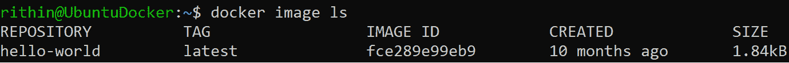

###### 图 9.4:列出 Docker 映像

如果您再次执行**docker 运行 hello-world**，这一次将不会下载映像。 相反，它将查找在上次运行期间已经存储或下载的映像。

让我们下载另一张图片:

码头工人运行 ubuntu

在那之后，我们将列出所有的容器，甚至是那些没有运行的:

码头工人 ps -

所有集装箱都处于**退出**状态。 如果要保持容器运行，必须将**-dt**参数添加到 run 命令中; **-d**表示以分离的方式运行:

Docker 运行-dt ubuntu bash

如果你想要一个交互式 shell 到 Ubuntu 容器(当你 SSH 到一个虚拟机)，你可以添加**-i**参数:

docker 运行- ubuntu

通过再次查看进程列表来验证它是否正在运行:

码头工人 ps

使用容器 ID 或名称，您可以在容器中执行命令，并在终端中接收标准输出:

docker exec<id><command></command></id>

例如，您可以执行以下命令查看容器镜像的 OS 版本:

docker exec<id>cat /etc/os-release</id>

附在容器上，以验证内容是否符合预期:

docker attach

和分离使用*Ctrl*+*P*和*Ctrl +*问*,这意味着你将退出交互式 shell,容器将开始在后台运行。*

综上所述，如果您一直按照本文进行操作，那么到现在，您将能够运行容器，以独立的方式运行它们，从主机上执行到容器的命令，还能够获得到容器的交互式 shell。 到目前为止，我们使用的是 Docker Hub 中已有的图像。 在下一节中，我们将学习如何使用基本映像的自定义配置构建我们自己的 Docker 映像。

### 构建 Docker 映像

Docker 映像包含多个层。 对于您为向容器添加组件而运行的每个命令，都会添加一个层。 每个容器都是一个映像，其中包含只读层和一个可写层。 第一层是引导文件系统，第二层称为基本层; 它包含操作系统。 你可以从 Docker 注册表中提取镜像(稍后你会发现更多关于注册表的信息)或者自己构建镜像。

如果你想自己构建一个，你可以用类似于我们前面看到的方法来做，比如使用 systemd-nspawn 容器，使用 debootstrap。 大多数命令需要 root 用户访问，所以按如下方式升级您的权限:

sudo -我

让我们以 Debian 为基本映像。 这将帮助您理解**docker import**命令。 下载并解压 Debian Stretch:

Debootstrap -arch amd64 stretch stretch \

http://ftp.us.debian.org/debian

创建一个 tarball 并直接导入 Docker:

拉伸;拉伸; | docker 进口拉伸

使用以下命令验证它:

码头工人的图片

Docker 还提供了一个非常小的基本图像**scratch**。

Docker 映像是由 Dockerfile 构建的。 让我们创建一个工作目录来保存 Dockerfile:

Mkdir ~/my-image && CD ~/my-image

由于**拉伸**图像已经在 Docker Hub 中可用，所以最好给你的图像加上一个新名称，这样 Docker 就不会试图拉出该图像，而是选择本地图像。 要标记图像，使用以下命令:

Docker 标签扩展:最新的 apache_custom:v1

然后，通过执行**vi Dockerfile**来创建 Dockerfile(您可以使用任何文本编辑器)。 在这个文件的第一行将基本图像添加为一个图层:

从 apache_custom: v1

第二层包含 Debian 更新:

运行 apt-get——yes update

第三层包含 Apache 安装:

运行 apt-get——yes 安装 apache2

添加最新的层，并在这个读/写层中运行 Apache。 **CMD**用于指定执行容器的默认值:

CMD /usr/sbin/apachectl -e info - d 前台

打开端口**80**:

80 年公开

保存文件，您的文件条目将如下截图所示。 添加注释是一种很好的做法; 然而,它是可选的:

###### 图 9.5:创建 Docker 映像

构建容器:

Docker build -t apache_image。

如果一切顺利，输出应该如下所示:

###### 图 9.6:Docker 映像构建成功

你可以测试这个容器:

Docker 运行-d apache_image

回顾构建的历史:

docker 历史

如下面的截图所示，你将能够看到你的容器的构建历史:

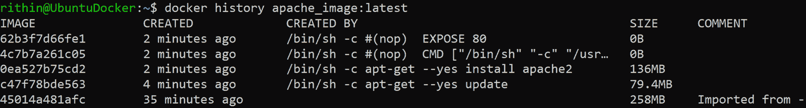

###### 图 9.7:回顾集装箱建造的历史

执行**docker ps**获取容器的 ID，并使用该 ID 收集容器的信息:

docker inspect<id>| grep IPAddress</id>

在输出中，可以找到容器的 IP 地址:

###### 图 9.8:获取 Docker 的 IP 地址

使用**curl**查看 web 服务器是否正在运行:

旋度

你可以在 HTML 中看到著名的“It works”页面，如下所示:

###### 图 9.9:使用 curl 命令测试 web 服务器

现在，我们将使用命令停止容器:

现在再运行一次:

运行-d<id>-p 8080:80</id>

这使得该网站可以在本地主机端口**8080**上使用。

您也可以使用**acbuild**来构建 Docker 容器。

### Docker Machine

还有一种方法可以创建 Docker 容器:Docker Machine。 这是一个创建用于承载 Docker 的虚拟机的工具。 它是你应该在开发机器上运行的东西，不管它是不是物理的，并且你应该远程执行所有的事情。

请注意 Docker Machine 可以安装在 macOS、Linux 和 Windows 机器上。 macOS 和 Windows 安装请参考 Docker Machine 文档([https://docs.docker.com/machine/install-machine/](https://docs.docker.com/machine/install-machine/))，因为我们只安装 Linux。

切换回安装了的 Ubuntu 机器。 安装以下依赖项:

Sudo apt 安装 SSHFS

接下来，你需要下载 DockerMachine，然后将其解压缩到你的**PATH**:

基础= https://github.com/docker/machine/releases/download/v0.16.0 \

&& curl - l $base/docker-machine-$(uname -s)-$(uname -m) \

>/tmp/docker-machine && \

sudo mv /tmp/docker-machine /usr/local/bin/docker-machine \

&& chmod +x /usr/local/bin/docker-machine

自动补全非常有用，而且要确保你以根用户的身份运行下面的脚本，因为脚本将写入**/etc/**目录:

基础= https://raw.githubusercontent.com/docker/machine/v0.16.0

对于 docker-machine-prompt 中的 I。 bash docker-machine-wrapper。 bash \

docker-machine.bash

做

sudo wget "$base/contrib/completion/bash/${i}" -P \ /etc/bash_completion.d

源/etc/bash_completion.d / $ i

完成

注销并重新登录。 为了验证**bash 完成**是否正常工作，您可以点击 tab 按钮查看**docker-machine**可用的命令，如下图所示:

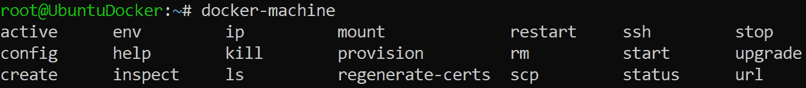

###### 图 9.10:验证 bash 完成是否成功

验证版本:

docker-machine 版本

使用 Azure 作为驱动程序，你现在可以部署一个 VM:

Docker-machine create -d azure \

——azure-订阅-id<subscription id="">\</subscription>

——azure-ssh-user<username>\</username>

——azure-open-port 80 \

——azure-size

还有其他选项，比如公共 IP 和资源组名，可以在部署期间传递。 您可以在 Docker 文档([https://docs.docker.com/machine/drivers/azure/](https://docs.docker.com/machine/drivers/azure/))中看到这些选项的完整列表和默认值。 如果我们没有为一个特定的选项指定一个值，Docker 将采用默认值。 另一件要记住的事情是，虚拟机名称应该只包含小写字母-数字字符或连字符(如果需要); 否则，您将得到一个错误。

在下面的屏幕截图中，您可以看到一个名为**Docker -machine-2**、大小为**Standard_A2**的虚拟机的部署已经成功，Docker 正在该机器上运行。 为了简单起见，我们将订阅 ID 保存为变量**$SUB_ID**，这样就不必每次都检查它; 如果需要，您也可以这样做。 因为我们之前已经验证过了，所以司机不会要求我们再次登录。 驱动程序会记住您的凭证长达两周，这意味着您不必在每次部署时都登录。 您还可以看到部署了哪些资源:

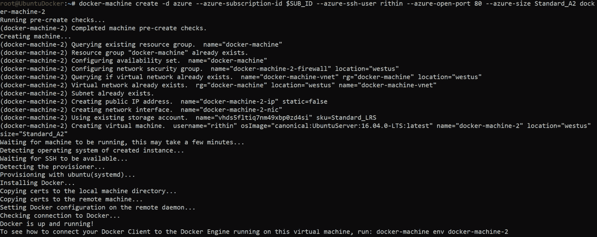

###### 图 9.11:部署 docker-machine-2 虚拟机

要告诉 Docker 使用远程环境而不是本地运行容器，执行以下命令:

docker-machine env

eval $(docker-machine env<vm name="">)</vm>

要验证是否正在使用远程环境，请使用**info**命令:

码头工人信息

在其他信息中，输出显示你正在使用一个运行在 Azure 中的特定虚拟机:

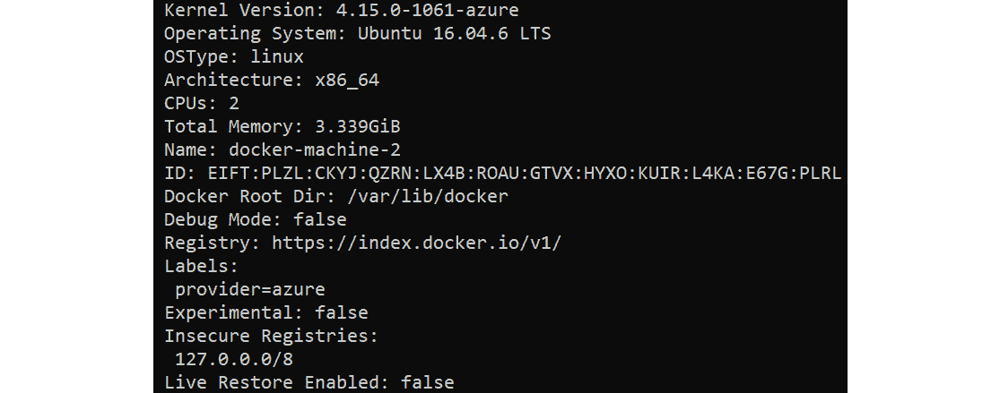

###### 图 9.12:获取 docker 信息

对于 Docker Machine，执行以下命令:

docker-machine ls

输出应该类似如下所示:

###### 图 9.13:列出 docker-machine

让我们创建一个 nginx 容器，将主机端口**80**映射到容器端口**80**。 这意味着所有到达主机 VM 端口**80**的流量都将被定向到容器的端口**80**。 这是用**-p**参数给出的。 执行如下命令创建 nginx 容器:

Docker 运行-d -p 80:80——restart=always nginx

查找虚拟机的 IP 地址:

docker-machine ip

在浏览器中使用该 IP 地址来验证 nginx 是否正在运行。

Docker Machine 还允许我们使用**scp**参数将文件复制到虚拟机中，甚至在本地挂载文件:

Mkdir -m 777 /mnt/test

docker-machine mount<vm name="">:/home/<username>/mnt/test</username></vm>

使用**docker ps**找到正在运行的实例，停止它们，并删除它们，以便为下一个实用程序做好准备。

### Docker Compose

Docker Compose 是一个用于创建多容器应用程序的工具，例如，一个需要 web 服务器和数据库的 web 应用程序。

您可以在[https://github.com/docker/compose/releases](https://github.com/docker/compose/releases)查看 Docker Compose 最新或稳定的版本并安装它，将命令中的版本号替换为最新版本:

sudo curl - l "https://github.com/docker/compose/releases/download/1.24.1/docker-compose-$(uname -s)-$(uname -m)" - o /usr/local/bin/docker-compose

现在，应用可执行权限到我们下载的二进制文件:

/usr/local/bin/docker-compose

接下来，验证安装:

docker-compose 版本

如果安装成功，你可以看到 Docker Compose 的安装版本:

###### 图 9.14:验证 Docker 组合安装

#### 请注意

安装后，如果上述命令失败，则检查您的路径，否则创建一个符号链接到**/usr/bin**或路径中的任何其他目录。 要找出**PATH**中的目录，在 shell 中执行**$PATH**。 要创建一个符号链接，执行**sudo ln -s /usr/local/bin/docker-compose /usr/bin/docker-compose**。

创建一个名为**docker-compose 的文件。 yml**包含以下内容:

wordpress:

图片:wordpress

链接:

    - db:mysql

港口:

- 80:80

db:

  image: mariadb

环境:

mysql_root_password:<password></password>

将**<密码>**替换为您选择的密码。 在仍然连接到 Azure 环境的同时，使用 Docker Machine 执行以下操作:

docker-compose 了-

如果构建成功,两个容器在运行,您可以验证通过使用**码头工人 ps**和打开浏览器正确的 IP 地址<(**docker-machine IP 虚拟机名称>**)。 WordPress 安装程序正在等着你。

### Docker 注册表

每次我们执行**docker 运行**或**docker pull**(仅限下载)，图像都是从互联网上获取的。 它们是从哪里来的? 运行这个命令:

docker info | grep 注册表

上述命令的输出结果为:[https://index.docker.io/v1/](https://index.docker.io/v1/)。 这个 URL 是官方的 Docker Hub。 Docker Hub 或 Docker Store 也有一个很好的 web 界面，可以通过[https://hub.docker.com](https://hub.docker.com)获得，它是一个私有和公开的 Docker 映像的在线存储库。

可以使用**docker search**命令来搜索该存储库。 为了限制这个命令的输出，你可以添加过滤器:

Docker search -filter "is-official=true

下面是**docker search**命令的输出:

###### 图 9.15:docker 搜索命令的输出

可以选择添加**——no-trunc**参数来查看图像的完整描述。 在输出中，还有一个星级评级，可以帮助我们选择最好的可用图像。

如果你在 Docker Hub 网站上创建自己的账户，你可以使用**Docker 推送**将你的图片上传到注册表。 这是免费的!

以以下方式登录:

docker login -u<username>-p<password></password></username>

构建图像:

docker build -t<accountname>/:versiontag。</accountname>

你也可以在图片后面加上标签:

docker 标签<tag id=""><accountname>/:版本标签</accountname></tag>

对于版本控制，最好使用诸如**v1.11.1.2019**这样的字符串，这意味着第一个版本于 2019 年 11 月 1 日发布。 如果您不添加该版本，它将被标记为最新版本。

使用**docker search**命令无法看到标签。 你需要 web 接口或 API 查询码头工人使用**旋度**(一个工具来传输数据和从服务器)和**金桥(工具类似于**sed**但专门为 JSON 数据):**

wget -q https://registry.hub.docker.com/v1/repositories//tags - o - | jq

#### 请注意

Jq 默认不安装。 你必须使用**apt 安装 jq**来安装它。

该输出将是 JSON 格式的。 您可以使用**jq**进一步查询，并在需要时细化输出。 如果你不想使用 jq 格式化 JSON，你可以使用本机**sed**，**tr**，和**cut**命令格式化输出，得到更清晰的结果:

wget - q https://registry.hub.docker.com/v1/repositories//标签- o - | sed - e ' s / [] [] / / g - e ' s / / / g - e 的 s / / / g ' | tr '} ' ' \ n ' | - d”:“f3

如果你想获得 nginx 的所有标签，你可以用**nginx**替换**<图像名称>**。

我们已经讨论了 Docker Hub 以及如何检查可用的映像。 类似地，Azure 提供了 Azure 容器注册表，您可以在其中存储您的私有映像，并在需要时提取它们。 在我们开始 Azure 容器注册表之前，我们需要了解 Azure 容器实例，有了这些实例，您就可以运行容器，而无需管理主机。 让我们继续学习更多。

## Azure 容器实例

现在我们已经能够在虚拟机中运行容器了，我们可以更进一步:我们可以使用 Azure 容器实例服务来运行它，而无需管理服务器。

您可以使用 Azure 门户来实现这一点。 在左侧导航栏中选择**All Services**，搜索**Container 实例**。 在**容器实例**中，单击**Add**创建一个新的容器实例，门户将把您重定向到以下窗口:

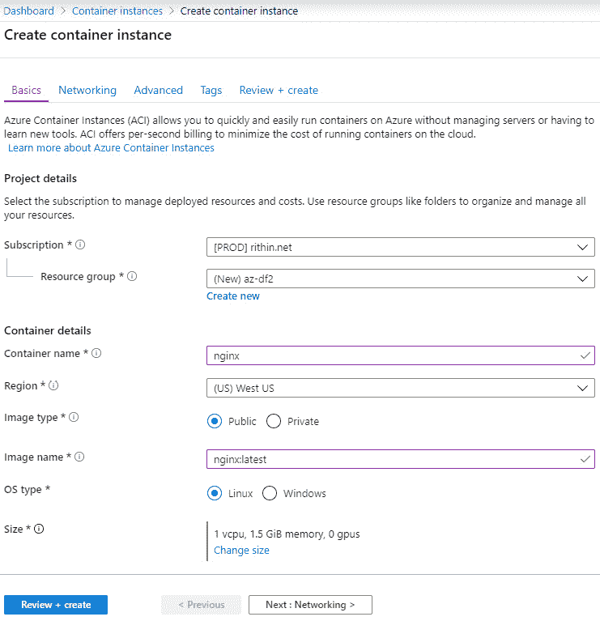

###### 图 9.16:创建一个 Docker 容器实例

可以新建资源组，也可以使用已有的资源组。 将容器名称设置为**nginx**,**图像类型设置为**公共**因为我们要拉的公众形象,将图像名称设置为**nginx:最新的**【显示】设置 Linux 操作系统类型**,然后选择所需的资源要求容器。 点击**Next**，在**Networking**部分，我们将暴露**端口 80**为 HTTP 流量，如下截图所示。 此外，您还可以添加**DNS 标签**，并根据需要选择一个公网 IP 地址:****

 ****

###### 图 9.17:添加容器实例的网络细节

这对于验证和创建实例来说已经足够了。 您可以跳过接下来的部分，进入**Review+ Create**。 然而，Azure 在**advanced**选项卡中提供了高级选项。 它们可用于添加环境变量、设置重启策略选项，以及使用命令覆盖包含一组在初始化容器时需要执行的命令。 如果您愿意，您也可以配置它。

你也可以使用 Azure CLI 用命令行创建容器:

az container create——resource-group<resource group="">——name nginx——image nginx:latest——dns-name-label nginx-loa——ports 80</resource>

你也可以使用 PowerShell:

New-AzContainerGroup -ResourceGroupName<resource group="">'</resource>

-Name nginx -Image nginx:latest r - otype Linux '

-DnsNameLabel nginx-loa2

请注意，DNS 标签在您所在地区必须是唯一的。

在命令的回显信息中，可以看到实例的 IP 地址:

###### 图 9.18:使用 PowerShell 创建容器

您应该能够访问一个 FQDN 和 IP 地址上的 web 服务器。 如截图所示，你可以将浏览器指向 DNS 标签或 IP 地址，你可以看到**欢迎来到 nginx!** 页:

###### 图 9.19:当浏览器指向 DNS 标签时，web 服务器的输出

要获取容器实例的列表，执行以下操作:

阿兹容器列表

或者，执行以下操作:

Get-AzContainerGroup |格式表

到目前为止，我们一直依赖 Docker Registry 来保存、提取和推送图像。 Azure 提供了一个私有的映像注册表，您可以在其中存储映像，以便在需要时使用它们。 这个服务称为 Azure 容器注册表。 让我们来学习一下。

## Azure 容器注册表

如前所述，您可以使用私有的 Azure 容器注册表来代替 Docker 注册表。 这项服务不是免费的! 使用这个 Azure 服务的优点是，您拥有 Blob 存储的所有特性(可靠性、可用性、复制等)，并且可以将所有流量保持在 Azure 内，这使得这个注册表在特性、性能和成本方面都成为一个有趣的选项。

### 使用 Azure Portal

创建注册表最简单的方法是使用 Azure 门户。 在左侧导航栏中，选择**All Services**，搜索**Container 注册表**。 点击**Add**，您应该会看到以下屏幕。 不要忘记启用**Admin 用户**选项; 通过这样做，你可以通过**docker 登录**登录容器注册表，用户名作为注册表名，密码作为访问密钥:

###### 图 9.20:使用 Azure 门户创建容器注册表

如果注册表准备好了，将会有一个弹出窗口，表明任务已经完成，您将能够看到资源。 如果您导航到**Access Keys 刀片**，您将找到登录服务器和您的用户名，它与注册表名称和密码集相同:

###### 图 9.21:Access 关键刀片窗格

使用这些信息登录到存储库，就像使用 Docker Hub 一样。

在推送映像之后，它将在存储库中可用。 从那里，您可以将它部署到 Azure 容器实例服务并运行它。

### 使用 Azure CLI

我们已经通过 Azure 门户创建了一个 Azure Container Registry 实例。 也可以使用 Azure CLI 和 PowerShell 来执行相同的任务。 我们将遵循 Azure CLI 的步骤，我们鼓励您自己使用 PowerShell 尝试这个过程。

首先，我们需要一个安装了 Docker 和 Azure CLI 的 Linux 虚拟机。

让我们从创建资源组开始，或者您可以使用与门户示例中使用的相同的资源组。 回想一下我们在一开始学习的命令，在*Docker 安装*一节; 我们将继续进行一个新的资源组:

Az 组 create——name Az -acr-cli——location eastus

一旦你得到成功消息，继续使用下面的方法创建容器注册表:

azacr create——resource-group az-acr-cli——name azacrcliregistry——sku Basic——admin-enabled true

这里，我们使用 Basic SKU 创建容器注册表。 还有其他可提供更多存储选项和吞吐量的 sku。 sku 指向容器注册表的不同定价层。 访问 Microsoft Azure 定价页面([https://azure.microsoft.com/en-in/pricing/details/container-registry/](https://azure.microsoft.com/en-in/pricing/details/container-registry/))查看每个 SKU 的定价。 由于这是一个演示，并保持成本最低，我们将使用 Basic。

在部署 Azure Container Registry 实例之后，我们将登录到注册表。 但要登录，我们需要密码。 我们已经知道注册表的用户名，这是注册表的名称，所以让我们找到注册表的密码:

show——name azacrcliregistry——resource-group Az -acr-cli

输出将显示用户名和密码。 请把它们记下来。 您可以使用密码 1 或密码 2。 现在我们确定了凭据，我们将通过执行以下操作登录到 Azure 容器注册表实例:

azacr login—name azacrcliregistry—username azacrcliregistry—password<password></password>

如果登录成功，您应该会看到如下截图所示的输出:

###### 图 9.22:Azure Container Registry 登录成功

让我们继续，将一个图像推送到注册表。 为了推送一个图像，首先我们需要有一个图像。 如果您使用的虚拟机与前面的示例中使用的相同，那么可能会引入一些映像。 如果图像不存在，可以使用**docker 拉<图像名称>**来获取图像。 您可以使用**docker images**命令来验证可用图像列表。 因为我们已经有了一个 nginx 映像，所以我们不打算从 Docker Hub 中提取它。

现在我们有了图像，让我们标记它。 标记将帮助您知道您正在使用的图像。 例如，如果您有一个标记为**v1**的图像，并对其进行了一些更改，则可以将其标记为**v2**。 标记可以帮助您根据发布日期、版本号或任何其他标识符对图像进行逻辑组织。 我们需要标记在**【显示】AcrLoginName>/<图像名称>:【病人】版本标记>**格式,在**acr-name**的 FQDN Azure 容器注册表实例。 要获取 Azure Container Registry 实例的 FQDN，执行以下操作:

azacr show -n azacrcliregistry -g az-acr-cli | grep loginServer

对于 nginx 图像，我们将其标记为**nginx:v1**:

Docker 标签 nginx azacrcliregistry.azurecr.io/ngnix:v1

让我们使用**docker push**命令将带标签的图像推送到 Azure Container Registry:

码头工人推 azacrcliregistry.azurecr.io / ngnix: v1

所有图层都应该被推送，如下图所示:

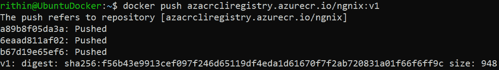

###### 图 9.23:将带标签的图像推送到容器注册表

假设您已经将多个图像推送到 Azure Container Registry，并希望获得所有图像的列表。 然后可以使用**az acr 存储库列表**命令。 要列出我们在 Azure Container Registry 实例中创建的所有映像，使用下面的命令:

Az acr 存储库列表——name azacrcliregistry -o table

可以使用**docker run**命令运行容器。 但是始终要确保映像名称的格式为**<AcrLoginName>/<image>**。 Docker 的时代即将结束，最终将被无守护的下一代工具所取代。

下一节将介绍这些工具，以及如何使用 Docker 实现平滑转换。

## Buildah, Podman, and Skopeo

在前一节中，我们讨论了 Docker 是如何工作的，以及如何使用它来部署容器。 如前所述，Docker 使用 Docker 守护进程来帮助我们实现这一切。 如果我们说人们已经开始和 Docker 说再见了呢? 是的，随着下一代容器管理工具的引入，Docker 正在逐渐消失。 我们并不是说 Docker 完全消失了，但它迟早会被无根或无守护的 Linux 容器工具所取代。 您没有读错:这些工具没有运行守护进程，使用单巨石守护进程的方法即将结束。 难怪人们开始称使用这些工具部署的集装箱为“无 dockercontainer”。

### 历史

你可能想知道这一切是什么时候发生的。 早在 2015 年，Docker Inc.和 CoreOS 以及其他一些组织就提出了**Open Container Initiative**(**OCI**)的想法。 其目的是标准化容器运行时和图像格式规范。 OCI 映像格式被大多数容器映像注册中心支持，例如 Docker Hub 和 Azure 容器注册中心。 现在可用的大多数容器运行时要么与 OCI 兼容，要么在管道中有 OCI。 这仅仅是个开始。

早些时候，Docker 是 Kubernetes 唯一可用的容器运行时。 显然，其他厂商希望在 Kubernetes 中支持它们特定的运行时。 由于这种困境和缺乏对其他供应商的支持，Kubernetes 在 2017 年创建了 CRI。 CRI 代表容器运行时接口。 您可以使用其他运行时，如 CRI-O、containerd 或 frakti。 由于 Kubernetes 的蓬勃发展和对多个运行时的支持，Docker 的垄断开始被推翻。 Docker 的垄断地位很快就改变了，它成为 Kubernetes 支持的运行时之一。 这一变化产生的影响实际上催生了无守护程序工具的想法，并推翻了使用需要超级用户访问的 monolith 守护程序的方法。

让我们试着理解一些流行的术语，而不是使用一般的术语。 Buildah 用于构建容器，Podman 用于运行容器，Skopeo 允许您对存储图像的图像和存储库执行各种操作。 让我们仔细看看这些工具。 有些人建议在使用这些工具之前删除 Docker，但我们建议保留 Docker，以便您可以不断地将这些工具与它进行比较。 如果您遵循了前面关于 Docker 的章节，您将能够创建一个类比。

### 安装

安装这些工具非常简单。 你可以在 Ubuntu 中使用 apt，在 RHEL 中使用 yum 来安装这些工具。 因为我们使用的是同一个 VM，所以我们将按照 Ubuntu 安装这些包。 要安装 Buildah，请执行以下操作:

sudo apt 更新

Sudo apt 安装-y software-properties-common

Sudo add-apt-repository -y ppa:projectatomic/ppa

sudo apt 更新

Sudo apt 安装-y buildah

因为我们已经在安装 Buildah 期间添加了 PPA 存储库，所以我们可以直接使用**apt install**来部署 Podman。 安装 Podman，请执行以下操作:

安装 podman

为了安装 Skopeo，我们需要在 Ubuntu 虚拟机上安装**snap**。 如果您使用的是 Ubuntu 16.04 LTS 或更高版本，那么将默认安装 snap。 否则，您必须使用**apt install snapd**手动安装它。

让我们使用 snap 来安装 Skopeo:

Sudo snap install skopeo -edge

#### 请注意

如果你得到一个错误消息，说明**版本不是产品**，你可以使用**-devmode**参数来安装; 这将跳过此错误并完成安装。

现在我们已经准备好探索这些工具了。

### Buildah

在前一节中，我们讨论了 Dockerfiles。 下面是有趣的部分:Buildah 完全支持 Dockerfiles。 您所要做的就是编写 Dockerfile 并使用**bud**命令，它代表 build- use -docker。 让我们以 Dockerfile 一节中使用的相同示例为例。 通过执行**vi Dockerfile**来创建 Dockerfile(你可以使用任何文本编辑器)，并添加以下行:

来自 nginx

运行 apt-get——yes update

运行 apt-get——yes 安装 apache2

CMD /usr/sbin/apachectl -e info - d 前台

80 年公开

保存文件。

在构建之前，还有一些事情需要处理。 build 在**/etc/containers/ registrers .conf**文件中查找注册表列表。 如果该文件不存在，我们需要创建一个，添加以下代码，并保存该文件:

[registries.search]

注册中心=(“docker.io”)

通过这样做，我们指示在 Docker Hub 中搜索图像。 如果需要，还可以将 Azure Container Registry 实例添加到列表中。

让我们继续构建图像; 确保您在 Dockerfile 所在的目录中。 使用下面的方法开始构建过程:

buildah bud -t ngnix-buildah .

我们创建了一个名为**nginx-buildah**的映像。 要查看图像列表，可以使用**构建图像**命令。 是的，我们知道它看起来非常类似于你如何在 Docker 列表图像。 我们需要记住这个类比，它会帮助你学习。

输出将类似如下:

###### 图 9.24:使用 buildah 命令列出图像

您可以看到，Buildah 列出了我们从 Docker Hub 提取的映像，以及我们创建的存储在本地主机存储库中的映像。

要从一个映像构建一个容器，我们可以使用以下方法:

build from

这将创建一个名为**<image>-working container**的容器。 如果你想构建一个 nginx 容器，执行以下命令:

来自 nginx 的构建

你会得到一个类似的输出:

###### 图 9.25:构建一个 nginx 容器

就像使用**docker ps**列出所有的容器一样，我们将运行**buildah ps**，并且我们将能够看到我们刚刚创建的**nginx-working-container**:

###### 图 9.26:使用 buildah ps 命令列出容器

此外，我们可以使用**buildah run**命令直接在容器中执行命令。 语法如下:

<container name=""><command></command></container>

让我们尝试打印我们创建的 nginx 容器的**/etc/os-release**文件的内容。 命令如下:

运行 nginx-working-container cat /etc/os-release

输出将类似如下:

###### 图 9.27:打印 nginx 容器的内容

与 Docker 一样，Buildah 也支持**push**、**pull**、**tag**和**inspect**等命令。

### Podman

我们通过 Buildah 构建的图像符合 OCI 要求，可以与 Podman 一起使用。 在 Podman 中，这种类比继续存在; 我们所要做的就是把所有的 Docker 命令替换成 Podman 命令。 我们必须记住的关键事情之一是，在 Podman 中，我们不能作为非 root 用户为容器进行端口绑定。 如果您的容器需要端口映射，那么您必须将 Podman 作为根运行。 因为我们已经讨论过 Docker，并且您已经熟悉 Docker 命令，所以我们将尝试运行一个容器并进行验证。 让我们创建一个 nginx 容器，将端口映射到**8080**。 因为我们需要映射一个端口，我们将以**sudo**的方式运行命令:

执行-d -p 8080:80——name webserver nginx 命令

因为我们已经使用**sudo**命令创建了容器，所以它将由根用户拥有。 如果容器是使用**sudo**创建的，请确保将与该容器相关的所有操作都链接在 sudo 上。

要列出容器，使用**podman ps**，我们可以看到该容器正在监听主机的**0.0.0.0:8080**，该主机被映射到该容器的端口:

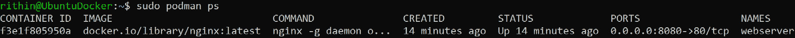

###### 图 9.28:使用 podman ps 命令列出容器

让我们做一个**curl**调用，并确认 web 服务器是否正在端口**8080**上运行:

旋度 localhost: 8080

如果一切正常，你可以看到 nginx 欢迎页面:

###### 图 9.29:验证 web 服务器端口的身份验证

是的，容器正在无守护进程地运行!

这里我们没有介绍所有的 Podman 命令，一旦您熟悉 Docker，您所要做的就是在命令行中用**Podman**替换**Docker**。

### Skopeo

如果您还记得，之前我们尝试使用 Docker 获取图像的标签。 使用 Skopeo，您可以检查存储库、复制映像和删除映像。 首先，我们将使用**skopeo inspect**命令在 Docker Hub 中获取图像的标签，而不需要拖拽它:

skopeo 检查码头工人:/ / nginx:最新

运行此命令将触发一些警告。 你可以忽略它们。 如果检查输出，可以看到它给出了标记、层、OS 类型等。

您可以使用**skopeo copy**命令跨多个存储库复制容器映像。 此外，您可以在 Azure 容器注册表中使用 Skopeo。

我们不会涵盖所有这些。 然而，你可以访问这些工具的 GitHub 库:

*   [https://github.com/containers/buildah](https://github.com/containers/buildah )
*   Podman:[https://github.com/containers/libpod](https://github.com/containers/libpod)
*   [https://github.com/containers/skopeo](https://github.com/containers/skopeo )

## 容器和储存

本节的目的是给你一个容器和存储的基本概念。 每个可以创建映像的构建工具都提供了将数据添加到容器的选项。

您应该只将此特性用于提供配置文件。 应用程序的数据应该尽可能地托管在容器之外。 如果您想快速更新/删除/替换/缩放您的容器，如果数据在容器中，这几乎是不可能的。

当我们创建一个容器时，存储被附加到容器上。 但是，容器是短暂的，这意味着在销毁容器时也会销毁存储。 让我们假设您创建了一个用于测试的 Ubuntu 容器，并将一些测试过的脚本保存在该容器中，希望以后可以使用它们。 现在，如果您不小心删除了这个容器，那么您稍后测试并保存的所有脚本都将消失。

您的应用程序数据非常重要，您希望在容器的生命周期结束后仍然保留它。 因此，我们希望将数据从容器生命周期中分离出来。 通过这样做，您的数据不会被销毁，并且可以在需要时重用。 在 Docker 中，这是通过使用卷实现的。

Docker 支持多种持久卷选项，包括 Azure Files。 换句话说，您可以将 Azure 文件共享作为一个持久卷绑定到 Docker 容器。 为了演示这一点，我们将访问主机卷，其中的位置将作为卷挂载到容器。 这些步骤的目的是展示如何在容器从主机中移除后保存数据。

卷信息在创建容器时通过**-v**参数传递给**docker 运行**命令。 一般语法如下:

Docker 运行-v /some-directory/在主机:/some-directory/在容器中

假设您有一个应用程序，该应用程序将在容器中的**/var/log**目录中创建一个文件，我们需要将其持久化。 在下一个命令中，我们将主机中的一个目录映射到容器的**/var/log**目录。

要完成这个练习，您需要一个运行 Docker 的 Linux 虚拟机。 让我们在主机上创建一个**~/myfiles**目录，它将被映射到容器:

mkdir ~/myfiles

让我们创建一个带有交互式 shell 的 Ubuntu 容器，其中通过**-v**参数来挂载卷:

Docker 运行-it -v ~/myfile:/var/log ubuntu

如果容器创建成功，您将以 root 用户登录该容器:

###### 图 9.30:创建 Ubuntu 容器

我们将进入容器的**/var/log**目录，使用下面的命令创建 10 个空文件:

触摸文件{10}1 . .

列出目录的内容将显示我们刚刚创建的 10 个文件:

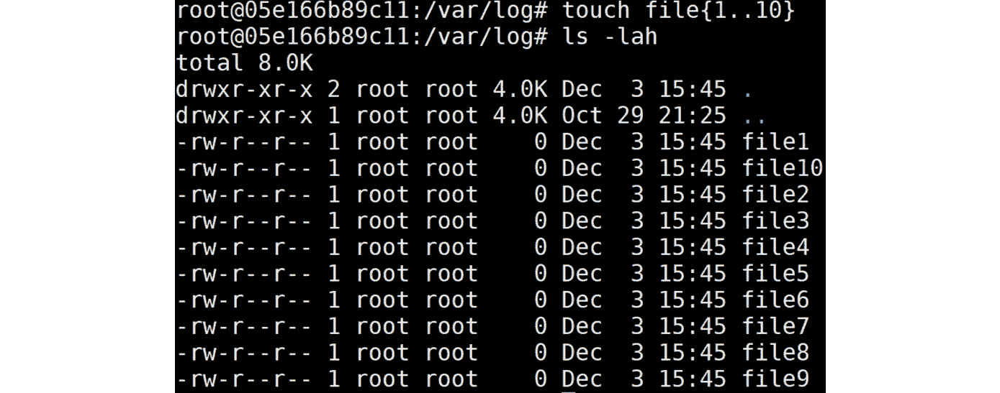

###### 图 9.31:列出/var/log 目录的内容

使用*Ctrl*+*D*退出交互式 shell，现在我们回到主机。 现在我们将删除容器:

docker rm

**id/name**可以通过**docker ps——all**命令的输出信息获取。

现在容器已经被删除，我们将转到主机的**~/myfiles**目录来验证内容。

在下面的截图中，可以看到容器已经被成功删除; 但是，**~/myfiles**目录仍然保存我们在容器中创建的文件:

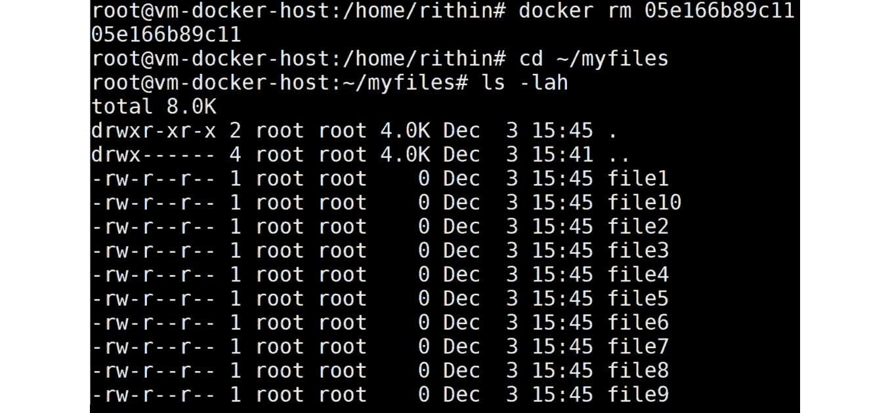

###### 图 9.32:在~/myfiles 目录下列出文件

现在我们知道如何使我们的量持久。 对于 Docker，有[https://github.com/ContainX/docker-volume-netshare](https://github.com/ContainX/docker-volume-netshare)等解决方案。

如果你正在使用 Docker，并且想要使用 Azure Files，你可以使用 Cloudstor，一个可以在[https://docs.docker.com/docker-for-azure/persistent-data-volumes](https://docs.docker.com/docker-for-azure/persistent-data-volumes)上找到的插件。

使用 Azure File Storage 可能不是最便宜的解决方案，但通过这种方式，您可以获得所需的所有可用性和备份选项。

如果你要用 Kubernetes，那就完全是另一回事了。 我们将在下一章讨论那件事。

## 总结

在本章中，我们讨论了在 Azure 中部署工作负载的另一种方法。 在介绍了容器虚拟化的历史、思想和概念之后，我们讨论了一些可用的选项。 除了 LXC 等较老的实现外，我们还讨论了其他一些很棒的、可靠的宿主容器实现:systemd-nspawn 和 Docker。

我们不仅了解了如何运行从存储库中提取的现有映像，还了解了如何创建我们自己的映像。 也许最大的消息是有一个叫做 Buildah 的工具，它可以使用 Open Container Initiative 的 OCI 标准创建映像，并且可以用于 Docker。

这一章的大部分内容是关于 Docker 的。 这是目前实现最广泛的容器解决方案。 说到实现，有很多方法可以实现/部署 Docker:

*   在虚拟机上手动部署
*   从市场部署一个随时可用的 VM
*   码头工人的机器
*   Azure 容器实例

还讨论了如何与 Docker Hub 和 Azure Container Registry 一起工作。

最后，我们讨论了新的容器技术，如 Buildah、Podman 和 Skopeo。

我们在这一章结束时简单介绍了容器和存储。 您可能想知道，如果容器被销毁，附加到容器的存储会发生什么情况，或者如何使存储持久。 您将在下一章*第 10 章*，*使用 Azure Kubernetes 服务*学习持久性。 此外，我们还将讨论著名的容器编排工具 Kubernetes。

## 问题

1.  使用容器的原因是什么?
2.  什么时候容器不是您需要的解决方案?
3.  如果您需要虚拟专用服务器之类的东西，您是否需要 VM，或者是否有一个容器虚拟化解决方案可能是一个好主意?
4.  为什么从一个解决方案(比如 Docker)迁移到另一个解决方案(比如 Buildah)不会很困难呢?
5.  开发机器的用途是什么?
6.  为什么使用 Buildah 是一个好主意，即使它正在大力开发?
7.  为什么不应该将应用程序数据存储在容器中?

## 进一步阅读

在容器虚拟化领域执行进一步的读取不是一件很容易的事情。 对于**system -nspawn**，它相对简单:手册页很容易阅读。 我们做一个相关的建议是**systemd-nspawn 甚至码头工人:红帽提供一个文档在网站上称为资源管理指南(https://access.redhat.com/documentation/en-us/red_hat_enterprise_linux/7/html/resource_management_guide/)并且有良好的信息。**

 **这里列出了一些关于 Docker 的参考文献:

*   *编排 Docker*，作者 Shrikrishna Holla，在这里你可以了解如何管理和部署 Docker 服务
*   Mark Panthofer 的《掌握 Docker 企业:采用敏捷容器的配套指南》，在这里你可以探索 Docker EE 的附加服务以及如何使用它们************