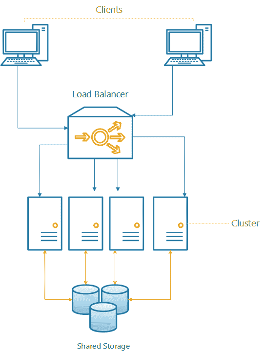
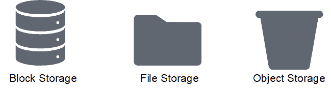
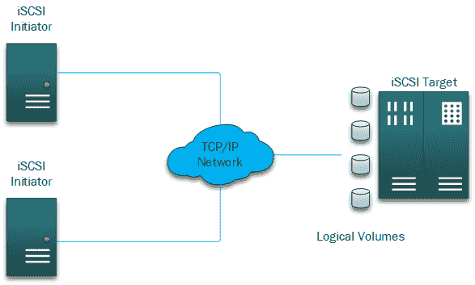
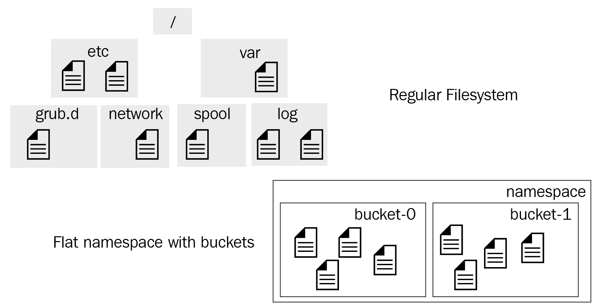
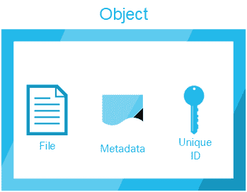
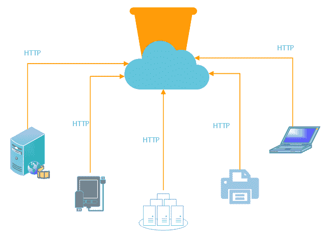
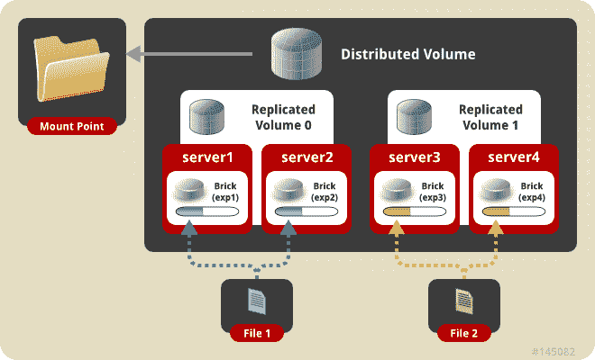

# 二、定义 GlusterFS 存储

每天，应用都需要更快的存储来支持数千个并发输入/输出请求。GlusterFS 是一个高度可扩展的冗余文件系统，可以同时向许多客户端提供高性能的输入/输出。我们将定义集群的核心概念，然后介绍 GlusterFS 如何发挥重要作用。

在前一章中，我们讨论了设计解决方案的不同方面，以向有许多需求的应用提供高可用性和高性能。在本章中，我们将通过解决一个非常具体的问题，即存储。

在本章中，我们将涵盖以下主题:

*   理解集群的核心概念
*   选择 GlusterFS 的原因
*   解释**软件定义存储** ( **SDS** )
*   探索文件、对象和块存储之间的差异
*   解释对高性能和高可用性存储的需求

# 技术要求

本章将着重于定义 GlusterFS。您可以在[https://github.com/gluster/glusterfs](https://github.com/gluster/glusterfs)或[https://www.gluster.org/](https://www.gluster.org/)查阅项目主页。

此外，项目文件可在[https://docs.gluster.org/en/latest/](https://docs.gluster.org/en/latest/)找到。

# 什么是集群？

我们可以利用 SDS 的许多优势，它允许轻松的可扩展性和增强的容错能力。GlusterFS 是一款软件，可以创建高度可扩展的存储集群，同时提供最高性能。

在我们讨论如何解决这一特定需求之前，我们首先需要定义什么是集群，它为什么存在，以及集群可能解决什么问题。

# 计算集群

简而言之，集群是一组计算机(通常称为节点)，它们在相同的工作负载上协同工作，并且可以在集群的所有可用成员之间分配负载以提高性能，同时允许自我修复和可用性。请注意，术语**服务器**以前没有使用过，因为实际上，任何计算机都可以添加到集群中。从一个简单的树莓皮到多个中央处理器服务器，集群可以从一个小的双节点配置到数据中心的数千个节点。

以下是一个集群示例:



从技术上讲，集群允许工作负载通过添加具有相似资源特征的同类服务器来扩展性能。理想情况下，群集将具有同类硬件，以避免节点具有不同性能特征的问题，同时使维护相当一致，这意味着硬件具有相同的 CPU 系列、内存配置和软件。向集群添加节点的想法允许您计算工作负载以减少其处理时间。根据不同的应用，计算时间有时甚至会线性减少。

为了进一步理解集群的概念，假设您有一个获取历史财务数据的应用。然后，应用接收这些数据，并基于存储的信息创建预测。在单个节点上，预测过程(集群上的过程通常被称为作业)大约需要六天才能完成，因为我们要处理几个 1tb 的数据。添加一个具有相同特征的额外节点将处理时间减少到四天。添加第三个节点进一步将完成时间减少到三天。

请注意，虽然我们增加了三倍的计算资源，但计算时间仅减少了大约一半。一些应用可以线性扩展性能，而其他应用则没有相同的可扩展性，需要越来越多的资源来获得更少的收益，甚至达到收益递减的程度。增加更多的资源来获得最小的时间增益是不划算的。

考虑到所有这些，我们可以指出定义集群的几个特征:

*   它可以通过增加计算资源来帮助减少处理时间
*   它可以垂直和水平缩放
*   它可以是冗余的，也就是说，如果一个节点出现故障，其他节点应该承担工作负载
*   它可以为应用提供更多的资源
*   它是一个资源池，而不是单独的服务器
*   它没有单点故障

# 存储集群

现在，我们已经了解了如何计算集群，让我们继续讨论集群的另一个应用。

存储集群的主要功能不是聚合计算资源来减少处理时间，而是聚合可用空间来提供最大的空间利用率，同时提供某种形式的冗余。随着对存储大量数据需求的增加，需要能够以更低的成本实现这一点，同时仍然保持更高的数据可用性。存储群集允许单个单体存储节点作为一个大的可用存储空间池一起工作，从而有助于解决这个问题。因此，它允许存储解决方案达到 petascale 标准，而无需部署专门的专有硬件。

例如，假设我们有一个具有 500 TB 可用空间的节点，我们需要在提供冗余的同时达到 1- **Petabyte** ( **PB** )标记。这个单独的节点成为单点故障，因为如果它发生故障，就无法访问数据。此外，我们已经达到了最大的**硬盘驱动器** ( **硬盘**)可用容量。换句话说，我们不能横向扩展。

为了解决这个问题，我们可以再添加两个配置相同的节点，因为现有的节点总共提供了 1 PB 的可用空间。现在，让我们在这里做一些数学计算，500 TB 乘以 3 应该大约是 1.5 PB，对吗？答案绝对是肯定的。但是，由于我们需要为该解决方案提供高可用性，第三个节点充当备份，使该解决方案能够容忍单节点故障，而不会中断客户端的通信。这种允许节点故障的能力完全得益于 SDS 和存储集群(如 GlusterFS)的强大功能，我们将在接下来探讨这一点。

# 什么是 GlusterFS？

GlusterFS 是 Gluster 的一个开源项目，于 2011 年被红帽公司收购。此次收购并不意味着您必须获得红帽订阅或向红帽付费才能使用它，因为如前所述，它是一个开源项目；因此，您可以自由地安装它，查看它的源代码，甚至为项目做出贡献。虽然红帽提供基于 GlusterFS 的付费解决方案，但我们将在本章中讨论**开源软件** ( **OSS** )和项目本身。

下图是 Gluster 项目中**贡献者**和**承诺**的数量:


要理解 GlusterFS，我们必须了解它与传统存储有何不同。为此，我们需要理解 SDS 背后的概念，包括什么是 GlusterFS。

传统存储是行业标准的存储阵列，其中包含与硬件供应商绑定的专有软件。所有这些都将您限制在由您的存储提供商设置的以下规则集内:

1.  可扩展性限制
2.  硬件兼容性限制
3.  客户端操作系统限制
4.  配置限制
5.  供应商锁定

# 学生争取民主社会运动(Students for a Democratic Society)ˌ十二烷基磺酸钠(Sodium Dodecyl Sulfonate)

有了 SDS，许多(如果不是全部的话)前面的限制都消失了，因为它不依赖于任何硬件，提供了令人印象深刻的可扩展性。从根本上说，您可以从任何供应商处获得包含所需存储的行业标准服务器，并将其添加到您的存储池中。只做这一个简单的步骤，你就已经克服了前面的四个限制。

# 成本降低

来自 *SDS* 部分的示例极大地降低了**运营费用** ( **OPEX** )成本，因为您不必为现有供应商存储阵列购买额外的高价扩展架，而这些扩展架可能需要数周时间才能到达并安装。您可以快速找到存储在数据中心角落的服务器，并使用它为现有应用提供存储空间。这个过程被称为插件可伸缩性，存在于大多数开源 SDS 项目中。理论上，当涉及到 SDS 的可扩展性时，天空是极限。

# 可量测性

当您向存储池添加新服务器时，SDS 会进行扩展，并且还会提高存储集群的恢复能力。根据您的配置，数据分布在多个成员节点上，通过镜像或为数据创建奇偶校验来提供额外的高可用性。

# 控制

您还需要了解，SDS 不会凭空创造空间，也不会将存储的概念与硬件分开，例如硬盘、**固态硬盘** ( **SSD** )或任何旨在存储信息的硬件设备。这些硬件设备将永远是存储实际数据的地方。SDS 添加了一个逻辑层，允许您控制存储这些数据的位置和方式。它通过其最基本的组件来利用这一点，也就是说，通过一个**应用编程接口** ( **API** )允许您管理和维护您的存储集群和逻辑卷，这些存储集群和逻辑卷为您的其他服务器、应用甚至监控代理提供存储容量，这些代理在性能下降时可以自我修复集群。

# 市场正朝着 SDS 方向发展

SDS 是未来，这是存储行业的发展方向。事实上，据预测，在未来几年，大约 70%的当前存储阵列将作为纯软件解决方案或**虚拟存储设备** ( **VSAs** )提供。传统的**网络连接存储** ( **网络连接存储**)解决方案比当前的 SDS 实施贵 30%，中端磁盘阵列甚至更贵。考虑到所有这些因素，再加上企业数据消耗每年增长约 40%，成本仅下降 25%，您可以理解为什么我们在不久的将来会走向 SDS 世界。

随着运行公共云、私有云和混合云的应用数量的增加，消费者和企业的数据消费呈指数级持续增长。这些数据通常是任务关键型的，需要高水平的弹性。以下是其中一些应用的列表:

*   电子商务和在线商店
*   金融应用
*   企业资源计划
*   卫生保健
*   大数据
*   客户关系管理

当公司存储这种类型的数据(称为**大容量数据**)时，他们不仅需要存档，还需要以尽可能低的延迟访问它。想象一下这样一个场景:在医生预约期间，你被派去拍 x 光片，当你到达时，他们告诉你，你必须等一周才能得到你的扫描，因为他们没有存储空间来保存你的图像。自然，这种情况不会发生，因为每个医院都有一个高效的采购流程，他们可以根据存储消耗预测使用情况，并决定何时开始购买和安装新硬件，但您会有这样的想法。将一个 POSIX 标准的服务器安装到您的 SDS 层中并做好准备会更快更有效。

# GlusterFS

许多其他公司也需要数据湖作为辅助存储，主要是以原始形式存储数据，用于分析、实时分析、机器学习等。SDS 非常适合这种类型的存储，主要是因为所需的维护很少，也是因为我们之前讨论过的经济原因。

我们主要讨论了 SDS 的经济性和可扩展性，但也必须提到它带来的高度灵活性。从归档数据和存储 reach media 到为**虚拟机** ( **虚拟机**)提供存储，SDS 可以用于各种用途，作为您的私有云甚至容器中的对象存储端点。它可以部署在前面提到的任何基础架构上。它可以在您选择的公共云上运行，可以在您当前的内部虚拟基础架构中运行，甚至可以在 Docker 容器或 Kubernetes pod 中运行。事实上，它非常灵活，您甚至可以使用名为 *heketi* 的 RESTful 管理界面将 Kubernetes 与 GlusterFS 集成在一起，每当您的 pods 需要持久卷时，该界面都会动态调配卷。

# 块、文件和对象存储

既然我们已经了解了为什么 SDS 是下一代工作负载的未来，现在是时候深入研究一下我们可以使用 SDS 实现的存储类型了。

传统的**存储区域网络** ( **SAN** )和 NAS 解决方案通常使用协议为存储提供服务，例如**互联网小型计算机系统接口** ( **iSCSI** )、**光纤通道** ( **FC** )、**以太网光纤** **通道** ( **FCoE** )、**网络文件系统** ( **NFS** )和然而，由于我们越来越倾向于云，我们的存储需求发生了变化，这就是对象存储发挥作用的地方。我们将探讨什么是对象存储，以及它与数据块和文件存储的比较。GlusterFS 也是一个文件存储解决方案，但它具有块和对象存储功能，可以进一步配置。

下图显示了块、文件和对象存储:



当涉及到客户端如何将数据存储在数据块存储、文件存储和对象存储中时，它们的工作方式截然不同，导致它们的用例完全不同。

# 块存储器

存储区域网络是主要使用数据块存储的地方，使用光纤通道或 iSCSI 等协议，这些协议本质上是分别通过光纤通道和 TCP/IP 的**小型计算机系统接口** ( **SCSI** )协议的映射。

典型的光纤通道存储区域网络如下图所示:


典型的 iSCSI 存储区域网络如下图所示:



数据存储在逻辑块地址中。当检索数据时，应用通常会说— *我想要地址 XXYYZZZ*的 X 个块。这个过程往往非常快(不到一毫秒)，使得这种类型的存储延迟非常低，是一种非常面向事务的存储形式，非常适合随机访问。然而，在跨多个系统共享时，它也有其缺点。这是因为数据块存储通常以其原始形式出现，并且您需要在其顶部有一个文件系统，该文件系统可以支持跨不同系统的多次写入而不会损坏，换句话说，就是一个集群文件系统。

这种类型的存储在高可用性或灾难恢复方面也有一些缺点；因为它是以原始形式呈现的，所以存储控制器和管理器不知道该存储是如何使用的。因此，在将数据复制到恢复点时，它只考虑数据块，而一些文件系统在回收或清零数据块方面非常糟糕，这导致未使用的数据块也被复制，从而导致存储利用率不足。

由于其优势和低延迟，数据块存储非常适合结构化数据库、随机读/写操作以及存储多个虚拟机映像，这些虚拟机映像通过数百(如果不是数千)个输入/输出请求来查询磁盘。为此，群集文件系统旨在支持来自不同主机的多次读写。

但是，由于其优缺点，数据块存储需要相当多的注意和补充—您需要注意要放在数据块设备上的文件系统和分区。此外，您必须确保文件系统保持一致和安全，具有正确的权限，并且在所有访问它的系统中没有损坏。虚拟机的虚拟磁盘中存储了其他文件系统，这也增加了另一层复杂性—数据可以写入虚拟机的文件系统，也可以写入虚拟机管理程序的文件系统。这两个文件系统都有来来去去的文件，在精简资源调配的复制场景中，需要对它们进行适当的调零，以便回收数据块，而且，正如我们之前提到的，大多数存储阵列都不知道向它们写入的实际数据。

# 文件存储器

另一方面，文件存储或 NAS 要简单得多。您不必担心分区，或者选择和格式化适合您的多主机环境的文件系统。

NAS 通常是 NFS 或 SMB/CIFS 协议，主要用于将共享文件夹中的数据存储为非结构化数据。这些协议不太擅长扩展或满足我们在云中面临的高媒体需求，例如社交媒体服务和每天创建/上传数千个图像或视频。这就是对象存储的作用，但是我们将在本章的后面介绍对象存储。

文件存储，顾名思义，当您向 NAS 执行请求时，它在存储的文件级别工作；您正在从文件系统请求一个文件或一个文件的一部分，而不是一系列逻辑地址。使用网络连接存储，此过程从主机(装载存储的位置)中抽象出来，您的存储阵列或 SDS 负责访问后端的磁盘并检索您请求的文件。文件存储还带有本机功能，如文件锁定、用户和组集成(当我们谈论操作系统时，我们主要是在这里谈论 NFS)、安全性和加密。

尽管网络连接存储对客户端进行了抽象和简化，但它也有其缺点，因为网络连接存储严重依赖网络，如果不是完全依赖网络的话。它还有一个额外的文件系统层，延迟比数据块存储高得多。许多因素会导致延迟或增加**往返时间** ( **RTT** )。您需要考虑诸如您的网络连接存储离客户端有多少跳、TCP 窗口缩放或在访问您的文件共享的设备上没有启用巨型帧等问题。此外，所有这些因素不仅会影响延迟，而且在您的 NAS 解决方案的吞吐量方面也是关键因素，而这正是文件存储最擅长的地方。

下图展示了文件存储共享的多功能性:


# 对象存储

对象存储与 NAS(文件存储)和 SAN(数据块存储)完全不同。尽管数据仍然可以通过网络访问，但检索数据的方式却有着独特的不同。您不会通过文件系统访问文件，而是通过使用 HTTP 方法的 RESTful APIs。

对象存储在一个平面命名空间中，这个命名空间可以存储数百万或数十亿个对象；这是其高可伸缩性的关键，因为它不像在常规文件系统(如 XFS 和 EXT4)中那样受到节点数量的限制。重要的是要知道，命名空间可以有分区(通常称为桶)，但它们不能嵌套为文件系统中的常规文件夹，因为命名空间是平面的:



当比较对象存储和传统存储时，经常使用自动泊车和代客泊车的类比。为什么会这样类似？因为，在传统的文件系统中，当你存储文件时，你把它存储在一个文件夹或目录中，你有责任知道文件存储在哪里，就像在停车场停车一样——你需要记住你把车停在哪里的号码和楼层。另一方面，使用对象存储，当您上传数据或将文件放入存储桶时，您将获得一个唯一的标识符，以后可以使用它来检索数据；你不需要记得它存放在哪里。就像一个代客，他会去给你取车，你只需要把你下车时收到的票给他们。

继续代客泊车参考，你通常会给你的代客提供他们需要的车的信息，不是因为他们需要，而是因为他们可以通过这种方式更好地识别你的车——例如，车的颜色、车牌号或型号会对他们有很大帮助。对于对象存储，过程是相同的。每个对象都有自己的元数据、唯一标识和文件本身，它们都是存储对象的一部分。

下图显示了对象存储中对象的组成部分:



正如我们多次提到的，对象存储是通过 RESTful APIs 访问的。因此，理论上，任何支持 HTTP 协议的设备都可以通过`PUT`或`GET`等 HTTP 方法访问您的对象存储桶。这听起来不安全，但事实上，大多数软件定义的对象存储都有某种类型的身份验证方法，您需要一个身份验证令牌来检索或上传文件。使用 Linux `curl`工具的简单请求可能如下所示:

```sh
curl -X PUT -T "${path_to_file}" \
  -H "Host: ${bucket_name}.s3.amazonaws.com" \
  -H "Date: ${date}" \
  -H "Content-Type: ${contentType}" \
  -H "Authorization: AWS ${s3Key}:${signature}" \
  https://${bucket}.s3.amazonaws.com/${file}
```

在这里，我们可以看到多个不同的设备如何通过 HTTP 协议连接到云中的对象存储桶:



# 为什么选择 GlusterFS？

现在我们已经了解了 SDS、存储集群的核心概念，以及数据块、文件和对象存储之间的区别，我们可以了解企业客户选择 GlusterFS 来满足其存储需求的一些原因。

如前所述，GlusterFS 是一个 SDS，即位于传统本地存储挂载点之上的一层，允许将多个节点之间的存储空间聚合到单个存储实体或存储集群中。GlusterFS 可以在货架商品硬件上运行到私有、公共或混合云。虽然它的主要用途是文件存储(NAS)，但有几个插件允许它通过 gluster-block 插件用作块存储的后端，并通过 gluster-swift 插件用作对象存储的后端。

定义 GlusterFS 的一些主要特性如下:

*   商品硬件
*   可以部署在私有云、公共云或混合云上
*   没有单点故障
*   可量测性
*   异步地理复制
*   表演
*   自愈
*   灵活性

# GlusterFS 特性

让我们逐一了解这些特性，了解为什么 GlusterFS 对企业客户如此有吸引力。

# 商品硬件——GlusterFS 几乎可以在任何东西上运行

从树莓 Pi 上的**高级 RISC 机器** ( **ARM** )到任何一种 x86 硬件，Gluster 只需要作为砖块使用的本地存储，这为卷的存储奠定了基础。不需要专用硬件或专用存储控制器。

在其最基本的配置中，格式化为 XFS 的单个磁盘可以与单个节点一起使用。虽然不是最佳配置，但它允许通过添加更多砖块或节点来进一步增长。

# GlusterFS 可以部署在私有、公共或混合云上

从容器映像到专用于 GlusterFS 的完整虚拟机，云客户感兴趣的主要点之一是，由于 GlusterFS 只是软件，它可以部署在私有、公共或混合云上。由于没有供应商，锁定跨不同云提供商的卷是完全可能的。允许具有高可用性设置的多云提供商卷，这样当一个云提供商出现问题时，根据配置，卷流量可以以最少甚至没有停机时间的方式转移到完全不同的提供商。

# 没有单点故障

根据卷配置，数据分布在群集中的多个节点上，消除了单点故障，因为没有`head` 或`master` 节点控制群集。

# 可量测性

GlusterFS 允许通过垂直添加新块或水平向集群添加新节点来平滑扩展资源。

所有这些都可以在群集提供数据的同时在线完成，而不会中断客户端的通信。

# 异步地理复制

GlusterFS 采用无单点故障的概念，它提供了地理复制，允许数据异步复制到完全不同的地球物理数据中心的集群中。

下图显示了跨多个站点的地理复制:


# 表演

由于数据分布在多个节点上，我们还可以让多个客户端同时访问集群。这种同时从多个源访问数据的过程称为并行，GlusterFS 通过将客户端定向到不同的节点来提高性能。此外，可以通过添加砖块或节点来提高性能—有效地，通过水平或垂直扩展。

# 自愈

在意外停机的情况下，剩余的节点仍然可以服务于流量。如果在其中一个节点关闭时向群集添加了新数据，则需要在该节点重新启动时同步这些数据。

一旦这些新文件被访问，GlusterFS 将自动自修复，在节点之间触发自修复操作，并复制丢失的数据。这对用户和客户来说是透明的。

# 灵活性

GlusterFS 可以部署在现有硬件或虚拟基础设施上，也可以作为虚拟机或容器部署在云上。对于如何部署它没有限制，客户可以决定什么最适合他们的需求。

# 远程直接内存访问(RDMA)

RDMA 允许 Gluster 服务器和 Gluster 客户端之间的超低延迟和极高性能的网络通信。GlusterFS 可以利用 RDMA 实现高性能计算应用和高并发工作负载。

# 沉闷的音量类型

了解了 GlusterFS 的核心特性后，我们现在可以定义 GlusterFS 提供的不同类型的卷了。这将有助于我们在接下来的章节中深入研究 GlusterFS 解决方案的实际设计。

GlusterFS 提供了选择最适合工作负载需求的卷类型的灵活性；例如，对于高可用性需求，我们可以使用复制卷。这种类型的卷在两个或多个节点之间复制数据，得到每个节点的精确副本。

让我们快速列出可用的卷类型，稍后，我们将讨论它们各自的优缺点:

*   分布式的
*   复制
*   分布式复制
*   被驱散的
*   分散的

# 分布式的

顾名思义，数据分布在卷中的砖块和节点上。这种类型的体积允许可用空间的无缝和低成本增加。主要缺点是没有数据冗余，因为文件是在可能位于同一节点或不同节点的块之间分配的。它主要用于高存储容量和并发应用。

可以将这种卷类型想象为**只是一堆磁盘**(**【JBOD】**)或者一个线性的**逻辑卷管理器** ( **LVM** )空间只是聚合在一起，没有任何剥离或奇偶校验。

下图显示了分布式卷:


# 复制

在复制的卷中，数据跨不同节点上的块复制。扩展复制卷需要添加相同数量的副本。例如，如果我有一个包含两个副本的卷，并且我想要扩展它，我总共需要四个副本。

复制的卷可以与 RAID1 相比较，在 raid 1 中，数据在所有可用节点之间镜像。它的缺点之一是可扩展性相对有限。另一方面，它的主要特点是高可用性，因为即使在意外停机的情况下也能为数据提供服务。

有了这种体积，就必须实施避免大脑分裂的机制。当新数据写入卷，并且允许不同的节点集分别处理写入时，就会发生裂脑。服务器仲裁就是这样一种机制，因为它允许存在一个平局决胜者。

下图显示了复制的卷:


# 分布式复制

分布式复制卷类似于复制卷，主要区别在于复制卷是分布式的。为了解释这一点，请考虑使用两个独立的复制卷，每个卷都有 10 TB 的空间。当两者都分布时，卷最终总共有 20 TB 的空间。

这种类型的卷主要用于需要高可用性和冗余的情况，因为群集可以容忍节点故障。

下图显示了分布式复制卷:



# 被驱散的

分散的卷通过剥离所有可用区块中的数据，充分利用分布式卷和复制卷，同时允许冗余。砖块的大小应该相同，因为一旦最小的砖块变满，卷就会暂停所有写入。例如，想象一个分散的卷，如 RAID 5 或 6，其中数据被剥离并创建奇偶校验，从而允许从奇偶校验中重建数据。虽然这种类比有助于我们理解这种类型的卷，但实际过程完全不同，因为它使用擦除代码，将数据分成碎片。分散的卷提供了性能、空间和高可用性的适当平衡。

# 分散的

在分布式分散卷中，数据分布在分散类型的卷上。冗余是在分散的卷级别提供的，与分布式复制卷具有相似的优势。

想象一下，一个 JBOD 位于两个 RAID 5 阵列之上—增长这种类型的卷需要额外的分散卷。虽然不一定是相同的大小，但理想情况下，它应该保持相同的特性以避免并发症。

# 对高度冗余存储的需求

随着应用可用空间的增加，对存储的需求也随之增加。应用可能需要随时访问其信息，而不会造成任何可能危及整个业务连续性的中断。没有一家公司希望不得不应对中断，更不用说中央基础设施的中断，这将导致资金损失、客户得不到服务以及用户因错误决策而无法登录其帐户。

让我们考虑将数据存储在传统的单块存储阵列上—这样做可能会带来很大的风险，因为一切都在一个地方。包含公司所有信息的单个大规模存储阵列意味着运营风险，因为该阵列容易出现故障。每一种类型的硬件——无论多好——都会在某个时候出现故障。

单片阵列倾向于通过使用磁盘级别使用的传统 RAID 方法提供某种形式的冗余来处理故障。虽然这对于服务于几百个用户的小型本地存储来说是好事，但当我们达到 petascale，存储空间和活动并发用户急剧增加时，这可能不是一个好主意。在特定情况下，RAID 恢复可能会导致整个存储系统宕机或性能下降，以至于应用无法按预期工作。此外，随着磁盘大小的增加和单磁盘性能在过去几年中保持不变，恢复单个磁盘现在需要更长的时间；重建 1 TB 磁盘不同于重建 10 TB 磁盘。

存储集群(如 GlusterFS)通过提供最适合工作负载的方法，以不同的方式处理冗余。例如，使用复制卷时，数据会从一个节点镜像到另一个节点。如果一个节点发生故障，流量将无缝地定向到其余节点，对用户来说完全透明。一旦有问题的节点得到服务，它就可以快速地放回集群，在那里它将经历数据的自我修复。与传统存储相比，存储集群通过将数据分布到集群的多个成员来消除单点故障。

提高可用性意味着我们可以达成应用服务级别协议，并保持所需的正常运行时间。

# 灾难恢复

无法逃避——灾难总会发生，不管是自然的还是人为的错误。重要的是我们为他们做了多好的准备，以及我们恢复的速度和效率。

实施灾难恢复协议对于业务连续性至关重要。在继续之前，我们需要了解两个术语:**恢复时间目标** ( **RTO** )和**恢复点目标** ( **RPO** )。让我们快速浏览一下每一个。RTO 是从导致中断的故障或事件中恢复所需的时间。简单地说，它指的是我们可以多快地恢复应用。另一方面，RPO 指的是数据在不影响业务连续性的情况下，可以回到时间的哪一步，也就是你可以丢失多少数据。

RPO 的概念看起来是这样的:


# 铁路运输办事处（Railway Transportation Office 的缩写）

如前所述，这是故障后恢复功能所需的时间。根据解决方案的复杂性，RTO 可能需要相当长的时间。

根据业务需求，RTO 可能短至几个小时。这就是设计一个高度冗余的解决方案的作用所在——通过减少重新运行所需的时间。

# 皇家交响乐队

这是数据丢失后仍能回到恢复点的时间量，换句话说，这是恢复点的获取频率；在备份的情况下，备份的频率(可以是每小时、每天或每周)，在存储集群的情况下，复制更改的频率。

需要考虑的一件事是变化可以复制的速度，因为我们希望变化几乎可以立即复制；但是，由于带宽限制，大多数情况下不可能进行实时复制。

最后，需要考虑的一个基本因素是如何复制数据。通常，复制有两种类型:同步和异步。

# 同步复制

同步复制意味着数据在写入后立即复制。这对于最小化 RPO 非常有用，因为在数据从一个节点到另一个节点之间没有等待或漂移。GlusterFS 复制卷提供了这种类型的复制。还应考虑带宽，因为需要立即提交更改。

# 异步复制

异步复制意味着数据被复制到时间片段中，例如，每 10 分钟复制一次。在设置过程中，根据几个因素选择恢复点目标，包括业务需求和可用带宽。

带宽是首要考虑因素；这是因为，根据更改的大小，实时复制可能不适合 RPO 窗口，需要更长的复制时间，并直接影响 RPO 时间。如果带宽不受限制，则应选择同步复制。

事后看来，作为信息技术架构师，我们花了大量时间试图找出如何使我们的系统更具弹性。事实上，成功减少 RTO 和 RPO 时间可以标志着部分经过深思熟虑的解决方案和完全架构化的设计之间的区别。

# 对高性能的需求

随着越来越多的用户访问相同的资源，响应时间变得更慢，应用开始需要更长的时间来处理。在过去的几年里，传统存储的性能没有改变——单个硬盘驱动器的响应时间为几毫秒，每秒产生大约 150 兆字节。随着**非易失性存储器 express** ( **NVMe** )等闪存介质和协议的引入，单个 SSD 可以轻松实现每秒千兆字节和亚毫秒级的响应时间；SDS 可以利用这些新技术来提高性能并显著缩短响应时间。

企业存储旨在为数百个试图尽快获取数据的客户端处理多个并发请求，但当达到性能限制时，传统的整体存储会开始变慢，导致应用因请求未能及时完成而失败。提高此类存储的性能需要付出高昂的代价，而且在大多数情况下，当存储仍在为数据服务时，这是无法实现的。

提高性能的需求来自于存储服务器负载的增加；随着数据消费的爆炸式增长，用户存储的信息越来越多，对信息的需求也比以前快得多。

应用还要求尽快将数据传递给它们；例如，以股票市场为例，数以千计的用户每秒多次请求数据。与此同时，又有一千名用户在不断写入新数据。如果单笔交易没有及时提交，人们在买卖股票时将无法做出正确的决定，因为显示了错误的信息。

前面的问题是架构师在设计解决方案时必须面对的，该解决方案能够提供应用按预期工作所必需的预期性能。花费适当的时间来正确确定存储解决方案的规模，可以使整个流程更加顺畅，减少设计和实施之间的往返。

存储系统(如 GlusterFS)可以同时为成千上万的并发用户提供服务，而不会显著降低性能，因为数据分布在集群中的多个节点上。这种方法比访问单个存储位置(如传统阵列)要好得多。

# 并行输入输出

输入/输出是指向存储系统请求和写入数据的过程。这个过程是通过输入/输出流完成的，在输入/输出流中，一次请求一个数据块、文件或对象。

并行输入/输出是指多个流在同一存储系统上并发执行操作的过程。这提高了性能并减少了访问时间，因为可以同时读取或写入各种文件或块。

相比之下，串行输入/输出是执行单个输入/输出流的过程，这可能会导致性能下降和延迟或访问时间增加。

存储集群(如 GlusterFS)利用了并行输入/输出，因为数据分布在多个节点上，允许多个客户端同时访问数据，而不会降低延迟或吞吐量。

# 摘要

在本章中，我们介绍了什么是集群的核心概念，并将其定义为在相同类型的工作负载中一起工作的一组称为节点的计算机。计算集群的主要功能是执行运行 CPU 密集型工作负载的任务，这些任务旨在减少处理时间。存储集群的功能是将可用存储资源聚合到单个存储空间中，从而简化管理，并允许您高效地达到千兆位规模或超过 1pb 的可用空间。然后，我们探讨了 SDS 是如何改变数据存储方式的，以及 GlusterFS 是如何引领这一变化的项目之一。SDS 允许简化存储资源的管理，同时增加了传统单体存储阵列无法实现的功能。

为了进一步了解应用如何与存储交互，我们定义了数据块、文件和对象存储之间的核心区别。首先，块存储处理存储设备中的逻辑数据块，文件存储通过从存储空间读取或写入实际文件来工作，对象存储为每个对象提供元数据以供进一步交互。考虑到这些与存储的不同交互概念，我们接着指出了 GlusterFS 的特性，这些特性使其对企业客户具有吸引力，以及这些特性如何与 SDS 的含义联系在一起。

最后，我们深入研究了为什么高可用性和高性能是每个存储设计的必备条件，以及并行或串行输入/输出性能如何影响应用性能的主要原因。

在下一章中，我们将深入研究构建 GlusterFS 存储集群的实际过程。

# 问题

1.  如何优化我的存储性能？
2.  GlusterFS 更适合哪种类型的工作负载？
3.  哪些云提供商提供对象存储？
4.  GlusterFS 提供哪些类型的存储？
5.  红帽有 GlusterFS 吗？
6.  使用 GlusterFS 需要付费吗？
7.  Gluster 提供灾难恢复还是复制？

# 进一步阅读

*   *Ceph Cookbook–第二版*作者:Vikhyat Umrao 和 Michael Hackett:[https://prod . packtpub . com/in/虚拟化与云/Ceph-Cookbook–第二版](https://prod.packtpub.com/in/virtualization-and-cloud/ceph-cookbook-second-edition)
*   *掌握 Ceph* 作者:Nick Fisk:[https://prod . packtpub . com/in/大数据与商业智能/掌握-ceph](https://prod.packtpub.com/in/big-data-and-business-intelligence/mastering-ceph)
*   *学习 Ceph-第二版*作者:Anthony D'Atri 和 Vaibhav Bhembre:[https://prod . packtpub . com/in/虚拟化与云/学习-Ceph-第二版](https://prod.packtpub.com/in/virtualization-and-cloud/learning-ceph-second-edition)