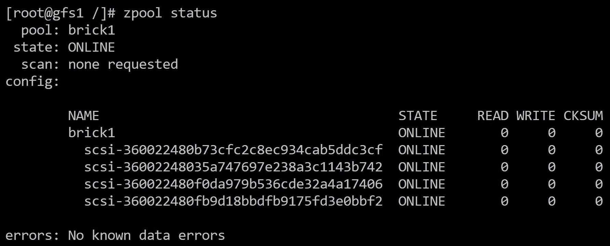
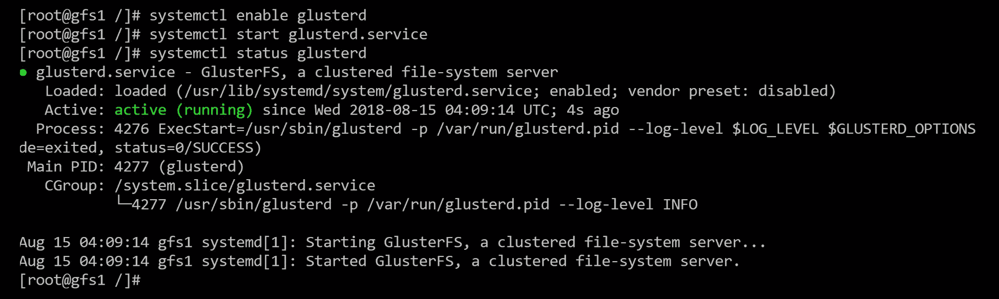
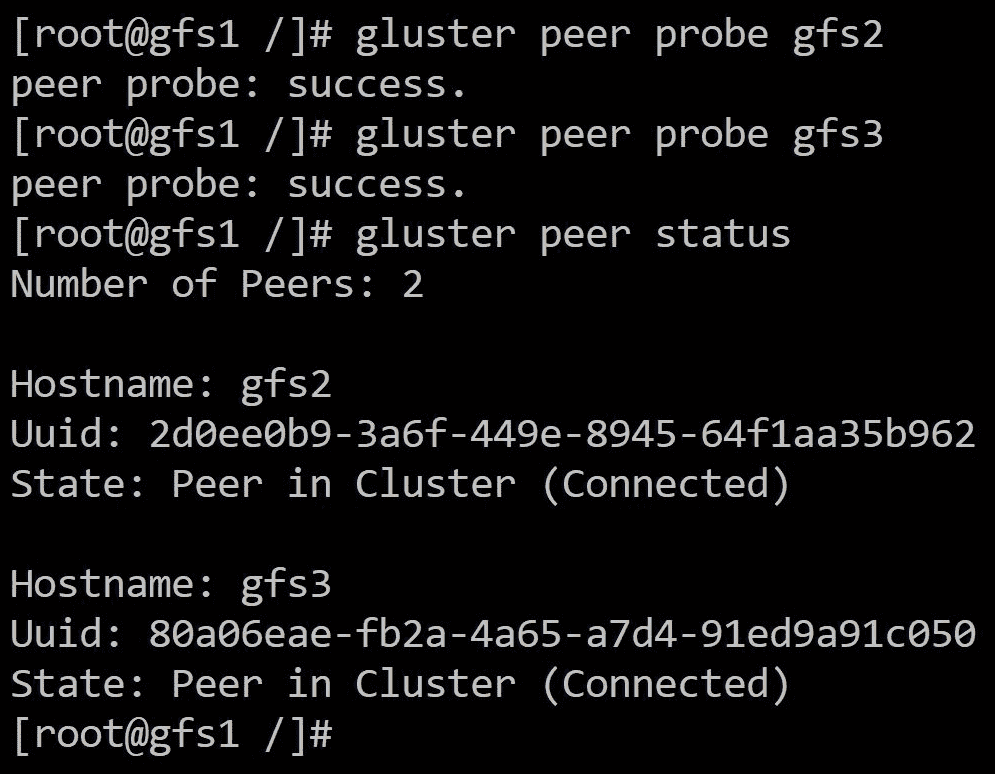
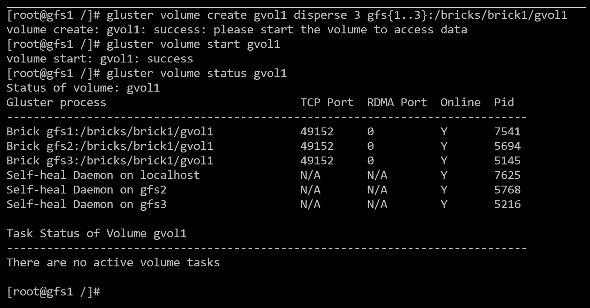

# 四、在云基础设施上使用 GlusterFS

在很好地理解了 GlusterFS 的核心概念后，我们现在可以深入了解存储集群的安装、配置和优化。

在这个例子中，我们将使用 Azure 作为云提供商，在三节点集群上安装 GlusterFS。然而，这些概念也可以应用于其他云提供商。

在本章中，我们将涵盖以下主题:

*   配置 GlusterFS 后端存储
*   安装和配置 GlusterFS
*   设置卷
*   优化性能

# 技术要求

这是本章的技术资源列表:

*   Azure **虚拟机** ( **VM** )详细视图大小:
    [https://docs . Microsoft . com/en-us/Azure/virtual-machines/Linux/size-storage](https://docs.microsoft.com/en-us/azure/virtual-machines/linux/sizes-storage)
*   Azure 磁盘大小和类型的详细视图:
    [https://Azure . Microsoft . com/en-us/pricing/details/managed-disks/](https://azure.microsoft.com/en-us/pricing/details/managed-disks/)
*   Linux 上的 ZFS 项目主页:
    [https://github.com/zfsonlinux/zfs/wiki/RHEL-and-CentOS](https://github.com/zfsonlinux/zfs/wiki/RHEL-and-CentOS)
*   glusterfs 安装指南 for centos:[https://wiki . centos . org/how tos/glutefsonces](https://wiki.centos.org/HowTos/GlusterFSonCentOS)
*   Gluster 网站上的 GlusterFS 快速入门指南:
    [https://docs . Gluster . org/en/latest/快速入门指南/Quickstart/](https://docs.gluster.org/en/latest/Quick-Start-Guide/Quickstart/)
*   GlusterFS 在管理员指南上设置卷:
    [https://docs . gluster . org/en/latest/Administrator % 20 guide/Setting % 20 up % 20 volumes/](https://docs.gluster.org/en/latest/Administrator%20Guide/Setting%20Up%20Volumes/)
*   GlusterFS 调整卷以获得更好的性能:
    [https://docs . gluster . org/en/latest/Administrator % 20 guide/management % 20 volumes/#调整选项](https://docs.gluster.org/en/latest/Administrator%20Guide/Managing%20Volumes/#tuning-options)

# 设置用于后端存储的砖块

以下是我们将使用的组件列表:

*   Azure L4s 虚拟机，具有 4vCPUs 和 32 GB 内存
*   每个虚拟机四个 S10 128 GB 磁盘
*   CentOS 7.5
*   Linux 上的 ZFS 作为砖块的文件系统
*   包含四个磁盘的单个 RAID 0 组
*   GlusterFS 4.1

# Azure 部署

在详细介绍如何配置砖块之前，我们首先需要在 Azure 中部署节点。在本例中，我们使用的是存储优化虚拟机系列或 L 系列。值得一提的是，Azure 有一个 30 天的免费试用，可以在提交任何部署之前用于测试。

在 Azure 中，性能是在几个级别上定义的。第一个级别是虚拟机限制，这是虚拟机允许的最大性能。L 系列提供了性价比的正确平衡，因为这些虚拟机经过优化，可提供更高的每秒输入/输出操作数和吞吐量，而不是提供高计算或内存资源。定义性能的第二个级别是通过连接到虚拟机的磁盘。对于本例，我们将使用标准的**硬盘驱动器** ( **硬盘驱动器**)来获得经济高效的解决方案。如果需要更高的性能，磁盘总是可以迁移到高级**固态硬盘** ( **固态硬盘**)存储。

本例中的确切虚拟机大小将是 L4s，它提供四个虚拟内存单元和 32 GB 的内存，对于一般用途的小型存储集群来说足够了。最高 125 兆字节/秒和 5k IOPS，正确配置后仍能保持可观的性能。

A new generation of storage optimized VMs has been recently released, offering a locally-accessible NVMe SSD of 2 TB. Additionally, it provides increased core count and memory, making these new VMs ideal for a GlusterFS setup with **Z file system** (**ZFS**). The new L8s_v2 VM can be used for this specific setup, and the sizes and specifications can be seen on the product page ([https://docs.microsoft.com/en-us/azure/virtual-machines/linux/sizes-storage#lsv2-series](https://docs.microsoft.com/en-us/azure/virtual-machines/linux/sizes-storage#lsv2-series)).

以下屏幕截图显示了可用性集、当前故障域和当前更新域设置:


When deploying a GlusterFS setup in Azure, make sure that each node lands on a different update and fault domain. This is done through the use of availability sets (refer to the preceding screenshot). Doing so ensures that if the platform restarts a node, the others remain up and serving data.

最后，对于 Azure 设置，我们每个节点需要 **512 GB** ，总共需要 1.5 TB 的原始空间，即 1 TB 的可用空间。实现这一目标的最具成本效益的方法是使用单个 **S20 512 GB** 磁盘，因为每个月每千兆字节的价格大约为 **$0.04** 。沿着单个磁盘的路线前进会影响性能，因为单个标准磁盘最多只能提供 500 IOPS 和 60 兆字节/秒。考虑到性能并接受我们将在成本部门损失一点效率的事实，我们将在单个 RAID0 组中使用四个 **S10 128** GB 磁盘。一张 **S10** 盘的每月每千兆字节价格为 **$0.05** ，而一张 **S20** 盘的每月价格为 **$0.04** 。您可以参考下表，其中计算是基于被管理磁盘的成本除以其各自的大小进行的:


Make sure that all three nodes are deployed on the same region and the same resource group for consistency.

# ZFS 是砖块的后台

我们在第 3 章“设计存储集群”中谈到了 ZFS。ZFS 是由太阳微系统公司开发的文件系统，后来被甲骨文公司收购。该项目后来成为开源项目，并被移植到 Linux。尽管该项目仍处于测试阶段，但大部分功能运行良好，大部分问题已被排除——该项目现在专注于添加新功能。

ZFS 是一个软件层，集磁盘管理、逻辑卷和文件系统于一体。压缩、**自适应替换缓存** ( **ARC** )、重复数据消除和快照等高级功能使其非常适合与作为砖块后端的 GlusterFS 一起工作。

# 安装 ZFS

让我们从安装 ZFS 开始；有一些依赖项，比如**动态内核模块** ( **DKMS** )，存在于 EPEL 存储库中。

Note that most of the commands that run here are assumed to be running as root; the commands can be run as the non-root account by prefacing `sudo` before each.

要安装所需的组件，我们可以使用以下命令:

```sh
yum install -y epel-release
yum install -y http://download.zfsonlinux.org/epel/zfs-release.el7_5.noarch.rpm
```

接下来，我们将使用以下命令:

```sh
yum install -y zfs
```

以下命令用于启用 ZFS 组件:

```sh
systemctl enable zfs.target
systemctl enable --now zfs-import-scan.service
```

# 配置 zpools

安装并启用 ZFS 后，我们现在可以创建 zpools 了。Zpool 是在 ZFS 创建的卷的名称。

由于我们将使用由四个磁盘组成的单个 RAID 0 组，因此我们可以创建一个名为`brick1`的 zpool 这需要在所有三个节点上完成。另外，让我们创建一个名为`bricks`的目录，它位于根目录(`/`)下；该目录将砖块存放在一个名为砖块的目录下。执行此操作所需的命令如下:

```sh
mkdir -p /bricks/brick1
```

这将创建目录树，如下所示:

```sh
zpool create brick1 /dev/disk/by-id/scsi-360022480f0da979b536cde32a4a17406 \
 /dev/disk/by-id/scsi-360022480fb9d18bbdfb9175fd3e0bbf2 \
/dev/disk/by-id/scsi-360022480fb9d18bbdfb9175fd3e0bae4 \
/dev/disk/by-id/scsi-360022480fb9d18bbdfb9175fd3e049f2
```

为了进一步解释该命令，`brick1`是 zpool 的名称。然后，我们指出磁盘的路径。在本例中，我们使用磁盘的标识，因为这样可以避免磁盘更改顺序时出现问题。虽然不同顺序的磁盘不会影响 ZFS，但最好使用永不更改的 id 来避免问题。

ZFS can use the entire disk because it creates the required partitions automatically.

创建`zpool`实例后，我们可以使用`zpool status`命令检查它是否正确完成:



让我们启用压缩并将池的装载点更改为以前创建的目录。为此，请运行以下命令:

```sh
zfs set compression=lz4 brick1
```

您还需要运行以下命令:

```sh
zfs set mountpoint=/bricks/brick1 brick1
```

第一个命令使用`lz4`算法启用压缩，该算法的 CPU 开销较低。第二个命令更改 zpool 的装载点。请确保在更改设置时使用正确的池名称。

这样做之后，我们应该将 ZFS 卷安装在`/bricks/brick1`下，如`df`命令所示:


我们需要在最近添加的挂载点上创建一个目录，用作砖块；共识是使用卷名。在这种情况下，我们将命名卷`gvol1`，并简单地创建目录:

```sh
mkdir -p /bricks/brick1/gvol1
```

这需要在所有节点上完成。

# 将 ZFS 缓存添加到池中(可选)

使用 Azure，每个虚拟机都有一个临时资源驱动器。这个临时资源驱动器的性能远远高于添加到其中的数据磁盘。该驱动器是短暂的，这意味着一旦虚拟机解除分配，数据就会被擦除；作为读缓存驱动器，这应该非常有效，因为不需要在重新启动时持续保存数据。

由于驱动器在每个`stop/deallocate/start`周期都会被擦除，我们需要对 ZFS 的单元文件进行一些调整，以便在每次重启时添加磁盘。驱动器将始终是`/dev/sdb`，由于不需要在其上创建分区，我们可以简单地告诉 ZFS 在每次系统启动时将其添加为新磁盘。

这可以通过编辑位于`/usr/lib/systemd/system/zfs-mount.service`下的`zfs-mount.service`的`systemd`单位来实现。这种方法的问题在于，ZFS 更新将覆盖对前面单元所做的更改。这个问题的一个解决方案是运行`sudo systemctl edit zfs-mount`并添加以下代码:

```sh
[Service]
ExecStart=/sbin/zpool remove brick1 /dev/sdb
ExecStart=/sbin/zpool add brick1 cache /dev/sdb
```

要应用更改，请运行以下命令:

```sh
systemctl daemon-reload
```

现在，我们已经确保了每次重新启动后都会添加缓存驱动器，我们需要使用运行在 Azure 虚拟机上的 Linux 代理来更改特定于 Azure 的配置。这个代理负责创建临时资源驱动器，由于我们将它用于其他目的，我们需要告诉代理不要创建临时磁盘。为了实现这一点，我们需要编辑位于`/etc/waagent.conf`的文件，并寻找以下行:

```sh
ResourceDisk.Format=y
```

然后，您需要将其更改为以下行:

```sh
ResourceDisk.Format=n
```

完成此操作后，我们可以通过运行以下命令将缓存驱动器添加到池中:

```sh
zpool add brick1 cache /dev/sdb -f 
```

`-f`选项只能在第一次使用，因为它会删除之前创建的文件系统。请注意，虚拟机的`stop/deallocate/start`周期需要停止代理格式化资源磁盘，因为默认情况下它会获得一个`ext4`文件系统。

The previous process can also be applied to the newer Ls_v2 VMs, which use the much faster NVMe drives, such as the L8s_v2; simply replace `/dev /sdb` with `/dev/nvme0n1`.

您可以验证缓存磁盘是否已按如下方式添加:


由于我们将使用单个 RAID 组，这将用作整个块的读缓存，从而在读取 GlusterFS 卷的文件时获得更好的性能。

# 在节点上安装 GlusterFS

每个节点都已经配置了砖块，我们终于可以安装 GlusterFS 了。安装相对简单，只需要几个命令。

# 安装软件包

我们将使用 CentOS 提供的软件包。要安装 GlusterFS，我们首先按如下方式安装存储库:

```sh
yum install -y centos-release-gluster41
```

然后，我们安装`glusterfs-server`包:

```sh
yum install -y glusterfs-server
```

然后，我们确保`glusterd`服务已启用并启动:



这些命令需要在将成为集群一部分的每个节点上运行；这是因为每个节点都需要启用包和服务。

# 创建受信任的池

最后，我们需要创建一个受信任的池。可信池是将成为集群一部分的节点列表，其中每个 Gluster 节点都信任另一个节点，从而允许创建卷。

要创建受信任的池，请从第一个节点运行以下代码:

```sh
gluster peer probe gfs2
gluster peer probe gfs3
```

您可以验证节点显示如下:



该命令可以从任何节点运行，并且需要修改主机名或 IP 地址以包括其他节点。在这种情况下，我已经将每个节点的 IP 地址添加到`/etc/hosts`文件中，以便于配置。理想情况下，主机名应该向 DNS 服务器注册，以便在网络中进行名称解析。

安装后，`gluster`节点应允许创建卷。

# 创建卷

我们现在已经到了可以创建卷的地步；这是因为我们已经为 GlusterFS 配置了砖块和必要的包。

# 创建分散的卷

我们将在三个节点上使用分散的卷类型，从而实现高可用性和性能的良好平衡。所有节点的原始空间总和将在 1.5 TB 左右；但是，分布式卷将有大约 1 TB 的可用空间。

要创建分散的卷，请使用以下代码:

```sh
gluster volume create gvol1 disperse 3 gfs{1..3}:/bricks/brick1/gvol1
```

然后，使用以下代码启动卷:

```sh
gluster volume start gvol1
```

使用以下代码确保它正确启动:

```sh
gluster volume status gvol1
```

现在音量应该显示如下:



# 安装卷

卷现在已创建，可以装载到客户端上；实现这一点的首选方法是使用本机`glusterfs-fuse`客户端，该客户端允许在其中一个节点出现故障时自动进行故障转移。

要安装`gluster-fuse`客户端，请使用以下代码:

```sh
yum install -y glusterfs-fuse
```

然后，让我们在根目录下创建一个名为`gvol1`的目录:

```sh
mkdir /gvol1
```

最后，我们可以在客户机上挂载 GlusterFS 卷，如下所示:

```sh
mount -t glusterfs gfs1:/gvol1 /gvol1
```

您指定哪个节点并不重要，因为可以从其中任何一个节点访问该卷。如果其中一个节点出现故障，客户端会自动将输入/输出请求重定向到其余节点。

# 优化性能

随着卷的创建和装载，我们可以调整一些参数来获得最佳性能。性能调优主要可以在文件系统级别(在本例中是 ZFS)和 GlusterFS 卷级别完成。

# GlusterFS 调优

这里主要变量是`performance.cache-size`。此设置指定要分配给 GlusterFS 卷作为读缓存的内存量。默认情况下，它被设置为 32 MB，这相当低。假设所选虚拟机有足够的内存，可以使用以下命令将其提升到 4 GB:

```sh
gluster volume set gvol1 performance.cache-size 4GB
```

一旦集群开始增长，另一个基本参数是`performance.io-thread-count`。这控制卷产生多少输入/输出线程。默认为`16`线程，对于中小型集群足够了。但是，一旦集群规模开始增长，这一数字可能会翻倍。要更改设置，请使用以下命令:

```sh
gluster volume set gvol1 performance.io-thread-count 16
```

应该测试此设置，以检查增加计数是否会提高性能。

# ZFS

我们将主要更改两个设置:ARC 和 L2ARC 馈送性能。

# 农业研究委员会

ZFS 的主要设置是其读缓存，称为 ARC。允许将更多内存分配给 ZFS 大大提高了读取性能。由于我们已经为 Gluster 卷读缓存分配了 4 GB，并且虚拟机有 32 GB 可用，因此我们可以为 ZFS 分配 26 GB 的内存，这将为操作系统留出大约 2 GB 的空间。

要更改 ARC 允许的最大大小，请使用以下代码:

```sh
echo 27917287424 > /sys/module/zfs/parameters/zfs_arc_max
```

这里，数字是以字节为单位的内存量，在本例中是 26 GB。这样做可以动态更改设置，但不会使其持久启动。要在启动时应用设置，请创建一个名为`/etc/modprobe.d/zfs.conf`的文件，并添加以下值:

```sh
options zfs zfs_arc_max=27917287424
```

通过这样做，您可以使更改在整个引导中持续存在。

# L2 弧

L2ARC 指的是二级读缓存；这是以前添加到 zpools 的缓存磁盘。更改数据馈送到缓存的速度有助于减少不断访问的文件预热或填满缓存所需的时间。该设置以每秒字节数指定。要更改它，您可以使用以下命令:

```sh
echo 2621440000 > /sys/module/zfs/parameters/l2arc_max_write
```

与前面的设置一样，这适用于正在运行的内核。要使其具有引导持久性，请在`/etc/modprobe.d/zfs.conf`文件中添加以下行:

```sh
options zfs l2arc_write_max=2621440000
```

该设置允许最大 256 兆字节/秒的 L2ARC 馈送；如果虚拟机大小更改为更高的层，则该设置应至少增加一倍。

最后，您应该在每个节点上都有一个文件，如下所示:


关于 ZFS，在其他类型的文件系统上，更改数据块大小有助于获得一些性能。ZFS 有一个可变的块大小，允许小文件和大文件达到类似的结果，所以没有必要改变这个设置。

# 摘要

在安装了 ZFS、创建了 zpools、安装了 GlusterFS 并创建了卷之后，我们最终得到了一个性能相当不错的解决方案，它可以承受节点故障，并且仍然可以向其客户端提供数据。

对于设置，我们使用 Azure 作为云提供商。虽然每个提供商都有自己的一套配置挑战，但核心概念也可以用于其他云提供商。

然而，这种设计有一个缺点。向 zpools 添加新磁盘时，条带不会对齐，从而导致新的读写产生较低的性能。这个问题可以通过一次添加一整套磁盘来避免；较低的读取性能主要由 RAM 上的读取缓存(ARC)和缓存磁盘(L2ARC)覆盖。

对于 GlusterFS，我们使用了分散的布局，平衡了性能和高可用性。在这种三节点集群设置中，我们可以在不阻止客户端输入/输出的情况下承受节点故障。

最重要的是在设计解决方案时要有批判性思维。在这个例子中，我们利用现有的资源来实现一个符合规范的配置，并利用我们提供的资源。确保你总是问自己这个设置将如何影响结果，以及如何改变它以提高效率。

在下一章中，我们将测试和验证设置的性能。

# 问题

*   什么是 GlusterFS 砖？
*   什么是 ZFS？
*   什么是 zpool？
*   什么是缓存磁盘？
*   GlusterFS 是如何安装的？
*   什么是可信池？
*   如何创建 GlusterFS 卷？
*   什么是性能缓存大小？
*   什么是艺术

# 进一步阅读

*   *学习微软 Azure* 作者:Geoff Webber-Cross:[https://www . packtpub . com/networking-and-server/Learning-Microsoft-Azure](https://www.packtpub.com/networking-and-servers/learning-microsoft-azure)
*   *实施 Azure 解决方案*由 Florian Klaffenbach、Jan-Henrik damashke 和 Oliver Michalski:[https://www . packtpub . com/虚拟化和云/实施-azure 解决方案](https://www.packtpub.com/virtualization-and-cloud/implementing-azure-solutions)
*   *建筑师的 Azure*作者:Ritesh Modi:[https://www . packtpub . com/虚拟化与云/azure-architects](https://www.packtpub.com/virtualization-and-cloud/azure-architects)