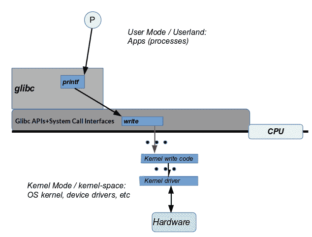

# Linux 系统架构

本章向读者介绍 Linux 生态系统的系统架构。 它首先介绍了优雅的 Unix 哲学和设计基础，然后深入研究了 Linux 系统架构的细节。 本课程将介绍 ABI、CPU 特权级别的重要性，以及现代**操作系统**(**OS**)如何利用它们，以及 Linux 系统架构的分层，以及 Linux 是如何成为一个整体架构的。 系统调用 API 的(简化)流以及内核代码执行上下文是关键点。

在本章中，读者将了解以下主题：

*   一言以蔽之的 Unix 哲学
*   建筑学预科
*   Linux 架构层
*   Linux--单片操作系统
*   内核执行上下文

在此过程中，我们将使用简单的示例来阐明关键的哲学和体系结构要点。

# 技术要求

需要一台现代台式 PC 或笔记本电脑；Ubuntu Desktop 指定以下内容作为安装和使用发行版的推荐系统要求：

*   2 GHz 双核或更高处理器
*   *   **在物理主机上运行**：2 GB 或更大系统内存
    *   **以来宾身份运行**：主机系统应至少有 4 GB RAM(越多，体验越好、越流畅)

*   25 GB 可用硬盘空间
*   用于安装程序介质的 DVD 驱动器或 USB 端口
*   上网肯定是有帮助的

我们建议读者使用以下 Linux 发行版之一(如上所述，可以作为 Windows 或 Linux 主机系统上的客户操作系统*和*安装)：

*   Ubuntu 18.04 LTS Desktop(Ubuntu 16.04 LTS Desktop 也是一个很好的选择，因为它也有长期的支持，几乎所有东西都应该可以工作)
    *   Ubuntu 桌面下载链接：[https://www.ubuntu.com/download/desktop](https://www.ubuntu.com/download/desktop)
*   Feddora 27(工作站)
    *   下载链接：11-13[HTTPS：//getfedora.org/en_gb/workstation/download/](https://getfedora.org/en_GB/workstation/download/)

请注意，这些发行版的默认形式是 OSS 和非专有的，并且可以作为最终用户免费使用。

There are instances where the entire code snippet isn't included in the book . Thus the GitHub URL to refer the codes: [https://github.com/PacktPublishing/Hands-on-System-Programming-with-Linux](https://github.com/PacktPublishing/Hands-on-System-Programming-with-Linux). 
Also, for the *Further reading* section, refer to the preceding GitHub link.

# Linux 和 Unix 操作系统

摩尔定律有一个著名的说法，即集成电路中的晶体管数量将每两年(大约)翻一番(并补充说，成本将以几乎相同的速度减半)。 这条多年来一直保持相当准确的定律，清楚地强调了人们对电子和**信息技术**(**IT**)行业的认识，甚至是庆祝；技术创新和范式转变在这里发生的速度之快是无与伦比的。 以至于当每年，甚至在某些情况下，每隔几个月就有新的创新和技术出现，挑战并最终几乎没有仪式地抛弃旧的时候，我们几乎不会感到惊讶。

在这种快速、全面变化的背景下，存在着一种引人入胜的反常现象：在近 50 年的时间里，操作系统的基本设计、理念和体系结构几乎没有任何变化。 是的，我们指的是历史悠久的 Unix 操作系统。

Unix 在 1969 年左右从 AT&T 的贝尔实验室(Multics)的一个注定失败的项目中有机地脱颖而出，席卷了世界。 嗯，至少有一段时间是这样。

但是，你会说，这是一本关于 Linux 的书；为什么会有这么多关于 Unix 的信息？ 很简单，从本质上讲，Linux 是受人尊敬的 Unix 操作系统的最新化身。 Linux 是一种类似 Unix 的操作系统(以及其他几种操作系统)。 根据法律需要，该代码是唯一的；然而，Linux 的设计、理念和体系结构与 Unix 的设计、理念和体系结构几乎相同。

# 一言以蔽之的 Unix 哲学

*要理解任何人(或任何事物)，必须首先努力理解他们(或其)的基本哲学；开始理解 Linux 就是开始理解 Unix 哲学。 在这里，我们不会试图钻研每一分钟的细节，而是全面理解 Unix 哲学的本质是我们的目标。此外，当我们使用 Unix 这个词时，我们很大程度上也是指 Linux！*

在 Unix 上设计、构建和维护软件(特别是工具)的方式慢慢演变成一种甚至可以称为固定模式的模式：Unix 设计哲学。 其核心是 Unix 哲学、设计和体系结构的支柱：

*   每件事都是一个过程，如果不是过程，那就是文件
*   一种工具完成一项任务
*   三个标准 I/O 通道
*   无缝组合工具
*   首选纯文本
*   CLI，而不是 GUI
*   模块化设计，可供其他人重新调整用途
*   提供机制，而不是政策

让我们更仔细地检查一下这些柱子，好吗？

# 每件事都是一个过程--如果它不是一个过程，它就是一个文件

进程是正在执行的程序的实例。 文件是文件系统上的对象；除了具有纯文本或二进制内容的常规文件外，它还可以是目录、符号链接、设备专用文件、命名管道或(Unix 域)套接字。

Unix 设计哲学将外围设备(如键盘、显示器、鼠标、传感器和触摸屏)抽象为文件，即所谓的设备文件。 通过这样做，Unix 允许应用程序程序员方便地忽略细节，只将(外围)设备当作普通磁盘文件对待。

内核提供了一个层来处理这个非常抽象的问题-它被称为**虚拟文件系统交换机**(**VFS**)。 这样，应用程序开发人员就可以打开设备文件并对其执行 I/O(读写)，所有这些都使用提供的常用 API 接口(放松，这些 API 将在下一章中介绍)。

事实上，每个进程在创建时都继承了三个文件：

*   **标准输入**(`stdin`**：FD****0**)：默认为键盘设备
*   **标准输出**(`stdout`**：FD 1***)*：默认为监视器(或终端)设备
*   **标准错误**(`stderr`**：****FD 2**)：默认为监视器(或终端)设备

**fd** is the common abbreviation, especially in code, for **file descriptor**; it's an integer value that refers to the open file in question.

Also, note that we mention it's a certain device by default – this implies the defaults can be changed. Indeed, this is a key part of the design: changing standard input, output, or error channels is called **redirection**, and by using the familiar <, > and 2> shell operators, these file channels are redirected to other files or devices.

在 Unix 上，存在一类称为筛选器的程序。

A filter is a program that reads from its standard input, possibly modifies the input, and writes the filtered result to its standard output.

Unix 上的筛选器是非常常见的实用程序，如`cat`、`wc`、`sort`、`grep`、`perl`、`head`和`tail`。

筛选器允许 Unix 轻松避开设计和代码复杂性。 多么?

让我们以`sort`过滤器为例。 好的，我们需要一些数据来分类。 假设我们运行以下命令：

```sh
$ cat fruit.txt
orange
banana
apple
pear
grape
pineapple
lemon
cherry
papaya
mango
$
```

现在我们考虑使用`sort`的四个场景；根据我们传递的参数，我们实际上正在执行显式或隐式的输入、输出和/或错误重定向！

**场景 1**：按字母顺序对文件进行排序(一个参数，输入隐式重定向到文件)：

```sh
$ sort fruit.txt
 apple
 banana
 cherry
 grape
 lemon
 mango
 orange
 papaya
 pear
 pineapple
$
```

好的!

不过，等一下。 如果`sort`是过滤器(确实是)，它应该从其`stdin`(键盘)读取并写入其`stdout`(终端)。 它确实是在向终端设备写入数据，但它是从文件中读取数据，如`fruit.txt`。

这是经过深思熟虑的；如果提供了参数，排序程序会将其视为标准输入，这一点显而易见。

另外，请注意，`sort fruit.txt `与`sort < fruit.txt`相同。

**场景 2**：对任何给定的输入按字母顺序排序(无参数，从 stdin/stdout 输入和输出到 stdin/stdout)：

```sh
$ sort 
mango 
apple
pear
^D 
apple
mango
pear
$
```

一旦您键入`sort`并按下*Enter*键，排序过程就会启动并等待。 为什么？ 它正在等待您(用户)键入某些内容。 为什么？ 回想一下，默认情况下，每个进程都会从标准输入或标准输入(键盘设备)中读取其输入！因此，我们输入了一些水果名称。 完成后，按*Ctrl*+*D*。 这是表示**文件结束**(**EOF**)的默认字符序列，或者在这种情况下表示输入结束。 瞧啊！ 对输入进行排序和写入。 去哪里？ 到`sort`进程的 stdout-终端设备，因此我们可以看到它。

**场景 3**：按字母顺序对任何给定输入进行排序，并将输出保存到文件(显式输出重定向)：

```sh
$ sort > sorted.fruit.txt
mango 
apple
pear
^D
$ 
```

与场景 2 类似，我们输入一些水果名称，然后*Ctrl*+*D*告诉 Sort 我们完成了。 不过，这一次请注意，输出被重定向(通过`>`元字符)到第一个`sorted.fruits.txt`文件！

因此，正如预期的那样，输出如下：

```sh
$ cat sorted.fruit.txt
apple
mango 
pear
$ 
```

**场景 4**：按字母顺序对文件进行排序，并将输出和错误保存到文件中(显式输入重定向、输出重定向和错误重定向)：

```sh
$ sort < fruit.txt > sorted.fruit.txt 2> /dev/null
$ 
```

有趣的是，最终结果与前面的场景相同，但增加了将任何错误输出重定向到错误通道的优点。 在这里，我们将错误输出(回想一下，文件描述符 2 总是引用`stderr`)重定向到前`/dev/null`个特殊设备文件；`/dev/null`是一个其任务是充当接收器(黑洞)的设备文件。 写入空设备的任何内容都将永远消失！ (谁说 Unix 上没有魔力？)还有，它的补码是`/dev/zero`*；*零设备是一个源--一个无限的零的源。 从它读取将返回零(第一个 ASCII 字符，而不是数字 0)；它没有文件结尾！

# 一种工具完成一项任务

在 Unix 的设计中，我们尽量避免创建瑞士军刀；相反，我们会为一个非常特定的指定目的创建一个工具，并且只为这个目的创建一个工具。 没有如果，没有但是；没有苦恼，没有杂乱。 这是最佳的设计简单性。

"Simplicity is the ultimate sophistication." - Leonardo da Vinci

举一个常见的例子：在 Linux**CLI**(**命令行界面**)上工作时，您想要找出本地安装的哪个文件系统具有最多的可用(磁盘)空间。

我们可以通过适当的开关获取本地挂载的文件系统列表(只需`df`也可以)：

```sh
$ df --local
Filesystem                1K-blocks    Used Available Use% Mounted on
rootfs                     20640636 1155492  18436728   6% /
udev                          10240       0     10240   0% /dev
tmpfs                         51444     160     51284   1% /run
tmpfs                          5120       0      5120   0% /run/lock
tmpfs                        102880       0    102880   0% /run/shm
$ 
```

要对输出进行排序，需要首先将其保存到一个文件中；为此，可以使用一个临时文件(Tmp)，然后使用`sort`实用程序对其进行排序。 最后，我们删除有问题的临时文件。 (是的，还有一种更好的方法，即管道；请参阅，*无缝组合工具*部分)

请注意，可用的存储空间是第四列，因此我们相应地进行排序：

```sh
$ df --local > tmp
$ sort -k4nr tmp
rootfs                     20640636 1155484  18436736   6% /
tmpfs                        102880       0    102880   0% /run/shm
tmpfs                         51444     160     51284   1% /run
udev                          10240       0     10240   0% /dev
tmpfs                          5120       0      5120   0% /run/lock
Filesystem                1K-blocks    Used Available Use% Mounted on
$ 
```

哎呀！ 输出包括标题行。 让我们首先使用通用的`sed`实用程序(一个功能强大的非交互式编辑器工具)从`df`的输出中删除第一行，即标题：

```sh
$ df --local > tmp
$ sed --in-place '1d' tmp
$ sort -k4nr tmp
rootfs                     20640636 1155484  18436736   6% /
tmpfs                        102880       0    102880   0% /run/shm
tmpfs                         51444     160     51284   1% /run
udev                          10240       0     10240   0% /dev
tmpfs                          5120       0      5120   0% /run/lock
$ rm -f tmp
```

那又怎么样？ 问题是，在 Unix 上，没有一个实用程序可以同时列出已安装的文件系统并按可用空间对它们进行排序。

相反，有一个实用程序可以列出已安装的文件系统：`df`。 它在这方面做得很好，有选项开关可供选择。 (如何知道哪些选项？ 学习使用手册页，它们非常有用。)

有一个实用程序可以对文本进行排序：`sort`。 同样，这是对文本进行排序的最后一招，对于几乎所有可能需要的排序，都有大量的选项开关可供选择。

The Linux man pages: **man** is short for **manual**; on a Terminal window, type `man man` to get help on using man. Notice the manual is divided into 9 sections. For example, to get the manual page on the stat system call, type `man 2 stat` as all system calls are in section 2 of the manual. The convention used is cmd or API; thus, we refer to it as `stat(2)`.

不出所料，我们得到了结果。 那么，这到底有什么意义呢？ 它是这样的：我们使用三个实用程序*、*而不是一个.`df `列出已挂载的文件系统(及其相关的元数据)，使用`sed`删除标题行，使用`sort`对给定的任何输入进行排序(以任何可以想象的方式)。

`df`可以查询和列出已安装的文件系统，但不能对它们进行排序。 `sort`可以对文本进行排序；它不能列出已安装的文件系统。

想一想这一点。

把它们结合起来，你就会得到比它们各部分之和更多的东西！ UNIX 工具通常只完成一项任务，并按照逻辑结论来完成；没有人能做得更好！

Having said this, I would like to point out – a tiny bit sheepishly – the highly renowned tool Busybox. Busybox (`http://busybox.net`) is billed as The Swiss Army Knife of Embedded Linux. It is indeed a very versatile tool; it has its place in the embedded Linux ecosystem – precisely because it would be too expensive on an embedded box to have separate binary executables for each and every utility (and it would consume more RAM). Busybox solves this problem by having a single binary executable (along with symbolic links to it from each of its applets, such as ls, ps, df, and sort).
So, nevertheless, besides the embedded scenario and all the resource limitations it implies, do follow the *One tool to do one task* rule!

# 三个标准 I/O 通道

几个流行的 Unix 工具(从技术上讲，筛选器)也被有意设计为从称为**标准输入**(**标准输入**)的标准文件描述符中读取它们的输入-可能对其进行修改，并将其结果输出写入标准文件描述符**标准输出**(**标准输出**)。任何错误输出都可以写入称为**标准错误**(**)的单独错误通道**

与 Shell 的重定向操作符(`>`表示输出重定向，`<`表示输入重定向，`2>`表示标准错误重定向)，以及更重要的是使用管道(参见第*节，*无缝组合工具*)相结合，这使程序设计人员能够高度简化。 不需要硬编码(甚至不需要软编码)输入和输出源或接收器。 不出所料，它很管用。*

让我们回顾几个快速的例子来说明这一重要的一点。

# 字数统计

我下载的 C++`netcat.c`源文件中有多少行源代码？ (在这里，我们使用流行的开源`netcat`实用程序代码库的一小部分。)我们使用`wc`实用程序。 在我们进一步讨论之前，什么是 wc？**word count**和(**wc**)是一个过滤器：它从 stdin 读取输入，计算输入流中的行数、单词数和字符数，并将结果写入其 stdout。 此外，为了方便起见，可以将文件名作为参数传递给它；传递`-l`选项开关使 wc 只打印行数：

```sh
$ wc -l src/netcat.c
618 src/netcat.c
$ 
```

这里，输入是作为参数传递给`wc`的文件名。

有趣的是，我们现在应该意识到，如果不向它传递任何参数，`wc`将从 stdin 读取它的输入，默认情况下 stdin 是键盘设备。 示例如下所示：

```sh
$ wc -l
hey, a small
quick test
 of reading from stdin
by wc!
^D
4
$ 
```

是的，我们在 stdin 中输入了`4`行；因此结果是 4，写入 stdout-默认情况下是终端设备。

以下是它的美妙之处：

```sh
$ wc -l < src/netcat.c > num
$ cat num
618
$ 
```

正如我们所看到的，WC 是 Unix 过滤器的一个很好的例子。

# 猫 / 猫科动物

Unix，当然还有 Linux，用户学习如何快速熟悉日常使用的`cat`实用程序。 乍一看，cat 所做的只是将文件内容输出到终端。

例如，假设我们有两个纯文本文件`myfile1.txt`和`myfile2.txt`：

```sh
$ cat myfile1.txt
Hello,
Linux System Programming,
World.
$ cat myfile2.txt
Okey dokey,
bye now.
$ 
```

好吧。 现在来看看这个：

```sh
$ cat myfile1.txt myfile2.txt
Hello,
Linux System Programming,
World.
Okey dokey,
bye now.
$
```

我们不需要运行`cat`两次，而是只运行一次，将两个文件名作为参数传递给它。

理论上，可以将任意数量的参数传递给 CAT：它将逐个使用所有参数！

不仅如此，还可以使用外壳通配符(`*`和`?`；实际上，外壳将首先展开通配符，并将结果路径名作为参数传递给被调用的程序)：

```sh
$ cat myfile?.txt
Hello,
Linux System Programming,
World.
Okey dokey,
bye now.
$
```

事实上，这说明了另一个关键点：任何数量的参数或没有任何数量的参数都被认为是设计程序的正确方式。 当然，每条规则都有例外：一些程序需要强制参数。

等等，还有更多。 `cat`也是 Unix 筛选器的一个很好的例子(回想一下：筛选器是一个从其标准输入读取、以某种方式修改其输入并将结果写入其标准输出的程序)。

那么，快速测试，如果我们只运行不带任何参数的`cat`，会发生什么情况？
好的，让我们试一试，看看：

```sh
$ cat
hello, 
hello, 
oh cool
oh cool
it reads from stdin,
it reads from stdin,
and echoes whatever it reads to stdout!
and echoes whatever it reads to stdout!
ok bye
ok bye
^D
$
```

哇，看看这个：`cat`在它的 stdin 阻塞(等待)，用户键入一个字符串，然后按 Enter 键，`cat`的响应是将它的 stdin 复制到它的 stdout 库中-这就不足为奇了，因为这就是猫的工作！

实现如下所示的命令：

*   `cat fname`与`cat < fname`相同
*   `cat > fname`创建或覆盖文件`fname`。

我们没有理由不能使用 CAT 将几个文件附加到一起：

```sh
$ cat fname1 fname2 fname3 > final_fname
$ 
```

没有理由必须只对纯文本文件执行此操作；您也可以将二进制文件连接在一起。

事实上，这就是该实用程序所做的-它连接文件。 因此，它的名字；正如 Unix 上的标准，是高度缩写的-从拼接到只是猫。 再一次，干净典雅-Unix 的方式。

cat shunts out file contents to stdout, in order. What if one wants to display a file's contents in reverse order (last line first)? Use the Unix `tac` utility – yes, that's cat spelled backward!

Also, FYI, we saw that cat can be used to efficiently join files. Guess what: the `split (1)` utility can be used to break a file up into pieces.

# 无缝组合工具

我们刚刚看到，常见的 Unix 实用程序通常被设计为过滤器，使它们能够从其标准输入读取并写入其标准输出。 这个概念得到了很好的扩展，可以使用称为**管道**的 IPC 机制将多个实用程序无缝地组合在一起。

此外，我们还记得 Unix 的理念包含了只做一项任务的设计。 如果我们有一个执行任务 A 的程序和另一个执行任务 B 的程序，我们想要将它们结合起来会怎么样？ 啊，这就是管子的作用！ 请参阅以下代码：

`prg_does_taskA | prg_does_taskB`

A pipe essentially is redirection performed twice: the output of the left-hand program becomes the input to the right-hand program. Of course, this implies that the program on the left must write to stdout, and the program on the read must read from stdin.

例如：按可用空间对已挂载的文件系统列表进行排序(按相反顺序)。

由于我们已经在使用*一种工具完成一项任务*一节中讨论了此示例，因此我们不会重复相同的信息。

**选项 1**：使用临时文件执行以下代码(参见第*节，*一个工具完成一项任务*)：*

```sh
$ df --local | sed '1d' > tmp
$ sed --in-place '1d' tmp
$ sort -k4nr tmp
rootfs 20640636 1155484 18436736 6% /
tmpfs 102880 0 102880 0% /run/shm
tmpfs 51444 160 51284 1% /run
udev 10240 0 10240 0% /dev
tmpfs 5120 0 5120 0% /run/lock
$ rm -f tmp
```

**选项 2**：使用管道-干净优雅：

```sh
$ df --local | sed '1d' | sort -k4nr
rootfs                     20640636 1155492  18436728   6% /
tmpfs                        102880       0    102880   0% /run/shm
tmpfs                         51444     160     51284   1% /run
udev                          10240       0     10240   0% /dev
tmpfs                          5120       0      5120   0% /run/lock
$ 
```

这不仅很优雅，而且在性能上也要优越得多，因为写入内存(管道是内存对象)比写入磁盘要快得多。

人们可以扩展这一概念，并在多个管道上组合多个工具；实际上，人们可以通过组合几个常规工具来构建一个超级工具。

例如：显示占用(物理)内存最多的三个进程；只显示它们的 PID、**虚拟大小**、(**VSZ**)、**常驻集大小**(**RSS**)(RSS 是相当准确的物理内存使用度量)，以及名称：

```sh
$ ps au | sed '1d' | awk '{printf("%6d %10d %10d %-32s\n", $2, $5, $6, $11)}' | sort -k3n | tail -n3
 10746    3219556     665252 /usr/lib64/firefox/firefox 
 10840    3444456    1105088 /usr/lib64/firefox/firefox 
 1465    5119800    1354280 /usr/bin/gnome-shell 
$ 
```

在这里，我们将五个实用程序组合在四个管道上：`ps`*、*、`sed`、`awk`*、*、`sort`和`tail`。 好的!

另一个示例：显示占用最多内存(RSS)的进程(不包括守护进程*)：

```sh
ps aux | awk '{if ($7 != "?") print $0}' | sort -k6n | tail -n1
```

A daemon is a system background process; we'll cover this concept in *Daemon Process* here: [https://www.packtpub.com/sites/default/files/downloads/Daemon_Processes.pdf](https://www.packtpub.com/sites/default/files/downloads/Daemon_Processes.pdf).

# 首选纯文本

UNIX 程序通常被设计成与文本一起工作，因为它是一个通用接口。 当然，确实有几个实用程序可以操作二进制对象(如对象和可执行文件)；我们在这里不是指它们。 重点是：Unix 程序设计用于处理文本，因为它简化了程序的设计和体系结构。

一个常见的例子是：应用程序在启动时解析配置文件。 配置文件可以格式化为二进制 BLOB。 另一方面，将其作为纯文本文件使其易于阅读(无价！)。 因此更容易理解和维护。 有人可能会争辩说，解析二进制文件会更快。 也许在某种程度上是这样的，但请考虑以下几点：

*   对于现代硬件，差别可能不大。
*   标准化的纯文本格式(如 XML)将优化代码来解析它，从而产生这两个好处

记住，简单是关键！

# CLI，而不是 GUI

Unix OS 及其所有应用程序、实用程序和工具始终构建为从**命令行界面**(**CLI**)(通常是 shell)使用。 从 20 世纪 80 年代开始，对**图形用户界面**(**GUI**)的需求变得显而易见。

麻省理工学院的罗伯特·谢弗勒(Robert Scheifler)被认为是 X Window System 背后的首席设计架构师，他构建了一个极其干净和优雅的体系结构，其中一个关键组件是：GUI 在操作系统之上形成一层(实际上是几层)，为 GUI 客户端(即应用程序)提供库。

The GUI was never designed to be intrinsic to applications or the OS—it's always optional.

这一架构至今仍屹立不倒。 话虽如此，尤其是在嵌入式 Linux 上，由于性能原因，出现了较新的体系结构，如帧缓冲器和 Wayland。 此外，尽管使用 Linux 内核的 Android 需要最终用户使用 GUI，但系统开发人员与 Android 的接口 ADB 是一个 CLI。

大量的产品嵌入式和服务器 Linux 系统完全在 CLI 界面上运行。 为了终端用户的操作方便，GUI 几乎就像是一个附加功能。

Wherever appropriate, design your tools to work in the CLI environment; adapting it into a GUI at a later point is then straightforward.
Cleanly and carefully separating the business logic of the project or product from its GUI is a key to good design.

# 模块化设计，可供其他人重新调整用途

从它的早期开始，Unix OS 就被刻意地设计和编码，默许多个程序员可以在系统上工作。 因此，编写干净、优雅和易于理解的代码的文化根深蒂固，可供其他有能力的程序员阅读和使用。

后来，随着 Unix 战争的到来，所有权和法律方面的担忧压倒了这种共享模式。 有趣的是，历史表明，Unix 的相关性和行业使用率一直在下降，直到 Linux OS(一个最好的开源生态系统)及时出现！ 今天，Linux 操作系统被广泛认为是最成功的 GNU 项目。 真的很讽刺！

# 提供机制，而不是政策

让我们用一个简单的例子来理解这个原理。

在设计应用程序时，您需要让用户输入登录名`name`和`password`。 执行获取和检查密码工作的函数称为`mygetpass()`。 它由函数`mylogin()`调用：`mylogin() → mygetpass()`。

现在，要遵循的协议是这样的：如果用户连续三次得到错误的密码，程序不应该允许访问(并且应该记录这种情况)。 好的，但是我们在哪里检查呢？

Unix 的理念是：不要实现逻辑，如果密码指定错误三次，则在`mygetpass()`函数中中止。 相反，只需让`mygetpass()`返回一个布尔值(当密码正确时为 true，当密码错误时为 false)，并让`mylogin()`函数实现所需的任何逻辑。

# 翻译码 / 伪代码 / 假码 / 虚拟程序代码

以下是错误的做法：

```sh
mygetpass()
{
    numtries=1

    <get the password>

    if (password-is-wrong) {
         numtries ++
         if (numtries >= 3) {
            <write and log failure message>
            <abort>
         }
 }
 <password correct, continue>
} 
mylogin()
{
    mygetpass()
}
```

现在让我们来看看正确的做法：走 Unix 的路！ 请参阅以下代码：

```sh
mygetpass()
{
   <get the password>

   if (password-is-wrong)
      return false;

   return true;
}
mylogin()
{
    maxtries = 3

    while (maxtries--) {
       if (mygetpass() == true)
           <move along, call other routines>
    }

    // If we're here, we've failed to provide the 
    // correct password
    <write and log failure message>
    <abort>
}
```

`mygetpass()`的任务是从用户那里获取密码并检查其是否正确；它将成功或失败返回给调用者-仅此而已。 这就是机制。 如果密码错误，它的工作不是决定该怎么做--这是政策，由调用者决定。

现在我们已经概括地介绍了 Unix 理念，对于 Linux 上的系统开发人员来说，有什么重要的收获呢？

在 Linux 操作系统上设计和实现应用程序时，学习并遵循 Unix 理念将带来巨大的回报。 您的应用程序将执行以下操作：

*   自然地适应这个系统；这是非常重要的
*   大大降低了复杂性
*   拥有整洁优雅的模块化设计
*   可维护性更强

# Linux 系统架构

为了清楚地理解 Linux 系统体系结构，人们需要首先理解几个重要的概念：处理器**应用程序二进制接口**(**ABI**)、CPU 特权级别，以及这些因素对我们编写的代码有何影响。 因此，在深入研究系统体系结构本身的细节之前，我们将通过几个代码示例在这里深入研究这些内容。

# 初步做法 / 起始行为 / 预备性事务 / 预赛

如果有人问：“CPU 是用来做什么的？”答案很明显：CPU 是机器的心脏--它读入、解码和执行机器指令，工作在内存和外围设备上。 它通过合并不同的阶段来做到这一点。

非常简单地说，在指令提取阶段，它从内存(RAM)或 CPU 高速缓存中读取机器指令(我们以各种人类可读的方式表示这些指令--十六进制、汇编语言和高级语言)，然后在指令解码阶段继续对指令进行解密。 在此过程中，它利用了控制单元、寄存器组、算术逻辑单元和存储器/外设接口。

# ABI

让我们设想一下，我们编写了一个 C 程序，并在机器上运行它。

嗯，等一下。 C 代码不可能被 CPU 直接破译，它必须转换成机器语言。 因此，我们知道，在现代系统上，我们将安装工具链-这包括编译器、链接器、库对象和各种其他工具。 我们编译并链接 C 源代码，将其转换为可在系统上运行的可执行格式。

处理器**指令集体系结构**(**ISA**)-记录机器的指令格式、支持的寻址方案及其寄存器模型。 事实上，CPU 和**原始设备制造商**(**OEM**)发布了一份描述机器如何工作的文档；该文档通常称为 ABI。ABI 不仅描述 ISA，还描述机器指令格式、寄存器集详细信息、调用约定、链接语义和可执行文件格式，如 ELF。 试试快速谷歌 x86ABI-它应该会显示有趣的结果。

The publisher makes the full source code for this book available on their website; we urge the reader to perform a quick Git clone on the following URL. Build and try it: [https://github.com/PacktPublishing/Hands-on-System-Programming-with-Linux](https://github.com/PacktPublishing/Hands-on-System-Programming-with-Linux).

我们来试试这个吧。 首先，我们编写一个简单的`Hello, World`类型的 C 程序：

```sh
 $ cat hello.c /*
 * hello.c
 *
 ****************************************************************
 * This program is part of the source code released for the book
 *  "Linux System Programming"
 *  (c) Kaiwan N Billimoria
 *  Packt Publishers
 *
 * From:
 *  Ch 1 : Linux System Architecture
 ****************************************************************
 * A quick 'Hello, World'-like program to demonstrate using 
 * objdump to show the corresponding assembly and machine 
 * language.
 */
#include <stdio.h>
#include <unistd.h>
#include <stdlib.h>

int main(void)
{
    int a;

    printf("Hello, Linux System Programming, World!\n");
    a = 5;
    exit(0);
} $ 
```

我们使用`make`通过`Makefile`构建应用程序。 理想情况下，代码必须在没有任何警告的情况下编译：

```sh
$ gcc -Wall -Wextra hello.c -o hello
hello.c: In function ‘main':
hello.c:23:6: warning: variable ‘a' set but not used [-Wunused-but-set-variable]
 int a;
 ^
$ 
```

Important! Do not ignore compiler warnings with production code. Strive to get rid of all warnings, even the seemingly trivial ones; this will help a great deal with correctness, stability, and security.

在这个简单的示例代码中，我们理解并预测了`gcc`发出的未使用的变量和警告，出于本演示的目的，我们将其忽略。

The exact warning and/or error messages you see on your system could differ from what you see here. This is because my Linux distribution (and version), compiler/linker, library versions, and perhaps even CPU, may differ from yours. I built this on a x86_64 box running the Fedora 27/28 Linux distribution.

类似地，我们构建`hello`程序的调试版本(同样，暂时忽略警告)，并运行它：

```sh
$ make hello_dbg
[...]
$ ./hello_dbg 
Hello, Linux System Programming, World!
$ 
```

我们使用功能强大的**`objdump`**实用程序查看程序的混合源代码-汇编机语言(`objdump's --source option switch`
` -S, --source Intermix source code with disassembly`)：

```sh
$ objdump --source ./hello_dbg ./hello_dbg:     file format elf64-x86-64

Disassembly of section .init:

0000000000400400 <_init>:
  400400:    48 83 ec 08              sub    $0x8,%rsp

[...]

int main(void)
{
  400527:    55                       push   %rbp
  400528:    48 89 e5                 mov    %rsp,%rbp
  40052b:    48 83 ec 10              sub    $0x10,%rsp
    int a;

    printf("Hello, Linux System Programming, World!\n");
  40052f:    bf e0 05 40 00           mov    $0x4005e0,%edi
  400534:    e8 f7 fe ff ff           callq  400430 <puts@plt>
    a = 5;
  400539:    c7 45 fc 05 00 00 00     movl   $0x5,-0x4(%rbp)
    exit(0);
  400540:    bf 00 00 00 00           mov    $0x0,%edi
  400545:    e8 f6 fe ff ff           callq  400440 <exit@plt>
  40054a:    66 0f 1f 44 00 00        nopw   0x0(%rax,%rax,1)

[...]

$ 
```

The exact assembly and machine code you see on your system will, in all likelihood, differ from what you see here; this is because my Linux distribution (and version), compiler/linker, library versions, and perhaps even CPU, may differ from yours. I built this on a x86_64 box running Fedora Core 27.

好的。 让我们来看源代码行：`a = 5;`，其中，`objdump`显示了相应的机器和汇编语言：

```sh
    a = 5;
  400539:    c7 45 fc 05 00 00 00     movl   $0x5,-0x4(%rbp)
```

我们现在可以清楚地看到以下几点：

| **C 源** | **汇编语言** | **机器说明** |
| **`a = 5;`** | **`movl $0x5,-0x4(%rbp)`** | `c7 45 fc 05 00 00 00` |

因此，当进程运行时，它会在某个时刻获取并执行机器指令，从而产生所需的结果。 事实上，这正是可编程计算机设计的目的！

Though we have shown examples of displaying (and even writing a bit of) assembly and machine code for the Intel CPU, the concepts and principles behind this discussion hold up for other CPU architectures, such as ARM, PPC, and MIPS. Covering similar examples for all these CPUs goes beyond the scope of this book; however, we urge the interested reader to study the processor datasheet and ABI, and try it out. 

# 通过内联汇编访问寄存器的内容

现在我们已经编写了一个简单的 C 程序，并看到了它的汇编和机器码，接下来让我们来看一些更具挑战性的东西：一个使用内联汇编访问 CPU 寄存器内容的 C 程序。

Details on assembly-language programming are outside the scope of this book; refer to the *Further reading* section on the GitHub repository.

X86_64 有几个寄存器；在本例中，我们只使用普通的 RCX 寄存器。 我们确实使用了一个有趣的技巧：x86ABI 调用约定规定函数的返回值将是放置在累加器中的值，即 x86_64 的 RAX。 利用这些知识，我们编写了一个函数，该函数使用内联汇编将所需寄存器的内容放入 RAX。 这确保了它将返回给调用者！

Assembly micro-basics includes the following:

`at&t syntax:`
`       movq <src_reg>, <dest_reg>`
`Register        : prefix name with %`
`Immediate value : prefix with $`

For more, see the *Further reading* section on the GitHub repository.

让我们来看一下以下代码：

```sh
$ cat getreg_rcx.c
/*
 * getreg_rcx.c
 *
 ****************************************************************
 * This program is part of the source code released for the book
 *  "Linux System Programming"
 *  (c) Kaiwan N Billimoria
 *  Packt Publishers
 *
 * From:
 *  Ch 1 : Linux System Architecture
 ****************************************************************
 * Inline assembly to access the contents of a CPU register.
 * NOTE: this program is written to work on x86_64 only.
 */
#include <stdio.h>#include <unistd.h>
#include <stdlib.h>

typedef unsigned long u64;

static u64 get_rcx(void)
{
    /* Pro Tip: x86 ABI: query a register's value by moving its value into RAX.
     * [RAX] is returned by the function! */
    __asm__ __volatile__(
            "push %rcx\n\t" 
            "movq $5, %rcx\n\t" 
            "movq %rcx, %rax"); 
                   /* at&t syntax: movq <src_reg>, <dest_reg> */
    __asm__ __volatile__("pop %rcx");
}

int main(void)
{
    printf("Hello, inline assembly:\n [RCX] = 0x%lx\n",  
                get_rcx());
    exit(0);}
$ gcc -Wall -Wextra getreg_rcx.c -o getreg_rcx
getreg_rcx.c: In function ‘get_rcx':
getreg_rcx.c:32:1: warning: no return statement in function returning non-void [-Wreturn-type]
 }
 ^
$ ./getreg_rcx Hello, inline assembly:
 [RCX] = 0x5
$ 
```

好了，它的工作情况与预期不谋而合。

# 通过内联汇编访问控制寄存器的内容

在 x86_64 处理器上众多迷人的寄存器中，恰好有六个控制寄存器，分别命名为 CR0 到 CR4 和 CR8。 真的没有必要深入研究它们的细节；只要说它们对系统控制至关重要就足够了。

出于说明性示例的目的，让我们暂时考虑一下 CR0 寄存器。 英特尔的手动状态：CR0-包含控制处理器操作模式和状态的系统控制标志。

Intel's manuals can be downloaded conveniently as PDF documents from here (includes the Intel® 64 and IA-32 Architectures Software Developer's Manual, Volume 3 (3A, 3B and 3C): System Programming Guide):
[https://software.intel.com/en-us/articles/intel-sdm](https://software.intel.com/en-us/articles/intel-sdm)

显然，CR0 是一个重要的寄存器！
我们修改了之前的程序以访问和显示其内容(而不是普通的`RCX`寄存器)。 唯一相关的代码(与前一个程序不同)是查询`CR0`寄存器值的函数：

```sh
static u64 get_cr0(void)
{
    /* Pro Tip: x86 ABI: query a register's value by moving it's value into RAX.
     * [RAX] is returned by the function! */
    __asm__ __volatile__("movq %cr0, %rax"); 
        /* at&t syntax: movq <src_reg>, <dest_reg> */
}
```

构建并运行它：

```sh
$ make getreg_cr0
[...]
$ ./getreg_cr0 
Segmentation fault (core dumped)
$ 
```

它坠毁了！

好吧，这里发生了什么事？ 继续读下去。

# CPU 权限级别

正如本章前面提到的，CPU 的基本工作是从内存中读取机器指令，解密并执行它们。 在计算的早期，这几乎是处理器所做的全部工作。 但后来，工程师们更深入地思考，意识到这有一个关键的问题：如果程序员可以向处理器提供任意的机器指令流，而处理器反过来盲目而顺从地执行，这就存在造成破坏的余地，如何入侵机器！

如何攻击机器？

如何破解机器？

。 回想上一节英特尔处理器的 CR0 控制寄存器：包含控制处理器操作模式和状态的系统控制标志。*如果用户对 CR0 寄存器具有无限制(读/写)访问权限，则可以切换可执行以下操作的位：

*   打开或关闭硬件分页
*   禁用 CPU 缓存
*   更改缓存和对齐属性
*   在操作系统标记为只读的内存(从技术上讲，页面)上禁用 WP(写保护

哇，黑客真的可以造成很大的破坏。 至少，应该只允许操作系统进行这种访问。

正是由于操作系统及其控制的硬件资源的安全性、健壮性和正确性等原因，所有现代 CPU 都包含特权级别的概念。

现代 CPU 至少支持两个特权级别或模式，通常称为以下级别：

*   监督者，监管人
*   使用者 / 权利继续享有 / 吸毒者 / 用户

您需要了解代码(即机器指令)在 CPU 上以给定的特权级别或模式运行。 设计和实现操作系统的人员可以自由利用处理器特权级别。 这正是现代操作系统的设计方式。 请看下表中的通用 CPU 权限级别：

| **权限级别或模式名称** | **权限级别** | **目的** | **术语** |
| 监督者，监管人 | 高的 / 大的 / 高级的 / 高音调的 | 操作系统代码在此处运行 | 内核空间 |
| 使用者 / 权利继续享有 / 吸毒者 / 用户 | 洛 （人名） | 应用程序代码在此处运行 | 用户空间(或用户空间) |

Table 1: Generic CPU Privilege Levels

# X86 上的特权级别或环

为了更好地理解这一重要概念，让我们以流行的 x86 体系结构为例。 从 i386 开始，英特尔处理器支持四个特权级别或环：环 0、环 1、环 2 和环 3。在英特尔 CPU 上，这些级别的工作方式如下：


Figure 1: CPU ring levels and privilege

让我们以*表 2 的形式来可视化这个*图 1*：所有 x86 特权或环级别*：

| **权限或环级别** | Колибрипрограммапрограммирования | **目的** |
| 振铃 0 | 高的 / 大的 / 高级的 / 高音调的 | 操作系统代码在此处运行 |
| 振铃 1 |  |  |
| 振铃 2 |  |  |
| 环 3 | 低的 / 矮的 / 卑贱的 / 粗俗的 | 应用程序代码在此运行(用户区域) |

Table 2: x86 privilege or ring levels Originally, ring levels 1 and 2 were intended for device drivers, but modern OSes typically run driver code at ring 0 itself. Some hypervisors (VirtualBox being one) used to use Ring 1 to run the guest kernel code; this was the case earlier when no hardware virtualization support was available (Intel VT-x, AMD SV).

The ARM (32-bit) processor has seven modes of execution; of these, six are privileged, and only one is the non-privileged mode. On ARM, generically, the equivalent to Intel's Ring 0 is Supervisor (SVC) mode, and the equivalent to Intel's Ring 3 is User mode. 

For interested readers, there are more links in the *Further reading *section on the GitHub repository.

下图清楚地显示了在 x86 处理器上运行的所有现代操作系统(Linux、Unix、Windows 和 MacOS)利用处理器特权级别：


Figure 2: User-Kernel separation

重要的是，处理器 ISA 为每条机器指令分配一个或多个允许它们执行的特权级别。 允许在用户权限级别执行的机器指令自动意味着它也可以在 Supervisor 权限级别执行。 在什么模式下可以和不可以做什么的区分也适用于寄存器访问。

使用英特尔术语，**当前特权级别**(**CPL**)是处理器当前执行代码的特权级别。

例如，在给定处理器上的配置如下所示：

*   Foo1 机器指令具有允许的 Supervisor 特权级别(或 x86 的 Ring 0)
*   Foo2 机器指令具有允许的用户特权级别(或 x86 的 Ring 3)

因此，对于执行这些机器指令的正在运行的应用程序，会出现下表：

| **机器指令** | **允许-在模式** | **CPL(当前权限级别)** | **有效吗？** |
| FOO1 | 主管(0) | 0 | 肯定的回答 / 赞成 / 是 |
| 3. | 不 / 否决票 / 同 Noh |
| 页脚 2 | 用户(3) | 0 | 肯定的回答 / 赞成 / 是 |
| 3. | 肯定的回答 / 赞成 / 是 |

Table 3: Privilege levels – an example So, thinking about it, foo2 being allowed at User mode would also be allowed to execute with any CPL. In other words, if the CPL <= allowed privilege level, it works, otherwise it does not.

例如，当用户在 Linux 上运行应用程序时，该应用程序作为一个进程运行(稍后将对此进行更多介绍)。 但是，应用程序代码在什么权限(或模式或环)下运行呢？ 请参阅上表：用户模式(x86 上的环 3)。

啊哈！ 所以现在我们明白了。 前面的代码示例`getreg_rcx.c`之所以有效，是因为它试图访问通用`RCX`寄存器的内容，这在用户模式下是允许的(当然，环 3 和其他级别也是允许的)！

但`getreg_cr0.c`的代码失败；因为它试图访问`CR0`控制寄存器的内容而崩溃，这在用户模式(Ring 3)下是不允许的，并且仅允许在 Ring 0 特权下！ 只有操作系统或内核代码才能访问控制寄存器。 这也适用于其他几条敏感的汇编语言指令。 这种方法很有意义。

从技术上讲，它崩溃是因为处理器引发了**通用保护故障**(**GPF**)。

# Linux 体系结构

Linux 系统架构是分层的。 下面的图表以一种非常简单的方式说明了 Linux 系统架构，但也是我们了解这些细节的理想起点：


Figure 3: Linux – Simplified layered architecture

层很有用，因为每一层只需要关注其正上方和下方的层。 这将带来许多优势：

*   设计整洁，降低复杂性
*   标准化、互操作性
*   能够在堆栈内外交换图层
*   能够根据需要轻松引入新层

On the last point, there exists the FTSE. To quote directly from Wikipedia:

The "**fundamental theorem of software engineering** (**FTSE**)" is a term originated by Andrew Koenig to describe a remark by Butler Lampson attributed to the late David J. Wheeler 

We can solve any problem by introducing an extra level of indirection.

既然我们了解了 CPU 模式或特权级别的概念，以及现代操作系统是如何利用它们的，那么 Linux 系统体系结构的一个更好的图(在前一个图的基础上扩展)将如下所示：


Figure 4: Linux system architecture

在上图中，P1、P2、…。 PN 只不过是用户地进程(进程 1、进程 2)，或者换句话说，是运行应用程序。 例如，在 Linux 笔记本电脑上，我们可能运行 VIM 编辑器、Web 浏览器和终端窗口(GNOME-TERMINAL)。

# 图书馆 / 图书馆的藏书 / 资料室 / 文库

当然，库是代码的档案(集合)；众所周知，使用库在代码模块化、标准化、防止重新发明轮子综合症等方面有很大帮助。 Linux 桌面系统可能有数百个库，甚至可能有几千个库！

经典 K&R`hello, world`C 程序使用`printf`API 将字符串写入显示器：

```sh
printf(“hello, world\n”);
```

显然，`printf`代码不是`hello, world`源代码的一部分。 那么它是从哪里来的呢？ 它是标准 C 库的一部分；在 Linux 上，由于它的 GNU 起源，这个库通常被称为**GNU libc**(**glibc**)。

Glibc 是 Linux 机器上的一个关键且必需的组件。 它不仅包含通常的标准 C 库例程(API)，而且实际上是操作系统的编程接口！ 多么?。 通过其较低层，系统调用。

# 系统调用

系统调用实际上是内核功能，可以通过 glibc 存根例程从用户空间调用。 它们提供一个关键功能；它们将用户空间连接到内核空间。 如果用户程序想要请求内核的某些东西(从文件读取、写入网络、更改文件权限)，它可以通过发出系统调用来实现。 因此，系统调用是内核的唯一合法入口点。 用户空间进程没有其他方法来调用内核。

For a list of all the available Linux system calls, see section 2 of the man pages ([https://linux.die.net/man/2/](https://linux.die.net/man/2/)). One can also do: man 2 syscalls to see the man page on all supported system calls

换一种方式来考虑这一点：Linux 内核内部实际上有数千个 API(或函数)。 在这些 API 中，只有一小部分对用户空间可见或可用，即公开；这些公开的内核 API 是系统调用！ 同样，作为近似值，现代 Linux glibc 大约有 300 个系统调用。

On an x86_64 Fedora 27 box running the 4.13.16-302.fc27.x86_64 kernel, there are close to 53,000 kernel APIs!

需要理解的关键是：系统调用与所有其他(通常是库)API 非常不同。 当它们最终调用内核(OS)代码时，它们能够跨越用户-内核边界；实际上，它们能够从正常的非特权用户模式切换到完全特权的 Supervisor 或内核模式！

多么?。 无需深入研究这些令人毛骨悚然的细节，系统调用本质上是通过调用特殊的机器指令来工作的，这些指令具有将处理器模式从用户切换到 Supervisor 的内置能力。 所有现代的 CPUABI 都将提供至少一条这样的机器指令；在 x86 处理器上，实现系统调用的传统方法是使用特殊的 INT0x80 机器指令。 是的，它确实是一个软件中断(或陷阱)。 从 Pentium Pro 和 Linux 2.6 开始，使用 sysenter/syscall 的机器指令。 请参阅关于 GitHub 存储库的*进一步阅读*部分。

从应用程序开发人员的角度来看，关于系统调用的一个关键点是，系统调用看起来像是可以由开发人员调用的常规函数(API)；这种设计是经过深思熟虑的。 实际情况：用户调用的系统调用 API-例如`open()`、`read()`、`chmod()`、`dup()`和`write()`-只是存根。 它们是一种巧妙的机制，可以获取内核中的实际代码(实现这一点需要用系统调用号填充 x86 上的累加器寄存器，并通过其他通用寄存器传递参数)，以执行内核代码路径，并在完成后返回到用户模式。 请参阅下表：

| 中央处理机 | 用于从用户模式捕获到 Supervisor(内核)模式的机器指令 | 系统调用号的已分配寄存器 |
| `x86[_64]` | `int 0x80 or syscall` | `EAX / RAX` |
| `ARM` | `swi / svc` | R0 到 R7 |
| `Aarch64` | `svc` | `X8` |
| `MIPS` | `syscall` | `$v0` |

Table 4:  System calls on various CPU Architectures for better understanding

# Linux--单片操作系统

操作系统通常被认为遵循两种主要架构风格中的一种：单核或微内核。

Linux 无疑是一个单一的操作系统。

# 那是什么意思？

英文单词 monolstone 的字面意思是一大块直立的大石块：


Figure 5: Corinthian columns – they're monolithic! 

在 Linux 操作系统上，应用程序作为称为**进程**的独立实体运行。 进程可以是单线程(原始 Unix)或多线程。 无论如何，目前，我们将进程视为 Linux 上的执行单元；进程被定义为正在执行的程序的实例。

当用户空间进程发出库调用时，库 API 可能会发出系统调用，也可能不会发出系统调用。 例如，发出`atoi(3)`命令 API 不会导致 glibc 发出系统调用，因为它不需要内核支持来实现字符串到整数的转换。 `<api-name>(n)`*；*n 是手册页部分。

为了帮助澄清这些重要概念，让我们再来看看著名而经典的 K&R`Hello, World`C 程序：

```sh
#include <stdio.h>
main()
{
    printf(“hello, world\n”);
}
```

好的，这应该行得通。 确实如此。
但是，问题是，`printf(3)`API 到底是如何写入监控设备的？

简短的答案是：它不会。
实际情况是，`printf(3)`只有按照指定的格式设置字符串的智能；仅此而已。 一旦完成，`printf`实际上会调用`write(2)`API-a 系统调用。 WRITE 系统调用确实能够将缓冲区内容写入特殊的设备文件-监控设备，WRITE 将其视为标准输出。 回到我们关于*Unix 哲学的讨论，简而言之*：如果它不是一个进程，它就是一个文件！ 当然，它在内核的幕后变得非常复杂；简而言之，Write 的内核代码最终会切换到正确的驱动程序代码；设备驱动程序是唯一可以直接与外围硬件一起工作的组件。 它执行对监视器的实际写入，返回值一直传播回应用程序。

在下图中，**P**是运行时的`hello, world`进程：



Fig 6: Code flow: printf-to-kernel

另外，从图中我们可以看到，glibc 被认为由两个部分组成：

*   **Arch-Independent glibc**：常规 libc 接口(如：[s|sn|v]printf，memcpy，memcmp，atoi)
*   **依赖于 Arch 的 glibc**：系统调用存根

Here, by arch, we mean CPU.
Also the ellipses (...) represent additional logic and processing within kernel-space that we do not show or delve into here.

现在`hello, world`的代码流路径更清晰了，让我们回到单块的内容！

很容易假设它是这样工作的：

1.  `hello, world`应用程序(进程)发出`printf(3)`库调用。
2.  `printf`发出`write(2)`系统调用。
3.  我们从用户模式切换到 Supervisor(内核)模式。
4.  内核接管-它将`hello, world`写入监视器。
5.  切换回非特权用户模式。

事实上，事实并非如此。

事实是，在整体设计中，没有内核；换句话说，内核实际上是进程本身的一部分。 它的工作方式如下：

1.  `hello, world`应用程序(进程)发出`printf(3)`库调用。
2.  Printf 发出`write(2)`系统调用。
3.  调用系统调用的进程现在从用户模式切换到管理程序(内核)模式。
4.  该进程运行底层内核代码、底层设备驱动程序代码，因此将`hello, world`写入监视器！
5.  然后，该进程切换回非特权用户模式。

总而言之，在单片内核中，当进程(或线程)发出系统调用时，它会切换到特权管理程序或内核模式，并运行系统调用的内核代码(处理内核数据)。 完成后，它将切换回非特权用户模式，并继续执行用户空间代码(处理用户数据)。

了解这一点非常重要：


Fig 7: Life of a process in terms of privilege modes

上图试图说明 X 轴是时间轴，Y 轴表示用户模式(在顶部)和管理程序(内核)模式(在底部)：

*   **时间 t<sub>0</sub>**：一个进程在内核模式下诞生(创建进程的代码当然在内核中)。 一旦完全生成，它就切换到用户(非特权)模式，并运行它的用户空间代码(也在处理它的用户空间数据项)。
*   **时间 t<sub>1</sub>**：该进程直接或间接(可能通过库 API)调用系统调用。 它现在陷入内核模式(参见表*CPU 架构上的系统调用*，显示了根据 CPU 执行此操作的机器指令)，并在特权管理程序模式下执行内核代码(也处理内核数据项)。
*   **时间 t<sub>2</sub>**：系统调用完成；进程切换回非特权用户模式并继续执行其用户空间代码。
*   **时间 t<sub>n</sub>**：进程要么故意通过调用 exit API 终止，要么被信号终止。 它现在切换回 Supervisor 模式(因为 exit(3)库 API 调用 _exit(2)系统调用)，执行 _exit()的内核代码，然后结束。

事实上，大多数现代操作系统都是单片的(尤其是类 Unix 的)。

Technically, Linux is not considered 100 percent monolithic. It's considered to be mostly monolithic, but also modular, due to the fact that the Linux kernel supports modularization (the plugging in and out of kernel code and data, via a technology called **Loadable Kernel Modules** (**LKMs**)).
Interestingly, MS Windows (specifically, from the NT kernel onward) follows a hybrid architecture that is both monolithic and microkernel.

# 内核内的执行上下文

内核代码始终在以下两种上下文之一中执行：

*   对…进行加工 / 审核 / 检查
*   中止 / 打断 / 打破连续性 / 阻碍

It's easy to get confused here. Remember, this discussion applies to the context in which kernel code executes, not userspace code.

# 流程上下文

现在我们了解了可以通过发出系统调用来调用内核服务。 发生这种情况时，调用进程将在内核模式下运行系统调用的内核代码。 这称为**进程上下文**-内核代码现在正在调用系统调用的进程上下文中运行。

流程上下文代码具有以下属性：

*   总是由发出系统调用的进程(或线程)触发
*   自上而下方法
*   由进程同步执行内核代码

# 中断上下文

乍一看，内核代码似乎没有其他执行方式。 那么，考虑一下这个场景：网络接收路径。 发往您的以太网 MAC 地址的网络数据包到达硬件适配器后，硬件会检测到该数据包是发往该地址的，然后将其收集并进行缓冲。 它现在必须让操作系统知道；更严格地说，它必须让**网络接口卡**(**NIC**)设备驱动程序知道，这样它就可以在数据包到达时获取和处理它们。 它通过断言硬件中断来启动 NIC 驱动程序。

回想一下，设备驱动程序驻留在内核空间，因此它们的代码在 Supervisor 或内核模式下运行。 (内核特权)驱动程序代码**中断服务例程**(**ISR**)现在执行，获取数据包，并将其发送到操作系统网络协议栈进行处理。

网卡驱动程序的 ISR 代码是内核代码，它已经运行，但是在什么环境下运行？ 这显然不是在任何特定过程的背景下进行的。 事实上，硬件中断可能中断了一些进程。 因此，我们将其称为*中断上下文*。

中断上下文代码具有以下属性：

*   总是由硬件中断(不是软件中断、故障或异常；仍是进程上下文)触发
*   自下而上的方法
*   通过中断异步执行内核代码

If, at some point, you do report a kernel bug, it helps if you point out the execution context.

从技术上讲，在中断上下文中，我们有进一步的区别，比如硬 IRQ 和软 IRQ、下半部分和微线程。 然而，这个讨论超出了本书的范围。

# 简略的 / 概括的 / 简易判罪的 / 简易的

本章首先解释 Unix 设计哲学，包括 Unix 哲学、设计和体系结构的核心原则或支柱。 然后我们描述了 Linux 系统架构，其中我们介绍了 CPU-ABI(应用程序二进制接口)、ISA 和工具链的含义(使用`objdump`反汇编一个简单的程序，并通过内联汇编访问 CPU 寄存器)。 讨论了 CPU 特权级别及其在现代操作系统中的重要性，介绍了 Linux 系统架构层-应用程序层、库层、系统调用层和内核层。 本章最后讨论了 Linux 是如何成为一个单片操作系统的，然后探索了内核执行环境。

在下一章中，读者将深入了解并牢牢掌握虚拟内存的奥秘-它到底是什么意思，为什么会出现在所有现代操作系统中，以及它提供的关键好处。 我们将讨论进程虚拟地址空间构建的相关细节。