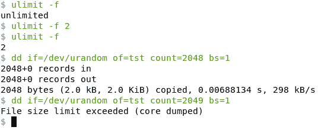
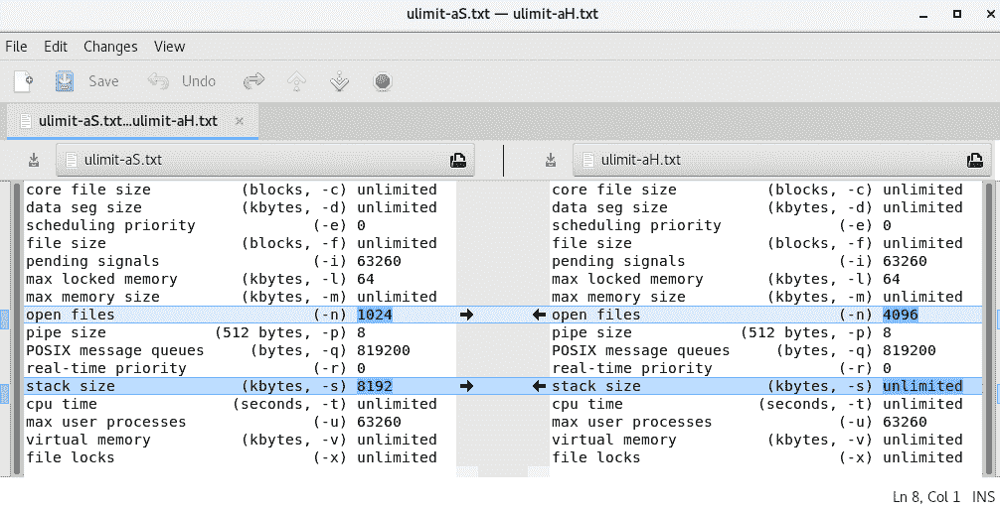

# 资源限制

在本章中，我们将查看每个进程的资源限制-它们是什么，以及我们为什么需要它们。 我们将继续描述资源限制的粒度和类型，区分软限制和硬限制。 详细介绍用户(或系统管理员)如何使用适当的 CLI 前端(`ulimit`、`prlimit`)查询和设置每个进程的资源限制。

编程接口(API)--实际上就是关键的`prlimit(2)`系统调用 API--将详细介绍。 两个详细的代码示例(查询限制和设置 CPU 使用限制)将为读者提供使用资源限制的实际体验。

在本章中，关于资源限制，我们将介绍以下主题：

*   必要 / 必需品 / 必然性 / 需要
*   粒度
*   类型-软型和硬型
*   资源限制 API，带有示例代码

# 资源限制

常见的黑客攻击是**(分布式)拒绝服务**(**(D)DoS**)攻击。 在这里，恶意攻击者试图消耗目标系统上的资源，甚至使其过载，以至于系统崩溃，或者至少完全没有响应(挂起)。

有趣的是，在未调优的系统上，执行这种类型的攻击非常容易；例如，假设我们在服务器上拥有 shell 访问权限(当然不是 root 用户，而是普通用户)。 通过操作无处不在的`dd(1)`(磁盘转储)命令，我们可以非常容易地尝试让它用完(或至少用完)磁盘空间。 `dd`的一个用途是创建任意长度的文件。

例如，要创建一个充满随机内容的 1 GB 文件，我们可以执行以下操作：

```sh
$ dd if=/dev/urandom of=tst count=1024 bs=1M
1024+0 records in
1024+0 records out
1073741824 bytes (1.1 GB, 1.0 GiB) copied, 15.2602 s, 70.4 MB/s
$ ls -lh tst 
-rw-rw-r-- 1 kai kai 1.0G Jan  4 12:19 tst
$ 
```

如果我们将块大小(`bs`)值增加到`1G`，会怎么样，如下所示：

```sh
dd if=/dev/urandom of=tst count=1024 bs=1G
```

`dd`现在将尝试创建 1,024 GB(TB)大小的文件！如果我们在循环中运行此行(在脚本中)会怎么样？ 你明白我的意思。

为了控制资源使用，Unix(包括 Linux)有资源限制，即操作系统对资源施加的人为限制。

从一开始就需要明确的一点是：这些资源限制是基于每个进程的，而不是系统范围的全局限制-下一节将详细介绍这一点。

在深入讨论更多细节之前，让我们继续使用我们的黑客示例来消耗系统的磁盘空间，但这一次是预先设置了文件最大大小的资源限制。

查看和设置资源限制的前端命令是内置的 shell 命令(这些命令称为**bash-builtins**)：**`ulimit`**。 要查询 shell 进程(及其子进程)可能写入的最大文件大小，我们将`-f`选项开关设置为`ulimit`：

```sh
$ ulimit -f
unlimited
$ 
```

好的，不限量。 真的？ 不，无限只意味着操作系统没有施加特定的限制。 当然，它是有限的，受机箱上实际可用磁盘空间的限制。

让我们设置最大文件大小的限制，只需传递参数`-f`选项开关和实际限制即可。 但是尺寸的单位是多少呢？ 字节、KB、MB？ 让我们来看看它的手册页：顺便说一句，`ulimit`的手册页就是`bash(1)`的手册页。 这是合乎逻辑的，因为`ulimit`是一个内置的 shell 命令。 进入`bash(1)`手册页后，搜索`ulimit`；手册告诉我们单位(默认情况下)是 1024 字节的增量。 因此，`2`表示*1,024*2=2,048*字节。或者，要获得有关`ulimit`的帮助，只需在 shell 上键入`help ulimit`即可。

因此，让我们尝试一下：将文件大小资源限制减少到 2048 字节，然后使用`dd`进行测试：



Figure 1: A simple test case with ulimit -f

从前面的屏幕截图可以看到，我们将文件大小资源限制减少到`2`，即 2048 字节，然后使用`dd`进行测试。 只要我们创建一个小于或等于 2,048 字节的文件，它就可以工作；当我们试图超出限制时，它就会失败。

As an aside, note that `dd` does *not* attempt to use some clever logic to test the resource limit, displaying an error if it were to attempt to create a file over this limit. No, it just fails. Recall from [Chapter 1](01.html), *Linux System Architecture*, the Unix philosophy principle: provide mechanisms, not policies!

# 资源限制的粒度

在前面的`dd(1)`示例中，我们看到确实可以对最大文件大小施加限制。 出现了一个重要的问题：资源限制的*作用域*或*粒度*是什么？ 它是全系统的吗？

简短的答案是：不，它不是系统范围的，而是*进程范围的*，这意味着资源限制适用于进程的粒度，而不是系统的粒度。 为了阐明这一点，请考虑两个 shell-只有进程`bash`-shell A 和 shell B。我们修改了 shell A 的最大文件大小资源限制(使用通常的`ulimit -f <new-limit>`命令)，但保持 shell B 的最大文件大小的资源限制不变。 如果它们现在都使用`dd`(就像我们所做的那样)，我们会发现在 shell A 中调用的`dd`进程很可能会死于`'File size limit exceeded (core dumped)'`失败消息，而在 shell B 中调用的`dd`进程可能会继续并成功(当然，前提是有足够的可用磁盘空间)。

这个简单的实验证明了资源限制的粒度是每个进程*。*

When we delve into the inner details of multithreading, we'll revisit the granularity of resource limits and how they apply to individual threads. For the impatient, all resource limits-except for the stack size are shared by all threads within the process

# 资源类型

到目前为止，我们只检查了最大文件大小资源限制；还有其他限制吗？ 是的，的确，还有其他几个。

# 可用资源限制

下表列举了典型 Linux 系统上的可用资源限制(按`ulimit option switch`列的字母顺序排序)：

| **资源限制** | **ulimit 选项**
**开关** | **默认值** | **单元** |
| `max core file size` | `-c` | `unlimited` | 千字节 / 同 kilobyte 或 kilobytes |
| `max data segment size` | `-d` | `unlimited` | 千字节 / 同 kilobyte 或 kilobytes |
| `max scheduling priority`(很好) | `-e` | `0` | （山）尚未被攀登的 |
| `max file size` | `-f` | `unlimited` | 千字节 / 同 kilobyte 或 kilobytes |
| `max (real-time) pending signals` | `-i` | `<varies>` | （山）尚未被攀登的 |
| `max locked memory` | `-l` | `<varies>` | 千字节 / 同 kilobyte 或 kilobytes |
| `max memory size` | `-m` | `unlimited` | 千字节 / 同 kilobyte 或 kilobytes |
| `max open files` | `-n` | `1024` | （山）尚未被攀登的 |
| `max pipe size` | `-p` | `8` | 512 字节增量 |
| `max POSIX message queues` | `-q` | `<varies>` | （山）尚未被攀登的 |
| `max real-time scheduling priority` | `-r` | `0` | （山）尚未被攀登的 |
| `max stack segment size` | `-s` | `8192` | 千字节 / 同 kilobyte 或 kilobytes |
| `max CPU time` | `-t` | `unlimited` | 秒 / 片刻 / 第二名 / 瞬间 |
| `max user processes` | `-u` | `<varies>` | （山）尚未被攀登的 |
| `address space limit`或`max virtual memory` | `-v` | `unlimited` | 千字节 / 同 kilobyte 或 kilobytes |
| `max file locks held` | `-x` | `unlimited` | （山）尚未被攀登的 |

有几点需要注意：

*   乍一看，有些资源限制的含义非常明显；有些可能不是。 它们中的大部分没有在这里解释，其中一些将在后面的章节中涉及到。
*   第二列是传递到`ulimit`的选项开关，用于显示该行中特定资源限制的当前值；例如，`ulimit -s`用于打印堆栈大小资源限制的当前值(单位：KB)。
*   第三列是**默认值**。 当然，这在不同的 Linux 平台上可能会有所不同。 具体地说，企业级服务器可能会将其缺省值调整为远远高于(比方说)嵌入式 Linux 系统。 此外，默认值通常是一个计算(例如，基于机器上安装的 RAM 大小)；因此，条目*<在某些情况下会变化>*。 此外，正如前面提到的，`unlimited`并不意味着无限-它意味着没有强制实施任何人为的上限。
*   关于第四栏**单元**，(`bash(1)`)手册页(来源：*和*[https://linux.die.net/man/1/bash](https://linux.die.net/man/1/bash))说明如下：

```sh
[...] If limit is given, it is the new value of the specified resource (the -a option is display only). If no option is given, then -f is assumed. Values are in 1024-byte increments, except for -t, which is in seconds, -p, which is in units of 512-byte blocks, and -T, -b, -n, and -u, which are unscaled values. The return status is 0 unless an invalid option or argument is supplied, or an error occurs while setting a new limit. [...]
```

Also, `unscaled` implies it's just a number.

用户可以通过`-a`选项开关显示所有资源限制；我们让您尝试使用`ulimit -a`命令。

请注意，`ulimit -a`按照选项开关的字母顺序对资源限制进行排序，就像我们在表中所做的那样。

此外，了解这些资源限制是针对调用`ulimit`命令的单个进程(shell 进程(Bash))的，这一点非常重要。

# 硬限制和软限制

UNIX 做了进一步的区分：实际上(在幕后)，给定类型的资源限制不是一个数字，而是两个数字：

*   硬限制的值
*   软限制的值

硬限制是真正的最大值；作为普通用户，不可能超过此限制。 如果进程尝试这样做怎么办？ 很简单：它会被操作系统杀死。

另一方面，软限制可能会被打破：在某些资源限制的情况下，内核将向进程(超出软限制)发送一个信号。 把这当作一个警告：你已经接近极限了。 同样，不用担心，我们在[第 11 章](11.html)，*信令-第一部分*，以及[第 12 章](12.html)，*信令-第二部分*中深入研究了信令*到*。 例如，如果进程超过了文件大小的软限制，操作系统将通过向其发送`SIGXFSZ`命令信号-`SIGnal: eXceeding FileSiZe`-来响应！ 超越 CPU 的软限制，猜猜会发生什么？ 你将成为`SIGXCPU`信号的骄傲接受者。

Well, there's more to it: the man page on `prlimit(2)` shows how, on Linux, with regard to the CPU limit, `SIGKILL` is sent after multiple warnings via `SIGXCPU`. The right behavior: the application should clean up and terminate upon receiving the first `SIGXCPU` signal. We will look at signal-handling in [Chapter 11](11.html), *Signaling – Part I*!

将硬限制视为软限制的上限值很有指导意义；实际上，给定资源的软限制范围是[0，硬限制]。

要查看 shell 进程的硬限制和软限制，请分别使用`-S`和`-H`选项开关打开`ulimit`。 下面是`ulimit -aS`在我们值得信赖的 Fedora 28 台式机系统上的输出：

```sh
$ ulimit -aS
core file size          (blocks, -c) unlimited
data seg size           (kbytes, -d) unlimited
scheduling priority             (-e) 0
file size               (blocks, -f) unlimited
pending signals                 (-i) 63260
max locked memory       (kbytes, -l) 64
max memory size         (kbytes, -m) unlimited
open files                      (-n) 1024
pipe size            (512 bytes, -p) 8
POSIX message queues     (bytes, -q) 819200
real-time priority              (-r) 0
stack size              (kbytes, -s) 8192
cpu time               (seconds, -t) unlimited
max user processes              (-u) 63260
virtual memory          (kbytes, -v) unlimited
file locks                      (-x) unlimited
$ 
```

当我们运行具有以下两项的`ulimit`时：

*   `-aS`：显示所有软资源限制值
*   `-aH`：显示所有硬资源限制值

出现了一个问题：(对于 Bash 流程)软限制和硬限制到底有什么不同？ 与其试图手动解释它，不如使用超级 GUI 前端`diff`(实际上，它不仅仅是一个`diff`前端)，它被称为`meld`：

```sh
$ ps
  PID TTY          TIME CMD
23843 pts/6    00:00:00 bash
29305 pts/6    00:00:00 ps
$ $ ulimit -aS > ulimit-aS.txt $ ulimit -aH > ulimit-aH.txt $ meld ulimit-aS.txt ulimit-aH.txt & 
```

Meld 比较软、硬限制资源值的截图如下所示：



Figure 2: Screenshot showing meld comparing the soft and hard limit resource values

请注意，我们运行`ps`；这是为了重申这样一个事实，即我们看到的资源限制值`/`是相对于它的(PID`23843`)。 因此，MELD 清楚地告诉我们，在典型的 Linux 系统上，默认情况下，只有两个资源限制在软硬值上有所不同：最大打开文件数(软数=1024，硬数=4096)和最大堆栈大小(软数=8192KB=8MB，硬数=无限制)。

`meld` is extremely valuable to developers; we often use it to (peer-) review code and make changes (merges via the right- and left-pointing arrows).  In fact, the powerful Git SCM uses `meld` as one of the available tools (with the `git mergetool` command). Install `meld` on your Linux box using the appropriate package manager for your distribution and try it out.

# 查询和更改资源限制值

我们现在了解到，是内核(操作系统)设置每个进程的资源限制并跟踪使用情况，如果进程试图超出资源的硬限制，甚至会在必要时终止该进程。 这就提出了一个问题：有没有办法更改软资源限制值和硬资源限制值？ 事实上，我们已经看到了：`ulimit`。 然而，更深层次的问题是：我们可以设定任何硬/软限制吗？

内核对资源限制的改变有一定的预设规则。查询或设置进程的资源限制只能由调用进程对其自身或其拥有的进程进行；更准确地说，对于除其自身之外的任何其他进程，该进程必须设置`CAP_SYS_RESOURCE`能力位(请不要担心，有关进程能力的详细内容可以在[第 8 章](08.html)、*进程能力*中找到)：

*   **查询**：任何人都可以查询自己拥有的进程的资源限制硬(当前)值。
*   **设置**：
    *   硬限制一旦设置，就不能(针对该会话)进一步增加。
    *   软限制最多只能增加到硬限制值，即软限制范围=[0，硬限制]。
    *   当用户使用`ulimit`设置资源限制时，系统在内部设置*硬限制和软限制。* 这具有重要的后果(请参阅前面的几点)。

设置资源限制的权限如下：

*   特权进程(如`superuser/root/sysadmin`或具有上述`CAP_SYS_RESOURCE`功能的进程)可以增加或减少硬限制和软限制。
*   非特权进程(非根)：
    *   可以将资源的软限制设置在该资源的范围[0，硬限制]内。
    *   可以不可逆转地降低资源的硬限制(一旦降低，就不能再增加，只能继续减少)。 更准确地说，可以将硬限制减小到大于或等于当前软限制的值。

Every good rule has an exception: a non-privileged user *can* decrease and/or increase the *core file* resource limit. This is usually to allow developers to generate a core dump (which can be subsequently analyzed via GDB).

下面是一个快速测试案例，用于演示这一点；让我们操作最大打开文件数和资源限制：

```sh
$ ulimit -n
1024
$ ulimit -aS |grep "open files"
open files                      (-n) 1024
$ ulimit -aH |grep "open files"
open files                      (-n) 4096
$ 
$ ulimit -n 3000
$ ulimit -aS |grep "open files"
open files                      (-n) 3000
$ ulimit -aH |grep "open files"
open files                      (-n) 3000
$ ulimit -n 3001
bash: ulimit: open files: cannot modify limit: Operation not permitted
$ ulimit -n 2000
$ ulimit -n
2000
$ ulimit -aS |grep "open files"
open files                      (-n) 2000
$ ulimit -aH |grep "open files"
open files (-n) 2000
$ ulimit -n 3000
bash: ulimit: open files: cannot modify limit: Operation not permitted
$ 
```

前面的命令解释如下：

*   当前软限制为 1,024(默认值)
*   软限制为 1024，硬限制为 4096
*   使用`ulimit`，我们将限制设置为 3,000；这在内部导致软限制和硬限制都设置为 3,000
*   尝试将该值设置得更高(设置为 3,001)失败
*   成功地将价值降低(至 2,000)
*   不过，请再次认识到，软限制和硬限制都设置为 2,000
*   尝试返回到以前的有效值失败(3,000)；这是因为现在的有效范围是[0，2,000]

使用 root 访问测试这一点留给读者作为练习；不过，请参阅下面的*警告*一节。

# 注意事项

需要考虑的事项和适用的例外情况：

*   即使可以，增加资源限制也可能弊大于利；仔细考虑一下您在这里试图实现的目标。 让自己处于恶意黑客的心态(回想一下(DDoS 攻击)。 在这两个服务器类以及高度资源受限的系统(通常是嵌入式系统)上，适当设置资源限制可以帮助降低风险。
*   将资源限制设置为更高的值需要 root 权限。 例如：我们希望将最大打开文件资源限制从 1,024 提高到 2,000。 人们会认为使用`sudo`应该可以完成这项工作。 然而，起初令人惊讶的是，像`sudo ulimit -n 2000`这样的东西不会起作用！ 为什么？ 嗯，当您运行它时，`sudo`期望`ulimit`是一个二进制可执行文件，因此会在`PATH`中搜索它；但当然，事实并非如此：`ulimit`是一个内置的 shell 命令，因此无法启动。 所以，试着这样做：

```sh
$ ulimit -n
1024
$ sudo bash -c "ulimit -n 2000 && exec ulimit -n"
[sudo] password for kai: xxx
2000
$ 
```

不要担心，如果您不完全理解为什么我们在前面的代码片段中使用*exec*；有关*exec*语义的确切细节将在[第 9 章](09.html)、*流程执行中介绍。*

*   例外-您似乎无法更改最大管道大小资源限制。

Advanced: The default maximum pipe size is actually in `/proc/sys/fs/pipe-max-size` and defaults to 1 MB (from Linux 2.6.35). What if the programmer must change the pipe size? To do so, one could use the `fcntl(2)`system call, via the `F_GETPIPE_SZ` and `F_SETPIPE_SZ` parameters. Refer to the *fcntl(2)* man page for details.

# 关于 prlimit 实用程序的快速说明

除了使用`ulimit`之外，查询和显示资源限制的另一个前端是`prlimit`实用程序。 `prlimit`与`ulimit`在以下方面不同：

*   这是一个更新、更现代的界面(Linux 内核版本 2.6.36 以后)
*   它可用于根据需要修改限制*和*启动另一个将继承新限制的程序(这是一个有用的功能；请参阅以下示例)
*   它本身是一个二进制可执行程序，而不是像`ulimit`那样的内置程序

在没有任何参数的情况下，`prlimit`显示调用进程(本身)的资源限制。 用户可以选择性地传递资源限制`<name=value>`对以设置相同的值、查询/设置资源限制的进程的 PID 或使用新设置的资源限制启动的命令。 以下是其手册页的摘要：

```sh
prlimit [options] [--resource[=limits] [--pid PID]
prlimit [options] [--resource[=limits] command [argument...]
```

请注意`--pid`和`command`选项是如何相互排斥的。

# 使用 prlimit(1)-示例

示例 1-查询限制：

```sh
$ prlimit 
```

前面命令的输出如下所示：


```sh
$ ps
  PID TTY          TIME CMD
 2917 pts/7    00:00:00 bash
 3339 pts/7    00:00:00 ps
$ prlimit --pid=2917
RESOURCE   DESCRIPTION                             SOFT      HARD UNITS
AS         address space limit                unlimited unlimited bytes
CORE       max core file size                 unlimited unlimited bytes
CPU        CPU time                           unlimited unlimited seconds
[...]
$ 
```

在这里，为了提高可读性，我们对输出进行了缩写。

示例 2-设置(前面)shell 进程的最大文件大小和最大堆栈大小的资源限制：

```sh
$ prlimit --pid=2917 --fsize=2048000 --stack=12582912 
$ prlimit --pid=2917 | egrep -i "fsize|stack"
FSIZE    max file size    2048000   2048000  bytes
STACK    max stack size   12582912  12582912 bytes
$ 
```

例 3-一个生成素数的程序，`rlimit_primes`，让它生成大量的素数，但只给它两秒钟的 CPU 时间来这样做。

Note that the `rlimit_primes` program, along with its source code, is described in detail in the *API interfaces* section.

目前，我们只在内置的`prlimit `程序范围内运行它，确保`rlimit_primes`*和*进程只获得我们通过`prlimit --cpu=`*和*选项开关传递的 CPU 带宽(以秒为单位)。 在该示例中，我们确保以下事项：

*   我们将给质数生成器进程两秒钟(通过`prlimit`)
*   我们将`-2`作为第二个参数传递；这将导致`rlimit_primes`*和*程序跳过设置 CPU 资源限制本身
*   我们要求它生成最多 8,000,000 个素数：

```sh
$ ./rlimit_primes 
Usage: ./rlimit_primes limit-to-generate-primes-upto CPU-time-limit
 arg1 : max is 10000000
 arg2 : CPU-time-limit:
  -2 = don't set
  -1 = unlimited
   0 = 1s
$ prlimit --cpu=2 ./rlimit_primes 8000000 -2
  2, 3, 5, 7, 11, 13, 17, 19, 23, 29, 31, 37, 41, 43, 47, 53, 
  59, 61, 67, 71, 73, 79, 83, 89, 97, 101, 103, 107, 109, 113, 127, 131, 

  [...]

  18353, 18367, 18371, 18379, 18397, 18401, 18413, 18427, 18433, 18439, 
  18443, 18451, 18457, 18461, 18481, 18493, 18503, 18517, 18521, 18523,  
  18539, 18541, 18553, 18583, 18587, 18593, 
Killed
$ 
```

请注意，一旦它耗尽了新限制的 CPU 时间资源(在上例中为两秒)，它就会被内核杀死！ (从技术上讲，由`SIGKILL`信号表示；[第 11 章](11.html)，*信令-第 I 部分*和[第 12 章](12.html)，*信令-第 II 部分*中有更多关于信号的信息。)请注意单词**`Killed`**是如何出现的，表示操作系统已终止进程。

有关详细信息，请参阅`prlimit(1)`上的手册页。

A practical case: When running fairly heavy software such as Eclipse and Dropbox, I have found it necessary to bump up the resource limits for them (as advised); otherwise, they abort as they run out of resources.

Advanced: From the Linux kernel version 2.6.24 onward, one can look up the resource limits for a given process PID via the powerful `proc` filesystem: `/proc/<PID>/limits`.

# API 接口

查询和/或设置资源限制可以通过以下 API 编程实现-系统调用：

*   `getrlimit`
*   `setrlimit`
*   `prlimit`

其中，我们只关注`prlimit(2)`；`[get|set]rlimit(2)`是一个较旧的界面，有相当多的问题(Bug)，通常被认为是过时的。

For `prlimit(2)` to work properly, one must be running on Linux kernel version 2.6.36 or later. How does one determine the Linux kernel version one is running on?
Simple: use the `uname` utility to query the kernel version:

`$ uname -r`
`4.14.11-300.fc27.x86_64`
`$`

让我们回到之前的`prlimit(2)`系统调用 API：

```sh
#include <sys/time.h>
#include <sys/resource.h>

int prlimit(pid_t pid, int resource, 
            const struct rlimit *new_limit, struct rlimit *old_limit);
```

`prlimit()`系统调用可用于查询和设置给定进程的给定资源限制(每个调用只有一个资源限制)。 它接收四个参数；第一个参数`pid`是要操作的进程的 PID。 特殊的`0`值暗示它作用于调用进程本身。 第二个参数 resource*，*是我们希望查询或设置的资源限制的名称(完整列表请参阅下表)。 第三个和第四个参数都是指向`struct rlimit`的指针；如果非空，则第三个参数是我们要设置的新值(这就是为什么它被标记为`const`)；如果非空，则第四个参数是我们将接收先前(或旧)限制的结构。

Experienced C programmers will realize how easy it is to create bugs. It's the programmer's responsibility to ensure that the memory for the *rlimit* structures (third and fourth parameters), if used, must be allocated*;* the OS certainly does not allocate memory for these structures.

`rlimit`结构包含两个成员，分别为软限制和硬限制(分别为`rlim_cur `和`rlim_max`)：

```sh
struct rlimit {
     rlim_t rlim_cur;  /* Soft limit */
     rlim_t rlim_max;  /* Hard limit (ceiling for rlim_cur) */
};
```

回到第二个参数 resource，它是我们希望查询或设置的资源限制的编程名称。 下表列出了它们全部：

| **资源限制** | **程序化****name (use in API)**  | **默认值** | **单元** |
| `max core file size` | `RLIMIT_CORE` | `unlimited` | 千字节 / 同 kilobyte 或 kilobytes |
| `max data segment size` | `RLIMIT_DATA` | `unlimited` | 千字节 / 同 kilobyte 或 kilobytes |
| `max scheduling priority (*nice*)` | `RLIMIT_NICE` | `0` | （山）尚未被攀登的 |
| `max file size` | `RLIMIT_FSIZE` | `unlimited` | 千字节 / 同 kilobyte 或 kilobytes |
| `max (real-time) pending signals` | `RLIMIT_SIGPENDING` | `<varies>` | （山）尚未被攀登的 |
| `max locked memory` | `RLIMIT_MEMLOCK` | `<varies>` | 千字节 / 同 kilobyte 或 kilobytes |
| `max open files` | `RLIMIT_NOFILE` | `1024` | （山）尚未被攀登的 |
| `max POSIX message queues` | `RLIMIT_MSGQUEUE` | `<varies>` | （山）尚未被攀登的 |
| `max real-time priority` | `RLIMIT_RTTIME` | `0` | 微秒 |
| `max stack segment size` | `RLIMIT_STACK` | `8192` | 千字节 / 同 kilobyte 或 kilobytes |
| `max CPU time` | `RLIMIT_CPU` | `unlimited` | 秒 / 片刻 / 第二名 / 瞬间 |
| `max user processes` | `RLIMIT_NPROC` | `<varies>` | （山）尚未被攀登的 |
| `address space limit or max virtual memory` | `RLIMIT_AS  `
(AS=地址空间) | `unlimited` | 千字节 / 同 kilobyte 或 kilobytes |
| `max file locks held` | `RLIMIT_LOCKS` | `*unlimited*` | *未缩放* |

请注意以下几点：

*   资源值的`RLIM_INFINITY`值表示没有限制。
*   提醒读者会注意到，没有`max pipe size`的条目(如上表中所示)；这是因为无法通过`prlimit(2)`API 修改此资源。
*   从技术上讲，要修改资源限制值，流程需要`CAP_SYS_RESOURCE`功能(功能在[章 8](08.html)，*流程功能*中有详细说明)。 现在，让我们使用传统的方法，假设要更改进程的资源限制，用户需要拥有进程(或者是 root 用户；作为 root 用户或超级用户几乎是所有规则的捷径)。

# 代码示例

以下两个 C 程序用于演示`prlimit(2)`API 的用法：

*   第一个程序`rlimits_show.c`查询当前或调用进程的所有资源限制，并打印出它们的值。
*   第二个在给定 CPU 资源限制(以秒为单位)的情况下，在该限制的影响下运行一个简单的质数生成器。

For readability, only the relevant parts of the code are displayed. To view and run it, the entire source code is available at [https://github.com/PacktPublishing/Hands-on-System-Programming-with-Linux](https://github.com/PacktPublishing/Hands-on-System-Programming-with-Linux)*.*

请参阅以下代码：

```sh
/* From ch3/rlimits_show.c */
#define ARRAY_LEN(arr) (sizeof((arr))/sizeof((arr)[0]))
static void query_rlimits(void)
{
    unsigned i;
    struct rlimit rlim;
    struct rlimpair {
        int rlim;
        char *name;
    };
    struct rlimpair rlimpair_arr[] = {
        {RLIMIT_CORE, "RLIMIT_CORE"},
        {RLIMIT_DATA, "RLIMIT_DATA"},
        {RLIMIT_NICE, "RLIMIT_NICE"},
        {RLIMIT_FSIZE, "RLIMIT_FSIZE"},
        {RLIMIT_SIGPENDING, "RLIMIT_SIGPENDING"},
        {RLIMIT_MEMLOCK, "RLIMIT_MEMLOCK"},
        {RLIMIT_NOFILE, "RLIMIT_NOFILE"},
        {RLIMIT_MSGQUEUE, "RLIMIT_MSGQUEUE"},
        {RLIMIT_RTTIME, "RLIMIT_RTTIME"},
        {RLIMIT_STACK, "RLIMIT_STACK"},
        {RLIMIT_CPU, "RLIMIT_CPU"},
        {RLIMIT_NPROC, "RLIMIT_NPROC"},
        {RLIMIT_AS, "RLIMIT_AS"},
        {RLIMIT_LOCKS, "RLIMIT_LOCKS"},
    };
    char tmp1[16], tmp2[16];

    printf("RESOURCE LIMIT                 SOFT              HARD\n");
    for (i = 0; i < ARRAY_LEN(rlimpair_arr); i++) {
        if (prlimit(0, rlimpair_arr[i].rlim, 0, &rlim) == -1)
              handle_err(EXIT_FAILURE, "%s:%s:%d: prlimit[%d] failed\n",
                        __FILE__, __FUNCTION__, __LINE__, i);

        snprintf(tmp1, 16, "%ld", rlim.rlim_cur);
        snprintf(tmp2, 16, "%ld", rlim.rlim_max);
        printf("%-18s:  %16s  %16s\n",
               rlimpair_arr[i].name,
               (rlim.rlim_cur == -1 ? "unlimited" : tmp1),
               (rlim.rlim_max == -1 ? "unlimited" : tmp2)
            );
    }
} 
```

让我们试试看：

```sh
$ make rlimits_show
[...]
$ ./rlimits_show
RESOURCE LIMIT                 SOFT              HARD
RLIMIT_CORE       :         unlimited         unlimited
RLIMIT_DATA       :         unlimited         unlimited
RLIMIT_NICE       :                 0                 0
RLIMIT_FSIZE      :         unlimited         unlimited
RLIMIT_SIGPENDING :             63229             63229
RLIMIT_MEMLOCK    :             65536             65536
RLIMIT_NOFILE     :              1024              4096
RLIMIT_MSGQUEUE   :            819200            819200
RLIMIT_RTTIME     :         unlimited         unlimited
RLIMIT_STACK      :           8388608         unlimited
RLIMIT_CPU        :         unlimited         unlimited
RLIMIT_NPROC      :             63229             63229
RLIMIT_AS         :         unlimited         unlimited
RLIMIT_LOCKS      :         unlimited         unlimited
$ ulimit -f
unlimited
$ ulimit -f 512000
$ ulimit -f
512000
$ ./rlimits_show | grep FSIZE
RLIMIT_FSIZE      :         524288000         524288000
$ 
```

我们首先使用该程序来转储所有资源限制。 然后，我们查询文件大小资源限制，修改它(使用`ulimit`将其从无限降低到大约 512KB)，然后再次运行程序，这反映了更改。

现在，对于第二个程序；在给定 CPU 资源限制(以秒为单位)的情况下，我们在该 CPU 资源限制的影响下运行一个简单的素数生成器。

为便于阅读，显示了源代码的相关部分(相关源文件为`ch3/rlimit_primes.c`)。

下面是简单的素数生成器函数：

```sh
#define MAX    10000000         // 10 million
static void simple_primegen(int limit)
{
    int i, j, num = 2, isprime;

    printf("  2,  3, ");
    for (i = 4; i <= limit; i++) {
        isprime = 1;
        for (j = 2; j < limit / 2; j++) {
            if ((i != j) && (i % j == 0)) {
                isprime = 0;
                break;
            }
        }
        if (isprime) {
            num++;
            printf("%6d, ", i);
         /* Wrap after WRAP primes are printed on a line;
          * this is crude; in production code, one must query
          * the terminal window's width and calculate the column
          * to wrap at.
          */
#define WRAP 16
            if (num % WRAP == 0)
                printf("\n");
        }
    }
    printf("\n");
}
```

下面是为传递的参数设置 CPU 资源限制的函数，该参数是以秒为单位的时间：

```sh
/* 
 * Setup the CPU resource limit to 'cpulimit' seconds
 */
static void setup_cpu_rlimit(int cpulimit)
{
    struct rlimit rlim_new, rlim_old;

    if (cpulimit == -1)
        rlim_new.rlim_cur = rlim_new.rlim_max = RLIM_INFINITY;
    else
        rlim_new.rlim_cur = rlim_new.rlim_max = (rlim_t)cpulimit;

    if (prlimit(0, RLIMIT_CPU, &rlim_new, &rlim_old) == -1)
          FATAL("prlimit:cpu failed\n");
    printf
        ("CPU rlimit [soft,hard] new: [%ld:%ld]s : old [%ld:%ld]s (-1 = unlimited)\n",
         rlim_new.rlim_cur, rlim_new.rlim_max, rlim_old.rlim_cur,
         rlim_old.rlim_max);
}
```

在下面的代码中，我们首先只进行一次快速测试运行--我们打印前 100 个素数，并保持 CPU 资源限制值不变(它通常缺省为无限大)。 然后，我们调用它来打印前 90,000 个素数，并为其提供 5 秒的 CPU 时间。 正如预期的那样(在现代硬件上)，两者都成功了：

```sh
$ prlimit | grep "CPU time"
CPU     CPU time         unlimited unlimited seconds
$ ./rlimit_primes
Usage: ./rlimit_primes limit-to-generate-primes-upto CPU-time-limit
 arg1 : max is 10000000
 arg2 : CPU-time-limit:
  -2 = don't set
  -1 = unlimited
   0 = 1s
$ ./rlimit_primes 100 -2
  2, 3, 5, 7, 11, 13, 17, 19, 23, 29, 31, 37, 41, 43, 47, 53, 
    59, 61, 67, 71, 73, 79, 83, 89, 97, 
$ 
$ ./rlimit_primes 90000 5 CPU rlimit [soft,hard] new: [5:5]s : old [-1:-1]s (-1 = unlimited)  2, 3, 5, 7, 11, 13, 17, 19, 23, 29, 31, 37, 41, 43, 47, 53, 59, 61, 67, 71, 73, 79, 83, 89, 97, 101, 103, 107, 109, 113, 127,
[...]

89753, 89759, 89767, 89779, 89783, 89797, 89809, 89819, 89821, 89833, 89839, 89849, 89867, 89891, 89897, 89899, 89909, 89917, 89923, 89939, 89959, 89963, 89977, 89983, 89989,
$ 
```

现在有趣的是：我们调用`rlimit_primes`来打印前 200,000 个素数，只有一秒的 CPU 时间可用；这次它失败了(请注意，我们将标准输出重定向到一个临时文件，这样我们就不会被所有的输出分心)：

```sh
$ prlimit | grep "CPU time" CPU          CPU time          unlimited unlimited seconds
$ ./rlimit_primes 200000 1 > /tmp/prm
Killed
$ tail -n1 /tmp/prm
 54727, 54751, 54767, 54773, 54779, 54787, 54799, 54829, 54833, 54851, 54869, 54877, 54881, $
```

为什么它会失败呢？ 显然，CPU 资源限制(仅 1 秒)太小，无法完成给定任务；当进程试图超过此限制时，它会被内核终止。

A note to advanced readers: one can use the very powerful and versatile `perf(1)` Linux utility to see this too:

`$ sudo **perf stat** ./rlimit_primes 200000 1 >/tmp/prm`
`./rlimit_primes: **Killed**`

`Performance counter stats for './rlimit_primes 200000 1':`

`  1001.917484   task-clock (msec)  # 0.999 CPUs utilized`
`           17   context-switches   # 0.017 K/sec`
`            1   cpu-migrations     # 0.001 K/sec`
`           51   page-faults        # 0.051 K/sec`
`3,018,577,481   cycles             # 3.013 GHz`
`5,568,202,738   instructions       # 1.84 insn per cycle`
`  982,845,319   branches           # 980.964 M/sec`
`       88,602   branch-misses      # 0.01% of all branches`

`**1.002659905 seconds time elapsed**`

`$`

# 永久（性），持久（性）

我们已经演示了，在它的操作框架内，确实可以使用前端(如`ulimit, prlimit(1)`)以及通过库和系统调用 API 以编程方式查询和设置每个进程的资源限制。 然而，我们所做的改变是暂时的--仅针对该进程的生命周期或本届会议的生命周期。 如何使资源限制值更改永久化？

Unix 的方法是使用驻留在文件系统上的(ASCII-TEXT)配置文件。 特别是，在大多数 Linux 发行版上，编辑`/etc/security/limits.conf`配置文件就是答案。 我们不会在这里深入研究细节；如果感兴趣，请查看`limits.conf(5)`上的手册页。

# 简略的 / 概括的 / 简易判罪的 / 简易的

本章最初深入探讨了每个进程资源限制背后的动机以及我们为什么需要这些限制。 我们还解释了资源限制的粒度和类型，区分了软限制和硬限制。 然后，我们了解了用户(或系统管理员)如何使用适当的 CLI 前端(`ulimit(1)`、`prlimit(1)`)查询和设置每个进程的资源限制。

最后，我们详细介绍了编程接口(API)--实际上就是`prlimit(2)`系统调用。 两个详细的代码示例(查询限制和设置 CPU 使用限制)结束了讨论。

在下一章中，我们将了解关键的动态内存管理 API 及其正确用法。 我们将远远超越使用典型`malloc()`API 的基础，深入研究一些微妙而重要的内部细节。