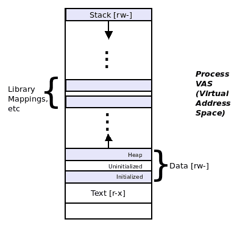
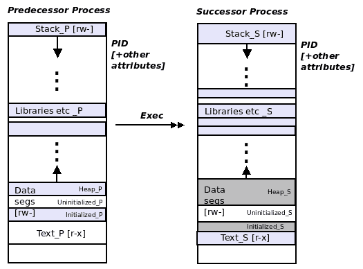

# 流程执行

想象一下这样的场景：当作为系统程序员(在 Linux 上使用 C)处理项目时，要求在**图形用户界面(GUI**)前端应用程序中，当最终用户单击某个按钮时，应用程序必须显示系统生成的 PDF 文档的内容。 我们可以假设我们可以使用 PDF 阅读器软件应用程序。 但是，具体如何从您的 C 代码中运行它呢？

本章将教你如何执行这项重要任务。 在这里，我们将学习一些核心的 Unix/Linux 系统编程概念：Unix`exec`系列模型是如何工作的，前置/后继术语，以及如何使用多达七个 Unix`exec`系列 API 来使整个事情在代码中实际工作。 当然，在此过程中，我们使用代码示例来清楚地说明概念。

简而言之，读者将了解以下关键领域：

*   `exec`+运算的含义及其语义
    *   测试`exec`操作
    *   使用`exec`-正确和错误的方法

*   使用`exec`进行错误处理
*   这七个`exec`系列 API 以及如何在代码中使用它们。

# 技术要求

本章中的练习之一需要安装弹出窗口软件包(PDF Utils)；可以按如下方式安装：

在 Ubuntu 上：`sudo apt install poppler-utils`

关于 Fedora：`sudo dnf install poppler-utils-<version#>`

Regarding the Fedora case: to get the version number, just type the above command, and after typing `poppler-utils-` press the *Tab* key twice; it will autocomplete providing a list of choices. Choose the latest version and press *Enter*.

# 流程执行

在这里，我们研究 Unix/Linux 操作系统是如何在系统程序员的层面上执行程序的。 首先，我们将教您理解重要的`exec`语义；一旦明确了这一点，您就可以使用`exec`系列 API 对其进行编程。

# 将程序转换为进程

如前所述，程序是存储介质上的二进制文件；它本身就是一个死对象。 要运行它，从而使它活跃起来，进入进程*，*，我们必须执行它。 比方说，当你从外壳运行一个程序时，它确实会活跃起来，成为一个进程。

下面是一个快速示例：

```sh
$ ps
 PID TTY          TIME CMD
 3396 pts/3    00:00:00 bash
21272 pts/3    00:00:00 ps
$ 
```

查看前面的代码，从 shell(本身是一个进程：bash)，我们运行或执行`ps(1)`程序；`ps`确实运行；它现在是一个进程；它完成它的工作(这里打印出这个终端会话中当前活动的进程)，然后礼貌地死去，让我们回到 shell 的提示符下。

片刻的思考会发现，要让`ps(1)`程序成为`ps`进程，可能需要由**操作系统**和**系统**(**OS**)来完成一些工作。 事实上，情况就是这样：操作系统执行一个程序，并最终通过 API、系统调用(称为`execve(2)`)使其成为一个正在运行的进程。 不过，现在让我们把 API 放在一边，把重点放在概念上。

# 执行 Unix 公理

我们在涵盖虚拟内存的[第 2 章](02.html)、*虚拟内存*、*和*中了解到，进程可以可视化为一个方框(矩形)，具有一个**虚拟地址空间**(**VAS**)；VAS 由称为段的同构区域(从技术上讲，是映射)组成。 因此，从本质上讲，进程的 VAS 由几个段组成-文本(代码)、数据段、库(和其他)映射以及堆栈。 为方便起见，此处复制了表示流程的 VAS 的图表：



Fig 1 : The process virtual address space (VAS) The lower end has a virtual address of `0`, and addresses increase as we go up; we have an upward-growing heap and a downward-growing stack.

机器上的每个活动进程都有这样一个进程 VAS；因此，合乎情理的是，我们前面的小示例 bash 中的 shell 就有这样一个进程 VAS(以及它的所有其他属性，如**进程标识符**、(**PID**)、打开的文件等)。

因此，让我们假设 shell 进程 bash 的**PID**值为 3396。 现在，当我们从 shell 运行`ps`时，实际发生了什么？

显然，作为第一步，shell 检查`ps`是否为内置命令；如果是，则运行它；如果不是，则继续执行第二步。 现在，shell 解析`PATH`环境变量，并定位到`/bin`中的`ps`。 第三步，也是有趣的一步，就是 shell 进程现在通过 API 执行`/bin/ps`的地方。 我们将把确切的 API 留待以后讨论；目前，我们只将可能的 API 称为`exec`API。

不要因为树而失去森林；我们现在要谈到的一个关键点是：当`exec`发生时，调用进程(Bash)通过让(在其他设置中)、`ps`覆盖它的**虚拟地址空间**(**VAS**)来执行被调用的**进程**(`ps`)。 是的，您知道在 Unix 上执行进程是正确的，因此 Linux 是通过让一个进程(即`caller`)被要执行的进程(即`callee`)覆盖来实现的。

**术语**

下面是一些重要的术语来帮助我们：调用`exec`(在我们的示例中为`bash`)的进程称为*前置进程*；被调用并执行的进程(在我们的示例中为`ps`)称为*后继进程*。

# EXEC 操作过程中的关键点

以下总结了前任流程和高管更换继任者时需要注意的要点：

*   后继进程覆盖(或覆盖)前导进程的虚拟地址空间。
    *   实际上，前置文件的文本、数据、库和堆栈段现在已被后置文件的文本、数据、库和堆栈段替换。
    *   操作系统将负责调整大小。
*   没有创建新的流程-现在后继流程在旧的前置流程的上下文中运行。

    *   因此，后继者会自动继承几个前置属性(包括但不限于 PID 和打开文件)。
        (敏锐的读者可能会问，为什么在我们前面的示例中，`ps`的 PID 不是 3396？ 请耐心等待，我们将在 GitHub 资源库上找到确切答案)。

*   对于一位成功的高管来说，不可能回到前任；它已经消失了。 通俗地说，执行高管就像是为前任自杀：成功执行后，继任者就是唯一的了；回到前任是不可能的：



*Fig 2: The exec operation*

# 测试 EXEC 公理

你能测试一下上面描述的这个`exec`公理吗？ 好的。 让我们用三种不同的方式来尝试一下。

# 实验 1-在 CLI 上，没有任何装饰

按照下面的简单步骤操作：

1.  启动 shell(通常是基于 GUI 的 Linux 上的终端窗口)
2.  在窗口中，或者更准确地说，在 shell 提示符下键入以下内容：

```sh
 $ exec ps
```

你注意到什么了吗？ 你能解释一下吗？

Hey, come on, please try it out first, and then read on.

Yes, the terminal window process is the predecessor here; upon an `exec` it's overwritten by the successor process `ps`, which does its work and exits (you probably did not see the output as it disappeared too quickly). `ps `is the successor process, and, of course, we cannot return to the predecessor (the Terminal window)—`ps` has literally replaced its VAS.  Thus, the Terminal window effectively disappears.

# 实验 2-再次在 CLI 上

这一次，我们会让你轻松一些！ 按照给定的步骤操作：

1.  启动一个 shell(通常是基于 GUI 的 Linux 上的终端窗口)。
2.  在窗口中，或者更准确地说，在 shell 提示符下运行`ps`，然后运行`bash `-是的，我们在这里生成一个子 shell，然后再次运行`ps`。 (查看下一个屏幕截图；请注意原始和子 shell Bash 进程的 PID-3,396 和 13,040。)
3.  在子 shell 上，`exec``ps`命令；这个`ps`后续进程覆盖(或覆盖)前一个进程-bash 子 shell 的进程映像。
4.  观察输出：在`exec ps`*和*命令输出中，`ps`的 PID 是 bash subshell 进程的 PID：13,040！ 这表明它是在该过程的上下文中运行的。
5.  还要注意，现在我们回到了最初的 bash shell 进程 PID 3396，当然，我们不能返回到以前的进程：


一旦我们有了一些`exec`API 可以使用，第三次实验运行很快就会到来。

# 不归路的关键

对于系统程序员来说，重要的是要明白，一旦`exec`操作成功，就不会返回到前一个进程。 为了说明这一点，请看下面的粗略调用图：

```sh
main()
         foo()
              exec(something)
         bar()
```

`main()`调用`foo()`*，*调用`exec(something)`，一旦`exec`成功，`bar()`将永远不会运行！

为什么不行？ 我们无法在前置进程的执行路径中到达它，因为整个执行上下文现在已经更改-更改为后继进程的上下文(某物)。 不过，PID 仍然完好无损。

只有当`exec`失败时，函数`bar()`才会获得控制权(当然，我们仍会处于前身的上下文中)。

作为进一步的补充，请注意，`exec()`操作本身可能成功，但正在执行的进程失败。 没关系；它不会改变语义；`bar()`仍然不会执行，因为后继者已经接管了。

# 家庭时光-高管家庭宣传片

既然我们已经理解了`exec`语义，那么是时候看看如何以编程方式执行`exec`操作了。 UNIX 和 Linux 提供了几个 CAPI(实际上是 7 个)，它们最终都完成相同的工作：它们的前身进程`exec`是后继进程。

那么，有 7 个 API 都做同样的事情？ 大多数情况下是这样的；因此它们被称为`exec`系列 API。

让我们来看看它们：

```sh
#include <unistd.h>
extern char **environ;

int execl(const char *path, const char *arg, ...);
int execlp(const char *file, const char *arg, ...);
int execle(const char *path, const char *arg, ...,
            char * const envp[]);
int execv(const char *path, char *const argv[]);
int execvp(const char *file, char *const argv[]);
int execvpe(const char *file, char *const argv[],
             char *const envp[]);
    execvpe(): _GNU_SOURCE
```

等等，虽然我们说了七个 API，但上面的列表有六个；事实上，第七个在某种意义上是特殊的，上面没有显示出来。 像往常一样，请耐心点，我们会处理的！

事实是，尽管每个 API 最终都将执行相同的工作，但根据您所处的情况使用特定的 API 会有所帮助(为了方便起见)。 让我们不要吹毛求疵，至少就目前而言，忽略他们的差异；相反，让我们专注于理解第一个差异；其他的将自动而容易地跟进。

以第一个 API`execl(3)`为例：

```sh
int execl(const char *path, const char *arg, ...);
```

它需要两个、三个或更多参数吗？ 如果您是新手，那么省略号--`...`1--表示一个变量参数列表或`varargs`，这是编译器支持的一个特性。

第一个参数是要执行的应用程序的路径名。

从第二个参数`varargs`开始，要传递给后续进程的参数包括`argv[0]`。 想想看，在上面的简单实验中，我们通过 shell 进程在命令行上传递参数；实际上，传递后续进程所需参数的实际上是 shell 进程，即前身进程。 这是有道理的：除了前任，还有谁会把争论传递给继任者呢？

编译器如何知道您已经完成了参数传递？ 简单：您必须空终止参数列表：`execl(const char *pathname_to_successor_program, const char *argv0, const char *argv1, ..., const char *argvn, (char *)0);`

现在您可以知道它为什么这样命名了：当然，`execl`API 执行 EXEC；最后一个字母`l`表示长格式；后续进程的每个参数都传递给它。

为了阐明这一点，让我们编写一个简单的示例 C 程序；它的工作是调用`uname`进程：

For readability, only the relevant parts of the code are displayed here; to view and run it, the entire source code is available here: [https://github.com/PacktPublishing/Hands-on-System-Programming-with-Linux](https://github.com/PacktPublishing/Hands-on-System-Programming-with-Linux).

```sh
int main(int argc, char **argv)
{
    if (argc < 2) {
        [...]
    }

    /* Have us, the predecessor, exec the successor! */
    if (execl("/bin/uname", "uname", argv[1], (char *)0) == -1)
        FATAL("execl failed\n");

    printf("This should never get executed!\n");
    exit (EXIT_SUCCESS);
}
```

以下是需要注意的几点：

*   `execl`API 的第一个参数是后继者的路径名。
*   第二个参数是程序的名称。 小心：一个相当典型的新手错误是省略它！
*   在这个简单的例子中，我们只是传递用户作为参数`argv[1]`：`-a`或`-r`发送的任何内容；我们甚至不会执行健壮的错误检查来确保用户传递正确的参数(我们把它留给您作为练习)。
*   如果我们只是试图用单个`0`空终止符，编译器就会报错，并显示如下警告(根据您使用的`gcc`编译器版本的不同，警告可能会有所不同)：
    `warning: missing sentinel in function call [-Wformat=]`。
    要消除该警告，必须将`0`类型转换为`(char *)`，如代码所示。
*   最后，我们使用`printf()`来演示控件永远不会到达它。 这是为什么？ 嗯，想想看：
    *   不是`execl`成功，就是后续进程(`uname`)接管。
    *   或者`execl`失败；`FATAL`宏执行错误报告并终止前置任务。

让我们构建并试用它：

```sh
$ ./execl_eg
Usage: ./execl_eg {-a|-r}
 -a : display all uname info
 -r : display only kernel version
$
```

传递一个参数；我们在这里展示几个示例：

```sh
$ ./execl_eg -r
4.13.0-36-generic
$ ./execl_eg -a
Linux seawolf-mindev 4.13.0-36-generic #40-Ubuntu SMP Fri Feb 16 20:07:48 UTC 2018 x86_64 x86_64 x86_64 GNU/Linux
$ ./execl_eg -eww
uname: invalid option -- 'e'
Try 'uname --help' for more information.
$ 
```

它确实可以工作(不过，从最后一个例子可以看出，`execl_eg`*和*程序的参数错误检查不是很好)。

We encourage you to try this simple program out yourself; in fact, experiment a bit: for example, change the first parameter to some unknown (for example, `/bin/oname`) and see what happens.

# 走错了路

有时候，为了展示做某事的正确方式，首先看到它做错了是很有用的！

# 错误处理和 EXEC

一些程序员在炫耀：他们不使用*if*条件来检查`exec`API 是否失败；他们只编写`exec`之后的代码行作为失败案例！

例如，以前面的程序为例，但将代码更改为此，这样做的方法是错误的：

```sh
execl("/bin/uname", "uname", argv[1], (char *)0);
FATAL("execl failed\n");
```

是的，它是有效的：控制会到达`'FATAL()'`行的唯一原因是 EXEC 操作失败。 这听起来很酷，但是请不要那样编写代码。 要专业，遵守规则和良好的编码风格指南；你会成为一名更好的程序员，并为此感到高兴！ (一个无辜的新程序员甚至可能没有意识到上面`execl`后面的内容实际上是错误处理；谁会责怪他呢？ 他可能会尝试将一些业务逻辑放在那里！)

# 将零作为参数传递

假设我们有一个(虚构的)需求：在我们的 C 代码中，我们必须执行程序`/projectx/do_this_now`，传递三个参数：`-1`、`0`和`55`。 如下所示：

`/projectx/do_this_now -1 0 55`

回想一下`exec`API 的语法：

`execl(const char *pathname_to_successor_program, const char *argv0, const char *argv1, ..., const char *argvn, (char *)0);`

所以，这看起来相当微不足道；让我们来做吧：

`execl("/projectx/do_this_now", "do_this_now", -1, 0, 55, (char *)0);`

哎呀！ 编译器将(或*可以*)将后续`0`(在`-1`之后)的第二个参数解释为`NULL`终止符，因此不会看到以下参数`55`。

解决这个问题很容易；我们只需记住*后续*进程的每个参数都是数据类型字符指针*，而不是整数；`NULL`终止符本身是一个整数(尽管为了让编译器满意，我们将其类型转换为`(char *)`)，如下所示：*

 *`execl("/projectx/do_this_now", "do_this_now", "-1", "0", "55", (char *)0);`

# 指定继任者的名称

不，我们不是在争论如何黑掉谁将在这里继承女王伊丽莎白二世的王位，抱歉。 我们指的是：如何正确指定后续进程的名称；也就是说，我们可以通过编程将其更改为我们喜欢的任何名称吗？

乍一看，它确实微不足道：`execl`的第二个参数是要传递给后继者的`argv[0]`参数；实际上，它看起来就是它的名称！ 因此，让我们尝试一下：我们编写了两个 C 程序；第一个程序(`ch9/predcs_name.c`)从用户那里传递了一个 name 参数。 然后，它执行我们的另一个程序`successor_setnm`，通过`execl`传递用户提供的名称作为第一个参数(在 API 中，它将后继`argv[0]`参数设置为前置程序的`argv[1]`)，如下所示：`execl("./successor_setnm", argv[1], argv[1], (char *)0);`

回想一下`execl`语法：`execl(pathname_to_successor_program, argv0, argv1, ..., argvn, 0);`

因此，这里的思路是：前任将后继者的`argv[0]`值设置为`argv[1]`，因此后继者的名称应该是前任者的`argv[1]`。 但是，它不起作用；请参见示例运行的输出：

```sh
$ ./predcs_name 
Usage: ./predcs_name {successor_name} [do-it-right]
$ ./predcs_name UseThisAsName &
[1] 12571
UseThisAsName:parameters received:
argv[0]=UseThisAsName
argv[1]=UseThisAsName
UseThisAsName: attempt to set name to 1st param "UseThisAsName" [Wrong]
UseThisAsName: pausing now...
$ 
$ ps
 PID TTY          TIME CMD
 1392 pts/0    00:00:01 Bash
12571 pts/0    00:00:00 successor_setnm
12576 pts/0    00:00:00 ps
$ 
```

我们故意让后续进程调用`pause(2)`系统调用(它只是让它休眠，直到收到信号为止)。 这样，我们就可以在后台运行它，然后运行`ps`来查找后续的 PID 和名称！

有趣：我们发现，虽然名称不是我们在`ps`输出(上面)中想要的名称，但在`printf`*；*中它是正确的，这意味着`argv[0]`已被正确接收并设置为后继者。

好的，我们必须清理一下；现在让我们结束后台进程：

```sh
$ jobs
[1]+  Running                 ./predcs_name UseThisAsName &
$ kill %1
[1]+  Terminated              ./predcs_name UseThisAsName
$ 
```

因此，正如现在很明显的那样，我们前面所做的是不够的：要在操作系统级别反映我们想要的名称，我们需要一个替代 API；其中一个这样的 API 是`prctl(2)`系统调用(甚至是`pthread_setname_np(3)`个 pthreadsAPI)。 这里不涉及太多细节，我们将其与`PR_SET_NAME`参数一起使用(如往常一样，请参阅`prctl(2)`上的手册页以获取完整的详细信息)。 因此，使用`prctl(2)`系统调用的正确代码(此处仅显示了来自`successor_setnm.c`的相关代码片段)：

```sh
[...]
    if (argc == 3) { /* the "do-it-right" case! */
        printf("%s: setting name to \"%s\" via prctl(2)"
                " [Right]\n", argv[0], argv[2]);
        if (prctl(PR_SET_NAME, argv[2], 0, 0, 0) < 0)
            FATAL("prctl failed\n");
    } else { /* wrong way... */
        printf("%s: attempt to implicitly set name to \"%s\""
            " via the argv[0] passed to execl [Wrong]\n",
            argv[0], argv[1]);
    }
[...]
$ ./predcs_name 
Usage: ./predcs_name {successor_name} [do-it-right]
$ 
```

因此，我们现在可以以正确的方式运行它*(*该逻辑涉及传递一个可选的第二个参数，该参数将用于`_correctly_`设置后续进程名称)：

```sh
$ ./predcs_name NotThis ThisNameIsRight &
[1] 12621
ThisNameIsRight:parameters received:
argv[0]=ThisNameIsRight
argv[1]=NotThis
argv[2]=ThisNameIsRight
ThisNameIsRight: setting name to "ThisNameIsRight" via prctl(2) [Right]
ThisNameIsRight: pausing now...
$ ps
 PID TTY          TIME CMD
 1392 pts/0    00:00:01 Bash
12621 pts/0    00:00:00 ThisNameIsRight
12626 pts/0    00:00:00 ps
$ kill %1
[1]+  Terminated              ./predcs_name NotThis ThisNameIsRight
$ 
```

这一次，它完全按照预期工作。

# 剩余的 EXEC 系列 API

很好，我们已经详细介绍了如何使用和不使用`exec`系列 API 中的第一个--`execl(3)`。 剩下的怎么办？ 让我们来看看吧；为了方便读者，我们转载了下面的列表：

```sh
#include <unistd.h>
extern char **environ;

int execl(const char *path, const char *arg, ...);
int execlp(const char *file, const char *arg, ...);
int execle(const char *path, const char *arg, ...,
            char * const envp[]);
int execv(const char *path, char *const argv[]);
int execvp(const char *file, char *const argv[]);
int execvpe(const char *file, char *const argv[],
             char *const envp[]);
    execvpe(): _GNU_SOURCE
```

正如多次提到的，`execl`语法是这样的：`execl(const char *pathname_to_successor_program, const char *argv0, const char *argv1, ..., const char *argvn, (char *)0);`

回想一下，它被命名为`execl`；`l`表示一个长格式的变量参数列表：后续进程的每个参数依次传递给它。

现在我们来看一下这个家族中的其他 API。

# Execlp API

版本`execlp`在版本`execl`的基础上稍有不同：

`int **execlp**(const char ***file**, const char *arg, ...);`

如前所述，`execlp`中的`l`表示一个长格式的变量参数列表；`p`表示搜索环境变量`PATH`以查找要执行的程序。 您可能知道，PATH 环境变量由一组冒号分隔的(`:`)目录组成，用于搜索要运行的程序文件；第一个匹配项是执行的程序。

例如，在我们的 Ubuntu VM 上(我们以用户`seawolf`的身份登录)：

```sh
$ echo $PATH
/home/seawolf/bin:/home/seawolf/.local/bin:/usr/local/sbin:/usr/local/bin:/usr/sbin:/usr/bin:/sbin:/bin:/usr/games:/usr/local/games
$ 
```

因此，如果通过`execlp`执行进程，则不需要给出绝对路径名或完整路径名作为第一个参数，只需给出程序名即可；请参阅以下两个示例有何不同：

`execl("/bin/uname", "uname", argv[1], (char *)0);`

`**execlp**("uname", "uname", argv[1], (char *)0);`

使用`execl`，您需要指定`uname`的完整路径名；使用`execlp`，您不需要；库例程将执行查找路径并计算出与`uname`匹配的工作！ (它将在`/bin`中找到第一个匹配项)。

Use the `which` utility to locate a program, in effect finding it's first match in the path. For example:

`$ which uname`
`/bin/uname`
`$`

这就是`execlp`机器人自动搜索路径的事实，确实很方便；不过请注意，这是以可能的安全为代价的！

Hackers write programs called Trojans - essentially, programs that pretend to be something they're not; these are obviously dangerous. If a hacker can place a Trojan version of `uname` in your, say, home directory, and modify the PATH environment variable to search your home directory first, then they could take control when you (think) you are running `uname`. 

For security reasons, it's always better to specify the full `pathname` when executing a program (hence, avoid using the `execlp`, `execvp`, and the `execvpe` APIs).

如果未定义 PATH 环境变量，该怎么办？ 在本例中，API 默认搜索进程的当前工作目录(`cwd`)以及名为`confstr`的路径，该路径通常缺省为目录`/bin`，后跟目录`/usr/bin`*。*

# Execle API

现在来看下`execle(3)`系列 API；它的签名是：

`int **execle**(const char *path, const char *arg, ...,char * const envp[]);`

和以前一样，`execle`中的`l`表示一个长格式的变量参数列表；`e`表示我们可以将环境变量数组传递给后续进程。

The process environment consists of a set of `<name>=<value>` variable pairs. The environment is actually unique to each process and is stored within the process stack segment. You can see the entire list via either the `printenv`*,* `env`*,* or `set` commands (*set* is a shell built-in). Programmatically, use the `extern` `char **environ` to gain access to the process's environment.

默认情况下，后续进程将继承前置进程的环境。 如果这不是必需的，怎么办；例如，我们想要执行一个进程，但是更改路径的值(或者可能在混合中引入一个新的环境变量)。 为此，我们将让前置进程复制环境，根据需要对其进行修改(可能会根据需要添加、编辑、删除变量)，然后将指向新环境的指针传递给后继进程。 这正是最后一个参数`char * const envp[]`的用意所在。

Old Unix programs used to accept a third argument to `main()`: `char **arge`, which represented the process environment. This is now considered deprecated; use the `extern environ`  instead.

There is no mechanism to pass just a few environment variables to the successor process; the whole bunch—in the form of a two-dimensional array of strings (which is itself `NULL`-terminated) must be passed.

# Execv API

*execv(3)和*接口签名为：

`int **execv**(const char *path, char *const argv[]);`

可以看到，第一个参数是后续进程的路径名。 与上面的环境列表类似，第二个参数是一个二维字符串数组(每个字符串以`NULL`结尾)，包含从`argv[0]`开始传递给后继者的所有参数。 想想看，它与我们 C 程序员所习惯的完全一样；这是 C 中`main()`函数的签名：

`int main(int argc, char *argv[]);`

当然，`argc`是接收到的参数数量，包括程序名本身(保存在`argv[0]`中)，**`argv`**是一个指向包含从`argv[0]`开始的所有参数的二维字符串数组(每个字符串以`NULL`结尾)的指针。

因此，我们通俗地称之为短格式(而不是我们早先使用的长格式-`l`格式)。 当您看到`v`(argv 的缩写)时，它代表了短格式的参数传递风格。

现在，剩下的两个接口很简单：

*   The`execvp(3)`：参数和要搜索的路径的缩写格式。
*   `execvpe(3)`：将参数、要搜索的路径和环境列表的简短格式显式传递给后继者。 此外，该 API 需要定义特性测试宏`_GNU_SOURCE`(顺便说一句，我们在本书的所有源代码中都是这样做的)。

`exec`中包含`p`函数的 API-搜索`PATH`的 API-`execlp`、`execvp`和`execvpe`有一个附加功能：如果找到要搜索的文件，但没有打开该文件的许可，它们不会立即失败(与其他`exec`API 一样，这些 API 会失败并将`errno`设置为`EACCESS`)；相反，它们将继续搜索`PATH`的其余部分以查找该文件。

# 操作系统级别的 EXEC

到目前为止，我们已经介绍了 7 个*EXEC 系列*API 中的 6 个。 最后，第七个是`execve(2)`。 你注意到了吗？ 括号中的`2`表示它是一个新的系统调用*和*(回想一下[第 1 章](01.html)，*Linux 系统体系结构*中有关系统调用的详细信息)。

事实是，前面的六个`exec`API 都在`glibc`-库层内；只有`execve(2)`是系统调用。 您将意识到，最终要让一个进程能够执行另一个程序-从而启动或运行后续程序-将需要操作系统级别的支持。 因此，是的，事实是上面所有六个`exec`API 都只是包装器；它们转换它们的参数并调用`execve`系统调用。

这是`execve(2)`的签名：

`int execve(const char *filename, char *const argv[], char *const envp[]);`

看一看高管们的家族 API 汇总表。

# 汇总表-EXEC 系列 API

以下表格汇总了`exec`系列的所有 7 个 API：

| 加入时间：清华大学 2007 年 01 月 25 日下午 3：33 | **参数：长格式(L)** | **参数：短格式(V)** | **是否搜索路径？ (P)** | **环境是否已通过？ (E)** | 加入时间：清华大学 2007 年 01 月 25 日下午 3：33 |
| `execl` | 英语字母表中第二十五个字母 / Y 字形 / Y 项 | （化学元素）氮 | （化学元素）氮 | （化学元素）氮 | 解放 / 解放运动 / 解放运动组织 / 释放 |
| `execlp` | 英语字母表中第二十五个字母 / Y 字形 / Y 项 | （化学元素）氮 | 英语字母表中第二十五个字母 / Y 字形 / Y 项 | （化学元素）氮 | 解放 / 解放运动 / 解放运动组织 / 释放 |
| `execle` | 英语字母表中第二十五个字母 / Y 字形 / Y 项 | （化学元素）氮 | （化学元素）氮 | 英语字母表中第二十五个字母 / Y 字形 / Y 项 | 解放 / 解放运动 / 解放运动组织 / 释放 |
| `execv` | （化学元素）氮 | 英语字母表中第二十五个字母 / Y 字形 / Y 项 | （化学元素）氮 | （化学元素）氮 | 解放 / 解放运动 / 解放运动组织 / 释放 |
| `execvp` | （化学元素）氮 | 英语字母表中第二十五个字母 / Y 字形 / Y 项 | 英语字母表中第二十五个字母 / Y 字形 / Y 项 | （化学元素）氮 | 解放 / 解放运动 / 解放运动组织 / 释放 |
| `execvpe` | （化学元素）氮 | 英语字母表中第二十五个字母 / Y 字形 / Y 项 | 英语字母表中第二十五个字母 / Y 字形 / Y 项 | 英语字母表中第二十五个字母 / Y 字形 / Y 项 | 解放 / 解放运动 / 解放运动组织 / 释放 |
| `execve` | （化学元素）氮 | 英语字母表中第二十五个字母 / Y 字形 / Y 项 | （化学元素）氮 | 英语字母表中第二十五个字母 / Y 字形 / Y 项 | 系统调用 |

EXEC API 格式：`exec<foo>`，其中`<foo>`是`{l,v,p,e}`的不同组合。

据我们所知，所有列出的 API 在成功后都不会返回。 只有在失败时，才会看到返回值；按照通常的规范，全局变量`errno`将被设置为反映错误的原因，可以通过`perror(3)`或`strerror(3)`API 方便地进行查找(例如，在本书提供的源代码中，请查看`common.h`*和*头文件中的`FATAL`宏)。

# 代码示例

在本章的介绍中，我们提到了一个要求：从 GUI 前端显示系统生成的 PDF 文档的内容。

为此，我们需要一个 PDF 阅读器应用程序；我们可以假定我们有一个。 事实上，在许多 Linux 发行版上，evince 应用程序是一个很好的 PDF 阅读器应用程序，通常是预装的(在 Ubuntu 和 Fedora 等平台上是这样的)。

好的，在这里，我们不会费心使用 GUI 前端应用程序，我们将使用普通的老式 C 来编写一个 CLI 应用程序，该应用程序在给定 PDF 文档`pathname`的情况下执行 Evince PDF 阅读器应用程序。 我们要显示什么 PDF 文档？ 啊，真是个惊喜！ (请看)：

For readability, only the relevant parts of the code are displayed as follows; to view and run it, the entire source code is available here:
[https://github.com/PacktPublishing/Hands-on-System-Programming-with-Linux](https://github.com/PacktPublishing/Hands-on-System-Programming-with-Linux).

```sh
const char *pdf_reader_app="/usr/bin/evince";
static int exec_pdf_reader_app(char *pdfdoc)
{
    char * const pdf_argv[] = {"evince", pdfdoc, 0};

    if (execv(pdf_reader_app, pdf_argv) < 0) {
        WARN("execv failed");
        return -1;
    }
    return 0; /* never reached */
}
```

我们从`main()`调用前面的函数，如下所示：

```sh
   if (exec_pdf_reader_app(argv[1]) < 0)
        FATAL("exec pdf function failed\n");
```

我们构建它，然后执行示例运行：

```sh
$ ./pdfrdr_exec
Usage: ./pdfrdr_exec {pathname_of_doc.pdf}
$ ./pdfrdr_exec The_C_Programming_Language_K\&R_2ed.pdf 2>/dev/null 
$ 
```

这是这个动作的截图！


如果我们只在控制台上运行 Linux(没有 GUI)怎么办？ 当然，这样一来，前面的应用程序就不能运行了(甚至不太可能安装该应用程序)。 以下是此案例的一个示例：

```sh
$ ./pdfrdr_exec ~/Seawolf_MinDev_User_Guide.pdf 
!WARNING! pdfrdr_exec.c:exec_pdf_reader_app:33: execv failed
perror says: No such file or directory
FATAL:pdfrdr_exec.c:main:48: exec pdf function failed
perror says: No such file or directory
$ 
```

在这种情况下，为什么不尝试修改上面的应用程序以使用 CLI PDF 工具集；其中一个这样的工具集来自 Poppler 项目(请参见下面的注释)。 在它内部，它提供的一个有趣的实用程序是`pdftohtml`。 为什么不用它从 PDF 文档生成 HTML 呢？ 我们把它留给读者作为练习(参见 GitHub 存储库上的*问题*部分)。

These useful PDF utilities are provided by an open source project called Poppler. You can easily install these PDF utilities, on an Ubuntu box: `sudo apt install poppler-utils`

我们可以非常容易地跟踪`pdfrdr_exec`程序中发生的事情；在这里，我们使用`ltrace(1)`来查看发出的库调用：

```sh
$ ltrace ./pdfrdr_exec The_C_Programming_Language_K\&R_2ed.pdf 
execv("/usr/bin/evince", 0x7ffcd861fc00 <no return ...>
--- Called exec() ---
g_static_resource_init(0x5575a5aff400, 0x7ffc5970f888, 0x7ffc5970f8a0, 32) = 0
ev_get_locale_dir(2, 0x7ffc5970f888, 0x7ffc5970f8a0, 32)                  = 0x7fe1ad083ab9
[...]
```

关键提示：`execv`当然是可见的；有趣的是，`ltrace`然后很有帮助地告诉我们，它没有回报。 然后，我们将看到 EVINCE 软件本身的库 API。

如果我们使用`strace(1)`查看发出的系统调用会怎么样？

```sh
$ strace ./pdfrdr_exec The_C_Programming_Language_K\&R_2ed.pdf 
execve("./pdfrdr_exec", ["./pdfrdr_exec", "The_C_Programming_Language_K&R_2"...], 0x7fff7f7720f8 /* 56 vars */) = 0
brk(NULL)                               = 0x16c0000
access("/etc/ld.so.preload", R_OK)      = 0
openat(AT_FDCWD, "/etc/ld.so.preload", O_RDONLY|O_CLOEXEC) = 3
fstat(3, {st_mode=S_IFREG|0644, st_size=0, ...}) = 0
[...]
```

是的，第一个是`execve(2)`，它证明了`execv(3)`库 API 调用了`execve(2)`系统调用。 当然，输出的其余部分是进程在执行时发出的系统调用。

# 简略的 / 概括的 / 简易判罪的 / 简易的

本章介绍了 Unix/Linux`exec`的编程模型；前置进程和后置进程的关键概念，以及更重要的是，后置进程(或多或少完全)如何覆盖前置进程。 本文介绍了 7 个`exec`系列 API，以及几个代码示例。 还讨论了错误处理、后继名称规范等。 系统程序员现在将有足够的知识来编写从进程内正确执行给定程序的 C 代码。*