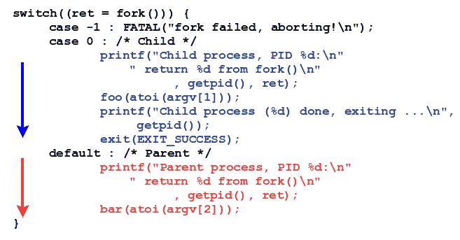
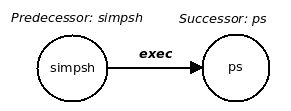

# 流程创建

在上一章中，我们学习了如何处理一个(虚构的)应用程序设计和实现需求：让我们的 C 程序完全执行(`exec`)另一个程序。 然而，现实情况是，讨论仍然不完整；关于流程创建*和*的这一章将填补几个空白，甚至更多。

在本章中，您将了解一些核心的 Unix/Linux 系统编程概念：正确编程关键进程`fork(2)`的系统调用以创建进程所需的可怕细节。 在这一过程中，Unix 狂热分子的术语，如阻塞呼叫、孤儿和僵尸也被清楚地表达出来。 这些材料小心翼翼地指出了细微之处，将普通开发人员变成了熟练的开发人员。 同时，读者将学习如何编写 C 代码来在 Linux 系统应用程序中实现前面的关键概念。 像往常一样，我们使用几个代码示例来清楚地说明和强化所教授的概念。

本章的目的是引导 Linux 系统开发人员进入 Unix`fork-exec-wait`语义学和相关领域的核心系统编程领域。 简而言之，我们将重点关注以下几个方面，帮助读者了解：

*   Unix 进程创建模型
*   为什么会这样，怎么会这样
*   更深入的详细信息，包括：
    *   分叉策略如何影响内存分配、打开的文件等，以及安全影响
    *   `wait`系列 API 的几种形式
    *   如何实际使用这些 API
    *   叉子的规则
    *   孤立进程和僵尸进程

# 流程创建

除非 Unix/Linux 系统程序员一直生活在岩石下的某个地方，否则他们肯定听说过(如果不是直接使用)`fork(2)`的系统调用。 为什么它如此广为人知，如此重要？ 原因很简单：Unix 是一个多任务操作系统；程序员必须利用操作系统的功能。 要使应用程序具有多任务，我们需要创建多个任务或进程；分叉方法是 Unix 创建进程的方式。 事实上，对于典型的系统程序员来说，分叉是创建进程的唯一途径。

There is another system call to create a process or thread: `clone(2)`*.* It also creates, well, a custom process. It's not typically used by Linux application developers; library (typically the thread library) developers use it more. In this book, we do not explore `clone`; for one thing, it's very Linux-specific and non-portable; for another, it's more of a hidden API.

The other way to multitask is by multithreading of course, which will be covered in detail in later chapters.

# 叉子的工作原理

从理论上讲，`fork(2)`的系统调用的工作描述可以具体化为一条简单的语句：**创建调用过程的相同副本*。 我们将反复遇到的新术语如下：调用*叉*的进程称为**父进程**，新创建的新生进程称为**子进程**。

Please note that, to begin with at least, we shall keep the discussion on how fork works purely conceptual and simple; later, we shall delve deeper and clarify how the OS performs several necessary optimizations.

Fork 调用是一个系统调用；因此，进程创建的真正工作是由操作系统在幕后执行的。 回想一下[第 2 章](02.html)，*虚拟内存*，进程的**虚拟地址空间**和(**VAS**)是由称为**段**(或**映射**)的同构区域构建的。 因此，当创建子进程时，操作系统会将父进程的文本、数据(其中三个)、库(和其他映射)以及堆栈段复制到子进程。

不过，等等；它并没有止步于此：一个过程不仅仅是它的 VAS，还有更多的东西。 这包括打开文件、进程凭证、调度信息、文件系统结构、分页表、命名空间(PID 等)、审计信息、锁、信号处理信息、计时器、警报、资源限制、IPC 结构、分析(Perf)信息、安全(LSM)指针、seccomp、线程堆栈和 TL、硬件上下文(CPU 和其他寄存器)等。

Many of the attributes mentioned earlier are well beyond the scope of this book, and we shall not attempt to delve into them. The idea is to show that there is much more to a process than just VAS.

哟！ 因此，执行派生操作涉及内核将几个内容从父进程复制到子进程。 但是，想想看：并非所有属性都是子代直接从父代继承的(很多都是，但肯定不是全部)。 例如，进程 PID 和 PPID(父 PID)没有继承(您能找出原因吗？)

作为第一级枚举，以下进程属性*和*由子进程在派生时继承(也就是说，新出生的子进程将获得具有相同内容的父级属性的副本)：

*   **VAS**：
    *   文本 / 文本信息 / 课文 / 主题
    *   生效日期：
        *   已初始化
        *   Unionialized(bs)
        *   堆
    *   库分段
    *   其他映射(例如，共享内存区域、mmap 区域等)
    *   栈
*   打开文件
*   进程凭据
*   日程安排信息
*   文件系统(VFS)结构
*   分页表
*   命名空间
*   信号条款
*   资源限制
*   IPC 结构
*   分析(Perf)信息
*   安全信息：
*   线程堆栈和 TLS
*   硬件环境

子进程在派生时不会完全继承父进程的以下属性：

*   PID、PPID
*   锁 / 扣住 / 过船闸 / 隐藏
*   挂起和阻止的信号(为子级清除)
*   计时器、报警器(为儿童清除)
*   审核信息(为子级重置 CPU/时间计数器)
*   通过进行的信号量调整`semop(2)`
*   **异步 IO**(**AIO**)操作和上下文

以图表的形式查看这一点很有用：


可见，`fork(2)`确实是一次重量级操作！

如果感兴趣，您可以在`fork(2)`上的手册页中找到有关继承/非继承特征的更多详细信息。

# 使用 fork 系统调用

三叉树的招牌就是简约本身：

```sh
pid_t fork(void);
```

这看起来微不足道，但您知道这句话：*魔鬼在于细节！*实际上，我们将给出几个关于正确使用此系统调用的微妙和不那么微妙的提示。

为了开始了解 Fork 的工作原理，让我们编写一个简单的 C 程序(`ch10/fork1.c`*)*：

```sh
int main(int argc, char **argv)
{
    fork();
    printf("Hello, fork.\n");
    exit (EXIT_SUCCESS);
}
```

构建并运行它：

```sh
$ make fork1
gcc -Wall -c ../../common.c -o common.o
gcc -Wall   -c -o fork1.o fork1.c
gcc -Wall -o fork1 fork1.c common.o
$ ./fork1 
Hello, fork.
Hello, fork.
$ 
```

成功后，三叉树将创建一个新的子流程。

**A key programming rule: ****never assume an API succeeds, always check for the failure case !!!**

这一点怎么强调都不为过。

好的，让我们修改代码以检查失败情况；任何和每个系统调用(可能只有 380 个 syscall 中的两个异常)都会在失败时返回`-1`。 检查一下；下面是相关的代码片段(`ch10/fork1.c`)：

```sh
    if (fork() == -1)
        FATAL("fork failed!\n");
    printf("Hello, fork.\n");
    exit(EXIT_SUCCESS);
```

输出与我们之前看到的完全相同(当然，因为分叉操作没有失败)。 因此，`printf`计划似乎已经执行了两次。 确实是这样：一次由父进程执行，一次由新子进程执行。 这立即教会了我们一些关于叉子的工作方式；在这里，我们将尝试将这些东西编纂成叉子的基本规则。在这本书中，我们将最终编纂`fork(2)`的七条规则。

# 分叉规则#1

**派生规则#1**：*派生成功后，父进程和子进程中的执行都将在派生*之后的指令处继续执行。

为什么会这样呢？ 好的，想想看：派生函数的工作是在子代中制作(几乎)相同的父代副本；这包括硬件上下文(前面提到的)，其中当然包括**指令指针**(**IP**)寄存器本身(有时称为**程序计数器**(**PC**))本身！ 因此，子进程也将在与父进程相同的位置执行用户模式代码。当派生成功时，控制将不会转到错误处理代码(`FATAL()`宏)；相反，它将转到前`printf`宏。 *关键是：这将在(原始)父进程和(新)子进程中发生。* 因此才会有产出。

为了强调这一点，我们编写了这个简单 C 程序的第三个版本(`ch10/fork3.c`)。 在这里，我们只显示`printf `语句，因为它是唯一更改的代码行(从`ch10/fork3.c`)：

```sh
    printf("PID %d: Hello, fork.\n", getpid());
```

构建并运行它：

```sh
$ ./fork3 
PID 25496: Hello, fork.
PID 25497: Hello, fork.
$ 
```

阿!。 现在我们实际可以看到，已经有两个进程运行了`printf`！ 可能(但不确定)，PID`25496`是父进程，当然另一个是子进程。 在此之后，两个进程都会执行`exit(3)`命令 API，因此两个进程都会死亡。

# 分叉规则 2--退货

让我们来看一下我们到目前为止使用的代码：

```sh
    if (fork() == -1)
        FATAL("fork failed!\n");
    printf("PID %d: Hello, fork.\n", getpid());
    exit(EXIT_SUCCESS);
```

好的，我们现在从第一条规则了解到，代码`printf`将并行运行两次-一次由父进程运行，一次由子进程运行。

但是，想想看：这真的有用吗？ 现实世界中的应用程序能从中受益吗？ 不是的。 我们真正追求的，也是有用的，是一种分工，也就是说，让孩子完成一些任务，而父母并行执行其他任务。 这使得叉子很有吸引力，也很有用。

例如，在分叉之后，我们让子函数运行某个函数`foo`的代码，让父函数运行其他函数`bar`的代码(当然，这些函数也可以在内部调用任意数量的其他函数)。 这将是有趣和有用的。

要安排这一点，我们需要在*和*和*分叉*之后使用一些方法来区分父代和子代。 再一次，乍一看，查询他们的 PID(通过`getpid(2)`)似乎是做到这一点的方法。 嗯，你可以，但这是一种粗鲁的方式。 区分进程的正确方法内置于框架本身：它基于 fork 返回的值(猜猜是什么)。

通常，您可能会非常正确地指出，如果一个函数被调用一次，它就会返回一次。 嗯，叉子是特别的-当你调用一个变量`fork(3)`时，它会返回两次*。* 如何做到这一点？ 想想看，fork 的工作是创建父进程(子进程)的副本；一旦完成，两个进程现在都必须从内核模式返回到用户空间；因此，fork 被调用一次，但返回两次；一次在父进程上下文中，一次在子进程上下文中。

不过，关键是内核保证父进程和子进程中的返回值不同；以下是关于*`fork`的返回值的规则：

*   关于成功：
    *   子进程中的返回值为零(`0`)
    *   父进程中的返回值是正整数，即新子进程的 PID
*   失败时，返回`-1`，并相应地设置`errno`(检查！)

所以，我们开始吧：

**派生规则#2**：*要确定您是在父进程还是子进程中运行，请使用派生返回值：子进程中的值始终为 0，父进程中的子进程的 PID 为*。

下面是另一个细节：花点时间看看`fork`的签名：

```sh
pid_t fork(void);
```

返回值的数据类型为`pid_t`，当然也是`typedef`。 那是什么？ 让我们来了解一下：

```sh
$ echo | gcc -E -xc -include 'unistd.h' - | grep "typedef.*pid_t"
typedef int __pid_t;
typedef __pid_t pid_t;
$ 
```

这就是问题所在：毕竟，它只是一个整数。 但这不是重点。 这里的要点是，在编写代码时，不要假设它是整数；只需根据手册页指定的内容声明数据类型；如果是`fork`，则声明为` pid_t`。 这样，即使将来库开发人员将`pid_t`改为(比方说)`long`，我们的代码也只需要重新编译。 我们保证我们的代码不会过时，使其保持可移植性。

现在我们了解了三条分叉规则，让我们编写一个较小但更好的基于分叉的应用程序来演示同样的规则。 在我们的演示程序中，我们将编写两个简单的函数：`foo `和`bar`；它们的代码是相同的，它们将发出一条打印，并让进程休眠作为参数传递给它们的秒数。 睡眠是为了模仿真实程序的工作(当然，我们可以做得更好，但现在我们只想保持简单)。

*`main `函数如下所示(像往常一样，在 GitHub 存储库中查找完整源代码，见`ch10/fork4.c`)：

```sh
int main(int argc, char **argv)
{
    pid_t ret;

    if (argc != 3) {
        fprintf(stderr,
            "Usage: %s {child-alive-sec} {parent-alive-sec}\n",
            argv[0]);
        exit(EXIT_FAILURE);
    }
    /* We leave the validation of the two parameters as a small
     * exercise to the reader :-)
     */

    switch((ret = fork())) {
    case -1 : FATAL("fork failed, aborting!\n");
    case 0 : /* Child */
          printf("Child process, PID %d:\n"
                 " return %d from fork()\n"
                        , getpid(), ret);
          foo(atoi(argv[1]));
          printf("Child process (%d) done, exiting ...\n",
               getpid());
          exit(EXIT_SUCCESS);
    default : /* Parent */
          printf("Parent process, PID %d:\n"
                 " return %d from fork()\n"
                      , getpid(), ret);
          bar(atoi(argv[2]));
    }
    printf("Parent (%d) will exit now...\n", getpid());
    exit(EXIT_SUCCESS);
}
```

首先，有几点需要注意：

*   返回变量已声明为`pid_t`*。*
*   规则 1-父进程和子进程中的执行都在分叉之后的指令处继续执行。在这里，分叉之后的指令不是开关(通常是错误的)，而是变量`ret`的完全初始化！我想一想：它将保证将`ret`初始化两次*：*，一次在父进程中，一次在子进程中，但初始化为不同的值。(*：*)*：*在父进程中初始化一次，在子进程中初始化一次，而是初始化为不同的值。
*   规则 2-要确定您是在父进程还是子进程中运行，请使用 fork 返回值：它始终是子进程中的值`0`，父进程中是子进程的 PID。因此，我们可以看到，这两个规则的效果都是确保正确地初始化了`ret `，因此我们可以正确地进行切换
*   顺便说一句--需要进行输入验证。 请看一下我们传递给`fork4`程序的参数，如下所示：

```sh
$ ./fork4 -1 -2
Parent process, PID 6797 :: calling bar()...
 fork4.c:bar :: will take a nap for 4294967294s ...
Child process, PID 6798 :: calling foo()...
 fork4.c:foo :: will take a nap for 4294967295s ...
[...]
```

我们还需要说更多(参见输出)吗？ 这是一个缺陷(Bug)。 正如源代码注释中提到的，我们将这两个参数的验证作为一个小练习留给读者。

*   我们更喜欢使用的 Switch-Case 语法，而不是`if `条件；在您的作者看来，它使代码更具可读性，因此可维护性更好。
*   正如我们在规则 2 中了解到的，派生函数在子代中返回 0，在父代中返回子代的 PID；我们在第一个开关的情况下使用这一知识，因此我们在代码中有效且非常可读性地区分了子代和父代。
*   当子进程 ID 完成时，我们不会让它调用*Break*；相反，我们让它退出。 原因应该是显而易见的：清晰。 让孩子在其业务逻辑(`foo()`)内做它需要的任何事情，然后简单地让它离开。 不要大惊小怪；代码干净。 (如果我们真的使用了中断，我们将在`switch `语句之后要求另一个`if`条件；这将是丑陋的，也更难理解。)
*   父进程跌破开关的情况，因为它只发出打印，然后退出。

由于`foo`函数和`bar`函数完全相同，因此我们仅在此处显示了`foo`函数的代码：

```sh
static void foo(unsigned int nsec)
{
    printf(" %s:%s :: will take a nap for %us ...\n",
            __FILE__, __FUNCTION__, nsec);
    sleep(nsec);
}
```

好的，让我们运行它：

```sh
$ ./fork4
Usage: ./fork4 {child-alive-sec} {parent-alive-sec}
$ ./fork4 3 7
Parent process, PID 8228:
 return 8229 from fork()
 fork4.c:bar :: will take a nap for 7s ...
Child process, PID 8229:
 return 0 from fork()
 fork4.c:foo :: will take a nap for 3s ...
Child process (8229) done, exiting ...
Parent (8228) will exit now...
$ 
```

如你所见，我们选择让孩子活 3 秒，让父母活 7 秒。 研究输出：分叉运算的返回值与预期不谋而合。

现在让我们在后台再运行一次(同时，我们给孩子和家长提供了更多的睡眠时间，分别为 10 秒和 20 秒)。 回到外壳上，我们将使用`ps(1)`命令查看父进程和子进程：

```sh
$ ./fork4 10 20 &
[1] 308
Parent process, PID 308:
 return 312 from fork()
 fork4.c:bar :: will take a nap for 20s ...
Child process, PID 312:
 return 0 from fork()
 fork4.c:foo :: will take a nap for 10s ...
$ ps
  PID TTY          TIME CMD
  308 pts/0    00:00:00 fork4
  312 pts/0    00:00:00 fork4
  314 pts/0    00:00:00 ps
32106 pts/0    00:00:00 bash
$ ps -l
F S   UID   PID  PPID  C PRI  NI ADDR SZ WCHAN  TTY          TIME CMD
0 S  1000   308 32106  0  80   0 -  1111 hrtime pts/0    00:00:00 fork4
1 S  1000   312   308  0  80   0 -  1111 hrtime pts/0    00:00:00 fork4
0 R  1000   319 32106  0  80   0 -  8370 -      pts/0    00:00:00 ps
0 S  1000 32106 32104  0  80   0 -  6003 wait   pts/0    00:00:00 bash
$ 
$ Child process (312) done, exiting ...            *<< after 10s >>*
Parent (308) will exit now...                      *<< after 20s >>*
<Enter>
[1]+  Done                    ./fork4 10 20
$ 
```

下面的`ps -l`列表(l：Long Listing)显示了有关每个流程的更多详细信息。 (例如，我们既可以看到 PID，也可以看到 PPID。)

在前面的输出中，您是否注意到父进程`fork4`的 PPID(父进程 ID)恰好是值`32106`，而 PID 是`308`。 这不是很奇怪吗？ 您通常希望 PPID 是一个比 PID 更小的数字。 这通常是正确的，但并不总是如此！ 现实情况是，内核将从最早的可用值中回收 PID。

**模拟子进程和父进程中的工作的实验**。

让我们这样做：我们创建一个`fork4.c`程序的副本，将其命名为`ch10/fork4_prnum.c`。 然后，我们稍微修改了代码：我们删除了函数`foo`和函数`bar`*，*，而不是仅仅休眠，而是让进程通过调用一个简单的宏来模拟一些实际工作`DELAY_LOOP`。 (代码在头文件`common.h`中。)。 宏将给定的字符打印给定的次数，我们将其作为输入参数传递给`fork4_prnum`。 以下是一个示例运行：

```sh
$ ./fork4_prnum 
Usage: ./fork4_prnum {child-numbytes-to-write} {parent-numbytes-to-write}
$ ./fork4_prnum 20 100
Parent process, PID 24243:
 return 24244 from fork()
pChild process, PID 24244:
 return 0 from fork()
ccpcpcpcpcpcpcpcpcpcpcpcpcpcpcpcpcpcpcpChild process (24244) done, exiting ...
ppppppppppppppppppppppppppppppppppppppppppppppppppppppppppppppppppppppppppppppppParent (24243) will exit now...
$ 
```

宏被编码为打印字符：`p`(对于父级)和`c`(对于*c*Hild)；它被打印的次数作为参数传递。 您可以从字面上看到父进程和子进程之间的调度程序上下文切换！ (交错的`p`和`c`演示了它们各自拥有 CPU 的情况)。

老生常谈，我们应该确保两个进程正好在一个 CPU 上运行；这可以通过 Linux 上的`taskset(1)`实用程序轻松实现。 我们运行`taskset`*和*，指定 CPU 掩码为`0`，这意味着作业应该只在 CPU`0`上运行。(同样，我们将其作为简单的查找练习留给读者：查看`taskset(1)`上的手册页，并了解如何使用它：

```sh
$ taskset -c 0 ./fork4_prnum 20 100
Parent process, PID 24555:
 return 24556 from fork()
pChild process, PID 24556:
 return 0 from fork()
ccppccpcppcpcpccpcpcppcpccpcppcpccppccppChild process (24556) done, exiting ...
pppppppppppppppppppppppppppppppppppppppppppppppppppppppppppppppppppppppppppppppParent (24555) will exit now...
$ 
```

我们建议您在他们的系统上实际试用这些程序，以了解它们是如何工作的。

# 分叉规则#3

**派生规则#3**：*在派生成功之后，父进程和子进程都会并行执行代码*。

乍一看，这条规则与第一条规则非常相似。 但不是的，这里强调的是并行性。父级和子级的执行路径是并行运行的。

您可能想知道，在单(UNI)处理器系统上，这是怎么回事？ 嗯，没错：现代处理器的一个基本属性是，在任何给定的时间点都只能运行一条机器指令。因此，如果我们在单处理器机器上，这只意味着进程将在 CPU 上执行时间切片(或分时)操作。 因此，它是伪并行的；然而，就现代 CPU 的速度而言，人类用户会认为执行是并行的。 在多核(SMP)系统上，它们将或可以真正并行运行。 所以，关于单处理器的细节就是：一个细节。 关键之处在于，我们应该将父对象和子对象都可视化为并行执行代码。

因此，在前面的代码示例中，这条规则告诉我们父进程和子进程的整个代码路径将并行运行；对于刚接触它的人来说，可视化这种并行性实际上是分支的初始困难！为了帮助解决这一问题，请参见下图(尽管我们只显示了代码切换大小写的代码)：父进程的代码路径将以一种颜色(红色)突出显示，而子进程的代码路径将以另一种颜色(蓝色)突出显示：


这就是关键点：用蓝色写代码，用红色写代码，子进程和父进程，并行运行！



在第二张图中，蓝色和红色的时间线箭头再次用于描述这种并行性。

# 原子处决？

在查看前面的代码流程图时，您可能会被误导，以为一旦进程开始执行其代码，它就会继续不受干扰地继续运行，直到完成为止。 这当然不一定会发生；在现实中，进程在运行时通常会将上下文切换到 CPU 之外，然后再切换回 CPU。

这就引出了一个重要的问题：*原子执行。* 一段代码被认为是原子的 IFF(当且仅当)，因为它总是不间断地运行到完成。 原子性，特别是在用户空间中，并不能完全保证：通常，进程(或线程)的执行被中断或抢占(中断/抢占的来源包括硬件中断、故障或异常，以及调度程序上下文切换)。 不过，可以安排在内核中保持代码段的原子性。

# 分叉规则#4-数据

当父进程派生*，*时，我们理解为创建子进程；它是父进程的副本。 这将包括 VAS，因此也包括数据和堆栈数据段。 记住这一点，查看以下代码片段(`ch10/fork5.c`)：

```sh
static int g=7;
[...]
int main(int argc, char **argv)
    [...]
    int loc=8;
    switch((ret = fork())) {
    case -1 : FATAL("fork failed, aborting!\n");
    case 0 : /* Child */
          printf("Child process, PID %d:\n", getpid());
          loc ++;
 g --;
 printf( " loc=%d g=%d\n", loc, g);
          printf("Child (%d) done, exiting ...\n", getpid());
          exit(EXIT_SUCCESS);
    default : /* Parent */
    #if 1
          sleep(2); /* let the child run first */
    #endif
          printf("Parent process, PID %d:\n", getpid());
          loc --;
 g ++;
 printf( " loc=%d g=%d\n", loc, g);
    }
    printf("Parent (%d) will exit now...\n", getpid());
    exit(EXIT_SUCCESS);
```

前面的程序(`ch10/fork5`)有一个初始化的全局变量`g`和一个初始化的局部变量`loc`。 父进程在分叉之后休眠两秒钟，从而或多或少地保证了子进程首先运行(这种同步在生产质量代码中是不正确的；我们将在本章后面详细讨论这一点)。 子进程和父进程都处理全局变量和局部变量；这里最关键的问题是*：*数据会被破坏吗？

让我们运行一下，看看：

```sh
$ ./fork5
Child process, PID 17271:
 loc=9 g=6
Child (17271) done, exiting ...
Parent process, PID 17270:               *<< after 2 sec >>*
 loc=7 g=8
Parent (17270) will exit now...
$ 
```

嗯，数据变量没有损坏。 再说一次，这里最关键的一点是：因为孩子有父母变量的副本，所以一切都很顺利。因为它们相互独立地改变；它们不会踩到对方的脚趾。 因此，请考虑以下内容：

**派生规则#4**：*数据跨派生复制，而不是共享*。

# 分叉规则 5-赛车

注意到前面代码(`ch10/fork5.c`)中的`sleep(2);`语句周围的`#if 1`标记和`#endif`标记了吗？ 当然，这意味着代码将被编译并运行。

如果我们把`#if 1`号改成`#if 0`号呢？ 很明显，`sleep(2);`的声明已经被有效地汇编出来了。 让我们这样做：重建并重新运行`fork5`计划。 现在会发生什么呢？

想想看：叉子规则 4 告诉我们这个故事。 在分叉之后，我们仍然使子进程和父进程处理数据变量的单独副本；因此，我们前面看到的值不会完全改变。

不过，这一次没有让父子粗略同步的休眠模式；因此，问题来了，是先运行针对子代的`printf `，还是先运行父代代码(显示变量值)呢？ 换句话说，我们真正在问的问题是：在没有任何类型的同步原语的情况下，在第一个`fork(2)`之后，哪个进程将首先获得处理器：父进程还是子进程？简短的答案是下一条规则：

**派生规则#5**：*在派生之后，父进程和子进程之间的执行顺序是不确定的*。

不确定？ 嗯，这是一种奇特的说法，*我们真的不知道*或*它是不可预测的*。 这就是问题所在：系统开发人员不应该试图预测执行的顺序。 现在运行修改后的语句`fork5 `(`no sleep(2)`语句)：

```sh
$ ./fork5 
Parent process, PID 18620:
 loc=7 g=8
Parent (18620) will exit now...
Child process, PID 18621:
 loc=9 g=6
Child (18621) done, exiting ...
$ 
```

啊，家长先跑，那也不算什么！您下一个五万次试运行，家长可能会先跑，但是在五万次试运行的时候，子进程可能会先跑。 别管它：它是不可预测的。

这就引出了另一个关键点(在软件中很常见)：我们在这里有所谓的**竞争条件**。 一场真正的比赛就是它所说的：我们不能肯定地预测谁将是胜利者。 在之前的程序中，我们真的不在乎父进程或子进程赢得竞争(先运行)：这被称为非良性竞争条件。 但通常在软件设计中，我们实际上并不关心；但在这种情况下，我们需要一种方法来保证赢家。 换句话说，要打败这场比赛。 这就是所谓的同步。 (如前所述，我们将在本章后面详细讨论这一点。)

# 进程和打开的文件

要清楚了解分叉策略对开放文件的影响，我们需要稍微跑题，简要了解一些背景信息。

In fact, for those readers very new to performing I/O on files within the Unix paradigm, it will be beneficial to first read through the [Appendix A](https://www.packtpub.com/sites/default/files/downloads/File_IO_Essentials.pdf), *File I/O Essentials*, before tackling this section.

Unix/Linux 进程在启动时将默认分配三个打开的文件；我们在本书前面已经讨论了这些基本点。 为方便起见，这三个打开的文件分别称为进程的`stdin`*、*`stdout`*、*和`stderr `；它们分别自动默认到键盘、监视器以及`stdin`*、*`stdout`*、*和`stderr`的监视器。 不仅如此，真正的应用程序在执行任务时肯定会打开其他文件。 回想一下分层的系统体系结构；如果 Linux 应用程序使用`fopen(3)`库 API 打开一个文件，它最终将归结为`open(2)`的系统调用，它返回打开文件的句柄，称为**的文件描述符**。 (想想看：我考虑在 Linux 上运行一个打开文件的 Java 应用程序：最终，这一次，通过 JVM，这项工作将通过相同的`open(2)`系统调用来完成！)

这里的要点是：内核将每个进程的打开文件存储在一个数据结构中(在经典的 Unix 术语中，它被称为**Open File Descriptor Table**(**OFDT**))。 我们在前面讨论了子进程在分叉上继承的特征的部分中看到，*和*打开的文件确实是由子进程继承的。 为了便于讨论，请考虑以下伪代码片段：

```sh
main
...
    foo
        fd = open("myfile", O_RDWR);
        ...
        fork()
            // Child code
 *... work_on_file(fd) ...*
            // Parent code
 *... work_on_file(fd) ...*
 ...
```

在这里，文件`myfile `现在对两个进程都可用，并且可以通过文件描述符：`fd`进行操作！ 但请稍等：应该清楚的是，子进程和父进程同时处理同一文件肯定会损坏文件；或者，如果不是文件内容，至少是应用程序。 要理解这一点，请考虑函数`work_on_file`*(*伪代码)：

```sh
work_on_file(int fd)
{   /* perform I/O */
    lseek(fd, 0, SEEK_SET);
    read(fd, buf, n);
    lseek(...);
    write(fd, buf2, x);
    ...
}
```

# 分叉规则 6-打开文件

您可以看到，如果没有任何同步，将会造成严重破坏！ 因此，下一条分叉规则是：

**分支规则#6**：*打开的文件在分支****之间(松散地)共享。***

所有这一切的结果是：系统程序员必须明白，如果父进程打开了一个文件(或多个文件)，那么它会幼稚地同时处理该文件(请记住分叉规则 3！)。 很可能会造成虫子。 一个关键原因是：虽然进程是不同的，但它们处理的主要对象，打开的文件，更准确地说，它的索引节点是一个不同的对象，因此是共享的。 事实上，文件的*Seek**位置*是 inode 的一个属性；在没有同步的情况下盲目地重新定位父和子节点中的查找指针几乎肯定会出现问题。

让事情保持平稳运行大致有两种选择：

*   将进程的其中一个进程关闭到文件中
*   同步对打开的文件的访问

第一种方法使事情变得简单，但在实际应用程序中的用处有限；它们通常要求文件保持打开状态。 因此，第二个选择：您究竟如何同步对打开的文件的访问？

同样，本书没有介绍详细信息，但非常简短地说，您可以在进程之间同步文件 I/O，如下所示：

*   通过 SysV IPC 或 POSIX 信号量
*   通过文件锁定

第一种方法很管用，但很粗糙。 这不被认为是正确的方式。 第二种解决方案，使用文件锁定，绝对是首选方案。 (这里没有详细介绍文件锁定，请参阅*进一步阅读*部分，以获得 GitHub 存储库上关于文件锁定的优秀教程的链接。)

同样重要的是要认识到，当父进程或子进程关闭打开的文件时，其对打开文件的访问权限将关闭；该文件在另一个进程中仍处于打开状态。 这就是“松散共享”这句话的真正含义。

为了快速演示这个问题，我们编写了一个简单的程序：`ch10/fork_r6_of.c `(这里，的**代表**open file**)。 *我们让读者来浏览源代码；下面是解释和示例输出。***

 *首先，我们让进程打开一个常规文件 TST； 然后，我们使子进程执行以下操作：寻找偏移量 10，并写入`c`的*行数*和(等于 100)行。并行地，如果我们让父进程这样做：寻找偏移量 10+(80*100)，写入*数目行*行 p。因此，当我们完成并检查文件时，我们预计会有 100 行`c`和 100 行`p`。但是， 以下是实际运行情况：

```sh
$ ./fork_r6_of
Parent process, PID 5696:
 in fork_r6_of.c:work_on_file now...
   context: parent process
Child process, PID 5697:
 in fork_r6_of.c:work_on_file now...
   context: child process
Parent (5696) will exit now...
Child (5697) done, exiting ...
$ 
```

以下是运行后测试文件的内容：

```sh
$ vi tst
^@^@^@^@^@^@^@^@^@^@ppppppppppppppppppppppppppppppppppppppppppppppppppppppppppppppppppppppppppppppp
ccccccccccccccccccccccccccccccccccccccccccccccccccccccccccccccccccccccccccccccc
ppppppppppppppppppppppppppppppppppppppppppppppppppppppppppppppppppppppppppppppp
ccccccccccccccccccccccccccccccccccccccccccccccccccccccccccccccccccccccccccccccc
ppppppppppppppppppppppppppppppppppppppppppppppppppppppppppppppppppppppppppppppp
ccccccccccccccccccccccccccccccccccccccccccccccccccccccccccccccccccccccccccccccc
[...]
:q
$ 
```

`p`和`c`会交错！确实如此，因为进程是并行运行的，没有任何形式的同步。 (通过检查文件内容，我们可以从字面上看到内核 CPU 调度器是如何在父进程和子进程之间进行上下文切换的)。 通过不使用同步，我们已经建立了一场新的竞赛。 那么，我们如何才能让这件事变得正确呢？ 前面提到过：文件锁定确实是解决问题的办法(注意：不要尝试与我们使用的父代码中愚蠢的`sleep(2)`)同步；这只是为了演示；另外，我们将很快介绍同步子和父代码的正确方法。)(注：不要试图与我们使用的父代码中愚蠢的`sleep(2)`同步；这只是为了演示；另外，我们将很快介绍同步子和父代码的正确方法。)

# 打开的文件和安全性

这也是关于安全的一个关键点，对于执行和分叉场景都是如此。

当您执行前一`exec `操作时，前置进程的 VAS 实质上会被后继进程的 VAS 覆盖。 但是，请注意，前一个进程的所有打开文件(在 OS 中以前面提到的称为 OFDT 的每个进程结构保存)保持不变，并且实际上是由后续进程继承的。 这可能会构成严重的安全威胁。 想想看：如果前辈使用的安全敏感文件没有关闭，并执行了安全执行，该怎么办？ 后继者现在可以通过其文件描述符访问它，无论它是否利用该知识。

同样的论点也适用于派生；如果父进程打开了安全敏感的文件，然后派生，则子进程也可以访问该文件(派生规则#6)。

为了准确地解决这个问题，在 Linux 2.6.23 内核中，`open(2)`的系统调用包含了一个新的标志：`O_CLOEXEC`。 当在`open(2)`内指定此标志时，相应的文件将在该进程将来执行的任何`exec `操作时关闭。 (在较早的内核中，开发人员必须通过`fcntl(2)`命令执行显式的`F_SETFD`操作才能设置`FD_CLOEXEC`位)。

在使用分叉时，程序员必须包括在分叉之前关闭父级中任何安全敏感文件的逻辑。

# 马洛克和叉子

程序员可能会偶然或犯下的一个常见错误是：假设在一个进程中成功地分配了内存，比方说，使用`p = malloc(2048)`。 假设变量`p`*和*是全局的。 过了一段时间，这个过程就分叉了。 开发人员现在希望父进程将一些信息传递给子进程；因此，她说，让我们只需写入共享缓冲区`p`，工作就会完成。 不，这不管用！ 让我们详细说明：错误分配的缓冲区对两个进程都是不可见的，但不是以他们认为的方式。 错误的假设是，错误分配的缓冲区是父进程和子进程之间共享的；如果不共享，它就会被复制到子进程的 VAS。请回想一下分支规则#4：数据不是共享的；它是跨分支复制的。

我们必须测试这个案例；看一下下面的代码片段(源文件：`ch10/fork_malloc_test.c`)：

For readability, only the relevant parts of the code are displayed here; to view and run it, the entire source code is available here: [https://github.com/PacktPublishing/Hands-on-System-Programming-with-Linux](https://github.com/PacktPublishing/Hands-on-System-Programming-with-Linux).

```sh
const int memsz=2048;
static char *gptr;
[...]
main(int argc, char **argv)
{
    gptr = malloc(memsz);
    [...]
    printf("Init: malloc gptr=%p\n", gptr);
    [...]
    switch ((ret = fork())) {
    case -1: [...]
    case 0:        /* Child */
        printf("\nChild process, PID %d:\n", getpid());
        memset(gptr, 'c', memsz);
 disp_few(gptr);
        [...]
        printf("Child (%d) done, exiting ...\n", getpid());
        exit(EXIT_SUCCESS);
    default:        /* Parent */
#if 1
        sleep(2);    /* let the child run first */
#endif
        printf("\nParent process, PID %d:\n", getpid());
        memset(gptr, 'p', memsz);
 disp_few(gptr);
        [...]
    }
    free(gptr);
[...]
```

用于显示内存缓冲区的几(16)字节的函数`disp_few`非常简单：

```sh
static inline void disp_few(char *p)
{
    int i;
    printf(" malloc gptr=%p\n ", p);
    for (i=0; i<16; i++)
        printf("%c", *(p+i));
    printf("\n");
}
```

我们建造并运行它：

```sh
$ ./fork_malloc_test 
Init: malloc gptr=0x1802260

Child process, PID 13782:
 malloc gptr=0x1802260
 cccccccccccccccc
Child (13782) done, exiting ...

Parent process, PID 13781:
 malloc gptr=0x1802260
 pppppppppppppppp
Parent (13781) will exit now...
$ 
```

立即需要注意的第一件事是：父进程和子进程中指向内存缓冲区(`0x1802260`)的指针是相同的，从而得出结论认为它就是指向的同一个内存缓冲区。 嗯，这不是；这是一个很容易犯的错误。 检查父级和子级中错误定位的缓冲区的*内容*；父级中的内容是`p`，子级中的内容是`c`；如果它真的是同一个缓冲区，则内容将完全相同。(=。 那么，到底是怎么回事呢？

正如现在多次提到的，数据是通过分叉复制的，而不是共享的*(*我们的分叉规则#4)。 好的，那为什么地址是一样的呢？ 原因有二：

*   *地址是虚拟地址(不是物理地址，我们应该从[第 2 章](02.html)、*虚拟内存*中的讨论中很好地知道)
*   它实际上不是同一个虚拟地址；现代操作系统(如 Linux)不会立即复制数据和堆栈段；它们使用一种名为**写入时复制**(**COW**)的优化语义。

# 简而言之，母牛

这需要一些解释。 到目前为止，为了使讨论在概念上保持简单，我们已经说过，在派生之后，内核会将父进程的所有 VAS 段(以及所有其他继承的进程属性)复制到新的子进程。 这是夸张的；现实是，试图这样做会使`fork(2)`在实践中站不住脚，因为它需要太多的 RAM 和太多的时间。 (事实上，即使经过了几次优化，三叉树仍然被认为是重量级的。)

让我们离题：其中一个优化是内核不会将文本(代码)段复制到子进程中；它只与子进程共享父进程的文本段(虚拟)页面。 这很有效，因为文本在任何情况下都只是可读和可执行的(r-x)；因此，既然它永远不会改变，为什么要复制呢？

但是数据和堆栈段呢？ 他们的页面毕竟是可读写的(RW-)，那么操作系统如何才能将它们与孩子共享呢？ 啊，这就是牛的语义学派上用场的地方。 要理解 COW，请考虑操作系统标记为 COW 的单个虚拟页面。 这实际上意味着：只要两个进程(父进程和子进程)都将页面视为只读，它们就可以共享该页面；不需要复制。 但是，一旦其中一个修改了页面(甚至是其中的一个字节)，操作系统就会介入并创建页面的副本，然后将该副本移交给执行写入的进程。

因此，如果我们有一个全局变量：`g=5`和`fork(2)`，则包含`g`数据的页面将被操作系统标记为 COW；父级和子级共享它，直到其中一个写入数据`g`。 此时，操作系统会创建包含(更新的)变量的页面副本，并将其交给编写器。 因此，COW 的最小粒度是一页。

事实上，Linux 积极强制执行 COW，以最大限度地进行优化。 不仅仅是数据和堆栈段，我们前面讨论的大多数其他可继承的进程属性实际上都没有复制到子进程中，它们是完全共享的，这有效地使 Linux 的数据分叉变得极其高效。

通过注意对数据变量(全局变量和局部变量)执行的 COW 优化的相同效果，可以获得对这些要点的更多了解；只需使用任何参数运行我们的测试用例程序，它就会在内部对两个变量运行一个小测试用例：一个全局变量和一个局部变量：

```sh
$ ./fork_malloc_test anyparameter
Init: malloc gptr=0xabb260
Init: loc=8, g=5

Child process, PID 17285:
 malloc gptr=0xabb260
 cccccccccccccccc
 loc=9, g=4
 &loc=0x7ffc8f324014, &g=0x602084
Child (17285) done, exiting ...

Parent process, PID 17284:
 malloc gptr=0xabb260
 pppppppppppppppp
 loc=7, g=6
 &loc=0x7ffc8f324014, &g=0x602084
Parent (17284) will exit now...
$ 
```

请注意，在父进程和子进程中，全局进程`g`和本地进程`loc `的地址是相同的。 但为什么呢？牛的故事将会像他们写的那样被表演。 是的，但我认为：这都是虚拟地址；但实际的物理地址在幕后会有所不同。

有时，您会感觉到现代操作系统会不遗余力地迷惑和迷惑可怜的系统程序员！ 我们刚才提出的两个要点似乎是互相矛盾的：

*   分叉规则 4：数据跨分叉复制，而不是共享
*   数据/堆栈(以及许多其他数据)并不是真正复制到叉子上，而是奶牛共享

我们如何解决这种情况？ 实际上，这很简单：第一个(我们的分叉规则#4)是使用分叉时的正确思考方式；第二个陈述是在 OS 层的幕后真正发生的事情。 这是关于产品优化的，仅此而已。

这里有一个建议：戴上应用开发者的帽子时，不要过度关注底层 OS 的 COW 优化细节；更重要的是理解其意图，而不是真正的优化。 因此，对于使用`fork(2)`分支的 Linux 应用程序开发人员而言，仍然存在的关键概念点是分支规则#4：数据跨分支复制，而不是共享。

# 等待和我们的 SIMPSH 项目

让我们给自己做一个有趣的学习练习：一个小项目。 当然，我们希望在 Linux 操作系统上使用 C 实现我们自己的一个非常简单的 shell。 让我们称它为我们的`simpsh`-Simple 外壳-项目。

Note: simpsh is a very small, minimally functioning shell. It works with only single-word commands. It does not support features such as redirection, piping, shell built-ins, and so on. It's meant to be a learning exercise.

至少目前的规范是这样的：显示一个提示符(比如`>>`)，在提示符处接受用户命令，然后执行它。 这是停止条件：如果用户输入`quit`，则终止(类似于在实际 shell 进程上键入`logout`、`exit`、c 或 s`Ctrl + D`)。

这似乎非常简单：在我们的 C 程序中，您进入一个循环，显示所需的提示符，接受用户输入(让我们使用`fgets(3)`*和*来做这件事)进入一个`cmd `变量，然后使用 Exec 系列 API 中的一个(一个简单的`execl(3)`听起来很有希望)来执行它。

嗯，是的，除了，你怎么会忘记，在 exec 操作成功后，前身进程实际上已经丢失了！我们的 shell 一旦执行任何操作，就会丢失(就像我们之前的实验 1：在 CLI 上，实验 2-演示了)。

例如，如果使用前面的简单方法，我们尝试使用 shell 命令 simpsh 执行`ps(1)`*和*，它将如下所示：



# Unix fork-exec 语义

所以，这是行不通的。 我们真正需要的是一种方法，让我们简单的 shell 和 simpsh 程序在执行和*和*操作后，能够在*中保持良好的生命力，但我们如何才能实现这一点呢？*

分叉就是答案！下面是我们要做的：在用户提供输入(一个命令)之后，我们就有了我们的 shell 分叉。 我们现在有两个完全相同的 shell：原来的父 shell(假设它有 pid x)和全新的子 shell(Pid Y)。子 shell 被用作牺牲的羔羊：我们已经让它执行了 user 命令。所以，是的，子进程是不可能返回的前置进程；但这没有问题，因为我们有活的、很好的父 shell 进程！

这种众所周知的技术被称为语义的*分叉-exec*。 它将其他几个操作系统所称的派生过程组合成两个离散的操作：进程创建(Fork)和进程执行(Exec)。 再一次展示了出色的 Unix 设计：


在上图中，将时间轴可视化为(水平)x 轴。 此外，我们使用蓝色来表示孩子的执行路径。

一旦父外壳检测到已执行的子外壳已完成，它将再次显示外壳提示。

# 需要等待

Fork-exec*和*非常有趣，但请稍等片刻：当子进程对用户命令执行`exec`操作时，后续进程正在运行(由上图中的蓝点划线表示)，父进程应该做什么？ 显然，它应该等待，但要等多久呢？ 我们应该让它睡觉吗？ 嗯，不是的，因为睡眠是以睡眠的秒数为论据的。 我们事先不知道继任者需要多长时间(可能是毫秒，也可能是几个月)。 正确的做法是：让父进程等到子进程(现在是继承者)死亡。

这正是`wait(2)`API 的设计初衷。 当父进程发出`wait(2)`API 时，它就会进入休眠状态；它的子进程一死，它就会被唤醒！

# 执行等待

`wait(2)`API 是阻塞调用的经典示例：调用进程被置于休眠状态，直到它等待(或阻塞)的事件发生。 当事件确实发生时，它会被唤醒并继续运行。

因此，想想看：一个进程派生；然后父进程发出`wait (2)`API，它阻塞的事件是子进程的死亡！当然，子进程继续运行；当子进程确实死亡时，内核唤醒或解除父进程的阻塞；现在它继续执行其代码。 以下是`wait(2)`的签名：

```sh
#include <sys/types.h>
#include <sys/wait.h>
pid_t wait(int *wstatus);
```

目前，我们将忽略 to`wait(2)`；我们将只传递 null(或`0`)(当然，我们稍后将介绍它)。

# 在一次又一次的比赛中击败对手

回想一下我们前面在第`ch10/fork5.c`章中看到的示例代码。 *和*在此程序中，我们通过在父进程的代码中引入一个`sleep(2);`*和*语句来人为地、粗略地等待子进程：

```sh
[...]   
   default: /* Parent */
#if 1
   sleep(2); /* let the child run first */
#endif
   printf("Parent process, PID %d:\n", getpid());
[...]
```

这还不够好：如果子进程完成工作的时间超过两秒怎么办？ 如果只需要几毫秒，那么我们就不必要地浪费时间。

这就是我们解决这场竞赛的方式：谁先跑，家长还是孩子？ 显然，分叉规则 5 告诉我们它是不确定的。 但是，在现实世界的代码中，我们需要一种方法来确保其中一个确实是首先运行的-比方说，子进程。 有了 WAIT API，我们现在就有了一个合适的解决方案！ 我们将前面的代码片段更改为：

```sh
[...]   
   default: /* Parent */
 wait(0);    /* ensure the child runs first */
   printf("Parent process, PID %d:\n", getpid());
[...]
```

想一想这是如何工作的：在分叉之后，这是一场竞赛：如果子进程确实先运行，那么就不会造成任何伤害。 然而，在不久的将来的某个时候，父进程将无法获得 CPU；这很好，因为它所做的一切就是通过调用等待来阻止对子进程的访问。*如果父进程确实在分叉之后首先运行，那么同样的事情也会发生：通过调用等待来阻止对子进程的访问。 我们有效地打败了这场比赛！ 通过发出等待作为派生之后父进程中做的第一件事，我们有效地保证子进程先运行。

# 把它组合在一起-我们的 Simpsh 项目

现在，我们已经准备好了所有的细节--即，fork-exec*和*语义和`wait`*和*API--我们可以看到应该如何设计我们的简单 shell 了。

在 C 程序中，进入循环，显示所需的提示符，接受用户输入(让我们使用`fgets(3)`*和*来做这件事-为什么？ 请阅读即将到来的(提示)，将其转换成一个`cmd`的变量，然后是叉子。 在子代码中(使用分支规则#2 来区分父代和子代)，可以使用众多执行系列 API 中的一个(简单的`execlp(3)`，在这里听起来很有希望)来执行用户提供的命令。 同时(回想一下分叉规则#3)，让父进程调用 Wait API；父进程现在会一直休眠，直到子进程死亡。 现在再次循环，重复整个过程，直到用户键入`'quit'`键退出。 大家都很开心！


实际上，我们现在有了一个被利用的`fork-exec-wait `语义层！

`fgets(3)`: For security reasons, do not use the traditionally taught APIs such as `gets(3)` or `scanf(3)` to receive user input; they are poorly implemented, and they do not provide any bounds-checking capabilities. The `fgets(3)` does; thus, using it, or `getline(3)`, is far superior security-wise. (Again, as mentioned earlier in this book, hackers exploit these vulnerabilities in commonly used APIs to perform stack-smashing, or other types of attacks.)

当然，我们的 Simpsh shell 在范围上相当有限：它只适用于*的*单字命令(如`ps`、`ls`、`vi`、`w`等)。 阅读代码并思考为什么会出现这种情况。

开始吧(源代码：`ch10/simpsh_v1.c`)：

For readability, only the relevant parts of the code are displayed here; to view and run it, the entire source code is available here: [https://github.com/PacktPublishing/Hands-on-System-Programming-with-Linux](https://github.com/PacktPublishing/Hands-on-System-Programming-with-Linux).

```sh
static void do_simpsh(void)
{
[...]
 while (1) {
     if (!getcmd(cmd)) {
         free(cmd);
         FATAL("getcmd() failed\n");
     }
     /* Stopping condition */
     if(!strncmp(cmd, "quit", 4))
         break;
[...]
```

如您所见，我们进入循环，通过我们编写的函数`getcmd`接受用户的命令(命令`fgets`在其中发出)，然后检查用户是否输入了`quit`，在这种情况下，我们退出。

真正的工作，也就是`fork-exec-wait`的语义，发生在这里，在循环中：

```sh
[...]
 /* Wield the powerful fork-exec-wait semantic ! */
 switch ((ret = fork())) {
 case -1:
     free(cmd);
     FATAL("fork failed, aborting!\n");
 case 0: /* Child */
     VPRINT
     (" Child process (%7d) exec-ing cmd \"%s\" now..\n",
         getpid(), cmd);
     if (execlp(cmd, cmd, (char *)0) == -1) {
         WARN("child: execlp failed\n");
         free(cmd);
         exit(EXIT_FAILURE);
     }
     /* should never reach here */
     exit(EXIT_FAILURE); // just to avoid gcc warnings
 default: /* Parent */
     VPRINT("Parent process (%7d) issuing the wait...\n",
         getpid());
     /* sync: child runs first, parent waits for child's death */
     if (wait(0) < 0) 
         FATAL("wait failed, aborting..\n");
     } // switch
 } // while(1)
```

(与参数传递有关的逻辑-显示帮助屏幕、详细开关、实际参数`fgets`、参数 calloc/free 等没有明确显示；请参阅源文件`simpsh_v1.c`)。

让我们试一试：

```sh
$ ./simpsh_v1 --help
Usage: ./simpsh_v1 [-v]|[--help]
 -v : verbose mode
 --help : display this help screen.
$ ./simpsh_v1 -v
>> ps
  Parent process ( 1637) issuing the wait...
  Child process ( 1638) exec-ing cmd "ps" now..
 PID TTY TIME CMD
 1078 pts/0 00:00:00 bash
 1637 pts/0 00:00:00 simpsh_v1
 1638 pts/0 00:00:00 ps
>> uname
  Parent process ( 1637) issuing the wait...
  Child process ( 1639) exec-ing cmd "uname" now..
Linux
>> uname -a
  Parent process ( 1637) issuing the wait...
  Child process ( 1640) exec-ing cmd "uname -a" now..
!WARNING! simpsh_v1.c:do_simpsh:90: child: execlp failed
perror says: No such file or directory
>> www
  Parent process ( 1648) issuing the wait...
  Child process ( 1650) exec-ing cmd "www" now..
!WARNING! simpsh_v1.c:do_simpsh:90: child: execlp failed
perror says: No such file or directory
>> quit
  Parent process ( 1637) exiting...
$ 
```

我们在详细模式下运行程序；您可以看到 shell 提示字符串`>>`以及每个详细打印；它们以`[v]:`为前缀。 请注意它对于单字命令是如何工作的；当我们传递一些未知的东西或带有多个字的时候(例如，`www`和`uname -a`)，`execlp(3)`就会失败；我们会捕捉到失败并发出警告消息；程序会继续运行，直到用户退出。

下面是另一个快速实验：我们可以使用我们的命令`simpsh_v1`*和*程序生成另一个 shell(`/bin/sh`)：

```sh
$ ./simpsh_v1 -v
>> sh
[v]: Parent process ( 12945) issuing the wait...
[v]: Child process ( 12950) exec-ing cmd "sh" now..
$ ps
 PID TTY TIME CMD
 576 pts/3 00:00:00 git-credential-
 3127 pts/3 00:00:01 bash
12945 pts/3 00:00:00 simpsh_v1
12950 pts/3 00:00:00 sh                      *<< the newly spawned sh >>*
12954 pts/3 00:00:00 ps
31896 pts/3 00:00:40 gitg
$ exit
exit
>> ps
[v]: Parent process ( 12945) issuing the wait...
[v]: Child process ( 12960) exec-ing cmd "ps" now..
 PID TTY TIME CMD
 576 pts/3 00:00:00 git-credential-
 3127 pts/3 00:00:01 bash
12945 pts/3 00:00:00 simpsh_v1
12960 pts/3 00:00:00 ps
31896 pts/3 00:00:40 gitg
>> 
```

它按照预期工作(嘿，您甚至可以尝试生成相同的进程`simpsh_v1`)。 所以，我们就在这里，第一个非常简单但功能正常的外壳。

为什么长达一个字以上的命令都会失败呢？ 答案在于我们如何使用`execlp(3)`API 执行后续版本。 回想一下，对于 execlp，我们要传递程序名(当然会自动搜索路径)和所有参数，从`argv[0]`开始。 在我们的简单实现中，我们只传递`argv[0]`的第一个参数；这就是原因所在。

那么，我们如何让它与带有任意数量参数的命令一起工作呢？ 嗯，这确实涉及到一些字符串处理工作：我们必须将参数标记为单独的字符串，初始化指向它们的指针的`argv`*和*数组，然后通过`execv[pe]`API 使用这个数组`argv`*和*。我们把它留给读者作为一个稍微更具挑战性的练习！ (提示：C 库提供了对字符串进行符号化的 API；`strtok(3)`*、*`strtok_r(3)`*；*查找)。

In effect, our simpsh project is a simplistic implementation of the `system(3)`library API. Note that from a security viewpoint, it's always recommended to use field-proven and tested APIs like `system(3)`rather than a home-grown` fork-exec-wait` piece of code. Here, of course, we code it for learning purposes.

# 等待 API-详细信息

在我们的 Simpsh 应用程序中，我们确实使用了`wait(2)`API，但并没有真正深入研究细节：

```sh
pid_t wait(int *wstatus);
```

需要理解的是：`wait(2)`是阻塞调用；它会导致调用进程阻塞，直至子进程死亡。

从技术上讲，`wait(2)`(以及我们稍后看到的相关 API)实际上阻止了正在进行状态更改的子进程；那么，状态更改就是孩子的最终死亡，对吗？ 是的，但真正重要的是要理解，不仅仅是这样：可能的状态变化如下：

*   子进程按如下方式终止：
    *   正常情况下(通过脱落`main`，或拨打电话`[_]exit()`)
    *   不正常的(被信号杀死)。
*   孩子被发送了一个停止它的信号(通常是`SIGSTOP`或`SIGTSTP`)。
*   在被停止后，它被传递了一个信号，它将继续(恢复)它(通常是`SIGCONT`；我们将在下一章详细介绍信号)。

不过，通用的`wait(2)`系统调用会在孩子死亡(终止)时阻塞，而不是前面提到的任何其他与信号相关的状态更改。 (这是可以做到的吗？ 是的，确实，我们将在本章后面介绍`waitpid(2)`*(*系统调用)。

WAIT 的参数是指向整数`wstatus`的指针。 实际上，它更多地被视为一个返回值，而不是要传递的参数；这是一种非常常见的 C 编程技术：将参数视为返回值。 Linux 上的系统调用经常使用它；这种技术通常被称为取值-结果函数或输入-输出函数参数。我想一想：我们将变量的地址传递给它；内部拥有该地址的 API 可以更新它(戳它)。

关于参数 T`wstatus`的下一件事是这样的：当整数被视为一个位掩码时，*和*不被视为绝对值。 同样，这也是程序员常用的 C 优化技巧：我们可以通过将几条信息作为位掩码来处理，从而将其放入一个整数中。 那么，如何解释返回的位掩码呢？ 出于可移植性的原因，C 库提供了预定义的宏来帮助我们解释位掩码(这些宏通常位于`<sys/wait.h>`*和*中)。 这两个宏成对工作：第一个宏返回布尔值；如果返回 TRUE，则查找第二个宏的结果；如果返回 FALSE，则完全忽略第二个宏。

题外话：进程可以以两种方式之一死亡：正常或异常。正常终止意味着进程自愿死亡；它只是脱离了`main()`，或被称为`exit(3)`或`_exit(2)`，将退出状态作为参数传递(退出状态的约定：零表示成功，非零表示失败，并被视为失败代码)。 另一方面，异常终止意味着进程非自愿死亡-它通常是通过信号被杀死的。

以下是等待宏对及其含义：

| **第一个宏** | **第二个宏** | **含义** |
| `WIFEXITED` | `WEXITSTATUS` | 孩子正常死亡：`WIFEXITED`为真；然后，`WEXITSTATUS`-孩子的退出状态。
儿童异常死亡：`WIFEXITED`为假
 |
| `WIFSIGNALED` | `WTERMSIG` | 孩子死于信号：`WIFSIGNALED`为真；那么，`WTERMSIG`就是杀死它的信号。 |
|  | `WCOREDUMP` | 如果孩子死后产生核心转储，则为真。 |
| `WIFSTOPPED` | `WSTOPSIG` | 如果孩子是通过信号停止的，则为真；那么，`WSTOPSIG`是停止它的信号。 |
| `WIFCONTINUED` | -你知道吗？ | 如果 CHILD 被停止并随后通过信号(`SIGCONT`)恢复(继续)，则为 TRUE。 |

(在包含`WCOREDUMP`的行中，缩进旨在表示只有当`WIFSIGNALED`为真时才能看出`WCOREDUMP`是有意义的)。

那么`wait(2)`的实际返回值本身呢？ 显然，`-1`表示失败(当然内核将设置为`errno`以反映失败的原因)；否则，在成功时，它是死亡的进程的 PID，从而解锁父进程的等待。

为了试用我们刚刚学到的东西，我们复制了一份`simpsh_v1`*和*程序，并将其命名为`ch10/simpsh_v2.c`*。*同样，我们在这里只展示了相关的代码片段；完整的源代码文件在本书的 GitHub 存储库中：

```sh
[...]
 default: /* Parent */
     VPRINT("Parent process (%7d) issuing the wait...\n",
         getpid());
     /* sync: child runs first, parent waits for child's death */
     if ((cpid = wait(&wstat)) < 0) {
         free(cmd);
         FATAL("wait failed, aborting..\n");
     }
     if (gVerbose)
         interpret_wait(cpid, wstat);
 } // switch
} // while(1)
[...]
```

如您所见，我们现在捕获了`wait (2)`(更改状态的子进程的 PID)的返回值，如果我们在详细模式下运行，则调用我们自己的函数`interpret_wait`；它将提供详细说明具体发生了哪些状态更改的输出；如下所示：

```sh
static void interpret_wait(pid_t child, int wstatus)
{
     VPRINT("Child (%7d) status changed:\n", child);
     if (WIFEXITED(wstatus))
         VPRINT(" normal termination: exit status: %d\n",
             WEXITSTATUS(wstatus));
     if (WIFSIGNALED(wstatus)) {
         VPRINT(" abnormal termination: killer signal: %d",
                 WTERMSIG(wstatus));
         if (WCOREDUMP(wstatus))
             VPRINT(" : core dumped\n");
         else
             VPRINT("\n");
     }
     if (WIFSTOPPED(wstatus))
         VPRINT(" stopped: stop signal: %d\n",
             WSTOPSIG(wstatus));
     if (WIFCONTINUED(wstatus))
         VPRINT(" (was stopped), resumed (SIGCONT)\n");
}
```

第二个`VPRINT`宏很简单；如果进程处于详细模式，则会产生一个`printf(3)`*或*。 我们试用该程序(版本 2)：

```sh
$ ./simpsh_v2 -v
>> ps
  Parent process ( 2095) issuing the wait...
  Child process ( 2096) exec-ing cmd "ps" now..
 PID TTY TIME CMD
 1078 pts/0 00:00:00 bash
 2095 pts/0 00:00:00 simpsh_v2
 2096 pts/0 00:00:00 ps
 Child ( 2096) status changed:
 normal termination: exit status: 0
>> quit
  Parent process ( 2095) exiting...
$ 
```

如您所见，我们在详细模式下运行它；我们可以看到，子进程`ps(1)`的状态发生了变化：它正常死亡，退出状态为 0，表示成功。

Interesting: this is how bash knows whether the process that just ran succeeded or not; it plugs in the exit status—fetched via an API similar to `wait`*—*into the variable **`?`** (which you can access using  `$?` .)

# 等待的场景

到目前为止，我们已经讨论了通用 API`wait(2)`；但是，我们实际上只讨论了一个关于`wait`*的可能场景；*还有更多的场景。 让我们来看看他们。

# 等待场景#1

这是一个简单的例子(我们已经遇到过)：一个流程分叉，创建一个子流程。 父级随后发出*Wait*API；它现在阻止阻止其子进程中的状态更改；回想一下，子级可能经历的状态更改如下：

*   从运行状态转换(R)：死亡；也就是说，孩子终止(正常/异常)
*   状态从运行/休眠状态(R|S|D)转换到停止状态(T)；也就是说，它会收到导致其停止的信号
*   状态从停止状态(T)过渡到准备运行(R)；也就是说，从停止状态转换到准备运行状态

(状态转换和代表进程状态的字母在[章](17.html)，Linux 上的*CPU 调度*中有介绍)。 无论发生哪种情况，事实是父进程被解锁，并继续执行其代码路径；`wait(2) `API 返回(与之一起，我们将接收死亡或被通知的子进程的 PID)，以及详细的状态位掩码。

# 等待场景#2

考虑这样的场景：一个流程派生(创建)两个子进程；让我们称父进程 P 为子进程 C1 和 C2。 回想一下分叉规则 3-父进程和子进程都将继续并行运行。 现在，P 叫`wait`；会发生什么？

这就是答案：进程 P 将一直被阻塞，直到其中一个子进程死亡(或停止)，但是哪个子进程被阻塞？哪个先改变状态？那么系统程序员如何知道哪个进程死亡或停止呢？ 这很简单：返回值是死掉或停止的进程的 PID。

换句话说，我们设计了一个推论：一个等待阻塞在单个子进程上；阻塞 n 个子进程需要 n 个等待。

一个有趣的练习是用代码构建前面的场景；确保父进程确实同时等待两个子进程(这个练习在 GitHub 存储库中被称为`fork2c`)。

To have a parent wait upon all possible children, invoke the `wait`API as the condition of a while loop; as long as waitable children exist, it will block and return positive; the moment there are no waitable children, the `wait`returns `-1`; check for that as the condition to break out of the loop. Note though, that there are scenarios requiring a non-blocking wait to be set up; we shall cover these as well.

# 叉形炸弹和创造一个以上的孩子

假设我们想要编写代码来创建三个子级；如下所示的代码会这样做吗？

```sh
main() 
{
    [...]
    fork();
    fork();
    fork();
    [...]
}
```

当然不是!。 (试试看)。

回想一下派生规则#1：父进程和子进程中的执行都会在派生之后的下一个指令处继续执行。因此，正如您所看到的，在第一个派生之后，父进程和子进程都运行第二个派生进程(所以我们现在总共有四个进程)，然后这四个进程都将运行第三个派生进程(总共有八个进程)，依此类推(浩劫！)。

如果以这种不受控制的方式调用叉子-它最终会创建*2^3=8*个孩子！ 换句话说，它是指数级的；n=forks 意味着*2^n*个孩子将在失控的冲刺中被创造出来。

想象一下使用此代码可能造成的损害：

```sh
int main(void)
{ 
    while(1)
        fork();
}
```

它被非常正确地称为叉子炸弹！-一种**拒绝服务**和(**DoS**)攻击**。**

有趣的是，由于现代 UNIX(当然包括 Linux)具有基于 COW 的复制语义，因此产生的内存开销可能不会那么大。 当然，它仍然消耗大量的 CPU；此外，While 循环中的一个简单的 calloc 函数也会导致内存被耗尽。

By the way, carefully tuned resource limits (we studied this in an earlier chapter in detail) can help mitigate the fork bomb (and similar) DoS attack risks. Even better, would be careful tuning via cgroups for resource bandwidth control. Here is the fork bomb wikipedia link: [https://en.wikipedia.org/wiki/Fork_bomb](https://en.wikipedia.org/wiki/Fork_bomb).

好的，所以，`fork(); fork();`不是创造两个孩子的必由之路。 (在 GitHub 存储库上试用练习`Smallbomb`。)

你怎样才能正确地做到这一点呢？ 这很简单：考虑父进程和子进程的执行路径，区分它们(分支规则#2)、*和*，只让父进程创建第二个子进程。 此代码片段演示了相同的内容：

```sh
static void createChild(int sleep_time)
{
     pid_t n;
     switch (n = fork()) {
     case -1:
         perror("fork");
         exit(1);
     case 0: // Child
         printf("Child 2 PID %d sleeping for %ds...\n", getpid(),
         sleep_time);
         sleep(sleep_time);
         exit(0);
     default: ; // Parent returns..
     }
}
int main(void)
{
[...]
switch (n = fork()) {  // create first child
 case -1:
     perror("fork");
     exit(1);
 case 0: // Child
     printf("Child 1 PID %d sleeping for %ds...\n", getpid(),
         c1_slptm);
     sleep(c1_slptm);
     exit(0);
 default: // Parent
 createChild(c2_slptm); // create second child
     /* Wait until all children die (typically) */
 while ((cpid = wait(&stat)) != -1) {
         printf("Child %d changed state\n", cpid);
     }
 }
```

# 等待场景 3

如果一个进程没有孩子，从未有过孩子(单身汉)，并且只发布了`wait(2)`*和*API，该怎么办？ 乍一看，这似乎是一个问题案例，因为它可能会导致死锁；但是，不，内核比这更聪明。 `wait`*和*的内核代码进行检查，一旦发现调用进程没有子进程(死的或活的或停止的或其他什么)，它就会简单地*在*之后*等待失败。* (仅供参考，`errno`*-*设置为`ECHILD`，这意味着该过程没有等待已久的孩子)。

再次提醒一下我们的一条金科玉律：*永远不要假设任何事情；总是检查失败的情况*。 *和*重要的是，我们的[章](19.html)、*故障排除和最佳实践*涵盖了这些要点。

还有一个`wait`场景；不过，我们需要先介绍更多信息。

# WAIT-API 的变体

还有几个额外的系统调用来执行等待子(Ren)进程的*工作；我们接下来将介绍它们。*

# 服务员(2)

假设我们有一个有三个子进程的进程；需要父进程在特定的子进程终止时等待(阻塞)。 如果我们使用泛型接口`wait`，我们已经看到，当任何一个孩子的状态发生变化时，它就会被解封。 这个难题的答案是：`waitpid(2)`的系统调用：

```sh
pid_t waitpid(pid_t pid, int *wstatus, int options);
```

第一个参数`pid`*和*被设置为要等待的孩子的 PID。 但是，其他值也是可能的；如果传递了`-1`，它通常会等待任何`waitable`子进程。 (还有其他更神秘的案例；我们向您推荐手册页)。 也就是说，发出这个命令相当于一个通用的 API 调用`wait(&stat);`：

```sh
waitpid(-1, &stat, 0);
```

第二个参数是通常的状态整数位掩码，我们使用`wait`API 详细了解了这一点。

第三个参数称为`options`；之前，我们将其设置为零，意味着没有特殊行为。 它还能接受什么价值观呢？ 嗯，您可以只传递零或以下内容的按位 OR(它也是一个位掩码)：

| **参数值**的选项 | **含义** |
| `0` | 默认，同上`wait(2)` |
| `WNOHANG` | 仅阻止活着的孩子；如果没有，请立即返回 |
| `WUNTRACED` | 当子进程停止*和*(且不一定终止)时，也取消阻止 |
| `WCONTINUED` | 恢复停止的子进程时也取消阻止(通过传送给它的`SIGCONT`信号) |

起初，`WNOHANG`选项可能听起来很奇怪；除了活生生的孩子之外，您怎么能阻止任何东西呢？ 嗯，稍加耐心，我们很快就会解决这个问题。

要测试`waitpid(2)`，我们再次复制`simpsh_v2.c`*和*，并将其命名为`ch10/simpsh_v3.c`；代码中唯一有意义的区别是，我们现在使用`waitpid(2)`*和*，而不是通用的`wait`*和*API，根据需要传递选项；从`ch10/simpsh_v3.c`：

```sh
[...] default: /* Parent */
     VPRINT("Parent process (%7d) issuing the waitpid...\n",
         getpid());
     /* sync: child runs first, parent waits
      * for child's death.
     * This time we use waitpid(2), and will therefore also get
 * unblocked on a child stopping or resuming!
     */
 if ((cpid = waitpid(-1, &wstat, 
 WUNTRACED|WCONTINUED)) < 0) {
             free(cmd);
             FATAL("wait failed, aborting..\n");
     }
     if (gVerbose)
         interpret_wait(cpid, wstat);
[...]
```

现在我们运行它：

```sh
$ ./simpsh_v3 -v
 >> read
  Parent process ( 15040) issuing the waitpid...
  Child process ( 15058) exec-ing cmd "read" now..
```

我们发出`read`*和*(bash 内置)命令，因为它本身是一个阻塞调用，所以我们知道子进程`read`*和*将处于活动和休眠状态。*在另一个终端窗口中，我们查找我们的`simpsh_v3`*和我们在其中运行的命令的 PID(步骤`read`)：*

```sh
$ pgrep simpsh
 15040
$ pstree -A -h 15040 -p
 simpsh_v3(15040)---read(15058)
$
```

(有用的`pstree(1)`*和*实用程序向我们展示了流程树的父子层次结构。 有关详细信息，请查看手册页)。

现在，我们向`read`*和*进程发送`SIGTSTP`命令(终端停止信号)；它被停止：

```sh
$ kill -SIGTSTP 15058
```

被拦下是我们正在寻找的状态改变！回想一下，我们现在的等待代码是：

```sh
waitpid(-1, &wstat, WUNTRACED|WCONTINUED))
```

因此，当孩子停止时，`WUNTRACED`选项生效，在原来的终端窗口中我们看到这样的情况：

```sh
 Child ( 15058) status changed:
  stopped: stop signal: 20
>> 
```

我们现在可以通过向孩子发送信号`SIGCONT`来继续观察孩子：

```sh
$ kill -SIGCONT 15058
$ 
```

由于我们的(父)菜单`waitpid(2)`*和*也在使用`WIFCONTINUED`键，因此在原始的终端窗口中，我们可以看到这一点(尽管它似乎确实需要用户按下*Enter*键)：

```sh
 Child ( 15058) status changed:
  (was stopped), resumed (SIGCONT)
```

我们对孩子(人)有了更多的控制权。 (年轻的父母请注意！)

Unix 的`fork-exec-wait`和 Unix*和*框架确实很强大。

# 外号(2)

对于进一步的微调和控制，还有`waitid(2)`*和*系统调用(来自 Linux 2.6.9)：

`int **waitid**(idtype_t idtype, id_t id, siginfo_t *infop, int options);`

前两个参数实际上将指定要等待的子级：

| **waitid(2)：第一个参数：idtype** | **第二个参数：ID 为** |
| `P_PID` | 设置为要等待(阻止)的子级的 PID |
| `P_PGID` | 等待进程组 ID(PGID)与此数字匹配的任何子进程 |
| `P_ALL` | 等待任何子级(忽略此参数) |

第四个`options`参数类似于它与参数`waitpid(2)`、*和*一起使用的方式，但不完全相同；还有一些额外的选项可以传递；同样，它是一个参数位掩码*、*，而不是绝对值：参数`WNOHANG`和参数`WCONTINUED`与参数`waitpid(2)`的系统调用具有相同的含义。

此外，还可以对以下选项进行按位运算：

*   `WEXITED`：屏蔽(已经)终止的儿童(同样，我们很快就会弄清楚为什么会有这种情况存在)
*   `WSTOPPED`：阻止将进入已停止状态的子项(类似于`WUNTRACED `选项)
*   `WNOWAIT`：屏蔽孩子，但一旦解锁，让他们处于等待状态，这样他们就可以使用稍后的等待*API 再次等待。

第三个参数是类型为`siginfo_t`的(大)数据结构；(我们将在[第 11 章](11.html)，*信令-第一部分*中详细介绍)。 在返回`waitid(2)`时，这将由内核填充。 由 OS 设置各个字段，其中，改变状态的孩子的 PID(`si_pid`)、`si_signo`被设置为`SIGCHLD`、`si_status, si_code`。 我们打算在后面的章节中介绍这些内容(目前，请参阅手册页)。

There are BSD variations of `wait`APIs too: the `wait3`and the` wait4`*. *However, these are nowadays considered outdated; use the `waitpid(2)`or `waitid(2)` APIs instead.

# 实际的系统调用

我们已经看到了几个 API，它们执行将父进程设置为`wait `直到子进程更改状态(死亡、停止或停止后恢复)的工作：

*   `wait`
*   `waitpid`
*   `waitid`
*   `wait3`
*   `wait4`

有趣的是，与 Exec 系列 API 的情况类似，Linux 实现使得前面的大多数 API 都是库(`glibc`)包装器：事实是，在 Linux 操作系统上，在前面的所有 API 中，`wait4(2)`*和*是实际的系统调用 API。

在使用`wait`和 API 之一的程序上执行`strace(1)`*和*可以证明这一点(我们使用`strace`*和*我们的`simpsh_v1`*和*程序，它调用`wait`)：

```sh
$ strace -e trace=process -o strc.txt ./simpsh_v1 
>> ps
 PID TTY TIME CMD
14874 pts/6 00:00:00 bash
27248 pts/6 00:00:00 strace
27250 pts/6 00:00:00 simpsh_v1
27251 pts/6 00:00:00 ps
>> quit
$ 
```

这是`strace`*：*的输出

```sh
execve("./simpsh_v1", ["./simpsh_v1"], 0x7fff79a424e0 /* 56 vars */) = 0 
arch_prctl(ARCH_SET_FS, 0x7f47641fa4c0) = 0 
clone(child_stack=NULL,       
 flags=CLONE_CHILD_CLEARTID|CLONE_CHILD_SETTID|SIGCHLD, 
 child_tidptr=0x7f47641fa790) = 27251
wait4(-1, NULL, 0, NULL) = 27251
[...]
```

在讨论执行`strace`时，确实会出现另一个有趣的问题：如果您在`fork`*和*API 之后找到了调用`fork(2)`*和*的应用程序`strace`*和*，那么`strace`*和*是否也会跟踪子进程的执行路径？ 默认情况下，不会，但只需传递`-f`选项，它就会！

`strace(1)`上的手册页是这样写的：

```sh
-f           Trace child processes as they are created by currently traced processes as a result of the fork(2), vfork(2) and clone(2) system calls. ...
```

同样，系统程序员可能知道非常强大的 GNU 调试器-gdb。 如果使用`gdb(1)`调试多进程应用程序，在指令流中遇到分叉后，如何请求 gdb 遵循哪个进程的执行路径？ 该设置称为`follow-fork-mode`：in`gdb`；这里，我们展示了一个将模式设置为 s`child`的示例：

```sh
​(gdb) show follow-fork-mode 
Debugger response to a program call of fork or vfork is "parent".
(gdb) set follow-fork-mode child
(gdb) 
```

With respect to GDB: Debugging multi-process applications with GDB: Using the GDB `attach <PID>` command is useful to `attach` to another process (say, the child). GDB also provides a powerful `catch` command; see `help catch` in GDB for more details.

# 车叉上的一张纸条

几十年前，BSD Unix 开发人员提出了一个高效的特例系统调用-`vfork(2)`*。虽然*当时的想法是执行一些优化，其中您执行了一个分支，几乎立即在孩子中执行了一个分支(换句话说，就是分支-exec)。 正如我们所知，使用 fork-exec 是一个相当常见和有用的语义(shell 和网络服务器大量使用它)。 当调用 vfork 函数而不是 dfork 函数时，内核不会经历通常需要的繁重复制操作；它会优化事情。

底线是：在那个时候，`vfork(2)`在 Unix 上很有用；但是今天的 Linux 版本`fork(2)`已经尽可能优化了，把`vfork`版本变成了后门。 它仍然存在，可能有两个原因：

*   兼容性-帮助将 BSD 应用程序移植到 Linux
*   显然，它在一些神秘的特殊 Linux 上非常有用，这些 Linux 运行在没有 MMU 的处理器上(比如 uClinux)。

在今天的常规 Linux 平台上，不建议使用`vfork(2)`；只要坚持使用`fork(2)`即可。

# 更多 Unix 怪异之处

从分叉规则 3 可以看出，父进程和子进程是并行运行的。 如果他们中的一个终止了呢？ 另一个也会死吗？ 嗯，不，当然不是；他们是独立的实体。 然而，这也有副作用。

# 孤儿

考虑这样的场景：进程派生，父进程和子进程处于活动状态，并并行运行各自的代码路径。 假设父母的 PID 是 100，孩子的 PID 是 102，这意味着孩子的 PPID 当然是 100。

无论出于何种原因，父进程都会死亡。 孩子继续生活，没有任何麻烦，除了副作用：当父母(PID100)死亡的那一刻，孩子的 PPID(100)现在就无效了！ 因此，进程内核介入，将子进程的 PPID 设置为整个母进程-所有用户空间任务的祖先，进程树的根-进程 init，或者在最新的 Linux 上，即进程 systemd，进程！ 按照久负盛名的 Unix 惯例，它的 PID 总是数字`1`。

术语：失去直系亲属的孩子现在被认为是由 Systemd(或 init)重新抚养的，因此它的 PPID 将是`1`；这个孩子现在是一个孤儿。

There is a possibility that the overall ancestor process (init or systemd) does *not* have PID 1, and thus the orphan's PPID may not be 1; this can occur, for example, on Linux containersor custom namespaces.

我们注意到孩子的 PPID 值突然改变；因此，系统程序员必须确保他们不会因为任何原因而*而不是*依赖于 PPID 值相同(这总是可以通过`getppid(2)`*和*系统调用来查询)！

# 僵尸

孤立进程不会带来任何问题；还有另一种情况，它很可能会导致严重的问题。

考虑这样的场景：进程派生，父进程和子进程处于活动状态，并并行运行各自的代码路径。 假设父母的 PID 是 100，孩子的 PID 是 102，这意味着孩子的 PPID 当然是 100。

现在我们深入研究更深一层的细节：父进程应该在其子进程终止时等待(当然是通过任何可用的`wait*(2)`*或*API)；如果它不这样做呢？ 啊，这可真是件坏事。

想象一下这样的场景：子进程终止，但父进程并没有等待(阻塞)它；因此它继续执行它的代码。 然而，内核并不高兴：Unix 规则是父进程必须阻塞其子进程！因此，由于父进程不会阻塞，内核无法完全清除刚刚死掉的子进程；它确实释放了整个 VAS，释放了所有内存，刷新并关闭了所有打开的文件以及其他数据结构，但它不清除内核进程表中的子进程条目。因此，死掉的子进程仍然具有完全有效的 PID 和一些杂项信息(它的退出状态、退出位掩码)。因此，死掉的子进程仍然有一个完全有效的 PID 和一些杂项信息(它的退出状态、退出位掩码)，但它不会清除内核进程表中的子进程条目。因此，死掉的子进程仍然有一个完全有效的 PID 和一些杂项信息(它的退出状态、退出位掩码。 内核保留这些细节，因为这是 Unix 的方式：父进程必须等待它的子进程并在它们死时获取它们的终止状态信息，即获取它们的终止状态信息。父进程如何获取子进程(Ren)？ 很简单：通过执行等待！

因此，想想看：子进程已经死了；父进程没有费心等待*到*；内核在某种程度上已经清理了子进程。 但从技术上讲，它是存在的，因为它一半是死的，一半是活的；这就是我们所说的僵尸进程***。*** **事实上，这是 Unix：Z 上的僵尸进程状态(您可以在`ps -l`的输出中看到这一点；此外，该进程被标记为已失效*)。***

 ***那么为什么不干脆杀掉僵尸呢？ 嗯，他们已经死了；我们不能杀了他们。 读者可能会问，好吧，那又怎么样？ 随他们去吧。 好吧，僵尸给生产系统带来真正令人头疼的问题有两个原因：

*   他们拿着一个珍贵的 PID
*   僵尸占用的内核内存量并不是微不足道的(本质上是一种浪费)。

所以，底线是这样的：几个僵尸可能是可以的，但几十个、数百个，甚至更多的僵尸肯定不是。 您可能会达到这样的地步：系统被僵尸堵塞，以至于没有其他进程可以运行-`fork(2)`失败，并将`errno `设置为`EAGAIN`(稍后重试)，因为没有可用的 PID！ 情况很危险。

Linux 内核开发人员很有见地提供了一个快速解决方案：如果您注意到系统上有僵尸，您可以通过杀死它们的父进程来消除它们，至少是暂时的！ (一旦父母死了，僵尸又有什么用呢？ 关键是，他们留了下来，这样父母就可以通过等待来收获他们。 请注意，这只是一个绷带，而不是解决方案；解决方案是修复代码(参见以下规则)。

这是一个关键点；事实上，我们所说的等待场景#4：实际上已经终止僵尸的孩子们的等待得到了畅通。 换句话说，你不仅应该，而且必须等待所有的孩子；否则，僵尸就会出现(注意，僵尸在 Unix/Linux 操作系统上是一个有效的进程状态；在死亡的路上，每个进程都会经过**僵尸**(Z)状态。 对于大多数人来说，它是暂时的；它不应该在很长一段时间内保持这种状态)。

# 分叉规则#7

所有这些都干净利落地把我们带到了下一条分叉规则。

**派生规则#7**：*父进程必须在每个子进程终止(死亡)时直接或间接地等待(阻塞)*。

事实是，就像`malloc-free`一样，`fork-wait`也是齐头并进的。 在现实世界的项目中，我们可能看起来不可能强迫父进程在分叉后的等待时间阻塞；我们将解决如何轻松解决这些看似困难的情况(这就是为什么我们也提到间接测试方法；提示：它与信号有关，下一章的主题)。

# 《叉子的规则》--综述

为方便起见，此表汇总了我们在本章中编码的分叉规则：

| **规则*和*** | **叉法** |
| 1. | 在成功派生之后，父进程和子进程中的执行都将在派生之后的
指令处继续执行 |
| 2 个 | 要确定您是在父进程还是子进程中运行，请使用 fork 返回值：它始终是子进程中的值`0`，父进程中是子进程的 PID |
| 3. | 在成功派生之后，父进程和子进程都会并行执行代码 |
| 4. | 数据跨分支复制，而不是共享 |
| 5. | 在分叉之后，父进程和子进程之间的执行顺序是不确定的 |
| 6. | 打开的文件在分叉之间(松散地)共享 |
| 7. | 父进程必须在每个子进程直接或间接终止(死亡)时等待(阻止 |

# 简略的 / 概括的 / 简易判罪的 / 简易的

Unix/Linux 系统编程的一个核心领域是学习如何正确处理至关重要的`fork(2)`*和*系统调用，以便在系统上创建新进程。 正确使用`fork(2)`*和*需要很多深刻的见解。 本章通过提供几条关键的分叉规则来帮助系统开发人员。 学习的概念-规则、处理数据、打开文件、安全问题等-通过几个代码示例进行了揭示。 讨论了如何正确等待您的孩子进程的许多细节。 孤儿和僵尸进程到底是什么，以及我们为什么和如何避免僵尸也被讨论了。****