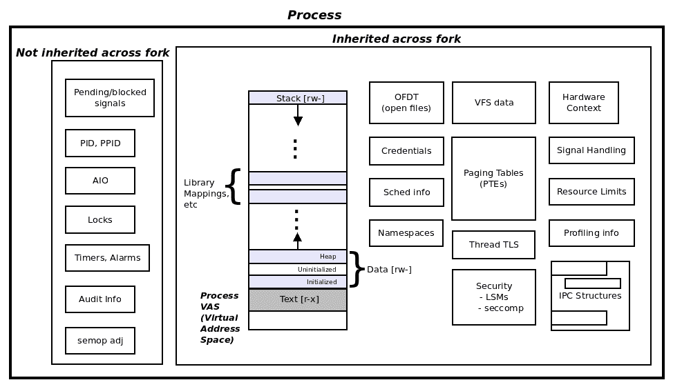
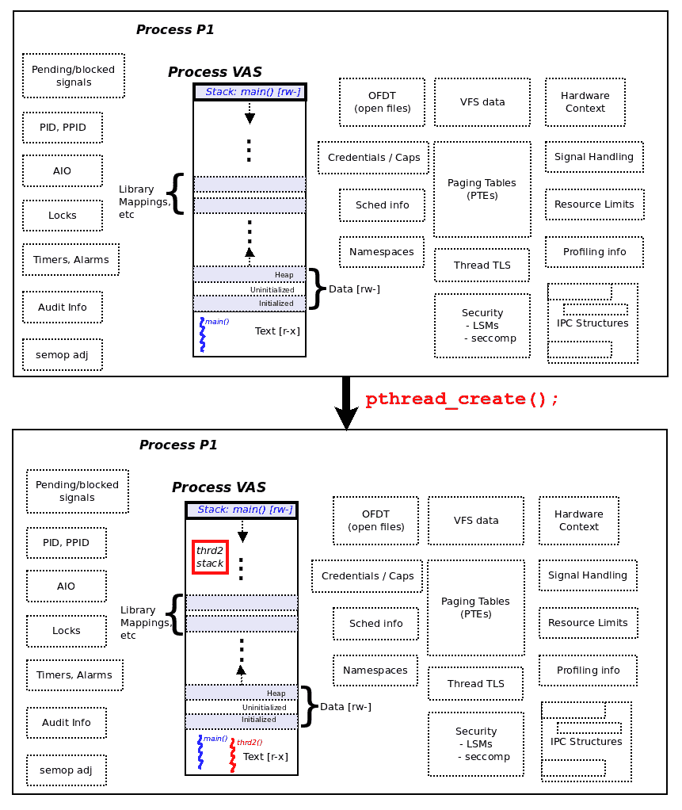
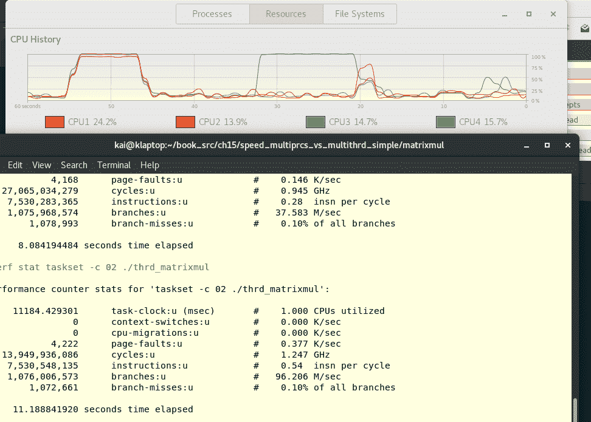

# 使用 Pthread 进行多线程，第一部分-要领

您是否使用下载加速器类型的应用程序下载过大文件？ 你玩过网络游戏吗？ 飞行模拟器程序？ 使用文字处理、网页浏览器、Java 应用程序等？ (在这里添加一个笑脸表情的诱惑力很高！)

您很可能至少使用了其中的一部分；那又如何？ 所有这些完全不同的应用程序都有一个共同点：它们很可能都是为多线程设计的，这意味着它们的实现使用了彼此并行运行的多个线程。多线程确实几乎已经成为现代程序员的一种生活方式。

解释一个像多线程一样大的主题本身就是一项艰巨的任务；因此，我们将覆盖范围分为三个单独的章节。 这是他们中的第一个。

本章本身在逻辑上分为两大部分：第一部分，我们仔细思考和理解多线程模型背后的概念--多线程是什么和为什么。 线程到底是什么，我们为什么需要线程，以及多线程是如何在 Linux 平台上发展起来的。

在第二部分中，我们重点介绍了线程管理 API-Linux 上多线程(在某种程度上)的使用方法。 本文讨论了创建和管理线程所需的 API 集，当然，还提供了大量实用代码供您查看和试用。

在本主题开始时，我们还必须清楚地指出这样一个事实：在本书中，我们只关注软件编程上下文中的多线程；特别是**POSIXThreads**(**pthreads**)实现，特别是 Linux 平台上的 pthread。 我们不会尝试处理各种其他如雨后春笋般涌现的多线程框架和实现(如 MPI、OpenMP、OpenCL 等)或硬件线程(超线程、带 CUDA 的 GPU 等)。

在本章中，您将了解如何在 Linux 平台上使用多线程编程，特别是了解 pthread 编程模型或框架的入门知识。 本章大致分为两部分：

*   在第一部分中，涵盖了关键的多线程概念-多线程的概念和原因，为第二部分(甚至是随后关于多线程的两章)奠定了基础。
*   第二部分介绍在 Linux 上构建功能性多线程应用程序所需的基本 pthreadAPI(通过，它故意不涵盖所有方面；接下来的两章将以此为基础)。

# 多线程：概念

在本节中，我们将了解在 Linux 平台上使用多线程的原因和原因。 我们将从回答常见问题开始，“线程到底是什么？”

# 线到底是什么？

好的(还是坏的？)。 过去，Unix 程序员有一个简单的软件模型(几乎完全被其他操作系统和供应商继承)：有一个虚拟进程，它位于一个完全**虚拟地址空间**(**VAS**)中；VAS 本质上由同构区域(本质上是虚拟页面的集合)组成，称为数据段：文本、数据、其他映射(库)和堆栈。真正的文本是可执行文件--事实上，是提供给它的机器代码。 我们在本书的前面肯定已经涵盖了所有这些内容(您可以在[第 2 章](02.html)，*虚拟内存*中温习这些基础知识)。

线程是进程中独立的执行(或流)路径。在我们通常使用的熟悉的过程性编程范例中，线程的生命周期和作用域是一个简单的函数。

因此，在我们前面提到的传统模型中，我们只有一个执行线程；在 C 编程范例中，该线程就是`main()`函数！ 想想看：第一个`main()`线程是执行开始和结束的地方(至少从应用程序开发人员的角度来看是这样)。这个模型(现在)被称为第二个单线程的软件模型。 与之相反的是什么？ 当然，它是多线程的。 因此，我们就有了它：不可能有多个线程处于活动状态，并且与同一进程中的其他独立线程同时(并行)执行。

但是，等等，难道进程不能也生成并行性，并让它们自己的多个副本在应用程序的不同方面工作吗？ 当然可以：我们已经在[第 10 章](10.html)、*流程创建*中介绍了`fork(2)`系统调用的所有辉煌(和含义)。 这就是我们所熟知的多处理机模型。 因此，如果我们有多进程--几个进程并行运行，嘿，他们完成了工作--那么百万美元的问题就变成了：“为什么要多线程？” (请存入一百万美元，我们将提供答案。)。 有几个很好的理由；请查看下面的部分(特别是*动机-为什么要使用主题？*；我们建议初次阅读的读者遵循本书中列出的顺序)以了解更多详细信息。

# 资源共享

在[第 10 章](10.html)和*进程创建*中，我们反复指出，虽然 fork(2)系统调用非常强大和有用，但它被认为是重量级操作；执行该 fork 操作会占用大量 CPU 周期(从而占用大量时间)，并且在内存(RAM)方面也很昂贵。 计算机科学家正在寻找一种方法来减轻这一点；正如你已经猜到的那样，结果就是主线。

不过，请稍等：为了方便读者，我们从[第 10 章](10.html)、*进程创建*中复制了一张图-*Linux 进程-跨 fork()*的继承和非继承：



Figure 1: The Linux process – inheritance and non-inheritance across the fork()

这张图很重要，因为它向我们展示了为什么分叉是一个重量级操作：*每次调用 fork(2)系统调用，父进程的完整 VAS 代码和右侧所有跨图分叉继承的数据结构都要被完全复制到新生的子进程中，这确实是大量的工作和内存占用！ (好吧，我们有点夸张了：正如在[第 10 章](10.html)，*进程创建**中提到的，*现代操作系统，尤其是 Linux，确实花了很多心思来优化分叉。 尽管如此，它还是很重。 请看下面的示例 1 演示程序-进程的创建和销毁比线程的创建和销毁慢得多(并且占用更多的 RAM)。

现实情况是这样的：当一个进程创建一个线程时，该线程将与同一进程的所有其他线程共享(几乎)所有内容-所有前面的 VA，因此是段，以及所有的数据结构-除了堆栈。

每个线程都有自己的私有堆栈段。 它住在哪里？ 显然，在创建过程的虚拟辅助系统中；它确切地驻留在哪里对我们来说真的无关紧要(回想一下，在任何情况下，它都是虚拟内存，而不是物理内存)。 对于应用程序开发人员来说，更相关、更重要的问题是线程堆栈将有多大。 简短的答案是：与通常相同(在 Linux 平台上通常为 8MB)，但我们将在本章的后面部分介绍具体细节。 只需这样想：进程`main()`的堆栈始终位于(用户模式)虚拟地址空间的最顶端；进程中剩余线程的堆栈可以驻留在此空间的任何位置。 实际上，它们通常驻留在堆和堆栈(Main)之间的虚拟内存空间中。

下图帮助我们了解了 Linux 上的一个新的多线程进程的内存布局；图上半部分是线程创建成功后的进程`pthread_create(3)`；下半部分是线程创建成功后的进程：



Fig 2 : The thread – everything except the stack is shared across pthread_create()

过程文本段中的蓝色曲线表示`main()`线程；它的堆栈也清晰可见。 我们使用虚线来表示所有这些内存对象(用户空间和内核空间)都是跨进程`pthread_create(3)`共享的。 可以清楚地看到，在`pthread_create(3)`之后唯一的新对象是新线程本身(**thd2**；在进程文本段中显示为红色曲折)和刚刚诞生的线程**thd2**的新堆栈(红色)。将此图与图 1 形成对比；当我们使用 fork(2)时，几乎所有内容都必须复制到新生的子进程中。

From what we have described so far, the only difference between a process and a thread is that of resource sharing—processes do not share, they copy; threads do share everything, except for the stack. Dig a little deeper and you will realize that both software and hardware state have to be maintained on a per thread basis. The Linux OS does exactly that: it maintains a per-thread task structure within the OS; the task structure contains all the process/thread attributes, including software and hardware context (CPU register values and so on) information.

Again, digging a little deeper, we realize that the OS does maintain a distinct copy of the following attributes per thread: the stack segment (and thus the stack pointer), possible alternate signal stack (covered in the [Chapter 11](11.html), *Signaling - Part I*), both regular signal and real-time signal masks, thread ID, scheduling policy and priority, capability bits, CPU affinity mask, and the errno value (don't worry—several of these will be explained along the way).

# 多进程与多线程

为了帮助清楚地理解线程为什么以及如何提供性能优势，我们来做几个实验！(经验性的重要性--实验、尝试是一个关键特性；我们的[第 19 章](19.html)、*故障排除和最佳实践*详细介绍了这几点)。 首先，我们举两个简单的示例程序：一个是比较进程和线程的创建和销毁的程序，另一个是以两种方式执行矩阵乘法的程序-一种是通过传统的单线程进程模型，另两种是通过传统的多线程模型。

因此，我们在这里真正比较的是使用多进程模型和多线程模型在执行时间方面的性能。 我们将让读者注意到，此时此地，出于两个原因，我们将不会费力地详细说明和解释线程 API 代码；第一，这不是重点；第二，在我们详细介绍线程 API 之前，这样做并不真正有意义。 (所以，亲爱的读者，实际上我们要求您暂时忽略线程代码；只需跟随，构建并重现我们在这里所做的工作；随着您了解更多，代码和 API 将变得清晰起来。)

# 示例 1-创建/销毁-进程/线程

进程模型：我们这样做：在一个循环中(总共执行 60,000 次！)，通过调用`fork(2)`并随后退出来创建和销毁一个进程。 (我们会处理细节，比如清除任何可能的僵尸，方法是在父母那里等待孩子死亡，然后再继续循环。)。 相关代码如下：(`ch14/speed_multiprcs_vs_multithrd_simple/create_destroy/fork_test.c`)：

For readability, only the relevant parts of the code are displayed in the following code; to view and run it, the entire source code can be found here: [https://github.com/PacktPublishing/Hands-on-System-Programming-with-Linux](https://github.com/PacktPublishing/Hands-on-System-Programming-with-Linux).

```sh
...
#define NFORKS 60000
void do_nothing()
{
  unsigned long f = 0xb00da;
}
int main(void)
{
  int pid, j, status;

  for (j = 0; j < NFORKS; j++) {
        switch (pid = fork()) {
        case -1:
              FATAL("fork failed! [%d]\n", pid);
        case 0: // Child process
              do_nothing();
              exit(EXIT_SUCCESS);
        default: // Parent process
              waitpid(pid, &status, 0);
        }
  }
  exit(EXIT_SUCCESS);
}
```

我们运行它的前缀是`time(1)`实用程序，它让我们大致了解程序在处理器上花费的时间；花费的时间显示为三个部分：`real`(总挂钟时间)、`user`(用户空间花费的时间)和`sys`(内核空间花费的时间)：

```sh
$ time ./fork_test 

real    0m10.993s
user    0m7.436s
sys     0m2.969s
$ 
```

显然，您在 Linux 机器上获得的精确值可能并且可能会有所不同。 而且，不是的，`user`+`sys`的加起来也不完全是真实的。

# 多线程模型

同样，我们要做的是：关键是要理解这里使用的代码(`ch14/speed_multiprcs_vs_multithrd_simple/create_destroy/pthread_test.c`)与前面的代码在所有方面都是等价的，只是这里我们使用的是线程，而不是进程：在循环中(总共执行 60,000 次！)，通过调用`pthread_create(3)`和随后的`pthread_exit(3)`来创建和销毁线程。(我们负责通过调用`pthread_join(3)`在调用线程中等待同级线程终止这样的细节。)。 我们现在跳过代码/API 的详细信息，只看执行情况：

```sh
$ time ./pthread_test 

real    0m3.584s
user    0m0.379s
sys     0m2.704s
$ 
```

哇，双线程代码的运行速度大约是模型代码的 3 倍！ 结论是显而易见的：创建并销毁一个线程进程比创建并销毁一个进程要快得多。

A technical side note: For the more curious geeks: why exactly is the `fork(2)` so much slower than `pthread_create(3)`? Those familiar with OS development will understand that Linux makes heavy use of the performance-enhancing **copy-on-write**(**COW**) memory techniques within its internal implementation of `fork(2)`. Thus, it begs the question, if COW is heavily used, then what is slowing the fork down? The short answer: page table creation and setup cannot be COW-ed; it takes a while to do. When creating threads of the same process, this work (page table setup) is completely skipped.

Even so, Linux's fork is pretty much considered to be the fastest of any comparable OS today.

顺便说一句，衡量花费的时间-以及一般的性能特征-的一种更准确的方法是使用著名的`perf(1)`实用程序(请注意，在本书中，我们不打算详细介绍`perf`；如果感兴趣，请查阅 GitHub 存储库上的*进一步阅读*部分，以获得与性能相关的材料的一些链接)：

```sh
$ perf stat ./fork_test

 Performance counter stats for './fork_test':

       9054.969497 task-clock (msec)      # 0.773 CPUs utilized 
            61,245 context-switches       # 0.007 M/sec 
               202 cpu-migrations         # 0.022 K/sec 
         15,00,063 page-faults            # 0.166 M/sec 
   <not supported> cycles 
   <not supported> instructions 
   <not supported> branches 
   <not supported> branch-misses 

      11.714134973 seconds time elapsed
$ 
```

正如在前面的代码中可以看到的，在虚拟机上，`perf`的当前版本不能显示所有计数器；这不会以任何方式阻碍我们，因为我们真正想要的是它执行所花费的最后时间-它显示在`perf`输出的最后一行中。

以下代码显示了多线程应用程序的`perf(1)`：

```sh
$ perf stat ./pthread_test

 Performance counter stats for './pthread_test':

       2377.866371 task-clock (msec)        # 0.587 CPUs utilized 
            60,887 context-switches         # 0.026 M/sec 
               117 cpu-migrations           # 0.049 K/sec 
                69 page-faults              # 0.029 K/sec 
   <not supported> cycles 
   <not supported> instructions 
   <not supported> branches 
   <not supported> branch-misses 

       4.052964938 seconds time elapsed
$ 
```

For interested readers, we have also provided a wrapper script (`ch14/speed_multiprcs_vs_multithrd_simple/create_destroy/perf_runs.sh`), allowing the user to perform a record and report session with `perf(1)`.

# 示例 2-矩阵乘法-进程/线程

一个众所周知的练习是编写一个程序来计算两个给定矩阵的(点)积。 从本质上讲，我们希望执行以下操作：

`matrix C = matrix A * matrix B`

同样，我们强调的事实是，在这里，我们并不真正关心算法(和代码)的细节；这里我们关心的是如何在设计级别上执行矩阵乘法。 我们提出了两种方式(并编写了相应的代码)：

*   顺序地，通过单线程模型
*   同时，它通过最新的多线程操作系统模型来实现

Note: None of this—the algorithm or code—is purported to be original or ground-breaking in any manner; these are well-known programs.

在第一个模型中，一个线程(当然是`main()`)将运行并执行计算；该程序可以在以下位置找到：`ch14/speed_multiprcs_vs_multithrd_simple/matrixmul/prcs_matrixmul.c`。

在第二部分中，我们将创建至少与目标系统上的 CPU 核心一样多的线程，以充分利用硬件(这一方面将在本章后面的*部分讨论，称为*可以创建多少线程？*)；每个线程将执行一部分计算，并与其他线程并行。 该程序可以在以下位置找到：`ch14/speed_multiprcs_vs_multithrd_simple/matrixmul/thrd_matrixmul.c`。*

在多线程版本中，目前，我们只是将代码中的 CPU 核心数硬编码为 4 个，因为它与我们本地的 Linux 测试系统之一相匹配。

为了真正了解我们的应用程序的进程和/或线程实际是如何消耗 CPU 带宽的，让我们使用有趣的`gnome-system-monitor`图形用户界面应用程序来以图形方式查看资源消耗情况！ (要运行它，假设它已经安装，只需在 shell 上键入`$ gnome-system-monitor &`命令即可)。

We remind you that all software and hardware requirements have been enumerated in some detail in the software-hardware list material available on this book's GitHub repository.

我们将按如下方式进行实验：

1.  **在具有四个 CPU 内核的原生 Linux 机器上运行应用程序：**

 **

仔细查看前面的(带注释的)屏幕截图(如果您正在阅读电子版，请放大)；我们将注意到几个感兴趣的项目：

*   前台是终端窗口应用程序，我们在其中运行`prcs_matrixmul`应用程序和`thrd_matrixmul`应用程序：
    *   我们使用`perf(1)`来精确测量所用的时间，并故意过滤掉除执行过程中经过的最后秒数之外的所有输出。
*   在后台，您可以看到 GNOME-SYSTEM-MONITOR 和 GUI 应用程序正在运行。
*   (原生 Linux)系统-我们在其上进行测试的特定系统-有四个 CPU 核心：
*   查找系统上 CPU 核心数量的一种方法是使用以下代码：`getconf -a | grep _NPROCESSORS_ONLN | awk '{print $2}'`
    (您可以更新源代码中的`NCORES`宏`thrd_matrixmul.c`*和*以反映此值)
*   `prcs_matrixmul`应用程序首先运行；当它运行时，它只在四个可用 CPU 核心中的一个上消耗 100%的 CPU 带宽(恰好是 CPU 核心#2)。
*   请注意，在 CPU History 指示器的中间到左侧，代表 CPU2 的红线最高可达 100%(用紫色椭圆形突出显示，并标有 Process)！
*   在实际拍摄屏幕截图时(X 轴时间线上的操作系统；它从右向左移动)，CPU 已恢复到正常水平。
*   下一步(在这次运行中间隔 10 秒之后)，`thrd_matrixmul`应用程序运行；这就是关键点：当它运行时，它消耗所有四个 CPU 核心上 100%的 CPU 带宽！
*   请注意，大约在 X 轴时间线上的 15s 标记(从右向左阅读)之后，所有四个 CPU 内核如何达到 100%-这是在执行`thrd_matrixmul`命令期间(用红色省略号突出显示并标记为 Thread)。

这说明了什么？ 真正重要的是：底层 Linux OS CPU 调度器将尝试利用硬件，并在可能的情况下调度我们的四个应用程序线程在可用的四个 CPU 上并行运行！ 因此，我们获得了更高的吞吐量、更高的性能和更高的性价比。

Understandably, you might at this point wonder about and have a lot of questions on how Linux performs CPU (thread) scheduling; worry not, but please have some patience—we shall explore CPU scheduling in some detail in [Chapter 17](17.html), *CPU* *Scheduling on Linux*.

2.  仅限于一个 CPU：

N`taskset(1)`实用程序允许用户在指定的一组处理器核心上运行进程。 (这种将进程与给定 CPU 相关联的能力称为 CPU 亲和性。 我们将在有关日程安排的一章中再讨论这一点。)。 以其基本形式使用`taskset`代码很容易：`taskset -c <cpu-mask> <app-to-run-on-given-cpus>`

正如您从下面的屏幕截图中看到的，我们对比了在系统上的所有四个 CPU 核心上运行`thrd_matrixmul`应用程序(以通常的方式)和通过指定 CPU 掩码在一个 CPU 上运行应用程序；屏幕截图再次清楚地显示了，在前一次运行中，操作系统如何将所有四个 CPU 都按下操作(总共需要 8.084s)，而在后一次运行中只使用了一个 CPU(以绿色显示为 CPU3)；在前一次运行中，所有四个 CPU 都被操作系统按动(总共需要 8.084s)，而在后一次运行中只使用了一个 CPU(显示为绿色的 CPU3)



看到我们在这一节中刚刚学到的内容，您可能会立即得出结论，“嘿，我们找到了答案：让我们始终使用多线程。” 但是，当然，经验告诉我们，没有什么灵丹妙药。 现实情况是，尽管线程确实提供了一些真正的优势，但与生活中的一切一样，它也有缺点。 我们将推迟在[第 16 章](16.html)和*使用 PthreadsIII 部分*进行多线程的利弊讨论；不过，一定要记住这一点。

现在，让我们再做一个实验，以清楚地说明这样一个事实，即不仅多线程，而且多处理-使用分叉来产生多个进程-也非常有助于获得更高的吞吐量。

# 示例 3-编译内核

因此，最后一个实验(用于本节)：我们将构建(交叉编译)一个 Linux 内核版本。 4.17 用于 ARM Versatile Express 平台(使用其默认配置)。 内核构建等的细节不在本书的讨论范围内，但没关系：这里的关键点是内核构建绝对是 CPU 和 RAM 密集型操作。 不仅如此，现代的`make(1)`智能公用事业还具备多进程能力！ 人们可以通过它的`-jn`选项开关告诉`make`要内部派生(Fork)的作业(进程)的数量，其中`n`是作业(线程)的数量。 我们使用启发式(经验法则)来确定这一点：

`n = number-of-CPU-cores * 2`

(在拥有大量内核的非常高端的系统上，乘以 1.5。)

了解了这一点，看看下面的实验。

# 在具有 1 GB RAM、两个 CPU 内核和并行 Make-J4 的虚拟机上

我们将来宾 VM 配置为具有两个处理器，并继续并行构建(通过指定`make -j4`)：

```sh
$ cd <linux-4.17-kernel-src-dir>
$ perf stat make V=0 -j4 ARCH=arm CROSS_COMPILE=arm-linux-gnueabihf- allscripts/kconfig/conf --syncconfig Kconfig
  CHK include/config/kernel.release
  SYSHDR arch/arm/include/generated/uapi/asm/unistd-oabi.h
  SYSHDR arch/arm/include/generated/uapi/asm/unistd-common.h
  WRAP arch/arm/include/generated/uapi/asm/bitsperlong.h
  WRAP arch/arm/include/generated/uapi/asm/bpf_perf_event.h
  WRAP arch/arm/include/generated/uapi/asm/errno.h
[...]                  *<< lots of output >>* 
  CC arch/arm/boot/compressed/string.o
  AS arch/arm/boot/compressed/hyp-stub.o
  AS arch/arm/boot/compressed/lib1funcs.o
  AS arch/arm/boot/compressed/ashldi3.o
  AS arch/arm/boot/compressed/bswapsdi2.o
  AS arch/arm/boot/compressed/piggy.o
  LD arch/arm/boot/compressed/vmlinux
  OBJCOPY arch/arm/boot/zImage
  Kernel: arch/arm/boot/zImage is ready

 Performance counter stats for 'make V=0 -j4 ARCH=arm CROSS_COMPILE=arm-linux-gnueabihf- all':

    1174027.949123 task-clock (msec) # 1.717 CPUs utilized 
          3,80,189 context-switches  # 0.324 K/sec 
             7,921 cpu-migrations    # 0.007 K/sec 
       2,13,51,434 page-faults       # 0.018 M/sec 
   <not supported> cycles 
   <not supported> instructions 
   <not supported> branches 
   <not supported> branch-misses 

 683.798578130 seconds time elapsed
$ ls -lh <...>/linux-4.17/arch/arm/boot/zImage 
-rwxr-xr-x 1 seawolf seawolf 4.0M Aug 13 13:10  <...>/zImage*
$ ls -lh <...>/linux-4.17/vmlinux
-rwxr-xr-x 1 seawolf seawolf 103M Aug 13 13:10  <...>/vmlinux*
$ 
```

构建过程总共花费了大约 684 秒(11.5 分钟)。 如您所知，ARM 的压缩内核映像(我们用来引导的那个)是名为.`zImage`的文件；而未压缩的内核映像(仅用于调试目的)是.`vmlinux`.file 文件。

当它运行时，在构建期间快速执行`ps -LA`*和*确实揭示了它的多进程-而不是多线程-性质：

```sh
$ ps -LA
[...]
11204 11204 pts/0 00:00:00 make
11227 11227 pts/0 00:00:00 sh
11228 11228 pts/0 00:00:00 arm-linux-gnuea
11229 11229 pts/0 00:00:01 cc1
11242 11242 pts/0 00:00:00 sh
11243 11243 pts/0 00:00:00 arm-linux-gnuea
11244 11244 pts/0 00:00:00 cc1
11249 11249 pts/0 00:00:00 sh
11250 11250 pts/0 00:00:00 arm-linux-gnuea
11251 11251 pts/0 00:00:00 cc1
11255 11255 pts/0 00:00:00 sh
11256 11256 pts/0 00:00:00 arm-linux-gnuea
11257 11257 pts/0 00:00:00 cc1
[...]
$ 
```

# 在具有 1 GB RAM、一个 CPU 核心和顺序 Make-J1 的虚拟机上

我们将来宾 VM 配置为只有一个处理器，清理构建目录，然后再次继续，但这次使用的是顺序构建(通过指定`make -j1`)：

```sh
$ cd <linux-4.17-kernel-src-dir>
$ perf stat make V=0 -j1 ARCH=arm CROSS_COMPILE=arm-linux-gnueabihf- all
scripts/kconfig/conf --syncconfig Kconfig
  SYSHDR arch/arm/include/generated/uapi/asm/unistd-common.h
  SYSHDR arch/arm/include/generated/uapi/asm/unistd-oabi.h
  SYSHDR arch/arm/include/generated/uapi/asm/unistd-eabi.h
  CHK include/config/kernel.release
  UPD include/config/kernel.release
  WRAP arch/arm/include/generated/uapi/asm/bitsperlong.h

[...]                  *<< lots of output >>*

  CC crypto/hmac.mod.o
  LD [M] crypto/hmac.ko
  CC crypto/jitterentropy_rng.mod.o
  LD [M] crypto/jitterentropy_rng.ko
  CC crypto/sha256_generic.mod.o
  LD [M] crypto/sha256_generic.ko
  CC drivers/video/backlight/lcd.mod.o
  LD [M] drivers/video/backlight/lcd.ko

 Performance counter stats for 'make V=0 -j1 ARCH=arm CROSS_COMPILE=arm-linux-gnueabihf- all':

    1031535.713905 task-clock (msec) # 0.837 CPUs utilized 
          1,78,172 context-switches # 0.173 K/sec 
                 0 cpu-migrations # 0.000 K/sec 
       2,13,29,573 page-faults # 0.021 M/sec 
   <not supported> cycles 
   <not supported> instructions 
   <not supported> branches 
   <not supported> branch-misses 

    1232.146348757 seconds time elapsed
$ 
```

构建总共花费了大约 1232 秒(20.5 分钟)，几乎是上一次构建时间的两倍！

您可能会问这个问题：那么，如果使用一个进程的构建花费了大约 20 分钟，而使用多个进程的相同构建花费了大约一半的时间，那么为什么要使用多线程呢？ 多处理似乎也一样好！

不，请想一想：我们关于进程与线程创建/销毁的第一个例子告诉我们，产生(和终止)进程比对线程做同样的事情要慢得多。 这仍然是许多应用程序利用的一个关键优势。 毕竟，就创建和销毁而言，线程要比进程高效得多。

在动态、不可预测的环境中，我们事先不知道需要多少工作，因此使用多线程能够快速创建工作线程(并快速终止它们)是非常重要的。 想想著名的 Apache Web 服务器：默认情况下它是多线程的(通过它的`mpm_worker`模块)，以便快速服务于客户端请求。 以类似的方式，现代的 Nginx Web 服务器使用线程池(感兴趣的人可以在 GitHub 存储库的*进一步阅读*部分找到更多关于这方面的信息)。

# 动机：为什么是线程？

线程确实提供了许多有用的优点；在这里，我们尝试列举一些更重要的优点。 我们从应用程序架构师使用多线程的动机的角度来考虑这一点，因为可以获得潜在的优势。 我们把这个讨论分成两个方面：设计方面和表现方面。

# 设计动机

在设计方面，我们考虑了以下几点：

# 利用潜在的并行性

许多现实世界中的应用程序将受益于这样一种设计方式，即工作可以拆分成不同的单元，并且这些单元或工作包可以彼此并行(并发)运行。 在实现层面，我们可以使用不同的线程来实现工作地块。

例如，下载加速器程序通过让多个线程执行网络 I/O 来利用网络。每个线程都被分配到只下载文件一部分的工作；它们都是并行运行的，有效地获得了比单个线程更多的网络带宽，完成后，目标文件被缝合在一起。

这样的例子比比皆是；认识到并行性的巨大潜力是架构师工作的重要部分。

# 逻辑分离

线程模型直观地允许设计者在逻辑上分离工作。 例如，GUI 前端应用程序可能有几个线程来管理 GUI 状态、等待和响应用户输入，等等。 其他线程可以用来处理应用程序的业务逻辑。 不将**用户界面**(**UI**)与业务逻辑混合是良好设计的关键要素。

# CPU 与 I/O 重叠

这一点在方式上类似于前一点-任务的逻辑分离。在我们讨论的上下文中，CPU 指的是 CPU 密集型或 CPU 受限的软件(典型的例子是`while (1)`；C 代码段)；I/O 指的是处于阻塞状态的软件-我们说它正在等待 I/O，这意味着它正在等待某个其他操作完成(可能是文件或网络读取，或者实际上是任何阻塞的 API)，然后才能继续前进

因此，可以这样想：假设我们有一系列任务要执行(它们之间没有依赖关系)：任务 A、任务 B、任务 C 和任务 D。

我们还可以说，任务 A 和任务 C 对 CPU 的限制很高，而任务 B 和任务 D 对 I/O 的限制更高。如果我们使用传统的单线程方法，那么当然每个任务都必须按顺序执行；因此，这个过程最终会等待任务 B 和 D-可能需要很长一段时间，从而延迟任务 C。另一方面，如果我们使用多线程方法，我们可以将任务作为单独的线程来分离。因此，即使是这样，这个过程也会以等待任务 B 和 D 结束-可能需要很长一段时间--来延迟任务 C。另一方面，如果我们使用多线程方法，我们甚至可以将任务分离为单独的线程。因此，即使是这样，这个过程也以等待任务 B 和任务 D 结束-可能需要很长一段时间-来延迟任务 C

这称为 CPU 与 I/O 重叠。当任务之间没有依赖关系时，通过使用线程来解耦(和分离)任务，通常是一种值得采用的设计方法。 它还可以带来更好的应用程序响应性。

# 管理者-工人模式

线程很容易采用熟悉的管理器-工人模型；管理器线程(通常是`main()`)按需创建工作线程(或将它们汇集在一起)；当工作发生时，工作线程处理它。 想想繁忙的 Web 服务器。

# IPC 变得简单(R)

在不同流程之间执行 IPC 转换需要学习曲线、经验和大量工作。 由于多个线程属于一个进程，它们之间的 IPC-通信-就像写入和读取全局内存一样简单(嗯，老实说，并不是那么简单，当我们在下一章谈到并发和同步的主题时，我们将了解到这一点；从概念上和字面上讲，这仍然比处理 IPC 的工作要少)。

# 绩效激励

正如上一节中的两个示例非常清楚地向我们展示的那样，使用多线程可以显著提高应用程序性能；这里提到了其中一些原因。

# 创造与毁灭

前面的示例 1 清楚地告诉我们，创建和销毁线程所需的时间远远少于进程。 许多应用程序要求您几乎不间断地执行此操作。 (我们将看到，创建和销毁线程在编程上要比对进程执行同样的操作简单得多。)

# 自动利用现代硬件的优势

前面的示例 2 清楚地说明了这一点：当在现代多核硬件上运行多线程应用程序时(高端企业级服务器可以拥有超过 700 个 CPU 核心！)，底层操作系统将负责将线程以最佳方式调度到可用的 CPU 核心上；应用程序开发人员不需要关心这一点。 实际上，Linux 内核将尽可能尝试并确保完美的 SMP 可伸缩性，这将导致更高的吞吐量，并最终提高速度。 (同样，亲爱的读者，我们在这里持乐观态度：现实情况是，伴随着高度并行性和 CPU 内核，并发问题也会带来严重的负面影响；我们将在接下来的章节中更详细地讨论所有这些问题。)

# 资源共享

我们已经在本章开头部分的*资源共享*一节中介绍了这一点(如果需要，请重新阅读)。 底线是：与进程创建相比，创建线程相对便宜(销毁也是如此)。 此外，与进程相比，线程的实际内存占用要低得多。 因此，获得了资源共享以及相关的性能优势。

# 上下文切换

上下文切换在操作系统上是一个不幸的现实-这是每次操作系统从运行一个进程切换到运行另一个进程时必须完成的元工作(我们有自愿和非自愿的上下文切换)。 上下文切换所需的实际时间在很大程度上取决于硬件系统和操作系统的软件质量；不过，对于基于 x86 的硬件系统，它通常在几十微秒的范围内。 这听起来相当微小：要了解为什么这被认为是重要的(而且确实是浪费的)，请查看在一台普通 Linux 桌面计算机上运行`vmstat 3`命令的输出(`vmstat(1)`是一个著名的实用程序；通过这种方式，它为我们提供了一个漂亮的 10,000 英尺的系统活动视图；嘿，还可以试试它的现代后继者`dstat(1)`)：

```sh
$ vmstat 3
procs --------memory----------- --swap-- --io-- -system-- ------cpu-----
 r b  swpd   free   buff  cache  si so  bi  bo   in   cs  us sy id wa st
 0 0 287332 664156 719032 6168428 1 2  231  141   73   22 23 16 60  1  0
 0 0 287332 659440 719056 6170132 0 0    0  124 2878 2353  5  5 89  1  0
 1 0 287332 660388 719064 6168484 0 0    0  104 2862 2224  4  5 90  0  0
 0 0 287332 662116 719072 6170276 0 0    0  427 2922 2257  4  6 90  1  0
 0 0 287332 662056 719080 6170220 0 0    0   12 2358 1984  4  5 91  0  0
 0 0 287332 660876 719096 6170544 0 0    0   88 2971 2293  5  6 89  1  0
 0 0 287332 660908 719104 6170520 0 0    0   24 2982 2530  5  6 89  0  0
[...]
```

(有关所有字段的详细说明，请查看`vmstat(1)`上的手册页)。 在`system`标题下，我们有两列：`in`和`cs`(硬件)分别用于在最后一秒内发生的中断和上下文切换。 只要看看这些数字就可以了(不过，忽略第一个输出行)！ 这是相当高的。 这就是为什么它对系统设计人员非常重要的原因。

与进程(或属于不同进程的线程)之间的上下文切换相比，同一进程的线程之间的上下文切换花费的工作(因此时间)要少得多。 这是有道理的：当整个进程保持不变时，可以有效地缩短大量内核代码。 因此，这成为使用线程的另一个优势。

# 穿线的简史

线程-一种顺序控制流-已经存在了很长一段时间；只是，它们被命名为进程(1965 年伯克利分时系统(Berkeley Timesharing System)的时候就有了这一点)。然后，到了 20 世纪 70 年代初，Unix 出现了，它将这个进程巩固为 VAS 进程和顺序控制流的组合。 如前所述，这现在被称为单线程模型，因为当然只有一个控制线程-主线程函数-存在。

然后，在 1993 年 5 月，Sun Solaris 2.2 推出了 UI 线程，以及一个名为*libthread*的线程库，它公开了 UI API 集；实际上就是现代线程。 与之竞争的 Unix 供应商很快就提出了他们自己的专有多线程解决方案(使用暴露 API 的运行时库)--带 DECthread 的数字解决方案(后来被 Compaq Tru64 Unix 和后来的 HP-UX 吸收)、带 AIX 的 IBM、带 IRIX 的 Silicon Graphics 等等--每个解决方案都有自己的专有解决方案。

# POSIX 线程

专有解决方案给拥有来自多个供应商的异构硬件和软件的大客户带来了一个主要问题；由于是专有解决方案，很难让不同的库和 API 集相互通信。 这是一个常见的问题--缺乏互操作性。 好消息是：1995 年，IEEE 成立了一个单独的 POSIX 解决方案委员会-IEEE 1003.1c-**POSIX 线程**和(**pthreads**)委员会，以发展多线程 API 的标准化解决方案。

POSIX: Apparently, the original name of the IEEE body is **Portable Operating System Interface for Computing Environments** (**POSICE**). Richard M. Stallman (RMS)  suggested shortening the name to **Portable Operating System Interface for uniX** (**POSIX**), and that name has stuck.

因此，归根结底，pthread 是一个 API 标准；正式的标准是 IEEE 1003.1c-1995。 所有这一切的结果是，所有 Unix 和类似 Unix 的操作系统供应商逐渐构建了支持 pthread 的实现；因此，今天(至少在理论上)，您可以编写一个 pthread 多线程应用程序，它将原封不动地运行在任何与 pthread 兼容的平台上(实际上，需要一些移植工作)。

# Pthread 和 Linux

当然，Linux 希望与 POSIX 线程标准兼容；但谁会真正构建实现(请记住，该标准只是一个规范文档草案；它不是代码)？ 早在 1996 年，Xavier Leroy 就着手构建了 Linux 的第一个 pthread 实现--一个称为 Linux 线程的线程库。 综上所述，这是一个很好的努力，但并不完全兼容(当时是全新的)pthreads 标准。

早期解决问题的努力被称为**下一代 POSIX 线程**(**NGPT**)。 大约在同一时间，RedHat 也投入了一个团队来从事这方面的工作；他们把这个项目称为**Native POSIX 线程库**(**NPTL**)。**NPTL**秉承开源文化的最好传统，NGPT 开发人员与他们在 NPTL 的同行一起工作，并开始将 NGPT 的最佳功能合并到 NPTL 中。 NGPT 开发在 2003 年的某个时候就被放弃了；到那时，Linux 上 pthread 的现实实现--一直保留到今天--是 NPTL。

More technically: NPTL was entrenched as the superior threading API interface, even as features were integrated into the 2.6 Linux kernel (December 2003 onward), which helped greatly improve threading performance. 

NPTL implements the 1:1 threading model; this model provides true multithreading (user and kernel state) and is also known as the native threads model. Here, we do not intend to delve into these internal details; a link has been provided for interested readers in the *Further reading *section on the GitHub repository.

您可以使用以下代码(在 Fedora 28 系统上)查找线程实现(从 glibc 2.3.2 开始)：

```sh
$ getconf GNU_LIBPTHREAD_VERSION
NPTL 2.27
$ 
```

很明显，这是 NPTL。

# 线程管理-提供基本的 pthreadAPI

在这篇文章中--第一章关于多线程的第二个主要部分--我们现在将重点放在机制上：使用 pthread 和 API，程序员究竟是如何以有效的方式创建和管理线程的？ 我们将探索实现这一关键目的的基本 pthreadAPI 接口；这些知识是编写功能性和性能友好的 pthreadsAPI 应用程序的构建块。

我们将从 API 集的角度向您介绍线程生命周期--创建、终止、加入(等待)，以及一般而言，管理进程的线程。 我们还将介绍线程堆栈管理。

当然，这意味着我们在 Linux 系统上安装了一个 pthread 运行时库。 在现代 Linux 发行版上，情况肯定会是这样；只有当您使用非常奇特的嵌入式 Linux 时，才需要验证这一点。 Linux 平台上的 pthreads 库的名称是 ilibpthread。

关于 pthreadAPI 的几个要点如下：

*   所有 pthread 的 API 都要求在源代码中包含`<pthread.h>`头文件。
*   API 通常使用面向对象的数据隐藏和数据抽象概念；许多数据类型都是内部的 typedefs；这种设计是经过深思熟虑的：我们想要可移植的代码。 因此，程序员不能假定类型，必须在适用于访问和/或查询数据类型的情况下使用提供的帮助器方法。 (当然，代码本身就是通常的过程性 C 语言；然而，许多概念都是围绕面向对象建模的。 有趣的是，Linux 内核也遵循这种方法。)

# 线程创建

创建线程的 pthreadsAPI 为`pthread_create(3)`，签名如下：

```sh
#include <pthread.h>
int pthread_create(pthread_t *thread, const pthread_attr_t *attr,
                void *(*start_routine) (void *), void *arg);
```

在编译 pthread 应用程序时，指定`-pthread``gcc`选项开关(它启用使用 libpthread 库所需的宏(后面将详细介绍))是非常重要的。

`pthread_create`是在调用进程内创建新线程时要调用的 API。 如果成功，新线程将与该进程中可能在该时间点上处于活动状态的其他线程并发(并行)运行；但是，它将运行哪些代码？它将通过运行`start_routine`函数的代码(此 API 的第三个参数：指向该函数的指针)开始。 当然，这个函数`thread`随后可以进行任意数量的函数调用。

新线程的线程 ID 将存储在不透明数据项`thread`中-第一个参数(它是值-结果样式参数)。 它的数据类型`pthread_t`故意不透明；我们不能假设它是整数(或任何类似的东西)。 我们很快就会遇到我们何时以及如何使用线程 ID 的问题。

请注意，第三个参数，即函数指针-由新线程运行的例程-本身接收一个 void*参数-一个泛型指针。 这是一种常见且有用的编程技术，使我们能够将任何值传递给新创建的线程。 (这类参数在文献中通常被称为客户端数据标签或标签。)。 我们怎么才能通过呢？ 通过将第四个参数传递给`pthread_create(3)`，`arg`。

`pthread_create(3)`的第二个参数是线程属性结构；在这里，程序员应该传递正在创建的线程的所有属性(我们稍后将讨论其中的一些)。 这里有一个捷径：在这里传递`NULL`意味着在创建线程时，库应该使用所有默认属性。 然而，某个 Unix 上的缺省值可能与另一个 Unix 或 Linux 上的缺省值有很大不同；编写可移植代码意味着不会假定任何缺省值，而是显式地使用对应用程序正确的属性来初始化线程。 因此，我们的建议绝对不是传递`NULL`，而是显式地初始化一个参数`pthread_attr_t`结构并传递它(下面的代码示例将说明这一点)。

最后，成功时返回值为`0`，失败时返回值为非零值；将返回值设置为适当的几个值(有关这些详细信息，请参阅`pthread_create(3)`上的手册页)。

创建新线程时，它会继承其创建线程的某些属性；这些属性包括：

*   创建线程的能力集(回想一下我们在[第 8 章](08.html)，*进程能力*中的讨论)；这是特定于 Linux 的
*   创建线程的 CPU 关联掩码；这是特定于 Linux 的
*   信号掩码

新线程中的所有挂起信号和挂起计时器(警报)都将被清除。新线程的 CPU 执行时间也将被重置。

Just so you know, on the Linux libpthreads implementation, `pthread_create(3)` calls the `clone(2)` system call, which, within the kernel, actually creates the thread. 
Interestingly, modern glibc's fork implementation also invokes the `clone(2)` system call. Flags passed to `clone(2)` determine how resource sharing is done.

现在是我们做一些编码的时候了！我们将为 pthread 的应用程序(`ch14/pthreads1.c`)编写一个非常简单(实际上非常有 bug！)的代码`hello, world.`：

```sh
[...]
#include <pthread.h>
#include "../common.h"
#define NTHREADS 3

void * worker(void *data)
{
      long datum = (long)data;
      printf("Worker thread #%ld says: hello, world.\n", datum);
      printf(" #%ld: work done, exiting now\n", datum);
}

int main(void)
{
      long i;
      int ret;
      pthread_t tid;

      for (i = 0; i < NTHREADS; i++) {
            ret = pthread_create(&tid, NULL, worker, (void *)i);
            if (ret)
                  FATAL("pthread_create() failed! [%d]\n", ret);
      }
      exit(EXIT_SUCCESS);
}
```

如您所见，我们循环了三次，在每次循环迭代中都创建了一个线程。 请注意，`pthread_create(3)`的第三个参数是函数指针(只需提供函数名就足够了；其余部分由编译器处理)；这是线程的工作例程。 这里，它是函数`worker`。 我们还会将第四个参数传递给`pthread_create`-回想一下，这是客户端数据，您希望传递给新创建的线程的任何数据；在这里，我们将循环索引传递给`i`(当然，我们会适当地对其进行类型转换，以便编译器不会出错)。

在`worker`函数中，Worker 通过再次将`void *`类型转换回其原始类型`long`来访问客户端数据(作为形参`data`接收)：

`long datum = (long)data;`

然后，我们只需发出几个简单的 printf，就可以表明，是的，我们确实在这里。 请注意所有工作线程是如何运行相同的代码的，即`worker`函数。 这是完全可以接受的；回想一下，就页面权限而言，代码(文本)是可读可执行的；并行运行文本不仅是可以的，而且通常是可取的(提供高吞吐量)。

为了构建它，我们提供了 Makefile；不过请注意，并不是所有的 pthread 和 API 在缺省情况下都是链接在一起的，比如 glibc。 不，它们当然在 libpthread 中，在这个线程中，我们必须通过`-pthread`指令显式编译(到源文件)并链接到我们的二进制可执行文件。下面的代码片段显示了正在执行的操作：

```sh
CC := gcc
CFLAGS=-O2 -Wall -UDEBUG -pthread
LINKIN := -pthread

#--- Target :: pthreads1
pthreads1.o: pthreads1.c
    ${CC} ${CFLAGS} -c pthreads1.c -o pthreads1.o
pthreads1: common.o pthreads1.o
    ${CC} -o pthreads1 pthreads1.o common.o ${LINKIN}
```

构建它现在可以工作了，但是-请仔细注意这一点-这个程序根本不能很好地工作！ 在下面的代码中，我们通过循环`./pthreads1`来执行一些测试运行：

```sh
$ for i in $(seq 1 5); do echo "trial run #$i:" ; ./pthreads1; done trial run #1:
Worker thread #0 says: hello, world.
Worker thread #0 says: hello, world.
trial run #2:
Worker thread #0 says: hello, world.
Worker thread #0 says: hello, world.
 #0: work done, exiting now
trial run #3:
Worker thread #1 says: hello, world.
Worker thread #1 says: hello, world.
 #1: work done, exiting now
trial run #4:
trial run #5: $ 
```

正如您可以看到的，`hello, world.`消息只会间歇性地出现，在试运行 4 和 5 中根本不会出现(当然，当您尝试此功能时，您看到的输出肯定会因时间问题而有所不同)。

为什么会是这样呢？ 很简单：我们无意中造成了一个棘手的局面-一场激烈的比赛！ 具体在哪里？ 再仔细地看一下代码：循环完成后，`main()`函数做了什么？ 它调用`exit(3)`；因此整个进程终止，而不仅仅是主线程！谁又能保证工作线程在这种情况发生之前完成了它们的工作呢？ 啊，女士们先生们，这就是你们的经典比赛。

那么，我们怎么解决它呢？ 现在，我们只需要执行几个快速修复；避免冒充代码的正确方法是通过同步；这是一个很大的主题，值得单独用一章来讨论(正如您将看到的)。 好的，首先，我们来解决下一条主线过早退出的问题。

# 结束 / 终止 / 结果 / 终点

`exit(3)`库 API 会导致调用进程及其所有线程终止。 如果您想要终止单个线程，请让它调用`pthread_exit(3)`API：

```sh
#include <pthread.h>
 void pthread_exit(void *retval);
```

此参数指定调用线程的退出状态；暂时，我们忽略它，只传递`NULL`(我们稍后将检查使用此参数)。

那么，回到我们的 Racy 应用程序(`ch14/pthreads1.c`)；让我们制作第二个更好的版本(`ch14/pthreads2.c`)。 实际上，我们第一个版本的问题是竞争-第一个主线程调用`exit(3)`，导致整个过程死亡，可能是在工作线程有机会完成他们的工作之前。 那么，让我们通过让`main()`调用`pthread_exit(3)`来修复这个问题！此外，为什么不通过显式调用`pthread_exit(3)`来让我们的线程工作者函数正确终止呢？

以下是`worker()`函数和`main()`函数(`ch14/pthreads2.c`)的修改后的代码片段：

```sh
void * worker(void *data)
{
      long datum = (long)data;
      printf("Worker thread #%ld running ...\n", datum);
      printf("#%ld: work done, exiting now\n", datum);
      pthread_exit(NULL);
}
[...]
  for (i = 0; i < NTHREADS; i++) {
        ret = pthread_create(&tid, NULL, worker, (void *)i);
        if (ret)
              FATAL("pthread_create() failed! [%d]\n", ret);
  }
#if 1
 pthread_exit(NULL);
#else
      exit(EXIT_SUCCESS);
#endif
[...]
```

让我们试用一下前面的程序：

```sh
$ ./pthreads2 
Worker thread #0 running ...
#0: work done, exiting now
Worker thread #1 running ...
#1: work done, exiting now
Worker thread #2 running ...
#2: work done, exiting now
$ 
```

那好多了！

# 鬼魂的归来

还有一个隐藏的问题。让我们再做一些实验：让我们写这个程序的第三个版本(让我们称它为`ch14/pthreads3.c`)。 在它中，我们说，如果工作线程执行它们的工作需要更长的时间(比它们当前花费的时间更长)怎么办？ 我们可以很容易地用一个简单的函数来模拟这一点，该函数将被引入到 Worker 例程中：

```sh
[...]
void * worker(void *data)
{
      long datum = (long)data;
      printf("Worker thread #%ld running ...\n", datum);
      sleep(3);
      printf("#%ld: work done, exiting now\n", datum);
      pthread_exit(NULL);
}
[...]
```

让我们试试看：

```sh
$ ./pthreads3 
Worker thread #0 running ...
Worker thread #1 running ...
Worker thread #2 running ...
 *[... All three threads sleep for 3s ...]*

#1: work done, exiting now
#0: work done, exiting now
#2: work done, exiting now
$ 
```

井?。 看起来还不错。 真的吗？ 只需要再做一次快速而微小的修改；将休眠时间从 3 秒增加到 30 秒，然后重新构建并重试(我们这样做的唯一原因是为了让最终用户有机会在应用程序死之前键入`ps(1)`命令，如下面的屏幕截图所示)。 现在，在后台运行它，仔细看看！


查看前面的屏幕截图：我们在后台运行应用程序`pthreads3`；该应用程序(嗯，该应用程序的主线程)创建了另外三个线程。 每个线程只需休眠 30 秒就会阻塞。 当我们在后台运行该进程时，我们获得了对 shell 进程的控制；现在我们使用`-LA`选项开关运行`ps(1)`*和*。 从 3 月`ps(1)`的手册页：

*   `-A`：选择所有进程；与`-e`相同
*   `-L`：显示线程，可能包含 LWP 和 NLWP 列

好的!。 (GNU)和`ps(1)`甚至可以通过使用`-L`选项开关(也试试`ps H`)，向我们显示每个线程都是活的。 使用`-L`开关，`ps`的输出中的第一列是进程的 PID(我们非常熟悉)；第二列是线程**轻量级进程**(**LWP**)；实际上，这是内核看到的单个线程的 PID。 有意思的。 不仅如此，请仔细查看这些数字：PID 和 LWP 匹配的地方，它是进程的第二个`main()`线程；PID 和 LWP 不同的地方，它告诉我们这是属于该进程的子线程，或者更准确地说，这只是一个对等线程；LWP 是操作系统看到的线程 PID。 因此，在我们的样例运行中，我们有 3906 的进程 PID，以及四个线程：第一个是第一个`main()`线程(因为它的 PID==它的 LWP 值)，而其余三个具有相同的 PID-证明它们属于相同的整个进程，但是它们各自的线程 PID(它们的 LWP)是唯一的-3907、3908 和 3909！

然而，我们一直提到的真正问题是，在`ps`命令输出的第一行(代表第二条主线)中，进程名称后面紧跟短语“
`<defunct>`”(在最右侧)。 机警的读者应该记得，已经不存在的僵尸是僵尸的另一种说法！是的，臭名昭著的僵尸又回来纠缠我们了。

第一个主线程通过调用`pthread_exit(3)`命令(回想一下`ch14/pthreads3.c`中的主线程代码)，已经在进程中的其他线程之前退出；Linux 内核因此将其标记为僵尸。正如我们在[第 10 章](10.html)和*进程创建*中了解到的，僵尸是不受欢迎的实体；我们真的不希望僵尸在周围徘徊(浪费资源)。 那么，问题当然是，我们如何防止这条主线变成僵尸？ 答案很简单：不要让第一个主线程在应用程序中的其他线程之前终止；换句话说，建议始终保持它`main()`处于活动状态，而不是在它本身终止(从而使进程终止)之前等待所有其他线程终止。 多么?。 继续读下去。

再说一次，这是不言而喻的(但我们将这样说！)：只要进程中至少有一个线程保持活动状态，它就会保持活动状态。

顺便说一句，工作线程什么时候会相互运行，什么时候会运行主线程？换句话说，是否可以保证创建的第一个线程会先运行，然后是第二个线程，然后是第三个线程，依此类推？

简短的回答是：不，没有这样的保证。 特别是在现代的**对称多处理器**(**SMP**)硬件和支持多进程和多线程的现代操作系统(如 Linux)上，运行时的实际顺序是不确定的(这是一种奇特的说法，说它是未知的)。 实际上，这些决策是由 OS 调度器做出的(也就是说，在没有实时调度策略和线程优先级的情况下；我们将在本书后面讨论这些主题)。

我们的`./pthreads2`示例程序的另一次试运行揭示了这一情况：

```sh
$ ./pthreads2 
Worker thread #0 running ...
#0: work done, exiting now
Worker thread #2 running ...
#2: work done, exiting now
Worker thread #1 running ...
#1: work done, exiting now
$ 
```

你能看到发生了什么吗？ 前面代码中显示的顺序是：先是`thread #0`，然后是`thread #2`，然后是`thread #1`！这是不可预测的。 在设计多线程应用程序时，不要假定任何特定的执行顺序。 (我们将在后面的一章中介绍同步技术，这一章将教我们如何实现所需的顺序。)

# 死的方式太多了

线程如何终止？ 事实证明，有几种方式：

*   显式地，通过调用`pthread_exit(3)`。
*   隐式地，通过从线程函数返回；返回值被隐式传递(就像通过`pthread_exit`参数)。
*   隐式地，通过脱离线程函数；也就是点击右大括号`}`；但是请注意，不建议这样做(稍后的讨论将向您说明原因)
*   当然，任何调用`exit(3)`API 的线程都会导致整个进程以及其中的所有线程死亡。
*   线程被取消(我们将在后面介绍)。

# 有多少线程才算太多？

因此，到目前为止，我们已经知道如何创建一个在其中执行几个线程的应用程序进程。 我们将重复第一个演示程序`ch14/pthreads1.c`中的代码片段，如下所示：

```sh
#include <pthread.h>
#define NTHREADS 3
[...]

int main(void)
{
  [...]
 for (i = 0; i < NTHREADS; i++) {
        ret = pthread_create(&tid, NULL, worker, (void *)i);
        if (ret)
              FATAL("pthread_create() failed! [%d]\n", ret);
  }
[...]
```

显然，进程-嗯，我们真正的意思是进程(或应用程序)的主要线程-进入一个循环，每个循环迭代都会创建一个线程。 因此，当它完成时，除了第一个主线程(总共是四个线程)之外，我们还将有三个线程在进程中处于活动状态。

这是显而易见的。 这里的要点是：创建线程比使用 Fork`fork(2)`创建(子)进程简单得多；使用 fork 时，我们必须仔细编码，让子级运行其代码，而父级继续执行其代码路径(回想一下 Switch-case 构造；如果愿意，请再快速查看一下我们的 Fork`ch10/fork4.c`示例代码)。 有了`pthread_create(3)`，对于应用程序程序员来说，事情变得简单了-只需在循环中调用 API-瞧吧！你想要多少线程就能得到多少线程！ 在前面的代码片段中，想象一下对其进行调整，将`NTHREADS`的值从 3 更改为 300；就像这样，该过程将生成 300 个线程。 如果我们做`NTHREADS`3000 呢？ 或者 3 万！？

思考这一点会带来几个相关的问题：第一，你实际可以创建多少个线程？ 第二，您应该创建多少个线程？ 请继续读下去。

# 你可以创建多少条线程？

想想看，对底层操作系统允许应用程序创建的线程数量必须有某种人为的限制；否则，系统资源很快就会耗尽。 事实上，这并不是什么新鲜事；我们在[第 3 章](03.html)，*资源限制*中的整个讨论都是关于类似的事情。

关于线程(和进程)，有两个(直接)限制会影响在任何给定时间点可以存在的线程数量：

*   每个进程的资源限制：您会想起我们的[第 3 章](03.html)、*资源限制*，其中有两个实用程序可以查找当前定义的资源限制：`ulimit(1)`和`prlimit(1)`，后者是现代界面。 让我们快速了解一下最大用户进程的资源限制；还要认识到，虽然使用了进程一词，但实际上应该将这些进程视为线程：

```sh
$ ulimit -u
63223
$ 
```

同样，`prlimit()`向我们展示了以下内容：

```sh
$ prlimit --nproc
RESOURCE DESCRIPTION          SOFT  HARD  UNITS
NPROC max number of processes 63223 63223 processes
$ 
```

Here, we have shown you how to query the limit via the CLI; to see how to change it—both interactively and programmatically with API interfaces – refer to [Chapter 3](03.html), *Resource Limits.*

*   系统范围的限制：Linux OS 对在任何给定时间点可以处于活动状态的线程总数保持一个系统范围(而不是每个进程)的限制。 此值通过命令 proc 文件系统向用户空间公开：

```sh
$ cat /proc/sys/kernel/threads-max 
126446
$ 
```

因此，需要理解的是，如果违反了前面两个限制中的任何一个，`pthread_create(3)`(类似地，`fork(2)`)将失败(通常将`errno`设置为值`EAGAIN`以重试；操作系统实际上是在说，“我现在不能为您做这件事，请稍后再试”)。

您能更改这些值吗？ 是的，当然，但有一个常见的警告-您需要 root(超级用户)访问权限才能做到这一点。 (同样，我们已经在[第 3 章](03.html)、*资源限制*中详细讨论了这些要点)关于系统范围的限制，您确实可以将其更改为根。 但是，等等，在不了解影响的情况下盲目更改系统参数肯定会失去对系统的控制！ 那么，让我们先问问自己这个问题：操作系统在引导时设置`threads-max`上限；它的值基于什么？

简短的答案是：它与系统上的 RAM 大小成正比。 这是有道理的：归根结底，内存是创建线程和进程的关键限制资源。

In more detail for our dear OS-level geek readers: kernel code at boot time sets the `/proc/sys/kernel/threads-max` value so that thread (task) structures within the OS can take a maximum of one-eighth of available RAM. (The threads-max minimum value is 20; the maximum value is the constant `FUTEX_TID_MASK 0x3fffffff`.)
Also, by default, the per-process resource limit for the maximum number of threads is half of the system limit.

从前面的代码可以看出，我们获得的值是 126,446；这是在具有 16 GB RAM 的原生 Linux 笔记本电脑上完成的。 在具有 1 GB RAM 的来宾虚拟机上运行相同的命令会产生以下结果：

```sh
$ cat /proc/sys/kernel/threads-max 
7420
$ prlimit --nproc
RESOURCE DESCRIPTION          SOFT  HARD  UNITS
NPROC max number of processes 3710  3710  processes
$ 
```

将可调内核的参数`threads-max`*和*设置得过高(超出`FUTEX_TID_MASK`)会导致将其降低到该值(当然，在任何情况下，这个值几乎肯定都太大了)。 但是，即使在限制范围内，您也可能偏离太远，导致系统变得易受攻击(可能会受到**拒绝服务**(**DoS**)攻击！)。 在嵌入式 Linux 系统上，降低限制实际上可能有助于约束系统。

# 代码示例-创建任意数量的线程

因此，让我们来测试一下：我们将编写前一个程序的一个简单扩展，这一次允许用户将尝试在进程中创建的线程数指定为参数(`ch14/cr8_so_many_threads.c`)。 其主要功能如下：

```sh
int main(int argc, char **argv)
{
  long i;
  int ret;
  pthread_t tid;
  long numthrds=0;

  if (argc != 2) {
      fprintf(stderr, "Usage: %s number-of-threads-to-create\n", argv[0]);
      exit(EXIT_FAILURE);
  }
  numthrds = atol(argv[1]);
  if (numthrds <= 0) {
      fprintf(stderr, "Usage: %s number-of-threads-to-create\n", argv[0]);
      exit(EXIT_FAILURE);
  }

  for (i = 0; i < numthrds; i++) {
        ret = pthread_create(&tid, NULL, worker, (void *)i);
        if (ret)
              FATAL("pthread_create() failed! [%d]\n", ret);
  }
  pthread_exit(NULL);
}
```

这非常简单：我们将用户作为第一个参数传递的字符串值转换为一个带参数的数值；然后我们有一个主循环`numthrds`次，调用`pthread_create(3)`，从而在每次循环迭代时创建一个全新的线程！ 创建后，新线程的作用是什么？ 很明显，他们执行`worker`函数的代码。 我们来看一下：

```sh
void * worker(void *data)
{
      long datum = (long)data;
      printf("Worker thread #%5ld: pausing now...\n", datum);
      (void)pause();
```

```sh

      printf(" #%5ld: work done, exiting now\n", datum);
      pthread_exit(NULL);
}
```

同样，这非常简单：工作线程只发出一个值`printf(3)`-这很有用，因为它们会打印出它们的线程号-当然，它只是循环索引。 然后，它们通过`pause(2)`的系统调用进入睡眠状态。 (这个系统调用很有用：它是一个完美的阻塞调用；它使调用线程休眠，直到信号到达。)

好的，让我们试一试：

```sh
$ ./cr8_so_many_threads 
Usage: ./cr8_so_many_threads number-of-threads-to-create
$ ./cr8_so_many_threads 300
Worker thread #   0: pausing now...
Worker thread #   1: pausing now...
Worker thread #   2: pausing now...
Worker thread #   3: pausing now...
Worker thread #   5: pausing now...
Worker thread #   6: pausing now...
Worker thread #   4: pausing now...
Worker thread #   7: pausing now...
Worker thread #  10: pausing now...
Worker thread #  11: pausing now...
Worker thread #   9: pausing now...
Worker thread #   8: pausing now...

[...]

Worker thread #  271: pausing now...
Worker thread #  299: pausing now...
Worker thread #  285: pausing now...
Worker thread #  284: pausing now...
Worker thread #  273: pausing now...
Worker thread #  287: pausing now...
[...]
^C
$ 
```

它是有效的(请注意，我们已经截断了输出，因为在这本书中要介绍的内容太多了)。 请注意，线程激活并执行(发出它们的指令`printf`)的顺序是随机的。 我们可以看到，我们创建的最后一个线程是以粗体突出显示的线程`# 299`(0 到 299 是 300 个线程)。

现在，让我们再次运行它，但这一次要求它创建数量惊人的线程(我们目前正在具有 1 GB RAM 的来宾 VM 上进行试验)：

```sh
$ prlimit --nproc ; ulimit -u RESOURCE DESCRIPTION          SOFT HARD UNITS
NPROC max number of processes 3710 3710 processes
3710 $ ./cr8_so_many_threads 40000
Worker thread # 0: pausing now...
Worker thread # 1: pausing now...
Worker thread # 2: pausing now...
Worker thread # 4: pausing now...

[...]

Worker thread # 2139: pausing now...
Worker thread # 2113: pausing now...
Worker thread # 2112: pausing now...
FATAL:cr8_so_many_threads.c:main:52: pthread_create() #2204 failed ! [11]
 kernel says: Resource temporarily unavailable
$ 
```

Obviously, again, the results that you will see will depend on your system; we encourage the reader to try it out on different systems. Also, it's possible that the actual failure message may have appeared somewhere higher up in your Terminal window; scroll up to find it! The name of the thread, as shown by `ps(1)`, and so on, can be set via the `pthread_setname_np(3)` API; note that the `np` suffix implies that the API is non-portable (Linux-only).

# 一个人应该创建多少条线程？

您可以创建的线程数量确实取决于应用程序的性质。在我们这里的讨论中，我们将考虑哪些应用程序倾向于 CPU 或 IO 受限。

在本章的早些时候(特别是在*设计动机*和*重叠 CPU 与 I/O*的小节中)，我们提到了这样一个事实，就其执行行为而言，线程落在一个连续体的某个位置，介于两个极端之间：一个极端是完全受 CPU 限制的任务，另一个极端是完全受 I/O 限制的任务。 这个连续体可以如下所示：


Fig 3: The CPU-bound/IO-bound continuum

100%受 CPU 限制的线程将持续在 CPU 上工作；100%受 I/O 限制的线程总是处于阻塞(或等待)状态，从不在 CPU 上执行。 这两种极端在实际应用中都是不切实际的；然而，很容易将它们往往具有其中一种的域可视化。 例如，涉及大量数学处理的域(科学模型、矢量图形(如 Web 浏览器中的 Flash 动画、矩阵乘法等)、(非)压缩实用程序、多媒体编解码器等)肯定会更受 CPU 的限制。 另一方面，我们人类每天与之交互的许多(但不是所有)应用程序(比如您的电子邮件客户端、Web 浏览器、文字处理等)往往会等待人类执行某些操作；实际上，它们往往是受 I/O 限制的。

因此，这是一个有用的设计经验法则(有点简单，但不管怎样)：如果正在设计的应用程序本质上是 I/O 受限的，那么即使创建大量只等待工作的线程也没问题；这是因为它们大部分时间都处于休眠状态，因此不会给 CPU 带来任何压力(当然，创建太多线程会使内存紧张。)

另一方面，如果应用程序被确定为高度受 CPU 限制，那么创建大量线程将给系统带来压力(并最终导致颠簸-这是一种常见的现象，即元工作比实际工作花费更长的时间！)。 因此，对于 CPU 受限的工作负载，经验法则是：

```sh
max number of threads = number of CPU cores * factor;
 where factor = 1.5 or 2.
```

Note, though, that there do exist CPU cores that do not provide any **hyperthreading** (**HT**) features; on cores like this, factor should just remain 1.

实际上，我们的讨论非常简单：许多现实世界的应用程序(想想功能强大的 Web 服务器，如 Apache 和 Nginx)都会根据实际情况、配置预设和当前工作负载动态创建和调整所需的线程数量。 不过，前面的讨论是一个起点，这样您就可以开始考虑多线程应用程序的设计。

# 螺纹属性

在本章前面关于*Thread Creation*的初始讨论中，我们看到了`pthread_create(3)`的 API；第二个参数是指向线程属性结构的指针：`const pthread_attr_t *attr`。我们在那里提到，在这里传递 NULL 实际上会让库创建一个具有默认属性的线程。 虽然情况确实如此，但问题是，对于真正可移植的应用程序来说，这还不够好。 为什么？ 因为默认线程属性实际上在不同的实现中差别很大。 正确的方式-在创建线程时显式指定线程属性。

当然，首先，我们需要了解 pthread 具有哪些属性。 下表列举了这一点：

| **属性** | **含义** | **接口：1**`pthread_attr_[...](3)` | **可能的值** | ***Linux 默认*** |
| 分离状态状态 | 创建可接合或分离的螺纹 | `pthread_attr_`
`[get&#124;set]detachstate` | PTHREAD_CREATE_JOINABLE
PTHREAD_CREATE_DETACHED | PTHREAD_CREATE_JOINABLE |
| 调度/争用范围 | 我们与之竞争资源(CPU)的一组线程 | `pthread_attr_``[get&#124;set]scope` | PTHREAD_SCOPE_SYSTEM
PTHREAD_SCOPE_PROCESS | PTHREAD_SCOPE_SYSTEM |
| 计划/继承 | 确定调度属性是隐式继承自调用线程，还是显式继承自 Tattr 结构 | `pthread_attr_``[get&#124;set]inheritsched` | PTHREAD_INSTORIT_SCHED
PTHREAD_EXPLICIT_SCHED | PTHREAD_INSTORIT_SCHED |
| 日程安排/策略 | 确定正在创建的线程的最新调度策略 | `pthread_attr_``[get&#124;set]schedpolicy` | SCHED_FIFO
SCHED_RR
SCHED_OTHER | SCHED_OTHER |
| 调度/优先级 | 确定正在创建的线程的当前调度优先级 | `pthread_attr_``[get&#124;set]schedparam` | Struct SCHED_PARAM 保持
INT SCHED_PRIORITY | 0(非实时) |
| 堆叠/保护区域 | 线程堆栈的保护区域 | `pthread_attr_``[get&#124;set]guardsize` | 堆栈保护区域大小(以字节为单位 | 1 页 |
| 堆栈/位置，给你。 | 查询或设置线程的堆栈位置和大小 | `pthread_attr_`
`[get&#124;set]stack``pthread_attr_`
`[get&#124;set]stackaddr``pthread_attr_`
`[get&#124;set]stacksize` | 堆栈地址和/或堆栈大小，以字节为单位 | 线程堆栈位置：留给操作系统线程栈大小：8MB |

正如您所看到的，清楚地理解这些属性中的许多属性确切地表示什么需要进一步的信息。 请耐心等待我们继续阅读本章(实际上，本书也是如此)，因为这些属性中的几个及其含义将变得非常清楚(有关调度的详细信息将在[第 17 章](17.html)，*Linux 上的 CPU 调度*中说明)。

# 代码示例-查询默认线程属性

目前，一个有用的实验是查询新生成的线程的默认属性，该线程的属性结构被指定为空(默认)。 如何做到这一点呢？`pthread_default_getattr_np(3)`会做到这一点(不过，请注意，同样需要注意的是，`_np`后缀意味着它是一个仅用于 Linux 的不可移植 API)：

```sh
#define _GNU_SOURCE /* See feature_test_macros(7) */
#include <pthread.h>
int pthread_getattr_default_np(pthread_attr_t *attr);
```

有趣的是，由于此函数依赖于定义的`_GNU_SOURCE`宏，我们必须首先定义宏(在源代码的早期)；否则，编译将触发警告并可能失败。 (因此，在我们的代码中，我们首先使用*`#include "../common.h"`作为我们的第一个*common.h 和*头定义了`_GNU_SOURCE`宏。)

我们的代码示例可以在这里找到，位于本书的 GitHub 存储库中：`ch14/disp_defattr_pthread.c`*。*

在下面的代码中，我们显示了在运行 4.17.12 Linux 内核的 Fedora x86_64 机器上的试运行：

```sh
$ ./disp_defattr_pthread 
Linux Default Thread Attributes:
Detach State : PTHREAD_CREATE_JOINABLE
Scheduling 
 Scope       : PTHREAD_SCOPE_SYSTEM
 Inheritance : PTHREAD_INHERIT_SCHED
 Policy      : SCHED_OTHER
 Priority    : 0
Thread Stack 
  Guard Size :    4096 bytes
  Stack Size : 8388608 bytes
$ 
```

For readability, only key parts of the source code are displayed; to view the complete source code, build and run it, the entire tree is available for cloning from GitHub here: [https://github.com/PacktPublishing/Hands-on-System-Programming-with-Linux](https://github.com/PacktPublishing/Hands-on-System-Programming-with-Linux).

这里的关键函数如以下代码(`ch14/disp_defattr_pthread.c`)所示；我们首先查询并显示线程属性结构的“分离状态”(稍后将详细说明这些术语)：

```sh
static void display_thrd_attr(pthread_attr_t *attr)
{
  int detachst=0;
  int sched_scope=0, sched_inh=0, sched_policy=0;
  struct sched_param sch_param;
  size_t guardsz=0, stacksz=0;
  void *stackaddr;

  // Query and display the 'Detached State'
  if (pthread_attr_getdetachstate(attr, &detachst))
        WARN("pthread_attr_getdetachstate() failed.\n");
  printf("Detach State : %s\n",
    (detachst == PTHREAD_CREATE_JOINABLE) ? "PTHREAD_CREATE_JOINABLE" :
    (detachst == PTHREAD_CREATE_DETACHED) ? "PTHREAD_CREATE_DETACHED" :
     "<unknown>");
```

接下来，查询并显示各种 CPU 调度属性(稍后将在[第 17 章](17.html)，*Linux 上的 CPU 调度*中介绍一些详细信息)：

```sh
//--- Scheduling Attributes
  printf("Scheduling \n");
  // Query and display the 'Scheduling Scope'
  if (pthread_attr_getscope(attr, &sched_scope))
        WARN("pthread_attr_getscope() failed.\n");
  printf(" Scope : %s\n",
    (sched_scope == PTHREAD_SCOPE_SYSTEM) ? "PTHREAD_SCOPE_SYSTEM" :
    (sched_scope == PTHREAD_SCOPE_PROCESS) ? "PTHREAD_SCOPE_PROCESS" :
     "<unknown>");

  // Query and display the 'Scheduling Inheritance'
  if (pthread_attr_getinheritsched(attr, &sched_inh))
        WARN("pthread_attr_getinheritsched() failed.\n");
  printf(" Inheritance : %s\n",
    (sched_inh == PTHREAD_INHERIT_SCHED) ? "PTHREAD_INHERIT_SCHED" :
    (sched_inh == PTHREAD_EXPLICIT_SCHED) ? "PTHREAD_EXPLICIT_SCHED" :
     "<unknown>");

  // Query and display the 'Scheduling Policy'
  if (pthread_attr_getschedpolicy(attr, &sched_policy))
        WARN("pthread_attr_getschedpolicy() failed.\n");
  printf(" Policy : %s\n",
        (sched_policy == SCHED_FIFO)  ? "SCHED_FIFO" :
        (sched_policy == SCHED_RR)    ? "SCHED_RR" :
        (sched_policy == SCHED_OTHER) ? "SCHED_OTHER" :
         "<unknown>");

  // Query and display the 'Scheduling Priority'
  if (pthread_attr_getschedparam(attr, &sch_param))
        WARN("pthread_attr_getschedparam() failed.\n");
  printf(" Priority : %d\n", sch_param.sched_priority);
```

最后，查询并显示线程堆栈属性：

```sh
//--- Thread Stack Attributes
  printf("Thread Stack \n");
  // Query and display the 'Guard Size'
  if (pthread_attr_getguardsize(attr, &guardsz))
        WARN("pthread_attr_getguardsize() failed.\n");
  printf(" Guard Size : %9zu bytes\n", guardsz);

  /* Query and display the 'Stack Size':
   * 'stack location' will be meaningless now as there is no
   * actual thread created yet!
   */
  if (pthread_attr_getstack(attr, &stackaddr, &stacksz))
        WARN("pthread_attr_getstack() failed.\n");
  printf(" Stack Size : %9zu bytes\n", stacksz);
}
```

In the preceding code, we put in the `pthread_getattr_default_np(3)` API to query the default thread attributes. Its counterpart, the` pthread_setattr_default_np(3)` API, allows you to specify what exactly the default thread attributes should be when creating a thread, and the second parameter to `pthread_create(3)` is passed as NULL. Do see its man page for details.

还有一种编写类似程序的替代方法：为什么不创建一个具有空属性结构的线程(从而使其成为默认属性)，然后发出`pthread_getattr_np(3)`API 来查询和显示实际的线程属性？ 我们将本文作为练习留给读者(实际上，`pthread_attr_init(3)`上的手册页就提供了这样一个程序)。

# 连接 / 接合 / 与…交接 / 结合

想象一下这样一个应用程序，其中一个线程(通常是主线程)派生了几个其他工作线程。 每个工作线程都有一个特定的工作要做；一旦完成，它就会终止(通过`pthread_exit(3)`)。 创建者线程如何知道工作线程何时完成(终止)？啊，这正是联接的用武之地。 有了联接，创建者线程可以等待或阻塞进程中另一个线程的死亡(终止)！

这听起来不是很像父进程发出的等待孩子死亡的`wait(2)`系统调用吗？ 没错，但我们很快就会看到，这肯定不是一模一样的。

此外，重要的是，来自终止的线程的返回值被传递到对其发出联接的线程。 这样，就可以知道工人是否成功完成了任务(如果没有成功，则可以检查故障值以确定失败的原因)：

```sh
#include <pthread.h>
int pthread_join(pthread_t thread, void **retval);
```

`pthread_join(3)`，`thread,`的第一个参数是要等待的线程的 ID。 在终止的那一刻，调用线程将在第二个参数(是的，它是一个值-结果样式的参数)中接收来自终止的线程的返回值-当然，这是通过其参数`pthread_exit(3)`调用传递的值。

因此，连接线程非常有用；使用此构造，您可以确保线程可以在任何给定线程终止时阻塞。 具体地说，在主线程的情况下，我们经常使用这种机制来确保主线程在其自身终止之前等待所有其他应用线程终止(从而防止我们之前看到的僵尸)。 这被认为是正确的方法。

回想一下，在前面的*幽灵回归*中，我们清楚地看到了第一条主线是如何在对应的线程之前死亡的，变成了无意中的僵尸(第二`ch14/pthreads3.c`)程序。 在前面代码的基础上构建一个快速示例，将有助于澄清问题。 因此，让我们增强该程序(我们现在将其称为`ch14/pthreads_joiner1.c`)，以便通过调用每个工作线程上的`pthread_join(3)`API，使第一个主线程等待所有其他线程死亡，然后它自己才会终止：

```sh
int main(void)
{
  long i;
  int ret, stat=0;
  pthread_t tid[NTHREADS];
 pthread_attr_t attr;

  /* Init the thread attribute structure to defaults */
  pthread_attr_init(&attr);
  /* Create all threads as joinable */
  pthread_attr_setdetachstate(&attr, PTHREAD_CREATE_JOINABLE);

  // Thread creation loop
  for (i = 0; i < NTHREADS; i++) {
      printf("main: creating thread #%ld ...\n", i);
      ret = pthread_create(&tid[i], &attr, worker, (void *)i);
      if (ret)
          FATAL("pthread_create() failed! [%d]\n", ret);
  }
  pthread_attr_destroy(&attr);
```

这里有几点需要注意：

*   要随后执行联接，我们需要每个线程的 ID；因此，我们声明了一个由`pthread_t`(`tid`变量)组成的数组。 每个元素都将存储相应线程的 ID 值。
*   螺纹属性：
    *   到目前为止，我们还没有在创建线程时显式初始化和使用线程属性结构。 在这里，我们要纠正这一缺点。 `pthread_attr_init(3)`用于初始化(默认为)属性结构。
    *   此外，我们通过在结构中设置此属性(通过`pthread_attr_setdetachstate(3)`API)显式地使线程可接合。
    *   创建线程后，我们必须销毁线程属性结构(通过 API`pthread_attr_destroy(3)`)。

关键是要了解，只有将其分离状态设置为可接合的线程才能加入。 有趣的是，稍后可以将可接合线程设置为分离状态(通过对其调用`pthread_detach(3)`)；没有反向例程。

代码继续；我们现在向您展示线程`worker`的函数：

```sh
void * worker(void *data)
{
      long datum = (long)data;
      int slptm=8;

      printf(" worker #%ld: will sleep for %ds now ...\n", datum, slptm);
      sleep(slptm);
      printf(" worker #%ld: work (eyeroll) done, exiting now\n", datum);

      /* Terminate with success: status value 0.
 * The join will pick this up. */
 pthread_exit((void *)0);
}
```

很简单：我们只让所谓的工作线程休眠 8 秒，然后死亡；这一次，线程`pthread_exit(3)`将返回状态`0`作为参数传递。 在下面的代码片段中，我们继续编写 Main 的代码：

```sh
  // Thread join loop
  for (i = 0; i < NTHREADS; i++) {
      printf("main: joining (waiting) upon thread #%ld ...\n", i);
      ret = pthread_join(tid[i], (void **)&stat);
      if (ret)
          WARN("pthread_join() failed! [%d]\n", ret);
      else
          printf("Thread #%ld successfully joined; it terminated with"
                 "status=%d\n", i, stat);
  }
  printf("\nmain: now dying... <Dramatic!> Farewell!\n");
  pthread_exit(NULL);
}
```

这里是关键部分：在循环中，主线程会在每个工作线程死后通过`pthread_join(3)`API 阻塞(等待)；实际上，第二个(值-结果样式)参数返回刚刚终止的线程的状态。 遵循通常的零成功约定，从而允许主线程确定工作线程是否成功地完成了它们的工作。

让我们构建并运行它：

```sh
$ make pthreads_joiner1 
gcc -O2 -Wall -UDEBUG -c ../common.c -o common.o
gcc -O2 -Wall -UDEBUG -c pthreads_joiner1.c -o pthreads_joiner1.o
gcc -o pthreads_joiner1 pthreads_joiner1.o common.o -lpthread
$ ./pthreads_joiner1 
main: creating thread #0 ...
main: creating thread #1 ...
 worker #0: will sleep for 8s now ...
main: creating thread #2 ...
 worker #1: will sleep for 8s now ...
main: joining (waiting) upon thread #0 ...
 worker #2: will sleep for 8s now ...

*<< ... worker threads sleep for 8s ... >>*

 worker #0: work (eyeroll) done, exiting now
 worker #1: work (eyeroll) done, exiting now
 worker #2: work (eyeroll) done, exiting now
Thread #0 successfully joined; it terminated with status=0
main: joining (waiting) upon thread #1 ...
Thread #1 successfully joined; it terminated with status=0
main: joining (waiting) upon thread #2 ...
Thread #2 successfully joined; it terminated with status=0

main: now dying... <Dramatic!> Farewell!
$ 
```

当工作线程死亡时，它们由第一个主线程通过`pthread_join`拾取或联接；不仅如此，还可以检查它们的终止状态-返回值。

好的，我们将复制前面的程序，并将其命名为`ch14/pthreads_joiner2.c`。 我们所做的唯一改变不是让每个工作线程休眠 8 秒，而是动态设置休眠时间。 我们将更改代码；例如，将更改此行：`sleep(slptm);`

新行将如下所示：`sleep(slptm-datum);`

这里，`datum`是传递给线程的值-循环索引。 这样，我们发现工作线程按如下方式休眠：

*   工作线程#0 休眠(8-0)=8 秒
*   工作线程#1 休眠(8-1)=7 秒
*   工作线程#2 休眠(8-2)=6 秒

显然，工作线程#2 将首先终止；那又如何？ 好了，想想看：其间，第一个主线程在`pthread_join`附近循环，但是按照线程#0、线程#1、线程#2 的顺序，现在线程#0 会最后死，线程#2 会先死。 这会是个问题吗？

让我们试一试，看看：

```sh
$ ./pthreads_joiner2 
main: creating thread #0 ...
main: creating thread #1 ...
main: creating thread #2 ...
main: joining (waiting) upon thread #0 ...
 worker #0: will sleep for 8s now ...
 worker #1: will sleep for 7s now ...
 worker #2: will sleep for 6s now ... *<< ... worker threads sleep for 8s, 7s and 6s resp ... >>*
 worker #2: work (eyeroll) done, exiting now
 worker #1: work (eyeroll) done, exiting now
 worker #0: work (eyeroll) done, exiting now
Thread #0 successfully joined; it terminated with status=0
main: joining (waiting) upon thread #1 ...
Thread #1 successfully joined; it terminated with status=0
main: joining (waiting) upon thread #2 ...
Thread #2 successfully joined; it terminated with status=0

main: now dying... <Dramatic!> Farewell!
$ 
```

我们注意到什么了？ 尽管 Worker 的线程#2 先死，Worker 的线程#0 首先加入，因为在代码中，那是我们首先等待的线程！

# 线程模型连接和进程模型等待

至此，您应该已经开始意识到，虽然`pthread_join(3)`接口和`wait(2)`接口(以及系列)看起来非常相似，但它们肯定不是等价的；它们之间存在着几个不同之处，并在下表中列举：

| **情况** | **线程：`pthread_join(3)`** | **进程：`wait[pid](2)`** |
| 情况 / 状态 / 环境 / 身份 | 正在等待的线程必须将其分离状态属性设置为可接合，而不是分离。 | 无；任何子进程都可以(事实上必须)被等待(回想一下我们的*分叉规则#7*) |
| 等级制度 / 分等级的组织 / 层级 / 神职人员 | 无：任何线程都可以加入任何其他线程；不需要父子关系。 事实上，我们并不认为线程像进程那样生活在严格的父子层次结构中；所有线程都是对等体。 | 存在严格的父子层次结构；只有父进程才能等待子进程。 |
| 次序 / 命令 / 订单 | 对于线程，强制在指定为`pthread_join(3)`的参数的特定线程上加入(等待)。 换句话说，如果有三个线程在运行，并且主线程在升序循环中发出联接，那么它必须等待死亡或线程#1，然后是线程#2，然后是线程#3。如果线程#2 提前终止，则没有任何帮助。 | 有了等待，进程可以在任何一个子进程死亡(或停止)时等待，或者用 waitpid 指定要等待的特定子进程。 |
| 暗号 / 信号 / 表示 / 起因 | 线程死亡时不会发送任何信号。 | 在进程死亡时，内核将向父进程发送`SIGCHLD`结束信号。 |

关于`pthread_join(3)`版本，还需要注意的其他几点如下：

*   您需要线程的线程 ID 才能连接到它上；这是故意这样做的，这样我们实际上只能连接应用程序进程的线程。 尝试加入其他线程(如第三方库线程)将是糟糕的设计。
*   如果我们等待(死亡)的线程已经死了怎么办？ 然后`pthread_join(3)`就会立即返回。
*   如果线程试图自行联接该怎么办？ 这会导致失败(将`errno`设置为`EDEADLK`)。
*   尝试将多个线程联接到一个线程会导致未定义的行为；请避免这种情况。
*   如果试图加入另一个线程的线程被取消(稍后介绍)，则目标线程保持原样(可接合)。

# 检查生命，超时

有时，我们可能会遇到这样的情况：我们希望检查某个特定线程是否仍处于活动状态；一种方法是通过 API`pthread_tryjoin_np(3)`：

```sh
#define _GNU_SOURCE /* See feature_test_macros(7) */
#include <pthread.h>

int pthread_tryjoin_np(pthread_t thread, void **retval);
int pthread_timedjoin_np(pthread_t thread, void **retval,
                         const struct timespec *abstime);
```

`pthread_tryjoin_np(3)`的第一个参数是我们试图加入的线程；(第二个参数通常是目标线程的终止状态)。 注意 API 中的 try 短语--这通常指定调用是非阻塞的；换句话说，我们在目标线程上执行非阻塞联接。 如果目标线程是活动的，那么 API 不会等待它死亡，而是立即返回一个错误：`errno`，它将被设置为`EBUSY`(手册页告诉我们，这意味着在调用时线程还没有终止)。

如果我们想要等待(阻止)目标线程的死亡，但不是永远呢？ 换句话说，我们希望等待给定的最长时间段。 这可以通过`pthread_timedjoin_np(3)`API 实现；前两个参数是通常的参数(与`pthread_join)`相同，而第三个参数以绝对时间(或通常所说的 Unix 时间-从 1970 年 1 月 1 日午夜到大纪元以来经过的秒数(和纳秒))的形式指定超时时间！)。

如第[章](13.html)，*定时器*中所述，第二`timespec`数据结构的格式如下：

```sh
 struct timespec {
     time_t tv_sec; /* seconds */
     long tv_nsec;  /* nanoseconds */
 };
```

这很简单；但是我们如何将时间指定为 UNIX 时间(或自时代以来的时间)？ 我们建议读者参考`pthread_timedjoin_np(3)`上的手册页，其中给出了一个相同的简单示例(此外，我们还要求您试用此 API 作为练习)。

Another thing I noticed when using the `pthread_timedjoin_np(3)` API: it's possible that the join times out and then proceeds to, say, release some resources – like performing `free(3)` on a heap buffer—while the worker thread is still alive and using it. This is a bug, of course; it also goes to show that you must carefully think out and test the design; usually, using a blocking join on all worker threads, thus ensuring they have all terminated before freeing up resources, is the right approach. Again, we remind you that the `_np` suffix to the APIs implies that they are non-portable (Linux-only).

# 加入还是不加入？

显式设置为已分离状态的线程不能联接；那么，当它死亡时会发生什么呢？ 它的资源由图书馆处理。

显式设置为可接合状态(或如果可接合是默认状态)的线程必须联接；否则会导致一种资源泄漏。 因此，请注意：如果您创建了可连接的线程，则必须确保执行连接。

通过主线程在其他应用程序线程上执行联接通常被认为是最佳实践，因为这可以防止我们之前看到的僵尸线程行为。 此外，对于创建者线程来说，了解其工作人员是否成功地完成了他们的工作，如果没有，为什么不成功，这通常是很重要的。 加入使这一切成为可能。

但是，您的应用程序可能不想等待某些工作线程；在这种情况下，请确保将它们创建为分离的。

# 参数传递

回想一下`pthread_create(3)`系列 API 的签名：

`int pthread_create(pthread_t *thread, const pthread_attr_t *attr,`
`                    void *(*start_routine) **(void *), void *arg**);`

第三个参数是线程函数-实际上是新生成的线程的生命周期和范围。 它只接收类型为`void *`的单个参数；该参数通过第四个参数传递给新生成的线程，并传递给`pthread_create`：`void *arg`。

如前所述，它的数据类型是泛型指针，实际上我们可以将其作为参数传递给任何数据类型，然后在线程例程中进行适当的类型转换和使用。 到目前为止，我们已经遇到了相同的简单用例-通常，传递一个整数值作为参数。 在我们的第一个简单的多线程应用程序中-`ch14/pthreads1.c`-在我们的主要应用程序函数中，我们执行了以下操作：

```sh
long i;
int ret;
pthread_t tid;

for (i = 0; i < NTHREADS; i++) {
     ret = pthread_create(&tid, NULL, worker, (void *)i);
    ...
}
```

而且，在 Worker 的线程例程中，我们执行了一个简单的类型转换和使用：

```sh
void * worker(void *data)
{
 long datum = (long)data;
...
```

这很容易，但它确实提出了一个相当明显的问题：在`pthread_create(3)`API 中，由于似乎只有一个占位符用于指定`arg`(参数)，如何才能将多个数据项(实际上是多个参数)传递给线程例程呢？

# 将结构作为参数传递

前面的标题暴露了这一点：我们传递了一个新的数据结构。但是，具体是如何传递的呢？ 将内存分配给指向数据结构的指针，对其进行初始化，然后传递类型转换为`void *`的指针。 (事实上，这是 C 程序员使用的一种非常常见的方法。)在线程例程中，像往常一样，进行类型转换并使用它。

为了清晰起见，我们将尝试以下内容(`ch14/param_passing/struct_as_param.c`)：

For readability, only key parts of the source code are displayed; to view the complete source code, build, and run it, the entire tree is available for cloning from GitHub here: [https://github.com/PacktPublishing/Hands-on-System-Programming-with-Linux](https://github.com/PacktPublishing/Hands-on-System-Programming-with-Linux)*.*

```sh
/* Our data structure that we intend to pass as a parameter to the threads. City Airport information. */
typedef struct {
    char IATA_code[IATA_MAXSZ];
              /* http://www.nationsonline.org/oneworld/IATA_Codes/ */
    char city[CITY_MAXSZ];     /* city name */
    float latitude, longitude; /* coordinates of the city airport */
    unsigned int altitude;     /* metres */
  /* todo: add # runways, runway direction, radio beacons freq, etc etc */
    unsigned long reserved;    /* for future use */
} Airport; /* yes! the {lat,long,alt} tuple is accurate :-) */
static const Airport city_airports[3] = {
  { "BLR", "Bangalore International", 13.1986, 77.7066, 904, 0 },
  { "BNE", "Brisbane International", 27.3942, 153.1218, 4, 0 },
  { "BRU", "Brussels National", 50.9010, 4.4856, 58, 0 },
};
```

例如，我们构建自己的机场信息数据结构 Airport，然后设置一个数组(`city_airports`)，初始化其中的几个成员。

在第二个主函数中，我们声明了一个指向 Airport 结构的指针数组；我们知道指针本身没有内存，因此在线程创建循环中，我们为每个指针分配内存，然后将其初始化为一个 Airport(通过一个简单的函数`memcpy(3)`)：

```sh
  Airport * plocdata[NTHREADS];
...
  // Thread creation loop
  for (i = 0; i < NTHREADS; i++) {
      printf("main: creating thread #%ld ...\n", i);

      /* Allocate and initialize data structure to be passed to the
       * thread as a parameter */
       plocdata[i] = calloc(1, sizeof(Airport));
       if (!plocdata[i])
          FATAL("calloc [%d] failed\n", i);
       memcpy(plocdata[i], &city_airports[i], sizeof(Airport));

       ret = pthread_create(&tid[i], &attr, worker, (void *)plocdata[i]);
       if (ret)
          FATAL("pthread_create() index %d failed! [%d]\n", i, ret);
  }
```

好的，既然我们已经知道前面的代码并不是真正最优的；我们可以只将`city_airports[i]`的结构指针作为参数传递给线程。*为了举一个迂腐的例子，利用我们刚刚分配的`plocdata[i]`个结构，我们将一个结构转换成另一个结构。

然后，在函数`pthread_create(3)`函数调用中，我们可以将指向数据结构的指针作为第四个参数传递。这将成为线程的参数；在线程例程中，我们声明一个相同数据类型的函数`arg`函数指针，并将其等同于我们接收的类型转换数据函数指针：

```sh
void * worker(void *data)
{
 Airport * arg = (Airport *)data;
  int slptm=8;

  printf( "\n----------- Airports Details ---------------\n"
    " IATA code : %.*s %32s\n"
    " Latitude, Longitude, Altitude : %9.4f %9.4f %9um\n"
    , IATA_MAXSZ, arg->IATA_code,
    arg->city,
    arg->latitude, arg->longitude, arg->altitude);
...
```

然后，我们可以继续使用`arg`作为指向机场的指针；在前面的演示代码中，我们只打印出结构中的值。 我们鼓励读者构建并运行此代码。

Did you notice the `%.*s` C printf format specifier trick in the preceding code? This is done when we want to print a string that is not necessarily NULL-terminated; the `%.*s` format specifier allows one to specify the size followed by the string pointer. The string will be printed to only size bytes.

# 螺纹参数-不能做的事情

在将参数传递给线程例程时需要记住的真正关键的一件事是，您必须保证传递的参数是线程安全的；本质上，当一个(或多个)线程正在使用它时，它不会以任何方式被修改。

(线程安全是使用线程的一个重要方面；我们也将在接下来的章节中经常重温这一点)。

为了帮助更清楚地理解可能出现的问题，让我们举几个典型的例子。 在第一个示例中，我们将(尝试)将循环索引作为参数传递给新生成的线程，例如，在 main(code：`ch14/pthreads1_wrong.c`)中：

```sh
 printf("main: &i=%p\n", &i);
 for (i = 0; i < NTHREADS; i++) {
     printf("Creating thread #%ld now ...\n", i);
     ret = pthread_create(&tid, NULL, worker, (void *)&i);
     ...
}
```

你注意到了吗！？ 我们已将参数作为`&i`传递。 所以?。 在线程例程中正确取消引用它应该仍然有效，对吗：

```sh
void * worker(void *data)
{
    long data_addr = (long)data;
    long index = *(long *)data_addr;
    printf("Worker thread: data_addr=%p value=%ld\n", 
            (void *)data_addr, index);
    pthread_exit((void *)0);
}
```

看起来还可以--让我们试一试吧！

```sh
$ ./pthreads1_wrong
main: &i=0x7ffebe160f00
Creating thread #0 now ...
Creating thread #1 now ...
Worker thread: data_addr=0x7ffebe160f00 value=1
Creating thread #2 now ...
Worker thread: data_addr=0x7ffebe160f00 value=2
Worker thread: data_addr=0x7ffebe160f00 value=3 $ 
```

嗯，它起作用了。 但是等一下，再试几次--时间上的巧合会让你误以为一切都很好，而事实并非如此：

```sh
$ ./pthreads1_wrong
main: &i=0x7fff4475e0d0
Creating thread #0 now ...
Creating thread #1 now ...
Creating thread #2 now ...
Worker thread: data_addr=0x7fff4475e0d0 value=2
Worker thread: data_addr=0x7fff4475e0d0 value=2
Worker thread: data_addr=0x7fff4475e0d0 value=3
$ 
```

有只虫子！ 该指数的数值已经两次评估为 2%的值；原因何在？ 仔细想想：我们已经通过引用传递了循环索引--作为指向循环变量的指针。 线程 1 变得活跃起来，并查找它的值-线程 2 也是如此，线程 3 也是如此。但是等等：难道我们这里不可能有一场竞争吗？ 线程 1 运行并查找其下面的循环变量的值时，是否可能已经发生了更改(因为，别忘了，循环正在 Main 中运行)？当然，这正是前面代码中发生的事情。

换句话说，按地址传递变量是不安全的，因为它的值可能会在读取(由工作线程)时发生变化，因为它同时被(由主线程)写入；因此，它不是线程安全的，因此将是有错误的(Racy)。

解决方案实际上非常简单：不要只按地址传递循环索引；只需将其作为文字值传递即可：

```sh
for (i = 0; i < NTHREADS; i++) {
     printf("Creating thread #%ld now ...\n", i);
     ret = pthread_create(&tid, NULL, worker, (void *)i);
    ...
}
```

现在，每个工作线程都会收到循环索引的副本，从而消除了任何争用，从而使其变得安全。

现在，不要急于得出这样的结论，嘿，好吧，所以我们永远不应该将指针(地址)作为参数传递。 你当然可以！ 只需确保它是线程安全的--在被 Main 和其他应用程序线程操作时，它的值不能在它下面改变。

请回过头来看看我们在上一节中演示的`ch14/struct_as_param.c`线程代码；我们在很大程度上将线程参数作为指向结构的指针进行传递。 仔细观察：在主线程创建循环中，每个指针都是单独分配的(通过`calloc(3)`)。因此，每个工作线程都收到了自己的结构副本；因此，一切都是安全的，运行良好。

一个有趣的练习(留给读者)是故意将缺陷插入到`struct_as_param`应用程序中，方法是只使用一个分配的结构(而不是三个)，并将其传递给每个工作线程。 这一次，它将是活泼的，(最终)将会失败。

# 线程堆栈

我们知道，无论何时创建线程，它都会为其堆栈获取一块新分配的内存。 这会导致理解(显然，但我们将声明它)线程函数中声明的所有局部变量将保持为该线程的私有变量；这是因为它们将驻留在该线程的堆栈中。 (请参阅本章中的*图 2*-新创建的线程的新堆栈显示为红色)。 此外，无论何时发生上下文切换，都会更新**堆栈指针**(**SP**)寄存器以指向当前线程的堆栈。

# 获取并设置线程堆栈大小

知道并能够更改线程堆栈的大小确实很重要(请参见 GitHub 存储库的*进一步阅读*一节中提供的链接，其中提到了一个真实世界的体验，即设置一个对于特定平台来说太小的堆栈是如何导致随机的、真正难以调试的故障的)。

那么，最大的默认线程堆栈大小是多少？答案已经提供；回想一下我们在本章早些时候运行的`disp_defattr_pthread`程序(在*代码示例-查询默认线程属性*部分)：它向我们展示了(现代的 NPTL)Linux 平台上的默认线程堆栈大小是 8MB。

PthreadsAPI 集提供了一些设置和查询线程堆栈大小的例程。 一种方式是：

```sh
#include <pthread.h>
int pthread_attr_setstacksize(pthread_attr_t *attr, size_t stacksize);
int pthread_attr_getstacksize(const pthread_attr_t *attr, 
                              size_t *stacksize);
```

由于我们已经在前面的`disp_defattr_pthread`程序中使用了`pthread_attr_getstacksize(3)`命令，我们将避免在这里再次显示它的用法。 使用互补的`pthread_attr_setstacksize(3)`API 很容易设置线程大小-第二个参数是所需的大小(以字节为单位)。 不过请注意，这两个 API 中都有短语`_attr_`，这意味着堆栈大小实际上是从活动线程属性结构设置或查询的，而不是活动线程本身。 这让我们明白，我们只能在创建线程时通过设置属性结构来设置或查询堆栈大小(当然，该属性结构随后作为第二个参数传递给了 t`pthread_create(3)`)。 线程一旦创建，其堆栈大小就不能更改。 这条规则的例外是第一条主线的堆栈。

# 堆栈位置

线程堆栈实际驻留在内存中的哪个位置(从技术上讲，是给定进程的 VAS 中的哪个位置)？ 以下几点对我们有帮助：

*   主线程的堆栈始终位于进程 VAS 的最顶端。
*   进程中所有其他线程的堆栈位于进程堆段和 Main 堆栈之间的某个位置；应用程序开发人员事先不知道确切的位置；在任何情况下，我们都不需要知道。
*   这不是直接相关的，但很重要：回想一下[第 2 章](02.html)，*虚拟内存*，对于大多数处理器来说，堆栈符合堆栈向下增长的语义；也就是说，堆栈段的增长方向是朝着更低的虚拟地址发展。

虽然我们应该不需要这样做，但有没有办法指定线程堆栈的具体位置呢？ 是的，如果您坚持：`pthread_attr_[get|set]stack(3)`系列 API 可以用于此目的，以及设置和/或查询线程堆栈的大小：

```sh
#include <pthread.h>
int pthread_attr_setstack(pthread_attr_t *attr,
                           void *stackaddr, size_t stacksize);
int pthread_attr_getstack(const pthread_attr_t *attr,
                           void **stackaddr, size_t *stacksize);
```

虽然您可以使用`pthread_attr_setstack`命令来设置堆栈位置，但建议将此操作留给操作系统。 此外，如果您确实使用它，再次建议堆栈位置和堆栈大小都应该是系统页面大小的倍数(并且该位置与页面边界对齐)。 将线程堆栈与页面边界对齐可以通过`posix_memalign(3)`API 轻松实现(我们在[第 4 章](04.html)，*动态内存分配*中介绍了此 API 的示例用法)。

注意：如果您在线程属性结构中指定堆栈位置，并在循环中创建线程(这是正常的方式)，则必须确保每个线程都收到一个唯一的堆栈位置(这通常是通过前面提到的`posix_memalign(3)`分配堆栈内存，然后将其返回值作为堆栈位置传递)。 当然，将用于线程堆栈的内存页必须同时具有读写权限(回想一下[第 4 章](04.html)，*动态内存分配*中的`mprotect(2)`)。

说到底，设置和查询线程堆栈的机制很简单；真正的关键点是：(压力)测试您的应用程序，以确保提供的线程堆栈内存足够。 正如我们在[第 11 章](11.html)和*信令-第一部分*中看到的，堆栈溢出是一个严重缺陷，将导致未定义的行为。

# 烟囱护卫

这就巧妙地把我们带到了下一点：有没有办法让应用程序知道堆栈内存有溢出的危险，或者更确切地说，已经溢出了？ 事实上：有两个烟囱守卫。 保护内存是一个或多个虚拟内存页面的区域，它被故意放置并具有适当的权限，以确保任何访问该内存的尝试都会导致失败(或某种警告；例如，用于`SIGSEGV`的信号处理程序可以提供这样的语义-但需要注意的是，一旦我们收到 SIGSEGV，我们就处于未定义的状态，必须终止；但至少我们知道并可以修复堆栈大小！)：

```sh
#include <pthread.h>
int pthread_attr_setguardsize(pthread_attr_t *attr, size_t guardsize);
int pthread_attr_getguardsize(const pthread_attr_t *attr, 
                               size_t *guardsize);
```

保护区域是在线程堆栈末尾为指定字节数分配的附加存储区域。 默认(保护)大小是系统页面大小。 再次注意，保护大小是线程的属性，因此只能在线程创建时(而不是以后)指定。 我们将运行(code：`ch14/stack_test.c`)应用程序，如下所示：

```sh
$ ./stack_test 
Usage: ./stack_test size-of-thread-stack-in-KB
$ ./stack_test 2560
Default thread stack size       : 8388608 bytes
Thread stack size now set to    : 2621440 bytes
Default thread stack guard size :    4096 bytes

main: creating thread #0 ...
main: creating thread #1 ...
main: creating thread #2 ...
 worker #0:
main: joining (waiting) upon thread #0 ...
 worker #1:

 *** In danger(): here, sizeof long is 8
 worker #2:
Thread #0 successfully joined; it terminated with status=1
main: joining (waiting) upon thread #1 ...
dummy(): parameter val = 115709118
Thread #1 successfully joined; it terminated with status=0
main: joining (waiting) upon thread #2 ...
Thread #2 successfully joined; it terminated with status=1
main: now dying... <Dramatic!> Farewell!
$ 
```

在前面的代码中，我们指定 2560KB(2.5MB)作为线程堆栈大小。 虽然这远远低于缺省值(8MB)，但事实证明这已经足够了(至少对于 x86_64，粗略的快速计算表明，对于给定的程序参数，我们需要为每个线程堆栈分配至少 1,960KB)。

在下面的代码中，我们再次运行它，但这次将线程堆栈大小指定为仅 256 KB：

```sh
$ ./stack_test 256
Default thread stack size       : 8388608 bytes
Thread stack size now set to    :  262144 bytes
Default thread stack guard size :    4096 bytes

main: creating thread #0 ...
main: creating thread #1 ...
 worker #0:
main: creating thread #2 ...
 worker #1:
main: joining (waiting) upon thread #0 ...
Segmentation fault (core dumped)
$ 
```

而且，正如预期的那样，它出现了分段。

Examining the core dump with GDB will reveal a lot of clues regarding why the segfault occurred – including, very importantly, the state of the thread stacks (in effect, the stack `backtrace(s)`), at the time of the crash. This, however, goes beyond the scope of this book.
We definitely encourage you to learn about using a powerful debugger such as GDB (see the *Further reading *section on the GitHub repository as well).

此外(至少在我们的测试系统上)，内核会向内核日志中发送一条关于该崩溃的消息；查找内核日志消息的一种方法是通过方便实用程序`dmesg(1)`。 以下输出来自 Ubuntu 18.04 盒：

```sh
$ dmesg [...]
kern :info : [*<timestamp>*] stack_test_dbg[27414]: segfault at 7f5ad1733000 ip 0000000000400e68 sp 00007f5ad164aa20 error 6 in stack_test_dbg[400000+2000]
$ 
```

前面应用程序的代码可以在以下位置找到：`ch14/stack_test.c`：

For readability, only key parts of the source code are displayed; to view the complete source code, build it, and run it, the entire tree is available for cloning from GitHub here: [https://github.com/PacktPublishing/Hands-on-System-Programming-with-Linux](https://github.com/PacktPublishing/Hands-on-System-Programming-with-Linux).

```sh
int main(int argc, char **argv)
{
[...]
  stack_set = atoi(argv[1]) * 1024;
[...]
  /* Init the thread attribute structure to defaults */
  pthread_attr_init(&attr);
[...]
  /* Set thread stack size */
  ret = pthread_attr_setstacksize(&attr, stack_set);
  if (ret)
      FATAL("pthread_attr_setstack(%u) failed! [%d]\n", TSTACK, ret);
  printf("Thread stack size now set to : %10u bytes\n", stack_set);
[...]
```

在 main 中，我们显示线程堆栈大小属性被初始化为用户传递的参数(以 KB 为单位)。 然后，代码继续创建三个工作线程，然后在它们上联接(等待)。

在线程工作程序例程中，我们只有线程#2 执行一些实际工作-您可以猜到，这是堆栈密集型工作。 其代码如下：

```sh
void * worker(void *data)
{
  long datum = (long)data;

  printf(" worker #%ld:\n", datum);
  if (datum != 1)
      pthread_exit((void *)1);

 danger(); ...
```

当然，执行这项危险的、可能会导致堆栈溢出的工作的就是这个函数`danger`。

```sh
static void danger(void)
{
#define NEL    500
  long heavylocal[NEL][NEL], alpha=0;
  int i, j;
  long int k=0;

  srandom(time(0));

  printf("\n *** In %s(): here, sizeof long is %ld\n",
          __func__, sizeof(long));
  /* Turns out to be 8 on an x86_64; so the 2d-array takes up
   * 500 * 500 * 8 = 2,000,000 ~= 2 MB.
   * So thread stack space of less than 2 MB should result in a segfault.
   * (On a test box, any value < 1960 KB = 2,007,040 bytes,
   * resulted in segfault).
   */

  /* The compiler is quite intelligent; it will optimize away the
   * heavylocal 2d array unless we actually use it! So lets do some
   * thing with it...
   */
  for (i=0; i<NEL; i++) {
      k = random() % 1000;
      for (j=0; j<NEL-1; j++)
 heavylocal[i][j] = k;
      /*printf("hl[%d][%d]=%ld\n", i, j, (long)heavylocal[i][j]);*/
  }

  for (i=0; i<NEL; i++)
      for (j=0; j<NEL; j++)
          alpha += heavylocal[i][j];
  dummy(alpha);
}
```

前面的函数使用了大量的(线程)堆栈空间，因为我们声明了一个名为`heavylocal`的局部变量-一个由`NEL*NEL`个元素组成的 2D 数组(`NEL=500`)。 在 x86_64 上，数据类型很长，占用 8 个字节，这相当于大约 2MB 的空间！ 因此，将线程堆栈大小指定为任何小于 2MB 的大小都会导致堆栈溢出(堆栈保护内存区域实际上会检测到这一点)，从而导致分段违规(或段错误)；这正是发生的情况(正如您在试运行中看到的那样)。

有趣的是，如果我们只声明局部变量而不实际使用它，现代编译器只会优化出代码；因此，在代码中，我们努力使用一些(愚蠢的)*`heavylocal`变量。

以下是关于堆栈保护内存区域的其他几点，以完善此讨论：

*   如果应用程序使用了`pthread_attr_setstack(3)`，则意味着它自己正在管理线程堆栈内存，并且任何防护大小属性都将被忽略。
*   保护区域必须与页面边界对齐。
*   如果保护内存区域的大小小于一页，则实际(内部)大小将四舍五入为一页；`pthread_attr_getguardsize(3)`返回理论大小。
*   `pthread_attr_[get|set]guardsize(3)`上的手册页确实提供了更多信息，包括实现中可能存在的 glibc 错误。

# 简略的 / 概括的 / 简易判罪的 / 简易的

本章是关于在 Linux 平台上编写多线程应用程序这一大主题的三个主题中的第一个。 这里，我们涵盖了两个关键领域：第一个领域是关于线程到底是什么的非常重要的概念，我们将其与流程模型(我们在[第 9 章](09.html)、*流程执行*和[第 10 章](10.html)、*流程创建*中进行了研究)进行了比较。“为什么您更喜欢多线程设计？详细介绍了这一点，并包括了三个示例。‘)(请参阅[第 9 章](09.html)、*流程执行*和[第 10 章](10.html)、*流程创建*。 通过这种方式，使用多线程设计方法的主要动机被激发出来。

本章的第二部分重点介绍了实际的 pthreadAPI(及其相关概念)，我们如何创建线程-可以创建多少个线程，应该创建多少个线程。 介绍了线程终止基础知识、线程属性、将参数传递给新创建的线程、加入什么以及如何执行，最后详细介绍了如何操作线程堆栈(和堆栈保护)大小。 展示了许多示例程序，以帮助巩固所教授的概念。

在下一章中，我们将直接关注编写强大而安全的多线程软件的另一个关键方面-并发、竞争、临界区、死锁(及其避免)和原子性问题；我们如何使用互斥锁(及其变体)以及条件变量来处理这些问题。**