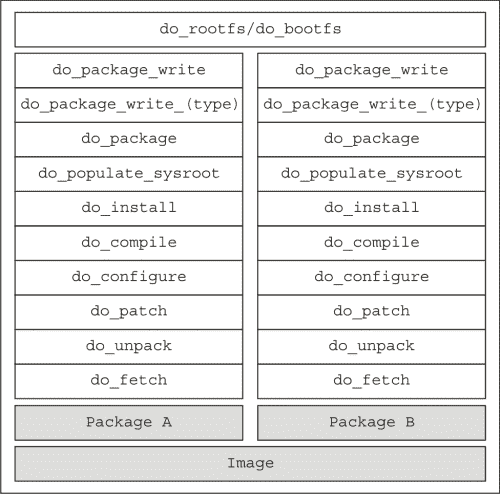
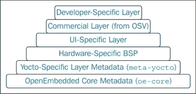

# 一、引言

在本章中，您将看到 Linux 和开源开发的优势。 将会有大量嵌入式硬件平台支持的运行嵌入式 Linux 的系统的例子。 在此之后，您将了解嵌入式 Linux 系统的体系结构和开发环境，并在最后介绍 Yocto 项目，其中总结了其 POKY 构建系统的属性和用途。

# Linux 和开源系统的优势

本书中提供的大多数信息以及作为练习提供的示例都有一个共同点：任何人都可以免费访问这些信息。 本书试图为您提供指导，告诉您如何与现有的、可免费获得的软件包进行交互，这些软件包可以帮助嵌入式工程师(如您)，同时也试图激发您的好奇心来了解更多信息。

### 备注

更多关于开源的信息可以在[http://opensource.org/](http://opensource.org/)上从**开放源码倡议**(**OSI**)收集。

开源的主要优势表现在它允许开发人员更多地专注于他们的产品和附加值。 拥有开源产品提供了获得各种新的可能性和机会的途径，例如降低许可成本、提高技能和对公司的了解。 事实上，一家公司使用的是大多数人都能访问并能理解其工作原理的开源产品，这意味着节省了预算。 省下来的钱可以用在其他部门，比如硬件或收购。

通常，人们有一种误解，认为开源很少或根本不能控制产品。 然而，事实恰恰相反。 一般来说，开放源码系统提供对软件的完全控制，我们将演示这一点。 对于任何软件，您的开放源码项目都驻留在一个存储库中，每个人都可以访问该存储库。 既然你既是项目的负责人，又是项目的管理者，你在世界上有权接受别人的贡献，这给了他们和你一样的权利，这基本上给了你想做什么就做什么的自由。 当然，可能会有人受到您的项目的启发，可以做一些开源社区更欣赏的事情。 然而，这就是进步的方式，而且，完全诚实地说，如果你是一家公司，这种情况几乎是无效的。 即使在这种情况下，这种情况也不意味着您的项目的死亡，而是一个机会。 在此，我想引述如下：

|   | *“如果你想构建一个开源项目，你不能让你的自尊心妨碍你。你不能重写每个人的补丁，你不能事后猜测每个人，你必须给予人们平等的控制权。”* |   |
|   | --*-Rasmus Lerdorf* |

允许访问其他人，在您的开源软件上执行外部帮助、修改、调试和优化，这意味着产品的寿命更长，质量也会随着时间的推移而提高。 同时，开放源码环境提供了对各种组件的访问，如果需要的话，这些组件可以很容易地集成到您的产品中。 这可以实现快速的开发过程，降低成本，还可以将大量的维护和开发工作从您的产品中转移出来。 此外，它还提供了支持特定组件的可能性，以确保它继续满足您的需求。 但是，在大多数情况下，您需要花费一些时间从零开始为您的产品构建此组件。

这给我们带来了开源的下一个好处，它涉及到我们产品的测试和质量保证。 除了测试所需的工作量较少外，在决定哪些组件最适合我们的产品之前，还可以从多个选项中进行选择。 此外，使用开源软件比购买和评估专有产品更便宜。 这是一个在开源社区中可以看到的、能够产生更高质量和更成熟产品的过程。 这一质量甚至比其他专有或封闭源代码的类似产品更好。 当然，这并不是一个普遍有效的肯定，只有在成熟和广泛使用的产品中才会发生这种情况，但这里似乎出现了社区和基础这个术语在发挥作用。

一般来说，开源软件是在开发人员和用户社区的帮助下开发的。 该系统提供了对直接来自开发人员的工具交互的更大支持--这是在使用封闭源码工具时不会发生的事情。 此外，无论你是否在一家公司工作，在寻找问题的答案时都没有任何限制。 成为开源社区的一部分不仅仅意味着修复错误、报告错误或开发特性。 它是关于开发人员增加的贡献，但同时也为工程师提供了在工作环境之外获得认可的可能性，通过面对新的挑战和尝试新的事物。 它也可以被视为一个很好的激励因素，是每个参与这一过程的人的灵感源泉。

我想引用的不是结论，而是人的一句话，他构成了这个过程的核心，他为我们提供了 Linux 并使其保持开放源码：

|   | ***“我认为，从根本上讲，开源软件确实倾向于更稳定的软件。这是正确的做事方式。”*** |   |
|   | --*-Linus Torvalds* |

# 嵌入式系统

既然已经向您介绍了开源的好处，我相信我们可以介绍一些嵌入式系统、硬件、软件及其组件的示例。 首先，嵌入式设备在我们身边随处可见：看看你的智能手机、汽车信息娱乐系统、微波炉，甚至你的 MP3 播放器。 当然，并不是所有的操作系统都有资格成为 Linux 操作系统，但它们都有嵌入式组件，使它们有可能实现其设计的功能。

## 一般说明

要让 Linux 在任何设备硬件上运行，您将需要一些硬件相关的组件，这些组件能够为硬件无关的组件抽象工作。 引导加载程序、内核和工具链包含依赖于硬件的组件，这些组件使所有其他组件的工作性能更轻松。 例如，BusyBox 开发人员将只专注于开发其应用程序所需的功能，而不会专注于硬件兼容性。 所有这些依赖于硬件的组件都支持多种 32 位和 64 位硬件体系结构。 例如，当涉及到源代码检查时，U-Boot 实现是最容易作为示例的。 由此，我们可以很容易地想象如何添加对新设备的支持。

我们现在将尝试做一些前面介绍的小练习，但在继续进行之前，我必须介绍我将继续在其上做练习的计算机配置，以确保您遇到的问题尽可能少。 我正在使用 Ubuntu14.04，并且已经下载了 Ubuntu 网站[http://www.ubuntu.com/download/desktop](http://www.ubuntu.com/download/desktop)上提供的 64 位映像。

可以使用以下命令收集与您的计算机上运行的 Linux 操作相关的信息：

```sh
uname –srmpio

```

前面的命令生成以下输出：

```sh
Linux 3.13.0-36-generic x86_64 x86_64 x86_64 GNU/Linux

```

收集与 Linux 操作相关的信息的下一个命令如下：

```sh
cat /etc/lsb-release

```

前面的命令生成以下输出：

```sh
DISTRIB_ID=Ubuntu
DISTRIB_RELEASE=14.04
DISTRIB_CODENAME=trusty
DISTRIB_DESCRIPTION="Ubuntu 14.04.1 LTS"

```

## 示例

现在，将转到练习，第一个练习要求您获取 U-Boot 包的`git`存储库源代码：

```sh
sudo apt-get install git-core
git clone http://git.denx.de/u-boot.git

```

当源代码在您的机器上可用后，您可以尝试查看`board`目录；在这里，将有许多开发板制造商在场。 让我们看看`board/atmel/sama5d3_xplained`、`board/faraday/a320evb`、`board/freescale/imx`和`board/freescale/b4860qds`。 通过观察这些目录中的每一个，可以可视化模式。 几乎所有的主板都包含一个`Kconfig`文件，该文件的灵感主要来自内核源，因为它们以更清晰的方式呈现了配置依赖关系。 `maintainers`文件提供了一个列表，其中列出了特定董事会支持的贡献者。 基本`Makefile`文件从更高级别的 Make 文件中获取必要的目标文件，这些文件是在构建特定于线路板的支持后获得的。 不同之处在于`board/freescale/imx`，它只提供一个配置数据列表，稍后将由高级生成文件使用。

在内核级别，依赖于硬件的支持被添加到`arch`文件中。 这里，除了`Makefile`和`Kconfig`之外，对于每个特定的体系结构，还可以添加各种数量的子目录。 它们为内核的不同方面提供支持，例如引导、内核、内存管理或特定应用程序。

通过克隆内核源代码，可以使用以下代码轻松地可视化上述信息：

```sh
git clone https://git.kernel.org/pub/scm/linux/kernel/git/torvalds/linux.git

```

一些可以可视化的目录是`arch`/`arc`和`arch`/`metag`。

从工具链的观点来看，依赖于硬件的组件由 GNU C 库表示，而 GNU C 库通常由`glibc`表示。 这提供了连接到内核架构相关代码的系统调用接口，并进一步向用户应用程序提供了这两个实体之间的通信机制。 如果克隆了`glibc`源，则系统调用会出现在`glibc`源的`sysdeps`目录中，如下所示：

```sh
git clone http://sourceware.org/git/glibc.git

```

可以使用两种方法验证上述信息：第一种方法涉及打开`sysdeps/arm`目录或读取`ChangeLog.old-ports-arm`库。 尽管它很旧，并且没有链接(如 port directory)，这些链接从较新版本的存储库中消失了，但后者仍然可以用作参考点。

使用 Yocto项目的`poky`存储库也可以非常轻松地访问这些包。 正如在[https://www.yoctoproject.org/about](https://www.yoctoproject.org/about)中提到的：

> *Yocto 项目是一个开源合作项目，它提供模板、工具和方法，帮助您为嵌入式产品创建定制的基于 Linux 的系统，而不考虑硬件架构。该项目成立于 2010 年，是许多硬件制造商、开源操作系统供应商和电子公司的合作项目，目的是为混乱的嵌入式 Linux 开发带来一些秩序。*

任何人与 Yocto 项目的大多数交互都是通过 POKY 构建系统完成的，该系统是其核心组件之一，提供了生成完全可定制的 Linux 软件堆栈所需的特性和功能。 确保与存储库源进行交互所需的第一步是克隆它们：

```sh
git clone -b dizzy http://git.yoctoproject.org/git/poky

```

当源代码出现在您的计算机上之后，需要检查一组配方和配置文件。 第一个可以检查的位置是 U-Boot 配方，可在`meta/recipes-bsp/u-boot/u-boot_2013.07.bb`找到。 它包含为相应的选定机器构建 U-Boot 软件包所需的说明。 下一个要检查的地方是内核中可用的食谱。 在这里，工作很少，而且有更多的包版本可用。 它还为可用的食谱提供了一些`bbappends`，比如 meta`/recipes-kernel/linux/linux-yocto_3.14.bb`和`meta-yocto-bsp/recipes-kernel/linux/linux-yocto_3.10.bbappend`。 这是使用 BitBake 开始新构建时可用的内核包版本之一的一个很好的例子。

工具链的构建是主机生成包的重要一步。 要做到这一点，需要一组包，比如`gcc`、`binutils`、`glibc``library`和`kernel headers`，它们扮演着重要的角色。 在`meta/recipes-devtools/gcc/`、`meta/recipes-devtools/binutils`和`meta/recipes-core/glibc`路径中可以找到与该包对应的配方。 在所有可用的地方，都可以找到很多食谱，每个食谱都有特定的用途。 这些信息将在下一章中详细介绍。

用于选择一个包版本而选择另一个包版本的配置和选项主要添加在机器配置中。 Yocto 1.6 支持的 Freescale`MPC8315E-rdb`低功耗型号就是一个这样的例子，它的机器配置可以在`meta-yocto-bsp/conf/machine/mpc8315e-rdb.conf` 文件中找到。

### 备注

有关此开发板的更多信息，请参阅[http://www.freescale.com/webapp/sps/site/prod_summary.jsp?code=MPC8315E](http://www.freescale.com/webapp/sps/site/prod_summary.jsp?code=MPC8315E)。

# GNU/Linux 简介

GNU/Linux，也就是通常所说的 Linux，代表着一个有着悠久传统的名字，是开放源码软件最重要的联盟之一。 简而言之，将向您介绍当今提供给世界各地的人们的历史，以及在选择个人计算机操作系统方面的可用选择。 最重要的是，我们将看看为硬件开发人员提供了什么，以及平台开发的共同点。

GNU/Linux 由 Linux 内核组成，并且有一组放在 GNU C 库之上的用户空间应用程序；它充当计算机操作系统。 它可以被认为是开放源码和自由软件中最多产的实例之一，但它仍在开发中。 它的历史始于 1983 年，当时理查德·斯托尔曼(Richard Stallman)创立了 GNU 项目，目标是开发一个完整的类似 Unix 的操作系统，只有通过自由软件才能组装起来。 到 20 世纪 90 年代初，GNU 已经提供了一系列库、类 Unix shell、编译器和文本编辑器。 然而，它缺少内核。 1990 年，他们开始开发自己的内核--赫德。 该内核基于 Mach 微内核设计，但事实证明它很难使用，并且开发过程缓慢。

与此同时，1991 年，一名芬兰学生在赫尔辛基大学学习期间，作为业余爱好开始研究另一个内核。 他还通过互联网得到了为这项事业做出贡献的各种程序员的帮助。 那个学生的名字叫 Linus Torvalds，1992 年，他的内核与 GNU 系统相结合。 其结果是一个名为 GNU/Linux 的全功能操作系统，它是免费和开源的。 GNU 系统最常见的形式通常被称为*GNU/Linux 系统*，甚至是*Linux 发行版*，并且是 GNU 最流行的变体。 今天，有大量基于 GNU 和 Linux 内核的发行版，使用最广泛的有：Debian、Ubuntu、Red Hat Linux、SuSE、Gentoo、Mandriva 和 Slackware。 此图向我们展示了Linux 的两个组件如何协同工作：


虽然最初的设想不是在 x86 PC 之外的任何其他操作系统上运行，但如今，Linux 操作系统是最广泛和可移植的操作系统。 它既可以在嵌入式设备上找到，也可以在超级计算机上找到，因为它为用户和开发人员提供了自由。 拥有生成可定制 Linux 系统的工具是该工具开发过程中又向前迈出的一大步。 它为新类别的人提供了访问 GNU/Linux 生态系统的途径，这些人通过使用 BitBake 等工具，最终可以更多地了解 Linux、它的体系结构差异、根文件系统的构建和配置、工具链以及 Linux 世界中的许多其他东西。

Linux 不是为在微控制器上工作而设计的。 如果它的 RAM 少于 32MB，它将无法正常工作，并且它将需要至少 4MB 的存储空间。 然而，如果你看一下这个要求，你会注意到它是非常宽松的。 除此之外，它还提供对各种通信外设和硬件平台的支持，这让您清楚地了解了为什么它被如此广泛地采用。

### 备注

嗯，它可以在 8MB 的 RAM 上运行，但这也取决于应用程序的大小。

在嵌入式环境中使用 Linux 架构需要某些标准。 这张图片用图形表示了免费电子 Linux 课程之一提供的环境：


上图显示了在嵌入式设备领域使用 Linux 时开发过程中涉及的两个主要组件：

*   **主机**：这是所有开发工具所在的机器。 在Yocto 之外，这些工具由为特定目标及其必要的应用程序源代码和补丁交叉编译的相应工具链表示。 然而，对于 Yocto 用户来说，所有这些包以及涉及的准备工作都被简化为在执行实际工作之前执行的自动化任务。 当然，这一点必须得到充分的优先考虑。
*   **Target machine**: This is the embedded system on which the work is done and tested. All the software available on the target is usually cross-compiled on the host machine, which is a more powerful and more efficient environment. The components that are usually necessary for an embedded device to boot Linux and operate various application, involve using a bootloader for basic initiation and loading of the Linux kernel. This, in turn, initializes drivers and the memory, and offers services for applications to interact with through the functions of the available C libraries.

    ### 备注

    还有其他处理嵌入式设备的方法，例如跨加拿大开发和本地开发，但这里介绍的方法是最常用的，并且在嵌入式设备的软件开发方面为开发人员和公司提供了最好的结果。

要在开发板上安装功能的 Linux 操作系统，开发人员在开始开发和集成其他应用程序和库之前，首先需要确保内核、引导加载程序和主板对应的驱动程序工作正常。

# Yocto 项目简介

在上一节中，我们介绍了拥有开放源码环境的好处。 看看在 Yocto 项目出现之前嵌入式开发是如何进行的，可以全面了解该项目的好处。 它还给出了一个答案，为什么它被采用得如此之快，而且数量如此之大。

使用 Yocto 项目，整个过程变得更加自动化，主要是因为工作流程允许这样做。 手动操作需要开发人员执行许多步骤：

1.  选择并下载必要的软件包和组件。
2.  配置下载的软件包。
3.  编译配置的软件包。
4.  在开发机器上可用的`rootfs`上安装生成的二进制文件、库等。
5.  生成最终的可部署格式。

随着最终可部署状态中需要引入的软件包数量的增加，所有这些步骤往往会变得更加复杂。 考虑到这一点，可以清楚地说，手工工作只适用于少数组件；自动化工具通常是大型和复杂系统的首选工具。

在过去的十年中，许多自动化工具可以用来生成嵌入式 Linux 发行版。 它们都基于与前面描述的相同的策略，但它们还需要一些额外的信息来解决与依赖相关的问题。 这些工具都是围绕任务执行引擎构建的，包含描述操作、依赖项、异常和规则的元数据。

最著名的解决方案是 Buildroot、Linux Target Image Builder(LTIB)、Scratchbox、OpenEmbedded、Yocto 和 Angstrom。 然而，Scratchbox 似乎不再活跃，上一次提交是在 2012 年 4 月。 LTIB 是 Freescale 的首选构建工具，最近它更倾向于 Yocto；在很短的时间内，LTIB 可能也会被弃用。

## Buildroot

Buildroot as是一个工具，它试图简化使用交叉编译器生成 Linux 系统的方式。 Buildroot 能够生成引导加载程序、内核映像、根文件系统，甚至可以生成交叉编译器。 它可以生成这些组件中的每一个，尽管它是以独立的方式生成的，因此，它的主要用途被限制在一个交叉编译的工具链上，该工具链可以生成相应的自定义根文件系统。 它主要用于嵌入式设备，很少用于 x86 体系结构；它主要关注的是体系结构，如 ARM、PowerPC 或 MIPS。 与本书中介绍的每个工具一样，它被设计为在 Linux 上运行，主机系统上应该存在某些包以便正确使用。 有几个必备套餐和一些可选套餐。

有一个包含特定软件包的必备软件包列表，并在[http://buildroot.org/downloads/manual/manual.html](http://buildroot.org/downloads/manual/manual.html)上的 Buildroot 手册中进行了描述。 这些软件包如下：

*   `which`
*   `sed`
*   `make`(版本 3.81 或更高版本)
*   `binutils`
*   `build-essential`(仅 Debian 系统需要)
*   `gcc`(2.95 版或更高版本)
*   `g++`(2.95 版或更高版本)
*   `bash`
*   `patch`
*   `gzip`
*   `bzip2`
*   `perl`(版本 5.8.7 或更高版本)
*   `tar`
*   `cpio`
*   `python`(版本 2.6 或 2.7)
*   `unzip`
*   `rsync`
*   `wget`

除了这些必备套餐外，还有许多可选套餐。 它们对以下方面非常有用：

*   **源代码获取工具**：在官方的树中，大多数包检索都是使用`http`、`https`甚至`ftp`链接中的`wget`来完成的，但也有几个链接需要版本控制系统或其他类型的工具。 要确保用户没有获取包的限制，可以使用以下工具：
    *   `bazaar`
    *   `cvs`
    *   `git`
    *   `mercurial`
    *   `rsync`
    *   `scp`
    *   `subversion`
*   **接口配置依赖关系**：它们由确保任务(如内核、BusyBox 和 U-Boot 配置)顺利执行所需的软件包表示：
    *   `ncurses5`用于 menuconfig 接口
    *   `qt4`用于`xconfig`接口
    *   `glib2`、`gtk2`和`glade2`用于`gconfig`接口
*   **与 Java 相关的包交互**：这用于确保当用户想要与 Java 类路径组件交互时，它将不会出现任何问题：
    *   `javac`：指的是 Java 编译器
    *   `jar`：指 Java 归档工具
*   **图形生成工具**：图形生成工具如下：
    *   `graphviz`使用`graph-depends`和`<pkg>-graph-depends`
    *   `python-matplotlib`使用`graph-build`
*   **文档生成工具**：以下是文档生成过程所需的工具：
    *   `asciidoc`，8.6.3 版或更高版本
    *   `w3m`
    *   `python`使用`argparse`模块(2.7+和 3.2+版本自动提供)
    *   `dblatex`(仅 pdf 手动生成时需要)

Buildroot 版本在[http://buildroot.org/downloads/](http://buildroot.org/downloads/)每三个月向开放源码社区提供，特别是在 2 月、5 月、8 月和 11 月，版本名称的格式为`buildroot-yyyy-mm`。 对于有兴趣尝试 Buildroot 的人来说，上一节中介绍的手册应该是安装和配置的起点。 对 Buildroot 源代码感兴趣的开发人员可以参考[http://git.buildroot.net/buildroot/](http://git.buildroot.net/buildroot/)。

### 备注

在克隆 Buildroot 源代码之前，我建议快速浏览一下[http://buildroot.org/download](http://buildroot.org/download)。 它可以帮助任何使用代理服务器工作的人。

接下来，我们将介绍一组新的工具，这些工具为该领域带来了贡献，并将 Buildroot 项目置于较低的支持级别。 我认为需要对这些工具的优点和缺点进行快速审查。 我们将从 Scratchbox 开始，考虑到它已经被弃用，所以没有什么可说的；提到它纯粹是出于历史原因。 接下来是 LTIB，它构成了飞思卡尔硬件的标准，直到 Yocto 被采用。 它得到了Freescale 在**Board Support Packages**(**BSPs**)方面的良好支持，并且包含一个庞大的组件数据库。 另一方面，它是相当旧的，它被换成了 Yocto。 它不包含对新发行版的支持，也没有被许多硬件提供商使用，而且在短时间内，它很可能会像 Scratchbox 一样被弃用。 Buildroot 是其中的最后一个，并且易于使用，它有一个`Makefile`基本格式和一个活跃的社区支持。 然而，它仅限于更小、更简单的映像或设备，并且它不知道部分构建或包。

## OpenEmbedded

接下来要引入的工具非常紧密地联系在一起，事实上，它们有着相同的灵感和共同的祖先，即 OpenEmbedded 项目。 所有三个项目都由称为 Bitbake 的公共引擎链接，并且灵感来自 Gentoo Porage 构建工具。 OpenEmbedded 最初是在 2001 年开发的，当时夏普公司推出了基于 ARM 的 PDA 和 SL-5000 Zaurus，后者运行嵌入式 Linux 发行版 Lineo。 在引入 Sharp Zaurus 之后，Chris Larson 很快就发起了 OpenZaurus 项目，该项目旨在取代基于 Buildroot 的 SharpROM。 在此之后，人们开始贡献更多的软件包，甚至对新设备的支持，最终，系统开始显示出它的局限性。 2003 年，围绕一个新的构建系统展开了讨论，该系统可以提供通用的构建环境，并合并开放源码社区所要求的使用模型；这就是用于嵌入式 Linux 发行版的系统。 这些讨论从 2003 年开始显示结果，今天出现的是 OpenEmbedded 项目。 根据新构建系统的功能，它有一些从 OpenZaurus 移植的包，比如 Chris Larson、Michael Lauer 和 Holger Schurig。

Yocto 项目是同一项目的下一个发展阶段，其核心是由 Richard Purdie 创建的 POTY 构建系统。 该项目最初是 OpenEmbedded 项目的一个稳定分支，只包括 OpenEmbedded 上提供的众多食谱中的一个子集；它也只有一组有限的设备和对体系结构的支持。 随着时间的推移，它变得远远不止于此：它变成了一个软件开发平台，其中包含了 fakeroot 替代品、Eclipse 插件和基于 QEMU 的映像。 Yocto 项目和 OpenEmbedded 现在都围绕一组名为**OpenEmbedded-Core**(**OE-Core**)的核心元数据协调。

Yocto 项目由 Linux 基金会赞助，为希望在与硬件无关的**环境**中为嵌入式产品开发定制发行版的 Linux 嵌入式系统开发人员提供了一个起点。 POKY 构建系统是其核心组件之一，也相当复杂。 所有这一切的核心是 Bitbake，它是驱动一切的引擎，是处理元数据、下载相应源代码、解析依赖项并相应地将所有必要的库和可执行文件存储在 build 目录中的工具。 POKY 将 OpenEmbedded 的优点与分层附加软件组件的想法结合在一起，这些附加软件组件可以根据开发人员的需要在构建环境配置中添加或删除。

POKY 是以简单性为理念开发的构建系统。 默认情况下，测试构建的配置只需要很少的用户交互。 在前面某个练习中所做克隆的基础上，我们可以做一个新的练习来强调这个概念：

```sh
cd poky
source oe-init-build-env ../build-test
bitbake core-image-minimal

```

如这个示例所示，很容易获得一个 Linux 映像，稍后可以使用该映像在 QEMU 环境中进行测试。 有许多可用图像，从 shell 可访问的最小图像到具有 GNOME Mobile 用户界面支持的 LSB 兼容图像，都会有所不同。 当然，这些基本图像可以导入到新的图像中以增加功能。 POKY 的分层结构是一个很大的优势，因为它增加了扩展功能和遏制错误影响的可能性。 层可用于所有类型的功能，从添加对新硬件平台的支持到扩展对工具的支持，以及从新的软件堆栈到扩展的映像功能。 天空是这里的极限，因为几乎任何食谱都可以与另一种食谱相结合。

所有这些都是可能的，因为 Bitbake 引擎在满足环境设置和最小系统要求的测试之后，根据收到的配置文件和输入，识别任务之间的相互依赖关系，任务的执行顺序，生成一个全功能的交叉编译环境，并开始构建所需的本机和特定于目标的包任务，与开发人员定义的完全相同。 下面是一个示例，其中包含包的可用任务列表：



### 备注

关于 Bitbake 及其烘焙过程的更多信息可以在*Embedded Linux Development with Yocto Project*中找到，作者是 Otavio 萨尔瓦多和 Daiane Angini。

元数据模块化基于两个想法-第一个是指确定层结构优先级的可能性，第二个是指当食谱需要更改时不需要重复工作的可能性。 这些层是重叠的。 最通用的层是 META，所有其他层通常都堆叠在上面，例如`meta-yocto`，其中包含特定于 Yocto 的食谱、特定于机器的板卡支持包，以及其他可选的层，具体取决于开发人员的要求和需要。 配方的定制应该使用位于上层的`bbappend`来完成。 这种方法是首选的，以确保不会发生食谱重复，而且它还有助于支持较新和较旧版本的食谱。

在前面的示例中找到了层组织的示例，该示例指定了包的可用任务列表。 如果用户有兴趣确定上一练习中指定包的可用任务列表的`test`构建设置使用的层，则`bblayers.conf`文件是一个很好的灵感来源。 如果对该文件执行`cat`操作，将会看到以下输出：

```sh
# LAYER_CONF_VERSION is increased each time build/conf/bblayers.conf
# changes incompatibly
LCONF_VERSION = "6"

BBPATH = "${TOPDIR}"
BBFILES ?= ""

BBLAYERS ?= " \
  /home/alex/workspace/book/poky/meta \
  /home/alex/workspace/book/poky/meta-yocto \
  /home/alex/workspace/book/poky/meta-yocto-bsp \
  "
BBLAYERS_NON_REMOVABLE ?= " \
  /home/alex/workspace/book/poky/meta \
  /home/alex/workspace/book/poky/meta-yocto \
  "
```

执行此操作的完整命令为：

```sh
cat build-test/conf/bblayers.conf

```

下面是一个更通用的构建目录的分层结构的可视化模式：



Yocto 作为项目提供了另一个重要特性：无论主机上的因素发生什么变化，都可以以相同的方式重新生成图像。 这是一个非常重要的特性，不仅考虑到在开发过程中可能会对许多工具(如`autotools`、`cross-compiler`、`Makefile`、`perl`、`bison`、`pkgconfig`等)进行更改，而且还考虑到参数可能在与存储库的交互过程中发生更改。 简单地克隆其中一个存储库分支并应用相应的补丁程序可能不能解决所有问题。 Yocto 项目对这些问题的解决方案非常简单。 通过在安装的任何步骤之前将参数定义为配方中的变量和配置参数，并确保配置过程也是自动化的，将使手动交互的风险降至最低。 此过程可确保图像生成始终与第一次一样。

由于主机上的开发工具很容易更改，因此 Yocto 通常编译包和映像开发过程所需的工具，只有在它们的构建过程完成后，Bitbake 构建引擎才开始构建所请求的包。 这种与开发人员机器的隔离通过保证来自主机的更新不会影响或影响生成嵌入式 Linux 发行版的过程，从而帮助开发过程。

Yocto 项目很好地解决了另一个关键点，那就是工具链处理头和库的包含的方式；因为这不仅会在以后导致编译，还会导致非常难以预测的执行错误。 Yocto 通过将所有头文件和库移动到相应的`sysroots`目录中来解决这些问题，并使用`sysroot`选项确保构建过程不会对本机组件造成污染。 举个例子可以更好地强调这一信息：

```sh
ls -l build-test/tmp/sysroots/
total 12K
drwxr-xr-x 8 alex alex 4,0K sep 28 04:17 qemux86/
drwxr-xr-x 5 alex alex 4,0K sep 28 00:48 qemux86-tcbootstrap/
drwxr-xr-x 9 alex alex 4,0K sep 28 04:21 x86_64-linux/

ls -l build-test/tmp/sysroots/qemux86/ 
total 24K
drwxr-xr-x 2 alex alex 4,0K sep 28 01:52 etc/
drwxr-xr-x 5 alex alex 4,0K sep 28 04:15 lib/
drwxr-xr-x 6 alex alex 4,0K sep 28 03:51 pkgdata/
drwxr-xr-x 2 alex alex 4,0K sep 28 04:17 sysroot-providers/
drwxr-xr-x 7 alex alex 4,0K sep 28 04:16 usr/
drwxr-xr-x 3 alex alex 4,0K sep 28 01:52 var/

```

Yocto 项目有助于进行可靠的嵌入式 Linux开发，由于其规模，它被用于很多事情，从硬件公司的板级支持包到软件开发公司的新软件解决方案。 Yocto 不是一个完美的工具，它有一些缺点：

*   对磁盘空间和机器使用的要求相当高
*   缺少有关高级用法的文档
*   Autobuilder 和 Eclipse 插件等工具现在存在功能问题

还有其他困扰开发人员的事情，比如`ptest`集成和 SDK sysroot 缺乏可扩展性，但其中一部分问题已经由项目背后的大社区解决了，在项目显示出它的局限性之前，新的项目仍然需要等待来取代它的位置。 在此之前，Yocto 是用于开发定制嵌入式 Linux 发行版或基于 Linux 的产品的框架。

# 摘要

在本章中，我们向您介绍了开源的优势，以及开源如何帮助 Linux 内核、Yocto Project、OpenEmbedded 和 Buildroot 开发和发展项目(如 LTIB 和 Scratchbox)的示例；由于缺乏开源贡献，它们将随着时间的推移逐渐过时和消失。 呈现给您的信息将以示例的形式呈现，这将使您对本书中的概念有更清晰的理解。

在下一章中，将有更多关于工具链及其组成组件的信息。 将使用手动和自动方法生成让您对工具链有更好了解的练习。