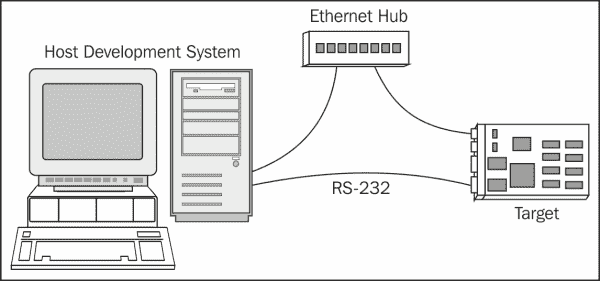

# 第二章：交叉编译

在本章中，您将了解工具链、如何使用和自定义工具链，以及如何将代码标准应用于工具链。 工具链包含大量工具，如编译器、链接器、汇编器、调试器和各种其他实用程序，这些工具有助于操作生成的应用程序二进制文件。 在本章中，您将学习如何使用 GNU 工具链并熟悉其功能。 您将看到涉及手动配置的示例，同时，这些示例将移到 Yocto Project 环境中。 在本章的最后，我们将对工具链的手动部署和自动部署进行分析，以确定它们之间的异同，以及可用于工具链的各种使用场景。

# 工具链简介

工具链表示编译器及其相关实用程序，用于生成特定目标所需的内核、驱动程序和应用程序。 工具链通常包含一组通常相互链接的工具。 它由`gcc`、`glibc`、`binutils`或其他可选工具组成，例如用于特定编程语言(如 C++、Ada、Java、Fortran 或 Objective-C)的调试器可选编译器。

通常，在传统台式机或服务器上提供的工具链在这些机器上执行，并生成可在同一系统上运行的可执行文件和库。 通常用于嵌入式开发环境的工具链称为交叉工具链。 在这种情况下，GCC 等程序在主机系统上针对特定的目标体系结构运行，并为该体系结构生成二进制代码。 整个过程被称为交叉编译，这是为嵌入式开发构建源代码的最常见方式。



在工具链环境中，有三种不同的机器可用：

*   构建计算机，表示在其上创建工具链的计算机
*   主机，表示执行工具链的机器
*   表示工具链为其生成二进制代码的计算机的目标计算机[T0

这三台机器用于生成四种不同的工具链构建过程：

*   **原生工具链**：这通常在普通 Linux 发行版或您的普通桌面系统上可用。 这通常是编译和运行的，并为相同的体系结构生成代码。
*   **跨本机工具链**：这表示构建在一个系统上的工具链，尽管它为目标系统运行并生成二进制代码。 通常的用例是在目标系统上需要本机`gcc`，而不是在目标平台上构建它。
*   **交叉编译工具链**：这是嵌入式开发中使用最广泛的工具链类型。 它在体系结构类型(通常为 x86)上编译和运行，并为目标体系结构生成二进制代码。
*   **跨加拿大构建**：此表示涉及在系统 A 上构建工具链的过程。然后，此工具链在另一个系统(如 B)上运行，生成第三个系统(称为 C)的二进制代码。这是使用率最低的构建过程之一。

生成四种不同工具链构建过程的三台机器如下图所示：


TOOLCHAINS代表了一系列工具，这些工具使得今天可用的大多数伟大项目的存在成为可能。 这也包括开源项目。 如果没有相应的工具链，这种多样性是不可能的。 这也发生在嵌入式世界中，新可用的硬件需要其**板支持包**(**BSP**)的相应工具链的组件和支持。

工具链配置并非易事。 在开始搜索预先构建的工具链之前，甚至在您自己构建工具链之前，最好的解决方案是检查目标特定的 BSP；每个开发平台通常都提供一个。

# 工具链组件

GNU 工具链是一个术语，表示**GNU Project 保护伞**下的一组编程工具。 这套工具通常被称为**工具链**，用于开发应用程序和操作系统。 它在嵌入式系统特别是 Linux 系统的开发中扮演着重要的角色。

GNU 工具链中包括以下项目：

*   **GNU make**：这个表示用于编译和构建的自动化工具
*   **GNU 编译器集合(GCC)**：这表示用于种可用编程语言的编译器套件
*   **GNU Binutils**：此包含链接器、汇编器等工具-这些工具能够操作二进制文件
*   **GNU Bison**：这个是一个解析器生成器
*   **GNU Debugger(Gdb)**：这个是一个代码调试工具
*   **GNU M4**：这个是 M4 宏处理器
*   **GNU 构建系统(Autotools)**：此由以下内容组成：
    *   自动会议
    *   自动标题
    *   汽车制造
    *   Libtool

下图描述了工具链中包含的项目：


嵌入式开发环境需要的不仅仅是交叉编译工具链。 它需要库，并且应该针对特定于系统的包，如程序、库和实用程序，以及宿主特定的调试器、编辑器和实用程序。 在某些情况下，通常在谈论公司的环境时，许多服务器托管目标设备，并且某些硬件探针通过以太网或其他方法连接到主机。 这强调了这样一个事实，即嵌入式发行版包括大量工具，并且通常需要对其中的许多工具进行定制。 要把这些都呈现出来，需要的不仅仅是一本书中的一章。

然而，在本书中，我们将只介绍工具链构建组件。 其中包括以下内容：

*   `binutils`
*   `gcc`
*   `glibc`(C 磅)
*   内核头

我将从开始介绍这个列表中的第一个项目，**GNU Binutils 包**。 它是在 GNU GPL 许可下开发的，它代表了一组用于创建和管理给定体系结构的二进制文件、目标代码、汇编文件和概要数据的工具。 以下是 GNU Binutils 软件包可用工具的功能和名称列表：

*   GNU 链接器，即`ld`
*   GNU汇编程序，即`as`
*   将地址转换为文件名和行号的实用程序，即`addr2line`
*   用于创建、解压缩和修改归档的实用程序，即`ar`
*   用于列出目标文件内可用符号的工具，即`nm`
*   复制和翻译目标文件，即`objcopy`
*   显示来自目标文件的信息，即`objdump`
*   为档案内容生成索引，即`ranlib`
*   显示来自任何 ELF 格式目标文件的信息，即`readelf`
*   列出对象或归档文件的节大小，即`size`
*   列出文件中的可打印字符串，即`strings`
*   丢弃符号实用程序，即`strip`
*   过滤或解角编码的 C++符号，即`c++filt`
*   创建使用 DLL 生成的文件，即`dlltool`
*   一个新的、速度更快、仅限 ELF 的链接器，它仍处于 Beta 测试阶段，即`gold`
*   显示简档信息工具，即`gprof`
*   将目标代码转换为 NLM，即`nlmconv`
*   Windows 兼容的消息编译器，即`windmc`
*   Windows 资源文件的编译器，即`windres`

这些工具中的大多数使用**二进制文件描述符**(**BFD**)库来进行低级数据操作，而且，它们中的许多都使用`opcode`库来汇编和反汇编操作。

### 备注

有关`binutils`的有用信息可以在[http://www.gnu.org/software/binutils/](http://www.gnu.org/software/binutils/)中找到。

在工具链生成过程中，列表中的下一项由内核标头表示，C 库需要它们来与内核交互。 在编译相应的 C 库之前，需要提供内核头，以便它们可以提供对可用的系统调用、数据结构和常量定义的访问。 当然，任何 C 库都定义了特定于每个硬件体系结构的规范集；在这里，我指的是指的是**应用程序二进制接口**(**ABI**)。

应用程序二进制接口(ABI)表示两个模块之间的接口。 它提供了有关如何调用函数以及应该在组件之间或向操作系统传递的信息类型的信息。 参考一本书，如*The Linux Kernel Primer*，对您有好处，在我看来，这是 ABI 提供的完整指南。 我会试着为你重现这个定义。

ABI 可以看作是一组类似于协议或协议的规则，它为链接器提供了将编译后的模块组合到一个组件中的可能性，而不需要重新编译。 同时，ABI 描述了这些组件之间的二进制接口。 拥有这种约定并遵循 ABI 提供了链接本可以用不同编译器编译的目标文件的好处。

从这两个定义可以很容易地看出，ABI 依赖于平台类型，平台类型可以包括物理硬件、某种类型的虚拟机等等。 它还可能依赖于使用的编程语言和编译器，但大部分依赖于平台。

ABI 展示了生成的代码是如何运行的。 代码生成过程还必须知道 ABI，但是当用高级语言编写代码时，关注 ABI 很少是问题。 这些信息可以被认为是指定某些 ABI 相关选项的必要知识。

作为一般规则，ABI 必须因其与外部组件的交互而受到尊重。 然而，关于与其内部模块的交互，用户可以自由地做他或她想做的任何事情。 基本上，他们能够重新发明 ABI，并形成自己对机器局限性的依赖。 这里的简单例子与属于自己国家或地区的各种公民有关，因为他们从出生起就学习和了解该地区的语言。 因此，他们能够相互理解，沟通没有问题。 外部公民要能够交流，他或她需要懂一个地区的语言，而身处这个社区似乎是很自然的，所以这不会构成问题。 编译器还能够设计自己的自定义调用约定，在这种约定下，它们知道模块中调用的函数的限制。 此练习通常是出于优化原因而进行的。 然而，这可以被认为是对 ABI 术语的滥用。

引用用户空间 ABI 的内核是向后兼容的，它确保使用较旧的内核头版本(而不是正在运行的内核上可用的版本)生成的二进制文件工作得最好。 这样做的缺点表现为这样一个事实，即使用较新的内核头部的工具链生成的新系统调用、数据结构和二进制文件可能不适用于较新的功能。 需要使用最新的内核特性可以证明需要最新的内核头文件是合理的。

GNU 编译器集合，也被称为 GCC，代表了一个编译器系统，它构成了 GNU 工具链的关键组件。 虽然它最初被命名为 GNU C 编译器，但由于它只处理 C 编程语言这一事实，它很快就开始表示一系列语言，如 C、C++、Objective C、Fortran、Java、Ada 和 Go，以及其他语言的库(如`libstdc++`、`libgcj`等)。

它最初是作为 GNU 操作系统的编译器编写的，是作为 100%自由软件开发的。 它是在 GNU GPL 下分发的。 这帮助它将其功能扩展到各种架构中，并在开放源码软件的发展中发挥了重要作用。

GCC 的发展始于理查德·斯托尔曼(Richard Stallman)为引导 GNU 操作系统所做的努力。 这一探索促使斯托尔曼从头开始编写自己的编译器。 该书于 1987 年发行，由斯塔尔曼担任作者，其他人担任贡献者。 到 1991 年，它已经达到稳定阶段，但由于其体系结构的限制，它无法包括改进。 这意味着 GCC 第二版的工作已经开始，但没过多久，新语言接口的开发需求也开始出现在其中，开发人员开始自己制作编译器源代码的分支。 这个分叉计划被证明是非常低效的，而且由于接受代码过程的困难，从事它的工作变得非常令人沮丧。

这种情况在 1997 年发生了变化，当时作为**实验/增强 GNU 编译器系统**(**EGCS**)工作组的一群开发人员聚集在一起，开始在一个项目中合并几个分支。 他们在这项事业中取得了如此大的成功，聚集了如此多的功能，以至于他们让**自由软件基金会**(**FSF**)停止了对 GCC 第二版的开发，并于 1999 年 4 月指定 EGCS 作为 GCC 的官方版本和维护者。 随着 GCC 2.95 的获释，他们团结在一起。 有关GNU 编译器集合的历史和发行历史的更多信息，请参阅[https://www.gnu.org/software/gcc/releases.html](https://www.gnu.org/software/gcc/releases.html)和[http://en.wikipedia.org/wiki/GNU_Compiler_Collection#Revision_history](http://en.wikipedia.org/wiki/GNU_Compiler_Collection#Revision_history)。

GCC 接口类似于 unix 约定，用户调用特定于语言的驱动程序，该驱动程序解释参数并调用编译器。 然后，它对结果输出运行汇编器，并在必要时运行链接器以获得最终的可执行文件。 对于每种语言编译器，都有一个单独的程序来执行源代码读取。

从源代码获取可执行文件的过程有一些执行步骤。 在第一步之后，生成抽象语法树，并且在此阶段可以应用编译器优化和静态代码分析。 优化和静态代码分析既可以应用于与体系结构无关的**Gimple**或其超集通用表示，也可以应用于与体系结构相关的**寄存器传输语言**(**RTL**)表示，其类似于 LISP 语言。 机器代码是使用由 Jack Davidson 和 Christopher Fraser 编写的模式匹配算法生成的。

GCC 最初几乎完全是用 C 语言编写的，尽管 Ada 前端主要是用 Ada 语言编写的。 然而，在 2012 年，GCC 委员会宣布使用 C++作为实现语言。 尽管 GCC 库的主要活动包括添加新的语言支持、优化、改进的运行时库以及提高调试应用程序的速度，但不能认为它已成为一种实现语言。

每个可用的前端根据给定的源代码生成一棵树。 使用这种抽象的树形式，不同的语言可以共享相同的后端。 最初，GCC 使用**前瞻 LR**(**LALR)**解析器，这些解析器是由 Bison 生成的，但随着时间的推移，它在 2006 年转向了针对 C、C++和 Objective-C 的递归派生解析器。 如今，所有可用的前端都使用手写递归派生解析器。

直到最近，程序的语法树抽象并不独立于目标处理器，因为树的含义从一种语言前端到另一种语言前端是不同的，并且每种语言都提供了自己的树语法。 随着 GCC 4.0 版本引入了通用的和与 Gimple 架构无关的表示，所有这些都改变了。

Generic是一个更复杂的中间表示，而 Gimple 是一个简化的 Generic，面向 GCC 的所有前端。 C、C++或 Java 前端等语言直接在前端生成通用的树表示。 另一些则使用不同的中间表示法，然后将其解析并转换为通用表示法。

Gimple 转换表示使用临时变量拆分成三个地址代码的复杂表达式。 Gimple 表示的灵感来自于 McCAT 编译器上用于简化程序分析和优化的简单表示。

GCC 的中间阶段表示涉及代码分析和优化，并且根据编译语言和目标体系结构独立工作。 它从通用表示开始，继续到**寄存器传输语言**(**RTL**)表示。 优化主要涉及跳转线程、指令调度、循环优化、子表达式消除法等。 RTL 优化不如通过 Gimple 表示完成的优化重要。 然而，它们包括死代码消除、全局值编号、部分冗余消除、稀疏条件常量传播、聚合的标量替换，甚至自动向量化或自动并行化。

GCC 后端主要由预处理器宏和特定的目标体系结构函数表示，例如字符顺序定义、调用约定或字长。 后端的初始阶段使用这些表示来生成 RTL；这表明尽管 GCC 的 RTL 表示名义上是独立于处理器的，但抽象指令的初始处理适用于每个特定的目标。

特定于计算机的描述文件包含 RTL 模式，也包含形成最终程序集的代码片段或操作数约束。 在 RTL 生成过程中，对目标体系结构的约束进行了验证。 要生成 RTL 片段，它必须与机器描述文件中的一个或多个 RTL 模式匹配，同时还满足这些模式的限制。 如果不这样做，将最终 RTL 转换为机器码的过程将是不可能的。 在编译接近尾声时，RTL 表示成为一种严格的形式。 对于每个指令引用，它的表示包含真实的机器寄存器对应关系和来自目标机器描述文件的模板。

因此，机器代码是通过调用与相应模式相关联的小代码片段来获得的。 以这种方式，从目标指令集生成指令。 此过程涉及重新加载阶段的寄存器、偏移量和地址的使用。

### 备注

有关 GCC 编译器的更多信息可以在[http://gcc.gnu.org/](http://gcc.gnu.org/)或[http://en.wikipedia.org/wiki/GNU_Compiler_Collection](http://en.wikipedia.org/wiki/GNU_Compiler_Collection)中找到。

这里需要介绍的最后一个元素是 C 库。 它代表 Linux 内核和 Linux 系统上使用的应用程序之间的接口。 同时，它还为更容易地开发应用程序提供了帮助。 此社区中有几个 C 库：

*   `glibc`
*   `eglibc`
*   `Newlib`
*   `bionic`
*   `musl`
*   `uClibc`
*   `dietlibc`
*   `Klibc`

GCC 编译器使用的C 库的选择将在工具链生成阶段执行，它不仅会受到库的大小和应用程序支持的影响，还会受到标准合规性、完整性和个人偏好的影响。

# 深入研究 C 库

我们将在这里讨论的第一个库是`glibc`库，它是为性能、标准遵从性和可移植性而设计的。 它是由自由软件基金会为 GNU/Linux 操作系统开发的，今天仍然存在于所有积极维护的 GNU/Linux 主机系统上。 它是在 GNU Lesser General Public License(GNU 宽松通用公共许可证)下发布的。

`glibc`库最初是由 Roland McGrath 在 20 世纪 80 年代编写的，它一直在增长，直到 20 世纪 90 年代 Linux 内核分出了`glibc`，称之为`Linux libc`。 它是单独维护的，直到 1997 年 1 月自由软件基金会发布了`glibc 2.0`。 `glibc 2.0`包含了如此多的功能，因此继续开发`Linux libc`没有任何意义，因此他们停止了他们的叉子，并重新使用`glibc`。 由于代码的原创性问题，在`Linux libc`中所做的更改没有合并到`glibc`中。

就尺寸而言，`glibc`库非常大，不适合小型嵌入式系统，但它提供了**Single UNIX Specification**(**SUS**)、POSIX、ISO C11、ISO C99、Berkeley Unix 接口、System V 接口定义和 X/Open Porability Guide 4.2 版所需的功能，以及 X/Open System Interface 兼容系统的所有扩展以及 X/Open UNIX 扩展。 除此之外，GLIBC 还提供了在开发 GNU 时被认为有用或必要的扩展。

我将在这里讨论的下一个 C 库是 Yocto 项目在 1.7 版之前作为主要 C 库使用的 C 库。 这里，我指的是`eglibc`库。 这是`glibc`的一个版本，针对嵌入式设备的使用进行了优化，同时能够保持兼容性标准。

自 2009 年以来，Debian及其衍生版本选择从 GNU C 库迁移到`eglibc`。 这可能是因为 GNU LGPL 和`eglibc`在许可方面存在差异，这允许它们接受`glibc`开发人员拒绝的补丁。 从 2014 年开始，官方的`eglibc`主页声明，`eglibc`的开发已经停止，因为`glibc`也转移到了相同的许可，而且 Debian Jessie 的发布意味着它又回到了`glibc`。 这也发生在 Yocto 支持的案例中，他们还决定将`glibc`作为主要的库支持选项。

`newlib`库是为在嵌入式系统中使用而开发的另一个 C 库。 它是自由软件许可下的库组件的集合体。 它由 Cygnus support 开发，由 Red Hat 维护，是用于非 Linux 嵌入式系统的 C 库的首选版本之一。

`newlib`系统调用描述 C 库在多个操作系统上的使用，以及在不需要操作系统的嵌入式系统上的使用。 它包含在 GCC 的商业发行版中，如 RedHat、CodeSourcery、Attolic、KPIT 等。 它还受到架构供应商的支持，这些供应商包括 ARM、Renesas 或类似 Unix 的环境，如 Cygwin，甚至 Amiga 个人计算机的专有操作系统。

到 2007 年，它还得到了任天堂 DS、PlayStation、便携 SDK Game Boy Advance System、Wii 和 GameCube 开发平台的工具链维护者的支持。 2013 年，Google Native Client SDK 将`newlib`作为主要的 C 库添加到了这个列表中。

Bionic 是由 Google 基于 Linux 内核为 Android 开发的 BSD C 库的派生而来。 它的开发独立于 Android 代码开发。 它被许可为 3 条款 BSD 许可证，其目标是公开提供的。 这些包括以下内容：

*   **小尺寸**：与`glibc`相比，仿生的尺寸更小
*   **速度**：这设计了在低频下工作的 CPU
*   **BSD 许可**：Google 希望将 Android 应用程序与 GPL 和 LGPL 许可隔离开来，这就是它转向非版权许可的原因，如下所示：
    *   Android 基于基于 GPLv2 许可的 Linux 内核
    *   `glibc`基于 LGPL，它允许链接动态专有库，但不允许静态链接

与`glibc`相比，它还有一个限制列表，如下所示：

*   它不包括 C++异常处理，主要是因为 Android 使用的大部分代码都是用 Java 编写的。
*   它没有广泛的字符支持。
*   它不包括标准模板库，尽管它可以手动包含。
*   它在仿生 POSIX 中运行，甚至系统调用头都是特定于 Android 的函数的包装器或存根。 这有时可能会导致奇怪的行为。
*   当 Android 4.2 发布时，它包含了对`glibc``FORTIFY_SOURCE`特性的支持。 这些功能通常在 Yocto 和嵌入式系统中使用，但只在搭载 ARM 处理器的 Android 设备的`gcc`版本中出现。

下一个将讨论的 C 库是`musl`。 它是一个 C 库，用于嵌入式和移动系统的 Linux 操作系统。 它拥有麻省理工学院的许可证，开发时的理念是拥有一个干净的、符合标准的`libc`，这是省时的，因为它是从头开始开发的。 作为一个 C 库，它针对静态库的链接进行了优化。 兼容 C99 标准和 POSIX 2008，实现 Linux、`glibc`、BSD 等非标准功能。

接下来，我们将讨论`uClibc`，这是一个为 Linux 嵌入式系统和移动设备设计的 C 标准库。 虽然最初是为μClinux 开发的，也是为微控制器设计的，但它收集了轨迹，并成为设备上空间有限的任何人的首选武器。 这之所以流行起来，有以下几个原因：

*   它关注的是规模而不是性能
*   它拥有GNU 宽松通用公共许可证(LGPL)免费许可证
*   它的 glibc 要小得多，并且减少了编译时间。
*   它具有很高的可配置性，因为它的许多功能都可以使用与 Linux 内核、U-Boot 甚至 BusyBox 等软件包上提供的接口类似的`menuconfig`接口来启用

`uClibc`库还有另一个使其非常有用的特性。 它引入了一种新的思想，正因为如此，C 库不会试图支持尽可能多的标准。 然而，它侧重于嵌入式 Linux，并包含了面对可用空间限制的开发人员所需的功能。 由于这个原因，这个库是从头开始编写的，尽管它有一定的局限性，但`uClibc`是`glibc`的重要替代方案。 如果我们考虑到 C 库中使用的大多数特性都在其中，那么最终的大小要小四倍，而且 WinDriver、MontaVista 和 Timesys 都是它的积极维护者。

`dietlibc`库是由 Felix von Leitner 开发的标准 C 库，在 GNU GPL v2 许可下发布。 虽然它还包含一些商业许可组件，但它的设计基于与`uClibc`相同的思想：在尽可能小的大小下编译和链接软件的可能性。 它与`uClibc`有另一个相似之处；它是从头开始开发的，只实现了最常用和已知的标准功能。 它的主要用途主要是在嵌入式设备市场。

C 库列表中的最后一个是`klibc`标准 C 库。 它是由 H.Peter Anvin 开发的，开发目的是在 Linux 启动过程中用作早期用户空间的一部分。 它由运行内核启动进程的组件使用，但不在内核模式下使用，因此它们无法访问标准 C 库。

`klibc`的开发始于 2002 年，最初是为了将 Linux 初始化代码移出内核。 它的设计使其适用于嵌入式设备。 它还有另一个优点：它针对小尺寸和数据正确性进行了优化。 `klibc`库是在 Linux 启动过程中从**initramfs**(临时 RAM 文件系统)加载的，并且默认情况下使用基于 Debian 和 Ubuntu 的文件系统的`mkinitramfs`脚本合并到 initramfs 中。 它还可以访问一小部分实用程序，例如`mount`、`mkdir`、`dash`、`mknod`、`fstype`、`nfsmount`、`run-init`等，这些实用程序在初始阶段非常有用。

### 备注

有关 initramfs 的更多信息可以使用位于[https://www.kernel.org/doc/Documentation/filesystems/ramfs-rootfs-initramfs.txt](https://www.kernel.org/doc/Documentation/filesystems/ramfs-rootfs-initramfs.txt)的内核文档找到。

`klibc`库是按照 GNU GPL 许可的，因为它使用了 Linux 内核中的一些组件，因此，作为一个整体，它作为 GPL 许可的软件可见，这限制了它在商业嵌入式软件中的适用性。 然而，库的大部分源代码都是在 BSD 许可下编写的。

# 使用工具链

在生成工具链时，需要做的第一件事是建立用于生成二进制文件的 ABI。 这意味着内核需要理解这个 ABI，同时，系统中的所有二进制文件都需要使用相同的 ABI 进行编译。

当使用 GNU 工具链时，要收集信息并了解如何使用这些工具完成工作，一个很好的来源是参考 GNU 编码标准。 编码标准的目的非常简单：确保使用 GNU 生态系统的工作以一种干净、容易和一致的方式执行。 对于有兴趣使用 GNU 工具编写可靠、可靠和可移植的软件的人来说，这是一个需要使用的指导方针。 GNU 工具链的主要焦点是 C 语言，但是这里应用的规则对任何编程语言都非常有用。 通过确保将给定信息背后的逻辑传递给读者来解释每条规则的目的。

我们将关注的主要语言也将是 C 编程语言。 关于 GNU 编码标准与 GNU 库的兼容性，与 Berkeley Unix、Standard C 或 POSIX 的标准相比，例外或实用程序及其兼容性应该是非常好的。 在兼容性发生冲突的情况下，拥有该编程语言的兼容模式非常有用。

POSIX 和 C 等标准在支持扩展方面有许多限制-但是，通过包含`—posix`、`—ansi`或`—compatible`选项来禁用这些扩展，仍然可以使用这些扩展。 如果扩展因不兼容而破坏程序或脚本的可能性很高，则应重新设计其界面以确保兼容性。

如果定义了`POSIXLY_CORRECT`环境变量，大量 GNU 程序会抑制已知会导致与 POSIX 冲突的扩展。 用户定义功能的使用提供了将 GNU 功能与其他完全不同、更好的功能互换的可能性，甚至可以使用兼容的功能。 其他有用的功能总是受欢迎的。

如果我们快速浏览一下 GNU 标准文档，可以从中学到一些有用的信息：

尽管您可能会考虑定义更窄的数据类型，但最好是使用`int`类型。 当然，在一些特殊情况下，这可能很难使用。 `dev_t`系统类型就是这样一个例子，因为它在某些机器上比`int`短，在另一些机器上更宽。 为非标准 C 类型提供支持的唯一方法是使用`Autoconf`检查`dev_t`的宽度，然后相应地选择参数类型。 然而，这可能不值得麻烦。

对于 GNU 项目，一个组织的标准规范的实现是可选的，只有当它通过使系统整体更好来帮助系统时，才能实现这一点。 在大多数情况下，遵循已发布的标准非常符合用户的需要，因为他们的程序或脚本可以被认为更具可移植性。 GCC 就是一个这样的例子，它几乎实现了标准 C 的所有功能，符合标准的要求。 这为 C 程序的开发人员提供了很大的优势。 这也适用于遵循 POSIX.2 规范的 GNU 实用程序。

规范中也有一些没有遵循的特定要点，但这发生的唯一原因是为了让 GNU 系统更好地为用户服务。 一个这样的例子是，标准 C 程序不允许对 C 进行扩展，但是，GCC 实现了许多扩展，其中一些后来被标准接受。 对于有兴趣按照标准要求的*输出错误消息的开发人员，可以使用`--pedantic`参数。 实施的目的是为了确保 GCC 全面贯彻执行该标准。*

 *POSIX.2 标准提到，命令(如`du`和`df`)应以 512 字节为单位输出大小。 但是，用户需要 1KB 的单位，并且实现了此默认行为。 如果有人对 POSIX 标准要求的行为感兴趣，他们需要设置`POSIXLY_CORRECT`环境变量。

另一个这样的例子是 GNU 实用程序，当涉及到对长命名命令行选项的支持或选项与参数的混合时，它们并不总是遵守 POSIX.2 标准规范。 这种与 POSIX 标准的不兼容性在实践中对开发人员非常有用。 这里的主要思想不是拒绝任何新功能或删除旧功能，尽管某个标准提到它已被弃用或禁用。

### 备注

有关 GNU 编码标准的更多信息，请参考[https://www.gnu.org/prep/standards/html_node/](https://www.gnu.org/prep/standards/html_node/)。

## 关于健壮编程的建议

为了确保您编写健壮的代码，应该提到一些指导原则。 第一个指的是限制不应该用于任何数据结构，包括文件、文件名、行和符号，特别是任意限制。 所有数据结构都应该是动态分配的。 其中一个原因是，大多数 Unix 实用程序都会默默地截断长行；GNU 实用程序不会做这类事情。

用于读取文件的实用程序应避免丢弃`null`字符或非打印字符。 这里的例外情况是，这些旨在与某些类型的打印机或终端接口的实用程序无法处理前面提到的字符。 在这种情况下，我给出的建议是尝试让程序使用 UTF-8 字符集或用于表示多字节字符的其他字节序列。

确保检查系统调用是否有错误返回值；这里的例外情况是开发人员希望忽略错误。 最好将来自`strerror`、`perror`或等效错误处理函数的系统错误文本包含在系统调用崩溃产生的错误消息中，并添加源代码文件的名称和实用程序的名称。 这样做是为了确保与源代码或程序交互的任何人都可以轻松阅读和理解错误消息。

检查`malloc`或`realloc`的返回值，以验证它们是否返回零。 如果使用`realloc`使块尺寸近似为 2 的幂的系统中的块更小，则`realloc`可能具有不同的行为并得到不同的块。 在 Unix 中，当`realloc`有错误时，它会销毁零返回值的存储块。 对于 GNU，此错误不会发生，并且当它失败时，原始块保持不变。 如果您想在 Unix 上运行相同的程序，并且不想丢失数据，您可以检查 Unix 系统上的错误是否已解决，或者使用`malloc`GNU。

被释放的块的内容不能被访问以进行更改，也不能与用户进行任何其他交互。 这可以在调用 Free 之前完成。

当`malloc`命令在非交互式程序中失败时，我们将面临致命错误。 如果同样的情况再次出现，但这一次涉及交互式程序，最好是中止命令并返回到读取循环。 这提供了释放虚拟内存、终止其他进程并重试该命令的可能性。

要解码参数，可以使用`getopt_long`选项。

在程序执行期间编写静态存储时，请使用 C 代码进行初始化。 但是，对于不会更改的数据，保留 C 初始化声明。

尽量远离低级接口和未知的 Unix 数据结构-当数据结构不能以兼容的方式工作时，可能会发生这种情况。 例如，要查找目录中的所有文件，开发人员可以使用`readdir`函数或任何高级接口可用函数，因为这些函数不存在兼容性问题。

对于信号处理，请使用`signal`的 BSD 变体和 POSIX`sigaction`函数。 在这种情况下，USG`signal`接口不是最佳选择。 现在，使用 POSIX 信号函数被认为是开发可移植程序的最简单方法。 但是，使用一个函数而不使用另一个函数完全取决于开发人员。

对于识别不可能情况的错误检查，只需中止程序，因为不需要打印任何消息。 这些类型的检查证明了错误的存在。 要修复这些错误，开发人员必须检查可用的源代码，甚至启动调试器。 解决此问题的最佳方法是在源代码中使用注释来描述错误和问题。 在使用调试器相应地检查变量之后，可以在变量中找到相关信息。

不要将程序中遇到的错误计数用作退出状态。 这种做法不是最好的，主要是因为退出状态的值仅限于 8 位，并且可执行文件的执行可能有 255 个以上的错误。 例如，如果您尝试返回某个进程的退出状态 256，父进程将看到状态 0，并认为该程序已成功完成。

如果创建了临时文件，最好检查`TMPDIR`环境变量。 如果定义了变量，明智的做法是使用`/tmp`目录。 使用临时文件时应谨慎行事，因为在完全可写的目录中创建临时文件时，可能会发生安全漏洞。 对于 C 语言，可以通过以下方式创建临时文件来避免这种情况：

```sh
fd = open (filename, O_WRONLY | O_CREAT | O_EXCL, 0600);
```

这也可以使用由`Gnulib`提供的`mkstemps`函数来完成。

对于 bash 环境，请使用`noclobber`环境变量或`set -C`简写版本来避免前面提到的问题。 此外，`mktemp`可用实用程序完全是将临时文件作为 shell 环境的更好的解决方案；该实用程序在 GNU Coreutils 包中提供。

### 备注

有关 GNU C 标准的更多信息可以在[https://www.gnu.org/prep/standards/standards.html](https://www.gnu.org/prep/standards/standards.html)中找到。

## 生成工具链

在介绍了组成工具链的包之后，本节将介绍获取自定义工具链所需的步骤。 将生成的工具链将包含与 Poky Duzzy 分支中可用的源相同的源。 这里，我指的是`gcc`版本 4.9、`binutils`版本 2.24 和`glibc`版本 2.20。 对于 Ubuntu 系统，也有快捷方式可用。 通用工具链可以使用可用的包管理器安装，也有其他选择，例如下载 Board Support 包中提供的自定义工具链，甚至可以从包括 CodeSourcery 和 Linaro 在内的第三方下载。 有关工具链的更多信息，请参阅[http://elinux.org/Toolchains](http://elinux.org/Toolchains)。 将用作演示的体系结构是 ARM 体系结构。

工具链构建过程有八个步骤。 我将只概述其中每一项所需的活动，但我必须指出，在 Yocto 项目食谱中，它们都是自动化的。 在 Yocto Project 部分中，工具链在没有通知的情况下生成。 对于与生成的工具链的交互，最简单的任务是调用**meta-ide-support**，但这将在适当的小节中显示，如下所示：

*   **设置**：此表示创建顶级构建目录和源子目录的步骤。 在此步骤中，定义了变量，如`TARGET`、`SYSROOT`、`ARCH`、`COMPILER`、`PATH`等。
*   **获取源代码**：此表示包(如`binutils`、`gcc`、`glibc`、`linux kernel`头)和各种补丁程序可供后续步骤使用的步骤。
*   **GNU Binutils Setup**-这表示与`binutils`包进行交互的步骤，如下所示：
    *   解压缩相应版本中提供的源代码
    *   如果适用，请相应地修补源代码
    *   相应地配置软件包
    *   编译源代码
    *   将源代码安装在相应位置
*   **Linux 内核头设置**：表示与 Linux 内核源的交互的步骤，如下所示：
    *   解压缩内核源代码。
    *   修补内核源代码(如果适用)。
    *   为选定的体系结构配置内核。 在此步骤中，将生成相应的内核配置文件。 有关 Linux 内核的更多信息将在[第 4 章](04.html#aid-TI1E1 "Chapter 4. Linux Kernel")，*Linux 内核*中介绍。
    *   编译 Linux 内核头并将其复制到相应位置。
    *   将接头安装在相应位置。
*   **Glibc Header Setup**：这表示用于设置`glibc`Build Area和 Installation Header 的步骤，如下所示：
    *   解压缩 glibc 存档和头文件
    *   修补源代码，如果适用的话
    *   相应地配置源代码，使`-with-headers`变量能够将库链接到相应的 Linux 内核头文件
    *   编译 glibc 头文件
    *   相应地安装接头
*   **GCC 第一阶段设置**：此表示生成 C 运行时文件的步骤，如`crti.o`和`crtn.o`：
    *   解压 GCC 档案
    *   如有必要，请修补 GCC 信息源
    *   配置启用所需功能的源
    *   编译 C 运行时组件
    *   相应地安装源代码
*   **构建 glibc 源**：这表示构建`glibc`源并完成必要的 ABI 设置的步骤，如下所示：
    *   通过相应设置`mabi`和`march`变量来配置`glibc`库
    *   编译源代码
    *   相应地安装`glibc`
*   **GCC 第二阶段设置**：表示工具链配置完成的最终设置阶段，如下图所示：
    *   配置`gcc`源
    *   编译源代码
    *   在相应位置安装二进制文件

执行完这些步骤后，开发人员就可以使用工具链了。 Yocto 项目内部遵循相同的策略和构建程序步骤。

# Yocto 项目参考

正如我已经提到的，Yocto Project 环境的主要优势和可用特性是，即 Yocto Project 构建不使用宿主可用包，而是构建并使用自己的包。 这样做是为了确保主机环境中的更改不会影响其可用的包，并确保构建是为了生成自定义 Linux 系统。 工具链是组件之一，因为几乎所有组成 Linux 发行版的包都需要使用工具链组件。

Yocto 项目的第一步是确定确切的源代码和软件包，这些源代码和软件包将被组合在一起以生成工具链，这些工具链将由后来构建的软件包使用，例如 U-Boot 引导加载器、内核、BusyBox 和其他。 在这本书中，将讨论的源代码是 Dizzy 分支中可用的源代码、最新的 Poky 12.0 版本和 Yocto Project 版本 1.7。 可以使用以下命令收集源：

```sh
git clone -b dizzy http://git.yoctoproject.org/git/poky

```

收集源代码并调查源代码后，我们确定了前面标题中提到和展示的包的一部分，如下所示：

```sh
cd poky
find ./ -name "gcc"
./meta/recipes-devtools/gcc
find ./ -name "binutils" 
./meta/recipes-devtools/binutils
./meta/recipes-devtools/binutils/binutils
find ./ -name "glibc"
./meta/recipes-core/glibc
./meta/recipes-core/glibc/glibc
$ find ./ -name "uclibc"
./meta-yocto-bsp/recipes-core/uclibc
./meta-yocto-bsp/recipes-core/uclibc/uclibc
./meta/recipes-core/uclibc 

```

GNU CC 和 GCC C 编译器包由前面的所有包组成，被分成多个部分，每个部分都有其用途。 这主要是因为每个组件都有其用途，并与不同的作用域一起使用，例如`sdk`组件。 然而，正如我在本章的介绍中提到的，有多个工具链构建过程需要使用相同的源代码来确保和自动化。 Yocto 内部提供的支持是对 GCC 4.84.9 版本的支持。 快速浏览一下可用的`gcc`个个配方即可显示可用的信息：

```sh
meta/recipes-devtools/gcc/
├── gcc-4.8
├── gcc_4.8.bb
├── gcc-4.8.inc
├── gcc-4.9
├── gcc_4.9.bb
├── gcc-4.9.inc
├── gcc-common.inc
├── gcc-configure-common.inc
├── gcc-cross_4.8.bb
├── gcc-cross_4.9.bb
├── gcc-cross-canadian_4.8.bb
├── gcc-cross-canadian_4.9.bb
├── gcc-cross-canadian.inc
├── gcc-cross.inc
├── gcc-cross-initial_4.8.bb
├── gcc-cross-initial_4.9.bb
├── gcc-cross-initial.inc
├── gcc-crosssdk_4.8.bb
├── gcc-crosssdk_4.9.bb
├── gcc-crosssdk.inc
├── gcc-crosssdk-initial_4.8.bb
├── gcc-crosssdk-initial_4.9.bb
├── gcc-crosssdk-initial.inc
├── gcc-multilib-config.inc
├── gcc-runtime_4.8.bb
├── gcc-runtime_4.9.bb
├── gcc-runtime.inc
├── gcc-target.inc
├── libgcc_4.8.bb
├── libgcc_4.9.bb
├── libgcc-common.inc
├── libgcc.inc
├── libgcc-initial_4.8.bb
├── libgcc-initial_4.9.bb
├── libgcc-initial.inc
├── libgfortran_4.8.bb
├── libgfortran_4.9.bb
└── libgfortran.inc

```

GNU Binutils包代表二进制工具集合，如 GNU Linker、GNU 汇编程序、`addr2line`、`ar`、`nm`、`objcopy`、`objdump`以及其他工具和相关库。 Yocto 项目提供了对 Binutils 版本 2.24 的支持，并且还依赖于可用的工具链构建过程，因为通过检查源代码可以看出：

```sh
meta/recipes-devtools/binutils/
├── binutils
├── binutils_2.24.bb
├── binutils-2.24.inc
├── binutils-cross_2.24.bb
├── binutils-cross-canadian_2.24.bb
├── binutils-cross-canadian.inc
├── binutils-cross.inc
├── binutils-crosssdk_2.24.bb
└── binutils.inc

```

最后一个组件由 C 库表示，这些库作为组件出现在 Poky Dizy 分支中。 有两个 C 库可供开发人员使用。 第一个由 GNU C 库(也称为`glibc`)表示，它是 Linux 系统中使用最多的 C 库。 可以在此处查看`glibc`包的源代码：

```sh
meta/recipes-core/glibc/
├── cross-localedef-native
├── cross-localedef-native_2.20.bb
├── glibc
├── glibc_2.20.bb
├── glibc-collateral.inc
├── glibc-common.inc
├── glibc.inc
├── glibc-initial_2.20.bb
├── glibc-initial.inc
├── glibc-ld.inc
├── glibc-locale_2.20.bb
├── glibc-locale.inc
├── glibc-mtrace_2.20.bb
├── glibc-mtrace.inc
├── glibc-options.inc
├── glibc-package.inc
├── glibc-scripts_2.20.bb
├── glibc-scripts.inc
├── glibc-testing.inc
├── ldconfig-native-2.12.1
├── ldconfig-native_2.12.1.bb
└── site_config

```

在这些来源中，同一位置还包括一些工具，如`ldconfig`、用于运行时依赖项的独立本机动态链接器以及绑定和跨语言环境生成工具。 如前所述，在另一个名为`uClibc`的 C 库中，为嵌入式系统设计的库有更少的配方，因为它可以从狭小的源代码中查看：

```sh
meta/recipes-core/uclibc/
├── site_config
├── uclibc-config.inc
├── uclibc-git
├── uclibc_git.bb
├── uclibc-git.inc
├── uclibc.inc
├── uclibc-initial_git.bb
└── uclibc-package.inc

```

UClibc 被用作`glibc`C 库的替代，因为它生成更小的可执行内存。 同时，`uClibc`是前面列表中唯一应用了`bbappend`的包，因为它扩展了对两台机器`genericx86-64`和`genericx86`的支持。 通过将`TCLIBC`变量更改为相应的变量，可以实现`glibc`和`uClibc`之间的更改：`TCLIBC = "uclibc"`。

如前所述，Yocto 项目的工具链生成过程更为简单。 这是在使用 Yocto 项目构建任何食谱之前执行的第一个任务。 要使用 Bitbake 在内部生成交叉工具链，首先要执行`bitbake meta-ide-support`任务。 例如，该任务可以针对`qemuarm`体系结构执行，但当然也可以针对任何给定的硬件体系结构以类似的方法生成。 任务完成执行过程后，将生成工具链并填充生成目录。 在此之后，可以通过查找`tmp`目录中提供的`environment-setup`脚本来使用它：

```sh
cd poky
source oe-init-build-env ../build-test

```

将`MACHINE`变量相应地设置为`conf/local.conf`文件内的值`qemuarm`：

```sh
bitbake meta-ide-support
source tmp/environment-setup

```

用于生成工具链的默认 C 库是`glibc`，但可以根据开发人员的需要进行更改。 从上一节的演示中可以看出，Yocto 项目中的工具链生成过程非常简单明了。 它还避免了手动工具链生成过程中涉及的所有麻烦和问题，使非常容易重新配置。

# 摘要

在本章中，向您介绍了理解 Linux 工具链的组成组件所需的必要信息，以及开发人员使用或配置特定于主板或架构的 Linux 工具链所采取的步骤。 您还可以看到关于 Yocto Project 源代码中可用包的信息，以及 Yocto Project 内部定义的流程如何与 Yocto Project 上下文之外已经使用的流程非常相似。

在下一章中，我们将轻松浏览有关 BootLoader 的信息，特别强调 U-Boot BootLoader。 您还将在 U-Boot 源中获得有关引导顺序和主板配置的信息。*