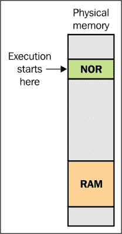
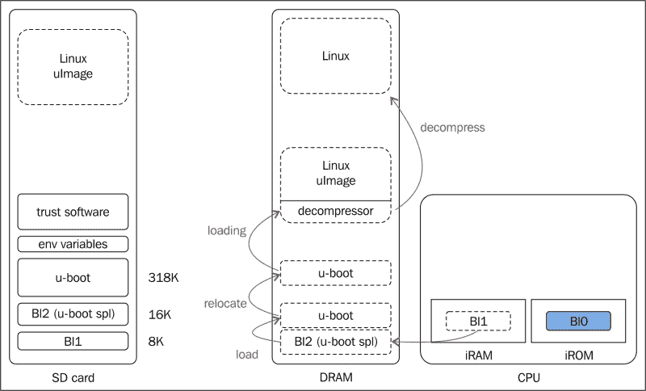
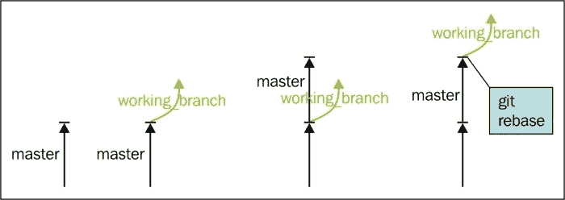
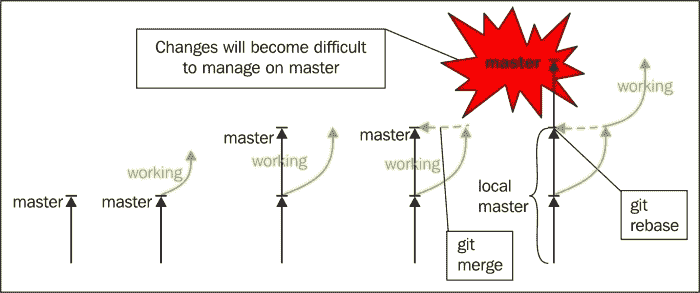

# 第 3 章.引导加载器

在本章中，我们将向您介绍在嵌入式环境中使用 Linux 系统所必需的最重要的组件之一。 这里，我指的是 Bootloader，这是一款提供初始化平台并使其准备好引导 Linux 操作系统的软件。 在本章中，我们将介绍引导加载程序的优点和作用。 本章主要关注 U-Boot 引导加载程序，但鼓励读者看看其他引导程序，如 Barebox、RedBoot 等。 所有这些引导加载器都有它们各自的功能，没有一个特别适合所有需要；因此，欢迎在本章中进行实验和好奇。 在上一章中已经向您介绍了 Yocto 项目参考；因此，您现在将能够理解此开发环境如何与各种引导加载程序一起工作，特别是在**Board Support Package**(**BSP**)中提供的那些引导加载程序。

本章的主要目的是介绍嵌入式引导加载程序和固件的主要属性、它们的引导机制以及固件更新或修改时出现的问题。 我们还将讨论与安全、安装或容错相关的问题。 关于引导加载程序和固件概念，我们有多个可用的定义，其中一些定义指的是我们不感兴趣的传统桌面系统。

固件通常代表在系统上用来控制硬件的固定的小程序。 它执行低级操作，通常存储在闪存、ROM、EPROM 等上。 它不是经常改变的。 由于这个术语有时只用于定义硬件设备或表示数据及其指令，因此完全避免了这个术语。 它代表两者的组合：计算机数据和信息，以及硬件设备，它们组合在设备上可用的只读软件中。

引导加载器表示在系统初始化期间首先执行的软件。 它用于加载、解压缩和执行一个或多个二进制应用程序，例如 Linux 内核或根文件系统。 它的角色包括将系统添加到可以执行其主要功能的状态。 这是在加载并启动它接收到的或已经保存在内部存储器上的正确的二进制应用程序之后完成的。 初始化时，硬件引导加载程序可能需要初始化**锁相环**(**PLL**)，设置时钟，或启用对 RAM 存储器和其他外设的访问。 但是，这些初始化是在基本级别上完成的；其余的由内核驱动程序和其他应用程序完成。

今天，有许多引导加载器可用。 由于这个话题的篇幅有限，而且他们的人数很多，我们只讨论最受欢迎的话题。 U-Boot 是适用于 PowerPC、ARM、MIPS 等体系结构的最流行的引导加载程序之一。 它将构成本章的主要焦点。

# 引导加载器的角色

当电力第一次进入开发板处理器时，在运行程序之前需要准备大量的硬件组件。 对于每个体系结构、硬件制造商甚至处理器，此初始化过程都是不同的。 在大多数情况下，它涉及一组配置和操作，这些配置和操作对于不同的处理器是不同的，最终会从处理器附近的可用存储设备获取引导代码。 该存储设备通常是闪存，并且引导代码是引导加载程序的第一阶段，并且是初始化处理器和相关硬件外围设备的阶段。

大多数可用的处理器在通电时都会转到默认地址位置，并在找到二进制数据的第一个字节后开始执行它们。 基于该信息，硬件设计者定义闪存的布局以及稍后可用于从可预测地址加载和引导 Linux 操作系统的地址范围。

在初始化的第一阶段，通常用特定于处理器的汇编语言完成电路板初始化，完成后，整个生态系统就为操作系统引导过程做好了准备。 引导加载程序负责此操作；它是提供加载、定位和执行操作系统主要组件的可能性的组件。 此外，它还可以包含其他高级功能，例如升级操作系统映像、验证操作系统映像、在多个操作系统映像之间进行选择，甚至可以自我升级。 传统 PC BIOS 和嵌入式引导加载程序之间的不同之处在于，在嵌入式环境中，引导加载程序在 Linux 内核开始执行后被覆盖。 事实上，在它提供对操作系统映像的控制之后，它就不复存在了。

在使用外围设备(如闪存或 DRAM)之前，引导加载程序需要仔细地对其进行初始化。 这不是一件容易的事。 例如，DRAM 芯片不能直接读取或写入-每个芯片都有一个控制器，需要启用该控制器才能进行读取和写入操作。 同时，DRAM 需要持续刷新，否则数据将丢失。 实际上，刷新操作代表在硬件制造商提到的时间范围内读取每个 DRAM 位置。 所有这些操作都是由 DRAM 控制器负责的，这会给嵌入式开发人员带来很多挫折，因为它需要关于体系结构设计和 DRAM 芯片的特定知识。

引导加载程序没有普通应用程序所具有的基础设施。 它不可能只被它的名字调用并开始执行。 在获得控制时打开后，它会通过初始化处理器和必要的硬件(如 DRAM)来创建自己的上下文，并在必要时在 DRAM 中移动自身以加快执行速度，最后开始实际的代码执行。

造成复杂性的第一个因素是启动代码与处理器引导序列的兼容性。 第一个可执行指令需要位于闪存中的预定义位置，这取决于处理器甚至硬件架构。 还可能有多个处理器基于接收到的硬件信号在几个位置寻找那些第一个可执行指令。

另一种可能性是在许多新上市的开发板上采用相同的结构，例如 Atmel SAMA5D3-XPlaed：


对于 Atmel SAMA5D3-XPlaed 板和其他类似的板，引导从 AT91 CPU 上 ROM 存储器中名为 BootROM 的集成引导代码开始，该代码在 SRAM 上加载名为 AT91Bootstrap 的第一级引导加载程序并启动它。 第一级引导加载器初始化 DRAM 存储器并启动第二级引导加载器，在本例中为 U-Boot。 有关引导序列可能性的更多信息可以在可用的引导序列标头中找到，您很快就会了解到这一点。

缺乏执行上下文代表了另一个复杂性。 在没有内存的系统中甚至必须编写一个简单的`"Hello World"`，因此没有一个堆栈来分配信息，这看起来与众所周知的“Hello World”示例非常不同。 这就是引导加载程序将 RAM 内存初始化为具有可用堆栈并能够运行高级程序或语言(如 C 语言)的原因。

# 比较各种引导加载程序

正如我们前面所读到的，嵌入式系统可以使用许多引导加载器。 这里将介绍的内容如下：

*   **U-Boot**：此也称为通用引导加载器，主要用于嵌入式 Linux 系统的 PowerPC 和 ARM 体系结构
*   **Barebox**：这个最初称为 U-Boot v2，始于 2007 年，旨在解决 U-Boot 的局限性；随着时间的推移，它更改了名称，因为设计目标和社区发生了变化
*   **RedBoot**：这个是从 eCos 派生的 RedHat Bootloader，eCos 是一个开源实时操作系统，可移植，专为嵌入式系统设计
*   **rrload**：此是 ARM 的引导加载程序，基于嵌入式 Linux 系统
*   **PPCBOOT**：这个是 PowerPC 的引导加载程序，是基于嵌入式 Linux 系统的
*   **CLR/OHH**：此表示用于基于 ARM 架构的嵌入式 Linux 系统的闪存引导加载程序
*   **Alios**：这是一个引导加载程序，主要用汇编语言编写，执行 ROM 和 RAM 初始化，并试图完全消除嵌入式系统上对固件的需要[t3

有许多可用的引导加载程序，这是一个自然的结果，因为有大量不同的体系结构和设备，事实上，如此之多，以至于几乎不可能有一个对所有系统都好的引导加载程序。 BootLoader 的种类很多；区别因素体现在板的类型和结构、SOC 差异，甚至 CPU。

# 深入研究引导加载程序周期

如前所述，引导加载器是在初始化系统之后首先运行的组件，并为操作系统引导过程准备整个生态系统。 这一过程因架构不同而不同。 例如，对于 x86 体系结构，处理器可以访问 BIOS，这是非易失性存储器中的一个软件，通常是 ROM。 它的角色在执行时重置系统后启动，并初始化稍后将由第一级引导加载程序使用的硬件组件。 它还执行引导加载程序的第一阶段。

第一阶段引导加载器的维度非常小-通常只有 512 字节，并且驻留在易失性存储器上。 它在第二阶段执行完全引导加载程序的初始化。 第二阶段引导加载程序通常位于第一阶段引导加载程序的旁边，它们包含的功能最多，执行的工作也最多。 他们还知道如何解释各种文件系统格式，这主要是因为内核是从文件系统加载的。

对于 x86 处理器，有更多的引导加载程序解决方案可供选择：

*   **GRUB**：Grand Unified BootLoader 是桌面 PC 平台上 Linux 系统使用最多、功能最强大的 BootLoader。 它是 GNU 项目的一个组件，是 x86 架构系统可用的最强大的引导加载器之一。 这是因为它能够理解各种文件系统和内核映像格式。 它能够在引导期间更改引导配置。 GRUB 还支持网络引导和命令行界面。 它有一个在引导时处理并可以修改的配置文件。 有关它的更多信息可以在[http://www.gnu.org/software/grub/](http://www.gnu.org/software/grub/)上找到。
*   **LILO**：Linux Loader，一个主要用于商业 Linux 发行版的引导加载程序。 与上一点类似，它可用于台式 PC 平台。 它有多个组件，由于历史原因，第一个组件位于磁盘驱动器的第一个扇区上；它是引导组件。 由于相同的历史原因，它被限制为 512 字节的维度，并且它加载并提供对第二阶段引导加载程序的控制，该第二阶段引导加载程序执行引导加载程序的大部分工作。 LILO 有一个配置实用程序，它主要用作 Linux 内核引导过程的信息源。 有关它的更多信息可以在[http://www.tldp.org/HOWTO/LILO.html](http://www.tldp.org/HOWTO/LILO.html)上找到。
*   **Syslinux**：它用于可移动介质或网络引导。 Syslinux 是在 MS-DOS 或 Windows FAT 文件系统上运行的 Linux 操作系统引导加载程序，主要用于 Linux 的抢救和首次安装。 有关它的更多信息，请参见[http://www.kernel.org/pub/linux/utils/boot/syslinux/](http://www.kernel.org/pub/linux/utils/boot/syslinux/)。

对于大多数嵌入式系统，此引导过程不适用，尽管有些系统会复制此行为。 接下来将介绍两种情况。 第一种情况是代码执行从固定地址位置开始的情况，第二种情况是 CPU 在调用的 ROM 存储器中有可用代码的情况。



图像的右侧显示为前面提到的引导机制。 在这种情况下，硬件需要 NOR 闪存芯片，该芯片在起始地址可用来确保代码执行的开始。

NOR 存储器优于 NAND 存储器，因为它允许随机地址访问。 它是对第一阶段引导加载程序进行编程以开始执行的地方，这并不能使其成为最实用的引导机制。

尽管这不是引导加载程序引导过程中使用的最实用的方法，但它仍然可以使用。 然而，不知何故，它只能在不适合更强大的引导选项的主板上使用。

# U-Boot 引导加载程序

目前有许多开源引导加载器可用。 它们几乎都具有加载和执行程序的功能，通常涉及操作系统，其功能用于串行接口通信。 然而，并不是所有的设备都有可能通过以太网进行通信或自我更新。 另一个重要因素是引导加载程序的广泛使用。 组织和公司通常只为其支持的各种主板、处理器和体系结构选择一个引导加载程序。 类似的事情也发生在 Yocto 项目中，当时选择了一个 BootLoader 来代表官方支持的 BootLoader。 他们和其他类似的公司选择了 U-Boot Bootloader，它在 Linux 社区中非常出名。

U-Boot 引导加载程序，或其正式名称为 Das U-Boot，是由 Wolfgang Denx 在其背后社区的支持下开发和维护的。 它是按照 GPLv2 授权的，它的源代码可以在`git`库中免费获得，如第一章所示，并且它的发布间隔为两个月。 发布版本名称显示为为`U-boot vYYYY.MM`。 有关 U-Boot 加载程序的信息，请参阅[http://www.denx.de/wiki/U-Boot/ReleaseCycle](http://www.denx.de/wiki/U-Boot/ReleaseCycle)。

U-Boot 源代码有一个定义非常好的目录结构。 使用以下控制台命令可以很容易地看到这一点：

```sh
tree -d -L 1
.
├── api
├── arch
├── board
├── common
├── configs
├── disk
├── doc
├── drivers
├── dts
├── examples
├── fs
├── include
├── lib
├── Licenses
├── net
├── post
├── scripts
├── test
└── tools
19 directories

```

`arch`目录包含特定于体系结构的文件和目录-特定于每个体系结构、CPU 或开发板。 `api`包含独立于机器或体系结构类型的外部应用程序。 A`board`包含具有特定名称的目录的内部线路板，用于所有线路板特定文件。 公共是`misc`函数所在的位置。 A`disk`包含磁盘驱动器处理功能，文档位于`doc`目录中。 驱动程序位于`drivers`目录中。 特定于文件系统的功能在`fs`目录中可用。 仍然有一些目录需要在这里提及，比如`include`目录，它包含头文件；`lib`目录包含支持各种实用程序的通用库，如展平设备树、各种解压缩、`post`(开机自检)和其他，但是我会让读者的好奇心发现它们，一个小提示是检查`Directory Hierachy`部分的`README`文件。

浏览上一章`./include/configs`文件中下载的 U-Boot 源文件，可以找到每个受支持主板的配置文件。 这些配置文件是一个`.h`文件，其中包含许多`CONFIG_`文件，并定义有关内存映射、外围设备及其设置、命令行输出(如用于引导 Linux 系统的引导默认地址)等信息。 有关配置文件的更多信息可以在*配置选项的*部分的`README`文件中找到，也可以在线路板特定的配置文件中找到。 对于 Atmel SAMA5D3-XPlaed，配置文件为`include/configs/sama5d3_xplained.h`。 另外，在`configs`目录中有两种配置可供该单板使用，如下所示：

*   `configs/sama5d3_xplained_mmc_defconfig`
*   `configs/sama5d3_xplained_nandflash_defconfig`

这些配置用于定义电路板**二级程序加载器**(**SPL**)初始化方法。 SPL 表示从放置在 SRAM 存储器上的 U-Boot 源代码构建的小型二进制代码，用于将 U-Boot 加载到 RAM 存储器中。 通常，它的内存不到 4KB，引导顺序如下所示：



在实际为特定电路板启动 U-Boot 源代码的构建之前，必须指定电路板配置。 如上图所示，对于 Atmel SAMA5_XPlaed 开发板，有两种可用配置。 配置是通过 make`ARCH=arm CROSS_COMPILE=${CC} sama5d3_xplained_nandflash_defconfig`命令完成的。 在此命令后面，将创建`include/config.h`文件。 此标题包括特定于所选主板、体系结构、CPU 的定义，也包括特定于主板的标题。 从`include/config.h`文件读取的定义的`CONFIG_*`变量包括确定编译过程。 配置完成后，可以为 U-Boot 启动构建。

另一个在检查时可能非常有用的示例与引导嵌入式系统的另一个场景有关，该场景需要使用 NOR 内存。 在这种情况下，我们可以看一个具体的例子。 Christopher Hallinan 在*Embedded Linux Primer*中也很好地描述了这一点，其中讨论了 AMCC PowerPC 405GP 的处理器。 该处理器的硬编码地址为 0xFFFFFFFC，使用复位矢量放置`.resetvec`可见。 它还规定，在 0xFFFFFFFF 堆栈结束之前，本节的其余部分仅用值`1`完成；这意味着空的闪存阵列仅用值`1`完成。 有关此部分的信息可在位于`arch/powerpc/cpu/ppc4xx/resetvec.S`的`resetvec.S`文件中找到。 `resetvec.S`文件内容如下：

```sh
 /* Copyright MontaVista Software Incorporated, 2000 */
#include <config.h>
  .section .resetvec,"ax"
#if defined(CONFIG_440)
  b _start_440
#else
#if defined(CONFIG_BOOT_PCI) && defined(CONFIG_MIP405)
  b _start_pci
#else
  b _start
#endif
#endif
```

通过检查此文件的源代码，可以看到在此部分中只定义了一条指令，而与可用的配置选项无关。

U-Boot 的配置通过两种类型的配置变量完成。 第一个是`CONFIG_*`，它引用可由用户配置以启用各种操作功能的配置选项。 另一个选项称为`CFG_*`，用于配置设置和引用特定于硬件的详细信息。 变量`CFG_*`通常需要对硬件平台、外围设备和处理器有很好的了解。 SAMA5D3 解压硬件平台的配置文件位于`include/config.h`头文件中，如下所示：

```sh
/* Automatically generated - do not edit */
#define CONFIG_SAMA5D3  1
#define CONFIG_SYS_USE_NANDFLASH        1
#define CONFIG_SYS_ARCH  "arm"
#define CONFIG_SYS_CPU   "armv7"
#define CONFIG_SYS_BOARD "sama5d3_xplained"
#define CONFIG_SYS_VENDOR "atmel"
#define CONFIG_SYS_SOC    "at91"
#define CONFIG_BOARDDIR board/atmel/sama5d3_xplained
#include <config_cmd_defaults.h>
#include <config_defaults.h>
#include <configs/sama5d3_xplained.h>
#include <asm/config.h>
#include <config_fallbacks.h>
#include <config_uncmd_spl.h>
```

此处提供的配置变量表示 SAMA5D3 XPlaed 板的相应配置。 这些配置的一部分涉及许多可用于用户与引导加载程序交互的标准命令。 可以添加或删除这些命令，以便从可用命令行界面扩展或减去命令。

有关 U-Boot 可配置命令接口的更多信息，请参见[http://www.denx.de/wiki/view/DULG/UBootCommandLineInterface](http://www.denx.de/wiki/view/DULG/UBootCommandLineInterface)。

## 引导 U-Boot 选项

在工业环境中，与 U-Boot 的交互主要通过以太网接口完成。 以太网接口不仅能够更快地传输操作系统映像，而且比串行连接更不容易出错。

BootLoader 中可用的最重要特性之一与支持**动态主机控制协议**(**DHCP**)、**普通文件传输协议**(**TFTP**)，甚至支持**引导协议**(**BOOTP**)有关。 BOOTP 和 DHPC使以太网连接能够自我配置并从专用服务器获取 IP 地址。 TFTP 允许通过 TFTP 服务器下载文件。 目标设备和 DHCP/BOOTP 服务器之间传递的消息在下图中以更一般的方式表示。 最初，硬件平台发送到达所有可用的 DHCP/BOOTP 服务器的广播消息。 每台服务器都发回其提供的服务，其中也包含一个 IP 地址，客户端接受最适合其目的的服务，而拒绝其他服务。


在目标设备完成与 DHCP/BOOTP 的通信后，它将保留特定于目标的配置，其中包含主机名、目标 IP 和硬件以太网地址(MAC 地址)、网络掩码、TFTP 服务器 IP 地址以及甚至 TFTP 文件名等信息。 此信息绑定到以太网端口，并在稍后的引导过程中使用。

为了引导映像，U-Boot 提供了许多功能，这些功能涉及对存储子系统的支持。 这些选项包括 RAM 引导、MMC 引导、NAND 引导、NFS 引导等。 对这些选项的支持并不总是容易的，可能意味着硬件和软件的复杂性。

## 移植 U-Boot

我在前面已经提到过，U-Boot 是可用的最常用和已知的引导加载程序之一。 这也是因为它的体系结构支持以非常容易的方式移植新的开发平台和处理器。 同时，有大量的开发平台可供参考。 任何对移植新平台感兴趣的开发人员都应该做的第一件事是检查`board`和`arch`目录，以建立他们的基准，同时还要确定它们与其他 CPU 和可用的主板的相似性。

`board.cfg`文件是注册新平台的起点。 在此，应将以下信息作为表行添加：

*   地位 / 状态 / 身份
*   建筑艺术 / 建筑业 / 建筑风格 / 建筑学
*   中央处理机
*   社会学
*   摊贩 / 卖主 / 供应商 / 自动售货机
*   电路板名称
*   目标
*   选项
*   维修工

要移植类似于 SAMA5D3 XPlaed 的机器，可以参考的目录之一是`arch`目录。 它包含文件，如`board.c`，其中包含与线路板和 SOC 的初始化过程相关的信息。 最值得注意的进程是`board_init_r()`，它在 RAM 中重定位之后对板和外围设备进行设置和探测；`board_init_f()`，它在 RAM 中重定位之前标识堆栈大小和保留地址；以及`init_sequence[]`，它在`board_init_f`内部调用以设置外围设备。 同一位置中的其他重要文件是`bootm.c`和`interrupts.c`文件。 前者主要负责操作系统的内存引导，后者负责实现通用中断。

`board`目录还有一些有趣的文件和函数需要在此提及，例如`board/atmel/sama5d3_xplained/sama5d3_xplained.c`文件。 它包含用于初始化的函数，如`board_init(), dram_init()`、`board_eth_init()`、`board_mmc_init`、`spl_board_ init()`和`mem_init()`，其中一些函数由`arch/arm/lib/board.c`文件调用。

以下是其他一些相关目录：

*   `common`：本保存有关用户命令、中间件、执行中间件和用户命令之间接口的 API 以及所有可用主板使用的其他功能和功能的信息。
*   `drivers`：此包含各种设备驱动程序和中间件 API 的驱动程序，如`drivers/mmc/mmc.c, drivers/pci/pci.c`、`drivers/watchdog/at91sam9_wdt.c`等。
*   `fs`：这里提供了各种支持的文件系统，如 USB、SD 卡、ext2FAT 等。
*   `include`：此表示大多数电路板所需的所有接头所在的位置。 SoC 和其他软件也是可用的。 在 include/configs 中，提供特定于电路板的配置，包括从 Linux 导入的标头；这些配置可用于各种设备驱动程序、移植或其他字节操作。
*   `tools`：此是在将其发送到邮件列表或`mkimage.c`工具之前使用诸如`checkpatch.pl`等工具(用作编码样式检查的补丁检查工具)的地方。 这也用于生成 Linux 二进制文件的 U-Boot 通用头文件生成，并确保它们能够使用 U-Boot 引导。

通过查看相应的文档目录和`README`文件，如`README.at91`、`README.at91-soc`、`README.atmel_mci`、`README.atmel_pmecc`、`README.ARM-memory-map`等，可以找到有关 SAMA5D3 白板的更多信息。

对于那些对在将新的开发板、CPU 或 SOC 移植到 U-Boot 时所做的更改感兴趣的人来说，应该遵循一些规则。 所有这些都与`git`交互相关，并帮助您确保正确维护分支机构。

开发人员应该做的第一件事是跟踪与本地分支相对应的上游分支。 另一条建议是忘记`git``merge`，而使用`git``rebase`。 可以使用`git fetch`命令与上游存储库保持联系。 要使用补丁程序，需要遵循一些一般规则，补丁程序需要只有一个逻辑更改，可以是以下任一更改：

*   更改不应包含无关或不同的修改；每个更改集只有一个可用且可接受的修补程序
*   必要时，提交应在可能的情况下使用`git-bisect`，同时检测源代码中的错误
*   如果多个文件受到一组修改的影响，则应在同一修补程序中提交所有文件
*   补丁需要进行审查，而且需要非常彻底的审查

让我们看一下下图，它说明了 git rebase 操作：



如上图和下图所示，**git rebase**操作已将工作从一个分支重新创建到另一个分支。 一个分支的每个提交都在下一个分支上可用，就在它的最后一个提交之后。


另一方面，`git merge`操作是一个新的提交，它有两个父级：从中进行移植的分支和合并时所在的新分支。 事实上，它使用不同的提交 ID 将一系列提交收集到一个分支中，这就是它们难以管理的原因。



有关`git`交互的更多信息可以在[http://git-scm.com/documentation](http://git-scm.com/documentation)或[http://www.denx.de/wiki/U-Boot/Patches](http://www.denx.de/wiki/U-Boot/Patches)上找到。

在 U-Boot 中移植新功能时，几乎总是需要进行调试。 对于 U-Boot 调试器，可能会出现两种不同的情况：

*   第一种情况是未执行`lowlevel_init`时
*   第二种情况是执行`lowlevel_init`时；这是最常见的情况

在接下来的几行中，我们将考虑第二种情况：启用 U-Boot 调试会话的基线。 为了确保可以进行调试，需要执行`elf`文件。 此外，不能直接操作它，因为链接地址将被重新定位。 要做到这一点，应该使用几个技巧：

*   第一步是确保环境干净，旧对象不再可用：`make clean`
*   下一步是确保清除依赖项：`find ./ | grep depend | xargs rm`
*   清理完成后，可以开始目标构建，并且可以在日志文件中重定向输出：`make sama5d3_xplained 2>&1 > make.log`
*   生成的输出应重命名，以避免多个单板出现调试问题：`mv u-boot.bin u-boot_sama5d3_xplained.bin`
*   在线路板配置文件中启用 DEBUG 非常重要；在`include/configs/ sama5d3_xplained.h`内部，添加`#define`DEBUG 行

搬迁后可以搭建早期开发平台，搬迁结束后要设置适当的断点。 需要为 U-Boot 重新加载符号，因为重新定位将移动链接地址。 对于所有这些任务，`gdb`脚本为，表示为`gdb gdb-script.sh`：

```sh
#!/bin/sh
${CROSS_COMPILE}-gdb u-boot –command=gdb-command-script.txt

vim gdb-command-script.txt
target remote ${ip}:${port}
load
set symbol-reloading
# break the process before calling board_init_r() function
b start.S:79
c
…
# the symbol-file need to be align to the address available after relocation
add-symbol-file u-boot ${addr}
# break the process at board_init_r() function for single stepping b board.c:494
```

### 备注

有关搬迁的更多信息，请参见`doc/README.arm-relocation`。

# 约克托项目

Yocto 项目使用各种方法来定义与每个受支持的引导加载器的交互。 由于有多个引导阶段，因此 BSP 中还需要多个食谱和包。 可用于各种引导加载器的食谱与 Yocto 世界中提供的任何其他食谱没有什么不同。 然而，他们有一些细节使他们独一无二。

这里我们要关注的板是`sama5d3_xplained`开发板，它位于`meta-atmel`层内部。 在这一层中，可以在`recipes-bsp`目录中找到第一阶段和第二阶段引导加载程序的对应配方。 这里，我指的是`at91bootstrap`和`u-boot`食谱。 对于第一阶段和第二阶段引导加载程序，存在一些误解。 它们可能被称为第二级和第三级引导加载器，因为在讨论期间可能会也可能不会考虑引导 ROM 代码。 在本书中，我们倾向于将它们称为第一阶段和第二阶段引导加载程序。

`AT91bootstrap`软件包代表可用于其 SOC 的 Atmel 的第一阶段引导加载程序。 它管理硬件初始化，还从内存内的引导介质执行第二阶段引导加载程序下载；它在结束时启动它。 在`meta-atmel`层中，第二阶段引导加载程序是`u-boot`，稍后将其用于 Linux 操作系统引导。

通常，在 BSP 层中，会提供对多个开发板的支持，这意味着还会提供多个版本和引导加载程序包。 然而，它们之间的区别在于机器配置的不同。 对于 SAMA5D3 XPlaed 开发板，机器配置在`conf/machine/sama5d3_xplained`文件中提供。 在此文件中，定义了首选的引导加载程序版本、提供程序和配置。 如果这些配置不是`MACHINE`特定的，它们可以很好地在`package`配方中执行。

这是`sama5d3_xplained`开发板可用配置的一个示例：

```sh
PREFERRED_PROVIDER_virtual/bootloader = "u-boot-at91"
UBOOT_MACHINE ?= "sama5d3_xplained_nandflash_config"
UBOOT_ENTRYPOINT = "0x20008000"
UBOOT_LOADADDRESS = "0x20008000"

AT91BOOTSTRAP_MACHINE ?= "sama5d3_xplained"
```

# 摘要

在本章中，我们向您介绍了有关引导加载程序的信息，其中重点介绍了 U-Boot 引导加载程序。 我们还讨论了与 U-Boot 交互、移植、调试、引导加载程序的一般信息、U-Boot 替代方案以及嵌入式环境中的引导顺序相关的主题。 还有一个与 Yocto 项目相关的部分，在那里向您介绍了用于支持 BSP 中提供的各种引导加载器的机制。 这一章提供了许多练习，它们使这一主题更加清晰。

在下一章中，我们将讨论 Linux 内核、其特性和源代码、模块和驱动程序，以及与 Linux 内核交互所需的大部分信息。 由于您已经了解了 Yocto 项目，我们还将重点介绍 Yocto 项目，以及它如何能够与各种内核版本配合使用，以进行大量的板级和练习。 这将使您更容易理解提供给您的信息。