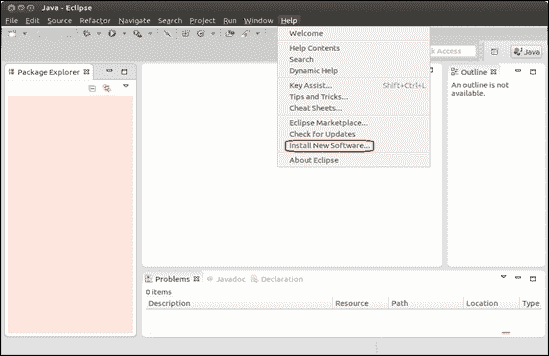
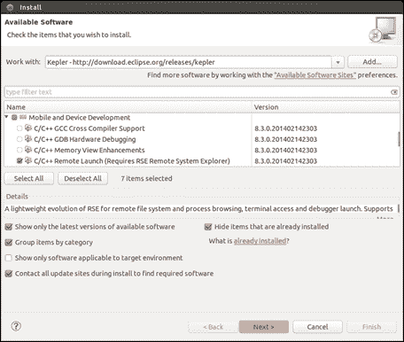
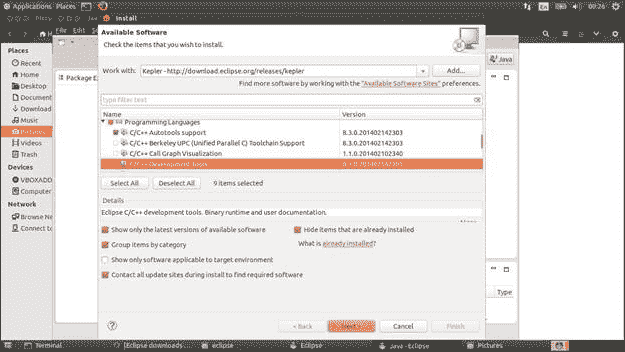
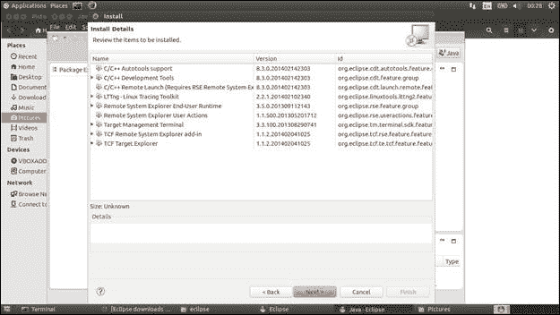
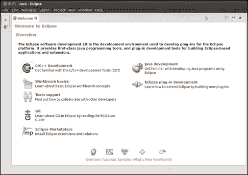
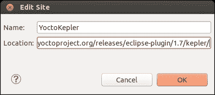
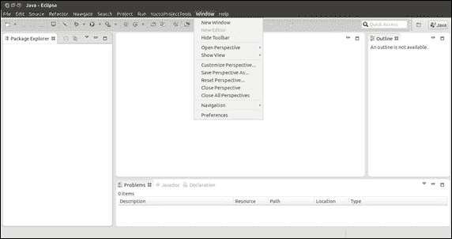
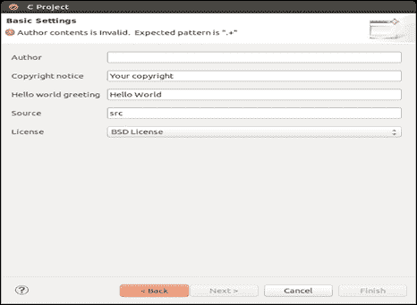

# 七、ADT Eclipse 插件

在本章中，您将看到 Yocto 项目中可用工具的新视角。 本章标志着对 Yocto 项目生态系统中可用的各种工具的介绍的开始，这些工具非常有用，并且与 POKY 参考系统不同。 在本章中，将简要介绍**应用开发环境**(**ADE**)，重点介绍 Eclipse 项目和Yocto 项目添加的插件。 其中显示了许多插件及其配置和用例。

还将向您显示**应用开发工具包**(**ADT**)的更广泛的视图。 该项目的主要目标是提供一个能够开发、编译、运行、调试和分析软件应用的软件堆栈。 它试图做到这一点，而不需要从开发人员的角度进行额外的学习。 考虑到 Eclipse 是最常用的**集成开发环境**(**IDES**)之一，并且随着时间的推移，它变得非常友好、稳定和可靠，因此它的学习曲线非常低。 ADT 用户体验与任何 Eclipse 或非 Eclipse 用户使用 Eclipse IDE 时的体验非常相似。 可用的插件试图使这种体验尽可能相似，以便开发类似于任何 Eclipse IDE。 唯一的区别在于配置步骤之间，这定义了不同的 Eclipse IDE 版本之间的区别。

ADT 提供了以独立于平台的方式使用独立交叉编译器、调试工具分析器、仿真器甚至开发板交互的可能性。 虽然与硬件交互是嵌入式开发人员的最佳选择，但在大多数情况下，由于各种原因，缺少真正的硬件。 对于这些场景，可以使用 QEMU 仿真器来模拟必要的硬件。

# 应用开发工具包

ADT 是 Yocto 项目的组件之一，它提供了一个交叉开发平台，非常适合用户特定的应用开发。 要有序地进行开发过程，需要一些组件：

*   Eclipse IDE Yocto 插件
*   用于特定硬件仿真的 QEMU 仿真器
*   跨工具链及其特定的`sysroot`，它们都是特定于体系结构的，都是使用 Yocto 项目提供的元数据和构建系统生成的
*   用户空间工具，用于增强开发人员对应用开发过程的体验

当使用 Eclipse IDE 提供对 Yocto 项目的完全支持并最大化 Yocto 体验时，就可以使用 Eclipse 插件。 最终结果是为 Yocto 开发人员的需求定制的环境，具有跨工具链、在真实硬件上部署或 QEMU 仿真特性，以及许多可用于收集数据、跟踪、分析和性能检查的工具。

QEMU 模拟器用于模拟各种硬件。 它可以通过以下方法获得：

*   使用 ADT 安装程序脚本，该脚本提供了安装它的可能性
*   克隆一个狭小的存储库并获取环境资源，然后授予对 QEMU 环境的访问权限
*   下载 Yocto 版本和采购环境可获得相同的结果
*   安装跨工具链并获取环境资源，以使 QEMU 环境可用

该工具链包含交叉调试器、交叉编译器和交叉链接器，它们在应用开发过程中得到了很好的使用。 工具链还为目标设备提供了匹配的 sysroot，因为它需要访问在目标体系结构上运行所需的各种头文件和库。 Sysroot 从根文件系统生成，并使用相同的元数据配置。

用户空间工具包括前面章节中已经提到的工具，如 SystemTap、PowerTop、LatencyTop、Perf、OProfile 和 LTTng-UST。 它们用于获取有关系统和开发的应用的信息；信息，如功耗、桌面卡顿、事件计数、性能概述、诊断软件、硬件或功能问题，甚至跟踪软件活动。

## 设置环境

在进一步解释 ADT 项目之前，需要了解它的 Eclipse IDE 插件、安装的其他特性和功能。 要安装 Eclipse IDE，第一步需要设置一个主机系统。 有多种方法可以做到这一点：

*   **使用 ADT 安装脚本**：这是安装 ADT 的推荐方法，主要是，因为安装过程是完全自动化的。 用户可以控制他们想要使用的功能。
*   **使用 ADT tarball**：此方法涉及具有特定于体系结构的工具链的适当 tarball的一部分，并使用脚本进行设置。 Tarball 既可以下载，也可以使用 Bitbake 手动构建。 这种方法也有局限性，因为除了跨工具链和 QEMU 仿真器之外，并不是所有的特性在安装后都可用。
*   **使用构建目录**中的工具链：此方法利用了事实，即构建目录已经可用，因此跨工具链的设置非常容易。 另外，在这种情况下，它面临着与前面提到的相同的限制。

ADT 安装脚本是安装 ADT 的首选方法。 当然，在进入安装步骤之前，需要准备好必要的依赖项，以确保 ADT 安装脚本能够顺利运行。

这些包已经在前面的章节中提到过了，但是为了让您的事情变得简单，我们将在这里再次对它们进行解释。 我建议你回到这些章节，把这些信息作为记忆练习再参考一遍。 要引用您可能感兴趣的包，请看一下 ADT 安装程序包，如`autoconf automake libtool libglib2.0-dev`、Eclipse 插件和`libsdl1.2-dev xterm`包提供的图形支持。

在主机系统准备好所有必需的依赖项后，可以从[http://downloads.yoctoproject.org/releases/yocto/yocto-1.7/adt-installer/](http://downloads.yoctoproject.org/releases/yocto/yocto-1.7/adt-installer/)下载 ADT tarball。 在此位置，可以使用`adt_installer.tar.bz2`档案。 它需要下载并提取其内容。

这个 tarball也可以在 build 目录中使用 Bitbake 构建系统生成，并且结果将在`tmp/deploy/sdk/adt_installer.tar.bz2`位置中可用。 要生成它，需要将下一个命令放入 build 目录，即`bitbake adt-installer`。 还需要为目标设备正确配置构建目录。

使用`tar -xjf adt_installer.tar.bz2`命令解压存档。 它可以在任何目录中解压，解压`adt-installer`目录后，将创建并包含名为`adt_installer`的 ADT 安装程序脚本。 它还有一个名为`adt_installer.conf`的配置文件，用于在运行脚本之前定义配置。 配置文件定义信息，如文件系统、内核、QEMU 支持等。

以下是配置文件包含的变量：

*   `YOCTOADT_REPO`：这定义了安装所依赖的包和根文件系统。 其参考值定义在[http://adtrepo.yoctoproject.org//1.7](http://adtrepo.yoctoproject.org//1.7)处。 这里定义了目录结构，其结构在不同版本之间是相同的。
*   `YOCTOADT_TARGETS`：这定义了为其设置交叉开发环境的目标架构。 定义了可以与此变量关联的默认值，例如`arm`、`ppc`、`mips`、`x86`和`x86_64`。 此外，可以将多个值与其关联，并使用空格分隔符实现它们之间的分隔。
*   `YOCTOADT_QEMU`：此变量定义 QEMU 仿真器的使用。 如果设置为`Y`，仿真器将在安装后可用；否则，该值将设置为`N`，因此仿真器将不可用。
*   `YOCTOADT_NFS_UTIL`：这定义是否要安装 NFS 用户模式。 如前所述，可用的值是`Y`和`N`。 为了使用 Eclipse IDE 插件，需要为`YOCTOADT_QEMU`和`YOCTOADT_NFS_UTIL`定义`Y`值。
*   `YOCTOADT_ROOTFS_<arch>`：这指定使用前面提到的`YOCTOADT_REPO`变量中定义的存储库中的哪个体系结构根文件系统。 对于`arch`变量，默认值是已经在`YOCTOADT_TARGETS`变量中提到的那些值。 此变量的有效值由可用的图像文件表示，如`minimal`、`sato`、`minimal-dev`、`sato-sdk`、`lsb`、`lsb-sdk`等。 对于变量的多个参数，可以使用空格分隔符。
*   `YOCTOADT_TARGET_SYSROOT_IMAGE_<arch>`：这表示将从中生成交叉开发工具链的`sysroot`的根文件系统。 ‘ARCH’变量的有效值与前面提到的值相同。 它的值取决于之前定义为`YOCTOADT_ROOTFS_<arch>`变量的值。 因此，如果只定义了一个变量作为`YOCTOADT_ROOTFS_<arch>`变量的值，那么`YOCTOADT_TARGET_SYSROOT_IMAGE_<arch>`也可以使用相同的值。 此外，如果在`YOCTOADT_ROOTFS_<arch>`变量中定义了多个变量，则其中一个变量需要定义`YOCTOADT_TARGET_SYSROOT_IMAGE_<arch>`变量。
*   `YOCTOADT_TARGET_MACHINE_<arch>`：这定义了为其下载映像的计算机，因为相同体系结构的计算机之间可能存在编译选项差异。 此变量的有效值可以是，如下所示：`qemuarm`、`qemuppc`、`ppc1022ds`、`edgerouter`、`beaglebone`，依此类推。
*   `YOCTOADT_TARGET_SYSROOT_LOC_<arch>`：这定义了目标`sysroot`在安装过程后可用的位置。

配置文件中还定义了一些变量，例如`YOCTOADT_BITBAKE`和`YOCTOADT_METADATA`，它们是为将来的工作参考而定义的。 在根据开发人员的需要定义所有变量后，即可开始安装过程。 这可以通过运行`adt_installer`脚本来完成：

```sh
cd adt-installer
./adt_installer

```

以下是`adt_installer.conf`文件的示例：

```sh
# Yocto ADT Installer Configuration File
#
# Copyright 2010-2011 by Intel Corp.
#
# Permission is hereby granted, free of charge, to any person obtaining a copy 
# of this software and associated documentation files (the "Software"), to deal 
# in the Software without restriction, including without limitation the rights 
# to use, copy, modify, merge, publish, distribute, sublicense, and/or sell 
# copies of the Software, and to permit persons to whom the Software is 
# furnished to do so, subject to the following conditions:

# The above copyright notice and this permission notice shall be included in 
# all copies or substantial portions of the Software.

# THE SOFTWARE IS PROVIDED "AS IS", WITHOUT WARRANTY OF ANY KIND, EXPRESS OR 
# IMPLIED, INCLUDING BUT NOT LIMITED TO THE WARRANTIES OF MERCHANTABILITY, 
# FITNESS FOR A PARTICULAR PURPOSE AND NONINFRINGEMENT. IN NO EVENT SHALL THE 
# AUTHORS OR COPYRIGHT HOLDERS BE LIABLE FOR ANY CLAIM, DAMAGES OR OTHER 
# LIABILITY, WHETHER IN AN ACTION OF CONTRACT, TORT OR OTHERWISE, ARISING FROM, 
# OUT OF OR IN CONNECTION WITH THE SOFTWARE OR THE USE OR OTHER DEALINGS IN 
# THE SOFTWARE.

# Your yocto distro repository, this should include IPKG based packages and root filesystem files where the installation is based on

YOCTOADT_REPO="http://adtrepo.yoctoproject.org//1.7"
YOCTOADT_TARGETS="arm x86"
YOCTOADT_QEMU="Y"
YOCTOADT_NFS_UTIL="Y"

#YOCTOADT_BITBAKE="Y"
#YOCTOADT_METADATA="Y"

YOCTOADT_ROOTFS_arm="minimal sato-sdk"
YOCTOADT_TARGET_SYSROOT_IMAGE_arm="sato-sdk"
YOCTOADT_TARGET_MACHINE_arm="qemuarm"
YOCTOADT_TARGET_SYSROOT_LOC_arm="$HOME/test-yocto/$YOCTOADT_TARGET_MACHINE_arm"

#Here's a template for setting up target arch of x86 
YOCTOADT_ROOTFS_x86="sato-sdk"
YOCTOADT_TARGET_SYSROOT_IMAGE_x86="sato-sdk"
YOCTOADT_TARGET_MACHINE_x86="qemux86"
YOCTOADT_TARGET_SYSROOT_LOC_x86="$HOME/test-yocto/$YOCTOADT_TARGET_MACHINE_x86"

#Here's some template of other arches, which you need to change the value in ""
YOCTOADT_ROOTFS_x86_64="sato-sdk"
YOCTOADT_TARGET_SYSROOT_IMAGE_x86_64="sato-sdk"
YOCTOADT_TARGET_MACHINE_x86_64="qemux86-64"
YOCTOADT_TARGET_SYSROOT_LOC_x86_64="$HOME/test-yocto/$YOCTOADT_TARGET_MACHINE_x86_64"

YOCTOADT_ROOTFS_ppc="sato-sdk"
YOCTOADT_TARGET_SYSROOT_IMAGE_ppc="sato-sdk"
YOCTOADT_TARGET_MACHINE_ppc="qemuppc"
YOCTOADT_TARGET_SYSROOT_LOC_ppc="$HOME/test-yocto/$YOCTOADT_TARGET_MACHINE_ppc"

YOCTOADT_ROOTFS_mips="sato-sdk"
YOCTOADT_TARGET_SYSROOT_IMAGE_mips="sato-sdk"
YOCTOADT_TARGET_MACHINE_mips="qemumips"
YOCTOADT_TARGET_SYSROOT_LOC_mips="$HOME/test-yocto/$YOCTOADT_TARGET_MACHINE_mips"

```

安装开始后，系统会询问用户交叉工具链的位置。 如果没有提供替代方案，则选择默认路径，并将交叉工具链安装在`/opt/poky/<release>`目录中。 安装过程可以以静默或交互的方式可视化。 通过使用`I`选项，安装在交互模式下完成，而静默模式则使用`S`选项启用。

在安装过程结束时，将在其定义的位置找到交叉工具链。 环境设置脚本将可供以后使用，`adt-installer`目录和`sysroot`目录中的图像 tarball 定义在`YOCTOADT_TARGET_SYSROOT_LOC_<arch>`变量的位置。

如前所述，有多种方法可以准备 ADT 环境。 第二种方法只涉及安装工具链安装程序-尽管它提供了预先构建的交叉工具链、支持文件和脚本(例如`runqemu`脚本)来启动类似于仿真器中的内核或 Linux 映像的东西-但它不提供与第一种方法相同的可能性。 此外，此选项对于`sysroot`目录也有其限制。 尽管已经生成了`sysroot`目录，但可能仍然需要将其解压并安装在单独的位置。 发生这种情况的原因有很多，比如需要通过 NFS 引导根文件系统，或者需要使用根文件系统作为目标来开发应用`sysroot`。

根文件系统可以使用`runqemu-extract-sdk`脚本从已经生成的跨工具链中提取，只有在使用 source 命令设置了交叉开发环境脚本之后才能调用该脚本。

有两种方法可以获得为第二个选项安装的工具链。 第一种方法涉及使用[http://downloads.yoctoproject.org/releases/yocto/yocto-1.7/toolchain/](http://downloads.yoctoproject.org/releases/yocto/yocto-1.7/toolchain/)提供的工具链安装程序。 打开与您的开发主机匹配的文件夹。 在此文件夹中，有多个安装脚本可用。 每一个都与一个目标体系结构相匹配，因此应该为您拥有的目标选择正确的一个。 可以从[http://downloads.yoctoproject.org/releases/yocto/yocto-1.7/toolchain/x86_64/poky-glibc-x86_64-core-image-sato-armv7a-vfp-neon-toolchain-1.7.sh](http://downloads.yoctoproject.org/releases/yocto/yocto-1.7/toolchain/x86_64/poky-glibc-x86_64-core-image-sato-armv7a-vfp-neon-toolchain-1.7.sh)中看到一个这样的示例，它实际上是`armv7a`目标和`x86_64`主机的安装程序脚本。

如果您的目标机器不是 Yocto 社区提供的机器之一，或者如果您更喜欢此方法的替代方法，那么构建工具链安装程序脚本是适合您的方法。 在本例中，您将需要一个构建目录，并且您将看到两个备选方案，它们都是一样好的：

*   第一个涉及使用`bitbake meta-toolchain`命令，最终结果是需要在单独位置安装和设置跨工具链的安装程序脚本。
*   第二种选择涉及使用`bitbake –c populate_sdk <image-name>`任务，该任务为目标提供工具链安装程序脚本和匹配的`sysroot`。 这里的优点是二进制文件只与一个且相同的`libc`链接，使得工具链是自包含的。 当然，每个体系结构只能创建一个特定的构建是有限制的。 但是，特定于目标的选项通过`gcc`选项传递。 使用变量(如`CC`或`LD`)可以使流程更易于维护，还可以在 build 目录中节省一些空间。

下载安装程序后，确保安装脚本已正确设置执行，并使用`./poky-glibc-x86_64-core-image-sato-armv7a-vfp-neon-toolchain-1.7.sh`命令开始安装。

您需要的一些信息包括应该安装的位置，默认位置是`/opt/poky/1.7`目录。 要避免这种情况，可以使用`–d <install-location>`参数调用脚本，并且可以在前面提到的`<install-location>`位置进行安装。

### 备注

确保在`local.conf`文件中相应地设置了`MACHINE`变量。 此外，如果构建是针对不同的主机完成的，则还应设置`SDKMACHINE`。 在同一个构建目录中可以生成多个`MACHINE`交叉工具链，但是需要正确配置这些变量。

安装过程完成后，跨工具链将在所选位置可用，并且环境脚本也将在需要时可用于采购。

第三个选项涉及使用 build 目录和执行`bitbake meta-ide-support`命令。 在 build 目录内，需要使用两个可用的构建环境设置脚本之一设置适当的环境，这两个脚本包括`oe-init-build-env`脚本或`oe-init-build-env-memres`。 还需要为目标体系结构相应地设置来自`local.conf`文件的本地配置。 在开发人员完成这些步骤之后，可以使用`bitbake meta-ide-support`命令开始生成跨工具链。 在该过程结束时，环境设置脚本将在`<build-dir-path>/tmp`目录中可用，但在本例中，工具链紧密链接到构建它的 build 目录。

设置好环境后，就可以开始编写应用了，但是开发人员在完成活动之前仍然需要完成一些步骤，比如在真正的根文件系统上测试应用、调试和许多其他操作。 对于内核模块和驱动程序实现，需要内核源代码，因此该活动才刚刚开始。

# Eclipse IDE

Yocto 项目中可用于 Eclipse 的插件包括 ADT 项目和工具链的功能。 它们允许开发人员使用交叉编译器、调试器以及由 Yocto Project、POKY 和其他元层生成的所有可用工具。 这些组件不仅可以在 Eclipse IDE 中使用，而且还为应用开发提供了熟悉的环境。

Eclipse IDE 是对与编辑器(如`vim`)交互不感兴趣的开发人员的替代方案，尽管在我看来，`vim`可以用于所有类型的项目。 即使它们的尺寸或复杂性不是问题，使用`vim`的开销可能并不适合所有人的口味。 Eclipse IDE 是所有开发人员可用的最佳选择。 它有很多有用的特性和功能，可以让你的生活变得更轻松，而且很容易掌握。

Yocto 项目支持两个版本的 Eclipse，开普勒和 Juno。 开普勒版本是最新的 POKY 版本推荐的版本。 我还推荐 Eclipse 的开普勒 4.3.2 版本，这是从 Eclipse 官方下载站点[http://www.eclipse.org/downloads](http://www.eclipse.org/downloads)下载的版本。

应该从该站点下载包含**Java 开发工具**(**JDT**)、Eclipse 平台和用于主机的开发环境插件的 Eclipse Standard 4.3.2 版本。 下载完成后，应使用 tar 命令解压收到的归档内容：

```sh
tar xzf eclipse-standard-kepler-SR2-linux-gtk-x86_64.tar.gzls

```

下一步由配置表示。 提取内容后，需要在安装特定于 Yocto 项目的插件之前配置 Eclipse IDE。 配置从初始化 Eclipse IDE 开始：

Eclipse IDE 在执行`./eclipse`可执行文件并设置`Workspace`位置后启动。 启动窗口的外观如下所示：


日食窗口

要初始化Eclipse IDE，请执行以下步骤：

1.  选择**Workbench**，您将被移到将在其中编写项目源代码的空工作台。
2.  Now, navigate through the **Help** menu and select **Install New Software**.

    

    帮助

3.  A new window will open, and in the **Work with:** drop-down menu, select **Kepler - http://download.eclipse.org/releases/kepler**, as shown in the following screenshot:

    

    安装窗口

4.  Expand the **Linux Tools** section and select **LTTng – Linux Tracing Toolkit** box, as shown in the following screenshot:

    

    Install-LTTng-Linux 跟踪工具箱

5.  Expand the **Moble and Device Development** section and select the following:
    *   **C/C++远程启动(需要 RSE 远程系统资源管理器)**
    *   **远程系统资源管理器最终用户运行时**
    *   **远程系统资源管理器用户操作**
    *   **目标管理终端**
    *   **TCF 远程系统资源管理器加载项**
    *   **TCF 目标资源管理器**

    

6.  Expand the **Programming Languages** section and select the following:
    *   **C/C++自动工具支持**
    *   **C/C++开发工具**

    下面的屏幕截图显示了这一点：

    

    可用软件列表窗口

7.  Finish the installation after taking a quick look at the **Install Details** menu and enabling the license agreement:

    

    安装详细信息窗口

完成这些步骤后，可以将 Yocto Project Eclipse 插件安装到 IDE 中，但必须重新启动 Eclipse IDE 以确保前面的更改生效。 在这里可以看到配置阶段后的结果：



Eclipse-配置阶段结果

要安装 Yocto 项目的Eclipse 插件，需要执行以下步骤：

1.  如前所述，启动 Eclipse IDE。
2.  如前面的配置所示，从**帮助**菜单中选择**安装新软件**选项。
3.  Click on the **Add** button and insert `downloads.yoctoproject.org/releases/eclipse-plugin/1.7/kepler/` in the URL section. Give a proper name to the new **Work with:** site as indicated here:

    

    编辑站点窗口

4.  After the **OK** button is pressed, and the **Work with** site is updated, new boxes appear. Select all of them, as shown in this image, and click on the **Next** button:

    

    安装详细信息窗口

5.  One final pick at the installed components and the installation is approaching its end.

    

    安装详细信息窗口

6.  If this warning message appears, press **OK** and move further. It only lets you know that the installed packages have unsigned content.

    

    安全警告窗口

只有在重新启动 Eclipse IDE 以使更改生效之后，安装才会完成。

安装完成后，Yocto 插件就可用了，可以进行配置了。 配置过程涉及特定于目标的选项和交叉编译器的设置。 对于每个特定目标，需要相应地执行前面的配置步骤。

配置过程通过从**窗口**菜单中选择**首选项**选项来完成。 将打开一个新窗口，并从那里选择**Yocto Project ADT**选项。 下面的屏幕截图显示了更多详细信息：



Eclipse IDE-首选项

下一步要做的是配置交叉编译器的可用选项。 第一个选项指的是刀具链类型，有两个选项可用，**独立预建工具链**和**构建系统派生工具链**，这是缺省选择的选项。 前者指的是特定于已有内核和根文件系统的体系结构的工具链，因此开发的应用将手动在映像中可用。 但是，这一步不是必需的，因为所有组件都是分开的。 后一个选项指的是构建在 Yocto Project 构建目录中的工具链。

接下来需要配置的元素是工具链位置、`sysroot`位置和目标架构。 **工具链根位置**用于定义工具链安装位置。 例如，对于使用`adt_installer`脚本完成的安装，工具链将位于`/opt/poky/<release>`目录中。 第二个参数**Sysroot location**表示目标设备根文件系统的位置。 它可以在`/opt/poky/<release>`目录中找到(如前面的示例所示)，如果使用其他方法生成它，甚至可以在 build 目录中找到它。 本部分的第三个也是最后一个选项由**目标体系结构**表示，它指示使用或模拟的硬件类型。 在窗口中可以看到，它是一个下拉菜单，其中选择了所需的选项，用户将找到列出的所有支持的体系结构。 在下拉菜单中没有必要的体系结构的情况下，需要构建体系结构的相应映像。

最后剩余的部分由目标特定选项表示。 这指的是使用 QEMU 模拟体系结构或在外部可用硬件上运行映像的可能性。 对于外部硬件，使用要完成的工作需要选择的**External HW**选项，但是对于 QEMU 仿真，除了选择**QEMU**选项之外，还有其他事情要做。 在这种情况下，用户还需要指出**内核**和**自定义选项**。 对于内核选择，过程很简单。 如果选择了**独立预构建工具链**选项，则在预构建映像位置可用；如果选择了**构建系统派生工具链**选项，则在`tmp/deplimg/<machine-name>`目录中可用。 对于第二个选项(**自定义选项**参数)，添加它的过程不会像前面的选项那么简单。

**Custom Option**字段需要填充各种选项，例如`kvm`、NOGRAPH、`publicvnc`或`serial`，这些选项指示仿真体系结构或其参数的主要选项。 这些参数保存在尖括号内，包括参数，如使用的内存(`-m 256`)、网络支持(`-net`)和全屏支持(`-full-screen`)。 使用`man qemu`命令可以找到有关可用选项和参数的更多信息。 定义项目后，可以使用**项目**菜单中的**更改 Yocto 项目设置**选项覆盖前面的所有配置。

要定义项目，需要执行以下步骤：

1.  Select the **Project…** option from the **File** | **New** menu option, as shown here:

    

    Eclipse IDE-项目

2.  Select **C project** from the **C/C++** option. This will open a **C Project** window:

    

    Eclipse IDE-新建项目窗口

3.  In the **C Project** window, there are multiple options available. Let's select **Yocto Project ADT Autotools Project**, and from there, the **Hello World ANSI C Autotools Project** option. Add a name for the new project, and we are ready to move to the next steps:

    

    C 项目窗口

4.  In the **C Project** window we you be prompted to add information regarding the **Author**, **Copyright notice**, **Hello world greetings**, **Source**, and **License** fields accordingly:

    

    C 项目-基本设置窗口

5.  添加所有信息后，可以单击**Finish**按钮。 用户将在新的**C/C++**透视图中得到提示，该透视图特定于打开的项目，新创建的项目出现在菜单的左侧。
6.  创建项目并编写源代码后，要构建项目，请从**项目…中选择**Build Project**选项。** 菜单。

## QEMU 仿真器

QEMU在 Yocto 项目中用作各种目标架构的虚拟化机器和仿真器。 除了实现其他目的外，运行和测试各种 Yocto 生成的应用和映像也非常有用。 它在 Yocto 世界之外的主要用途也是 Yocto 项目的卖点，使其成为用于模拟硬件的默认工具。

### 备注

有关动车组使用案例的更多信息，请访问[http://www.yoctoproject.org/docs/1.7/adt-manual/adt-manual.html#the-qemu-emulator](http://www.yoctoproject.org/docs/1.7/adt-manual/adt-manual.html#the-qemu-emulator)。

如前所述，与 QEMU 仿真的交互是在 Eclipse 中完成的。 要实现这一点，需要按照上一节中的说明进行正确的配置。 在这里启动 QEMU 仿真是使用**Run**菜单中的**External Tools**选项完成的。 将为仿真器打开一个新窗口，在将相应的登录信息传递给提示符后，shell 将可用于用户交互。 还可以在仿真器上部署和调试应用。

### 备注

有关 QEMU 交互的更多信息，请访问[http://www.yoctoproject.org/docs/1.7/dev-manual/dev-manual.html#dev-manual-qemu](http://www.yoctoproject.org/docs/1.7/dev-manual/dev-manual.html#dev-manual-qemu)。

## 调试

调试应用也可以使用 QEMU 仿真器或实际目标硬件(如果存在)来完成。 在配置项目时，会生成一个运行/调试 Eclipse 配置作为**C/C+Remote Application**实例，并且可以根据它的名称找到它，这符合`<project-name>_gdb_-<suffix>`语法。 例如，`TestProject_gdb_armv5te-poky-linux-gnueabi`就是一个例子。

要连接到 Eclipse gdb 界面并启动远程目标调试进程，用户需要执行以下几个步骤：

1.  从**Run**|**Debug Configuration**菜单中选择**C/C++Remote Application**，并从左侧面板中提供的**C/C++Remote Application**中选择 Run/Debug Configuration(运行/调试配置)。
2.  从下拉列表中选择合适的连接。
3.  选择要部署的二进制应用。 如果您的项目中有多个可执行文件，通过按下**搜索项目**按钮，Eclipse 将解析该项目并提供一个包含所有可用二进制文件的列表。
4.  通过相应地设置**Remote Absolute File Path for C/C++Application：**字段，输入将部署应用的绝对路径。
5.  在**调试器**选项卡中可以选择调试器选项。 要调试共享库，需要执行几个额外步骤：
    *   从**Source**选项卡中选择**Add**|**Path Mapping**选项，以确保路径映射可用于调试配置。
    *   从**Debug/Shared Library**选项卡中选择**自动加载共享库符号**，并相应地指示共享库的路径。 此路径高度依赖于处理器的体系结构，因此要非常小心地指定哪个库文件。 通常，对于 32 位体系结构，选择`lib`目录，而对于 64 位体系结构，选择`lib64`目录。
    *   在**Arguments**选项卡上，可以在执行期间将各种参数传递给应用二进制文件。
6.  完成所有调试配置后，单击**Apply**和**Debug**按钮。 将启动一个新的 GDB 会话，并打开**调试透视图**。 在初始化调试器时，Eclipse 将打开三个控制台：
    *   以前面描述的 gdb 二进制文件命名的 gdb 控制台，用于命令行交互。
    *   用于运行应用的远程外壳程序显示结果
    *   以二进制路径命名的本地计算机控制台，大多数情况下不使用该路径。 它仍然是一件艺术品。
7.  设置调试配置后，可以使用工具栏中可用的**Debug**图标重新构建并再次执行应用。 实际上，如果您只想运行和部署应用，可以使用**Run**图标。

## 评测和跟踪

在**Yocto Tools**菜单中，您可以看到用于跟踪和分析已开发应用的受支持工具。 这些工具用于增强应用的各种属性，以及一般的开发过程和体验。 将展示的工具包括 LTTng、Perf、LatencyTop、PerfTop、SystemTap 和 KGDB。

我们要看的第一个插件是 LTTng Eclipse 插件，它提供了跟踪目标会话和分析结果的可能性。 要开始使用该工具，首先需要进行快速配置，如下所示：

1.  从**窗口**菜单中选择**打开透视图**，启动跟踪透视图。
2.  通过从**文件**|**新建**菜单中选择**项目**来创建新的跟踪项目。
3.  从**窗口**|**显示视图**|**Other…中选择**控件视图[T1。** |**有限公司**菜单。 这将使您能够访问所有这些所需的操作：**
    *   创建新连接
    *   创建会话
    *   开始/停止跟踪
    *   启用事件

接下来，我们将介绍名为**Perf**的用户空间性能分析工具。 它为应用代码提供了统计分析，并为多线程和内核提供了一个简单的CPU。 为此，它使用了许多性能计数器、动态探测器或跟踪点。 要使用Eclipse 插件，需要到目标的远程连接。 这可以通过性能向导或使用**文件**|**新建**|**其他**菜单中的**远程系统资源管理器**|**连接**选项来完成。 远程连接建立后，与该工具的交互与该工具可用的命令行支持的情况相同。

**LatencyTop**是一个应用，用于识别内核中可用的延迟及其根本原因。 由于 ARM 内核的限制，此工具不适用于启用了**对称多处理**(**SMP**)支持的 ARM 内核。 此应用还需要远程连接。 设置远程连接后，交互与该工具可用的命令行支持的情况相同。 此应用使用`sudo`从 Eclipse 插件运行。

**PowerTop**用于测量电能消耗。 它分析在 Linux 系统上运行的应用、内核选项和设备驱动程序，并估计它们的功耗。 识别耗电量最大的组件非常有用。 此应用需要远程连接。 建立远程连接后，与应用的交互与该工具的命令行可用支持相同。 该应用从 Eclipse 插件运行，使用-d 选项在 Eclipse 窗口中显示输出。

**SystemTap**是一个允许使用脚本从运行的 Linux 获取结果的工具。 SystemTap 提供自由软件(GPL)基础设施，通过跟踪所有内核调用来简化收集有关运行中的 Linux 系统的信息。 它与 Solaris 中的 DTrace 非常相似，但与 DTrace 不同的是，它仍然不适合生产系统。 它使用类似于`awk`的语言，其脚本扩展名为`.stp`。 可以对监测到的数据进行提取，并对其进行各种过滤和复杂的处理。 Eclipse 插件使用`crosstap`脚本将`.stp`脚本转换为 C 语言来创建`Makefile`，运行 C 编译器来为插入到目标内核中的目标体系结构创建内核模块，然后从内核收集跟踪数据。 要在 Eclipse 中启动 SystemTap 插件，有许多步骤需要遵循：

1.  从**Yocto Project Tools**菜单中选择**SYSTEM TAP**选项。
2.  在打开的窗口中，需要传递 Cross stap 参数：
    *   将**元数据位置**变量设置为对应的`poky`目录
    *   通过输入 root(默认选项)设置**远程用户 ID**，因为它对目标具有`ssh`访问权限-拥有相同权限的任何其他用户也是不错的选择
    *   在中将**远程主机**变量设置为目标的相应 IP 地址
    *   使用**SYSTEMTAP Scripts**变量作为`.stp`脚本的完整路径
    *   使用**SystemTap Args**字段设置其他交叉选项

`.stp`脚本的输出应该在 Eclipse 的控制台视图中可用。

我们将介绍的最后一个工具是**kgdb**。 该工具专门用于调试 Linux 内核，只有在 Eclipse IDE 中完成 Linux 内核源代码的开发时才有用。 要使用此工具，需要进行许多必要的配置设置：

*   禁用 C/C++索引：
    *   从**窗口**|**首选项**菜单中选择**C/C++索引器**选项
    *   取消选中**启用索引器**复选框
*   创建一个可以导入内核源代码的工程：
    *   从**文件**|**新建**菜单中选择**C/C++**|**C 项目**选项
    *   选择**Makefile 项目**|**空项目**选项，并为项目指定适当的名称
    *   取消选择**使用默认位置**选项
    *   单击**Browse**按钮并确定内核源代码本地 GIT 存储库位置
    *   按**Finish**按钮，即可创建项目

在满足前提条件后，可以开始实际配置：

*   从**Run**菜单中选择**Debug Configuration**选项。
*   双击**GDB Hardware Debug**选项以创建名为**<项目名称>Default**的默认配置。
*   从**Main**选项卡中，浏览到`vmlinux`构建映像的位置，选择**Disable auto build**单选按钮，以及**GDB(DFS)Hardware Debug Launcher**选项。
*   对于**调试器**选项卡中提供的**C/C++应用**选项，浏览到工具链中可用的 GDB 二进制文件的位置(如果 ADT 安装程序脚本可用，则其默认位置应为`/opt/poky/1.7/sysroots/x86_64-pokysdk-linux/usr/bin/arm-poky-linux-gnueabi/arm-poky-linux-gnueabi-gdb`)。 从**JTAG 设备**菜单中选择**通用串行选项**。 **使用远程目标**选项是必需。
*   从**启动**选项卡中，选择**加载符号**选项。 确保**使用项目二进制文件**选项指示正确的`vmlinux`图像，并且未选择**加载图像**选项。
*   按**应用**按钮以确保启用了先前的配置。
*   为串口通信调试准备目标：
    *   设置`echo ttyS0,115200`|`/sys/module/kgdboc/parameters/kgdboc`选项以确保使用适当的设备进行调试
    *   在`echo g`|`/proc/sysrq-trigger`目标上启动 KGDB
    *   关闭带有目标的终端，但保持串行连接
*   从**Run**菜单中选择**Debug Configuration**选项
*   选择之前创建的配置，然后单击**Debug**按钮

按下**Debug**按钮后，调试会话应启动，目标将在`kgdb_breakpoint()`功能中暂停。 在那里，所有特定于 gdb 的命令都可用，并且随时可以使用。

## Yocto Project Bitbake 指挥官

bitbake 命令器提供了编辑食谱和创建元数据项目的可能性，其方式与命令行中提供的方式类似。 两者的不同之处在于使用 Eclipse IDE 进行元数据交互。

要确保用户能够执行这些操作，需要执行多个步骤：

*   从**文件**|**新建**菜单中选择**项目**选项
*   从打开的窗口中选择**Yocto Project BitBake Commandal**向导
*   选择**新建 Yocto 项目**选项，将打开一个新窗口，用于定义新项目的属性
*   使用**项目位置**标识`poky`目录的父级
*   使用**项目名称**选项定义项目名称。 其默认值为 POKY
*   对于**Remote Service Provider**变量，选择**Local**选项，并对**Connection Name**下拉列表使用相同的选项
*   确保未选中已安装的`poky`源目录的**克隆**复选框

通过使用Eclipse IDE，可以使用它的特性。 最有用的功能之一是快速搜索选项，这可能会证明对一些开发人员非常有用。 其他好处包括使用模板创建食谱、使用语法突出显示编辑食谱、自动完成、即时错误报告等等。

### 备注

BITBAKE COMMANDER 的使用仅限于本地连接。 由于上游可用错误，远程连接会导致 IDE 冻结。

# 摘要

在本章中，我们向您介绍了有关 Yocto 项目提供的 ADE 功能的信息，以及众多可用于应用开发的 Eclipse 插件，这些插件不仅可以作为替代方案，而且还可以作为连接到 IDE 的开发人员的解决方案。 虽然本章从介绍面向命令行爱好者的应用开发选项开始，但很快就变得更多地是关于 IDE 交互，而不是其他任何内容。 这是因为需要有替代解决方案，以便开发人员可以选择最适合他们需求的解决方案。

在下一章中，我们将介绍一些 Yocto Project 组件。 这一次，它们与应用开发无关，而是涉及元数据交互、质量保证和持续集成服务。 我将尝试展示 Yocto 项目的另一个面孔，我相信这将帮助读者更好地了解 Yocto 项目，并最终与最适合他们和他们的需求的组件进行互动和贡献。