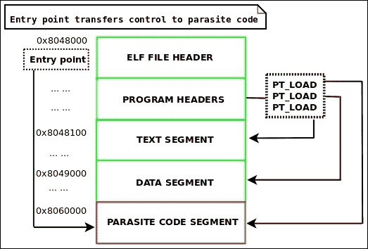
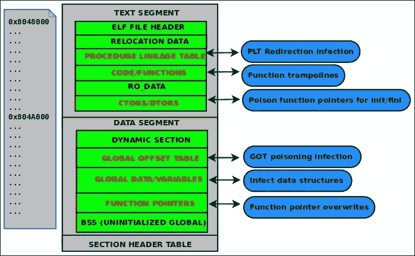

# 四、ELF 病毒技术——Linux/Unix 病毒

病毒编写的艺术已经存在了几十年了。 事实上，这可以追溯到 1981 年通过一款软盘视频游戏在野外成功传播的 Elk Cloner Apple 病毒。 80 年代中期以来,通过“90 年代,已经有各种各样的秘密团体和黑客用晦涩难懂的知识设计,释放,发布病毒在病毒和黑客 e - zine[(见 http://vxheaven.org/lib/static/vdat/ezines1.htm)。](http://vxheaven.org/lib/static/vdat/ezines1.htm)

编写病毒的艺术通常对黑客和地下技术爱好者有很大的启发，并不是因为他们有能力进行破坏， 而是设计它们的挑战，以及成功编程寄生虫(通过隐藏在其他可执行文件和进程中)所需的非常规编码技术。 此外，保持寄生虫隐形的技术和解决方案，如多态和变形代码，对程序员来说是一个独特的挑战。

UNIX 病毒初以来已经存在的 90 年代,但我认为很多人会同意说的真正父亲 UNIX 病毒是西尔维奥•凯撒(http://vxheaven.org/lib/vsc02.html),发表了许多论文在 90 年代末在精灵病毒感染的方法。 这些方法今天仍然以不同的方式被使用。

Silvio 是第一个发布了一些令人惊叹的技术，比如 PLT/GOT 重定向、文本段填充感染、数据段感染、可重定位代码注入、`/dev/kmem`补丁和内核函数劫持。 不仅如此，他个人在我介绍 ELF 二进制黑客的过程中扮演了重要的角色，我将永远感激他的影响。

在本章中，我们将讨论为什么了解 ELF 病毒技术和如何设计它们是重要的。 除了编写病毒之外，ELF 病毒背后的技术还可以用于许多事情，比如通用二进制补丁和热补丁，它们可以用于安全、软件工程和反向。 为了对病毒进行逆向工程，你应该了解其中有多少是有效的。 值得注意的是，我最近对一种名为**Retaliation**的独特且异常的 ELF 病毒进行了反向工程并编写了一份概要。 本作品可在[http://www.bitlackeys.org/#retaliation](http://www.bitlackeys.org/#retaliation)中找到。

# ELF 病毒技术

ELF 病毒技术的世界将为你作为一个黑客和工程师打开许多扇门。 首先，让我们讨论什么是 ELF 病毒。 每个可执行程序都有一个控制流，也称为执行路径。 ELF 病毒的第一个目标是劫持控制流，以便临时更改执行路径以执行寄生代码。 寄生代码通常负责设置劫持函数的钩子，也负责将自身(寄生代码的主体)复制到尚未被病毒感染的另一个程序中。 一旦寄生代码运行完成，它通常跳转到原始入口点或常规的执行路径。 这样，病毒就不会被注意到，因为主机程序似乎在正常执行。


图 4.1:对可执行文件的一般性感染

# ELF 病毒工程挑战

ELF 病毒的设计阶段可以看作是一种艺术努力，需要创造性的思维和巧妙的构造; 许多热情的程序员都会同意这一点。 同时，它是一个巨大的工程挑战，它超越了编程的常规惯例，要求开发人员跳出常规范式进行思考，并以某种方式操作代码、数据和环境。 有一次，我在一家大型**反病毒**(**AV**)公司对他们的一款产品进行了安全性评估。 在与反病毒软件的开发者交谈时，我惊讶地发现他们几乎没有人真正知道如何设计病毒，更不用说设计识别病毒的真正启发式(除了签名)了。 事实上，编写病毒是很困难的，并且需要严格的技巧。 在设计它们的时候会遇到很多挑战，在我们讨论工程组件之前，让我们看看其中的一些挑战是什么。

## 寄生代码必须是自包含的

一个寄生虫必须能够实际存在于另一个程序中。 这意味着它不能通过动态链接器链接到外部库。 寄生体必须是自包含的，这意味着它不依赖外部链接，是位置独立的，并且能够在自身内动态计算内存地址; 这是因为地址在每次感染之间会改变，因为寄生虫将被注射到一个现有的二进制文件中，每次它的位置都会改变。 这意味着，如果寄生代码通过其地址引用函数或字符串，硬编码的地址将改变，代码将失败; 相反，使用与 ip 相关的代码，并使用一个函数来计算代码/数据的地址，该函数根据代码/数据相对于指令指针的偏移量。

### 注意事项

在一些更复杂的内存病毒如我*萨鲁曼*病毒,我让寄生虫被编译为可执行程序和动态链接,但是代码发布到进程地址空间是非常复杂的,因为它必须手动处理搬迁和动态链接。 还有一些可重新定位的代码注入器，如quyna，它允许寄生虫被编译为可重新定位的对象，但感染病毒者必须能够在感染阶段支持处理重新定位。

### 溶液

使用`gcc`选项`-nostdlib`编译初始病毒可执行文件。 你也可以用`-fpic -pie`来编译它，使可执行**位置无关的代码**(**PIC**)。 在 x86_64 计算机上可用的与 ip 相关的寻址实际上是病毒编写者的一个很好的特性。 创建自己的常用函数，如`strcpy()`和`memcmp()`。 当您需要使用`malloc()`进行堆分配等高级功能时，您可以使用`sys_brk()`或`sys_mmap()`来创建自己的分配例程。 创建你自己的系统调用包装器，例如，下面显示了一个用于`mmap`系统调用的包装器，使用 C 语言和内联组装:

```sh
#define __NR_MMAP 9
void *_mmap(unsigned long addr, unsigned long len, unsigned long prot, unsigned long flags, long fd, unsigned long off)
{
        long mmap_fd = fd;
        unsigned long mmap_off = off;
        unsigned long mmap_flags = flags;
        unsigned long ret;

        __asm__ volatile(
                         "mov %0, %%rdi\n"
                         "mov %1, %%rsi\n"
                         "mov %2, %%rdx\n"
                         "mov %3, %%r10\n"
                         "mov %4, %%r8\n"
                         "mov %5, %%r9\n"
                         "mov $__NR_MMAP, %%rax\n"
                         "syscall\n" : : "g"(addr), "g"(len), "g"(prot),                "g"(flags), "g"(mmap_fd), "g"(mmap_off));
        __asm__ volatile ("mov %%rax, %0" : "=r"(ret));
        return (void *)ret;
}
```

一旦有一个包装器调用`mmap()`系统调用，就可以创建一个简单的`malloc`例程。

函数的作用是在堆上分配内存。 我们的小`malloc`函数为每次分配使用一个内存映射段，这是低效的，但对于简单的用例来说足够了:

```sh
void * _malloc(size_t len)
{
        void *mem = _mmap(NULL, len, PROT_READ|PROT_WRITE,MAP_PRIVATE|MAP_ANONYMOUS, -1, 0);
        if (mem == (void *)-1)
                return NULL;
        return mem;
}
```

## 字符串存储的复杂性

这个挑战与关于自包含代码的最后一节混合在一起。 在处理病毒代码中的字符串时，您可能有:

```sh
const char *name = "elfmaster";
```

您将倾向于远离前面的代码。 这是因为编译器可能会将`elfmaster`数据存储在`.rodata`节中，然后通过其地址引用该字符串。 一旦病毒可执行程序被注入到另一个程序中，该地址将无效。 这个问题实际上与我们前面讨论过的硬编码地址问题有关。

### 溶液

使用堆栈来存储字符串，以便在运行时动态分配:

```sh
char name[10] = {'e', 'l', 'f', 'm', 'a', 's', 't', 'e', 'r', '\0'};
```

另一个整洁的技巧,我只是最近发现在构建 Skeksi 病毒 64 位的 Linux 的文本和数据段合并成一个单一的部分,也就是说,**阅读+写作+执行**(【显示】RWX),通过使用`-N`与`gcc`选项。 这非常好，因为全局数据和只读数据(如`.data`和`.rodata`段)都合并到一个段中。 这允许病毒在感染阶段简单地注入整个片段，其中将包括来自`.rodata`的字符串字面值。 这种技术与 ip 相关寻址相结合，允许病毒作者使用传统字符串字面值:

```sh
char *name = "elfmaster";
```

这种类型的字符串现在可以在病毒代码中使用，并且可以完全避免将字符串存储在堆栈上的方法。 但是，需要注意的是，将存储在全局数据中的所有字符串从堆栈中删除将导致病毒寄生虫的总体大小增加，这有时是不受欢迎的。 Skeksi 病毒最近已发布，可通过[http://www.bitlackeys.org/#skeksi](http://www.bitlackeys.org/#skeksi)获取。

## 寻找存储寄生代码的合法空间

这是编写病毒时需要回答的一个大问题:将有效载荷(病毒体)注入何处? 换句话说，在二元宿主中，寄生虫会生活在哪里? 可能性因二进制格式而异。 在`ELF`格式中，有相当多的地方可以注入代码，但是它们都需要正确调整不同的`ELF`头值。

挑战并不一定是寻找空间，而是调整`ELF`二进制文件以允许您使用该空间，同时使可执行文件看起来合理正常，并保持在`ELF`规范的范围内，以便它仍然能够正确地执行。 当修补二进制文件并修改其布局时，必须考虑许多事情，例如页面对齐方式、偏移量调整和地址调整。

### 溶液

在创建二进制补丁的新方法时，请仔细阅读`ELF`规范，并确保您停留在程序执行所需的范围内。 在下一节中，我们将讨论一些病毒感染的技术。

## 将执行控制流传递给寄生虫

下面是另一个常见的挑战，即是如何将宿主可执行文件的控制流传递给寄生程序。 在许多情况下，调整`ELF`文件头中的入口点以指向寄生代码就足够了。 这是可靠的，但也很明显。 如果进入点被修改为指向寄生虫，那么我们可以使用`readelf -h`看到进入点，并立即知道寄生虫代码的位置。

### 溶液

如果您不希望修改入口点地址，那么可以考虑寻找一个可以向寄生代码插入/修改分支的地方，例如插入`jmp`或重写函数指针。 一个很好的地方是`.ctors`或`.init_array`节，其中包含函数指针。 如果您不介意寄生程序在常规程序代码之后(而不是之前)执行，那么`.dtors`或`.fini_array`部分也可以工作。

# ELF 病毒寄生虫感染方法

二进制文件中只有那么多位置可以容纳代码，对于任何复杂的病毒，寄生体将至少有几千字节，并且需要增大宿主可执行文件的大小。 在`ELF`可执行文件,没有很多的代码洞穴(如 PE 格式),因此你不太可能不仅仅能把微薄的插槽 shellcode 纳入现有的代码量(如地区 0 或`NOPS`函数填充)。

## 西尔维奥填充感染法

这种感染方法是由 Silvio Cesare 在 90 年代后期提出的，并已在各种 Linux 病毒中出现，如*Brundle Fly*和 Silvio 自己产生的 POCs。 这种方法很有创意，但它将感染有效载荷限制为一个页面大小。 在 32 位 Linux 系统上，这是 4096 字节，但在 64 位系统上，可执行文件使用的大页面测量为 0x200000 字节，这允许大约 2 mb 的感染。 这种感染的方式是通过利用这样的事实:在内存中,将会有一个页面之间的填充文本段和数据段,而在磁盘上,文本和数据段是背靠背,但有人可以利用预期之间的空间段和利用作为一个区域的负载。


图 4.2:Silvio 填充感染布局

文本填充感染由西尔维奥严重详细和记录在他的 VX 天堂论文*Unix 精灵寄生虫和病毒*[(http://vxheaven.org/lib/vsc01.html),所以对于扩展阅读,务必检查出来。](http://vxheaven.org/lib/vsc01.html)

### 算法为西尔维奥。文本感染方法

1.  在ELF 文件头中将`ehdr->e_shoff`增加`PAGE_SIZE`
2.  定位文本片段`phdr`:
    1.  修改寄生虫的进入点:

        ```sh
        ehdr->e_entry = phdr[TEXT].p_vaddr + phdr[TEXT].p_filesz
        ```

    2.  增加`phdr[TEXT].p_filesz`寄生虫的长度。
    3.  增加`phdr[TEXT].p_memsz`寄生虫的长度。
3.  对于每一个片段在寄生虫之后的`phdr`，增加`phdr[x].p_offset``PAGE_SIZE` 字节。
4.  在文本片段中找到最后的`shdr`，然后增加`shdr[x].sh_size`寄生虫的长度(因为这是寄生虫将存在的部分)。
5.  寄生虫插入后存在的每`shdr`，增加`shdr[x].sh_offset``PAGE_SIZE`。
6.  Insert the actual parasite code into the text segment at (`file_base + phdr[TEXT].p_filesz`).

    ### 注意事项

    计算中使用原`p_filesz`值。

    ### 提示

    更合理的做法是创建一个反映所有更改的新二进制文件，然后将其复制到旧二进制文件上。 这就是我插入寄生代码的意思:重写包含寄生代码的新二进制文件。

ELF 病毒实现这种感染技术的一个很好的例子是我在 2008 年编写的*lpv*病毒。 为了提高效率，我将不在这里粘贴代码，但是可以在[http://www.bitlackeys.org/projects/lpv.c](http://www.bitlackeys.org/projects/lpv.c)中找到。

### 一个文本段填充感染的例子

一个文本段填充感染(也称为 Silvio 感染)可以通过一些示例代码来最好地演示，在这里我们看到如何在插入实际的寄生虫代码之前正确地调整 ELF 头。

#### 调整 ELF 头

```sh
#define JMP_PATCH_OFFSET 1 // how many bytes into the shellcode do we patch
/* movl $addr, %eax; jmp *eax; */
char parasite_shellcode[] =
        "\xb8\x00\x00\x00\x00"      
        "\xff\xe0"                  
;

int silvio_text_infect(char *host, void *base, void *payload, size_t host_len, size_t parasite_len)
{
        Elf64_Addr o_entry;
        Elf64_Addr o_text_filesz;
        Elf64_Addr parasite_vaddr;
        uint64_t end_of_text;
        int found_text;

        uint8_t *mem = (uint8_t *)base;
        uint8_t *parasite = (uint8_t *)payload;

        Elf64_Ehdr *ehdr = (Elf64_Ehdr *)mem;
        Elf64_Phdr *phdr = (Elf64_Phdr *)&mem[ehdr->e_phoff];
        Elf64_Shdr *shdr = (Elf64_Shdr *)&mem[ehdr->e_shoff];

        /*
         * Adjust program headers
         */
        for (found_text = 0, i = 0; i < ehdr->e_phnum; i++) {
                if (phdr[i].p_type == PT_LOAD) {
                        if (phdr[i].p_offset == 0) {

                                o_text_filesz = phdr[i].p_filesz;
                                end_of_text = phdr[i].p_offset + phdr[i].p_filesz;
                                parasite_vaddr = phdr[i].p_vaddr + o_text_filesz;

                                phdr[i].p_filesz += parasite_len;
                                phdr[i].p_memsz += parasite_len;

                                for (j = i + 1; j < ehdr->e_phnum; j++)
                                        if (phdr[j].p_offset > phdr[i].p_offset + o_text_filesz)
                                                phdr[j].p_offset += PAGE_SIZE;

                                }
                                break;
                        }
        }
        for (i = 0; i < ehdr->e_shnum; i++) {
                if (shdr[i].sh_addr > parasite_vaddr)
                        shdr[i].sh_offset += PAGE_SIZE;
                else
                if (shdr[i].sh_addr + shdr[i].sh_size == parasite_vaddr)
                        shdr[i].sh_size += parasite_len;
        }

    /*
      * NOTE: Read insert_parasite() src code next
         */
        insert_parasite(host, parasite_len, host_len,
                        base, end_of_text, parasite, JMP_PATCH_OFFSET);
        return 0;
}
```

#### 插入寄生代码

```sh
#define TMP "/tmp/.infected"

void insert_parasite(char *hosts_name, size_t psize, size_t hsize, uint8_t *mem, size_t end_of_text, uint8_t *parasite, uint32_t jmp_code_offset)
{
/* note: jmp_code_offset contains the
* offset into the payload shellcode that
* has the branch instruction to patch
* with the original offset so control
* flow can be transferred back to the
* host.
*/
        int ofd;
        unsigned int c;
        int i, t = 0;
        open (TMP, O_CREAT | O_WRONLY | O_TRUNC, S_IRUSR|S_IXUSR|S_IWUSR);  
        write (ofd, mem, end_of_text);
        *(uint32_t *) &parasite[jmp_code_offset] = old_e_entry;
        write (ofd, parasite, psize);
        lseek (ofd, PAGE_SIZE - psize, SEEK_CUR);
        mem += end_of_text;
        unsigned int sum = end_of_text + PAGE_SIZE;
        unsigned int last_chunk = hsize - end_of_text;
        write (ofd, mem, last_chunk);
        rename (TMP, hosts_name);
        close (ofd);
}
```

### 以上函数的使用示例

```sh
uint8_t *mem = mmap_host_executable("./some_prog");
silvio_text_infect("./some_prog", mem, parasite_shellcode, parasite_len);
```

### LPV 病毒

LPV 病毒使用 Silvio 填充感染，是为 32 位 Linux 系统设计的。 可以在[http://www.bitlackeys.org/#lpv](http://www.bitlackeys.org/#lpv)下载。

### 西尔维奥填充物感染用例

讨论的西尔维奥填充感染方法是非常受欢迎的，并已作为这样使用了很多。 正如前面提到的，在 32 位 UNIX 系统上实现该方法只需要 4,096 个字节。 在使用大页面的较新系统上，这种感染方法具有更大的潜力，并且允许更大的感染(高达 0x200000 字节)。 我个人使用过这种方法来处理寄生虫感染和可重定位代码注入，不过我已经放弃了它，转而使用反向文本感染方法，我们将在接下来讨论。

## 反向文本感染

这种感染背后的这个想法最初是由 Silvio 在他的 UNIX 病毒论文中提出的，但是它没有提供一个工作的 POC。 我已经扩展成一个算法,用于各种精灵窃听项目,包括我的软件保护产品*玛雅人的面纱,这是在[讨论 http://www.bitlackeys.org/玛雅](http://www.bitlackeys.org/#maya)。*

 *这种方法的前提是反向扩展文本段。 这样做时，文本的虚拟地址将减少`PAGE_ALIGN`(`parasite_size`)。 由于现代 Linux 系统上允许的最小虚拟映射地址(根据`/proc/sys/vm/mmap_min_addr`)是 0x1000，所以文本虚拟地址只能向后扩展那么远。 幸运的是，由于 64 位系统上的默认文本虚拟地址通常是 0x400000，这就为 0x3ff000 字节(准确地说，减去另一个`sizeof(ElfN_Ehdr)`字节)留下了空间。

计算主机可执行文件的最大寄生大小的完整公式如下:

```sh
max_parasite_length = orig_text_vaddr - (0x1000 + sizeof(ElfN_Ehdr))
```

### 注意事项

在 32 位系统上，默认的文本虚拟地址是 0x08048000，这为比 64 位系统上更大的寄生虫留下了空间:

```sh
(0x8048000 - (0x1000 + sizeof(ElfN_Ehdr)) = (parasite len)134508492
```


图 4.3:反向文本感染布局

对于这个`.text`感染，有几个吸引人的特性:它不仅允许非常大的代码注入，而且还允许进入点仍然指向`.text`部分。 虽然我们必须修改入口点，但它仍将指向实际的`.text`部分，而不是另一个部分，如`.jcr`或`.eh_frame`，这将立即看起来很可疑。 插入点在文本中，所以它是可执行的(就像 Silvio 填充感染一样)。 这避免了数据段感染，后者允许无限的插入空间，但需要在启用 nx 位的系统上更改段权限。

### 反文本感染算法

### 注意事项

这将引用`PAGE_ROUND(x)`宏，并将整数舍入到下一个 PAGE 对齐值。

1.  `ehdr->e_shoff`增加`PAGE_ROUND(parasite_len)`
2.  查找文本片段`phdr`，保存原文`p_vaddr`:
    1.  将`p_vaddr`减少`PAGE_ROUND(parasite_len)`。
    2.  将`p_paddr`减少`PAGE_ROUND(parasite_len)`。
    3.  将`p_filesz`增加`PAGE_ROUND(parasite_len)`。
    4.  将`p_memsz`增加`PAGE_ROUND(parasite_len)`。
3.  找到每个`p_offset`大于文本`p_offset`的`phdr`，并将`p_offset`增加`PAGE_ROUND(parasite_len);`，这将使它们全部向前移动，为反向文本扩展腾出空间。
4.  设置`ehdr->e_entry`为:

    ```sh
    orig_text_vaddr – PAGE_ROUND(parasite_len) + sizeof(ElfN_Ehdr)
    ```

5.  将`ehdr->e_phoff`增加`PAGE_ROUND(parasite_len)`。
6.  通过创建一个新的二进制文件来插入实际的寄生代码，以反映所有这些更改，并将新的二进制文件复制到旧的二进制文件上。

一个完整的反文本感染方法的例子可以在我的网站[http://www.bitlackeys.org/projects/text-infector.tgz](http://www.bitlackeys.org/projects/text-infector.tgz)找到。

逆向文本感染的一个更好的例子是 Skeksi 病毒，可以从本章前面提供的链接下载。 这里也提供了一套完整的消毒方案来治疗这种类型的感染:

[http://www.bitlackeys.org/projects/skeksi_disinfect.c](http://www.bitlackeys.org/projects/skeksi_disinfect.c)。

## 数据段感染

在没有NX 位设置的系统上，例如 32 位 Linux 系统，可以执行数据段中的代码(即使它的权限是 R+W)，而无需更改段权限。 这是感染文件的一种非常好的方式，因为它为寄生虫留下了无限的空间。 我们可以简单地将寄生代码附加到数据段中。 唯一需要注意的是，您必须为`.bss`部分留出空间。 `.bss`节不占用磁盘空间，但在运行时为未初始化的变量在数据段的末尾分配空间。 通过从数据段的`phdr->p_memsz`中减去数据段的`phdr->p_filesz`，可以得到`.bss`段在内存中的大小。


图 4.4:数据段感染

### 数据段感染算法

1.  增加寄生虫大小`ehdr->e_shoff`
2.  定位数据段`phdr`:
    1.  修改`ehdr->e_entry`以指向寄生虫代码的位置:

        ```sh
        phdr->p_vaddr + phdr->p_filesz
        ```

    2.  增加`phdr->p_filesz`寄生虫的大小。
    3.  增加`phdr->p_memsz`寄生虫的大小。
3.  调整`.bss`节头，使其偏移量和地址反映寄生体的结束位置。
4.  Set executable permissions on data segment:

    ```sh
    phdr[DATA].p_flags |= PF_X;
    ```

    ### 注意事项

    步骤 4 只适用于设置了 NX(非可执行页面)位的系统。 在 32 位 Linux 上，为了执行代码，数据段不需要被标记为可执行文件，除非像 PaX([https://pax.grsecurity.net/](https://pax.grsecurity.net/))这样的东西被安装在内核中。

5.  可选地，添加一个带有假名称的 section 头来解释您的寄生代码。 否则，如果有人运行`/usr/bin/strip <infected_program>`，它将完全删除寄生代码，如果它没有被一个部分解释的话。
6.  通过创建一个反映更改并包含寄生代码的新二进制文件来插入寄生代码。

数据段感染适用于不一定是特定于病毒的场景。 例如，在编写封装器时，将加密的可执行文件存储在存根可执行文件的数据段中通常是有用的。

# PT_NOTE 到 PT_LOAD 转换感染方法

这个方法非常强大，虽然很容易检测到，但也相对容易实现并提供可靠的代码插入。 其思想是将`PT_NOTE`片段转换为`PT_LOAD`类型，并移动其位置以追赶所有其他片段。 当然，您也可以通过创建一个`PT_LOAD phdr`条目来创建一个全新的段，但是由于程序仍然在没有`PT_NOTE`段的情况下执行，所以您也可以将其转换为`PT_LOAD`。 我个人并没有针对病毒实现这种技术，但我在 Quenya v0.1 中设计了一个特性，允许您添加一个新的段。 我还分析了日本编写的Retaliation Linux 病毒，它就是用这种方法感染的:

[http://www.bitlackeys.org/#retaliation](http://www.bitlackeys.org/#retaliation)。



图 4.5:PT_LOAD 感染

对于`PT_LOAD`感染没有严格的规定。 正如这里提到的，您可以将`PT_NOTE`转换为`PT_LOAD`或创建一个全新的`PT_LOAD``phdr`和片段。

## PT_NOTE 到 PT_LOAD 转换感染的算法

1.  定位数据片段`phdr`:
    1.  查找数据段结束的地址:

        ```sh
            ds_end_addr = phdr->p_vaddr + p_memsz
        ```

    2.  查找数据段末尾的文件偏移量:

        ```sh
            ds_end_off = phdr->p_offset + p_filesz
        ```

    3.  获取可加载片段的对齐大小:

        ```sh
            align_size = phdr->p_align
        ```

2.  定位`PT_NOTE`phdr:
    1.  转换 phdr 为 PT_LOAD:

        ```sh
            phdr->p_type = PT_LOAD;
        ```

    2.  赋给它这个起始地址:

        ```sh
            ds_end_addr + align_size
        ```

    3.  给它分配一个大小来反映你的寄生虫代码的大小:

        ```sh
            phdr->p_filesz += parasite_size
            phdr->p_memsz += parasite_size
        ```

3.  使用`ehdr->e_shoff += parasite_size`来说明新的片段。
4.  通过编写一个新的二进制代码来反映 ELF 报头的变化和新的段，从而插入寄生的代码。

### 注意事项

记住，section 头表在寄生段之后，因此有`ehdr->e_shoff += parasite_size`。

# 感染控制流程

在前一节中，我们检查了方法，在这些方法中，可以将寄生代码引入二进制文件，然后通过修改受感染程序的入口点来执行。 至于在二进制文件中引入新代码，这些方法工作得非常出色; 事实上，它们非常适合二进制补丁，无论是出于合法的工程原因还是针对病毒。 在许多情况下，修改入口点也相当合适，但它远不是隐形的，在某些情况下，您可能不希望在入口时执行寄生代码。 也许你的寄生代码是一个单一的函数，你感染了一个二进制文件，你只希望这个函数被调用，作为它感染的二进制文件中的另一个函数的替代; 这被称为函数劫持。 当打算采用更复杂的感染策略时，我们必须了解 ELF 程序中所有可能的感染点。 这是事情开始变得真正有趣的地方。 让我们来看看许多常见的 ELF 二进制感染点:



图 4.6:ELF 感染点

如上图中的所示，在 ELF 程序中还有其他六个主要区域可以被操纵以以某种方式修改行为。

## 直接 PLT 感染

不要将与 PLT/GOT(有时也称为 PLT 挂钩)混淆。 PLT(过程链接表)和 GOT(全局偏移表)在动态链接和共享库函数调用期间在连接中紧密工作。 不过，它们是两个独立的部分。 我们在第二章*ELF 二进制格式*的*Dynamic linking*章节中了解到。 快速回顾一下，PLT 包含每个共享库函数的一个条目。 每个条目包含对存储在 GOT 中的目标地址执行间接`jmp`的代码。 一旦动态链接过程完成，这些地址最终指向它们相关联的共享库函数。 通常，攻击者可以覆盖包含指向他或她的代码的地址的 GOT 条目。 这很实用，因为它是最简单的; GOT 是可写的，只需修改它的地址表就可以更改控制流。 当讨论直接 PLT 感染时，我们并不是指修改 GOT。 我们讨论的实际上是修改 PLT 代码，以便它包含一个改变控制流的不同指令。

以下是`libc fopen()`函数的 PLT 条目的代码:

```sh
0000000000402350 <fopen@plt>:
  402350:       ff 25 9a 7d 21 00       jmpq   *0x217d9a(%rip)        # 61a0f0
  402356:       68 1b 00 00 00          pushq  $0x1b
  40235b:       e9 30 fe ff ff          jmpq   402190 <_init+0x28>
```

注意，第一个指令是一个间接跳转。 指令有 6 个字节长:这可以很容易地用另一个 5 / 6 字节指令替换，该指令将控制流更改为寄生代码。 考虑以下说明:

```sh
push $0x000000 ; push the address of parasite code onto stack
ret       ; return to parasite code
```

这些指令被编码为`\x68\x00\x00\x00\x00\xc3`，它可以被注入到 PLT 入口中，用一个寄生函数(不管它是什么)劫持所有`fopen()`调用。 由于`.plt`段位于文本段中，所以它是只读的，因此此方法不能作为利用漏洞(如`.got`覆盖)的技术，但它绝对有可能通过病毒或内存感染实现。

## 功能蹦床

这种类型的感染当然属于最后一类直接 PLT 感染，但具体来说，让我来描述一下传统功能蹦床通常指的是什么， 它是用某种类型的分支指令覆盖函数代码的前 5 到 7 个字节，以改变控制流:

```sh
movl $<addr>, %eax  --- encoded as \xb8\x00\x00\x00\x00\xff\xe0
jmp *%eax
push $<addr>      --- encoded as \x68\x00\x00\x00\xc3
ret
```

然后调用寄生函数，而不是预期的函数。 如果寄生函数需要调用原始函数(这是通常的情况)，那么寄生函数的工作就是用原始指令替换原始函数中的 5 到 7 个字节，调用它，然后将蹦床代码复制回原位。 此方法既可以应用于实际二进制文件本身，也可以应用于内存中。 这种技术通常用于劫持内核函数，尽管它在多线程环境中不是很安全。

## 覆盖.ctors/。 井底扭矩函数指针

这个方法是，实际上是在本章前面讨论将执行的控制流导向寄生代码时提到的挑战。 为了完整起见，我将简要介绍一下:大多数可执行文件都是通过链接到`libc`来编译的，因此`gcc`包括`glibc`已编译可执行文件和共享库中的初始化代码。 `.ctors`和`.dtors`部分(有时称为`.init_array`和`.fini_array`)包含指向初始化或终结代码的函数指针。 `.ctors/.init_array`函数指针在`main()`被调用之前被触发。 这意味着可以通过使用正确的地址覆盖其中一个函数指针来将控制权转移给它们的病毒或寄生代码。 `.dtors/.fini_array`函数指针直到`main()`之后才被触发，这在某些情况下是需要的。 例如,某些堆溢出漏洞(例如,*从前自由【t16.1】:[http://phrack.org/issues/57/9.html](http://phrack.org/issues/57/9.html))导致允许攻击者编写四个字节到任何位置,并且经常将覆盖`.dtors`函数指针的地址指向 shellcode。 在大多数病毒或恶意软件作者的情况下，`.ctors/.init_array`函数指针通常是目标，因为通常希望在程序的其余部分之前让寄生代码运行。*

## GOT -全局偏移表中毒或 PLT/GOT 重定向

也被称为PLT/GOT 感染，GOT中毒可能是劫持共享库函数的最佳方式。 它相对的简单，并且允许攻击者很好地利用 GOT，它是一个指针表。 由于我们已经在[第二章](2.html#I3QM1-1d4163ae11644cc2802846625b2dc985 "Chapter 2. The ELF Binary Format")，*ELF 二进制格式*的动态链接部分深入讨论了 GOT，所以我不再详细说明它的目的。 这种技术可以通过直接感染二进制文件的 GOT 或直接在内存中执行来应用。 在内存中有一篇关于这样做,我 2009 年写的名为【显示】现代精灵运行时通过了中毒感染在[http://vxheaven.org/lib/vrn00.html](http://vxheaven.org/lib/vrn00.html),这解释了如何做到这一点在运行时过程中感染,还提供了一种技术,可用于绕过安全限制 PaX。

## 感染数据结构

可执行文件的数据段包含全局变量、函数指针和结构。 这打开了一个与特定可执行文件隔离的攻击向量，因为每个程序在数据段中都有不同的布局:不同的变量、结构、函数指针等等。 尽管如此，如果攻击者知道布局，可以通过重写函数指针和其他数据来操纵它们，以改变可执行文件的行为。 一个很好的例子是 data/`.bss`缓冲区溢出漏洞。 正如我们在[第二章](2.html#I3QM1-1d4163ae11644cc2802846625b2dc985 "Chapter 2. The ELF Binary Format")，*ELF 二进制格式*中学到的，`.bss`在运行时(在数据段的末尾)分配，并且包含未初始化的全局变量。 如果有人能够溢出缓冲区，该缓冲区包含一个路径到正在执行的可执行文件，然后可以控制哪个可执行文件将被运行。

## 函数指针覆盖

这种技术实际上属于最后一种(感染数据结构)，也属于与`.ctors/.dtors`函数指针覆盖有关的一种。 为了完整起见，我将它列为自己的技术，但本质上，这些指针将在数据段和`.bss`(初始化/未初始化静态数据)中。 正如我们已经讨论过的，可以重写函数指针来更改控制流，使其指向寄生体。

# 进程内存病毒和 rootkit -远程代码注入技术

到目前为止，我们已经介绍了用寄生代码感染 ELF 二进制文件的基本原理，这足以让您忙碌至少几个月的编码和实验。 不过，如果不深入讨论如何感染进程内存，本章就不完整。 我们得知,一个程序在内存中比在磁盘上并没有太大的区别,我们可以访问和操作运行程序`ptrace`系统调用,如[第三章所示](3.html#PNV61-1d4163ae11644cc2802846625b2dc985 "Chapter 3. Linux Process Tracing"),*Linux 进程跟踪*。 进程感染比二进制感染隐蔽得多，因为它们不会修改磁盘上的任何东西。 因此，进程内存感染通常是试图击败法医分析。 我们刚才讨论的所有 ELF 感染点都与进程感染有关，尽管注入实际的寄生虫代码与使用 ELF 二进制代码不同。 由于它在内存中，我们必须将寄生代码放入内存中，这可以通过使用`PTRACE_POKETEXT`直接注入它(重写现有代码)来完成，或者更理想的是通过注入 shell 代码来创建一个新的内存映射来存储代码。 这就是共享库注入之类的东西发挥作用的地方。 在本章的其余部分，我们将讨论一些远程代码注入(将代码注入到另一个进程)的方法。

## 共享库注入- so 注入/ET_DYN 注入

此技术可以用于将共享库(无论是否恶意)注入到现有进程的地址空间中。 一旦注入了库，您可以使用前面描述的感染点之一，通过 PLT/GOT 重定向、函数蹦床等将控制流重定向到共享库。 挑战在于将共享库引入进程中，这可以通过多种方式实现。

## .so 注入 LD_PRELOAD

我们是否真的可以调用这个方法来注入共享库到进程中是有争议的，因为它不能在现有进程中工作，而是在程序执行时加载共享库。 这是通过设置`LD_PRELOAD`环境变量来实现的，以便在加载任何其他共享库之前加载所需的共享库。 这是一种快速测试后续技术(如 PLT/GOT 重定向)的好方法，但它不是隐形的，而且对现有的流程不起作用。

### 插图 4.7 -使用 LD_PRELOAD 注入 wicked.so.1

```sh
$ export LD_PRELOAD=/tmp/wicked.so.1

$ /usr/local/some_daemon

$ cp /lib/x86_64-linux-gnu/libm-2.19.so /tmp/wicked.so.1

$ export LD_PRELOAD=/tmp/wicked.so.1

$ /usr/local/some_daemon &

$ pmap `pidof some_daemon` | grep 'wicked'

00007ffaa731e000   1044K r-x-- wicked.so.1

00007ffaa7423000   2044K ----- wicked.so.1

00007ffaa7622000      4K r---- wicked.so.1

00007ffaa7623000      4K rw--- wicked.so.1
```

如您所见，我们的共享库`wicked.so.1`被映射到进程地址空间。 业余爱好者倾向于使用这种技术来创建劫持`glibc`功能的小用户域 rootkit。 这是因为预加载的库将优先于任何其他的共享库,所以如果你的名字你的函数一样`glibc``open()`或`write()`等功能(这是由于包装),那么你的预加载的库版本的函数将执行并不是真正的`open()` 和`write()`。 这是一种廉价而肮脏的劫持`glibc`函数的方法，如果攻击者希望保持隐蔽，就不应该使用这种方法。

## so injection with open()/mmap() shellcode

这是一种任何文件(包括共享库)加载到进程地址空间的注射 shellcode(使用`ptrace`)到现有过程的文本段,然后执行它执行`open/mmap`一个共享库到流程中。 我们在[第 3 章](3.html#PNV61-1d4163ae11644cc2802846625b2dc985 "Chapter 3. Linux Process Tracing")，*Linux 进程跟踪*中演示了这一点，我们的`code_inject.c`示例将一个非常简单的可执行文件加载到进程中。 同样的代码也可以用来加载共享库。 这种技术的问题是，您想要注入的大多数共享库都需要重新定位。 `open()/mmap()`函数只会将文件加载到内存中，但不会处理代码重定位，所以大多数你想要加载的共享库都不能正确执行，除非它是完全独立于位置的代码。 此时，您可以选择手动处理重定位，方法是解析共享库的重定位并使用`ptrace()`将它们应用到内存中。 幸运的是，存在一个更简单的解决方案，我们将在下面讨论。

## 使用 dlopen() shellcode .so 注入

`dlopen()`函数用于动态加载可执行文件最初没有链接到的共享库。 开发人员经常使用这种方法以共享库的形式为他们的应用创建插件。 一个程序可以调用`dlopen()`来动态加载一个共享库，它实际上调用动态链接器来为您执行所有的重定位。 但是有一个问题:大多数进程都没有可用的`dlopen()` ，因为它存在于`libdl.so.2`中，而且程序必须显式地链接到`libdl.so.2`才能调用`dlopen()`。 幸运的是，对此也有一个解决方案:几乎每个程序在默认情况下都有`libc.so`映射到进程地址空间(除非它被显式地编译)，并且`libc.so`有一个等价于`dlopen()`的`__libc_dlopen_mode()`。 这个函数的使用方式几乎完全相同，但它需要设置一个特殊的标志:

```sh
#define DLOPEN_MODE_FLAG 0x80000000
```

这并不是什么障碍。 但在使用`__libc_dlopen_mode()`之前,您必须首先解决它通过远程的基地地址`libc.so`在这个过程中你想传染,解决的象征`__libc_dlopen_mode()`,然后添加符号价值`st_value`(参考第二章[【病人】,*精灵二进制格式)的基地址`libc``__libc_dlopen_mode()`的最终地址。 然后，你可以用 C 语言设计一些 shell 代码或汇编，调用`__libc_dlopen_mode()`将你的共享库加载到进程中，完全重定位并准备好执行。 然后，可以使用`__libc_dlsym()`函数来解析共享库中的符号。 有关使用`dlopen()`和`dlsym()`的更多细节，请参阅`dlopen`手册页。*](2.html#I3QM1-1d4163ae11644cc2802846625b2dc985 "Chapter 2. The ELF Binary Format")

 *### 图 4.8 - C 代码调用 __libc_dlopen_mode()

```sh
/* Taken from Saruman's launcher.c */
#define __RTLD_DLOPEN 0x80000000 //glibc internal dlopen flag
#define __BREAKPOINT__ __asm__ __volatile__("int3");
#define __RETURN_VALUE__(x) __asm__ __volatile__("mov %0, %%rax\n" :: "g"(x))

__PAYLOAD_KEYWORDS__ void * dlopen_load_exec(const char *path, void *dlopen_addr)
{
        void * (*libc_dlopen_mode)(const char *, int) = dlopen_addr;
        void *handle;        handle = libc_dlopen_mode(path, __RTLD_DLOPEN|RTLD_NOW|RTLD_GLOBAL);
        __RETURN_VALUE__(handle);
        __BREAKPOINT__;
}
```

值得注意的是，`dlopen()`也将加载 PIE 可执行文件。 这意味着您可以将一个完整的程序注入到一个进程中并运行它。 实际上，您可以在单个进程中运行任意多的程序。 这是一种令人难以置信的反取证技术，当使用线程注入时，您可以同时运行它们，以便它们在同时执行。 Saruman 是我设计的一个 PoC 软件。 它使用两种可能的注射方法:手动复位的`open()/mmap()`方法或`__libc_dlopen_mode()`方法。 这可以在我的网站[http://www.bitlackeys.org/#saruman](http://www.bitlackeys.org/#saruman)上找到。

## ，故注射 VDSO 操作

这是我在论文[http://vxheaven.org/lib/vrn00.html](http://vxheaven.org/lib/vrn00.html)中讨论的一项技术。 其思想是操作**虚拟动态共享对象**(**VDSO**)，该对象被映射到 Linux 内核版本 2.6.x 以来的每个进程地址空间中。 VDSO 包含加速系统调用的代码，它们可以直接从 VDSO 调用。 诀窍是通过使用`PTRACE_SYSCALL`来定位调用系统调用的代码，该代码一旦落在此代码上就会中断。 然后，攻击者可以加载带有所需系统调用号的`%eax/%rax`，并按照 Linux x86 系统调用的适当调用约定将参数存储在其他寄存器中。 这非常简单，可以调用`open()/mmap()`方法，而不需要注入任何 shell 代码。 这对于绕过 PaX 很有用，PaX 阻止用户向文本段注入代码。 我推荐阅读我的论文，以获得关于该技术的完整论文。

## 文本段代码注入

这是一种简单的技术，除了注入 shell 代码外，它在任何情况下都不是很有用，一旦 shell 代码完成执行，这些代码就会被原始代码替换。 希望直接修改文本段的另一个原因是创建函数 trampolines(我们在本章前面讨论过)，或者直接修改`.plt`代码。 不过，就代码注入而言，最好是将代码加载到进程中，或者创建一个新的可以存储代码的内存映射:否则，文本段很容易被检测到正在修改。

## 可执行注入

正如前面提到的，`dlopen()`能够将 PIE 可执行文件加载到进程中，我甚至还包含了一个到 Saruman 的链接，这是一个巧妙的软件，允许您在现有进程中运行程序，以实现反取证措施。 但是注入`ET_EXEC`类型的可执行文件呢? 这种类型的可执行文件不提供任何重定位信息，除了动态链接的`R_X86_64_JUMP_SLOT/R_386_JUMP_SLOT`重定位类型。 这意味着在现有流程中注入常规可执行程序最终是不可靠的，特别是在注入更复杂的程序时。 尽管如此，我还是创建了一个使用这种技术的 PoC**elfdemon**，它将可执行文件映射到一些不与主机进程可执行映射冲突的新映射。 然后，它劫持控制(与允许并发执行的 Saruman 不同)，并在完成运行后将控制传递回主机进程。 一个例子可以在[http://www.bitlackeys.org/projects/elfdemon.tgz](http://www.bitlackeys.org/projects/elfdemon.tgz)中找到。

## 可重定位代码注入——ET_REL 注入

这个方法非常相似共享库注入但不兼容【显示】与`dlopen(). ET_REL`(`.o`文件)是浮动的代码,就像`ET_DYN` (`.so`文件),但他们并不意味着作为单独文件执行; 它们的目的是链接到一个可执行程序或一个共享库，如[第 2 章](2.html#I3QM1-1d4163ae11644cc2802846625b2dc985 "Chapter 2. The ELF Binary Format")，*ELF 二进制格式*中所述。 然而，这并不意味着我们不能注入它们、重新定位它们和执行它们的代码。 这可以通过使用前面描述的任何技术来完成，除了`dlopen()`。 因此，`open/mmap`就足够了，但需要您手动处理重定位，这可以使用`ptrace`来完成。 在[第二章](2.html#I3QM1-1d4163ae11644cc2802846625b2dc985 "Chapter 2. The ELF Binary Format")、*ELF 二进制格式*中，我们给出了在我所设计的软件**Quenya**中一个移位代码的例子。 这演示了在将重定位注入可执行文件时如何处理目标文件中的重定位。 同样的原则也可以用于将一个元素注入到流程中。

# ELF 防调试和包装技术

在下一章，*Breaking ELF Software Protection*中，我们将讨论软件加密和打包 ELF 可执行文件的细节。 病毒和恶意软件通常是加密的，或者是用某种类型的保护机制打包的，这些保护机制还包括反调试技术，使得分析二进制文件非常困难。 在没有给出一个完整的注释的主题，这里是一些常见的反调试的 ELF 二进制保护措施，通常用于包装恶意软件。

## PTRACE_TRACEME 技术

这种技术利用了一个程序一次只能被一个进程跟踪这一事实。 几乎所有的调试器都使用`ptrace`，包括 GDB。 其思想是程序可以跟踪自己，以便其他调试器不能附加。

### 插图 4.9 -一个使用 PTRACE_TRACEME 的反调试示例

```sh
void anti_debug_check(void)
{
  if (ptrace(PTRACE_TRACEME, 0, 0, 0) < 0) {
    printf("A debugger is attached, but not for long!\n");
    kill(getpid());
    exit(0);
  }
}
```

图 4.9 中的函数会杀死程序(本身)，如果附加了一个调试器; 它会知道，因为它无法追踪自己。 否则，它将成功跟踪自己，并且不允许其他跟踪程序，从而阻止调试器。

## SIGTRAP 处理器技术

在调试时，我们经常设置断点，当遇到断点时，它生成一个 SIGTRAP 信号，该信号被调试器的信号处理程序捕获; 程序停止了，我们可以检查它。 使用这种技术，程序设置一个信号处理程序来捕获 SIGTRAP 信号，然后故意发出断点指令。 当程序的 SIGTRAP 处理程序捕获它时，它将把一个全局变量从`0`增加到`1`。

然后程序可以检查全局变量是否被设置为`1`，如果是，这意味着我们的程序捕获了断点，并且没有调试器存在; 否则，如果它是`0`，则它必须被调试器捕获。 此时，程序可以选择终止自身或退出，以阻止调试:

```sh
static int caught = 0;
int sighandle(int sig)
{
     caught++;
}
int detect_debugger(void)
{
    __asm__ volatile("int3");
    if (!caught) {
        printf("There is a debugger attached!\n");
        return 1;
    }
}
```

## /proc/self/status 技术

每个进程都有这个动态文件，它包含很多信息，包括当前是否正在跟踪进程。

`/proc/self/status`布局的一个示例，可以被解析为检测跟踪器/调试器，如下所示:

```sh
ryan@elfmaster:~$ head /proc/self/status
Name:  head
State:  R (running)
Tgid:  19813
Ngid:  0
Pid:  19813
PPid:  17364
TracerPid:  0
Uid:  1000  1000  1000  1000
Gid:  31337  31337  31337  31337
FDSize:  256

```

正如前面的输出中突出显示的，`tracerPid: 0`表示没有跟踪进程。 要查看是否正在跟踪它，程序必须做的就是打开`/proc/self/status`并检查该值是否为 0。 如果不是，那么它知道自己正在被跟踪，它可以杀死自己或退出。

## 代码混淆技术

代码混淆(也称为代码转换)是一种技术，将汇编级别的代码修改为包含不透明的分支指令或错误对齐的指令，从而破坏反汇编器正确读取字节码的能力。 考虑以下例子:

```sh
jmp antidebug + 1
antidebug:
.short 0xe9 ;first byte of a jmp instruction
mov $0x31337, %eax
```

当前面的代码被编译并使用`objdump`反汇编器查看时，它看起来是这样的:

```sh
   4:   eb 01                   jmp    7 <antidebug+0x1>
   <antidebug:>
   6:   e9 00 b8 37 13          jmpq   1337b80b
   b:   03 00                 add    (%rax),%eax
```

代码实际上执行了一个`mov $0x31337, %eax`操作，而且在功能上，它正确地执行了该操作，但因为在此之前有一个`0xe9`，反汇编器将其视为一个`jmp`指令(因为`0xe9`是`jmp`的前缀)。

因此，代码转换不会改变代码运行的方式，只会改变它的外观。 像 IDA 这样的智能反汇编器不会被前面的代码片段所迷惑，因为它在生成反汇编时使用控制流分析。

## 字符串表变换技术

这是我在 2008 年构思的一种技术，并没有看到被广泛使用，但如果它没有在某些地方被使用，我会感到惊讶。 其背后的思想使用了我们所获得的关于符号名和节头的 ELF 字符串表的知识。 像`objdump`和`gdb`这样的工具(通常在反向工程中使用)依赖字符串表来学习 ELF 文件中函数和节的名称。 这种技术打乱了每个符号和部分名称的顺序。 结果是部分标题将被混淆(或看起来是)，函数和符号的名称也是如此。

这种技术可能会误导逆向工程师; 例如，他们可能认为他们在查看名为`check_serial_number()`的函数，但实际上他们在查看`safe_strcpy()`。 我在一个名为`elfscure`的工具中实现了这个功能，可以在[http://www.bitlackeys.org/projects/elfscure.c](http://www.bitlackeys.org/projects/elfscure.c)中找到。

# ELF 病毒检测及消毒

检测病毒非常复杂，更不用说消毒了。 我们的现代 AV 软件实际上是一个笑话，非常无效。 标准的防病毒软件使用扫描字符串(即签名)来检测病毒。 换句话说，如果一个已知病毒总是在二进制文件中给定的偏移量处有字符串`h4h4.infect.1+`，那么反病毒软件就会看到它存在于其数据库中，并将其标记为受感染。 从长远来看，这是非常无效的，特别是在病毒不断变异成新的毒株的情况下。

众所周知，一些 AV 产品使用仿真来进行动态分析，可以在运行时向启发式分析器提供关于可执行文件的执行的信息。 动态分析可以是强大的，但它是众所周知的缓慢。 Silvio Cesare 在动态恶意软件拆封和分类方面取得了一些突破，但我不确定这项技术是否正在被主流使用。

目前，用于检测和消毒 ELF 二进制感染的软件数量非常有限。 这可能是因为一个更主流的市场还不存在，因为很多这样的攻击仍然是地下的。 毫无疑问，黑客们正在使用这些技术来隐藏后门，并在被破坏的系统上保持一个隐秘的住所。 目前，我正在从事一个名为 Arcana 的项目，它可以检测和消毒许多类型的 ELF 二进制感染，包括可执行文件、共享库和内核驱动程序，它还能够使用 ECFS 快照(描述在[第 8 章](8.html#26I9K1-1d4163ae11644cc2802846625b2dc985 "Chapter 8. ECFS – Extended Core File Snapshot Technology")， *ECFS -扩展核心文件快照技术*)，极大地改进了进程内存取证。 同时，你可以阅读或下载以下项目之一，它们是我多年前设计的原型:

*   VMAVoodoo([http://www.bitlackeys.org/#vmavudu](http://www.bitlackeys.org/#vmavudu))
*   **AVU**(T2】Anti - Virus Unix)at[http://www.bitlackeys.org/projects/avu32.tgz](http://www.bitlackeys.org/projects/avu32.tgz)

Unix 环境中的大多数病毒是在系统遭到破坏后植入的，并通过记录有用信息(如用户名/密码)或通过后门连接守护进程来维持在系统中的驻留。 我在这个领域设计的软件最有可能被用作主机入侵检测软件，或者用于二进制文件和进程内存的自动取证分析。 保持[后,http://bitlackeys.org/网站看到任何更新关于*奥秘的释放,我最近的精灵二进制分析软件,这是第一个真正的生产装备软件的完整分析和消毒精灵二进制感染。*](http://bitlackeys.org/)

 *我决定不写一整本章部分启发式病毒检测的,因为我们将讨论这些技术在第六章,*精灵二进制取证在 Linux 中*,在研究中使用的方法和启发式检测二进制感染。

# 总结

在本章中，我们介绍了关于 ELF 二进制文件的病毒工程的“需要知道的”信息。 这方面的知识并不常见，因此本章希望能作为一种独特的介绍，介绍计算机科学的地下世界中的这种神秘的病毒艺术。 此时，您应该了解最常见的病毒感染技术、反调试以及与为 ELF 创建和分析病毒相关的挑战。 这一知识在逆向工程病毒或执行恶意软件分析的事件中发挥了巨大的作用。 值得注意的是，可以在[http://vxheaven.org](http://vxheaven.org)上找到许多出色的论文，以帮助您进一步了解 Unix 病毒技术。***