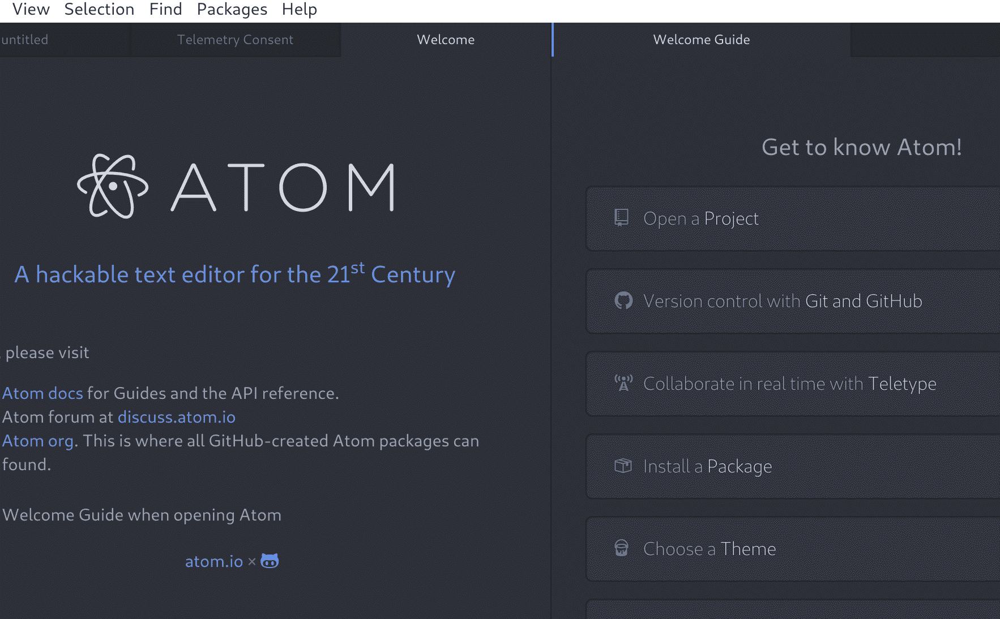
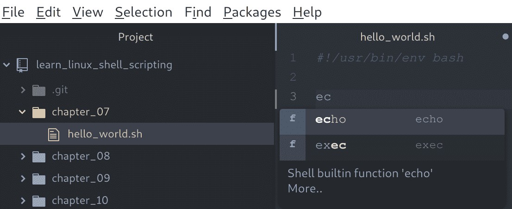
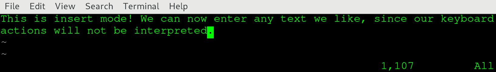
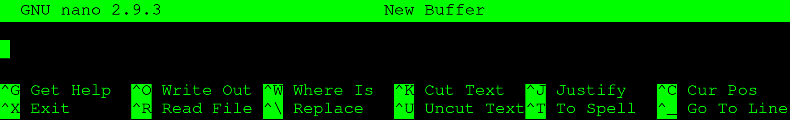
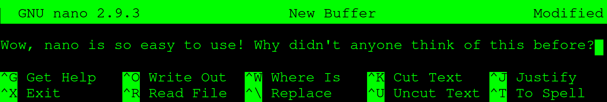
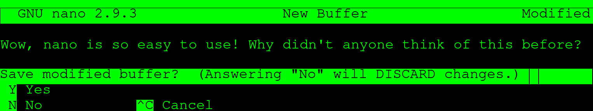
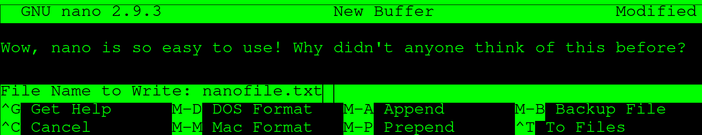

# 三、选择正确的工具

本章将介绍一些在我们编写 Bash 脚本时会有所帮助的工具。我们将重点介绍两类工具:基于 GUI 的编辑器( **Atom** 和 **Notepad++** )和基于终端的编辑器( **Vim** 和 **nano** )。我们将描述这些工具以及如何使用它们，它们的优点和缺点，以及如何同时使用基于图形用户界面和基于终端的编辑器来获得最佳效果。

本章将介绍以下命令:`vim`、`nano`和`ls`。

本章将涵盖以下主题:

*   使用图形编辑器编写 Shell 脚本
*   使用命令行编辑器编写 shell 脚本
*   编写 shell 脚本时将图形编辑器和命令行编辑器结合起来

# 技术要求

使用 Vim 或 nano 时，您将需要我们在上一章中创建的虚拟机。如果你想用记事本++，你需要一台 Windows 主机。对于 Atom，主机可以运行 Linux、macOS 或 Windows。

# 使用图形编辑器编写 Shell 脚本

自从第一个 Unix 和类似 Unix 的发行版以来，工具已经取得了很大的进步。在最早的时候，编写 shell 脚本要比现在困难得多:shell 的功能没有现在强大，文本编辑器只是命令行，语法高亮和自动完成等功能都不存在。今天，我们有非常强大的图形用户界面编辑器，将帮助我们的脚本冒险。为什么我们要等到运行脚本时才发现错误，而图形用户界面编辑器可能已经提前向我们显示了错误？如今，使用高级编辑器来编写 shell 脚本几乎是我们不可或缺的。

我们将在接下来的几页中描述两个文本编辑器:Atom 和 Notepad++。两者都是基于图形用户界面的，我们可以用它来进行高效的 shell 脚本编写。如果你已经对其中任何一个有了偏好，就选那个。如果您不确定，我们建议您使用 Atom。

# 原子

我们将考虑的第一个图形编辑器是由 GitHub 制作的 Atom。它被描述为*21 世纪的一个可黑客攻击的文本编辑器*。从这个意义上来说，Hackable 意味着虽然 Atom 的默认安装和任何文本编辑器一样完整，但这个应用确实很出色，因为它非常可配置和可扩展。任何没有被 GitHub 集成的东西都可以写成扩展包。通过使用这些扩展，您可以让您的 Atom 安装完全是您自己的；如果你不喜欢某事，改变它。如果不能开箱换，那就找个能换的包装。即使没有一个包可以实现您的期望，您仍然可以选择创建自己的包！

Atom 的另一个好特性是与 Git 和 GitHub 的默认集成。Git 是目前最流行的版本控制系统。编写代码或脚本时使用版本控制系统。它们确保保存文件的历史记录，并使多个(甚至许多)贡献者可以同时处理相同的文件，而不会因冲突管理而负担过重。GitHub，顾名思义，是目前最著名的基于 web 的开源软件 Git 提供商。

关于 Atom，我们想提到的最后一件大事是，默认情况下，它支持许多脚本和编程语言。当我们说*支持*时，我们的意思是它可以通过文件扩展名来识别文件类型，并提供语法高亮显示(这使得脚本编写更加容易！).这一功能是通过核心包提供的，核心包的工作方式与普通包相同，但从一开始就包含在内。出于我们的目的，核心包**语言 Shell 脚本**将帮助我们完成 Shell 脚本工作。

# Atom 安装和配置

让我们继续安装 Atom。只要你运行的是 Linux、macOS 或者 Windows，你就可以去[https://atom.io/](https://atom.io/)抓取安装程序。运行安装程序，如有必要，按照提示进行操作，直到安装好 Atom。现在，启动 Atom，您将看到欢迎屏幕，在撰写本文时，它看起来如下所示:



请务必查看 Atom 提供的所有屏幕。当您觉得已经探索了足够多的内容时，让我们向 Atom 添加一个包来补充我们的 shell 脚本。如果“欢迎指南”屏幕仍然打开，请从那里选择“安装软件包”。否则，可以使用快捷键 *Ctrl* + *、*调出设置画面。您将在那里看到一个安装选项，它将带您进入安装包屏幕。搜索`bash`，应该会看到如下包:


单击安装按钮并观看安装。安装后，可能会提示您重新启动 Atom 一定要这样做。如果您没有被提示，但看到任何类型的错误，重新启动 Atom 从来都不是一个坏主意。安装软件包后，您现在可以在编写 shell 脚本时使用自动完成功能。这意味着您可以开始键入，Atom 将尝试以以下方式预测您想要的内容:



在右侧，您可以看到我们开始键入`echo` shell 命令，在前两个字母之后，Atom 向我们展示了包含这两个字母的两个选项。一旦它提出建议，我们可以按*进入*，命令被完全插入。虽然在这种情况下不会节省太多时间，但有两个主要原因可以说明这一点:

*   如果您不确定该命令的确切名称，您可以使用自动完成功能找到它。
*   一旦你开始写条件句和循环(在本书的第二部分)，自动完成将跨越多行，省去了你输入许多单词和记住所有的语法。

最后，让我们看看当您打开一个 Git 项目并处理文件时，Atom 是什么样子的:


在 Atom 中工作时，屏幕大多会是这样的。在左手边，你会看到**树状图**，你可以通过按 *Ctrl* + *\* 来切换开/关。树视图包含当前项目中的所有文件(这是您已经打开的目录)。所有这些文件都可以通过双击打开，这使得它们出现在中间:**编辑器视图**。这是您花费大部分时间处理 shell 脚本的地方。编辑器视图将始终可见，即使当前没有打开的文件。

默认情况下，最后一个视图是位于右侧的 **Git 视图**。按下*Ctrl*+*Shift*+*9*即可切换此视图。这本书的代码托管在 GitHub 上，你可以下载一次(或者用 Git 的话来说，克隆一次*)，而不需要在远程服务器上编辑。因此，本书不需要 Git 视图，但我们提到它是因为您可能会将它用于其他项目。*

 *# 记事本++

在 Atom 更接近于**集成开发环境** ( **IDE** )而不是文本编辑器的地方，Notepad++就像它的名字所暗示的那样:有一些附加特性的好的旧 Notepad。其中一些新增功能包括能够同时打开多个文件、语法高亮显示和有限的自动完成。它最初发布于 2003 年，只在 Windows 上运行。

记事本++的特点是简单。如果你熟悉任何一种记事本软件(谁不熟悉？)，记事本++应该是即时可识别的。虽然我们建议在本书中使用 Atom，但使用记事本++这样的简单解决方案绝对不会阻碍您。然而，在商业环境中，您几乎总是会在已经存在的版本控制存储库中创建脚本，这是 Atom 的新增特性真正闪耀的地方。

如果你想查看记事本++，从[https://notepad-plus-plus.org/download](https://notepad-plus-plus.org/download)获取并运行安装程序(记住，只有在 Windows 上！).保留默认选项，安装后运行记事本++。您应该会看到以下屏幕:


如你所见，当你打开一个以`.sh`结尾的文件时，你会看到语法高亮。这是因为`.sh`扩展名是为 shell 脚本文件保留的。这可以极大地帮助你写脚本。使用基于颜色的语法高亮显示，丢失的引号打乱脚本的例子将变得非常明显，这可能会为您节省很多故障排除时间。

Notepad++还有许多其他特性，使它成为一个很好的增强记事本。您可以使用宏来执行脚本任务，可以安装插件来扩展功能，还有许多独特的功能使记事本++成为一个有吸引力的选项。

# 使用命令行编辑器

能够使用命令行编辑器是任何使用 Linux 的人迟早都应该学习的技能。对于带有图形用户界面的 Linux 安装，可以用图形用户界面工具来代替，如 Atom 或记事本上发行版的内置变体。然而，服务器安装几乎永远不会有图形用户界面，您将不得不依赖命令行文本编辑器。虽然这听起来令人生畏，但事实并非如此！为了给你一个命令行编辑器的小介绍，我们将回顾大多数 Linux 发行版中最流行的两个应用: **Vim** 和 **GNU nano** 。

# 精力

我们将讨论的第一个命令行文本编辑器可能是最受 Linux 欢迎的: **Vim** 。Vim 源自术语 **Vi 改良版**，因为它是 Unix 编辑器 Vi 的更新克隆。它是由布莱姆·米勒创建的，现在仍然由他维护，他在 1991 年首次公开发布了 Vim。Vim(或者说，在非常古老的 T4 T5 系统上，Vi)应该出现在你会遇到的所有 Unix 或类似 Unix 的机器上。

Vim 被认为是一个很难学习的工具。这主要是因为它的工作方式与大多数人习惯的文本编辑器非常不同。然而，一旦最初的学习曲线结束，许多人都同意，许多动作可以在 Vim 中比在*普通*文本编辑器(如微软的 Notepad++)中更快地完成。

我们跳进来吧！登录到您的虚拟机:

```sh
$ ssh reader@localhost -p 2222
```

登录后，打开 Vim 到一个空文件:

```sh
$ vim
```

迎接你的应该是类似以下的东西:


Vim 开始一个新的过程，使用你的整个终端(不要担心，一旦你退出 Vim，一切仍将在你离开的地方！).当您启动 Vim 时，您将被置于**正常**模式。Vim 有多种模式，其中 normal 和 **insert** 是最值得探索的。在正常模式下，您不能像在记事本或 Word 中那样开始键入。由于 Vim 被设计成在没有鼠标的情况下使用，它也需要一种操作文本的方法。当一些应用决定为此使用修改器时(例如，在记事本中按住 *Shift* 键)，Vim 决定模式。让我们首先进入插入模式，这样我们就可以开始键入一些文本。按下 *I* 键，您的屏幕应切换到插入模式:


在插入模式下，我们冒昧地输入了一些文本。请务必执行相同的操作，完成后，按 *Esc* 返回正常模式:



如果对比两张截图，应该差别很大:左下角文字`-- INSERT --`不见了！当你处于一种不同于正常的模式时，那种模式会清晰地呈现在那里。如果你没有看到任何东西，你可以放心地假设你在正常模式。在正常模式下，我们可以使用箭头键导航。我们还可以通过几次按键来操作字符、单词甚至(多)行！比如点击`dd`注意你的整行刚刚被删了。如果你想找回它，点击`u`进行撤销。

一个挑战依然存在:退出 Vim。通常，您可能会想使用 *Esc* 按钮退出程序。如果你对 Linux 有点熟悉，你甚至可能知道一个好的 *Ctrl + C* 可能也会退出大多数程序。然而，这两种方法对 Vim 都不起作用: *Esc* 只会让你在正常模式下着陆，而 *Ctrl* + *C* 什么都不会做。要退出 Vim，请确保您处于正常模式，并输入以下内容:

```sh
:q!
```

这将退出当前文档，不保存任何内容。如果要*保存并退出*，请使用以下命令:

```sh
:x filename.txt
```

这会将您当前的文档保存为`filename.txt`，并将您返回到您的终端。请注意，通常您会使用以下命令在已经存在的文件上启动 Vim:

```sh
$ vim filename.txt
```

在这种情况下，保存和退出时不需要输入文件名；在那种情况下使用`:x`就足够了。`:x`实际上是`:wq`的简写。`:w`是*写*动作，用来保存文件，`:q`用来*退出。*组合，用于*保存和退出*。如果您想在编辑过程中的任何其他时间保存您的文件，您可以使用`:w`来完成。

# Vim 摘要

Vim 有许多令超级用户赞赏的命令。现在，请记住有两种重要的模式，正常和插入。按 *I* 可以从正常进入插入，按 *Esc* 可以回到正常模式。在插入模式下，Vim 的行为就像记事本或 Word 一样，但在正常模式下，您可以执行简单的文本操作，例如删除当前选择的整行。如果您想退出 Vim，进入正常模式，根据您是否想保存更改，输入`:q!`或`:x`。

Don't be afraid to start using Vim. While it might seem daunting at first, once you get the hang of it you can really perform file-related tasks on servers much more quickly. If you want to get a head start, take 30 minutes of your time and work through **vimtutor**. This command-line tool will get you up to speed with the basic usage of Vim really quickly! To start, simply navigate to your virtual machine, type `vimtutor`, and press *Enter*.

# -vim 的

`.vimrc`文件可以用来为 Vim 设置一些持久选项。使用这个文件，您可以定制您的 Vim 体验。有许多自定义的可能性:流行的例子包括设置配色方案，在制表符和空格之间转换，以及设置搜索选项。

要创建将在启动 Vim 时使用的`.vimrc`文件，请执行以下操作:

```sh
$ cd
$ vim .vimrc
```

第一个命令将您放置在`home`目录中(不要担心，这将在本书后面更详细地解释)。第二个为`.vimrc`文件启动一个 Vim 编辑器。不要忘记前面的点，因为这是 Linux 处理隐藏文件的方式(同样，稍后会有更多内容)。我们在`.vimrc`文件中使用了以下配置:

```sh
set expandtab
set tabstop=2
syntax on
colo peachpuff
set ignorecase
set smartcase
set number
```

通过这种配置，可以实现以下目标:

*   `set expandtab`:将制表符转换为空格。
*   `set tabstop=2`:每个制表符转换为两个空格。
*   `syntax on`:开启语法高亮显示(通过使用不同的颜色)。
*   `colorscheme peachpuff`:采用桃皮绒配色。
*   `set ignorecase`:搜索时忽略大小写。
*   `set smartcase`:用一个或多个大写字母搜索时不忽略大小写。
*   `set number`:显示行号。

# Vim 备忘单

为了让您开始了解一些关于 Vim 的重要命令，我们加入了一个备忘单。通过 **vimtutor** 工作后，附近有这个小抄几乎保证你可以正常使用 Vim！

按键是直接输入的。注意击键区分大小写，所以 *a* 不同于 *A* 。您可以按住大写字母的*移动*或使用*大写锁定*键。然而，最实用的方法是使用*换挡*:

| **击键** | **效果** |
| 转义字符 | 退出插入模式，返回命令模式。 |
| 我 | 在光标当前位置之前进入插入模式。 |
| a | 在光标的当前位置之后进入插入模式。 |
| 我 | 在当前行的开头进入插入模式。 |
| A | 在当前行的末尾进入插入模式。 |
| o | 进入插入模式，在当前行下插入新行。 |
| O | 进入插入模式，在当前行上方插入一个新行。 |
| 截止日期（Deadline Date 的缩写） | 删除当前行。 |
| u | 撤消在以前的插入模式中所做的更改。 |
| 控制 + r | 重做撤销。 |
| 尤尼克斯 | 拉下当前行。 |
| p | 将最后一条被拖动的线粘贴到当前线的下方。 |
| P | 将最后一条被拖动的线粘贴到当前线的上方。 |
| H | 导航到文件的开头。 |
| M | 导航到文件的中间。 |
| G | 导航到文件的结尾。 |
| dH | 删除文件开头之前的所有行(包括当前行)。 |
| 德意志留声机公司 | 删除所有行，直到文件结束(包括当前行)。 |

# NANOTECHNOLOGY 简称

GNU nano，通常被称为只是 nano，是另一个命令行编辑器，在大多数 Linux 安装中默认存在。顾名思义，它是 GNU 项目的一部分，与构成 Linux 发行版的许多其他部分没有什么不同(记住，Bash 也是 GNU 项目软件)。Nano 于 1999 年首次发布，旨在取代 Pico 文本编辑器，这是一种为 Unix 系统创建的简单文本编辑器。

与 Vim 相比，Nano 不仅仅是一个**所见即所得** ( **所见即所得**)的工具。与记事本和 Word 类似，nano 不使用不同的模式；它总是准备好开始键入您的文档或脚本。

在虚拟机上，打开 nano 编辑器屏幕:

```sh
$ nano
```

应该会出现类似以下的屏幕:



随意开始打字。它应该如下所示:



正如你所看到的，屏幕底部被预留用来呈现 nano 所说的**控制键**。虽然一开始可能不太明显，但是`^`是 *Ctrl* 的简写。如果想退出，按住 *Ctrl* 并按 *X* :



系统将提示您是否希望在保存或不保存文件的情况下退出。在这种情况下，我们按 *Y* 表示是。如果我们用一个文件名启动 nano，保存和退出会立即完成，但是因为我们在启动 nano 时没有文件名，所以会出现另一个选择:



输入文件名并按*进入*。你将回到你之前的终端屏幕，在你开始 nano 的目录中。如果一切顺利，您可以使用以下命令查看该文件:

```sh
$ ls -l
```


虽然 nano 有更高级的特性，但对于基本用法，我们已经讨论了最重要的特性。虽然它最初比 Vim 更容易使用，但它也没有 Vim 那么强大。简单说，nano 简单，Vim 强大。

如果你没有任何经验和/或偏好，我们的建议是花一点时间学习 Vim 并坚持下去。在花了更多的时间在 Linux 和 Bash 脚本上之后，Vim 的高级特性变得很难离开。然而，如果你不能习惯 Vim，不要羞于使用 nano:它是一个优秀的编辑器，可以让大多数工作顺利完成，没有太多麻烦！

# 编写 shell 脚本时将图形编辑器和命令行编辑器结合起来

为了让您了解我们如何将图形用户界面工具与命令行编辑器相结合，我们给出了以下示例工作流。不要担心还没有理解所有的步骤；在书的最后，你应该回到这个例子，确切地理解我们在说什么。

当您编写 shell 脚本时，通常会经历几个阶段:

1.  收集对 shell 脚本的要求。
2.  设计 Shell 脚本。
3.  编写 shell 脚本。
4.  测试并调整 shell 脚本。
5.  (可选)向版本控制系统提交工作 Shell 脚本。

第 1 阶段和第 2 阶段通常在没有编写实际代码的情况下完成。您考虑脚本的目的，如何实现它，以及通过创建脚本可以获得什么。这些步骤通常涉及研究和寻找最佳实践。当你觉得自己很清楚为什么要写 shell 脚本、写什么以及如何写的时候，你就进入第三阶段:写脚本。此时，您将打开您最喜欢的基于图形用户界面的编辑器，开始输入。因为图形用户界面编辑器内置了自动完成、语法突出显示和其他生产力功能，所以您可以高效地编写大多数 Shell 脚本代码。当您觉得您的脚本已经准备好进行测试之后，您需要离开您的图形用户界面:脚本必须在为其设计的系统上进行测试。

第四阶段开始。您可以使用 Vim 或 nano 将脚本复制并粘贴到服务器。一旦脚本在服务器上，您就可以运行它。很多时候，它实际上不会做你期望它做的所有事情。微小的错误很容易犯，也很容易修复，但是回到图形用户界面编辑器，更改它，保存它，将其传输到服务器，然后再次运行它，这将是一个小麻烦！幸运的是，我们可以使用 Vim 或 nano 进行微小的更改，以修复服务器上的脚本，然后重试。缺少`;` 或`"`会使 Shell 脚本无法使用，但它会很快修复(尽管图形用户界面编辑器中经常会突出显示这样的错误，因此即使是第一个版本，这些错误也不太可能出现在服务器上)。

最后，经过多次迭代，您的脚本将按预期工作。现在你必须确保完整和正确的脚本被上传到你的版本控制系统。建议最后一次将脚本从图形用户界面转移到服务器，看看您是否已经将在服务器上所做的所有更改应用到您的图形用户界面会话中。一旦完成，就提交，你就完成了！

# 摘要

在本章中，我们讨论了四种文本编辑工具，分为两种类型:基于图形用户界面的编辑器(Atom 和 Notepad++)和命令行编辑器(Vim 和 GNU nano)，然后展示了如何一起使用这些工具。

Atom 是一个强大的文本编辑器，可以按照您想要的方式进行配置。默认情况下，它支持许多不同的编码语言，包括 shell。它还带有 Git 和 GitHub 集成。我们还简要讨论了记事本++。虽然不如 Atom 强大，但它也适合我们的目的，因为它基本上是一个增强的记事本，具有 Shell 脚本的所有重要功能。

Vim 和 nano 是两种最流行的 Linux 命令行文本编辑器。我们了解到，虽然 Vim 非常强大，但它也比 nano 更难学。然而，学习如何正确使用 Vim 将加快您在 Linux 系统上做的许多事情，并且是一项非常有价值的技能。关于 Vim 的一个很好的实践介绍，请浏览 vimtutor。Nano 更容易使用，因为它更像微软 Word 和记事本中所见即所得的编辑风格。

我们以一个 shell 脚本之旅的例子结束了这一章。我们简要概述了如何将基于图形用户界面的编辑器与命令行编辑器结合使用。

本章介绍了以下命令:`vim`、`nano`和`ls`。

# 问题

1.  为什么语法高亮是文本编辑器的一个重要特性？
2.  我们如何扩展 Atom 已经提供的功能？
3.  编写 shell 脚本时，自动完成有什么好处？
4.  我们如何描述 Vim 和 GNU nano 的区别？
5.  Vim 中最有趣的两种模式是什么？
6.  `.vimrc`文件是什么？
7.  当我们称 nano 为所见即所得编辑器是什么意思？
8.  为什么我们要把图形用户界面编辑器和命令行编辑器结合起来？

# 进一步阅读

如果您想深入了解本章的主题，以下资源可能会很有意思:

*   *黑客 Vim 7.2* 作者:Kim Schulz，Packt Publishing:[https://www . packtpub . com/application-development/Hacking-Vim-72](https://www.packtpub.com/application-development/hacking-vim-72)*