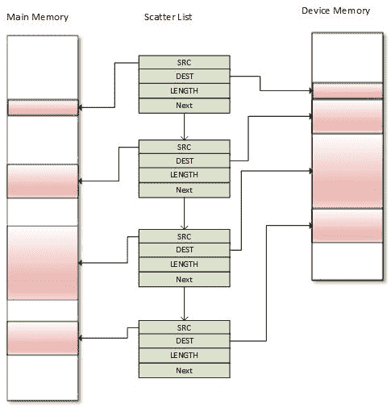
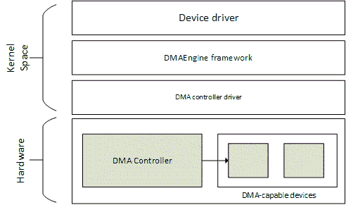

# 十二、直接存储器存取

DMA 是计算机系统的一个特性，它允许设备在没有 CPU 干预的情况下访问主系统内存 RAM，这样就可以让设备专心于其他任务。人们通常使用它来加速网络流量，但它支持任何类型的拷贝。

DMA 控制器是负责 DMA 管理的外设。人们大多在现代处理器和微控制器中找到它。DMA 是一种用于执行内存读写操作而不窃取 CPU 周期的功能。当需要传输一个数据块时，处理器向 DMA 控制器提供源地址、目的地址和总字节数。然后，DMA 控制器自动将数据从源传输到目标，而不会窃取 CPU 周期。当剩余字节数达到零时，块传输结束。

在本章中，我们将涵盖以下主题:

*   一致和不一致的 DMA 映射，以及一致性问题
*   直接存储器存取引擎应用编程接口
*   DMA 和 DT 绑定

# 设置直接存储器存取映射

对于任何类型的 DMA 传输，都需要提供源地址和目的地址，以及要传输的字数。在外设直接存储器存取的情况下，外设的先进先出要么作为源，要么作为目的地。当外设作为源时，存储器位置(内部或外部)作为目的地址。当外设作为目的地时，存储器位置(内部或外部)作为源地址。

对于外设 DMA，我们根据传输方向指定源或目的地。换句话说，DMA 传输需要合适的内存映射。这就是我们将在以下章节中讨论的内容。

# 高速缓存一致性和直接存储器存取

如第 11 章*内核内存管理*中所述，最近访问的内存区域的副本存储在缓存中。这也适用于直接存储器存取存储器。现实情况是，两个独立设备之间共享的内存通常是缓存一致性问题的根源。缓存不一致是一个问题，因为其他设备可能不知道写入设备的更新。另一方面，高速缓存一致性确保每个写操作看起来都是瞬间发生的，因此共享同一存储区域的所有设备看到的变化序列完全相同。

一致性问题的一个很好的解释情况在下面的 LDD3 摘录中说明:

Let us imagine a CPU equipped with a cache and an external memory that can be accessed directly by devices using DMA. When the CPU accesses location X in the memory, the current value will be stored in the cache. Subsequent operations on X will update the cached copy of X, but not the external memory version of X, assuming a write-back cache. If the cache is not flushed to the memory before the next time a device tries to access X, the device will receive a stale value of X. Similarly, if the cached copy of X is not invalidated when a device writes a new value to the memory, then the CPU will operate on a stale value of X.

解决这个问题实际上有两种方法:

*   基于硬件的解决方案。这样的系统是**相干系统**。
*   基于软件的解决方案，其中操作系统负责确保缓存一致性。人们称这样的系统为**非相干系统**。

# 直接存储器存取映射

任何合适的 DMA 传输都需要合适的内存映射。一个直接存储器存取映射包括分配一个直接存储器存取缓冲器和为它产生一个总线地址。设备实际上使用总线地址。总线地址是`dma_addr_t`类型的每个实例。

人们区分了两种类型的映射:**相干 DMA 映射**和**流式 DMA 映射**。可以在多次传输中使用前者，这将自动解决缓存一致性问题。所以，太贵了。流映射有很多限制，不能自动解决一致性问题，尽管有一个解决方案，它由每次传输之间的几个函数调用组成。一致性映射通常存在于驱动的生命周期中，而一旦 DMA 传输完成，通常会取消一个流映射的映射。

可以的时候应该使用流映射，必须的时候应该使用连贯映射。

回到代码；主报头应该包括以下内容来处理 DMA 映射:

```sh
#include <linux/dma-mapping.h> 
```

# 相干映射

以下函数设置一个连贯的映射:

```sh
void *dma_alloc_coherent(struct device *dev, size_t size, 
                     dma_addr_t *dma_handle, gfp_t flag)  
```

该函数处理缓冲区的分配和映射，并返回该缓冲区的内核虚拟地址，该地址为`size`字节宽，可由中央处理器访问。`dev`是你的设备结构。第三个参数是指向相关总线地址的输出参数。为映射分配的内存保证在物理上是连续的，`flag`决定应该如何分配内存，通常是`GFP_KERNEL`或`GFP_ATOMIC`(如果我们在原子上下文中)。

请注意，该映射据说是:

*   **一致(连贯)**，因为它为执行 DMA 的设备分配未缓存的无缓冲内存
*   **同步**，因为设备或中央处理器的写入可以立即被任何一方读取，而无需担心缓存一致性

为了释放映射，可以使用以下函数:

```sh
void dma_free_coherent(struct device *dev, size_t size, 
                 void *cpu_addr, dma_addr_t dma_handle); 
```

这里`cpu_addr`对应`dma_alloc_coherent()`返回的内核虚拟地址。这种映射成本很高，它能分配的最小空间是一个页面。事实上，它只分配了 2 的幂的页数。页面顺序通过`int order = get_order(size)`获得。应该将此映射用于设备寿命最长的缓冲区。

# 流式直接存储器存取映射

流映射有更多的限制，并且不同于相干映射，原因如下:

*   映射需要使用已经分配的缓冲区。
*   映射可以接受几个不连续且分散的缓冲区。
*   映射的缓冲区属于设备，不再属于中央处理器。在 CPU 可以使用缓冲区之前，应该先取消映射(在`dma_unmap_single()`或`dma_unmap_sg()`之后)。这是为了缓存。
*   对于写事务(中央处理器到设备)，驱动应该在映射之前将数据放入缓冲区。
*   必须指定数据移动的方向，并且只能基于该方向使用数据。

人们可能会想，为什么不应该访问缓冲区，直到它被取消映射。原因很简单:CPU 映射是可缓存的。用于流映射的`dma_map_*()`族函数将首先清除/无效与缓冲区相关的缓存，并依赖于中央处理器直到相应的`dma_unmap_*()`才访问它。然后，在中央处理器可以读取设备写入内存的任何数据之前，这将再次使缓存无效(如果必要的话)，以防同时发生任何推测性提取。现在 CPU 可以访问缓冲区了。

流映射实际上有两种形式:

*   单一缓冲区映射，只允许一页映射
*   分散/聚集映射，允许传递多个缓冲区(分散在内存中)

对于任一映射，方向应由类型为`enum dma_data_direction`的符号指定，在`include/linux/dma-direction.h`中定义:

```sh
enum dma_data_direction { 
   DMA_BIDIRECTIONAL = 0, 
   DMA_TO_DEVICE = 1, 
   DMA_FROM_DEVICE = 2, 
   DMA_NONE = 3, 
}; 
```

# 单缓冲映射

这是为了偶尔映射。可以用这个设置一个缓冲区:

```sh
dma_addr_t dma_map_single(struct device *dev, void *ptr, 
         size_t size, enum dma_data_direction direction); 
```

方向应为`DMA_TO_DEVICE`、`DMA_FROM_DEVICE`或`DMA_BIDIRECTIONAL,`，如前代码所述。`ptr`是缓冲区的内核虚拟地址，`dma_addr_t`是设备返回的总线地址。确保使用真正符合您需求的方向，而不仅仅是一直使用`DMA_BIDIRECTIONAL`。

应该用这个来释放映射:

```sh
void dma_unmap_single(struct device *dev, dma_addr_t dma_addr, 
              size_t size, enum dma_data_direction direction); 
```

# 分散/聚集映射

分散/聚集映射是一种特殊类型的流式直接存储器存取映射，在这种映射中，一次可以传输几个缓冲区，而不是单独映射每个缓冲区并逐个传输它们。假设您有几个物理上可能不连续的缓冲区，所有这些缓冲区都需要同时传输到设备或从设备传输出去。出现这种情况的原因可能是:

*   读写系统调用
*   磁盘输入/输出请求
*   或者仅仅是映射内核输入/输出缓冲区中的页面列表

内核将散点图表示为一个连贯的结构，`struct scatterlist`:

```sh
struct scatterlist { 
   unsigned long page_link; 
   unsigned int offset; 
   unsigned int length; 
   dma_addr_t dma_address; 
   unsigned int dma_length; 
}; 
```

为了建立分散列表映射，应该:

*   分配分散的缓冲区。
*   创建散布列表的数组，并使用`sg_set_buf().`用分配的内存填充它。注意散布列表条目必须是页面大小(除了结尾)。
*   在散点图上呼叫`dma_map_sg()`。
*   完成 DMA 后，调用`dma_unmap_sg()`取消映射散点图。

虽然通过单独映射每个缓冲区，可以一次一个地通过 DMA 发送几个缓冲区的内容，但是分散/聚集可以通过将指向分散列表的指针连同长度(列表中的条目数)一起发送到设备，一次发送全部内容:

```sh
u32 *wbuf, *wbuf2, *wbuf3; 
wbuf = kzalloc(SDMA_BUF_SIZE, GFP_DMA); 
wbuf2 = kzalloc(SDMA_BUF_SIZE, GFP_DMA); 
wbuf3 = kzalloc(SDMA_BUF_SIZE/2, GFP_DMA); 

struct scatterlist sg[3]; 
sg_init_table(sg, 3); 
sg_set_buf(&sg[0], wbuf, SDMA_BUF_SIZE); 
sg_set_buf(&sg[1], wbuf2, SDMA_BUF_SIZE); 
sg_set_buf(&sg[2], wbuf3, SDMA_BUF_SIZE/2); 
ret = dma_map_sg(NULL, sg, 3, DMA_MEM_TO_MEM); 
```

单缓冲映射部分中描述的相同规则适用于分散/聚集。



DMA scatter/gather

`dma_map_sg()`和`dma_unmap_sg()`负责缓存一致性。但是，如果需要在 DMA 传输之间使用相同的映射来访问(读/写)数据，则必须以适当的方式在每次传输之间同步缓冲区，如果 CPU 需要访问缓冲区，则通过`dma_sync_sg_for_cpu()`，如果是设备，则通过`dma_sync_sg_for_device()`。单区域映射的类似功能有`dma_sync_single_for_cpu()`和`dma_sync_single_for_device()`:

```sh
void dma_sync_sg_for_cpu(struct device *dev, 
                         struct scatterlist *sg, 
                         int nents, 
                         enum dma_data_direction direction); 
void dma_sync_sg_for_device(struct device *dev, 
                          struct scatterlist *sg, int nents, 
                          enum dma_data_direction direction); 

void dma_sync_single_for_cpu(struct device *dev, dma_addr_t addr, 
                           size_t size, 
                           enum dma_data_direction dir) 

void dma_sync_single_for_device(struct device *dev, 
                           dma_addr_t addr, size_t size, 
                           enum dma_data_direction dir) 
```

缓冲区取消映射后，无需再次调用前面的函数。你可以只看内容。

# 完成的概念

本节将简要描述完成和 DMA 传输使用的应用编程接口的必要部分。完整的描述请随意查看*documents/scheduler/completion . txt*的内核文档。内核编程中的一种常见模式是在当前线程之外启动一些活动，然后等待该活动完成。

当等待使用缓冲区时，完成是`sleep()`的一个很好的替代。它适合感知数据，这正是 DMA 回调的作用。

完成工作需要此标题:

```sh
<linux/completion.h>  
```

像其他内核设施数据结构一样，可以静态或动态地创建`struct completion`结构的实例:

*   静态声明和初始化如下所示:

```sh
 DECLARE_COMPLETION(my_comp); 
```

*   动态分配如下所示:

```sh
struct completion my_comp; 
init_completion(&my_comp); 
```

当驱动开始一些必须等待完成的工作(在我们的例子中是一个 DMA 事务)时，它只需要将完成事件传递给`wait_for_completion()`函数:

```sh
void wait_for_completion(struct completion *comp); 
```

当代码的某个其他部分确定完成已经发生(事务完成)时，它可以唤醒任何人(实际上是需要访问 DMA 缓冲区的代码)，他们正在等待以下操作之一:

```sh
void complete(struct completion *comp); 
void complete_all(struct completion *comp); 
```

可以猜测，`complete()`只会唤醒一个等待过程，而`complete_all()`会唤醒每一个等待那个事件的人。即使在`wait_for_completion()`之前调用`complete()`，完井也能正常工作。

随着在接下来的部分中使用的代码示例，人们将更好地理解这是如何工作的。

# 直接存储器存取引擎应用编程接口

DMA 引擎是开发 DMA 控制器驱动的通用内核框架。DMA 的主要目标是在复制内存时卸载 CPU。一种是通过使用通道将事务(输入/输出数据传输)委托给直接存储器存取引擎。DMA 引擎通过其驱动/应用编程接口公开一组通道，供其他设备(从设备)使用。



DMA Engine layout

在这里，我们将简单地浏览一下(从)应用编程接口，它只适用于从 DMA 使用。这里的强制标题如下:

```sh
 #include <linux/dmaengine.h> 
```

从属 DMA 的使用很简单，包括以下步骤:

1.  分配一个 DMA 从通道。
2.  设置从机和控制器的特定参数。
3.  获取事务的描述符。
4.  提交交易。
5.  发出挂起的请求并等待回调通知。

One can see a DMA channel as a highway for I/O data transfer

# 分配一个直接存储器存取从通道

使用`dma_request_channel()`请求频道。其原型如下:

```sh
struct dma_chan *dma_request_channel(const dma_cap_mask_t *mask, 
                          dma_filter_fn fn, void *fn_param); 
```

`mask`是一个位图掩码，表示通道必须满足的能力。人们基本上使用它来指定驱动需要执行的传输类型:

```sh
enum dma_transaction_type { 
    DMA_MEMCPY,     /* Memory to memory copy */ 
    DMA_XOR,        /* Memory to memory XOR*/ 
    DMA_PQ,         /* Memory to memory P+Q computation */ 
    DMA_XOR_VAL,    /* Memory buffer parity check using XOR */ 
    DMA_PQ_VAL,     /* Memory buffer parity check using P+Q */ 
    DMA_INTERRUPT,  /* The device is able to generrate dummy transfer that will generate interrupts */ 
    DMA_SG,         /* Memory to memory scatter gather */ 
    DMA_PRIVATE,    /* channels are not to be used for global memcpy. Usually used with DMA_SLAVE */ 
    DMA_SLAVE,      /* Memory to device transfers */ 
    DMA_CYCLIC,     /* Device is ableto handle cyclic tranfers */ 
    DMA_INTERLEAVE, /* Memoty to memory interleaved transfer */ 
} 
```

`The dma_cap_zero()`和`dma_cap_set()`功能用于清除掩码和设置我们需要的能力。例如:

```sh
dma_cap_mask my_dma_cap_mask; 
struct dma_chan *chan; 
dma_cap_zero(my_dma_cap_mask); 
dma_cap_set(DMA_MEMCPY, my_dma_cap_mask); /* Memory to memory copy */ 
chan = dma_request_channel(my_dma_cap_mask, NULL, NULL); 
```

在前面的摘录中，`dma_filter_fn`被定义为:

```sh
typedef bool (*dma_filter_fn)(struct dma_chan *chan, 
                void *filter_param); 
```

如果`filter_fn`参数(可选)为`NULL`，`dma_request_channel()`将简单地返回满足能力掩码的第一个通道。否则，当屏蔽参数不足以指定必要的通道时，可以使用`filter_fn`程序作为系统中可用通道的过滤器。内核为系统中的每个空闲通道调用一次`filter_fn`例程。当看到合适的通道时，`filter_fn`应该返回`DMA_ACK,`，它会将给定的通道标记为来自`dma_request_channel()`的返回值。

通过该接口分配的通道是呼叫者专用的，直到调用`dma_release_channel()`为止:

```sh
void dma_release_channel(struct dma_chan *chan) 
```

# 设置从机和控制器的特定参数

这一步引入了一个新的数据结构`struct dma_slave_config`，它代表了 DMA 从通道的运行时配置。这允许客户端为外设指定设置，如直接存储器存取方向、直接存储器存取地址、总线宽度、直接存储器存取突发长度等。

```sh
int dmaengine_slave_config(struct dma_chan *chan, 
struct dma_slave_config *config) 
```

`struct dma_slave_config`结构如下:

```sh
/* 
 * Please refer to the complete description in 
 * include/linux/dmaengine.h 
 */ 
struct dma_slave_config { 
   enum dma_transfer_direction direction; 
   phys_addr_t src_addr; 
   phys_addr_t dst_addr; 
   enum dma_slave_buswidth src_addr_width; 
   enum dma_slave_buswidth dst_addr_width; 
   u32 src_maxburst; 
   u32 dst_maxburst; 
   [...] 
}; 
```

以下是结构中每个柠檬的含义:

*   `direction`:这表示数据应该在这个从通道上输入还是输出，此时。可能的值有:

```sh
/* dma transfer mode and direction indicator */ 
enum dma_transfer_direction { 
    DMA_MEM_TO_MEM, /* Async/Memcpy mode */ 
    DMA_MEM_TO_DEV, /* From Memory to Device */ 
    DMA_DEV_TO_MEM, /* From Device to Memory */ 
    DMA_DEV_TO_DEV, /* From Device to Device */ 
    [...] 
}; 
```

*   `src_addr`:这是应该读取 DMA 从机数据(RX)的缓冲区的物理地址(实际上是总线地址)。如果源是内存，则忽略此元素。`dst_addr`是应该写入 DMA 从机数据的缓冲区的物理地址(实际上是总线地址)(TX)，如果源是内存，则忽略。`src_addr_width`是应该读取 DMA 数据的源(RX)寄存器的字节宽度。如果源是内存，这可能会被忽略，具体取决于架构。合法值是 1、2、4 或 8。所以`dst_addr_width`和`src_addr_width`是一样的，只不过是针对目的地目标(TX)。
*   任何总线宽度都必须是下列枚举之一:

```sh
enum dma_slave_buswidth { 
        DMA_SLAVE_BUSWIDTH_UNDEFINED = 0, 
        DMA_SLAVE_BUSWIDTH_1_BYTE = 1, 
        DMA_SLAVE_BUSWIDTH_2_BYTES = 2, 
        DMA_SLAVE_BUSWIDTH_3_BYTES = 3, 
        DMA_SLAVE_BUSWIDTH_4_BYTES = 4, 
        DMA_SLAVE_BUSWIDTH_8_BYTES = 8, 
        DMA_SLAVE_BUSWIDTH_16_BYTES = 16, 
        DMA_SLAVE_BUSWIDTH_32_BYTES = 32, 
        DMA_SLAVE_BUSWIDTH_64_BYTES = 64, 
}; 
```

*   `src_maxburs`:这是一个突发中可以发送到设备的最大字数(这里，将单词视为`src_addr_width`成员的单位，而不是字节)。通常，输入/输出外设上的先进先出深度约为一半，因此不会溢出。这可能适用于也可能不适用于内存源。`dst_maxburst`与`src_maxburst`相同，但为目的地目标。

例如:

```sh
struct dma_chan *my_dma_chan; 
dma_addr_t dma_src, dma_dst; 
struct dma_slave_config my_dma_cfg = {0}; 

/* No filter callback, neither filter param */ 
my_dma_chan = dma_request_channel(my_dma_cap_mask, 0, NULL); 

/* scr_addr and dst_addr are ignored in this structure for mem to mem copy */ 
my_dma_cfg.direction = DMA_MEM_TO_MEM; 
my_dma_cfg.dst_addr_width = DMA_SLAVE_BUSWIDTH_32_BYTES; 

dmaengine_slave_config(my_dma_chan, &my_dma_cfg); 

char *rx_data, *tx_data; 
/* No error check */ 
rx_data = kzalloc(BUFFER_SIZE, GFP_DMA); 
tx_data = kzalloc(BUFFER_SIZE, GFP_DMA); 

feed_data(tx_data); 

/* get dma addresses */ 
dma_src_addr = dma_map_single(NULL, tx_data, 
BUFFER_SIZE, DMA_MEM_TO_MEM); 
dma_dst_addr = dma_map_single(NULL, rx_data, 
BUFFER_SIZE, DMA_MEM_TO_MEM); 
```

在前面的摘录中，调用`dma_request_channel()`函数是为了获取 DMA 通道的所有者芯片，在该芯片上调用`dmaengine_slave_config()`来应用其配置。`dma_map_single()`被调用是为了映射 rx 和 tx 缓冲区，以便这些缓冲区可以用于 DMA 目的。

# 获取事务的描述符

如果您还记得本节的第一步，当一个人请求一个 DMA 通道时，返回值是`struct dma_chan`结构的一个实例。如果你看一下它在`include/linux/dmaengine.h`中的定义，你会注意到它包含一个`struct dma_device *device`字段，代表提供通道的 DMA 设备(实际上是控制器)。该控制器的内核驱动负责(这是内核 API 为 DMA 控制器驱动强加的规则)公开一组函数来准备 DMA 事务，其中每个函数对应于一个 DMA 事务类型(在步骤 1 中枚举)。根据交易类型，人们别无选择，只能选择专用功能。其中一些功能是:

*   `device_prep_dma_memcpy()`:准备记忆操作
*   `device_prep_dma_sg()`:准备分散/聚集记忆操作
*   `device_prep_dma_xor()`:对于异或运算
*   `device_prep_dma_xor_val()`:准备异或验证操作
*   `device_prep_dma_pq()`:准备 pq 操作
*   `device_prep_dma_pq_val()`:准备 pqzero_sum 操作
*   `device_prep_dma_memset()`:准备记忆集操作
*   `device_prep_dma_memset_sg()`:对于散点图上的记忆集操作
*   `device_prep_slave_sg()`:准备从 DMA 操作
*   `device_prep_interleaved_dma()`:以泛型方式传递表达式

让我们来看看`drivers/dma/imx-sdma.c`，这是 i.MX6 DMA 控制器(SDMA)驱动。这些函数都返回一个指向`struct dma_async_tx_descriptor`结构的指针，该结构对应于事务描述符。对于内存到内存的拷贝，将使用`device_prep_dma_memcpy`:

```sh
struct dma_device *dma_dev = my_dma_chan->device; 
struct dma_async_tx_descriptor *tx = NULL; 

tx = dma_dev->device_prep_dma_memcpy(my_dma_chan, dma_dst_addr, 
dma_src_addr, BUFFER_SIZE, 0); 

if (!tx) { 
    printk(KERN_ERR "%s: Failed to prepare DMA transfer\n", 
               __FUNCTION__); 
    /* dma_unmap_* the buffer */ 
} 
```

其实我们应该用`dmaengine_prep_*` DMA 引擎 API。请注意，这些函数在内部执行我们之前执行的功能。例如，对于内存到内存，可以使用`device_prep_dma_memcpy ()`功能:

```sh
struct dma_async_tx_descriptor *(*device_prep_dma_memcpy)( 
         struct dma_chan *chan, dma_addr_t dst, dma_addr_t src, 
         size_t len, unsigned long flags) 
```

我们的示例如下:

```sh
struct dma_async_tx_descriptor *tx = NULL; 
tx = dma_dev->device_prep_dma_memcpy(my_dma_chan, dma_dst_addr, 
dma_src_addr, BUFFER_SIZE, 0); 
if (!tx) { 
    printk(KERN_ERR "%s: Failed to prepare DMA transfer\n", 
               __FUNCTION__); 
    /* dma_unmap_* the buffer */ 
} 
```

请看一下`struct dma_device`结构定义中的`include/linux/dmaengine.h`，看看这些钩子是如何实现的。

# 提交交易

要将事务放入驱动等待队列，可以使用`dmaengine_submit()`。一旦准备好描述符并添加了回调信息，就应该将它放在等待队列的 DMA 引擎驱动上:

```sh
dma_cookie_t dmaengine_submit(struct dma_async_tx_descriptor *desc) 
```

该函数返回一个 cookie，可以用来通过其他 DMA 引擎检查 DMA 活动的进度。`dmaengine_submit()`不会启动 DMA 操作，它只是将其添加到挂起队列中。下一步将讨论如何开始交易:

```sh
struct completion transfer_ok; 
init_completion(&transfer_ok); 
tx->callback = my_dma_callback; 

/* Submit our dma transfer */ 
dma_cookie_t cookie = dmaengine_submit(tx); 

if (dma_submit_error(cookie)) { 
    printk(KERN_ERR "%s: Failed to start DMA transfer\n", __FUNCTION__); 
    /* Handle that */ 
[...] 
} 
```

# 发出挂起的 DMA 请求并等待回调通知

启动事务是 DMA 传输设置的最后一步。通过调用通道上的`dma_async_issue_pending()`，激活该通道的待处理队列中的事务。如果通道空闲，则队列中的第一个事务开始，后续事务排队。DMA 操作完成后，队列中的下一个操作将启动，并触发小任务。此小任务负责调用客户端驱动完成回调例程进行通知，如果设置了:

```sh
void dma_async_issue_pending(struct dma_chan *chan); 
```

一个示例如下所示:

```sh
dma_async_issue_pending(my_dma_chan); 
wait_for_completion(&transfer_ok); 

dma_unmap_single(my_dma_chan->device->dev, dma_src_addr, 
BUFFER_SIZE, DMA_MEM_TO_MEM); 
dma_unmap_single(my_dma_chan->device->dev, dma_src_addr, 
               BUFFER_SIZE, DMA_MEM_TO_MEM); 

/* Process buffer through rx_data and tx_data virtualaddresses. */ 
```

`wait_for_completion()`函数将被阻塞，直到我们的 DMA 回调被调用，这将更新(完成)我们的完成变量，以便恢复之前阻塞的代码。是`while (!done) msleep(SOME_TIME);`的合适替代品。

```sh
static void my_dma_callback() 
{ 
    complete(transfer_ok); 
    return; 
} 
```

The DMA engine API function that actually issues pending transactions is `dmaengine_issue_pending(struct dma_chan *chan)`, which is a wrap around `dma_async_issue_pending()`.

# 综合起来——恩智浦 SDMA(即 MX6)

SDMA 引擎是 i.MX6 中的一个可编程控制器，每个外设在这个控制器中都有自己的复制功能。人们用这个`enum`来确定他们的地址:

```sh
enum sdma_peripheral_type { 
    IMX_DMATYPE_SSI,    /* MCU domain SSI */ 
    IMX_DMATYPE_SSI_SP, /* Shared SSI */ 
    IMX_DMATYPE_MMC,    /* MMC */ 
    IMX_DMATYPE_SDHC,   /* SDHC */ 
    IMX_DMATYPE_UART,   /* MCU domain UART */ 
    IMX_DMATYPE_UART_SP,    /* Shared UART */ 
    IMX_DMATYPE_FIRI,   /* FIRI */ 
    IMX_DMATYPE_CSPI,   /* MCU domain CSPI */ 
    IMX_DMATYPE_CSPI_SP,    /* Shared CSPI */ 
    IMX_DMATYPE_SIM,    /* SIM */ 
    IMX_DMATYPE_ATA,    /* ATA */ 
    IMX_DMATYPE_CCM,    /* CCM */ 
    IMX_DMATYPE_EXT,    /* External peripheral */ 
    IMX_DMATYPE_MSHC,   /* Memory Stick Host Controller */ 
    IMX_DMATYPE_MSHC_SP, /* Shared Memory Stick Host Controller */ 
    IMX_DMATYPE_DSP,    /* DSP */ 
    IMX_DMATYPE_MEMORY, /* Memory */ 
    IMX_DMATYPE_FIFO_MEMORY,/* FIFO type Memory */ 
    IMX_DMATYPE_SPDIF,  /* SPDIF */ 
    IMX_DMATYPE_IPU_MEMORY, /* IPU Memory */ 
    IMX_DMATYPE_ASRC,   /* ASRC */ 
    IMX_DMATYPE_ESAI,   /* ESAI */ 
    IMX_DMATYPE_SSI_DUAL,   /* SSI Dual FIFO */ 
    IMX_DMATYPE_ASRC_SP,    /* Shared ASRC */ 
    IMX_DMATYPE_SAI,    /* SAI */ 
}; 
```

尽管有通用的 DMA 引擎 API，任何构造函数都可以提供自己的自定义数据结构。这是`imx_dma_data`结构的情况，它是一个私有数据(用于描述需要使用的 DMA 设备类型)，将被传递到过滤器回调中`struct dma_chan`的`.private`字段:

```sh
struct imx_dma_data { 
    int dma_request; /* DMA request line */ 
    int dma_request2; /* secondary DMA request line */ 
    enum sdma_peripheral_type peripheral_type; 
    int priority; 
}; 

enum imx_dma_prio { 
    DMA_PRIO_HIGH = 0, 
    DMA_PRIO_MEDIUM = 1, 
    DMA_PRIO_LOW = 2 
}; 
```

这些结构和枚举都是特定于 i.MX 的，并在`include/linux/platform_data/dma-imx.h`中定义。现在，让我们编写我们的内核 DMA 模块。它分配两个缓冲区(源和目标)。用预定义的数据填充源，并执行一个事务，以便将 src 复制到 dst 中。可以通过使用来自用户空间(`copy_from_user()`)的数据来改进该模块。该驱动的灵感来自 imx 测试包中提供的驱动:

```sh
#include <linux/module.h> 
#include <linux/slab.h>     /* for kmalloc */ 
#include <linux/init.h> 
#include <linux/dma-mapping.h> 
#include <linux/fs.h> 
#include <linux/version.h> 
#if (LINUX_VERSION_CODE >= KERNEL_VERSION(3,0,35)) 
#include <linux/platform_data/dma-imx.h> 
#else 
#include <mach/dma.h> 
#endif 

#include <linux/dmaengine.h> 
#include <linux/device.h> 

#include <linux/io.h> 
#include <linux/delay.h> 

static int gMajor; /* major number of device */ 
static struct class *dma_tm_class; 
u32 *wbuf;  /* source buffer */ 
u32 *rbuf;  /* destinationn buffer */ 

struct dma_chan *dma_m2m_chan;  /* our dma channel */ 
struct completion dma_m2m_ok;   /* completion variable used in the DMA callback */ 
#define SDMA_BUF_SIZE  1024 
```

让我们定义过滤函数。当一个人请求一个直接存储器存取通道时，控制器驱动可以在一个通道列表(它有)中执行查找。对于细粒度的查找，可以提供一个回调方法，该方法将在找到的每个通道上调用。然后由回调来选择要使用的合适频道:

```sh
static bool dma_m2m_filter(struct dma_chan *chan, void *param) 
{ 
    if (!imx_dma_is_general_purpose(chan)) 
        return false; 
    chan->private = param; 
    return true; 
} 
```

`imx_dma_is_general_purpose`是检查控制器驱动名称的特殊功能。`open`函数将分配缓冲区并请求 DMA 通道，给定我们的过滤器函数作为回调:

```sh
int sdma_open(struct inode * inode, struct file * filp) 
{ 
    dma_cap_mask_t dma_m2m_mask; 
    struct imx_dma_data m2m_dma_data = {0}; 

    init_completion(&dma_m2m_ok); 

    dma_cap_zero(dma_m2m_mask); 
    dma_cap_set(DMA_MEMCPY, dma_m2m_mask); /* Set channel capacities */ 
    m2m_dma_data.peripheral_type = IMX_DMATYPE_MEMORY; /* choose the dma device type. This is proper to i.MX */ 
    m2m_dma_data.priority = DMA_PRIO_HIGH;  /* we need high priority */ 

    dma_m2m_chan = dma_request_channel(dma_m2m_mask, dma_m2m_filter, &m2m_dma_data); 
    if (!dma_m2m_chan) { 
        printk("Error opening the SDMA memory to memory channel\n"); 
        return -EINVAL; 
    } 

    wbuf = kzalloc(SDMA_BUF_SIZE, GFP_DMA); 
    if(!wbuf) { 
        printk("error wbuf !!!!!!!!!!!\n"); 
        return -1; 
    } 

    rbuf = kzalloc(SDMA_BUF_SIZE, GFP_DMA); 
    if(!rbuf) { 
        printk("error rbuf !!!!!!!!!!!\n"); 
        return -1; 
    } 

    return 0; 
} 
```

`release`功能只是做`open`功能的反向；它释放缓冲区并释放 DMA 通道:

```sh
int sdma_release(struct inode * inode, struct file * filp) 
{ 
    dma_release_channel(dma_m2m_chan); 
    dma_m2m_chan = NULL; 
    kfree(wbuf); 
    kfree(rbuf); 
    return 0; 
} 
```

在`read`功能中，我们只是比较源缓冲区和目的缓冲区，并通知用户结果。

```sh
ssize_t sdma_read (struct file *filp, char __user * buf, 
size_t count, loff_t * offset) 
{ 
    int i; 
    for (i=0; i<SDMA_BUF_SIZE/4; i++) { 
        if (*(rbuf+i) != *(wbuf+i)) { 
            printk("Single DMA buffer copy falled!,r=%x,w=%x,%d\n", *(rbuf+i), *(wbuf+i), i); 
            return 0; 
        } 
    } 
    printk("buffer copy passed!\n"); 
    return 0; 
} 
```

我们使用完成是为了在交易终止时得到通知(唤醒)。该回调在我们的事务完成后调用，并将我们的完成变量设置为完成状态:

```sh
static void dma_m2m_callback(void *data) 
{ 
    printk("in %s\n",__func__); 
    complete(&dma_m2m_ok); 
    return ; 
} 
```

在`write`函数中，我们用数据填充我们的源缓冲区，执行 DMA 映射以获得对应于我们的源和目的缓冲区的物理地址，并调用`device_prep_dma_memcpy`来获得事务描述符。该事务描述符随后被提交给带有`dmaengine_submit`的 DMA 引擎，该引擎尚未执行我们的事务。只有在我们的 DMA 通道上调用`dma_async_issue_pending`之后，我们的待处理事务才会被处理:

```sh
ssize_t sdma_write(struct file * filp, const char __user * buf, 
                         size_t count, loff_t * offset) 
{ 
    u32 i; 
    struct dma_slave_config dma_m2m_config = {0}; 
    struct dma_async_tx_descriptor *dma_m2m_desc; /* transaction descriptor */ 
    dma_addr_t dma_src, dma_dst; 

    /* No copy_from_user, we just fill the source buffer with predefined data */ 
    for (i=0; i<SDMA_BUF_SIZE/4; i++) { 
        *(wbuf + i) = 0x56565656; 
    } 

    dma_m2m_config.direction = DMA_MEM_TO_MEM; 
    dma_m2m_config.dst_addr_width = DMA_SLAVE_BUSWIDTH_4_BYTES; 
    dmaengine_slave_config(dma_m2m_chan, &dma_m2m_config); 

    dma_src = dma_map_single(NULL, wbuf, SDMA_BUF_SIZE, DMA_TO_DEVICE); 
    dma_dst = dma_map_single(NULL, rbuf, SDMA_BUF_SIZE, DMA_FROM_DEVICE); 
    dma_m2m_desc = dma_m2m_chan->device->device_prep_dma_memcpy(dma_m2m_chan, dma_dst, dma_src, SDMA_BUF_SIZE,0); 
    if (!dma_m2m_desc) 
        printk("prep error!!\n"); 
    dma_m2m_desc->callback = dma_m2m_callback; 
    dmaengine_submit(dma_m2m_desc); 
    dma_async_issue_pending(dma_m2m_chan); 
    wait_for_completion(&dma_m2m_ok); 
    dma_unmap_single(NULL, dma_src, SDMA_BUF_SIZE, DMA_TO_DEVICE); 
    dma_unmap_single(NULL, dma_dst, SDMA_BUF_SIZE, DMA_FROM_DEVICE); 

    return 0; 
} 

struct file_operations dma_fops = { 
    open: sdma_open, 
    release: sdma_release, 
    read: sdma_read, 
    write: sdma_write, 
}; 
```

完整的代码可以在书的存储库中找到:`chapter-12/imx-sdma/imx-sdma-single.c`。还有一个模块可以用来执行相同的任务，但使用的是分散/聚集映射:`chapter-12/imx-sdma/imx-sdma-scatter-gather.c`。

# DMA DT 绑定

DMA 通道的 DT 绑定取决于 DMA 控制器节点，该节点依赖于 SoC，某些参数(如 DMA 单元)可能因 SoC 而异。这个例子只关注 i.MX SDMA 控制器，可以在内核源码*文档/device tree/bindings/DMA/fsl-imx-sdma . txt*中找到。

# 消费者约束

根据 SDMA 事件映射表，以下代码显示了 iMX 6 dual/6 quad 中外设的 DMA 请求信号:

```sh
uart1: serial@02020000 { 
    compatible = "fsl,imx6sx-uart", "fsl,imx21-uart"; 
    reg = <0x02020000 0x4000>; 
    interrupts = <GIC_SPI 26 IRQ_TYPE_LEVEL_HIGH>; 
    clocks = <&clks IMX6SX_CLK_UART_IPG>, 
                <&clks IMX6SX_CLK_UART_SERIAL>; 
    clock-names = "ipg", "per"; 
    dmas = <&sdma 25 4 0>, <&sdma 26 4 0>; 
    dma-names = "rx", "tx"; 
    status = "disabled"; 
}; 
```

DMA 属性中的第二个单元格(`25`和`26`)对应于 DMA 请求/事件标识。这些值来自 SoC 手册(在我们的例子中是 MX53)。请看一下[https://community . nxp . com/servlet/JiveServlet/download/614186-1-373516/imx 6 _ Firmware _ guide . pdf](https://community.nxp.com/servlet/JiveServlet/download/614186-1-373516/iMX6_Firmware_Guide.pdf)和[的 Linux 参考手册 https://community . nxp . com/servlet/JiveServlet/download/614186-1-373515/I . MX _ Linux _ Reference _ manual . pdf](https://community.nxp.com/servlet/JiveServlet/download/614186-1-373515/i.MX_Linux_Reference_Manual.pdf)。

第三个单元格指示要使用的优先级。接下来定义请求指定参数的驱动代码。可以在内核源代码树的`drivers/tty/serial/imx.c`中找到完整的代码:

```sh
static int imx_uart_dma_init(struct imx_port *sport) 
{ 
    struct dma_slave_config slave_config = {}; 
    struct device *dev = sport->port.dev; 
    int ret; 

    /* Prepare for RX : */ 
    sport->dma_chan_rx = dma_request_slave_channel(dev, "rx"); 
    if (!sport->dma_chan_rx) { 
        [...] /* cannot get the DMA channel. handle error */ 
    } 

    slave_config.direction = DMA_DEV_TO_MEM; 
    slave_config.src_addr = sport->port.mapbase + URXD0; 
    slave_config.src_addr_width = DMA_SLAVE_BUSWIDTH_1_BYTE; 
    /* one byte less than the watermark level to enable the aging timer */ 
    slave_config.src_maxburst = RXTL_DMA - 1; 
    ret = dmaengine_slave_config(sport->dma_chan_rx, &slave_config); 
    if (ret) { 
        [...] /* handle error */ 
    } 

    sport->rx_buf = kzalloc(PAGE_SIZE, GFP_KERNEL); 
    if (!sport->rx_buf) { 
        [...] /* handle error */ 
    } 

    /* Prepare for TX : */ 
    sport->dma_chan_tx = dma_request_slave_channel(dev, "tx"); 
    if (!sport->dma_chan_tx) { 
        [...] /* cannot get the DMA channel. handle error */ 
    } 

    slave_config.direction = DMA_MEM_TO_DEV; 
    slave_config.dst_addr = sport->port.mapbase + URTX0; 
    slave_config.dst_addr_width = DMA_SLAVE_BUSWIDTH_1_BYTE; 
    slave_config.dst_maxburst = TXTL_DMA; 
    ret = dmaengine_slave_config(sport->dma_chan_tx, &slave_config); 
    if (ret) { 
        [...] /* handle error */ 
    } 
    [...] 
} 
```

这里神奇的调用是`dma_request_slave_channel()`函数，它会根据 DMA 名称解析设备节点(在 DT 中)使用`of_dma_request_slave_channel()`来收集通道设置(参考[第 6 章](06.html#4QFR40-dbde2ca892a6480b9727afb6a9c9e924)、*设备树的概念*中的命名资源)。

# 摘要

直接存储器存取是许多现代中央处理器的一个特点。本章为您提供了使用内核直接存储器存取映射和直接存储器存取引擎应用编程接口充分利用该设备的必要步骤。学完这一章，我毫不怀疑你至少可以设置一个内存到内存的 DMA 传输。您可以在内核源代码树的 *Documentation/dmaengine/* 中找到更多信息。因此，下一章将讨论一个完全不同的主题 Linux 设备模型。