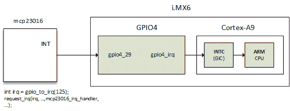

# 十六、高级内部评级管理

Linux 是一个系统，在这个系统上，设备通过 IRQ 向内核通知特定的事件。中央处理器公开连接的设备使用或不使用的 IRQ 线，这样当设备需要中央处理器时，它会向中央处理器发送请求。当中央处理器收到这个请求时，它会停止它的实际工作并保存它的上下文，以便为设备发出的请求提供服务。为设备提供服务后，其状态会恢复到中断发生时的停止状态。IRQ 线太多了，另一个设备要对 CPU 负责。该设备是中断控制器:


Interrupt controller and IRQ lines

设备不仅可以引发中断，一些处理器操作也可以。有两种不同类型的中断:

1.  同步中断称为**异常**，由 CPU 在处理指令时产生。这些是**不可屏蔽中断** ( **NMI** )，由硬件故障等严重故障引起。它们总是由中央处理器处理。
2.  异步中断称为**中断**，由其他硬件设备发出。这些是正常且可屏蔽的中断。这是我们将在本章下一节讨论的内容。因此，让我们更深入地探讨异常:

异常是内核处理的编程错误的结果，内核向程序发送信号并试图从错误中恢复。这些被分为两类，列举如下:

*   **处理器检测到的异常**:中央处理器为响应异常情况而产生的异常，分为三组:
    *   通常可以纠正的故障(虚假指令)。
    *   陷阱发生在用户进程中(无效内存访问，被零除)，也是一种响应系统调用切换到内核模式的机制。如果内核代码确实导致陷阱，它会立即恐慌。
    *   中止，严重错误。
*   **编程异常**:这些是程序员请求的，像陷阱一样处理。

以下数组列出了不可屏蔽的中断(更多详情请参考[http://wiki.osdev.org/Exceptions](http://wiki.osdev.org/Exceptions)):

| **中断号** | **描述** |
| Zero | 除以零误差 |
| one | 除错例外 |
| Two | NMI 中断 |
| three | 断点 |
| four | 检测到溢出 |
| five | 超出界限范围 |
| six | 无效操作码 |
| seven | 协处理器(设备)不可用 |
| eight | 两次发球失误 |
| nine | 协处理器段溢出 |
| Ten | 无效的任务状态段 |
| Eleven | 段不存在 |
| Twelve | 堆栈故障 |
| Thirteen | 一般保护故障 |
| Fourteen | 页面错误 |
| Fifteen | 内向的; 寡言少语的; 矜持的 |
| Sixteen | 协处理器错误 |
| 17 - 31 | 内向的; 寡言少语的; 矜持的 |
| 32 - 255 | 可屏蔽中断 |

nmi 足以覆盖整个例外列表。回到可屏蔽中断，它们的数量取决于连接的设备数量，以及它们实际上如何共享这些 IRQ 线路。有时，它们还不够，其中一些需要多路复用。常用的方法是通过 GPIO 控制器，它也充当中断控制器。在这一章中，我们将讨论内核提供的管理 IRQ 的应用编程接口，以及实现多路复用的方法，并在中断控制器驱动编写中进行深入探讨。

也就是说，本章将涵盖以下主题:

*   中断控制器和中断多路复用
*   高级外设 IRQ 管理
*   中断请求和传播(链式或嵌套)
*   gpiolib irqchip api
*   处理来自 DT 的中断控制器

# 多路复用中断和中断控制器

中央处理器只有一次中断通常是不够的。大多数系统都有几十个甚至几百个。现在来了中断控制器，允许它们被多路复用。架构或特定平台通常提供特定的设施，例如:

*   屏蔽/取消屏蔽单个中断
*   设定优先级
*   SMP 关联性
*   像唤醒中断这样奇特的事情

IRQ 管理和中断控制器驱动都依赖于 IRQ 域，而 IRQ 域又建立在以下结构之上:

*   `struct irq_chip`:这个结构实现了一套描述如何驱动中断控制器的方法，并且是由核心 IRQ 代码直接调用的。
*   `struct irqdomain`结构，提供:
    *   给定中断控制器(fwnode)的固件节点指针
    *   一种将一个中断请求的固件描述转换成该中断控制器本地标识的方法
    *   一种从 hwirq 中检索 IRQ 的 Linux 视图的方法
*   `struct irq_desc`:这个结构是 Linux 对一个中断的看法，包含所有的核心内容，并且一对一的映射到 Linux 中断号
*   `struct irq_action`:这个结构 Linux 用来描述一个 IRQ 处理程序
*   `struct irq_data`:嵌入在`struct irq_desc`结构中，包含:
    *   与管理该中断的`irq_chip`相关的数据
    *   Linux IRQ 号和 hwirq
    *   指向`irq_chip`的指针

几乎每一次`irq_chip`调用都会给出一个`irq_data`作为参数，从中可以得到相应的`irq_desc`。

所有前面的结构都是 IRQ 域 API 的一部分。中断控制器在内核中由`struct irq_chip`结构的实例表示，该实例描述了实际的硬件设备，以及 IRQ 内核使用的一些方法:

```sh
struct irq_chip { 
   struct device *parent_device; 
   const char  *name; 
   void (*irq_enable)(struct irq_data *data); 
   void (*irq_disable)(struct irq_data *data); 

   void (*irq_ack)(struct irq_data *data); 
   void (*irq_mask)(struct irq_data *data); 
   void (*irq_unmask)(struct irq_data *data); 
   void (*irq_eoi)(struct irq_data *data); 

   int (*irq_set_affinity)(struct irq_data *data, const struct cpumask *dest, bool force); 
   int (*irq_retrigger)(struct irq_data *data); 
   int (*irq_set_type)(struct irq_data *data, unsigned int flow_type); 
   int (*irq_set_wake)(struct irq_data *data, unsigned int on); 

   void (*irq_bus_lock)(struct irq_data *data); 
   void (*irq_bus_sync_unlock)(struct irq_data *data); 

   int (*irq_get_irqchip_state)(struct irq_data *data, enum irqchip_irq_state which, bool *state); 
   int(*irq_set_irqchip_state)(struct irq_data *data, enum irqchip_irq_state which, bool state); 

   unsigned long flags; 
}; 
```

以下是结构中元素的含义:

*   `parent_device`:这是一个指向这个 irqchip 的父级的指针。
*   `name`:这是`/proc/interrupts`文件的名字。
*   `irq_enable`:该钩子使能中断，如果`NULL`，其默认值为`chip->unmask`。
*   `irq_disable`:这将禁用中断。
*   ***** `irq_ack`:这是新中断的开始。有些控制器不需要这个。Linux 在中断被引发时就调用这个函数，远在它被服务之前。一些实现将该功能映射到`chip->disable()`，使得线路上的另一个中断请求不会导致另一个中断，直到当前中断请求被服务之后。
*   `irq_mask`:这是硬件中屏蔽中断源的钩子，这样就不能再引发了。
*   `irq_unmask`:这个钩子取消了中断源的屏蔽。
*   `irq_eoi` : eoi 代表**中断结束**。Linux 在 IRQ 服务完成后立即调用这个钩子。为了在该线路上接收另一个中断请求，可以根据需要使用该功能重新配置控制器。一些实现将此功能映射到`chip->enable()`以反转在`chip->ack()`完成的操作。
*   `irq_set_affinity`:这仅在 SMP 机器上设置 CPU 关联性。在 SMP 环境中，该函数设置中断服务的 CPU。该功能不用于单处理器机器。
*   `irq_retrigger`:这将重新触发硬件中的中断，这将向中央处理器重新发送一个 IRQ。
*   `irq_set_type`:设置一个 IRQ 的流类型(IRQ_TYPE_LEVEL/等等)。
*   `irq_set_wake`:这将启用/禁用 IRQ 的电源管理唤醒。
*   `irq_bus_lock`:用于锁定对慢速总线(I2C)芯片的访问。在这里锁定互斥就足够了。
*   `irq_bus_sync_unlock`:用于同步和解锁慢速总线(I2C)芯片。解锁先前锁定的互斥体。
*   `irq_get_irqchip_state`和`irq_set_irqchip_state`:分别返回或设置中断的内部状态。

每个中断控制器都有一个域，对于控制器来说，这个域就是一个进程的地址空间(参见[第 11 章](http://kernel)、*内核内存管理*)。中断控制器域在内核中被描述为`struct irq_domain`结构的一个实例。它管理硬件 IRQ 和 Linux IRQ(即虚拟 IRQ)之间的映射。它是硬件中断号转换对象:

```sh
struct irq_domain { 
   const char *name; 
   const struct irq_domain_ops *ops; 
   void *host_data; 
   unsigned int flags; 

   /* Optional data */ 
   struct fwnode_handle *fwnode; 
   [...] 
}; 
```

*   `name`是中断域的名称。
*   `ops`是 irq_domain 方法的指针。
*   `host_data`是所有者使用的私有数据指针。irqdomain 核心代码未触及。
*   `flags`是每个`irq_domain`标志的主机。
*   `fwnode`可选。它是一个指向与`irq_domain`相关联的 DT 节点的指针。解码 DT 中断说明符时使用。

中断控制器驱动通过调用其中一个`irq_domain_add_<mapping_method>()`函数来创建和注册`irq_domain`，其中`<mapping_method>`是 hwirq 应该映射到 Linux IRQ 的方法。这些是:

1.  `irq_domain_add_linear()`:这使用一个由 hwirq 编号索引的固定大小的表。当一个 hwirq 被映射时，一个`irq_desc`被分配给 hwirq，并且 irq 号被存储在表中。这种线性映射适用于固定和少量的 hwirq (~ < 256)。这种映射的不便之处在于表的大小，尽可能大的 hwirq 数。因此，IRQ 号码查找时间是固定的，`irq_desc`仅分配给在用 IRQ。大多数司机应该使用线性地图。该函数具有以下原型:

```sh
struct irq_domain *irq_domain_add_linear(struct device_node *of_node, 
                            unsigned int size, 
                            const struct irq_domain_ops *ops, 
                            void *host_data) 
```

2.  `irq_domain_add_tree()`:这是`irq_domain`维护基数树中 Linux IRQs 和 hwirq 号之间的映射的地方。当一个 hwirq 被映射时，一个`irq_desc`被分配，并且 hwirq 被用作基数树的查找关键字。如果 hwirq 数量非常大，树形图是一个很好的选择，因为它不需要分配与最大 hwirq 数量一样大的表。缺点是 hwirq 到 irq 号码的查找取决于表中有多少条目。很少有驱动需要这种映射。它有以下原型:

```sh
struct irq_domain *irq_domain_add_tree(struct device_node *of_node, 
                                  const struct irq_domain_ops *ops, 
                                  void *host_data) 
```

3.  `irq_domain_add_nomap()`:你大概永远不会用这个方法。尽管如此，它的完整描述可以在内核源代码树的*文档/IRQ-domain.txt* 中找到。它的原型是:

```sh
struct irq_domain *irq_domain_add_nomap(struct device_node *of_node, 
                              unsigned int max_irq, 
                              const struct irq_domain_ops *ops, 
                              void *host_data)  
```

`of_node`是中断控制器 DT 节点的指针。`size`表示域中中断的数量。`ops`代表映射/取消映射域回调，`host_data`是控制器的私有数据指针。

由于 IRQ 域在创建时开始为空(没有映射)，您应该使用`irq_create_mapping()`函数来创建映射并将其分配给域。在下一节中，我们将决定在代码中创建映射的正确位置:

```sh
unsigned int irq_create_mapping(struct irq_domain *domain, 
                                irq_hw_number_t hwirq) 
```

*   `domain`:这是该硬件中断所属的域，或者`NULL`为默认域
*   `Hwirq`:这是那个域空间的硬件 IRQ 号

为同样是中断控制器的 GPIO 控制器编写驱动时，从`gpio_chip.to_irq()`回调函数中调用`irq_create_mapping()`，如下所示:

```sh
return irq_create_mapping(gpiochip->irq_domain, offset); 
```

其他人更喜欢提前为`probe`函数中的每个 hwirq 创建映射，例如:

```sh
for (j = 0; j < gpiochip->chip.ngpio; j++) { 
      irq = irq_create_mapping( 
                 gpiochip ->irq_domain, j); 
} 
```

hwirq is the GPIO offset from the gpiochip.

如果 hwirq 的映射尚不存在，该函数将分配一个新的 Linux `irq_desc`结构，将其与 hwirq 相关联，并调用`irq_domain_ops.map()`(通过`irq_domain_associate()`函数)回调，以便驱动可以执行任何所需的硬件设置:

```sh
struct irq_domain_ops { 
   int (*map)(struct irq_domain *d, unsigned int virq, irq_hw_number_t hw); 
   void (*unmap)(struct irq_domain *d, unsigned int virq); 
   int (*xlate)(struct irq_domain *d, struct device_node *node, 
              const u32 *intspec, unsigned int intsize, 
              unsigned long *out_hwirq, unsigned int *out_type); 
}; 
```

*   `.map()`:这将创建或更新一个**虚拟 irq** ( **virq** )号码和一个 hwirq 号码之间的映射。对于给定的映射，只调用一次。它通常使用`irq_set_chip_and_handler*`将 virq 映射到给定的处理程序，这样，调用`generic_handle_irq()`或`handle_nested_irq`将触发正确的处理程序。这里的魔法叫做`irq_set_chip_and_handler()`功能:

```sh
void irq_set_chip_and_handler(unsigned int irq, 
          struct irq_chip *chip, irq_flow_handler_t handle) 
```

其中:

*   `irq`:这是作为参数给`map()`函数的 Linux IRQ。
*   `chip`:这是你的`irq_chip`。有些控制器相当笨，在它们的`irq_chip`结构中几乎不需要任何东西。在这种情况下，您应该通过`kernel/irq/dummychip.c`中定义的`dummy_irq_chip`，这是为此类控制器定义的内核`irq_chip`结构。
*   `handle`:这决定了将使用`request_irq()`调用真实处理程序寄存器的包装函数。其值取决于边沿或电平触发的内部评级。无论哪种情况，`handle`都应该设置为`handle_edge_irq`，或者`handle_level_irq`。这两个都是内核助手函数，在调用真正的 IRQ 处理程序之前和之后都有一些技巧。示例如下所示:

```sh
    static int pcf857x_irq_domain_map(struct irq_domain  *domain, 
                            unsigned int irq, irq_hw_number_t hw) 
    { 
       struct pcf857x *gpio = domain->host_data; 

       irq_set_chip_and_handler(irq, &dummy_irq_chip,handle_level_irq); 
    #ifdef CONFIG_ARM 
       set_irq_flags(irq, IRQF_VALID); 
    #else 
       irq_set_noprobe(irq); 
    #endif 
       gpio->irq_mapped |= (1 << hw); 

       return 0; 
    } 
```

*   `xlate`:给定 DT 节点和中断说明符，这个钩子解码硬件 IRQ 号和 Linux IRQ 类型值。根据您的 DT 控制器节点中指定的`#interrupt-cells`，内核提供了一个泛型转换功能:
    *   `irq_domain_xlate_twocell()`:通用翻译功能是直接进行两个细胞的结合。DT IRQ 说明符，用于两个单元格绑定，其中单元格值直接映射到 hwirq 号和 Linux irq 标志。
    *   `irq_domain_xlate_onecell()`:直接一个单元格绑定的通用 xlate。
    *   `irq_domain_xlate_onetwocell():`一个或两个单元格绑定的通用 xlate。

域操作的示例如下所示:

```sh
static struct irq_domain_ops mcp23016_irq_domain_ops = { 
   .map  = mcp23016_irq_domain_map, 
   .xlate  = irq_domain_xlate_twocell, 
}; 
```

当收到中断时，应该使用`irq_find_mapping()`函数从 hwirq 号中找到 Linux 的 IRQ 号。当然，映射在被返回之前必须存在。一个 Linux IRQ 号总是和一个`struct irq_desc`结构联系在一起，这是 Linux 描述一个 IRQ 的结构:

```sh
struct irq_desc { 
   struct irq_common_data irq_common_data; 
   struct irq_data irq_data; 
   unsigned int __percpu *kstat_irqs; 
   irq_flow_handler_t handle_irq; 
   struct irqaction *action; 
   unsigned int irqs_unhandled; 
   raw_spinlock_t lock; 
   struct cpumask *percpu_enabled; 
   atomic_t threads_active; 
   wait_queue_head_t wait_for_threads; 
#ifdef CONFIG_PM_SLEEP 
   unsigned int nr_actions; 
   unsigned int no_suspend_depth; 
   unsigned int  force_resume_depth; 
#endif 
#ifdef CONFIG_PROC_FS 
   struct proc_dir_entry *dir; 
#endif 
   int parent_irq; 
   struct module *owner; 
   const char *name; 
}; 
```

这里没有描述的一些字段是内部字段，由 IRQ 内核使用:

*   `irq_common_data`是传递给芯片功能的每个 IRQ 和芯片数据
*   `kstat_irqs`是自引导以来每个 CPU 的 IRQ 统计数据
*   `handle_irq`是高等级 IRQ 事件处理程序
*   `action`表示该描述符的 IRQ 动作列表
*   `irqs_unhandled`是虚假的未处理中断的统计字段
*   `lock`代表 SMP 的锁定
*   `threads_active`是当前为此描述符运行的 IRQ 操作线程数
*   `wait_for_threads`代表`sync_irq`等待线程处理程序的等待队列
*   `nr_actions`是此描述符上安装的操作数
*   `no_suspend_depth`和`force_resume_depth`表示设置了`IRQF_NO_SUSPEND`或`IRQF_FORCE_RESUME`标志的 IRQ 描述符上的`irqactions`的数量
*   `dir`代表`/proc/irq/ procfs`条目
*   `name`命名流程处理程序，在`/proc/interrupts`输出中可见

`irq_desc.action`字段是`irqaction`结构的列表，每个结构记录相关中断源的中断处理程序的地址。对内核的`request_irq()`函数(或线程版本`o`)的每次调用都会在列表末尾创建一个添加一`struct irqaction`结构。例如，对于共享中断，该字段将包含与注册的处理程序一样多的 IRQ 操作；

```sh
struct irqaction { 
   irq_handler_t handler; 
   void *dev_id; 
   void __percpu *percpu_dev_id; 
   struct irqaction *next; 
   irq_handler_t thread_fn; 
   struct task_struct *thread; 
   unsigned int irq; 
   unsigned int flags; 
   unsigned long thread_flags; 
   unsigned long thread_mask; 
   const char *name; 
   struct proc_dir_entry *dir; 
}; 
```

*   `handler`是非线程(硬)中断处理函数
*   `name`是设备的名称
*   `dev_id`是识别设备的 cookie
*   `percpu_dev_id`是识别设备的 cookie
*   `next`是指向共享中断的下一个 IRQ 动作的指针
*   `irq`是 Linux 中断号
*   `flags`代表 IRQ 的标志(见`IRQF_*`)
*   `thread_fn`是线程中断的线程中断处理函数
*   `thread`是线程中断时指向线程结构的指针
*   `thread_flags`表示与线程相关的标志
*   `thread_mask`是用于跟踪线程活动的位掩码
*   `dir`指向`/proc/irq/NN/<name>/`条目

`irqaction.handler`字段引用的中断处理程序只是与处理来自特定外部设备的中断相关联的功能，它们对那些中断请求被传递到主微处理器的方式知之甚少(如果有的话)。它们不是微处理器级中断服务例程，因此不会通过 RTE 或类似的中断相关操作码退出。这使得中断驱动的设备驱动在很大程度上可以跨不同的微处理器架构移植

以下是`struct irq_data`结构重要字段的定义，它是传递给芯片功能的每个 IRQ 芯片数据:

```sh
struct irq_data { 
   [...] 
   unsigned int irq; 
   unsigned long hwirq; 
   struct irq_common_data *common; 
   struct irq_chip *chip; 
   struct irq_domain *domain; 
   void *chip_data; 
}; 
```

*   `irq`是中断号(Linux IRQ)
*   `hwirq`是硬件中断号，位于`irq_data.domain`中断域
*   `common`指向所有 IRQ 芯片共享的数据
*   `chip`代表低电平中断控制器硬件访问
*   `domain`代表中断转换域，负责 hwirq 号和 Linux irq 号之间的映射
*   `chip_data`是平台特定的针对芯片的私有数据的芯片方法，允许共享芯片实现

# 高级外设 IRQ 管理

在[第三章](03.html#1S2JE0-dbde2ca892a6480b9727afb6a9c9e924)、*内核设施和辅助功能*中，我们引入了外设 IRQs，使用`request_irq()`和`request_threaded_irq()`。使用`request_irq()`，可以注册一个将在原子上下文中执行的处理程序(上半部分)，从中可以使用同一章中讨论的不同机制之一来调度下半部分。另一方面，使用`request_thread_irq()`，可以为函数提供上半部分和下半部分，这样前者将作为 hardirq 处理程序运行，后者可能决定提升第二个和线程处理程序，后者将在内核线程中运行。

这些方法的问题在于，有时，请求 IRQ 的驱动不知道提供该 IRQ 线路的中断的性质，尤其是当中断控制器是分立芯片(通常是通过 SPI 或 I2C 总线连接的 GPIO 扩展器)时。现在来了`request_any_context_irq()`，请求 IRQ 的驱动知道处理程序是否会在线程上下文中运行，并相应地调用`request_threaded_irq()`或`request_irq()`。这意味着，无论与我们的设备相关联的 IRQ 来自可能不睡眠的中断控制器(内存映射控制器)还是来自可以睡眠的中断控制器(在 I2C/SPI 总线后面)，都不需要更改代码。它的原型如下:

```sh
int request_any_context_irq ( unsigned int irq, irq_handler_t handler, 
             unsigned long flags,  const char * name,  void * dev_id); 
```

以下是函数中每个参数的含义:

*   `irq`代表要分配的中断线路。
*   `handler`是发生 IRQ 时要调用的函数。根据上下文的不同，该函数可能作为 hardirq 运行，也可能是线程化的。
*   `flags`代表中断类型标志。与`request_irq()`相同。
*   `name`将用于调试目的，在`/proc/interrupts`中命名中断。
*   `dev_id`是传递回处理函数的 cookie。

`request_any_context_irq()`表示一个人可以得到一个 hardirq 或者一个踩踏板。它的工作方式与通常的`request_irq()`相似，只是它检查 IRQ 级别是否配置为嵌套，并调用正确的后端。换句话说，它根据上下文选择一个 hardIRQ 或线程处理方法。该函数在失败时返回负值。一旦成功，它要么返回`IRQC_IS_HARDIRQ`要么返回`IRQC_IS_NESTED`。以下是一个用例:

```sh
static irqreturn_t packt_btn_interrupt(int irq, void *dev_id) 
{ 
    struct btn_data *priv = dev_id; 

   input_report_key(priv->i_dev, BTN_0, 
                    gpiod_get_value(priv->btn_gpiod) & 1); 
    input_sync(priv->i_dev); 
   return IRQ_HANDLED; 
} 

static int btn_probe(struct platform_device *pdev) 
{ 
    struct gpio_desc *gpiod; 
    int ret, irq; 

    [...] 
    gpiod = gpiod_get(&pdev->dev, "button", GPIOD_IN); 
    if (IS_ERR(gpiod)) 
        return -ENODEV; 

    priv->irq = gpiod_to_irq(priv->btn_gpiod); 
    priv->btn_gpiod = gpiod; 

    [...] 

    ret = request_any_context_irq(priv->irq, 
                  packt_btn_interrupt, 
                  (IRQF_TRIGGER_FALLING | IRQF_TRIGGER_RISING), 
                  "packt-input-button", priv); 
    if (ret < 0) { 
        dev_err(&pdev->dev, 
            "Unable to acquire interrupt for GPIO line\n"); 
        goto err_btn; 
    } 

    return ret; 
} 
```

前面的代码是输入设备驱动的驱动示例的摘录。其实就是下一章用的那个。使用`request_any_context_irq()`的好处是，人们不需要关心在 IRQ 处理程序中可以做什么，因为处理程序运行的上下文取决于提供 IRQ 线路的中断控制器。在我们的示例中，如果下面的 GPIO 指向位于 I2C 或 SPI 总线上的控制器，那么处理程序将被线程化。否则，处理程序将在 hardirq 中运行。

# 中断请求和传播

让我们考虑下图，它代表了一个链式 IRQ 流



中断请求总是在 Linux IRQ(而不是 hwirq)上执行。在 Linux 上请求 IRQ 的一般函数是`request_threaded_irq()`或`request_irq()`，内部称前者为:

```sh
int request_threaded_irq(unsigned int irq, irq_handler_t handler, 
                  irq_handler_t thread_fn, unsigned long irqflags, 
                  const char *devname, void *dev_id) 
```

调用时，该函数使用`irq_to_desc()`宏提取与 IRQ 相关联的`struct irq_desc`。然后，它分配一个新的`struct irqaction`结构并设置它，填充诸如处理器、标志等参数。

```sh
action->handler = handler; 
action->thread_fn = thread_fn; 
action->flags = irqflags; 
action->name = devname; 
action->dev_id = dev_id; 
```

通过调用`kernel/irq/manage.c`中定义的`__setup_irq()`(通过`setup_irq()`)函数，该函数最终将描述符插入/注册到适当的 IRQ 列表中。

现在，当一个 IRQ 被引发时，内核执行一些汇编代码以保存当前状态，并跳转到 arch specific 处理程序`handle_arch_irq`，该处理程序在`arch/arm/kernel/setup.c`中的`setup_arch()`函数中用我们平台的`struct machine_desc`的`handle_irq`字段设置:

```sh
handle_arch_irq = mdesc->handle_irq 
```

对于使用 ARM GIC 的 SoCs，`handle_irq`回调用`gic_handle_irq`设置，在`drivers/irqchip/irq-gic.c`或`drivers/irqchip/irq-gic-v3.c`中:

```sh
set_handle_irq(gic_handle_irq); 
```

`gic_handle_irq()`调用`handle_domain_irq()`，执行`generic_handle_irq()`，轮到它调用`generic_handle_irq_desc()`，最后调用`desc->handle_irq()`。看一下最后一次调用的`include/linux/irqdesc.h`和其他函数调用的`arch/arm/kernel/irq.c`。`handle_irq`是流处理程序的实际调用，我们注册为`mcp23016_irq_handler`。

`gic_hande_irq()`是 GIC 中断处理程序。`generic_handle_irq()`将执行 SoC 的 GPIO4 IRQ 的处理程序，该处理程序将寻找负责中断的 GPIOs 引脚，并调用`generic_handle_irq_desc()`等等。现在您已经熟悉了中断传播，让我们通过编写自己的中断控制器来切换到一个实际的例子。

# 链接 IRQ

本节描述了父进程的中断处理程序如何调用子进程的中断处理程序，进而调用子进程的中断处理程序，等等。内核提供了两种方法来调用父(中断控制器)设备的 IRQ 处理程序中的子设备的中断处理程序。这些是链接和嵌套的方法:

# 链式中断

这种方法用于 SoC 的内部 GPIO 控制器，它是内存映射的，其访问不会休眠。链式意味着那些中断只是函数调用的链(例如，SoC 的 GPIO 模块中断处理程序是从 GIC 中断处理程序调用的，就像函数调用一样)。`generic_handle_irq()`用于链接子 IRQ 处理程序的中断，在父 hwirq 处理程序内部调用。即使在子中断处理程序中，我们仍然处于原子上下文(硬件中断)中。不能调用可能休眠的函数。

# 嵌套中断

这种方法被位于慢总线上的控制器使用，如 I2C(例如，GPIO 扩展器)，其访问可能会休眠(I2C 函数可能会休眠)。嵌套意味着那些不在 HW 上下文中运行的中断处理程序(它们不是真正的 hwirq，它们不在原子上下文中)，而是线程化的，并且可以被抢占(或被另一个中断中断)。`handle_nested_irq()`用于创建嵌套中断子 IRQ。处理程序在`handle_nested_irq()`函数创建的新线程中被调用；我们需要它们在进程上下文中运行，这样我们就可以调用休眠总线函数(就像可能休眠的 I2C 函数)。

# 案例研究–GPIO 和 IRQ 芯片

让我们考虑下图，它将一个中断控制器设备与另一个设备联系起来，我们将使用它来描述中断多路复用:


mcp23016 IRQ flow

假设您已经将`io_1`和`io_2`配置为中断。即使`io_1`或`io_2`发生中断，中断控制器也会触发相同的中断线路。现在，GPIO 驱动必须通过读取 GPIO 的中断状态寄存器来找出哪个中断(`io_1`或`io_2`)真正触发了。因此，在这种情况下，单个中断线路是 16 个 GPIO 中断的多路复用。

现在让我们修改写在[第 15 章](15.html#B1Q0M0-dbde2ca892a6480b9727afb6a9c9e924)、 *GPIO 控制器驱动–GPIO _ chip*中的 mcp23016 的原始驱动，以便首先支持 IRQ 域 API，这也将让它充当中断控制器。第二部分将介绍新的和推荐的 gpiolib irqchip API。这将作为编写中断控制器驱动的逐步指南，至少对于 GPIO 控制器是这样的:

# 传统 GPIO 和 IRQ 芯片

1.  第一步，分配一个`struct irq_domain`给我们的 gpiochip，它将存储 hwirq 和 virq 之间的映射。线性映射适合我们。我们在`probe`功能中这样做。该域将包含我们的驱动希望提供的 IRQ 数量。例如，对于输入/输出扩展器，IRQ 的数量可以是扩展器提供的 GPIOs 的数量:

```sh
my_gpiochip->irq_domain = irq_domain_add_linear( client->dev.of_node, 
             my_gpiochip->chip.ngpio, &mcp23016_irq_domain_ops, NULL); 
```

`host_data`参数为`NULL`。因此，您可以传递任何您需要的数据结构。在分配域之前，应定义我们的域运营结构:

```sh
static struct irq_domain_ops mcp23016_irq_domain_ops = { 
   .map  = mcp23016_irq_domain_map, 
   .xlate  = irq_domain_xlate_twocell, 
}; 
```

在填充我们的 IRQ 域操作结构之前，我们必须至少定义`.map()`回调:

```sh
static int mcp23016_irq_domain_map( 
              struct irq_domain *domain, 
              unsigned int virq, irq_hw_number_t hw) 
{ 
   irq_set_chip_and_handler(virq, 
               &dummy_irq_chip, /* Dumb irqchip */ 
               handle_level_irq); /* Level trigerred irq */ 
   return 0; 
} 
```

我们的控制器不够智能。那么就没有必要设置`irq_chip`。这种芯片我们就用内核提供的:`dummy_irq_chip`。一些控制器足够聪明，需要一个 T2 来安装。看看`drivers/gpio/gpio-mcp23s08.c`。

下一个操作回调是`.xlate`。这里，我们再次使用内核提供的助手。`irq_domain_xlate_twocell`是一个能够用两个单元解析中断说明符的助手。我们可以在我们的控制器 DT 节点中添加这个`interrupt-cells = <2>;`。

2.  下一步是使用`irq_create_mapping()`函数用 IRQ 映射填充域。在我们的驱动中，会在`gpiochip.to_irq`回调中进行，这样每当有人在 GPIO 上调用`gpio{d}_to_irq()`时，如果映射存在就会返回，如果不存在就会创建:

```sh
static int mcp23016_to_irq(struct gpio_chip *chip, 
                           unsigned offset) 
{ 
   return irq_create_mapping(chip->irq_domain, offset); 
} 
```

我们可以对`probe`函数中的每个 GPIO 都这样做，只需调用`.to_irq`函数中的`irq_find_mapping()`。

3.  现在仍然在`probe`函数中，我们需要注册我们的控制器的 IRQ 处理程序，它反过来负责调用在其引脚上引发中断的正确处理程序:

```sh
devm_request_threaded_irq(client->irq, NULL, 
                          mcp23016_irq, irqflags, 
                          dev_name(chip->parent), mcp); 
```

功能`mcp23016`应在注册内部评级之前定义:

```sh
static irqreturn_t mcp23016_irq(int irq, void *data) 
{ 
    struct mcp23016 *mcp = data; 
    unsigned int child_irq, i; 
    /* Do some stuff */ 
    [...] 
    for (i = 0; i < mcp->chip.ngpio; i++) { 
        if (gpio_value_changed_and_raised_irq(i)) { 
            child_irq = 
                  irq_find_mapping(mcp->chip.irqdomain, i); 
            handle_nested_irq(child_irq); 
        } 
    } 

    return IRQ_HANDLED; 
} 
```

`handle_nested_irq()`前面已经描述过，将为每个注册的处理程序创建一个专用线程。

# 新 gpiolib irqchip API

几乎每个 GPIO 控制器驱动都是为了相同的目的而使用 IRQ 域的。内核开发人员决定通过`GPIOLIB_IRQCHIP` Kconfig 符号将代码转移到 gpiolib 框架，以协调开发并避免冗余代码，而不是每个人滚动自己的 irqdomain 处理等。

这部分代码有助于处理 GPIO irqchips 和相关的`irq_domain`和资源分配回调的管理，以及它们的设置，使用简化的助手函数集。这是`gpiochip_irqchip_add()`和`gpiochip_set_chained_irqchip()`。

`gpiochip_irqchip_add():`这将向 gpiochip 添加一个 irqchip。这个函数的作用是:

*   将`gpiochip.to_irq`字段设置为`gpiochip_to_irq`，这是一个只返回`irq_find_mapping(chip->irqdomain, offset);`的 IRQ 回调
*   使用`irq_domain_add_simple()`函数将一个 irq_domain 分配给 gpiochip，传递一个名为`gpiochip_domain_ops`并在`drivers/gpio/gpiolib.c`中定义的内核 irq 核心`irq_domain_ops`
*   使用`irq_create_mapping()`功能创建从 0 到`gpiochip.ngpio`的映射

其原型如下:

```sh
int gpiochip_irqchip_add(struct gpio_chip *gpiochip, 
                struct irq_chip *irqchip, 
                unsigned int first_irq, 
                irq_flow_handler_t handler, 
                unsigned int type) 
```

其中`gpiochip`是我们的 GPIO 芯片，要添加 irqchip 的那个，`irqchip`是要添加到 GPIO chip 的 irqchip。`first_irq`如果不是动态分配的，是分配 gpiochip IRQs 的基础(第一个)IRQ。`handler`是要使用的 IRQ 处理器(通常是预定义的 IRQ 核心函数)`type`是这个 IRQ 芯片上 IRQ 的默认类型，通过`IRQ_TYPE_NONE`让核心避免在硬件中设置任何默认类型。

This function will handle two celled simple IRQs (because it sets `irq_domain_ops.xlate` to `irq_domain_xlate_twocell`) and assumes all the pins on the gpiochip can generate a unique IRQ.

```sh
static const struct irq_domain_ops gpiochip_domain_ops = { 
   .map  = gpiochip_irq_map, 
   .unmap = gpiochip_irq_unmap, 
   /* Virtually all GPIO irqchips are twocell:ed */ 
   .xlate = irq_domain_xlate_twocell, 
}; 
```

`gpiochip_set_chained_irqchip()`:该函数将链式 irqchip 从父 IRQ 设置为`gpio_chip`，并将指向`struct gpio_chip`的指针作为处理程序数据:

```sh
void gpiochip_set_chained_irqchip(struct gpio_chip *gpiochip, 
                       struct irq_chip *irqchip, int parent_irq, 
                       irq_flow_handler_t parent_handler) 
```

`parent_irq`是该芯片连接的 IRQ 号。以我们的 mcp23016 为例，如*案例研究-GPIO 和 IRQ 芯片*部分的图所示，对应`gpio4_29`线的 IRQ。换句话说，它是这个链式 irqchip 的父 IRQ 号。`parent_handler`是来自 gpiochip 的累积 IRQ 的父中断处理程序。如果中断是嵌套的而不是级联的(链式的)，在这个处理程序参数中传递`NULL`。

有了这个新的应用编程接口，添加到我们的`probe`函数中的唯一代码是:

```sh
/* Do we have an interrupt line? Enable the irqchip */ 
if (client->irq) { 
    status = gpiochip_irqchip_add(&gpio->chip, &dummy_irq_chip, 
                            0, handle_level_irq, IRQ_TYPE_NONE); 
    if (status) { 
        dev_err(&client->dev, "cannot add irqchip\n"); 
        goto fail_irq; 
    } 

    status = devm_request_threaded_irq(&client->dev, client->irq, 
                           NULL, mcp23016_irq, IRQF_ONESHOT | 
                           IRQF_TRIGGER_FALLING | IRQF_SHARED, 
                           dev_name(&client->dev), gpio); 
    if (status) 
       goto fail_irq; 

    gpiochip_set_chained_irqchip(&gpio->chip, 
                            &dummy_irq_chip, client->irq, NULL); 
} 
```

IRQ 核心为我们做一切。甚至不需要定义`gpiochip.to_irq`函数，因为 API 已经设置好了。我们的例子使用了 IRQ 核心`dummy_irq_chip`，但是也可以定义自己的核心。从 4.10 版本的内核开始，增加了另外两个功能:它们是`gpiochip_irqchip_add_nested()`和`gpiochip_set_nested_irqchip()`。详情请看*Documentation/gpio/driver . txt*。在同一个内核版本中使用这个应用编程接口的驱动是`drivers/gpio/gpio-mcp23s08.c`。

# 中断控制器和 DT

现在我们将在 DT 中声明我们的控制器。如果你还记得在[第六章](06.html#4QFR40-dbde2ca892a6480b9727afb6a9c9e924) : *设备树的概念*中，每个中断控制器必须有布尔属性中断控制器集。第二个强制布尔属性是`gpio-controller`，因为它也是一个 GPIO 控制器。我们需要定义设备的中断说明符需要多少个单元。既然我们已经将`irq_domain_ops.xlate`字段设置为`irq_domain_xlate_twocell`，那么`#interrupt-cells`应该是 2:

```sh
expander: mcp23016@20 { 
    compatible = "microchip,mcp23016"; 
    reg = <0x20>; 
    interrupt-controller; 
    #interrupt-cells = <2>; 
    gpio-controller; 
    #gpio-cells = <2>; 
    interrupt-parent = <&gpio4>; 
    interrupts = <29 IRQ_TYPE_EDGE_FALLING>; 
}; 
```

`interrupt-parent`和`interrupts`属性描述的是中断线路连接。

最后，假设我们有一个 mcp23016 的驱动和另外两个设备的驱动:`foo_device`和`bar_device`，当然都运行在 CPU 中。在`foo_device`驱动中，当`foo_device`改变 mcp23016 的`io_2`引脚上的电平时，需要请求事件中断。`bar_device`驱动分别需要`io_8`和`io_12`复位和给 GPIOs 供电。让我们在 DT 中声明:

```sh
foo_device: foo_device@1c { 
    reg = <0x1c>; 
    interrupt-parent = <&expander>; 
    interrupts = <2 IRQ_TYPE_EDGE_RISING>; 
}; 

bar_device { 
    reset-gpios = <&expander 8 GPIO_ACTIVE_HIGH>; 
    power-gpios = <&expander 12 GPIO_ACTIVE_HIGH>; 
    /* Other properties do here */ 
}; 
```

# 摘要

现在 IRQ 复用对你来说没有更多的秘密了。我们讨论了 Linux 系统下 IRQ 管理最重要的元素，IRQ 域 API。您已经掌握了开发中断控制器驱动的基础知识，并且可以从 DT 内部管理它们的绑定。为了理解从请求到处理发生了什么，已经讨论了 IRQ 传播。本章将帮助您理解下一章中涉及输入设备驱动的中断驱动部分。