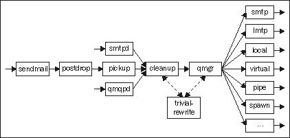

# 第二章。 设置后缀

**邮件传输代理**(**MTA**)可能是邮件系统中最重要的部分。 它负责从 Internet 或您自己的用户接收消息，并尽其所能确保消息到达它们的目的地—用户的其他邮件服务器或邮箱。

本书选择 Postfix 作为邮件转递代理。 Postfix 有一个大的特性集，它有一个优秀的安全跟踪记录，它是快速的，易于配置，并在积极的开发。

本书假设您正在运行 Postfix 2.0 或更高版本。 Postfix 的任何特定于 2.0 以后版本的特性或行为都将被注意到。

# 后缀介绍

第一部分简要介绍了 Postfix，它是如何工作的，并描述了如何控制它的行为。

## 什么是后缀

**Postfix**是 IBM 研究人员 Wietse Venema 开发的模块化邮件传输代理。 它是一个自由软件，并于 1998 年以**VMailer**的名字首次公开发布。 它是用**C**编写的，目前由大约 105,000 行代码(不包括注释)组成，这使得它相当小。 它可以在 UNIX 和 Linux 的大多数非历史变体上工作。

作为一个纯粹的邮件传输代理，Postfix 不提供任何允许用户通过**POP 或 IMAP**协议收集邮件的服务。 这个任务必须由其他软件来完成。 本书中讨论的便于从主机检索邮件的软件是**Courier IMAP。**

Postfix 的所有官方文档、源代码和第三方软件的链接以及非常活跃的邮件列表的存档都可以在 Postfix 的网站[http://www.postfix.org/上找到。](http://www.postfix.org/.)

## 后缀架构:概述

本节将描述 Postfix 邮件传输代理的不同部分，并解释当您通过系统发送消息时实际发生的事情。 虽然这可能不是您读过的最令人兴奋的文章，但是如果您希望成功地管理 Postfix 服务器，了解 Postfix 如何工作的基本知识是必不可少的。

Postfix 被划分为许多单独的**守护进程**，或相互通信的后台进程。 守护进程有不同的职责区域，可能在不同的安全上下文中运行，并且可能对创建的与它们类型相同的进程的数量有不同的规则。 所有守护进程都是根据需要创建的，并且由一个母守护进程 `master`监督。 有些守护进程很少或从未重新启动，但大多数守护进程在服务了一定数量的可配置请求之后，或者在空闲一段可配置的时间之后，会自杀。 下图显示消息如何通过 Postfix 系统，并可用于伴随其后的文本。 实线表示消息内容的路径，虚线表示其他形式的通信。



这里不会描述所有 Postfix 守护进程，只会描述重要的。 可以在[http://www.postfix.org/OVERVIEW.html](http://www.postfix.org/OVERVIEW.html)的*后缀架构概述*文档中找到所有守护进程的完整的纲要。

### 新消息到达

新消息可以通过三种方式到达 Postfix 系统。 当然，最常见的方式是通过**简单邮件传输协议**(**SMTP**)。 负责通过 SMTP 接收消息的守护进程被命名为 `smtpd`。 不常见的**QMQP 提交协议**，在 Daniel J. Bernstein 的 MTA**qmail**中引入， `qmqpd`守护进程也支持该协议。 然而，本书将不讨论 QMQP。

消息到达的第三种方式是通过 `sendmail`程序的本地提交。 这是提交来自运行在 UNIX 主机上的程序和脚本的邮件消息的标准方法。 Postfix 提供了一个 `sendmail`程序，在大多数方面与 sendmail 邮件传输代理([http://www.sendmail.org/](http://www.sendmail.org/))的 `sendmail`程序兼容。 许多 UNIX 邮件用户代理(如 mail、Pine 和 Mutt)以及 webmail 软件(如 SquirrelMail 和 IMP)都使用 `sendmail`接口来提交新消息，尽管一些软件提供了通过 SMTP 提交消息的选项。

`sendmail`程序将消息传递给**postdrop**程序，该程序将消息文件放在 Postfix `queue`目录中的 `maildrop`目录中。 `pickup`守护进程等待消息到达 `maildrop`目录，并将它们传递给 `cleanup`守护进程。 从那里开始， `sendmail-`提交的消息与通过 SMTP 或 QMQP 提交的消息遵循相同的道路。 即使当前机器上没有运行 Postfix，也可以通过 `sendmail`提交消息。 当 Postfix 下次启动时， `pickup`将发现排队的消息文件并进行处理。

当 `smtpd, qmqpd`或 `pickup`接收到一条新消息时，它将其交给 `cleanup`守护进程。 这个守护进程对消息的大小进行限制，对用户配置的任何内容限制进行操作，根据配置的要求重写发送方和/或接收方地址，添加缺少的任何必需的头，并执行一些其他操作。 `cleanup`守护进程使用 `trivial-rewrite`守护进程进行一些地址重写操作。 完成其业务后， `cleanup`将队列文件放入传入队列并通知队列管理器。

### 调度消息传递

队列管理器， `qmgr`负责调度消息的传递。 为了决定应该如何将消息传递给每个接收者(即传递方法和下一个目的地)， `qmgr`从 `trivial-rewrite`获得帮助。 队列管理器从 `master`守护进程请求传递代理进程，并收集传递结果。

从 `cleanup`守护进程移交消息开始，队列管理器负责所有消息，直到这些消息从队列中删除。 删除可能是因为它们已经成功地传递给所有收件人，也可能是因为它们在队列中待了太长时间，以致 Postfix 决定它们不能传递。 默认情况下，消息将在队列中最多保留 5 天。 队列管理器调用 `bounce`守护进程向发送方发送一条 `bounce`消息。

队列管理器为不同的目的使用许多目录。 将监视传入队列的新消息，下一站是**活动队列**。 活动队列包含已准备好交付并等待分派到交付代理的消息。 如果传递尝试失败，则将消息移动到**延迟队列**。 该队列将被定期扫描，并且，如果是重试传递消息的时候，该消息的队列文件将被移回活动队列中。 扫描队列时是否应该重新尝试传递消息取决于两个因素:从消息到达后经过了多少时间，以及设置重试间隔的最小和最大时间间隔的两个配置参数。

除了这些队列之外，还有一个名为**hold**的专用队列。 该队列包含系统管理员使用 `postsuper`命令保持的消息。 Postfix 不会碰这些消息，直到它们被相同的命令取下。 hold 队列可用于暂时停止某些消息的传递，例如，因为它们很大，需要在非高峰时间传递，或者因为它们被认为是可疑的，需要在允许传递之前进行检查。

在*QSHAPE_README*文档([http://www.postfix.org/QSHAPE_README.html](http://www.postfix.org/QSHAPE_README.html))中详细描述了 Postfix 使用的不同队列。 本文还介绍了与 Postfix 一起提供的脚本 `qshape`，该脚本分析队列的内容，并帮助您识别瓶颈。 【5】

### 消息传递

Postfix 附带了许多传递代理，用于使用各种方式和协议传递消息。 传递代理程序是在消息离开系统之前接触它们的最后一个守护进程。

Postfix SMTP 客户端 `smtp`(不要与 SMTP 服务器 `smtpd`混淆)用于通过 SMTP 协议向其他主机发送消息。 它非常类似于通过**本地邮件传输协议**(**LMTP**)传递消息的 LMTP 客户端 `lmtp`。 作为一种网络协议，LMTP 非常类似于 SMTP，但是 SMTP 用于在 mta 之间传输消息，LMTP 用于将消息最终传递到邮件存储区，用户可以从邮件存储区访问这些消息。

本地传递代理 `local`将消息传递给系统上具有正常帐号的用户。 它支持简单邮件列表或角色地址的别名以及 `.forward`文件，以便用户自己可以设置转发他们的消息。

如果您有虚拟邮箱用户—系统上没有真实帐户(例如 shell 帐户)的用户，那么他们的消息将通过 `virtual`Postfix 守护进程交付。

如果 Postfix 的标准传递代理还不够，您可以编写自己的传递代理，并让 Postfix 对某些(或所有)消息调用它。 在这种情况下,您可以使用 `pipe`守护进程的消息正文给你投递代理通过标准输入流,或者您可以使用 `spawn`守护进程,如果你想写一个投递代理接受消息通过一些网络协议。

### 配套项目

Postfix 包含许多支持程序，您可以使用它们来控制、测试和调试您的 Postfix 系统。 这个列表并不是详尽无遗的，只给出了每个程序的简要描述，但其中一些程序将在本章后面使用。 结识他们是一个好主意，这样你至少知道他们可以帮助你解决什么样的问题。

<colgroup><col style="text-align: left"> <col style="text-align: left"></colgroup> 
| 

程序

 | 

描述

 |
| --- | --- |
| `mailq` | 查看后缀队列的当前内容。 输出包括每条消息的大小、到达时间、发送地址和接收地址/地址。 在内部， `mailq`只调用 `postqueue`命令，其存在只是为了向后兼容 `sendmail`邮件传输代理。 |
| `newaliases` | 使用 `postalias`命令重新生成所有本地别名文件。 本地别名将在*虚拟别名域和*节中介绍。 |
| `postalias` | 重新生成单个别名文件或查询别名查找表。 |
| `postcat` | 显示驻留在后缀队列中的二进制队列文件的内容。 |
| `postconf` | 显示 Postfix 配置参数的当前值或默认值。 还可以修改主配置文件，这在脚本中是有用的。 |
| `postfix` | 启动、停止或重新启动 Postfix，或重新加载其配置。 还可以用于检查队列目录和其他一些很少使用的管理任务的完整性。 |
| `postmap` | 重新构建用于表查找的索引数据库文件或查询任何查找表。 带有 postmap 的*故障诊断一节讨论了如何使用它来调试 Postfix 设置。* |
| `postqueue` | 除了执行 `mailq`程序的工作外， `postqueue`还可以用来刷新队列。 刷新队列意味着将延迟队列中的所有消息移动到活动队列中。 这对于安排即时消息传递可能很有用，但要小心。 如果您的服务器负载很重且性能很差，那么刷新队列只会使情况变得更糟。 同样出于兼容性的原因， `sendmail`程序也可以用来刷新队列。 |
| `postsuper` | 允许您对已排队的消息采取操作，例如删除或重新排队。 它还可以对队列目录执行结构检查，并修复队列文件名称错误等问题。 例如，如果从备份中移动或恢复了整个队列目录，则需要进行这种检查。 |

# 安装和基本配置

在本节中，我们将了解如何获取和安装 Postfix，以及如何进行基本的配置更改。 在本节结束时，您将能够使用 Postfix 发送和接收电子邮件消息。

## 选择后缀版本

Postfix 的开发有两个独立的分支——官方版本和实验版本。 官方版本有时被称为稳定版本，但这多少有些误导，因为它暗示了实验版本是不稳定的。 事实并非如此。 这个实验版本用于引入所有新的 Postfix 特性。 当特性及其接口(例如，它们的配置参数)的实现足够稳定时，它们将被引入官方版本。 通常，对官方版本所做的唯一更改是 bug 修复和可移植性问题的修复。

实验版本在生产环境中是可用的，但是代码当然没有经过太多的测试，并且配置参数及其语义在不同版本之间可能会发生变化。 如果您运行实验版本，则更有可能遇到 bug 和其他稳定版本不应该出现的异常。 另一方面，您可以在使用稳定版本的用户之前访问新特性。 如果您选择使用实验版本，那么您应该从源代码构建并安装 Postfix，而不是使用某些包管理系统(比如 rpm)。 这将允许您轻松地为新发现的问题应用任何补丁。

实验版本有一个版本号，该版本号表示即将发布的正式版本号和实验版本的发布日期。 例如，在撰写当前官方版本时，当前的正式版本是 2.6.3，而当前的实验版本是 2.7-20090807。

## 从包中安装

大多数 Linux 发行版都将 Postfix 作为一个包，可以很容易地安装。 您最好使用发行版的软件包，除非您习惯于从源代码构建软件，并在必要时调试可能发生的任何构建问题。 大多数包都预先构建了一些额外的特性，否则就需要更复杂的构建过程。

因为有许多不同的打包系统，所以本书将不介绍安装 Postfix 包的实际过程。 有关详细信息，请参阅软件包管理系统的文档。

### 提示

对于允许同时安装多个邮件传输代理的发行版的用户，有一个警告:如果您正在安装 Postfix 以取代另一个邮件传输代理，那么您应该确保先前的软件已正确地从系统中删除。 可能所有的邮件传输代理提供一个 `sendmail`程序,安装这个文件名称,如 `sendmail.postfix`,和一个符号链接点从 `sendmail`到 `sendmail.postfix`之类的邮件传输代理 `sendmail`项目选择是最主要的。 如果这个符号链接不指向 Postfix 的 `sendmail`程序，那么当您试图发送消息时可能会感到惊讶。

## 从源代码安装

从原始源代码安装 Postfix 并不是很困难，它使您能够运行您想要的任何版本，而不仅仅是您的 Linux 发行版的包维护人员所选择的版本。 Postfix 的源代码可以从 Postfix 主网站[http://www.postfix.org/download.html](http://www.postfix.org/download.html)的多个镜像中下载。

一旦你已经下载并打开归档在合适的目录(例如)`/usr/local/src`,你会注意到后缀构建系统不使用 GNU autotools,因此没有 `configure`脚本,通常发现在打开源代码归档文件的根目录。 Postfix 构建系统将自动处理这一步。 如果您想在一些非标准的位置安装 Postfix，不要担心，稍后您将有机会设置各种安装目录。

如果您需要启用非标准特性，比如对 MySQL 或 LDAP 查找的支持，您必须告知构建系统这一点，以及在哪里可以找到每个特性的库和头文件。 关于每个非标准功能的详细说明和详细说明，请查阅每个非标准功能的 `README`文件。 例如，在 `README_FILES/MYSQL_README`中找到的 MySQL 指令告诉你在构建 Postfix 时运行以下命令来启用 MySQL 支持:

```sh
$ make -f Makefile.init makefiles \ 'CCARGS=-DHAS_MYSQL -I/usr/local/mysql/include' \ 'AUXLIBS=-L/usr/local/mysql/lib -lmysqlclient -lz -lm'

```

调整 MySQL 头文件和共享库在系统中的路径。 您必须安装 MySQL 的开发头文件和库。 根据您的 Linux 发行版，这些可能必须单独安装。

如果需要多个额外特性，则必须将 `README`文件中给出的命令组合起来。 做这件事时要密切注意。 所有的引号、等号和空格都必须在正确的位置。 变量 `CCARGS`和 `AUXLIBS`必须只设置一次，因此组合多个配置命令的一般形式是:

```sh
$ make -f Makefile.init makefiles \ 'CCARGS=<feature 1 CCARGS setting> <feature 2 CCARGS setting>' \ 'AUXLIBS=<feature 1 AUXLIBS setting> <feature 2 AUXLIBS setting>'

```

在此之后，您就可以使用下面的命令来构建 Postfix:

```sh
$ make

```

当构建完成后(希望没有错误)，就可以创建一个用户和一些组，Postfix 可以为它的许多守护进程使用这些组。 首先添加两组—— `postfix`和 `postdrop`。 例如，您可以使用 Linux 发行版中可能提供的 `groupadd`工具。

```sh
$ groupadd postfix 
$ groupadd postdrop

```

通过检查 `/etc/group`的内容来验证这一点。 现在它应该包含类似这样的行:

```sh
postfix:x:123:
postdrop:x:321:

```

下一步是创建一个名为 `postfix`的用户。 该用户既不需要 shell 访问，也不需要有效的主目录。 这个新用户的主组应该是新创建的 `postfix`组。 下面是如何使用 `useradd`工具:

```sh
$ useradd -c postfix -d /tmp -g postfix -s /bin/false postfix

```

同样，通过检查 `/etc/passwd:`的内容来验证

```sh
postfix:x:12345:123:postfix:/tmp:/bin/false

```

下一个也是最后一个步骤是安装新构建的 Postfix。 如果您是第一次安装 Postfix 在这个特定的 Linux 安装，运行以下命令:

```sh
$ make install

```

这个命令将指导您完成一个交互式的安装过程，在这个过程中您可以选择各种安装目录和文件位置。

如果您正在从以前的版本升级 Postfix，运行以下命令代替:

```sh
$ make upgrade

```

好吧! Postfix 现在已经安装在您的系统上，您很快就可以使用它了。

为了确保 Postfix 在系统引导时启动，需要一些额外的措施。 大多数 Linux 系统都有一个 `SysV-style init`，因此您需要构建一个 `init`脚本，并在运行级目录中建立适当的链接。

## 后缀配置

与大多数 UNIX 软件一样，Postfix 从存储在 `/etc`目录或其子目录中的文本文件中读取配置。 后缀配置文件通常存储在 `/etc/postfix`中，但是您可以配置后缀以使用任何其他目录。 Postfix 使用两个主要的配置文件 `master.cf`和 `main.cf`，以及您自己设置的任何辅助文件。

在更改这些文件之后，必须重新加载 Postfix。 这可以通过启动 Postfix 的同一个程序来实现，可以通过 `init`脚本或者通过发行版提供的其他一些服务管理工具来实现。

```sh
postfix reload
/etc/init.d/postfix reload
/etc/rc.d/init.d/postfix reload

```

### 注意事项

**更改**后需要重新启动后缀

如果修改了 `inet_interfaces`参数，则重新加载是不够的。 Postfix 必须停止并重新启动，以使更改生效。 对于 Postfix 2.2 中引入的 `inet_protocols`参数也是如此。

### main.cf

您将最频繁编辑的文件是 `main.cf`。 这个文件定义了控制 Postfix 守护进程行为的参数。 每一行有以下形式:

```sh
parameter = value

```

这仅仅意味着将内容 `value`分配给名为 `parameter`的配置参数。 一个参数在 `main.cf`中只能指定一次。 如果在 `main.cf`中错误地在不同的地方给相同的参数提供不同的内容，最后一个出现的将是 Postfix 使用的那个。 除此之外，参数在 `main.cf`中列出的顺序是无关紧要的。 然而，在参数内容中，关键字的顺序可能很重要。 例如，以下两个参数设置不一定相等:

```sh
parameter = A, B
parameter = B, A

```

如果在 `main.cf`中没有指定参数的值，Postfix 将使用默认值。 大多数参数的默认值是在源代码中硬连接的，但是一些默认值是在构建时确定的，还有一些是在运行时确定的。

可以将 `main.cf`中的行以 `#`开头标记为注释。

```sh
# These two lines are comments. They can be used to temporarily
# disable parameters, or to explain the configuration.
mydomain = example.com
mydestination = $mydomain, localhost

```

这个简短的例子还展示了如何在设置参数值时插入另一个参数的当前值; 只需直接键入一个美元符号，后面跟着您希望获得其值的参数名称。 前一个代码片段的最后一行相当于以下内容:

```sh
mydestination = example.com, localhost

```

有时将所有内容都放在一条线上并不方便。 通过以空格开始一行，可以告诉 Postfix 该行是前一行的延续。 例如，以下两个是等价的:

```sh
smtpd_recipient_restrictions = permit_mynetworks, reject
smtpd_recipient_restrictions =
permit_mynetworks,
reject

```

从 Postfix 2.1 开始， `main.cf`配置文件的格式记录在 `postconf(5)`手册页面中，该手册还描述了所有可用的配置参数。 手册页面可以从[http://www.postfix.org/postconf.5.html](http://www.postfix.org/postconf.5.html)在线查看。

`postconf`程序对于检查 `main.cf`参数的当前值和默认值非常有用。 以一个或多个参数名作为选项启动程序，它将报告 Postfix 将使用的值。 如果您使用 `-d`选项， `postconf`将报告您列出的参数的默认值。

例如，下面是如何比较 `mydestination`的当前值和它的默认值:

```sh
$ postconf mydestination
mydestination = $mydomain, localhost.$mydomain
$ postconf -d mydestination
mydestination = $myhostname, localhost.$mydomain, localhost

```

使用这种方法通常比在 `main.cf`中查找或在一个巨大的手动页面中查找默认值要快。 它还揭示了 Postfix 认为参数具有的实际值，从而更容易发现输入错误。

除了显示 `main.cf`配置参数外， `postconf`程序还可以为您编辑 `main.cf`。 如果您想在脚本中自动化配置更改，这特别有用。 这是通过期望跟随一个或多个参数赋值的 `-e`选项完成的。

```sh
$ postconf relay_domains
relay_domains =
$ postconf -e relay_domains=example.com
$ postconf relay_domains
relay_domains = example.com

```

### master.cf

`master.cf`文件配置前面讨论过的 Postfix 主守护进程。 对于大多数简单的 Postfix 设置， `master.cf`根本不需要修改。

`master.cf`中的每一行都定义了某个程序执行的服务。 例如，接收和处理 SMTP 连接的守护进程 `smtpd`是一个服务。 向本地用户传递消息的程序 `local`是另一种服务。 除了 Postfix 一开始就定义的 15 - 20 个服务之外，您还可以添加自己的服务。

`master.cf`中的第五列控制每个服务是否应该在 `chroot`环境中运行。 `chroot`是一个 UNIX 特性，它改变了文件系统的根目录，使得即使一个正在运行的进程被具有根权限的邪恶势力破坏了，也无法访问新的根目录之外的文件。 Postfix 的源代码发行版在默认情况下完全禁用 `chroot`，但是一些 Linux 发行版启用了它。 尽管 `chroot`是一个安全特性，可以作为一个额外的安全网非常有用，但它使 Postfix 更难维护，除非系统的其余部分得到严格保护，否则它或多或少是无用的。

在 Postfix 2.2 及以后版本中， `master.cf`配置文件的格式记录在 `master(5)`手册页中。 在早期版本中，大部分信息可以在 `master.cf`文件本身的注释中找到。

### 查找表

有些信息不能方便地用 `main.cf`或 `master.cf`表示。 Postfix 的查找表概念允许将信息存储在外部文件、关系数据库或 LDAP 目录中。

对于 Postfix，查找表是一个抽象实体，它将一个字符串(**查找键**映射到另一个字符串(**查找结果**。 那些对数学比较敏感的人可能会把它看作一个函数或(键、值)元组的集合，程序员可能会把它看作一个哈希表。 基本上，它的功能就像一本电话簿; 你查找一个名字，得到一个电话号码或地址。

Postfix 支持许多不同类型的查找表。 其中一些被称为*索引*，这意味着 `postmap`命令用于将用户写入的输入文件编译为 Postfix 读取的二进制格式。 这样做是出于性能考虑，并允许表包含数万甚至数十万个条目，而不影响性能。 这意味着您需要记住在编辑文件后使用 `postmap`。

下表描述了最重要的查询表类型:

<colgroup><col style="text-align: left"> <col style="text-align: left"></colgroup> 
| 

类型

 | 

描述

 |
| --- | --- |
| `cdb` | 使用 CDB 库的索引映射类型。 对于大量的条目来说非常快。 Postfix 2.2 及以上版本支持。 |
| `cidr` | 允许使用 CIDR 表示法查找 IP 地址。 支持 Postfix 2.1 及以上版本。 |
| `dbm` | DBM 是一种经典的 UNIX 索引数据库格式，在 Linux 上也可用，但是不提倡使用它，因为它使用两个文件来表示数据库。 这增加了不一致的风险，因为这两个文件不能自动更新。 使用哈希或 cdb 代替。 |
| `hash` | 这种索引查找表类型可能是最常用的，它利用了 Berkeley DB 库。 |
| `ldap` | LDAP 目录经常用于企业和大学环境中存储用户数据库。 微软的活动目录也可以通过 LDAP 访问，简化了 Postfix 在异构环境中的使用。 |
| `mysql` | 它支持著名的 MySQL 关系数据库引擎，允许您进行几乎任何类型的 SQL 查询。 |
| `pcre` | 允许将查找的字符串与正则表达式列表进行匹配，其中第一个匹配表达式获胜。 使用广泛使用的**Perl 兼容正则表达式**(**PCRE**)库。 |
| `pgsql` | 还支持 PostgreSQL 关系数据库引擎。 |
| `proxy` | 代理类型是一种特殊的查找表类型，用于包装其他查找表。 当从具有高进程数的服务中使用查找表时，这对于减少并发连接的数量非常有用。 例如，从 SMTP 服务器访问 LDAP 目录可能会导致 LDAP 服务器中的最大连接数达到峰值，但通过代理查找表访问 LDAP 目录将降低并发性。 |
| `regexp` | 类似于 `pcre`的工作方式，但不依赖于 PCRE 库。 支持的正则表达式语法有限，性能可能比 `pcre`差。 如果可能，选择 `pcre`而不是 `regexp`。 |
| `static` | 该类型是一种特殊用途的类型，无论查找的是什么，它总是返回一个给定的字符串。 如果 Postfix 期望查找表引用而不是固定字符串，但您确实希望指定固定字符串，则可以使用此方法。 |

您可以为任何目的使用任何类型的查找表; Postfix 不施加任何限制，除非出于安全考虑，在某些情况下需要禁用正则表达式表的某些特性。 也就是说，并不是所有的查找表类型都适用于每个用途。

Postfix 总是支持许多查找表类型，但其中一些类型是可选的，需要支持将其编译为 Postfix。 许多 Linux 厂商提供了额外的包，您可以通过安装这些包来获得，例如 LDAP 支持。 要找出您的 Postfix 安装支持哪些查找表类型，请使用 `postconf`命令。

```sh
$ postconf -m
static
cidr
nis
regexp
environ
proxy
btree
unix
hash
pcre
ldap
sdbm

```

在大多数情况下，简单索引查找表类型是最方便的。 索引查寻表不过是一个文本文件，可以使用您喜欢的文本编辑器进行编辑。 每一行的第一部分，直到第一个空格或制表符，将被视为查找键，该行的其余部分将被视为相应的值。

```sh
key value

```

索引查寻表类型的一个可能缺点是，当您更新表时，您必须记住运行 `postmap`。 使用 `postmap`更新索引文件后，不必重新加载或重新启动 Postfix。 Postfix 将发现更新的文件本身，并根据需要重新启动它的守护进程。

查找表的主题本身就可以占整整一章的篇幅，因此本节只讨论它们。 我们将在本章后面的几个地方使用查找表，例如，当我们设置垃圾邮件控制策略时。

更详细的讨论查找表和所有可用的查找表的列表类型,看到 `DATABASE_README`([http://www.postfix.org/DATABASE_README.html](http://www.postfix.org/DATABASE_README.html))和文档使用的手册页的一些更复杂的查找表类型。

## 正在运行 Postfix

现在您已经安装了 Postfix，让我们进行一些基本的配置更改，启动它，并对它进行测试。 如果您从一个包中安装了 Postfix，那么您可能已经回答了一些配置问题，并且已经为您启动了 Postfix。

### 域名和主机名

在开始 Postfix 之前，让我们回顾一下 `main.cf`中的一些基本设置。 第一个涉及到您的域名和您的邮件主机的名称。 `mydomain`参数应该设置为您的主要 Internet 域。 如果您运行的 Example Inc.具有域`http://www.example.com/`，那么以下设置将是合理的:

```sh
mydomain = example.com

```

`mydomain`的值将影响 Postfix 如何转换不完全限定的主机名。 这意味着在发送方和接收方地址等地方遇到的所有纯主机名都将被限定为该域—在本例中，主机名(如 `jeeves`)将被转换为 `jeeves.example.com`。 我们还将使用前面描述的 `$parameter`表示法在其他参数中引用 `mydomain`。 注意，可以通过将 `append_dot_mydomain`参数设置为 `NO`来禁用附加 `mydomain`的特性，并且一些 Linux 发行版在默认情况下进行了此修改。 一般情况下，该值应该保留为 `YES`。

一个相关的参数是 `myhostname`，它顺便告诉 Postfix 机器的主机名。 当 Postfix SMTP 服务器向客户端问候以及 SMTP 客户端向服务器发送 HELLO 时，主机名是其中的一个默认值。 Postfix 通常能够自己确定这一点，但有时需要重写它。 使用 `postconf`命令查看当前值是否正常。

```sh
$ postconf myhostname
myhostname = jeeves

```

是的，这个看起来不错。 注意，这个主机名不是完全限定的，所以在不同地方使用的实际主机名将包括 `mydomain`。

与 `mydomain`相关的参数为 `myorigin`。 此参数指定应用于限定根本没有域部分的电子邮件地址的域。 这可能看起来很不规则，但实际上很常见。 在默认情况下，通过 `sendmail`程序提交的消息将获得当前用户名作为发送地址，而且由于用户名没有域，在消息传递到任何地方之前，用户名将符合 `myorigin`。 缺省情况下， `myorigin`设置为与 `myhostname`相同的值。

```sh
$ postconf -d myorigin
myorigin = $myhostname

```

这应该没问题，但您可能希望将其设置为 `mydomain`。

```sh
myorigin = $mydomain

```

我们要注意的下一个参数是 `mydestination`。 这个参数非常重要，因为它告诉 Postfix 哪些域被认为是本地的，也就是说，哪些域应该交付给这台机器上的 UNIX 帐户。 与 `mydomain`和 `myorigin, mydestination`不同的是， `mydomain`和 `myorigin, mydestination`可能包含由空格或逗号分隔的多个域。 通过在这里列出 `example.com`，Postfix 将接受寄给 `joe@example.com`的消息，并将它们传递给 UNIX 用户“joe”。 【5】

局部域的一个重要性质是它们都被认为是相等的。 如果 `example.com`和 `example.net`都在 `mydestination, joe@example.com`中列出，则等同于 `joe@example.net`。 如果在用户不相等的地方需要额外的域，即 `joe@example.com`和 `joe@example.net`应该导致不同的邮箱，则需要实现虚拟别名域，如*虚拟别名域*部分所述。

回到 Example Inc.，你会希望有 `example.com`列出在 `mydestination`，因为它是你的主要域名。 旧的领域 `example.net`也应该暂时工作，所以一个人也应该被包括在内。 此外，明智的做法是在 `mydestination`中列出 `myhostname`的值，并确保发送到 `localhost`的邮件得到正确的发送。 这会为 Example Inc.生成以下完整的本地域列表:

```sh
mydestination = $mydomain, example.net, $myhostname, localhost.$mydomain

```

那么，如果我们希望在本地传递到 `root@localhost`的消息，为什么要用 `localhost.$mydomain`而不是 `localhost`呢? 请记住， `mydomain`用于限定所有尚未完全限定的主机名(有人可能认为 `localhost`实际上已经是一个完全限定的主机名，但是 Postfix 不会对该主机名进行特殊处理)。 地址 `root@localhost`将被改写为 `root@localhost.example.com`，所以 `localhost.example.com`是我们要在 `mydestination.`中列出的

两个非常重要的 Postfix 参数 `mynetworks`和 `mynetworks_style`控制允许哪些主机使用您的服务器作为中继。 不正确的设置可能会让你的服务器被垃圾邮件发送者和喜欢，所以这是很重要的，你得到正确的。 默认情况下，您的服务器直接连接到的子网中的所有主机都将被允许访问。 这在大多数情况下应该是安全的。 这些参数和允许继电器接入的其他方法将在[第 5 章](05.html "Chapter 5. Securing Your Installation")中深入讨论。

### 通过 ISP 间接发送邮件

一些**Internet 服务提供商**(**ISP**)不允许其客户通过标准 SMTP 端口(`25`)直接访问远程邮件服务器。 相反，它们提供一个中继服务器，所有出站消息都必须经过它。 这种策略在住宅电缆或 DSL 连接中很常见，但一些提供商对商业级连接也有相同的策略。 如果是这种情况，您需要配置 Postfix 来通过 ISP 的中继服务器间接传递所有出站消息。 【5】

这是通过包含要使用的中继服务器的主机名或 IP 地址的 `relayhost`参数完成的。 允许采用以下形式:

```sh
relayhost = example.com
relayhost = [mail.example.com]
relayhost = [1.2.3.4]

```

第一个表单将导致 Postfix 对主机名执行 MX 查找，就像它对普通消息传递所做的那样。 在第二个示例中，将主机名括在方括号中可以避免 MX 查找。 在第三种情况下，指定 IP 地址时也需要方括号。

可以选择在主机名或地址后面加上 `:port`来指定一个可选的 TCP 端口。 注意，您不能指定多个主机名或地址来实现回退或负载平衡行为。 如果在无法访问正常中继服务器时需要回退主机，请查看 `fallback_relay`参数。 有关其他参数的更多信息，请参阅*其他有用配置参数*部分。

### 选择网络接口

参数 `inet_interfaces`决定 Postfix 用于侦听新连接和发送消息的网络接口。 如果您有多个网络接口，并且不希望 Postfix 使用所有网络接口，那么可以调整此参数以列出希望 Postfix 使用的接口的地址或主机名。

一些 Linux 发行版默认将 `inet_interfaces`设置为 `localhost`，这意味着 Postfix 将只监听 loopback 接口。 这至少对工作站有一定意义，但对于需要从外部主机接收消息的服务器来说，显然是完全不可用的。 如果 Linux 发行版的 Postfix 包具有此特性，只需删除或注释 `main.cf`中的 `inet_interfaces`行以禁用它。 然后，Postfix 将使用默认值 `all`，这当然意味着应该使用所有接口。 【5】

### 注意事项

更改 `inet_interfaces`需要重新启动 Postfix。 重新加载是不够的。

### 选择本地交付的邮箱格式

默认情况下，Postfix 将本地消息(在 `mydestination`中列出的域的消息)发送到 `mbox`格式的文件中。 邮箱的 `mbox`格式将邮箱的所有消息存储在单个文本文件中。 这些文件以用户命名，并进入由 `mail_spool_directory`指定的目录(通常为 `/var/mail`或 `/var/spool/mail`)。 如果用户希望使用其他邮箱来存储消息，那么这些文件将存储在用户的主目录中(通常在 `$HOME/mail`或 `$HOME/Mail`中)。 【显示】

`mbox`格式有一些缺陷，使其不受欢迎。 单文件格式使得删除消息的代价很高，因为必须完全重写整个文件，除非删除的消息是最后一个，在这种情况下，文件可以被截断。 当多个进程需要同时访问同一个邮箱时， `mbox`也会产生障碍，当用户在发送新邮件时使用 POP 服务器检索和删除消息时，就会发生这种情况。 这就要求使用某种排他锁定方法来避免并发访问，以免损坏文件。 这样的锁并不是一个大问题,如果所有的软件运行在同一台机器上,访问相同的本地文件系统,并同意使用锁定方法,但这是一个皇家痛苦如果邮箱需要通过网络访问通过网络文件系统(比如 NFS,可靠的文件锁定可能是一个问题。 最后，如果与磁盘配额一起使用， `mbox`会导致问题。 当邮箱被重写时，它将使用两倍于原来的存储空间。

为了避免这些问题， `qmail`、 `djbdns`等软件的作者 D. J. Bernstein 设计了邮箱的 `maildir`格式。 顾名思义， `maildir`使用目录和每个消息一个文件。 消息的删除总是非常快，但另一方面，扫描邮箱并生成所有消息列表可能需要更长的时间，因为必须打开和读取所有消息文件。 与 NFS 一起使用是安全的。 在 `maildir`传递格式中，用户的收件箱通常在 `$HOME/Maildir`中找到。

要配置 Postfix 将新消息发送到本地用户 `$HOME/Maildir`，设置 `home_mailbox`参数如下:

```sh
home_mailbox = Maildir/

```

注意行尾的斜杠; 它是很重要的! 后缀遵循许多其他程序使用的约定，即以斜杠结尾的邮箱位置表示 `maildir`。 如果省略斜杠，Postfix 将尝试将消息传递到 `mbox`文件 `$HOME/Maildir`。

当 Postfix 执行传递本身时， `home_mailbox`参数仅对本地域有效。 如果交付是由 Procmail 或 Maildrop 等其他交付代理进行的，则必须为 `maildir`交付配置该软件。

本书的其余部分假设您选择了 `maildir`交付方式。 稍后介绍的 IMAP/POP 服务器 Courier IMAP 根本不支持 `mbox`格式。 在 `mbox`和 `maildir`之间转换邮箱并不困难，所以如果您想稍后切换格式，这不会是一个问题。

### 错误报告

最后一步是确保 Postfix 和世界各地的实际人员可以作为邮政管理员通知您有关错误条件。 互联网标准要求所有域名都有一个邮政主管地址，但您不需要创建一个帐户与该名称。 相反，您可以使用 Postfix 的别名功能，将指向邮政主管地址的邮件重定向给您自己和任何其他管理邮件系统的人。 另外，您应该将消息重定向到根帐户。

别名将在*本地别名*部分进行更详细的讨论，但是现在应该执行这一步，所以我们将快速查看一下。 为了使 Postfix 重定向根的消息并接受发送到 postmaster 的消息，即使不存在这样的用户帐户，必须修改本地别名表。 配置参数 `alias_maps`控制定义此类映射的查找表的位置:

```sh
$ postconf alias_maps
alias_maps = hash:/etc/aliases

```

在这个特定的系统上，本地别名存储在文件 `/etc/aliases`中。 编辑该文件，使其包含类似以下两行:

```sh
postmaster: root
root: jack, jill

```

这意味着指向邮政局长的消息将被发送到根用户，而指向根用户的消息将被重定向到用户“jack”和“jill”。 保存文件并运行 `newaliases`命令，这样 Postfix 将获取对文件的更改。

### 注意事项

注意,别名查找 recursive-Postfix 不停止当 `postmaster`查找成功,它继续查找 `root`,最后 `jack`和 `jill. jack`和 `jill`可能没有别名的条目,在这种情况下后缀停止查找的递归。

Postfix 报告给邮政管理员的问题类型可以通过 `notify_classes`参数进行配置。 默认情况下，只报告诸如磁盘空间不足问题和软件问题等资源问题，但是您可以配置 Postfix 来报告更多类型的问题。 例如，您可能还想知道 SMTP 协议违反情况:

```sh
notify_classes = resource, software, protocol

```

当 Postfix 报告一个问题时，包含 SMTP 会话的副本。 这可能是一个有价值的调试帮助。

选择更广泛的错误报告而不是简洁的报告。 如果收到过多的错误报告，请查看是否可以使用交付代理或邮件客户端的过滤功能来删除您不感兴趣的错误报告。 由编写糟糕的垃圾邮件软件生成的传入垃圾邮件所违反的协议通常可以忽略，但如果您自己的计算机有一个行为糟糕，您将希望了解它。

### 其他有用的配置参数

除了到目前为止介绍的配置参数之外，还将提到一些其他有用的参数。 使用它们的默认值很可能会做得很好。 如果您想了解更多关于它们的信息，请查阅您的版本或 Postfix 附带的文档，或在[http://www.postfix.org/documentation.html](http://www.postfix.org/documentation.html)在线阅读文档。

<colgroup><col style="text-align: left"> <col style="text-align: left"></colgroup> 
| 

参数

 | 

描述

 |
| --- | --- |
| `always_bcc` | 将每个邮件的副本发送给指定的收件人。 这可以用于电子邮件存档。 如果您需要对复制哪些消息进行更细粒度的控制，请查看 `sender_bcc_maps`和 `recipient_bcc_maps`。 后两个参数要求后缀为 2.1 或更高版本。 |
| `defer_transports` | 包含应临时延迟交付的运输(或多或少的运输代理)的名称。 如果主目录的文件系统损坏或不可用，但系统的其余部分工作正常，则允许暂停本地消息传递。 |
| `delay_warning_time` | 默认情况下，如果消息在一段时间内无法传递，Postfix 不会发送警告。 将此参数设置为特定的持续时间，比如 `5h`为 5 小时，将导致 Postfix 为在此期间无法交付的每个消息发送单个警告消息。不过，需要注意的是:您的用户可能无法正确解释此警告消息。 尽管 Postfix 清楚地声明它只是一个警告，消息不需要重新发送，但许多用户不理解这一点，并重新发送他们延迟的消息。 |
| `mailbox_size_limit` | 此参数控制本地邮箱的最大大小或使用 `maildir`邮箱时邮件的最大大小。 现在，默认的 50mb 可能太低了，特别是当您使用默认的 `mbox`格式用于邮箱时。 |
| `maximal_queue_lifetime` | 指定 Postfix 在将失败的邮件返回给发件人之前重试发送的时间。 默认五天是合理的，如果没有充分的理由，不应该更改。 从 Postfix 2.1 开始，也有同样的 `bounce_queue_lifetime`，但是对于发送地址为空的弹回消息。 |
| `message_size_limit` | 此参数控制消息的最大大小。 默认值 10mb 是合理的(邮件不是大文件的最佳传输方法)，但可能需要进行调整。 请记住，消息仅使用 7 位发送，因此如果您希望允许 20 MB 的二进制文件，您必须添加大约 35%来补偿文件的 7 位编码的开销。 |
| `proxy_interfaces` | 如果您的服务器通过代理或 NAT 设备连接到 Internet，因此 Postfix 不能确定所有可用于到达服务器的网络地址，将这些地址添加到此参数。 |

### 启动 Postfix 并发送第一条消息

这些设置就绪后，就可以开始 Postfix 了。 使用以下 Postfix 命令来执行此操作:

```sh
$ postfix start
postfix/postfix-script: starting the Postfix mail system

```

要验证 Postfix 是否正在运行，请查看日志文件。 Postfix 通过标准的 `syslog`接口记录日志，而日志文件的确切位置取决于 `syslog`守护进程配置。 邮件日志通常被命名为 `/var/log/maillog, /var/log/mail.info`或类似的名称。 `syslog`守护进程的配置(通常可以在 `/etc/syslog.conf`中找到)包含详细信息。 这是在你开始 Postfix 后，你会在邮件日志的末尾发现的内容:

```sh
Jan 3 21:03:28 jeeves postfix/postfix-script: starting the Postfix mail system
Jan 3 21:03:29 jeeves postfix/master[22429]: daemon started -- version 2.1.5

```

Postfix 现在已经准备好接收和传递消息了。 要尝试它，请使用您最喜欢的邮件客户端并发送测试邮件给自己。 如果您的邮件客户端使用 SMTP，请记住重新配置它以使用您的服务器。

如果在尝试发送测试消息时收到来自邮件客户机的错误消息，请再次阅读日志。 它是否显示了来自运行邮件客户机的主机的连接的任何痕迹? 如果是，是否记录了任何错误消息? 要获得关于如何调试 Postfix 问题的提示，请参阅*排除 Postfix 问题*一节。

一旦您成功地发送了消息，您还需要检查它是否正确地传递了。 因为您还没有配置 POP 或 IMAP 服务器，所以这条路不是一个选项。 但是，如果您已经在服务器上安装了一个直接从文件系统(mail、Pine、Mutt 等等)读取邮件的邮件客户机，那么只要您的邮件客户机配置为在 Postfix 交付邮件时查找新消息的相同位置，那么就应该可以正常工作。 如果您选择了 `maildir`发送，那么您的邮件客户机的默认设置可能就不能使用了。

在任何情况下，都可以直接从文件系统读取邮箱。 在正常的 `mbox`下发中，邮箱文件与用户同名，并且位于 `mail_spool_directory`配置参数所指向的目录中。 通过 `maildir`传递，消息通常会在 `$HOME/Maildir/new`目录中其自己的文件中找到。

如果一切顺利，消息被送到了预期的地方。 无论您选择哪种传递方法，都要确保您知道传递的消息最终会到达哪里。 当您必须调试交付问题时，这些知识将是有价值的。

# 停止垃圾邮件和其他不需要的消息

本节将讨论 Postfix 提供的各种方法来帮助停止不需要的消息。 垃圾邮件或未经请求的商业电子邮件可能是电子邮件服务器管理员面临的最大问题，但也可能有其他类型的消息是不希望收到的。

Postfix 本身不能阻止所有的垃圾邮件，但它可以捕获许多垃圾邮件。 对于一些人来说，这可能足够了，但如果你需要对抗大量的垃圾邮件，你可能需要一个工具，如 SpamAssassin，在[第 8 章](08.html "Chapter 8. Busting Spam with SpamAssassin")中描述。 即使您使用 SpamAssassin, Postfix 自己的轻量级方法也可以通过在消息到达 SpamAssassin 之前拒绝它们来帮助减少服务器上的负载。

## Postfix 的反垃圾邮件方法概述

没有什么灵丹妙药可以阻止所有垃圾邮件，但是 Postfix 提供了许多方法，您可以使用它们来帮助解决这种情况:

*   **SMTP 限制:**SMTP 限制让你定义规则来控制邮件是否被 Postfix 接受。 这些规则不能考虑邮件的内容，而只考虑信封信息。 SMTP 限制不仅是阻止垃圾邮件的工具，而且是定义邮件系统使用策略的一般方法。
*   **DNS 阻止列表:**DNS 阻止列表是全球发布的阻止列表，包含已知的垃圾邮件发送者和其他可能的垃圾邮件来源的 IP 地址。 Postfix 允许您使用此信息拒绝消息。
*   **匹配的报头表达式:**可以通过正则表达式匹配报头字段和消息正文，允许您拒绝某些类型的电子邮件。
*   **队列后内容过滤:**Postfix 接收消息后，不会立即将其发送到目的地。 相反，它将被提供给内容过滤器，该过滤器可以对消息进行任何操作——删除它、扫描它的病毒、删除不需要的附件，等等。 内容过滤器负责将消息重新提交回 Postfix，然后将它们视为任何其他消息。
*   **队列前内容过滤:**队列后内容过滤的缺点是 Postfix 总是在消息发送到内容过滤器之前接受消息。 这意味着 Postfix 不能根据内容过滤器的判断拒绝消息。 队列前内容过滤器在 SMTP 会话期间接收消息，并可以选择拒绝它们。 因为每个开放的 SMTP 会话都需要一个队列前的内容过滤器连接，所以这种类型的内容过滤器很难在高流量站点上扩展，并且需要额外的容量来处理流量突发。 此特性需要 Postfix 2.1 或更高版本。
*   **Milters:**从 Postfix 2.3 开始，支持电子邮件内容检查的 Milter 插件协议。 Milters 是在 `sendmail`邮件传输代理中引入的，根据 DKIM 标准，有许多 Milters 可用于垃圾邮件保护、反病毒检查、消息真实性和签名。 第三方 Milters 可以从[http://www.milter.org/milters 下载。](http://www.milter.org/milters.)
*   **访问策略委托:**如果 SMTP 限制不够表达，您可以构建自己的访问策略服务器，Postfix 可以在每个 SMTP 会话期间联系它。 使用此工具，您可以强制执行几乎任何您想要的专门化策略，只要可以通过查看消息信封强制执行该策略。 访问策略服务器不会提供任何消息内容。 Postfix 附带了一个非常简单的策略守护进程来实现 greylisting，但是其他人已经创建了其他几个策略守护进程。 可以在[http://www.postfix.org/addon.html](http://www.postfix.org/addon.html)找到这些守护进程和其他 Postfix 插件软件的链接。

## 了解 SMTP 限制

Postfix 有一个简单但仍然富有表现力的表示法，用于定义将应用于通过 SMTP 到达的消息的规则。 例如，您可以表示一个策略来拒绝来自某些网络、使用特定主机名说 `HELO`的客户端或在 DNS 中没有反向记录的客户端(除非他们是您自己的客户端之一)发送的消息。

Postfix 定义了许多配置参数，每个参数都可以包含一系列限制。 每个限制列表可能包含零个或多个限制，并且每个限制在计算时可能返回或不返回某些东西。 就像在 Postfix 的其他一些地方一样，“第一场比赛获胜”的原则在这里也占据了主导地位。 这意味着将按照指定的顺序计算限制，并且第一个返回内容的限制将终止当前限制列表的计算。

在 SMTP 会话期间评估限制列表。 下表包含了 Postfix 使用的限制列表，并显示了它们在 SMTP 会话的哪个阶段被评估:

<colgroup><col style="text-align: left"> <col style="text-align: left"></colgroup> 
| 

参数

 | 

的评价

 |
| --- | --- |
| `smtpd_client_restrictions` | 直接连接。 |
| `smtpd_data_restrictions` | 当客户端发送 `DATA`命令时。 |
| `smtpd_end_of_data_restrictions` | 当客户端发送完完整的消息时。 这个限制列表在 Postfix 2.2 和更高版本中可用。 |
| `smtpd_etrn_restrictions` | 当客户端发送 `ETRN`命令时。 正常的 SMTP 会话中不使用此命令。 |
| `smtpd_helo_restrictions` | 当客户用 `HELO`或 `EHLO.`表示问候时 |
| `smtpd_recipient_restrictions` | 当客户端用 `RCPT TO`发送接收地址时。 |
| `smtpd_sender_restrictions` | 当客户端用 `MAIL FROM`发送发送地址时。 |

参数 `smtpd_delay_reject`的默认值是 `yes`，这意味着所有拒绝将被推迟到 `RCPT TO`之后。 这是因为一些客户端软件在 `RCPT TO`之前不喜欢被拒绝，所以它们会断开连接并再次尝试。 另一个很好的原因是延迟的拒绝让 Postfix 有机会记录更多的信息。 这使得管理员更容易确定消息是否被拒绝，即使它不应该被拒绝。

一个常见的误解是,只有限制收件人地址可以放在 `smtpd_recipient_restrictions`,只能放在限制发送方地址 `smtpd_sender_restrictions,and`等等,但由于 `smtpd_delay_reject`的默认值,这是不正确的。 限制列表的名称仅指示在 SMTP 会话的哪个阶段将应用所列出的限制。

让我们来看看 Postfix 默认施加了哪些限制。 我们可以使用 `postconf`命令检查最常用的限制列表的默认值。

```sh
$ postconf -d smtpd_client_restrictions smtpd_helo_restrictions \
smtpd_sender_restrictions smtpd_recipient_restrictions
smtpd_client_restrictions =
smtpd_helo_restrictions =
smtpd_sender_restrictions =
smtpd_recipient_restrictions = permit_mynetworks, reject_unauth_destination

```

这告诉我们，Postfix 在默认情况下没有任何客户机 `HELO`或发送方限制。 不过，它对接收方有两个限制。 第一个， `permit_mynetworks`，如果连接的客户端在 `mynetworks`指定的网络中，则允许当前的接收方。 正是这个限制使您自己的客户机能够进行中继访问。 如果连接的客户端不在 `mynetworks`范围内，则将评估限制列表中的下一项。 `reject_unauth_destination`将拒绝那些域名不是 Postfix 将接受邮件的域名之一的收件人。 换句话说， `reject_unauth_destination`拒绝接力尝试。 如果这里没有发生拒绝，那么就到达了限制列表的末尾。 如果发生这种情况，Postfix 将接受该消息。

一个限制列表中的 `permit`结果不会导致整个消息被接受。 只有相同列表中的其余限制将被绕过。 但对于返回 `reject`的限制则不是这样——该结果总是终止符，并停止对所有限制列表的求值。

有 50 多个标准 SMTP 限制可供选择，这里没有足够的空间来涵盖所有这些限制。 这个表将提供一些有用的限制。 其他的限制将在本章后面介绍。

<colgroup><col style="text-align: left"> <col style="text-align: left"></colgroup> 
| 

限制

 | 

描述

 |
| --- | --- |
| `permit_inet_interfaces` | 如果连接的客户端位于 `inet_interfaces`中列出的网络之一，则允许，该网络通常覆盖运行 Postfix 的服务器连接到的所有网络。 |
| `permit_mynetworks` | 如果连接的客户端列在 `mynetworks`中，则允许。 |
| `permit_sasl_authenticated` | 如果连接的客户端已经验证了自己，则允许。 (SMTP 身份验证将在[第 5 章](05.html "Chapter 5. Securing Your Installation")中介绍。) |
| `reject` | 无条件地拒绝这个请求。 |
| `reject_invalid_hostname` | 如果客户端给出的 `HELO/EHLO`主机名语法不正确，则拒绝。 |
| `reject_non_fqdn_hostname` | 如果客户端给出的 `HELO/EHLO`主机名不是完全限定的域名，则拒绝。 |
| `reject_non_fqdn_recipient` | 如果接收地址的域部分不是完全限定的域名，则拒绝。 |
| `reject_non_fqdn_sender` | 如果发送地址的域部分不是完全限定的域名，则拒绝。 |
| `reject_unauth_destination` | 拒绝请求，除非收件人域是 Postfix 服务器所在的域之一，或者由于某些原因，将接受邮件。 |
| `reject_unknown_client_hostname` | 如果无法确定连接客户端的主机名，则拒绝。 如果以下任何一个条件为真，就会发生这种情况:a)客户端的 IP 地址不能解析为主机名，即 PTR 查找失败。b)查找结果主机名的 A 记录失败。c)从 A 记录查找中获得的 IP 地址都与输入的 IP 地址不匹配。在后缀 2.3 之前，这个限制被命名为 `reject_unknown_client`。 |
| `reject_unknown_recipient_domain` | 如果接收地址的域部分在 DNS 中没有 A 或 MX 记录，则拒绝。 |
| `reject_unknown_reverse_client_hostname` | 如果连接的客户端的 IP 地址不能被解析为主机名，则拒绝，即 PTR 查找无法返回结果。 该特性在 Postfix 2.3 及更高版本中可用。 |
| `reject_unknown_sender_domain` | 如果发送地址的域部分在 DNS 中没有 A 或 MX 记录，则拒绝。 |
| `reject_unlisted_recipient` | 如果接收地址的域部分是由 Postfix 托管的域，并且完整地址不是有效的接收地址，则拒绝。 默认情况下，该限制在 `smtpd_recipient_restrictions`末尾隐式计算。 此行为由 `smtpd_reject_unlisted_recipient`参数控制。 通过使用 `reject_unlisted_recipient`，您可以更早地使限制生效。 此限制在 Postfix 2.1 及以后版本中可用。 以前版本的 Postfix 可以使用 `check_recipient_maps`参数。 |
| `reject_unlisted_sender` | 如果发送地址的域部分是由 Postfix 托管的域，并且完整地址不能作为接收地址，则拒绝。 此特性背后的思想是，没有理由接受已知发送方地址不正确的消息。 此限制在 Postfix 2.1 及以后版本中可用。 参见 `smtpd_reject_unlisted_sender`参数。 |

### 访问地图

除了已经讨论过的限制之外，Postfix 还定义了许多在访问映射中查找信息的限制。 **访问映射**是一个查找表，其中的内容会影响是否接受消息。 限制的名称控制将什么信息用作查找键。

例如， `check_client_access`限制在一个查找表中查找客户端 IP 地址和主机名，允许您，比如，禁止已知发送垃圾邮件的某些客户端。 除了限制名称之外，还需要声明查找表的类型和名称。

```sh
smtpd_client_restrictions =
check_client_access hash:/etc/postfix/client_access

```

虽然不是一个详尽的列表，但以下是使用访问映射的最重要的限制:

<colgroup><col style="text-align: left"> <col style="text-align: left"></colgroup> 
| 

限制的名字

 | 

查找关键

 |
| --- | --- |
| `check_client_access` | 客户端 IP 地址和主机名。 |
| `check_sender_access` | 发送方地址。 |
| `check_sender_mx_access` | 发件人域的邮件交换器的主机名，这是 MX 查找的结果。 这个特性是在 Postfix 2.1 中添加的。 |
| `check_sender_ns_access` | 发送方域的名称服务器的主机名，这是 NS 查找的结果。 这个特性是在 Postfix 2.1 中添加的。 |
| `check_recipient_access` | 收件人地址。 |
| `check_helo_access` | 主机名 `HELO/EHLO`。 |

对于除 `regexp`和 `pcre`以外的所有查找表类型，Postfix 对每个这些限制进行多次查找，这稍微取决于要查找的数据类型(例如电子邮件地址或主机名)。 这使得不精确的通配符匹配成为可能，例如匹配一个域中的所有电子邮件地址。

`check_client_access`,后缀使单独的客户机的 IP 地址,查找客户端主机名和 IP 地址的部分地区,后者使匹配整个 A - B -,或丙类网络(整整更好的粒度和 CIDR 标记使用 `cidr`查找表类型)。 对于地址为 1.2.3.4 且主机名为 `mail.example.com`的客户端，将尝试以下查找键，顺序如下:

*   mail.example.com
*   example.com
*   和
*   为 1.2.3.4
*   1.2.3
*   1.2
*   1

第 2 项和第 3 项假设使用了 `parent_domain_matches_subdomains`参数的默认值。 Postfix 作者已经指出这种行为在未来可能会改变。

对于查找键为电子邮件地址的限制，例如 `check_sender_access`，Postfix 将查找整个电子邮件地址，只查找域部分，然后是本地部分和@。 然后，电子邮件地址 `user@example.com`的完整查询列表变为:

1.  `user@example.com`
2.  `example.com`
3.  `com`
4.  `user@`

同样，第 2 项和第 3 项假设默认值为 `parent_domain_matches_subdomains`。

为了简洁起见，这些列表中省略了对包含收件人分隔符的 IPv6 地址和电子邮件地址的查找。

对于给定的查找键，可以识别以下结果(这也不是详尽的列表)。

<colgroup><col style="text-align: left"> <col style="text-align: left"></colgroup> 
| 

结果

 | 

描述

 |
| --- | --- |
| `OK` | 允许请求。 |
| `REJECT [optional text]` | 使用永久错误码和指定的错误消息或通用消息拒绝请求。 |
| `DUNNO` | 假装没有找到查找键，不要继续使用其他查找键。 例如，如果查找 `user@example.com`返回 `DUNNO`，那么 Postfix 将不会像正常情况那样查找 `example.com`或 `user@`。 |
| `DISCARD [optional text]` | 如果消息最终被接受，它将被丢弃而不被传递。 |
| `HOLD [optional text]` | 将消息放入保持队列中。 被保留的消息将不会被传递，并且可以用 `postcat`程序检查，然后释放或删除。 这可以用作隔离可能不需要的邮件的一种简单方法。 |
| `REDIRECT email address` | 丢弃所有当前的邮件接收方，只将邮件发送到指定的地址。 这个特性是在 Postfix 2.1 中添加的。 |
| `PREPEND header: text` | 向消息中添加一个额外的头。 这个特性是在 Postfix 2.1 中添加的。 |
| `WARN [optional text]` | 在日志文件中放置一条警告消息。 这个特性是在 Postfix 2.1 中添加的。 |
| `restriction, restriction, …` | 应用一个或多个限制并使用它们的结果。 这里只允许不引用任何查找表的简单限制，除非使用限制类。 这些内容在本书中没有涉及，但是您可以在[http://www.postfix.org/RESTRICTION_CLASS_README.html](http://www.postfix.org/RESTRICTION_CLASS_README.html)上的*RESTRICTION_CLASS_README*文档中了解到。 |

访问地图查找键和可能的结果值的完整文档可以在 `access(5)`手册页或[http://www.postfix.org/access.5.html](http://www.postfix.org/access.5.html)中找到。

### 访问地图示例

下面是一系列带有访问映射的示例，讨论如何单独使用访问映射，以及如何与其他限制一起使用访问映射，以形成具有相当表现力的策略:

```sh
smtpd_client_restrictions =
check_client_access hash:/etc/postfix/client_access

```

在第一个示例中，将根据 `hash-type`查找表 `/etc/postfix/client_access`进行查找。 这个文件不是由 Postfix 创建的，你可以给它取任何名字。 *查找表的部分中,我们回想一下, `hash-type`查找表只是文本文件的二进制文件(在本例中使用文件扩展名 `.db`)应由 `postmap`命令只要源文件发生变化。*

```sh
postmap hash:/etc/postfix/client_access

```

下面是一个示例 `client_access`文件:

```sh
# Block RFC 1918 networks
10 REJECT RFC 1918 address not allowed here
192.168 REJECT RFC 1918 address not allowed here
# Known spammers
12.34.56.78 REJECT
evil-spammer.example.com REJECT

```

这一切意味着什么? 前两个非注释行用于拒绝似乎从网络 `10.0.0.0/8`和 `192.168.0.0/16`连接的客户端。 这些都不是有效的 Internet 地址，因此没有合法的客户端将从这些地址连接。 拒绝将与错误信息 `RFC 1918`**地址不允许在这里**。 如果您自己的客户端有这样的 RFC 1918 地址，您需要在 `check_client_access`之前放置一个 `permit_mynetworks`限制。 否则你会拒绝你自己的客户。

```sh
smtpd_client_restrictions =
permit_mynetworks,
check_client_access hash:/etc/postfix/client_access

```

索引访问映射支持八字节边界上的网络块匹配，但不支持 CIDR 表示法(如 `10.0.0.0/8)`)。 如果您需要使用 CIDR 表示法指定网络块，请考虑在 Postfix 2.1 及以后版本中可用的 `CIDR`查找表类型。 早期版本可以使用 Rahul Dhesi 的 `cidr2access`([http://www.rahul.net/dhesi/software/cidr2access](http://www.rahul.net/dhesi/software/cidr2access))这样的脚本，将 CIDR 块扩展为索引访问映射可接受的符号。 【5】

注意注释是如何用于解释为何以及何时添加条目的。 如果不止一个人维护文件，这可能是有价值的。

最后几行用于匹配几个臭名昭著的垃圾邮件发送者(当然是虚构的)，并说明完整的 IP 地址和主机名在这里都是可以接受的。 这些拒绝将与一个通用的错误消息。

下面是另一个例子:

```sh
smtpd_sender_restrictions =
check_sender_access hash:/etc/postfix/sender_access

```

`/etc/postfix/sender_access:`内容

```sh
hotmail.com reject_unknown_client
example.com permit_mynetworks, reject

```

如果有人试图使用 `hotmail.com`发送地址发送消息，那么试图发送消息的客户端将受到 `reject_unknown_client`限制，您可能还记得，该限制拒绝在 IP 地址和主机名之间没有有效映射的客户端。

第二行示例了一个有用的策略，它允许来自您的网络的客户端在发送地址中使用您的域。

最后，如果你只在你的网络内部使用 Postfix，不需要允许其他任何人连接，以下两个限制强制执行这个策略:

```sh
smtpd_recipient_restrictions = permit_mynetworks, reject

```

### 实施新政策

在实现新策略时要小心。 Postfix 的一些限制对于一般使用来说过于严格，可能会拒绝大量的合法电子邮件。 对于计划实现的每个新限制，检查拒绝消息的条件，并尝试找出合法消息满足这些条件的情况。 为了帮助您确定一个限制是否可以安全使用，可以使用 `warn_if_reject`限制。 此限制影响限制列表中紧随其后的限制，如果下列限制应该导致拒绝，则它将转换为拒绝警告。 拒绝警告会在邮件日志中放置一行，但不会拒绝该消息。

例如,您可能希望评估 `reject_unknown_client`限制,因为你已经注意到,许多垃圾短信收到客户没有反向 DNS 指针,也就是说,没有从他们的 IP 地址映射到一个名称映射到 IP 地址。

这里有一种方法:

```sh
smtpd_client_restrictions = warn_if_reject reject_unknown_client

```

这将导致这样的日志消息:

```sh
Dec 31 16:39:31 jeeves postfix/smtpd[28478]: NOQUEUE: reject_warning: RCPT from unknown[222.101.15.127]: 450 Client host rejected: cannot find your hostname, [222.101.15.127]; from=<jdoe@example.com> to=<me@example.com> proto=SMTP helo=<222.101.15.127>

```

此日志消息包含关于消息信封的所有已知信息，这应该足以让您判断消息是否合法。 几天后，检查您的邮件日志，并尝试确定可能被拒绝的不需要的消息和可能被拒绝的合法消息之间的比例是否可以接受。

有许多垃圾邮件对策具有良好的准确性，其中一些在本书中涵盖。 未来还会出现其他垃圾邮件，这取决于垃圾邮件发送者的行为。 在发明自己的方法从少量的垃圾邮件中识别垃圾邮件挑选特征并得出这些特征是好的垃圾邮件指示器的结论时，要非常小心，这是危险的，可能会导致合法电子邮件的丢失。 明智地选择，避免准确性低的方法。 不要忘记检查合法电子邮件，以确保它们不具有与垃圾邮件相关联的特征。

## 使用 DNS 黑名单

自 1997 年以来，**域名系统**(**DNS**)已被用于拦截垃圾邮件。 方法,**以域名系统黑洞列表****DNSBL**或【显示】实时黑洞列表(**家庭成员),也称为【病人】**或**黑名单过滤清单**,使用 DNS 对某些客户发布信息或发件人域。 当客户端与您自己的邮件服务器联系时，您的服务器可以将客户端的 IP 地址或给定的发送地址与一个或多个 DNSBLs 域结合起来，并执行 DNS 查找。 如果 DNSBL 列出了该地址，则查找成功，您的服务器可能会选择，例如，拒绝客户端。 【t16.1】

例如，假设您配置了 Postfix 来使用广泛使用的 `zen.spamhaus.org`黑名单。 如果一个地址为 1.2.3.4 的客户端连接，Postfix 将在 DNS 中查找地址 `4.3.2.1.zen.spamhaus.org`的 a 记录。 如果存在这样的记录，Postfix 将不接受来自客户机的消息。

Postfix 支持三种类型的 DNSBL 查找—客户端主机地址、客户端主机名和发送方域。 每种查找类型都有自己的限制，它们都要求您在限制名称之后指定 DNSBL 域的名称。

<colgroup><col style="text-align: left"> <col style="text-align: left"> <col style="text-align: left"></colgroup> 
| 

DNSBL 类型

 | 

语法

 | 

描述

 |
| --- | --- | --- |
| 客户端主机地址 | `reject_rbl_client rbl_domain` | 找到正在连接的客户端的 IP 地址。 这是最原始也是最常见的 DNSBL 类型。 |
| 客户端主机名 | `reject_rhsbl_client rbl_domain` | 查找连接客户机的主机名。 |
| 发送方地址域 | `reject_rhsbl_sender rbl_domain` | 查找给定发送地址的域。 |

您可以随意列出多个 DNSBL 限制。 确保您使用了与 DNSBL 类型相对应的限制—使用 `reject_rbl_client`与发送地址域 DNSBL 没有意义。

下面的代码展示了一种配置 Postfix 使用 `zen.spamhaus.org`标准类型的 DNSBL 和 `dsn.rfc-ignorant.org`发送域-DNSBL 的方法:

```sh
smtpd_recipient_restrictions =
permit_mynetworks,
reject_unauth_destination,
reject_rbl_client relays.ordb.org,
reject_rhsbl_sender dsn.rfc-ignorant.org

```

注意这些限制是如何在 `permit_mynetworks`和 `reject_unauth_destination`之后列出的。 这是因为 DNSBL 查找相对昂贵，而且没有必要为您自己的客户机或可能被拒绝的客户机浪费时间进行此类查找。 为了避免不必要的延迟，请确保列出阻止大多数消息的 DNSBL，这是 DNSBL 限制中的第一项。

### 选择 DNS 黑名单

开始时，DNSBLs 只列出了**打开的中继**，即接收所有客户端到所有目的地的所有消息的 SMTP 服务器。 开放中继曾经是垃圾邮件的主要来源，但这在最近几年发生了变化。 今天，许多垃圾邮件是从被劫持的无辜和不知情的人的家庭电脑中发送的。

不同的黑名单列出和删除主机的策略不同。 自然，黑名单越大，您可能拒绝的合法消息就越多。 在开始使用特定的 DNSBL 来拒绝消息之前，您应该仔细检查这些策略，最好在不实际拒绝任何消息的情况下也试用它们一段时间。 `warn_if_reject`限制可以帮助您做到这一点。

黑名单对一些人很有用，它拒绝了大量的垃圾邮件，但没有合法的消息，对其他人来说可能没有什么价值，实际上可能拒绝了比垃圾邮件更多的合法消息。 在选择黑名单时要非常小心，避免盲目地复制别人所谓的好的 DNSBLs 集合。 另一个谨慎的理由是，DNSBLs 有时会停止服务，因为它们不断受到垃圾邮件发送者的攻击，并被迫关闭。 这在 2006 年发生在著名的 `relays.ordb.org`DNSBL 上。 被关闭的黑名单可能在一段时间后被重新配置为始终指示黑名单中列出的 IP 地址，也就是说，如果配置为使用该黑名单，您将拒绝所有邮件。

目前，与 `reject_rbl_client is`一起使用的可能是最好的通用 DNSBL，即 `zen.spamhaus.org`。 误报率，即被错误拒绝的真实电子邮件的比例，可以预期是非常低的，而捕获垃圾邮件的准确性仍然很高。 除非您有特殊需要，否则这可能是您需要使用的唯一的 DNSBL。

在实现任何 DNSBL 之前，确保您知道如何免除某些客户端或域的拒绝。 无论您选择使用哪种 DNSBL，您迟早都会遇到合法消息被阻止的情况。 当这种情况发生时，就太晚了，不能开始深入研究文档，试图找出可以对此做些什么。

这个问题的解决方案是在 DNSBL 限制之前有白名单访问映射。 您应该使用哪种类型的访问映射取决于 DNSBL 类型，但在大多数情况下， `check_client_access`将是合适的，尽管如果您使用 `reject_rhsbl_sender`， `check_sender_access`更合适。

继续前面的例子，这是你可以做的，以免除某些客户和发送地址拒绝任何以下限制:

```sh
smtpd_recipient_restrictions =
permit_mynetworks,
reject_unauth_destination,
check_client_access hash:/etc/postfix/rbl_client_exceptions,
check_sender_access hash:/etc/postfix/rhsbl_sender_exceptions,
reject_rbl_client zen.spamhaus.org,
reject_rhsbl_sender dsn.rfc-ignorant.org

```

`/etc/postfix/rbl_client_exceptions:`

```sh
# Added 2005-01-10 to avoid blocking legitimate mail. /jdoe
1.2.3.4 OK
example.net OK

```

`/etc/postfix/rhsbl_client_exceptions:`

```sh
mybusinesspartner.com OK

```

## 基于内容停止消息

通常，不查看内容就无法发现不需要的消息。 Postfix 提供了一些简单但仍然非常有用的工具。 其思想是，消息中的行与您提供的一组正则表达式进行匹配，如果匹配，将执行一个操作。 这被称为**头检查**或**体检查**，这取决于正在检查的消息的哪一部分。 大多数情况下，您使用头和正文检查来拒绝消息，但消息也可能被丢弃或重定向到另一个收件人。 头和体检查可以帮助您解决以下问题，所有这些问题将在以下部分进行讨论:

*   响应包含禁用文件名附件的消息
*   快速阻止大型病毒爆发
*   特定报头字段的自定义日志记录
*   删除某些消息标题

对正则表达式的介绍超出了本书的范围。 如果你没有知识,有很多正则表达式在网上资源和教程,例如[http://www.codeproject.com/KB/dotnet/regextutorial.aspx http://gnosis.cx/publish/programming/regular_expressions.html](http://gnosis.cx/publish/programming/regular_expressions.html)和。 如果你正在找一本关于这个主题的书，Jeffrey E. F. Friedl 的《掌握正则表达式》(O'Reilly, 2006)是相当全面的。

### 配置头和体检查

头部和主体检查的 `main.cf`参数 `body_checks, header_checks, mime_header_checks`和 `nested_header_checks`-可以包含一个或多个对正则表达式查找表(`regexp`或 `pcre`)的引用，在接收消息时将考虑这些引用。 从技术上讲，您可以使用任何其他查找表类型，但只有正则表达式表才是真正有用的。 以下参数用于消息的不同部分:

<colgroup><col style="text-align: left"> <col style="text-align: left"></colgroup> 
| 

参数

 | 

它所应用的部分信息

 |
| --- | --- |
| `body_checks` | 每个消息部分的主体。 |
| `header_checks` | 所有非 mime 顶级头文件。 |
| `mime_header_checks` | 在任何消息部分中找到的所有 MIME 头。 以下头文件被认为是 MIME 头文件:

*   内容描述
*   Content-Disposition
*   内容识别
*   Content-Transfer-Encoding
*   内容类型
*   MIME-Version

 |
| `nested_header_checks` | 附加到接收消息的消息中的所有非 mime 消息头。 |

这意味着对于每个标题行，将针对 `header_checks`中指定的查找表进行查找，消息体中的每一行将导致针对 `body_checks`中的查找表进行查找，以此类推。

正则表达式查找表的格式与普通索引表非常相似。 一个很大的区别是它们没有被索引，不应该通过 `postmap`程序运行。 Postfix 会在守护进程重新启动时再次读取正则表达式查找表，在很多情况下这已经足够了。 如果希望立即更新，则必须重新加载 Postfix。

正则表达式查找表并不专门用于头和体检查。 它们可以在 Postfix 需要查找表的任何地方使用。

用于头和体检查的查找表的右边可以包含许多前面描述的访问映射中允许的操作，但是只有一个操作 `IGNORE`在这里可用。 `IGNORE`操作只是从消息中删除匹配的行。

以下示例中的消息头被包装成多个物理行，在用作查找键之前将被连接在一起。

```sh
Received: by jeeves.example.com (Postfix, from userid 100)
id 2BB044302; Sat, 1 Jan 2005 20:29:43 +0100 (CET)

```

### 标题和正文检查示例

现在，让我们具体看看如何使用头和体检查。 除非特别说明，所有这些示例都可以同时使用 `regexp`和 `pcre`查找表类型。

许多计算机病毒通过电子邮件传播，大多数是通过附加在邮件上的程序或脚本传播的。 虽然对含有禁用文件名附件的消息的反应是一个迟钝和不精确的工具，但它是一个简单的方法来照顾这些不需要的消息，甚至在他们到达任何防病毒扫描仪之前。 通过避免大的开销扫描，您的服务器可以应对更大的病毒爆发。 没有一个完整的文件名列表可以被禁止，但是只要阻止 `.exe, .scr, .pif, .bat`，对大多数人来说，再多几个可能就足够了。 如果您的用户需要发送或接收带有这些文件名扩展名的文件，您可能需要稍微放宽策略。 要在 Postfix 中实现此功能，您需要识别附件的文件名在 Content-Disposition 或 Content-Type 头文件中。 这些是 MIME 头，因此表达式需要放在 `mime_header_checks`中。 在这个例子中，拒绝消息的文本指明了出错的文件名。 如果一个合法的邮件被拒绝，发件人将有希望能够解释错误消息并重新发送该消息。

```sh
/^Content-(Disposition|Type).*name\s*=\s*"?(.*\.(
ade|adp|bas|bat|chm|cmd|com|cpl|crt|dll|exe|hlp|hta|
inf|ins|isp|js|jse|lnk|mdb|mde|mdt|mdw|ms[cipt]|nws|
ops|pcd|pif|prf|reg|sc[frt]|sh[bsm]|swf|
vb[esx]?|vxd|ws[cfh]))(\?=)?"?\s*(;|$)/x
REJECT Attachment not allowed. Filename "$2" may not end with ".$3".

```

注意除了第一行之外的所有行都有缩进。 需要将这些行处理为单个行。 在这方面，查找表的工作方式与 `main.cf`和 `master.cf`配置文件相同。 `/x`修饰符将导致忽略所有空白。 这个表达式最初由 Russell Mosemann 构造，并由 Noel Jones 进一步改进，它需要一个 `pcre`查找表，但是可以使用 `regexp`重写该表达式。

`body_checks`可以是快速阻止大病毒爆发的有用工具。 以前的许多病毒爆发都具有某些特征，使它们很容易被阻止。 如果文件名阻塞不是一个选项，您可以尝试查找这些消息的惟一行并构造合适的表达式。

```sh
/^Hi! How are you=3F$/ REJECT SirCam virus detected.
/^ I don't bite, weah!$/ REJECT Bagle.H virus detected.

```

如果您不确定表达式是否太宽并捕获合法消息，您可以使用 `HOLD`或 `WARN`而不是 `REJECT. HOLD`将使消息处于暂停状态，允许您检查它们并释放或删除它们。 将接受消息但记录事件。

当一个新病毒刚刚开始传播，而你正在使用的杀毒软件还没有更新来捕获它时，这种阻止病毒的方法也很有用。

`WARN`操作还可以用于获取特定报头字段的自定义日志记录。

```sh
/^Subject: / WARN

```

在 `header_checks`中使用此表达式将导致所有主题标题被记录为类似于这样的警告消息:

```sh
Jan 2 00:59:51 jeeves postfix/cleanup[6715]: 6F8184302: warning:
header Subject: Re: Lunch? from local; from=<jack@example.com>
to=<jill@example.com>

```

有时，删除某些消息头是很有用的。 例如，一些提供 SMTP 客户端的编程库向所有发送的消息添加一个 X-Library 头。 显然，许多垃圾邮件发送者使用这些库，因此 SpamAssassin 对包含此头的消息给予相当高的分数。 如果您需要使用这样的库，并且您不能或不愿修改源代码以避免在一开始就添加头文件，那么 Postfix 可以帮助您删除它。 这个 `header_checks`表达式将删除通过 Postfix 传递的消息中的所有 `X-Library`头:

```sh
/^X-Library: / IGNORE

```

### 注意事项

消息头和正文检查是检查消息内容的简单而生硬的工具。 它们在很多方面都很有用，但不要试图过度使用它们来对付一般目的的垃圾邮件。 许多人试图不正确地使用这些工具，而本书将试图消除一些常见的误解。

头和体检查一次只检查一行，并且在不同的行之间不保持状态。 这意味着您不能拒绝在消息的一行中包含一个坏词，在消息的其他地方包含另一个坏词的消息。 不要被正则表达式查找表中允许的 `if...endif`结构所愚弄! 你不能这样使用它们:

```sh
if /^From: spammer@example\.com/
/^Subject: Best mortgage rates/ REJECT
endif

```

记住，每次查找一行。 显然，以 `From`开头的一行不可能以 `Subject`开头。

许多垃圾邮件的邮件正文采用**Base64**编码。 由于 Base64 的工作方式，一个单词有许多可能的 Base64 表示。 在将消息内容提供给消息头和消息体检查之前，Postfix 不执行任何解码。

这意味着使用 `body_checks`来阻止包含不良词汇的消息并不是普遍有效的。 如果 `body_checks`是您对抗垃圾邮件的唯一工具，那么您将每天花费几个小时来维护您的正则表达式，以便它们能够捕获当天的垃圾邮件，但您仍然无法获得较高的准确性。

消息头和正文检查适用于所有消息。 不能将特定的发送方或特定的客户端列入白名单。 如果您托管多个域，您可以通过运行多个 `cleanup`守护进程和多个 `smtpd`守护进程监听不同的 IP 地址来选择对您的托管域使用不同的头和体检查，或者您可以运行多个 Postfix 实例。 后者意味着您有多个队列目录和多个 Postfix 副本同时运行。 这对于一些复杂的设置是必需的，但实际上可以简化单个实例的设置。

您不能使用头和正文检查来检查不存在某些内容，因此您不能拒绝正文为空的消息或不包含秘密密码的消息。

在 `body_checks`中拥有大量的正则表达式不仅是维护的梦魇，还可能严重降低服务器的性能。 一个合理的配置不应该需要超过 10 20 个表达式。 如果有太多的表达式，Postfix 的 `cleanup`进程将占用大量的 CPU 时间。

# 虚拟别名域和本地别名

在本节中，将讨论 Postfix 用于地址重写的一些特性，以允许托管多个域和实现组地址(或分布列表)。

此外，本节还将介绍如何使用 Postfix 在 MySQL 数据库中查找信息。 本练习的目标是使用 MySQL 查找进行别名查找，但是您所获得的知识将适用于您可能希望同时使用 MySQL 和 Postfix 的所有其他情况。 假设您具有基本的 SQL 知识，并且能够设置和操作 MySQL 服务器。

## 虚拟别名域

正如前面所解释的，即使您可以有几个本地域(在 `mydestination`中列出了几个域)，它们始终是等效的—它们共享单个本地部分名称空间。 换句话说， `joe@localdomain1.com`等于 `joe@localdomain2.com`等于 `joe@localdomain3.com`。 显然，这还不够好。 为了承载具有不同局部名称空间的多个域，您需要虚拟别名域。

### 注意事项

虚拟别名域**是一个域，其中每个有效地址都映射到一个或多个其他电子邮件地址(可能在其他域中)。 将其与本地域进行比较，在本地域中，地址通常直接映射到 UNIX 系统帐户。 `joe@virtualdomain1`和 `joe@virtualdomain2`可以产生完全不同的邮箱。**

虚拟别名域有时被称为虚拟域，但为了避免与虚拟邮箱域混淆，虚拟邮箱域有时也被称为虚拟域，这里使用完整的术语。

为了展示虚拟别名域在 Postfix 中是如何工作的，让我们回到 Example Inc.的朋友那里，看看他们如何通过使用虚拟别名域来增强邮件系统。

### 多个虚拟别名域映射到一个本地域

Example Inc.的董事现在已经显著扩展了他们的业务，并希望为他们的分支机构拥有子域名，以避免在不同办公室的两个人共享相同的名称时发生名称冲突。 对于它们在伦敦、巴黎和柏林的办公室，它们希望分别使用域 `gb.example.com, fr.example.com`和 `de.example.com`。 它们有一个单一的 Postfix 服务器来接收所有消息。

Example Inc 问题的解决方案是让 `gb.example.com, fr.example.com`和 `de.example.com`都是虚拟别名域。 原来的 `example.com`域应该仍然是一个局部域。 后缀在 `virtual_alias_domains`参数中查找虚拟别名域。

```sh
virtual_alias_domains = gb.example.com, fr.example.com, de.example.com

```

确保您没有在 `mydestination`中列出任何这些域名。 下一步是告诉 Postfix 虚拟别名域中的哪些地址映射到 `example.com`域中的哪些地址。 这是通过在 `virtual_alias_maps`参数中指定一个或多个查找表来实现的。 对于初学者，Example Inc.将只使用一个简单的 `hash`类型的查找表。 当事情按照我们期望的那样工作时，它们将创建一个等效的配置，在 MySQL 数据库中查找数据。

```sh
virtual_alias_maps = hash:/etc/postfix/virtual

```

现在，Postfix 将使用他们放入 `/etc/postfix/virtual`中的虚拟别名。 虚拟别名查找表的格式非常简单; 收信人地址是查找键，而收信人地址应该改写的地址/地址是结果。

```sh
joe@gb.example.com joe1@example.com
joe@de.example.com joe2@example.com
jane@fr.example.com jane@example.com

```

在编辑完 `/etc/postfix/virtual`文件后，必须运行 `postmap`才能将文件转换为 `/etc/postfix/virtual.db`。

```sh
$ postmap /etc/postfix/virtual

```

虚拟别名查找表的格式请参见 `virtual(5)`手册。

在上面的示例中,所有消息 `joe@gb.example.com`将最终用户的邮箱“joe1”,所有消息 `joe@de.example.com`将会在用户的邮箱“joe2”,和所有消息 `jane@fr.example.com`将最终用户的邮箱“简”。 注意，引入虚拟别名域不会导致原始本地域停止接受消息。

Jane 和我们的两个 joe 也将收到发送到他们实际用户名 `example.com`的消息。 (joe1@example.com， `joe2@example.com`， `jane@example.com`)。 如果不希望这样，可以使用 `smtpd_recipient_restrictions`和 `check_recipient_access`拒绝向这些收件人发送消息的尝试。 将此限制添加到 `main.cf:`中的 `smtpd_recipient_restrictions`设置中(如果有的话)

```sh
smtpd_recipient_restrictions =
...
check_recipient_access hash:/etc/postfix/recipient_access
...

```

然后将以下内容放入 `/etc/postfix/recipient_access`，并在文件上运行 `postmap`:

```sh
example.com REJECT Email to this domain prohibited

```

### 一个虚拟别名域映射到多个本地域

在运行前面的设置一段时间后，Example Inc.的员工决定返回到旧的设置，为所有员工使用单个域。 可以通过在地址中包含用户的姓氏来解决名称冲突。 他们还希望每个分支机构都有一个邮件服务器，以避免用户访问他们的邮箱时出现延迟和网络负载。 所有伦敦用户的帐户都将驻留在伦敦服务器上，巴黎用户的帐户位于巴黎服务器上，柏林用户的帐户位于柏林服务器上。 这个问题让我们有机会研究使用虚拟别名域的不同方法。

这个设置的思想是， `example.com`将是虚拟域，每个 Postfix 服务器将有自己的本地域。 伦敦办公室的服务器将 `gb.example.com`列为本地域。 虚拟别名将用于从 `example.com`地址映射到特定于办公室的子域。 这种映射可以只在主服务器上进行，也可以在每个分支机构的服务器上进行。 拥有单个主服务器会带来在服务器之间同步数据的问题，但这个问题可以通过将数据存储在关系数据库中轻松解决。 如何使用 MySQL 进行别名查找将在本章后面的*介绍 MySQL 查找*一节中讨论。

要实现此功能，首先从 `mydestination`中删除 `example.com`，然后将其添加到 `virtual_alias_domains`中。 这需要在所有服务器上执行。 分支机构服务器—其中一个很容易成为主服务器—应该在 `mydestination`中列出它们自己的域(`gb.example.com`等等)。 不要忘记设置 DNS 服务器，以便将发送到分支机构域的消息路由到分支机构服务器。 最后，虚拟别名表应该是这样的:

```sh
joe.smith@example.com joe1@gb.example.com
joe.schmidt@example.com joe2@de.example.com
jane.doe@example.com jane@fr.example.com

```

这个问题说明了一个重要的问题; 虚拟别名表右边的 address/addresses 不一定是本地的。 任何域都可以放在那里。 这是主服务器收到一封到 `joe.smith@example.com:`的邮件时发生的情况。

1.  后缀在 `virtual_alias_domains`中查看 `example.com`是否为虚拟别名域，结果是肯定的。
2.  接下来，在 `virtual_alias_maps`中查找 `joe.smith@example.com`。 查找返回 `joe1@gb.example.com`。
3.  主服务器上的 Postfix 确定 `gb.example.com`不是它所托管的域，并使用 DNS 解析消息的目的地，最后将其发送到伦敦分支机构服务器。

### 组地址

第三个也是最后一个虚拟别名示例只说明虚拟别名表的右边可能包含几个地址，这些地址可能是其他别名的名称，而不是实际的帐户名称。

```sh
all@example.com managers@example.com,finance@example.com
managers@example.com joe.smith@example.com,joe.schmidt@example.com
finance@example.com jane.doe@example.com,jack.black@example.com

```

在本例中，发送给 `all@example.com`的消息将被发送给所有管理人员和所有财务人员，这依次意味着 Joe Smith、Joe Schmidt、Jane Doe 和 Jack Black。

让任何人向大型分发列表发送消息可能是不可取的。 幸运的是，可以使用 Postfix 的 SMTP 限制来限制对敏感地址的访问。 如果只允许您自己的用户( `mynetworks`内的客户机)向某个地址发送消息，解决方案非常简单。 在 `main.cf`中，使用 `check_recipient_access`限制禁止访问该地址，但使用 `permit_mynetworks`豁免您自己的客户端。

```sh
smtpd_recipient_restrictions =
permit_mynetworks,
check_recipient_access hash:/etc/postfix/restricted_recipients,
reject_unauth_destination

```

如果您已经在 `main.cf`中使用了 `smtpd_recipient_restrictions`，那么您将不得不修改该参数，而不仅仅是添加上面示例中列出的内容。 关键特性是在 `permit_mynetworks`限制之后列出 `check_recipient_access`限制。

`/etc/postfix/restricted_recipients:`内容

```sh
all@example.com REJECT

```

在更复杂的场景中，比如当您想要禁止除少数发送地址或客户端外的所有收件人地址时，您可能需要使用 Postfix 的限制类特性。 在 `RESTRICTION_CLASS_README`([http://www.postfix.org/RESTRICTION_CLASS_README.html](http://www.postfix.org/RESTRICTION_CLASS_README.html))中描述了它，并为这种特殊情况提供了一个示例。

### 介绍 MySQL 查找

如果您的组织很大，维护带有别名的平面文本文件可能会很乏味。 将数据存储在真实的数据库中有很多好处——许多用户可以同时编辑数据，用户自己可以通过 web 界面执行一些任务，数据可以通过网络轻松共享，等等。

Postfix 支持查找许多复杂的*查找表类型中的数据。 其中包括 MySQL、PostgreSQL 和 LDAP。 它之所以*复杂*，并不是因为它的设置非常困难，而是因为有更多的东西可能出错，而且简单的索引文件(`hash, dbm, btree, cdb`)更容易得到正确的结果。 如果您想用查找表解决问题，请始终从索引文件开始。 当您了解了这些东西的工作原理和工作方式后，请尝试将相同的想法转换为复杂的查找表类型。 【5】*

 *Postfix 不要求您遵循某些特定的数据库模式。 对于使用 MySQL 的每个查找表，您可以使用一个单独的配置，无论您选择使用什么模式(或多或少，当前版本的 Postfix 不完全允许任意 MySQL 查询)，都可以返回所需的结果。 每个配置都存储在一个单独的文件中，该文件可能具有限制性权限，因为它们包含数据库密码。 要使用 MySQL 查找虚拟别名，在 `main.cf`中设置如下:

```sh
virtual_alias_maps = mysql:/etc/postfix/mysql-virtual.cf

```

配置文件遵循与 `main.cf`相同的格式，并包含进行查找所需的所有信息——在本例中是虚拟别名查找。 下表描述了可以放入配置文件中的参数。 这些参数将用于构造 `SELECT`查询。 在 Postfix 2.1 及以后版本中，这些配置文件的格式可以在 `mysql_table(5)`手册页中找到。

<colgroup><col style="text-align: left"> <col style="text-align: left"></colgroup> 
| 

参数

 | 

描述

 |
| --- | --- |
| `hosts` | Postfix 将联系来执行查询的 MySQL 主机列表。 可以包含 IP 地址、主机名，或者在前缀为 `unix:`时，包含到本地 UNIX 域套接字的路径。 如果您指定多个主机，它们将以随机顺序尝试。 将首先尝试任何 UNIX 域套接字主机。 |
| `user` | 应该用来登录 MySQL 服务器的用户名。 |
| `password` | MySQL 服务器的登录密码。 |
| `dbname` | 要使用的数据库的名称。 |
| `select_field` | 将从中获取查找结果的列的名称。 |
| `table` | 将搜索数据的表。 |
| `where_field` | 将与查找键进行比较的表列。 |
| `additional_conditions` | 如果需要在构造的查询的末尾附加一些附加条件，可以将它们放在这里。 |
| `query` | 要执行的 SQL 查询，其中 `%s`是要查找的字符串的占位符。 该参数与 `select_field, table, where_field`、 `additional_conditions`互斥。 该参数在 Postfix 2.2 中被引入，是配置 MySQL 查询的推荐方式。 |

让我们从一个简单的例子开始。 您有一个包含两列的表别名—— `alias`和 `address`。 `alias`列是虚拟查找表的左边(带有虚拟别名域的地址)， `address`列是右边(新地址)。

```sh
mysql> SELECT * FROM aliases;
+---------------------+------------------+
| alias | address |
+---------------------+------------------+
| joe@gb.example.com | joe1@example.com |
| joe@de.example.com | joe2@example.com |
| jane@fr.example.com | jane@example.com |
+---------------------+------------------+
3 rows in set (0.00 sec)

```

以下简单的 SQL 查询是需要找出一个地址在一个虚拟域是否存在，并应该重写到一些其他地址:

```sh
SELECT address FROM aliases WHERE alias = 'lookup key'

```

将此转换为 Postfix MySQL 查找表配置，结果如下:

```sh
hosts = localhost
user = postfix
password = secret
dbname = mail
select_field = address
table = aliases
where_field = alias
additional_conditions =

```

另一种解决方案，使用 Postfix 2.2 的 `query`参数，看起来像这样:

```sh
hosts = localhost
user = postfix
password = secret
dbname = mail
query = SELECT address FROM aliases WHERE alias ='%s'

```

为了简洁起见，下面将省略示例配置中的 `hosts, user, password`和 `dbname`参数。

有时实际情况比这个简单的例子要复杂一些，所以我们将继续讨论一些更困难的问题。

参数 `select_field, table, where_field`和 `additional_conditions`实际上只是直接插入到下面的 `SELECT`查询模板中，以及查找字符串:

```sh
SELECT select_field FROM table WHERE where_field = 'lookup key' additional_conditions

```

这意味着 `select_field`不必是单个列; 它可以指定合并为一个值的多个列，并且 `table`可以是具有 `additional_conditions`中的连接条件的多个表。 例如，考虑这个稍微复杂一点的查询:

```sh
SELECT CONCAT(aliases.user, '@example.com') FROM aliases, domains
WHERE CONCAT(aliases.name, '@', domains.name) = 'lookup key'
AND aliases.domain = domains.id

```

执行它需要下列查找表配置:

```sh
select_field = CONCAT(aliases.user, '@example.com')
table = aliases, domains
where_field = CONCAT(aliases.name, '@', domains.name)
additional_conditions = AND aliases.domain = domains.id

```

或者，使用 `query`参数:

```sh
query = SELECT CONCAT(aliases.user, '@example.com')
FROM aliases, domains
WHERE CONCAT(aliases.name, '@', domains.name) = '%s'
AND aliases.domain = domains.id

```

在启用新的 MySQL 查找表配置之前，您应该确保它为所有查找键返回所需的结果。 这可以通过 `postmap`程序来完成，其过程在带有 postmap 的*查找表故障排除一节中进行了描述。*

## 本地别名

本地别名是虚拟别名的替代方案。 本地别名几乎以相同的方式工作，但它们只适用于本地域。 本地别名表还提供了一些额外的特性。 在第一次在*错误报告*部分开始后缀之前，我们简要地了解了本地别名。

本地别名的查找表在 `alias_maps`参数中指定。 这些查找表的格式与虚拟别名略有不同，其原因是为了与 `sendmail`邮件传输代理的文件格式保持兼容。 因此，您不应该使用 `postmap`命令来重新构建别名文件，而应该使用 `postalias`。 您可能还会发现 `newaliases`命令很方便。

许多人对两个相似的参数 `alias_maps`和 `alias_database`感到困惑。 两者之间的区别在于， `alias_maps`包含 Postfix 将用于执行本地别名重写的查找表，而 `alias_database`包含 `newaliases`命令在调用时将重新生成的查找表。 只有索引查找表(`hash, btree, dbm, cdb`)需要重新构建，所以在那里列出 MySQL 查找表是没有意义的。

通常，您会希望 `alias_maps`和 `alias_database`引用相同的查找表:

```sh
alias_maps = hash:/etc/aliases
alias_database = $alias_maps

```

与虚拟别名表相比，本地别名表中的查找键不包括域部分。 这些信息是无用的，因为所有本地域都具有相同的本地部件名称空间。 当索引文件用于本地别名时，查找键必须以冒号结束，例如如下所示:

```sh
$ cat /etc/aliases
postmaster: jack, jill
$ postalias /etc/aliases

```

假设 `myorigin`中的域是本地的，这将把指向任何本地域中的邮政主管地址的消息发送给两个用户 `jack`和 `jill`。 下一节解释为什么这个假设是重要的。

别名表的右边不一定要指向本地用户。 事实上，它们可以指向任何域中的任何有效地址。 本地别名表的格式请参见 `aliases(5)`手册。

### 命令下发

到目前为止，所有可以用本地别名完成的事情都可以用虚拟别名完成。 那用本地化名有什么用? 一个很大的区别是本地别名支持向命令传递消息。 这通常是邮件列表管理软件所需要的。 Postfix 通过在标准输入流上传递消息的内容将消息传递给命令。

要在传递消息时运行命令，使用以下语法:

```sh
mylist: |"/usr/local/mailman/bin/wrapper post mylist"

```

只有在命令中包含空格时才需要双引号，就像在本例中一样。

但是，如果您想在虚拟域上运行邮件列表呢? 您将不得不使用虚拟别名将虚拟域中的地址重写为本地别名。 假设您希望将发送到地址 `mylist@virtual.example.com`的消息发送到 `mylist`邮件列表，该列表通过命令传递接受消息。 要启用此功能，你需要一个虚拟别名，如下所示:

```sh
mylist@virtual.example.com mylist@localhost

```

注意程序将以什么用户的身份运行。 后缀通常使用别名文件的所有者，但如果所有者是根用户，则不使用。 在这种情况下，将使用 `default_privs`参数中的用户(通常是“nobody”)来运行程序。

如果您编写自己的程序，希望 Postfix 向其传递消息，请确保在发生错误时返回适当的退出状态。 Postfix 使用 `sysexits.h`中的错误状态常量来确定如果程序以非零状态退出时该做什么。 根据退出状态，Postfix 要么将消息返回给发送方，要么让它留在队列中，稍后重试传递。

## 常见陷阱

虚拟别名不仅适用于虚拟别名域，还适用于通过 Postfix 传递的所有消息。 不认识到这一点可能会导致意外。 例如,如果你的主机很多虚拟域别名 common-say 应该有一些别名, `root, postmaster`, `abuse`——你可能会使用一个正则表达式查找表(`regexp`或 `PCRE`),别名这些地址为你所有的虚拟域别名。

```sh
# Warning! Does not work!
/^abuse@/ abuse@example.com

```

不要这样做! 由于虚拟别名适用于所有消息，您或您的用户发送给的任何消息，例如 `abuse@aol.com`或 `abuse@mindspring.com`将被发送给您，而不是指定的收件人。

一个非常常见的陷阱是认为右侧的非限定地址隐式地指向本地用户。 例如， `joe`总是表示本地用户 joe。 这对于虚拟别名和本地别名来说都是不正确的。 回想一下本章开始时讨论的 `myorigin`参数。 就像在所有其他地方一样，Postfix 将用 `myorigin`限定纯用户名。 如果您的值 `myorigin`恰好是 `mydestination`中列出的一个本地域(很可能是这样)， `joe`将确实指向本地用户 joe。 为了避免意外，如果您在某个时候将 `myorigin`设置为非本地域，最好总是用本地域限定右侧地址。 由于 `localhost.$mydomain`几乎总是列在 `mydestination`中，所以 `localhost`可能是一个不错的人选。

```sh
postmaster@example.com jack@localhost, jill@localhost

```

## 其他地址改写机制

虚拟和本地别名并不是 Postfix 提供的唯一地址重写机制。 最值得注意的是，可以使用规范重写重写信封和标头中的发件人和/或收件人地址。 这种类型的重写由参数 `canonical_maps, sender_canonical_maps`和 `recipient_canonical_maps`提供，如果您不想公开用户的实际用户名，那么将发送地址(如 `joe@example.com`)重写为 `Joe.User@example.com`会很有用。

在[http://www.postfix.org/ADDRESS_REWRITING_README.html](http://www.postfix.org/ADDRESS_REWRITING_README.html)可用的*ADDRESS_REWRITING_README*中描述了 Postfix 如何重写地址以及重写的顺序。

# 处理后缀问题

Postfix 提供了许多工具来简化问题的解决。 在您的 Postfix 邮件系统中实现新功能时，请一步一步来。 你对自己所做的事情越不确定，你采取的步骤就应该越小。 如果你遇到了问题，你会更早地发现它们，并且更容易找出哪里出了问题。 当使用 MySQL 数据库实现复杂的查找表时尤其如此。

### 注意事项

如果您对复杂的查找表有一点不适应，那么永远不要同时引入一个新特性和一个复杂的查找表配置。 如果有东西坏了，你就很难找到从哪里开始。

在尝试新配置时，在配置完全测试完成之前保持谨慎是没有坏处的。 通过设置以下功能，所有永久性错误将变成临时错误:

```sh
soft_bounce = yes

```

这意味着任何被服务器拒绝的消息都将被重试传输，而 Postfix 将重试发送任何被远程服务器拒绝的消息。 在此设置生效后，密切监视日志并寻找看起来不正常的拒绝。 当您完成测试时，不要忘记关闭此功能!

## 读取和解释日志文件

排除 Postfix 问题的一个关键元素是能够读取和解释 Postfix 产生的日志消息。 因为它们是纯文本文件，每行只有一条日志消息，所以它们不需要任何特殊的程序来检查。 之前已经讨论过几次日志，但是本节将解释这些消息，并给出成功邮件传递和失败邮件传递的示例。 在阅读示例时，请参考*Postfix 体系结构:概述*一节中的图，并注意日志条目的顺序如何紧密地遵循邮件通过 Postfix 的路径。

Kyle Dent 的文章*在[http://www.onlamp.com/pub/a/onlamp/2004/01/22/postfix.html](http://www.onlamp.com/pub/a/onlamp/2004/01/22/postfix.html)中对 Postfix 日志的故障排除*也进行了讨论。

### 消息队列 ID

接收和处理的每个消息的一个重要属性是队列 ID。 **队列 ID**是一个十六进制数，长度不同，用来标识一条消息。 具有消息上下文的日志消息也将记录队列 ID。 如果您有队列 ID(日志文件的路径需要根据您的系统进行调整)，这使得您可以很容易地找到与某个消息相关的所有日志消息。

```sh
$ grep 92AFD4302 /var/log/maillog

```

队列 ID 是在 `cleanup`守护进程在 Postfix 队列目录之一创建队列文件时分配的。 队列文件将保留在系统中，直到所有接收方都被发送或消息过期，然后 `qmgr`守护进程将删除队列文件。 在最近的 Postfix 版本中，这个删除事件会被记录下来，我们将在示例中看到。

有时你会发现日志中没有队列 ID，而是有单词 `NOQUEUE`，就像我们之前看到的这个例子:

```sh
Dec 31 16:39:31 jeeves postfix/smtpd[28478]: NOQUEUE: reject_warning: RCPT from unknown[222.101.15.127]: 450 Client host rejected: cannot find your hostname, [222.101.15.127]; from=<jdoe@example.com> to=<me@example.com> proto=SMTP helo=<222.101.15.127>

```

原因是该消息还没有得到队列文件，因此还没有分配队列 ID。 队列文件由 `cleanup`守护进程在第一个接收者被接受时创建。 这有助于性能优化。

不要混淆队列 ID 和消息 ID。 后者包含在每个消息的 message - id 头中，通常由邮件客户端在将消息交给 Postfix 之前添加。 如果没有这样的报头字段，Postfix 的 `cleanup`守护进程将为您添加一个。 守护进程将始终记录接收到的消息的消息 ID。

```sh
Jan 5 23:49:13 jeeves postfix/cleanup[12547]: 92AFD4302:
message-id=<20041214021903.243BE2D4CF@mail.example.com>

```

message - id 头包含计算机的主机名，通常是当前日期和时间，对于每条消息它都是唯一的。 不要误以为队列 id 也是唯一的。 对于不同的消息，队列 id 可以而且将会被重用，理论上是每秒钟重用一次(但这必须是在异常繁忙的系统上)。

### SMTP 提交和本地发送

让我们从两个成功邮件事务的例子开始。 第一个示例显示了通过 SMTP 接收并传递到本地邮箱的消息，第二个示例将显示通过 SMTP 传递到外部邮箱的本地提交消息。

第一个示例显示了通过 SMTP 接收到消息并将其传递给本地用户后的日志内容。

```sh
Jan 5 23:49:13 jeeves postfix/smtpd[12546]:
connect from mail.example.com[1.2.3.4]

```

`smtpd`守护进程已经从客户端接收到一个连接。

```sh
Jan 5 23:49:13 jeeves postfix/smtpd[12546]: 92AFD4302:
client=mail.example.com[1.2.3.4]

```

Postfix 现在已接受此消息的第一个接收者，并从 `cleanup`守护进程请求队列文件。 这是该消息的第一个日志条目，其中包含队列 ID。

```sh
Jan 5 23:49:13 jeeves postfix/cleanup[12547]: 92AFD4302:
message-id=<20041214021903.243BE2D4CF@mail.example.com>

```

`cleanup`守护进程收到了来自 `smtpd`守护进程的全部消息，并记录了消息 ID。

```sh
Jan 5 23:49:13 jeeves postfix/smtpd[12546]:
disconnect from mail.example.com[1.2.3.4]

```

客户端与 SMTP 服务器断开连接。

```sh
Jan 5 23:49:13 jeeves postfix/qmgr[22431]: 92AFD4302:
from=<joe@example.com>, size=4258, nrcpt=1 (queue active)

```

消息已经进入活动队列，因此可以进行传递(除非队列是拥挤的，否则传递将或多或少立即启动)。 队列管理器记录发送方地址、以字节为单位的消息大小和接收方的总数。 报告的大小将略大于消息中的实际字节数和存储在磁盘上的消息的大小。 这是因为报告的大小是队列文件中消息内容记录的总大小，这会带来一些开销。

```sh
Jan 5 23:49:14 jeeves postfix/local[12653]: 3C21A4305:
to=<jack@example.net>, orig_to=<postmaster@example.net>,
relay=local, delay=0.1, delays=0.04/0.03/0/0.03, dsn=2.0.0,
status=sent (delivered to maildir)

```

日志含义本地下发代理成功将消息下发到本地用户 jack 的 `maildir`。 消息最初的地址是 `postmaster@example.net`，但是某些地址重写机制(通常是本地或虚拟别名)重写了接收地址。 最后，消息在接收后大约十分之一秒( `delay`关键字)被发送。

注意，当交付完成时将记录此消息。 如果传递代理在传递过程中调用另一个程序，并且该程序记录它自己的消息，这些消息将在传递完成消息之前结束在日志中。

每个接收方都会发出一条日志消息:

```sh
Jan 5 23:49:26 jeeves postfix/qmgr[22431]: 92AFD4302: removed

```

最后一条消息表示所有的接收方都已被传递，以便删除队列文件。

### 本地提交和 SMTP 发送

我们下一个例子与前一个例子有些相反。 这里，通过 `sendmail`命令提交的消息通过 SMTP 发送到另一台主机:

```sh
Jan 6 01:41:29 jeeves postfix/pickup[12659]:
CBA844305: uid=100 from=<jack>

```

已提交的消息已由 `pickup`守护进程处理。 消息是由用户 ID 为 `100`的用户提交的，发送者是不合格的地址 `jack:`

```sh
Jan 6 01:41:30 jeeves postfix/cleanup[13190]: CBA844305:
message-id=<20050106004129.CBA844305@example.net>

```

同样， `cleanup`守护进程已经读取了消息，并且记录了消息 ID:

```sh
Jan 6 01:41:30 jeeves postfix/qmgr[12661]: CBA844305:
from=<jack@example.net>, size=1309, nrcpt=1 (queue active)

```

请注意，以前不合格的发送地址现在已被重写为完全合格的地址，这可能是因为 `myorigin`参数等于 `example.net`。

```sh
Jan 6 01:41:31 jeeves postfix/smtp[13214]: CBA844305:
to=<joe@example.com>, relay=mail.example.com[1.2.3.4],
delay=1.3, delays=0.03/0.03/0.97/0.22, dsn=2.0.0,
status=sent (250 Ok: queued as DD8F02787)

```

日志含义通过 `mail.example.com`SMTP 中继成功发送消息给收件人 `joe@example.com`。 当接收消息时，远程服务器说:

**250 Ok: queue as DD8F02787**

现在我们知道了消息在另一端获得的队列 ID。 如果我们需要通过 `example.com`联系邮政局长，此信息可能很有用:

```sh
Jan 6 01:41:31 jeeves postfix/qmgr[12661]: CBA844305: removed

```

传递完成，队列文件删除。

希望您开始掌握为消息发出的日志条目的一般格式，因此下一个示例将只显示日志片段。

### SMTP 发送时出现连接问题

下面的示例显示了在 DNS 中设置多个主机来接收某个域的消息，但其中一些主机暂时不可达，导致 Postfix 在传递之前尝试一些主机时会发生什么情况。 我们只查看交付代理的日志:

```sh
Jan 2 14:19:46 poseidon postfix/smtp[998]: connect to
mx4.hotmail.com[65.54.190.230]: Connection timed out (port 25)
Jan 2 14:20:16 poseidon postfix/smtp[998]: connect to
mx1.hotmail.com[64.4.50.50]: Connection timed out (port 25)
Jan 2 14:20:46 poseidon postfix/smtp[998]: connect to
mx3.hotmail.com[64.4.50.179]: Connection timed out (port 25)
Jan 2 14:20:47 poseidon postfix/smtp[998]: 940C132ECE:
to=<postmaster@hotmail.com>, relay=mx4.hotmail.com[65.54.167.230],
delay=92, delays=92/0/0.27/0.28, dsn=2.0.0,
status=sent (250 <20050102131914.B7C4B32ECF@example.com> Queued mail for delivery)

```

显然，当 Postfix 尝试传递时，无法访问 `hotmail.com`的三个接收邮件主机。 请注意连接尝试是如何以 30 秒的间隔均匀地分布的。 这不是巧合; 控制 Postfix 等待连接的时间的参数 `smtp_connect_timeout`的默认值实际上是 30 秒。 这三个 30 秒的超时还解释了为什么最后一条消息记录的传递延迟为 92 秒。 另外请注意，Hotmail 提供给我们的接受消息不包含任何队列 ID，而是消息 ID——在 250 状态码之后的文本消息格式还没有标准化。

### 获取更详细的日志消息

在大多数情况下，Postfix 的默认日志记录足以解决问题，但有时需要更多的细节。 对于那些罕见的情况，您可以要求 Postfix 的守护进程通过确保它们至少有一个 `-v`启动选项来记录更详细的消息。 这是通过编辑 `master.cf`并将 `-v`添加到您希望从中获得更详细日志记录的守护进程的行尾来完成的。 例如，要从 SMTP 服务器 `smtpd`获取详细日志记录，请更改以下行:

```sh
smtp inet n - n - - smtpd

```

:

```sh
smtp inet n - n - - smtpd -v

```

根据您的配置，第一行看起来可能略有不同，但重要的部分是最后一列中的内容，即守护程序的名称。 在 SMTP 服务器的情况下，繁忙的服务器可能会产生大量的日志记录与此设置。 如果是这样，那么 `debug_peer_list`参数就可以派上用场了。

此参数接受一个或多个主机名或网络地址，将为其增加日志记录级别。 这只在存在网络对等体的情况下才有意义，比如 SMTP 服务器和 SMTP 客户端。

如果您在向特定的远程服务器(比如 `mail.example.com`)发送消息时遇到了问题，您可以设置以下规则:

```sh
debug_peer_list = mail.example.com

```

然后，当 Postfix 连接到特定的主机时，您可以查看增加的日志记录。 使用 `debug_peer_list`时，没有理由去碰 `master.cf`。

## 使用 Postmap 处理查找表故障

`postmap`命令不仅用于重建索引查找表，还可以使用它来查询查找表，以检查查找是否如您所期望的那样工作。 这对于正则表达式查找表和复杂的查找表类型(如 MySQL、LDAP 和 PostgreSQL)特别有用。 在 Postfix 中使用新的查找表之前，应该先用 `postmap`测试它们。 要使用 `postmap`执行查找，请使用 `-q`选项:

```sh
$ postmap -q postmaster@example.com mysql:/etc/postfix/ mysql-aliases.cf
jack@example.com

```

这将查询由 `/etc/postfix/mysql-aliases.cf`配置描述的 MySQL 查找表中字符串 `postmaster@example.com`，模拟通过 Postfix 进行虚拟别名查找。

您还可以检查命令的退出状态，以确定查找是否成功。 一如既往，零退出状态表示成功。 UNIX shell 将最后一个进程的退出状态保存在环境变量 `$?`中。 在运行 `postmap:`之后，可以使用 echo shell 命令查看 `$?`变量的内容。

```sh
$ postmap -q badaddress@example.com mysql:/etc/postfix/mysql-aliases.cf
$ echo $?
1

```

如果查找没有按照预期工作，您可以(就像使用 Postfix 守护进程一样)使用一个或多个 `-v`启动选项来增加消息的冗长性。

注意，postmap 执行原始*查询。 例如，如果您想知道 IP 地址 `1.2.3.4`是否匹配以下访问地图行:*

```sh
1.2.3 REJECT

```

您不能使用以下命令测试它:

```sh
$ postmap –q 1.2.3.4 hash:/etc/postfix/client_access

```

`postmap`命令不知道 Postfix 关于在 access map 上下文中如何匹配 IP 地址的规则，即使知道，它也无法知道 `1.2.3.4`是一个 IP 地址。

## 从 Postfix 邮件列表中获取帮助

Postfix 的邮件列表，称为 Postfix 用户，在遇到 Postfix 问题时是一个非常有价值的资源。 可以在[http://www.postfix.org/lists.html](http://www.postfix.org/lists.html)找到该列表档案的链接以及如何订阅的说明。

虽然名单上的人非常乐于助人，但他们希望你在寻求帮助之前做足功课。 这意味着您应该搜索列表归档，看看您的问题以前是否有人问过，最重要的是，您应该首先阅读文档。

当你问问题的时候，不要忘记陈述你想要达到的更大的目标。 这一点经常被遗忘，而且这个问题也太具体了。 了解全局不仅会更容易帮助你，而且还会揭示你所选择的解决方法是否完全错误。 但是，在你的描述中不要太冗长! 毕竟，阅读 postfix 用户列表的人也是人，他们确实会对过长的帖子感到厌倦。

因为他们是人类，他们也不是灵媒。 因此，一定要提供完整的配置和任何可能与您的问题相关的日志消息。 通过运行 `postconf -n`获取配置。 该命令将打印您在 `main.cf`中设置的所有参数的值。 不要张贴您的 `main.cf`的完整内容，或 `postconf`的输出(没有 `-n`)。 `master.cf`的内容很少需要。

# 总结

现在是总结本章所学内容的时候了。 我们首先快速了解了 Postfix 邮件传输代理的工作方式，然后了解了如何安装软件并准备基本配置。

然后，我们研究了各种阻止垃圾邮件和其他不受欢迎的消息的方法。 我们引入了虚拟别名域，以使您的邮件服务器完全能够托管多个域。 最后，我们了解了一些结构化技术，以帮助您分析和解决后缀问题。***